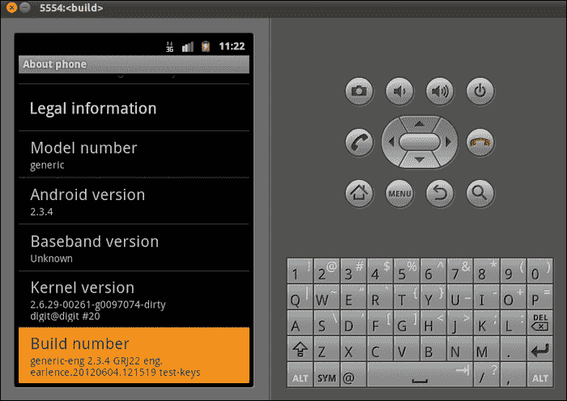
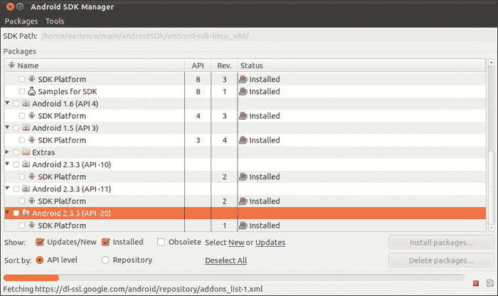

# 一、安卓系统开发即时指南

欢迎来到*即时安卓系统开发指南*。这本书将为你提供成为一名成功的安卓系统程序员所需的所有必要技能。我们将涵盖一系列主题，从构建源代码到展示真实的安卓手机。这本书假设了对安卓软件开发工具包的熟悉和理解。读者被要求实际执行每个食谱中的所有步骤，以更好地理解如何为安卓操作系统开发。

# 打造安卓(必知)

这个食谱设置了你的构建计算机，并指导你如何从头开始下载和构建安卓操作系统。

## 做好准备

您需要 Ubuntu 10.04 LTS 或更高版本(构建系统也支持 Mac OS X，但我们将在本书中使用 Ubuntu)。这是受支持的构建操作系统，也是您将从在线社区获得最多帮助的系统。在我的例子中，我使用了 Ubuntu 11.04，它也得到了相当好的支持。安卓代码文件大约需要 6 GB 的可用空间。对于完整的构建，您需要 25 GB 的可用空间。如果您在虚拟机中使用 Linux，请确保内存或交换大小至少为 16 GB，并且您有 30 GB 的磁盘空间来完成构建。

从安卓版本 2.3(姜饼)及更高版本开始，该系统只能在 64 位计算机上构建。如果你使用 Froyo(安卓 2.2)，使用 32 位机器仍然是可能的。但是，您仍然可以在 32 位计算机上构建更高的版本，方法是对构建脚本进行一些“黑客攻击”，我将在后面描述。

以下步骤概述了建立构建环境和编译安卓框架和内核所需的过程:

*   设置构建环境
*   下载安卓框架源码
*   构建安卓框架
*   构建自定义内核

一般来说，您的(Ubuntu Linux)构建计算机需要以下内容:

*   Git 1.7 或更新版本(Git 是一个源代码管理工具)，JDK 6 构建姜饼和更高版本，或者 JDK 5 构建 Froyo 和更旧版本
*   python 2.5–2.7
*   GNU Make 3.81–3.82

## 怎么做...

我们将首先在以下步骤的帮助下设置构建环境:

### 注

以下所有步骤都是针对 64 位 Ubuntu 的。

1.  通过执行以下命令安装所需的 JDK:

    ```java
    JDK6
    sudo add-apt-repository "deb http://archive.canonical.com/ lucid partner"
    sudo apt-get update
    sudo apt-get install sun-java6-jdk
    JDK5
    sudo add-apt-repository "deb http://archive.ubuntu.com/ubuntu hardy main multiverse"
    sudo add-apt-repository "deb http://archive.ubuntu.com/ubuntu hardy-updates main multiverse"
    sudo apt-get update
    sudo apt-get install sun-java5-jdk

    ```

2.  安装所需的库依赖项:

    ```java
    sudo apt-get install git-core gnupg flex bison gperf build-essential \
     zip curl zlib1g-dev libc6-dev lib32ncurses5-dev ia32-libs \ 
     x11proto-core-dev libx11-dev lib32readline5-dev lib32z-dev \ 
     libgl1-mesa-dev g++-multilib mingw32 tofrodos python-markdown \ 
     libxml2-utils xsltproc

    ```

3.  [可选]。在 Ubuntu 10.10 上，`libGL.so.1`和`libGL.so`之间没有创建符号链接，这有时会导致构建过程失败:

    ```java
    sudo ln -s /usr/lib32/mesa/libGL.so.1 /usr/lib32/mesa/libGL.so

    ```

4.  [可选]在 Ubuntu 11.10 上，需要一个额外的依赖:

    ```java
    sudo apt-get install libx11-dev:i386

    ```

5.  现在，我们将从谷歌的存储库中下载安卓源代码。
6.  Install repo. Make sure you have a `/bin` directory and that it exists in your `PATH` variable:

    ```java
    mkdir ~/bin 
    PATH=~/bin:$PATH 
    curl https://dl-ssl.google.com/dl/googlesource/git-repo/repo > ~/bin/repo 
    chmod a+x ~/bin/repo

    ```

    ### 注

    Repo 是一个 python 脚本，用于下载安卓源代码和其他任务。它被设计成在 GIT 之上工作。

7.  初始化回购。
8.  在这一步，你需要决定你想要下载的安卓源码的分支。如果你想使用 Gerrit，这是一个源代码审查工具，请确保你有一个谷歌邮件地址。repo 初始化时，系统会提示您使用此电子邮件地址。
9.  在本地计算机上创建一个工作目录。我们称之为`android_src` :

    ```java
    mkdir android_src
    cd android_src

    ```

10.  以下命令将初始化回购以下载“主”分支:

    ```java
    repo init -u https://android.googlesource.com/platform/manifest

    ```

11.  The following command will initialize repo to download the Gingerbread 2.3.4 branch:

    ```java
    repo init -u https://android.googlesource.com/platform/manifest -b android-2.3.4_r1

    ```

    `-b`开关用于指定您希望下载的分支。

12.  Once repo is configured, we are ready to obtain the source files. The format of the command is as follows:

    ```java
    repo sync -jX

    ```

    ### 注

    `-jX`可选，用于并行提取。

13.  The following command will sync all the necessary source files for the Android framework. Note that these steps are only to download the Android framework files. Kernel download is a separate process.

    ```java
    repo sync -j16

    ```

    ### 注

    源代码访问是匿名的，也就是说，你不需要在谷歌注册就可以下载源代码。服务器为每个访问源代码的 IP 地址分配一个固定的配额。这是为了防止服务器下载流量过大。如果您碰巧在 NAT 后面，并与其他人共享一个 IP 地址，而其他人也希望下载代码，您可能会遇到来自源代码服务器的错误消息，警告过度使用。在这种情况下，您可以使用经过身份验证的访问来解决这个问题。在这种方法中，您可以根据密码生成器系统生成的用户标识获得单独的配额。密码生成器和相关说明可在[https://android.googlesource.com/new-password](https://android.googlesource.com/new-password)获得。

14.  Once you have obtained a user ID/password and set up your system appropriately, you can force authentication by using the following command:

    ```java
    repo init -u https://android.googlesource.com/a/platform/manifest

    ```

    注意 URI 的`/a/`。这表示经过身份验证的访问。

    ### 注

    **代理发行**

    如果从代理服务器下载，请设置以下环境变量:

    `export HTTP_PROXY=http://<proxy_user_id>:<proxy_password>@<proxy_server>:<proxy_port>`

    `export HTTPS_PROXY=http://<proxy_user_id>:<proxy_password>@<proxy_server>:<proxy_port>`

接下来，我们描述构建安卓框架源代码所需的步骤:

1.  初始化终端环境。
2.  Certain build-time tools need to be included in your current terminal environment. So, navigate to your source directory:

    ```java
    cd android_src/
    source build/envsetup.sh

    ```

    可以为各种目标构建源。每个目标描述符都有`BUILD-BUILDTYPE`格式:

    *   `BUILD`:指某个设备的源代码的特定组合。例如，`full_maguro`瞄准 Galaxy Nexus，`generic`瞄准模拟器。
    *   `BUILDTYPE`:可以是以下三个值之一:
        *   `user`:适合生产版本
        *   `userdebug`:与`user`类似，在 ADB 中有根访问，更容易调试
        *   `eng`:仅开发构建
3.  We will be building for the emulator in our current example. Issue the following command to do so:

    ```java
    lunch full-eng

    ```

    为了实际构建代码，我们将使用`make`。格式如下:

    ```java
    make -jX

    ```

    其中`X`表示并行构建的数量。通常的规则是:`X`是 CPU 核心数+ 2。

    这是一个实验公式，读者应该可以随意用不同的值来测试。

4.  To build the code:

    ```java
    make -j6

    ```

    现在，我们必须等到建造完成。根据您系统的规格，这可能需要 20 分钟到 1 小时。在成功构建结束时，输出看起来类似于以下内容(请注意，这可能会因您的目标而异):

    ```java
    ...
    target Dex: SystemUI 
    Copying: out/target/common/obj/APPS/SystemUI_intermediates/noproguard.classes.dex 
    target Package: SystemUI (out/target/product/generic/obj/APPS/SystemUI_intermediates/package.apk) 
     'out/target/common/obj/APPS/SystemUI_intermediates//classes.dex' as 'classes.dex'... 
    Install: out/target/product/generic/system/app/SystemUI.apk 
    Finding NOTICE files: out/target/product/generic/obj/NOTICE_FILES/hash-timestamp 
    Combining NOTICE files: out/target/product/generic/obj/NOTICE.html 
    Target system fs image: out/target/product/generic/obj/PACKAGING/systemimage_intermediates/system.img 
    Install system fs image: out/target/product/generic/system.img 
    Installed file list: out/target/product/generic/installed-files.txt 
    DroidDoc took 440 sec. to write docs to out/target/common/docs/doc-comment-check 

    ```

    成功构建的更好检查是检查以下目录中新创建的文件。

    该构建在`android_src/out/target/product/<DEVICE>/`中生成了几个主文件，如下所示:

    *   `system.img`:系统镜像文件
    *   `boot.img`:包含内核
    *   `recovery.img`:包含设备恢复分区的代码

    在模拟器构建的情况下，前面的文件将出现在`android_src/out/target/product/generic/`处。

5.  Now, we can test our build simply by issuing the `emulator` command:

    ```java
    emulator

    ```

    这将启动一个安卓模拟器，如下面的截图所示，运行我们刚刚构建的代码:

    

    ### 注

    我们下载的代码包含每个受支持目标的预构建 Linux 内核。如果您只想更改框架文件，您可以使用预构建的内核，这些内核会自动包含在构建映像中。如果您要对内核进行特定的更改，您必须获得一个特定的内核并单独构建它(如下所示)，这将在后面解释:

    `Faster Builds – CCACHE`

    框架代码包含 C 语言和 Java 代码。大多数 C 语言代码都是作为在构建过程中构建的共享对象而存在的。如果您发出`make clean`命令，删除所有构建的代码(简单地删除构建输出目录也有同样的效果)，然后重建，这将花费大量的时间。如果没有对这些共享库进行任何更改，则可以通过`CCACHE`加快构建时间，这是一个编译器缓存。

6.  In the root of the source directory `android_src/`, use the following command:

    ```java
    export USE_CCACHE=1
    export CCACHE_DIR=<PATH_TO_YOUR_CCACHE_DIR>

    ```

    要设置缓存大小:

    ```java
    prebuilt/linux-x86/ccache/ccache -M 50G

    ```

    这将保留 50 GB 的缓存大小。

    要查看缓存在构建过程中的使用情况，请使用以下命令(导航到另一个终端中的源目录):

    ```java
    watch -n1 -d prebuilt/linux-x86/ccache/ccache -s

    ```

    在这一部分，我们将获取源代码并构建`goldfish`仿真器内核。为设备构建内核也是以类似的方式完成的。

    ### 注

    `goldfish`是为基于 Android QEMU 的仿真器修改的内核名称。

7.  Get the kernel sources:

    创建`android_src`的子目录:

    ```java
    mkdir kernel_code
    cd kernel_code
    git clone https://android.googlesource.com/kernel/goldfish.git
    git branch -r

    ```

    这会将`goldfish.git`克隆到名为`goldfish`的文件夹中(自动创建)，然后列出可用的远程分支。输出应该如下所示(这是在执行`git`分支后看到的):

    ```java
    origin/HEAD -> origin/master 
     origin/android-goldfish-2.6.29 
     origin/linux-goldfish-3.0-wip 
     origin/master

    ```

    这里，在下面的命令中，我们注意到`origin/android-goldfish-2.6.29`，这是我们希望获得的内核:

    ```java
    cd goldfish
    git checkout --track -b android-goldfish-2.6.29 origin/android-goldfish-2.6.29

    ```

这将获得内核代码:

1.  设置构建环境。
2.  我们需要通过更新系统`PATH`变量来初始化终端环境，以指向将用于编译 Linux 内核的交叉编译器。这个交叉编译器已经作为一个预构建的二进制文件与安卓框架一起发布了:来源:

    ```java
    export PATH=<PATH_TO_YOUR_ANDROID_SRC_DIR>/prebuilt/linux-x86/toolchain/arm-eabi-4.4.3/bin:$PATH

    ```

3.  Run an emulator (you may choose to run the emulator with the system image that we just built earlier. We need this to obtain the kernel configuration file. Instead of manually configuring it, we choose to pull the config file of a running kernel.

    ### 类型

    确保亚行仍在你的道路上。如果在构建框架代码后还没有关闭终端窗口，它将在你的`PATH`变量中，否则按顺序执行以下步骤。

    (请注意，您必须将目录更改为`ANDROID_SRC`才能执行以下命令)。

    ```java
    source build/envsetup.sh
    lunch full_eng
    adb pull /proc/config.gz
    gunzip config.gz 
    cp config .config

    ```

    前面的命令将正在运行的内核的配置复制到我们的内核构建树中。

4.  Start the compilation process:

    ```java
    export ARCH=arm
    export SUBARCH=arm 
    make

    ```

    如果出现以下情况:

    ```java
    Misc devices (MISC_DEVICES) [Y/n/?] y 
     Android pmem allocator (ANDROID_PMEM) [Y/n] y 
     Enclosure Services (ENCLOSURE_SERVICES) [N/y/?] n 
     Kernel Debugger Core (KERNEL_DEBUGGER_CORE) [N/y/?] n 
     UID based statistics tracking exported to /proc/uid_stat (UID_STAT) [N/y] n 
     Virtual Device for QEMU tracing (QEMU_TRACE) [Y/n/?] y 
     Virtual Device for QEMU pipes (QEMU_PIPE) [N/y/?] (NEW)

    ```

    输入`y`作为答案。这是构建所需的一些额外的安卓专用配置。

5.  Now we have to wait till the build is complete. The final lines of the build output should look like the following (note that this can change depending on your target):

    ```java
    ...
     LD      vmlinux 
     SYSMAP  System.map 
     SYSMAP  .tmp_System.map 
     OBJCOPY arch/arm/boot/Image 
     Kernel: arch/arm/boot/Image is ready 
     AS      arch/arm/boot/compressed/head.o 
     GZIP    arch/arm/boot/compressed/piggy.gz 
     AS      arch/arm/boot/compressed/piggy.o 
     CC      arch/arm/boot/compressed/misc.o 
     LD      arch/arm/boot/compressed/vmlinux 
     OBJCOPY arch/arm/boot/zImage 
     Kernel: arch/arm/boot/zImage is ready

    ```

    如最后一行所述，新的`zImage`在`arch/arm/boot/`内可用。

6.  为了测试它，我们用这个新构建的映像引导模拟器。
7.  将`zImage`复制到适当的目录。我刚刚复制到`android_src/` :

    ```java
    emulator -kernel zImage

    ```

8.  To verify that the emulator is indeed running our kernel, use the following command:

    ```java
    adb shell 
    # cat /proc/version 

    ```

    输出如下所示:

    ```java
    Linux version 2.6.29-gef9c64a (earlence@earlence-Satellite-L650) (gcc version 4.4.3 (GCC) ) #1 Mon Jun 4 16:35:00 CEST 2012

    ```

    这是我们的定制内核，因为我们观察了定制构建字符串(`earlence@earlence-Satellite-L650`)以及编译的时间。构建字符串将是您的计算机的名称。

9.  Once the emulator has booted up, you will see a window similar to the following:

    

以下是在 32 位系统上构建框架所需的步骤:

1.  Make the following simple changes to build Gingerbread on 32-bit Ubuntu. Note that these steps assume that you have set up the system for a Froyo build. Assuming a Froyo build computer setup, the following steps guide you on incrementally making changes such that Gingerbread and later builds are possible. To set up for Froyo, please follow the steps explained at [http://source.android.com/source/initializing.html](http://source.android.com/source/initializing.html). In `build/core/main.mk`, change `ifneq (64,$(findstring 64,$(build_arch)))` to `ifneq (i686,$(findstring i686,$(build_arch)))`.

    请注意，该行有两处更改。

2.  在以下文件中:
    *   `external/clearsilver/cgi/Android.mk`
    *   `external/clearsilver/java-jni/Android.mk`
    *   `external/clearsilver/util/Android.mk`
    *   `external/clearsilver/cs/Android.mk`

        更改:

        ```java
        LOCAL_CFLAGS += -m64 
        LOCAL_LDFLAGS += -m64
        ```

        致:

        ```java
        LOCAL_CFLAGS += -m32 
        LOCAL_LDFLAGS += -m32
        ```

3.  安装以下软件包(除了您必须为 Froyo 构建安装的软件包之外):

    ```java
    sudo apt-get install lib64z1-dev libc6-dev-amd64 g++-multilib 
    lib64stdc++ 6 

    ```

4.  使用以下命令安装 Java 1.6:

    ```java
    sudo apt-get install sun-java6-jdk

    ```

## 它是如何工作的…

安卓构建系统是几个标准工具和自定义包装器的组合。Repo 就是这样一个包装脚本，它负责 GIT 操作，并使我们更容易使用安卓源代码。

内核树与框架源树分开维护。因此，如果您需要对特定的内核进行定制，您将不得不单独下载和构建它。敏锐的读者可能想知道，如果我们在编译框架时从来没有内置内核，那么我们如何运行模拟器。安卓框架来源包括针对特定目标的预构建二进制文件。这些二进制文件位于框架源根目录下的`/prebuilt`目录。

内核构建过程或多或少与为桌面系统构建内核相同。只有几个特定于安卓的编译开关，我们已经表明，在给定目标的现有配置文件的情况下，这些开关很容易配置。

源代码由 C/C++ 和 Java 代码组成。该框架不包括内核源代码，因为这些源代码保存在一个单独的 GIT 树中。在下一个食谱中，我们将解释框架代码的组织。在开发定制版本时，了解如何以及在哪里进行更改非常重要。

# 分析源结构(必须知道)

在这个配方中，我们分析了框架源的源结构。

## 做好准备

您需要使用合适的代码编辑器/查看器。我通常在启用几个代码相关选项的情况下使用 gedit。有些人更喜欢使用 vi、emacs 或 Eclipse。使用您觉得合适的任何方式查看来源。

## 怎么做…

当您阅读下表时，请参考您的安卓源副本的目录，并随意浏览子目录。顶层文件夹如下:

### 注

除非另有说明，否则所有文件夹都是相对于安卓源根目录的。还要注意的是，随着后续安卓版本中新文件夹或子文件夹的增加，源结构可以也将会发生变化。这是对姜饼的描述。

<colgroup><col style="text-align: left"> <col style="text-align: left"></colgroup> 
| 

目录名

 | 

描述

 |
| --- | --- |
| `ANDROID_SRC/bionic/` | 这包含了谷歌的最小 libc(标准 C 库子集)实现，特别是针对安卓的。除了链接器之外，它还包含 libm、libstdc++ 和动态链接库的源代码。 |
| `ANDROID_SRC/bootable/` | 包括一个引导加载程序示例。它还包含恢复环境的代码。 |
| `ANDROID_SRC/build/` | 包含用于构建和维护安卓框架源代码分发的所有构建脚本。包括`envsetup.h`文件。 |
| `ANDROID_SRC/cts/` | 包含验证框架不同部分的测试用例。 |
| `ANDROID_SRC/dalvik/` | 包含 dalvik 虚拟机源、`dx`工具(将 Java `.class`文件转换为`.dex`文件)、Dalvik 支持基础设施和核心类库实现。 |
| `ANDROID_SRC/development/` | 包含各种开发时间工具、脚本来构建 SDK 版本和 NDK 版本。 |
| `ANDROID_SRC/device/` | 特定于设备的代码，如平台库、附加组件、硬件抽象代码等。 |
| `ANDROID_SRC/external/` | 这是安卓内部使用的开源外部项目的本地副本，比如 SQLite 和 WebKit。 |
| `ANDROID_SRC/frameworks/` | 包含所有核心框架代码。 |
| `frameworks/base/core` | 包含所有 Android 类库代码。这与每个安卓应用相关联。 |
| `frameworks/base/libs` | 这里最重要的是`/binder`目录，它包含了绑定 IPC(进程间通信)框架的来源。 |
| `frameworks/base/services` | 运行时系统服务器。这代表了安卓向用户应用提供的核心功能。 |
| `ANDROID_SRC/packages/` | 包含各种用户空间安卓应用，包括系统应用如设置、时钟等。 |
| `ANDROID_SRC/prebuilt/` | 包含编译器的二进制文件、不同主机环境的链接器，以及安卓的预建 linux 内核映像。 |
| `ANDROID_SRC/system/` | 包含几个本机代码(`.C`)文件，当框架启动时，这些文件充当最小文件系统。这些工具是基本引导、操作和调试所必需的。 |

## 它是如何工作的…

所有这些子目录都是安卓框架的一部分(注意它们也包含不完全是框架一部分的代码，比如`/system`下的代码，但是框架中到底是什么的定义可以放宽一点)。在系统构建过程中，大多数都是在安卓制作文件的帮助下整合在一起的，这些文件存在于这些目录中。不建议创建新文件夹，因为所有供应商特定的代码都可以添加到`/vendor`目录下(之前未显示)。该目录是在为特定设备构建时创建的，其中包含专有的二进制文件，例如特定于供应商的框架代码。

# 系统启动顺序(必须知道)

在本食谱中，我们将介绍系统启动时执行的步骤。在我们引导您完成整个过程时，请参考这里提到的文件。

## 做好准备

准备好您的代码编辑器/查看器，因为我们将打开许多源文件并检查它们的内容。

安卓手机的启动有三个主要阶段，如下所示:

*   **阶段 1–固件启动**:上电后，固件开始执行。这通常是第一阶段引导加载程序。最终，内核被加载到内存中，并跳转到内核入口点。
*   **阶段 2–内核启动**:内核通过其通常的启动程序启动。内存和输入输出被初始化。中断被启用，进程表被创建，最终`init`被运行。
*   **第三阶段——用户空间框架引导**:这个过程有三个步骤。它从`init.rc`脚本的执行开始。这个位于`ANDROID_SRC/system/core/rootdir/init.rc`。

## 怎么做...

1.  每当我们引用源代码摘录时，在代码查看器中打开该文件。
2.  如果我们分析一下启动脚本的内容，我们会发现它设置了各种环境变量——包括`PATH`和`BOOTCLASSPATH`——它们包含了 android 进程所需的 Java 库的路径。
3.  之后，它会创建一堆目录，并设置适当的访问权限。它还为核心服务编写各种配置参数，例如`lowmemorykiller`。它通过`/proc`内核接口做到这一点。以下是摘自`init.rc` :

    ```java
    # Write value must be consistent with the above properties. 
    # Note that the driver only supports 6 slots, so we have combined some of 
    # the classes into the same memory level; the associated processes of higher 
    # classes will still be killed first. 
     write /sys/module/lowmemorykiller/parameters/adj 0,1,2,4,7,15

    ```

    的示例

## 它是如何工作的…

安卓有一种特定的`init`语言，在安卓资源中的以下位置有详细描述:

```java
ANDROID_SRC/system/core/init/readme.txt
```

接下来是`Zygote`和`system_server`的启动程序。

### 注

`Zygote`从内核来看是第二个`init`进程，从框架来看是第一个安卓进程。

`init.rc`以下摘录是`Zygote`的初始化:

```java
service zygote /system/bin/app_process -Xzygote /system/bin --zygote –start-system-server

```

这里，`app_process`是一个二进制数，在系统初始化期间启动`zygote`进程。最后一个标志(`--start-system-server`)表示`system_server`过程即将开始。`system_server`流程涵盖了安卓平台提供的所有核心服务。例如`ActivityManagerService`、`LocationManagerService`等等。

`app_process`二进制调用`AndroidRuntime`的功能，这是启动 dalvik 环境的入口点；`AndroidRuntime.cpp`位于`ANDROID_SRC/frameworks/base/core/jni/`。

`app_process`二进制代码最终在`AndroidRuntime.cpp`中归结为以下内容:

```java
void AndroidRuntime::start(const char* className, const bool startSystemServer)
```

这就叫做`int AndroidRuntime::startVm(JavaVM** pJavaVM, JNIEnv** pEnv)`。

前一行代码随后将 DVM 加载到本机进程中，并导致调用位于`ANDROID_SRC/frameworks/base/core/java/com/android/internal/os`的`ZygoteInit.java`的`main`方法。

调用`ZygoteInit.main()`方法，导致调用该文件中的`startSystemServer`。此方法将命令行参数传递给系统服务器。摘录如下:

```java
String args[] = { 
            "--setuid=1000", 
            "--setgid=1000", 
            "--setgroups=1001,1002,1003,1004,1005,1006,1007,1008,1009,1010,1018,3001,3002,3003",
            "--capabilities=130104352,130104352", 
            "--runtime-init", 
            "--nice-name=system_server", 
            "com.android.server.SystemServer", 
        };
```

启动系统服务器后(详情如下)，设置`zygote`插座，然后进程以“选择循环模式”运行。在这种模式下，进程旋转，等待启动新安卓进程的请求。

我们现在来看看`system_server`的启动过程。该过程的代码可位于`frameworks/base/services/java/com/android/server/SystemServer.java`。

启动过程中调用了两种方法，这里显示了其中一种:

```java
native public static void init1(String[] args);
```

这个方法被`zygote`调用(正如我们之前看到的)，它的工作是初始化`android_servers`原生对象文件中存在的原生服务。这些本地服务的例子有`SurfaceFlinger`、`AudioFlinger`等等。`init1()`方法在`ANDROID_SRC/frameworks/base/cmds/system_server/library/system_init.cpp`执行。

`init1()`方法通过`system_init.cpp`中的以下线路引导`init2`:

```java
runtime->callStatic("com/android/server/SystemServer", "init2");
```

现在执行回到`SystemServer.java`内部，`init2`运行。它创建一个线程，然后启动系统服务器。

服务器的启动顺序示例如下(基于姜饼 2.3.4_r1):

1.  熵服务
2.  电源管理器
3.  活动经理
4.  电话注册
5.  包管理器
6.  客户经理
7.  内容管理器

这个代码可以在`SystemServer.java`的`run()`方法里面看到。一旦`ActivityManagerService`类启动(引导完成)，前几个安卓应用就会启动，如下所示:

```java
com.android.phone – The phone app.
android.process.acore – The home screen and core apps.
```

### 注

每当需要一个新的安卓程序时，合子就会被分叉。因此，当用户通过用户界面启动一个应用时，合子被分叉，一个过程被创建。

下图显示了完整的引导系统顺序:


## 还有更多

我们现在来看一些关于编写安卓代码时应该遵循的良好和安全的代码风格的建议。

### 安全编码指南

修改系统时，坚持安全的编码实践至关重要。作为开发人员，您有责任确保您的更改不会无意中使系统不安全。为了帮助您完成这一过程，请记住以下几点:

*   **始终使用权限字符串来保护功能**:每当您向系统添加新功能时，通过`checkPermission(...)`调用来保护方法。
*   **确保修改后的代码不会逃避权限检查**:框架代码通常在执行方法的功能之前调用`checkPermission(...)`方法。当您修改这样的代码时，确保没有引入绕过检查的代码路径。使用本地测试用例来实现。如果您正在修改的方法存在测试用例，请在进行更改后执行它们。
*   **阅读代码**中的安全文档:许多系统服务——例如`PackageManagerService.java`——都有注释形式的内部文档。请按照这些说明操作。
*   **记录你新添加的代码**:如果有人修改你的代码需要遵循特定的安全准则，请明确提及。

# 创建基本接口文件(必须知道)

我们将应用先前学习的概念，例如使用构建系统、安卓启动过程和常见的安卓系统设计模式，来构建一个具有定制系统服务的完整工作系统。在我们的例子中，我们将创建一个简单的服务来实现一个小的散列函数。然后，我们将把这个服务添加到启动过程中。正如通用设计模式的配方中所述，系统服务是一项长期运行的任务，它实现了一些功能，例如提供设备的全球定位系统坐标。

界面文件用**安卓界面定义语言** ( **AIDL** )编写。该接口表示服务的公共远程接口。

## 做好准备

我们将在`ANDROID_SRC/frameworks/base/core/java/android/os/packt`处编写代码。代码是在这个位置编写的，因为它遵循安卓系统编码的惯例，更重要的是，构建系统被设计成自动从这些预先知道的位置拾取文件。因此，为了避免修改构建系统，我们在标准位置编写代码。另一个原因是，由于我们正在编写框架级别的扩展，它们必须与框架紧密集成，并且上述位置是所有此类代码的编写位置。

在`/os`下创建一个名为`packt`的目录。这有助于我们更好地组织代码，并轻松区分自定义代码和框架代码。这很重要，因为您正在修改一个已经测试过的开源系统。仅仅是因为安卓系统的庞大，对代码进行不加选择的修改会引入很难发现的错误。因此，明确区分新添加的代码和框架代码是一种很好的做法。

## 怎么做…

以下代码表示系统服务的 Android 界面定义。它指定由服务公开供客户端使用的方法。

我们的示例公开了一个名为`getMD5(String)`的方法，该方法为输入参数计算 MD5 哈希。

将以下代码文件保存为`IPacktCrypto.aidl`:

```java
package android.os.packt; 

interface IPacktCrypto 
{ 
  byte [] getMD5(String data); 
}
```

我们必须将这个新文件传递给构建系统。这是通过在位于`ANDROID_SRC/frameworks/base`的`Android.mk`文件的`LOCAL_SRC_FILES`条目中添加以下行来完成的。

滚动至`LOCAL_SRC_FILES`指令。最后几行应该如下所示(GingerBread 2.3.4_r1):

```java
…
voip/java/android/net/sip/ISipSessionListener.aidl \ 
voip/java/android/net/sip/ISipService.aidl \ 
core/java/android/os/packt/IPacktCrypto.aidl
```

请注意，我们已经指定了新添加的接口定义文件。在这里包含文件名会导致调用文件上的 AIDL 编译器来生成代理和存根类(代理/存根类包含编组代码)。

## 它是如何工作的…

需要代理/存根编组代码，因为系统服务器在自己的进程中运行。因此，要从其他进程调用它的函数，您需要一个中间层来封送从一个进程到另一个进程的调用。在安卓的情况下，生成的存根/代理类构成了这一层。

AIDL 文件必须由构建系统在 AIDL 编译器的帮助下编译。因此，我们在 make 文件中现有框架文件的末尾列出了我们的文件名。当系统正在构建时，AIDL 将在`IPacktCrypto.aidl`上被调用，并将导致代理和存根类的生成。这些类在`android_src/out/target/common/obj/JAVA_LIBRARIES/framework_intermediates/src/core/java/android/os`生成。

# 创建系统服务框架(必须知道)

在这个配方中，我们将创建定制系统服务的大纲代码。这将有助于我们理解系统服务的基本机制和组件。为了刷新你的记忆，系统服务是一个长期运行的任务，为安卓应用提供有用的功能。一个例子是全球定位系统服务，它与全球定位系统硬件接口，并提供诸如邻近警报等服务。

## 做好准备

我们将把我们的系统服务器代码添加到`ANDROID_SRC/frameworks/base/services/java/com/android`。

在前面的位置创建一个名为`packt`的目录。在该目录中，创建一个名为`PacktCrypto.java`的文件。

## 怎么做…

1.  Write the following code and save it as `PacktCrypto.java`. This is the main system service class file:

    ```java
    package com.android.packt; 

    import java.security.MessageDigest; 
    import java.io.UnsupportedEncodingException; 
    import java.security.NoSuchAlgorithmException; 
    import android.util.Log; 
    import android.os.packt.IPacktCrypto; 
    /* 
    Our system server provides a hashing service 
    */ 
    public class PacktCrypto extends IPacktCrypto.Stub
    { 
      private static final String TAG = "PacktCrypto"; //use this for logging 
      private static PacktCrypto mSelf; 

      private PacktCrypto() 
      { 
        //perform one-time initialization here 
        //if needed. 
      } 
      /* 
      This is a singleton pattern. Only one instance of PacktCrypto may exist 
      in the entire system 
      */ 
      public static PacktCrypto getInstance() 
      { 
        if(mSelf == null) 
          mSelf = new PacktCrypto(); 

        return mSelf; 
      }
    ```

    ### 类型

    **下载示例代码**

    您可以从您在[http://www.packtpub.com](http://www.packtpub.com)的账户中下载您购买的所有 Packt 书籍的示例代码文件。如果您在其他地方购买了这本书，您可以访问[http://www.packtpub.com/support](http://www.packtpub.com/support)并注册，以便将文件直接通过电子邮件发送给您。

2.  The following method implements the functionality of the system service. You may have noticed that the method name and signature is identical to the one specified in the AIDL file. This is crucial as it has to match for the correct marshalling code to be generated.

    ```java
      /* 
      The interface method specified in IPacktCrypto.aidl 
      */ 
      public byte [] getMD5(String data) 
      { 
        byte [] dataBytes = null; 
        MessageDigest md5 = null; 

        try { 

          dataBytes = data.getBytes("UTF-8"); 
          md5 = MessageDigest.getInstance("MD5");
          Log.i(TAG, "MD5 digestion invoked"); 

        } catch(java.io.UnsupportedEncodingException uee) 
        { 
          Log.e(TAG, "Unsupported Encoding UTF8"); 
        } 
        catch(java.security.NoSuchAlgorithmException nsae) 
        { 
          Log.e(TAG, "No Algorithm MD5"); 
        } 
        catch(Exception e)

        {
     }
        if(md5 != null) 
          return md5.digest(dataBytes); 
        else 
          return null; 
      } 
    }
    ```

    前面的代码块表示系统服务。它扩展了`IPacktCrypto.Stub`，这是一个存根类，当它在`IPacktCrypto.aidl`文件上运行时，将由 AIDL 编译器生成。我们使用单例模式来实例化类，以确保系统中只存在一个`PacktCrypto`对象。我们需要确保这一点，因为只有一个服务将进入服务目录。该代码还说明了各种其他最佳实践。例如，日志标签的使用和服务实例化的单一模式。这些是系统服务的常见编码风格。

    在这个阶段，我们已经为服务创建了一个接口定义，创建了获取服务引用的方法，并且实现了服务提供的功能，即散列函数。

3.  现在我们可以运行一个测试构建来确保一切编译正常。打开一个终端模拟器并启动模拟器的构建:

    ```java
    cd android_src
    . build/envsetup.sh
    lunch
    select option for generic-eng
    make -jX where X = number of CPU cores + 2

    ```

## 它是如何工作的…

传统上，代理类表示在远程请求的客户端执行的代码组件。同样，存根在服务器端执行。因此，我们的系统服务器扩展了`IPacktCrypto.Stub`，它是在构建过程中从`IPacktCrypto.aidl` 文件生成的。我们还必须实现`getMD5()`接口方法，因为它将向客户端提供所需的功能。我们选择将单一模式用于我们的服务，以保证系统中只存在服务的一个对象。这是有意义的，因为服务目录中可能只存在系统服务的一个副本。

# 向系统服务器进程添加自定义服务(必须知道)

我们需要向安卓系统注册我们的服务，并创建一个对象。服务管理器是维护服务名称和相关服务对象的映射的组件。进程调用服务管理器通过名称获取对系统服务器的引用。为获取对服务对象的引用而调用的方法是`ServiceManager.getService(String)`。您可以将服务管理器视为服务消费者可用的目录服务。

## 做好准备

我们将把我们的定制服务器添加到位于`ANDROID_SRC/frameworks/base/services/java/com/android/server`的`SystemServer.java`中。

## 怎么做…

以下代码表示您需要对`SystemServer.java`文件进行的修改。找到`run()`方法，并在适当的位置添加以下行。出于说明的目的，我们选择在所有服务启动后添加此内容。

```java
...
//begin packt 
Slog.i(TAG, "PacktCrypto service"); 
com.android.packt.PacktCrypto pcrypt = com.android.packt.PacktCrypto.getInstance(); 
ServiceManager.addService("PacktCryptoService", pcrypt); 
//end packt
…
```

## 它是如何工作的…

前面的代码修改获得了对类型为`PacktCrypto`的对象的引用。然后，它将该对象添加到`ServiceManager`类中，如果您记得的话，该类是所有系统服务的目录服务。它通过调用`addService()`方法将`PacktCrypto`对象添加到目录中，该方法将字符串服务标识符和对象本身作为参数。

在代码片段中，我们必须创建一个`PacktCrypto`的对象，并用字符串名称将其添加到服务管理器目录中。我们选择`PacktCryptoService`作为例子。在这个阶段，我们的定制服务器将被创建并注册到服务管理器。

# 测试 PacktCrypto 服务(必须知道)

在这个阶段，我们准备测试定制服务(`PacktCrypto`)，它为客户端提供了散列功能。因此，我们将在`SystemServer`流程本身内部编写一个小测试用例。这种情况在自定义服务器启动后执行。

## 做好准备

在`SystemServer.java`中创建服务的位置之后，也就是在*中进行更改的位置，在`SystemServer.java`中编写以下测试代码，将定制服务添加到系统服务器流程*配方中。

## 怎么做…

1.  以下几行代码是`SystemServer.java`增加的几行。在服务对象创建后的某个位置添加:

    ```java
            //PacktCrypto Test start
    android.os.packt.IPacktCrypto ipc = android.os.packt.IPacktCrypto.Stub.asInterface(ServiceManager.getService("PacktCryptoService")); 
    try { 
                byte [] hash = ipc.getMD5("packttest"); 

                StringBuffer sb = new StringBuffer(); 
              for (int i = 0; i < hash.length; i++) 
              { 
                  sb.append(Integer.toString((hash[i] & 0xff) + 0x100, 16).substring(1)); 
              } 

              Log.i("PacktTest", "MD5 sum: " + sb.toString()); 

    } catch(RemoteException re1) 
    { 
                Log.e("PacktTest", "remote exception"); 
    } 
    //PacktCrypto Test end
    ```

2.  添加代码后，运行 make，然后启动模拟器(有关如何操作的步骤，请参考第一个方法中描述的步骤)。
3.  The output in logcat should look like the following (after applying the appropriate filters to the log output). For example, if we use the following logging command:

    ```java
    adb logcat *:S PacktCrypto:I PacktTest:I

    ```

    输出将是:

    ```java
    I/PacktCrypto(69): MD5 digestion invoked
    I/PacktTest(67): MD5 sum: 422164113c2fc595dd0ab44a18925ac5

    ```

## 它是如何工作的…

前面的代码使用`IPacktCrypto`的实例来存储从服务管理器获得的`PacktCrypto`的引用。然后我们调用`getMD5()`方法，传入一个测试字符串。然后我们打印输出。由于这是一个跨流程调用，因此可能会出现`RemoteException`。

# 分析安卓系统分区(必须知道)

安卓手机包含一些基本分区和其他支持分区。这些知识对于理解代码如何以及在哪里被闪存到设备至关重要。

## 做好准备

在我们的测试设备——三星 Galaxy Nexus(或模拟器)——上，我们可以通过在 adb shell 中执行以下命令来查看这些分区。要在设备上获取外壳，您应该通过 USB 连接设备，并确保启用了 **USB 调试**选项(位于**设置** | **开发者选项**)。

### 注

如果您使用的是软糖或更高版本，选项是隐藏的，所以您需要转到**设置** | **关于电话**并继续点击内部版本号，直到弹出一个吐司说您现在是开发人员。**开发者选项**将出现在通常的位置。

最后，要实际获得外壳，在连接设备的同时，启动一个终端并输入`adb shell`并按*进入*。

### 注

有时候，Linux 没有检测到安卓设备，在这些情况下，您需要编辑 USB 规则文件。由于这不是一个系统开发问题，并且是 SDK 开发人员经常遇到的问题，因此我们在此不详述步骤。

## 怎么做…

1.  在连接三星 Galaxy Nexus 并启用调试的终端中执行以下命令。当我们列出设备的分区时，会生成以下输出:

    ```java
    shell@android:/ $ ls -l /dev/block/platform/omap/omap_hsmmc.0/by-name 
    lrwxrwxrwx root     root              2012-06-28 22:03 boot -> /dev/block/mmcblk0p7 
    lrwxrwxrwx root     root              2012-06-28 22:03 cache -> /dev/block/mmcblk0p11 
    lrwxrwxrwx root     root              2012-06-28 22:03 dgs -> /dev/block/mmcblk0p6 
    lrwxrwxrwx root     root              2012-06-28 22:03 efs -> /dev/block/mmcblk0p3 
    lrwxrwxrwx root     root              2012-06-28 22:03 metadata -> /dev/block/mmcblk0p13 
    lrwxrwxrwx root     root              2012-06-28 22:03 misc -> /dev/block/mmcblk0p5 
    lrwxrwxrwx root     root              2012-06-28 22:03 param -> /dev/block/mmcblk0p4 
    lrwxrwxrwx root     root              2012-06-28 22:03 radio -> /dev/block/mmcblk0p9 
    lrwxrwxrwx root     root              2012-06-28 22:03 recovery -> /dev/block/mmcblk0p8 
    lrwxrwxrwx root     root              2012-06-28 22:03 sbl -> /dev/block/mmcblk0p2 
    lrwxrwxrwx root     root              2012-06-28 22:03 system -> /dev/block/mmcblk0p10 
    lrwxrwxrwx root     root              2012-06-28 22:03 userdata -> /dev/block/mmcblk0p12 
    lrwxrwxrwx root     root              2012-06-28 22:03 xloader -> /dev/block/mmcblk0p1 

    ```

2.  Similarly, on the Nexus S and Nexus One device, we can view the partitions mounted with the command. The following command lists the contents of the `mtd` proc file:

    ```java
    cat /proc/mtd

    ```

    输出如下所示:

    ```java
    dev:    size   erasesize  name 
    mtd0: 00200000 00040000 "bootloader" 
    mtd1: 00140000 00040000 "misc" 
    mtd2: 00800000 00040000 "boot" 
    mtd3: 00800000 00040000 "recovery" 
    mtd4: 1d580000 00040000 "cache" 
    mtd5: 00d80000 00040000 "radio" 
    mtd6: 006c0000 00040000 "efs"

    ```

3.  The following output is observed when the same command is executed on Nexus One:

    ```java
    dev:    size   erasesize  name 
    mtd0: 00040000 00020000 "misc" 
    mtd1: 00500000 00020000 "recovery" 
    mtd2: 00280000 00020000 "boot" 
    mtd3: 04380000 00020000 "system" 
    mtd4: 04380000 00020000 "cache" 
    mtd5: 04ac0000 00020000 "userdata"

    ```

    ### 注

    请注意，您看到的设备输出可能略有不同。

## 它是如何工作的…

这里要注意的主要事情是一些常见分区的存在，这些分区对于刷新新软件很重要。以下是大多数安卓设备上的主要分区:

*   `/boot`:包含内核镜像和关联的 RAM 磁盘。这由引导加载程序在启动过程中执行。任何新构建的内核都被写入这个分区。如果此分区为空，手机将无法启动。
*   `/system`:这里包含了安卓框架和相关的系统应用。在系统运行期间，它以只读方式装载，因此关键系统文件永远不会被修改。
*   `/recovery`:是用于引导设备进入恢复模式的替代引导分区。恢复代码位于`ANDROID_SRC/bootable/recovery`。有许多自定义恢复固件映像可供使用。一个显著的例子是`ClockWorkMod`。

## 还有更多...

刚才提到的三个分区是在设备上闪烁新的安卓版本所涉及的分区。除了这些分区之外，还存在一些其他分区:

*   `/data`:包含用户数据，有时称为用户数据分区。所有用户安装的应用、设置和个人数据都存储在这个分区中。
*   `/cache`:将包含经常访问的应用。
*   `/sdcard`:这是手机附带的 SD 卡。它不是内部设备内存上的分区。

# 为特定设备编译(必须知道)

特定于设备的二进制文件被闪存到刚才描述的各个分区。该框架需要针对特定目标进行编译。目标代表要将二进制文件闪存到的设备。

### 注

构建变体:构建系统提供几种类型的构建。这些构建导致最终二进制文件的微小变化。

`engineering` ( `eng`):为默认选项。普通默认为这个。包括所有标记为`eng`、`user`、`debug`和`userdebug`的模块。ADB 已启用，将作为根用户运行命令。

`user`:这是为了最终的生产构建。ADB 被禁用，不会作为根用户运行命令。

`userdebug`:基本与`user`相同，但系统可调试，默认启用 ADB。

所有这些标签都被分配给`Android.mk`文件中的项目。如果您打开这些文件中的任何一个，都会在`LOCAL_MODULE_TAGS`命令的帮助下提到它。

## 做好准备

导航到你的安卓源目录，像往常一样包含构建环境。(`source build/envsetup.sh`)。

## 怎么做…

1.  要获取您正在使用的源版本支持的可用目标列表，请在终端中使用`lunch`命令:

    ```java
    lunch
    The output (for 2.3.4_r1) should look like:
    You're building on Linux
    Lunch menu... pick a combo:
     1\. generic-eng
     2\. simulator
     3\. full_passion-userdebug
    full_crespo-userdebug

    ```

2.  Before you initiate a build for a particular target, you need to obtain the proprietary binaries for the phone and unzip them into your source directory. Usually, an agreement and unzipping script accompany the binaries. After scrolling through the agreement, type `I AGREE` and press *Enter*. The required files will be unzipped to the correct location in the source directory.

    以下是下载 Nexus S 的方向传感器的示例，构建 GRJ22:

    1.  导航至[https://developers . Google . com/Android/nexus/drivers # crespogrj 22](https://developers.google.com/android/nexus/drivers#crespogrj22)。
    2.  下载方向传感器的 ZIP 文件，并将其放在电脑上的安卓源目录中。
    3.  将其解压缩到当前目录。将创建一个名为`extract-akm-crespo.sh`的文件。
    4.  执行它并向下滚动协议。最后，输入`I AGREE`。然后二进制文件将被提取。
    5.  对设备的其他文件执行类似的过程。

    ### 注

    Nexus One 的二进制文件必须从设备本身提取。在源目录`ANDROID_SRC/device/htc/passion`中，有一个 shell 脚本可以直接从设备中提取所需的二进制文件。将您的 Nexus One 连接到计算机，并通过 adb 执行以下操作:

    `./extract-files.sh`

    这将提取各种专有二进制文件，并将它们复制到源目录中的适当位置(`ANDROID_SRC/vendor/`)。

## 它是如何工作的…

`lunch`命令是构建环境的一部分。它提供了可用目标的列表，您可以使用当前的源代码分发来构建这些目标。在所有的发行版中，模拟器和`generic-eng`目标都是可用的。模拟器在 QEMU 模拟器可用之前就已经使用了。该目标现已弃用，不应使用。

我们可以为一个通用目标(模拟器)或者一个模拟器目标(目前已经过时，当 QEMU 模拟器还没有准备好的时候就已经存在了)构建代码。更有趣的选项是`full_passion-userdebug`和`full_crespo-userbedug`。第一款代表谷歌 Nexus One 设备。激情是那个设备的代号。同样，后者代表了谷歌 Nexus S。

*   谷歌 Nexus One——激情
*   谷歌 Nexus S–Crespo+Crespo 4g
*   银河 nexus–maguro+toro

因此，根据您的目标设备，您可以选择所需的构建目标并执行构建。

尽管 Android 是一个开源项目，但某些硬件驱动程序是闭源的。其中包括图形驱动程序、某些型号的 WiFi 芯片组驱动程序、方向传感器、无线电基带软件和相机驱动程序。因此，如果您只使用从安卓 GIT 树下载的源代码创建一个构建，某些电话功能将无法工作。例如，如果没有包含正确的无线电图像，您将无法拨打和接听电话。但是，这些驱动程序以二进制格式从[https://developers.google.com/android/nexus/drivers](https://developers.google.com/android/nexus/drivers)下载。

## 还有更多...

如果您的自定义代码出现问题，设备变得不可用，您需要将其恢复到工作状态。谷歌为其开发者设备提供工厂图像。它们包含通常的`system.img`、`boot.img`和`recovery.img`图像，将设备恢复到出厂状态。这些在[https://developers.google.com/android/nexus/images](https://developers.google.com/android/nexus/images)有售。

### 注

Nexus One 的文件在该位置不可用，您需要从其他位置获取，如氰 Mod 或 modaco。

在包含专有二进制文件后，您可能需要执行以下命令，以确保它们包含在生成的软件映像中:

```java
make clobber

```

# 快速启动闪烁(必须知道)

Fastboot 是一种用于与引导加载程序通信的工具和协议。它以二进制形式存在，当你使用安卓源码时，它会包含在你的路径中。快速启动也是标准 SDK 的一部分(在`platform-tools`下)。

## 做好准备

在闪存任何软件之前，您需要将设备引导至快速引导模式。有两种方法可以做到这一点:

1.  使用组合键:
    *   首先，完全关闭手机电源
    *   (Nexus One)激情:按住轨迹球，然后按**电源**
    *   (Nexus S) Crespo:按住**调高**音量，然后按住**电源**
    *   (Galaxy Nexus) Maguro:按住**调高**和**调低**，然后按住**电源**
2.  Using ADB commands: The following command reboots the device into recovery mode. This has the same effect as the key combinations.

    ```java
    adb reboot-bootloader

    ```

    解锁引导加载程序:只有在引导加载程序允许的情况下，您才能闪存软件。一旦设备处于快速引导模式，我们需要使用以下命令解锁引导加载程序。

    ```java
    fastboot oem unlock

    ```

    ### 注

    请务必从设备备份您需要的任何文件/数据，因为此操作会擦除所有设备内存。

    并按照屏幕上的说明进行操作。

    ### 注

    在 Nexus One 上，这种操作会使保修失效。

    对于 Galaxy Nexus 和 Nexus S 设备，您可以通过以下命令锁定引导加载程序:

    `fastboot oem lock`

## 怎么做…

1.  要进行闪存，您需要确保在快速启动模式下连接到设备。以下命令将在终端上显示设备的序列号:

    ```java
    fastboot devices

    ```

2.  Then, execute the following in order:

    ```java
    fastboot erase userdata
    fastboot erase cache
    fastboot flash boot boot.img
    fastboot flash recovery recovery.img
    fastboot flash system system.img
    fastboot reboot

    ```

    该设备将引导至定制操作系统。有关不同快速启动命令和一般闪烁过程的更多信息，请参考[http://source.android.com/source/building-devices.html](http://source.android.com/source/building-devices.html)。

    ### 注

    成功构建后，所需的系统映像将在`ANDROID_SRC/target/out/product/<NAME>/`可用。

    这里，`<NAME>`指的是目标。对于模拟器来说是`generic`，同样，对于 Nexus S 来说也是`crespo`。可用图像为`system.img`、`boot.img`和`recovery.img`。

## 它是如何工作的…

快速引导是一种与设备引导加载程序通信的协议。这种设计使得闪存可以独立于底层引导加载程序。解锁引导加载程序的过程在开发人员设备上可用。这是从 Nexus S 开始的一个新功能。重新锁定引导加载程序允许您锁定引导加载程序，防止安装新固件。

谷歌开发者手机可以加载我们在之前的食谱中构建的定制软件(谷歌开发者手机是为平台开发者而不是为典型消费者设计的特殊设备)。当引导加载程序解锁时，固件可以写入这些设备的闪存。消费设备通常会锁定其引导加载程序，并且不可能闪烁。这三款开发者手机(Nexus One、Nexus S 和 Galaxy Nexus)的工作流程基本相同。Fastboot 是一种协议和闪存工具，用于将新软件映像写入设备。

有关快速启动协议的更多详细信息，请参考`ANDROID_SRC/bootable/bootloader/legacy/fastboot_protocol.txt`。

# 使用您的 Nexus S 定制服务器构建系统映像(应该知道)

现在，我们准备构建一个定制的系统映像。我们将重新使用之前编写的代码，并在实际设备上进行测试。因此，您需要构建定制的系统服务器代码，并将其闪存到本食谱中的 Nexus S 设备。

## 做好准备

导航至`ANDROID_SRC`目录。

## 怎么做…

1.  导航到 Nexus S 的专有二进制页面，下载 GRJ22 构建的所有文件。解压并提取它们。
2.  午餐`full_crespo-userdebug`目标。
3.  全力以赴。成功后，导航至`ANDROID_SRC/target/out/product/crespo/`。
4.  如上所述闪烁`system.img`、`boot.img`和`recovery.img`。
5.  重启手机。可以使用:

    ```java
    fastboot reboot

    ```

## 它是如何工作的…

代码映像是为 ARM 架构交叉编译的，其中包含专有的二进制文件。在构建过程中，适当的预构建内核映像被拾取并包含在`boot.img`中。

在前面的方法中，我们创建了一个自定义服务，可以通过服务管理器直接获取对该服务的引用来调用该服务。在这个方法中，我们将创建一个类库，将大部分代码抽象成一个干净的接口。创建类库的优势在于，它就像是我们定制服务的一个 SDK-API。我们在这里看到的例子也将指导我们向安卓类库添加代码。代码通常独立于系统服务，也可以用于其他目的。安卓类库的一个例子是`android.app.Activity`，这是一个常用的类来表示安卓的活动。这个类是安卓类库的一部分。

# 创建类库(必须知道)

在这个食谱中，我们将创建一个类库来访问我们的定制系统服务器。

## 做好准备

在`ANDROID_SRC/frameworks/base/core/java/android`创建目录。我们将其命名为`packt`。在里面，我们有下面的代码文件。

## 怎么做…

我们需要围绕`PacktCryptoService`编写一个包装器，它为我们提供了 MD5 创建功能。我们编写的包装器将是类库。我选择包装服务调用，因为这种模式被许多安卓类库所遵循，也就是说，它们包装服务功能。但是，您不限于使用这种类型的包装:

1.  对于这个食谱，我们需要编写以下包装`PacktCryptoService`的代码。保存在名为`PacktCryptoService.java`的文件中。

    ```java
    package android.packt; 
    import android.os.packt.IPacktCrypto; 
    import android.os.packt.PacktCryptoNative; 
    import android.os.ServiceManager; 
    import android.os.RemoteException; 
    import android.util.Log; 

    /* 
    Custom Class Library PacktCrypto 
    The class library is linked into the Android application and this code 
    is executed as part of the applications process. It makes an IPC to the 
    custom system server. This is just one example of the use of a class library. 
    */ 
    public class PacktCrypto 
    { 
      IPacktCrypto pcRef; 
      private static final String SERVICE_NAME = "PacktCryptoService"; 
      private static final String TAG = "PacktCryptoClassLibrary"; 

      public PacktCrypto() 
      { 
        pcRef = PacktCryptoNative.asInterface(ServiceManager.getService(SERVICE_NAME));
      }

      public byte [] getMD5(String data) 
      { 
        byte [] hash = null; 
        try { 
          if(pcRef != null) 
            hash = pcRef.getMD5(data); 
        } catch(RemoteException re) 
        { 
          Log.e(TAG, Log.getStackTraceString(re));   
        } 

        return hash; 
      } 
    }
    ```

2.  现在运行`make update-api`，因为我们已经修改了系统的公共 API。安卓在`ANDROID_SRC/frameworks/base/api`下的 XML 文件中维护一个接口、权限和方法的列表。值得注意的文件是`current.xml`。该文件表示安卓支持的公共应用编程接口的接口、方法和权限。由于我们的定制类库旨在成为公共 API 的一部分，我们需要更新`current.xml`。因此，使用以下命令:

    ```java
    make update-api

    ```

3.  In this example, we will do something slightly different to test our code. We will build our custom SDK. Building the SDK generates JAR files that contain the Android class library. For example, when using the SDK to build normal applications, there is the `android.jar` file located within our project hierarchy. This file is the SDK that provides Android framework classes. We need to build an updated `android.jar` file with our newly added class library. Note that the SDK does not need to include the services we add to the platform as these only exist on the Android OS. They are not needed for SDK-based development. To build a new SDK, issue the following command.

    ```java
    make sdk

    ```

    该命令构建软件开发工具包。在构建结束时，输出应该如下所示:

    ```java
    [previous output lines omitted for brevity]
    DroidDoc took 0 sec. to write docs to out/target/common/docs/dexdeps
    Package SDK Stubs: out/target/common/obj/PACKAGING/android_jar_intermediates/android.jar
    Package SDK: out/host/linux-x86/sdk/android-sdk_eng.earlence_linux-x86.zip

    ```

4.  如果你打开`android-sdk_eng.earlence_linux-x86.zip`查看它的内容，你会发现它和一个普通的安卓 SDK 基本一样。不同的是，我们通过添加自定义代码构建了这个。使用这个软件开发工具包，我们可以构建一个使用定制类库的 APK。
5.  将 SDK ZIP 文件复制到某个外部位置(在`ANDROID_SRC`外部)。现在通过发出`make`命令运行一个正常的构建，如前面的方法所述。这将构建包含自定义系统服务的系统映像。这些系统映像用于运行模拟器，我们将在模拟器上测试代码。

## 它是如何工作的…

我们的类库只是从服务管理器中获取对定制服务器的引用。然后调用`getMD5()`方法。这样做的好处是，我们有一个更简单、更统一的应用编程接口来访问我们的定制服务器。另一个优点是，它可以打包到一个 SDK 中，而不需要打包实际的系统服务本身。这是有意义的，因为没有系统服务被打包到 SDK 中，只有访问它们的 API 被打包。

### 注

SDK 构建目标适用于每个源代码发行版。

# 针对自定义 SDK 构建安卓应用(应该知道)

我们将编写一个安卓应用，利用我们在前面食谱中定制的软件开发工具包。

### 注

在这个食谱中，我假设您已经安装了 Eclipse，并且安装了一个功能性的安卓软件开发工具包，并配置了 ADT Eclipse 插件。这些步骤与安卓开发者网站([http://developer.android.com/index.html](http://developer.android.com/index.html))上的步骤相同。

## 做好准备

我们需要使我们的定制软件开发工具包对现有的安卓软件开发工具包可见。所以，解压生成的自定义 SDK。里面，会有`platforms/android-2.3.4`目录。我们对`android-2.3.4`目录感兴趣。将其重命名为`android-packt`并复制到`ANDROID_SDK/platforms/`中，其中`ANDROID_SDK`是您安装安卓软件开发工具包的路径。

接下来，我们需要更新应用编程接口级别号，以免与现有的相同应用编程接口级别的安装冲突。在`android-packt`内部，存在一个名为`build.prop`的文件。更改以下行:

```java
ro.build.version.sdk=10
```

到

```java
ro.build.version.sdk=-20
```


这里，`-20`是任意数。这是防止冲突所必需的。

启动 Eclipse 并导航到软件开发工具包管理器。您应该会看到类似以下内容的内容:



请注意，插件检测到一个新安装的应用编程接口级别为`-20`的软件开发工具包，这是我们的自定义软件开发工具包。

## 怎么做…

现在按照通常的步骤创建一个骨架安卓应用。当系统提示时，请务必选择正确的目标。如下图截图所示，必须选择 API 级别`-20`。这是我们的定制软件开发工具包:


现在，我们可以像访问任何其他安卓应用编程接口一样访问我们的`PacktCrypto`类库。

1.  Write the following simple test activity. Save the following code in a file named `PacktTestActivity.java`:

    ```java
    package com.packt.test; 
    import android.app.Activity; 
    import android.os.Bundle; 
    import android.packt.PacktCrypto; 
    import android.util.Log; 

    public class PacktTestActivity extends Activity { 
        /** Called when the activity is first created. */ 
        @Override 
        public void onCreate(Bundle savedInstanceState) { 
            super.onCreate(savedInstanceState); 
            setContentView(R.layout.main); 

            PacktCrypto pc = new PacktCrypto(); 

            byte [] hash = pc.getMD5("packtest"); 

            StringBuffer sb = new StringBuffer(); 
        for (int i = 0; i < hash.length; i++) 
        { 
            sb.append(Integer.toString((hash[i] & 0xff) + 0x100, 16).substring(1)); 
        } 

        Log.i("PacktTest", "MD5 sum: " + sb.toString()); 
        } 
    }
    ```

    在前面的代码中，我们简单地创建了一个类型为`PacktCrypto`的对象，初始化它，然后调用`getMD5`方法，该方法调用到我们的定制系统服务器中。

## 它是如何工作的…

新的 SDK `framework.jar`文件中提供了`PacktCrypto`类库方法。这有助于编译应用。当部署到模拟器时，类库获得对系统上运行的`PacktCrypto`服务的引用，并将其功能提供给安卓应用。

# 测试类库(应该知道)

这是一个非常简单的方法，我们用它来验证类库是否如预期的那样工作。

## 做好准备

如果您还没有使用我们的定制系统映像启动模拟器(前面已经解释过)，现在就开始吧。

## 怎么做…

建造 APK。通过命令行(`adb install`)安装。由于我们使用的软件开发工具包是标准的/未修改的，因此软件开发工具包不会检测到正在运行的仿真器，因此不会理解虚拟应用编程接口级别`-20`。因此，从 Eclipse 启动是行不通的。但是，安装过程与通过命令行安装普通应用没有什么不同。正如安卓开发者文档中所指定的，可以通过用 APK 文件名指定`adb install`命令来安装 APK。输出如下所示:


## 它是如何工作的…

模拟器正在运行包含`PacktCrypto`服务的固件映像。这是在系统启动时启动的。类库只是通过服务管理器获取服务对象的副本，并调用`getMD5()`方法。这是在类库中抽象出来的，类库允许独立于运行在实际系统上的代码开发应用。

在前面的食谱中，我们的修改已经与平台代码紧密结合。在某些情况下，可能不需要这种级别的集成，但是需要向系统添加新功能。在这种情况下，开发人员可以以平台库的形式向框架添加代码。在这个食谱中，我们将学习如何创建一个平台库，并学习如何编写一个使用它的应用。

# 编写平台库源代码(必知)

我们编写简单的方法来使用**数据加密标准** ( **DES** )来使用 8 字节密码加密和解密字符串。我们的加密库被命名为`PacktPlatformLibrary`。

## 做好准备

由于这段代码在框架外部，不需要与系统紧密集成，我们将把它放在`ANDROID_SRC`下一个单独的名为`/vendor`的目录中。通常，在这个目录中，会添加特定于供应商的文件。创建`ANDROID_SRC/vendor/PacktVendor`。在这里面，包括下面的一行`Android.mk`文件，以便在构建过程中调用后续的 make 文件。

### 注

从安卓 4.0 及更高版本开始，平台库代码可以放在`ANDROID_SRC/device/`下。然而，读者应该注意到，这并不是平台库工作方式的根本改变，这里的概念很容易扩展到安卓源代码的更高版本。

## 怎么做…

1.  我们从为项目编写一个单行的 make 文件开始。该文件保存为`Android.mk`，为顶层制作文件:

    ```java
    include $(call all-subdir-makefiles)
    ```

2.  在“打包供应商”下，创建一个名为“打包平台库”的目录。在这里面，我们将创建平台库并编写它的代码。
3.  在`PacktPlatformLibrary/`下创建一个名为`java/packt/platformlibrary`的目录。这将保存库的源代码。
4.  将以下代码保存为`PacktPlatformLibrary.java` :

    ```java
    package packt.platformlibrary;

    import java.io.UnsupportedEncodingException;
    import java.security.InvalidKeyException;
    import java.security.NoSuchAlgorithmException;
    import java.security.spec.InvalidKeySpecException;

    import javax.crypto.BadPaddingException;
    import javax.crypto.Cipher;
    import javax.crypto.IllegalBlockSizeException;
    import javax.crypto.NoSuchPaddingException;
    import javax.crypto.SecretKey;
    import javax.crypto.SecretKeyFactory;
    import javax.crypto.spec.DESKeySpec;

    import android.util.Log;

    public class PacktPlatformLibrary
    {
      private static final String TAG = "packt.PlatformLibrary";

             /* key has to be 8 bytes */
        public static byte [] encryptDES(String key, String data)
        {
          byte [] encr = null;
          DESKeySpec keySpec;
        try {
          keySpec = new DESKeySpec(key.getBytes("UTF8"));
          SecretKeyFactory keyFactory = SecretKeyFactory.getInstance("DES");
            SecretKey skey = keyFactory.generateSecret(keySpec);
            Cipher cipher = Cipher.getInstance("DES");
            cipher.init(Cipher.ENCRYPT_MODE, skey);
            encr = cipher.doFinal(data.getBytes("UTF8"));
        } catch (InvalidKeyException e) {
          Log.e(TAG, Log.getStackTraceString(e));
        } catch (UnsupportedEncodingException e) {
          Log.e(TAG, Log.getStackTraceString(e));
        } catch (NoSuchAlgorithmException e) {

          Log.e(TAG, Log.getStackTraceString(e));

        } catch (InvalidKeySpecException e) {

          Log.e(TAG, Log.getStackTraceString(e));

        } catch (NoSuchPaddingException e) {

          Log.e(TAG, Log.getStackTraceString(e));

        } catch (IllegalBlockSizeException e) {

          Log.e(TAG, Log.getStackTraceString(e));

        } catch (BadPaddingException e) {

          Log.e(TAG, Log.getStackTraceString(e));

        }
        return encr;

        }
    ```

5.  前面的方法只是 DES 加密一个字符串。你可以用你喜欢的任何东西代替这个功能。这个例子的重点是演示一个平台库:

    ```java
     public static String decryptDES(String key, byte [] data)
        {
          DESKeySpec keySpec;
          byte [] unencr = null;
        try {
          keySpec = new DESKeySpec(key.getBytes("UTF8"));
          SecretKeyFactory keyFactory = SecretKeyFactory.getInstance("DES");
            SecretKey skey = keyFactory.generateSecret(keySpec);
            Cipher cipher = Cipher.getInstance("DES");// cipher is not thread safe
            cipher.init(Cipher.DECRYPT_MODE, skey);
            unencr = cipher.doFinal(data);

    } catch (InvalidKeyException e) {
          Log.e(TAG, Log.getStackTraceString(e));

    } catch (UnsupportedEncodingException e) {
          Log.e(TAG, Log.getStackTraceString(e));

        } catch (NoSuchAlgorithmException e) {
          Log.e(TAG, Log.getStackTraceString(e));

        } catch (InvalidKeySpecException e) {
          Log.e(TAG, Log.getStackTraceString(e));

        } catch (NoSuchPaddingException e) {
          Log.e(TAG, Log.getStackTraceString(e));

        } catch (IllegalBlockSizeException e) {
          Log.e(TAG, Log.getStackTraceString(e));

        } catch (BadPaddingException e) {
          Log.e(TAG, Log.getStackTraceString(e));

        }
        return new String(unencr);
        }

        public static void printHex(byte [] data)

        {
          StringBuffer sb = new StringBuffer(); 

          for (int i = 0; i < data.length; i++) 
          { 

              sb.append(Integer.toString((data[i] & 0xff) + 0x100, 16).substring(1)); 

          } 
          Log.i("PacktDESTest", "DES bytes: " + sb.toString()); 

        }

    }
    ```

6.  Similarly, `decryptDES` performs the opposite function of `encryptDES`. You can again choose to replace this with a function of your choice. If you choose to do so, keep in mind that later files will have to be adjusted a bit based on the new functions. However, no change is needed in any of the build files:
    1.  安卓系统要求为每个新平台库创建一个 XML 文件。在`ANDROID_SRC/vendor/PacktVendor/PacktPlatformLibrary/`创建一个 XML 文件。将该 XML 文件保存为`PacktPlatformLibrary.xml` :

        ```java
        <permissions>
          <library name="PacktPlatformLibrary" file="/system/framework/PacktPlatformLibrary.jar"/>

        </permissions>
        ```

    2.  最后，我们需要一个 make 文件来将所有组件拉在一起。在与前面文件相同的目录下创建一个`Android.mk`文件:

        ```java
        This code is saved as Android.mk

        #
        # PacktPlatformLibrary

        LOCAL_PATH := $(call my-dir)

        # the library
        # ============================================================
        include $(CLEAR_VARS)
        LOCAL_SRC_FILES := $(call all-subdir-java-files)
        LOCAL_MODULE_TAGS := optional
        # This is the target being built.
        LOCAL_MODULE:= PacktPlatformLibrary
        include $(BUILD_JAVA_LIBRARY)
        # the documentation
        # ============================================================
        include $(CLEAR_VARS)
        LOCAL_SRC_FILES := $(call all-subdir-java-files) $(call all-subdir-html-files)
        LOCAL_MODULE:= PacktPlatformLibrary

        LOCAL_DROIDDOC_OPTIONS := PacktPlatformLibrary

        LOCAL_MODULE_CLASS := JAVA_LIBRARIES
        LOCAL_DROIDDOC_USE_STANDARD_DOCLET := true
        include $(BUILD_DROIDDOC)
        ########################

        include $(CLEAR_VARS)
        LOCAL_MODULE := PacktPlatformLibrary.xml
        LOCAL_MODULE_TAGS := optional
        LOCAL_MODULE_CLASS := ETC
        # This will install the file in /system/etc/permissions
        #
        LOCAL_MODULE_PATH := $(TARGET_OUT_ETC)/permissions
        LOCAL_SRC_FILES := $(LOCAL_MODULE)
        include $(BUILD_PREBUILT)

        ```

    前面的文件有三个部分。第一个为库编译 java 代码，并创建一个 JAR 文件。这个 JAR 的名称在`LOCAL_MODULE`标签中指定。接下来，如果项目目录包含文档，则构建。最后，我们需要确保将 XML 文件添加到系统映像中的`/system/etc/permissions/`中。`LOCAL_MODULE_CLASS`用来说明这一点。现在，我们需要构建组件。在终端上的`ANDROID_SRC`内，发出以下命令:

    ```java
    make PacktPlatformLibrary

    ```

    以下命令将编译 java 代码，生成一个签名的 JAR，并将其放入`system/framework/`:

    ```java
    make PacktPlatformLibrary.xml

    ```

    这将把 XML 文件放在`/system/etc/permissions/`。

## 它是如何工作的…

平台库有两个主要组件。一个是库本身，它是用 Java 或 C 编写的，并被打包到一个 JAR 中(如果使用本机代码，还有一个可选的共享对象)。第二个组件是一个 XML 文件，它向系统声明 JAR 作为平台库。这个组件很重要，因为它有助于系统在需要加载到应用时识别平台库的位置。

XML 文件的 make 文件中指定的模块类`ETC`用于将文件放入固件映像的`/system/etc`目录中。

# 创建平台客户端(应该知道)

为了测试创建的平台库，我们需要创建一个使用该库的安卓应用。为此，我们将创建一个新的“系统 APK”。系统 APK 是一个安卓应用，位于设备的只读`/system`分区，类似于设置和联系人等应用。系统应用在`ANDROID_SRC/packages/apps`中运行。

## 做好准备

在该位置创建一个名为`PacktLibraryClient`的目录。在内部，我们编写了一个访问平台库并调用方法的小型 Android 应用。

在`ANDROID_SRC/packages/apps/PacktLibraryClient/src/com/packtclient`创建以下文件。

## 怎么做…

1.  我们从编写将访问我们平台库的客户端文件开始。以下代码保存为`Client.java` :

    ```java
    package com.packtclient;
    import packt.platformlibrary.PacktPlatformLibrary;
    import android.app.Activity;
    import android.os.Bundle;
    /**
     * utilize the packt DES encryption platform library
     */

    public class Client extends Activity {

        @Override

        public void onCreate(Bundle savedInstanceState) {

            super.onCreate(savedInstanceState);
            byte [] encr = PacktPlatformLibrary.encryptDES("password", "Packt");

            PacktPlatformLibrary.printHex(encr);        

        }
    }
    ```

2.  Like any other Android application, we need a manifest file, which is created at `ANDROID_SRC/packages/apps/PacktLibraryClient/`. The following code is saved in a file named `AndroidManifest.xml`:

    ```java
    <?xml version="1.0" encoding="utf-8"?>

    <!-- This is an example of writing a client application for a custom

         platform library. -->

    <manifest xmlns:android="http://schemas.android.com/apk/res/android"

        package="com.packtclient">
        <application android:label="Packt Library Client">
            <!-- This tells the system about the custom library used by the

                 application, so that it can be properly loaded and linked

                 to the app when the app is initialized. -->

            <uses-library android:name="PacktPlatformLibrary" />
            <activity android:name="Client">

                <intent-filter>

                    <action android:name="android.intent.action.MAIN"/>

                    <category android:name="android.intent.category.LAUNCHER"/>

                </intent-filter>

            </activity>

        </application>

    </manifest>
    ```

    这里新增的是`<uses-library>`标签。请注意，我们必须指定自定义平台库的名称，以向运行时表明它将与我们的客户端应用一起加载。

3.  Finally, we need a make file at the same directory level as the preceding file. Save this make file as `Android.mk`:

    ```java
    # This makefile is an example of writing an application that will link against
    # a custom shared library included with an Android system.
    LOCAL_PATH:= $(call my-dir)
    include $(CLEAR_VARS)
    LOCAL_MODULE_TAGS := optional
    # This is the target being built.
    LOCAL_PACKAGE_NAME := PacktLibraryClient
    # Only compile source java files in this apk.
    LOCAL_SRC_FILES := $(call all-java-files-under, src)
    # Link against the current Android SDK.
    #LOCAL_SDK_VERSION := current
    # Also link against our own custom library.

    LOCAL_JAVA_LIBRARIES := PacktPlatformLibrary
    LOCAL_PROGUARD_ENABLED := disabled
    include $(BUILD_PACKAGE)
    ```

    ### 注

    请注意`LOCAL_JAVA_LIBRARIES`标记的使用，该标记用于指定我们编译所针对的平台库。

4.  现在，我们准备建立我们的客户 APK。在终端中，执行以下命令(假设终端环境设置正确；有关说明，请参考本书的第一个食谱:

    ```java
    make PacktLibraryClient

    ```

5.  最后，我们需要为模拟器构建系统映像来测试我们的代码:

    ```java
    make

    ```

6.  确保系统映像中包含以下文件。这是通过检查`installed-files.txt`的内容来完成的，在模拟器构建的情况下，该内容位于`ANDROID_SRC/out/target/product/generic/`。在此，我从我的文案中摘录了相关内容:

    ```java
            1978  /system/framework/PacktPlatformLibrary.jar
             119  /system/etc/permissions/PacktPlatformLibrary.xml
            3563  /system/app/PlatformLibraryClient.apk
    ```

7.  因此，所有需要的部分都已集成到系统映像中。启动模拟器，点击`PlatformLibraryClient`应用。Logcat 应该输出类似如下的内容:

    ```java
    I/PacktDESTest(  425): DES bytes: fd068bdc755be524

    ```

## 它是如何工作的…

平台客户端只是另一个安卓应用。这里唯一的区别就是和系统镜像捆绑在一起，安装在`/system/app`——只读分区。

应用制作文件中最重要的一行是`LOCAL_JAVA_LIBRARIES`标记。这指定我们将使用平台客户端的功能。

## 还有更多...

为了帮助阐明本食谱中提出的概念，可视化项目结构通常很有帮助。在下面的文本中，我们用图片描述了安卓源代码中的平台库。

### 平台库项目组织

大多数平台库的结构如下图所示。如前所述，如果从姜饼开发转到冰淇淋三明治开发，顶层目录可以从`ANDROID_SRC/vendor`变为`ANDROID_SRC/device/`。


### 系统应用项目组织

系统应用在安卓源代码中具有以下结构。该图根据我们刚刚构建的`PacktLibraryClient`系统应用描述了组织，但是该组织类似于其他系统应用。这里需要注意的一点是，系统应用生活在`ANDROID_SRC/packages/apps`下，大部分情况下，目录结构与普通安卓应用相同。


我们以前的系统服务只包含 Java 代码；但是，这种服务也可能包含对本机代码的调用。出于各种原因，开发人员可能会选择使用本机代码。最常见的是过度解释代码和重用现有库。在下一个食谱中，我们将向您展示如何在我们的`PacktCrypto`系统服务中使用本机功能。

此外，在跳到下一个配方之前，我假设您对 JNI 技术感到满意。如果没有，我推荐读一下优秀的书:*盛亮的《Java 原生接口:程序员指南和规范》*。([http://www . Amazon . com/Java-Native-Interface-Programmers-Specification/DP/0201325772](http://www.amazon.com/Java-Native-Interface-Programmers-Specification/dp/0201325772))。

# 编写本机方法并注册 JNI Onload 事件(应该知道)

系统服务器的原生方法在`ANDROID_SRC/frameworks/base/services/jni`实现。该目录包含一个`Android.mk`文件。

## 怎么做...

我们从在 C 代码中实现本机方法开始。在这个例子中，我选择实现流行的快速排序算法。请注意，文件必须按照命名约定命名。这只是一个顺序相反的包名，但是使用下划线而不是点作为分隔符。

1.  启动您最喜欢的文本/代码编辑器。
2.  在一个名为`com_android_packt_PacktCrypto.cpp`的文件中写下以下代码；它包含原生方法:

    ```java
    /* 
    Native code for System Servers 
    */ 
    #define LOG_TAG "PacktCrypto" 

    #include "jni.h" 
    #include "JNIHelp.h" 
    #include "android_runtime/AndroidRuntime.h" 

    #include <utils/misc.h> 
    #include <utils/Log.h> 

    namespace android 
    { 

    //taken from http://www.algorithmist.com/index.php/Quicksort.c 
    void qsort(int *data, int N) 
    { 
      int i, j; 
      int v, t; 

       if(N <= 1) 
          return; 

        // Partition elements 
        v = data[0]; 
        i = 0; 
        j = N; 
        for(;;) 
        { 
          while(data[++ i] < v && i < N) { } 
          while(data[--j] > v) { } 
          if( i >= j ) 
              break; 
          t = data[i]; 
          data[i] = data[j]; 
          data[j] = t; 
        } 
        t = data[i-1]; 
        data[i-1] = data[0]; 
        data[0] = t; 
        qsort(data, i-1); 
        qsort(data+i, N-i); 
    } 

    jintArray quickSort(JNIEnv* env, jobject *clazz, jintArray data) 
    { 
      jsize len = env->GetArrayLength(data); 
      jint *arr = env->GetIntArrayElements(data, 0); 
      jintArray result = env->NewIntArray(len); 

      qsort(arr, len); 

      env->SetIntArrayRegion(result, 0, len, arr); 
      env->ReleaseIntArrayElements(data, arr, 0); 

      return result; 
    } 

    //specify the method table with pointers to our functions
    static JNINativeMethod method_table[] = { 
      { "quickSort", "([I)[I", (void *) quickSort } 
    }; 

    //register the method table
    int register_android_packt_PacktCrypto(JNIEnv *env) 
    { 
      return jniRegisterNativeMethods(env, "com/android/packt/PacktCrypto", method_table, NELEM(method_table)); 
    } 

    };
    ```

3.  接下来，修改`onload.cpp`文件。有两个地方需要添加。首先是`namespace android {`块下。将会有一个注册函数列表，如下面的代码片段所示:

    ```java
    namespace android { 
    int register_android_server_AlarmManagerService(JNIEnv* env); 
    int register_android_server_BatteryService(JNIEnv* env); 
    int register_android_server_InputManager(JNIEnv* env); 
    int register_android_server_LightsService(JNIEnv* env); 
    int register_android_server_PowerManagerService(JNIEnv* env); 
    int register_android_server_UsbService(JNIEnv* env); 
    int register_android_server_VibratorService(JNIEnv* env); 
    int register_android_server_SystemServer(JNIEnv* env); 
    int register_android_server_location_GpsLocationProvider(JNIEnv* env);

    };
    ```

4.  We need to add a line with our custom registration function. Add the following line inside the `namespace` block towards the end:

    ```java
    //PacktCrypto 
    int register_android_packt_PacktCrypto(JNIEnv *env);
    ```

    这是我们在`com_android_packt_PacktCrypto.cpp`里写的注册功能。

5.  第二次添加是在同一个文件中的`JNI_OnLoad`—`onload.cpp`里面。在所有注册函数调用的末尾添加以下行:

    ```java
    //PacktCrypto 
    register_android_packt_PacktCrypto(env);
    ```

6.  Finally, we need to communicate to the build system that some new code has been added. Modify the `Android.mk` file (in the same directory as all the other files we've been modifying) by adding the following line towards the end of the `LOCAL_SRC_FILES` tag:

    ```java
    com_android_packt_PacktCrypto.cpp
    ```

    因此，新标签看起来像:

    ```java
    LOCAL_SRC_FILES:= \ 
        com_android_server_AlarmManagerService.cpp \ 
        com_android_server_BatteryService.cpp \ 
        com_android_server_InputManager.cpp \ 
        com_android_server_LightsService.cpp \ 
        com_android_server_PowerManagerService.cpp \ 
        com_android_server_SystemServer.cpp \ 
        com_android_server_UsbService.cpp \ 
        com_android_server_VibratorService.cpp \ 
        com_android_server_location_GpsLocationProvider.cpp \ 
        onload.cpp \ 
        com_android_packt_PacktCrypto.cpp
    ```

## 它是如何工作的...

我们编写的本地方法必须被加载和识别。Android 框架提供了一个名为`jniRegisterNativeMethods`的函数，该函数将调用本机方法的 Java 类的方法表和完全限定类名作为输入。在这种情况下，就是我们的`PacktCrypto`系统服务。方法表使用 JNI 方法描述符表示法来指示输入/输出参数的类型。它还包括一个指向本机方法实现的函数指针。每当将本机库加载到虚拟机中时，都会调用`JNI_OnLoad`事件。此时，我们像其他系统服务器一样注册我们的本机方法。`NELEM`是一个框架提供的宏，用来计算数组的长度。其定义如下，位于`frameworks/base/include/utils/misc.h`文件中:

```java
# define NELEM(x) ((int) (sizeof(x) / sizeof((x)[0])))
```

# 编写 Java 驱动程序(应该知道)

为了测试我们的本机库，我们需要编写一些调用本机函数的 Java 代码。我将重复使用前面例子中的代码，在这个例子中，我们创建并测试了`PacktCrypto`系统服务。

我们需要从基于 Java 的`PacktCrypto`服务中调用本机代码。因此，在这个配方中，我们将修改`PacktCrypto`系统服务，以便它可以调用本机方法。

## 做好准备

打开位于`services/java/com/android/packt`目录中的`PacktCrypto.java`文件，并通过在文件末尾添加以下几行进行更改。

## 怎么做...

1.  为了测试`sort`方法，我简单地在我们现有的`getMD5`方法中调用`sort()`方法。我这样做是为了让您可以快速测试本机代码是否如预期那样工作，而无需进行太多更改。如果你还记得，我们已经为`SystemServer.java`内部的`getMD5`编写了一个测试装具。第一步是修改`PacktCrypto.java`文件，在文件末尾增加以下几行。
2.  这是`PacktCrypto.java`文件的一个片段，测试我们的原生函数:

    ```java
    void sort(int [] data) 
      { 
        int [] sorted = quickSort(data); 
        for(int i = 0; i < data.length; i++) 
          Log.i(TAG, "s: " + sorted[i]); 
      } 

      native int [] quickSort(int [] data);
    ```

3.  By adding the following lines to the `getMD5` method towards the end, we will be able to quickly test our native code. The new version of `getMD5()` is as follows:

    ```java
    public byte [] getMD5(String data) 
      { 
        byte [] dataBytes = null; 
        MessageDigest md5 = null; 

        try { 

          dataBytes = data.getBytes("UTF-8"); 
          md5 = MessageDigest.getInstance("MD5"); 
          Log.i(TAG, "MD5 digestion invoked"); 

        } catch(java.io.UnsupportedEncodingException uee) 
        { 
          Log.e(TAG, "Unsupported Encoding UTF8"); 
        } 
        catch(java.security.NoSuchAlgorithmException nsae) 
        { 
          Log.e(TAG, "No Algorithm MD5"); 
        } 
        //quick hack to test our native method 
        int toSort [] = { 5, -1, 0, 30, 4, 0, 1, 3, 15, 3 }; 
        sort(toSort); 

        if(md5 != null) 
          return md5.digest(dataBytes); 
        else 
          return null; 
      }
    ```

    注意对`sort()`的调用。

4.  现在，我们可以构建我们的代码。在终端中，像往常一样，发出`make`命令。构建完成后，运行模拟器并观察日志:

    ```java
    I/SystemServer(   67): PacktCrypto service 
    I/PacktCrypto(   67): MD5 digestion invoked 
    I/PacktCrypto(   67): s: -1 
    I/PacktCrypto(   67): s: 0 
    I/PacktCrypto(   67): s: 0 
    I/PacktCrypto(   67): s: 1 
    I/PacktCrypto(   67): s: 3 
    I/PacktCrypto(   67): s: 3 
    I/PacktCrypto(   67): s: 4 
    I/PacktCrypto(   67): s: 5 
    I/PacktCrypto(   67): s: 15 
    I/PacktCrypto(   67): s: 30 
    I/PacktTest(   67): MD5 sum: 422164113c2fc595dd0ab44a18925ac5
    ```

## 它是如何工作的...

Java 代码包含一个本机方法定义。框架加载本机代码，在`onload`事件期间，加载并注册我们的本机实现。当调用`getMD5()`时，我们的本机代码被执行，输出在记录器上可见。

在下一个食谱中，我们将学习一些最重要的安卓核心服务是如何组织的，以及如何对这些服务进行更改。我们还将学习如何使用添加到框架中的自定义权限来保护我们的更改。

安卓上的互联网基础设施需要讨论，因为与位置管理器服务等其他服务相比，它的设计非常传统。

# 分析 ActivityManagerService 服务类(应该知道)

`ActivityManagerService`类可能是安卓系统中最重要的服务之一。在这个食谱中，我们将介绍它的主要功能，并强调服务的独特性。

## 做好准备

`ActivityManagerService.java`为源文件，位于`ANDROID_SRC/frameworks/base/services/java/com/android/server/am`。

## 怎么做...

1.  在您选择的代码编辑器中打开此文件。我们将浏览`ActivityManagerService`文件，了解它的各个组成部分。
2.  活动管理器扩展了一个名为`ActivityManagerNative`的类，它实现了远程调用的绑定协议。该代码是手动编写的，就像我们在配方中写的那样，使用 IPC 和我们的系统服务代码。这是因为在谷歌员工编写活动管理器代码时，AIDL 编译器并不存在。
3.  In the beginning of the file, there are various control variables for different aspects related to activities. One such variable is:

    ```java
    static final int MAX_ACTIVITIES = 20;
    ```

    这定义了堆栈中可以包含的最大活动数量。这意味着一次可以运行的最大活动数量。

4.  另一个有趣的变量是系统等待进程启动的持续时间。

    ```java
    static final int PROC_START_TIMEOUT = 10*1000;
    ```

5.  SDK developers will know that when using a broadcast receiver, the `onReceive()` method should finish fast. The timeout is governed by:

    ```java
    static final int BROADCAST_TIMEOUT = 10*1000;
    ```

    也就是大约`10`秒。

6.  在文件中向下滚动，有一个处理程序完成大部分不需要立即返回的工作。您可能知道，Android 有一个处理程序的概念，它基本上是一种在单独的线程中执行代码并让它稍后返回结果的机制。处理器定义为:

    ```java
    final Handler mHandler = new Handler() {
    ```

7.  执行的一些示例任务是 ANR 对话(由案例`SHOW_NOT_RESPONDING_MSG`指示)和向注册的接收器发送广播。
8.  其他功能被实现为同步返回的方法。异步返回意味着请求的结果稍后返回给调用者，而不是像同步调用那样立即返回。
9.  在源代码中有一个单独的部分用于权限操作和验证。权限检查的唯一公共入口点是方法:

    ```java
    public int checkPermission(String permission, int pid, int uid)
    ```

10.  系统中执行的所有权限检查都通过这一种方法。因此，它可以作为一个可靠的检查点来了解进程在受保护的数据和操作方面正在做什么。
11.  接下来，活动管理器有一组通过操作活动堆栈来管理任务的方法。堆栈是在`ActivityStack.java`文件中定义的数据结构，与活动管理器服务位于同一目录中。
12.  The following method is executed when the system has completely booted and is ready to start launching user processes:

    ```java
    public void systemReady(final Runnable goingCallback)
    ```

    有单独的部分管理服务、内容提供商和广播。在每个部分的开头，都有一个注释，指出遵循什么类型的方法。`registerReceiver`、`startActivity`、`startService`等各种 API 方法都是由同一个文件中的`ActivityManagerService`类实现的。

## 它是如何工作的...

活动管理器服务在启动过程的早期启动。最后，当所有初始化任务完成后，执行`systemReady`方法，触发系统引导完成广播。该方法由`SystemServer`服务调用。用于通知`ActivityManagerService`系统处于可以开始运行第三方代码的状态。虽然`ActivityManagerService`不会立即执行此操作，但它会在接到`systemReady`呼叫时做好准备。

## 还有更多...

每当您对`ActivityManagerService`类进行更改时，请确保不要引入使服务易受攻击或向恶意应用泄漏敏感数据的代码路径。始终遵循安全编码的原则，并通过权限检查来保护您的方法。如果您不希望第三方开发人员访问您的功能，请为该方法分配签名权限。敏锐的读者会注意到`ActivityManagerService`类像任何其他系统服务一样，在`SystemServer`服务的上下文中执行。因此，现在您意识到您的定制系统服务与这样重要的服务一起执行。系统服务中的任何错误都有可能导致整个框架崩溃。所以写这样的代码要小心！

# 向活动管理器服务添加自定义方法(应该知道)

在本例中，我们将指导您完成引入自定义权限所需的步骤，并学习如何利用它来保护我们添加到活动管理器服务中的方法。

## 做好准备

我们将编辑以下文件:

<colgroup><col style="text-align: left"> <col style="text-align: left"></colgroup> 
| 

文件名

 | 

位置

 |
| --- | --- |
| `ActivityManagerService.java` | `ANDROID_SRC/frameworks/base/services/java/com/android/server/am` |
| `ActivityManagerNative.java` | `ANDROID_SRC/frameworks/base/core/java/android/app` |
| `ActivityManager.java` | `ANDROID_SRC/frameworks/base/core/java/android/app` |
| `IActivityManager.java` | `ANDROID_SRC/frameworks/base/core/java/android/app` |
| `AndroidManifest.xml` | `ANDROID_SRC/frameworks/base/core/res` |
| `strings.xml` | `ANDROID_SRC/frameworks/base/core/res/res/values` |

## 怎么做...

1.  我们首先向`IActivityManager.java`添加一个新的事务和方法原型。
2.  The following code is appended to `IActivityManager.java`:

    ```java
    //Packt - Add this towards the end of the file
    int PACKT_TRANSACTION = IBinder.FIRST_CALL_TRANSACTION + 118;
    public int packtSensitiveMethod(int data) throws RemoteException;
    ```

    数字 118 只是 1 加上我的源代码版本上的最后一个交易号。你看到的可能不同。使用您在版本中看到的任何数字，并添加一个。

3.  前面几行基本上为我们的方法设置了一个事务号。由于底层绑定驱动程序使用这些数字来匹配进行 IPC 调用时需要执行的方法，因此我们将方法的事务号设置为 1 加上最后一个已知的事务。根据您使用的源代码版本，上面写的数字可能需要增加。逻辑就是在你看到的最后一个交易号上加 1。IPC 方法需要抛出一个`RemoteException`，因为这是由 Binder IPC 协议规定的。然后我们为这个方法创建公共接口。为此，在文件末尾的`ActivityManager.java`中添加以下几行:

    ```java
     /* 
        Packt sensitive method demo 
        */ 
        public int packtSensitiveMethod(int data) 
        { 
          try { 
            return ActivityManagerNative.getDefault().packtSensitiveMethod(data); 
          } catch (RemoteException e) 
          { 
          } 
          return -1; 
        }
    ```

4.  这是一个非常简单的方法，没有任何用处。这个方法的目的是帮助您理解向活动管理器服务添加新方法的机制。
5.  接下来，我们将实现这个方法的编组代码。编组的概念与其他进程间框架没有什么不同。基本目标是序列化复杂的结构。
6.  Inside `ActivityManagerNative.java`, we make two changes. The first is inside the `ActivityManagerProxy` class that is inside the file. The code is organized in a way such that the `ActivityManagerProxy` class is towards the end of the file. Therefore, we write our proxy implementation of `packtSensitiveMethod` towards the end of the `ActivityManagerNative.java` file inside the scope of the `ActivityManagerProxy` class.

    下面的代码在接近结尾时被添加到`ActivityManagerNative.java`中。它是`packtSensitiveMethod`代理实现:

    ```java
        //Packt 
        public int packtSensitiveMethod(int data) throws RemoteException 
        { 
          Parcel out = Parcel.obtain(); 
          Parcel reply = Parcel.obtain(); 

          out.writeInterfaceToken(IActivityManager.descriptor); 
          out.writeInt(data); 

          mRemote.transact(PACKT_TRANSACTION, out, reply, 0); 

          int result = reply.readInt(); 

          out.recycle(); 
          reply.recycle(); 

          return result; 
        }
    ```

7.  第二个变化是文件的`onTransact`方法。在最后一个`case`语句中，我们添加了我们的`case`代码:

    ```java
      //Packt 
            case PACKT_TRANSACTION: 
              data.enforceInterface(IActivityManager.descriptor); 
              int param = data.readInt(); 
              int result = packtSensitiveMethod(param); 
              reply.writeInt(result); 
              reply.writeNoException(); 
              return true;
    ```

8.  最后，我们必须实现这个方法。以下实现写在`ActivityManagerService.java`里面:

    ```java
    //===========================================================
    // PACKT 
    //=========================================================== 

        public int packtSensitiveMethod(int data) throws RemoteException 
        { 
          if(checkCallingPermission("packt.PACKT_PERMISSION") 
                           != PackageManager.PERMISSION_GRANTED) 
          { 
              throw new SecurityException("Requires permission packt.PACKT_PERMISSION"); 
            } 
            else 
            { 
            Log.i("PACKTinAMS", "sensitive method called with parameter: " + data); 

            return data * 2; 
          }
        }
    ```

### 注

我们已经编写了检查权限代码来保护这个方法。在下一个食谱中，我将指导您完成将自定义权限引入框架的过程。

## 它是如何工作的...

在 Android 中，`ActivityManagerService`类在系统服务器进程的上下文中执行。因此，对它的调用将是远程调用。因此，我们必须利用 Binder IPC 机制。`IActivityManager.java`文件包含活动管理器服务公开的一组远程调用。因此，我们添加了一个新的接口方法`packtSensitiveMethod()`和一个对应于该方法的事务常量`PACKT_TRANSACTION`。

`ActivityManager.java`表示用户应用用来访问活动管理器服务功能的类库。这类似于我们在创建自定义类库的早期方法中添加的自定义类库。正如我之前所说的，我们的实现遵循安卓代码中使用的设计准则。因此，您将在安卓源代码中看到几个现有的相似之处。这只是众多例子中的一个。因此，我们向该文件添加了一个填补方法，通过远程过程调用来调用真正的方法。

如前所述，活动管理器服务是在 AIDL 编译器存在之前编写的，因此所有远程调用的代理和存根都是手动实现的。因此，我们向`ActivityManagerNative.java`添加编组代码。

您可能想知道为什么我们仍然手动添加编组代码。答案是，即使 AIDL 编译器现在可用，构建过程也从未为`ActivityManagerService`类更新以使用 AIDL 编译器。

# 向框架添加自定义权限(必须知道)

在这个食谱中，我们将向框架添加一个自定义权限，以便只有授权的进程可以访问和执行我们新添加的方法到`ActivityManagerService`。

## 做好准备

从上表中指定的位置打开`AndroidManifest.xml`文件。

## 怎么做...

1.  Now we will edit the manifest to insert a new permission object. Just add these code lines to `AndroidManifest.xml`:

    ```java
    <!-- ==================================== --> 
         <!-- Packt system permissions             --> 
         <!-- ==================================== --> 
         <eat-comment /> 

         <permission-group android:name="android.permission-group.PACKT" 
             android:label="@string/permgrouplab_packt" 
             android:description="@string/permgroupdesc_packt" /> 

         <!-- PACKT Test permission --> 
         <permission android:name="packt.PACKT_PERMISSION" 
             android:permissionGroup="android.permission-group.PACKT" 
             android:protectionLevel="signature" 
             android:description="@string/packt_permDesc" 
             android:label="@string/packt_label" />
    ```

    ### 注

    请注意，您必须使用字符串资源来指定权限的各种文本属性。这些值在`strings.xml`中定义。

2.  因此，打开文件(上表给出的位置)并在`strings.xml`后追加以下代码:

    ```java
    <!-- Packt Permission Strings --> 
        <string name="permgrouplab_packt">Packt Permission Group Label</string> 
        <string name="permgroupdesc_packt">Packt Permission Group Description</string> 
        <string name="packt_permDesc">Packt Permission Description</string> 
        <string name="packt_label">Packt Permission Label</string>
    ```

3.  在这个阶段，我们应该确保一切编译良好。首先发出以下命令，因为我们已经通过向`ActivityManager.java`添加方法改变了公共 API:

    ```java
    make update-api

    ```

4.  接下来，发出正常的`make`命令。

## 它是如何工作的...

甚至安卓框架都有一个清单文件。该文件包含系统中存在的所有权限的权限定义。`permission`标签要求您在其他参数中指定权限描述。系统将这些字符串用于用户显示。例如，权限描述参数在安装请求相关权限的应用时显示给用户。

# 使用自定义方法(应该知道)

我们需要测试我们新增加的方法。因此，我们利用我们在*中创建的`PacktLibraryClient`应用编写平台库源代码*配方。

## 做好准备

从位于`ANDROID_SRC/packages/apps/PacktLibraryClient/src/com/packtclient/`的`PacktLibraryClient`应用打开`Client.java`。

## 怎么做...

1.  The following code represents the client code that makes use of the newly added method and is saved in a file named `Client.java`:

    ```java
    package com.packtclient; 

    import packt.platformlibrary.PacktPlatformLibrary; 
    import android.app.Activity; 
    import android.app.ActivityManager; 
    import android.os.Bundle; 
    import android.util.Log; 

    public class Client extends Activity { 
        @Override 
        public void onCreate(Bundle savedInstanceState) { 
            super.onCreate(savedInstanceState); 

            //byte [] encr = PacktPlatformLibrary.encryptDES("password", "Packt"); 
            //PacktPlatformLibrary.printHex(encr); 

            invokeNewPacktAMSMethod();       
        } 

        void invokeNewPacktAMSMethod() 
        { 
          ActivityManager am = (ActivityManager) getSystemService(ACTIVITY_SERVICE); 
          int val = am.packtSensitiveMethod(2); 
          Log.i("CustomAMS", "return: " + val); 
        } 
    }
    ```

    我刚刚注释了前面的代码，增加了一个执行`packtSensitiveMethod`的方法。

2.  Now, run a full system make and start the emulator.

    ### 注

    有时，模拟器可能会抱怨分区太小，必须调整大小。在这种情况下，您可以使用内存和分区大小开关。(请注意，只有当您在构建安卓的同一窗口中发出该命令时，该命令才会起作用。否则，您将必须使用完全限定的路径，并指定仿真器映像的完整路径—内核映像，以及系统映像。)

    例如，模拟器内存为 512，分区大小为 1024。

3.  Launch the `PacktLibraryClient` application. Observe logcat. The output will be similar to the following:

    ```java
    I/ActivityManager(   63): Start proc com.packtclient for activity com.packtclient/.Client: pid=344 uid=10010 gids={} 
    I/dalvikvm(   63): Jit: resizing JitTable from 512 to 1024 
    I/ARMAssembler(   63): generated scanline__00000177:03515104_00001002_00000000 [ 87 ipp] (110 ins) at [0x4386b6f0:0x4386b8a8] in 1311254 ns 
    D/AndroidRuntime(  344): Shutting down VM 
    W/dalvikvm(  344): threadid=1: thread exiting with uncaught exception (group=0x40015560) 
    E/AndroidRuntime(  344): FATAL EXCEPTION: main 
    E/AndroidRuntime(  344): java.lang.RuntimeException: Unable to start activity ComponentInfo{com.packtclient/com.packtclient.Client}: java.lang.SecurityException: Requires permission packt.PACKT_PERMISSION 
    E/AndroidRuntime(  344):   at android.app.ActivityThread.performLaunchActivity(ActivityThread.java:1647) 
    E/AndroidRuntime(  344):   at android.app.ActivityThread.handleLaunchActivity(ActivityThread.java:1663) 
    E/AndroidRuntime(  344):   at android.app.ActivityThread.access$1500(ActivityThread.java:117) 
    E/AndroidRuntime(  344):   at android.app.ActivityThread$H.handleMessage(ActivityThread.java:931) 
    E/AndroidRuntime(  344):   at android.os.Handler.dispatchMessage(Handler.java:99) 
    E/AndroidRuntime(  344):   at android.os.Looper.loop(Looper.java:130) 
    E/AndroidRuntime(  344):   at android.app.ActivityThread.main(ActivityThread.java:3683) 
    E/AndroidRuntime(  344):   at java.lang.reflect.Method.invokeNative(Native Method) 
    E/AndroidRuntime(  344):   at java.lang.reflect.Method.invoke(Method.java:507) 
    E/AndroidRuntime(  344):   at com.android.internal.os.ZygoteInit$MethodAndArgsCaller.run(ZygoteInit.java:839) 
    E/AndroidRuntime(  344):   at com.android.internal.os.ZygoteInit.main(ZygoteInit.java:597) 
    E/AndroidRuntime(  344):   at dalvik.system.NativeStart.main(Native Method) 
    E/AndroidRuntime(  344): Caused by: java.lang.SecurityException: Requires permission packt.PACKT_PERMISSION 
    E/AndroidRuntime(  344):   at android.os.Parcel.readException(Parcel.java:1322) 
    E/AndroidRuntime(  344):   at android.os.Parcel.readException(Parcel.java:1276) 
    E/AndroidRuntime(  344):   at android.app.ActivityManagerProxy.packtSensitiveMethod(ActivityManagerNative.java:2918) 
    E/AndroidRuntime(  344):   at android.app.ActivityManager.packtSensitiveMethod(ActivityManager.java:1077) 
    E/AndroidRuntime(  344):   at com.packtclient.Client.invokeNewPacktAMSMethod(Client.java:28) 
    E/AndroidRuntime(  344):   at com.packtclient.Client.onCreate(Client.java:22) 
    E/AndroidRuntime(  344):   at android.app.Instrumentation.callActivityOnCreate(Instrumentation.java:1047) 
    E/AndroidRuntime(  344):   at android.app.ActivityThread.performLaunchActivity(ActivityThread.java:1611) 
    E/AndroidRuntime(  344):   ... 11 more 
    W/ActivityManager(   63):   Force finishing activity com.packtclient/.Client
    ```

    这里出了什么问题？在分析日志时，我们注意到抛出了一个安全异常。所以，我们的代码起作用了！敏感方法受到保护。但是，如果`PacktLibraryClient`是合法的应用，需要访问`packtSensitiveMethod`，我们需要做两件事:

    *   准予`PACKT_PERMISSION`。
    *   使用平台证书签署 APK，因为该权限是签名级别的权限。
        1.  为此，通过在`application`标签外添加以下标签来编辑`PacktLibraryClient`的`AndroidManifest.xml`文件:

            ```java
            <uses-permission android:name="packt.PACKT_PERMISSION" />
            ```

        2.  接下来，通过添加以下行来编辑其`Android.mk`文件:

            ```java
            LOCAL_CERTIFICATE := platform

            ```

        3.  现在我们将使用一条捷径来快速建造 APK。在一个终端中，导航到你的安卓源的根目录，并使用以下命令:

            ```java
            mmm packages/apps/PacktLibraryClient

            ```

        4.  这将构建 APK，但不会将其放入系统映像或推入仿真器。为此，我们将重新以读/写方式装载系统分区，然后手动推送。如果您想将它直接放入系统映像并让它重新运行模拟器，请使用以下命令:

            ```java
            mmm packages/apps/PacktLibraryClient snod

            ```

        5.  如果您关闭了模拟器，请重新启动它。然后通过`adb`落入外壳。
        6.  To find out on which block device `/system` is mounted, use:

            ```java
            cat /proc/mtd

            ```

            输出如下所示:

            ```java
            dev:    size   erasesize  name 
            mtd0: 3e100000 00020000 "system" 
            mtd1: 3e100000 00020000 "userdata" 
            mtd2: 04000000 00020000 "cache"
            ```

            因此，`/system`就是`mtd0`。

        7.  以读/写方式重新装载:

            ```java
            mount -o rw,remount -t yaffs2 /dev/block/mtd0 /system
            chmod 777 /system/app

            ```

        8.  现在退出`adb`壳，推建 APK。APK 将在`ANDROID_SRC/out/target/product/generic/system/app`上市。
        9.  The following command will automatically reinstall the APK onto the emulator. Start the application again and observe the logs.

            ```java
            adb push PacktLibraryClient.apk /system/app
            I/PACKTinAMS(   68): sensitive method called with parameter: 2 
            I/CustomAMS(  372): return: 4 

            ```

            我们看到一切都很顺利。

## 它是如何工作的...

应用获得对活动管理器服务的引用。这个引用是以`ActivityManager`对象的形式出现的。`packtSensitiveMethod`填补在客户端执行，这导致 RPC 被发送到活动管理器服务，活动管理器服务在执行方法的主体之前执行权限检查。当我们的 APK 没有使用平台密钥签名，并且没有包含正确的`<uses-permission>`标签时，该检查失败，应用崩溃。在第二个实例中，我们进行了适当的更改，权限检查成功了。

# 分析 PackageManagerService 类(应该知道)

包管理器服务是安卓系统中的核心服务，也是最重要的服务之一。它管理系统中的所有包，是平台安全的核心。它维护用户/组标识符和高级权限字符串之间的映射。在这个配方中，我们将看到包管理器服务如何管理和授予权限。您可能知道，安卓安全模型的基本方面是权限系统。本系统由`PackageManagerService`班管理。

## 做好准备

包管理器服务的源代码位于`ANDROID_SRC/frameworks/base/services/java/com/android/server/`。在你喜欢的代码编辑器中打开名为`PackageManagerService.java`的文件。

## 怎么做...

1.  内置权限 UID 映射存储在`/system/etc/permissions/platform.xml`的文件系统中。这被加载到包管理器服务的以下变量中:

    ```java
    final SparseArray<HashSet<String>> mSystemPermissions =
                new SparseArray<HashSet<String>>();
    ```

2.  该服务在`/data/system/packages.xml`维护文件系统中的用户应用权限。启动模拟器并放入`adb`外壳。我们将检查`packages.xml`文件的内容。使用以下命令获取副本:

    ```java
    adb pull /data/system/packages.xml

    ```

3.  Open up the file in a text editor and search for the term "packt":

    ```java
    <package name="com.packtclient" codePath="/system/app/PacktLibraryClient.apk" nativeLibraryPath="/data/data/com.packtclient/lib" flags="1" ft="1389a1a82a8" it="13879fbb780" ut="1389a1b8ae2" version="10" userId="10010">
    <sigs count="1">
    <cert index="1" />
    </sigs>
    </package>
    ```

    这里我们注意到`PacktLibraryClient`被分配了一个`10010`的`userId`。

## 它是如何工作的...

包管理器服务在 XML 文件中存储和管理所有配置数据，并对这些文件具有适当的 Linux 权限。在内部，该服务利用 XML 拉解析器来读取和处理这些文件。这个服务被其他服务询问，最明显的是活动管理器服务，关于一个包是否拥有特定的权限。

## 还有更多...

每当您对此服务进行更改时，请仔细重新思考您的设计，并且只有在没有其他方法来完成任务时，才运行单元测试。

要运行这些测试，请在终端中运行以下命令(一如既往，我假设您已经通过包含`build/envsetup.sh`设置了构建环境):

```java
mmm frameworks/base/tests/AndroidTests

```

然后启动仿真器，并在 ADB 上的终端中执行:

```java
adb install -r -f out/target/product/passion/data/app/AndroidTests.apk

```

最后进入`adb`外壳执行:

```java
adb shell am instrument -w -e class com.android.unit_tests.PackageManagerTests com.android.unit_tests/android.test.InstrumentationTestRunner

```

单元测试是**兼容性测试套件** ( **CTS** )的一部分。CTS 是安卓兼容计划的一部分。目的是实现安卓厂商实现的标准化。感兴趣的读者可以参考位于[http://source.android.com/compatibility/overview.html](http://source.android.com/compatibility/overview.html)的兼容性计划概述。关于 CTS 本身的细节可以在[http://source.android.com/compatibility/cts-intro.html](http://source.android.com/compatibility/cts-intro.html)找到。

# 分析互联网基础设施(应该知道)

进程/应用使用网络套接字访问网络(基于 WiFi 或基于 GSM 的网络)。Java 代码使用 Apache Harmony 套接字实现，本机代码使用与 libc 套接字调用相同的标准仿生套接字。没有互联网服务。在本食谱中，我们将分析如何访问网络以及如何保护这些访问。

## 做好准备

我们将在本食谱中查看一个内核源文件，因此找到您在本书第一个食谱中下载并构建的内核源。

Java 中的网络访问代码在位于`ANDROID_SRC/libcore/luni/src/main/java/org/apache/harmony/luni/platform`的`OSNetworkSystem.java`中的 Apache Harmony 库中实现。

这是调用本机套接字调用之前的最后一点。

## 怎么做...

1.  导航到我们在本书的介绍性食谱中下载和构建的内核源代码。
2.  打开文件`ANDROID_SRC/kernel_code/goldfish/goldfish/net/ipv4/af_inet.c`。
3.  In this file, we observe the following addition:

    ```java
    #ifdef CONFIG_ANDROID_PARANOID_NETWORK
    #include <linux/android_aid.h>

    static inline int current_has_network(void)
    {
      return in_egroup_p(AID_INET) || capable(CAP_NET_RAW);
    }
    #else
    static inline int current_has_network(void)
    {
      return 1;
    }
    #endif
    ```

    该函数检查当前在函数调用中执行的进程是否属于`AID_INET`组。比如看名为`inet_create`的函数。

    有对`current_has_network()`的调用，如果没有，则返回`-EACCES`。

## 它是如何工作的...

`OSNetworkSystem.java`文件包含最终利用 libc 套接字调用在网络上执行 I/O 的本机方法。系统库调用最终调用内核中实现的系统调用。在 Android 上，网络调用被更改为仅当当前执行系统调用的进程属于特定组时才允许执行。那组被命名为`inet`。

当应用请求`android.permission.INTERNET`时，并且当它即将运行时，包管理器服务通知合子该应用将作为`inet`组的一部分运行。

随后，修改后的系统调用验证进程作为`inet`的成员运行，并且调用成功。

`current_has_network()`功能利用功能`in_egroup_p(gid_t)`检查执行它的进程的组标识符。安卓进程只有在获得`android.permission.INTERNET`许可后才能作为该组的成员运行。

系统应用安装在安卓设备的系统/只读分区上。应用使用系统证书之一(有四个证书:testkey、平台、共享和介质)进行签名，并执行某些特权任务。示例包括“联系人”应用和“设置”应用。有时，您的设计可能需要更改这些系统应用。在下一个食谱中，我们将学习最重要的系统应用的目的，并学习如何编译对它们所做的更改。

# 学习各种系统应用的功能(必知)

所有系统应用的源代码位于`ANDROID_SRC/packages/`。在这个食谱中，我们将了解这个地方最重要的包裹的重要性。

## 做好准备

导航至`ANDROID_SRC/`下的`/packages`目录。

## 怎么做...

下表总结了四个顶级目录及其包含的代码:

<colgroup><col style="text-align: left"> <col style="text-align: left"></colgroup> 
| 

目录名

 | 

目的

 |
| --- | --- |
| `Apps` | 包含基于活动的应用的代码。始终包含用户界面元素。 |
| `Experimental` | 谷歌人维护的随机工具。内容可能会存档，恕不另行通知。 |
| `Inputmethods` | 三种默认输入法的来源(根据 2.3.4_r1)，即拉丁输入法、开放网络输入法和拼音输入法 |
| `Providers` | 所有主要内容提供商的代码，包括联系人和短信/彩信 |
| `Wallpapers` | 开源系统附带的壁纸代码 |

现在，我们将学习`Apps`和`Providers`下最重要目录的用途。

`/Apps`下的目录:

<colgroup><col style="text-align: left"> <col style="text-align: left"></colgroup> 
| 

目录名

 | 

目的

 |
| --- | --- |
| `Browser/` | 安卓浏览器的前端 |
| `Camera/` | 相机应用 |
| `Contacts/` | 前端联系人应用 |
| `Gallery/` | 让您在 SD 卡上查看图像和视频的应用 |
| `Launcher2/` | 默认启动器屏幕 |
| `Mms/` | 彩信/短信应用 |
| `Nfc/` | NFC 控制应用包括与 NFC 芯片交互的本机库。包括 NFC 管理器和 Nfc 服务 |
| `Phone/` | 拨号器应用和呼叫应答用户界面 |
| `Settings/` | 系统设置和安全设置应用 |

`/Providers`下的目录:

<colgroup><col style="text-align: left"> <col style="text-align: left"></colgroup> 
| 

目录名

 | 

目的

 |
| --- | --- |
| `ApplicationsProvider/` | 维护所有已安装应用的数据库 |
| `ContactsProvider/` | 维护设备上无数服务使用的联系人数据存储的代码 |
| `TelephonyProvider/` | 存储三种类型的数据:短信内容、彩信内容和当前网络配置 |

## 它是如何工作的...

所有上述应用都有一个 make 文件，该文件由安卓构建系统在完整的系统构建过程中获取。构建的 apk 被打包到`system.img`中，并且在系统启动期间，它们被安装到`/system/app`目录中。

# 修改搜索小部件应用(应该知道)

在本食谱中，我们将修改快速搜索小部件中的默认搜索文本。这个食谱的目的是让读者对修改、编译和测试这些修改感到舒适。

## 做好准备

搜索小部件的代码在`ANDROID_SRC/packages/apps/`下名为`QuickSearchBox`的目录中。导航到该目录并打开`ANDROID_SRC/packages/apps/QuickSearchBox/res/drawable/text_field_search_empty_google.xml`。

## 怎么做...

1.  Edit the XML layout file by replacing:

    ```java
    <item android:drawable="@drawable/hint_google" />
    ```

    随着

    ```java
    <item android:drawable="@drawable/packt" />
    ```

2.  Now, use a popular image editor to create an icon of your choice with dimensions of 97 x 40 pixels. We create a Packt logo variant for this task in GIMP. Make sure you save the image as a PNG type. Copy this image to three locations: `drawable-hdpi`, `drawable-ldpi`, and `drawable-mdpi`.

    ### 注

    对于每个屏幕密度，应该存储具有不同参数的图像。否则，您可能会注意到渲染中的问题；图像可能看起来不清晰。因为我们只是在这里演示一个概念，所以我不关注创建不同大小的图像。

3.  现在我们将构建新的`QuickSearchWidget`应用。在终端中，像往常一样，导航到安卓源目录，包括环境设置和模拟器目标。发出以下命令:

    ```java
    mmm packages/app/QuickSearchWidget

    ```

4.  这将只构建搜索小部件。构建完成后，启动模拟器并将其放入`adb`外壳。我们需要以读/写方式重新装载系统分区，因为系统应用安装在这个以只读方式装载的分区上。为了能够编写`QuickSearchWidget`应用的新的可执行文件，并且不需要重新构建和刷新整个操作系统，我们只需将生成的 APK“推”到重新装载的目录中。
5.  We need to find out where the `/system` partition is mounted. In an `adb` shell, execute the following command:

    ```java
    cat /proc/mtd

    ```

    输出将类似于以下内容:

    ```java
    dev:    size   erasesize  name

    mtd0: 0c200000 00020000 "system"

    mtd1: 0c200000 00020000 "userdata"

    mtd2: 04000000 00020000 "cache"
    ```

    ### 注

    在真实设备上，这将会有所不同。MTD 安装因设备制造商而异。这里看到的输出是在模拟器上，在真实设备上尝试任何东西之前，您应该在模拟器上进行初始开发和调试。

6.  我们看到`/system`存在于`mtd0`中。以读/写方式重新安装在`adb`外壳中:

    ```java
    mount -o rw,remount -t yaffs2 /dev/block/mtd0 /system
    chmod 777 /system/app

    ```

7.  现在，退出`adb`外壳，导航至`ANDROID_SRC/out/target/product/generic/system/app`。这是建造的 APK 存放的地方。
8.  In a terminal, execute the following command:

    ```java
    adb push QuickSearchWidget.apk /system/app

    ```

    这将安装新的小部件。该更改应该在模拟器上可见:

    

## 它是如何工作的...

`mmm`命令有选择地构建代码。它的参数是包含`Android.mk`文件的源目录的路径。路径应该以可以构建的目标的名称结束。例如，如果打开`Android.mk`文件，目标由`LOCAL_PACKAGE_NAME`标签识别。

正如我们在前面的菜谱中看到的，出于安全原因，系统分区被装载为只读。要安装系统应用，我们需要重新安装它。重新装载只能由根用户完成。在模拟器上，默认情况下，ADB 以 root 用户身份运行。

简单地将 APK 推到`/system/app`的副作用导致了它的安装。

基于不同的屏幕密度使用不同的`drawable`目录。这与编写基于 SDK 的应用时使用的目录具有相同的含义。

# 使用 CCACHE(应该知道)

CCACHE 是 C/C++ 代码的编译器缓存。安卓框架发行版由几个位于`/external`目录中的原生库组成。您可能已经注意到，在干净的构建中，这些库会被重建，即使它们从未被更改过。重建这些图书馆需要很多时间。为了节省时间，您可以使用 CCACHE 机制。在这份食谱中，我们将重点介绍一些让安卓系统开发者的生活变得更轻松的技巧和诀窍。特别是，我们将解释如何使用 CCACHE 机制，如何有选择地编译模块，以及如何测试它们。

## 做好准备

导航到您的安卓源根目录，并发出`make clean`命令。我们希望从头开始构建缓存。

## 怎么做...

1.  In a terminal at the Android sources root, execute the following commands:

    ```java
    export USE_CCACHE=1
    export CCACHE_DIR=/<path_of_your_choice>/.ccache

    ```

    前面两个环境变量控制我们是否使用 CCACHE，如果使用，CCACHE 目录位于何处。您可以自由使用 CCACHE 的任何目录。

2.  Inside `prebuilt/linux-x86`, there is the `ccache` directory that contains the ccache binary. Just executing the following command presents us with options of what this binary can do:

    ```java
    prebuilt/linux-x86/ccache/ccache

    ```

    该命令提供如下输出:

    ```java
    ccache, a compiler cache. Version 2.4
    Copyright Andrew Tridgell, 2002
    Usage:
     ccache [options]
     ccache compiler [compile options]
     compiler [compile options]    (via symbolic link)
    Options:
    -s                      show statistics summary
    -z                      zero statistics
    -c                      run a cache cleanup
    -C                      clear the cache completely
    -F <maxfiles>           set maximum files in cache
    -M <maxsize>            set maximum size of cache (use G, M or K)
    -h                      this help page
    -V                      print version number

    ```

    因此，我们可以在以下命令的帮助下设置最大缓存大小:

    ```java
    prebuilt/linux-x86/ccache/ccache -M 20G

    ```

    这将把它设置为 20 GB。

3.  Now, if you start a make for any target (choose emulator since it's the easiest), we can watch how the CCACHE is being used. In another terminal, use the following command:

    ```java
    watch -n1 -d prebuilt/linux-x86/ccache/ccache -s

    ```

    `watch`命令用于监控缓存状态和使用情况。

    助手文件应保存为`build_helper.sh`:

    ```java
    #!/bin/sh
    source build/envsetup.sh
    export USE_CCACHE=1
    export CCACHE_DIR=<YOUR_CACHE_PATH>/.ccache
    prebuilt/linux-x86/ccache/ccache -M 20G
    lunch $1
    ```

    模拟器目标的调用示例如下:

    ```java
    ./build_helper.sh 1

    ```

    它输出以下内容:

    ```java
    including device/htc/passion/vendorsetup.sh
    including device/samsung/crespo/vendorsetup.sh
    Set cache size limit to 20971520k

    =========================================

    PLATFORM_VERSION_CODENAME=REL
    PLATFORM_VERSION=2.3.4
    TARGET_PRODUCT=generic
    TARGET_BUILD_VARIANT=eng
    TARGET_SIMULATOR=false
    TARGET_BUILD_TYPE=release
    TARGET_BUILD_APPS=
    TARGET_ARCH=arm
    HOST_ARCH=x86
    HOST_OS=linux
    HOST_BUILD_TYPE=release
    BUILD_ID=GRJ22

    =========================================
    ```

## 它是如何工作的...

安卓构建系统的编写方式是，如果 CCACHE 被环境变量激活，它将自动使用。

上面的 shell 脚本非常简单，简化了开发人员为进一步工作初始化环境的任务。每当打开新终端进行安卓系统开发时，外壳脚本中的命令都必须执行。因此，执行一个 shell 脚本比执行几个单独的命令更容易。

# 有选择地编译模块(应该知道)

有时，您不需要为一次代码更改编译整个框架。在这种情况下，您可以使用选择性编译。

## 做好准备

例如，我们将使用选择性编译来重建`ANDROID_SRC/packages/apps/Phone`下的`Phone`应用。

## 怎么做...

做一个小的改变，比如给一个源文件添加注释:

1.  要重建，请使用以下命令:

    ```java
    mmm packages/apps/Phone

    ```

2.  要在运行的设备/模拟器上测试您的更改，只需使用前面介绍的系统分区重新安装技术。

## 它是如何工作的...

`mmm`仅在指定的参数上调用构建系统，并将输出放在指定的位置(这是从正在编译的模块的 make 文件中推断出来的)。

只要您更换了设备/仿真器上的所有重建组件，您就可以对任何模块使用这种技术。

# 建筑指挥诀窍(应该知道)

这个食谱将为你提供一些不太为人知的`make`命令选项。

## 做好准备

您只需要一个终端窗口，并设置好构建环境。

## 怎么做...

下表列出了标准 make 的命令选项:

<colgroup><col style="text-align: left"> <col style="text-align: left"></colgroup> 
| 

命令

 | 

目的

 |
| --- | --- |
| `Make sdk` | 构建软件开发工具包 |
| `Make snod` | 从当前可用的二进制文件构建系统映像 |
| `Make services` | 创建包含所有系统服务的服务 JAR |
| `Make runtime` | 构建本机代码，作为基于 Java 的 Android 框架和用于其功能的本机代码之间的粘合剂 |
| `Make droid` | 默认品牌 |
| `Make modules` | 显示使用`make <MODULE_NAME>`可以构建的所有模块的列表 |
| `Make clean` | 完全清除所有编译的文件 |
| `Make clobber` | 与`rm -rf out/`相同 |
| `Make clean-<LOCAL_MODULE>` | 仅清理`LOCAL_MODULE`的任何已建文件 |

## 它是如何工作的...

在开发过程中，这些命令可以经常用于几个任务。举个例子，假设我想要重建 Android 框架并将其推送到模拟器，我可以使用以下作为 shell 脚本编写的命令序列:

您可以将该构建文件保存为`mk_frmwrk.sh`:

```java
#!/bin/sh
mmm -j4 frameworks/base frameworks/base/core/res snod
adb shell stop
adb sync
adb shell start

```

这将重新编译框架代码，重新编译资源，重建`system.img`并将其同步到当前连接的设备。