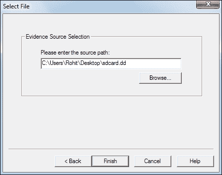
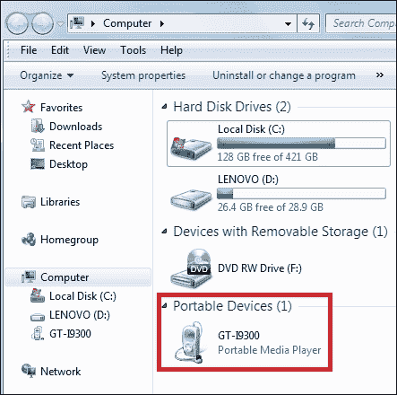
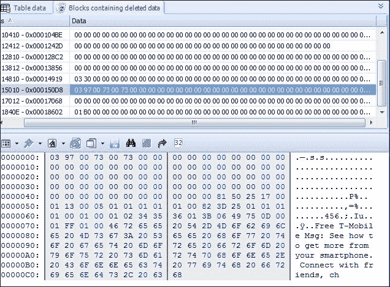
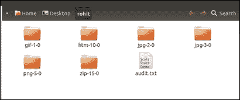
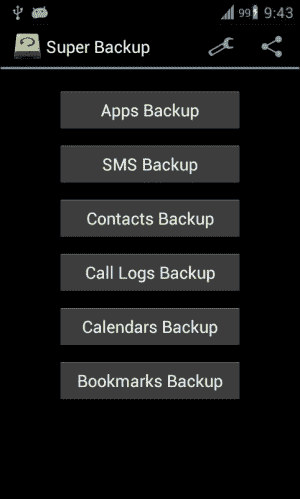

# 六、从安卓设备恢复删除的数据

到目前为止，您所学习的提取和获取技术将帮助您访问各种详细信息，如呼叫日志、消息等。然而，这些技术并不能帮助我们看到从设备中删除的数据。在本章中，您将了解数据恢复技术，这些技术将使您能够查看设备上删除的数据。删除的数据可能包含高度敏感的信息，因此，数据恢复是移动取证的一个重要方面。在本章中，我们将涵盖以下主题:

*   数据恢复概述
*   恢复从 SD 卡中删除的数据
*   恢复从手机内部存储中删除的数据

# 数据恢复概述

数据恢复是数字取证中一个强大的概念。它是在无法正常访问设备或 SD 卡时，从设备或 sd 卡中检索已删除数据的过程。能够恢复被用户删除的数据有助于解决几起民事和刑事案件。这是因为大多数被告只是删除了设备上的细节，希望证据会被销毁。因此，在大多数刑事案件中，删除的数据可能至关重要，因为它可能包含用户想要从安卓设备中删除的信息。例如，考虑一个场景，一部手机被恐怖分子没收。

知道哪些项目被他们删除了不是最重要的吗？访问任何已删除的短信、图片、已拨号码等可能至关重要，因为它们可能会泄露许多敏感信息。从普通用户的角度来看，恢复已删除的数据通常是指操作系统的内置解决方案，例如 Windows 中的回收站。虽然数据确实可以从这些位置恢复，但由于用户意识的增强，这些选项通常不起作用。例如，在台式电脑上，当人们想从桌面上完全删除一个文件时，他们会使用 *Shift* + *Delete* 。同样，在移动环境中，用户知道应用等提供的恢复操作。尽管如此，数据恢复技术允许法医调查人员访问从设备中删除的数据。

关于安卓，可以恢复大部分删除的数据，包括短信、图片、应用数据等等。然而，重要的是以适当的方式扣押设备并遵循某些程序，否则数据可能会被永久删除。为了确保删除的数据不会永远丢失，建议您牢记以下几点:

*   抓住手机后，不要将其用于任何活动。删除的数据存在于设备上，直到其他传入数据需要该空间。因此，电话必须*而不是*用于任何类型的活动，以便数据不会被覆盖。
*   即使不使用手机，如果没有我们端的任何干预，数据也可能被覆盖。例如，传入的短信会自动占据覆盖已删除数据的空间。此外，远程擦除命令可以擦除设备上的内容。为了防止此类事件的发生，您可以考虑将设备放在法拉第袋中，如[第 1 章](1.html "Chapter 1. Introducing Android Forensics")、*介绍安卓取证*中所述。因此，应注意防止通过任何通信手段传递任何新消息或数据。

## 删除的文件如何恢复？

当用户从设备中删除任何数据时，数据实际上不会被擦除，而是继续存在于设备中。被删除的是指向这些数据的指针。所有文件系统都包含维护文件层次结构、文件名等信息的元数据。删除实际上并不删除数据，而是删除文件系统元数据。仅仅删除元数据就提高了操作系统的性能；与实际擦除所有数据相比，删除指针并将空间标记为可用是一个极其快速的操作。因此，当文本消息或任何其他文件被删除时，它们只是对用户不可见。但是，只要文件没有被其他数据覆盖，它们就仍然存在于设备上。

因此，有可能在新数据进入并占据空间之前恢复它们。

在安卓上恢复删除的数据涉及两种场景:

*   恢复从 SD 卡中删除的数据，如图片、视频等
*   恢复从设备的内部存储中删除的数据，如短信、拨号、浏览历史、应用数据、聊天日志等

以下部分涵盖了可用于从安卓设备的 SD 卡和内部存储中恢复已删除数据的技术。

# 恢复从 SD 卡删除的数据

SD 卡上的数据可以揭示许多在法医调查中有用的信息。图片、视频、语音记录、应用数据等都存储在 SD 卡上，这一事实增加了它的分量。如前几章所述，安卓设备通常使用 SD 卡上的 FAT32 文件系统。主要原因是大多数操作系统都广泛支持 FAT32 文件系统，包括 Windows、Linux 和 Mac OS x。fat 32 格式的驱动器上的最大文件大小约为 4 GB。随着现在可用的分辨率格式越来越高，通常会达到这个极限。如果可以作为驱动器装载，恢复从外部 SD 删除的数据会非常容易。

如果 SD 卡是可移动的，则可以通过使用读卡器将其连接到计算机来将其安装为驱动器。安装 SD 卡时，任何文件都可以传输到 sd 卡。一些使用通用串行总线大容量存储的旧设备在通过通用串行总线电缆连接时也会将设备作为驱动器安装。如前所述，在取证中，为了确保原始证据没有被修改，会拍摄磁盘的物理图像，并对图像本身进行所有进一步的实验。类似地，在 SD 卡分析的情况下，需要拍摄 SD 卡的图像。成像过程类似于[第 5 章](5.html "Chapter 5. Extracting Data Physically from Android Devices")、*从安卓设备*中物理提取数据的过程。一旦成像完成，我们得到一个`dd`图像文件。在我们的例子中，我们将使用一个免费工具，FTK 成像仪。该工具是一个映像实用程序，除了创建磁盘映像之外，它还可以用来探索磁盘映像的内容。

使用 FTK 成像仪恢复 SD 卡的内容需要以下步骤:

1.  Start FTK Imager. Click on **File** and then on **Add Evidence Item** in the menu.

    

    在 FTK 成像仪中添加证据

2.  在**选择源**对话框中选择**图像文件** ，点击**下一步**。
3.  In the **Select File** dialog, browse to the location where you downloaded the `sdcard.dd` file. Select the file and click on **Finish**:

    

    在 FTK 成像仪中选择图像文件进行分析

4.  FTK 成像仪的默认显示将出现，SD 卡的内容在右下角的**视图**窗格中可见。您也可以点击左下窗格下方的**属性**选项卡来查看磁盘映像的属性。
5.  在左窗格中，驱动器已经打开。你可以点击 **+** 标志打开文件夹。突出显示文件夹时，其内容会显示在右窗格中。选择文件后，其内容可以在底部窗格中看到。
6.  As shown in the following screenshot, the deleted files will have a red cross over the icons derived from their file extensions:

    

    图标上显示有红色十字的已删除文件

7.  To export the file, right-click on the file that contains the picture and select **Export Files**:

    

    在 FTK 成像仪中导出删除的文件

有时，只有文件的一个片段是可恢复的。无法直接读取或查看该文件片段。在这种情况下，我们需要在未分配的空间中寻找更多的数据。雕刻可用于恢复未分配的空间。Winhex、手术刀、prefirst 和 Photorec 是一些可以帮助你做到这一点的工具。大多数最新的安卓设备都不作为大容量存储器安装。这是因为这些设备不支持 USB 大容量存储，而是使用 MTP 或 PTP 协议。有了 USB 大容量存储，计算机将需要独占访问存储。换句话说，外部存储在连接到工作站时，需要与安卓操作系统完全断开。这导致了移动应用的其他一些复杂情况。当安卓设备使用 MTP 时，它在计算机看来是一个媒体设备，而不是可移动存储，如下图所示:

显示在视窗便携设备下的安卓设备

然而，正常的数据恢复工具需要一个安装驱动器来执行扫描，尽管这不是一个推荐的过程，因为它可能导致对设备进行更改。因此，大多数使用 MTP/PTP 的最新设备都不被视为装载驱动器。因此，适用于计算机的传统数据恢复工具在这些设备上不起作用。

出于前面提到的原因，当设备使用 MTP/PTP 并且没有作为驱动器安装时，可以通过某些特定于安卓系统的数据恢复工具进行恢复，这些工具需要打开 USB 调试选项。市场上几乎所有的安卓数据恢复工具都需要你启用 USB 调试，这样你的设备和 SD 卡才能在开始安卓数据恢复之前被识别。此外，这些工具只在根设备上工作。我们现在来看看如何恢复从安卓设备的内存中删除的数据。

# 恢复从内存中删除的数据

大多数分析工具都不支持恢复从安卓内存中删除的文件，如 app 数据等。这主要有两个原因。首先，与 SD 卡中使用的常见文件系统不同，内部内存使用的文件系统可能无法被取证工具识别和装载。第二，考官无法访问安卓手机内存的原始分区，除非手机是有根的。以下是审查员在尝试从安卓设备的内存中恢复数据时可能面临的一些其他问题:

*   要访问内存，您可以尝试将手机设为 root。然而，生根过程可能涉及向`/data`分区写入一些数据。此过程可能会覆盖设备上的宝贵数据。
*   与 SD 卡不同，这里的内部文件系统不是 FAT32(它被取证工具广泛支持)。内部文件系统可以是 YAFFS2(在旧设备中)、EXT3、EXT4、RFS，或者是为在安卓上运行而构建的专有文件系统。因此，许多为 Windows 文件系统设计的恢复工具将无法工作。
*   安卓设备上的应用数据通常以 SQLite 格式存储。虽然大多数取证工具都提供了对数据库文件的访问，但它们可能必须在本机浏览器中导出和查看。审查员必须检查原始数据，以确保删除的数据不会被取证工具忽略。

由于这些原因，恢复从安卓设备的内存中删除的数据很困难，但并非不可能。安卓设备的内存保存着大量的用户数据和你调查的关键。如前所述，为了访问原始分区，设备必须是根设备。值得注意的是，市场上大多数安卓恢复工具都没有强调它们只在根手机上工作的事实。基于硬件的解决方案，如 UFED 和 XRY，完全能够从内存和 SD 卡中恢复删除的数据。现在让我们看看如何从安卓手机中恢复删除的数据。

## 通过解析 SQLite 文件恢复删除的数据

安卓中的大部分应用数据都存储在 SQLite 文件中。与文本消息、电子邮件和大多数应用数据相关的数据存储在 SQLite 文件中。SQLite 数据库可以将删除的数据存储在数据库本身中。用户标记为删除的文件不再出现在活动的 SQLite 数据库文件中。因此，通过分析这些 SQLite 文件，可以恢复已删除的数据，如短信、联系人等。SQLite 页面中有两个区域可以包含已删除的数据:未分配块和空闲块。大多数恢复已删除数据的商业工具都会扫描 SQLite 页面的未分配块和空闲块。解析删除的数据可以使用可用的取证工具完成，如氧气取证 SQLite 查看器。SQLite 查看器的试用版可用于此目的。但是，您可以恢复的数据量有一定的限制。

例如，我们将从安卓设备中恢复删除的短信。从安卓手机中恢复删除的短信是设备取证分析的一部分，主要是因为这是最流行的通信方式。在安卓设备上恢复删除的短信有不同的方法。然而，关于通过解析 SQLite 文件进行恢复，我们需要了解消息在设备上的存储位置。在[第 4 章](4.html "Chapter 4. Extracting Data Logically from Android Devices")、*从安卓设备*逻辑提取数据中，我们解释了安卓设备上存储用户数据的重要位置。这里简单回顾一下:

*   每个应用都将其数据存储在`/data/data`文件夹中(同样，这需要根访问来获取数据)
*   `/data/data/com.android.providers.telephony/databases`处的文件包含短信/彩信的详细信息

删除的文本消息可以通过检查存储在/data/data/com . Android . providers . telephone/databases 中名为 mmssms.db 的 SQLite 数据库文件来恢复。以下是所需的步骤:

*   提取短信数据库 SQLite 文件(`mmssms.db`)。这可以使用逻辑数据提取技术来完成，这些技术在[第 4 章](4.html "Chapter 4. Extracting Data Logically from Android Devices")、*从安卓设备*逻辑提取数据中有所介绍。
*   一旦文件被提取到本地机器，您就可以使用可用的工具，如 Cellebrite。这些工具可以自动提取已删除的详细信息。您也可以使用十六进制查看器或 SQLite 查看器(如氧气取证 SQLite 查看器)手动检查碎片。
*   One way to view the deleted data is by clicking on the **Blocks containing deleted data** tab in the Oxygen Forensics SQLite Viewer, as shown in the following screenshot (referenced from [http://az4n6.blogspot.in/2013/02/finding-and-reverse-engineering-deleted_1865.html](http://az4n6.blogspot.in/2013/02/finding-and-reverse-engineering-deleted_1865.html)):

    

    氧气取证 SQLite 查看器中显示的已删除数据

您也可以尝试可用的开源 Python 脚本([http://az4n 6 . blogspot . in/2013/11/Python-parser-to-recover-deleted-sqlite . html](http://az4n6.blogspot.in/2013/11/python-parser-to-recover-deleted-sqlite.html))来解析 SQLite 文件中的已删除记录。

## 通过文件雕刻技术恢复删除的数据

**文件雕刻** 是取证中非常有用的方法，因为它允许恢复隐藏或删除的数据进行分析。简单来说，文件雕刻就是在没有文件系统元数据的情况下，从片段中重组文件的过程。在文件雕刻中，在二进制数据中搜索并提取指定的文件类型，以创建分区或整个磁盘的取证映像。文件雕刻仅基于文件结构和内容从驱动器中未分配的空间恢复文件，而没有任何匹配的文件系统元数据。

### 注

未分配空间是指驱动器中文件系统结构(如文件表)中不再有指针的部分。

可以通过扫描磁盘的原始字节并重组它们来恢复或重建文件。这可以通过检查文件的头(前几个字节)和尾(后几个字节)来完成。

文件雕刻方法根据使用的底层技术进行分类。页眉页脚雕刻方法依赖于基于页眉和页脚信息恢复文件。例如，JPEG 文件以 0xffd8 开始，以 0xffd9 结束。页眉和页脚的位置被识别，这两个端点之间的一切都被雕刻。同样，文件结构雕刻方法是基于文件的内部布局来重构文件。然而，传统的文件雕刻技术，比如我们已经解释过的那些，如果数据是碎片化的，可能就不起作用了。为了克服这一点，智能雕刻等新技术利用几种流行文件系统的碎片特征来恢复数据。

手机成像后，可以使用 **【手术刀】**等工具进行分析。手术刀是一个强大的开源工具来雕刻文件。此工具分析块数据库存储，识别已删除的文件并恢复它们。手术刀是独立于文件系统的，并且已知可用于各种文件系统，包括 FAT、NTFS、EXT2、EXT3、HFS 等。以下步骤解释了如何在 Ubuntu 工作站上使用解剖刀恢复文件:

1.  使用`sudo apt-get install scalpel`命令在 Ubuntu 工作站上安装手术刀。
2.  出现在`/etc/scalpel`目录中的`scalpel.conf`文件包含关于支持的文件类型的信息，如下图所示:

手术刀配置文件

该文件需要修改，以便包含与安卓相关的文件。可以从[https://asecuritysite.com/scalpel.conf.txt](https://asecuritysite.com/scalpel.conf.txt)下载一个样本`scalpel.conf`文件。您也可以取消文件注释并保存`conf`文件，以选择您选择的文件类型。完成后，用下载的文件替换原来的`conf`文件。

手术刀需要和前面的配置文件一起运行在被检查的`dd`图像上。通过输入配置文件和`dd`文件，您可以使用如下截图所示的命令运行该工具。一旦命令运行，工具就开始雕刻文件并相应地构建它们。

在图像文件上运行解剖工具

在前面的命令中指定的输出文件夹现在包含基于文件类型的文件夹列表。这些文件类型都包含基于文件夹名称的数据。例如，`jpg 2-0`包含与`.jpg`扩展名相关的恢复文件:

手术刀工具的输出

如前面的截图所示，每个文件夹都包含从安卓设备恢复的数据，如图像、`.pdf`文件、`.zip`文件等。虽然有些图片完全恢复，但有些没有完全恢复，如下图截图所示:

使用手术刀工具恢复的数据

像 DiskDigger 这样的应用可以安装在安卓设备上，从内存和 SD 卡中恢复不同类型的文件。DiskDigger 等应用包括对`.jpg` 文件、`.mp3`和的支持。`wav`音频、`.mp4`和`.3gp`视频、原始相机格式、微软办公文件(`.doc`、`.xls`和`.ppt`)等等。但是，如前所述，该应用需要安卓设备上的 root 权限，以便从内部内存中恢复内容。因此，文件雕刻技术在从设备的内部存储器中恢复重要的已删除文件方面起着非常重要的作用。

# 分析备份

还建议检查设备是否安装了任何备份应用或文件。安卓的最初版本不包括用户备份个人数据的机制。因此，一些备份应用已被用户广泛使用。使用这些应用，用户可以将数据备份到 SD 卡或云中。例如`Super Backup` app 包含备份通话记录、联系人、短信等选项，如下图截图所示:

超级备份安卓应用

一旦检测到备份应用，法医检验人员必须尝试确定数据存储在哪里。备份中保存的数据可能包含重要信息，因此在设备上查找任何第三方备份应用都会非常有帮助。

您也可以通过设备上配置的谷歌帐户，使用**恢复联系人**选项恢复设备上的联系人。如果该设备的用户之前已经使用安卓系统中的**同步设置**选项同步了他们的联系人，这将会有效。此选项会同步联系人和其他详细信息，并将它们存储在云中。拥有合法权限或适当同意的法医可以恢复删除的联系人，如果他们可以访问设备上配置的谷歌帐户。访问帐户后，请执行以下步骤来恢复数据:

1.  登录 Gmail 帐户。
2.  Click on **Gmail** in the top-left corner and select **Contacts**, as shown in the following screenshot:

    

    Gmail 中的“联系人”菜单

3.  点击联系人列表上方的 **更多**。
4.  Click on **Restore Contacts**, and the following screen appears:

    

    “恢复联系人”对话框

5.  使用这种技术，可以将联系人列表恢复到过去 30 天内的任何时间点的状态。

# 总结

数据恢复是从设备中检索已删除数据的过程。因此，它是取证中一个非常重要的概念。在本章中，我们看到了从 SD 卡和内存中恢复已删除数据的各种技术。虽然从可移动 SD 卡恢复数据很容易，但从内部存储器恢复数据会有一些复杂性。SQLite 文件解析和文件雕刻技术帮助法医分析师恢复安卓设备内存中存在的已删除项目。建议检查设备上安装的任何备份应用，因为这样既省时又省力。

在下一章中，我们将尝试理解分析安卓应用的取证视角。