# *第一章* : Java、安卓、游戏开发

欢迎来到*通过搭建安卓游戏学习 Java*(*第三版*)。在第一章中，我们将直接深入研究 Java、Android 和游戏开发。到最后，你将已经构建和部署了第一个游戏的第一部分，你也将对你在这本书里将要取得的成就有一个很好的了解。

此外，我们将查看一些图表和我们将在整本书中开发的五个游戏的大纲。

此外，我们将探索和发现安卓有什么了不起的，安卓和 Java 到底是什么，它们是如何工作和相互补充的，这对我们作为未来的游戏开发人员意味着什么。

快速前进，我们将设置所需的软件，以便我们可以为我们的第一个游戏构建和部署大纲。

重要说明

我的目标是使这本书跟上时代。请查看以下网页，了解自该书首次印刷以来对AndroidStudio所做的任何更改的进一步讨论和提示:[http://gamecode school . com/books/learning-Java-by-building-Android-games-第三版#android-studio-updates](http://gamecodeschool.com/books/learning-java-by-building-android-games-3rd-edition#android-studio-updates) 。

总之，本章将涵盖以下主题:

*   为什么选择 Java、Android 和游戏的组合？
*   介绍我们将用来学习 Java 和 Android 的五个简洁的游戏
*   Java 和安卓如何协同工作
*   设置AndroidStudio开发环境
*   在安卓模拟器或真实设备上构建并运行一个空白游戏项目

我们开始吧。

# 技术要求

以下是使用 Android Studio 及其相关工具进行 Android 开发的官方技术要求。然而，这些是绝对最低的要求。详情请参考*设置AndroidStudio*部分。

## 窗户

*   微软视窗 7/8/10 (64 位)
*   4 GB 内存最小值；建议使用 8 GB 内存
*   最小 2 GB 可用磁盘空间；推荐 4gb(IDE 为 500 MB，安卓 SDK 和仿真器系统映像为 1.5 GB)
*   1280 x 800 最小屏幕分辨率

## Mac

*   Mac OS X 10.10(约塞米蒂)或更高，最高可达 10.14 (macOS Mojave)
*   4 GB 内存最小值；建议使用 8 GB 内存
*   最小 2 GB 可用磁盘空间；推荐 4gb(IDE 为 500 MB，安卓 SDK 和仿真器系统映像为 1.5 GB)
*   1280 x 800 最小屏幕分辨率

## Linux

*   GNOME or KDE desktop

    在 gLinux 上测试，基于 Debian。

*   能够运行 32 位应用程序的 64 位分布
*   GNU C 库 2.19 或更高版本
*   最小 4 GB 内存；建议使用 8 GB 内存
*   最小 2 GB 可用磁盘空间；推荐 4gb(IDE 为 500 MB，安卓 SDK 和仿真器系统映像为 1.5 GB)
*   1280 x 800 最小屏幕分辨率

你可以在 GitHub 上找到完整的代码示例，如下库:[https://GitHub . com/PacktPublishing/Learning-Java-by-Building-Android-Games-第三版](https://github.com/PacktPublishing/Learning-Java-by-Building-Android-Games-Third-Edition)

# 第三版有什么新内容？

与第一版相比，第二版经历了大规模的改革，游戏数量增加了一倍。不幸的是，平装书只能装这么多页。因此，这个版本着重于改进 Java、Android 和游戏开发概念的教学方式。我重新思考了这些主题的解释方式，并使其比以前更加直观。除此之外，我还设法挤进了大约十几个新的迷你话题。这些要么是 Java 基础，比如变量类型，早期版本中没有涉及到；AndroidStudio的新功能，如 profiler 或者是以前从未出现过的经典编程概念，比如方法递归。

# 为什么是 Java、Android、游戏？

当安卓在 2008 年首次出现时，与苹果 iPhone/iPad 上时尚得多的 iOS 相比，它有点单调。然而，很快，通过各种各样的手机产品，这些产品引起了注重实用价格、注重时尚和精通技术的人的共鸣，安卓用户数量激增。

对包括我在内的许多人来说，开发安卓游戏是最有益的消遣和业务。

快速构建一个游戏创意的原型，提炼它，然后决定运行它，并将其连接成一个成熟的游戏，这是一个令人兴奋和有益的过程。编程可以很有趣，我一生都在编程。然而，创造游戏，尤其是对安卓来说，不知何故是非常有益的。

准确解释这是为什么是相当困难的。也许是平台免费开放的事实。你可以分发你的游戏，而不需要一个大的控制公司的许可——没有人能阻止你。与此同时，你有完善的和公司控制的大众市场，如亚马逊应用商店和谷歌游戏。

更有可能的是，开发安卓游戏之所以让你如此兴奋，是因为设备本身的性质。他们是非常私人的。可以开发与人生活互动的游戏；例如，教育、娱乐和讲述故事的游戏。但它们就在你的口袋里，随时可以在家里、工作场所或度假时玩。

你当然可以为 Windows 或 Xbox 做一些更大的东西，但是知道成千上万(或数百万)的人把你的作品放在他们的口袋里并与他们的朋友分享是一个更大的话题。

开发游戏不再被认为是极客、书呆子或隐士。事实上，开发一款安卓游戏被认为是高度熟练的，最成功的游戏也受到极大的钦佩甚至崇敬。

如果所有这些蓬松和精神的东西对你来说没有任何意义，那也没关系；为安卓系统开发可以让你谋生，甚至让你变得富有。随着设备保有量的持续增长，CPU 和 GPU 功率的持续提升，以及安卓操作系统本身的不停进化，对专业游戏开发者的需求只会越来越大。

简而言之，最好的安卓开发者——更重要的是，拥有最好想法和最大决心的安卓开发者——比以前更受欢迎。没有人知道这些未来的安卓游戏开发者是谁，他们甚至可能还没有写好他们的第一行 Java。

那么，为什么不是每个人都是安卓开发者呢？当然，并不是每个人都会分享我对创造能帮助人们让生活变得更好的软件的热情，但我想，因为你正在阅读这篇文章，你可能会。

## 爪哇的绊脚石

不幸的是，对于那些和我一样热情的人来说，在前进的道路上有一种玻璃墙，让许多有抱负的安卓游戏开发者感到沮丧。

安卓将 Java 作为制作游戏的主要选择。每一本安卓书籍，甚至是那些针对所谓初学者的书籍，都假设读者至少有中级 Java 水平，大多数都要求高级水平。所以，优秀到优秀的 Java 知识是学习 Android 的前提。

不幸的是，在与安卓完全不同的环境中学习 Java 有时会有点枯燥，而且你所学的很多东西无论如何都不能直接转移到安卓世界。

此外，游戏可以说比普通的基于图形用户界面的应用程序更高级，你可以看到为什么安卓游戏开发的初学者经常从一开始就被推迟。

然而，不需要这样。在这本书里，我小心翼翼地将你将要学习的所有 Java 主题放在一个厚重的初学者墓中，并将其重新制作成五个游戏，从难以置信的简单游戏开始，到更复杂的游戏。

如果你想做游戏，或者只是想在学习 Java 和 Android 的时候玩得更开心，那么在游戏开发环境中教授 Java 和 Android 就更有意义，也更有乐趣，而且会明显更快、更有收获。这本书将教你 Java，唯一压倒一切的目标是学习开发专业的标准游戏。但是这些知识也可以转移到非安卓的 Java 环境和非游戏的安卓环境中。这就是这本书关于游戏的内容。

另外，你可以炸掉东西！

# 我们将要建造的游戏

让我们看一些有用的截图，并从书中获得关于每个游戏的更多细节。当我们开始每个项目时，我们将深入细节和解释。

## 潜艇猎人

我们构建的第一个游戏将允许我们介绍一些关键的 Java 初学者主题，包括代码注释、变量、运算符、方法、循环、生成随机数、`if`、`else`、`switch`，以及对**面向对象编程** ( **OOP** )的简单介绍。我们还将学习如何与安卓操作系统通信，检测屏幕触摸，绘制简单图形，管理屏幕分辨率，处理不同的屏幕尺寸。所有这些都将用于构建经典扫雷游戏的更简单的变体。这是我们游戏的截图:

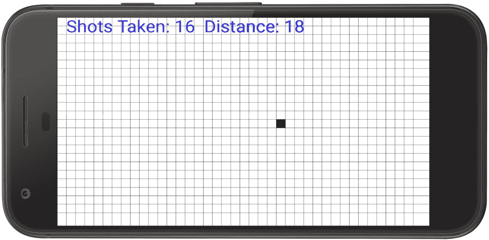

图 1.1–潜艇猎人游戏

这将是一个点击射击游戏，玩家必须猜测潜艇的位置，然后根据前一次射击的“声纳”报告改进他们的下一次射击。

## 乒乓

对于第二个项目，我们将稍微增加复杂性，并继续进行每秒 60 帧的平滑动画 Pong 克隆。涵盖的 Java 主题包括类、接口、线程和`try-catch`块。我们还将探讨方法重载和重写，并更深入地研究面向对象，包括编写和使用我们自己的类。这个项目还将让你对游戏循环、简单的弹跳物理、播放音效和检测游戏物体碰撞有一个合格的理解。这是一个简单的截图，但仍然是一个进步，乒乓游戏:

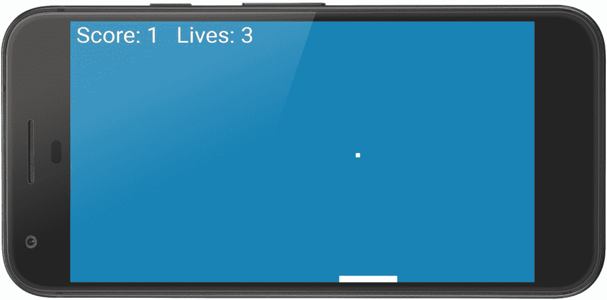

图 1.2–乒乓游戏

如果 Pong 游戏看起来不是很忙，那么接下来的游戏不仅会完全相反，还会给你重新审视和改进前两个游戏的知识。

## 子弹地狱

在这个项目中，你会遇到鲍勃。在这个子弹地狱游戏中，鲍勃将是一个静态图像，可以在屏幕上的任何地方传送，以避免不断增加的子弹数量。在最后的游戏中，我们还将动画鲍勃，这样他就可以在一个可探索的滚动世界中奔跑和跳跃。这个简短的实现将使我们能够了解 Java 数组、位图图形以及如何测量时间。我们还将学习如何非常简单地使用 Java 数组以及我们已经了解的类来在游戏中生成大量对象:

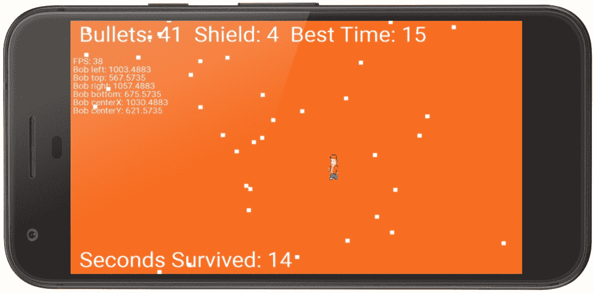

图 1.3–子弹地狱游戏

子弹地狱的目标是生存尽可能长的时间。如果子弹即将击中鲍勃，玩家可以通过点击屏幕上想要的目的地来传送他；然而，每次瞬移都会产生更多的子弹。

## 蛇克隆

这款游戏是几十年来一直让游戏玩家愤怒的经典之作的翻版。引导你的蛇绕过屏幕，通过吃苹果获得积分。每次你吃一个苹果，你的蛇就会变得越来越长，越来越难存活。在这个项目中，我们将学习 Java `ArrayList`、增强的`for`循环、堆栈、堆和垃圾收集器(说真的——这是一个东西！)，我们还将学习如何使我们的游戏多语言化。你好！请看下面的截图:

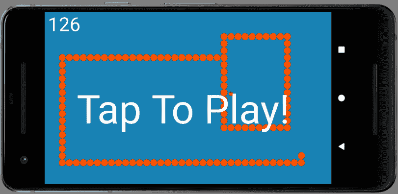

图 1.4–蛇克隆游戏

当蛇撞到屏幕边缘或最终吃掉自己身体的一部分时，游戏结束。

## 滚动射手

这个项目，从技术上来说是蛇克隆游戏的一大进步。在这里，我们将学习如何处理具有独特行为、外观和属性的多种不同类型的外星人。游戏的其他功能包括速射激光、滚动背景、持续高分和酷炫的星爆粒子系统爆炸效果。

在这个项目中，我们将向您介绍 Java 和游戏编程**模式**，它们是用可管理的代码编写复杂游戏的关键。我们将学习并使用实体组件模式、策略模式、工厂模式和观察者模式:

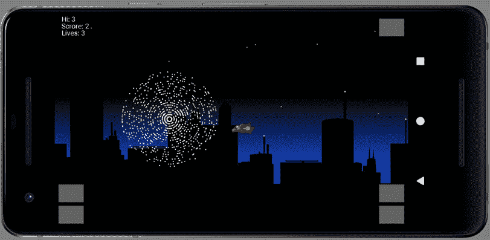

图 1.5–滚动射击游戏

如果你想设计你自己的游戏，同时以一种允许你的游戏变得更复杂的方式来构造你的 Java 代码，同时保持代码的可管理性，那么在这个项目中学习的技术是至关重要的。这个项目会给你所需的知识和经验，以解决我的网站上的平台游戏项目。

现在，让我们了解一下 Java 和 Android 是如何工作的。

# 【Java 和安卓如何协同工作

在开始我们的安卓探索之前，我们需要了解安卓和 Java 是如何协同工作的。

安卓是一个复杂的系统，但是你不需要深入了解它就能做出令人惊叹的应用。

在我们用 Java 编写了一个程序之后，对于 Android，我们点击一个按钮，我们的代码就转换成了另一种形式——Android 理解的形式。另一种形式叫做**字节码**，而 转换过程叫做**编译**。之所以可以使用 Kotlin 编程语言编写安卓应用程序，是因为它直接编译成与 Java 相同的字节码。事实上，只需点击一个按钮，就可以将 Java 翻译成 Kotlin。

然后，当用户安装我们的应用程序时，字节码被另一个进程翻译成机器代码，这个进程被称为**安卓运行时** ( **ART** )。这是最快的可能的执行格式。所以，如果你曾经听到人们说你不应该使用 Java，因为它很慢，那么你知道他们错了。对于程序员来说，Java 编程很快，安装后，它会变成机器代码，这对于设备执行来说很快。还有什么更好的？

小费

艺术相对较新。过去，从 Java 编译的安卓应用程序确实会比其他语言(如 C++)执行得更慢。现在已经不是这样了。

ART 不仅能够超快速地执行我们的应用程序，还能降低电池使用量。此外，ART 系统不仅仅是创建机器代码，然后坐下来放松；它在我们的应用程序中提供钩子，在应用程序运行时增强内存管理。

ART 本身是一个用另一种语言编写的软件系统，运行在一个经过特殊修改的 Linux 操作系统版本上。因此，用户看到的安卓本身只是一个运行在另一个操作系统上的应用程序。

安卓是一个子系统的集合。典型的安卓用户看不到 Linux 操作系统，也不知道 ART 的存在，但他们都在那里让事情运转起来。

该系统的 Linux 部分的目的是隐藏安卓运行的硬件和软件的复杂性和多样性，但同时暴露其所有有用的功能。这种特性的展示有两种方式:

*   首先，系统本身必须能够访问硬件，它确实可以。
*   第二，这个访问必须是程序员友好且易于使用的——这是因为安卓**应用编程接口** ( **API** )。

让我们继续更详细地讨论安卓应用编程接口。

小费

这本书是关于从零开始学习 Java 和构建安卓应用程序的，所以我不会对安卓的工作方式进行更深入的研究。然而，如果你想了解更多，那么安卓维基百科页面是一个很好的参考:[https://en . Wikipedia . org/wiki/Android _(operating _ system)](https://en.wikipedia.org/wiki/Android_(operating_system))。

不要太担心这个最初复杂的声音系统。通过编写一些真正的代码来理解事物是如何工作的，会更有趣、更快、更容易。

## 再说一遍——安卓到底是什么？

为了在安卓上完成事情，我们编写了自己的 Java 代码，也使用了安卓 API 的 Java 代码。然后，这些代码被编译成字节码，并由 ART 在用户安装时翻译成机器代码，而机器代码又连接到一个叫做 Linux 的底层操作系统。这处理了构成不同安卓设备的复杂且极其多样化的硬件范围。

安卓设备的制造商和各个硬件组件当然也知道这一点，他们编写了名为**驱动程序**的高级软件，确保他们的硬件(例如，中央处理器、图形处理器、全球定位系统接收器、内存芯片和硬件接口)可以在底层的 Linux 操作系统上运行。

字节码(以及其他一些资源)被放在一个名为**安卓应用包** ( **APK** )的文件包中，这是 ART 为用户准备我们的应用程序所需要运行的。

小费

不需要记住我们的代码与硬件交互时所经历的步骤的细节。只要理解我们的 Java 代码经过了许多自动化过程，就足以成为我们将发布到谷歌游戏的应用程序。

下一个问题是，所有这些 Java 编码和编译成字节码以及 APK 打包到底发生在哪里？让我们看看我们将要使用的开发环境。

现在，让我们建立AndroidStudio。

# 设置AndroidStudio

设置AndroidStudio非常简单，虽然有点冗长。吃点东西，开始下面的步骤。本教程将安装AndroidStudio到 D 驱动器。我选择了 D 驱动器，因为它是一个大的安装-一旦我们下载了所有内容，大约 12gb-许多电脑上的 D 驱动器通常比 C 驱动器更大，有更多的可用空间。如果您希望在 c 盘(或任何其他盘)上安装AndroidStudio，那么这些说明应该很容易调整。

访问[https://developer.android.com/studio](https://developer.android.com/studio)点击**下载AndroidStudio**按钮。这将开始下载最新的 Windows 稳定版本。您需要接受条款和条件才能开始下载。

当您等待下载完成时，在您的 D 驱动器的根目录下创建一个名为`Android`的新文件夹。在`Android`文件夹中，创建另一个新文件夹，称为`Android Studio`。导航回`Android`文件夹，创建另一个名为`Projects`的新文件夹。这是我们将保存我们将在整本书中创建的所有项目文件的地方。接下来，创建另一个新文件夹，称为`Sdk`。这就是我们要求安装程序安装安卓软件开发工具包的地方。您现在应该有一个文件夹`D:\Android`，看起来类似于下面的截图:

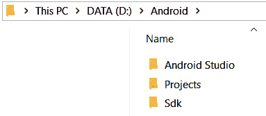

图 1.6–安卓软件开发工具包文件夹

下载完成后，找到下载的文件。它将被称为`android-studio-ide....`。双击文件运行它。

您将被要求授予安装程序管理权限。然后，您可以左键单击**下一步**开始安装过程。在**选择组件**屏幕上，确认**AndroidStudio**和**安卓虚拟设备**选项均已勾选，然后左键点击**下一步**按钮:

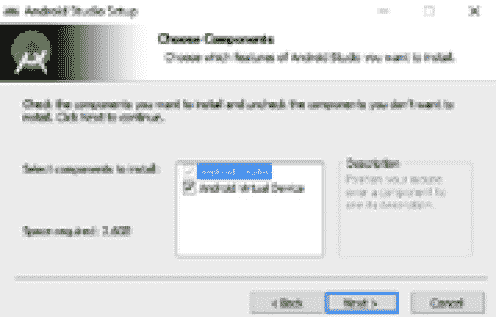

图 1.7–安装AndroidStudio和安卓虚拟设备组件

在**配置设置**窗口中，左键单击**浏览**按钮上的并导航至`D:\Android\Android Studio`。然后，左键点击**确定**按钮:

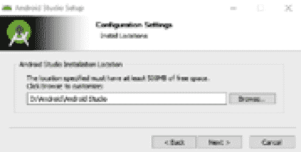

图 1.8–配置设置

左键点击**下一步**按钮，如上图所示。在**选择开始菜单文件夹**窗口，左键点击**安装**接受默认选项。安装的第一部分现在将继续进行:

1.  When you get an **Installation Complete** message, left-click on the **Next** button. You can then left-click on the **Finish** button.

    AndroidStudio应该会自动启动。如果没有，可以从你的 Windows 开始菜单找到并启动AndroidStudio应用。

    系统会提示您有一个**缺失的 SDK** (除非这不是您第一次使用 Android Studio)。左键点击**下一步**继续。

2.  The **SDK Components Setup** screen will show next. Here, we want to change the install location. Left-click on the **Android** **SDK** **Location** field and browse to `D:\Android\Sdk`, as shown in the following screenshot:

    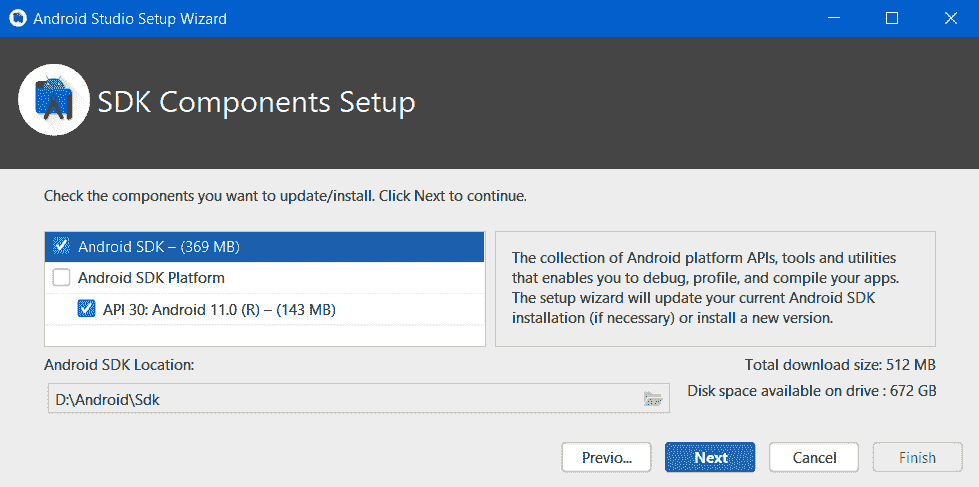

    图 1.9–软件开发工具包组件设置

3.  Left-click on the **Next** button.

    在**验证设置**窗口，左键点击**完成**按钮。AndroidStudio现在将下载更多的文件并完成安装。这可能需要几分钟或更长时间，您可能会再次被提示允许访问您的电脑。

4.  过程结束后，左键点击**完成**按钮。

您将看到AndroidStudio欢迎屏幕，如下所示:

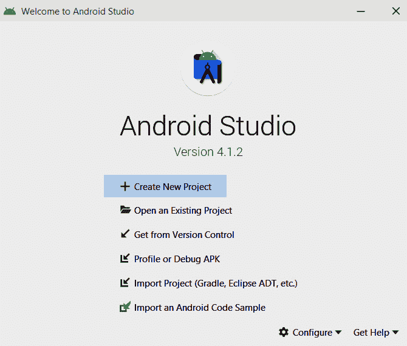

图 1.10–AndroidStudio欢迎屏幕

如果你是继续下一部分，那么离开这个屏幕。否则，您可以关闭它，并从窗口开始菜单运行AndroidStudio，就像任何其他应用程序一样，当您准备好继续时。

# 开始第一个项目——猎人

现在我们可以开始第一场比赛了。我将更详细地介绍《潜艇猎人》到底是做什么的，以及它是如何播放的。然而，现在，让我们只是建立一些东西，看看我们的第一个安卓游戏开始成形。

重要说明

本章末尾的完整代码位于 [*第 1 章*](#_idTextAnchor013) 文件夹的 GitHub repo 上。然而，请注意，您仍然需要经历项目创建阶段，这将在本章(以及所有项目的开头)中进行解释，因为AndroidStudio做了许多我们看不到的工作。

按照以下步骤启动项目:

1.  Run Android Studio (if it isn't running already) in the same way you would run any other app. On Windows 10, for example, the launch icon appears in the start menu.

    小费

    如果系统提示您从导入工作室设置，请选择**不导入设置**。

2.  您将再次看到AndroidStudio欢迎屏幕。找到**开始一个新的AndroidStudio项目**选项，左键点击。
3.  接下来的窗口是**选择项目模板**。这些是一些有用的项目模板，AndroidStudio可以根据你要开发的应用类型为你生成。
4.  Most options contain the word **Activity**. We will learn about Android **Activity** as the book progresses. However, we are making games and want to control every pixel, beep, and player input. For this reason, we will use the **Empty Activity** option. Android Studio will autogenerate some code and files to get our project started. Here is a picture of the **Select a Project Template** screen with the **Empty Activity** option selected:

    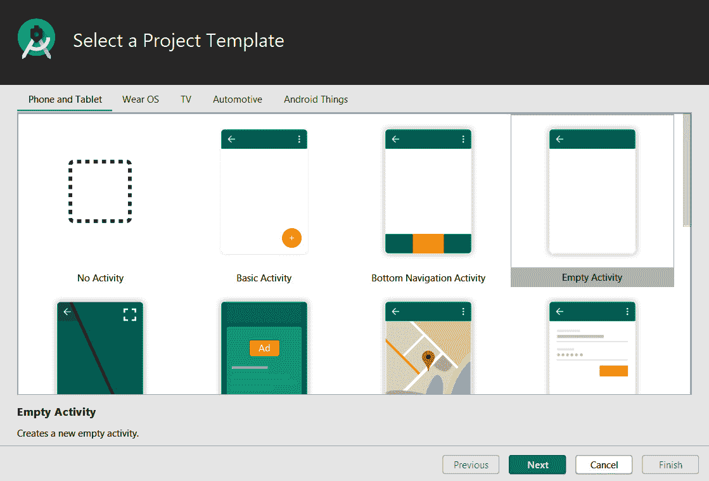

    图 1.11–选择项目模板

5.  确保选择**空活动**，然后点击**下一步**。
6.  After this, Android Studio will bring up the **Configure Your Project** window. This is where we will do the following:

    命名新项目。

    选择项目文件应该放在计算机的什么位置。

    如果我们决定在游戏商店发布游戏，请提供一个**包名**来区分我们的项目和其他项目。

    选择我们将使用的编程语言。

    我们项目的名称将是`Sub Hunter`，文件的位置将在我们在*设置AndroidStudio*部分创建的`Projects`文件夹中。

    包名几乎可以是你喜欢的任何东西。如果你有网站，可以使用`com.yourdomainname`的格式。如果没有，可以随意使用我的域名，`com.gamecodeschool.subhunter`，或者你自己刚刚虚构的东西。只有当你把它出版给谷歌 Play 商店的时候，它才是重要的。

    如果看不清楚下一张截图的细节，这里是我用的数值。请记住，根据您对包名称和项目位置的选择，您的可能会有所不同。此外，请注意，虽然项目名称在单词 **Sub** 和 **Hunter** 之间有一个空格，但是**保存位置**选项没有，这对于项目配置被 Android Studio 接受并继续进行非常重要:

    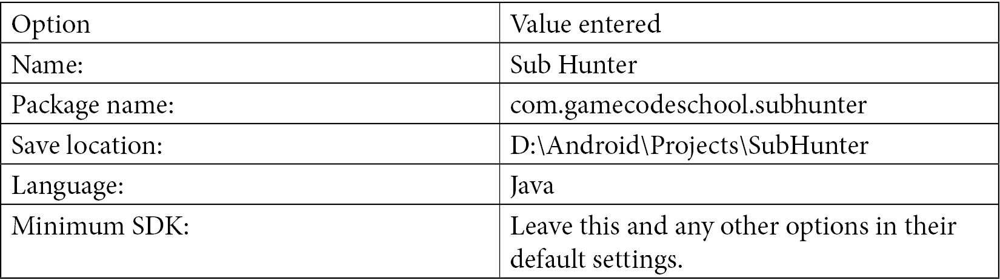

7.  The next screenshot shows the **Configure Your Project** screen once you have entered all of the required information:

    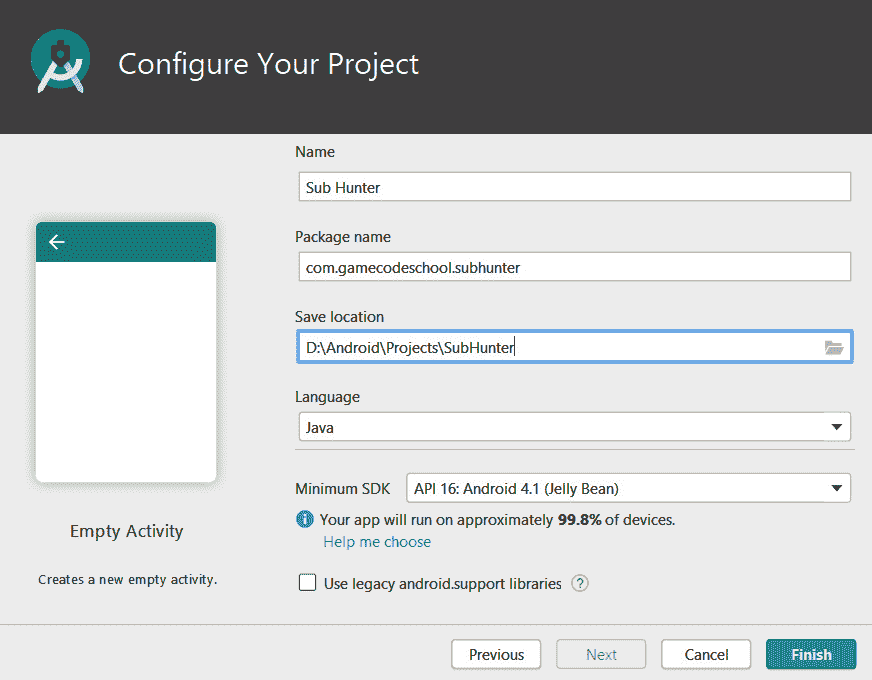

    图 1.12–配置您的项目

8.  In the previous screenshot, you can see the completed details. Yours might be the same or not – it doesn't matter.

    重要说明

    你可以用几种不同的语言编写安卓应用和游戏，包括 C++和 Kotlin。与使用 Java 相比，两者各有优缺点。学习 Java 是对这些其他语言的很好的介绍，Java 也是 Android 的官方语言之一。Play Store 上大多数顶级应用和游戏都是用 Java 编写的。

9.  Click on the **Finish** button.

    重要提示

    第一次创建新项目时，Android Studio 将启动另一次下载。AndroidStudio将建立 Gradle 构建系统，用于管理项目配置和部署。这只会发生在第一个项目。这本书不需要格雷德的知识。然而，如果你很好奇，那么一个简单的网络搜索会揭示更多。

让我们快速参观一下AndroidStudio和我们目前为止的项目。

如果这是你创建的第一个项目，AndroidStudio实际上会在后台做更多的下载和设置。在未来的项目中，它不需要这样做。

# AndroidStudio和我们的项目——一个非常简短的导游

我不会讨论所有几十个不同的窗口和菜单选项，因为我们会根据需要介绍它们。然而，这里有几个细节可以帮助你开始熟悉AndroidStudio。

看看下面的截图。你会注意到两个主要部分——一部分在左边，一个更大的窗口在右边:

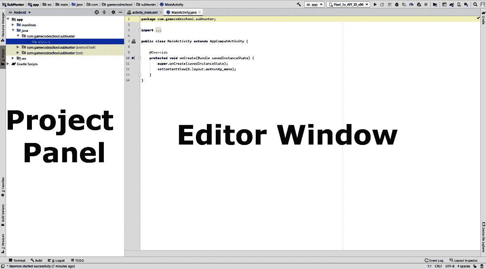

图 1.13–项目面板和编辑器窗口

让我们看看左边的面板。

## 项目面板

左边的面板可以变成各种不同的视图。我们需要它，就像它实际上是整本书一样。这是**项目**面板/窗口。让我们仔细看看:

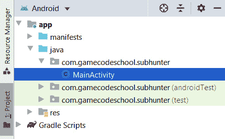

图 1.14–项目面板文件夹和子文件夹

可以看到有几个文件夹和子文件夹。对于大约 90%的每个项目，我们只需要一个文件夹。我指的文件夹是**Java**|**com . gamecode school . sub hunter**文件夹。就是里面有**主活动**文件的那个。**主活动**左侧的小蓝 **C** 图标表示该文件为**类**。我们将在整本书中探索课程。所有类文件的扩展名都是`.java`。类文件的扩展名没有显示在**项目**面板中。目前，您需要知道的是，类文件是一个包含代码的文件。

注意在**com . gamecode school . sub hunter**文件夹下(里面有 **MainActivity** 类文件)，还有两个同名的文件夹。然而，这些文件夹分别用单词 **(androidTest)** 和 **(test)** 后缀。每当我们添加新的代码文件时，它总是在顶部的文件夹 er 中——没有任何后缀的文件夹——当前只包含 **MainActivity** 类/文件。

请随意浏览其他文件夹。我们还将在以后的项目中使用 **res** 文件夹来添加声音文件和图形。我们也将对**舱单**文件夹中的文件进行简要调整。

从这一部分要带走的重要一点是，这是**项目**面板，我们所有的代码都将进入顶部**com . gamecoode school . sub hunter**文件夹。如果您之前在*开始第一个项目-子“猎人”*部分输入了不同的软件包名称，那么您的**项目**面板中的文件夹名称将会不同。然而，完全相同的原则适用——使用顶部的。

现在，让我们探索真实动作发生的地方——编辑器窗口。

## 编辑器窗口

顾名思义，这就是我们编辑代码的地方。通常，我们会将多个代码文件添加到`com.gamecodeschool.subhunter`文件夹中，并通过编辑器窗口向其中添加代码。我们可以同时打开多个代码文件进行编辑。看看下面这个代码编辑器的截图:

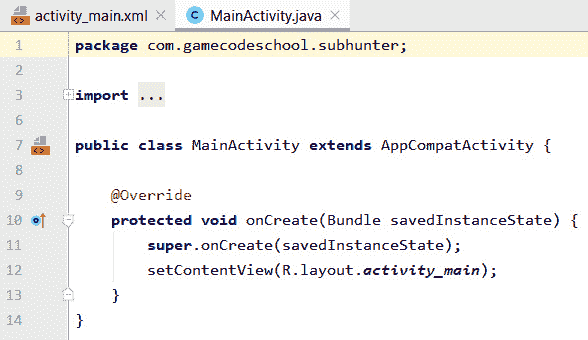

图 1.15–编辑器窗口中的代码文件

现在，为了准备下一部分，打开**项目**面板顶部的**清单**文件夹。您可以通过左键单击文件夹左侧的小三角形来实现。我在下面的截图中强调了这一点:

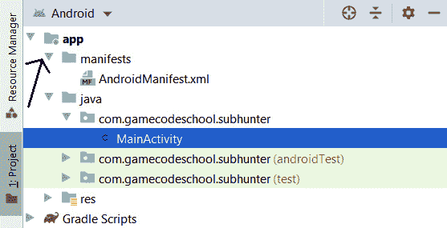

图 1.16–清单文件夹

在**清单**文件夹中，有一个单个文件，名为**和**。双击该文件，注意它已经在编辑器窗口中打开，并且我们现在在编辑器窗口上方有三个选项卡，以便我们可以在 **activity_main.xml** 、 **AndroidManifest.xml** 和**MainActivity.java**之间快速切换。下面的截图更清楚了:

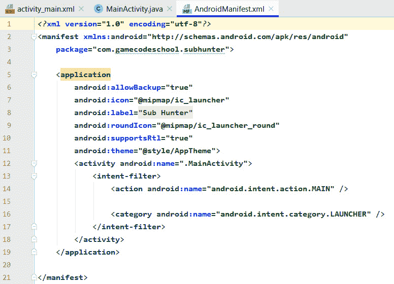

图 1.17–activity _ main . XML、AndroidManifest.xml 和 MainActivity.java 文件

请注意，在本书的上下文中，我们永远不需要`activity_main.xml`文件。它在有常规图形用户界面的应用程序中更常用，但在游戏中不太常用。你可以通过左键点击标签上的十字来关闭`activity_main.xml`文件。另外，请注意`MainActivity`的`.java`扩展。现在我们知道了我们的代码文件将去哪里，如何到达它们，以及如何编辑它们，我们可以继续下一个主题。

# 将主活动重构到子猎人

对我们代码的所有不同部分使用有意义的名称是一个很好的做法。随着项目的进展，我们会看到这一点。就目前而言，我认为`MainActivity`有点模糊和不确定。我们可以将就一下，但是让我们把它改名为更有意义的东西。这也将让我们看到如何使用AndroidStudio的**重构**工具。我们使用术语“重构”而不仅仅是“重命名”的原因是，当我们更改代码中使用的名称时，通常不仅仅是在幕后进行简单的名称更改。比如后来我们把`MainActivity`文件名重构为`SubHunter`的时候，AndroidStudio会改变文件名以及`AndroidManifest.xml`文件和`MainActivity.java`(很快就是`SubHunter.java`)文件中的一些代码。

在**项目**面板中，右键点击`MainActivity`文件，选择**重构** | **重命名**。在弹出窗口中，将`MainActivity`更改为`SubHunter`。将所有其他选项保留在默认设置中，然后左键单击**重构**按钮。

请注意**项目**面板中的文件名已经如预期的那样发生了变化，但是`AndroidManifest.xml`文件中的`MainActivity`与一起被多次更改为`SubHunter`，并且在`SubHunter.java`文件中有一个实例。如果您感兴趣，可以扫描这些文件来查看此内容；然而，我们将在接下来的章节中更详细地讨论这两个文件。

小费

重构是一个重要的工具，理解幕后发生的更多事情对于避免混乱至关重要。

随着我们的项目变得越来越先进，我们最终会在其中有几十个文件，使用有意义的名称对于保持组织是必不可少的。

现在我们可以设置用户安卓设备的屏幕了。

# 将游戏锁定为全屏和横向

我们想使用玩家的安卓设备提供的每个像素，所以我们将对`AndroidManifest.xml`文件进行更改。这个允许为我们的应用使用一种风格，在用户界面中隐藏所有默认菜单和标题。

确保`AndroidManifest.xml`文件在编辑器窗口中打开。如果你按照前面的部分，那么它已经打开了。

在`AndroidManifest.xml`文件中，找到下面一行代码:

```java
<android:name=".SubHunter">
```

将光标放在结束的`>`字符之前，如前面的代码所示。按下*回车*键几次，将`>`字符移动到该行剩余部分的下面几行。

紧接在`".SubHunter"`下方，但在新定位的`>`之前，键入或复制并粘贴下一行代码。这将使游戏在没有任何用户界面的情况下运行。

请注意，代码行显示在两行上，因为它太长，无法放入打印页面。但是，在 Android Studio 中，您应该将其输入为一行:

```java
android:theme=
"@android:style/Theme.Holo.Light.NoActionBar.Fullscreen"
```

这是一套复杂的步骤，也是我们在书中编辑的第一段代码。接下来，我将向您展示这个文件的更多代码，我们刚刚添加的代码突出显示了额外的上下文。如前所述，我不得不展示两行代码:

```java
<activity android:name=".SubHunter"
      android:theme=
      "@android:style/Theme.Holo.Light.NoActionBar.
 Fullscreen"
       >
      <intent-filter>
          <action android:name="android.intent.action.MAIN"
            />
<category android:name= "android.intent.category.LAUNCHER" />
      </intent-filter>
</activity>
…
```

我们刚才写的代码，以及`AndroidManifest.xml`剩下的内容，叫做**可扩展标记语言** ( **XML** )。安卓将 XML 用于几种不同的配置。没有必要学习这种语言，因为要完成本书中的所有项目，这种微小的修改是我们所需要做的。

现在我们的游戏将使用设备提供的所有屏幕空间，无需任何额外的菜单。

我们现在将对代码进行一些小的修改，然后我们就可以第一次运行我们的游戏了。

# 修改代码使用全屏和最好的安卓类

当你为安卓写代码时，你将永远在操作系统的范围内工作。由于安卓应用有如此多的变体，安卓团队为我们提供许多不同的选择是有道理的。我们现在将做一些小的改动，以便尽可能使用最高效的代码。

当我们生成该项目时，AndroidStudio构建了一个更适合常规应用程序和常规用户界面的项目。我们已经通过修改 XML 隐藏了操作栏。现在，我们将在`SubHunter.java`文件中进行一些小的代码更改，以使用更适合游戏开发的安卓类。

在`SubHunter.java`文件顶部附近找到下面一行代码:

```java
import androidx.appcompat.app.AppCompatActivity;
```

将前一行代码更改为与后一行代码相同:

```java
import android.app.Activity;
```

紧接在前一行代码之后，添加新的一行代码:

```java
import android.view.Window;
```

我们更改的代码行使我们能够使用更高效版本的安卓应用编程接口`Activity`而不是`AppCompatActivity`，新的代码行使我们能够使用`Window`类，这将在稍后进行。

此时，我们的代码中有错误。下一步将消除错误。在`SubHunter.java`文件中找到下面一行代码:

```java
public class SubHunter extends AppCompatActivity {
```

将前一行代码更改为与后一行代码相同:

```java
public class SubHunter extends Activity {
```

此时所有的错误都消失了。我们将只添加一行代码，然后删除一行无关的代码。在如下所示的相同位置添加下面一行突出显示的代码:

```java
@Override
protected void onCreate(Bundle savedInstanceState) {
      super.onCreate(savedInstanceState);
      requestWindowFeature(Window.FEATURE_NO_TITLE);

      setContentView(R.layout.activity_main);
}
```

我们的应用程序现在将没有标题栏或动作栏。这将是一个完整的，空的屏幕，我们可以让我们的游戏。

现在我们需要删除一行代码。我们要删除的代码是加载传统用户界面的代码。你还记得`activity_main.xml`文件吗？这是一个带有传统用户界面布局的文件。正如我们前面提到的，我们不需要它。查找并删除以下代码行:

```java
setContentView(R.layout.activity_main);
```

当我们运行应用程序时，用户界面将不再加载。

重要说明

如果你想开发常规的安卓应用，了解更多关于用户界面布局的知识，那就来看看我的书第三版*安卓编程初学者版*，这本书和你目前正在阅读的这本书是同时出版的。

我们现在可以继续讨论如何执行该应用程序。

# 部署游戏到目前为止

在我们能够正确地解释任何代码并学习我们的第一点 Java 之前，您可能会惊讶地得知我们已经可以运行我们的项目了。这将只是一个空白屏幕，但由于我们将尽可能频繁地运行游戏来检查我们的进度，让我们现在学习如何做到这一点。你有三个选择:

*   在你的电脑上的模拟器上运行游戏(这是AndroidStudio的一部分)。
*   在真实的安卓设备上以 USB 调试模式运行游戏。
*   将游戏导出为完整的安卓项目，可以上传到游戏商店。

第一个选项是最容易设置的，因为我们是作为设置AndroidStudio的一部分来设置的。如果你有一台功能强大的电脑，你很难看出仿真器和真实设备之间的区别。然而，屏幕触摸是通过鼠标点击来模拟的，因此不可能对玩家的体验进行适当的测试。

使用真实设备的第二个选项还有几个步骤；然而，一旦设置好，它就像选项一一样好，屏幕触摸是真实的。

最后一个选项需要几分钟(至少)来准备，然后您需要手动将创建的包放到一个真实的设备上并安装它。

最好的方法是使用模拟器快速测试代码中的微小增量，然后在真实设备上相当定期地使用 USB 调试模式，以确保事情仍按预期进行。您只是偶尔想要导出一个实际的可部署包。

小费

如果你有一台特别慢的电脑或一台特别旧的安卓设备，你只需要用一个或另一个选项运行本书中的项目就可以了。请注意，运行速度较慢的安卓手机可能还可以应付，但非常慢的电脑可能无法处理运行模拟器的游戏，而在手机/平板电脑上运行游戏会让你受益匪浅——尤其是后期的游戏。

出于这些原因，我现在将讲述如何在真实设备上使用仿真器和 USB 调试来运行游戏。

## 在安卓模拟器上运行游戏

按照这些简单的步骤在默认安卓模拟器上运行游戏:

1.  In the Android Studio menu bar, select **Tools** | **AVD Manager**. **AVD** stands for **Android Virtual Device** (that is, an emulator). You should see the following:

    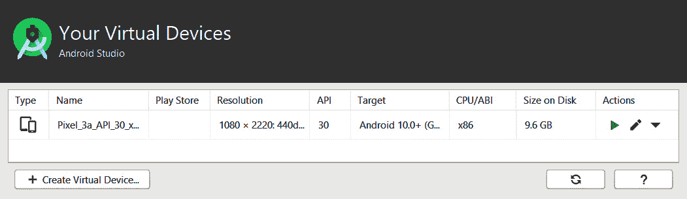

    图 1.18–自动车辆识别窗口

2.  Notice that there is an emulator in the list. In my case, it is **Pixel_3a…**. If you are following this at a later date, it will probably be a different emulator that was installed by default. It won't matter. Click on the green play icon, as shown in the following screenshot, and wait while the emulator boots up:

    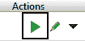

    图 1.19–仿真器的播放按钮

    重要说明

    默认情况下应该已经安装了模拟器。在用一个预发行版本测试时，我注意到默认情况下没有安装它。如果**您的虚拟设备**屏幕上没有列出仿真器，则选择**工具** | **AVD 管理器** | **创建虚拟设备…** | **下一步** | **R 下载** | **接受** | **下一步**，将下载并安装默认仿真器。安装完成后，点击**完成**，然后点击**下一步**，最后再次点击**完成**。现在，您可以参考上一步来运行模拟器。

    现在你应该看到模拟器了，如下图截图所示:

    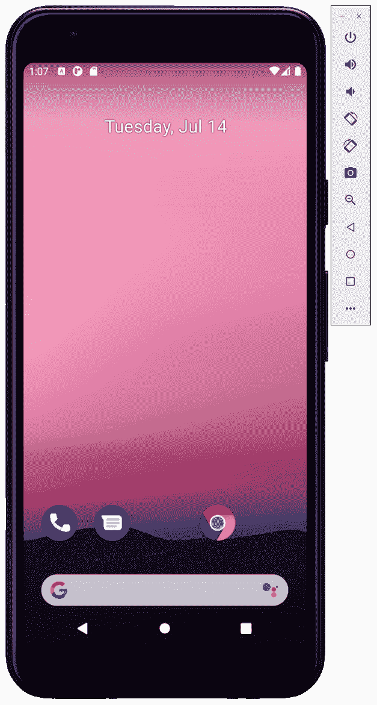

    图 1.20–模拟器屏幕

3.  All of our games will only run as intended when the device is in landscape orientation. Left-click on the rotate left icon in the emulator control panel, as shown in the following screenshot. The device will rotate to landscape orientation:

    

    图 1.21–将设备旋转至横向

4.  尽管已经旋转了屏幕，模拟器也有可能被设置为禁用自动旋转。如果是这种情况，那么在模拟器上，选择**设置** | **显示** | **自动旋转屏幕**。
5.  现在可以点击AndroidStudio快速启动栏中的播放图标，如下图截图所示。出现提示时，选择模拟器的名称，游戏将在模拟器上启动:

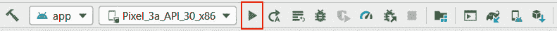

图 1.22–在模拟器上启动游戏

你完蛋了。以下是目前为止跑步游戏的样子:

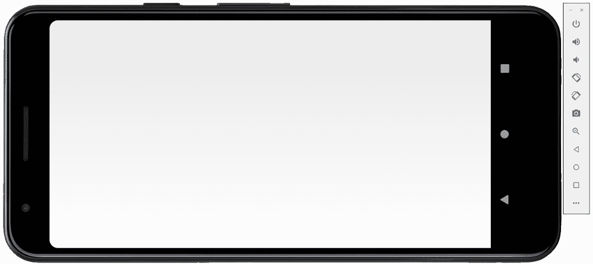

图 1.23–在模拟器上运行游戏屏幕

显然，我们还有更多工作要做！但是，我们可以在干净的白色画布上开始描绘我们未来的游戏，这是一个良好的开端。让我们看看如何在一个真实的设备上做同样的事情，然后我们可以进一步构建 Sub' Hunter。

## 在真实设备上运行游戏

您需要做的第一件事是访问您的设备制造商的网站，获取并安装您的设备和操作系统所需的任何驱动程序。

小费

大多数较新的设备不需要驱动程序。因此，您可能想先尝试以下步骤。

接下来的几个步骤将设置安卓设备进行调试。请注意，不同的制造商对菜单选项的结构略有不同。但是，对于在大多数设备上启用调试来说，以下顺序可能非常接近(如果不是精确的话):

1.  点击手机/平板电脑上的**设置**菜单选项或**设置**应用程序。
2.  对于不同版本的安卓，下一步会略有不同。**开发者** **选项**菜单隐藏起来，以免麻烦普通用户。您必须执行一个稍微奇怪的任务来解锁菜单选项。点击**关于设备**或**关于电话**选项。找到**构建号**选项，反复点击，直到收到消息通知**你现在是开发者了！**。
3.  回到**设置**菜单。
4.  点击**开发者选项**。
5.  点击 **USB 调试**复选框。
6.  将安卓设备连接到电脑的 USB 端口。
7.  Click on the play icon from the Android Studio toolbar, as shown in the following screenshot:

    

    图 1.24–调试游戏

8.  出现提示时，点击**确定**在您选择的设备上运行游戏。

我们现在准备学习一些 Java，并开始编写 Sub' Hunter 项目的代码。

# 总结

在第一章中，我们已经讨论了很多内容。我们了解了为什么游戏、安卓和 Java 都是学习编程的有用且潜在盈利的方式。我们发现了安卓和 Java 是如何协同工作的，我们已经看了我们将在本书中构建的五个游戏。最后，我们开始了第一个游戏，Sub' Hunter，并部署了一个空白项目到一个模拟器和一个真实的设备。

在下一章中，我们将学习 Java 和一般编码的第一套基础知识。此外，我们将触及一些更高级的 Java 主题的表面，我们将在整本书中继续回到这些主题。这些主题包括 OOP、类、对象和方法，我们将探索这些主题是如何紧密相关的。

接下来，我们可以理解AndroidStudio为我们生成并修改的代码(在`SubHunter.java`中)，然后我们可以开始键入自己的代码。