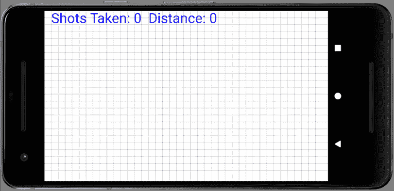
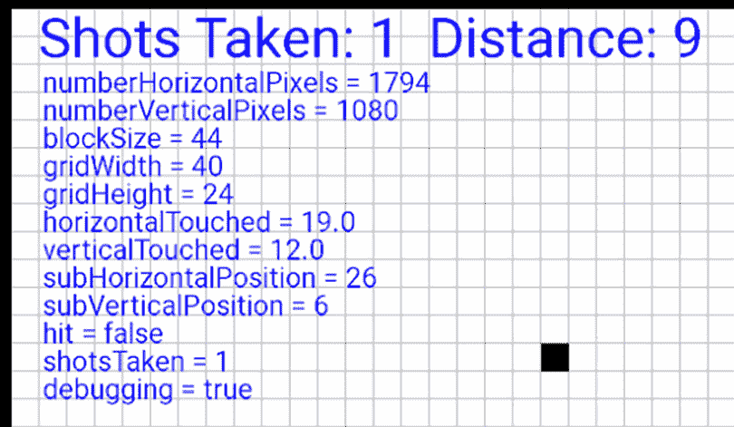
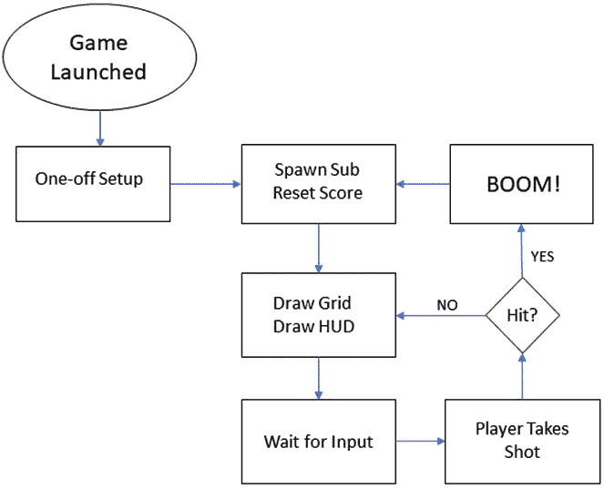
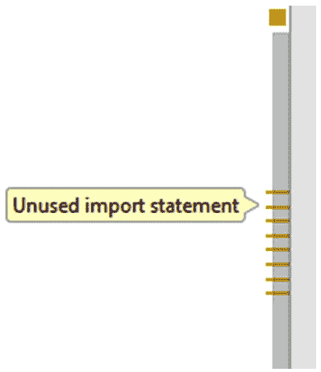
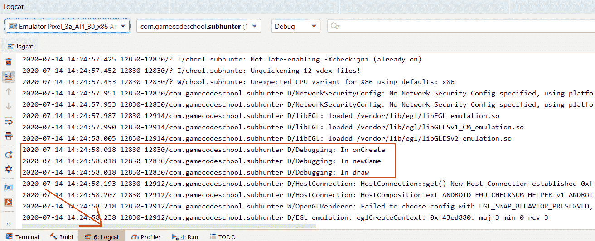
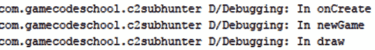
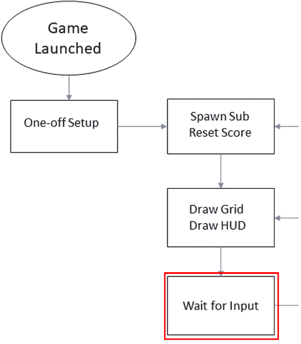

# *第二章*:爪哇–第一次接触

在这一章中，我们将在 Sub' Hunter 游戏中取得重大进展，尽管这是我们关于 Java 的第一课。我们将详细探索 Sub' Hunter 将如何玩，以及我们完成的代码实现游戏所需的步骤/流程。

我们还将了解 Java 如何使用代码**注释**来记录代码，对**方法**进行简短的初步浏览来构建我们的代码，对**面向对象编程** ( **OOP** 进行更简短的初步浏览，这将开始揭示 Java 和安卓应用编程接口的力量。

我们在 [*第 1 章*](01.html#_idTextAnchor013)*中提到的自动生成的代码 Java、Android 和游戏开发*也将在我们继续添加更多代码时进行解释。在本章中，我们将涵盖以下主题:

*   策划潜艇猎人游戏
*   介绍 Java 方法
*   用方法构造潜艇猎人
*   介绍面向对象程序设计
*   使用 Java 包
*   连接潜艇猎人的方法

首先，让我们做一些计划。

# 策划潜艇猎人游戏

这个 游戏的目标是在尽可能少的移动中找到并摧毁敌人的潜艇。玩家进行射击，每次通过考虑来自所有先前射击的距离反馈(或声纳探测)来猜测潜艇的位置。

游戏开始，玩家面对一个空格子，里面有一艘随机放置(隐藏)的潜艇潜伏在某处:



图 2.1–潜艇猎人游戏画面

网格代表大海，网格上的每个地方都是玩家正在猎杀的潜艇可能的藏身之处。玩家通过猜测潜艇可能藏在哪里并点击网格上的一个方块来射击潜艇。在下面的屏幕截图中，突出显示了轻击的正方形，从轻击的正方形到潜艇的距离在屏幕顶部显示为一个数字:


图 2.2-在潜艇猎人游戏中拍摄

这个反馈意味着潜艇隐藏在上的某个地方*(不在)15 个方块的半径内，就像上一张截图中展示的那样。*

重要说明

请注意，上一张截图中的虚线圆圈不是游戏的一部分。我试图根据距离解释潜艇可能的藏身之处。

当玩家拍摄更多的镜头时，他们可以对潜艇的可能位置建立一个更好的心理图像，直到最终，他们猜出确切的方块，游戏就赢了:


图 2.3–尝试再次开始游戏

一旦玩家摧毁了潜艇，屏幕上的下一次点击将在随机位置产生一个新的潜艇，游戏再次开始。

除了游戏本身，我们还将编写代码来显示调试信息，这样我们就可以测试游戏并检查是否一切正常。下面的截图显示了在启用调试信息的情况下运行的游戏:



图 2.4–游戏的调试信息

让我们更仔细地观察一下玩家的行为，以及游戏需要如何应对这些行为。

## 行动流程图/示意图

在我们开始敲击键盘之前，我们需要计划好我们的代码。在学会如何编码之前，您可能想知道如何规划您的代码，但是这非常简单。研究以下流程图；我们将讨论它，然后引入一个新的 Java 概念来帮助我们将计划付诸行动。沿着箭头的路径，注意流程图上的菱形，我们的代码将在这里做出决定，代码的执行可以是任何一种方式:



图 2.5–使用流程图规划游戏

流程图显示游戏将采取的步骤，如下所示:

1.  游戏是通过点击应用抽屉中的图标(或在安卓工作室中运行)来启动的。
2.  “sub”通过生成随机的水平和垂直数字放置在随机的位置。如果这不是第一次玩游戏，分数将被设置为零。
3.  接下来，所有内容都被绘制到屏幕:网格线和文本(**抬头显示**或**抬头显示**，包括调试文本(如果启用)。
4.  此时，游戏什么也不做。它正在等待玩家点击屏幕。
5.  当玩家轻击屏幕时，被轻击的像素被转换成网格上的一个位置，该位置与 sub '的位置进行比较。**命中？**菱形说明了这种对比。在这里，程序可以返回到绘制阶段，重新绘制所有内容，包括网格位置。
6.  或者，如果有击中，那么**轰！**画面显示。
7.  事实上，**轰！**部分并不完全像我们在那里看到的那样。此时，**等待输入**阶段也处理等待屏幕点击。当屏幕再次被敲击时，被认为是下一场比赛的第一个镜头；代码的流程移回**产卵子重置分数**代码，整个过程重新开始。随着项目的进展，这将变得更加清晰。

本章接下来的两节将向您展示如何用真实的 Java 代码来充实这个设计。然后，在下一章中，我们将能够在屏幕上查看真实结果。

### 代码注释

随着您在编写 Java 程序方面变得更加先进，您用来创建程序的解决方案将变得更长、更复杂。此外，正如您将在本章和整本书的后续部分中看到的，Java 旨在通过让我们将代码分成单独的块，并且通常跨多个文件来管理复杂性。

注释是 Java 程序的一部分，在程序本身中没有任何功能。编译器会忽略它们。它们的作用是帮助程序员记录、解释和澄清他们的代码，以便以后(甚至很久以后)或者其他可能需要引用或修改代码的程序员更容易理解。因此，一段好的代码将会大量地添加类似这样的行:

```java
// This is a comment explaining what is going on
```

前面的注释以两个正斜杠字符`//`开始。注释在行尾结束。这就是所谓的单行注释。所以，那一行的任何内容都只供人类使用，而下一行的任何内容(除非是另一条注释)都需要语法正确的 Java 代码:

```java
// I can write anything I like here
but this line will cause an error unless it is valid code
```

我们也可以使用多个单行注释:

```java
// Below is an important note
// I am an important note
// We can have many single line comments
```

如果我们想暂时禁用一行代码，单行注释也很有用。我们可以把`//`放在代码前面，它不会包含在程序中。下面这段代码是有效代码，导致安卓在屏幕上绘制我们的游戏。我们将在本书的许多项目中看到它:

```java
// setContentView(gameView);
```

在前面的场景中，代码不会运行，因为编译器认为它是一个注释，屏幕将是空白的。Java 中还有另一种类型的注释——多行注释。这对于较长的注释以及在代码文件顶部添加版权信息等内容非常有用。此外，像单行注释一样，它可以用来暂时禁用代码——在这种情况下，它通常是多行的。

编译器会忽略前导`/*`符号和结尾`*/`符号之间的所有内容。以下是一些例子:

```java
/*
A Java expert wrote this program.
You can tell I am good at this because
the code has so many helpful comments in it.
*/
```

多行注释的行数没有限制。哪种类型的评论最好使用将取决于情况。在这本书里，我将总是明确地解释每一行代码，但是你也会发现在代码本身中有大量的注释，这些注释增加了进一步的解释、洞察或澄清。因此，阅读所有代码总是一个好主意:

```java
/*
The winning lottery numbers for next Saturday are
9,7,12,34,29,22
But you still want to learn Java? Right?
*/
```

小费

所有优秀的 Java 程序员都会在代码中大量添加注释。

让我们为“潜艇猎人”项目添加一些有用的评论。

## 使用注释绘制我们的代码

现在，我们将在代码中添加一些单行和多行注释，这样我们就知道在整个项目中我们将在哪里添加代码，以及它的预期目的是什么。

在 [*第 1 章*](01.html#_idTextAnchor013)*Java、Android 和游戏开发*中，我们在`AndroidManifest.xml`文件中只留下了几行代码，以便将玩家的屏幕锁定为横向并使用全屏。

打开安卓工作室，点击编辑器窗口中的**SubHunter.java**选项卡。现在，您可以在类文件中看到代码。

参考我们的流程图，我们有**一次性设置**元素。在安卓系统中，操作系统决定了我们程序的某些部分必须发生在哪里。因此，在现有代码中添加高亮显示的多行注释，如下所示。我们将在稍后的*链接我们的方法*部分中探讨为什么这部分代码是我们进行**一次性设置**元素的地方。

重要说明

本章的完整代码可以在`Chapter 2`文件夹的 GitHub repo 中找到。

现在，添加这里显示的高亮代码:

```java
package com.gamecodeschool.c2subhunter;
import android.app.Activity;
import android.os.Bundle;
public class SubHunter extends Activity {
    /*
Android runs this code just before 
        the player sees the app.
This makes it a good place to add 
        the code for the one-time setup phase.
     */

@Override
    protected void onCreate(Bundle savedInstanceState) {
        super.onCreate(savedInstanceState);
    }
}
```

接下来，在代码的最后一个大括号`}`之前，添加以下突出显示的注释。我已经在新注释之前突出显示了一些现有代码，以明确在哪里添加新注释:

```java
   …
@Override
    protected void onCreate(Bundle savedInstanceState) {
        super.onCreate(savedInstanceState);
    }
    /*
        This code will execute when a new
        game needs to be started. It will
        happen when the app is first started
        and after the player wins a game.
     */
    /*
        Here we will do all the drawing.
        The grid lines, the HUD and
        the touch indicator
     */
    /*
        This part of the code will
        handle detecting that the player
        has tapped the screen
     */
    /*
        The code here will execute when
        the player taps the screen. It will
        calculate the distance from the sub'
        and decide a hit or miss
     */
    // This code says "BOOM!"
    // This code prints the debugging text
}
```

前面的评论有几个目的。首先，我们可以看到我们的流程图计划的每个方面都有它的代码要去的地方。第二，这些注释将有助于提醒我们接下来的代码会做什么，最后，当我们开始为每个部分添加代码时，我将能够演示您需要在哪里键入新代码，因为它将与这些注释处于相同的上下文中。

小费

在继续之前，请确保您已经阅读了评论并研究了流程图。

我们还将添加更多注释来解释每个部分中的特定代码行。

我一直在提*节*。Java 对此有一个词:**方法**。

# 介绍 Java 方法

Java **方法**是一种组织和划分代码的方式。它们是一个相当复杂的主题，对它们的全面理解需要其他 Java 主题的知识。到这本书的最后，你将成为一个方法忍者。然而，就目前而言，一个基本的介绍将是有用的。

方法有名字来区别于其他方法，并帮助程序员识别它们做什么。Sub' Hunter 游戏中的方法会有`draw`、`takeShot`、`newGame`和`printDebuggingText`等名称。

请注意，具有特定目的的代码可以包装在方法中；例如，看一下下面的代码片段:

```java
void draw(){
      // Handle all the drawing here
}
```

前面的方法名为`draw`，可以保存绘制我们游戏的所有代码行。当我们用代码设定一个方法时，它就是所说的方法**定义**。前缀`void`关键字和后缀`()`看起来很奇怪，将在 [*第 4 章*](04.html#_idTextAnchor086)*用 Java 方法构造代码*中解释。但是，现在你只需要知道`draw`方法内部的所有代码都会在另一部分代码想要执行的时候被执行。

当我们想从代码的另一部分启动一个方法时，我们说我们**调用**方法。我们用下面的代码调用`draw`方法:

```java
draw();
```

请注意以下几点，尤其是最后一点，这一点非常重要:

*   方法可以调用其他方法。
*   我们可以想调用多少次方法就调用多少次。
*   方法定义在代码文件中出现的顺序并不重要。如果定义存在，可以从该文件中的代码调用它。
*   当被调用的方法完成其执行时，程序执行返回到方法调用之后的行。

因此，在我们的示例程序中，流程如下所示:

```java
…
// Going to go to the draw method now
draw(); // All the code in the draw method is executed
// Back from the draw method
// Any more code here executes next
…
```

重要说明

在 [*第八章*](08.html#_idTextAnchor147)*面向对象编程*中，我们还将探讨如何从一个文件调用另一个文件的方法。

通过将 Sub' Hunter 游戏的逻辑编码成方法，并从其他合适的方法中调用合适的方法，我们可以实现流程图中指示的动作流程。

## 覆盖方法

在你做更多的编码之前，关于方法还有一件事你需要知道。我前面提到的所有方法(例如`draw`、`takeShot`、`newGame`、`printDebuggingText`)都是*我们*将要编码的方法。它们是我们自己的方法，仅供我们使用。

然而，有些方法是由安卓应用编程接口提供的，是为了我们(以及所有安卓程序员)的方便——我们可以忽略它们，也可以修改它们。如果我们决定去适应它们，那么这就叫做**压倒**。

在安卓系统中，我们可以覆盖很多方法，但是有一种方法被覆盖的频率非常高，以至于它被自动包含在自动生成的代码中。再看一下这部分代码:

```java
@Override
protected void onCreate(Bundle savedInstanceState) {
     super.onCreate(savedInstanceState);
}
```

在前面的代码中，我们覆盖了`onCreate`方法。请注意，该名称的前缀和后缀相当复杂。当我们在 [*第 4 章*](04.html#_idTextAnchor086)*用 Java 方法构造代码*中更彻底地处理方法时，将会解释这里到底发生了什么。

重要说明

`super.onCreate…`代码也将深入讨论。但是如果你等不及了，这里有一个简单的解释:代码的`super.onCreate…`部分正在调用同样存在的另一个版本的`onCreate`方法，尽管我们看不到它。这是我们正在超越的。

现在我们可以将方法定义添加到 Sub' Hunter 代码中。

# 用方法构建 Sub' Hunter

当我们将方法定义添加到代码中时，每种方法的发展方向都不会令人惊讶。`draw`法后会去评论一下`…` `do` `all` `the` `drawing…`等等。

在适当的注释后添加`newGame`方法定义，如下所示:

```java
/*
     This code will execute when a new
     game needs to be started. It will
     happen when the app is first started
     and after the player wins a game.
 */
void newGame(){
}
```

在适当的注释后添加`draw`方法定义，如下图所示:

```java
/*
     Here we will do all the drawing.
     The grid lines, the HUD,
     the touch indicator and the
     "BOOM" when a sub' is hit
*/
void draw() {
}
```

在此注释后添加`onTouchEvent`定义，如下所示:

```java
/*
     This part of the code will
     handle detecting that the player
     has tapped the screen
 */
@Override
public boolean onTouchEvent(MotionEvent motionEvent) {
}
```

注意`onTouchEvent`方法是另一个被覆盖的方法。安卓为我们的利益提供了这个方法，当玩家触摸屏幕时，它会调用这个方法。我们现在需要做的就是解决当`onTouchEvent`方法被调用时如何处理触摸。这段代码中也有一个错误，但是我们将在稍后开始学习 OOP 时解决这个问题。

现在，在注释后添加`takeShot`方法定义，如下:

```java
/*
     The code here will execute when
     the player taps the screen It will
     calculate the distance from the sub'
     and determine a hit or miss
 */
void takeShot(){
}
```

在注释后添加`boom`方法定义，如下:

```java
// This code says "BOOM!"
void boom(){
}
```

现在，在关于调试文本的注释后添加`printDebuggingText`定义:

```java
// This code prints the debugging text
void printDebuggingText(){
}
```

随着项目的进展，我们将向每个方法定义添加代码，因为此时它们是空的，因此什么也不做。此外，随着我们对方法的了解越来越多，方法名称的后缀和前缀也将不断发展，变得更容易理解。

一个与方法密切相关并且有助于更好地理解它们的概念是 OOP。

# 引入面向对象程序设计

OOP 使做特别的事情变得容易。可以用一台机器，也许是一辆汽车，来做一个简单的类比。当你踩下油门时，引擎盖下发生了一大堆事情。我们不需要理解什么是燃烧或燃油泵，因为一个聪明的工程师已经为我们提供了一个界面。在这种情况下，一个机械接口，也就是油门踏板。

以下面一行 Java 代码为例；对于初学者来说，这本书这么早看起来可能有点吓人:

```java
locationManager.getLastKnownLocation(LocationManager.GPS_PROVIDER)
```

然而，一旦你知道这一行代码在太空中搜索可用的卫星，然后在环绕地球的轨道上与它们通信，同时检索你在地球上的精确纬度和经度，就很容易开始瞥见面向对象程序的力量和深度。即使这段代码看起来有点长，有点吓人，想象一下用其他方式和卫星通话吧！

Java 是一种编程语言，比安卓存在的时间要长得多。它是一种面向对象的语言。这意味着它使用了可重用编程对象的概念。如果这听起来像技术术语，另一个类比会有帮助。Java 使我们和其他人(比如安卓开发团队)能够编写可以基于现实世界“事物”进行结构化的 Java 代码，这里需要注意一点:**它可以被重用**。

## 类和对象

所以，用汽车类比，我们可以问这样一个问题:如果一个制造商一天生产多辆汽车，他们会在将每个零件安装到每辆汽车上之前重新设计吗？

答案当然是否定的。他们让高技能的工程师开发出完全正确的零件，这些零件经过多年的进一步磨砺、提炼和改进。然后，相同的部分被重复使用，偶尔还会进一步改进。现在，如果你想挑剔我的类比，那么你可以争辩说，汽车的每个部件仍然必须使用现实生活中的工程师或机器人从原材料中制造。这是真的。再坚持一下我的类比。

### 面向对象程序设计最重要的是

软件工程师在编写代码时所做的是为一个对象构建蓝图。然后，我们使用 Java 代码从他们的蓝图中创建一个对象，一旦我们有了这个对象，我们就可以配置它、使用它、将它与其他对象组合等等。

此外，我们可以设计自己的蓝图，也可以用它们制作物品。然后，编译器将我们定制的作品翻译(即制造)成可以由安卓设备运行的工作代码。

## 类、对象和实例

在 Java 中，蓝图被称为**类**。当一个类被转化为一个真实的工作事物时，我们称之为类的一个**对象**或者一个**实例**。

小费

在编程中，“实例”和“对象”这两个词实际上是可以互换的。然而，有时候，一个词似乎比另一个词更合适。此时，您需要知道的是，对象/实例是类/蓝图的工作实现。

目前，我们几乎已经完成了面向对象程序设计。

## 关于面向对象、类和对象的最后一句话——现在

类比只对某一点有用。如果我们简单地总结一下我们现在需要知道的事情，会更有用:

*   Java 是一种语言，它允许我们编写一次可以反复使用的代码。
*   这非常有用，因为它节省了我们的时间，并允许我们使用他人的代码来执行任务。否则，我们可能没有时间或知识为自己写它。
*   很多时候，我们甚至不需要看到别人的代码，甚至不需要知道它是如何工作的！

让我们考虑最后一个类比。我们只需要知道如何使用该代码，就像我们只需要学习如何驾驶汽车，而不是制造汽车一样。

因此，谷歌总部的一名聪明的软件工程师编写了一个极其复杂的 Java 程序，可以与卫星通信。然后，他考虑如何让所有编写位置感知应用程序和游戏的安卓程序员都能轻松获得这些代码。他所做的事情之一是，他将任务(例如获取设备在地球表面的位置)转化为简单的单行任务。因此，我们之前看到的一行代码将更多我们看不到的代码付诸行动。这是一个使用别人的代码使我们的代码变得无限简单的例子。

揭开卫星代码的神秘面纱

又来了:

`locationManager.getLastKnownLocation(LocationManager.GPS_PROVIDER)`

`locationManager`是从类构建的对象，`getLastKnownLocation`是在该类中定义的方法。构建`locationManager`对象的类和`getLastKnownLocation`方法中的代码都异常复杂。然而，我们只需要知道如何使用它们，而不是自己编写代码。

在本书中，我们将使用大量 Android API 类及其方法，使开发游戏变得更加容易。我们还将制作和使用我们自己的可重用类。

可重用类

所有方法都是类的一部分。为了使用方法，您需要一个由类构建的对象。这将在 [*第 8 章*](08.html#_idTextAnchor147)*面向对象编程*中详细解释。

如果你担心使用这些课程是某种欺骗，那么放松。这是你应该做的。事实上，许多开发人员“欺骗”的远不止简单地使用类。他们使用预制的游戏库，如 libGDX，或完整的游戏引擎，如 Unity 或虚幻。我们将在没有这些欺骗的情况下教你 Java，让你做好准备，如果你愿意的话，继续学习库和引擎。

但是这些课都在哪里呢？你还记得我们输入方法定义时的这段代码吗？仔细看看下面的代码:

```java
/*
     This part of the code will
     handle detecting that the player
     has tapped the screen
 */
@Override
public boolean onTouchEvent(MotionEvent motionEvent) {
     return true;
}
```

之前的代码出现错误有两个原因。第一个原因是安卓工作室对`MotionEvent`类一无所知——还没有。此外，请注意，在前面的代码中，我添加了一行代码，如下所示:

```java
return true;
```

这是出现错误的第二个原因。这将在 [*第 4 章*](04.html#_idTextAnchor086)*用 Java 方法构造代码*中进行全面解释。现在，只需添加高亮显示的代码行`return true;`，它正好出现在前面代码中的位置。不要错过结尾的分号(`;`)。

我们接下来讨论**包**的时候会解决`MotionEvent`错误。

# 使用 Java 包

**包**被分组为类集合。如果您查看我们到目前为止编写的代码的顶部，您会看到这些代码行:

```java
import android.app.Activity;
import android.view.Window;
import android.os.Bundle;
```

这些代码行使`Activity`和`Bundle`类及其方法可用。像这样注释掉前面的两行:

```java
//import android.app.Activity;
import android.view.Window;
//import android.os.Bundle;
```

现在看看你的代码，你至少会在三个地方看到错误。单词`Activity`有一个错误，因为`Activity`是安卓工作室在下面一行中不再知道的类:

```java
public class SubHunter extends Activity {
```

`onCreate`这个词也有一个错误，因为它是来自`Activity`类的方法，`Bundle`这个词有一个错误，因为它是一个自从我们注释掉前面两行之后，Android Studio 就不再知道的类。下一行突出显示了错误所在:

```java
protected void onCreate(Bundle savedInstanceState) {
```

取消两行代码的注释以解决错误，我们将为这个项目中使用的其余类添加更多的`import…`代码，包括一个修复`MotionEvent`类错误的代码。

## 通过导入包添加类

我们将通过为`MotionEvent`类添加一个`import`语句来解决`onTouchEvent`方法声明中的错误，该错误导致了问题。在两个现有的`import`语句下面，添加这个新语句，我已经强调过了:

```java
package com.gamecodeschool.subhunter;
// These are all the classes of other people's
// (Android) code that we use for Sub Hunter
import android.app.Activity;
import android.os.Bundle;
import android.view.MotionEvent;
```

检查`onTouchEvent`方法，你会看到错误消失了。现在，在您刚刚添加的语句下面直接添加这些进一步的`import`语句，这将负责导入我们整个游戏所需的所有类。由于我们在接下来的五章中使用了每节课，我将正式介绍它们。在前面的代码中，我还添加了一些注释来提醒我`import`语句是做什么的。

添加突出显示的代码。语法需要精确，因此请考虑复制并粘贴代码:

```java
// These are all the classes of other people's
// (Android API) code that we use in Sub'Hunt
import android.app.Activity;
import android.view.Window;
import android.os.Bundle;
import android.view.MotionEvent;
import android.graphics.Bitmap;
import android.graphics.Canvas;
import android.graphics.Color;
import android.graphics.Paint;
import android.graphics.Point;
import android.view.Display;
import android.util.Log;
import android.widget.ImageView;
import java.util.Random;
```

请注意，新的代码行在安卓工作室中是灰色的。这是因为我们还没有使用它们，在这个阶段，它们中的许多在技术上是不必要的。此外，如果我们将鼠标指针悬停在未使用的`import`语句右侧的黄色小指示器上，安卓工作室会发出警告:



图 2.6–指示未使用的导入语句

这不是问题，我们这样做是为了方便，因为这是第一个项目。在下一个项目中，我们将学习如何在需要时添加`import`语句，而无需大惊小怪。

我们已经简单提到了`Activity`类。然而，我们需要了解更多一点才能继续。我们将这样做，同时将我们的方法与方法调用联系起来。

# 把我们的方法联系起来

到目前为止，我们知道我们可以用这样的代码来定义方法:

```java
void draw(){
     // Handle all the drawing here
}
```

我们可以用这样的代码调用/执行方法:

```java
draw();
```

我们也提到了，在我们的评论中也提到了`onCreate`方法(由安卓自动提供)将处理流程图的**一次性设置**部分。

原因是所有安卓游戏(以及绝大多数其他安卓应用)都必须有一个`Activity`类作为起点。`Activity`是与操作系统交互的东西。没有一个，操作系统就不能运行我们的代码。操作系统与我们的代码交互和执行的方式是通过`Activity`类的方法。`Activity`类有很多方法，但是我们现在关心的是`onCreate`方法。

当玩家在他们的屏幕上点击我们游戏的图标时，安卓本身就会调用`onCreate`方法。

重要说明

其实调用的方法有很多，但是`onCreate`就足够完成 Sub' Hunter 游戏了。当我们编写更复杂的游戏时，我们将了解并使用更多操作系统可以调用的方法。

目前，我们需要知道的是如何将**一次性设置**代码放入`onCreate`，我们可以确定它将在我们的任何其他方法之前执行。

如果你看流程图，你会注意到我们要从`onCreate`的末尾开始调用`newGame`，之后我们要初步绘制屏幕，所以我们也调用`draw`。添加此突出显示的代码，如下所示:

```java
/*
     Android runs this code just before
     the app is seen by the player.
     This makes it a good place to add
     the code that is needed for
     the one-time setup.
 */
@Override
protected void onCreate(Bundle savedInstanceState) {
     super.onCreate(savedInstanceState);

     requestWindowFeature(Window.FEATURE_NO_TITLE);
     Log.d("Debugging", "In onCreate");
     newGame();
draw();
}
```

这样我们就可以跟踪代码的流程，如果有必要的话，还可以调试我们的游戏，前面的代码不仅调用了`newGame`方法，然后是`draw`方法，而且还包含以下代码行:

```java
Log.d("Debugging", "In onCreate");
```

这段代码会在 Android Studio 中打印出一条消息，让我们知道自己是“`Debugging`”，自己是“`In onCreate`”。一旦我们连接了其余的方法，我们将查看这个输出，看看我们的方法是否如我们预期的那样工作。

现在，让我们在`newGame`方法中打印一些文本，这样我们就可以看到它也被调用了。添加以下突出显示的代码:

```java
/*
     This code will execute when a new
     game needs to be started. It will
     happen when the app is first started
     and after the player wins a game.
 */
public void newGame(){
     Log.d("Debugging", "In newGame");

}
```

接下来，为了实现我们流程图的过程，我们需要从`onTouchEvent`方法调用`takeShot`方法。此外，请注意，我们在此打印一些文本用于跟踪目的。请记住，当玩家触摸屏幕时，安卓会调用`onTouchEvent`方法。将高亮显示的代码添加到`onTouchEvent`方法:

```java
/*
     This part of the code will
     handle detecting that the player
     has tapped the screen
 */
@Override
public boolean onTouchEvent(MotionEvent motionEvent) {
      Log.d("Debugging", "In onTouchEvent");
      takeShot();

      return true;
}
```

让我们完成所有的连接。按照流程图，在`takeShot`方法中添加对`draw`方法的调用以及一些调试文本:

```java
/*
     The code here will execute when
     the player taps the screen It will
     calculate the distance from the sub'
     and determine a hit or miss
 */
void takeShot(){
     Log.d("Debugging", "In takeShot");
     draw();
}
```

在`draw`方法中，我们将只打印到安卓工作室来显示它正在被调用。请记住，在流程图上，我们完成绘图后，等待触摸。由于`onTouchEvent`方法处理此事，直接接收安卓系统的调用，因此无需将`draw`方法连接到`onTouchEvent`方法。

重要说明

安卓和`onTouchEvent`方法的连接是永久的，永远不会中断。当我们在 [*第九章*](09.html#_idTextAnchor180)**游戏引擎、线程和游戏循环*中讨论线程时，我们将探索这是如何可能的。*

 *将以下高亮显示的代码添加到`draw`方法中:

```java
/*
     Here we will do all the drawing.
     The grid lines, the HUD,
     the touch indicator and the
     "BOOM" when a sub' is hit
 */
void draw() {
     Log.d("Debugging", "In draw");
}
```

请注意，我们没有向`printDebuggingText`或`boom`方法添加任何代码。我们也没有从任何其他方法中调用这些方法。这是因为我们需要学习更多的 Java，然后在向这些方法添加任何代码之前做更多的编码。

当我们运行我们的游戏并点击/点击屏幕时，类似于**等待输入**阶段的`onTouchEvent`方法将调用`takeShot`方法。这反过来又会叫`draw`法。在这个项目的后期，`takeShot`方法将决定调用`draw`或`boom`，这取决于玩家是否点击带有“sub”的方格。

一旦我们有一些数据要调试，我们还将添加对`printDebuggingText`方法的调用。

如果模拟器尚未运行，请从 [*第 1 章*](01.html#_idTextAnchor013)*Java、Android 和游戏开发*开始执行相同的步骤:

1.  在安卓工作室菜单栏中，选择**工具** | **AVD 管理器**。
2.  单击模拟器的绿色播放图标。
3.  现在，您可以点击安卓工作室快速启动栏中的播放图标，当出现提示时，选择您的模拟器被调用，游戏将在模拟器上启动。

现在点击屏幕下方的**日志文件**选项卡，打开**日志文件**窗口，如下图所示。

在**日志猫**窗口，当我们开始游戏时，大量的文本已经输出到**日志猫**中。以下截图显示了整个**日志文件**窗口的快照，以确保您确切知道要在哪里查看:



图 2.7–日志文件窗口

下面的截图放大了三条相关的线，因此即使在黑白印刷的书中，您也可以清楚地看到输出:



图 2.8–调试日志窗口中的输出

接下来，我将只显示 **Logcat** 输出中最相关的部分，作为不同字体的文本，如下所示:

```java
Debugging: In onCreate
Debugging: In newGame
Debugging: In draw
```

希望当我们讨论 **Logcat** 输出时，以及当我们讨论 Java 代码时，讨论的字体和上下文能够清楚。

以下是我们从这一切中可以得到的信息:

1.  游戏开始时调用`onCreate`方法(安卓)。
2.  随后是`newGame`方法，该方法被执行，然后返回到`onCreate`方法。
3.  然后执行下一行代码并调用`draw`方法。

游戏目前处于**等待输入**阶段，按照我们的流程图应该是这样的:



图 2.9–游戏处于等待输入阶段

现在，继续点击模拟器的屏幕。我们应该看到`onTouchEvent`、`takeShot`和`draw`方法是按照这个顺序调用的。然而， **Logcat** 的输出可能并不是你所期望的那样。以下是我在模拟器屏幕上点击一次后收到的 **Logcat** 输出:

```java
Debugging: In onTouchEvent
Debugging: In takeShot
Debugging: In draw
Debugging: In onTouchEvent
Debugging: In takeShot
Debugging: In draw
```

从输出中可以看出，调用了正确的方法。然而，他们被叫了两次。

正在发生的是`onTouchEvent`方法非常通用，它是在你点击鼠标按钮(或轻点手指)的时候检测到一个触摸，在鼠标按钮(或手指)松开的时候也叫它。为了模拟敲击，我们只需要对释放做出响应(也就是向上一指)。

为了编写这个功能，我们需要学习更多的 Java。具体来说，我们需要学习如何读取和比较**变量**，然后根据结果做出决策。

变量是我们游戏的数据。我们将在下一章中涵盖我们需要了解的关于变量的一切，当我们对 Sub' Hunter 游戏进行最后的润色(双关语)时，我们将在 [*第 7 章*](07.html#_idTextAnchor131) 、*用 Java If、Else 和 Switch* 进行决策。

# 总结

手机屏幕仍然是空白的，但是我们已经实现了第一次输出到 **Logcat** 窗口。此外，我们已经布局了潜艇猎人游戏的整个结构。我们现在需要做的就是学习更多关于 Java 的知识，然后用它来给每个方法添加代码。

在本章中，我们了解到 Java 方法用于将代码分成逻辑部分，每个部分都有一个名称。我们还不知道 Java 方法的全部细节。但是，如果您知道可以定义方法，然后通过调用它们来执行它们，那么您就知道取得进一步进展所需的一切。

我们也第一次看到了面向对象编程。OOP 在这个阶段是否显得有些莫名其妙并不重要。如果您知道我们可以对一个类进行编码，并基于该类在我们的代码中创建可用的对象，那么您知道的就足够了。

在下一章中，我们将了解我们游戏的数据，例如，游戏如何“记住”潜艇的位置或网格的大小等值。我们将了解到，我们的数据可以采取多种形式，但通常可以被称为**变量**。*