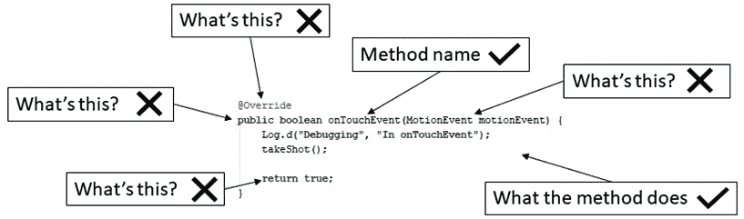
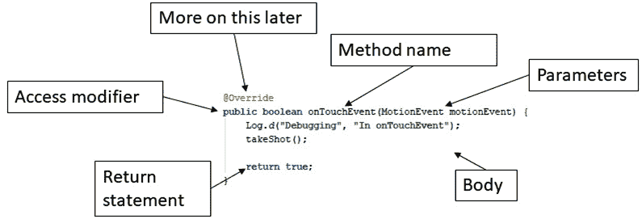
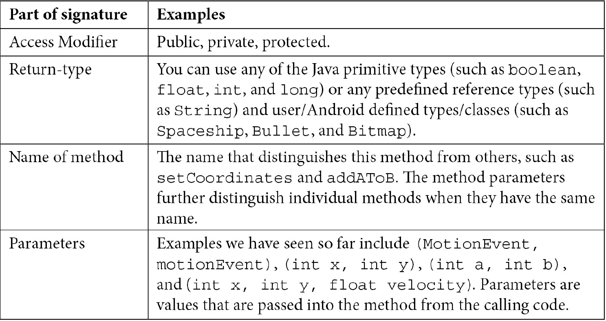
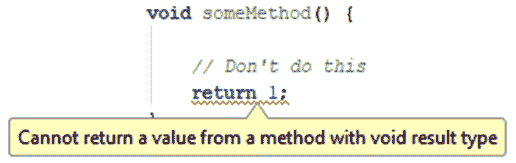
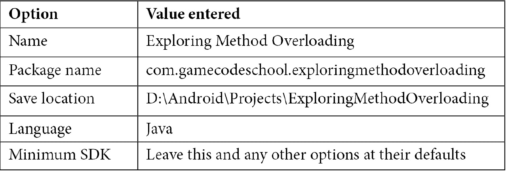
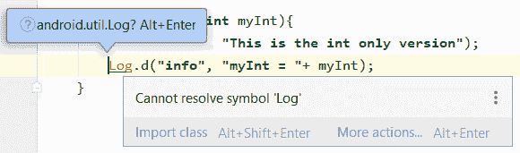
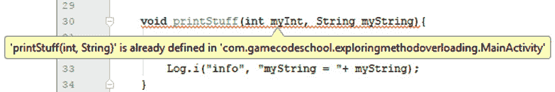
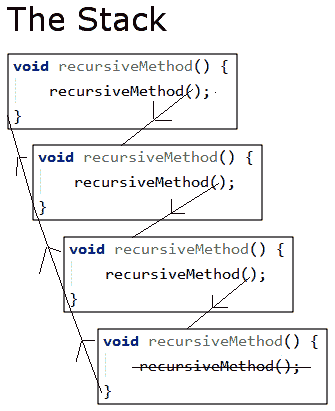

# *第 4 章*:用 Java 方法构造代码

随着我们开始习惯于 Java 编程，在这一章中，我们将仔细看看**方法**。虽然我们知道我们可以调用它们来让它们执行代码，但是到目前为止还没有讨论过更多关于它们的内容。

在本章中，我们将涵盖以下主题:

*   方法的结构
*   方法重载与重写
*   方法如何影响我们的变量
*   方法递归
*   用我们的方法知识来推进潜艇猎人游戏

首先，让我们快速回顾一下方法。

# 方法

小费

关于方法的一个事实:我们几乎所有的代码都在一个方法里面！

显然，方法很重要。虽然这本书通常会集中在编程的实际操作方面，但涵盖必要的理论也很重要，这样我们才能快速进步，并最终获得全面的理解。

话虽如此，在继续项目之前，没有必要掌握或记住关于方法理论的所有内容。如果有些东西不太有意义，最有可能的原因是本书后面的一些东西会让事情变得更有焦点。

小费

彻底阅读关于方法的所有内容，但是不要等到你对这一部分中的所有内容都 100%有信心之后再继续。掌握方法的最好方法是继续使用它们。

## 方法的回顾和进一步解释

作为复习，下图大致总结了我们现在对方法的理解。记号表示我们在哪里讨论了与方法相关的方面，而叉号表示我们还没有探索的方面:



图 4.1–方法复习

正如我们所看到的，方法周围的叉比记号多得多。在本章中，我们将完全揭开方法的盖子，看看它们是如何工作的，以及方法的其他部分到底为我们做了什么。在 [*第八章*](08.html#_idTextAnchor147) *【面向对象编程】*中，我们将会理清方法之谜的最后几个部分。

那么，到底什么是 Java 方法呢？方法是变量、表达式和其他代码的集合，捆绑在左花括号`{`和右花括号`}`中，前面有一个名称和一些更多的方法语法。我们已经使用了很多方法，但是我们只是还没有仔细研究它们。

让我们从方法的签名开始。

### 方法签名

我们编写的方法的第一部分叫做**签名**。正如我们很快会看到的，签名可以进一步分解成其他部分。下面是一个假设的方法签名:

```java
public boolean shootAlien(int x, int y, float velocity)
```

如果我们添加一对左右花括号`{}`，加上该方法执行的一些代码，那么我们就有了一个完整的方法——一个**定义**。这是另一个假设的，但语法正确的方法:

```java
private void setCoordinates(int x, int y){
     // code to set coordinates goes here
}
```

然后，我们可以从代码的另一部分使用新方法，如下所示:

```java
…
// I like it here
// but now I am going off to the setCoordinates method
setCoordinates(4,6);
// Phew, I'm back again - code continues here
…
```

在我们调用`setCoordinates`的地方，我们程序的执行将转移到包含在该方法中的代码。该方法将一步一步地执行其中的所有语句，直到它到达末尾，并将控制权返回给调用它的代码，或者如果它遇到`return`语句，则更快。然后，代码将在方法调用后从第一行继续运行。

下面是方法的另一个示例，完整的代码使方法返回到调用它的代码:

```java
int addAToB(int a, int b){
     int answer = a + b;
     return answer;
}
```

使用前面方法的调用可能如下所示:

```java
int myAnswer = addAToB(2, 4); 
```

我们不需要编写方法来将两个`int`变量加在一起，但是这个例子帮助我们了解方法的内部工作方式。这是正在一步步发生的事情:

1.  First, we pass in the values `2` and `4`.

    在方法`signature,`中，值`2`分配给`int a`，值`4`分配给`int b`。

2.  在方法体中，`a`和`b`变量被加在一起，用于初始化新的变量，`int answer`。
3.  `return answer`行将存储在`answer`中的值返回到调用代码，使`myAnswer`用值`6`初始化。

回顾所有假设的方法示例，注意到每个方法签名都有点不同。这是因为 Java 方法签名非常灵活，允许我们精确地构建我们需要的方法。

确切地说，方法签名如何定义必须如何调用方法以及方法必须如何返回值，值得进一步讨论。

让我们给签名的每个部分起一个名字，这样我们就可以把它分成几大块并了解它们。

这是一个方法签名，它的各个部分都标记好了，可以讨论了。另外，看一下下表，进一步确定签名的哪个部分是哪个。这将使我们剩下的关于方法的讨论变得简单。看下面的图，它显示了与我们在前面的图中使用的方法相同的方法，但是这一次，我已经标记了所有的部分:



图 4.2–方法签名部分

注意我没有标注`@Override`部分。我们已经知道这个方法是由我们正在工作的类提供的，并且通过使用`@Override`。我们将自己的代码添加到操作系统调用时发生的事情中。我们还将在本章后面的*方法重载和覆盖混淆*部分进一步讨论这一点。总之，下面是方法签名的部分及其名称:

**访问修饰符，返回类型，方法名(参数)**

下表显示了几个例子——一些我们到目前为止使用的，以及一些更假设的例子——放在一个表格中，以便我们可以进一步解释它们。然后我们将依次看每一个:



### 访问修饰符

在我们前面的例子中，我们只使用了几次访问修饰符——部分原因是方法不需要使用修饰符。修饰符是指定什么代码可以使用(调用)您的方法的一种方式。我们可以为此使用**公共**和**私人**等修饰词。常规变量也可以有修饰符；例如:

```java
// Most code can see me
public int a;
// Code in other classes can't see me
private String secret = "Shhh, I am private";
```

修饰符(用于方法和变量)是一个基本的 Java 主题，但是当我们讨论另一个我们已经绕过几次的重要 Java 主题:类时，它们会得到最好的处理。我们将在第 8 章 *【面向对象编程】*中介绍。在这个阶段对修饰语有一个初步的了解是有帮助的。

### 返回类型

接下来是返回类型。与访问修饰符不同，返回类型不是可选的。那么，让我们仔细看看这些。我们已经看到，我们的方法“做事”；他们执行代码。但是如果我们需要他们所做的事情的结果呢？到目前为止，我们看到的最简单的返回类型示例如下:

```java
int addAToB(int a, int b){
     int answer = a + b;
     return answer;
}
```

这里，签名中的返回类型在前面的代码中突出显示。所以，返回类型是`int`。这意味着`addAToB`方法必须向调用它的代码发回(返回)一个适合于`int`变量的值。如代码的第二个突出显示部分所示，这正是所发生的情况:

```java
return answer;
```

`answer`变量属于`int`类型。返回类型可以是我们目前看到的任何 Java 类型。

然而方法根本不需要返回值。当方法返回无值时，签名必须使用 **void** 关键字作为返回类型。

当使用`void`关键字时，方法体不得试图返回值，因为这会导致编译器错误:



图 4.3–由于返回值而显示的错误

但是，它可以在没有值的情况下使用`return`关键字。以下是返回类型和使用`return`关键字的一些有效组合:

```java
void doSomething(){
     // our code
     // I'm done going back to calling code here
     // no return is necessary
}
```

另一种组合如下:

```java
void doSomethingElse(){
     // our code
     // I can do this provided I don't try and add a value
     return;
}
```

下面的代码又是的另一个组合:

```java
String joinTogether(String firstName, String lastName){
     return firstName + lastName;
}
```

我们可以依次调用这些方法，如下所示:

```java
// OK time to call some methods
doSomething();
doSomethingElse();
String fullName = joinTogether("Alan ","Turing")
// fullName now = Alan Turing
// Continue with code from here
```

前面的代码将依次执行每个方法中的所有代码。

### 更仔细地看方法名

我们在设计自己的方法时使用的方法名称是任意的。但是使用动词是一种惯例，这样可以让方法做的事情更清楚。另外，我们应该使用名字第一个单词的第一个字母小写，后面单词的第一个字母大写的惯例。这叫做 camel case，我们在学习变量名的时候学过。下面是一个例子:

```java
void XGHHY78802c(){
     // code here
}
```

前面的方法是完全合法的，并且会起作用。然而，它是做什么的呢？让我们看一些使用这种约定的例子(略显做作):

```java
void doSomeVerySpecificTask(){
     // code here
}
void startNewGame(){
     // code here
}
void drawGraphics(){
     // code here
} 
```

这就清楚多了。所有的名字都清楚地表明了一个方法应该做什么，并帮助我们避免混淆。让我们仔细看看这些方法中的参数。

### 因素

我们知道方法可以向调用代码返回结果。但是如果我们需要用方法共享来自调用代码*的一些数据值*呢？**参数**允许我们与方法共享值。当我们查看返回类型时，我们已经看到了一个参数示例。我们将看同一个例子，但更仔细地看参数:**

```java
int addAToB(int a, int b){
     int answer = a + b;
     return answer;
}
```

在前面的代码中，参数被突出显示。参数包含在方法名后面的括号`(parameters go here)`中。注意，在方法体的第一行，我们使用`a + b`:

```java
int answer = a + b;
```

我们使用它们就好像它们已经被声明和初始化了一样。那是因为他们是。方法签名的参数是它们的声明和调用方法初始化它们的代码，如下面一行代码所示:

```java
int returnedAnswer = addAToB(10,5);
```

此外，正如我们在前面的例子中部分看到的，我们不必仅仅在参数中使用`int`。我们可以使用任何 Java 类型，包括我们自己设计的类型(类)。此外，我们还可以混合和匹配类型。我们还可以使用解决问题所需的任意多的参数。一个例子可能会有帮助:

```java
void addToHighScores(String name, int score){

     /*
          all the parameters

          name
           score
           are now living, breathing,
           declared and initialized variables.

           The code to add the details
           would go next.
     */
     …
     …
}
```

当然，如果我们的方法实际上不做任何事情，这些都不重要。是时候谈谈方法体了。

### 在方法体中做事

正文是我们一直避免的部分，包含如下评论:

```java
// code here
or
// some code
```

我们已经知道在身体里该做什么了。

到目前为止，我们所学的任何 Java 语法都已经在方法的主体中起作用了。事实上，如果我们回想一下，到目前为止我们编写的几乎所有代码*都在一个方法内部。*

 *接下来我们能做的最好的事情就是写几个在身体里做点什么的方法。我们将在 Sub' Hunter 游戏中这样做，一旦我们已经覆盖了一些更多的方法相关的主题。

接下来是一个演示应用，它探索了更多关于方法的问题，并重申了我们已经知道的东西。

具体来说，我们还将研究方法重载的概念，因为有时展示比讲述更好。如果你愿意，你可以实现这个小应用，或者只是阅读文本并研究代码。

# 方法重载举例

让我们创建另一个新项目来探索**方法重载**的话题。请注意，我没有说覆盖。我们将很快讨论重载和重写之间微妙但重要的区别。

## 创建新项目

创建一个新项目，方法和我们为副猎人做的一样，但称之为`Exploring` `Method Overloading`。

重要说明

这个小应用的完整代码可以在 GitHub 存储库中的`Chapter 4/Method overloading`文件夹中找到。

如果您现在打开了 Sub' Hunter 项目，您可以选择**文件** | **新项目**并使用以下选项创建项目:



正如我们之前所做的，确保选择了**空活动**选项。不要担心重构活动，因为这只是一个可以玩的迷你应用——我们不会再回到它。

接下来，我们将编写三个方法，但略有改动。

## 编码方法重载小应用

正如我们现在将看到的，假设参数不同，我们可以创建多个同名的方法。这个项目中的代码非常简单。在我们分析它之前，它是如何工作的可能会显得有点奇怪。

对于第一种方法，我们将简单地将其称为`printStuff`，并通过要打印的参数传入一个`int`变量。在`onCreate`方法的关闭`}`之后，但在`MainActivity`的关闭`}`之前插入该方法:

```java
void printStuff(int myInt){
     Log.d("info", "This is the int only version");
     Log.d("info", "myInt = "+ myInt);
}
```

请注意，以`Log…`开头的代码包含错误。这是因为我们没有为`Log`类添加`import`语句。我们可以参考 Sub' Hunter 游戏(或者回到 [*第二章*](02.html#_idTextAnchor048) *、Java–第一次接触*)来找出该打什么，但是 Android Studio 可以让我们更容易。您可能已经注意到AndroidStudio会闪烁消息，如下图所示:



图 4.4–日志类导致的错误消息

AndroidStudio给了我们两种解决问题的方法。将鼠标光标悬停在其中一个红色突出显示的`Log`代码上，消息将出现。您可以按住 *Alt* 键，然后点击*回车*键，或者只需点击**导入类**文本。滚动到代码文件的顶部，注意已经添加了以下代码:

```java
import android.util.Log;
```

小费

随着这本书的进展，我有时会建议使用这种方法来添加一个类，偶尔，我会专门向您展示要键入的`import…`代码。

现在，我们可以完成方法编码了。

在第二个方法中，我们也将调用这个方法`printStuff`，但是传入一个要打印的`String`变量。在`onCreate`方法的关闭`}`之后，但在`MainActivity`的关闭`}`之前插入该方法。请注意，我们定义方法的顺序并不重要:

```java
void printStuff(String myString){
     Log.i("info", "This is the String only version");
     Log.i("info", "myString = "+ myString);
}
```

在第三种方法中，我们也称之为`printStuff`，但是传入一个`String`变量和一个要打印的`int`。在关闭`onCreate`方法的`}`之后但在关闭`MainActivity`的`}`之前插入该方法:

```java
void printStuff(int myInt, String myString){
     Log.i("info", "This is the combined int and String 
      version");
     Log.i("info", "myInt = "+ myInt);
     Log.i("info", "myString = "+ myString);
}
```

为了证明虽然可以有同名的方法，但是不能有相同参数的**和**同名的方法，再加上前面的方法。注意**已经定义了**错误:



图 4.5–由于方法具有相同的名称和参数而导致的错误

删除违规的方法；我们将编写一些代码，以便我们可以很快看到正在运行的方法。

现在，在关闭`onCreate`方法的`}`之前插入这段代码来调用这些方法，并将一些值打印到 logcat 窗口:

```java
// Declare and initialize a String and an int
int anInt = 10;
String aString = "I am a string";

// Now call the different versions of printStuff
// The name stays the same, only the parameters vary
printStuff(anInt);
printStuff(aString);
printStuff(anInt, aString);
```

## 运行方法重载小应用

现在，我们可以在模拟器或真实设备上运行应用。模拟器屏幕上不会出现任何内容，但以下是 logcat 输出:

```java
info : This is the int only version
info : myInt = 10
info : This is the String only version
info : myString = I am a string
info : This is the combined int and String version
info : myInt = 10
info : myString = I am a string
```

如您所见，Java 将三个同名的方法视为不同的方法。正如我们刚刚证明的那样，这可能是有用的。提醒一下，这叫**方法重载**。

**方法重载和覆盖混乱**

**当我们有多个同名但参数不同的方法时，重载**就是。

**覆盖**是当我们用相同的名称和相同的参数列表替换一个方法时，就像我们用`onCreate`所做的那样。请注意，当您重写时，您也可以选择调用方法的重写版本，就像我们使用`super.onCreate()`调用`onCreate`一样。

我们对重载和覆盖了解得足够多，可以完成这本书；然而，如果你很勇敢，你的思想在徘徊，要知道是的，你可以覆盖一个重载的方法，但是那是另一个时间的事情。

### 它是如何工作的

这就是代码的工作原理。在我们编写代码的每个步骤中，我们都创建了一个名为`printStuff`的方法。但是每个`printStuff`方法都有不同的参数，所以每个都是不同的方法，可以单独调用:

```java
void printStuff(int myInt){
     ...
}
void printStuff(String myString){
     ...
}
void printStuff(int myInt, String myString){
     ...
}
```

每个方法的主体都很简单，只是打印出传入的参数，并确认当前调用的是该方法的哪个版本。

我们代码的下一个重要部分是当我们使它变得简单时，这是通过使用与不同签名中的参数相匹配的适当参数来实现的。我们使用适当的参数依次调用每个参数，以便编译器知道所需的确切方法:

```java
printStuff(anInt);
printStuff(aString);
printStuff(anInt, aString);
```

让我们进一步探索方法，看看方法和变量之间的关系。

# 范围-方法和变量

如果你在一个方法中声明一个变量，不管那是安卓方法中的一个比如`onCreate`还是我们自己的一个方法，它都只能在那个方法中使用。

在`onCreate`方法中这样做是没有用的:

```java
int a = 0;
```

之后，尝试用`newGame`方法或其他方法:

```java
a++;
```

我们将得到一个错误，因为`a`只在它被声明的方法中可见。起初，这似乎是一个问题，但也许令人惊讶的是，它实际上非常有用。

这就是为什么我们在所有方法之外声明这些变量，就在类声明之后。他们又来了，提醒我们:

```java
public class SubHunter extends Activity {
    // These variables can be "seen"
    // throughout the SubHunter class
    int numberHorizontalPixels;
    int numberVerticalPixels;
    int blockSize;
    …
    …
```

当我们这样做时，变量可以在整个代码文件中使用。随着这个项目和其他项目的进展，我们将在多个方法需要的时候声明所有方法之外的一些变量，然后在只有那个方法需要的时候声明方法内部的一些变量。

在可能的情况下，在方法内部声明变量是一个很好的做法。您可以通过使用方法参数传递值来减少所有方法之外编码的变量数量。当你应该使用每种策略时，这是一个设计的问题，随着这本书的进展，我们将看看正确处理不同情况的不同方法。

用来描述变量是否可用这个话题的术语是**范围**。当一个变量可用时，它被称为在作用域内，当它不可用时，它被称为在作用域外。在 [*第 8 章*](08.html#_idTextAnchor147) *面向对象编程中，范围的主题也将和类一起被进一步讨论。*

当我们在方法内部声明变量时，我们称之为局部变量。当我们在所有方法之外声明变量时，我们将它们称为**成员**变量或**字段**。

重要说明

什么成员？，你可能会问。答案是班上的一个成员。在“Sub‘Hunter’项目”的情况下，所有这些变量都是`SubHunter`类的成员，如这行代码所定义的:

```java
public class SubHunter extends Activity {
```

在我们回到 Sub' Hunter 项目之前，让我们再看一个与方法相关的主题。我们已经知道方法可以调用其他方法，安卓操作系统可以调用方法，但是如果一个方法调用自己会怎么样呢？

## 方法递归

方法递归是方法调用自己的时候。这看起来像是一件偶然发生的事情，但却是解决一些编程问题的有效技术。

下面是一些代码，展示了递归方法的最基本形式:

```java
void recursiveMethod() {
     recursiveMethod();
}
```

如果我们调用`recursiveMethod`方法，那么它唯一的一行代码将调用它自己。然后它会叫它自己，然后它会叫它自己，以此类推。此过程将一直持续到应用崩溃，并在 logcat 窗口中显示以下错误:

```java
java.lang.StackOverflowError: stack size 8192KB
```

当方法被调用时，它的指令被移动到处理器中被称为堆栈的区域，当它返回时，它的指令被移除。如果该方法从未返回，但添加了越来越多的指令副本，最终，堆栈将耗尽内存(或溢出)，我们得到`StackOverflowError`。

我们可以尝试使用下面的截图来可视化前四个方法调用。我还划掉了第四次迭代中对方法的调用，以展示如果我们能够阻止方法调用，所有方法最终将如何返回并从堆栈中清除:



图 4.6–堆栈可视化

为了使我们的递归方法有价值，我们需要增强两个方面。我们将很快研究第二个方面。首先，也是最明显的，我们需要给它一个目标。让我们用递归的方法将从零到给定目标值(比如 10、100 或更多)的数值相加怎么样？让我们修改前面的方法，赋予它新的用途，并相应地重命名它。我们还将添加一个名为`answer`的全局范围(在方法之外)的变量:

```java
int answer = 0;
void computeSum(int target) {
answer += target
     computeSum(target-1);
}
```

现在，我们有一个叫做`computeSum`的方法，它以一个`int`为参数。如果我们想计算 0 到 10 之间所有数字的总和，我们可以这样调用方法:

```java
computeSum(10);
```

以下是每次函数调用时`target`变量的值:

*   `computeSum: answer`第一次呼叫= 10
*   `computeSum: answer`第二次呼叫= 19
*   …此处有更多行
*   `computeSum: answer`第 10 次呼叫= 55

这显然是成功的，直到你意识到这个方法在`target`变量达到零时继续调用自己。事实上，我们仍然有与第一个递归方法相同的问题，在数万次调用后，应用将再次与`StackOverflowError`崩溃。

我们需要的是一旦`target`等于零，就停止方法调用自身的方法。我们解决这个问题的方法是检查`target`的值是否为零，如果为零，我们就停止调用方法。看看这里显示的附加突出显示的代码:

```java
void computeSum( int target ) {
     answer += target;
     if(target > 0) {
          Log.d("target = ", "" + target);
          computeSum(target - 1);
     }
     Log.d("answer = ", "" + answer);
}
```

在前面的代码中，我们提前查看了 [*第 6 章*](06.html#_idTextAnchor120) *、用循环重复代码块*和 *7、用 Java If、Else 和 Switch* 进行决策，它们探索了更多用于检查条件的 Java 运算符和用于决策的 Java `if`语句。

当最后一次调用该方法时，我们还有一个附加的`Log.d`来输出`answer`的值。在阅读以下输出后提供的解释之前，看看您是否能弄清楚正在发生什么。

调用`computeSum(10)`的输出如下:

```java
target =: 10
target =: 9
target =: 8
target =: 7
target =: 6
target =: 5
target =: 4
target =: 3
target =: 2
target =: 1
answer =: 55
```

`if(target > 0)`告诉代码检查`target`变量是否在零以上。如果是，那么它应该再次调用该方法并传入`target – 1`的值。如果不是，那么停止整个过程。 [*第 6 章*](06.html#_idTextAnchor120) *、用循环重复代码块*和 *7、用 Java If、Else 和 Switch 做决策*还将探讨条件代码是如何被一对花括号`{…}`包裹并缩进以保持清晰的。

重要说明

在本书中，我们不会使用方法递归，但是理解它是一个有趣的概念。

现在，我们可以仔细看看我们已经在 Sub' Hunter 游戏中编写的方法，尤其是签名和返回类型。

## 重温我们已经使用过的代码和方法

在这一点上，可能值得重温一下我们在本书中看到的一些代码，到目前为止，我们只是粗略地解释了一下。我们现在能够理解我们所写的一切。然而，不要担心是否还有一些混乱的地方，因为你越是使用这种面向对象的东西，它就会越深入你的脑海。我想象，如果你继续这本书和游戏编码，在接下来的 1-2 年里，你会有多个“哦！！现在我明白了“OOP 和 Android 概念最终到位的时刻。

为了帮助这些时刻到来，让我们重温一些旧的代码，并快速查看正在发生的事情。

在`onCreate`方法中，我们看到了这个签名:

```java
protected void onCreate(Bundle savedInstanceState) {
```

该方法接收名为`savedInstanceState`的`Bundle`类型的对象。`Bundle`类在基于图形用户界面的安卓应用中是一个大问题，这些应用通常使用不止一个`Activity`类。然而，我们的游戏项目只需要一个`Activity`，我们不需要在本书中进一步探索`Bundle`类。

在`onTouchEvent`方法中，我们看到了这个签名:

```java
public boolean onTouchEvent(MotionEvent motionEvent) {
```

前一个签名表示该方法返回一个`boolean`并接收一个名为`motionEvent`的对象，该对象属于`MotionEvent`类型。我们将在 [*第 7 章*](07.html#_idTextAnchor131) *中探索`MotionEvent`类，用 Java If、Else 和 Switch* 进行决策，我们将在 [*第 8 章*](08.html#_idTextAnchor147) *面向对象编程*中全面揭示类和对象。

下面一行是该方法的代码行，并根据需要返回一个`boolean`:

```java
return true;
```

让我们创造敌人的潜艇。

# 生成随机数部署潜艇

我们需要在每场比赛开始时在一个随机位置部署一个潜艇。然而，正如我们将在本书中看到的，随机数有许多可能的用途。所以，让我们仔细看看`Random`类和它的一个方法`nextInt`。

## 随机类和 nextInt 方法

让我们来看看我们是如何创建随机数的。然后，在这一章的后面，我们将把它实际应用到我们的潜艇中。所有高要求的工作都是由`Random`班为我们完成的。

重要说明

**Random 类**是Java API 的一部分，这就是为什么有一个稍微不同的导入语句来访问它。这是我们在第二章[](02.html#_idTextAnchor048)**中添加的一行，Java–首次联系*:*

 *`import java.util.Random;`

请注意，这是(到目前为止)唯一以`java…`而不是`android…`开头的`import`语句。

首先，我们需要创建并初始化一个`Random`类型的对象。我们可以这样做:

```java
Random randGenerator = new Random();
```

然后，我们可以使用我们的新对象的`nextInt`方法来生成一定范围之间的随机数。

这一行代码使用我们的`Random`对象生成随机数，并将结果存储在`ourRandomNumber`变量中:

```java
int ourRandomNumber = randGenerator.nextInt(10);
```

我们输入的数字作为从零开始的范围。因此，前一行将生成一个介于 0 和 9 之间的随机数。如果我们想要一个介于 1 和 10 之间的随机数，我们只需这样做:

```java
int ourRandomNumber = randGenerator.nextInt(10) + 1;
```

我们也可以使用`Random`对象，使用`nextLong`、`nextFloat`和`nextDouble`方法获取其他随机数类型。

重要说明

你甚至可以得到随机的`booleans`或者整串的随机数。您可以在这里详细探索`Random`类:[https://developer . Android . com/reference/Java/util/random . html](https://developer.android.com/reference/java/util/Random.html)。

现在，我们已经准备好了。

### 向 newGame 方法添加基于随机的代码

将以下高亮代码添加到`newGame`方法中:

```java
/*
     This code will execute when a new
     game needs to be started. It will
     happen when the app is first started
     and after the player wins a game.
 */
public void newGame(){
     Random random = new Random();
     subHorizontalPosition = random.nextInt(gridWidth);
     subVerticalPosition = random.nextInt(gridHeight);
     shotsTaken = 0;

     Log.d("Debugging", "In newGame");

}
```

在之前的代码中，我们声明并用这一行代码初始化了一个名为`random`的新`Random`对象:

```java
Random random = new Random();
```

然后，我们使用`nextInt`方法生成一个随机数，并将其分配给`subHorizontalPosition`。仔细看下面一行代码；具体来说，看看传递到`nextInt`的论点:

```java
subHorizontalPosition = random.nextInt(gridWidth);
```

`gridWidth`变量正是所需值。它生成一个介于 0 和`gridWidth` -1 之间的数字。当我们在 [*第七章*](07.html#_idTextAnchor131) *、用 Java If、Else 和 Switch* 处理 sub '和玩家的 tap (shot)之间的碰撞检测时，你会发现这正是我们需要的。

重要说明

如果我们需要生成非零数字，我们可以在前一行代码的末尾添加`+ 1`。

下面一行代码如下:

```java
subVerticalPosition = random.nextInt(gridHeight);
```

这与前一行代码的工作方式相同，只是随机值被赋给了`subVerticalPosition`，传递给`nextInt`方法的参数是`gridHeight`。

我们的子位置变量现已准备好使用。

我们添加的最后一行代码只是将`shotsTaken`初始化为零。当我们开始一个新游戏时，我们希望这样做是有意义的，以便向玩家显示的拍摄次数不会在多个游戏中累积。

# 测试游戏

现在，我们可以用通常的方式运行游戏。请注意以下缩写 logcat 输出中的`subHorizontalposition`和`subVerticalPosition`变量:

```java
subHorizontalPosition: 30
subVerticalPosition: 13
```

请再次尝试运行游戏；您将获得不同的位置，证明我们基于`Random`的代码正在工作，无论何时我们想要开始一个新游戏，我们都可以自信地调用`newGame`:

```java
subHorizontalPosition: 14
subVerticalPosition: 7
```

重要说明

您可以调用`newGame`方法并在相同位置获得一个 sub ’,这是可能的，但可能性很小。

就这样——现在，我们可以在每一个新游戏中诞生我们的潜艇了！

# 总结

现在，我们知道了关于方法的几乎所有知识，包括参数与参数、签名、主体、访问说明符和返回类型。缺少的一个环节是方法如何与类相关联。类-方法的关系将在备受关注的[](08.html#_idTextAnchor147)**【面向对象编程】*中被大开大合，后者越来越近了。目前，有一个更紧迫的问题需要解决。*

 *在我们过多地祝贺自己之前，我们需要解决房间里的巨大大象——见下面的截图:


图 4.7–空白游戏屏幕

屏幕上什么都没有！现在，我们已经上了一堂关于变量的完整课程，对类进行了介绍，并对方法进行了彻底的探索，我们可以开始纠正这一点了。在下一章中，我们将开始在屏幕上绘制 Sub' Hunter 游戏的图形。***