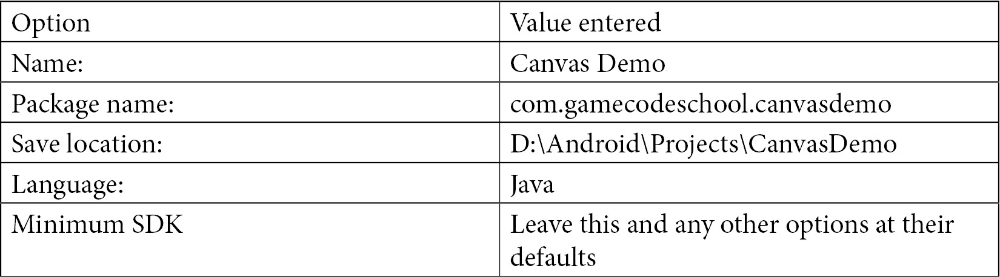
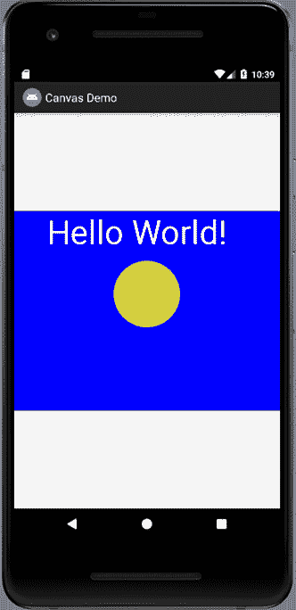
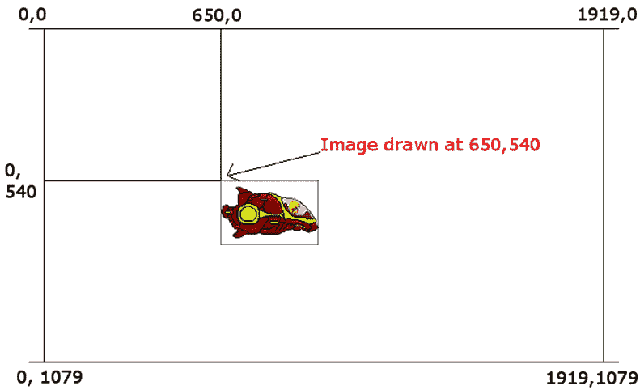
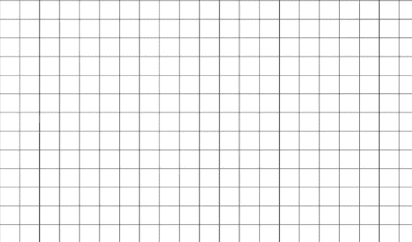
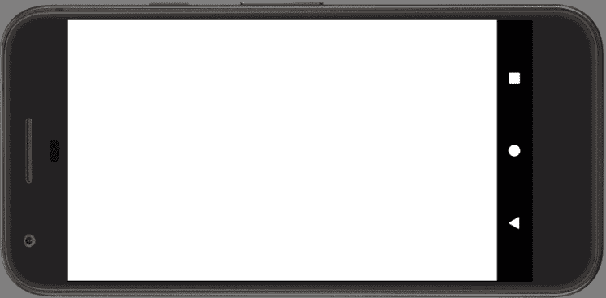
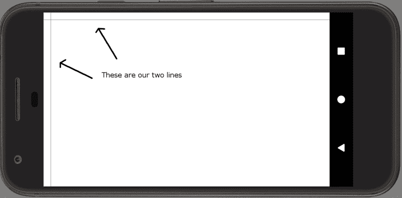
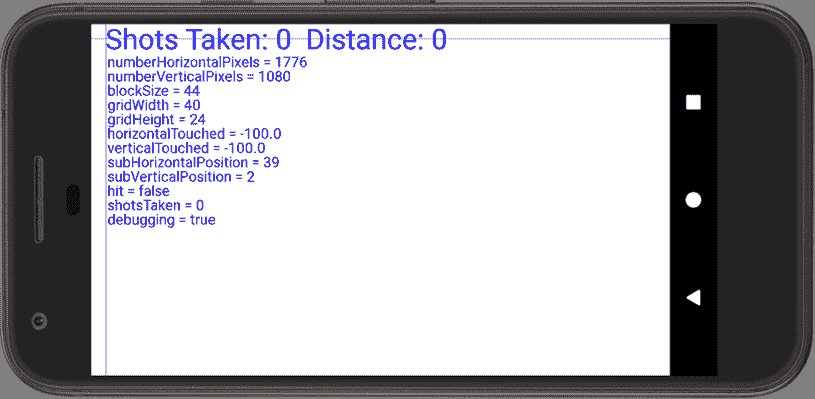

# *第五章*:安卓画布类——绘制到屏幕上

虽然我们将在接下来的几章中创建自己的类，但我们新发现的关于方法的知识使我们能够开始更好地利用安卓提供的类。这一整章都是关于安卓`Canvas`类和一些相关的类，包括`Paint`和`Color`。这些课程结合在一起，在屏幕绘画方面带来了巨大的力量。了解`Canvas`还将教会我们使用任何课程的基本知识。

以下是本章将涵盖的主题的摘要:

*   了解`Canvas`类及相关类
*   在进入“潜行者”之前，先写一个基于`Canvas`的演示应用作为练习
*   查看安卓坐标系，这样我们就知道在哪里绘图了
*   为潜艇猎人游戏绘制一些图形和文字

让我们开始画画吧！

# 了解画布类

`Canvas`级是`android.graphics`套装的一部分。如果您查看 Sub' Hunter 代码顶部的`import`语句，您将看到以下代码行:

```java
import android.graphics.Bitmap;
import android.graphics.Canvas;
import android.graphics.Color;
import android.graphics.Paint;
import android.graphics.Point;
import android.view.Display;
import android.widget.ImageView;
```

首先，我们来谈谈`Bitmap`、`Canvas`和`ImageView`，正如前面代码中所强调的。

## 开始使用位图、画布和图像视图进行绘制

由于安卓被设计为在所有类型的移动应用上运行，我们不能立即开始输入我们的绘图代码并期望它能工作。我们需要做一些准备(编码)来让事情运转起来。诚然，有些准备工作可能会有点违反直觉，但我们会一步一步来完成。

### 画布和位图

根据如何使用`Canvas`类，该术语可能会略有误导。虽然`Canvas`类*是*类，您可以将图形绘制到该类，就像绘制画布一样，但您仍然需要**表面**来移调画布。

表面上看，在这个游戏中，将从`Bitmap`级开始。我们可以这样想。我们获得一个`Canvas`对象和一个`Bitmap`对象，然后将`Bitmap`对象设置为要绘制的`Canvas`对象的一部分。

如果你从字面意义上理解画布这个词，这有点违反直觉，但是一旦它被设置好，我们就可以忘记它，专注于我们想要绘制的图形。

重要说明

`Canvas`类提供*能力*进行绘制。它有做事情的所有方法，例如绘制形状、文本、线条、图像文件，甚至绘制单个像素。

`Bitmap`类由`Canvas`类使用，是被绘制的表面。你可以把`Bitmap`想象成画布上的一个画框。

### 颜料

除了到`Canvas`和`Bitmap`之外，我们将使用`Paint`类。这就容易理解多了。`Paint`是用于配置特定属性的类，例如我们将在`Canvas`类中的`Bitmap`上绘制的颜色。

在我们把东西画出来之前，还有另一个难题。

### 图像视图和活动

`ImageView`是`Activity`类将用来向玩家显示输出的类。这个第三层抽象的原因是，不是每个应用都是游戏(或图形应用)。因此，安卓通过`View`类使用“视图”的概念来处理用户看到的最终显示。

有多种类型的视图可以制作所有不同类型的应用程序，它们都将与`Activity`类兼容，该类是所有常规安卓应用程序和游戏的基础。

因此，一旦绘制完成，有必要将绘制的`Bitmap`(通过其与`Canvas`的关联)与`ImageView`相关联。最后一步是告诉`Activity`类，我们的`ImageView`类代表用户可以看到的内容。

### 画布、位图、绘画和图像视图–简要概述

如果我们需要建立的相互关系理论看起来并不简单，那么当您很快看到相对简单的代码时，您应该会松一口气。

以下是到目前为止所学内容的简要总结:

*   每个应用都需要一个`Activity`类与用户和底层操作系统进行交互。因此，如果我们想要成功，就必须遵循所需的层次结构。
*   `ImageView`类，也就是类的一种`View`类，是`Activity`需要向玩家展示我们的游戏。在整本书中，我们将使用不同类型的`View`类来适应手头的项目。
*   `Canvas`级提供*能力*进行抽奖。它有所有的方法来做事情，如绘制形状、文本、线条、图像文件，甚至绘制单个像素。
*   `Bitmap`类与`Canvas`类相关联，并且是被绘制的表面。
*   `Canvas`类使用`Paint`类来配置颜色等细节。
*   最后，一旦绘制了`Bitmap`类，我们必须将其与`ImageView`类相关联，这又被设置为`Activity`类的视图。

结果是我们用`Canvas`在`Bitmap`类上画的东西通过`ImageView`显示给玩家。唷！

小费

如果不是 100%清楚也没关系。不是你看不清楚事情；这根本不是一种明显的关系。反复编写代码和使用技术会使事情变得更加清晰。看代码，做演示应用，然后重新阅读这一部分。

现在让我们看看如何在代码中建立这种关系。不要担心输入代码；好好研究一下。我们还将在回到潜艇猎人游戏之前做一个动手绘图的小应用程序。

# 使用画布类

让我们看看代码和获取绘图所需的不同阶段，然后在 Canvas 演示应用程序的帮助下，我们可以快速进入到真实绘制一些东西。

## 准备类的对象

请记住，在爪哇第二章[](02.html#_idTextAnchor048)**【第一次接触】*中，我说过以下话:*

 **在 Java 中，蓝图被称为类。当一个类被转换成一个真正的可工作的东西时，我们称它为一个对象或类的一个实例。*

第一步是将我们需要的类(蓝图)转化为真正的可工作的东西——对象/实例。这一步类似于声明变量。

重要说明

我们已经在前一章的`Random`类中完成了这一点，并将在 [*第 8 章*](08.html#_idTextAnchor147)*面向对象编程*中更深入地探讨这一点。

首先，我们声明类型，在本例中恰好是一个类，然后我们声明我们希望工作对象具有的名称:

```java
// Here are all the objects(instances)
// of classes that we need to do some drawing
ImageView myImageView;
Bitmap myBlankBitmap;
Canvas myCanvas;
Paint myPaint;
```

前面的代码声明了类型`ImageView`、`Bitmap`、`Canvas`和`Paint`的引用类型变量。分别命名为`myImageView`、`myBlankBitmap`、`myCanvas`、`myPaint`。

## 初始化对象

接下来，就像常规变量一样，我们需要在使用它们之前初始化我们的对象。

直到 [*第 8 章*](08.html#_idTextAnchor147)*面向对象编程*之前，我们不会详细讨论下一个代码是如何工作的。但是，请注意，在接下来的代码中，我们在前面的代码块中创建的每个对象都被初始化了:

```java
// Initialize all the objects ready for drawing
// We will do this inside the onCreate method
int widthInPixels = 800;
int heightInPixels = 800;
myBlankBitmap = Bitmap.createBitmap(widthInPixels,
heightInPixels, Bitmap.Config.ARGB_8888);
myCanvas = new Canvas(myBlankBitmap);
myImageView = new ImageView(this);
myPaint = new Paint();
// Do drawing here
```

请注意前面代码中的注释:

```java
// Do drawing here
```

这就是我们将配置我们的颜色和实际绘制东西的地方。另外，请注意在代码的顶部，我们声明并初始化了两个名为`widthInPixels`和`heightInPixels`的`int`变量。正如我之前提到的，当我们初始化对象时，我不会详细讨论引擎盖下到底发生了什么，但是当我们编写`Canvas`演示应用程序时，我会更详细地讨论其中的一些代码行。

我们现在准备抽签。我们所要做的就是将`ImageView`分配给`Activity`实例。

## 设置活动内容

最后，在我们能够看到我们的绘图之前，我们告诉安卓使用我们的`ImageView`实例，称为`myImageView`，作为向用户显示的内容:

```java
// Associate the drawn upon Bitmap with the ImageView
myImageView.setImageBitmap(myBlankBitmap);
// Tell Android to set our drawing
// as the view for this app
// via the ImageView
setContentView(myImageView);
```

`setContentView`方法是`Activity`类的一部分，我们传入`myImageView`作为一个参数。就这样。我们现在要学的就是如何真正利用`Bitmap`。

在我们做一些绘制之前，我认为启动一个真实的项目，将我们刚刚讨论过的代码一步一步复制并粘贴到正确的位置，然后实际上看到一些绘制到屏幕上的东西会很有用。

让我们画些画。

# 帆布演示应用

让我们创建另一个新项目来探索用`Canvas`画画的话题。我们将重复使用刚刚学过的东西，这次我们也将画到`Bitmap`。

## 创建新项目

创建一个新的项目，方法和我们为“猎人”做的一样，但称之为“T0”。如果您现在打开了 Sub' Hunter 项目，您可以选择**文件** | **新项目**并使用以下选项创建一个项目:



如前所述，确保选择了**空活动**选项。不要担心重构活动的名称。这只是一个可以玩的小应用；我们不会再回去了。

重要说明

这个小应用的完整代码可以在`Chapter 5/Canvas Demo`文件夹的 GitHub repo 上找到。

### 编写画布演示应用程序

首先，编辑自动生成的代码，包括类声明，改变`Activity`类的类型，添加相关的`import`语句，声明一些对象实例，删除对`setContentView`方法的调用。这是该步骤后的代码:

```java
import android.app.Activity;
import android.graphics.Bitmap;
import android.graphics.Canvas;
import android.graphics.color;
import android.graphics.Paint;
import android.os.Bundle;
import android.widget.ImageView;
public class MainActivity extends Activity {
    // Here are all the objects(instances)
    // of classes that we need to do some drawing
    ImageView myImageView;
    Bitmap myBlankBitmap;
    Canvas myCanvas;
    Paint myPaint;
    @Override
    protected void onCreate(Bundle savedInstanceState) {
        super.onCreate(savedInstanceState);
    }
}
```

现在我们已经声明了所需类的实例，我们可以初始化它们了。在调用`super.onCreate…`后，将以下代码添加到`onCreate`方法中，如以下代码块所示的:

```java
@Override
protected void onCreate(Bundle savedInstanceState) {
   super.onCreate(savedInstanceState);
   // Initialize all the objects ready for drawing
   // We will do this inside the onCreate method
   int widthInPixels = 800;
   int heightInPixels = 600;
   // Create a new Bitmap
   myBlankBitmap = Bitmap.createBitmap(widthInPixels,
   heightInPixels, Bitmap.Config.ARGB_8888);
   // Initialize the Canvas and associate it
   // with the Bitmap to draw on
   myCanvas = new Canvas(myBlankBitmap);
   // Initialize the ImageView and the Paint
   myImageView = new ImageView(this);
   myPaint = new Paint();
}
```

该代码与我们在理论上讨论`Canvas`时看到的相同。尽管我们现在不打算详细讨论类，但是探索`Bitmap`类初始化还是值得的。

#### 探索位图初始化

位图，更常见于游戏中，用于表示游戏对象，如玩家、背景和炸弹。在这里，我们只是用它来借鉴。在以后的项目中，我们将使用各种位图来表示从宇宙飞船到敌人的一切。

需要说明的方法是`createBitmap`法。参数从左到右如下:

*   宽度(像素)
*   高度(像素)
*   位图配置

位图可以通过多种不同的方式进行配置。`ARGB_8888`配置意味着每个像素由 4 字节的内存表示。

重要说明

安卓可以使用多种位图格式。这是一个很好的颜色范围，将确保我们使用的位图和我们要求的颜色将按照预期绘制完美。有更高和更低的配置，但`ARGB_8888`非常适合这本书的整体。

现在我们可以进行实际绘制了。

### 在屏幕上绘图

在`myPaint`初始化后，在`onCreate`方法的右花括号内添加以下高亮显示的代码:

```java
   myPaint = new Paint();
   // Draw on the Bitmap
   // Wipe the Bitmap with a blue color
   myCanvas.drawColor(Color.argb(255, 0, 0, 255));
   // Re-size the text
   myPaint.setTextSize(100);
   // Change the paint to white
   myPaint.setColor(Color.argb(255, 255, 255, 255));
   // Draw some text
   myCanvas.drawText("Hello World!",100, 100, myPaint);
   // Change the paint to yellow
   myPaint.setColor(Color.argb(255, 212, 207, 62));
   // Draw a circle
   myCanvas.drawCircle(400,250, 100, myPaint);
}
```

前面的代码使用`myCanvas.drawColor`来填充屏幕颜色。

`myPaint.setTextSize`定义接下来要绘制的文本的大小。`myPaint.setColor`方法决定了任何未来的绘图将是什么颜色。`myCanvas.drawText`实际上将文本绘制到屏幕上。

分析传入`drawText`的论点，可以看到文字会说“你好世界！”它将从左边画出 100 个像素，从我们的`Bitmap` ( `myBitmap`)顶部画出 100 个像素。

接下来，我们再次使用`setColor`来更改将用于绘制的颜色。最后，我们使用`drawCircle`方法绘制一个距离左侧 400 像素、距离顶部 100 像素的圆。该圆的半径为 100 像素。

我一直拖延到现在才解释`Color.argb`方法。

#### 解释颜色

不出所料，`Color`类帮助我们操纵和表现颜色。先前使用的`argb`方法返回使用 **a** lpha(不透明度/透明度) **r** ed、 **g** reen、 **b** lue 模型构建的颜色。该模型对每个元素使用从 0(无颜色)到 255(全颜色)的值。重要的是要注意，尽管从反射上看，这似乎是显而易见的，混合的颜色是光的强度，与我们混合颜料时的情况大不相同。

重要说明

要设计一个 ARGB 值并进一步探索这个模型，请看一下这个方便的网站:[https://www.rapidtables.com/web/color/RGB_Color.html](https://www.rapidtables.com/web/color/RGB_Color.html)。这个网站可以帮助你选择 RGB 值，然后结合 alpha 值进行实验。

用于清除绘图表面的值为`255, 0, 0, 255`。这些值表示完全不透明(纯色)、无红色、无绿色和完全蓝色。这会呈现蓝色。

对`argb`方法的下一次调用是在对`setColor`的第一次调用中，我们在这里为文本设置所需的颜色。值`255, 255, 255, 255`表示完全不透明、完全红色、完全绿色和完全蓝色。当你把光和这些值结合起来，你就变成了白色。

对`argb`的最后调用是在对`setColor`的最后调用中，我们在设置颜色画圆的时候。`255, 21, 207, 62`呈太阳黄色。

我们可以运行代码之前的最后一步是添加对`setContentView`方法的调用，该方法将我们的`ImageView`实例`myImageView`作为视图传递，该视图将被设置为这个应用程序的内容。以下是在我们已经添加的代码之后，但是在`onCreate`的右大括号之前突出显示的最后几行代码:

```java
// Associate the drawn upon Bitmap with the ImageView
myImageView.setImageBitmap(myBlankBitmap);
// Tell Android to set our drawing
// as the view for this app
// via the ImageView
setContentView(myImageView);
```

最后，我们通过调用`setContentView`告诉`Activity`类使用`myImageView`。

这就是模拟器旋转到纵向时`Canvas`演示的样子。我们可以看到一个 800 x 800 像素的图形。在我们的所有游戏中，我们将看到如何利用整个屏幕:



图 5.1–纵向视图中的画布演示

在这个例子中，我们只是画一个位图，但是在 Sub Hunter 游戏中，我们想画整个屏幕，所以讨论一下 Android 坐标系会很有用。

# 安卓坐标系

作为讲解安卓坐标绘图系统的图形化手段，我会用一个可爱的飞船图形。我们不会突然将宇宙飞船添加到 Sub' Hunter 中，但我们将使用第五个项目中的图形，从 [*第 18 章*](18.html#_idTextAnchor345) *【设计模式简介】等开始！*。

正如我们将看到的，绘制一个`Bitmap`对象很简单。然而，我们用来绘制图形的坐标系需要一个简单的解释。

## 绘图和绘图

当我们在屏幕上绘制一个`Bitmap`物体时，我们在我们想要绘制物体的坐标中传递。给定安卓设备的可用坐标取决于其屏幕的分辨率。

例如，谷歌像素手机在横向视图中的屏幕分辨率为 1920 像素(横向)乘以 1080 像素(向下)。

这些坐标的编号系统从左上角的 0，0 开始，向下向右，直到右下角是像素 1919，1079。1920/1919 和 1080/1079 之间明显的 1 像素差异是因为编号从 0 开始。

因此，当我们绘制一个`Bitmap`物体或任何其他可绘制到屏幕上的物体(如`Canvas`圆和矩形)时，我们必须指定一个 x，y 坐标。

此外，位图(或`Canvas`形状)当然由许多像素组成。那么给定位图的哪个像素是在我们将要指定的 x，y 屏幕坐标上绘制的呢？

答案是`Bitmap`物体的左上角像素。请看下图，以谷歌 Pixel 手机为例，应该可以明确屏幕坐标:



图 5.2–使用谷歌像素手机的屏幕坐标

所以，让我们暂时记住这一点，继续在屏幕上绘制我们的网格。

# 绘制潜艇猎人图形和文本

现在我们可以使用我们所学的关于`Canvas`和安卓坐标系的一切来开始绘制我们的游戏。我们会遇到`Canvas`类的另一种方法，叫做`drawLine`。不出所料，这将用于绘制网格线:



图 5.3–网格线

然而，我们会偶然发现一个关于画这么多线的实用性的小问题。

我们还将绘制 HUD 文本和调试文本。

## 准备抽签

添加我们需要的所有图形相关成员变量的声明。新代码在前一代码之间突出显示:

```java
public class SubHunter extends Activity {
    // These variables can be "seen"
    // throughout the SubHunter class
    int numberHorizontalPixels;
    int numberVerticalPixels;
    int blockSize;
    int gridWidth = 40;
    int gridHeight;
    float horizontalTouched = -100;
    float verticalTouched = -100;
    int subHorizontalPosition;
    int subVerticalPosition;
    boolean hit = false;
    int shotsTaken;
    int distanceFromSub;
    boolean debugging = true;
    // Here are all the objects(instances)
    // of classes that we need to do some drawing
    ImageView gameView;
    Bitmap blankBitmap;
    Canvas canvas;
    Paint paint;
    /*
        Android runs this code just before
        the app is seen by the player.
        This makes it a good place to add
        the code that is needed for
        the one-time setup.
     */
```

我们刚刚为每个对象声明了一个必需的引用变量，就像我们在`Canvas`演示中所做的那样。我们对对象的命名略有不同，所以一定要阅读代码，识别不同对象的名称。

现在我们可以向`onCreate`方法添加更多的代码来初始化我们的`Canvas`实例和其他与绘图相关的对象。

## 初始化画布、绘画、图像视图和位图对象

现在我们可以在`onCreate`方法中初始化我们所有的绘图相关对象。添加高亮代码:

```java
@Override
protected void onCreate(Bundle savedInstanceState) {
     super.onCreate(savedInstanceState);
     // Get the current device's screen resolution
     Display display = getWindowManager().
     getDefaultDisplay();
     Point size = new Point();
     display.getSize(size);
     // Initialize our size based variables
     // based on the screen resolution
     numberHorizontalPixels = size.x;
     numberVerticalPixels = size.y;
     blockSize = numberHorizontalPixels / gridWidth;
     gridHeight = numberVerticalPixels / blockSize;
     // Initialize all the objects ready for drawing
     blankBitmap = 
     Bitmap.createBitmap(numberHorizontalPixels,
               numberVerticalPixels,
               Bitmap.Config.ARGB_8888);
     canvas = new Canvas(blankBitmap);
     gameView = new ImageView(this);
     paint = new Paint();
     // Tell Android to set our drawing 
     // as the view for this app
     setContentView(gameView);
     Log.d("Debugging", "In onCreate");
     newGame();
     draw();
}
```

同样，这个代码与我们在`Canvas`演示应用中所做的完全一样，只不过有一个小的例外。

你可能想知道对`setImageBitmap`方法的调用在哪里？由于我们需要一遍又一遍地绘制图像，因为每次玩家拍摄时图像会略有不同，所以对`setImageBitmap`的调用被放在`draw`方法中，每次我们重新绘制屏幕时都可以调用它。

最后，我们将在接下来的代码中看到一些结果。将新高亮显示的代码添加到`draw`方法的开始:

```java
/*
     Here we will do all the drawing.
     The grid lines, the HUD,
     the touch indicator and the
     "BOOM" when the sub' is hit
 */
void draw() {
     gameView.setImageBitmap(blankBitmap);
     // Wipe the screen with a white color
     canvas.drawColor(Color.argb(255, 255, 255, 255));
     Log.d("Debugging", "In draw");
     printDebuggingText();
}
```

之前的代码将`blankBitmap`设置为`gameView`，并通过调用`drawColor`方法清除屏幕，使用`argb`方法为空白白屏传入所需的值(`255, 255, 255, 255`)。

运行游戏并检查您是否有与以下截图相同的结果:



图 5.4–运行游戏后的屏幕

仍然不是《使命召唤》，但我们可以清楚地看到，我们画了一个白屏。而且如果你轻点屏幕，它每次都会重画，虽然很明显，这个是不引人注意的，因为它还没有改变。

重要说明

如果您想完全确信是我们的代码绘制到屏幕上，而不是仍然是默认的白色背景，您可以在调用`canvasDrawColor`方法时更改值。比如红色背景可以试试`255,0,0,255`。

现在我们已经达到这一点，我们将看到我们所能得出的有规律的改进。从现在开始，每个项目都将包含与绘图代码相似的方面，使视觉进度快得多。

## 绘制一些网格线

让我们使用`canvas.drawLine`方法绘制第一条水平线和垂直线。但是，很快我们就会发现，我们的 Java 编程知识有差距。添加高亮显示的代码行:

```java
void draw() {
   gameView.setImageBitmap(blankBitmap);
   // Wipe the screen with a white color
   canvas.drawColor(Color.argb(255, 255, 255, 255));
   // Change the paint color to black
   paint.setColor(Color.argb(255, 0, 0, 0));
   // Draw the vertical lines of the grid
   canvas.drawLine(blockSize * 1, 0,
         blockSize * 1, numberVerticalPixels -1,
         paint);
   // Draw the horizontal lines of the grid
   canvas.drawLine(0, blockSize * 1,
      numberHorizontalPixels -1, blockSize * 1,
         paint);
   Log.d("Debugging", "In draw");
   printDebuggingText();
}
```

第一行新代码调用`setColor`并将绘图颜色改为黑色。下一行代码调用`drawLine`方法绘制黑线。`drawLine`的参数可以描述如下:

```java
(starting horizontal coordinate, starting vertical coordinate,
ending horizontal coordinate, ending vertical coordinate,
our Paint object);
```

这将导致从`blockSize, 0`(左上偏移一个网格正方形)到`blockSize, numberVerticalPixels -1`(左下)绘制一条水平的线。下一行代码从左上角到右上角绘制一条线，同样偏移一个网格正方形。

如果您需要了解我们如何得出存储在`blockSize`中的值，请参考 [*第 3 章*](03.html#_idTextAnchor065)*变量、运算符和表达式*。

运行游戏并查看输出。这是为了您的方便:



图 5.5–运行游戏

重要说明

如果您的线条出现在错误的地方(可能是左下角)，很可能是模拟器已被设置为关闭自动旋转。如果是这种情况，在仿真器上选择**设置** | **显示** | **自动旋转屏幕**。

我们需要能够一遍又一遍地运行相同的代码，同时每次将 1 加到我们乘以`blockSize`的数量上。例如`blockSize * 1`、`blockSize * 2`、`blockSize * 3`。

我们可以为要绘制的每一行写一行单独的代码，但这将意味着几十行代码。我们需要“循环”相同的代码，同时操作一个变量来表示要乘的量。我们将在下一章中学习所有关于循环的知识，然后我们将使这段代码正常工作。

## 绘制抬头显示器

现在我们使用游戏中的`drawText`方法到达。将以下高亮代码添加到`draw`方法中:

```java
void draw() {
   gameView.setImageBitmap(blankBitmap);
   // Wipe the screen with a white color
   canvas.drawColor(Color.argb(255, 255, 255, 255));
   // Change the paint color to black
   paint.setColor(Color.argb(255, 0, 0, 0));
   // Draw the vertical lines of the grid
   canvas.drawLine(blockSize * 1, 0,
         blockSize * 1, numberVerticalPixels -1,
         paint);
   // Draw the horizontal lines of the grid
   canvas.drawLine(0, blockSize * 1,
         numberHorizontalPixels -1, blockSize * 1,
         paint);
   // Re-size the text appropriate for the 
   // score and distance text
   paint.setTextSize(blockSize * 2);
   paint.setColor(Color.argb(255, 0, 0, 255));
   canvas.drawText(
         "Shots Taken: " + shotsTaken + 
         "  Distance: " + distanceFromSub,
         blockSize, blockSize * 1.75f,
         paint);
   Log.d("Debugging", "In draw");
   printDebuggingText();
}
```

首先，我们将文本的大小设置为`blockSize * 2`。这是一种简单的方法，使文本的大小相对于屏幕中的像素数量。接下来，我们使用`setColor`方法并将(`255, 0, 0, 255`)传递给`argb`方法。这将使我们下一次绘制的任何变成蓝色。

`draw`方法中的最后一行新代码是传递到`drawText`方法中的一长串文本。仔细看线条，只看论点，就可以预见将会画出什么样的文字:

```java
"Shots Taken: " + shotsTaken + 
      "  Distance: " + distanceFromSub,
      blockSize, blockSize * 1.75f
```

我们连接单词`"Shots taken: "`，后跟`shotsTaken`变量，然后连接`" Distance: "`单词，后跟`distanceFromSub`变量。

接下来的两个参数决定了文本的水平和垂直坐标。与网格线一样，在计算中使用`blockSize`将使位置相对于许多不同大小的屏幕，这个游戏可能会在这些屏幕上进行。

和我们所有的绘制方法一样，最后一个参数是我们的`Paint`类型的对象。

让我们更新要在屏幕上绘制的调试文本，然后我们可以看看我们已经取得的成就。

## 升级打印调试文本方法

现在我们会多画很多文字，但是由于我们在调试的时候只想画出来，所以就放在`printDebuggingText`方法里面。

删除`printDebuggingText`方法中的所有代码，并替换为以下高亮显示的代码。向 logcat 输出调试文本是这样的 [*第 3 章*](03.html#_idTextAnchor065) *、变量、运算符和表达式*:

```java
// This code prints the debugging text
// to the device's screen
public void printDebuggingText(){
   paint.setTextSize(blockSize);
   canvas.drawText("numberHorizontalPixels = "
         + numberHorizontalPixels,
         50, blockSize * 3, paint);
   canvas.drawText("numberVerticalPixels = "
         + numberVerticalPixels,
         50, blockSize * 4, paint);
   canvas.drawText("blockSize = " + blockSize,
         50, blockSize * 5, paint);
   canvas.drawText("gridWidth = " + gridWidth,
         50, blockSize * 6, paint);
   canvas.drawText("gridHeight = " + gridHeight,
         50, blockSize * 7, paint);
   canvas.drawText("horizontalTouched = " +
         horizontalTouched, 50,
         blockSize * 8, paint);
   canvas.drawText("verticalTouched = " +
         verticalTouched, 50,
         blockSize * 9, paint);
   canvas.drawText("subHorizontalPosition = " +
         subHorizontalPosition, 50,
         blockSize * 10, paint);
   canvas.drawText("subVerticalPosition = " +
         subVerticalPosition, 50,
         blockSize * 11, paint);
   canvas.drawText("hit = " + hit,
         50, blockSize * 12, paint);
   canvas.drawText("shotsTaken = " +
         shotsTaken,
         50, blockSize * 13, paint);
   canvas.drawText("debugging = " + debugging,
         50, blockSize * 14, paint);
}
```

这是一个冗长的方法，但一点也不复杂。我们只需将每个变量的名称与实际变量连接起来。这将产生这样的效果，即绘制所有变量的名称，后跟它们相应的值。请注意，我们在计算中使用`blockSize`来定位它们，对于每一行文本，我们将`blockSize`乘以的量增加一。这将产生这样的效果:从左边开始打印每一行 50 个像素，一行在另一行的下面。

运行游戏，您应该会看到如下截图:



图 5.6–游戏总结

这一章到此为止。

# 总结

最后，我们已经画到了屏幕上。我们花了一段时间才到达那里，但现在我们已经做到了这一点，从图形上来说，这个项目和未来项目的进展将更快实现。我们将在本书的每个项目中使用`Canvas`和`Paint`(以及一些更相关的类)。

现在让我们快速进入这个游戏的倒数第二章，在这里我们将学习循环以及循环如何帮助我们进行编程，更具体地说，是如何完成绘制 Sub' Hunter 的网格线。*