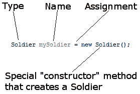
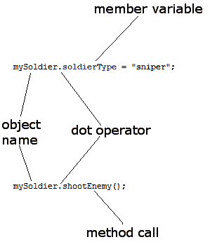
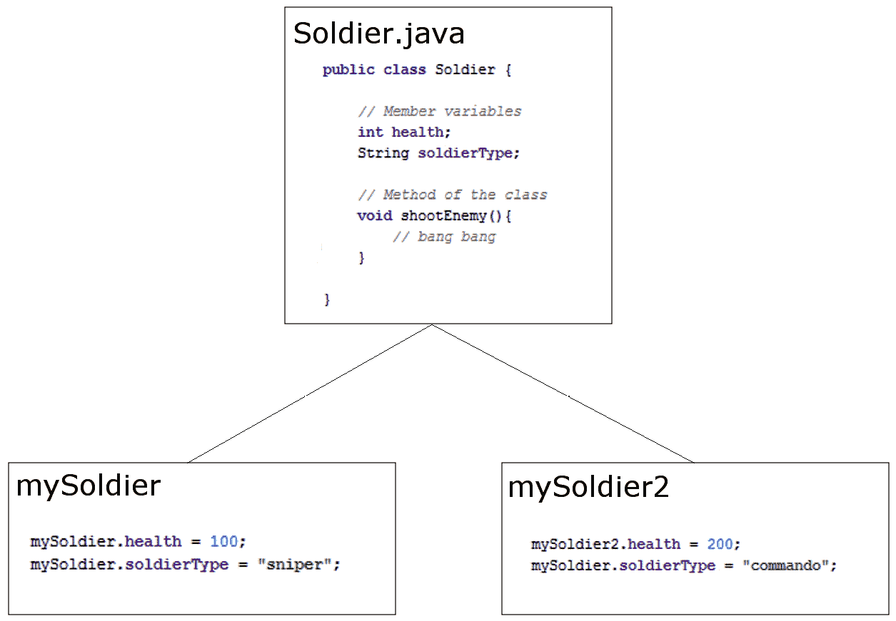
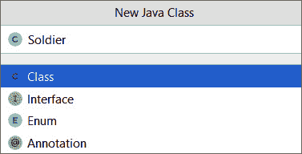
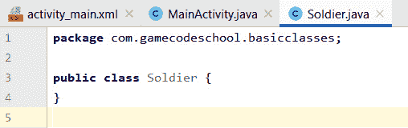
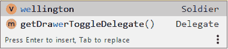

# *第八章*:面向对象编程

在本章中，我们将发现在 Java 中，类是一切的基础。我们已经讨论过重用其他人的代码，特别是安卓代码，但是在本章中，我们将真正了解这是如何工作的，并了解面向对象编程以及如何使用它。这一章的内容如下:

*   面向对象编程的介绍，包括封装、继承和多态性
*   写作和使用我们自己的第一堂课
*   封装的解释以及它如何成为我们的朋友
*   继承——第一眼和如何利用
*   多态性介绍
*   静态类
*   抽象类和接口
*   开始下一个游戏项目——乒乓

我们开始吧。

# 基本面向对象编程

我不会一口气把一整本面向对象的编程书扔给你。随着本书的进展和游戏变得更加先进，我们将返回并扩展我们的面向对象编程知识。

小费

**面向对象编程**有点拗口。从这一点开始，我将称之为 **OOP** 。

在我们了解 OOP 到底是什么之前，先来个快速警告。

## 人类通过做来学习

如果你试图记住这一章，你将不得不在你的大脑中腾出很多空间，你很可能会忘记一些重要的事情，比如去工作或者感谢作者告诉你不要试图记住这些东西。

从 [*第一章*](01.html#_idTextAnchor013) *、Java、安卓、游戏开发*回到汽车类比，对汽车机械系统的深入了解并不会让你成为一个优秀的驾驶员。了解其界面(方向盘、发动机性能、刹车等)的选项和可能性，然后练习、测试和完善系统将更好地为您服务。本章结束时的一个好目标是尝试并*差不多得到它*。

小费

如果你没有马上完全理解这一章的所有内容也没关系！继续阅读，确保完成所有的应用和迷你应用。

## 引入面向对象程序设计

我们已经知道 Java 是一种 OOP 语言。一门面向对象的语言需要我们以某种方式编程。我们已经在做了，所以我们只需要多了解一点。

OOP 是一种编程方式，它涉及到将我们的需求分解成比整个需求更易于管理的更小的部分。

每个块都是独立的，但可能被我们代码的其他部分甚至其他游戏和程序重用，同时也作为一个整体与其他块一起工作。

这些部分或块就是我们一直称之为对象的东西。当我们计划/编码一个对象时，我们用一个类来做。

小费

一个类可以被认为是一个对象的蓝图。

我们实现了一个类的一个对象*。这个叫做一个类的**实例**。想想房子的蓝图。你不能住在里面，但你可以用它盖房子；你建立一个它的实例。通常，当我们为游戏或任何其他类型的程序设计类时，我们编写它们来表示现实世界中的*事物*或我们游戏中的有形概念，可能是`Invaders`、`Bullets`或`Platforms`。*

然而，OOP 不止于此。这也是一种做事的方式，一种定义最佳实践的方法。

OOP 的三大核心原则是**封装**、**多态**、**继承**。这个听起来可能很复杂，但是如果你一步一步来，它是相当简单的。

### 包装

**封装**意味着通过只允许你选择的变量和方法被访问，来保护你的代码的内部工作免受使用它的代码的不必要的暴露。这意味着您的代码总是可以被更新、扩展或改进，而不会影响使用它的程序，只要暴露的部分仍然以相同的方式被访问。

此外，它通过限制哪些代码可能导致错误行为来帮助我们避免错误。比如你写了一个`Invader`类，入侵者倒飞进来，摔在它的背上，如果你使用封装得当，那么 bug 一定在`Invader`类，而不是游戏引擎。

回想一下从 [*第 1 章*](01.html#_idTextAnchor013) *、Java、安卓、游戏开发*开始的这一行代码:

```java
locationManager.getLastKnownLocation(LocationManager.GPS_PROVIDER)
```

有了良好的封装，卫星公司或安卓应用编程接口团队是否需要更新他们的代码工作方式并不重要。只要`getLastKnownLocation`方法签名保持不变，我们就不用担心里面发生了什么。

我们在更新前编写的代码在更新后仍然有效。如果一辆汽车的制造商去掉车轮，让它成为一辆电动气垫车，前提是它仍然有方向盘、油门和刹车踏板，驾驶它应该不是一个挑战。

当我们使用安卓应用编程接口的类时，我们是按照安卓开发者设计它们的类的方式来使用的。当我们编写类时，我们将设计它们使用封装，并以我们*决定的方式使用它们。*

### 遗产

就像听起来的那样，**继承**意味着我们可以利用其他人的类的所有特性和好处，包括封装和多态性，同时针对我们的情况进一步细化他们的代码。我们已经这样做了，每次我们使用`extends`关键字:

```java
public class SubHunter extends Activity {
```

`Activity`类为 Sub Hunter 游戏提供了如下特性:

*   与操作系统的通信
*   将我们的游戏绘制到屏幕上的`setContentView`方法
*   进入`onTouchEvent`方法，允许我们检测玩家的输入
*   还有更多…

我们没有看到`Activity`类的一行代码就获得了所有这些好处。我们需要学习如何使用这些类，但是我们不需要太担心实现它们的代码。

### 多态性

**多态性**对于一个初学者来说，起初看起来有点抽象，但并不一定很难理解。多态性允许我们编写更少依赖于我们试图操纵的*类型*的代码，例如`Invaders`、`Bullets`和`Platforms`，并允许我们处理更通用的东西，例如，也许，`GameObjects`，使我们的代码更加清晰和高效。

多态性意味着*不同的形式*。如果我们编码的对象可以是多种类型的东西，那么我们可以利用这一点。本章后面的一些工作示例将对有所帮助，但是我们将真正掌握 [*第 18 章*](18.html#_idTextAnchor345)*设计模式介绍以及更多内容中的作为一个概念！*。

## 我们为什么要这样做？

当正确编写时，所有这些 OOP 都允许您添加新特性，而不用太担心它们如何与现有特性交互。当你不得不改变一个类时，它的自包含(封装)特性对程序的其他部分来说意味着更少甚至可能为零的结果。

OOP 允许你用巨大的、迷人的、可探索的世界来编写游戏，并将这个世界分成可管理的部分和“事物”的类型通过事物，你大概可以猜到我指的是类。

您可以创建一个类的多个相似但不同的版本，而无需使用继承从头开始创建该类；由于多态性，您仍然可以在新对象中使用原对象类型的方法。

这真的很有道理。Java 从一开始就考虑到了这一切。由于这个原因，我们被迫使用所有这些 OOP，但这绝对是一件好事。让我们快速回顾一下课堂。

## 课程回顾

一个类是一堆代码，可以包含方法、变量、循环以及我们到目前为止所学的所有其他 Java 语法。我们在前七章创建了一个类。它被称为`SubHunter`，继承了安卓 API 提供的`Activity`类的特性。接下来是实现这一点的代码行。在其中，您可以看到`extends`关键字创建了这种关系:

```java
public class SubHunter extends Activity {
```

这就是我们如何访问`getWindowManager`和`getDefaultDisplay`功能以及`onTouchEvent`方法的。

小费

作为一个实验，打开 Sub Hunter 项目，从代码顶部附近删除单词`extends` `Activity`。请注意，文件现在充满了错误。这些是`SubHunter`类需要从`Activity`继承的东西。更换`extends Activity`代码，错误消失。

一个类是 Java 包的一部分，大多数包通常有多个类。我们的`SubHunter`类是我们在创建项目时定义的包的一部分。通常，尽管不总是这样，每个新类都将在它自己的`.java`代码文件中定义，与类同名——就像`SubHunter`一样。

一旦我们写了一个类，我们就可以用它来制作我们想要的任何对象。我们不是用`SubHunter`做这个的，但是世界上每个安卓程序员(包括我们)都有通过扩展`Activity`来制作对象。在这本书剩下的每个项目中，我们将从自己的类中创建对象。

记住，类是蓝图，我们基于蓝图制作对象。房子不是蓝图，正如物体不是阶级；它是由类制成的对象。

对象是引用类型变量，就像字符串一样，稍后，在 [*第 14 章*](14.html#_idTextAnchor282)*Java**Collections、Stack、Heap 和垃圾收集器*中，我们将发现引用变量的确切含义。现在，让我们看一些创建类的真实代码。

# 查看一个类的代码

假设我们在做一个战争模拟游戏。这是一个游戏，你可以在战斗中微操你的部队。其中，我们可能需要一个类来代表一个士兵。

## 类实现

这是我们假想游戏的假想类的真实代码。我们称之为类**实现**。由于类被称为`Soldier`，如果我们要真正实现这个，我们将在一个名为`Soldier.java`的文件中实现它:

```java
public class Soldier {
// Member variables
     int health;
     String soldierType;
     // Method of the class
     void shootEnemy(){
          // bang bang
     }

}
```

前面是一个名为`Soldier`的类的实现。有两个成员变量或**字段**，一个名为`health`的`int`变量和一个名为`soldierType`的`String`变量。

还有一种方法叫做`shootEnemy`。该方法没有参数并且有一个`void`返回类型，但是类方法可以是任何形状或大小，正如我们在 [*第 4 章*](04.html#_idTextAnchor086) *【用 Java 方法构造代码】*中讨论的那样。

准确的说是成员变量和字段，当类**实例化**为一个真实的对象时，字段成为对象本身的变量，我们称之为**实例**或**成员**变量。

它们只是类的变量，不管它们被称为哪个花哨的名字。然而，在方法中声明的字段和变量(称为**局部**变量)之间的区别确实随着我们的进步而变得更加重要。我们将在本章稍后再次查看所有类型的变量。

## 声明、初始化和使用类的对象

记住`Soldier`只是一个类，不是一个实际可用的对象。是军人的蓝图，不是实际的军人对象，就像`int`、`String`、`boolean`不是变量一样；它们只是我们可以用来制造变量的类型。这就是我们如何从我们的`Soldier`类中制造一个`Soldier`类型的物体:

```java
Soldier mySoldier = new Soldier();
```

前面的代码可以分为三个主要部分:

1.  在代码的第一部分，`Soldier mySoldier`声明了一个名为`mySoldier`的`Soldier`类型的新变量。
2.  代码的最后一部分`new Soldier()`调用一个叫做**构造函数**的特殊方法，这个方法是由编译器为所有类自动生成的。该方法创建一个实际的`Soldier`对象。如您所见，构造函数方法与类同名。我们将在本章后面更深入地研究构造函数。
3.  当然，两部分中间的赋值运算符`=`将第二部分的结果赋给第一部分的结果。

用下图直观地考虑这一点:



图 8.1–创建士兵构造器

这与我们处理常规变量的方式相差不远。就像正则变量一样，我们也可以这样分成两部分来做:

```java
Soldier mySoldier;
mySoldier = new Soldier();
```

我们可以这样分配和使用类的变量:

```java
mySoldier.health = 100;
mySoldier.soldierType = "sniper";
// Notice that we use the object name, mySoldier.
// Not the class name, Soldier.
// We didn't do this:
// Soldier.health = 100; 
// ERROR!
```

这里，点运算符(`.`)用于访问对象的变量。这就是我们所说的`shootEnemy`方法；同样，通过使用对象名，而不是类名，并后跟点运算符:

```java
mySoldier.shootEnemy();
```

我们可以用图表总结点运算符的用法:



图 8.2–总结点运算符

小费

我们可以把一个类的方法看作是它能够*做的事情*和它的实例/成员变量看作是它*知道的关于它自己的事情*。方法作用于数据；变量就是数据。

我们还可以制作另一个`Soldier`对象，并访问它的方法和变量:

```java
Soldier mySoldier2 = new Soldier();
mySoldier2.health = 200;
mySoldier2.soldierType = "commando";
mySoldier2.shootEnemy();
```

重要的是要认识到`mySoldier2`是一个完全独立的对象，其实例变量与`mySoldier`实例完全独立:



图 8.3–士兵对象的方法和变量

这里的关键是前面的代码不会写在类本身中。例如，我们将在名为`Soldier.java`的外部文件中创建`Soldier`类，然后使用我们刚刚看到的代码，可能是在我们的`SubHunter`类中。

当我们在一分钟内写完实际项目中的第一堂课时，这将变得更加清晰。

此外，请注意，一切都是在对象本身上完成的。我们必须创建类的对象来使它们有用。当游戏运行时，类并不存在，只有由类构成的对象。正如我们了解到变量在计算机内存中占有一席之地一样，对象的每个实例也是如此。因此，包含在对象中的成员变量也包含在内存中。

重要说明

一如既往，这条规则也有例外。但是他们是少数，我们将在本章的后面看到一个例外。事实上，到目前为止，我们已经在书中看到了一个例外。我们看到的例外是`Log`类。这些特殊的方法到底是怎么回事，被称为**静**方法，很快就会被解释清楚。

让我们通过编写一个真实的基础类来更深入地探索基础类。

# 基础课小应用

我们正在编写的假想的**实时策略** ( **RTS** )游戏将需要多个`Soldier`对象。在我们即将构建的游戏中，我们将实例化并使用多个对象。我们还将演示如何在变量和方法上使用点运算符，以显示不同的对象在它们自己的内存槽中包含它们自己的实例变量。

您可以在 GitHub repo 上获得该示例的完整代码。它在`chapter 8/Basic Classes`文件夹中。或者继续阅读，从头开始创建自己的工作示例。

创建一个新项目，选择**空活动**模板。调用应用`Basic Classes`。细节真的不太重要，因为在这个简短的练习后，我们不会再回到这个项目。

## 打造你的第一堂课

创建新项目后，我们将创建一个名为`Soldier`的新类。选择**文件** | **新建** | **Java 类**。您将看到以下对话框:



图 8.4–创建一个类

命名类`Soldier`就像我在上一张截图中做的那样，按下键盘上的*回车*。

新的类是用代码模板为我们创建的，准备将我们的实现放入其中，就像下一个截图所示:



图 8.5–新类的代码模板

此外，请注意，AndroidStudio已经将该类与我们应用的其余部分放在同一个包中。现在我们可以编写它的实现了。

将如下所示的类实现代码写在`Soldier`的左右花括号内。新代码突出显示:

```java
public class Soldier {
    int health;
    String soldierType;
    void shootEnemy(){
        //let's print which type of soldier is shooting
        Log.d(soldierType, " is shooting");
    }
}
```

您将出现一个错误，`Log…`代码将为红色。我们需要导入`Log`类。用鼠标指针选择错误，然后按住 *Alt* 键，点击*进入*导入类。

现在我们有了一个类，它是我们未来目标的蓝图`Soldier`类型，我们可以开始建立我们的军队。在编辑器窗口中，选择**MainActivity.java**选项卡。我们将在调用`super.onCreate`方法后在`onCreate`方法中编写这段代码。还要注意，我已经注释掉了对`setContentView`方法的调用，因为我们将只在这个应用的**日志**窗口中查看输出。添加以下代码:

```java
// first we make an object of type soldier
Soldier rambo = new Soldier();
rambo.soldierType = "Green Beret";
rambo.health = 150;
// It takes a lot to kill Rambo
// Now we make another Soldier object
Soldier vassily = new Soldier();
vassily.soldierType = "Sniper";
vassily.health = 50;
// Snipers have less health
// And one more Soldier object
Soldier wellington = new Soldier();
wellington.soldierType = "Sailor";
wellington.health = 100;
// He's tough but no green beret
//setContentView(R.layout.activity_main);
```

小费

如果你还没有这样做，这是一个很好的时机来利用AndroidStudio的自动完成功能。请注意，在您声明并创建了一个新的对象(例如，`wellington`)之后，您所需要做的就是开始键入对象的名称，并且一些自动完成选项会自动出现。下一张截图显示，当你键入字母`we`时，AndroidStudio建议你可能指的是**威灵顿**。然后点击，或按*进入*，选择**惠灵顿**。



图 8.6–自动完成选项

现在我们有了极其多样且有些不太可能的 RTS 军队，我们可以使用它来验证每个对象的身份。在上一步中的代码下方键入以下代码:

```java
Log.i("Rambo's health = ", "" + rambo.health);
Log.i("Vassily's health = ", "" + vassily.health);
Log.i("Wellington's health = ", "" + wellington.health);
rambo.shootEnemy();
vassily.shootEnemy();
wellington.shootEnemy();
```

小费

您需要将`Log`类导入到`MainActivity`类中，就像您之前导入`Soldier`类一样。

现在我们可以开始游戏了。所有输出将在**日志**窗口中。

这就是它的工作原理。首先，我们为新的`Soldier`类创建了一个模板。然后我们实现了我们的类，包括声明`int`和`String`类型的两个字段(成员变量)，分别称为`health`和`soldierType`。

我们班还有一个方法叫`shootEnemy`。让我们再看一遍，看看发生了什么:

```java
void shootEnemy(){
        // Let's print which type of soldier is shooting
        Log.d(soldierType, " is shooting");
}
```

在方法体中，我们打印到 **logcat** 。首先是`soldierType`弦，然后是任意的`" is shooting" String`。这里的巧妙之处在于`soldierType`弦会根据我们称之为`shootEnemy`方法的对象而有所不同。这表明`Soldier`类型的每个对象都是不同的，并存储在自己的内存槽中。

接下来，我们声明并创建了三个`Soldier`类型的新对象。分别是`rambo`、`vassily`和`wellington`。最后，我们为`health`和`soldierType`分别初始化了不同的值。

以下是输出:

```java
Rambo's health = : 150
Vassily's health = : 50
Wellington's health = : 100
Green Beret : is shooting
Sniper : is shooting
Sailor : is shooting
```

请注意，每次我们访问每个`Soldier`对象的`health`变量时，它都会打印出我们分配给它的值，这表明尽管这三个对象属于同一类型，但它们是独立的个体实例/对象。

也许更有趣的是对`shootEnemy`的三次调用。一个接一个地调用我们的每个`Soldier`对象的`shootEnemy`方法，并将`soldierType`变量打印到 **logcat** 窗口。该方法对每个单独的对象都有适当的值，进一步证明我们有三个不同的对象(类的实例)，尽管是从同一个`Soldier`类创建的。

我们看到了每个物体是如何完全独立于其他物体的。然而，如果我们想象我们的应用中有大量的`Soldier`对象，那么我们会意识到我们需要学习处理大量对象(以及常规变量)的新方法。

想想管理仅仅 100 个独立的`Soldier`对象。当我们有成千上万个物体时呢？此外，这不是很动态。我们现在编写代码的方式依赖于我们(游戏开发者)知道玩家将要指挥的士兵的确切细节。我们将在 [*第 12 章*](12.html#_idTextAnchor247)*用数组处理大量数据*中看到解决方案。

## 第一节课我们可以做更多的事情

我们可以像对待其他类型/变量一样对待类/对象。例如，我们可以在方法签名中使用类作为参数:

```java
public void healSoldier(Soldier soldierToBeHealed){…
```

当我们调用方法时，我们当然必须传递一个这种类型的对象。这里有一个对`healSoldier`方法的假设调用:

```java
// Perhaps healSoldier could add to 
// the health instance variable?
healSoldier(rambo);
```

当然，前面的例子可能会提出一些问题，比如`healSoldier`方法应该是一个类的方法吗？考虑下一个假设代码:

```java
fieldhospital.healSoldier(rambo);
```

它可能是一个类的方法，也可能不是。这将取决于对这种情况的最佳解决方案是什么。我们将看更多的面向对象程序，然后许多类似难题的最佳解决方案应该更容易呈现出来。

此外，正如您可能猜到的，我们可以使用对象作为方法的返回值。以下是更新后的假设`healSoldier`签名和实现现在的样子:

```java
Soldier healSoldier(Soldier soldierToBeHealed){
     soldierToBeHealed.health++;
     return soldierToBeHealed;
}
```

事实上，我们已经看到类被用作参数。例如，在`SubHunter`类中，在`onCreate`方法中，我们实例化了一个名为`point`的`Point`类型的对象，并将其作为参数传递给`display`对象的`getSize`方法。下面是易于参考的代码:

```java
Point size = new Point();
display.getSize(size);
```

所有这些信息可能会引发一些问题。OOP 就是这样。让我们尝试并通过再次查看变量和封装，用我们已经知道的东西合并所有这些类。

# 封装

到目前为止，我们已经看到了真正只相当于一种代码组织约定的东西，尽管我们确实讨论了 OOP 的更广泛的目标。所以，现在我们将更进一步，开始看看我们是如何用面向对象程序实现封装的。

封装的定义

封装意味着保持代码的内部工作不受使用它的程序的干扰，同时只允许访问您选择的变量和方法。这意味着，如果公开的部分仍然以同样的方式可用，您的代码总是可以更新、扩展或改进，而不会影响使用它的程序。它还允许使用封装代码的代码更加简单和易于维护，因为任务的大部分复杂性都封装在代码中。

但我不是说过我们不必知道里面发生了什么吗？所以，你可能会质疑我们目前所看到的。

重要说明

合理的面向对象学生问题:如果我们不断地这样设置实例变量:`rambo.health = 100;`，那么最终是否有可能事情会开始出错，也许是这样的:`rambo.soldierType = "fluffy bunny";`？

这是封装可以防止的非常真实的危险。

封装保护您的类或类/代码的对象不被以不应该的方式使用。通过严格控制代码的使用方式，它只能做你想让它做的事情，并且有你能控制的值范围。

它不能被迫出错或崩溃。此外，您还可以自由地对代码的内部工作方式进行更改，而不会破坏任何其他游戏或游戏的其他部分，这些部分可能是使用旧版本的代码编写的:

```java
weightlifter.legstrength = 100;
weightlifter.armstrength = -100;
weightlifter.liftHeavyWeight();
// one typo and weightlifter will rip off his arms
```

我们可以封装我们的类来避免这种情况。

## 使用访问修饰符控制类的使用

类的设计者控制着什么可以被使用他们的类的任何程序看到和操纵。让我们来看看**访问修饰符**你可能已经注意到了之前的`class`关键字如下:

```java
public class Soldier{
     //Implementation goes here
}
```

在我们到目前为止讨论的上下文中，有两种主要的类访问修饰符。让我们依次简单看一下:

*   **公众**:这个直截了当。声明为公共的类可以被所有其他类“看到”。
*   **默认**:当没有指定访问修饰符时，类有默认访问权限。这将使它公开，但只对同一包中的类公开，其他所有类都无法访问。

所以现在我们可以从这个封装开始。但是，即使一眼看去，所描述的访问修饰符也不是很细粒度。我们似乎仅限于以下内容:

*   完全锁定包之外的任何内容(默认)
*   完全免费的(公共的)

然而，这里的好处很容易被利用。这个想法是设计一个包来完成一系列任务。然后，包的所有复杂的内部工作，除了我们的包之外不应该被任何人弄乱的东西，应该是默认访问(只有包内的类可以访问)。然后，我们可以仔细选择可供其他人(或我们程序的其他不同部分)使用的公共类。

### 简而言之，类访问

一个设计良好的游戏可能由一个或多个包组成，每个包只包含`default`或`default`和`public`类。

除了类级别的隐私控制之外，Java 还为我们提供了更细粒度的控制，但是要使用这些控制，我们必须更详细地研究变量。

## 使用访问修饰符控制变量的使用

为了建立在类可见性控件的基础上，我们有可变的访问修饰符。这里有一个变量，声明了`private`访问修饰符:

```java
private int myInt;
```

例如，这里是我们的`Soldier`类被声明、创建和分配的一个实例。如您所见，本例中指定的访问权限为`public`:

```java
public Soldier mySoldier = new Soldier();
```

小费

在对变量应用修饰符之前，必须首先考虑类的可见性。如果类 *a* 对类 *b* 不可见，比如说因为类 *a* 有默认访问，而类 *b* 在另一个包中，那么你对类 *a* 中的变量使用什么访问修饰符没有任何区别；类 *b* 反正一个都看不到。

那么，到目前为止，我们对封装设计有什么猜测呢？必要时将一个类显示给另一个类是有意义的，但是只公开所需的特定变量，而不是全部。

以下是对不同变量访问修饰符的解释。它们比类访问修饰符数量更多、粒度更细:

*   `public`:你猜对了，任何包中的任何类或者方法都可以看到这个变量。只有在确定这是自己想要的情况下，才使用`public`。
*   `protected`:这是继`public`之后限制最少的一个。任何子类和任何方法都可以看到受保护的变量，如果它们在同一个包中的话。
*   `default`: `default` doesn't sound as restrictive as `protected` but it is more so. A variable has default access when no access is specified. The fact that `default` is restrictive perhaps implies we should be thinking on the side of hiding our variables more than we should be exposing them.

    重要说明

    此时，我们需要引入一个新概念。还记得我们简要讨论过继承，以及如何通过使用`extends`关键字快速获取类的属性吗？为了记录起见，`default`当我们扩展一个类时，访问变量对于类是不可见的，就像我们使用`Activity`一样；我们看不到它的默认变量。我们将在本章后面更详细地讨论继承。

*   `private`: Private variables can only be seen within the class they are declared. In addition, like default access, they cannot be seen by classes that inherit from the class in question. When a class extends another class, we call it a **subclass** or a **child** class.

    小费

    访问修改的深度和复杂性不在修饰符的范围内，而在于我们可以通过巧妙的方式将它们组合起来，以实现有价值的封装目标。

### 变量访问摘要

一个设计良好的游戏可能会由一个或多个包组成，每个包只包含`default`或`default`和`public`类。在这些类中，变量将经过仔细选择，并且很可能是各种各样的访问修饰符，选择这些修饰符是为了实现我们的封装目标。

在我们实际使用之前，所有这些访问修改还有一个问题。

## 方法也有访问修饰符

这很有意义，因为方法是我们的类可以*做的事情*。我们将希望控制我们类的用户能做什么和不能做什么。

这里的一般思想是，有些方法只在内部执行，因此，类的用户不需要这些方法，而有些方法对于类的用户如何使用您的类至关重要。

方法的访问修饰符选项与类变量相同。这使事情更容易记住，但再次表明，成功的封装是一个设计问题，而不是遵循任何特定的规则集。

例如，如果下一个方法在公共类中，它可以被任何其他实例化了适当类型的对象的类使用:

```java
Public void useMeEverybody(){
     // do something everyone needs to do here
}
```

而这个方法只能由包含它的类在内部使用:

```java
Private void secretInternalTask(){
     /*
          do something that helps the class function
          internally
          Perhaps, if it is part of the same class,
          useMeEverybody could use this method-
          On behalf of the classes outside of this class.
          Neat!
     */
}
```

没有指定访问权限的下一个方法具有默认可见性。它只能由同一包中的其他类使用。如果我们扩展包含此默认访问方法的类，它将无权访问此方法:

```java
void fairlySecretTask(){
     // allow just the classes in the package
     // Not for external use
}
```

作为我们继续之前的最后一个例子，这里有一个`protected`方法，只对包可见，但是可以被我们扩展它的类使用，就像`Activity`类的方法一样:

```java
void protected packageTask(){
     // Allow just the classes in the package
     // And you can use me, if you extend me, too
}
```

### 方法访问摘要

应该选择方法访问来最好地执行我们已经讨论过的原则。它应该为你的类的用户提供他们需要的访问，最好不要更多。通过这样做，我们实现了我们的封装目标，例如出于我们已经讨论过的所有原因，保持代码的内部工作不受使用它的程序的干扰。

## 用 getters 和 setters 访问私有变量

现在我们需要到考虑如果最好将我们的变量隐藏为私有，那么我们如何在必要时允许访问它们，而不破坏我们的封装？如果`Hospital`类的一个对象想要从`Soldier`类型的对象访问`health`成员变量，那么它可以增加它呢？`health`变量应该是私有的，因为我们不希望任何代码改变它。

为了能够使尽可能多的成员变量私有，同时仍然允许对其中一些变量的有限访问，我们使用**getter**和**setter**。Getters 和 setters 只是获取和设置变量值的方法。

Getters 和 setters 并不是我们必须学习的一些特别的新 Java 东西。它们只是使用我们已经知道的东西的惯例。让我们使用我们的`Soldier`和`Hospital`类示例来看看获取器和设置器。

在这个例子中，我们的两个类都是在自己的文件中创建的，但是在同一个包中。首先，这是我们的`Hospital`课:

```java
class Hospital{
     private void healSoldier(Soldier soldierToHeal){
          int health = soldierToHeal.getHealth();
          health = health + 10;
          soldierToHeal.setHealth(health);
     }
}
```

我们类的实现只是一个方法，`healSoldier`。它接收对`Soldier`对象的引用作为参数。因此，无论传入哪个`Soldier`对象，`vassily`、`wellington`、`rambo`或任何其他对象，该方法都有效。

它还有一个局部`health`变量，用来暂时保持和增加士兵的生命值。在同一行中，它将`health`变量初始化为`Soldier`对象的当前健康状态。`Soldier`对象的健康是`private`，所以改用大众`getHealth`消气法。

然后，`health`增加 10，`setHealth`设定者方法加载新的复活生命值，回到`Soldier`对象。也许值`10`可以被更改为`Hospital`的成员变量。然后，在即时战略中，随着医院的升级，恢复健康的数量可能会增加。

这里的关键是，虽然一个`Hospital`对象可以改变一个`Soldier`对象的健康状况，但是它只能在 getter 和 setter 方法的范围内这样做。可以编写 getter 和 setter 方法来控制和检查潜在的错误或有害值。

接下来，让我们看看我们假设的`Soldier`类，它的 getter 和 setter 方法有可能实现得最简单:

```java
public class Soldier{

     private int health;
     public int getHealth(){
          return health;
     }
     public void setHealth(int newHealth){
          // Check for stupid values of newHealth
          health = newHealth;
     }
}
```

我们有一个实例变量叫做`health`，它就是`private`。`private`表示只能通过`Soldier`类的方法访问。然后我们有一个公共的`getHealth`方法，不出所料地返回私有的`health`整数变量中的值。由于这个方法是`public`，任何可以访问`Soldier`类型对象的代码都可以使用它。

接下来，执行`setHealth`方法。同样，它是公共的，但这次它采用一个`int`值作为参数，并将传递的任何内容赋给私有的`health` 变量。

小费

在一个更真实的例子中，我们将在这里编写更多的代码，以确保传递给`setHealth`方法的值在我们期望的范围内。

现在，我们声明、创建并分配一个实例，使我们的两个新类和中的每一个都成为一个对象，参见我们的获取器和设置器如何工作:

```java
Soldier mySoldier = new Soldier();
// mySoldier.health = 100;// Does not work, private
// we can use the public setter setHealth()
mySoldier.setHealth(100);// That's better
Hospital militaryHospital = new Hospital();
// Oh no mySoldier has been wounded
mySoldier.setHealth(10);
/*          
     Take him to the hospital.
     But my health variable is private
     And Hospital won't be able to access it
     I'm doomed - tell Laura I love her
     No wait- what about my public getters and setters?
     We can use the public getters and setters 
from another class
*/
militaryHospital.healSoldier(mySoldier);
// mySoldier's private variable, health has been increased by 10
// I'm feeling much better thanks!
```

我们看到我们可以直接在我们的`Soldier`类型的对象上调用我们的公共`setHealth`和`getHealth`方法。不仅如此，我们还可以调用`Hospital`对象的`healSoldier`方法，传递对`Soldier`对象的引用，该对象也可以使用公共获取器和设置器来操作私有的`health`变量。

我们看到私有`health`变量是简单的可访问的，然而完全在`Soldier`类的设计者的控制之下。

小费

Getters 和 setters 有时被称为它们更正确的名字，**存取器**和**变异器**。我们会坚持吸气剂和沉降剂。我只是觉得你可能想知道行话。

然而，我们的例子和解释提出的问题可能比他们回答的要多。很好。

通过使用封装特性，这有点像就如何使用和访问一个类、它的方法和变量达成一个重要的协议/契约。这份合同不仅仅是一份关于现在的协议，而是一份对未来的默示保证。我们将看到，随着本章的进行，我们有更多的方法来完善和加强这份合同。

小费

在需要的地方使用封装，当然，如果你是由雇主付费使用的话。通常，封装对于小型学习项目来说是过度的，比如本书中的一些例子。当然，除了你所学的主题是封装本身。

我们学习这些 Java 面向对象的东西是基于这样的假设，即有一天你会想写更复杂的游戏，无论是在安卓还是其他使用面向对象的平台上。此外，我们将使用安卓应用编程接口中广泛使用的类，这也将有助于我们理解当时发生的事情。通常，在本书中，我们会在实现完整游戏项目时使用封装，而在向展示小代码样本以演示单个想法或主题时，我们会经常忽略它。

## 用构造函数设置我们的对象

有了所有这些私有变量以及它们的 getter 和setter，是否意味着我们需要为每个私有变量设置一个 getter 和一个 setter？那么一个有很多变量需要在开始初始化的类呢？想想这段代码:

```java
mySoldier.name
mysoldier.type
mySoldier.weapon
mySoldier.regiment
...
```

其中一些变量可能需要获取器和设置器，但是如果我们只想在对象第一次创建时设置一些东西，以使对象正确运行，会怎么样呢？

当然我们不需要两个方法(一个 getter 和一个 setter)？

幸运的是，这是不必要的。为了解决这个潜在的问题，有一种特殊的方法叫做**构造器**。当我们讨论从类中实例化对象时，我们简要地提到了构造函数的存在。我们再来看看。这里，我们创建一个`Soldier`类型的对象，并将其分配给一个名为`mySoldier`的对象:

```java
Soldier mySoldier = new Soldier();
```

我们了解到，当我们编写一个新类时，构造函数是由编译器自动提供的。然而，这已经到了关键点，就像一个方法，我们可以覆盖它，这意味着我们可以在使用之前做一些有用的事情来设置我们的新对象*。下面这段代码展示了我们如何做到这一点:*

```java
public Soldier(){
     // Someone is creating a new Soldier object

     health = 200;
     // more setup here
}
```

构造器在句法上与方法有很多相似之处。然而，它只能通过使用`new`关键字来调用，并且它是由编译器自动为我们创建的——除非我们像前面的代码一样创建自己的。

构造函数具有以下属性:

*   它们没有返回类型。
*   他们的名字和班上的一模一样。
*   它们可以有参数。
*   它们可能会过载。

这里还有一个有用的 Java 语法是 Java `this`关键字。

当我们想要明确我们所指的变量时，使用`this`关键字。再看看这个示例构造函数，它是`Soldier`类的一个假设变体:

```java
public class Soldier{
     String name;
     String type;
     int health;
     public Soldier(String name, String type, int health){
          // Someone is creating a new Soldier object

          this.name = name;
          this.type = type;
          this.health = health;
          // more setup here
     }
}
```

这一次，构造函数为我们想要初始化的每个变量都有一个参数。

小费

关于可能导致混淆的构造函数，需要注意的一个关键点是，一旦您提供了自己的构造函数，可能就像上一个一样，默认的构造函数(没有参数)就不再存在了。

让我们再讨论一下`this`。

## 使用“这个”

当我们使用`this`时，正如我们在前面几行代码中所做的那样，我们指的是类本身的实例。通过使用`this`关键字，很清楚我们指的是实例的成员变量还是方法的参数。

重要说明

作为另一个常见的例子，安卓系统中的许多东西都需要引用`Activity`的一个实例来完成它的工作。为了帮助安卓应用编程接口的另一个类/对象完成它的工作，我们将在本书中相当有规律地传递`this`(对`Activity`的引用)。我们还将在一个或多个方法中编写需要`this`作为参数的类。所以，我们将看看如何处理`this`当它被通过的时候。

关于变量和`this`关键字还有更多曲折需要学习，当应用到实际项目中时，它们会更有意义。在下一个迷你应用中，我们将探索本章中到目前为止所学的所有内容，以及一些新的想法。

首先，多一点 OOP。

## 静态方法

关于类，我们知道很多:如何把它们变成对象，如何使用它们的方法和变量。但是有些事情不太对劲。从这本书一开始，到目前为止，我们一直在使用一个不符合本章所学内容的类。我们已经使用`Log`输出到**日志文件**窗口，但是还没有实例化它一次！这怎么可能呢？

类的**静态**方法可以在*中使用，而无需*首先实例化类的对象。

小费

我们可以想到属于该类的静态方法，以及属于一个对象/类实例化的所有其他方法。

正如你现在可能已经意识到的那样，`Log`包含静态方法。需要明确的是:`Log` *包含*的静法但是`Log`还是一个类。

类也可以有静态方法和常规方法，但是常规方法需要通过类的实例以常规方式使用。

再来看看`Log.d`在行动:

```java
Log.d("Debugging","In newGame");
```

这里，`d`是静态访问的方法，该方法采用两个参数，和`String`类型。

静态关键字的更多用途

**static** 关键字对于变量也有另一个后果，尤其是当它不是常量(可以更改)时，我们将在下一个小应用中看到这一点。

静态方法通常是在类中提供的，这些类的用途非常一般，因此没有必要创建类的对象。另一个使用静态方法的有用类是`Math`。这个类是 Java API 的一部分，不是 Android API 的一部分。

小费

想写一个计算器应用？使用`Math`类的静态方法比你想象的要容易。你可以在这里看到它们:http://docs . Oracle . com/javase/7/docs/API/Java/lang/math . html。

如果您尝试这样做，您将需要导入`Math`类，就像您导入我们使用的所有其他类一样。

接下来，我们将看一个实际的 OOP 示例。

# 封装和静态方法小应用

我们已经研究了控制变量及其范围的复杂方法，如果我们看看一个实例将会很有帮助。这些与其说是变量使用的实际例子，不如说是帮助理解类、方法和变量的访问修饰符以及变量的不同类型的演示，例如引用或基元和局部或实例，以及静态和最终变量的新概念和**这个**关键字。完整的代码在 GitHub repo 的`chapter 8`文件夹中。叫做`Access Scope This And Static`。

创建一个新的**空活动**项目，并将其称为`Access Scope This And Static`。

重要说明

现在，创建一个新项目有望变得简单。如果你想复习的话，可以参考 [*第一章*](01.html#_idTextAnchor013) *、Java、安卓和游戏开发*。

在项目窗口中右键单击现有的`MainActivity`类，然后单击**新建** | **类**，创建一个新类。命名新类`AlienShip`。

小费

这只是创建新类的另一种方式。在之前的小应用中，我们使用了**文件** | **新** | **Java 类**。

现在我们声明我们的新类和一些成员变量。注意`numShips`是`private`和`static`。我们将很快看到这个变量在类的所有实例中是如何相同的。`shieldStrength`变量是`private`，而`shipName`是`public`:

```java
public class AlienShip {

     private static int numShips;
     private int shieldStrength;
     public String shipName;
```

接下来是构造函数。我们可以看到构造函数是`public`，没有返回类型，和类同名——按照规则。在其中，我们增加(加 1)私有静态`numShips`变量。我们将看到这将在我们每次创建一个`AlienShip`类型的新对象时发生。此外，构造函数使用私有`setShieldStrength`方法为私有`shieldStrength`变量设置一个值:

```java
public AlienShip(){
     numShips++;
     /*
          Can call private methods from here because I am 
          part
          of the class.
          If didn't have "this" then this call 
          might be less clear
          But this "this" isn't strictly necessary
          Because of "this" I am sure I am setting 
          the correct shieldStrength
     */
     this.setShieldStrength(100);
}
```

这里是`public static` getter 方法，这样`AlienShip`之外的类就可以找出有多少`AlienShip`对象。我们还将看到我们使用静态方法的方式:

```java
    public static int getNumShips(){
        return numShips;
    }
```

以下是我们的私人`setShieldStrength`法。我们可以直接从类中的设置`shieldStrength`，但是下面的代码显示了我们如何通过使用`this`关键字来区分`shieldStrength`局部变量/参数和`shieldStrength`成员变量:

```java
private void setShieldStrength(int shieldStrength){

     // "this" distinguishes between the 
        // member variable shieldStrength
  // And the local variable/parameter of the same name
     this.shieldStrength = shieldStrength;

}
```

下一个方法是 getter，因此其他类可以读取但不能改变每个`AlienShip`对象的屏蔽强度:

```java
public int getShieldStrength(){
    return this.shieldStrength;
}
```

现在我们有了一个每次`AlienShip`对象被击中都可以调用的公共方法。它只是打印到控制台，然后检测该对象的`shieldStrength`值是否为`0`。如果是，则调用`destroyShip`方法，我们接下来看一下:

```java
public void hitDetected(){
    shieldStrength -=25;
    Log.i("Incoming: ","Bam!!");
    if (shieldStrength == 0){
        destroyShip();
    }
}
```

最后，对于我们的`AlienShip`类，我们将对`destroyShip`方法进行编码。我们打印一条消息，根据其`shipName`指示哪艘船已经被摧毁，同时减少`numShips`静态变量，这样我们就可以跟踪我们有多少属于`AlienShip`类型的物体:

```java
private void destroyShip(){
    .numShips--;
    .Log.i("Explosion: ", ""+ this.shipName + " 
    .destroyed");
    }
} // End of the class
```

现在我们切换到我们的`MainActivity`类，并编写一些使用我们新的`AlienShip`类的代码。调用`super.onCreate`后，所有代码都进入`onCreate`方法。首先，我们创建两个新的`AlienShip`对象，称为`girlShip`和`boyShip`:

```java
// every time we do this the constructor runs
AlienShip girlShip = new AlienShip();
AlienShip boyShip = new AlienShip();
```

请注意我们如何在`numShips`中获取值。正如我们所料，我们使用`getNumShips`方法。然而，仔细看看语法。我们使用的是类名，而不是对象。我们也可以用非静态的方法访问静态变量。我们这样做是为了看到一个静态方法在起作用:

```java
// Look no objects but using the static method
Log.i("numShips: ", "" + AlienShip.getNumShips());
```

现在我们给我们的公共字符串变量分配名称:

```java
// This works because shipName is public
girlShip.shipName = "Corrine Yu";
boyShip.shipName = "Andre LaMothe";
```

如果我们试图直接给`private`变量赋值，那是行不通的。然后我们使用公共的`getShieldStrength` getter 方法打印出在构造函数中赋值的`shieldStrength`值:

```java
// This won't work because shieldStrength is private
// girlship.shieldStrength = 999;
// But we have a public getter
Log.i("girlShip shieldStrngth:", "" + girlShip.getShieldStrength());
Log.i("boyShip shieldStrngth:", "" + boyShip.getShieldStrength());
// And we can't do this because it's private
// boyship.setShieldStrength(1000000);
```

最后，我们通过使用`hitDetected`方法并偶尔检查两个对象的`shieldStrength`值来引爆一些东西:

```java
// let's shoot some ships
girlShip.hitDetected();
Log.i("girlShip shieldStrngth:", "" + girlShip.getShieldStrength());

Log.i("boyShip shieldStrngth:", "" + boyShip.getShieldStrength());

boyShip.hitDetected();
boyShip.hitDetected();
boyShip.hitDetected();

Log.i("girlShip shieldStrngth:", "" + girlShip.getShieldStrength());

Log.i("boyShip shieldStrngth:", "" + boyShip.getShieldStrength());

boyShip.hitDetected(); // ahhh

Log.i("girlShip shieldStrngth:", "" + girlShip.getShieldStrength());
Log.i("boyShip shieldStrngth:", "" + boyShip.getShieldStrength());
```

当我们认为我们已经摧毁了一艘船时，我们再次使用我们的静态`getNumShips`方法来查看我们的静态`numShips`变量是否被`destroyShip`方法改变了:

```java
Log.i("numShips: ", "" + AlienShip.getNumShips());
```

运行小应用，查看**日志**输出:

```java
numShips: 2
girlShip shieldStrngth: 100
boyShip shieldStrngth: 100
Incoming: Bam!!
girlShip shieldStrngth: 75
boyShip shieldStrngth: 100
Incoming: Bam!!
Incoming: Bam!!
Incoming: Bam!!
girlShip shieldStrngth: 75
boyShip shieldStrngth: 25
Incoming: Bam!!
Explosion: Andre LaMothe destroyed
girlShip shieldStrngth: 75
boyShip shieldStrngth: 0
numShips: 1
boyShip shieldStrngth: 0
numShips: 1
```

在前面的例子中，我们看到我们可以通过使用`this`关键字来区分同名的局部变量和成员变量。我们也可以使用`this`关键字来编写代码，该代码引用当前被操作的对象。

我们看到一个静态变量，在本例中为`numShips`，在所有实例中都是一致的。此外，通过在构造函数中递增和在我们的`destroyShip`方法中递减，我们可以跟踪我们当前拥有的`AlienShip`对象的数量。

我们还看到，我们可以使用带有点运算符的类名来代替实际的对象，从而使用静态方法。是的，我知道这有点像住在房子的蓝图里，但还是挺有用的。

最后，我们演示了如何使用访问说明符隐藏和公开某些方法和变量。

# OOP 与继承

我们已经看到如何通过从一个 API(比如 Android)的类中实例化/创建对象来使用别人的辛苦工作。但是这整个面向对象的事情甚至比这更进一步。

如果有一个类中有很多有用的功能，但并不完全是我们想要的呢？我们可以从类继承，然后进一步细化或添加它的工作方式和功能。

听到我们已经这样做了，你可能会感到惊讶。事实上，我们已经用我们创建的每个应用做到了这一点。我在这一章的开头提到了这一点。当我们使用`extends`关键字时，我们是从另一个类继承的。以下是之前迷你应用的代码:

```java
public class MainActivity extends...
```

这里，我们继承了`Activity`类及其所有功能——或者更具体地说，继承了类设计者希望我们访问的所有功能。以下是我们可以对已经扩展的课程做的一些事情。

我们甚至可以重写方法*和*仍然部分依赖于我们继承的类中被重写的方法。例如，每次扩展`Activity`类时，我们都会覆盖`onCreate`方法。但是当我们这样做的时候，我们也调用了类设计器提供的默认实现:

```java
super.onCreate(... 
```

我们讨论继承主要是为了理解我们周围正在发生的事情，并且作为最终能够设计我们或其他人可以扩展的有用类的第一步。

让我们看一些示例类，看看我们如何扩展它们，只是作为第一步，看看语法，并且也能够说我们已经做到了。

当我们看完这一章的最后一个主要话题，多态性的时候，我们也会同时对的继承这个话题再深入一点。下面是一些使用继承的代码。

该代码将放入名为`Animal.java`的文件中:

```java
public class Animal{
     // Some member variables
     public int age;
     public int weight;
     public String type;
     public int hungerLevel;
     public void eat(){
      hungerLevel--;
     }
     public void walk(){
          hungerLevel++;
     }
}
```

然后，在一个单独的名为`Elephant.java`的文件中，我们可以这样做:

```java
public class Elephant extends Animal{

     public Elephant(int age, int weight){
          this.age = age;
          this.weight = weight;
          this.type = "Elephant";
          int hungerLevel = 0;
     }
}
```

我们可以在前面的代码中看到，我们已经实现了一个名为`Animal`的类，它有四个成员变量:`age`、`weight`、`type`和`hungerLevel`。也有`eat`和`walk`两种方式。

然后我们用`Elephant`扩展`Animal`。`Elephant`现在可以做任何事情`Animal`可以，它也有它所有变量的一个实例。我们初始化了`Animal`的变量，这些变量在`Elephant`构造函数中也有。当创建`Elephant`对象时，两个变量(`age`和`weight`)被传递到构造函数中，并且两个变量(`type`和`hungerLevel`)对于所有`Elephant`对象被分配相同的值。

我们可以继续写一堆扩展`Animal`的其他类，也许是`Lion`、`Tiger`和`ThreeToedSloth`。每个都有一个`age`、`weight`、`type`和`hungerLevel`值，并且每个都能够`walk`和`eat`。

好像 OOP 还不够有用，我们现在可以对现实世界的对象建模了。我们还看到了如何通过子类化/扩展/继承其他类来使面向对象程序更加有用。

这里我们可能想学的术语是，从扩展而来的类是**超类**，从超类继承而来的类是**子类**。我们也可以说**家长**和**孩子**班。

小费

像往常一样，我们可能会问自己这个关于继承的问题:为什么？原因是这样的:我们可以写一次公共代码，在父类中，然后我们可以更新那个公共代码，所有从它继承的类也会更新。此外，子类只能使用公共/受保护的实例变量和方法。因此，如果设计得当，这也进一步增强了封装的目标。

让我们编写另一个小应用来演示继承，然后我们将仔细看看最终的主要 OOP 概念。然后我们就可以开始下一场比赛了。

# 继承小应用

我们已经看到我们可以创建类的层次结构来建模适合我们游戏的系统。因此，让我们尝试一些使用继承的简单代码。完成的代码在代码下载的`chapter 8`文件夹中。叫做`InheritanceExample`。

创建一个名为`Inheritance`的新项目，并使用**空活动**模板。用通常的方法创建三个新类。说出一个`AlienShip`，另一个`Fighter`，最后一个`Bomber`。

接下来是`AlienShip`类的代码。它与我们之前的演示`AlienShip`课非常相似。不同的是，构造器现在使用一个`int`参数来设置护盾强度。

构造器还向 **logcat** 窗口输出一条消息，这样我们就可以看到它什么时候被使用了。`AlienShip`类还有一个新的方法，`fireWeapon`，声明为`abstract`。这保证了任何子类`AlienShip` **的类都必须**实现自己版本的`fireWeapon`。请注意，类有`abstract`关键字作为其声明的一部分。我们必须包括这一点，因为它的一个方法也使用了`abstract`关键字。我们将在讨论这个演示时解释`abstract`方法，并在这个演示后讨论多态性时解释`abstract`类。我们现在就在动作中看看吧。创建一个名为`AlienShip`的类，并输入以下代码:

```java
public abstract class AlienShip {
    private static int numShips;
    private int shieldStrength;
    public String shipName;
    public AlienShip(int shieldStrength){
        Log.i("Location: ", "AlienShip constructor");
        numShips++;
        setShieldStrength(shieldStrength);
    }
    public abstract void fireWeapon();
      // Ahhh! My body, where is it?
    public static int getNumShips(){
        return numShips;
    }
    private void setShieldStrength(int shieldStrength){
        this.shieldStrength = shieldStrength;
    }
    public int getShieldStrength(){
        return this.shieldStrength;
    }
    public void hitDetected(){
        shieldStrength -= 25;
        Log.i("Incoming: ", "Bam!!");
        if (shieldStrength <= 0){
            destroyShip();
        }
    }
    private void destroyShip(){
        numShips--;
        Log.i("Explosion: ", "" + this.shipName + " 
        destroyed");
    }
}
```

现在我们将实施`Bomber`类。注意对`super(100)`的调用。这将使用`shieldStrength`的值调用超类的构造函数。我们可以在这个构造函数中进行更具体的`Bomber`初始化，但是现在，我们只打印出代码位置，这样我们就可以看到`Bomber`构造函数何时被执行。同样，因为我们必须实现抽象`fireWeapon`方法的`Bomber`特定版本。创建一个名为`Bomber`的类(如果你还没有的话)，并输入以下代码:

```java
public class Bomber extends AlienShip {
    public Bomber(){
        super(100);
        // Weak shields for a bomber
        Log.i("Location: ", "Bomber constructor");
    }
    public void fireWeapon(){
        Log.i("Firing weapon: ", "bombs away");
    }
}
```

现在我们将实施`Fighter`类。注意对`super(400)`的调用。这将使用`shieldStrength`的值调用超类的构造函数。我们可以在这个构造函数中进行更具体的`Fighter`初始化，但是现在，我们将打印出代码位置，这样我们就可以看到`Fighter`构造函数何时被执行。我们也，再次因为我们必须，实现抽象的`fireWeapon`方法的`Fighter`特定版本。创建一个名为`Fighter`的类，并输入以下代码:

```java
public class Fighter extends AlienShip{
    public Fighter(){
        super(400);
        // Strong shields for a fighter
        Log.i("Location: ", "Fighter constructor");
    }
    public void fireWeapon(){
        Log.i("Firing weapon: ", "lasers firing");
    }
}
```

这是我们在`MainActivity`的`onCreate`方法中的代码。像往常一样，在呼叫`super.onCreate`后输入该代码。这是使用我们三个新类的代码。代码看起来挺普通的，没什么新意；有趣的是输出:

```java
Fighter aFighter = new Fighter();
Bomber aBomber = new Bomber();
// AlienShip alienShip = new AlienShip(500);
// Can't do this AlienShip is abstract -
// Literally speaking as well as in code
// But our objects of the subclasses can still do
// everything the AlienShip is meant to do
aBomber.shipName = "Newell Bomber";
aFighter.shipName = "Meier Fighter";
// And because of the overridden constructor
// That still calls the super constructor
// They have unique properties
Log.i("aFighter Shield:", ""+ aFighter.getShieldStrength());
Log.i("aBomber Shield:", ""+ aBomber.getShieldStrength());
// As well as certain things in certain ways
// That are unique to the subclass
aBomber.fireWeapon();
aFighter.fireWeapon();
// Take down those alien ships
// Focus on the bomber it has a weaker shield
aBomber.hitDetected();
aBomber.hitDetected();
aBomber.hitDetected();
aBomber.hitDetected();
```

运行该应用并在**日志**窗口中获得以下输出:

```java
Location: AlienShip constructor
Location: Fighter constructor
Location: AlienShip constructor
Location: Bomber constructor
aFighter Shield: 400
aBomber Shield: 100
Firing weapon: bombs away
Firing weapon: lasers firing
Incoming: Bam!!
Incoming: Bam!!
Incoming: Bam!!
Incoming: Bam!!
Explosion: Newell Bomber destroyed
```

我们可以看到子类的构造函数如何调用超类的构造函数。我们可以也清楚地看到`fireWeapon`方法的各个实现完全按照预期工作。

# 多态性

我们已经知道多态性意味着*不同的形式*。但是这对我们意味着什么呢？

简而言之，任何子类都可以用作使用超类的代码的一部分。

这意味着我们可以编写更简单、更容易理解、更容易修改或更改的代码。

此外，我们可以为超类编写代码，并依赖于这样一个事实，即无论它被子类化多少次，在某些参数内，代码仍然会工作。我们来讨论一个例子。

假设我们想用多态来帮助编写一个动物园管理游戏。我们可能会想要一个像`feed`这样的方法。我们可能会想要传递一个将要被喂养到`feed`方法中的动物的参考。这看起来像是我们需要为每种类型的`Animal`写一个`feed`方法。

但是，我们可以用多态返回类型和参数编写**多态**方法:

```java
Animal feed(Animal animalToFeed){
     // Feed any animal here
     return animalToFeed;
}
```

前面的方法有`Animal`作为参数，这意味着*任何从扩展`Animal`的类构建的*对象都可以传入其中。正如您在前面的代码中看到的，该方法还返回了一个`Animal`实例，这也有同样的好处。

多态返回类型有一个小小的绊脚石，那就是我们需要知道什么是被返回，并在调用方法的代码中明确表示出来。

例如，我们可以像这样处理从`feed`方法传入和返回的`Elephant`实例:

```java
someElephant = (Elephant) feed(someElephant);
```

注意前面代码中高亮显示的`(Elephant)`。这表明我们希望从返回的`Animalinstance`中得到一个`Elephant`实例。这叫**铸造**。我们已经在 [*第三章*](03.html#_idTextAnchor065) *、变量、运算符和表达式*中看到了带有原始变量的铸造。

因此，您甚至可以在今天编写代码，并在一周、一个月或一年内创建另一个子类，同样的方法和数据结构仍然有效。

此外，我们可以对子类强制执行一套规则，规定它们可以做什么和不可以做什么，以及如何做。所以，一个阶段的好设计可以影响到其他阶段。

但是我们真的想要实例化一个真实的`Animal`实例吗？

## 抽象类

一个**抽象类**是一个类不能实例化，也就是不能做成一个对象。我们在继承迷你应用中看到了这一点。

重要说明

那么，这是一个永远不会被使用的蓝图？但这就像花钱请建筑师来设计你的房子，然后永远不要建造它！你可能会对自己说，“我有一种抽象方法的想法，但是抽象类很傻。”

如果我们，或者一个类的设计者，想在使用类之前强制自己继承*，可以声明一个类**抽象**。那么，我们就不能用它制造一个物体；因此，我们必须首先扩展它，并从子类中创建一个对象。*

我们也可以声明一个`abstract`方法，然后该方法必须在任何用`abstract`方法扩展类的类中被覆盖。

我们来看一个例子；会有帮助的。我们用`abstract`关键字声明类抽象，如下所示:

```java
abstract class someClass{
     /*
          All methods and variables here - as usual.
          Just don't try and make 
          an object out of me!
     */
}
```

“是的，但是为什么？”你可能会问。

有时我们想要一个可以作为多态类型使用的类，但是我们需要保证它永远不能作为对象使用。例如，`Animal`本身并没有真正的意义。

我们不谈论动物，我们谈论动物的种类。我们不会说，“哦，看看那个可爱的，毛茸茸的，白色的动物，”或者“昨天我们去宠物店买了一只动物和一张动物床。”只是太，嗯，*抽象*。

所以，抽象类有点像模板，任何*扩展*的类都可以使用它(从它继承)。

我们可能想要一个`Worker`类，并扩展它来制造`Miner`、`Steelworker`、`OfficeWorker`，当然还有`Programmer`。但是普通的`Worker`到底是做什么的呢？为什么我们要实例化一个呢？

答案是我们不想实例化一个；但是我们可能希望将其用作多态类型，这样我们就可以在方法之间传递多个 worker 子类，并拥有可以容纳所有类型`Worker`的数据结构。

这就是抽象类的意义所在，当一个类甚至有一个抽象方法时，它必须声明自己是抽象的。所有抽象方法都必须被任何扩展它的类覆盖。这意味着抽象类可以提供一些在其所有子类中都可用的通用功能。

例如，`Worker`类可能有`height`、`weight`和`age`成员变量。它可能有`getPayCheck`方法，它不是抽象的，在所有子类中都是一样的，但是有一个`doWork`方法，它是抽象的，必须被覆盖，因为所有不同类型的工人`doWork`非常不同。

这将我们巧妙地引向多态性的另一个领域，这将使我们在这本书里的生活变得更容易。

## 接口

一个界面就像一个类。唷！那就没什么复杂的了。但是它就像一个总是抽象的类，只有**和**抽象的方法。

我们可以把接口看作一个完全抽象的类，它的所有方法都是抽象的，也没有成员变量。

重要说明

好的，所以你可以把你的脑袋放在一个抽象类上，因为至少它可以在它的方法中传递一些非抽象的功能，并作为一个多态类型。但说真的，这个界面似乎有点无意义。

让我们看看最简单的接口的可能的通用例子，然后我们可以进一步讨论它:

```java
To define an interface, we type:
public interface myInterface{
     void someAbstractMethod();
     // OMG I've got no body

     int anotherAbstractMethod();
     // Ahhh! Me too
     // Interface methods are always abstract and public 
     implicitly 
     // but we could make it explicit if we prefer
     public abstract explicitlyAbstractAndPublicMethod();
     // still no body though

}
```

接口的方法没有主体，因为它们是抽象的，但是它们仍然可以有返回类型和参数，或者没有。

为了在编码后使用接口，我们在类声明后使用`implements`关键字:

```java
public class someClass implements myInterface{
     // class stuff here
     /* 
          Better implement the methods of the interface 
          or we will have errors.
          And nothing will work
     */
     @Override
     public void someAbstractMethod(){
          // code here if you like 
          // but just an empty implementation will do
     }
     @Override
     public int anotherAbstractMethod(){
          // code here if you like 
          // but just an empty implementation will do
          // Must have a return type though 
          // as that is part of the contract
          return 1;     
     }
     @Override
     public void explicitlyAbstractAndPublichMethod(){
// code here if you like 
          // but just an empty implementation will do

     }     
}
```

这使我们能够对来自完全不相关的继承层次结构的多个不同对象使用多态性。如果一个类实现了一个接口，那么整个东西(类的对象)就可以像是那个东西一样传递或者使用，因为就是那个东西。它是多态的(很多东西)。

我们甚至可以让一个类同时实现多个不同的接口。只需在每个界面之间添加一个逗号，并在`implements`关键字后列出即可。只是一定要实现所有必要的方法。

在本书中，我们将使用即将推出的安卓应用编程接口，以及第 18 章[](18.html#_idTextAnchor345)**【设计模式简介】等等！*，向前，我们也将书写我们自己。在下一个项目中，我们将使用的一个这样的接口是`Runnable`接口，它允许我们的代码与其他代码一起执行，但相互协调。*

 *任何代码都可能喜欢这样做，安卓应用编程接口提供了使这变得容易的接口。让我们再做一个游戏。

# 开始乒乓游戏

如果你不知道 Pong 是什么，那么你可能比我小很多，在继续之前你应该看一下它的外观和历史。我们将使用我们所学的关于面向对象的一切来为游戏的每个对象(一个球棒和一个球)创建一个类，以及这些类中的方法来使我们的球棒和球像我们期望的那样运行。

游戏将在屏幕底部有一个可控制的球棒，在顶部有一个球，从所有四面“墙”上反弹回来。当球触底时，球员失去一条生命，当球击中球棒时，球员得到一分。玩家将以三条命开始。

## 策划乒乓比赛

在最后一个项目中，我们在项目开始时布局了所有的方法声明和大多数方法调用。

虽然与上一个项目相比，我们在这个项目中会有一些角色相同或非常相似的方法，但在本章和下一章中，我们需要学习一些全新的概念，然后才能合理地期望编写大纲。如果我们试图对大纲进行编码，我们最终只会删除和重写大纲的大部分内容。我希望我们将进行的详细讨论将作为一个充分的介绍，你会喜欢看项目发展超过四章。

小费

一旦这个项目完成，它将作为所有剩余项目的模板，更彻底的前期准备*将变得实际。*

 *让我们启动AndroidStudio。

## 建立乒乓项目

按照这些步骤开始项目:

1.  运行AndroidStudio，开始一个新项目。
2.  在**选择项目模板**窗口，选择**空活动**选项。AndroidStudio将自动生成一些代码和文件来启动我们的项目。
3.  之后，AndroidStudio将弹出**配置你的项目**窗口。命名项目`Pong`，点击**完成**。现在，我们将创建这个游戏所需的三个新类。
4.  在项目窗口中，右击包含`MainActivity`类的文件夹，选择**新建** | **Java 类**。创建一个名为`PongGame`的新类。
5.  使用同样的技术创建一个名为`Ball`的新类。
6.  再次这样做，创建一个名为`Bat`的新类。

在这个阶段，我们有四个类准备编码。

我们需要将屏幕设置为全屏，就像我们在 Sub Hunter 游戏中所做的那样，但是首先，我们将重构为对我们的 Pong 游戏更有意义的东西。

# 将主活动重构为活动

我认为`MainActivity`有点模糊，就像在子猎人项目中一样，但是我们不会将`MainActivity`重构为`Pong`或`PongGame`，因为现在我们将我们的游戏分成了多个类别，`Pong`或`PongGame`似乎有点过于宏大了。在这个项目中，我们的`Activity`为主的类不会是整个游戏。它将仅仅是`Activity`，我们游戏引擎和所有游戏对象的入口点。让我们将`MainActivity`重构为`PongActivity`。

在项目面板中，右键单击`MainActivity`文件，选择**重构** | **重命名**。在弹出窗口中，将**主活动**更改为**辅助活动**。将所有其他选项保留为默认值，然后左键单击**重构**按钮。

请注意，项目面板中的文件名已按预期更改，但是`AndroidManifest.xml`文件中多次出现的`MainActivity`已更改为`PongActivity`，以及`PongActivity.java`文件中的一个实例。首先，我们将确保游戏以横向方式进行。

# 将游戏锁定为全屏和横向

与子猎人项目一样，我们希望使用玩家的安卓设备必须提供的每个像素，因此我们将对`AndroidManifest.xml`文件进行更改，允许我们为应用使用一种样式，从用户界面隐藏所有默认菜单和标题。

确保`AndroidManifest.xml`文件在编辑器窗口中打开。

在`AndroidManifest.xml`文件中，找到下面一行代码:

```java
android:name=".PongActivity">
```

将光标放在前面显示的关闭`>`之前。点击*输入*键几次，将`>`移动到前面显示的线的其余部分下方几行。

紧接在`".PongActivity"`下方，但在新定位的`>`之前，键入或复制并粘贴下一行代码，使游戏在没有任何用户界面的情况下运行。

请注意，行代码显示为两行，因为它太长了无法放入打印页面，但是在 Android Studio 中，您应该将其输入为一行:

```java
android:theme=
"@android:style/Theme.Holo.Light.NoActionBar.Fullscreen"
```

这是一组复杂的步骤，也是我们在书中编辑的第一个代码，所以在这里我向您展示这个文件的一个更大的摘录，其中突出显示了我们刚刚添加的代码，以获得额外的上下文。如前所述，我不得不展示两行代码:

```java
…
<activity android:name=".PongActivity"
     android:theme=
     "@android:style/Theme.Holo.Light.NoActionBar.Fullscree
     n"

     <intent-filter>
          <action android:name="android.intent.action.MAIN"
           />
<category android:name= "android.intent.category.LAUNCHER" />
     </intent-filter>
</activity>
…
```

现在，我们的游戏将使用该设备提供的所有屏幕空间，而无需任何额外的菜单。

我们现在将对代码进行一些小的修改，然后我们可以第一次测试我们的空乒乓游戏。

# 修改代码使用全屏和最好的安卓类

正如我们对子猎人项目所做的，在`PongActivity.java`文件顶部附近找到下面的代码行:

```java
import androidx.appcompat.app.AppCompatActivity;
```

将前一行代码更改为与下一行代码相同:

```java
import android.app.Activity;
```

紧接在前一行代码之后，添加新的一行代码:

```java
import android.view.Window;
```

我们更改的代码行使我们能够使用更高效版本的安卓应用编程接口`Activity`而不是`AppCompatActivity`，新的代码行使我们能够使用`Window`类，稍后我们将在本节中介绍。

此时，我们的代码中有错误。下一步将消除错误。在`PongActivity.java`文件中找到下面一行代码:

```java
public class PongActivity extends AppCompatActivity {
```

将前一行代码更改为与下一行代码相同:

```java
public class PongActivity extends Activity {
```

此时所有的错误都消失了。我们将只添加一行代码，然后删除一行无关的代码。接下来在所示的相同位置添加以下一行高亮显示的代码:

```java
@Override
protected void onCreate(Bundle savedInstanceState) {
     super.onCreate(savedInstanceState);
     requestWindowFeature(Window.FEATURE_NO_TITLE);
     getWindow().setFlags(WindowManager.LayoutParams.
      FLAG_FULLSCREEN,WindowManager.
      LayoutParams.FLAG_FULLSCREEN);
     setContentView(R.layout.activity_main);
}
```

小费

在前面的代码中，您可以使用下面几行代码从输出中删除状态/通知栏:

`getWindow().setFlags(WindowManager.LayoutParams.FLAG_FULLSCREEN, WindowManager.LayoutParams.FLAG_FULLSCREEN);`

我们的应用现在将没有标题栏或动作栏。这将是一个完整的，空屏幕，我们可以让我们的乒乓游戏。

现在我们需要删除一行代码。我们将要删除的代码是加载传统用户界面的代码。你还记得`activity_main.xml`文件吗？这是一个带有常规用户界面的文件。就像 Sub Hunter 项目一样，我们不需要它。查找并删除以下代码行:

```java
setContentView(R.layout.activity_main);
```

当我们运行应用时，用户界面将不再加载。

在这个阶段，您可以运行游戏，并看到空白画布，我们将在其上构建 Pong 游戏。

# 总结

在这一章中，我们比其他任何一章都涵盖了更多的理论。如果你没有记住所有的内容，或者有些代码看起来有点太深入，那么你还是完全成功了。如果你仅仅理解 OOP 是通过封装、继承和多态来编写可重用、可扩展和高效的代码，那么你就有潜力成为一名 Java 大师。

简而言之，OOP 使我们能够使用其他人的代码，即使其他人不知道我们在他们做工作的时候会做什么。你需要做的就是继续练习。在整本书中，我们将经常使用本章所学的内容。这将加强我们一直在谈论的内容。

我们也从 Pong 项目开始，创建了一个空项目，以及我们将在接下来的三章中编码的所有类。

在下一章中，我们将实现一个基本的游戏引擎，它可以处理我们的 Pong 游戏对象，在这个过程中，我们将学习如何使用一些接口，以及如何实现一个游戏循环，这将在本书中很好地为我们服务。**