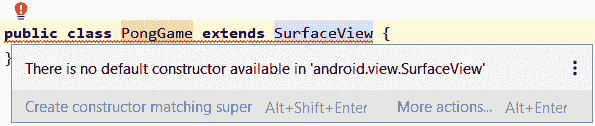
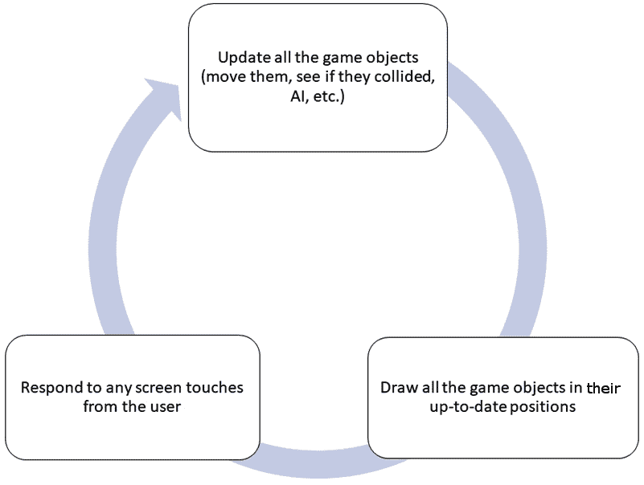
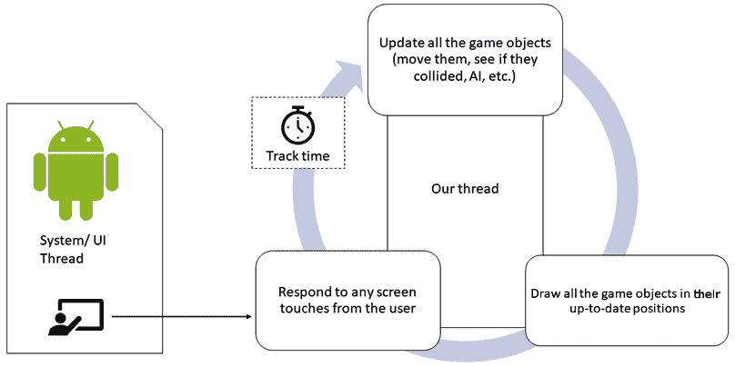
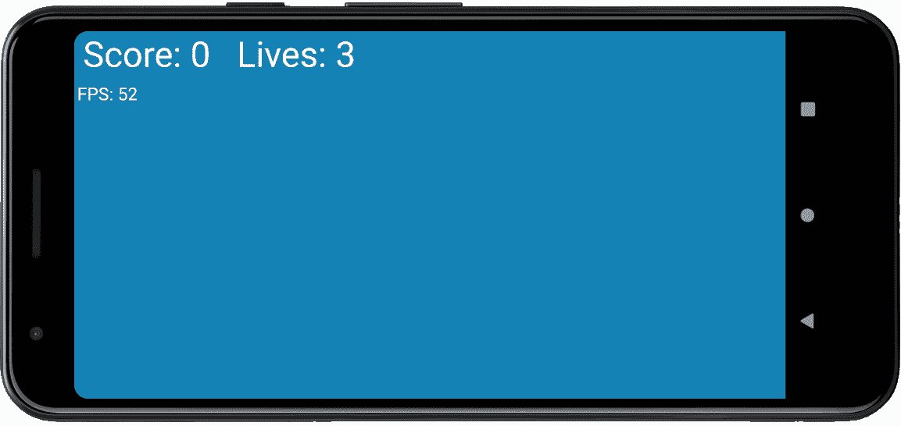

# *第九章*:游戏引擎、线程和游戏循环

在这一章，我们将看到游戏引擎走到了一起。在这一章的最后，我们将看到一个令人兴奋的空白屏幕，它在真实设备上以每秒 60 帧的速度绘制调试文本，尽管在模拟器上可能会更少。在此过程中，我们将学习编程线程、`try-catch`块、`Runnable`界面、安卓活动生命周期以及游戏循环的概念。

我对空白屏幕兴奋的表情可能看起来有些讽刺，但是一旦这一章完成，我们将能够编码和添加游戏对象，几乎是随意的。当我们在下一章中添加移动球和可控球棒时，我们将在本章中看到我们取得了多大的成就。此外，这个游戏引擎代码将被用作未来项目的近似模板(我们将根据每个项目进行改进)，使未来游戏的实现更快、更容易。

我们将在本章中介绍以下内容:

*   编码`PongGame`类
*   编码`draw`方法以及除此之外的一些方法
*   了解线程和`try-catch`块
*   实现游戏循环

我们开始吧。

# 对 PongActivity 类进行编码

在这个项目中，正如前面所讨论的，我们将有多个类。准确地说是四个。Android API 提供的`Activity`类是与操作系统交互的类。我们已经看到了当玩家点击 app 图标启动一个 app(或者我们的游戏)时，操作系统是如何与`onCreate`交互的。此外，我们已经看到当用户与屏幕交互时，操作系统如何调用`onTouchEvent`方法，这给了我们机会让我们的游戏做出适当的响应。

由于这个游戏比较复杂，需要实时响应，所以需要使用稍微深入一点的结构。起初，这看起来很复杂，但从长远来看，它使我们的代码更简单、更容易管理。

我们现在没有一个名为`Pong`(类似于`SubHunter`)的类来做任何事情，而是有一个类来处理游戏的启动和关闭，以及通过获得屏幕分辨率来帮助初始化。这个班属于`Activity`类型是有道理的。

然而，正如您将很快看到的，我们将把与触摸的交互委托给另一个类，这个类也将处理游戏的几乎每个方面——有点像游戏引擎。这将向我们介绍一些对我们来说是新的有趣的概念。

让我们从开始编写我们在上一章中自动生成和重构的基于`Activity`的类。我们称这个班级为`PongActivity`。

这就是`PongActivity`班在上一章之后的样子:

```java
import android.app.Activity;
import android.view.Window;
import android.os.Bundle;
public class PongActivity extends Activity {
    @Override
    protected void onCreate(Bundle savedInstanceState) {
        super.onCreate(savedInstanceState);
        requestWindowFeature(Window.FEATURE_NO_TITLE);
        getWindow().setFlags(WindowManager.LayoutParams.
      FLAG_FULLSCREEN,WindowManager.
      LayoutParams.FLAG_FULLSCREEN);
    }
}
```

为`PongActivity`类添加新的、高亮显示的代码部分:

```java
import android.app.Activity;
import android.view.Window;
import android.os.Bundle;
import android.graphics.Point;
import android.view.Display;
public class PongActivity extends Activity {
    private PongGame mPongGame;
    @Override
    protected void onCreate(Bundle savedInstanceState) {
        super.onCreate(savedInstanceState);

          requestWindowFeature(Window.FEATURE_NO_TITLE);
          getWindow().setFlags(WindowManager.LayoutParams.
           FLAG_FULLSCREEN,WindowManager.
           LayoutParams.FLAG_FULLSCREEN);
          Display display = 
           getWindowManager().getDefaultDisplay();
          Point size = new Point();
          display.getSize(size);
          mPongGame = new PongGame(this, size.x, size.y);
          setContentView(mPongGame);
    }
}
```

注意这一切看起来很熟悉。事实上，除了类型为`PongGame`的`mPongGame`对象之外，上一个块中的所有代码都与我们在 Sub' Hunter 项目中看到的相同。我不会再重复我们如何通过`display`、`size`和`getSize`获得屏幕分辨率。我将详细介绍我们如何处理这个新对象。一开始可能看起来很奇怪。

第一件新的事情是，我们正在声明我们的`PongGame`类的一个实例。目前，这是一个空类:

```java
private PongGame mPongGame;
```

在前面的代码中，我们开始使用成员变量的`m`前缀。这是一个代码格式约定。另外，请注意，它被声明为成员变量，应该在任何方法之外。

小费

现在我们将创建许多类，包括构造函数和带参数的方法，在所有成员变量的开头加上前缀`m`将避免我们混淆哪些变量属于类的实例，哪些变量只在方法中有作用域。

在`onCreate`方法中，在我们用`display`等完成通常的事情之后，我们像这样初始化`mPongGame`:

```java
mPongGame = new PongGame(this, size.x, size.y);
```

我们正在做的是将三个参数传递给`PongGame`构造函数。我们显然没有编写构造函数，正如我们所知，默认构造函数接受零个参数。因此，这条线将导致一个错误，直到我们很快解决这个问题。

传入的论点很有意思。首先我们有`this`，是对`PongActivity`的引用。`PongGame`类需要执行它需要这个引用的动作(使用方法)。

第二个和第三个参数是水平和垂直屏幕分辨率。有意义的是，我们的游戏引擎(`PongGame`)将需要这些来执行任务，例如检测屏幕边缘并将其他游戏对象缩放到适当的大小。当我们开始编写`PongGame`构造函数时，我们将进一步讨论这些参数。

接下来看看下面更奇怪的一行:

```java
setContentView(mPongGame);
```

这就是我们在`SubHunter`类中将`ImageView`实例设置为应用内容的地方。记住`Activity`类的`setContentView`方法必须带一个`View`对象，`ImageView`是一个`View`对象。前一行代码似乎暗示我们将使用我们的`PongGame`类作为游戏的可见内容。但是`PongGame`不是`View`对象。反正还没有。

读者挑战

你能猜到解决方案可能是哪个面向对象的概念吗？

在我们向`PongActivity`类中添加几行代码后，我们将修复构造函数和 not-a- `View`问题。

添加下面两个被覆盖的方法，然后我们将讨论它们。将它们添加到`onCreate`方法的右花括号下方，但在类的右花括号之前:

```java
@Override
protected void onResume() {
     super.onResume();
     // More code here later in the chapter
}
@Override     
protected void onPause() {
     super.onPause();
     // More code here later in the chapter
}
```

我们所做的是覆盖`Activity`类的另外两个方法。我们将看到为什么我们需要这样做，我们将在这些方法中做什么，同样重要的是，在本章的后面，安卓将何时调用这些方法。这里需要注意的一点是，通过添加这些被覆盖的方法，我们给了操作系统在另外两种情况下通知我们玩家意图的机会。本章后面将会详细解释恢复和停止到底需要什么。

在这一点上，转到`PongGame`类是有意义的，这是这个游戏的主要类。我们将在本章结束时回到`PongActivity`。

# 对 PongGame 类进行编码

我们要做的第一件事就是解决我们`PongGame`类不是`View`类的问题。更新突出显示的类声明，如下所示:

```java
class PongGame extends SurfaceView {
```

您将需要导入`android.view.SurfaceView`类，如下所示，以便AndroidStudio了解`SurfaceView`类。您可以在`PongGame.java`文件中的包声明后添加代码行，或者使用 *Alt* + *输入*键盘组合，就像我们之前所做的那样。

`SurfaceView`是`View`的后代，现在`PongGame`通过继承也是`View`的一个类型。再来看看已经添加的`import`声明。如下所述，这种关系很明显:

```java
android.view.SurfaceView
```

小费

请记住，正是因为多态性，我们才能将`View`的后代发送到`PongActivity`类中的`setContentView`方法，正是因为继承，`PongGame`才是`SurfaceView`的一种类型。

我们可以扩展`View`的很多后代来解决这个初始问题，但是我们会看到`SurfaceView`有一些非常具体的特性，非常适合让这个选择适合我们的游戏。

我们这个班和`PongActivity`班还是有错误的。这两种情况都是由于`PongGame`类中缺少合适的构造方法。

这是一个截图，显示了自从我们扩展`SurfaceView`以来`PongGame`类中的错误:



图 9.1–扩展类导致的错误

`PongActivity`中的错误更加明显:我们在调用一个不存在的方法。但是，上一张截图中显示的错误不太容易理解。

`PongGame`类，现在是一个`SurfaceViewinstance`，必须提供一个构造函数，因为如前一章所述，一旦您提供了自己的构造函数，默认的(零参数的)构造函数就不复存在了。由于`SurfaceView`类实现了几个不同的构造函数，我们必须专门实现一个或者编写自己的。因此出现了之前的错误。

由于`SurfaceView`提供的构造函数都不是我们需要的，所以我们将提供自己的构造函数。

小费

如果你想知道你究竟如何知道提供了什么构造函数，以及你需要找到的关于安卓类的任何其他细节，只需谷歌一下。键入类名，后跟`API`。谷歌几乎总是会提供安卓开发者网站相关页面的链接作为首要结果。这里有`SurfaceView`页面的直接链接:[https://developer . Android . com/reference/Android/view/surface view](https://developer.android.com/reference/android/view/SurfaceView)。在**公共构造函数**标题下，你会看到一些构造函数是可选的。

`PongActivity`还要求我们创建一个构造函数，该构造函数与我们在这行代码中尝试初始化它的方式相匹配:

```java
mPongGame = new PongGame(this, size.x, size.y);
```

让我们添加一个构造函数，它匹配传入`this`的`PongActivity`类的调用和屏幕分辨率，并同时解决这两个问题。

请记住，`PongGame`类无法“看到”`PongActivity`中的变量。通过使用构造函数，`PongActivity`正在为`PongGame`提供对自身(`this`)的引用，以及包含在`size.x`和`size.y`中的屏幕尺寸(以像素为单位)。将此构造函数添加到`PongGame`类中。代码必须在类的左大括号和右大括号内。这是一个约定，但不要求将构造函数放在其他方法之上，而是放在成员变量声明之后:

```java
// The PongGame constructor
// Called when this line:
// mPongGame = new PongGame(this, size.x, size.y);
// is executed from PongActivity
public PongGame(Context context, int x, int y) {
        // Super... calls the parent class
        // constructor of SurfaceView
        // provided by Android
        super(context);
}
```

要导入`Context`类，请执行以下操作:

1.  将鼠标指针放在新构造函数签名中的红色`Context`上。
2.  按住 *Alt* 键，点击*回车*键。从弹出选项中选择**导入类**。

这将导入`Context`类。

现在我们的基本游戏引擎或者初始化它的`PongActivity`类都没有错误。在这个阶段，我们可以运行游戏，并看到使用`PongGame`作为`setContentView`中的`View`实例已经成功，我们有一个漂亮的空白屏幕，准备绘制我们的乒乓游戏。如果你愿意的话，可以试试这个，但是我们将对`PongGame` 类进行编码，包括向构造函数添加代码，这样它接下来就会做一些事情。

# 提前思考 PongGame 课程

在这个项目的过程中，我们会不断地回到这个班级。在这一章中，我们将做的是准备好基础设置，以便在接下来的两章中添加游戏对象(球棒和球)以及碰撞检测和音效。

为了实现这一点，首先我们将添加一堆成员变量，然后我们将在构造函数内部添加一些代码，以便在类被`PongActivity`实例化/创建时设置它。

之后，我们会编写一个`startNewGame`方法，每次需要开始新游戏的时候，包括用户启动 app 后第一次开始游戏的时候，我们都可以调用这个方法。

接下来，我们对`draw`方法进行编码，这将揭示我们需要采取的每秒 60 次绘制到屏幕上的新步骤，我们还将看到一些使用我们的老朋友`Canvas`、`Paint`和`drawText`的熟悉代码。

在这一点上，我们将需要讨论一些更多的理论，比如我们将如何为球棒和球的动画计时，以及我们如何在不干扰安卓流畅运行的情况下锁定这些计时。这两个主题，即游戏循环和线程，将允许我们添加章节的最终代码，并见证我们的游戏引擎的运行——尽管只有一点文本以每秒 60 **帧的速度绘制到屏幕上** ( **FPS** )。

## 添加成员变量

在`PongGame`声明之后、构造函数之前添加如下代码块所示的变量。您还需要使用 *Alt* + *Enter* 键盘组合，这三个类会有错误，因为它们需要一个`import`语句。他们是`SurfaceHolder`、`Canvas`和`Paint`:

```java
// Are we debugging?
private final boolean DEBUGGING = true;
// These objects are needed to do the drawing
private SurfaceHolder mOurHolder;
private Canvas mCanvas;
private Paint mPaint;
// How many frames per second did we get?
private long mFPS;
// The number of milliseconds in a second
private final int MILLIS_IN_SECOND = 1000;
// Holds the resolution of the screen
private int mScreenX;
private int mScreenY;
// How big will the text be?
private int mFontSize;
private int mFontMargin;
// The game objects
private Bat mBat;
private Ball mBall;
// The current score and lives remaining
private int mScore;
private int mLives;
```

一定要研究代码，然后我们才能谈论它。

首先要注意的是，我们再次使用了在成员变量名前添加`m`的命名约定。当我们在方法中添加局部变量时，这将有助于区分它们。

另外，注意所有的变量都被声明为`private`。您可以删除所有的`private`访问说明符，代码仍然可以工作，但是由于我们不需要从这个类之外访问这些变量中的任何一个，通过声明它们`private`来保证它永远不会发生是明智的。

第一个成员变量是`DEBUGGING`。我们已经声明这个为`final`，因为我们不想在游戏中改变它的值。请注意，声明它`final`并不妨碍我们在调试和不调试之间切换时手动切换它的值。

接下来我们声明实例的三个类将处理屏幕上的绘图。请注意我们以前没有见过的新版本:

```java
// These objects are needed to do the drawing
private SurfaceHolder mOurHolder;
private Canvas mCanvas;
private Paint mPaint;
```

需要`SurfaceHolder`类才能进行绘图。字面意思是*握着*的物体是图纸表面。当我们一分钟后对`draw`方法进行编码时，我们将看到它允许我们用来绘制到屏幕上的方法。

接下来的两个变量让我们对实现流畅一致的动画需要什么有了一些了解。他们又来了:

```java
// How many frames per second did we get?
private long mFPS;
// The number of milliseconds in a second
private final int MILLIS_IN_SECOND = 1000;
```

两者都是`long`类型，因为他们将持有一个巨大的数字。自 1970 年 1 月 1 日以来，计算机以毫秒为单位测量时间。当我们谈论游戏循环时，我们需要知道监控和测量每一帧动画的速度是我们如何确保球棒和球按照它们应该的方式移动的。

`mFPS`变量将在每秒 60 次左右的动画每一帧被重新初始化。它将被传递到每个游戏对象中(动画的每一帧)，以便他们计算已经过去了多少时间，然后可以得出移动了多远。

`MILLIS_IN_SECOND`变量初始化为`1000`。一秒钟确实有`1000`毫秒。我们将在计算中使用这个变量，因为它将使我们的代码比使用文字值`1000`时更清晰。之所以宣称`final`是因为一秒的毫秒数显然永远不会改变。

为了方便起见，这里再次显示了我们刚刚添加的下一段代码:

```java
// Holds the resolution of the screen
private int mScreenX;
private int mScreenY;
// How big will the text be?
private int mFontSize;
private int mFontMargin;
```

`mScreenX`和`mScreenY`变量将保持屏幕的水平和垂直分辨率。请记住，这些值是从`PongActivity`计算并传递到`PongGame`构造器的。

接下来的两个变量`mFontSize`和`mMarginSize`将基于屏幕大小(以像素为单位)进行初始化，以保持一个像素值，从而使我们的文本格式简洁明了，而不是不断地对每一位文本进行计算。

请注意，我们还声明了`Bat`和`Ball` ( `mBat`和`mBall`)的一个实例，但是我们暂时不会对它们做任何事情，因为类仍然没有代码。

重要说明

声明一个对象是可以的，但是如果你在初始化之前尝试使用它，你会得到一个`NULL POINTER EXCEPTION`，游戏会崩溃。我现在在这里添加了这些，因为在这种情况下它是无害的，并且它节省了重新访问代码不同部分太多次的时间。

最后两行代码声明了两个成员变量`mScore`和`mLives`，这两个变量将保存玩家的分数和他们还剩多少机会。

在我们继续之前，先说清楚，这些是`PongGame.java`代码文件顶部的`import`语句:

```java
import android.content.Context;
import android.graphics.Canvas;
import android.graphics.Paint;
import android.view.SurfaceHolder;
import android.view.SurfaceView;
```

现在我们可以开始初始化构造函数中的一些变量了。

## 对 PongGame 构造函数进行编码

将高亮显示的代码添加到构造函数中。一定要研究代码，然后我们可以讨论它:

```java
public PongGame(Context context, int x, int y) {
     // Super... calls the parent class
     // constructor of SurfaceView
     // provided by Android
     super(context);
     // Initialize these two members/fields
     // With the values passed in as parameters
     mScreenX = x;
     mScreenY = y;
     // Font is 5% (1/20th) of screen width
     mFontSize = mScreenX / 20;
     // Margin is 1.5% (1/75th) of screen width
     mFontMargin = mScreenX / 75;
     // Initialize the objects
     // ready for drawing with
     // getHolder is a method of SurfaceView
     mOurHolder = getHolder();
     mPaint = new Paint();
     // Initialize the bat and ball

     // Everything is ready so start the game
     startNewGame();
}
```

我们刚刚添加到构造函数中的代码开始使用我们作为参数(`x`和`y`)传入的值来初始化`mScreenX`和`mScreenY`。我们整个`PongGame`班现在可以随时使用屏幕分辨率。这又是两行字:

```java
// Initialize these two members/fields
     // With the values passed in as parameters
     mScreenX = x;
     mScreenY = y;
```

接下来，我们将`mFontSize`和`mFontMargin`初始化为屏幕宽度的一小部分(以像素为单位)。这些值有点随意，但它们是有效的，我们将使用这些变量的各种倍数在屏幕上整齐地对齐文本。下面是我提到的两行代码:

```java
     // Font is 5% (1/20th) of screen width
     mFontSize = mScreenX / 20;
     // Margin is 1.5% (1/75th) of screen width
     mFontMargin = mScreenX / 75;
```

接下来，我们初始化我们的`Paint`和`SurfaceHolder`实例。`Paint`使用默认构造函数，就像我们之前做的那样，但是`mHolder`使用`getHolder`方法，这是`SurfaceView`类的一个方法。`getHolder`方法返回一个初始化为`mHolder`的引用，这样`mHolder`现在就是那个引用。简而言之，`mHolder`现在可以使用了。我们可以使用这种便捷的方法，因为`PongGame`是一个`SurfaceView`实例:

```java
     // Initialize the objects
     // ready for drawing with
     // getHolder is a method of SurfaceView
     mOurHolder = getHolder();
     mPaint = new Paint();
```

我们需要在`draw`方法中做更多的准备，然后才能使用我们的`Paint`和`Canvas`课程。我们很快就会看到确切的结果。

最后，我们称之为`startNewGame`法:

```java
     // Initialize the bat and ball

     // Everything is ready to start the game
     startNewGame();
```

请注意`startNewGame`方法调用以红色下划线表示为错误，因为我们还没有对其进行编码。接下来让我们做那个。

## 编码 startNewGame 方法

在构造函数的右大括号之后但在类的右大括号`PongGame`之前添加方法的代码:

```java
// The player has just lost
// or is starting their first game
private void startNewGame(){
     // Put the ball back to the starting position

     // Reset the score and the player's chances
     mScore = 0;
     mLives = 3;
}
```

这个简单的方法把分数设回零，玩家的生命回到三。这正是我们开始新游戏所需要的。

注意注释`// Put the ball back to the starting position`。这表明一旦我们有了一个球，我们将从这个方法在每个游戏开始时重置它的位置。

让我们准备画画。

## 编码绘制方法

在`startNewGame`方法之后添加紧接着显示的`draw`方法。代码中会有几个错误。我们将处理它们，然后我们将详细讨论`draw`方法将如何与`SurfaceView`类相关联地工作，因为其中有一些看起来完全陌生的代码行以及一些熟悉的代码行:

```java
// Draw the game objects and the HUD
private void draw() {
     if (mOurHolder.getSurface().isValid()) {
          // Lock the canvas (graphics memory) ready to  
              draw
          mCanvas = mOurHolder.lockCanvas();
          // Fill the screen with a solid color
          mCanvas.drawColor(Color.argb
                    (255, 26, 128, 182));
          // Choose a color to paint with
          mPaint.setColor(Color.argb
                    (255, 255, 255, 255));
          // Draw the bat and ball
          // Choose the font size
          mPaint.setTextSize(mFontSize);
          // Draw the HUD
          mCanvas.drawText("Score: " + mScore +
                              "   Lives: " + mLives,
                    mFontMargin, mFontSize, mPaint);
          if (DEBUGGING) {
               printDebuggingText();
          }
          // Display the drawing on screen
          // unlockCanvasAndPost is a method of SurfaceView
          mOurHolder.unlockCanvasAndPost(mCanvas);
     }
}
```

我们有两个错误。一是`Color`级需要进口。您可以用通常的方法修复这个问题，或者手动添加下一行代码。

无论您选择哪种方法，都需要在文件顶部的代码中添加以下额外的一行:

```java
import android.graphics.Color;
```

让我们来处理另一个错误。

### 添加打印调试文本方法

第二个错误是对`printDebuggingText`方法的调用。方法还不存在。现在让我们补充一下。

在`draw`方法后添加以下代码:

```java
private void printDebuggingText(){
     int debugSize = mFontSize / 2;
     int debugStart = 150;
     mPaint.setTextSize(debugSize);
     mCanvas.drawText("FPS: " + mFPS ,
          10, debugStart + debugSize, mPaint);
}
```

前面的代码使用`debugSize`局部变量保存的值是`mFontSize`成员变量的一半。这意味着当`mFontSize`(用于**平视显示器(****【HUD】)**)基于屏幕分辨率动态初始化时，在构造器中，`debugSize`将始终是它的一半。在我们开始绘制文本之前，`debugSize`变量被用来设置字体的大小。`debugStart`变量只是从屏幕顶部开始打印调试文本的垂直边距的任意值。

然后，这两个值用于在屏幕上定位一行文本，该行文本每秒显示当前帧。由于这个方法是从`draw`方法调用的，而`draw`方法又会从主游戏循环中调用，所以这一行文本每秒会被不断刷新高达 60 次。

重要说明

在非常高或非常低分辨率的屏幕上，您可能需要将该值更改为更适合您屏幕的值。当我们在最终项目中了解视口的概念时，我们将一劳永逸地解决这个模糊问题。这款游戏专注于我们第一次实际使用类。

让我们探索一下`draw`方法中的新代码行，以及如何使用我们的`PongGame`类派生的中的`SurfaceView`类来处理我们所有的绘图需求。

## 了解绘制方法和表面视图类

从方法中间的开始，向外工作，我们有一些熟悉的东西，比如对`drawColor`、`setTextSize`、`drawText`的调用。我们还可以看到注释，指示我们最终将在哪里添加代码来绘制球棒和球。这些熟悉的方法调用执行与上一个项目中相同的操作:

*   `drawColor`代码用纯色清除屏幕。
*   `setTextSize`方法设置用于绘制抬头显示器的文本大小。
*   `drawText`方法绘制的文本将显示分数和玩家剩余的生命数量。

然而，全新的是`draw`方法最开始的代码。又来了:

```java
if (mOurHolder.getSurface().isValid()) {
// Lock the canvas (graphics memory) ready to draw
mCanvas = mOurHolder.lockCanvas(); 
…
…
```

`if`语句包含对`getSurface`的调用，并将其与对`isValid`的调用联系起来。如果这一行返回`true`，它确认我们想要操作来表示我们的画框的内存区域是可用的，然后代码在`if`语句中继续。

这些方法(尤其是第一个)内部发生的事情非常复杂。它们是必要的，因为我们所有的绘图和其他处理(如移动对象)都将与检测玩家输入并监听操作系统消息的代码异步进行。这在之前的项目中不是问题，因为我们的代码只是坐在那里等待输入，画一个单独的框架，然后再坐在那里等待。

现在我们希望每秒执行 60 次代码，我们需要在访问内存之前确认我们可以访问它。

这引发了更多关于该代码如何异步运行的问题。这将在我们稍后讨论线程时得到回答。目前，只需知道代码行检查我们代码的其他部分或安卓本身是否正在使用所需的内存部分。如果是自由的，则执行`if`语句内部的代码。

此外，要在`if`语句中执行的第一行代码调用`lockCanvas`方法，因此，如果代码的另一部分试图在我们的代码访问内存时访问它，它将无法访问。

然后我们画所有的画。

最后，在`draw`方法中，在末尾有下一行(加上注释):

```java
// Display the drawing on screen
// unlockCanvasAndPost is a method of SurfaceHolder
mOurHolder.unlockCanvasAndPost(mCanvas);
```

`unlockCanvasAndPost`方法将我们新装饰的`Canvas`对象(`mCanvas`)发送到屏幕上进行绘制，并释放锁，以便其他代码区域可以在整个过程再次开始之前再次使用它——尽管非常短暂。这个过程发生在动画的每一帧。

我们现在理解`draw`方法中的代码；然而，我们仍然没有反复调用`draw`方法的机制。其实我们连`draw`法都不叫一次。我们需要谈谈游戏循环和线程。

# 游戏循环

什么是游戏循环呢？几乎每个游戏都有一个游戏循环。即使是你可能怀疑没有的游戏，比如基于回合的游戏，仍然需要在遵循底层操作系统规则的同时，将玩家输入与绘图和处理 AI 同步。

游戏中不断需要更新对象，可能是通过移动、旋转等方式。然后所有的东西都必须画在新的位置，同时响应用户的输入。视觉效果可能会有所帮助:



图 9.2–可视化游戏循环

我们的游戏循环包括三个主要阶段:

1.  更新所有游戏对象，通过移动它们，检测碰撞，并处理人工智能(如果使用)。
2.  基于刚刚更新的数据，绘制处于最新状态的对象(当前动画帧)。
3.  回应玩家的屏幕触摸。

我们已经有了一个处理这部分循环的`draw`方法。这表明我们将有一个方法来完成所有的更新。我们将很快为一种`update`方法编写大纲。此外，我们知道我们可以对屏幕触摸做出反应，尽管我们将需要从以前的项目中稍微调整一下，因为我们不再在活动中工作了。

还有一个问题是(正如我简要提到的)所有的更新和绘制都是在检测屏幕触摸和收听操作系统时异步进行的。

小费

明确一点，异步意味着它不会同时发生。我们的游戏代码将通过与安卓和用户界面共享执行时间来工作。CPU 会非常快速地在我们的代码和 Android/用户输入之间来回切换。

但是这三个阶段到底是如何循环的呢？我们将如何对这个可以调用`update`和`draw`方法的异步系统进行编码，以及如何使循环以正确的速度(帧速率)运行？

我们大概可以猜到，编写一个高效的游戏循环并不像`while` 循环那么简单，虽然我们的游戏循环也会包含一个 Java `while`循环。

我们需要考虑计时、循环的开始和停止，以及不要因为我们垄断了游戏循环内的整个 CPU 而导致操作系统无响应。我们什么时候以及如何称呼我们的`draw`方法？我们如何测量和跟踪帧速率？

考虑到这些事情，我们完成的游戏循环可能可以用下面这张图来更好地表示。注意对**线程**概念的介绍:



图 9.3–游戏循环的表示

现在我们知道了我们想要达到的目标，让我们了解一下线程。

# 熟悉线程

那么，什么是线程呢？你可以像在一个故事中思考线程一样，在编程中思考线程。在故事的一个线索中，我们可能会看到主角在前线与敌人战斗，而在另一个线索中，士兵的家人正在谈论家庭生活。当然，一个故事不一定只有两条线索。我们可以引入第三条线索；也许这个故事也讲述了政治家和军事指挥官们做出的决定。这些决定会潜移默化地或不那么潜移默化地影响其他线程中发生的事情。

编程线程就是这样。我们在程序中创建控制不同方面的部件/线程。在安卓系统中，当我们需要确保一个任务不干扰应用的主(用户界面)线程时，或者如果我们有一个需要很长时间才能完成的后台任务，并且必须不中断执行的主线程时，线程尤其有用。我们引入线程来表示这些不同的方面，原因如下:

*   从组织的角度来看，它们是有意义的。
*   它们是一种行之有效的构建程序的方法。
*   我们工作的系统的性质迫使我们使用它们。

在安卓系统中，我们使用线程有三个原因。这是有道理的，这是有效的，我们必须这样做，因为安卓系统的设计需要这样做。

通常，我们在不知道的情况下使用线程。这是因为我们使用代表我们使用线程的类。安卓中的一个这样的例子是在线程中加载声音的`SoundPool`类。我们将在 [*第 11 章*](11.html#_idTextAnchor225)*碰撞、音效和支持安卓不同版本*中看到，或者更确切地说，听到`SoundPool`在运行，我们将看到我们的代码不必处理我们即将学习的线程方面，因为它都是由类内部处理的。

在游戏中，想象一个线程正在接收玩家的按钮点击，以便在相同的时间左右移动，同时监听来自操作系统的消息，例如调用`onCreate`(以及我们将很快看到的其他方法)作为一个线程，另一个线程绘制所有图形并计算所有移动。

## 线程问题

具有多个线程的程序可能会有问题，例如一个故事中的线程，如果没有发生适当的同步，那么事情可能会出错。如果我们的士兵在战斗甚至战争存在之前就参战了呢？很奇怪。

假设我们有一个`int x`变量，它代表一个关键的数据片段，比如说，我们程序的三个线程使用它。如果一个线程稍微领先于它自己，并使其他两个线程的数据“错误”，会发生什么？这就是多线程竞相完成所导致的**正确性**的问题——因为毕竟它们只是愚蠢的代码。

正确性的问题可以通过密切监督线程和锁定来解决。**锁定**意味着暂时阻止一个线程中的执行，以确保事情以同步的方式工作。有点像冻结士兵从登上一艘船到战争，直到船已经停靠和跳板下降，避免尴尬的水花。

多线程程序的另一个问题是**死锁**的问题，一个或多个线程被锁定，等待“正确”的时刻来访问`int x`，但那个时刻从未到来，最终，整个程序陷入停顿。

您可能已经注意到，第一个问题(正确性)的解决方案是第二个问题(死锁)的原因。

幸运的是，问题已经为我们解决了。就像我们使用`Activity`类并覆盖`onCreate`来知道何时需要创建我们的游戏一样，我们也可以使用其他类来创建和管理我们的线程。就像`Activity`一样，我们只需要知道如何使用它们，而不需要知道它们是如何工作的。

*“那么，你为什么在我们不需要知道的时候告诉我们这些关于线程的东西？”*你问得对。仅仅因为我们将编写看起来不同的代码，并且是以一种不熟悉的方式构建的。如果我们能够做到以下几点，那么我们就可以毫不费力地编写 Java 代码来创建线程并在线程中工作:

*   理解线程的一般概念，这和几乎同时发生的故事线程是一回事。
*   学习使用线程的几个规则。

有几个不同的安卓类处理线程。不同的线程类在不同的情况下效果最好。

我们需要记住的是，我们将编写几乎同时在*和*运行的程序部分。

小费

*差不多是什么意思？*正在发生的是 CPU 轮流/异步在线程间切换。然而，这种情况发生得如此之快，以至于我们无法看到这种切换。我们只会感知同时性/同步性。当然，在故事线索类比中，人们确实完全同步地真实行动。

让我们看一看我们的线程代码会是什么样子。暂时不要向项目中添加任何代码。我们可以这样声明一个`Thread`类型的对象:

```java
Thread gameThread;
```

像这样初始化并启动它:

```java
gameThread = new Thread(this);
gameThread.start();
```

这种思路还有一个难题。看看初始化线程的构造函数。为了方便起见，下面是代码行:

```java
gameThread = new Thread(this);
```

查看传递给构造函数的突出显示的参数。我们通过`this`。请记住，代码是进入`PongGame`类，而不是`PongActivity`类。因此，我们可以推测`this`是对`PongGame`类的引用(扩展了`SurfaceView`)。当安卓总部的书呆子们写`Thread`课时，他们似乎不太可能意识到有一天我们会写`PongGame`课。那么，这怎么可能行得通呢？

`Thread`类需要一个完全不同的类型来传递给它的构造函数。`Thread`构造器需要一个类型为`Runnable`的对象。

重要说明

你可以通过查看安卓开发者网站上的`Thread`类来确认这个事实:https://developer . Android . com/reference/Java/lang/Thread . html # Thread(Java . lang . runnable)。

你还记得上一章我们谈到的接口吗？提醒一下，我们可以在类声明之后使用`implements`关键字和接口名称实现一个接口，如下面的代码所示:

```java
class someClass extends someotherClass implements Runnable{
```

然后，我们必须实现接口的抽象方法。`Runnable`只有一个抽象的方法，`run`方法。

重要说明

你可以通过查看安卓开发者网站上的`Runnable`界面来确认最后一个事实:https://developer . Android . com/reference/Java/lang/runnable . html。

然后，我们可以使用 Java `@Override`关键字来更改当操作系统允许我们的`gameThread`对象运行其代码时会发生什么:

```java
class someClass extends someotherClass implements Runnable{
     @Override
run(){
          // Anything in here executes in a thread
          // No skill needed on our part
          // It is all handled by Android, the Thread class
          // and the Runnable interface
}
}
```

在被覆盖的`run`方法中，我们将调用两个方法。首先是`update`，这是我们所有计算、人工智能和碰撞检测的地方，然后是`draw`，我们已经部分编码了。代码看起来有点像下面的代码，但是现在不要添加它:

```java
@override
public void run() {

    // Update the game world based on
    // user input, physics,
    // collision detection and artificial intelligence
    update();

    // Draw all the game objects in their updated locations
    draw();

}
```

在适当的时候，我们也可以这样停止我们的线程:

```java
gameThread.join();
```

现在，`run`方法中的所有内容都在一个单独的线程中执行，让缺省或用户界面线程监听触摸和系统事件。我们将很快在 Pong 项目中看到这两个线程如何相互通信。

请注意，确切地说代码的所有这些部分将进入我们的游戏还没有解释，但是在真实的项目中向您展示要容易得多。

在添加代码之前，我们还需要知道一件事。

## Java 试捕异常处理

在我们继续用一个线程实现游戏循环之前，我们需要学习更多的 Java 关键字。在 Java 中，当我们编写由于程序本身无法控制的原因而可能失败的代码时，有必要将代码包装在`try`和`catch`块中。

我们需要使用这些`try`和`catch`块的例子包括从文件加载数据和停止线程。

重要说明

开始一个线程不需要使用`try`和`catch`块。

正是执行易错操作的类的实现迫使我们将某些代码包装在`try`和`catch`块中。

我们正在尝试的代码(`try` ing)在这样一个块中:

```java
try{
     // Potentially problematic code goes here
}
```

我们编写的处理故障情况下发生的事情的代码放在`catch`块中，如下所示:

```java
catch(Exception e){
     // Whoops that didn't work
     // Output message to user/console
     // Fix the problem
     // We could also get more information from Exception e
     // Etc.
}
```

重要说明

在`try`和`catch`旁边还有另一个代码块，叫做`finally`，可以用来添加在`try`块之后必须执行的代码，不管成功与否。我们在这本书里不需要任何 T4 积木。

我们将在整本书中使用`try`和`catch`块，从我们编写代码停止线程的下一节开始。

# 用线程实现游戏循环

现在我们已经了解了游戏循环，线程，以及`try`和`catch`，我们可以把它们放在一起实现我们的游戏循环。

我们将为游戏循环添加整个代码，包括在`PongGame`类中编写两个方法来启动和停止控制循环的线程。

在我们做了这些之后，我们将再次需要做更多的理论。这样做的原因是，玩家可以随时退出应用，我们游戏的线程需要知道，这样它才能停止自己。我们将检查安卓活动生命周期，这将在我们运行游戏之前给我们提供我们需要的最终拼图。

## 实现 Runnable 并提供运行方法

通过实现`Runnable`来更新类声明，就像我们讨论的那样，我们需要这样做，如下面突出显示的代码所示:

```java
class PongGame extends SurfaceView implements Runnable{
```

请注意，代码中有一个新错误。将鼠标指针悬停在单词`Runnable`上，您将看到一条消息，通知您我们需要实现`run`方法，就像我们在上一章讨论接口和本章上一节讨论线程时所学的一样。添加空的`run`方法，包括稍后将显示的`@Override`标签。

只要它在`PongGame`类的花括号内，而不是在另一个方法内，那么添加到哪里并不重要。我是在`startNewGame`方法之后加的我的，因为它靠近顶部，容易到达。我们将在这一章中对此进行大量的编辑。添加空`run`方法如下所示:

```java
// When we start the thread with:
// mGameThread.start();
// the run method is continuously called by Android
// because we implemented the Runnable interface
// Calling mGameThread.join();
// will stop the thread
@Override
public void run() {
}
```

错误消失了，现在我们可以声明并初始化一个`Thread`对象。

## 对线程进行编码

声明一些变量和实例，如下所示，位于`PongGame`类中所有其他变量的下面:

```java
// Here is the Thread and two control variables
private Thread mGameThread = null;
// This volatile variable can be accessed
// from inside and outside the thread
private volatile boolean mPlaying;
private boolean mPaused = true;
```

现在我们可以开始和停止线程。想想我们可以在哪里做这件事。

带有`volatile`关键字的变量是一个新概念，它使得从线程内外访问变量变得安全。如果变量没有声明为`volatile`，可能会因为**并发访问** **违规**错误而导致游戏崩溃。

我们还需要记住，游戏需要响应操作系统的启动和停止游戏。让我们看看下一个。

## 启动和停止线程

现在我们需要开始和停止线程。我们已经看到了我们需要的代码，但是我们应该在何时何地进行呢？让我们写两个方法，一个启动，一个停止线程，然后我们可以进一步考虑何时何地调用这些方法。在`PongGame`类中添加这两个方法。如果他们的名字听起来耳熟，那不是偶然的:

```java
// This method is called by PongActivity
// when the player quits the game
public void pause() {
     // Set mPlaying to false
     // Stopping the thread isn't
     // always instant
     mPlaying = false;
     try {
          // Stop the thread
          mGameThread.join();
     } catch (InterruptedException e) {
          Log.e("Error:", "joining thread");
     }
}
// This method is called by PongActivity
// when the player starts the game
public void resume() {
     mPlaying = true;
     // Initialize the instance of Thread
     mGameThread = new Thread(this);
     // Start the thread
     mGameThread.start();
}
```

首先，您将需要以通常的方式导入类。

正在发生的事情被评论稍微泄露了——你确实看了评论，对吗？我们现在有了`pause`和`resume`方法，它们使用我们之前讨论过的相同代码来停止和启动`Thread`对象。

请注意，这些方法是`public`，并且可以从类外部访问到任何具有`PongGame`类实例的其他类。记住`PongActivity`拥有`PongGame`的完全声明和初始化的实例。

让我们了解一下(更多)安卓活动生命周期。

## 活动生命周期

你还记得安卓在创建应用的时候调用`onCreate`方法吗？在我们的两个游戏项目中，以及到目前为止我们覆盖的每个迷你应用中，我们覆盖了`onCreate`方法，这样我们的代码就可以同时运行。事实证明，安卓还提供了很多方法，我们可以覆盖并添加代码，以便它在我们需要的时候运行。

## 安卓生命周期的简化解释

当你使用你的安卓设备时，你可能已经注意到它的工作方式与许多其他操作系统截然不同。例如，假设你正在使用一个应用，检查人们在脸书做什么。

然后，您会收到一封电子邮件通知，并点击电子邮件图标阅读它。在阅读电子邮件的中途，你可能会收到推特通知，因为你在等待你关注的人的重要消息，你会中断你的电子邮件阅读，轻轻一点就把应用换成推特。

看完这条推文后，你想玩一个愤怒的小鸟游戏，但是在第一次大胆尝试的中途，你突然想起了你正在看的脸书邮报。所以，你退出愤怒的小鸟，点击脸书图标。

然后你继续在你离开的地方检查脸书。你可以继续阅读邮件，决定回复推文，或者启动一个全新的应用。

所有这些向后和向前的过程都需要操作系统的大量管理，独立于各个应用本身。

在我们刚刚讨论的上下文中，说一台 Windows PC 和 Android 之间的区别是这样的:使用 Android，尽管用户决定他们正在使用哪个应用，但操作系统决定是否以及何时实际关闭(销毁)一个应用以及我们用户的数据**(如分数、线程和其他一切)。我们在编写游戏时需要考虑这一点。**

 **## 生命周期阶段–我们需要了解的内容

安卓系统有多个不同的*阶段*，任何给定的应用都可以进入。根据不同的阶段，安卓系统决定用户如何查看应用，或者是否查看应用。安卓有这些阶段，以便它可以决定哪个应用正在使用，然后它可以分配适量的资源，如内存和处理能力。但它也允许我们作为应用开发人员与这些阶段进行交互。

安卓有一个相当复杂的系统，出于解释的目的稍微简化一下，这意味着安卓设备上的每个应用在任何给定时刻都处于以下阶段之一:

*   正在创建
*   开始
*   重新开始
*   运转
*   暂停
*   填料
*   被摧毁

希望这个阶段列表看起来相当合理。例如，用户按下脸书应用图标，该应用被**创建**。然后是**启动**。到目前为止一切都很简单，但接下来是**恢复**。这并不像最初看起来的那样不合逻辑，如果有那么一会儿，我们可以接受应用在启动后恢复，那么一切都会变得清晰。

**恢复**后，app 正在**运行**。这是脸书应用控制屏幕的时候，也可能是控制系统内存和处理能力最大的时候。现在，当我们从脸书应用切换到电子邮件应用时，我们的示例如何？

当我们点击去阅读我们的电子邮件时，脸书应用可能已经进入**暂停**阶段，电子邮件应用将进入**正在**T4 创建阶段，随后**启动**、**恢复**，然后**运行**。如果我们决定重游脸书，就像之前的场景一样，脸书应用可能会直接进入**恢复**阶段，然后**再次运行**，很可能就在我们离开的地方。

注意，安卓可以随时决定**停止**某个应用或者**销毁**某个应用。在这种情况下，当我们再次运行该应用时，它将需要在第一阶段再次被**创建**。因此，如果脸书的应用停止运行足够长的时间，或者愤怒的小鸟需要如此多的系统资源，以至于安卓系统摧毁了脸书的应用，那么我们找到之前阅读的文章的体验可能会有所不同。

如果所有这些阶段的东西都开始变得令人困惑，那么你会很高兴地知道，提及它的唯一理由如下:

*   所以你知道它的存在。
*   我们偶尔需要与它互动(就像我们现在做的那样)。我们做的时候会一步一步来。

## 生命周期阶段–我们需要做什么

当我们在为一个游戏编程时，我们如何与这个复杂的 T2 互动？好消息是，到目前为止，我们已经在每个应用/游戏中做到了这一点。正如我们已经讨论过的，我们只是看不到处理这个的方法，但是我们有机会**覆盖**它们，并且将我们自己的代码添加到那个阶段。我们已经这样做了。

为了方便起见，这里快速解释一下安卓提供的管理生命周期阶段的方法。为了澄清我们对生命周期方法的讨论，它们被列在我们已经讨论过的相应阶段的旁边。然而，正如您将会看到的，方法名称本身就非常清楚它们适合的地方。

还有一个简短的解释或建议，说明我们何时可以使用给定的方法，从而在特定阶段进行交互:

*   `onCreate`:该方法在创建活动时执行。在这里，我们为游戏做好了一切准备，包括要显示的视图(比如调用`setContentView`)和初始化`mPongGame`等主要对象。
*   `onStart`:该方法在 app 处于启动阶段时执行。在这个游戏中，我们不需要与这个阶段互动。
*   `onResume`:这个方法在`onStart`之后运行，但是也可以输入，也许最符合逻辑，在我们之前暂停的活动恢复之后。我们可能会重新加载以前保存的用户数据或启动一个线程。
*   `onPause`:你可能已经掌握了这些方法。这发生在我们的应用暂停时。在这里，我们可能会保存未保存的数据或停止一个线程。
*   `onStop`:这与停止阶段有关。这是我们可以撤销在`onCreate`中所做的一切的地方。如果我们到达这里，我们可能很快就会被毁灭。在这个游戏中，我们不需要与这个阶段互动。
*   `onDestroy`:这是我们的活动最终被摧毁的时候。在这个阶段没有回头路。这是我们有序拆除应用的最后机会。如果我们到达这里，下次我们肯定会从头开始经历生命周期阶段。在这个游戏中，我们不需要与这个阶段互动。

所有的方法描述和它们相关的阶段应该看起来简单明了。也许唯一真正的问题是跑步阶段呢？正如我们将在其他方法/阶段编写代码时看到的那样，`onCreate`、`onStart`和`onResume`方法将准备应用，然后应用会持续运行，形成运行阶段。然后，`onPause`、`onStop`和`onDestroy`方法将在之后出现。

## 使用活动生命周期来启动和停止线程

更新`PongActivity`类中被覆盖的`onResume`和`onPause`方法中的代码，如下图所示:

```java
@Override
protected void onResume() {
     super.onResume();
     // More code here later in the chapter
     mPongGame.resume();
}
@Override
protected void onPause() {
     super.onPause();
     // More code here later in the chapter
     mPongGame.pause();
}
```

现在，当操作系统恢复和暂停我们的游戏时，我们的线程将被启动和停止。请记住`onResume`方法是在第一次创建应用时在`onCreate`方法之后调用的，而不仅仅是在从暂停中恢复之后。`onResume`方法和`onPause`方法内部的代码使用`mPongGame`对象调用其`resume`和`pause`方法，后者又有代码来启动和停止线程。然后这段代码触发线程的`run`方法执行。正是在这个`run`方法中，我们将编码我们的游戏循环。

## 对运行方法进行编码

虽然我们的线程已经建立并准备好了，但是因为`run`方法是空的，所以没有什么发生。如下所示对`run`方法进行编码:

```java
@Override
public void run() {
     // mPlaying gives us finer control
     // rather than just relying on the calls to run
     // mPlaying must be true AND
     // the thread running for the main 
     // loop to execute
     while (mPlaying) {
          // What time is it now at the start of the loop?
          long frameStartTime = System.currentTimeMillis();
          // Provided the game isn't paused
          // call the update method
          if(!mPaused){
               update();
               // Now the bat and ball are in 
               // their new positions
               // we can see if there have 
               // been any collisions
               detectCollisions();
          }
          // The movement has been handled and collisions
          // detected now we can draw the scene.
          draw();
     // How long did this frame/loop take?
          // Store the answer in timeThisFrame
          long timeThisFrame = 
               System.currentTimeMillis() – 
               frameStartTime;
          // Make sure timeThisFrame is at least 1 
             millisecond
          // because accidentally dividing 
          // by zero crashes the game
          if (timeThisFrame > 0) {
               // Store the current frame rate in mFPS
               // ready to pass to the update methods of
               // mBat and mBall next frame/loop
               mFPS = MILLIS_IN_SECOND / timeThisFrame;
          }
     }
}
```

注意有两个错误。这是因为我们还没有写出`detectCollisions`和`update`的方法。让我们快速为它们添加空方法(带有一些注释)。我在`run`法之后加了我的:

```java
private void update() {
     // Update the bat and the ball
}
private void detectCollisions(){
     // Has the bat hit the ball?
     // Has the ball hit the edge of the screen
     // Bottom
     // Top
     // Left
     // Right
}
```

现在让我们详细讨论一下`run`方法中的代码是如何通过一次看一点整件事来达到我们游戏循环的目的的。

第一部分用`mPlaying`条件启动一个`while`循环，它将剩余的代码包装在`run`中，因此线程需要被启动(为了调用`run`)并且`mPlaying`需要为真以便执行`while`循环:

```java
@Override
public void run() {
     // mPlaying gives us finer control
     // rather than just relying on the calls to run
     // mPlaying must be true AND
     // the thread running for the main 
// loop to execute
     while (mPlaying) {
```

`while`循环中的第一行代码声明并初始化一个`frameStartTime`局部变量，无论当前时间是多少。`System`类的`currentTimeMillis`静态方法返回该值。如果以后我们想测量一帧花了多长时间，那么我们需要知道它开始的时间:

```java
     // What time is it now at the start of the loop?
     long frameStartTime = System.currentTimeMillis();
```

接下来，仍然在`while`循环中，我们检查游戏是否暂停，并且只有当游戏没有暂停时才执行下一个代码。如果逻辑允许在该块内执行，则调用`update`和`detectCollisions`方法:

```java
     // Provided the game isn't paused
     // call the update method
     if(!mPaused){
               update();
               // Now the bat and ball are in 
               // their new positions
               // we can see if there have 
               // been any collisions
               detectCollisions();
          }
```

在之前的`if`语句之外，调用`draw`方法来绘制刚刚更新位置的所有对象。此时，另一个局部变量被声明并初始化为完成整个帧(更新和绘制)所需的时间长度。该值通过再次使用`currentTimeMillis`获取当前时间并从中减去`frameStartTime`来计算:

```java
          // The movement has been handled and collisions
          // detected now we can draw the scene.
          draw();
          // How long did this frame/loop take?
          // Store the answer in timeThisFrame
          long timeThisFrame = 
               System.currentTimeMillis() – 
               frameStartTime;
```

下一条`if`语句检测`timeThisFrame`是否大于 0。如果线程在对象初始化之前运行，则值可能为 0。如果您查看`if`语句中的代码，它会通过将`MILLIS_IN_SECOND`变量除以经过的时间来计算帧速率。如果你除以 0，游戏就会崩溃，这就是我们检查的原因。

一旦`mFPS`得到分配给它的值，我们就可以在下一帧中使用它来传递给所有游戏对象(球棒和球)的`update`方法，我们将在下一章中对其进行编码。球棒和球将使用该值来确保它们根据目标速度和帧所用的时间长度精确地移动正确的量:

```java
          // Make sure timeThisFrame is at least 1 
             millisecond
          // because accidentally dividing 
          // by zero crashes the game
          if (timeThisFrame > 0) {
               // Store the current frame rate in mFPS
               // ready to pass to the update methods of
               // mBat and mBall next frame/loop
               mFPS = MILLIS_IN_SECOND / timeThisFrame;
          }
     }
}
```

在每一帧初始化`mFPS`的计算结果是`mFPS`将保持 1 的分数。因此，当我们在每个游戏对象中使用该值时，我们将能够使用以下计算来确定在任何给定帧上移动的像素数量:

```java
mSpeed / mFPS 
```

随着帧速率的波动，`mFPS`将保持不同的值，并为游戏对象提供适当的数字来计算每次移动。这意味着游戏对象将始终以一致的速度移动，无论该设备是疲惫的旧手机还是最新的全能平板电脑。此外，大多数设备会根据设备在后台做的其他事情或游戏的需求来波动帧速率。前面的代码将做出响应，并保持对象移动的平滑和一致。

现在，经过我们所有的努力，我们可以再次运行游戏。

# 运行游戏

点击AndroidStudio的播放按钮，后两章的辛苦和理论就会跃然纸上:



图 9.4–运行游戏

现在我们可以在接下来的章节中让取得更快的进展，并且我们将在本书的所有剩余项目中使用非常相似的代码进行游戏循环。

# 总结

这可能是迄今为止最技术性的一章。线程、游戏循环、计时`try`和`catch`块、使用接口、活动生命周期等等……要塞进一章的主题清单太长了。如果这些事物之间的确切相互关系不完全清楚，那就不是问题。你需要知道的是，当玩家开始和停止游戏时，`PongActivity`类将通过调用`PongGame`类的`pause`和`resume`方法来处理线程的开始和停止。它通过被操作系统调用的被覆盖的`onPause`和`onResume`方法实现这一点。

线程运行后，`run`方法中的代码将与监听玩家输入的用户界面线程一起执行。一旦我们从`run`方法中调用`update`和`draw`方法，同时记录每一帧需要多长时间，我们的游戏就可以开始了。我们只需要在对`update`方法的每次调用中添加一些要更新的游戏对象，并在对`draw`方法的每次调用中绘制。

在下一章中，我们将编码、更新和绘制球棒和球类。**