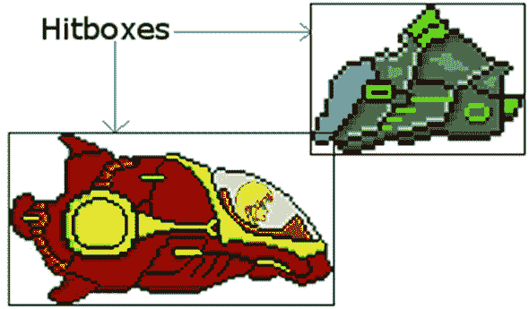
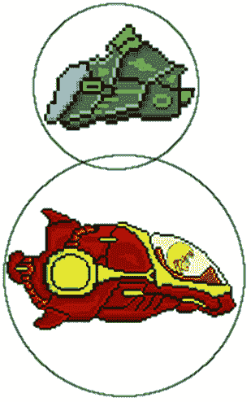
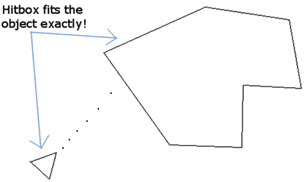
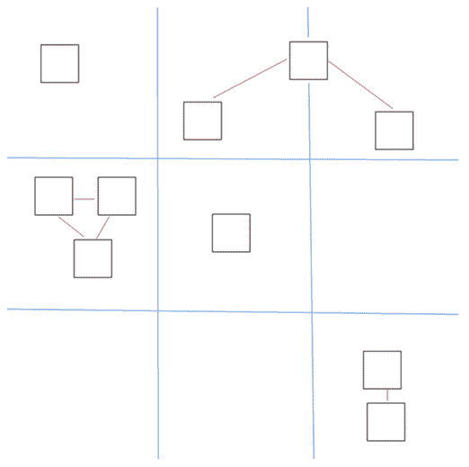
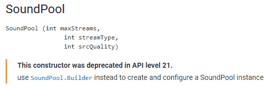
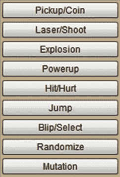
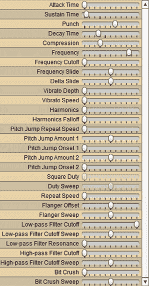
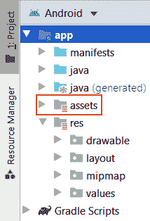
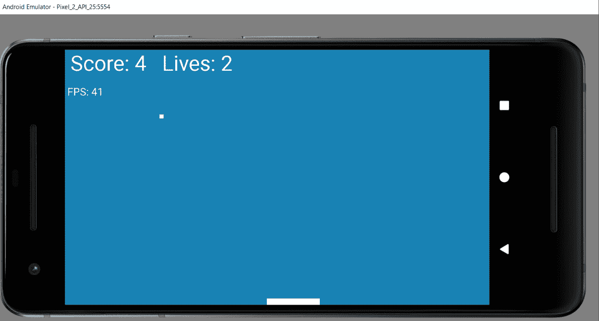

# *第十一章*:碰撞、音效、支持不同版本安卓

在这一章结束时，我们将有一个完整的工作和乒乓游戏的蜂鸣实现。我们将从一些碰撞检测理论开始这一章，这些理论将在这一章的最后付诸实践。我们还将学习如何检测和处理不同版本的安卓系统。然后，我们将能够研究`SoundPool`类以及我们使用它的不同方式，这取决于游戏运行的安卓版本。在这一点上，我们可以把我们所学的一切都投入到生产更多的代码中，让乒乓球反弹和嘟嘟响，并对游戏进行最后的润色。

总之，我们将涵盖以下主题:

*   研究不同类型的碰撞检测
*   学习如何处理不同版本的安卓系统
*   学习如何使用安卓`SoundPool`课程
*   完成乒乓球比赛

小心你的头！

# 处理碰撞

由于碰撞检测是我们需要在本书的所有剩余项目中实现的东西，我认为在 Pong 需要什么之外进行更广泛的讨论可能是有用的。此外，我将使用第五个游戏项目的一些图像来直观地演示一些关于碰撞检测的主题。

碰撞检测是一个相当广泛的主题，所以这里快速看一下我们的碰撞检测选项，以及在哪些情况下不同的方法可能是合适的。

本质上，我们只需要知道我们游戏中的某些对象何时接触其他对象。然后，我们可以通过弹跳球、增加分数、播放声音或任何合适的方式来应对这一事件。我们需要对我们的不同选择有一个广泛的理解，这样我们就可以在任何特定的游戏中做出正确的决定。

## 碰撞检测选项

首先，这里有一些我们可以使用数学来检测碰撞的不同方法，我们如何利用它们，以及它们什么时候可能有用。

### 矩形交叉

这种类型的碰撞检测很简单，在很多情况下都会用到。如果一开始这种方法看起来不精确，继续阅读，直到你到达*多重命中框*部分。

我们在要测试碰撞的物体周围画一个假想的矩形——我们可以称之为点击框或边界矩形——然后用数学方法测试矩形的坐标，看它们是否相交。如果他们这样做了，我们就会发生碰撞:



图 11.1–检测矩形碰撞

在撞击箱相交的地方，我们发生了碰撞。从上图我们可以看出，这远非完美。但是在某些情况下，这已经足够了，它的简单性使它非常快，正如下一个项目“子弹地狱”中所展示的那样。为了实现这个方法，我们只需要使用两个物体的 *x* 和 *y* 坐标来测试交点:

重要说明

不要使用以下代码。它仅用于演示目的。

```java
if(ship.getHitbox().right > enemy.getHitbox().left  
     && ship.getHitbox().left < enemy.getHitbox().right ){
     // Ship is intersecting enemy on x axis
     // But they could be at different heights
     if(ship.getHitbox().top < enemy.getHitbox().bottom  
          && ship.getHitbox().bottom > 
          enemy.getHitbox().top ){
          // Ship is intersecting enemy on y axis as well
          // Crash
     }
}
```

前面的代码假设我们有一个`getHitbox()`方法，该方法返回给定对象的左右水平坐标以及上下垂直坐标。在前面的代码中，我们首先检查水平轴是否重叠。如果他们不这样做，那就没有继续下去的意义；如果有，我们就检查垂直轴。如果他们没有，那可能是一个敌人从上面或下面呼啸而过。如果它们也在垂直轴上重叠，那么我们就发生了碰撞。

请注意，我们可以按任意顺序检查 *x* 和 *y* 轴，前提是我们在声明碰撞之前检查它们。

### 半径重叠

这种方法还包括检查两个命中框是否相互交叉，但正如标题所示，它是用圆圈代替的。有明显的优点和缺点；主要是这种方法适用于本质上更圆的形状，而不适用于细长的形状:



图 11.2–半径重叠示例

从上图中，很容易看出半径重叠法对于这些物体是多么的不准确，也不难想象，对于一个像足球一样的圆形物体，或者也许是一个在地板上弹跳的断头僵尸头，它会是多么的完美。

下面是我们如何实现这个方法:

重要说明

以下代码也仅用于演示目的。

```java
// Get the distance of the two objects from 
// the edges of the circles on the x axis
distanceX = (ship.getHitBox().centerX + ship.getHitBox().radius) -  (enemy.getHitBox().centerX + enemy.getHitBox().radius;
// Get the distance of the two objects from 
// the edges of the circles on the y axis
distanceY = (ship.getHitBox().centerY + ship.getHitBox().radius) -  (enemy.getHitBox().centerY + enemy.getHitBox().radius;
// Calculate the distance between the center of each circle
double distance = Math.sqrt
     (distanceX * distanceX + distanceY * distanceY);
// Finally see if the two circles overlap
if (distance < ship.getHitBox().radius + enemy.getHitBox().radius) {
    // bump
}
```

代码再次做了一些假设，比如我们有一个`getHitBox()`方法，可以返回半径以及中心`x`和`y`坐标。

重要说明

如果我们初始化距离的方式–`Math.sqrt(distanceX * distanceX + distanceY * distanceY);`–看起来有点混乱，那就是简单地用毕达哥拉斯定理，得到一个三角形斜边的长度，这个三角形的长度等于两个圆的中心之间画的一条直线。那么在我们解决方案的最后一行，我们测试`distance < ship.getHitBox() .radius + enemy.getHitBox() .radius`是否，如果是，我们可以确定我们有碰撞。这是因为，如果两个圆的中心点比它们半径的结合长度更近，它们一定是重叠的。

### 交叉数算法

这种方法在数学上更复杂，但它非常适合检测点何时与凸多边形相交。该方法将对象分解成直线，并测试每个对象的每个点，以查看它是否与直线相交。交叉点的总数相加，如果这个数是奇数(对于任何一个点)，那么命中发生了:



图 11.3–交叉数算法

重要说明

这是小行星克隆体或飞船飞越锯齿状山脉顶部的完美选择。如果你想看 Java 中完全实现穿越数算法的代码，可以看一下我网站上的这个教程:[http://gamecodeschool . com/essentials/碰撞检测-穿越数/](http://gamecodeschool.com/essentials/collision-detection-crossing-number/) 。

我们不会在本书的项目中使用这个解决方案。

## 优化检测方法

正如我们所看到的，不同的碰撞检测方法至少会有两个问题，这取决于您在哪种情况下使用哪种方法。这些问题如下:

*   缺乏准确性
*   消耗中央处理器功率

前两个选项(矩形相交和半径重叠)更容易出错，第二个选项(交叉数算法)更容易耗尽安卓设备的电量，导致游戏变慢。

以下是这些问题的解决方案。

### 多个 hitboxes

第一个问题，缺乏准确性，可以通过每个对象有多个命中框来解决。我们只需将所需数量的命中框添加到我们的游戏对象中，以最有效地“包装”它，然后依次对每个对象执行相同的矩形交集代码。

### 邻居检查

该方法允许我们只检查在彼此大致相同区域的物体。这可以通过检查两个给定对象在我们游戏的哪个“邻域”中来实现，然后只有在碰撞有可能发生的现实可能性时，才执行更耗费 CPU 的碰撞检测。

假设我们有 10 个对象，每个对象都需要相互检查，那么我们需要执行 10 个平方(100)的碰撞检查。但是如果我们先做邻居检查，我们可以大大减少这个数字。在下一张图中非常假设的情况下，如果我们首先检查对象是否共享相同的扇区/邻域，我们只需要对 10 个对象进行 11 次绝对最大碰撞检查，而不是 100 次:



图 11.4–邻居检查方法示例

在代码中实现这一点很简单，只需为每个游戏对象设置一个`sector`成员变量，代表其当前邻域，然后遍历对象列表，并检查它们是否在同一扇区。这种优化可以用于任何类型的 hitbox。

## 乒乓的最佳选择

既然我们知道了我们的碰撞检测选项，我们就可以决定在当前游戏中的最佳行动方案。我们所有的 Pong 对象都是矩形(或正方形)；它们都没有末端或不规则。

这倾向于建议我们可以为球棒和球使用一个单一的矩形击框，我们还需要防止球离开屏幕。

## 矩形相交法

为了让生活变得更简单，安卓应用编程接口，正如我们所看到的，有一个方便的`RectF`类，它不仅代表我们的对象(球棒和球)，还代表我们的击键。它甚至有一个整洁的`intersects`方法，基本上和我们之前假设的矩形交叉碰撞检测代码做了同样的事情。所以，让我们考虑一下如何在我们的游戏中添加碰撞检测。

我们已经在每个`Bat`和`Ball`类中使用了一个名为`mRect`的`RectF`实例。不仅如此，我们甚至已经在每个中编码了一个`getRect`方法来返回对每个对象的`RectF`的引用。

一个解决方案就在眼前，我们将很快看到如何实现它。由于我们希望每次发生碰撞时都播放嘟嘟声，我们先来看看如何创建和播放音效。

# 处理不同版本的安卓

在这本书的大部分时间里，我们没有注意支持旧的安卓设备。其主要原因是，我们一直使用的 API 的所有最新部分都在如此高比例的设备上工作(超过 98%)，以至于看起来不值得。除非你打算在古代安卓遗迹的应用中开辟一个利基市场，否则这似乎是一个明智的方法。然而，关于播放声音，安卓应用编程接口有一些相对较新的修改。

实际上，这并不是什么大不了的事情，因为比这新的设备仍然可以使用旧的应用编程接口。但是专门处理兼容性上的这些差异是一个很好的做法，因为最终有一天，旧的部分可能在新版本的安卓系统上不起作用。

此时此地讨论这个问题的主要原因是，安卓前后棒棒糖声音处理的细微差异给了我们一个很好的借口，看看我们如何在代码中处理这样的事情。

我们将看看如何使我们的应用与最新的设备以及棒棒糖之前的设备兼容。

我们将要用来制造噪音的班级是`SoundPool`班。首先，让我们看一些检测当前安卓版本的简单代码。

## 检测当前安卓版本

我们可以使用`Build.Version`类`SDK_INT`的静态变量来确定安卓的当前版本，并且我们可以通过将其与该版本的适当`Build.VERSION_CODES`变量进行比较来确定它是否比特定版本新。如果这个解释有点牵强，看看我们如何确定当前版本是等于还是比棒棒糖新(更大):

```java
if (Build.VERSION.SDK_INT >= Build.VERSION_CODES.LOLLIPOP) {
     // Lollipop or newer code goes here 
} else {
     // Code for devices older than lollipop here

}
```

现在让我们看看如何用比棒棒糖更新，然后更旧的安卓设备制造一些噪音。

# 音池类

`SoundPool`类允许我们握持和操纵一组音效；从字面上看，是一个声音池。该类处理一切，从解压缩声音文件，如`.wav`或`.ogg`文件，通过一个整数标识保持对它的识别引用，当然，播放声音。当播放声音时，它是以非阻塞的方式(使用幕后的线程)进行的，不会干扰我们游戏的平稳运行或我们用户与它的交互。

我们需要做的第一件事是将音效添加到游戏项目的`main`文件夹中一个名为`assets`的文件夹中。我们很快就会真正做到这一点。

接下来，在我们的 Java 代码中，我们将为我们打算使用的每个音效声明一个类型为`SoundPool`的对象和一个`int`标识符。在这个理论案例中，我们还声明了另一个名为`nowPlaying`的`int`，我们可以使用它来跟踪当前正在播放的声音，我们将很快看到如何做到这一点:

```java
// create an identifier
SoundPool sp;
int nowPlaying =-1;
int idFX1 = -1;
float volume = 1;// Volumes rage from 0 through 1
```

现在我们将看一下两种不同的方法来初始化`SoundPool`，这取决于设备使用的安卓版本。这是使用我们的方法为不同版本的安卓系统编写不同代码的绝佳机会。

## 以新的方式初始化音池

新方法包括我们使用一个`AudioAttributes`对象来设置我们想要的声音池的属性。这样做有助于使用一个叫做**方法链接**的新概念。

### Java 方法链接解释

其实这个我们以前也见过，只是我到现在才在地毯下面刷过。以下是我们已经在两个游戏项目中使用的内容:

```java
Display display = getWindowManager().
               getDefaultDisplay();
```

在前几行代码中有一些稍微奇怪的地方。如果您快速扫描接下来的三个块，您会注意到明显缺少分号。这表明这是一行代码。我们在同一个对象上按顺序调用多个方法。

这相当于写多行代码；这样会更清晰、更简短。让我们看看更多的链接在`SoundPool`中的作用。

### 回到初始化 SoundPool(新方法)

在第一个代码块中，我们使用链接并在一个对象上调用四个独立的方法，这初始化了我们的`AudioAttributes`对象(`audioAttributes`)。还要注意的是，在链式方法调用的各个部分之间有注释是可以的，因为编译器会完全忽略这些注释:

```java
// Instantiate a SoundPool dependent on Android version
if (Build.VERSION.SDK_INT >= Build.VERSION_CODES.LOLLIPOP) {
     // The new way
     // Build an AudioAttributes object
     AudioAttributes audioAttributes = 
     // First method call
     new AudioAttributes.Builder()
// Second method call
          .setUsage
          (AudioAttributes.USAGE_ASSISTANCE_SONIFICATION)
          // Third method call     
          .setContentType
           (AudioAttributes.CONTENT_TYPE_SONIFICATION)
          // Fourth method call
          .build();// Yay! A semicolon
     // Initialize the SoundPool
     sp = new SoundPool.Builder()
          .setMaxStreams(5)
          .setAudioAttributes(audioAttributes)
          .build();
} 
```

在代码中，我们使用链接和这个类的`Builder`方法来初始化一个`AudioAttributes`对象，让它知道它将用于与`USAGE_ASSISTANCE_SONIFICATION`的用户界面交互。

我们还使用`CONTENT_TYPE_SONIFICATION`，它让类知道它是用于响应声音的，例如，当用户点击按钮时，碰撞等等。

现在我们可以通过传入`AudioAttributes`对象(`audioAttributes`)和我们可能想要播放的最大同时声音数来初始化`SoundPool` ( `sp`)本身。

第二个代码块链接另外四个方法来初始化`sp`，包括对`setAudioAttributes`的调用，它使用了我们在前面链接的方法块中初始化的`audioAttributes`对象。

现在我们可以编写一个`else`代码块，当然，它将拥有旧的做事方式的代码。

### 用老方法初始化声音池

不需要`AudioAttributes`对象；只需输入同步声音的数量，即可初始化`SoundPool` ( `sp`)。最后一个参数是音质，过零是我们需要做的。这比新方法简单得多，但在我们可以做出的选择方面也不那么灵活:

```java
else {
     // The old way
     sp = new SoundPool(5, AudioManager.STREAM_MUSIC, 0);
}
```

我们可以使用旧的方式，新版本的安卓可以处理它。但是，我们将得到一个关于使用不推荐使用的方法的警告。安卓开发者网站是这么说的:



图 11.5–音池初始化

此外，正如我们所看到的，新方法提供了更多的功能。无论如何，这是一个很好的借口来看看一些简单的代码来处理不同版本的安卓。

现在我们可以将声音文件加载(解压缩)到我们的`SoundPool`实例中。

### 将声音文件加载到内存

与我们的线程控制一样，我们需要将代码包装在`try` - `catch`块中。这很有意义，因为读取文件可能会因为我们无法控制的原因而失败，但也是因为我们被迫这样做，因为我们使用的方法会引发异常，否则我们编写的代码将无法编译。

在`try`块中，我们声明并初始化一个类型为`AssetManager`的对象和一个类型为`AssetFileDescriptor`的对象。

使用`AssetManager`对象的`openFd`方法初始化`AssetFileDescriptor`，实际上是对声音文件进行解压缩。然后我们初始化我们的整数标识(`idFX1`)，同时我们将`AssetFileDescriptor`的内容加载到我们的`SoundPool`中。

`catch`块只是向控制台输出一条消息，让我们知道是否出了问题。请注意，无论安卓版本如何，这段代码都是相同的。同样，不要添加这些代码——我们将很快为 Pong 游戏的声音编写代码:

```java
try{

     // Create objects of the 2 required classes
     AssetManager assetManager = this.getAssets();
     AssetFileDescriptor descriptor;
     // Load our fx in memory ready for use
     descriptor = assetManager.openFd("fx1.ogg");
     idFX1 = sp.load(descriptor, 0);
}catch(IOException e){

     // Print an error message to the console
     Log.d("error", "failed to load sound files");
}
```

我们准备制造一些噪音。

### 播放声音

在这一点上，在我们的`SoundPool`中有一个音效，我们有一个 ID 可以参考它。

不管我们如何构建`SoundPool`对象，这段代码都是一样的，这就是我们播放声音的方式。请注意，在下一行代码中，我们使用实际播放声音的相同方法的返回值初始化`nowPlaying`变量。

因此，以下代码同时播放声音并将正在播放的 ID 值加载到`nowPlaying`中:

```java
nowPlaying = sp.play(idFX1, volume, volume, 0, repeats, 1);
```

重要说明

不需要为了播放声音而将 ID 存储在`nowPlaying`中，但是它有我们现在将要看到的用途。在 Pong 游戏中，我们不需要存储 ID。我们只播放声音。

`play`方法的参数如下:

*   音效的识别码
*   左扬声器音量，右扬声器音量
*   优先于其他声音
*   重复声音的次数
*   播放速率/速度(1 为正常速率)

在乒乓游戏开始前，还有一件事要做。

### 停止声音

当还在玩`stop`法的时候，停止一个声音也很简单。请注意，在任何给定时间都可能有多个音效在播放，因此`stop`方法需要音效的 ID 来停止:

```java
sp.stop(nowPlaying);
```

向您展示如何停止声音比我们在 Pong 项目中需要的更进一步。当你调用`play`时，如果你想跟踪它，你只需要存储当前播放声音的 ID，这样你就可以在以后与它交互。我们很快就会看到，在 Pong 游戏中播放声音的代码看起来更像这样:

```java
mSP.play(mBeepID, 1, 1, 0, 0, 1);
```

前一行代码将简单地以最高优先级以最大音量播放所选的声音(`mBeepID`)，直到它以正常速度无重复结束。

让我们看看如何制作我们自己的声音效果，然后我们将对 Pong 游戏进行编码，以播放一些声音。

# 产生音效

这里有一个名为 **Bfxr** 的开源应用，可以让我们自己制作音效。这里有一个非常快速的使用 Bfxr 制作自己的音效的指南。从[www.bfxr.net](http://www.bfxr.net)获取免费副本。如果您的操作系统不受支持，或者您愿意，您可以在网络浏览器的网站上生成声音。

小费

请注意，音效是在`Chapter 11/assets`文件夹中的 GitHub repo 上提供给您的。除非你想，否则你不必创造自己的音效。获得这个免费软件并学习如何使用它仍然是值得的。

按照网站上的简单说明进行设置:

小费

这是一个非常浓缩的教程。你可以用 BFXR 做这么多。要了解更多信息，请阅读网站上的提示，网址为之前的网址。

1.  Try out a few of these things to make cool sound effects. First, run `Bfxr`:

    

    图 11.6–运行 Bfxr

2.  Try out all the preset types that generate a random sound of that type. When you have a sound close to what you want, move to the next step:

    

    图 11.7–产生随机声音

3.  Use the sliders to fine-tune the pitch, duration, and other aspects of your new sound:

    

    图 11.8–微调声音的音高和持续时间

4.  Save your sound by clicking the **Export Wav** button. Despite the text of this button, as we will see, we can save in formats other than `.wav` too:

    

    图 11.9–导出 Wav 按钮

5.  安卓在 OGG 格式的声音上工作得非常好，所以当被要求给你的文件命名时，在文件名的末尾使用`.ogg`扩展名。

重复*步骤 2* 到 *5* 来创建你的酷炫音效。分别命名为`beep.ogg`、`boop.ogg`、`bop.ogg`和`miss.ogg`。我们使用`.ogg`文件格式，因为它比`.wav`等格式更压缩。

一旦你准备好你的声音文件，我们将继续 Pong 项目。

# 为乒乓游戏添加声音

从 GitHub repo 上的`Chapter 11`文件夹复制`assets`文件夹及其所有内容。现在使用操作系统的文件浏览器导航到项目的`Pong/app/src/main`文件夹。粘贴`assets`文件夹及其内容。

显然，请随意将`assets`文件夹中的所有音效替换为您自己的。如果您决定替换所有的音效，请确保它们的名称完全相同，或者在后面的代码中进行适当的编辑。

请注意，如果您在 AndroidStudio 的项目浏览器窗口中查看，您可以查看`assets`文件夹，并且可以看到声音效果已经添加到项目中:



图 11.10–查看资产文件夹

让我们写代码。

## 添加声音变量

在成员变量声明的末尾，在`PongGame`构造函数之前，添加以下代码:

```java
// All these are for playing sounds
private SoundPool mSP;
private int mBeepID = -1;
private int mBoopID = -1;
private int mBopID = -1;
private int mMissID = -1;
```

重要说明

您需要使用您喜欢的方法或通过键入代码来导入`SoundPool`类:

`import android.media.SoundPool;`

前面的代码是一个名为`mSP`的`SoundPool`对象和四个`int`变量的声明，用于保存我们四个音效的标识。这和我们在上一节探索`SoundPool`时做的一样。

重要说明

如果你想知道声音文件/id 的名字，我可以称它们为`beep1`、`beep2`等等，但是如果你一个接一个大声说出这些词，每个词的音高略有不同，这些名字就相当有描述性了。哔，哔，哔。除了小姐。

现在我们可以用之前学过的东西来初始化`mSP`来适应不同版本的安卓。

## 初始化音池

在`PongGame`构造函数中添加下一个高亮代码(看起来应该很熟悉)。确保在球棒和球初始化之后但在调用`startNewGame`方法之前添加突出显示的代码:

```java
// Initialize the bat and ball
mBall = new Ball(mScreenX);
mBat = new Bat(mScreenX, mScreenY);
// Prepare the SoundPool instance
// Depending upon the version of Android
if (Build.VERSION.SDK_INT >= Build.VERSION_CODES.LOLLIPOP) {
AudioAttributes audioAttributes = 
new AudioAttributes.Builder()
          .setUsage(AudioAttributes.USAGE_MEDIA)
          .setContentType(AudioAttributes.CONTENT_TYPE_
          SONIFICATION)
          .build();
     mSP = new SoundPool.Builder()
          .setMaxStreams(5)
          .setAudioAttributes(audioAttributes)
          .build();
} else {
     mSP = new SoundPool(5, AudioManager.STREAM_MUSIC, 0);
}
// Everything is ready to start the game
startNewGame();
```

之前的代码检查安卓版本，使用合适的方法初始化`mSP`(我们的`SoundPool`)。

重要说明

为了让前面的代码和后面的代码工作，您需要导入以下类:`AssetFileDescriptor`、`AssetManager`、`AudioAttributes`和`AudioManager`。

```java
import android.content.res.AssetFileDescriptor;
import android.content.res.AssetManager;
import android.media.AudioAttributes;
import android.media.AudioManager;
import android.os.Build;
import java.io.IOException;
```

现在我们已经初始化了我们的`SoundPool`，我们可以将所有的音效加载到它里面准备播放。确保在之前的代码之后和调用`startNewGame`之前立即添加该代码:

```java
// Open each of the sound files in turn
// and load them into RAM ready to play
// The try-catch blocks handle when this fails
// and is required.
try{
     AssetManager assetManager = context.getAssets();
     AssetFileDescriptor descriptor;
     descriptor = assetManager.openFd("beep.ogg");
     mBeepID = mSP.load(descriptor, 0);
     descriptor = assetManager.openFd("boop.ogg");
     mBoopID = mSP.load(descriptor, 0);
     descriptor = assetManager.openFd("bop.ogg");
     mBopID = mSP.load(descriptor, 0);
     descriptor = assetManager.openFd("miss.ogg");
     mMissID = mSP.load(descriptor, 0); 
}catch(IOException e){
     Log.d("error", "failed to load sound files");
}
// Everything is ready so start the game
startNewGame();
```

在之前的代码中，我们使用了一个`try` - `catch`块将所有音效加载到设备的内存中，并且将它们与我们之前声明的四个`int`id 相关联。

声音现在可以播放了。

# 编码碰撞检测和播放声音

既然我们已经做了这么多的理论和准备，我们可以很快完成所有事情。我们将编写代码，使用`RectF` `intersects`方法检测所有各种碰撞，播放声音，并调用我们的类所需的方法。

## 球棒和球

在`detectCollisions`方法中添加以下高亮代码:

```java
private void detectCollisions(){
     // Has the bat hit the ball?
     if(RectF.intersects(mBat.getRect(), mBall.getRect())) {
          // Realistic-ish bounce
          mBall.batBounce(mBat.getRect());
          mBall.increaseVelocity();
          mScore++;
          mSP.play(mBeepID, 1, 1, 0, 0, 1);
     }
     // Has the ball hit the edge of the screen
     // Bottom
     // Top
     // Left
     // Right
}
```

小费

您需要导入`RectF`类:

`import android.graphics.RectF;`

当球击中球棒时，前一行代码返回 true，并将导致里面的代码执行。

在下面的`if`语句中，我们称之为`ball.batBounce`方法，将球沿屏幕上方的方向，以适合球棒哪一侧的水平方向击出:

```java
if(RectF.intersects(mBat.getRect(), mBall.getRect()))
```

接下来，我们调用`mBall.increaseVelocity`来加速球，让比赛更难一点。

下一行是`mScore ++`，玩家得分加一分。最后一行播放`mBeepID`标识的声音。

让我们把墙壁弄得有弹性。

## 四面墙

在刚刚添加的代码之后，将以下所有代码添加到`detectCollisions`方法中:

```java
// Has the ball hit the edge of the screen
// Bottom
if(mBall.getRect().bottom > mScreenY){
     mBall.reverseYVelocity();
     mLives--;
     mSP.play(mMissID, 1, 1, 0, 0, 1);
     if(mLives == 0){
          mPaused = true;
          startNewGame();
     }
}
// Top
if(mBall.getRect().top < 0){
     mBall.reverseYVelocity();
     mSP.play(mBoopID, 1, 1, 0, 0, 1);
}
// Left
if(mBall.getRect().left < 0){
     mBall.reverseXVelocity();
     mSP.play(mBopID, 1, 1, 0, 0, 1);
}
// Right
if(mBall.getRect().right > mScreenX){
     mBall.reverseXVelocity();
     mSP.play(mBopID, 1, 1, 0, 0, 1);
}
```

有四个单独的`if`语句，屏幕的每个边缘(墙壁)一个。在每个`if`语句中，适当的速度值(水平或垂直)被反转，并播放声音效果。

请注意，在第一个检测到球击中屏幕底部的新`if`语句中，有一点额外的代码。首先，`mLives`递减以减少玩家的生命数量，然后一个`if`声明检查玩家是否还剩零条生命。如果玩家确实耗尽了生命，游戏将暂停，并调用`startNewGame`方法来设置一切，准备再次游戏。

你现在可以完整地玩这个游戏了。

# 玩游戏

显然，图片并不是很擅长表现运动，但这里有一个截图，以防你在火车上看这本书，自己跑不动:



图 11.11–玩游戏

在这一点上，你有足够的知识重新审视潜艇猎人游戏，并增加一些声音效果，如果你想。

# 总结

在这一章中，我们已经做了大量的理论研究——从检测碰撞的数学到学习`RectF`类如何拥有能够为我们处理矩形交点的`intersects`方法。我们还仔细研究了`SoundPool`类，包括我们如何检测玩家使用的是哪个版本的安卓系统，并相应地改变我们的代码。初始化一个`SoundPool`对象也让我们接触到了方法链接，我们可以在一行代码中对同一个对象调用多个方法。最后，我们用所有这些知识完成了 Pong 游戏。

也许最好的是，现在我们已经有了所有这些经验和理论，我们现在(从下一章开始)将能够在仅仅两章的时间内快速完成下一个游戏，同时学习 Java 数组，这将帮助我们处理大量的数据。