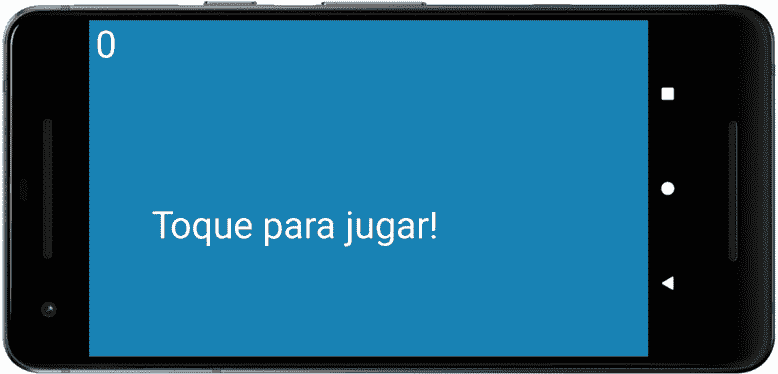

# *第十五章*:安卓本地化——你好！

这一章既快速又简单，但我们将学习如何让数百万潜在玩家接触到你的游戏。我们将看到如何添加其他语言。我们将看到在我们的游戏中添加文本的“正确”方式，并使用该功能使 Snake 游戏多语言化。这包括使用字符串资源，而不是像本书到目前为止所做的那样，直接在代码中硬编码字符串。

在本章中，我们将执行以下操作:

*   通过添加西班牙语和德语使 Snake 多语言化。
*   学习如何使用**字符串资源**代替硬编码文本。
*   用德语或西班牙语运行游戏。

我们开始吧。

# 使蛇游戏西班牙语、英语或德语

首先，我们需要在项目中添加一些文件夹——每种新语言一个文件夹。文本被归类为*资源*，因此需要进入`res`文件夹。我们已经看到了文件夹，因为这个文件夹也包含了我们放置所有图形的`drawable`文件夹。按照以下步骤为项目添加西班牙语支持。

重要说明

虽然这个项目的源文件是在 GitHub repo 上的`Chapter 15`文件夹中提供的，但它们只是作为参考。您需要完成接下来描述的过程来实现多语言功能。

## 添加西班牙 suppo rt

按照以下步骤添加西班牙语:

1.  右键单击 **res** 文件夹，然后选择**新建** | **安卓资源目录**。在**目录名**字段中，键入`values-es`。
2.  左键单击**确定**。
3.  现在我们需要添加一个文件，我们可以在其中放置我们所有的西班牙语翻译。右键单击**资源**，然后选择**新建** | **安卓资源文件**，并在**文件名**字段中键入`strings.xml`。在**目录名**字段中输入`values-es`。
4.  左键单击**确定**。

在这个阶段，我们有一个新的西班牙语翻译文件夹，里面有一个用于字符串资源的`strings.xml`文件。让我们对德语也这样做。

## 增加德国支持

按照这些步骤添加德语支持:

1.  右键单击 **res** 文件夹，然后选择**新建** | **安卓资源目录**。在**目录名**字段中，键入`values-de`。
2.  左键单击**确定**。
3.  现在我们需要添加一个文件，我们可以在其中放置我们所有的德语翻译。右键单击**资源**，然后选择**新建** | **安卓资源文件**，并在**文件名**字段中键入`strings.xml`。在**目录名**字段中输入`values-de`。
4.  左键单击**确定**。

下一张截图显示了`strings.xml`文件夹的样子。您可能想知道`strings.xml`文件夹是从哪里来的，因为它不符合我们在前面步骤中创建的结构。AndroidStudio 正在帮助我们(显然)按照安卓操作系统的要求组织文件和文件夹。但是，您可以看到西班牙语和德语文件，这些文件由特定于国家/地区的扩展名 **de** 和 **es** 表示:


图 15.1–特定国家/地区的文件扩展名

现在我们可以将翻译添加到文件中。

## 添加字符串资源

为了简单起见，我们的游戏将只有一个简短的句子来显示**点击玩！**中的宜语。`strings.xml`文件包含游戏将显示的单词。通过为我们想要支持的每种语言准备一个`strings.xml`文件，我们可以让安卓根据玩家的语言选择合适的文本:

1.  双击打开`strings.xml`文件。一定要选择 **es** 分机旁边的那个。编辑文件如下:

    ```java
    <?xml version="1.0" encoding="utf-8"?>
    <resources>
        <string name="tap_to_play">Toque para jugar!</string>
    </resources>
    ```

2.  双击打开`strings.xml`文件。一定要选择**德**分机旁边的那个。编辑文件如下:

    ```java
    <?xml version="1.0" encoding="utf-8"?>
    <resources>
        <string name="tap_to_play">Tippen Sie, um zu 
     spielen!</string>
    </resources>
    ```

3.  如果我们要处理多种语言，那么我们也需要以同样的方式提供默认的翻译——在本例中是英语。双击打开`strings.xml`文件。请务必选择旁边没有任何国家/地区扩展名的。将文件编辑如下:

```java
<resources>
    <string name="app_name">Snake</string>
    <string name="tap_to_play">Tap To Play!</string>
</resources>
```

小费

另外，注意还有另一个资源叫做`app_name`。如果你愿意，可以在其他文件中提供它的翻译。如果您没有提供额外(西班牙语和德语)`strings.xml`文件中的所有字符串资源，那么将使用默认文件中的资源。

我们所做的是提供两个翻译。安卓知道哪种翻译是针对哪种语言的，因为它们被放置在文件夹中。此外，我们使用了一个**字符串标识符**来引用翻译。回顾前面的代码，您会发现所有翻译都使用相同的标识符。

您甚至可以本地化为一种语言的不同版本，例如美国或英国英语。完整的代码列表可以在这里找到:[http://stackoverflow . com/questions/7973023/什么是支持的语言列表-安卓地区](http://stackoverflow.com/questions/7973023/what-is-the-list-of-supported-languages-locales-on-android)。您甚至可以本地化资源，如图像和声音。点击这里了解更多信息:[http://developer . Android . com/guide/topics/resources/localization . html](http://developer.android.com/guide/topics/resources/localization.html)。

翻译是从谷歌翻译复制粘贴的，所以很有可能翻译不正确。像这样廉价地进行翻译是一种有效的方法，可以让一个应用在对你说不同语言的用户的设备上使用一组基本的字符串资源。一旦你开始需要任何深度的翻译，也许对于一个故事驱动的游戏的台词，你肯定会受益于由人类专业人员完成的翻译。

这个练习的目的是展示安卓如何工作，而不是如何翻译。

重要说明

我真诚地向任何讲西班牙语或德语的人道歉，他们可能会看到这里提供的翻译的局限性。

既然我们有了翻译，我们就可以使用它们了。

## 修改 Java 代码

更改`draw()`方法中的代码，如下图所示。我已经注释掉了我们正在替换的那一行。更改将使用字符串资源，而不是硬编码的“`Tap To Play!`”字符串:

```java
// Draw some text while paused
if(mPaused){
   // Set the size and color of the mPaint for the text
   mPaint.setColor(Color.argb(255, 255, 255, 255));
   mPaint.setTextSize(250);
   // Draw the message
   // We will give this an international upgrade soon
   //mCanvas.drawText("Tap To Play!", 200, 700, mPaint);
   mCanvas.drawText(getResources().
 getString(R.string.tap_to_play), 
 200, 700, mPaint);
}
```

新代码使用`getResources.getString`链式方法来替换先前硬编码的`"Tap To Play!"`文本。仔细看，你会发现发送到`getString`的参数是`R.string.tap_to_play`字符串标识符。

`R.string`代码指的是`res`文件夹中的字符串资源，`tap_to_play`是我们的标识符。然后，安卓将能够根据运行游戏的设备的地区来决定哪个版本(默认、西班牙或德语)是合适的。

# 用德语或西班牙语运行游戏

运行应用，看看它是否正常工作。现在我们可以更改本地化设置以西班牙语查看。不同的设备在如何做到这一点上略有不同，但是可以选择的 Pixel 3 仿真器选项是**设置** | **系统** | **语言和输入** | **添加语言**。接下来，选择**西班牙语**，然后您将能够从列表中在西班牙语和英语之间切换。左键单击并拖动**西班牙语(Estados Unidos)** ，使其位于列表顶部。恭喜，您的模拟器现在默认为西班牙语。完成本章后，您可以将首选语言拖回列表顶部。

现在，您可以以通常的方式再次运行游戏，并看到正在使用西班牙语资源文件中的文本:



图 15.2–运行游戏

可以添加任意多的字符串资源。请注意，使用字符串资源是向所有类型的应用(包括游戏)添加文本的推荐方式。本书中的其余教程(除了本教程)将倾向于对它们进行硬编码，以形成一个更紧凑的教程。

# 总结

我们现在可以通过我们的游戏走向全球，以及添加更灵活的字符串资源，而不是硬编码所有的文本。

让我们通过编码`Apple`类继续进行 Snake 游戏，然后我们可以在 [*第 16 章*](16.html#_idTextAnchor313)*集合和枚举*中了解`ArrayList`类和枚举。然后我们将准备在 [*第 17 章*](17.html#_idTextAnchor328)*中编码蛇游戏，操作位图和编码蛇类*。