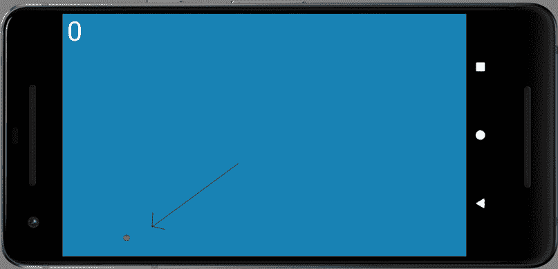

# *第 16* :集合和枚举

本章将分为实践部分和理论部分。首先，我们将编码并使用`Apple`类，为晚餐准备好我们的苹果产卵。之后，我们将花一点时间来了解两个新的 Java 概念，`ArrayList`类和枚举(简称为`enum`)。这两个新主题将为我们提供完成下一章蛇游戏(主要在`Snake`课)所需的额外知识。在本章中，我们将涵盖以下主题:

*   向项目添加图形
*   编码和使用`Apple`类
*   Java 集合和`ArrayList`类
*   增强的`for`循环

让我们继续这个项目。

# 添加图形

在 GitHub repo 上抓取项目的图形；它们在`Chapter 16/drawable`文件夹中。突出显示该文件夹的内容并复制。在 AndroidStudio 解决方案浏览器中选择`drawable`文件夹。现在右击`drawable`文件夹，选择**粘贴**。系统会提示您左键单击**确定**两次以粘贴文件。这些文件是蛇的头部和身体部分以及苹果。当我们使用这些图形时，我们将仔细观察它们。

# 编码苹果类

让我们从`Apple`类开始，就像我们经常做的一样，添加所需的`import`语句和成员变量。添加代码并研究它，然后我们将讨论它:

```java
import android.content.Context;
import android.graphics.Bitmap;
import android.graphics.BitmapFactory;
import android.graphics.Canvas;
import android.graphics.Paint;
import android.graphics.Point;
import java.util.Random;
class Apple {
    // The location of the apple on the grid
    // Not in pixels
    private Point mLocation = new Point();
    // The range of values we can choose from
    // to spawn an apple
    private Point mSpawnRange;
    private int mSize;
    // An image to represent the apple
    private Bitmap mBitmapApple;
}
```

`Apple`类有一个`Point`对象，我们将使用来存储苹果的水平和垂直位置。请注意，这将是我们的虚拟网格上的一个位置，而不是特定的像素位置。

还有第二个名为`mSpawnRange`的`Point`变量，它将最终保存可能的水平和垂直位置的最大值，在这些位置，我们可以在每次需要一个新的苹果时随机产生一个苹果。

还有一个名为`mSize`的`int`，我们一会儿就会初始化，它的大小会保持一个苹果的像素大小。它将对应于网格上的单个块。

最后，我们有一个名为`mBitmapApple`的`Bitmap`，它将保存苹果的图形。

## 苹果的建造者

为`Apple`类添加构造函数，然后我们将遍历它:

```java
// Set up the apple in the constructor
Apple(Context context, Point sr, int s){
     // Make a note of the passed in spawn range
     mSpawnRange = sr;
     // Make a note of the size of an apple
     mSize = s;
     // Hide the apple off-screen until the game starts
     mLocation.x = -10;
     // Load the image to the bitmap
     mBitmapApple = BitmapFactory
          .decodeResource(context.getResources(), 
          R.drawable.apple);
     // Resize the bitmap
     mBitmapApple = Bitmap
          .createScaledBitmap(mBitmapApple, s, s, false);
}
```

在构造器代码中，我们将苹果设置为待繁殖。首先要注意的是，我们不会每次都想催生一个苹果就创造一个全新的苹果(也就是叫`new Apple()`)。我们将在游戏开始时简单地生成一个，然后在每次蛇吃它的时候移动它。他永远不会知道。

第一行代码使用传入的`Point`引用来初始化`mSpawnRange`。

小费

这里发生的一件有趣的事情，与我们前面关于引用的讨论有关，就是代码没有复制传入的值；它复制对值的引用。因此，在第一行代码之后，`mSpawnRange`将引用内存中与传入的引用完全相同的位置。如果使用任何一个引用来改变这些值，那么它们都将引用这些新值。请注意，我们不必这样做，我们可以传入两个`int`值，然后将它们分别分配给`mSpawnRange.x`和`mSpawnRange.y`。用这种稍微费力的方式做是有好处的，因为原始引用及其值将被封装。我只是觉得这样做很有趣，并指出这种微妙但有时很重要的异常。

接下来，`mSize`被初始化为`s`的传入值。

只是作为与前一个提示比较有趣的一点，这与`mSpawnRange`和`sr`之间的关系有很大不同。`s`参数保存一个实际的`int`值，而不是对调用该方法的类的数据的引用或任何连接。

接下来，将苹果的水平位置`mLocation.x`设置为`-10`，将其隐藏在视野之外，直到游戏需要为止。

最后，对于`Apple`构造函数，两行代码准备好`Bitmap`实例以备使用。首先，从`apple.png`文件加载位图，然后使用`createScaledBitmap`方法调整大小，以设置`s`的宽度和高度。

现在对`spawn`和`getLocation`方法进行编码，然后我们将讨论它们:

```java
// This is called every time an apple is eaten
void spawn(){
     // Choose two random values and place the apple
     Random random = new Random();
     mLocation.x = random.nextInt(mSpawnRange.x) + 1;
     mLocation.y = random.nextInt(mSpawnRange.y - 1) + 1;
}
// Let SnakeGame know where the apple is
// SnakeGame can share this with the snake
Point getLocation(){
     return mLocation;
}
```

每次将苹果放在新的地方时，无论是在游戏开始时还是每次被蛇吃掉时，都会调用`spawn`方法。该方法所做的只是根据存储在`mSpawnRange`中的值生成两个随机的`int`值，并将其分配给`mLocation.x`和`mLocation.y`。苹果现在处于一个新的位置，玩家可以导航到它。

`getLocation`方法是一个简单的 getter 方法，它返回对`mLocation`的引用。`SnakeGame`类将使用这个进行碰撞检测。我们将在下一章对碰撞检测进行编码。

现在来点新的。正如承诺的那样，游戏对象将自己处理绘图。将`draw`方法添加到`Apple`类中:

```java
// Draw the apple
void draw(Canvas canvas, Paint paint){
     canvas.drawBitmap(mBitmapApple,
               mLocation.x * mSize, mLocation.y * mSize, 
               paint);
}
```

当从`SnakeGame`类调用该方法时，`Canvas`和`Paint`引用将被传入，以便苹果自己绘制。这样做的好处从`draw`方法中简单的单行代码来看并不是立即显而易见的。你可能会认为用`SnakeGame`类的`draw`方法画苹果会稍微少一点工作量；然而，当您在`Snake`类中看到`draw`方法所涉及的额外复杂性时(在下一章中)，您将更好地理解如何将责任封装在类中以绘制它们自己，从而使`SnakeGame`成为一个更易于管理的类。

现在我们可以为晚餐准备一个苹果了。

# 使用苹果类

`Apple`课结束了，我们现在可以开始上课了。

在最后的`SnakeGame`构造函数中加入代码初始化 apple 对象，如下代码所示:

```java
// Call the constructors of our two game objects
mApple = new Apple(context,
          new Point(NUM_BLOCKS_WIDE,
                    mNumBlocksHigh),
                    blockSize);
```

请注意，我们传入了`Apple`构造函数所需的所有数据，因此它可以自行设置。

我们现在可以通过调用我们之前对`Apple`类进行编码时添加的`spawn`方法，在`newGame`方法中生成一个苹果，如下所示。将高亮显示的代码添加到`newGame`方法:

```java
// Called to start a new game
public void newGame() {
     // reset the snake
     // Get the apple ready for dinner
     mApple.spawn();
     // Reset the mScore
     mScore = 0;
     // Setup mNextFrameTime so an update can triggered
     mNextFrameTime = System.currentTimeMillis();
}
```

接下来，我们可以从`SnakeGame`的`draw`方法中调用苹果的`draw`方法来绘制苹果，如下面的代码所示:

```java
// Draw the score
mCanvas.drawText("" + mScore, 20, 120, mPaint);
// Draw the apple and the snake
mApple.draw(mCanvas, mPaint);
// Draw some text while paused
```

如您所见，我们传递了对`Canvas`和`Paint`对象的引用。这里我们看到引用是如何非常有用的，因为`Apple`类的`draw`方法使用与`SnakeGame`类中的`draw`方法完全相同的`Canvas`和`Paint`，因为当您传递引用时，您给接收类直接访问内存中非常相同的实例的权限。

`Apple`类对`mCanvas`和`mPaint`所做的任何事情都发生在`SnakeGame`类中相同的`mCanvas`和`mPaint`实例上。所以，当`unlockCanvasAndPost`方法被调用时(在`SnakeGame`中的`draw`末尾)，由`Apple`类绘制的苹果会在那里。`SnakeGame`班不需要知道怎么做。

## 运行游戏

运行游戏一个苹果就会诞生。不幸的是，没有蛇吃它，我们没有办法做别的事情:



图 16.1–运行蛇游戏

接下来，我们将学习一些新的 Java 概念，这样我们就可以在下一章处理编码蛇了。

# 在蛇的游戏中使用数组

在子弹地狱游戏中，我们宣布了一个任意大小的子弹阵列，希望玩家永远不会产生太多。我们可以使用一个很大的数组，这样就不可能出界了(但那会浪费内存)，或者我们可以限制子弹的数量，但那不会很有趣。

有了 Snake 游戏，我们不知道会有多少段，所以我们需要一个更好的解决方案。`ArrayList`类是我们将使用的解决方案。

## 理解数组列表类

一个`ArrayList`就像一个普通的类固醇 Java 数组。它克服了阵列的一些缺点，例如必须预先确定它们的大小。它增加了一些有用的方法，使其数据易于管理，并使用了一个增强版本的`for`循环，比常规的`for`循环更容易使用。你也可以在`ArrayList`类中使用普通的`for`循环。

方便的话，我们现在将学习增强的`for`循环。我们将在下一个项目中使用增强的`for`循环，该项目始于 [*第 18 章*](18.html#_idTextAnchor345) *、设计模式介绍等等！*。

重要说明

`ArrayList`类是更广泛的 Java Collections 的一部分，它是一系列用于处理数据的类。

让我们看看使用`ArrayList`类的一些代码:

```java
// Declare a new ArrayList called 
// myList to hold int variables
ArrayList<int> myList;

// Initialize myList ready for use
myList = new ArrayList<int>();
```

在之前的代码中，我们声明并初始化了一个名为`myList`的新`ArrayList`。我们也可以一步完成，如下面的代码所示:

```java
ArrayList<int> myList = new ArrayList<int>();
```

到目前为止没有什么特别有趣的，但是让我们看看我们实际上可以用`ArrayList`做什么。这次我们用一个`String ArrayList`:

```java
// declare and initialize a new ArrayList
ArrayList<String> myList = new ArrayList<String>();
// Add a new String to myList in 
// the next available location
myList.add("Donald Knuth");
// And another
myList.add("Rasmus Lerdorf");
// And another
myList.add("Richard Stallman");
// We can also choose 'where' to add an entry
myList.add(1, "James Gosling");
// Is there anything in our ArrayList?
if(myList.isEmpty()){
     // Nothing to see here
}else{
     // Do something with the data
}
// How many items are in our ArrayList?
int numItems = myList.size();
// Now where did I put James Gosling?
int position = myList.indexOf("James Gosling");
```

在之前的代码中，我们看到可以在我们的`ArrayList`对象上使用一些有用的类的方法。我们可以添加一个物品(`myList.add`)，在特定位置添加(`myList.add(x, value)`)，检查`ArrayList`是否为空(`myList.isEmpty`)，看它有多大(`myList.size()`)，得到给定物品的当前位置(`myList.indexOf`)。

重要说明

`ArrayList`类中还有更多的方法，可以在[http://docs . Oracle . com/javase/7/docs/API/Java/util/ArrayList . html](http://docs.oracle.com/javase/7/docs/api/java/util/ArrayList.html)上阅读。然而，到目前为止，我们所看到的足以完成本书中的任务。

有了所有这些功能，我们现在需要的只是一种动态处理`ArrayList`实例中数据的方法。

## 增强 for 循环

这就是增强`for`循环的情况:

```java
for (String s : myList)
```

前面的示例将一次迭代(遍历)`myList`中的所有项目。在每一步，`s`将保持当前的`String`。

因此，这段代码将把前一节`ArrayList`代码示例中所有杰出的程序员打印到控制台上:

```java
for (String s : myList){
     Log.i("Programmer: ","" + s);
}
```

我们也可以使用增强的`for`循环和 re 规则阵列:

```java
// We can initialize arrays quickly like this     
String [] anArray = new String []     
{"0", "1", "2", "3", "4", "5"}; 
for (String s : anArray){
     Log.i("Contents = ","" + s);
}
```

前面的代码声明并初始化了一个数组，该数组保存了值为 0、1、2、3、4 和 5 的`String`值，然后使用增强的`for`循环将这些值打印到 logcat 窗口中。

又传来一条新闻！

# 数组和数组列表是多态的

我们已经知道，我们可以将对象放入数组和`ArrayList`实例中。但是多态意味着它们可以处理多个不同类型的对象，只要它们在同一个数组或`ArrayList`中有一个共同的父类型。

在 [*第八章*](08.html#_idTextAnchor147)*面向对象编程*中，我们了解到多态性大约意味着*不同的形式*。但是在数组和`ArrayList`的上下文中，这对我们意味着什么呢？

归结到最简单的一点:任何子类都可以作为使用超类的代码的一部分。

例如，如果我们有一个`Animals`数组，我们可以将属于`Animal`子类的任何类型的对象放在`Animal`数组中。也许是`Cats`和`Dogs`。

这意味着我们可以编写更简单、更容易理解、修改和更改的代码:

```java
// This code assumes we have an Animal class
// And we have a Cat and Dog class that extends Animal
Animal myAnimal =  new Animal();
Dog myDog = new Dog();
Cat myCat = new Cat();
Animal [] myAnimals = new Animal[10];
myAnimals[0] = myAnimal; // As expected
myAnimals[1] = myDog; // This is OK too
myAnimals[2] = myCat; // And this is fine as well
```

此外，我们可以为超类编写代码，并依赖于这样一个事实，即无论超类被子类化多少次，在某些参数内，代码仍然可以工作。让我们继续前面的例子:

```java
// 6 months later we need elephants
// with its own unique aspects
// As long as it extends Animal we can still do this
Elephant myElephant = new Elephant();
myAnimals[3] = myElephant; // And this is fine as well
```

但是当我们从多态数组中移除一个对象时，我们必须记住将它转换成我们想要的类型:

```java
Cat newCat = (Cat) myAnimals[2];
```

我们刚才讨论的一切对于`ArrayList`实例也是真实的。有了这个新的数组工具包`ArrayList`，以及它们是多态的事实，我们可以继续学习更多的安卓类，我们将很快在下一个游戏《滚动射手》中使用。

重要说明

在 [*第 18 章*](18.html#_idTextAnchor345) *开始的滚动射击游戏中，设计模式介绍等等！*我们将处理六个不同外观和不同行为的对象作为通用`GameObject`实例。这将使我们的代码更加简洁(和简短)。现在，让我们进入`ArrayList`课程的更温和的介绍，并完成蛇的游戏。

现在我们可以谈论另一个我们将在游戏中使用的 Java 概念。

# 引入枚举

枚举是逻辑集合中所有可能值的列表。Java 是一种很好的列举事物的方式。例如，如果我们的游戏使用的变量只能是特定值范围内的，并且如果这些值可以在逻辑上形成集合或集合，那么枚举可能是合适的。它们会让你的代码更清晰，更不容易出错。

要在 Java 中声明枚举，我们使用关键字`enum`，后跟枚举的名称，后跟枚举可以具有的值，用一对大括号`{...}`括起来。

例如，检查这个枚举声明。请注意，用全大写字符声明枚举中的值是一种惯例:

```java
private enum zombieTypes {
REGULAR, RUNNER, CRAWLER, SPITTER, BLOATER, SNEAKER 
};
```

注意此时我们还没有声明任何`zombieTypes`的实例，只是类型本身。如果这听起来很奇怪，就这样想吧。我们创建了`Apple`类，但是要使用它，我们必须声明该类的一个对象/实例。

此时，我们已经创建了一个名为`zombieTypes`的新类型，但是我们没有它的实例。现在，让我们解决这个问题:

```java
zombieTypes emmanuel = zombieTypes.CRAWLER;
zombieTypes angela = zombieTypes.SPITTER;
zombieTypes michelle = zombieTypes.SNEAKER;
/*
     Zombies are fictional creatures and any resemblance
     to real people is entirely coincidental
*/
```

然后我们可以在`if`语句中使用`ZombieTypes`如下:

```java
if(michelle == zombieTypes.CRAWLER){
     // Move slowly
}
```

接下来是我们将在下一章添加到`Snake`类的代码类型的预览。我们希望跟踪这条蛇朝哪个方向前进，因此我们将声明这个枚举:

```java
// For tracking movement Heading
private enum Heading {
UP, RIGHT, DOWN, LEFT
}
```

先不要给`Snake`类添加任何代码。我们将在下一章这样做。

然后，我们可以声明一个实例并初始化它，如下所示:

```java
Heading heading = Heading.RIGHT;
```

必要时，我们可以通过如下代码进行更改:

```java
heading = Heading.UP;
```

我们甚至可以使用`enum`类型作为`switch`语句的条件(我们将这样做)，如下所示:

```java
switch (heading) {
          case UP:
               // Going up
               break;
          case RIGHT:
               // Going right
               break;
          case DOWN:
               // Going down
               break;
          case LEFT:
               // Going left
               break;
     }
```

暂时不要在`Snake`类中添加任何代码。我们将在下一章这样做。

# 总结

蛇的游戏正在成形。我们现在有了一个苹果，可以随时吃，尽管我们还没有东西吃。我们还学习了`ArrayList`类以及如何在增强的`for`循环中使用它，我们还看到了 Java `enum`关键字，以及它如何有助于定义一系列值和一个新类型。我们也已经大致了解了如何使用`enum`来跟踪蛇当前移动的方向。

在下一章中，我们将对`Snake`类进行编码，包括使用一个`ArrayList`实例和一个枚举来完成 Snake 游戏。