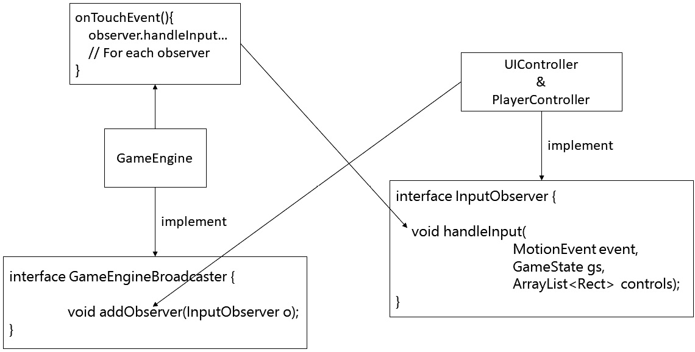
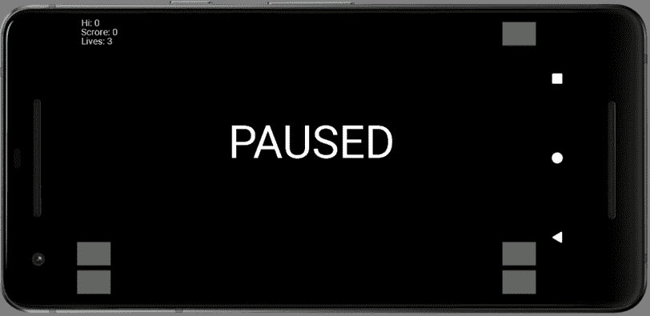
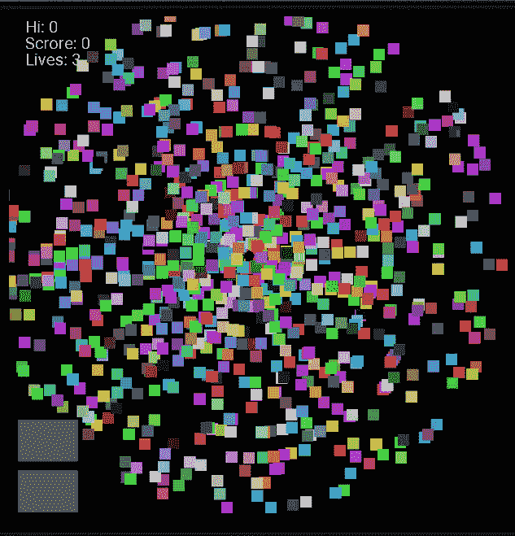
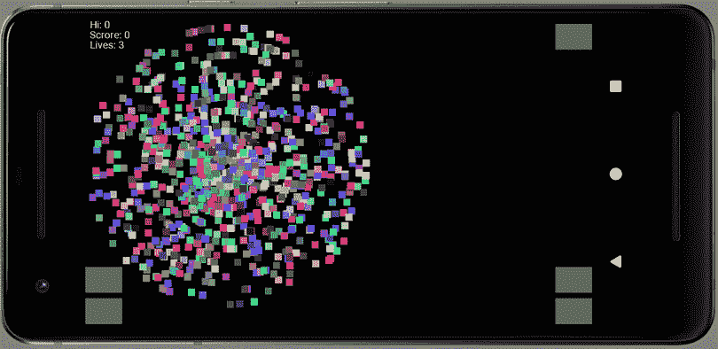

# *章节 19* :用观察者模式倾听，多点触摸，构建粒子系统

在本章中，我们将开始编码并使用我们的第一个设计模式。**观察者**模式正是它听起来的样子。我们将编码一些确实会观察另一个类的类。我们将使用这种模式来允许`GameEngine`类通知其他类何时需要处理用户输入。这样，单个类可以处理用户输入的不同方面。

此外，我们将对粒子系统进行编码。粒子系统包含数百甚至数千个用于创建视觉效果的图形对象。我们的粒子系统看起来会像爆炸。

以下是本章将涵盖的主题的摘要:

*   观察者模式
*   升级播放器的控制以处理多点触摸输入
*   使用多点触控用户界面控制器的观察者模式来收听来自游戏引擎的广播
*   实现粒子系统爆炸

让我们从一些关于观察者模式的理论开始。

# 观察者模式

我们需要的是一种`GameEngine`类向`UIController`类发送触摸数据的方式，我们将在本章后面对其进行编码，然后(在下一章)发送给`PlayerController`类。我们需要将触摸处理的不同部分分开，因为我们希望`UIController`和`PlayerController`负责处理与它们相关的控制方面。这是有道理的。`UIController`对 UI 和如何响应了如指掌，而`PlayerController`对控制玩家的飞船了如指掌。让`GameEngine`类负责所有这些事情，封装不好，无论如何也很难实现。

在前三个项目中，我们的主游戏引擎类确实处理了所有的触摸数据，但代价是每个对象都是由游戏引擎类声明和管理的。我们这次不想那样做。我们正在向一个更好的封装的地方前进。在 Snake 项目中，我们做了一半的工作。我们确实将触摸数据发送到了`Snake`类，但这仅仅是可能的，因为我们手动(在代码中)声明、实例化并持有对`Snake`类的引用。我们不想再这样做了。当只有一条蛇和一个苹果的时候，一切都很好。现在将有大约六个不同类别的十几个不同的对象，在下一个项目中，将有数百个游戏对象。

我们需要的是一个机制，让对象在游戏运行时自己决定想要接收触摸数据，然后让`GameEngine`类知道每次接收到一些新数据时如何联系他们。

由于将有不止一个数据接收者，但只有一个数据发送者，这是一种广播者-观察者的关系。需要明确的是，`GameEngine`类拿到触摸数据就会广播，`UIController`类和`PlayerController`类都会收到。

## 滚动射击项目中的观察者模式

`GameEngine`类需要一个观察者类可以调用的方法来注册/订阅更新。观察者将收到对`GameEngine`类的引用，然后将其称为特殊方法。`GameEngine`引用将采用适当编码的接口(称为`GameEngineBroadcaster`)的形式，只公开我们想要公开的单一方法。为了确保广播公司能够联系到其观察员/订户，他们将实现另一个名为`InputObserver`的界面。

请看下图，它展示了这种关系:



图 19.1–观察者模式的演示

从这个图中可以看到，`GameEngine`类实现了`GameEngineBroadcaster`接口，因此有一个`addObserver`方法。`UIController`和`PlayerController`实现`InputObserver`接口，各有一个`handleInput`方法。

`UIController`和`PlayerController`类必须在游戏开始前各调用一次`addObserver`方法，并以`InputObserver`引用的形式传递一个引用给自己。

每当操作系统调用`onTouchEvent`方法时，`GameEngine`类将调用`UIController`和`PlayerController`类上的`handleInput`方法。注意添加更多需要处理输入的类是一件简单的事情。他们只需要实现`InputObserver`接口，调用`addObserver`方法。

重要说明

在观察者模式的完整实现中，我们还会添加取消订阅的功能(另一种方法)，但这对于这个项目来说不是必需的。

我们还没有讨论`GameEngine`类如何存储`InputObserver`引用，或者`InputObserver`实现从哪里调用`addObserver`方法。现在我们已经看到了理论，我们将真正实现观察者模式，这应该有助于进一步澄清事情。

# 在滚动射击游戏中编码观察者模式

现在我们已经非常了解观察者模式是如何工作的，并且我们已经很好地查看了我们将需要编写的界面，以及它们将如何被使用，我们可以在 Scrolling Shooter 项目中将所有理论付诸实践。

由于我们的广播员和观察者的具体用途是处理玩家的输入，我们将编写一个类来处理平视显示器的屏幕触摸。提醒一下，`GameEngine`类将是*广播员*，处理用户输入的两个独立类将是*观察者*。由于 HUD 和玩家的飞船是非常不同的东西，所以他们每个人处理自己的输入是有意义的。

我们将对`UIController`类进行编码，这将是我们在本节中的第一个观察者(用于平视显示器播放/暂停按钮)，在项目的后面，我们将对第二个观察者进行编码，以处理飞船控制。

小费

据我们所知，如果有必要，没有什么能阻止我们为不同的活动增加更多的观察员甚至更多的广播员。

## 对广播界面进行编码

右键单击带有我们包名的文件夹，选择**新建| Java 类**，创建新界面。在**名称**部分，输入`GameEngineBroadcaster`。对于类型选择器，选择**界面**。

这是`GameEngineBroadcaster`接口的完整代码，它的单个空方法叫做`addObserver`，该方法将一个`InputObserver`实例作为参数。如下所示对界面进行编码:

```java
interface GameEngineBroadcaster {
      void addObserver(InputObserver o);
}
```

接下来，我们将对我们的观察者模式的第二个界面进行编码，实际的观察者称为`InputObserver`。

## 对输入到服务器接口进行编码

像我们之前做的那样，创建一个新界面。在**名称**部分，键入`InputObserver`。对于类型选择器，选择**界面**。

这里是`InputObserver`接口的整个代码，它的单个空方法叫做`handleInput`，该方法以一个`MotionEvent`引用、`GameState`引用和一个`ArrayList`引用作为参数。`ArrayList`参考将包含屏幕上每个按钮的位置。按照以下方式对接口进行编码:

```java
import android.graphics.Rect;
import android.view.MotionEvent;
import java.util.ArrayList;
interface InputObserver {
    void handleInput(MotionEvent event, GameState gs,
    ArrayList<Rect> controls);
}
```

接下来，我们将实现/使用新的`GameEngineBroadcaster`界面。

## 让游戏引擎成为广播公司

将`GameEngineBroadcaster`添加到`GameEngine`类实现的接口列表中:

```java
class GameEngine extends SurfaceView implements Runnable, 
GameStarter, GameEngineBroadcaster {
```

在屏幕上，您将观察到带有新代码的行将被标上红色下划线，直到我们实现了所需的界面方法。所以，我们现在就开始吧。我们还需要有一种方法来存储我们所有的`InputObserver`实现者。一个`ArrayList`实例就可以完成这项工作。

声明并初始化一个新的`ArrayList`实例，该实例将`InputObserver`类型的对象作为`GameEngine`类的成员。新的代码行将在下面突出显示:

```java
private Thread mThread = null;
private long mFPS;
private ArrayList<InputObserver> 
      inputObservers = new ArrayList();
private GameState mGameState;
private SoundEngine mSoundEngine;
HUD mHUD;
Renderer mRenderer;
```

现在，按照实现`GameEngineBroadcaster`接口的任何类的要求实现`addObserver`方法。我把我的放在`GameEngine`的建造者之后。下面是添加的方法:

```java
// For the game engine broadcaster interface
public void addObserver(InputObserver o) {

      inputObservers.add(o);
}
```

最后，在我们对可以注册广播的第一个`InputObserver`实例进行编码之前，我们将添加代码，该代码将调用所有注册的`InputObserver`实例的`handleInput`方法。将此高亮代码添加到`onTouchEvent`方法中:

```java
@Override
public boolean onTouchEvent(MotionEvent motionEvent) {
      // Handle the player's input here
      // But in a new way
      for (InputObserver o : inputObservers) {
            o.handleInput(motionEvent, mGameState, 
      mHUD.getControls());
      }
      return true;
}
```

代码遍历`ArrayList`实例中的所有`InputObserver`实例，并调用它们的`handleInput`方法(保证它们已经实现)。如果`ArrayList`实例中有 0 个、只有 1 个或 1，000 个观察器，那么代码的工作原理也是一样的。

接下来，我们将在处理用户界面的屏幕触摸的同时实现/使用新的`InputObserver`界面。

# 编写多点触控用户界面控制器，并使其成为监听器

创建一个新的 Java 类，并将其称为`UIController`。

小费

如前所述，在项目的后面，我们还将有另一个基于玩家飞船游戏对象的`InputObserver`实例，但是我们需要在下一章做更多的理论，然后才能实现它。

在类声明中添加一些类`imports`和`implements InputObserver`代码，使类成为一个包。此外，添加构造函数，如下所示:

```java
import android.graphics.Point;
import android.graphics.Rect;
import android.view.MotionEvent;
import java.util.ArrayList;
class UIController implements InputObserver {
    public UIController(GameEngineBroadcaster b){
 b.addObserver(this);
 }
}
```

我们在构造函数中需要做的就是使用作为参数传入的`GameEngineBroadcaster`实例`b`调用`addObserver`方法。对这个类的引用现在将安全地藏在`GameEngine`类的`inputObservers` `ArrayList`中。

## 对所需的 handleInput 方法进行编码

将方法添加到`UIController`类中，玩家每次与屏幕交互时都会从`InputObservers`的`ArrayList`(在`GameEngine`类中)调用该方法:

```java
@Override
public void handleInput(MotionEvent event, GameState gameState, ArrayList<Rect> buttons) {
      int i = event.getActionIndex();
      int x = (int) event.getX(i);
      int y = (int) event.getY(i);
      int eventType = event.getAction() & 
      MotionEvent.ACTION_MASK;
      if(eventType == MotionEvent.ACTION_UP ||
            eventType == MotionEvent.ACTION_POINTER_UP) {
            if (buttons.get(HUD.PAUSE).contains(x, y)){
                  // Player pressed the pause button
                  // Respond differently depending 
                  // upon the game's state
                  // If the game is not paused
                  if (!gameState.getPaused()) {
                        // Pause the game
                        gameState.pause();
                  }
                  // If game is over start a new game
                  else if (gameState.getGameOver()) {
                        gameState.startNewGame();
                  }
                  // Paused and not game over
                  else if (gameState.getPaused()
                        && !gameState.getGameOver()) {
                        gameState.resume();
                  }
            }
      }
}
```

首先要观察的是方法之前的`@Override`代码。这是必需的方法，因为`UIController`实现了`InputObserver`。这是每次`onTouchEvent`方法从操作系统接收到新的`MotionEvent`引用时`GameEngine`都会调用的方法。

现在我们可以研究如何处理触摸。由于滚动射击项目有一个更深入的控制系统，事情的工作方式与所有以前的项目略有不同。这就是`handleInput`方法中代码的工作原理。

再次查看方法内部的前三行代码:

```java
int i = event.getActionIndex();
int x = (int) event.getX(i);
int y = (int) event.getY(i);
```

这里有一个微妙但重要的区别。我们在`MotionEvent`对象上调用`getActionIndex`方法，并将结果存储在一个名为`i`的`int`变量中。

在所有其他项目中，控件只涉及一个手指。我们只需要知道触摸是左还是右(对于蛇和乒乓)或者坐标(对于潜艇猎人和子弹地狱)。然而，`MotionEvent`类保存了关于多次触摸的数据，以及关于诸如屏幕上的移动等更高级的数据。锁定在`MotionEvent`参考内的是多个事件类型的多个坐标。

由于我们的用户界面现在有很多按钮可以同时按下，我们如何知道是哪个手指导致了`onTouchEvent`方法被触发？`getActionIndex`方法返回执行动作的事件在事件数组中的位置。

因此，通过调用`getActionIndex`方法并将结果存储在`i`中，我们可以修改对`event.getX`和`event.getY`的调用，并传入索引(`i`)以获得对我们重要的特定事件的坐标。变量`x`和`y`现在保存了我们关心的这个事件的坐标。

使用`handleInput`方法检查下一行代码:

```java
int eventType = event.getAction() & MotionEvent.ACTION_MASK;
```

这段代码得到一个`int`值，代表发生的事件类型。它现在存储在`eventType`变量中，准备在下一行代码中进行比较。这里再次显示了这一行代码:

```java
if(eventType == MotionEvent.ACTION_UP ||
            eventType == MotionEvent.ACTION_POINTER_UP) {
      …
}
```

`if`块内的代码将为`ACTION_UP`或`ACTION_POINTER_UP`执行。这是我们需要应对的仅有的两种事件类型。

重要说明

如果你对其他类型的`ACTION…`感兴趣，那么你可以在这里阅读:[https://developer . Android . com/reference/Android/view/motion event . html](https://developer.android.com/reference/android/view/MotionEvent.html)。

一旦我们确定事件是我们关心的类型，这个`if`语句检查触摸的坐标是否在暂停按钮内:

```java
if (buttons.get(HUD.PAUSE).contains(x, y)){
      // Player pressed the pause button
      // Respond differently depending 
      // upon the game's state
      …
}
```

如果动作在暂停按钮内，则执行这个`if`、`else-if`、`else-if`结构，并处理游戏的不同可能状态，对每个状态采取不同的动作:

```java
// If the game is not paused
if (!gameState.getPaused()) {
// Pause the game
      gameState.pause();
}
// If the game is over start a new game
else if (gameState.getGameOver()) {
gameState.startNewGame();
}
// Paused and not game over
else if (gameState.getPaused()
      && !gameState.getGameOver()) {
gameState.resume();
}
```

如果游戏当前没有暂停，则设置为`gameState.pause()`暂停。如果游戏当前已经结束，则通过`gameState.startNewGame()`开始新的游戏。最后的`else if`方块检查游戏当前是否暂停，但游戏尚未结束。在这种情况下，游戏是未打包的。

## 使用 UIController

我们就要到达 T2 了。我们只需要在`GameEngine`类中声明并初始化一个实例。添加突出显示的代码，将其中一个声明为成员:

```java
private Thread mThread = null;
private long mFPS;
private ArrayList<InputObserver> inputObservers 
= new ArrayList();
UIController mUIController;
private GameState mGameState;
private SoundEngine mSoundEngine;
HUD mHUD;
Renderer mRenderer;
```

现在您可以在`GameEngine`构造函数中初始化它，就像下面突出显示的代码一样:

```java
public GameEngine(Context context, Point size) {
      super(context);
      mUIController = new UIController(this);
      mGameState = new GameState(this, context);
      mSoundEngine = new SoundEngine(context);
      mHUD = new HUD(size);
      mRenderer = new Renderer(this);
}
```

与其他代码一样，这段代码只是调用一个构造函数，但也会传入`this`引用，这是一个`UIController`类用来调用`addObserver`方法的`GameEngineBroadCaster`引用。

现在我们可以运行游戏了。

# 运行游戏

运行游戏。您可以点击开始/暂停/继续按钮开始游戏(右上角的按钮):



图 19.2–运行游戏

当游戏运行时，也可以使用开始/暂停/恢复按钮在暂停和运行状态之间切换。显然，当它运行时，还没有什么重大的事情发生，但是我们接下来会改变这一点。

# 实施粒子系统爆炸

粒子系统是控制粒子的系统。在我们的例子中，`ParticleSystem`是一个类，将生成`Particle`类的实例(大量实例)，这将创建一个简单的爆炸效果。这是由粒子系统控制的粒子图像，它将在本章结束时出现:



图 19.3–粒子系统爆炸

重要说明

成品游戏中的粒子系统是带有较小粒子的纯白色。在这一章的最后，将解释如何实现这两种类型的粒子，然后你可以选择。较小的普通白色粒子更适合游戏(在我看来)，但是大的多色粒子在一本书的页面上显示得更好。

只是为了澄清，每个彩色方块都是`Particle`类的一个实例，所有`Particle`实例都由`ParticleSystem`类控制和持有。

我们将从编码`Particle`类开始。

## 对粒子类进行编码

给项目添加一个名为`Particle`的新类。如下所示对`Particle`类进行编码，我们将检查代码:

```java
import android.graphics.PointF;
class Particle {
    PointF mVelocity;
    PointF mPosition;
    Particle(PointF direction)
    {
        mVelocity = new PointF();
        mPosition = new PointF();
        // Determine the direction
        mVelocity.x = direction.x;
        mVelocity.y = direction.y;
    }
}
```

`Particle`类出奇的简单。每个粒子都有一个由`PointF`实例控制的运动方向，称为`mVelocity`，它在屏幕上也有一个当前位置，由另一个`PointF`实例控制，称为`mPosition`。

小费

在构造函数中，两个新的`PointF`对象被实例化，并且`mVelocity`的`x`和`y`值用`PointF direction`参数传入的值初始化。请注意数值从`direction`复制到`mVelocity`的方式。`PointF mVelocity`不是对作为参数传入的`PointF`引用的引用。每一个`Particle`实例肯定会复制`direction`的值(每个实例的值都不一样)，但是`mVelocity`和`direction`没有持久的联系。

接下来，添加这三种方法，然后我们可以讨论它们:

```java
void update()
{
      // Move the particle
      mPosition.x += mVelocity.x;
      mPosition.y += mVelocity.y;
}
void setPosition(PointF position)
{
      mPosition.x = position.x;
      mPosition.y = position.y;
}
PointF getPosition()
{
      return mPosition;
}
```

或许不出所料，有一种`update`方法。每个`Particle`实例的`update`方法将被`ParticleSystem`类的`update`方法在游戏的每一帧中调用，而这个方法又将被新的`Physics`类调用，我们将在本章的后面进行编码。

在`update`方法中，`mPosition`的水平和垂直值使用`mVelocity`的相应值进行更新。

小费

请注意，我们在更新中并不使用当前的帧速率。如果你想确定你的粒子都以正确的速度飞行，你可以修改这个。然而，在任何情况下，所有的速度都是随机的。添加这个额外的计算(对于每个粒子)并没有太大的好处。我们所能实现的就是随机性的同步。然而，正如我们将很快看到的那样，`ParticleSystem`类将需要考虑当前每秒的帧数，以便测量它应该运行多长时间。

接下来，我们对`setPosition`方法进行编码。请注意，该方法接收到一个`PointF` 参考，用于设置初始位置。当效果被触发时，`ParticleSystem`类将传递这个位置。

最后，我们有`getPosition`法。我们需要这种方法，以便`ParticleSystem`类可以在正确的位置绘制所有粒子。我们可以给`Particle`类添加一个`draw`方法，而不是`getPosition`方法，让`Particle`类自己绘制。在这个实现中，两种选择都没有特别的好处。

现在我们可以进入`ParticleSystem`课了。

## 对粒子系统类进行编码

与`Particle`类相比，`ParticleSystem`类包含了更多的细节，但是仍然相当简单。记住我们需要通过这个类实现什么:保持、繁殖、更新和绘制一堆(相当大的一堆)`Particle`实例。

向项目中添加一个名为`ParticleSystem`的新 Java 类。然后，将以下`import`语句和成员变量添加到`ParticleSystem`类中:

```java
import android.graphics.Canvas;
import android.graphics.Paint;
import android.graphics.PointF;
import java.util.ArrayList;
import java.util.Random;
class ParticleSystem {
    float mDuration;
    ArrayList<Particle> mParticles;
    Random random = new Random();
    boolean mIsRunning = false;
}
```

我们有四个成员变量。首先，一个名为`mDuration`的`float`，它将被初始化为我们希望效果运行的秒数。名为`mParticles`的`ArrayList`保存`Particle`实例，并将保存我们实例化的所有`Particle`对象。

名为`random`的`Random`实例是作为类的成员创建的，因为我们需要生成如此多的随机值，以至于每次创建一个新的对象肯定会让我们慢下来。

最后，`boolean`变量`mIsRunning`将跟踪粒子系统当前是否正在显示(更新和绘制)。

现在，我们可以将编码为`init`方法。每次我们想要一个新的`ParticleSystem`的时候都会调用这个方法。请注意，唯一的参数是名为`numParticles`的`int`。

当我们调用`init`时，我们可以从初始化疯狂数量的粒子中获得一些乐趣。添加`init`方法，然后我们将更仔细地查看代码:

```java
void init(int numParticles){
      mParticles = new ArrayList<>();
      // Create the particles
      for (int i = 0; i < numParticles; i++)        {
            float angle = (random.nextInt(360)) ;
            angle = angle * 3.14f / 180.f;
            float speed = (random.nextInt(20)+1);
            PointF direction;
            direction = new PointF((float)Math.cos(angle) *
                   speed, (float)Math.sin(angle) * speed);
            mParticles.add(new Particle(direction));
      }
}
```

`init`方法只包含一个完成所有工作的`for`循环。`for`循环从零运行到`numParticles`。

首先，生成一个 0 到 359 之间的随机数，并存储在名为`angle`的`float`变量中。接下来，有一点数学知识，我们用`angle`乘以`3.14/180`。这将把角度(以度为单位)转换为弧度测量，这是我们稍后将使用的`Math`类所要求的。

然后我们生成另一个 1 到 20 之间的随机数，并将结果分配给一个名为`speed`的`float`变量。

现在我们有了一个随机的角度和速度，我们可以将它们转换并组合成一个向量，该向量可以在`Particle`类的`update`方法中使用，以每帧更新其位置。

小费

矢量是决定方向和速度的值。我们的向量存储在`direction`对象中，直到它被传递到`Particle`构造函数中。向量可以是多维的。我们的是二维的，因此定义了 0 到 359 度之间的航向和 1 到 20 度之间的速度。你可以在我的网站上读到更多关于向量、标题、正弦和余弦的内容:http://gamecode school . com/essentials/computing-heading-in-2d-games-use-三角函数-part-1/ 。

我决定不完整解释使用`Math.sin`和`Math.cos`创建向量的单行代码，因为魔法部分出现在公式中:

*   角度的余弦*速度
*   角度的正弦*速度

部分在`Math`类提供的余弦和正弦函数的隐藏计算中。如果你想知道他们的全部细节，那就看前面的提示。

最后，创建一个新的`Particle`实例，然后将其添加到`mParticles ArrayList`中。

接下来，我们将对`update`方法进行编码。注意`update`方法确实需要当前帧率作为参数。编码`update`方法如下:

```java
void update(long fps){
      mDuration -= (1f/fps);
      for(Particle p : mParticles){
            p.update();
      }
      if (mDuration < 0)
      {
            mIsRunning = false;
      }
}
```

`update`方法内部发生的第一件事是将经过的时间从`mDuration`中去掉。记住`fps`是每秒帧数，所以`1/fps`给出的值是一秒的分数。

接下来是增强的`for`循环，它为`mParticles` `ArrayList`中的每个`Particle`实例调用`update`方法。

最后，代码检查粒子效果是否已经随着`if(mDuration < 0)`运行，如果已经运行，则将`mIsRunning`设置为`false`。

现在我们可以对`emitParticles`方法进行编码，该方法将设置每个`Particle`实例运行，不要与`init`混淆，后者创建所有新粒子并给出它们的速度。`init`方法将在游戏外调用一次，而`emitParticles`方法将在每次需要启动效果并在屏幕上显示时调用:

```java
void emitParticles(PointF startPosition){
      mIsRunning = true;
      mDuration = 1f;
      for(Particle p : mParticles){
            p.setPosition(startPosition);
      }
}
```

首先，请注意一个`PointF`实例，所有粒子将从这里开始，作为一个参数传入。所有粒子都将从完全相同的位置开始，然后根据各自的速度扇出每一帧。一旦游戏完成，`startPosition`值将是被摧毁的外星飞船的坐标。

`mIsRunning`布尔设置为`true`，`mDuration`设置为`1f`，效果运行 1 秒，增强的`for`循环调用每个粒子的`setPosition`方法将其移动到起始坐标。

我们`ParticleSystem`班最后的法是`draw`法，会在所有荣耀中彰显效果。正如我们所有游戏对象的情况一样，`draw`方法引用了`Canvas`和`Paint`。添加`draw`方法，如下图:

```java
void draw(Canvas canvas, Paint paint){
      for (Particle p : mParticles) {
            paint.setARGB(255, 
                  random.nextInt(256), 
                  random.nextInt(256), 
                  random.nextInt(256));
            // Uncomment the next line to have plain white 
               particles
            //paint.setColor(Color.argb(255,255,255,255));
            canvas.drawRect(p.getPosition().x, 
                  p.getPosition().y,
                  p.getPosition().x+25,
                  p.getPosition().y+25, paint);
      }
}
```

增强的`for`循环遍历`mParticles`中的每个`Particle`实例。每个`Particle`实例依次使用`drawRect`和`getPosition`方法绘制。注意对`paint.setARGB`方法的调用。你会看到我们随机生成每个颜色通道。如果您想要“经典”的白色外观，请注释掉这一行，并取消注释下面仅将颜色设置为白色的行。

我们现在可以开始让粒子系统工作了。

## 给游戏引擎添加一个粒子系统，用 Renderer 类绘制

宣布为`ParticleSystem`类的新实例为`GameEngine`类的成员:

```java
...
private GameState mGameState;
private SoundEngine mSoundEngine;
HUD mHUD;
Renderer mRenderer;
ParticleSystem mParticleSystem;
```

初始化后在`GameEngine`构造函数中调用其`init`方法:

```java
public GameEngine(Context context, Point size) {
      super(context);
      mHUD = new HUD(size);
      mSoundEngine = new SoundEngine(context);
      mGameState = new GameState(this, context);
      mUIController = new UIController(this, size);
      mPhysicsEngine = new PhysicsEngine();
      mRenderer = new Renderer(this);
      mParticleSystem = new ParticleSystem();
// Even just 10 particles look good
// But why have less when you can have more 
      mParticleSystem.init(1000);
}
```

这样我们就可以测试`ParticleSystem`类了(因为我们还没有任何要爆炸的外星人)，通过将这个高亮显示的代码添加到`GameEngine`类的`onTouchEvent`方法中来调用`emitParticles`方法。

添加以下突出显示的代码:

```java
@Override
public boolean onTouchEvent(MotionEvent motionEvent) {
      // Handle the player's input here
      // But in a new way
      for (InputObserver o : inputObservers) {
            o.handleInput(motionEvent, mGameState,
             mHUD.getControls());
      }
      // This is temporary code to emit a particle system
      mParticleSystem.emitParticles(
                  new PointF(500,500));
      return true;
}
```

代码使`ParticleSystem`类在`500, 500`屏幕坐标上产生所有的`Particle`实例。

现在我们需要为每个要绘制的帧添加我们的粒子系统到`Renderer`实例。这包括三个步骤:

1.  更改`run`方法中的代码，将粒子系统传递给`Renderer.draw`方法。
2.  更改`draw`方法的签名以接受对*步骤 1* 的更改。
3.  检查粒子系统是否处于活动状态后，绘制粒子系统。

让我们详细看看前面的步骤:

*   **步骤 1** :更改对`run`方法内部的`draw`方法的调用，使其看起来像下面突出显示的代码:

```java
// Draw all the game objects here
// in a new way
mRenderer.draw(mGameState, mHUD, mParticleSystem);
```

*   **步骤 2** :更改`Renderer`类中`draw`方法的签名，以匹配该高亮显示的代码:

```java
void draw(GameState gs, HUD hud, ParticleSystem ps) {
```

*   **第 3 步**:在检查粒子系统是否处于活动状态后，将该代码添加到`draw`方法中，就在显示代码应该到哪里的注释之后:

```java
// Draw a particle system explosion here
if(ps.mIsRunning){
      ps.draw(mCanvas, mPaint);
}
```

就这样——差不多了。运行游戏点击屏幕触发`emitParticles`方法:


图 19.4–触发发射粒子方法

哇哦！一千个闪烁的方块一个在另一个上面，看起来就像一个方块。当然，我们还没有更新粒子系统的每一帧。让我们编写一个`Physics`类来更新粒子系统，并在项目的后面更新我们所有的游戏对象。

# 建造一个物理引擎，让事物运转起来

创建一个名为`PhysicsEngine`的新类，并对其进行编辑以匹配以下代码:

```java
class PhysicsEngine {
   // This signature and much more will 
//change later in the project
   boolean update(long fps, ParticleSystem ps){

        if(ps.mIsRunning){
            ps.update(fps);
        }
        return false;
    }
   // Collision detection method will go here
}
```

`PhysicsEngine`类目前只有一个方法–`update`。到项目结束时，它将有另一种检查碰撞的方法。`update`方法的签名每秒接收帧和一个`ParticleSystem`实例。代码只是检查`ParticleSystem`是否正在运行，是否正在调用其`update`方法，并传递所需的`fps`参数。

现在我们可以创建一个`PhysicsEngine`类的实例，并在游戏的每一帧调用它的`update`方法。使用这段高亮显示的代码创建`PhysicsEngine`类的实例，作为`GameEngine`类的成员:

```java
…
private GameState mGameState;
private SoundEngine mSoundEngine;
HUD mHUD;
Renderer mRenderer;
ParticleSystem mParticleSystem;
PhysicsEngine mPhysicsEngine;
```

用`GameEngine`构造函数中的这段高亮代码初始化`mPhysicsEngine`实例:

```java
public GameEngine(Context context, Point size) {
      super(context);
      mUIController = new UIController(this, size);
      mGameState = new GameState(this, context);
      mSoundEngine = new SoundEngine(context);
      mHUD = new HUD(size);
      mRenderer = new Renderer(this);
      mPhysicsEngine = new PhysicsEngine();
      mParticleSystem = new ParticleSystem();
      mParticleSystem.init(1000);
}
```

从`GameEngine`类的`run`方法中调用`PhysicsEngine`类的`update`方法，每一帧都带有这一突出显示的代码行:

```java
if (!mGameState.getPaused()) {
      // Update all the game objects here
      // in a new way
      // This call to update will evolve with the project
      if(mPhysicsEngine.update(mFPS, mParticleSystem)) {
            // Player hit
            deSpawnReSpawn();
      }
}
```

`PhysicsEngine`类的`update`方法返回一个`boolean`值。最终这将是用来检测玩家是否已经死亡。如果它们已经死亡，那么`deSpawnReSpawn`方法将重建所有对象并重新定位它们。很明显，`deSpawnReSpawn`还什么都没做。在正在测试的`if`条件下，刚刚添加的代码的关键部分是对`mPhysicsEngine.update`的调用，该调用通过帧率和粒子系统。

现在我们可以运行游戏了。

# 运行游戏

现在你可以运行游戏了，点击屏幕，点击播放/暂停按钮，然后`ParticleSystem`类就会爆发动作:



图 19.5–运行游戏

半小时的工作相当壮观！事实上，您可能会希望将粒子的数量减少到 100 个以下，也许使它们都变白，也许还会减小它们的大小。所有这些你都可以通过查看`ParticleSystem`类及其注释轻松做到。

小费

前一章开头的粒子爆炸截图，粒子更少，更小，只是白色粒子。

从`GameEngine`类的`onTouchEvent`方法中删除该临时代码:

```java
// This is temporary code to emit a particle system
mParticleSystem.emitParticles(
            new PointF(500,500));
```

很快，当我们的激光击中敌人时，我们将从物理引擎中产生我们的粒子系统。

# 总结

我们在这一章已经讨论了很多内容。我们已经学习了一种称为观察者模式的模式，一个类是广播者，而其他称为观察者的类可以向广播者注册并接收更新。我们使用观察者模式通过处理播放/暂停按钮来实现用户输入的第一部分。当我们还编写了一个`ParticleSystem`类，准备在玩家摧毁一艘敌舰时引发爆炸时，我们给这一章增加了一些动作。

在下一章中，我们将学习其他有用的编程模式，包括一个名为**实体-组件**的模式和另一个名为**工厂**的模式。我们将使用它们来编码和建造玩家的飞船，它将能够发射快速激光，并且能够在背景中平滑滚动的城市天际线周围缩放。