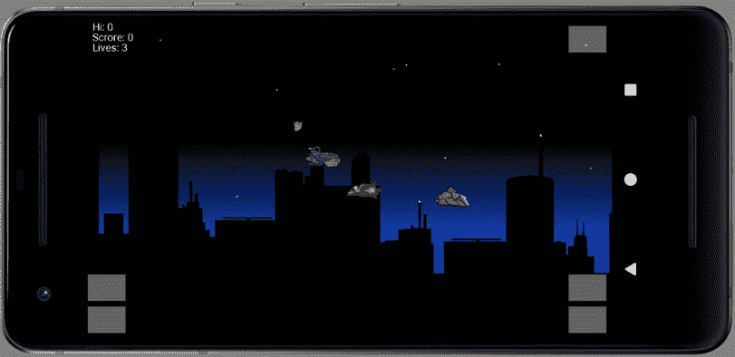
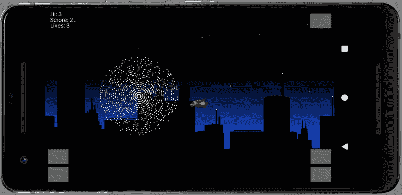

# *第 21 章*:完成滚动射击游戏

在本章中，我们将完成滚动射击游戏。我们将通过对剩余的组件类进行编码来实现这一点，这些组件类代表了三种不同类型的外星人以及他们可以向玩家发射的激光。一旦我们完成了组件类，我们将对`GameEngine`、`Level`和`GameObjectFactory`类进行微小的修改，以适应这些新完成的实体。

完成游戏的最后一步是碰撞检测，我们将添加到`PhysicsEngine`类。

以下是我们将在本章中讨论的主题:

*   编码外星人的组件
*   让外星人产卵
*   冲突检测编码

我们快完成了，所以让我们开始编码。

# 加入外星人的成分

记得外星人的一些组件和我们已经编码的其他组件是一样的。例如，所有的外星人和他们的激光都有一个`StdGraphicsComponent`。此外，外星人的激光与玩家的激光具有相同的组件。唯一的区别是规格(我们已经编码了)和对`AlienLaserSpawner`接口的需求。

随着所有规范的完成，一切都准备好了，所以我们可以继续对下面显示的剩余类进行编码。

## alien motion component

创建一个名为`AlienChaseMovementComponent`的新类，然后添加以下成员和构造函数方法:

```java
class AlienChaseMovementComponent implements MovementComponent {
    private Random mShotRandom = new Random();
    // Gives this class the ability to tell the game engine
    // to spawn a laser
    private AlienLaserSpawner alienLaserSpawner;
    AlienChaseMovementComponent(AlienLaserSpawner als){
        alienLaserSpawner = als;
    }
}
```

只有两个成员。一个是名为`mShotRandom`的`Random`物体，我们将使用它来决定追逐的外星人何时应该向玩家开枪，另一个是`AlienLaserSpawner`的实例。完成本课后，我们将对`AlienLaserSpawner`进行编码和实现。在构造函数中，我们用作为参数传入的引用初始化`AlienLaserSpawner`实例。

这正是我们在`PlayerLaserSpawner`课程中所做的，当我们很快实现`AlienLaserSpawner`的其余部分时，我们将了解它是如何工作的。

现在我们可以对`move`方法进行编码了。记住`move`方法是必需的，因为这个类实现了`MovementComponent`接口。

首先，添加签名以及`move`方法中需要的相当长的局部变量列表。如果您在添加此代码时查看注释，它会对您有很大帮助:

```java
@Override
    public boolean move(long fps, Transform t, 
Transform playerTransform) {
// 1 in 100 chances of shot being fired 
//when in line with player
      final int TAKE_SHOT=0; // Arbitrary
      final int SHOT_CHANCE = 100;
      // How wide is the screen?
      float screenWidth = t.getmScreenSize().x;
      // Where is the player?
      PointF playerLocation = playerTransform.
      getLocation();
      // How tall is the ship
      float height = t.getObjectHeight();
      // Is the ship facing right?
      boolean facingRight =t.getFacingRight();
      // How far off before the ship doesn't bother 
      chasing?
      float mChasingDistance = t.getmScreenSize().x / 3f;
      // How far can the AI see?
      float mSeeingDistance = t.getmScreenSize().x / 1.5f;
      // Where is the ship?
      PointF location = t.getLocation();
      // How fast is the ship?
      float speed = t.getSpeed();
      // Relative speed difference with player
      float verticalSpeedDifference = .3f;
      float slowDownRelativeToPlayer = 1.8f;
      // Prevent the ship locking on too accurately
      float verticalSearchBounce = 20f;
       // More code here next
}
```

和所有`move`方法一样，外星人的`Transform`和玩家的`Transform`作为参数传入。

前两个变量是`final int`。`SHOT_CHANCE`等于`100`将意味着每次`move`方法检测到机会拍摄时，有 1%的机会拍摄并发射新的激光。`TAKE_SHOT`变量只是一个任意的数字，它代表一个随机生成的数字在拍摄时必须等于的值。`TAKE_SHOT`可以初始化为 0 到 99 之间的任何值，效果是一样的。

大多数局部变量都是用传入的`Transform`引用的值初始化的。我们可以在整个代码中使用各种 getter 方法，但是像我们所做的那样初始化一些局部变量会更干净、更易读。此外，它可能会加快代码的速度。

因此，许多新的局部变量是不言自明的。主角的位置我们有`location``playerLocation`之类的东西。有`facingRight`、`height`和`speed`来说明外星人正在朝哪个方向看，它有多高，它的移动速度有多快。此外，我们还制作了一个局部变量来记住屏幕的像素宽度:`screenWidth`。

然而，一些变量需要更多的解释。我们有`chasingDistance`和`seeingDistance`。看看它们用一小部分水平屏幕大小初始化的方式。实际使用的分数稍微有些随意，你可以用不同的值进行实验，但是这些变量将会决定外星人会在多远的距离开始追赶玩家，以及在多远的距离“看见”玩家，并考虑发射激光。

最后的三个变量是`verticalSpeedDifference`、`slowDownReleativeToPlayer`和`verticalSearchBounce`。这三个变量也有明显任意的初始值，也可以进行实验。他们的目的是调节外星人相对于玩家的移动速度。

在这个游戏中，玩家的图形正好位于屏幕的中央(水平方向)。任何移动(水平)都是滚动背景产生的幻觉。因此，我们需要根据玩家飞行的方向来调节外星人的速度。例如，当玩家朝着一个直接向他们冲来的外星人前进时，玩家会很快从他们身边呼啸而过。作为另一个例子，如果玩家正在远离一个外星人(也许是一个正在追逐他们的人)，玩家将会看起来慢慢地离开。

在下一个项目中将避免这种轻微的复杂，因为运动的外观将通过使用相机来创建。

现在添加下一个代码，仍然在`move`方法中。请注意高亮显示的注释，该注释显示了此代码相对于之前代码的位置:

```java
// More code here next
// move in the direction of the player
// but relative to the player's direction of travel
if (Math.abs(location.x - playerLocation.x) 
          > mChasingDistance) {

     if (location.x < playerLocation.x) {
          t.headRight();
     } else if (location.x > playerLocation.x) {
          t.headLeft();
     }
}
// Can the Alien "see" the player? If so, try and align vertically
if (Math.abs(location.x - playerLocation.x) 
          <= mSeeingDistance) {

     // Use a cast to get rid of unnecessary 
     // floats that make ship judder
     if ((int) location.y - playerLocation.y 
               < -verticalSearchBounce) {

          t.headDown();
     } else if ((int) location.y - playerLocation.y 
               > verticalSearchBounce) {

          t.headUp();
     }
     // Compensate for movement relative to player-
     // but only when in view.
     // Otherwise alien will disappear miles off to one 
     // side
     if(!playerTransform.getFacingRight()){
          location.x += speed * slowDownRelativeToPlayer / 
          fps;
     } else{
          location.x -= speed * slowDownRelativeToPlayer / 
          fps;
     }
}
else{
     // stop vertical movement otherwise alien will
     // disappear off the top or bottom
     t.stopVertical();
}
// More code here next
```

在我们刚刚添加的代码中，有一个`if`块和一个`if` - `else`块。`if`方块从外星人的水平位置减去玩家的水平位置，测试是否大于外星人应该追赶玩家的距离。如果满足条件，内部`if` - `else`代码设置外星人的航向。

`if` - `else`区块测试外星人是否能“看见”玩家。如果可以，它会垂直对齐自身，但前提是它没有对齐到`mVerticalSearchBounce`中的程度。这就有了外星人在玩家身上“蹦蹦跳跳”的效果。

垂直调整后，代码检测玩家面对的方向，调整外星人的速度，创造玩家有速度的效果。如果玩家背对着外星人，他们会看起来拉开，如果背对着外星人，他们会迅速靠近。

最后的`else`块处理当外星人无法“看见”玩家时发生的事情，并停止所有垂直移动。

现在添加这个下一个代码，还是在`move`方法里面。请注意高亮显示的注释，该注释显示了此代码相对于之前代码的位置:

```java
     // More code here next
     // Moving vertically is slower than horizontally
     // Change this to make game harder
     if(t.headingDown()){
          location.y += speed * verticalSpeedDifference / 
          fps;
     }
     else if(t.headingUp()){
          location.y -= speed * verticalSpeedDifference / 
          fps;
     }
     // Move horizontally
     if(t.headingLeft()){
          location.x -= (speed) / fps;
     }
     if(t.headingRight()){
          location.x += (speed) / fps;
     }
     // Update the collider
     t.updateCollider();
     // Shoot if the alien is within a ships height above,
     // below, or in line with the player?
     // This could be a hit or a miss
     if(mShotRandom.nextInt(SHOT_CHANCE) == TAKE_SHOT) {
          if (Math.abs(playerLocation.y - location.y) < 
          height) {
               // Is the alien facing the right direction 
               // and close enough to the player
               if ((facingRight && playerLocation.x > 
               location.x
                         || !facingRight && playerLocation.
                         x <
                         location.x)
                         && Math.abs(playerLocation.x - 
                         location.x) 
                         < screenWidth) {

                    // Fire!
                    alienLaserSpawner.spawnAlienLaser(t);
               }
          }
     }
     return true;
}
```

代码的第一部分检查外星人是否正在朝四个可能的方向前进，并相应地调整其位置，然后将外星人的对撞机更新到新的位置。

最后一段代码计算外星人是否会在这一帧拍摄。`if`条件产生百分之一的射击机会。这是武断的，但效果很好。

如果外星人决定开枪，它会测试它是否垂直于玩家的飞船高度。请注意，这可能会导致激光险些击中玩家或击中目标。

最终的内部`if`检测外星人是否面向正确的方向(朝向玩家)并且在玩家的屏幕宽度内。一旦满足所有这些条件，`AlienLaserSpawner`界面用于调用`spawnAlienLaser`。

我们希望外星人很少开火的原因是这个机会在游戏的每一帧都被测试过，并且实际上创造了一个相当活跃的外星人。激光的存在限制了外星人的凶残。如果没有可用的，那么调用`spawnAlienLaser`不会产生任何结果。

代码中有一些错误，因为`AlienLaserSpawner`还不存在。我们现在将像`PlayerLaserSpawner`一样处理它。

### 编码 AlienLaserSpawner

为了消除`move`方法中的错误，我们需要编码，然后实现一个名为`AlienLaserSpawner`的新接口。

创建一个新的类/接口，并对其进行编码，如下所示:

重要说明

当您创建一个类时，正如我们所看到的，您可以从下拉选项中选择**界面**。但是，如果将代码编辑成如图所示，也不用选择**界面**，甚至不用担心选择访问说明符(**包私有**)。您键入的代码将覆盖您可能选择的任何选项或下拉选择。因此，当创建一个新的类或接口时，键入完整的代码或者使用不同的选择器——无论你喜欢哪个。

```java
// This allows an alien to communicate with the game engine
// and spawn a laser
interface AlienLaserSpawner {
    void spawnAlienLaser(Transform transform);
}
```

这个代码除了名字之外，和`PlayerLaserSpawner`代码完全一样。接下来，我们将在`GameEngine`类中实现它。

### 在游戏引擎中实现接口

将`AlienLaserSpawner`添加到`GameEngine`实现的界面列表中，如下图所示:

```java
class GameEngine extends SurfaceView 
        implements Runnable, 
        GameStarter, 
        GameEngineBroadcaster, 
        PlayerLaserSpawner, 
        AlienLaserSpawner {
```

现在将所需方法添加到`GameEngine`:

```java
public void spawnAlienLaser(Transform transform) {
     ArrayList<GameObject> objects = 
     mLevel.getGameObjects();
     // Shoot laser IF AVAILABLE
     // Pass in the transform of the ship
     // that requested the shot to be fired
     if (objects.get(Level.mNextAlienLaser
     ).spawn(transform)) {
          Level.mNextAlienLaser++;
          mSoundEngine.playShoot();
          if(Level.mNextAlienLaser ==Level.LAST_ALIEN_
          LASER + 1) {
               // Just used the last laser
               Level.mNextAlienLaser = 
               Level.FIRST_ALIEN_LASER;
          }
     }
}
```

现在，任何有`AlienLaserSpawner`引用的类(如`AlienChaseMovementComponent`)都可以调用`spawnAlienLaser`方法。该方法的工作方式与`spawnPlayerLaser`方法相同。它使用来自`Level`类的`nextAlienLaser`变量来选择一个`GameObject`来产生。如果一个新的外星激光成功产生，那么会播放一个声音效果，并且`nextAlienLaser`会更新，为下一个镜头做好准备。

## 升级超频组件

创建一个名为`AlienDiverMovementComponent`的新类。添加下面显示的所有代码:

```java
import android.graphics.PointF;
import java.util.Random;
class AlienDiverMovementComponent implements MovementComponent {
    @Override
    public boolean move(long fps, Transform t, 
    Transform playerTransform) {
        // Where is the ship?
        PointF location = t.getLocation();
        // How fast is the ship?
        float speed = t.getSpeed();
        // Relative speed difference with player
        float slowDownRelativeToPlayer = 1.8f;
        // Compensate for movement relative to player-
        // but only when in view.
        // Otherwise alien will disappear miles off to one 
        side
        if(!playerTransform.getFacingRight()){
            location.x += speed * slowDownRelativeToPlayer 
            / fps;
        } else{
            location.x -=  speed * 
            slowDownRelativeToPlayer / fps;
        }
        // Fall down then respawn at the top
        location.y += speed / fps;
        if(location.y > t.getmScreenSize().y){
            // Respawn at top
            Random random = new Random();
            location.y = random.nextInt(300) 
               - t.getObjectHeight();
            location.x = random
                 .nextInt((int)t.getmScreenSize().x);
        }
        // Update the collider
        t.updateCollider();
        return true;
    }
}
```

正如我们所料，一个与运动相关的类有`move`方法。一定要研究变量，记下名字，以及它们是如何被外星人和玩家的`Transform`引用初始化的。成员变量比`AlienChaseMovementComponent`少得多，因为潜水比追逐需要外星人更少的“思考”。

在变量之后，执行潜水逻辑的代码可以分为两部分。第一个是`if` - `else`块。该区块检测玩家是面向右还是面向左。然后，它会相对于玩家的方向、外星人的速度和帧所用的时间水平移动外星人(`fps`)。

`if` - `else`区块后，外星人的垂直位置更新。这个动作很简单，只有一行代码:

```java
// Fall down then respawn at the top
location.y += speed / fps;
```

然而，这一行代码后面的`if`块完成了检测外星人是否已经从屏幕底部消失的任务，如果已经消失，它会将它重新投影到屏幕上方，准备再次潜水到玩家身上——通常很快。

最后一行代码更新碰撞器，准备在新更新的位置检测碰撞。

## alien horizontal 元件

创建一个名为`AlienHorizontalSpawnComponent`的类。这个职业将被用来在屏幕左侧或右侧随机繁殖外星人。这将用于追逐的外星人和巡逻的外星人。你可能会猜测我们需要一个`AlienVerticalSpawnComponent`，以及一个潜水外星人。

添加`AlienHorizontalSpawnComponent`类旁边显示的代码。它有一个方法，`spawn`。这个方法是必需的，因为它实现了`SpawnComponent`界面:

```java
import android.graphics.PointF;
import java.util.Random;
class AlienHorizontalSpawnComponent implements SpawnComponent {
    @Override
    public void spawn(Transform playerLTransform,
    Transform t) {
        // Get the screen size
        PointF ss = t.getmScreenSize();
        // Spawn just off screen randomly left or right
        Random random = new Random();
        boolean left = random.nextBoolean();
        // How far away?
        float distance =  random.nextInt(2000) 
                + t.getmScreenSize().x;
        // Generate a height to spawn at where 
        // the entire ship is vertically on-screen
        float spawnHeight = random.nextFloat()
                * ss.y - t.getSize().y;
        // Spawn the ship
        if(left){
            t.setLocation(-distance, spawnHeight);
            t.headRight();
        }
else{
            t.setLocation(distance, spawnHeight);
            t.headingLeft();
        }
    }
}
```

大部分代码都涉及到初始化一些局部变量来正确地(随机地)生成外星人。首先，我们捕捉`ss`中的屏幕尺寸。

接下来，我们声明一个名为`random`的`Random`对象。我们将使用三个随机值生成外星人:随机左或右、随机高度和随机水平距离。然后，外星人可以从任何高度出现在任何一侧，有时会立即出现，有时需要一段时间才能到达玩家那里。

下一个变量是一个名为`left`的布尔值，它使用`Random`类的`nextBoolean`方法初始化，该方法随机返回一个值`true`或`false`。然后在`distance`中存储一个随机的`float`值，然后在`height`中存储一个随机的`float`值。我们现在知道在哪里产卵了。

使用检查`left`值的`if` - `else`块，然后使用`setLocation`方法在先前计算的随机高度和随机距离下繁殖外星人。请注意，根据异形是向左还是向右繁殖，它会朝向正确的方向，所以它最终会碰到玩家。如果一个外星人被带到了右边，并且向右边飞去，那么它可能永远不会被玩家看到，并且对游戏毫无用处。

## alienpatrolmomentcomponent

创建一个名为`AlienPatrolMovementComponent`的类，并编写构造函数方法，如下所示:

```java
import android.graphics.PointF;
import java.util.Random;
class AlienPatrolMovementComponent implements MovementComponent {
    private AlienLaserSpawner alienLaserSpawner;
    private Random mShotRandom = new Random();
    AlienPatrolMovementComponent(AlienLaserSpawner als){
        alienLaserSpawner = als;
    }
}
```

由于巡逻的 T2 外星人需要发射激光，他们需要参考`AlienLaserSpawner`。构造器还初始化一个`Random`对象，以避免在游戏的几乎每一帧都初始化一个新的对象。

现在添加第一部分`move`方法:

```java
@Override
public boolean move(long fps, Transform t, 
                         Transform playerTransform) {
     final int TAKE_SHOT = 0; // Arbitrary
     // 1 in 100 chance of shot being fired 
     // when in line with player
     final int SHOT_CHANCE = 100;
     // Where is the player
     PointF playerLocation = playerTransform.getLocation();
     // The top of the screen
     final float MIN_VERTICAL_BOUNDS = 0;
     // The width and height of the screen
     float screenX = t.getmScreenSize().x;
     float screenY = t.getmScreenSize().y;
     // How far ahead can the alien see?
     float mSeeingDistance = screenX * .5f;
     // Where is the alien?
     PointF loc = t.getLocation();
     // How fast is the alien?
     float speed = t.getSpeed();
     // How tall is the alien
     float height = t.getObjectHeight();
     // Stop the alien going too far away
     float MAX_VERTICAL_BOUNDS = screenY- height;
     final float MAX_HORIZONTAL_BOUNDS = 2 * screenX;
     final float MIN_HORIZONTAL_BOUNDS = 2 * -screenX;
     // Adjust the horizontal speed relative 
     // to the player's heading
     // Default is no horizontal speed adjustment
     float horizontalSpeedAdjustmentRelativeToPlayer = 0 ;
     // How much to speed up or slow down relative 
     // to player's heading
     float horizontalSpeedAdjustmentModifier = .8f;

     // More code here soon
}
```

当地的变量现在看起来很熟悉。我们声明并初始化它们，以避免重复调用`Transform`对象(外星人和玩家)的 getters。除了通常的嫌疑人，我们还有一些变量来控制外星人的活动范围，`MAX_VERTICAL_BOUNDS`、`MAX_HORIZONTAL_BOUNDS`和`MIN_HORIZONTAL_BOUNDS`。我们将在代码的下一部分使用它们来约束外星人在改变方向之前可以飞多远。

现在添加下一部分`move`方法:

```java
// More code here soon
// Can the Alien "see" the player? If so make speed relative
if (Math.abs(loc.x - playerLocation.x) 
          < mSeeingDistance) {
     if(playerTransform.getFacingRight() 
               != t.getFacingRight()){

          // Facing a different way speed up the alien
        horizontalSpeedAdjustmentRelativeToPlayer =
                  speed * 
                  horizontalSpeedAdjustmentModifier;
     } 
else{
          // Facing the same way slow it down
          horizontalSpeedAdjustmentRelativeToPlayer =
                    -(speed *
                     horizontalSpeedAdjustmentModifier);
     }
}
// Move horizontally taking into account 
// the speed modification
if(t.headingLeft()){
     loc.x -= (speed + 
          horizontalSpeedAdjustmentRelativeToPlayer) / fps;

     // Turn the ship around when it reaches the 
     // extent of its horizontal patrol area
     if(loc.x < MIN_HORIZONTAL_BOUNDS){
          loc.x = MIN_HORIZONTAL_BOUNDS;
          t.headRight();
     }
}
else{
     loc.x += (speed + 
          horizontalSpeedAdjustmentRelativeToPlayer) / fps;

     // Turn the ship around when it reaches the 
     // extent of its horizontal patrol area
     if(loc.x > MAX_HORIZONTAL_BOUNDS){
          loc.x = MAX_HORIZONTAL_BOUNDS;
          t.headLeft();
     }
}
// More code here soon
```

刚刚添加的代码可以分为两部分，它与其他与外星人运动相关的代码非常相似。根据玩家面对的方向调整速度，然后检查外星人是否已经达到垂直或水平位置限制，如果已经达到，改变它前进的方向。

现在添加`move`方法的最后一部分:

```java
// More code here soon
// Vertical speed remains same,
// Not affected by speed adjustment
if(t.headingDown()){
     loc.y += (speed) / fps;
     if(loc.y > MAX_VERTICAL_BOUNDS){
          t.headUp();
     }
}
else{
     loc.y -= (speed) / fps;
     if(loc.y < MIN_VERTICAL_BOUNDS){
          t.headDown();
     }
}
// Update the collider
t.updateCollider();
// Shoot if the alien within a ships height above,
// below, or in line with the player?
// This could be a hit or a miss
if(mShotRandom.nextInt(SHOT_CHANCE) == TAKE_SHOT) {
     if (Math.abs(playerLocation.y - loc.y) < height) {
          // is the alien facing the right direction 
          // and close enough to the player
          if ((t.getFacingRight() && playerLocation.x > 
          loc.x
                    || !t.getFacingRight() 
                    && playerLocation.x < loc.x)
                    && Math.abs(playerLocation.x - loc.x) 
                    < screenX) {

               // Fire!
               alienLaserSpawner.spawnAlienLaser(t);
          }
     }
}
return true;
}// End of move method
```

这个类的最终代码根据航向和调整后的速度移动外星人，然后更新它的碰撞器。拍摄的代码和我们在`AlienChaseMovementComponent`中使用的一样。

再编写一个组件，我们就快完成了。

## 外星人垂直生成组件

创建一个名为`AlienVerticalSpawnComponent`的类，并对`spawn`方法进行编码，如下所示:

```java
import java.util.Random;
class AlienVerticalSpawnComponent implements SpawnComponent {
    public void spawn(Transform playerLTransform, 
          Transform t) {
        // Spawn just off screen randomly but 
        // within the screen width
        Random random = new Random();
        float xPosition =  random.nextInt((int)t
                .getmScreenSize().x);
        // Set the height to vertically 
        // just above the visible game
        float spawnHeight = random
                .nextInt(300) - t.getObjectHeight();
        // Spawn the ship
        t.setLocation(xPosition, spawnHeight);
        // Always going down
        t.headDown();
    }
}
```

这个职业将被用来在屏幕外随机生成一个潜水外星人。由于外星人总是向下俯冲，我们生成两个随机值:一个用于水平位置(`xPosition`)，一个用于屏幕顶部上方有多少像素(`spawnHeight`)。那么我们所需要做的就是用这两个新的值作为参数来调用`setLocation`方法。最后，我们调用`headDown`方法来设置行进方向。

现在我们可以继续在游戏中繁殖一些外星人。

# 产卵的外星人

现在所有的外星组件，以及`AlienLaserSpawner`都被编码了，我们可以把它们都放到游戏中工作了。它将采取如下三个步骤:

1.  更新`GameEngine`的`deSpawnReSpawn`方法，让每个外星人都繁殖一些。
2.  更新`Level`类，给物体的`ArrayList`增加一些外星人和外星人激光。
3.  更新`GameObjectFactory`类，以便在级别类请求构建各种不同的`GameObject`实例时，处理正确组件类的实例化(我们刚刚编码的)。

让我们现在完成这些步骤。

## 更新游戏引擎类

将此代码添加到`deSpawnReSpawn`方法的结尾:

```java
…
for (int i = Level.FIRST_ALIEN; 
     i != Level.LAST_ALIEN + 1; i++) {

     objects.get(i).spawn(objects
          .get(Level.PLAYER_INDEX).getTransform());
}
```

这循环通过`object ArrayList`的适当索引并产生外星人。当外星人(追逐者或巡逻者)请求时，外星激光将通过`spawnAlienLaser`方法产生。

接下来，我们将更新`Level`类。

## 更新级别类别

将此代码添加到`Level`类的`buildGameObjects`方法的末尾。您可以通过预先存在的注释和我在下一个代码中突出显示的声明来确定它的确切位置:

```java
// Create some aliens
objects.add(FIRST_ALIEN, factory
          .create(new AlienChaseSpec()));
objects.add(SECOND_ALIEN, factory
          .create(new AlienPatrolSpec()));
objects.add(THIRD_ALIEN, factory
          .create(new AlienPatrolSpec()));
objects.add(FOURTH_ALIEN, factory
          .create(new AlienChaseSpec()));
objects.add(FIFTH_ALIEN, factory
          .create(new AlienDiverSpec()));
objects.add(SIXTH_ALIEN, factory
          .create(new AlienDiverSpec()));
// Create some alien lasers
for (int i = FIRST_ALIEN_LASER; i != LAST_ALIEN_LASER + 1; i++) {
     objects.add(i, factory
               .create(new AlienLaserSpec()));
}
mNextAlienLaser = FIRST_ALIEN_LASER;
return objects;
```

在之前的代码中，我们使用`Level`类的`final`变量将不同规格的外星人添加到所需位置的`objects ArrayList`中。

现在我们用这些规范调用`create`，我们将需要更新`GameObjectFactory`类，以便它知道如何处理它们。

## 更新游戏对象工厂类

在`GameObjectFactory`类的`create`方法中，将高亮显示的`case`块添加到`switch`语句中:

```java
…
case "BackgroundSpawnComponent":
     object.setSpawner(new BackgroundSpawnComponent());
     break;

case "AlienChaseMovementComponent":
     object.setMovement(
               new AlienChaseMovementComponent(
               mGameEngineReference));
     break;
case "AlienPatrolMovementComponent":
     object.setMovement(
               new AlienPatrolMovementComponent(
               mGameEngineReference));
     break;
case "AlienDiverMovementComponent":
     object.setMovement(
               new AlienDiverMovementComponent());
     break;
case "AlienHorizontalSpawnComponent":
     object.setSpawner(
               new AlienHorizontalSpawnComponent());
     break;
case "AlienVerticalSpawnComponent":
     object.setSpawner(
               new AlienVerticalSpawnComponent());
     break;
default:
     // Error unidentified component
     break;
…
```

新代码只是检测各种与外星人相关的组件，然后初始化它们，并将其添加到正在构建的`GameObject`实例中，就像我们在处理玩家组件时初始化其他与移动和产卵相关的组件一样。

让我们运行游戏。

# 运行游戏

虽然游戏还没有结束，但是我们可以运行它来看看目前为止的进展:



图 21.1–检查游戏进度

该图显示了每种类型的外星人(和玩家)现在如何执行他们的各种任务，追逐、巡逻和潜水。

现在我们可以让他们撞到东西，游戏就完成了。

# 检测碰撞

我们不需要探测到一切碰撞到其他一切。具体来说，我们需要检测以下三种情况:

*   一个外星人撞上了玩家，结果丢了一条命
*   外星人的激光撞上了玩家，导致失去一条生命
*   玩家的激光撞上了一个外星人，导致分数上升，粒子效应爆炸开始，死去的外星人被重新喷涂

在`PhysicsEngine`类的`update`方法中，将`return`语句更改为下一个突出显示的语句:

```java
// This signature and much more will change later in the project
boolean update(long fps, ArrayList<GameObject> objects,
                  GameState gs, SoundEngine se,
                  ParticleSystem ps){
     // Update all the game objects
     for (GameObject object : objects) {
          if (object.checkActive()) {
               object.update(fps, objects.get(
               Level.PLAYER_INDEX).getTransform());
          }
     }
     if(ps.mIsRunning){
          ps.update(fps);
     }
     return detectCollisions(gs, objects, se, ps);
}
```

现在`detectCollisions`方法在所有游戏对象都被移动后的每次更新中被调用。

会有一个错误，因为我们需要对`detectCollisions`方法进行编码。当发生碰撞时，该方法将返回`true`。

将`detectCollisions`方法添加到`PhysicsEngine`类，如下所示:

```java
// Collision detection will go here
private boolean detectCollisions(
     GameState mGameState, 
     ArrayList<GameObject> objects, 
     SoundEngine se, 
     ParticleSystem ps ){

   boolean playerHit = false;
   for(GameObject go1 : objects) {
        if(go1.checkActive()){
             // The ist object is active 
             // so worth checking
             for(GameObject go2 : objects) {
                  if(go2.checkActive()){
                    // The 2nd object is active 
                    // so worth checking
                    if(RectF.intersects(
                         go1.getTransform().getCollider(), 
                         go2.getTransform()
                         .getCollider())){

                          // switch goes here
                       }
                  }
             }
        }
   }
   return playerHit;
}
```

该结构通过每一个游戏对象循环，并使用一对嵌套的增强`for`循环对每一个其他游戏对象进行测试。如果两个游戏对象(`go1`和`go2`)都处于活动状态，则使用对象的`Transform`(通过`getTransform`获得)的`RectF.intersects`和`getCollider`方法进行碰撞测试。

对`intersects`的调用被包裹在`if`条件中。如果有交集，则执行下一个`switch`块。

请注意前面代码中高亮显示的`switch goes here`注释。紧接着添加下一个代码:

```java
// Switch goes here
// There has been a collision 
// - but does it matter
switch (go1.getTag() + " with " + go2.getTag()){
   case "Player with Alien Laser":
        playerHit = true;
        mGameState.loseLife(se);
        break;
   case "Player with Alien":
        playerHit = true;
        mGameState.loseLife(se);
        break;
   case "Player Laser with Alien":
        mGameState.increaseScore();
        // Respawn the alien
        ps.emitParticles(
             new PointF(
                  go2.getTransform().getLocation().x,
                  go2.getTransform().getLocation().y
             )
        );
        go2.setInactive();
        go2.spawn(objects.get(Level
        .PLAYER_INDEX).getTransform());

        go1.setInactive();
        se.playAlienExplode();
        break;
   default:
        break;
}
```

`switch`块基于两个碰撞的游戏对象的标签构建一个`String`。`case`陈述测试游戏中重要的不同碰撞。例如，我们不测试不同的外星人是否相互碰撞，或者是否有东西与背景碰撞。我们只测试`Player with Alien Laser`、`Player with Alien`和`Player Laser with Alien`。

如果玩家与外星激光发生碰撞，`playerHit`设置为`true`，调用`GameState`类的`loseLife`方法。还要注意的是，引入了对`SoundEngine`的引用，以便`GameState`类可以播放所需的声音效果。

如果玩家与外星人发生碰撞，将采取与玩家与外星人激光发生碰撞时相同的步骤。

如果玩家激光与外星人发生碰撞，分数增加，开始一个冷粒子效果，让外星人不活动然后重新施法，激光设置为不活动，最后`playAlienExplode`方法播放音效。

我们完了。让我们运行完成的游戏。

# 运行完成的游戏

这里是行动中的游戏。我按照`ParticleSystem`类中的注释将我的粒子大小更改为`5`和纯白色:



图 21.2–运行游戏

注意你的高分数被保存。它们将一直存在，直到您卸载该应用。

注意

我还创建了一个名为开放世界平台的多级平台游戏。在这种情况下，角色鲍勃第二次出现，游戏是一次计时赛，玩家必须在尽可能短的时间内从起点到达出口。详细说明和代码解释可以在我的网站[gamecodeschool.com/](http://gamecodeschool.com/)[http://gamecodeschool.com/android/open-world-platform-game](http://gamecodeschool.com/android/open-world-platform-game)找到。

# 总结

在这个项目中——正如我之前所说的那样——你取得了如此大的成就，不仅仅是因为你制作了一个新的游戏，具有整洁的效果，比如粒子、多个敌人类型和滚动背景，还因为你构建了一个可重用的系统，可以在各种各样的游戏中使用。

我希望你喜欢建造这五个游戏。为什么不快速看一下关于下一步做什么的最后一章呢？