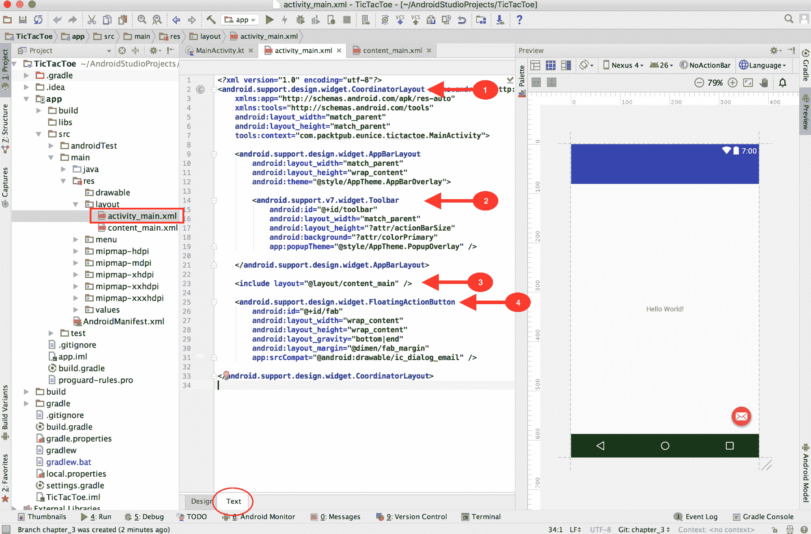
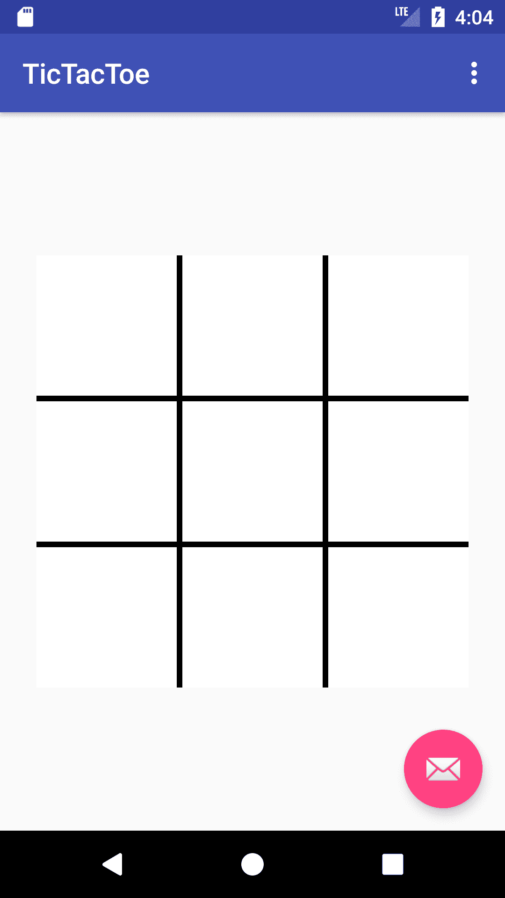
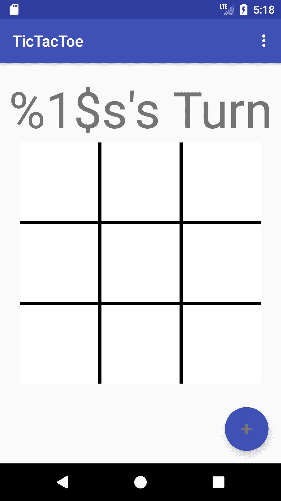

# 三、数据类型、变量和常量

在本章中，我们将开始构建我们的 TicTacToe 游戏，同时学习 Kotlin 中的数据类型、变量和常量。

到本章结束时，我们将拥有:

*   已检查应用的当前用户界面
*   为游戏设计用户界面
*   在 Kotlin 学习了基本类型

# 用户界面

在安卓系统中，应用用户界面的代码是用 XML 编写的，并存储在布局文件中。让我们来看看创建项目时创建的默认用户界面。

打开`res/layout/activity_main.xml`。确保在屏幕底部选择了文本。AndroidStudio 应该向您展示用户界面的 XML 代码，并在右侧进行预览:



If you don't see the preview on the right-hand side, enable it by going to View | Tool Windows | Preview.

现在，让我们看看主活动布局的独立元素:

1.  父元素是`CoordinatorLayout`。`CoordinatorLayout`是作为设计库的一部分引入安卓 5.0 的。它可以更好地控制子视图之间的触摸事件。我们已经看到当点击按钮时`SnackBar`出现在`FloatingActionButton`下(而不是覆盖它)的方式使这个功能发挥作用。

2.  标记为`2`的元素是`Toolbar`，它充当应用的顶部导航。它通常用于显示应用的标题、应用徽标、操作菜单和导航按钮。
3.  `include`标签用于将一个布局嵌入到另一个布局中。在这种情况下，`res/layout/content_main.xml`文件包含`TextView`(显示你好世界的那个！消息)我们在运行应用时会看到。我们的大部分 UI 更改将在`res/layout/content_main.xml`文件中完成。
4.  正如你可能已经注意到的那样，`FloatingActionButton`是一个浮动在屏幕上的可操作的`ImageView`。

# 构建我们的游戏界面

我们的 TicTacToe 游戏屏幕将由游戏板(3×3 网格)、显示轮到谁的`TextView`和用于重启游戏的`FloatingActionButton`组成。

我们将用一个`TableLayout`来设计游戏板。打开`res/layout/content_main.xml`文件，将`TextView`申报替换为`TableLayout`申报，如下图:

```kt
<TableLayout
    android:id="@+id/table_layout"
    android:layout_width="wrap_content"
    android:layout_height="wrap_content"
    app:layout_constraintBottom_toBottomOf="parent"
    app:layout_constraintLeft_toLeftOf="parent"
    app:layout_constraintRight_toRightOf="parent"
    app:layout_constraintTop_toTopOf="parent"
    android:gravity="center">

    <TableRow
        android:id="@+id/r0"
        android:layout_width="match_parent"
        android:layout_height="wrap_content"
        android:gravity="center_horizontal"
        android:background="@android:color/black">
        <TextView
            android:layout_width="100dp"
            android:layout_height="100dp"
            android:gravity="center"
            android:background="@android:color/white"
            android:layout_marginBottom="2dp"
            android:layout_marginTop="0dp"
            android:layout_column="0"
            android:layout_marginRight="2dp"
            android:layout_marginEnd="2dp"
            android:textSize="64sp"
            android:textColor="@android:color/black"
            android:clickable="true"/>
        <TextView
            android:layout_width="100dp"
            android:layout_height="100dp"
            android:gravity="center"
            android:background="@android:color/white"
            android:layout_marginBottom="2dp"
            android:layout_marginTop="0dp"
            android:layout_column="2"
            android:layout_marginRight="2dp"
            android:layout_marginEnd="2dp"
            android:textSize="64sp"
            android:textColor="@android:color/black"
            android:clickable="true"/>
        <TextView
            android:layout_width="100dp"
            android:layout_height="100dp"
            android:gravity="center"
            android:background="@android:color/white"
            android:layout_marginBottom="2dp"
            android:layout_marginTop="0dp"
            android:layout_column="2"
            android:layout_marginRight="2dp"
            android:layout_marginEnd="2dp"
            android:textSize="64sp"
            android:textColor="@android:color/black"
            android:clickable="true"/>
    </TableRow>

    </TableLayout>
```

这里需要注意一些事情:

*   `TableRow`元素代表表格的一行。从前面的代码中，该行的每个元素都由一个`TextView`表示。
*   每个`TextView`都有相似的属性。
*   前面的代码声明了一个 1x3 的表，换句话说，一个只有一行三列的表。既然我们想创建一个 3x3 的网格，我们就需要再添加两个`TableRow`元素。

前面的代码已经包含了大量重复的代码。我们需要找到一种方法来减少重复的数量。这就是`res/values`的作用。

在添加两个额外的`TableRow`元素之前，让我们更好地组织我们的代码。打开`res/values/styles.xml`并添加以下代码行:

```kt
<!--Table Row Attributes-->
<style name="TableRow">
    <item name="android:layout_width">match_parent</item>
    <item name="android:layout_height">wrap_content</item>
    <item name="android:gravity">center_horizontal</item>
    <item name="android:background">@android:color/black</item>
</style>

<!--General Cell Attributes-->
<style name="Cell">
    <item name="android:layout_width">100dp</item>
    <item name="android:layout_height">100dp</item>
    <item name="android:gravity">center</item>
    <item name="android:background">@android:color/white</item>
    <item name="android:layout_marginTop">@dimen/cell_margin</item>
    <item name="android:layout_marginBottom">@dimen/cell_margin</item>
    <item name="android:textSize">@dimen/large_text</item>
    <item name="android:textColor">@android:color/black</item>
    <item name="android:clickable">true</item>

</style>

<!--Custom Left Cell Attributes-->
<style name="Cell.Left">
    <item name="android:layout_column">0</item>
    <item name="android:layout_marginRight">@dimen/cell_margin</item>
</style>

<!--Custom Middle Cell Attributes-->
<style name="Cell.Middle">
    <item name="android:layout_column">1</item>
    <item name="android:layout_marginRight">@dimen/cell_margin</item>
    <item name="android:layout_marginLeft">@dimen/cell_margin</item>
</style>

<!--Custom Right Cell Attributes-->
<style name="Cell.Right">
    <item name="android:layout_column">2</item>
    <item name="android:layout_marginLeft">@dimen/cell_margin</item>
</style>
```

You can create child styles who inherit from the parent by naming them in the format **Parent.child**, for instance, `Cell.Left`, `Cell.Middle`, and `Cell.Right` all inherit the attributes of the `Cell` style. 

接下来，打开`res/values/dimens.xml`。这是您声明布局中使用的尺寸的地方。向资源元素添加以下代码行:

```kt
<dimen name="board_padding">16dp</dimen>
<dimen name="cell_margin">2dp</dimen>
<dimen name="large_text">64sp</dimen>
```

现在，打开`res/values/strings.xml`。这是您在应用中声明所需字符串资源的地方。在资源元素中添加以下代码行:

```kt
<string name="x">X</string>
<string name="o">O</string>
<string name="turn">%1$s\'s Turn</string>
<string name="winner">%1$s Won</string>
<string name="draw">It\'s a Draw</string>
```

然后，打开`res/layout/content_main.xml`文件，用以下内容替换`TableRow`声明:

```kt
<TableRow
    android:id="@+id/r0"
    style="@style/TableRow">
    <TextView
        style="@style/Cell.Left"
        android:layout_marginTop="0dp"/>
    <TextView
        style="@style/Cell.Middle"
        android:layout_marginTop="0dp"/>
    <TextView
        style="@style/Cell.Right"
        android:layout_marginTop="0dp"/>
</TableRow>
<TableRow
    android:id="@+id/r1"
    style="@style/TableRow">
    <TextView
        style="@style/Cell.Left"/>
    <TextView
        style="@style/Cell.Middle"/>
    <TextView
        style="@style/Cell.Right"/>
</TableRow>

<TableRow
    android:id="@+id/r2"
    style="@style/TableRow">

    <TextView
        style="@style/Cell.Left"
        android:layout_marginBottom="0dp"/>
    <TextView
        style="@style/Cell.Middle"
        android:layout_marginBottom="0dp"/>
    <TextView
        style="@style/Cell.Right"
        android:layout_marginBottom="0dp"/>
</TableRow>
```

我们现在已经声明了所有三行。如您所见，我们的代码看起来更有条理了。

构建并运行以查看到目前为止的进度:



让我们继续添加一个`TextView`，它将用于显示轮到谁了。打开`res/layout/activity_main.xml`并在`include`元素前添加以下`TextView`声明:

```kt
<TextView
    android:id="@+id/turnTextView"
    app:layout_behavior="@string/appbar_scrolling_view_behavior"
    android:layout_width="match_parent"
    android:layout_height="wrap_content"
    android:text="@string/turn"
    android:textSize="64sp"
    android:textAlignment="center"
    android:layout_marginTop="@dimen/fab_margin"/>
```

让我们通过替换以下代码来更改`FloatingActionButton`的图标和背景颜色:

```kt
app:srcCompat="@android:drawable/ic_dialog_email" 
```

带有以下内容:

```kt
app:srcCompat="@android:drawable/ic_input_add"
app:backgroundTint="@color/colorPrimary"
```

再次，构建并运行:



就这样。我们已经完成了用户界面设计。

# 基本类型

在 Kotlin 中，没有原始数据类型的概念。所有类型都是具有成员函数和属性的对象。

# 变量和常量

使用`var`关键字声明变量，使用`val`关键字声明常量。当声明变量或常量时，不必显式定义其类型。该类型将从上下文中推断出来。一`val`只能初始化一次。如果变量或常量被显式声明为可空类型，则只能为其分配空值。您可以通过在类型的末尾附加一个`?`来声明一个可空类型:

```kt
var a: String = "Hello"
var b = "Hello"

val c = "Constant"
var d: String? = null // nullable String

b = null // will not compile

b = 0 // will not compile
c = "changed" // will not compile
```

例如，在前面的代码中，`a`和`b`都将被视为`String`。当试图用推断类型重新分配变量时，不同类型的值将引发错误。A `val`只能初始化一次。

# 性能

在 Kotlin 中，只需通过名称引用属性就可以访问属性。虽然`getters`和`setters`不是必需的，但并不禁止你创建它们。物业的`getter`和/或`setter`可以作为其申报的一部分创建。如果物业为`val`，则不允许使用`setter`。属性需要在创建时初始化:

```kt
var a: String = ""              // required
    get() = this.toString()     // optional
    set(v) {                    // optional
        if (!v.isEmpty()) field = v
    }
```

让我们继续声明我们在`MainActivity`类中需要的几个属性:

```kt
var gameBoard : Array<CharArray> = Array(3) { CharArray(3) } // 1
var turn = 'X' // 2
var tableLayout: TableLayout? = null // 3
var turnTextView: TextView? = null // 4

```

1.  `gameBoard`是一个 3×3 的矩阵，代表一个单独的 TicTacToe 游戏棋盘。它将用于存储板上每个单元格的值。
2.  `turn`是一个 char，存储此时轮到谁，X 还是 o
3.  `tableLayout`是一个`android.widget.TableLayout`，将在`onCreate()`方法中使用 xml 布局中的视图进行初始化。
4.  `turnTextView`是一个`android.widget.TextView`，用来显示此刻轮到谁了。这也将在`onCreate()`方法中用 xml 布局中的视图初始化。

# 摘要

在本章中，我们为简单的 TicTacToe 游戏设计了用户界面。我们还学习了如何在 Kotlin 中处理变量和常量。

在下一章中，我们将继续学习类和对象，并开始为我们的游戏实现逻辑。