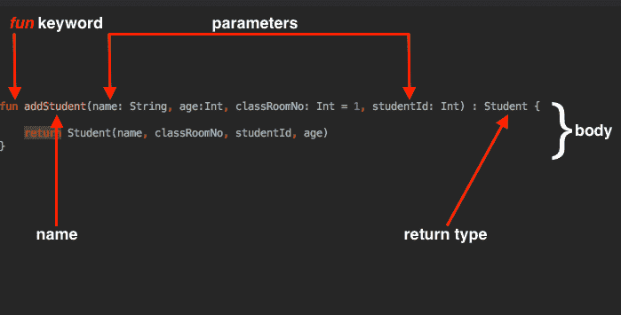
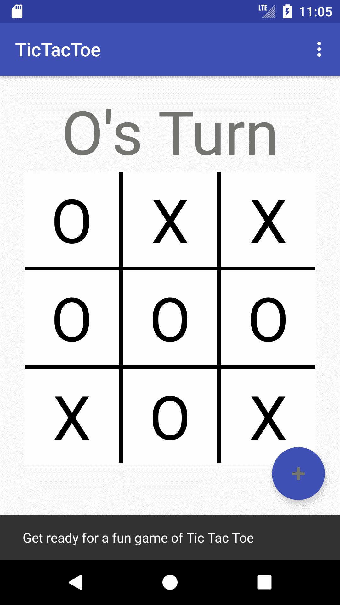
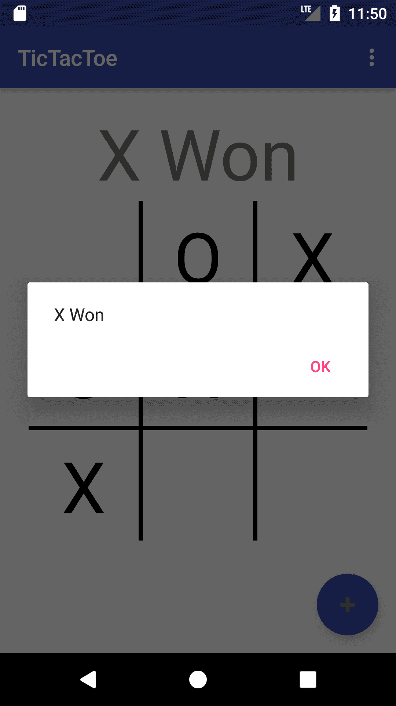
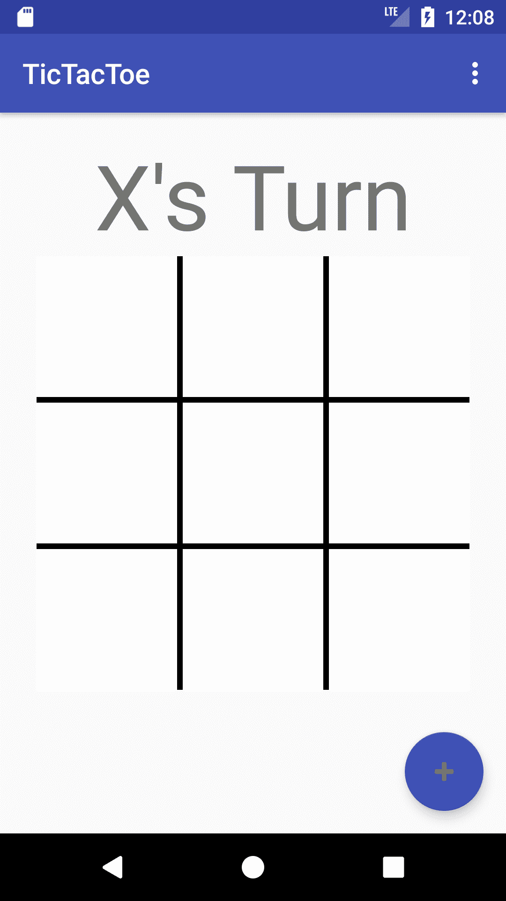

# 函数和 Lambdas

在本章中，我们将结束 TicTacToe 游戏的工作，同时学习 Kotlin 中的函数。

在此过程中，我们将:

*   了解函数
*   了解高阶函数以及如何使用它们
*   了解 lambdas 以及如何使用它们

# 功能

在 Kotlin 中，函数以下列格式声明:



**返回**类型和**参数**可选。默认情况下没有`return`类型的函数返回`Unit`。`Unit`相当于爪哇的`void`。

以单个表达式作为主体的函数也可以消除大括号:

```kt
fun addStudent(name: String, age:Int, classRoomNo: Int = 1, studentId: Int) : Student = Student(name, classRoomNo, studentId, age)
```

如果编译器可以推断出类型，`return`类型也可以省略:

```kt
fun addStudent(name: String, age:Int, classRoomNo: Int = 1, studentId: Int) = Student(name, classRoomNo, studentId, age)
```

# 因素

在Kotlin中，函数参数使用帕斯卡符号定义(**参数名:类型**)。必须显式声明每个参数的类型。可以在函数声明中为参数指定默认值。这是使用以下格式完成的:**参数名称:类型=默认值**。例如:

```kt
data class Student(var name: String, var classRoomNo: Int, var studentId: Int, var age: Int)

fun addStudent(name: String, age:Int, classRoomNo: Int = 1, studentId: Int) : Student {

 return Student(name, classRoomNo, studentId, age)
}

var anna = addStudent("Anna", 18, 2, 1)
var joseph = addStudent(name = "Joseph", age = 19, studentId = 2)
```

在示例中:

*   调用`addStudent()`功能时，可以省略`classRoomNo`参数。例如，`joseph`的默认`classRoomNo`值为`1`。
*   在没有将所有参数传递给函数的情况下，传递的参数必须以它们的参数名开头。

# 高阶函数和 lambdas

术语高阶函数是指将另一个函数作为参数或者返回一个函数或者两者都返回的函数。例如:

```kt
// 1
fun logStudent(name: String, age:Int, createStudent:(String, Int) -> Student) {
    Log.d("student creation", "About to create student with name $name")
    val student = createStudent(name, age)
    Log.d("student creation", "Student created with name ${student.name} and age ${student.age}")
}

// 2
logStudent(name = "Anna", age = 20, createStudent = { name: String, age: Int -> Student(name, 1, 3, age)})
```

这里`logStudent()`函数取三个参数:`name`、`age`和`createStudent`。`createStudent`是以一个`String`和一个`Int`为参数，返回一个`Student`对象的函数。

`createStudent`函数没有声明，而是作为表达式传递给`logStudent()`函数。这叫做一个**λ表达式**。

# λ表达式

lambda 表达式是一个匿名函数，它没有声明，而是作为表达式立即传递。

让我们继续在 TicTacToe 应用中使用 lambda 表达式。打开`MainActivity.kt`。在`startNewGame()`功能中，替换以下代码行:

```kt
cell.setOnClickListener(object : View.OnClickListener {
    override fun onClick(v: View?) {
        cellClickListener(i, j)
    }
})
```

用以下代码行替换它们:

```kt
cell.setOnClickListener { cellClickListener(i, j) } 
```

在前面的代码行中，我们有一个匿名对象，它实现了一个 Java 接口，该接口有一个抽象方法(`onClick()`)。所有这些都可以用一个简单的 lambda 表达式来代替。

A **Single Abstract Method** (**SAM**), as it is often called, refers to the functional method in an interface. The interface typically contains only one abstract method that is known as SAM or a functional method.

现在，构建并运行以查看应用的状态:



让我们继续，利用我们到目前为止所学的一切来完成游戏的工作。

Android Studio provides a default tool chain that supports most of the JAVA 8 features, including lambda expressions. It is highly recommended that you use the default tool chain and disable all other options such as jackoptions, and retrolambda.

# 实施游戏状态检查

在这一部分，我们将研究有助于我们找出游戏赢家的函数。

首先在`MainActivity`类中添加以下功能:

```kt
private fun isBoardFull(gameBoard:Array<CharArray>): Boolean {
    for (i in 0 until gameBoard.size) { 
        for (j in 0 until gameBoard[i].size) { 
            if(gameBoard[i][j] == ' ') {
                return false
            }
        }
    }
    return true
}
```

此功能用于检查游戏板是否已满。在这里，我们遍历板上的所有单元格，如果其中任何一个单元格为空，则返回`false`。如果没有空的单元格，我们返回`true`。

接下来，添加`isWinner()`方法:

```kt
private fun isWinner(gameBoard:Array<CharArray>, w: Char): Boolean {
    for (i in 0 until gameBoard.size) {
        if (gameBoard[i][0] == w && gameBoard[i][1] == w && 
        gameBoard[i][2] == w) {
            return true
        }

        if (gameBoard[0][i] == w && gameBoard[1][i] == w && 
        gameBoard[2][i] == w) {
            return true
        }
    }
    if ((gameBoard[0][0] == w && gameBoard[1][1] == w && gameBoard[2]
    [2] == w) ||
            (gameBoard[0][2] == w && gameBoard[1][1] == w && 
        gameBoard[2][0] == w)) {
        return true
    }
    return false
}
```

在这里，你检查通过的角色是否是赢家。如果该角色在水平、垂直或对角线行中出现三次，则该角色为赢家。

现在添加`checkGameStatus()`功能:

```kt
private fun checkGameStatus() {
    var state: String? = null
    if(isWinner(gameBoard, 'X')) {
        state = String.format(resources.getString(R.string.winner), 'X')
    } else if (isWinner(gameBoard, 'O')) {
        state = String.format(resources.getString(R.string.winner), 'O')
    } else {
        if (isBoardFull(gameBoard)) {
            state = resources.getString(R.string.draw)
        }
    }

    if (state != null) {
        turnTextView?.text = state
        val builder = AlertDialog.Builder(this)
        builder.setMessage(state)
        builder.setPositiveButton(android.R.string.ok, { dialog, id ->
            startNewGame(false)

        })
        val dialog = builder.create()
        dialog.show()

    }
}
```

前面的功能利用`isBoardFull()`和`isWinner()`功能来确定谁是游戏的赢家。如果 X 和 O 都没有赢，而且棋盘已经满了，那就是平局。显示一个警告，显示游戏的获胜者或一条消息，告诉用户游戏是平局。

接下来，在`cellClickListener()`函数的末尾添加对`checkGameStatus()`的调用。

构建并运行:



最后，实现**浮动动作按钮**的功能。在`onCreate()`功能中，替换如下内容:

```kt
fab.setOnClickListener { view -> HelloKotlin("Get ready for a fun game of Tic Tac Toe").displayKotlinMessage(view) }
```

替换为:

```kt
fab.setOnClickListener {startNewGame(false)}
```

再次，构建并运行。现在，当您点击**浮动动作按钮**时，棋盘将被清除，您可以重新开始游戏:



# 摘要

在这一章中，我们学习了如何在 Kotlin 中使用函数和 lambdas，并完成了 TicTacToe 游戏的工作。

在接下来的几章中，我们将致力于创建一个基于位置的警报，同时学习使用谷歌定位服务以及如何在安卓系统上执行网络呼叫。