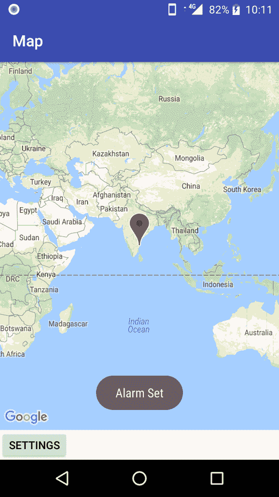
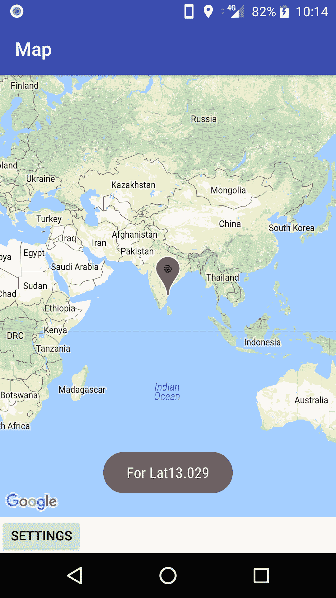
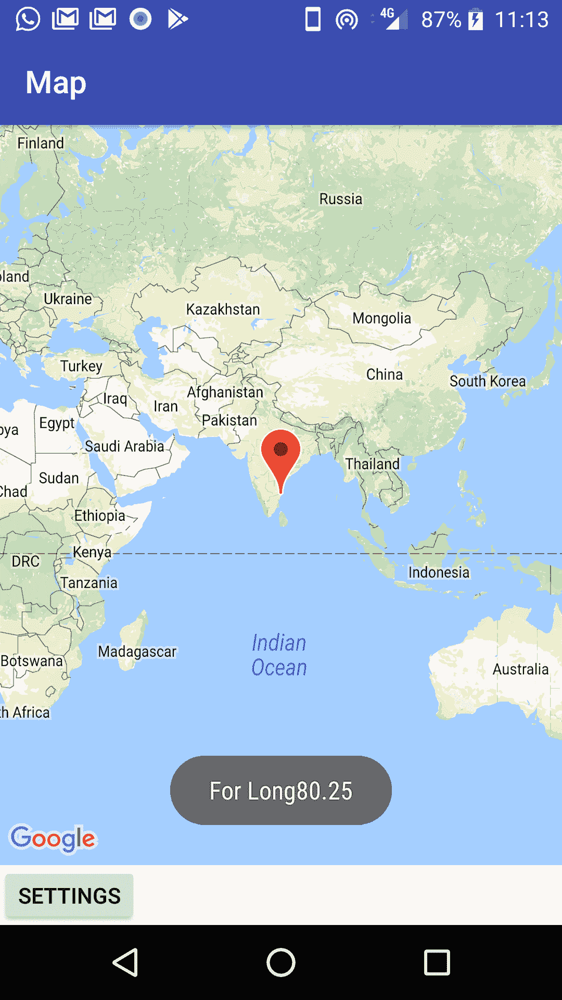
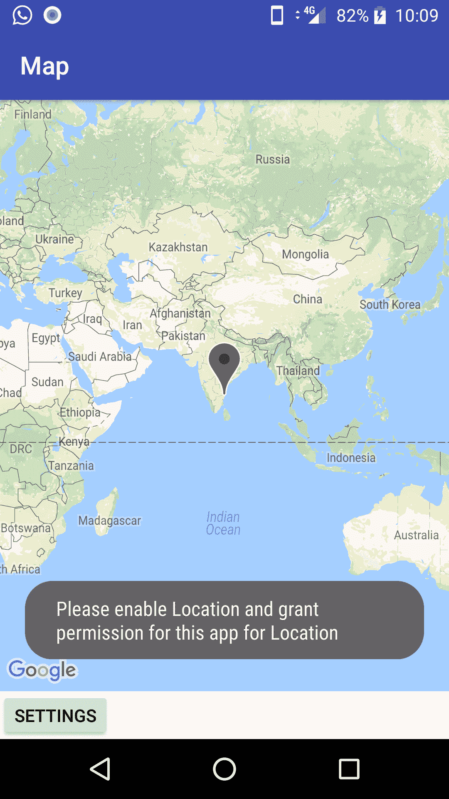
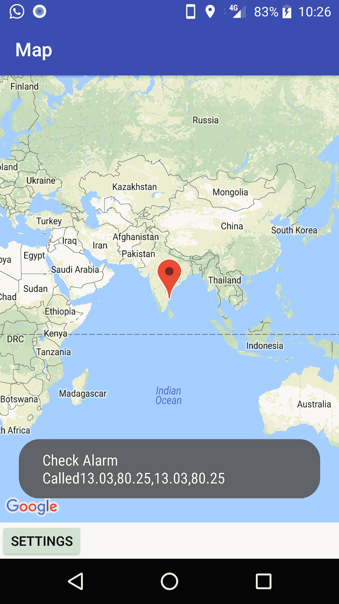
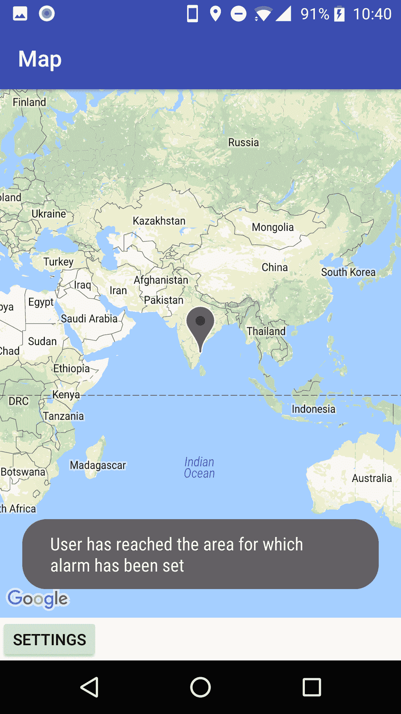

# 使用谷歌的定位服务

在前一章中，我们构建了我们的**基于位置的警报** ( **LBA** )应用，以包括谷歌地图，添加了标记和位置的定制，并且还构建了用于接收用户对警报的输入的用户界面。

我们现在将专注于谷歌位置应用编程接口与我们的应用的集成，并接收用户位置的更新。用户输入的感兴趣的位置将被保存，并与接收到的位置更新进行比较，以便当用户到达感兴趣的区域时触发警报。

谷歌提供了各种方法来访问和识别用户的位置。谷歌位置应用编程接口提供用户最后已知位置的信息，显示位置地址，接收位置变化的持续更新，等等。开发人员可以添加地理围栏(地理区域周围的围栏)，并且每当用户通过地理围栏时，都可以生成警报。

在本章中，我们将学习如何:

*   使用谷歌定位应用编程接口
*   接收用户当前位置的更新
*   利用用户共享的偏好来保持用户感兴趣的位置
*   当用户到达感兴趣的位置时，匹配并显示警报

本章的主要重点是介绍和解释我们的应用中位置的概念和用法。考虑到这个目标，这些概念是通过应用在前台运行时接收位置更新来解释的。所需权限的处理也以更简单的方式进行。

# 集成共享首选项

我们应用的用户将输入他们想要触发警报的期望位置。用户输入位置的`Lat`和`Lng`，为了我们将其与用户当前所在的位置进行比较，我们需要将他们输入的详细信息存储为所需的位置。

共享首选项是基于文件的存储，包含键值对，并提供了一种更简单的读写方式。共享首选项文件由安卓框架管理，文件可以是私有的，也可以是共享的。

让我们首先将共享首选项集成到我们的代码中，并保存用户在用户界面屏幕中为警报输入的纬度和经度。

共享首选项为我们提供了将数据保存为键值对的选项。虽然我们可以使用通用的共享首选项文件，但最好为我们的应用准备一个特定的共享首选项文件。

我们需要为我们的应用使用的共享首选项文件定义一个字符串。导航到 app | src | main | RES | values | strings . XML。让我们添加一个新字符串`PREFS_NAME`，并将其命名为`LocationAlarmFile`:

```kt
<resources>
     <string name="app_name">LocationAlarm</string>
     <string name="title_activity_maps">Map</string>
     <string name="Settings">Settings</string>
    <string name="PREFS_NAME">LocationAlarmFile</string> </resources>
```

我们将在我们的`SettingsActivity`类中添加以下代码来捕获用户输入，并将其保存在共享首选项文件中。共享首选项文件是通过引用资源文件中的字符串`PREFS_NAME`打开的，该文件是用`MODE_PRIVATE`打开的，这表明该文件仅适用于我们的应用。

文件可用后，我们打开编辑器，将用户输入的纬度和经度作为字符串共享，使用`putString`作为键值对:

```kt
val sharedPref = this?.getSharedPreferences(getString(R.string.PREFS_NAME),Context.MODE_PRIVATE) ?: return with(sharedPref.edit()){ putString("userLat", Lat?.text.toString())
     putString("userLang",Lang?.text.toString())
     commit()
```

要从共享首选项读取和显示:

```kt
      val sharedPref = 
 this?.getSharedPreferences(getString(R.string.PREFS_NAME), 
      Context.MODE_PRIVATE) ?: return AlarmLat = 
     java.lang.Double.parseDouble(sharedPref.getString("userLat",   
 "13.07975"))
         AlarmLong = 
     java.lang.Double.parseDouble(sharedPref.getString("userLang", 
 "80.1798347"))
```

用户会收到警报:



用户输入的纬度从共享首选项中存储和读取并显示:



用户输入的经度也从共享首选项中读取并显示:



# 添加权限

谷歌游戏服务提供基于位置的服务，我们的应用可以集成和使用这些服务。添加位置服务并使用它们需要从用户处识别和获取位置更新的权限。

要使用播放服务中的谷歌定位服务，我们需要在`build.gradle`文件中包含`play-services-location`:

```kt
dependencies {
    compile 'com.google.android.gms:play-services-location:11.8.0'
}
```

It is important to include **only** the specific feature required for the app from Google Play Services. For example, here we require location services, so we need to specify the services for the location. Including all Google Play Services will make the app size huge; ask for permissions that are not really required for the app.

我们还需要在我们的`AndroidManifest.xml`文件中添加访问精细位置的权限。这使我们能够从网络提供商和全球定位系统提供商处获得位置详细信息:

```kt
 <uses-permission android:name="android.permission.ACCESS_FINE_LOCATION" />
```

在运行时，我们需要检查设备是否启用了位置；如果没有，我们将显示一条消息，请求用户启用该位置并授予该应用的权限。

`checkLocation`布尔函数确定设备是否为我们启用了位置:

```kt
private fun checkLocation(): Boolean {
         if(!isLocationEnabled())
             Toast.makeText(this,"Please enable Location and grant permission for this app for Location",Toast.LENGTH_LONG).show()
         return isLocationEnabled();
     }

private fun isLocationEnabled(): Boolean {
     locationManager = getSystemService(Context.LOCATION_SERVICE) as 
     LocationManager
     return locationManager.isProviderEnabled(LocationManager.GPS_PROVIDER) || locationManager.isProviderEnabled(LocationManager.NETWORK_PROVIDER)
 }
```



# 位置应用编程接口的集成

我们将把位置应用编程接口集成到我们的应用中，以接收位置更新。位置 API 的集成涉及到代码中的一些变化。让我们详细讨论一下。

# 类和变量

谷歌位置应用编程接口的集成需要`GoogleAPIClient`、`ConnectionCallbacks`的实现，以及`MapsActivity`连接失败的监听器。让我们继续对`MapsActivity`进行更改。之前我们有`MapsActivity`扩展`AppCompatActivity`实现`OnMapReadyCallback`接口。现在，由于我们需要使用位置 API，我们还必须实现`GoogleAPIClient`、`ConnectionCallbacks`和`onConnectionFailedListener`，如下所示:

```kt
class MapsActivity : AppCompatActivity(), OnMapReadyCallback ,GoogleApiClient.ConnectionCallbacks, GoogleApiClient.OnConnectionFailedListener, com.google.android.gms.location.LocationListener {
```

我们声明`GoogleMap`所需的变量和其他变量，以存储从用户和位置 API 接收的纬度和经度:

```kt
    private lateinit var mMap: GoogleMap
    private var newLat: Double? = null
    private var newLang: Double? = null
    private var chennai: LatLng? = null

    private var AlarmLat: Double? = null
    private var AlarmLong: Double? = null
    private var UserLat: Double? = null
    private var UserLong: Double? = null

     //location variablesprivate val TAG = "MapsActivity" private lateinit var mGoogleApiClient: GoogleApiClient
    private var mLocationManager: LocationManager? = null
    lateinit var mLocation: Location
    private var mLocationRequest: LocationRequest? = null
```

我们声明`UPDATE_INTERVAL`，我们希望从位置 API 接收更新的时间间隔，以及`FASTEST_INTERVAL`，我们的应用可以处理更新的速率。我们还声明了`LocationManager`变量:

```kt
 private val UPDATE_INTERVAL = 10000.toLong() // 10 seconds rate at 
     //  which we would like to receive the updates
     private val FASTEST_INTERVAL: Long = 5000 // 5 seconds - rate at  
     //  which app can handle the update lateinit var locationManager: LocationManager
```

在`onCreate`功能中，我们为用户界面设置内容视图，并确保`GoogleApiClient`被实例化。我们还要求用户启用如下位置:

`onCreate()`:

```kt
   override fun onCreate(savedInstanceState: Bundle?) {
         super.onCreate(savedInstanceState)
         setContentView(R.layout.*activity_maps*)
         // Obtain the SupportMapFragment and get notified when the map    
         is ready to be used. val mapFragment = *supportFragmentManager
                * .findFragmentById(R.id.*map*) as SupportMapFragment
         mapFragment.getMapAsync(this)

         mGoogleApiClient = GoogleApiClient.Builder(this)
                 .addConnectionCallbacks(this)
                 .addOnConnectionFailedListener(this)
                 .addApi(LocationServices.API)
                 .build()

         mLocationManager =   
 this.getSystemService(Context.LOCATION_SERVICE) as  
         LocationManager
         checkLocation()
 }
```

# 谷歌应用编程接口客户端

声明、初始化和管理谷歌应用编程接口客户端的连接选项将与安卓应用的生命周期事件一起处理。一旦建立连接，我们还需要获取位置更新。

在`onStart`方法中，我们检查`mGoogleAPIClient`实例是否不为空，并请求启动连接:

```kt
   override fun onStart() {
         super.onStart();
         if (mGoogleApiClient != null) {
             mGoogleApiClient.connect();
         }
     }
```

在`onStop`方法中，我们检查`mGoogleAPIClient`实例是否连接，如果连接，我们称之为`disconnect`方法:

```kt
    override fun onStop() {
         super.onStop();
         if (mGoogleApiClient.isConnected()) {
             mGoogleApiClient.disconnect();
         }
     }
```

如果出现问题，连接被暂停，我们通过`onConnectionSuspended`方法请求重新连接:

```kt
     override fun onConnectionSuspended(p0: Int) {

         Log.i(TAG, "Connection Suspended");
         mGoogleApiClient.connect();
     }
```

如果谷歌定位应用编程接口无法建立连接，我们会通过获取错误代码来记录原因:

```kt
     override fun onConnectionFailed(connectionResult: 
        ConnectionResult) {
     Log.i(TAG, "Connection failed. Error: " + 
        connectionResult.getErrorCode());
     }
```

在`onConnected`方法中，我们首先检查`ACCESS _FINE_LOCATION`的许可，并且`ACCESS_COARSE_LOCATION`确实存在于清单文件中。

一旦我们确保权限被授予，我们就调用`startLocationUpdates()`方法:

```kt
override fun onConnected(p0: Bundle?) {

         if (ActivityCompat.checkSelfPermission(this,   
            Manifest.permission.ACCESS_FINE_LOCATION) != 
            PackageManager.PERMISSION_GRANTED && 
            ActivityCompat.checkSelfPermission(this, 
            Manifest.permission.ACCESS_COARSE_LOCATION) != 
            PackageManager.PERMISSION_GRANTED) {

             return;
         }
         startLocationUpdates();
```

`fusedLocationProviderClient`提供当前位置的详细信息，并将其分配给`mLocation`变量:

```kt
var fusedLocationProviderClient :
         FusedLocationProviderClient =   
         LocationServices.getFusedLocationProviderClient(this);
         fusedLocationProviderClient .getLastLocation()
         .addOnSuccessListener(this, OnSuccessListener<Location> {   
         location ->
                     if (location != null) {
                         mLocation = location;
 } }) }
```

`startLocationUpdates`创建`LocationRequest`实例，并提供我们为更新设置的参数。我们也致电`FusedLocationAPI`并请求位置更新:

```kt

 protected fun startLocationUpdates() {
          // Create the location request mLocationRequest = LocationRequest.create()
                 .setPriority(LocationRequest.PRIORITY_HIGH_ACCURACY)
                 .setInterval(UPDATE_INTERVAL)
                 .setFastestInterval(FASTEST_INTERVAL);
         // Request location updates if (ActivityCompat.checkSelfPermission(this, 
          Manifest.permission.ACCESS_FINE_LOCATION) !=   
          PackageManager.PERMISSION_GRANTED && 
          ActivityCompat.checkSelfPermission(this, 
          Manifest.permission.ACCESS_COARSE_LOCATION) != 
          PackageManager.PERMISSION_GRANTED) {
             return;
         }

      LocationServices.FusedLocationApi.requestLocationUpdates(
 mGoogleApiClient, mLocationRequest, this);
     }

```

`onLocationChanged`方法是我们获取用户当前位置细节的重要方法。我们还从共享首选项中读取用户为警报输入的纬度和经度。一旦我们得到两组细节，我们就调用`CheckAlarmLocation`方法，该方法匹配纬度/经度，并在用户到达感兴趣区域时提醒用户:

```kt
override fun onLocationChanged(location: Location) { 
        val sharedPref =  
 this?.getSharedPreferences(getString(R.string.*PREFS_NAME*), 
      Context.*MODE_PRIVATE*)
           ?: return
        AlarmLat = 
      java.lang.Double.parseDouble(sharedPref.getString("userLat", 
 "13.07975"))
        AlarmLong = 
      java.lang.Double.parseDouble(sharedPref.getString("userLang", 
 "80.1798347"))

         UserLat = location.latitude
 UserLong = location.longitude
 val AlarmLat1 = AlarmLat val AlarmLong1 = AlarmLong
         val UserLat1 = UserLat
         val UserLong1 = UserLong

         if(AlarmLat1 != null && AlarmLong1 != null && UserLat1 != null 
         && UserLong1 != null){

      checkAlarmLocation(AlarmLat1,AlarmLong1,UserLat1,UserLong1)
         }
     }
```



# 匹配位置

`startLocationUpdates`方法按照我们设置的时间间隔连续提供用户当前的经纬度。我们需要使用获得的经纬度信息，并需要将其与用户为警报输入的经纬度进行比较。

当用户进入感兴趣的位置时，我们会显示一条警告消息，提示用户已到达设置了警报的区域:

```kt
fun checkAlarmLocation(AlarmLat : Double, AlarmLong : Double, UserLat : Double,UserLong : Double) {

    Toast.makeText(this,"Check Alarm Called" + AlarmLat + "," + AlarmLong + "," + UserLat + "," + UserLong,Toast.*LENGTH_LONG* ).show()

         var LatAlarm: Double
         var LongAlarm: Double
         var LatUser: Double
         var LongUser: Double

         LatAlarm = Math.round(AlarmLat * 100.0) / 100.0;
         LongAlarm = Math.round(AlarmLong * 100.0) / 100.0;

         LatUser = Math.round(UserLat * 100.0) / 100.0;
         LongUser = Math.round(UserLong * 100.0) / 100.0;

Toast.makeText(this,"Check Alarm Called" + LatAlarm + "," + LongAlarm + "," + LatUser + "," + LongUser,Toast.*LENGTH_LONG* ).show()

         if (LatAlarm == LatUser && LongAlarm == LongUser) {
             Toast.makeText(this, "User has reached the area for which 
             alarm has been set", Toast.LENGTH_LONG).show();
         }
     }
```



# 摘要

在本章中，我们继续开发基于位置的报警应用，以利用谷歌游戏服务中的谷歌位置应用接口，并利用当用户进入感兴趣的区域时提供警报的功能。

我们学习了如何使用共享首选项来保持用户输入的数据，检索相同的数据，并使用位置 API 将用户的当前位置与感兴趣的区域相匹配。