# 十、开发简单的待办事项应用

在本章中，我们将构建一个简单的待办事项应用，允许用户添加、更新和删除任务。

在此过程中，我们将了解以下内容:

*   如何在 Android Studio 中构建用户界面
*   使用列表视图
*   如何使用对话框

# 创建项目

让我们从在 AndroidStudio 创建一个名为 TodoList 的新项目开始。在“向移动设备添加活动”屏幕上选择“不添加活动”:

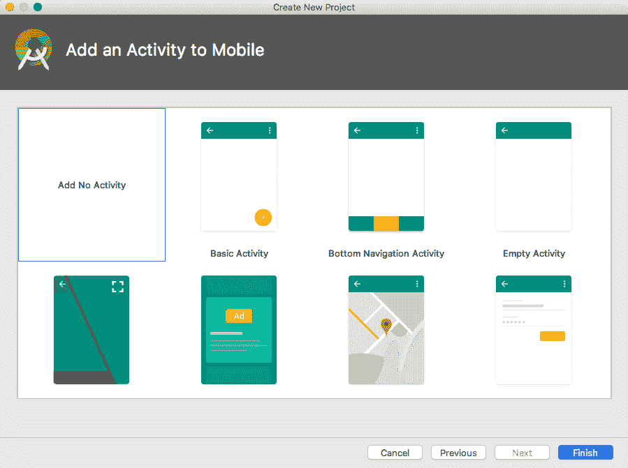

项目创建完成后，通过选择文件|新建|Kotlin 活动来创建 Kotlin 活动，如下图所示:

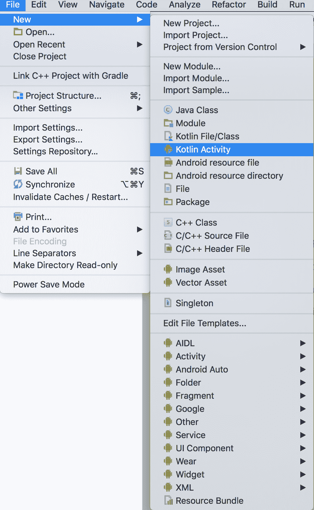

这将启动一个新的安卓活动向导**。**在“向手机添加活动”屏幕上，选择“基本活动”，如下图所示:

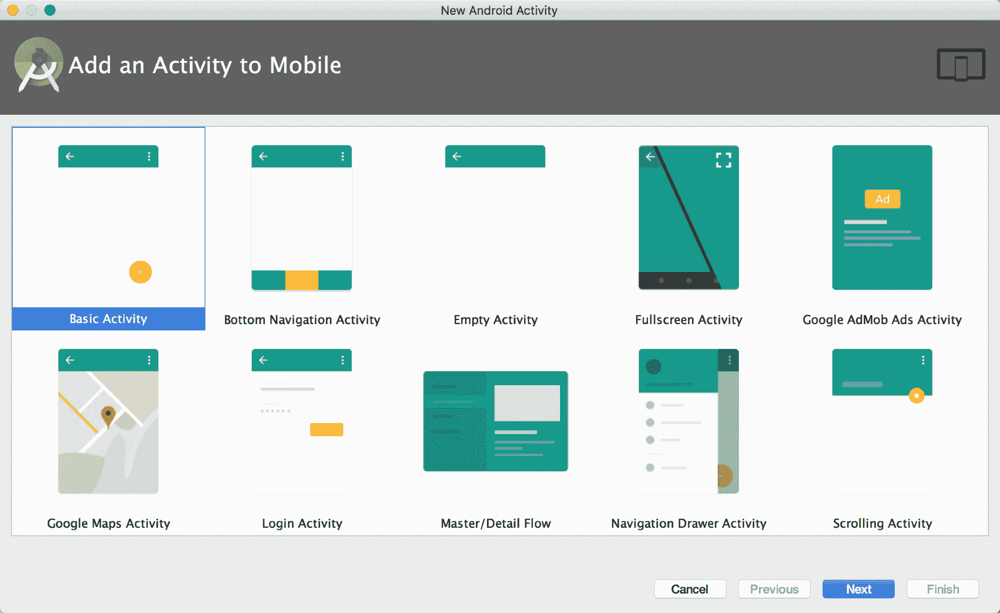

现在，在自定义活动屏幕上选中启动器活动，然后单击完成按钮:

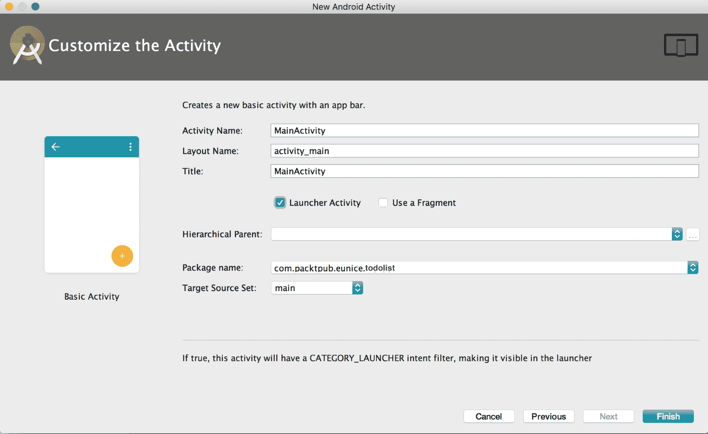

# 构建用户界面

在安卓系统中，用户界面的代码是用 XML 编写的。您可以通过执行以下任一操作来构建用户界面:

*   使用 AndroidStudio 布局编辑器
*   手工编写 XML 代码

让我们开始设计我们的 TodoList 应用。

# 使用 AndroidStudio 布局编辑器

AndroidStudio 提供了一个布局编辑器，通过将小部件拖动到可视化编辑器中，您可以构建自己的布局。这将自动为您的用户界面生成 XML 代码。

打开`content_main.xml`文件。

确保选择了屏幕底部的“设计”选项卡，如下图所示:

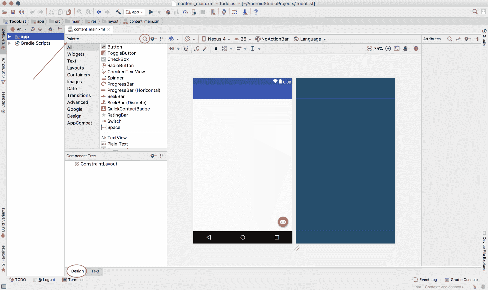

要将组件添加到布局中，只需从屏幕左侧的调色板中拖动项目。要查找组件，请滚动调色板上的项目，或者单击调色板搜索图标并搜索所需的项目。

If the Palette is not showing on your screen, select View | Tool Windows | Palette to display it.                                         

继续，在您的视图中添加一个`ListView`。选择视图后，其属性将显示在屏幕右侧的 XML 属性编辑器中。属性编辑器允许您查看和编辑选定组件的属性。继续进行以下更改:

*   将标识设置为列表视图
*   将布局宽度和布局高度属性都更改为 match_parent

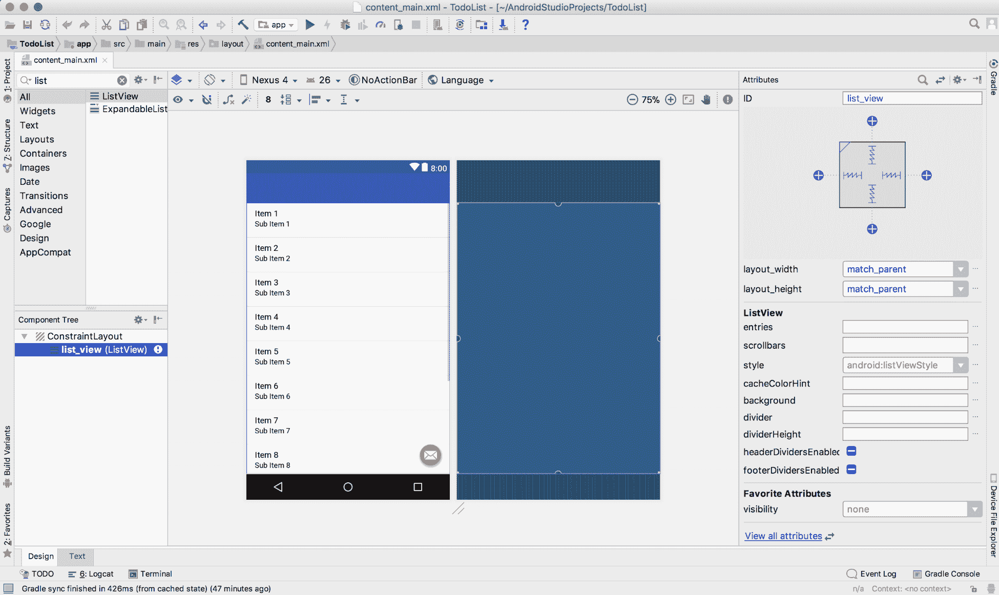

If the Attributes editor is not showing; select View | Tool Windows | Attributes to display it.                                                             

现在，选择编辑器窗口底部的文本来查看生成的 XML 代码。您会注意到，XML 代码现在在`ConstraintLayout` : 中有一个`ListView`

```kt
<?xml version="1.0" encoding="utf-8"?>
<android.support.constraint.ConstraintLayout xmlns:android="http://schemas.android.com/apk/res/android"
    xmlns:app="http://schemas.android.com/apk/res-auto"
    xmlns:tools="http://schemas.android.com/tools"
    android:layout_width="match_parent"
    android:layout_height="match_parent"
    app:layout_behavior="@string/appbar_scrolling_view_behavior"
    tools:context="com.packtpub.eunice.todolist.MainActivity"
    tools:showIn="@layout/activity_main">

    <ListView
        android:id="@+id/list_view"
        android:layout_width="match_parent"
        android:layout_height="match_parent"
        tools:layout_editor_absoluteX="4dp"
        tools:layout_editor_absoluteY="8dp" />
</android.support.constraint.ConstraintLayout>
```

A layout always has a root element. In the preceding code, `ConstraintLayout` is the root element.

您可以自己编写前面的代码，而不是使用布局编辑器。使用布局编辑器还是编写 XML 代码取决于您。你可以使用你最喜欢的选项。我们将继续增加用户界面。

现在，构建并运行您的代码。如下图所示:


如您所见，该应用目前没有太多内容。让我们继续，再加点肉。

由于我们将使用`FloatingActionButton`作为用户用来向他们的待办事项列表添加新项目的按钮，我们需要将其图标更改为一个目的非常明确的图标。

打开`activity_main.xml`文件:

`android.support.design.widget.FloatingActionButton`的属性之一是`app:srcCompat`。用于指定**浮动动作按钮**的图标。将其值从`@android:drawable/ic_dialog_email`更改为`@android:drawable/ic_input_add`。

再次构建并运行。底部的**浮动动作按钮**现在看起来像一个添加图标，如下图所示:

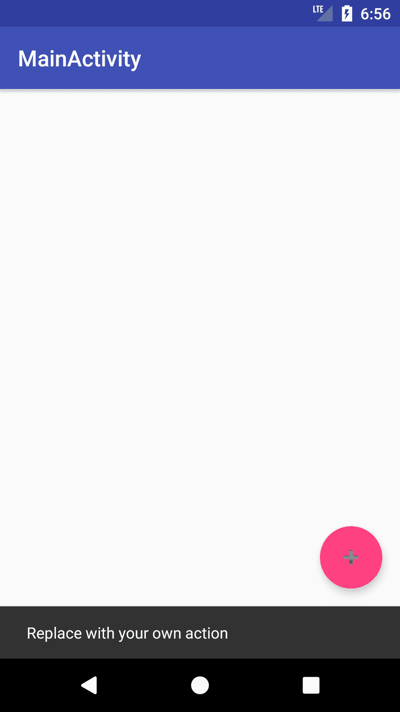

# 向用户界面添加功能

此时，当用户点击添加按钮时，屏幕底部会显示一个滚动条。这是因为`onCreate()`方法中的一段代码定义了一个`OnClickListener`并将其设置为`FloatingActionButton`:

```kt
fab.setOnClickListener { view ->
    Snackbar.make(view, "Replace with your own action", Snackbar.LENGTH_LONG)
            .setAction("Action", null).show()
}
```

这对于我们的待办事项应用来说并不理想。让我们在`MainActivity`类中创建新的方法来处理点击事件:

```kt
fun showNewTaskUI() {
}
```

该方法当前不执行任何操作。我们将很快添加代码来显示适当的用户界面。现在，用对新方法的调用替换`setOnClickListener()`调用中的代码:

```kt
fab.setOnClickListener { showNewTaskUI() }
```

# 添加新任务

为了添加新任务，我们将向用户显示一个带有可编辑字段的警报对话框。

让我们从为对话框构建用户界面开始。右键点击`res/layout`目录，选择**新建** | **布局资源文件**，如下图截图所示:

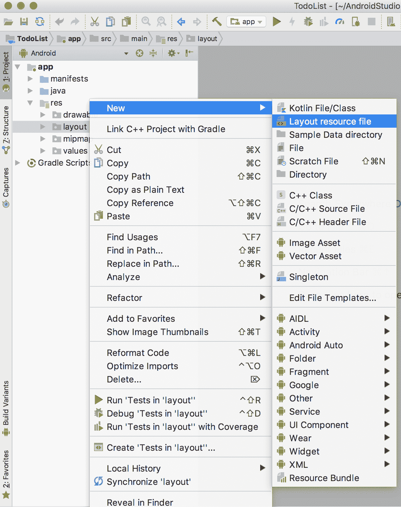

在“新建资源文件”窗口中，将根元素更改为`LinearLayout`，并将文件名设置为`dialog_new_task`。单击“确定”创建布局，如下图所示:

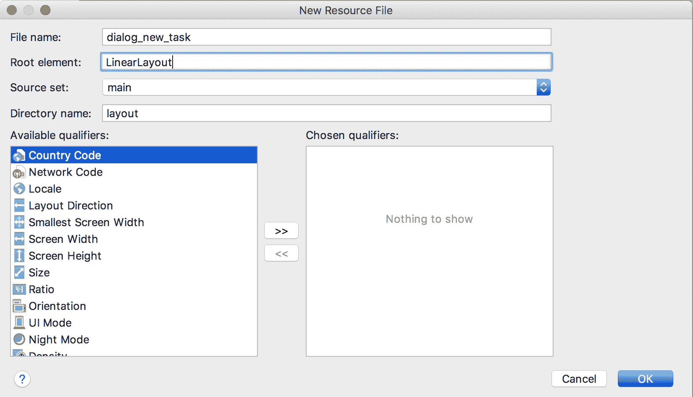

打开`dialog_new_task`布局，给`LinearLayout`添加一个`EditText`视图。布局中的 XML 代码现在应该如下所示:

```kt
<?xml version="1.0" encoding="utf-8"?>
<LinearLayout xmlns:android="http://schemas.android.com/apk/res/android"
    android:orientation="vertical" android:layout_width="match_parent"
    android:layout_height="match_parent">

    <EditText
        android:id="@+id/task"
        android:layout_width="match_parent"
        android:layout_height="wrap_content"
        android:inputType="text"/>

</LinearLayout>
```

The inputType attribute is used to specify what kind of data the field can take. By specifying this attribute, the user is shown an appropriate keyboard. For example, if the inputType is set to number, the numbers keyboard is displayed:

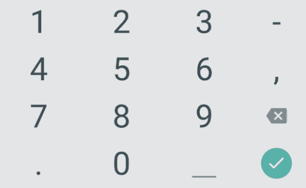

现在，让我们继续添加下一节需要的一些字符串资源。打开`res/values/strings.xml`文件，在`resources`标签中添加以下几行代码:

```kt
<string name="add_new_task_dialog_title">Add New Task</string>
<string name="save">Save</string>
```

*   `add_new_task_dialog_title`字符串将用作我们对话框的标题
*   `save`字符串将用作对话框上按钮的文本

使用`AlertDialog`的最好方法是将其封装在`DialogFragment`中。`DialogFragment`消除了处理对话框生命周期事件的负担。它还使您在其他活动中重用对话框变得容易。

创建一个名为`NewTaskDialogFragment`的新 Kotlin 类，并用以下代码行替换该类定义:

```kt
class NewTaskDialogFragment: DialogFragment() {  // 1

    // 2
    interface NewTaskDialogListener {
        fun onDialogPositiveClick(dialog: DialogFragment, task: String)
        fun onDialogNegativeClick(dialog: DialogFragment)
    }

    var newTaskDialogListener: NewTaskDialogListener? = null  // 3

    // 4
    companion object {
        fun newInstance(title: Int): NewTaskDialogFragment {

            val newTaskDialogFragment = NewTaskDialogFragment()
            val args = Bundle()
            args.putInt("dialog_title", title)
            newTaskDialogFragment.arguments = args
            return newTaskDialogFragment
        }
    }

    override fun onCreateDialog(savedInstanceState: Bundle?): Dialog {  // 5
        val title = arguments.getInt("dialog_title")
        val builder = AlertDialog.Builder(activity) 
        builder.setTitle(title) 

        val dialogView =    
     activity.layoutInflater.inflate(R.layout.dialog_new_task, null) 
        val task = dialogView.findViewById<EditText>(R.id.task)

        builder.setView(dialogView)
                .setPositiveButton(R.string.save, { dialog, id ->
                    newTaskDialogListener?.onDialogPositiveClick(this, 
                 task.text.toString);
                })
                .setNegativeButton(android.R.string.cancel, { dialog, 
                 id ->
                    newTaskDialogListener?.onDialogNegativeClick(this)
                })
        return builder.create()
     }

  override fun onAttach(activity: Activity) { // 6
        super.onAttach(activity)
        try {
            newTaskDialogListener = activity as NewTaskDialogListener  
        } catch (e: ClassCastException) {
            throw ClassCastException(activity.toString() + " must  
            implement NewTaskDialogListener")
        }

    }
}
```

让我们仔细看看这门课的内容:

1.  该类扩展了`DialogFragment`类。
2.  它声明了一个名为`NewTaskDialogListener`的接口，该接口声明了两种方法:
    *   `onDialogPositiveClick(dialog: DialogFragment, task: String)`
    *   `onDialogNegativeClick(dialog: DialogFragment)`
3.  它声明一个类型为`NewTaskDialogListener`的变量。
4.  它在伴随对象中定义了一个方法`newInstance()`。通过这样做，无需创建`NewTaskDialogFragment`类的实例就可以访问该方法。`newInstance()`方法如下:
    *   它采用名为`title`的`Int`参数
    *   它创建`NewTaskDialogFragment`的一个实例，并将`title`作为其参数的一部分传递
    *   它返回`NewTaskDialogFragment`的新实例
5.  它覆盖了`onCreateDialog()`方法。此方法执行以下操作:
    *   它试图检索传递的标题参数
    *   它实例化一个`AlertDialog`生成器，并将检索到的标题指定为对话框的标题
    *   它使用`DialogFragment`实例的父活动的`LayoutInflater`来扩展我们创建的布局
    *   然后，它将膨胀的视图设置为对话框的视图
    *   为对话框设置两个按钮:**保存**和**取消**
    *   当点击**保存**按钮时，`EditText`中的文本将被检索并通过`onDialogPositiveClick()`方法传递给`newTaskDialogListener`变量
6.  在`onAttach()`方法中，我们尝试将`Activity`对象分配给之前创建的`newTaskDialogListener`变量。为此，`Activity`对象应该实现`NewTaskDialogListener`接口。

现在，开启`MainActivity`课。更改类声明以包括`NewTaskDialogListener`的实现。您的类声明现在应该如下所示:

```kt
class MainActivity : AppCompatActivity(), NewTaskDialogFragment.NewTaskDialogListener {
```

并且，通过将以下方法添加到`MainActivity`类来添加在`NewTaskDialogListener`中声明的方法的实现:

```kt
    override fun onDialogPositiveClick(dialog: DialogFragment, task:String) {
    }

    override fun onDialogNegativeClick(dialog: DialogFragment) {
    }
```

在`showNewTaskUI()`方法中，添加以下代码行:

```kt
val newFragment = NewTaskDialogFragment.newInstance(R.string.add_new_task_dialog_title)
newFragment.show(fragmentManager, "newtask")
```

在前面的代码行中，`NewTaskDialogFragment`中的`newInstance()`方法被调用来生成一个`NewTaskDialogFragment`类的实例。然后调用`DialogFragment`的`show()`方法显示对话框。

构建并运行。现在，当您单击添加按钮时，您应该会在屏幕上看到一个对话框，如下图所示:

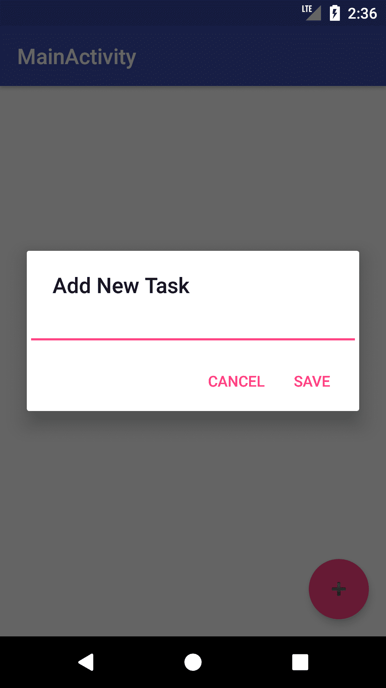

您可能已经注意到，当您单击“保存”按钮时，不会发生任何事情。在`onDialogPositiveClick()`方法中，添加如下所示的代码行:

```kt
Snackbar.make(fab, "Task Added Successfully", Snackbar.LENGTH_LONG).setAction("Action", null).show()
```

我们可能还记得，这一行代码在屏幕底部显示一个滚动条。

构建并运行。现在，当您点击**新任务**对话框上的保存按钮时，屏幕底部会显示一个滚动条。


我们目前没有存储用户输入的任务。让我们创建一个集合变量来存储用户添加的任何任务。在`MainActivity`类中，添加一个类型为`ArrayList<String>`的新变量，并用一个空的`ArrayList`实例化它:

```kt
private var todoListItems = ArrayList<String>()
```

在`onDialogPositiveClick()`方法中，将以下代码行放在方法定义的开头:

```kt
todoListItems.add(task)
listAdapter?.notifyDataSetChanged()
```

这将添加传递给`todoListItems`数据的任务变量，并调用`listAdapter`上的`notifyDataSetChanged()`来更新`ListView`。

保存数据很棒，但是我们的`ListView`还是空的。让我们继续纠正这一点。

# 在列表视图中显示数据

要更改 XML 布局中的用户界面元素，您需要使用`findViewById()`方法在布局的相应`Activity`中检索该元素的实例。这通常在`Activity`的`onCreate()`方法中完成。

打开`MainActivity.kt`，在类的顶部声明一个新的`ListView`实例变量:

```kt
private var listView: ListView? = null
```

接下来，用布局中相应的元素实例化`ListView`变量。为此，在`onCreate()`方法的末尾添加以下代码行:

```kt
listView = findViewById(R.id.list_view)
```

要在`ListView`中显示数据，您需要创建一个`Adapter`，并给它要显示的数据以及如何显示该数据的信息。根据您希望数据如何显示在您的`ListView`中，您可以使用现有的安卓适配器之一，或者创建自己的。现在，我们将使用最简单的安卓适配器之一`ArrayAdapter`。`ArrayAdapter`获取一个项目数组或列表，一个布局标识，并根据传递给它的布局显示您的数据。

在`MainActivity`类中，添加一个类型为`ArrayAdapter`的新变量:

```kt
private var listAdapter: ArrayAdapter<String>? = null

```

将此处显示的方法添加到类中:

```kt
private fun populateListView() {
    listAdapter = ArrayAdapter(this, android.R.layout.simple_list_item_1, todoListItems)
    listView?.adapter = listAdapter
}
```

在前面几行代码中，我们创建了一个简单的`ArrayAdapter`，并将其分配给`listView`作为其`Adapter`。

现在，在`onCreate()`方法中添加对前一个方法的调用:

```kt
populateListView()
```

构建并运行。现在，当您单击添加按钮时，您将看到您的条目显示在列表视图上，如下图所示:

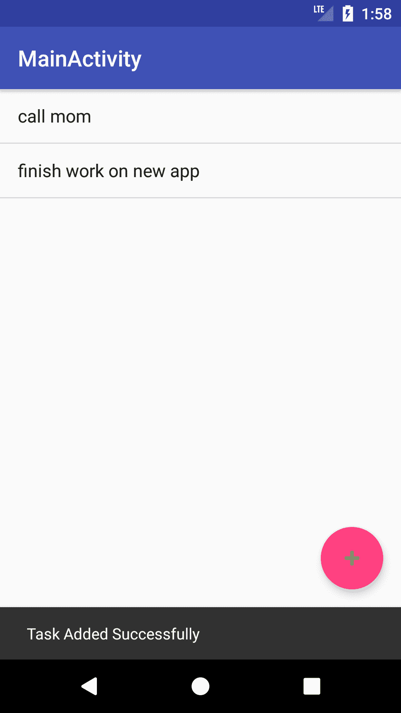

# 更新/删除 Todo 项目

如果用户在输入新任务时出错了怎么办？我们需要提供一种方法，让他们能够编辑列表项，或者完全删除该项。我们可以提供仅在用户单击某个项目时显示的菜单项。菜单项将为用户提供编辑或删除相关项目的机会。

如果用户选择编辑选项，我们将显示我们的任务对话框，其中任务字段已为用户预填充，以进行所需的更改。

让我们从向`strings.xml`资源文件添加以下字符串集开始:

```kt
<string name="update_task_dialog_title">Edit Task</string>
<string name="edit">Edit</string>
<string name="delete">Delete</string>
```

接下来我们需要做的是给我们的用户界面添加一个菜单。

# 添加菜单

让我们从创建菜单资源文件开始。右键点击`res`目录，选择新建|安卓资源文件。输入`to_do_list_menu`作为文件名。将资源类型更改为菜单，然后单击确定，如下图所示:

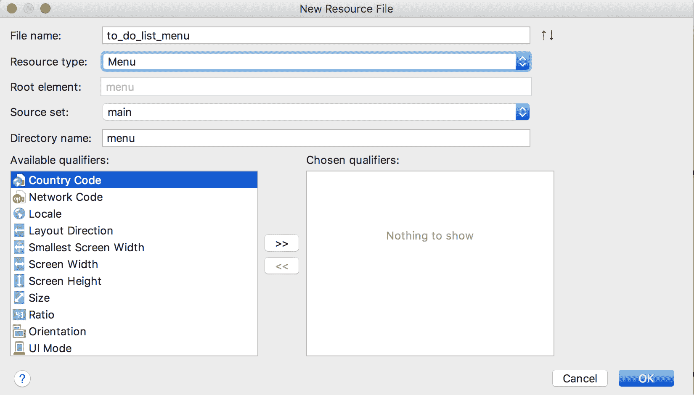

将`to_do_list_menu,xml`文件中的代码替换为如下所示的代码行:

```kt
<?xml version="1.0" encoding="utf-8"?>
<menu xmlns:app="http://schemas.android.com/apk/res-auto"
    xmlns:android="http://schemas.android.com/apk/res/android">

    <item
        android:id="@+id/edit_item"
        android:title="@string/edit"
        android:icon="@android:drawable/ic_menu_edit"
        android:visible="false"
        app:showAsAction="always"/>
    <item
        android:id="@+id/delete_item"
        android:title="@string/delete"
        android:icon="@android:drawable/ic_menu_delete"
        android:visible="false"
        app:showAsAction="always"/>
</menu>
```

在前面的代码行中，我们创建了两个菜单项，`edit`和`delete`项。我们还将每个菜单项的可见性设置为`false`。

接下来，打开`MainActivity`类，在类的顶部添加以下两个新变量:

```kt
private var showMenuItems = false
private var selectedItem = -1 
```

`showMenuItems`变量将用于跟踪菜单项的可见性状态，而`selectedItem`变量存储当前所选列表项的位置。

然后，如果`showMenuItems`变量设置为`true`，则覆盖`onCreateOptionsMenu()`方法以启用菜单项:

```kt
override fun onCreateOptionsMenu(menu: Menu): Boolean {
    val inflater = menuInflater
    inflater.inflate(R.menu.to_do_list_menu, menu)
    val editItem = menu.findItem(R.id.edit_item)
    val deleteItem = menu.findItem(R.id.delete_item)

    if (showMenuItems) {
        editItem.isVisible = true
        deleteItem.isVisible = true
    }

    return true
}
```

接下来，打开`MainActivity`类，添加如下所示的方法:

```kt
private fun showUpdateTaskUI(selected: Int) {
    selectedItem = selected
    showMenuItems = true
    invalidateOptionsMenu()
}
```

调用此方法时，它会将传递给它的参数分配给`selectedItem`变量，并将`showMenuItems`的值更改为`true`。然后调用`invalidateOptionsMenu()`方法。`invalidateOptionsMenu()`方法通知操作系统，与`Activity`相关的菜单已经更改。这将导致菜单被重新创建。

现在，我们需要为`ListView`实现一个`ItemClickListener`。在`onCreate()`方法中，添加以下代码行:

```kt
listView?.onItemClickListener = AdapterView.OnItemClickListener { parent, view, position, id -> showUpdateTaskUI(position) }

```

在这几行代码中，当点击一个项目时会调用`showUpdateTaskUI()`方法。

再次构建并运行。这一次，当您单击列表项时，将出现菜单项，如下图所示:

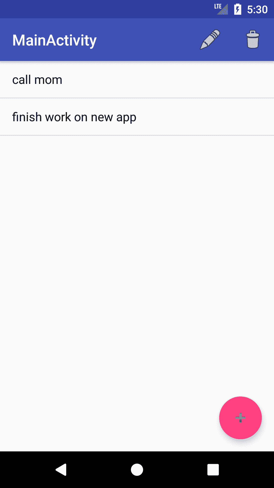

接下来，我们需要更新`NewTaskDialogFragment`类来接受和处理选中的任务。开启`NewTaskDialogFragment`课。

更新`newInstance()`方法以获取类型为`String`的额外参数，并使用以下代码将该参数作为`DialogFragment`参数的一部分传递:

```kt
fun newInstance(title: Int, selected: String?): NewTaskDialogFragment { // 1
    val newTaskDialogFragment = NewTaskDialogFragment()
    val args = Bundle()
    args.putInt("dialog_title", title)
    args.putString("selected_item", selected) // 2
    newTaskDialogFragment.arguments = args
    return newTaskDialogFragment
}
```

**注:**变化点为标有数字的点。

接下来，更新`onCreateDialog()`方法，检索并显示所选任务的文本，如下代码所示:

```kt
override fun onCreateDialog(savedInstanceState: Bundle?): Dialog {
    val title = arguments.getInt("dialog_title")
    val selectedText = arguments.getString("selected_item") // 1
    val builder = AlertDialog.Builder(activity)
    builder.setTitle(title)

    val dialogView = activity.layoutInflater.inflate(R.layout.dialog_new_task, null)

    val task = dialogView.findViewById<EditText>(R.id.task)

    task.setText(selectedText)  // 2

    builder.setView(dialogView)
            .setPositiveButton(R.string.save, { dialog, id ->

                newTaskDialogListener?.onDialogPositiveClick(this, task.text.toString());
            })
            .setNegativeButton(android.R.string.cancel, { dialog, id ->

                newTaskDialogListener?.onDialogNegativeClick(this)
            })

    return builder.create()
}
```

接下来，我们需要实现当用户选择菜单项时的功能。这是通过覆盖`onOptionsItemSelected()`方法来完成的:

```kt
override fun onOptionsItemSelected(item: MenuItem?): Boolean {

if (-1 != selectedItem) {
if (R.id.edit_item == item?.itemId) {  // 1

val updateFragment = NewTaskDialogFragment.newInstance(R.string.update_task_dialog_title, todoListItems[selectedItem])
            updateFragment.show(fragmentManager, "updatetask")

        } else if (R.id.delete_item == item?.itemId) {  // 2

todoListItems.removeAt(selectedItem)
listAdapter?.notifyDataSetChanged()
selectedItem = -1
            Snackbar.make(fab, "Task deleted successfully", 
            Snackbar.LENGTH_LONG).setAction("Action", null).show()

        }
    }
return super.onOptionsItemSelected(item)
}
```

在前面的方法中，所选菜单项的标识与两个菜单项的标识进行核对。

1.  如果选定的菜单项是编辑按钮:
    *   将生成并显示`NewTaskDialogFragment`的新实例。在生成新实例的调用中，检索并传递选定的任务。
2.  如果是`delete`按钮:
    *   所选项目从`todoListItems`中移除
    *   数据变更通知`listAdapter`
    *   `selectedItem`变量被重置为-1
    *   并且，显示一个滚动条，通知用户成功删除

您可能已经注意到，在对`show()`方法的调用中，将一个`String`作为第二个参数。这个参数就是标签。标签作为一种标识，用于区分由`Activity`管理的不同片段。我们将使用标签来决定在调用`onDialogPositiveClick()`方法时执行哪个动作。

将`onDialogPositiveClick()`方法替换为如下所示的方法:

```kt
override fun onDialogPositiveClick(dialog: DialogFragment, task:String) {

    if("newtask" == dialog.tag) {
        todoListItems.add(task)
        listAdapter?.notifyDataSetChanged()

        Snackbar.make(fab, "Task Added Successfully", 
        Snackbar.LENGTH_LONG).setAction("Action", null).show()

    } else if ("updatetask" == dialog.tag) {
        todoListItems[selectedItem] = task

        listAdapter?.notifyDataSetChanged()

        selectedItem = -1

        Snackbar.make(fab, "Task Updated Successfully", 
        Snackbar.LENGTH_LONG).setAction("Action", null).show()
    }
}
```

在前面几行代码中，以下内容适用:

1.  如果对话框的标签是`newtask`:
    *   任务变量被添加到`todoListItems`数据中，并且`listAdapter`被通知更新`ListView`
    *   还会显示一个滚动条，通知用户任务已成功添加
2.  如果对话框的标签是`updatetask`:
    *   所选项目被替换为`todoListItems`数据集中的任务变量，并通知`listAdapter`更新`ListView`
    *   `selectedItem`变量被重置为-1
    *   此外，还会显示一个滚动条，通知用户任务已成功更改

构建并运行。选择一项任务，然后单击“编辑”菜单项。这将弹出您的“编辑任务”对话框，其中已填充了所选任务的详细信息，如下图所示:

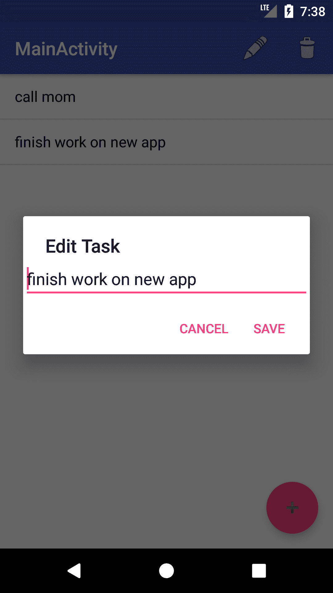

更改任务详细信息，然后单击保存按钮。这将带走对话框，用更新的任务更新您的`ListView`，并在屏幕底部显示一个带有消息“任务更新成功”的滚动条，如下图所示:

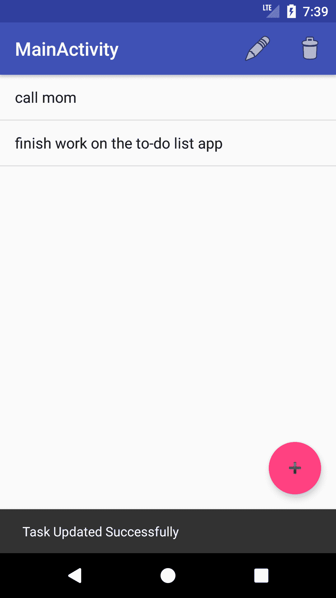

接下来，选择一个任务并单击“删除”菜单项。这将删除选定的任务，并在屏幕底部显示一个带有消息“任务已成功删除”的滚动条，如下图所示:


# 摘要

在本章中，我们构建了一个简单的 TodoList 应用，允许用户添加新任务，以及编辑或删除已经添加的任务。在这个过程中，我们学会了使用列表视图和对话框。在 TodoList 应用的当前状态下，每当应用重新启动时，数据都会自动重置。这并不理想，因为即使在重启应用后，用户也很可能想查看他们的旧任务。

在下一章中，我们将了解可用的不同数据存储选项，以及如何使用它们来提高我们的应用的可用性。我们将扩展 TodoList 应用，将用户的任务保存到数据库中。