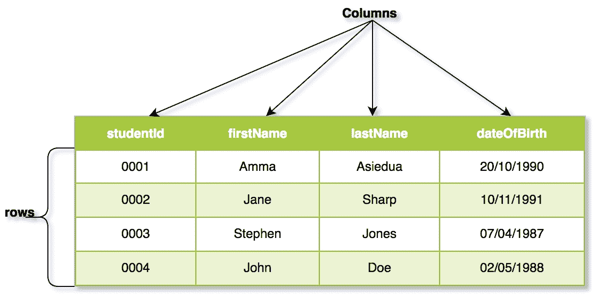
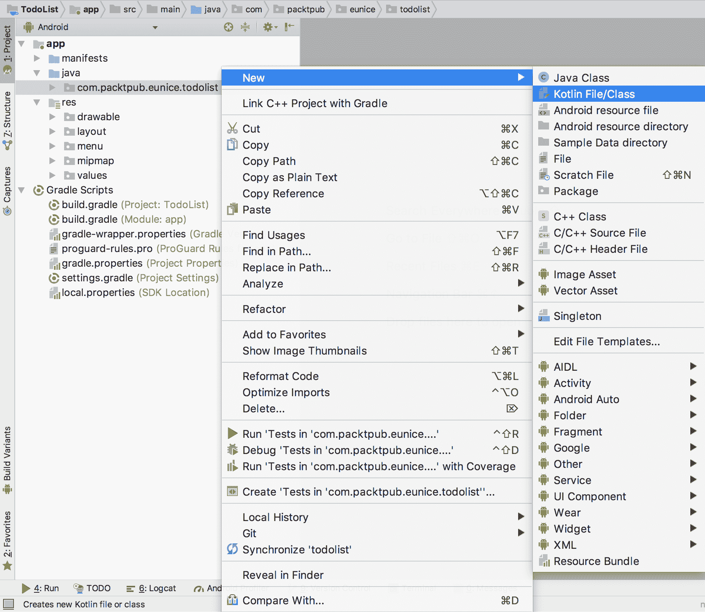
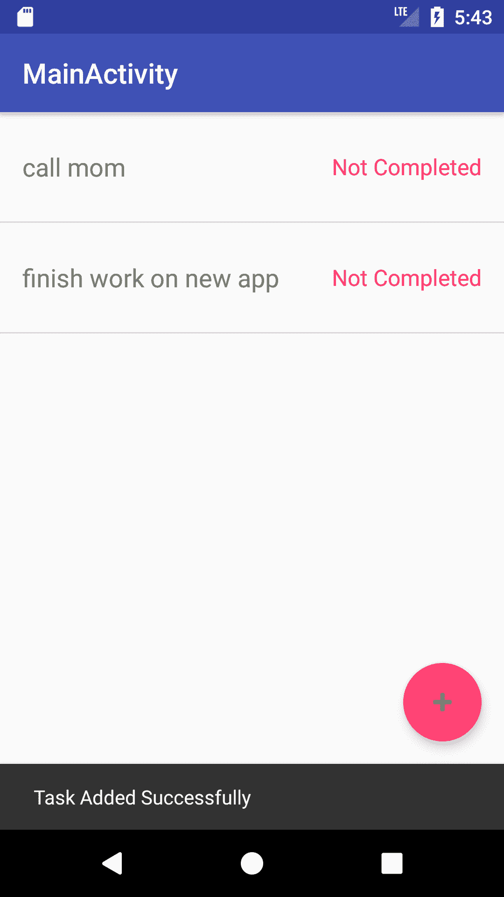
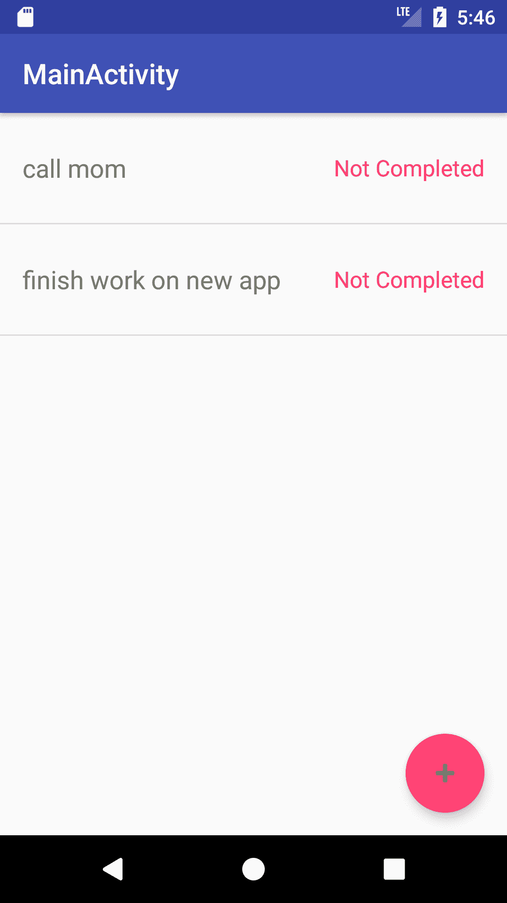
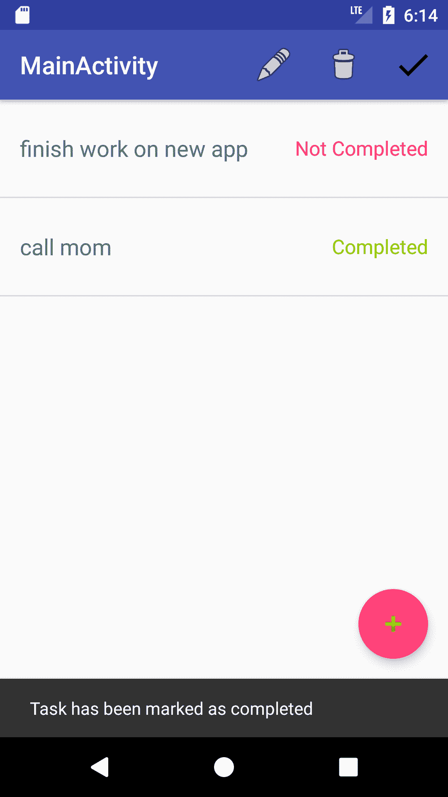
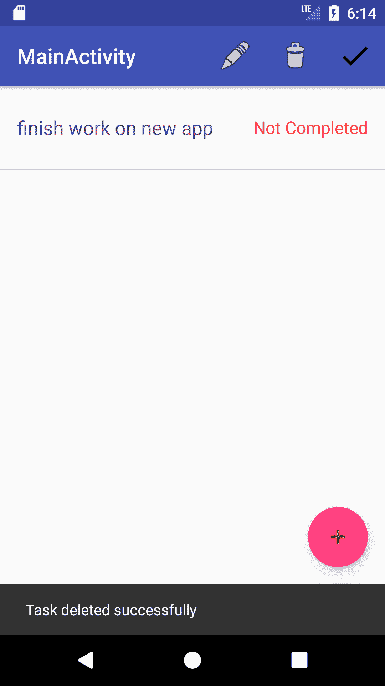
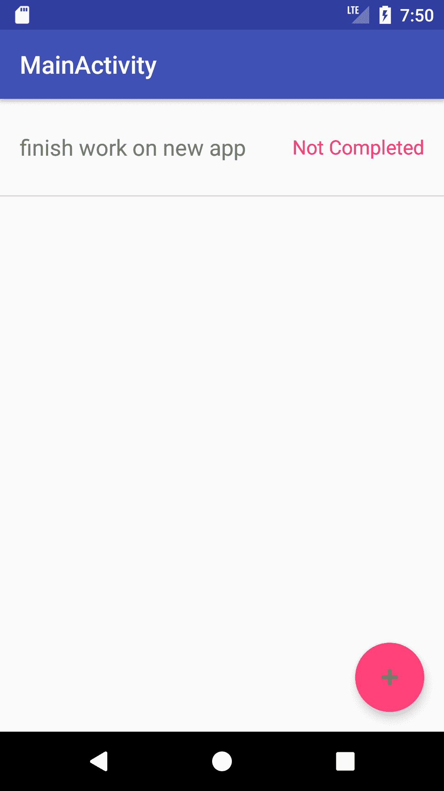
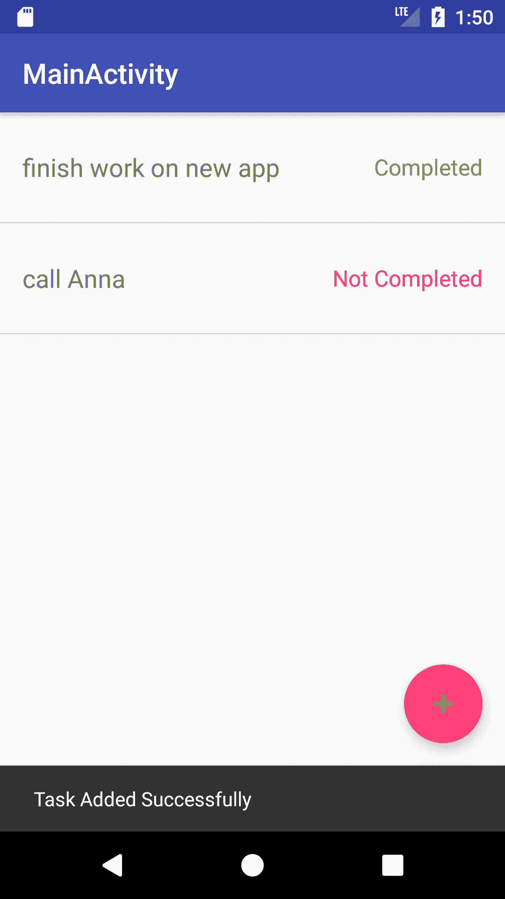
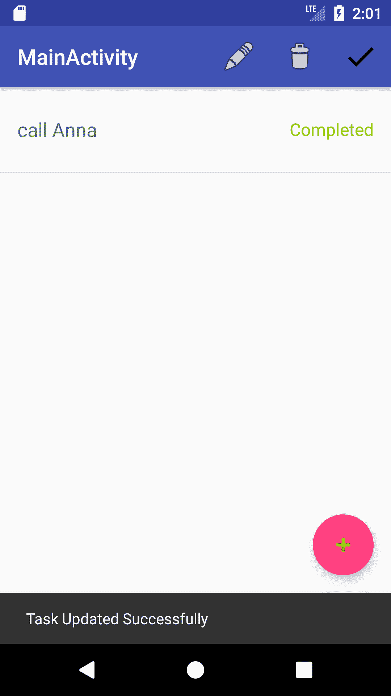
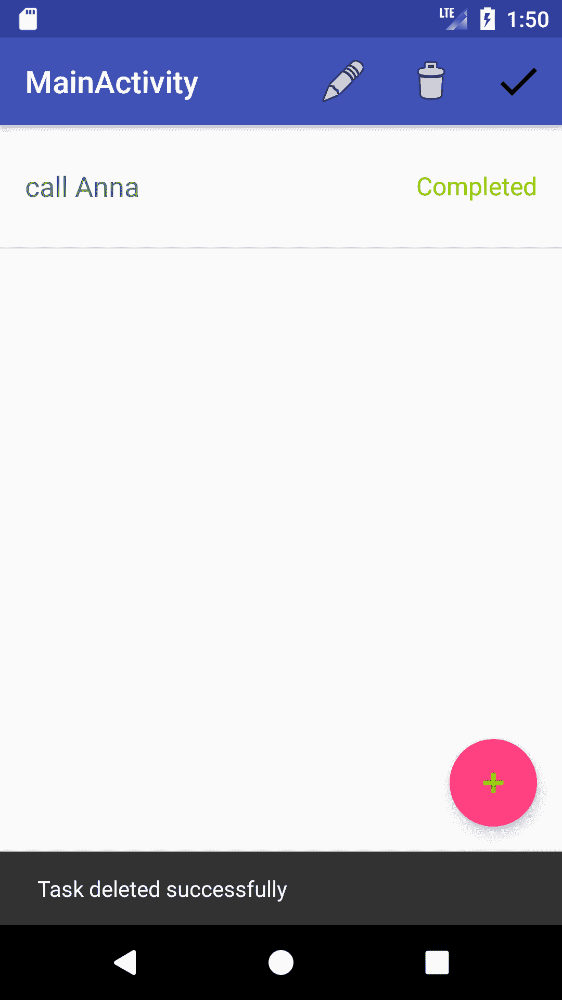

# 十一、使用数据库

在本章中，我们将通过适当地将用户输入到数据库中的任务持久化来改进上一章中的待办事项应用。

在本章中，我们将学习以下内容:

*   数据库的概念
*   可用于移动开发的不同类型的数据库
*   如何连接到一些不同的可用数据库

# 数据库介绍

数据库只是一个数据集合，其组织方式使得访问和/或更新变得容易。组织数据的方式有很多种，但它们可以分为两种主要类型:

*   关系数据库
*   非关系数据库

# 关系数据库

关系数据库是基于数据之间存在的关系来组织其数据的数据库。在关系数据库中，数据以带有行和列的表的形式呈现。表存储相同类型的数据集合。表中的每一列代表存储在表中的对象的一个属性。表中的每一行代表一个存储的对象。表有一个标题，指定要存储在数据库中的对象的不同属性的名称和类型。在关系数据库中，每个属性的数据类型都是在创建表时指定的。

我们来看一个例子。此处的表格代表学生的集合:



表格的每一行代表一个学生。这些列代表每个学生的不同属性。

使用关系数据库管理系统维护关系数据库。使用一种称为 **SQL** (结构化查询语言)的语言来访问和管理数据。一些最常用的关系数据库管理系统是甲骨文、MySQL、微软 SQL Server、PostgreSQL、微软 Access 和 SQLite。MySQL、PostgreSQL 和 SQLite 都是开源的。

安卓开发选择的 RDBMS 是 SQLite。这是因为安卓操作系统与 SQLite 捆绑在一起。

在前一章中，我们构建了一个待办事项应用，允许用户添加、更新和删除任务。我们使用一个`ArrayList`作为我们的数据存储。让我们继续扩展应用，改用关系数据库。

# 使用 SQLite

首先要做的是定义数据库的模式。数据库的模式定义了数据库中数据的组织方式。它定义了组织数据的表，以及对这些表的限制(例如列允许的数据类型)。建议创建一个指定数据库详细信息的契约类。

创建一个名为`TodoListDBContract`的新 Kotlin 对象，并用以下代码行替换其内容:

```kt
object TodoListDBContract {

        const val DATABASE_VERSION = 1
        const val DATABASE_NAME = "todo_list_db"

    class TodoListItem: BaseColumns {
        companion object {
            const val TABLE_NAME = "todo_list_item"
            const val COLUMN_NAME_TASK = "task_details"
            const val COLUMN_NAME_DEADLINE = "task_deadline"
            const val COLUMN_NAME_COMPLETED = "task_completed"
        }
    }

}
```

在前面的代码中，`TodoListItem`类表示我们数据库中的一个表，用于声明表的名称及其列的名称。

To create a new Kotlin object, first, right-click the package and select New
| Kotlin File/Class. Then in the New Kotlin File/Class dialog, select Object in the Kind field:



接下来要做的是创建一个数据库助手类。这将帮助我们抽象到数据库的连接，而不是在我们的活动中保留数据库连接逻辑。继续创建一个名为`TodoListDBHelper`的新 Kotlin 类。该类应该在其默认构造函数中采用一个`Context`参数，并扩展`android.database.sqlite.SQLiteOpenHelper`类，如下代码所示:

```kt
class TodoListDBHelper(context: Context): SQLiteOpenHelper(context, DATABASE_NAME, null, DATABASE_VERSION) {
```

现在，向`TodoListDBHelper`类添加以下代码行，如下代码所示:

```kt
private val SQL_CREATE_ENTRIES = "CREATE TABLE " + TodoListDBContract.TodoListItem.TABLE_NAME + " (" +
        BaseColumns._ID + " INTEGER PRIMARY KEY AUTOINCREMENT," +
        TodoListDBContract.TodoListItem.COLUMN_NAME_TASK + " TEXT, " +
        TodoListDBContract.TodoListItem.COLUMN_NAME_DEADLINE + " TEXT, " +
        TodoListDBContract.TodoListItem.COLUMN_NAME_COMPLETED + " INTEGER)"  // 1

private val SQL_DELETE_ENTRIES = "DROP TABLE IF EXISTS " + TodoListDBContract.TodoListItem.TABLE_NAME   // 2

override fun onCreate(db: SQLiteDatabase) { // 3
 db.execSQL(SQL_CREATE_ENTRIES)
}

override fun onUpgrade(db: SQLiteDatabase, oldVersion: Int, newVersion: Int) {// 4
 db.execSQL(SQL_DELETE_ENTRIES)
 onCreate(db)
}

override fun onDowngrade(db: SQLiteDatabase, oldVersion: Int, newVersion: Int) {
 onUpgrade(db, oldVersion, newVersion)
}
```

在前面几行代码中，以下内容适用:

*   `SQL_CREATE_ENTRIES`是一个创建表的 SQL 查询。它指定了一个`_id`字段，该字段被设置为数据库的主键。

In relational databases, a table is required to have a column that uniquely identifies each row entry. This unique column is known as the **Primary Key**. Specifying a column as **AUTOINCREMENT** tells the RDBMS to auto-generate a new value for this field whenever a new row is being inserted.

*   `SQL_DELETE_ENTRIES`是一个删除表(如果存在)的 SQL 查询。
*   在`onCreate()`方法中，执行 SQL 查询来创建表。
*   在`onUpgrade()`中，表格被删除并重新创建。

由于表在数据库中会有一个 ID 字段，所以我们必须在`Task`类中添加一个额外的字段来跟踪它。打开`Task.kt`，添加一个新的`Long`类型的字段，命名为`taskId`。

```kt
var taskId: Long? = null
```

接下来，添加如下所示的构造函数:

```kt
constructor(taskId:Long, taskDetails: String?, taskDeadline: String?, completed: Boolean) : this(taskDetails, taskDeadline) {
        this.taskId = taskId
        this.completed = completed
    }
```

# 将数据插入数据库

打开`TodoListDBHelper`，添加如下所示的方法:

```kt
fun addNewTask(task: Task): Task {
        val db = this.writableDatabase // 1

// 2
        val values = ContentValues()
        values.put(TodoListDBContract.TodoListItem.COLUMN_NAME_TASK, task.taskDetails)
        values.put(TodoListDBContract.TodoListItem.COLUMN_NAME_DEADLINE, task.taskDeadline)
        values.put(TodoListDBContract.TodoListItem.COLUMN_NAME_COMPLETED, task.completed)

        val taskId = db.insert(TodoListDBContract.TodoListItem.TABLE_NAME, null, values); // 3
        task.taskId = taskId

        return task
    }
```

在这里，我们执行以下操作:

1.  我们首先以写模式检索数据库。
2.  接下来，我们创建一个`ContentValues`的实例，并在我们想要插入的项目中放入字段的值键映射。
3.  然后，我们调用数据库对象上的`insert()`方法，将表名和`ContentValues`实例传递给它。这会返回插入项的主键`_id`。我们更新任务对象并返回它。

开启`MainActivity`课。

首先，在类的顶部添加一个`TodoListDBHelper`类的实例作为新字段:

```kt
private var dbHelper: TodoListDBHelper = TodoListDBHelper(this)
```

并且，覆盖`AppCompatActivity`的`onDestroy()`方法:

```kt
override fun onDestroy() {
    dbHelper.close()
    super.onDestroy()
}
```

这将在调用活动的`onDestroy()`方法时关闭数据库连接。

然后，在`onDialogPositiveClick()`方法中，定位这行代码:

```kt
todoListItems.add(Task(taskDetails, ""))
```

替换为以下代码行:

```kt
val addNewTask = dbHelper.addNewTask(Task(taskDetails, ""))
todoListItems.add(addNewTask)
```

调用`dbHelper.addNewTask()`会将新任务保存到数据库中，而不只是将其添加到`todoListItems`字段中。

构建和运行应用:



现在我们已经能够保存到数据库中，我们需要能够在应用启动时查看数据。

# 从数据库中检索数据

打开`TodoListDBHelper`，添加如下所示的方法:

```kt
fun retrieveTaskList(): ArrayList<Task> {
    val db = this.readableDatabase  // 1

    val projection = arrayOf<String>(BaseColumns._ID,
            TodoListDBContract.TodoListItem.COLUMN_NAME_TASK,
            TodoListDBContract.TodoListItem.COLUMN_NAME_DEADLINE,
            TodoListDBContract.TodoListItem.COLUMN_NAME_COMPLETED) // 2

    val cursor = db.query(TodoListDBContract.TodoListItem.TABLE_NAME, projection, 
            null, null, null, null, null) // 3

    val taskList = ArrayList<Task>()
// 4
    while (cursor.moveToNext()) {
        val task = Task(cursor.getLong(cursor.getColumnIndexOrThrow(BaseColumns._ID)),
                cursor.getString(cursor.getColumnIndexOrThrow(TodoListDBContract.TodoListItem.COLUMN_NAME_TASK)),
                cursor.getString(cursor.getColumnIndexOrThrow(TodoListDBContract.TodoListItem.COLUMN_NAME_DEADLINE)),
                cursor.getInt(cursor.getColumnIndexOrThrow(TodoListDBContract.TodoListItem.COLUMN_NAME_COMPLETED)) == 1)
        taskList.add(task)
    }
    cursor.close() // 5

    return taskList
}
```

在`retrieveTaskList`方法中，我们执行以下操作:

1.  我们首先以读取模式检索数据库。
2.  接下来，我们创建一个数组，列出需要检索的表的所有列。在这里，如果我们不需要特定列的值，我们就不添加它。
3.  然后，我们将表名和列列表传递给数据库对象上的`query()`方法。这将返回一个`Cursor`对象。
4.  接下来，我们遍历`Cursor`对象中的项目，并使用每个项目的属性创建一个`Task`类的实例。
5.  我们关闭光标并返回检索到的数据

现在，打开`MainActivity`，在`populateListView()`方法的开头加上下面一行代码:

```kt
    todoListItems = dbHelper.retrieveTaskList();
```

你的`populateListView()`方法现在应该是这样的:

```kt
private fun populateListView() {
    todoListItems = dbHelper.retrieveTaskList();
    listAdapter = TaskListAdapter(this, todoListItems)
    listView?.adapter = listAdapter
}
```

现在，再次构建并运行。您会注意到，与前一章不同的是，当您重新启动应用时，先前保存的任务会保留下来:



# 更新任务

在本节中，我们将学习更新数据库中已保存任务的详细信息。打开`TodoListDBHelper`，添加如下所示的方法:

```kt
    fun updateTask(task: Task) {
        val db = this.writableDatabase // 1

        // 2
        val values = ContentValues()
        values.put(TodoListDBContract.TodoListItem.COLUMN_NAME_TASK, task.taskDetails)
        values.put(TodoListDBContract.TodoListItem.COLUMN_NAME_DEADLINE, task.taskDeadline)
        values.put(TodoListDBContract.TodoListItem.COLUMN_NAME_COMPLETED, task.completed)

        val selection = BaseColumns._ID + " = ?" // 3
        val selectionArgs = arrayOf(task.taskId.toString()) // 4

        db.update(TodoListDBContract.TodoListItem.TABLE_NAME, values, selection, selectionArgs) // 5

    }
```

在`updateTask()`方法中，我们执行以下操作:

1.  我们首先以写模式检索数据库。
2.  接下来，我们创建一个`ContentValues`的实例，并放入我们想要更新的字段的值键映射。对于我们正在进行的工作，我们将假设更新了所有的列。
3.  我们指定一个查询来选择更新哪个数据库条目。我们的选择查询使用`_id`列。
4.  然后，我们为选择查询指定参数，在我们的例子中，是所选`Task`的`taskId`。
5.  然后，我们调用数据库对象上的`update()`方法，将表名、`ContentValues`实例、选择查询和选择值传递给它。

在`MainActivity`类的`onDialogPositiveClick()`方法中，找到这行代码:

```kt
dbHelper.updateTask(todoListItems[selectedItem])
```

把它放在这一行代码后面:

```kt
todoListItems[selectedItem].taskDetails = taskDetails
```

`onDialogPositiveClick()`方法现在应该是这样的:

```kt
override fun onDialogPositiveClick(dialog: DialogFragment, taskDetails:String) {
        if("newtask" == dialog.tag) {
            val addNewTask = dbHelper.addNewTask(Task(taskDetails, ""))
            todoListItems.add(addNewTask)
            listAdapter?.notifyDataSetChanged()

            Snackbar.make(fab, "Task Added Successfully", Snackbar.LENGTH_LONG).setAction("Action", null).show()

        } else if ("updatetask" == dialog.tag) {
            todoListItems[selectedItem].taskDetails = taskDetails
            dbHelper.updateTask(todoListItems[selectedItem])

            listAdapter?.notifyDataSetChanged()

            selectedItem = -1

            Snackbar.make(fab, "Task Updated Successfully", Snackbar.LENGTH_LONG).setAction("Action", null).show()
        }
    }
```

接下来，在`onOptionsItemSelected()`中，找到下面一行代码:

```kt
dbHelper.updateTask(todoListItems[selectedItem])
```

把它放在这一行代码后面:

```kt
todoListItems[selectedItem].completed = true
```

构建并运行。当您点击**标记为完成**菜单项时，所选任务将被更新为完成，列表视图也会相应更新:



# 删除任务

在本节中，我们将学习删除数据库中保存的任务。打开`TodoListDBHelper`，添加如下所示的方法:

```kt
    fun deleteTask(task:Task) {
        val db = this.writableDatabase // 1
        val selection = BaseColumns._ID + " = ?" // 2
        val selectionArgs = arrayOf(task.taskId.toString()) // 3
        db.delete(TodoListDBContract.TodoListItem.TABLE_NAME, selection, selectionArgs) // 4
    }
```

删除过程类似于更新过程:

1.  首先，以写模式检索数据库
2.  接下来，指定用于选择要删除哪个数据库条目的查询。我们的`selection`查询使用`_id`列

3.  然后，指定`selection`查询的参数，在本例中，该参数是所选`Task`的`taskId`
4.  然后，我们调用数据库对象上的`delete()`方法，将表名、选择查询和选择值传递给它

在`MainActivity`类的方法中，找到下面一行代码:

```kt
todoListItems.removeAt(selectedItem)
```

用以下代码替换它:

```kt
val selectedTask = todoListItems[selectedItem]
todoListItems.removeAt(selectedItem)
dbHelper.deleteTask(selectedTask)
```

构建并运行。当你添加一个新项目时，该条目不仅仅被添加到`ListView`中，它还被保存在数据库中:



编写自己的 SQL 查询很容易出错，尤其是在构建严重依赖数据库或需要非常复杂的查询的应用时。这也需要大量的精力和 SQL 查询知识。为此，您可以使用 ORM 库。

# ORM 库

一个 **ORM** ( **对象关系映射**)库为您提供了一个更好的方法来将对象持久化到数据库中，而不用太担心 SQL 查询以及打开和关闭数据库连接。

**注**:你还需要一定的 SQL 查询知识水平

有许多安卓兼容的 ORM 库:

*   荷尔蒙！荷尔蒙
*   格林道
*   DbFlow
*   房间

但是，在本书中，我们将重点介绍 **Room** ，这是谷歌推出的一个 ORM。

要使用 Room，我们首先必须将其依赖项添加到项目中。

打开`build.gradle`，并在依赖项部分添加以下代码行:

```kt
implementation 'android.arch.persistence.room:runtime:1.0.0'
annotationProcessor 'android.arch.persistence.room:compiler:1.0.0'
kapt "android.arch.persistence.room:compiler:1.0.0"
```

单击立即同步。为了让 Room 能够将任务保存到数据库，我们需要指定哪个类代表一个表。这是通过将类标注为`Entity`来完成的。打开`Task`类，用下面几行代码替换它的内容:

```kt
@Entity(tableName = TodoListDBContract.TodoListItem.TABLE_NAME)
class Task() {

    @PrimaryKey(autoGenerate = true)
    @ColumnInfo(name = BaseColumns._ID)
    var taskId: Long? = null

    @ColumnInfo(name = TodoListDBContract.TodoListItem.COLUMN_NAME_TASK)
    var taskDetails: String? = null

    @ColumnInfo(name = TodoListDBContract.TodoListItem.COLUMN_NAME_DEADLINE)
    var taskDeadline: String? = null

    @ColumnInfo(name = TodoListDBContract.TodoListItem.COLUMN_NAME_COMPLETED)
    var completed: Boolean? = false

    @Ignore
    constructor(taskDetails: String?, taskDeadline: String?): this() {
        this.taskDetails = taskDetails
        this.taskDeadline = taskDeadline
    }

    constructor(taskId:Long, taskDetails: String?, taskDeadline: String?, completed: Boolean) : this(taskDetails, taskDeadline) {
        this.taskId = taskId
        this.completed = completed
    }

}
```

这里，以下内容适用:

*   `@Entity`指定`Task`代表数据库中的一个表
*   `@ColumnInfo`将字段映射到数据库列
*   `@PrimaryKey`指定该字段是表的主键

接下来就是创建一个 **DAO** (数据访问对象)。创建一个名为`TaskDAO`的新 Kotlin 接口，并用下面几行代码替换它的内容:

```kt
@Dao
interface TaskDAO {

    @Query("SELECT * FROM " + TodoListDBContract.TodoListItem.TABLE_NAME)
    fun retrieveTaskList(): List<Task> 

    @Insert
    fun addNewTask(task: Task): Long   

    @Update
    fun updateTask(task: Task)  

     @Delete
     fun deleteTask(task: Task)  

}
```

如前面的代码所示，以下内容适用:

*   Room 提供了`Insert`、`Update`和`Delete`注释，因此您不必为它们编写查询
*   对于选择操作，您必须用查询来注释方法

接下来，我们必须创建一个将应用连接到数据库的数据库类。创建一个名为`AppDatabase`的新 Kotlin 类，并用以下代码替换其内容:

```kt
@Database(entities = arrayOf(Task::class), version = TodoListDBContract.DATABASE_VERSION)
abstract class AppDatabase : RoomDatabase() {
    abstract fun taskDao(): TaskDAO
}
```

这就是连接到数据库所需的全部设置。

要使用数据库，打开`MainActivity`。首先，创建一个`AppDatabase`类型的字段:

```kt
private var database: AppDatabase? = null
```

接下来，用`onCreate()`方法实例化该字段:

```kt
database = Room.databaseBuilder(applicationContext, AppDatabase::class.java, DATABASE_NAME).build()
```

在这里，您指定您的数据库类和数据库的名称。

# 从数据库中检索数据

Room 不允许您在主线程上运行数据库操作，所以我们将使用一个`AsyncTask`来执行调用。将此处显示的私有类添加到`MainActivity`类中:

```kt
private class RetrieveTasksAsyncTask(private val database: AppDatabase?) : AsyncTask<Void, Void, List<Task>>() {

    override fun doInBackground(vararg params: Void): List<Task>? {
        return database?.taskDao()?.retrieveTaskList()
    }
}
```

这里，我们调用`taskDao`以`doInBackground()`方法从数据库中检索任务列表。

接下来，在`populateListView()`方法中，找到下面一行代码:

```kt
todoListItems = dbHelper.retrieveTaskList();
```

用这个代替它:

```kt
todoListItems = RetrieveTasksAsyncTask(database).execute().get() as ArrayList<Task>
```

Room 创建并管理一个主表，用于跟踪数据库的版本。因此，即使我们需要执行数据库迁移，如果我们想保留数据库中的数据。

打开`TodoListDBContract`类，将`DATABASE_VERSION`常量增加到`2`。

然后，用以下代码替换`MainActivity`中的数据库实例化:

```kt
database = Room.databaseBuilder(applicationContext, AppDatabase::class.java, DATABASE_NAME)
        .addMigrations(object : Migration(TodoListDBContract.DATABASE_VERSION - 1, TodoListDBContract.DATABASE_VERSION) {
            override fun migrate(database: SupportSQLiteDatabase) {
            }
        }).build()
```

这里，我们向`databaseBuilder`添加一个新的`Migration`对象，同时指定数据库的当前版本和新版本。

现在，构建并运行。您的应用将启动，之前保存的`Tasks`显示:



# 将数据插入数据库

要添加新任务，请在`MainActivity`中创建新的`AsyncTask`:

```kt
private class AddTaskAsyncTask(private val database: AppDatabase?, private val newTask: Task) : AsyncTask<Void, Void, Long>() {

    override fun doInBackground(vararg params: Void): Long? {
        return database?.taskDao()?.addNewTask(newTask)
    }
}
```

这里，我们调用`taskDao`以`doInBackground()`方法将新任务插入数据库。

接下来，在`onDialogPositiveClick()`方法中，找到这里显示的代码行:

```kt
val addNewTask = dbHelper.addNewTask(Task(taskDetails, ""))
```

并用以下代码替换它:

```kt
var addNewTask = Task(taskDetails, "")

addNewTask.taskId = AddTaskAsyncTask(database, addNewTask).execute().get()
```

现在，构建并运行。就像上一节一样，当你添加一个新项目时，这个条目不仅仅是被添加到`ListView`中，它还被保存在数据库中:



# 更新任务

要更新任务，在`MainActivity`中创建新的`AsyncTask`:

```kt
private class UpdateTaskAsyncTask(private val database: AppDatabase?, private val selectedTask: Task) : AsyncTask<Void, Void, Unit>() {

    override fun doInBackground(vararg params: Void): Unit? {
        return database?.taskDao()?.updateTask(selectedTask)
    }
}
```

这里，我们调用`taskDao`以`doInBackground()`方法将新任务插入数据库。

接下来，在`onDialogPositiveClick()`方法中，找到下面一行代码:

```kt
dbHelper.updateTask(todoListItems[selectedItem])
```

用以下代码行替换它:

```kt
UpdateTaskAsyncTask(database, todoListItems[selectedItem]).execute()
```

此外，在`onOptionsItemSelected()`中，找到以下代码行:

```kt
dbHelper.updateTask(todoListItems[selectedItem])
```

用下面这段代码替换它:

```kt
UpdateTaskAsyncTask(database, todoListItems[selectedItem]).execute()
```

现在，构建并运行。就像上一章一样，选择一个任务，然后单击“编辑”菜单项。在显示的“编辑任务”对话框中，更改任务详细信息，然后单击“保存”按钮。

这将取消对话框，将更改保存到数据库，用更新的任务更新您的列表视图，并在屏幕底部显示一个带有消息“任务更新成功”的滚动条:



# 删除任务

要删除任务，在`MainActivity`中创建新的`AsyncTask`:

```kt
private class DeleteTaskAsyncTask(private val database: AppDatabase?, private val selectedTask: Task) : AsyncTask<Void, Void, Unit>() {

    override fun doInBackground(vararg params: Void): Unit? {
        return database?.taskDao()?.deleteTask(selectedTask)
    }
}
```

接下来，在`onOptionsItemSelected()`中，找到下面一行代码:

```kt
dbHelper.deleteTask(selectedTask)
```

用以下代码行替换它:

```kt
DeleteTaskAsyncTask(database, selectedTask).execute()
```

构建并运行。选择一项任务，然后单击“删除”菜单项。这将从列表视图中删除选定的任务，同时也从数据库中删除它，并在屏幕底部显示一个带有消息“任务已成功删除”的滚动条:



就这样。正如您所看到的，使用 ORM 可以让您编写更少的代码并减少 SQL 错误。

# 非关系数据库

非关系数据库，即 NoSQL 数据库，是一种不基于关系组织数据的数据库。与关系数据库不同，不同的非关系数据库存储和管理数据的方式不同。一些将数据存储为键值对，而另一些将数据存储为对象。这些数据库选项中有许多支持安卓。在大多数情况下，这些数据库能够将您的数据同步到在线服务器。两种最流行的无 SQL 移动数据库是:

*   移动 ch babe
*   领域

CouchBase 是文档数据库的一个示例，Realm 是对象数据库的一个示例。

文档数据库是无模式的，这意味着它们是非结构化的，因此对文档的内容没有限制。他们将数据存储为键值对。

另一方面，对象数据库将它们的数据存储为对象。

# 摘要

在本章中，我们添加了将任务存储到数据库中的功能。我们还了解了我们可以使用的不同类型的数据库。安卓开发者中使用最多的数据库是 SQLite，但这并不妨碍你探索其他选项。还有一些数据库服务，如 Firebase，提供后端即服务功能。

选择数据库时，您应该考虑应用的数据需求。是否需要将数据存储在在线服务器上？或者，是数据只在应用的本地使用吗？您是否希望或有能力设置和管理自定义数据服务器，还是更愿意选择适合您的服务？这些是为你的安卓应用选择数据库时需要考虑的一些问题。

在下一章中，我们将向待办事项列表应用添加提醒功能。