# 为任务设置提醒

对于许多现实世界的应用，需要在某个时候提醒用户，比如说，采取一些行动或给出一些信息。例如，健身应用可能会提醒用户开始一些锻炼。

在这里，您将通过为任务设置提醒来构建上一章的 ToDoList 应用，然后在提醒到期时弹出通知。当我们实现这些特性时，你会学到很多东西，使用类如`IntentService`、`BroadcastReceiver`和`Notification`。

在本章中，您将创建一个允许用户为任务设置提醒的功能。

到本章结束时，您将学到以下内容:

*   创建和显示提醒集的通知
*   推送通知简介
*   如何使用云服务(如 Firebase 和亚马逊 SNS)发送推送通知，以及
*   如何设置您的应用以接收并向用户显示推送通知

总之，本章涵盖的主题包括:

*   服务
*   广播接收器
*   应用内通知
*   推送通知

# 警报管理器

安卓系统中的提醒最好使用`AlarmManager`来实现。为什么呢？查看官方文档对此有何评论:

*这些允许您安排应用在未来的某个时间运行。*

此外:

*报警管理器适用于您希望在特定时间运行应用代码的情况，即使您的应用当前没有运行。对于正常的计时操作(滴答、超时等)，使用 Handler 更容易，效率更高。*

这意味着，如果你想实现这样一个功能作为提醒，你来对地方了。处理此类任务的替代类`Handler`最适合在应用仍在使用时完成的任务。你的应用肯定会有跨越几天的提醒，可能是几周或几个月，所以最好使用`AlarmManager`类。

这就是它的工作原理，你的应用将启动一个后台服务来启动提醒计时器，然后在到期时向应用发送广播。继续看如何实现这一点。

# 创建警报

基本上，有四种类型的警报:

*   **经过的实时时间:**这将根据设备启动后的时间触发挂起的意图，但不会唤醒设备。经过的时间包括设备休眠的任何时间。
*   **经过的实时唤醒:**这将唤醒设备，并在设备启动后经过指定的时间长度后触发挂起的意图。
*   **RTC:** 这将在指定时间触发待定意图，但不会唤醒设备。
*   **RTC 唤醒:**这将唤醒设备，以在指定时间激发待定意图。

您将使用 RTC 唤醒警报类型来唤醒设备，以便在用户设置的精确时间发出警报。

首先，为用户创建一个对话框，以选择闹铃响起的时间。创建一个名为`TimePickerFragment`的新类。然后，用下面显示的代码更新它:

```kt
import android.app.AlarmManager
import android.app.Dialog
import android.app.PendingIntent
import android.app.TimePickerDialog
import android.content.Context
import android.content.Intent
import android.os.Bundle
import android.support.v4.app.DialogFragment
import android.text.format.DateFormat
import android.util.Log
import android.widget.TimePicker
import android.widget.Toast
import java.util.Calendar

class TimePickerFragment : DialogFragment(), TimePickerDialog.OnTimeSetListener {

 override fun onCreateDialog(savedInstanceState: Bundle): Dialog {
 val c = Calendar.getInstance()
 val hour = c.get(Calendar.HOUR_OF_DAY)
 val minute = c.get(Calendar.MINUTE)

 return TimePickerDialog(activity, this, hour, minute,
 DateFormat.is24HourFormat(activity))
 }

 override fun onTimeSet(view: TimePicker, hourOfDay: Int, minute: Int) {
        Log.d("onTimeSet", "hourOfDay: $hourOfDay minute:$minute")

        Toast.makeText(activity, "Reminder set successfully", Toast.LENGTH_LONG).show()

        val intent = Intent(activity, AlarmReceiver::class.java)
        intent.putExtra(ARG_TASK_DESCRIPTION, taskDescription)

        val alarmIntent = PendingIntent.getBroadcast(activity, 0, intent, 0)
        val alarmMgr = activity.getSystemService(Context.ALARM_SERVICE) as AlarmManager

        val calendar = Calendar.getInstance()
        calendar.set(Calendar.HOUR_OF_DAY, hourOfDay)
        calendar.set(Calendar.MINUTE, minute)

        alarmMgr.set(AlarmManager.RTC_WAKEUP, calendar.timeInMillis, alarmIntent)
    }
}

companion object {
     val ARG_TASK_DESCRIPTION = "task-description"

    fun newInstance(taskDescription: String): TimePickerFragment {
        val fragment = TimePickerFragment()
        val args = Bundle()
        args.putString(ARG_TASK_DESCRIPTION, taskDescription)
        fragment.arguments = args
        return fragment
    }
}
```

在`onCreateDialog`方法中，您创建了`TimePickerDialog`的实例，并将默认时间设置为当前时间。因此，当时间选择器启动时，它将显示当前时间。

然后，覆盖`onTimeSet`方法来处理用户的设定时间。您首先记录时间，然后显示祝酒词，表示时间已设置成功并被记录。

然后，您创建了一个意图来执行`AlarmReceiver`(您将很快创建它)。接下来是`PendingIntent`，当警报响起时被触发。然后你(最终)创建了在用户时间内传递的警报。该警报将在用户设定的准确时间触发。而且，它只会运行一次。

# 启动提醒对话框

打开`MainActivity`文件，进行一些快速更新，使您能够显示对话框。

在`onCreateOptionsMenu`中，进行以下更改:

```kt
override fun onCreateOptionsMenu(menu: Menu): Boolean {
    ...
    val reminderItem = menu.findItem(R.id.reminder_item)

    if (showMenuItems) {
        ...
        reminderItem.isVisible = true
    }

    return true
}
```

您刚刚添加了一个提醒菜单项，当用户单击任务时将显示该菜单项。现在，选择该菜单项后，转到`onOptionsItemSelected`启动时间选择器。使用以下代码来实现:

```kt
} else if (R.id.delete_item == item?.itemId) {
    ...
} else if (R.id.reminder_item == item?.itemId) {
    TimePickerFragment.newInstance("Time picker argument")
            .show(fragmentManager, "MainActivity")
}
```

接下来，用以下代码更新`to_do_list_menu.xml`中的菜单项:

```kt
<item
    android:id="@+id/reminder_item"
    android:title="@string/reminder"
    android:icon="@android:drawable/ic_menu_agenda"
    android:visible="false"
    app:showAsAction="ifRoom"/>
```

现在，使用下面显示的代码在您的`strings.xml`文件中添加`"reminder"`字符串资源:

```kt
<resources>
    ...
    <string name="reminder">Reminder</string>
</resources>
```

好吧，太棒了。现在，还记得上面的`AlarmReceiver`课吗？它是做什么的？继续寻找答案。

# 广播接收器

这是你了解`BroadcastReceiver`课的地方。根据官方文档，它是接收和处理`sendBroadcast(Intent)`发送的广播意图的代码的基类。

基本上，它负责在你的应用中接收广播事件。注册此接收器有两种方式:

*   动态地，使用带有`Context.registerReceiver()`的这个类的实例，或者
*   静态地，使用 AndroidManifest.xml 中的`<receiver>`标记

文档中的一个重要注释:
*从 Android 8.0 (API 级别 26)开始，系统对清单声明的接收者施加了额外的限制。如果您的应用以 API 级别 26 或更高为目标，则不能使用清单来声明大多数隐式广播(不专门针对您的应用的广播)的接收器。*

# 发送广播

当警报响起时，您将使用`LocalBroadcastManager`向用户发送通知。文档中的这个提示就是为什么最好使用这种广播方法:

*“如果不需要跨应用发送广播，使用本地广播。实现效率更高(不需要进程间通信)，您不需要担心与其他应用能够接收或发送您的广播相关的任何安全问题。”*

并且，这告诉我们为什么它是高效的:
*本地广播可以在你的应用中用作通用发布/订阅事件总线，而没有任何系统范围广播的开销。*

# 创建广播接收器

创建一个新文件并命名为`AlarmReceiver`，并让它扩展`BroadcastReceiver`。然后，用以下代码更新它:

```kt
class AlarmReceiver: BroadcastReceiver() {

    override fun onReceive(context: Context?, p1: Intent?) {
        Log.d("onReceive", "p1$p1")
        val i = Intent(context, AlarmService::class.java)
        context?.startService(i)
    }
}
```

你所做的只是覆盖`onReceive`方法来启动一个名为`AlarmService`的`IntentService`(这个类将负责显示通知)。日志语句只是用来帮助调试的。

继续之前，在您的`AndroidManifest.xml`中注册服务，就像`MainActivity`组件一样。在这里，你只需要`name`的属性，虽然:

```kt
<application>
    ...
  <service android:name=".AlarmReceiver"/>
</application>
```

现在，继续创建由`AlarmReceiver`启动的`AlarmService`。

# 创建报警服务

**国际服务**
我们先来听听官方文件是怎么说的:

<q>“`IntentService`是`Services`的基类，按需处理异步请求(表示为意向)。客户通过`startService(Intent)`电话发送请求；该服务根据需要启动，使用一个工作线程依次处理每个 Intent，并在用完工作时自行停止。”</q>

`IntentService`是通过`Intents`处理请求的`Service`组件。收到`Intent`后，启动一个工作线程运行任务，当工作完成时，或者根据给定的工作在适当的时候停止。

这里的关键是它给你的应用在没有任何干扰的情况下做一些工作的能力。这与`Activity`组件不同，例如，它必须在前台才能运行任务。`AsyncTasks`有所帮助，但它仍然不够灵活，不适合像这样长时间运行的任务。继续前进，看看它在行动。

**注:**

*   `IntentService`拥有自己的单一工作线程来处理请求
*   一次只能处理一个请求

# 创建互联网服务

创建名为`ReminderService`的`IntentService`子类。你将不得不推翻`onHandleIntent()`的方法来处理好`Intent`。然后，您将构建一个`Notification`实例来通知用户提醒已经到期:

```kt
import android.app.IntentService
import android.app.NotificationManager
import android.content.Context
import android.content.Intent
import android.support.v4.app.NotificationCompat
import android.util.Log

class AlarmService : IntentService("ToDoListAppAlarmReceiver") {
 private var context: Context? = null

 override fun onCreate() {
 super.onCreate()
 context = applicationContext
 }

 override fun onHandleIntent(intent: Intent?) {
 intent?showNotification(it)

 if(null == intent){
 Log.d("AlarmService", "onHandleIntent( OH How? )")
 }
 }

 private fun showNotification(taskDescription: String) {
 Log.d("AlarmService", "showNotification($taskDescription)")
 val CHANNEL_ID = "todolist_alarm_channel_01"
 val mBuilder = NotificationCompat.Builder(this, CHANNEL_ID)
 .setSmallIcon(R.drawable.ic_notifications_active_black_48dp)
 .setContentTitle("Time Up!")
 .setContentText(taskDescription)

 val mNotificationManager = getSystemService(Context.NOTIFICATION_SERVICE) as NotificationManager
 mNotificationManager.notify(23, mBuilder.build())
 }
}
```

浏览代码，这就是你刚才所做的:

在`onCreate()`中，您保存了一个`applicationContext`的实例供以后使用。

在`onHandleIntent()`中，您使用了 Kotlin 安全检查功能，以确保在非空实例上调用`showNotification()`方法。

在`showNotification()`中，您使用`NotificationCompat`生成器创建了一个通知实例。您还可以设置通知的标题和内容。然后，使用`NotificationManager`，你触发了通知。`notify()`方法中的标识参数是您的应用特有的通知标识。

你也需要注册服务。以下是如何:

```kt
<service android:name=".AlarmService"
         android:exported="false"/>

```

这个你应该很熟悉，除了`android:exported`。这意味着我们不允许任何外部应用与该服务交互。

这里有一些关于`IntentService`类的重要限制需要注意。

*   它不能直接与您的用户界面交互。要将其结果放入用户界面，您必须将它们发送到一个活动。
*   工作请求按顺序运行。如果一个操作正在`IntentService`中运行，并且您向它发送了另一个请求，则该请求会一直等待，直到第一个操作完成。
*   在`IntentService`上运行的操作不能被中断。

现在是时候运行您的应用了。警报应该会响起，你应该会看到一个提示。

还有其他方法可以向您的应用发送通知。继续阅读，了解推送通知。

# Firebase 云消息传递

“Firebase 云消息传递(FCM)是一个跨平台的消息传递解决方案，可让您免费可靠地传递消息。”我认为，这是对这项服务最好的简要描述。它实际上是由谷歌创建和运行的 Firebase 平台上许多其他服务套件的一部分。

您已经集成了应用内通知，现在您将看到如何使用 FCM 实现推送通知。

应用内通知基本上意味着通知是由应用内部触发的。另一方面，推送通知是从外部源发送的。

# 集成 FCM

1.  设置 FCM 传感和诊断模块

你首先要把 **SDK** ( **软件开发工具包**)添加到你的应用中。你应该确保你的目标至少是安卓 4.0(冰淇淋三明治)。它应该安装谷歌 Play 商店应用，或者运行安卓 4.0 和谷歌应用接口的模拟器。你的AndroidStudio版本应该至少是 2.2。您将使用AndroidStudio中的 Firebase 助手窗口来进行集成。

此外，使用以下步骤，确保您已经安装了 Google Repository 版本 26 或更高版本:

1.  点击**工具** | **安卓** | **SDK 管理器**
2.  单击**软件开发工具包工具**选项卡
3.  勾选**谷歌知识库**复选框，点击**确定**
4.  点击**确定**安装
5.  在后台点击**后台**完成安装，或者等待安装完成点击**完成**

现在，您可以按照以下步骤打开并使用AndroidStudio中的**助手**窗口:

1.  点击**工具** | **火焰基地**打开**助手**窗口:

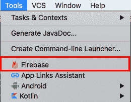

2.  单击展开并选择云消息，然后单击**设置 Firebase 云消息**教程连接到 Firebase，并将必要的代码添加到您的应用中:

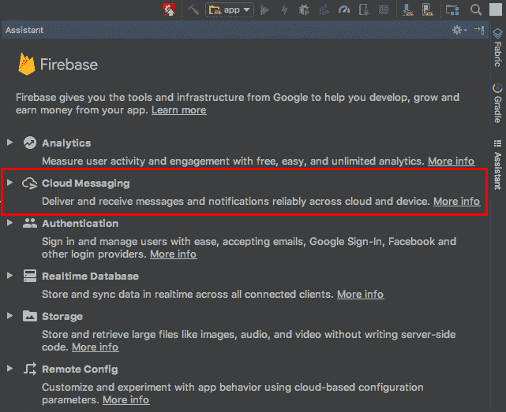

助理是这样的:

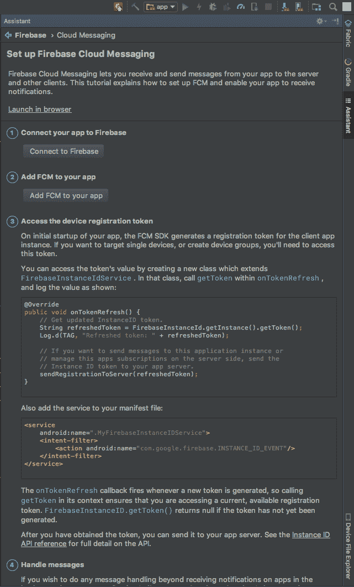

如果您成功完成 Firebase 助手的演练，您将完成以下工作:

*   在 Firebase 上注册了您的应用
*   通过对您的根级`build.gradle`文件进行以下更新，将 SDK 添加到您的应用中

```kt
buildscript {
    // ...
    dependencies {
        // ...
        classpath 'com.google.gms:google-services:3.1.1' // google-services plugin
    }
}

allprojects {
    // ...
    repositories {
        // ...
        maven {
            url "https://maven.google.com" // Google's Maven repository
        }
    }
}
```

然后，在您模块的`build.gradle`文件中，它会在文件的底部添加`apply plugin`行，如下所示:

```kt
apply plugin: 'com.android.application'

android {
  // ...
}
dependencies {
  // ...
  compile 'com.google.firebase:firebase-core:11.8.0'
}
// ADD THIS AT THE BOTTOM
apply plugin: 'com.google.gms.google-services'
```

使用以下内容更新您的清单:

```kt
<service
    android:name=".MyFirebaseMessagingService">
    <intent-filter>
        <action android:name="com.google.firebase.MESSAGING_EVENT"/>
    </intent-filter>
</service>
```

如果您想在应用运行时手动处理从 FCM 收到的消息，这是必需的。但是，您现在不需要这个，因为有一种方法可以在没有您干预的情况下显示通知。

对于该功能，您将需要以下内容:

```kt
<service
    android:name=".MyFirebaseInstanceIDService">
    <intent-filter>
        <action android:name="com.google.firebase.INSTANCE_ID_EVENT"/>
    </intent-filter>
</service>
```

现在您将创建`MyFirebaseInstanceIDService`类来扩展`FirebaseInstanceIdService`。

If, for some reason, any of these are not done, you can manually log in to Firebase website and follow the steps following to create the project on Firebase and update your app's build files. 

使用 Firebase 网站，登录后要做的第一件事是添加您的项目:

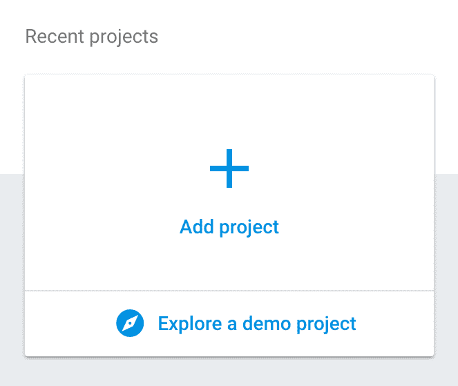

然后会要求您输入项目的名称。为**项目名称**输入**至**。它会自动为您生成一个全球唯一的**项目编号**。然后，选择您的居住国家，点击**创建项目**按钮:

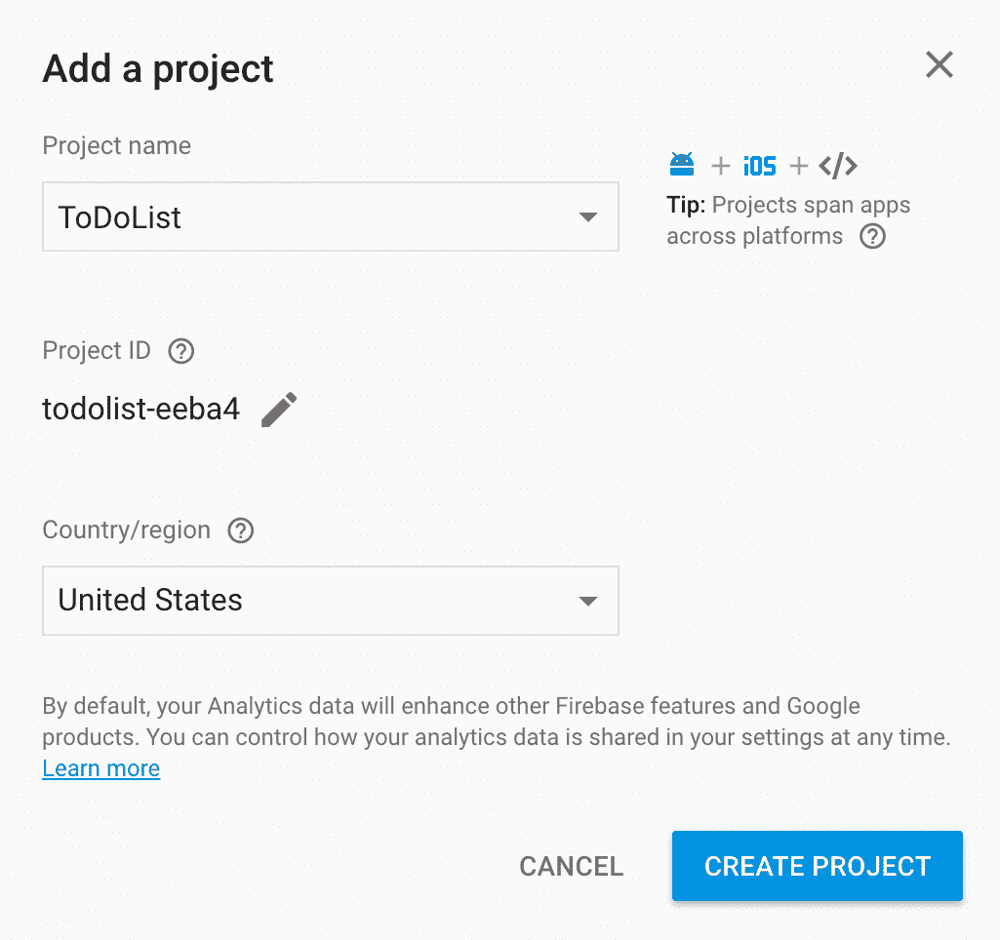

之后，选择想要的平台。请注意，Firebase 不仅用于安卓，还用于 iOS 和网络。因此，选择**将 Firebase 添加到你的安卓应用**选项:

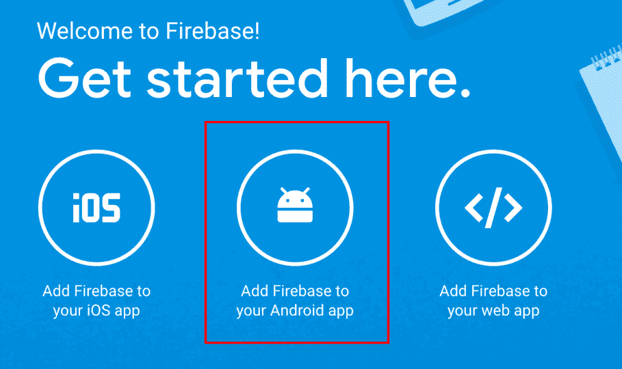

现在，您将经历三个步骤:

1.  第一步是通过提供您的软件包名称来注册您的应用:

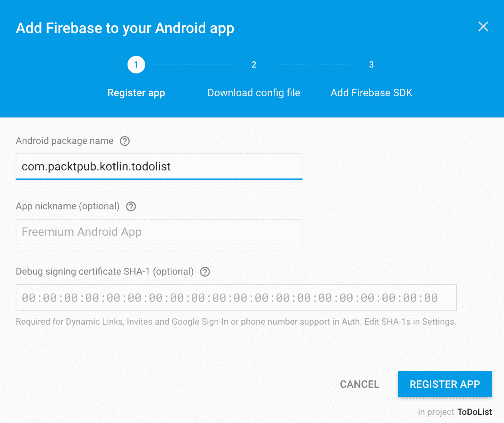

2.  在这一步中，您将只下载 **google-services.json** 文件:

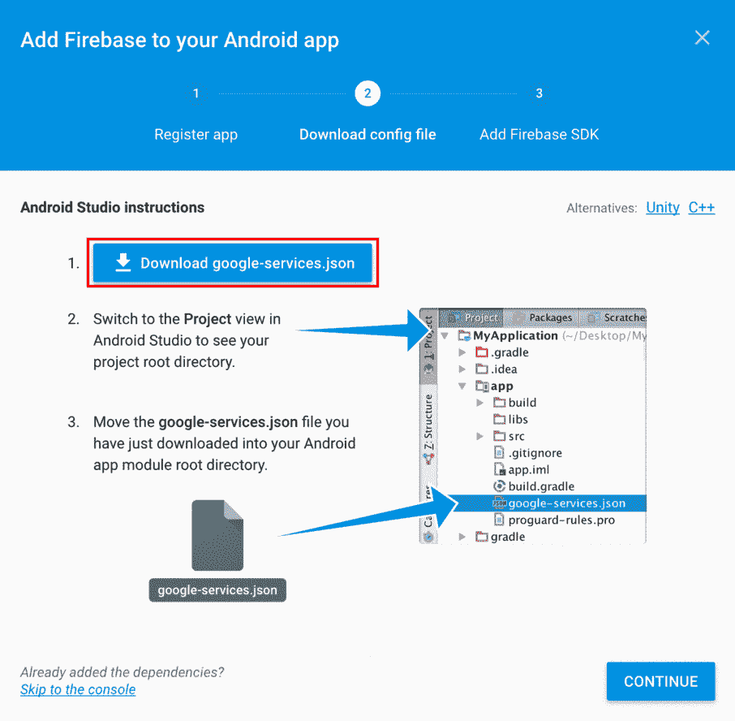

3.  然后，在最后一步，您将软件开发工具包添加到您的应用中。请注意，如果您已经这样做了，则没有必要这样做:

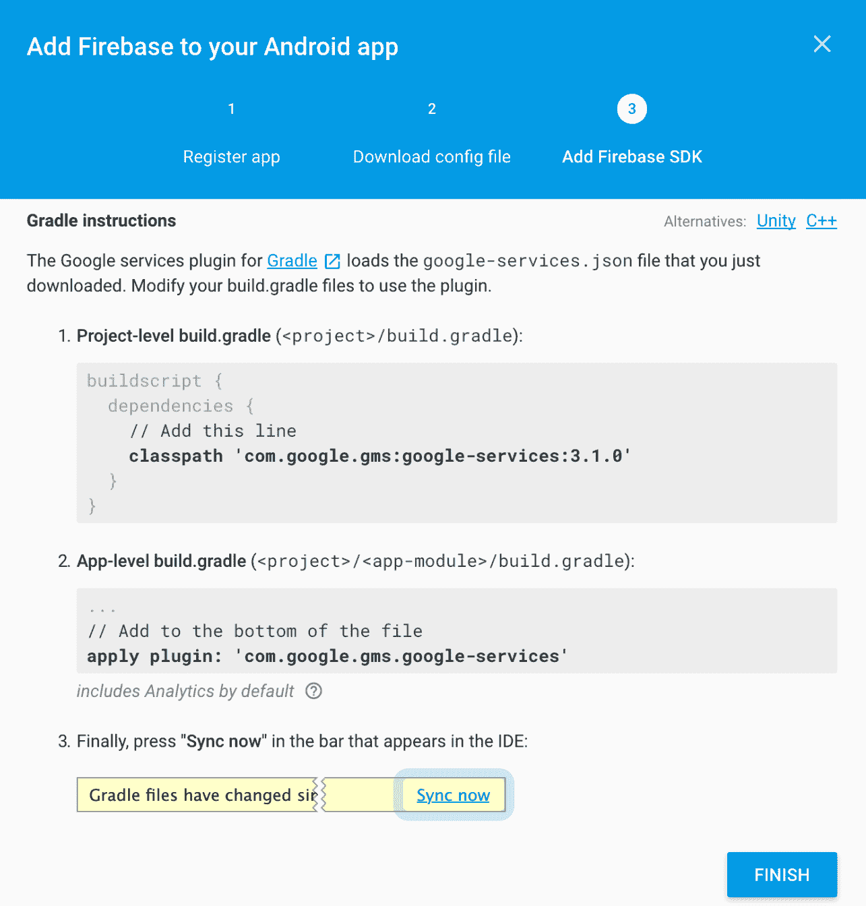

就这样。您已经在 Firebase 上添加了您的应用。现在，您将看到新创建项目的页面。在这里，您将看到您的应用可用的所有服务。选择**通知**服务，点击**开始**:

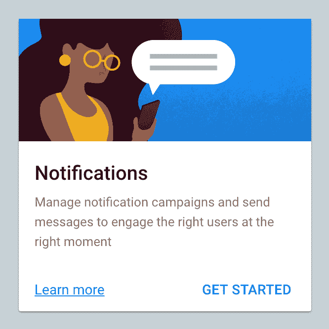

现在，您将看到以下页面。点击**发送你的第一条信息**按钮:

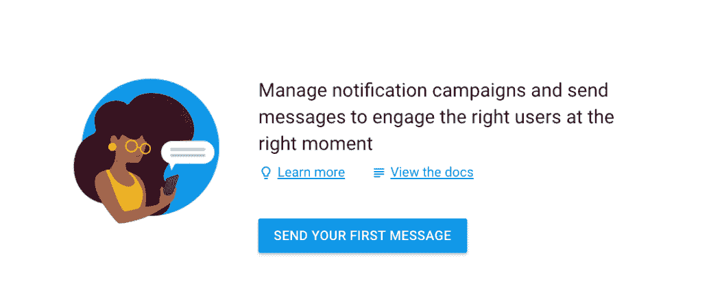

然后，选择**撰写消息**。在这里，在**消息文本**框中输入要发送的消息。选择**单设备**作为目标。进入 **FCM 注册令牌**后，点击**发送消息**按钮发送通知。请继续阅读，了解如何获取注册令牌:

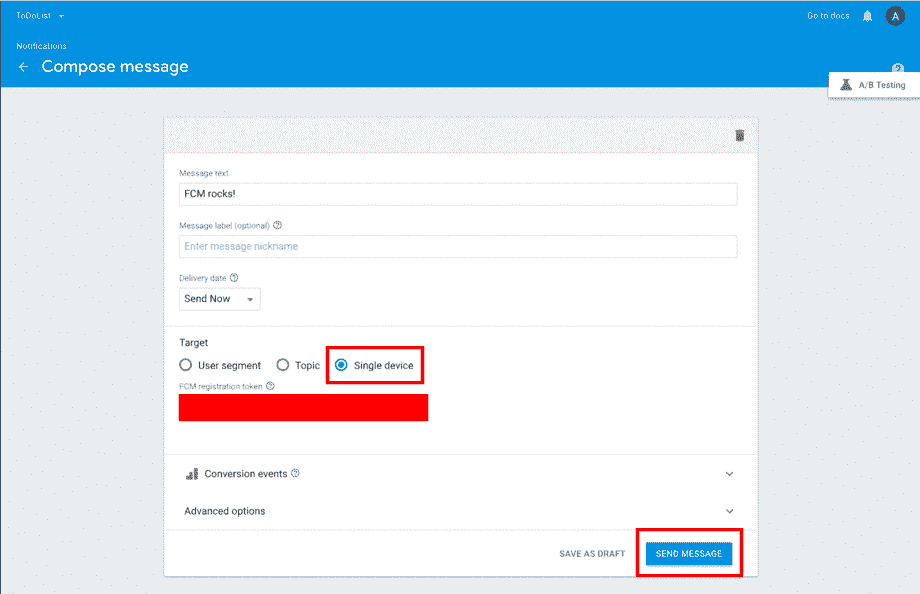

注册令牌

当您在设置 FCM 后第一次运行应用时，FCM 传感和诊断模块将为您的应用生成一个令牌。在以下情况下，此令牌将发生变化，并将相应地生成一个新令牌:

*   应用会删除实例标识
*   该应用将在新设备上恢复
*   用户卸载/重新安装应用
*   用户清除应用数据

此令牌必须保密。要访问该令牌，您需要将其登录到您的`Logcat`控制台。首先，打开`MyFirebaseInstanceIDservice`并用以下代码进行更新:

```kt
override fun onTokenRefresh() {
    // Get updated InstanceID token.
    val refreshedToken = FirebaseInstanceId.getInstance().getToken()
    Log.d(FragmentActivity.TAG, "Refreshed token: " + refreshedToken)

    // If you want to send messages to this application instance or
    // manage this apps subscriptions on the server side, send the
    // Instance ID token to your app server.
    sendRegistrationToServer(refreshedToken)
}
```

现在你有了钥匙，把它粘贴到上面的**撰写消息**框中，点击**发送消息**按钮。之后不久你应该会在手机上看到通知。

# 摘要

在本章中，您学习了如何使用 Firebase 创建后台服务、发送广播消息、显示应用内通知和推送通知。为了加深对这些主题的理解，您可以自己做一些事情:

*   不要使用一些静态消息通知用户，而是使用为其设置提醒的任务描述
*   使用 Firebase，您还可以尝试将推送通知发送给一组人，而不是单个设备