# 让您的应用面向世界

在长时间工作和学习了许多新东西后，开发人员已经构建了应用，对于开发人员来说，最终的满足感是看到用户轻松下载它，并享受使用应用的体验，同时充分利用它的使用。

在本章中，我们将学习通过谷歌 Play 商店和亚马逊应用商店分发我们的应用所涉及的各个步骤。我们还将了解如何对我们的应用进行数字签名，以验证其真实性。

本章重点学习以下内容:

*   通过AndroidStudio和命令行生成密钥存储
*   通过谷歌 Play 商店发布应用
*   通过亚马逊应用商店发布应用

# 密钥存储生成

安卓最重要的安全功能之一是允许安装 APKs，但只能安装来自谷歌 Play 商店或亚马逊应用商店等可信来源的。这些分发渠道要求开发人员验证应用，声明他或她确实打算分发该应用。

应用的所有者，即开发者，将拥有私钥，分发渠道用相应的公钥对此进行签名。公钥和私钥的这种组合意味着数字签名存储在`keyStore`文件中。`keyStore`是一个二进制文件，其中存储了签署应用的数字密钥。

在我们向谷歌 Play 商店发布应用进行分发之前，对 APKs 进行数字签名是非常重要和强制性的。数字签名作为开发人员的身份验证，确保对应用的更新只能通过可信来源进行。

It's important to keep the keystore file safe and to remember the key password. Once an app is signed and released with the keystore file, any further updates to the app can only be done by using the same key. 

`KeyStore`可以通过几种方式生成:

*   Android Studio
*   命令行

让我们详细讨论生成密钥存储所涉及的步骤。

# 通过AndroidStudio生成密钥存储

以下是我们通过安卓生成密钥库需要遵循的步骤:

1.  打开我们希望生成 APK 的项目后，点击构建|生成签名 APK **。**这将导致显示生成签名 APK 屏幕。AndroidStudio希望用户选择密钥存储路径:

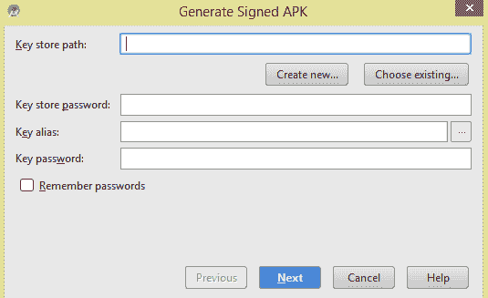

2.  因为我们将生成一个新的密钥存储，点击创建新按钮。这将显示新密钥存储窗口，如下所示:

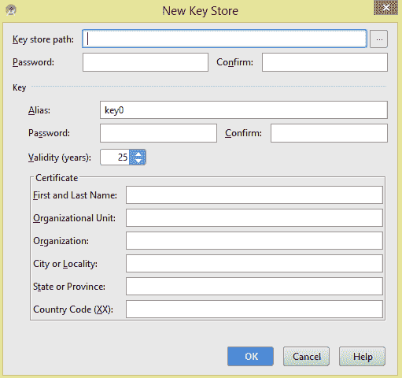

3.  选择密钥存储路径并为`.jks` (Java 密钥存储)文件提供名称:

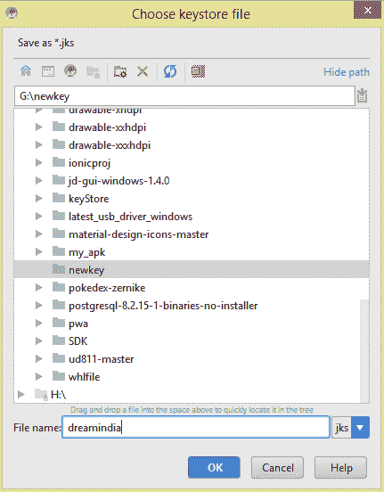

4.  确认密钥库路径后，我们需要填写密钥库密码、密钥别名、密钥别名密码、名字和姓氏、组织单位、组织、城市或地区、州或省以及国家代码(XX):

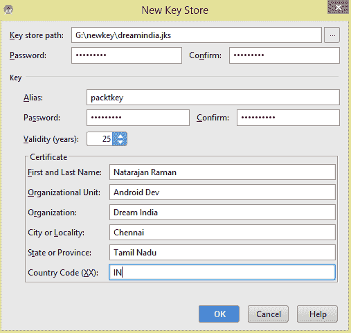

5.  填写完所需的详细信息并单击“确定”按钮后，我们应该能够继续生成签名 APK 屏幕。单击下一步:

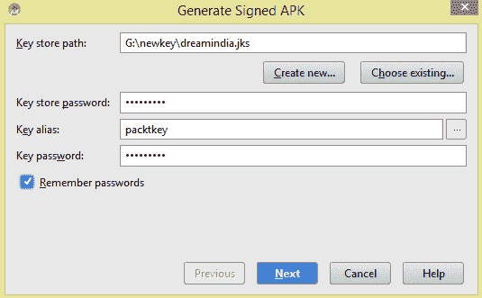

6.  在下一个屏幕上，我们将可以选择 APK 目标文件夹和构建类型。然后，单击“完成”按钮:

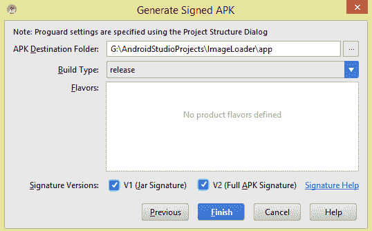

7.  完成后，控制台中将显示已签名 APK 的生成确认以及查找或分析 APK 的选项:

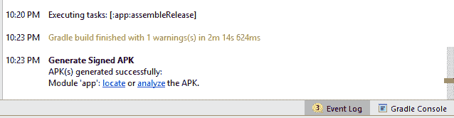

8.  经过数字签名并有资格通过 Google Play 商店和其他发布平台发布的签名 APK 可在目标文件夹中找到:

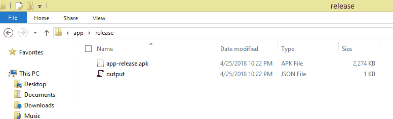

9.  现在我们已经生成了密钥库，将来每当我们对应用进行更新时，AndroidStudio都会向我们提供带有路径的生成签名 APK 屏幕，并期望填写密码:

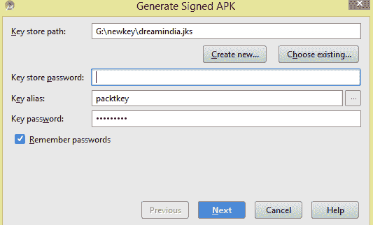

按照新的*密钥库* *生成*中描述的相同过程，用户应该能够生成签名的 APK。

# 通过AndroidStudio自动签署 APK

我们可以选择在应用发生变化时自动生成已签名的 APK。这可以通过在 Android Studio 中执行以下操作来实现:

1.  右键点击 **App** | **项目结构**。
2.  选择“签名”选项卡。在此选项卡中，我们需要提供应用签名配置的详细信息。在这里，我们将其命名为`config` ，并且我们正在存储密钥别名、密码和存储文件的路径:

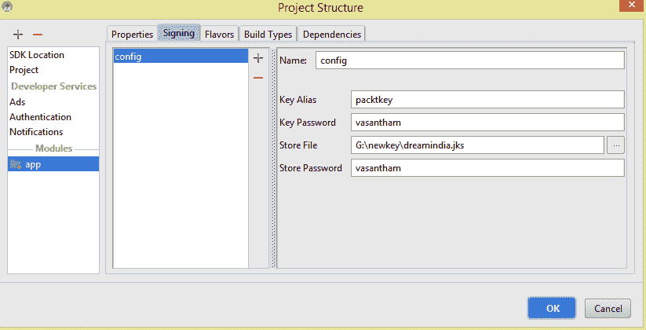

添加签名`config`将导致签名细节以纯文本形式添加到`build.gradle`文件中:

```kt
android {
     signingConfigs {
         config {
             keyAlias 'packtkey' keyPassword 'vasantham' storeFile file('G:/newkey/dreamindia.jks')
             storePassword 'vasantham' } 

```

谨慎的做法是将这些信息移出构建文件，以确保敏感信息不易被他人访问。在项目的根目录下，我们应该创建一个名为`keystore.properties`的文件。该文件将包含以下信息:

```kt
storePassword = OurStorePassword
KeyPassword = ourKeyPassword
keyAlias = ourKeyAlias
storeFile = ourStoreFileLocation
```

由于我们已经将密钥存储的详细信息移到了一个单独的文件中，我们现在应该在`build.gradle`文件中添加以下代码，以确保签名配置可用于自动签名 apk。我们应该在`android{}`块之前加载`keystore.properties`文件。

在这段代码中，我们创建了一个名为`keystorePropertiesFile` 的变量，并用我们创建的`keystore.properties` 文件对其进行初始化。再者，我们初始化一个新的`Properties()` 对象称为`keyStoreProperties`。`keystorePropertiesFile`的详细信息被加载到`keystoreProperties`对象中:

```kt
def keystorePropertiesFile = rootProject.file("keystore.properties")
def keystoreProperties = new Properties()
keystoreProperties.load(new FileInputStream(keystorePropertiesFile))

android {
.......
}
```

加上前面的代码，我们可以使用`keystoreProperties['propertyName']` ***的语法来引用存储在`keystoreProperties` 中的所有属性。*** 我们应该可以将`build.gradle`文件中的签名配置修改为纯文本，如以下代码所示:

```kt
android {
     signingConfigs {
         config {
             keyAlias keystoreProperties['keyAlias'] keyPassword keystoreProperties['keyPassword'] storeFile file(keystoreProperties['storeFile'])
             storePassword keystoreProperties['storePassword'] } 
}
..........
}
```

The build file is now secure and does not include any sensitive information. If we are to use any source control or share the code base, we need to ensure that the `keystore.properties` file is removed and kept secure.

# 构建类型和风格

开发人员可以在构建类型中维护变体，这些变体可以通过`build.gradle`文件进行配置。这种配置使开发人员可以轻松地在同一个应用中维护调试代码和代码的发布版本:

*   **调试:**开启调试选项**也可以用调试键给 app 签名**
***   **发布:**关闭调试选项**关闭**，使用发布键签署应用，同时减少或删除最终 APK 中与调试相关的代码**

 **我们可以在AndroidStudio中定义构建类型——调试或发布:

1.  右键单击应用|项目结构。
2.  在构建类型选项卡中，我们需要添加一种新的构建变体类型。我们有两种构建类型，调试和发布，如下图所示。创建构建类型时，我们可以选择构建变体的签名配置:

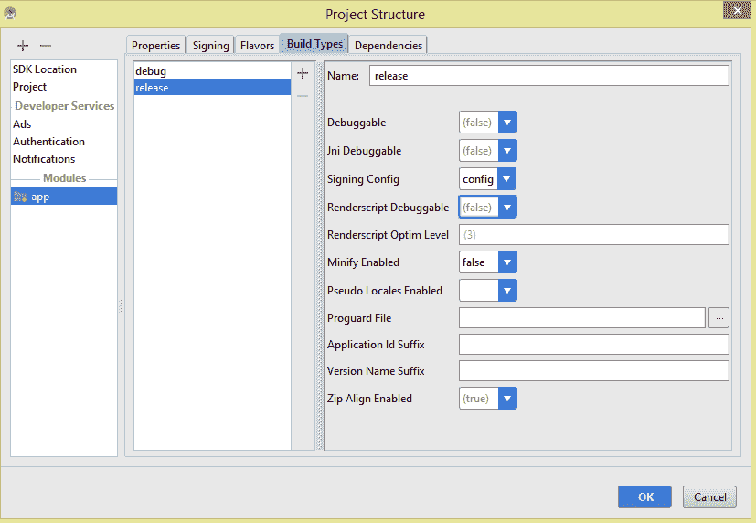

这将在`build.gradle`文件中添加以下代码:

```kt
    buildTypes {
         release {
             minifyEnabled false proguardFiles getDefaultProguardFile('proguard-
             android.txt'), 'proguard-rules.pro' signingConfig signingConfigs.config }
     }
```

在免费应用上提供基本功能，在付费应用上提供原有功能，这在应用领域是一种普遍的规范。安卓提供了将它们定义为**产品口味**的选项。

免费和付费是开发者常用的产品风格。通过定义不同的产品风格，开发人员可以选择维护不同的代码，从而为同一个应用维护不同的或额外的功能。免费版和付费版提供的常见功能的代码库可以相同，而付费版应用可以启用高级功能。

要定义产品口味，右键单击**应用** | **项目结构**，在口味选项卡中，您可以定义产品口味—免费或付费。签名配置也可以定制为匹配`productFlavors`:

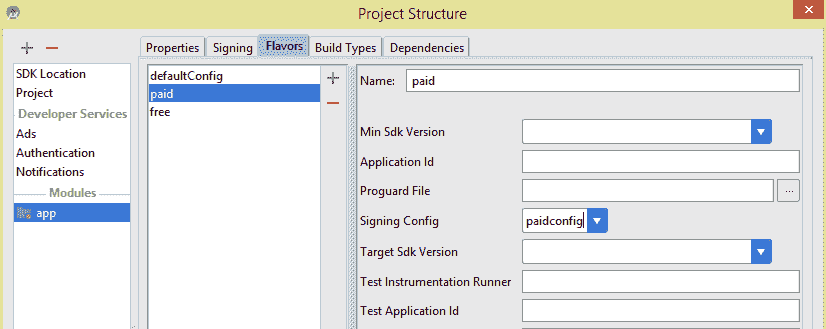

`build.gradle`文件将包含以下信息:

```kt
android {
........
     productFlavors {
         paid {
             signingConfig signingConfigs.paidconfig }
         free {
             signingConfig signingConfigs.freeconfig }
     }
 }
```

# 通过命令行生成密钥存储

密钥存储也可以通过命令行使用密钥工具**生成。**键盘工具可在 jdk 的`bin`目录中找到:

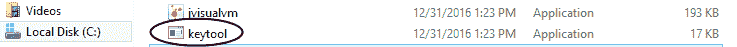

启动命令提示符并运行以下命令:

```kt
keytool -genkey -v -keystore dreamindiacmd.jks -keyalg RSA -keysize 2048 -validity 10000 -alias packtcmdkey
```

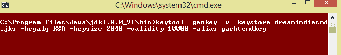

前面的命令采用密钥库路径、用于密钥签名的安全算法类型、密钥大小、有效性和密钥别名。一旦执行了前面的命令，我们需要提供密码和一些额外的细节，如下图所示:

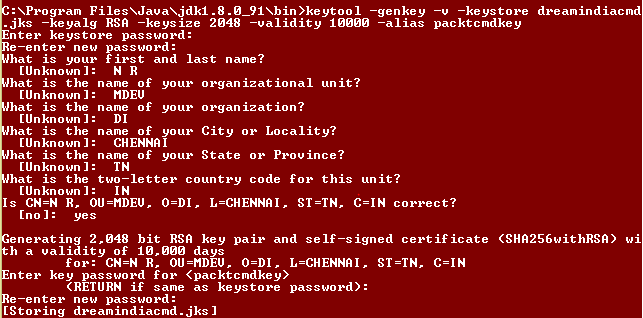

成功执行命令后，我们可以在 keytool 的相同位置找到正在生成的`keystore`文件:


# 在谷歌 Play 商店发布该应用

现在我们已经有了 APKs 的签名版本，是时候通过谷歌 Play 商店发布它们以在全球范围内分发了。

注册谷歌 Play 商店开发商帐户需要一次性费用 25 美元。登录[https://play.google.com/apps/publish/](https://play.google.com/apps/publish/)完成注册流程。

谷歌 Play 商店为开发者提供了一个名为谷歌游戏控制台的优秀控制台。该开发人员控制台包含管理安卓应用发布生命周期所需的所有功能。我们将看看使我们能够发布应用的重要功能。

发布应用的第一步是在谷歌游戏控制台中创建应用。控制台提供了一个创建应用的选项，启动发布过程:

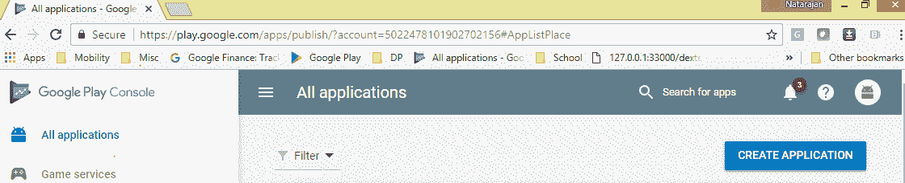

一旦我们点击创建应用，我们将被提示输入应用的默认语言和标题。点击按钮，为我们创建应用:

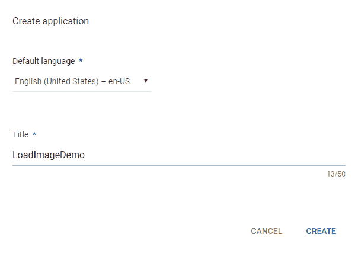

开发人员控制台为开发人员填写菜单提供了大量选项。然而，有四个重要的强制性部分需要填写，以确保应用可以发布。

这四个部分是应用发布、商店列表、内容评级以及定价和分发:

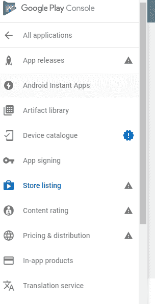

现在，让我们关注这些强制部分需要填写的细节。

# 应用发布部分

应用发布部分使开发人员能够管理 APK 发布的整个生命周期。开发人员可以在将 APK 投入生产进行公开发布之前，发布他们的应用进行内部测试、alpha 和 beta 版本。发布的各个阶段通过限制应用使其只对特定用户可用来帮助开发人员收集对应用的反馈:

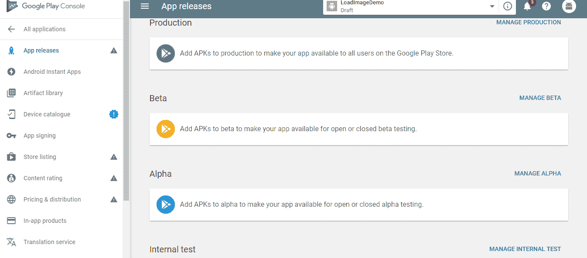

我们需要上传为构建类型发行版生成的签名 APK，以便产品推出。用户可以浏览 APK 文件，并将其上传到游戏商店:

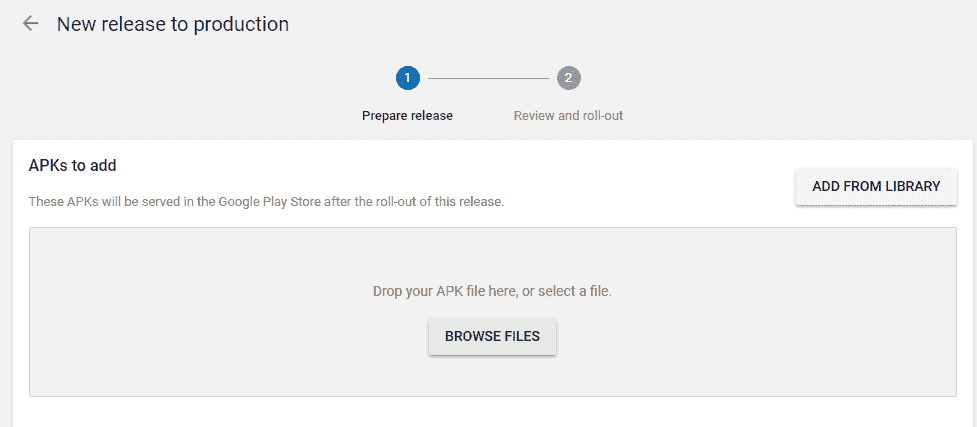

一旦 APK 被上传，同样可以在发布部分找到，带有版本代码和删除 APK 的选项。上传签名的 APK 完成了应用发布部分所需的详细信息:

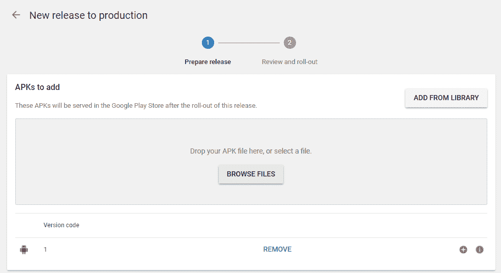

# 商店列表部分

商店列表部分是下一个要关注的部分。这是一个重要的部分，因为用户可以在这里看到应用的各种截图、简短和详细的描述。开发人员可以选择保存草稿，并随时回来继续填写详细信息:

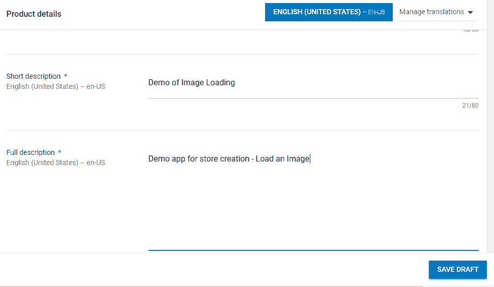

在谷歌 Play 商店，商店列表部分要求:

*   该应用的两张截图
*   高分辨率图标 - 512 * 512
*   特征图形- 1，024 瓦 x 500 小时:

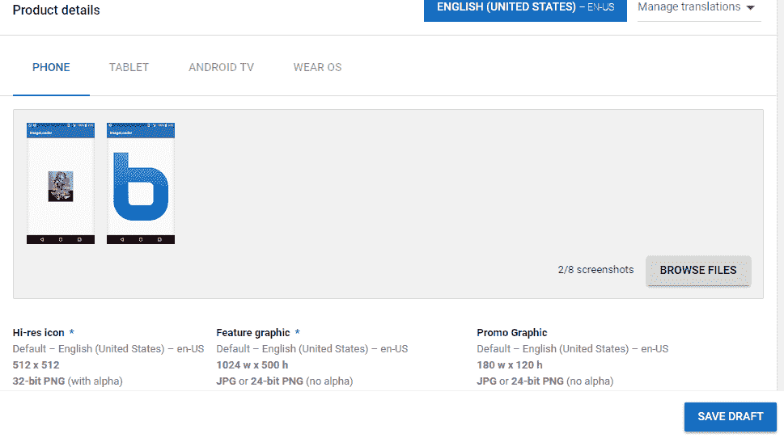

Creation of the graphical assets can be done using free image editors such as **gimp.** It is important and mandatory to follow the guidelines of the graphic specification.

开发人员将被要求提供应用的类型和类别，以及联系方式和隐私政策，如果有的话。一旦提供了所有细节，商店列表部分就完成了。

# 内容分级部分

开发人员应该对应用中提供的内容进行自我声明。内容评级部分有一份问卷，要求开发者提供具体的答案。回答问卷是一项简单的任务:

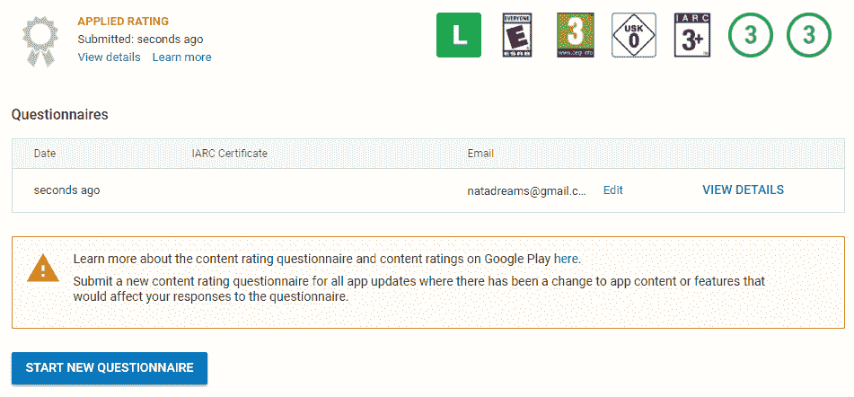

开发人员提供关于应用内容的正确信息非常重要，因为提供不正确的信息会影响商店列表。

# 定价和分销科

最后也是最后一个强制性部分，定价和分发，要求开发者提供与他们的应用定价相关的信息——免费或付费、应用分发到的国家/地区列表、应用是否主要面向儿童、应用是否包含广告、内容指南以及开发者遵守美国出口法律的声明:

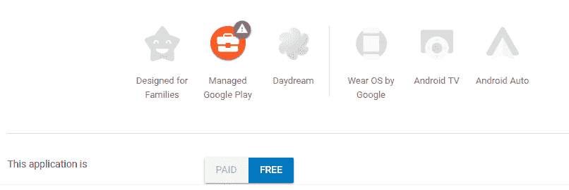

一旦开发人员在定价和分发部分提供了所有必要的细节，就会出现一条消息，说明准备发布。此外，请注意，所有四个强制部分都标有绿色，表示它们已经完成:

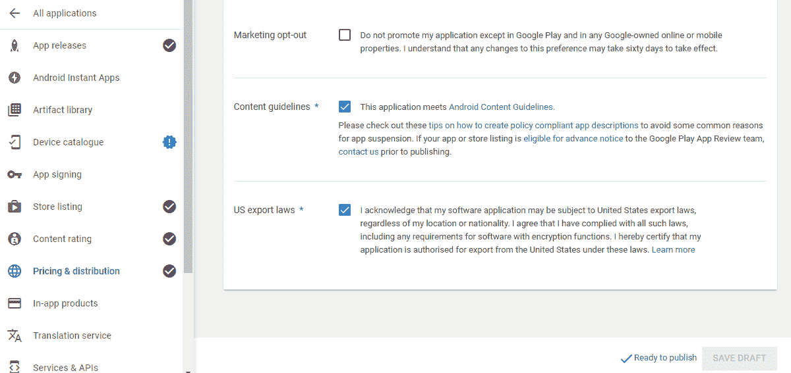

一旦应用提交发布，几个小时内就会被审查并可供下载。如果出现任何疑问，开发人员需要解决它们，并重新提交应用以供发布。

# 在亚马逊应用商店发布应用

亚马逊应用商店为开发者分发他们的安卓应用提供了一个自由市场。开发者可以通过以下网址登录并创建自己的免费账号:[https://developer . Amazon . com/apps-and-games/app-submission/Android。](https://developer.amazon.com/apps-and-games/app-submission/android)

登录 appstore 后，我们需要点击亚马逊 appstore 中的【添加安卓应用】按钮:


亚马逊应用商店要求填写以下部分:一般信息、可用性和定价、描述、图像和多媒体、内容评级和二进制文件。

让我们详细看看这些部分。

# 总说明

在“一般信息”部分，开发者需要提供关于应用标题、包名、应用标识、发布标识、应用类别以及开发者联系方式的信息:


# 可用性和定价部分

在本节中，开发人员应提供以下信息:

*   该应用的定价——免费或付费
*   国家名单
*   发布应用的日期和时间:

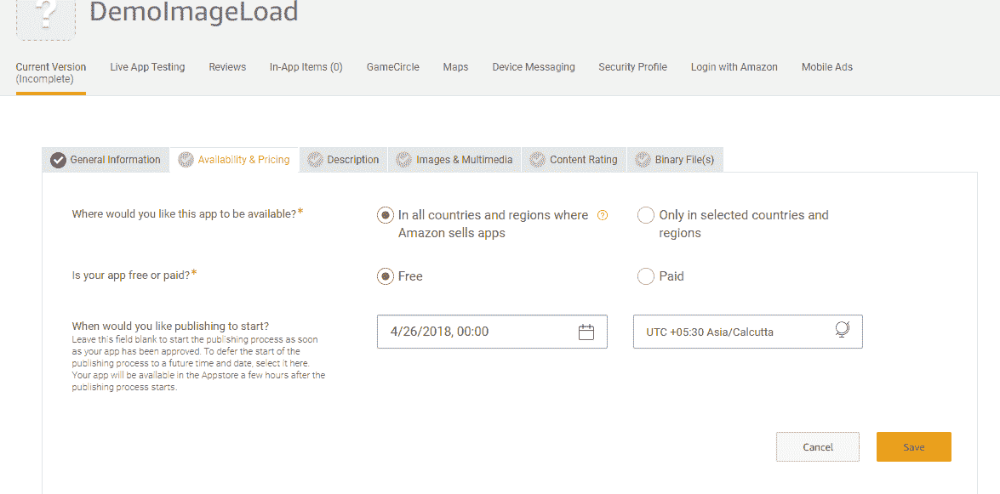

# 描述部分

在描述部分，开发人员需要填写关于标题、简短描述和详细描述的详细信息:

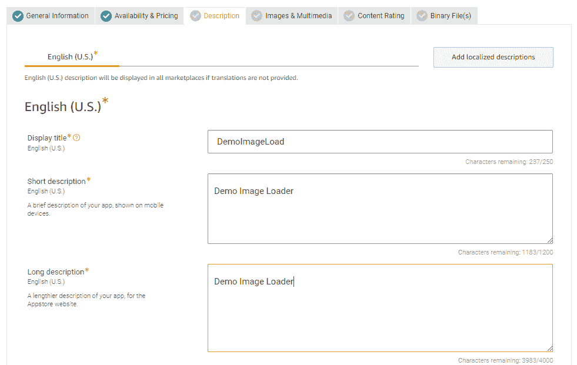

此部分还使开发人员能够提供产品功能项目符号和识别应用的特定关键字。用户还可以选择添加本地化描述:

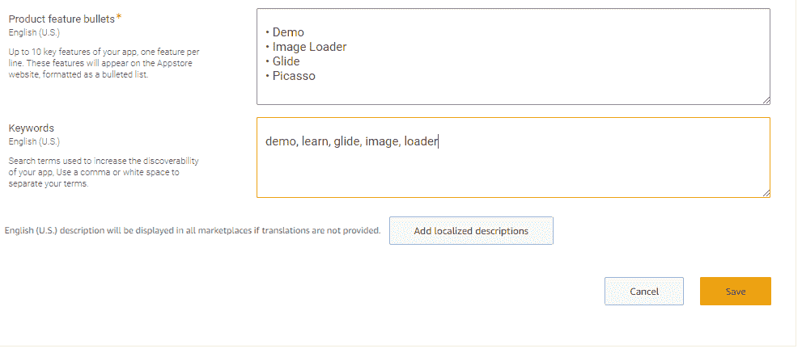

# 图像和多媒体部分

在图像和多媒体部分，开发人员需要输入与应用相关的图形资产。用户应提供:

*   **图标** : 512 * 512 巴布亚新几内亚和 114 * 114 巴布亚新几内亚
*   **截图**:3-10 个 png 或 jpg 之间

还可以选择提供与平板电脑和手机等外形相关的图形:

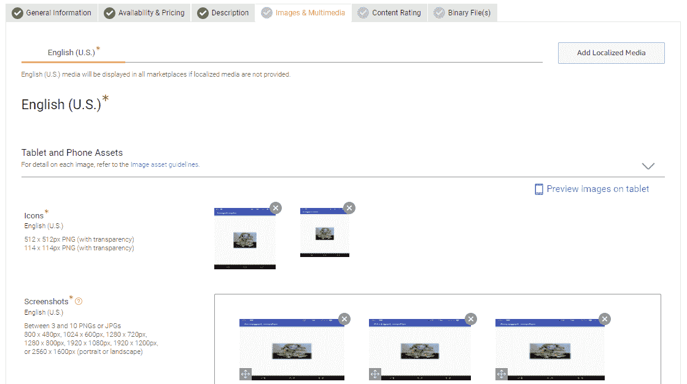

# 内容分级部分

在内容评级部分，开发人员需要回答一组与应用中显示的内容性质相关的问题。这些问题属于主题:


开发人员应回答关于基于位置的服务的使用、应用中的广告、提供隐私政策(如果有)的问题，并披露该应用是否针对 13 岁以下的儿童:

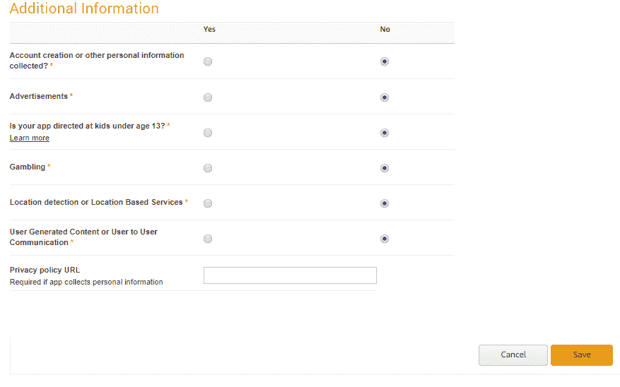

# 二进制文件部分

在本节中，开发人员将上传从AndroidStudio或命令行生成的签名 APK:

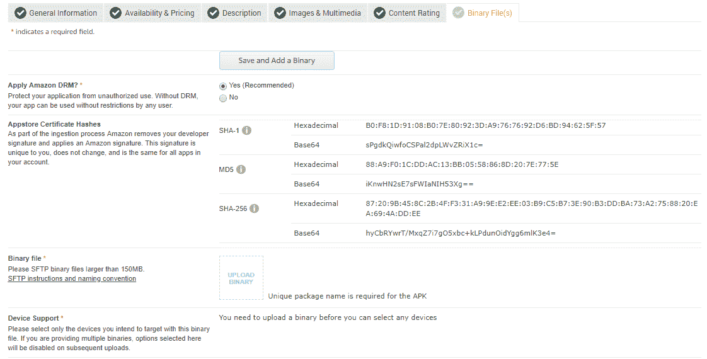

开发人员还可以选择设备支持、语言支持、导出合规性和使用亚马逊地图重定向:

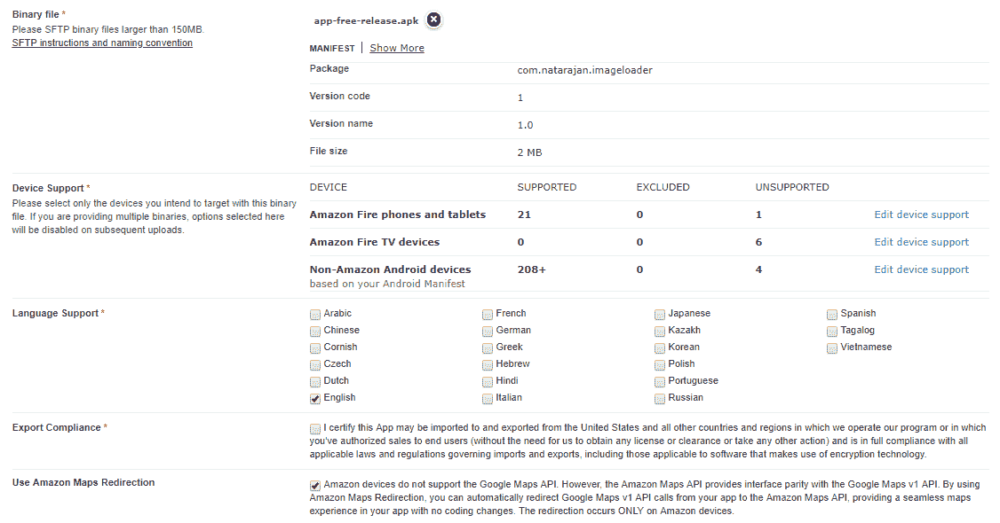

Device support for non-Amazon Android devices is NOT enabled by default. Developers need to enable this explicitly by clicking on Edit device support and making the changes required.

填写完所有需要的信息后，是时候在亚马逊应用商店实际发布应用了。开发人员可以选择查看他们输入的所有信息:

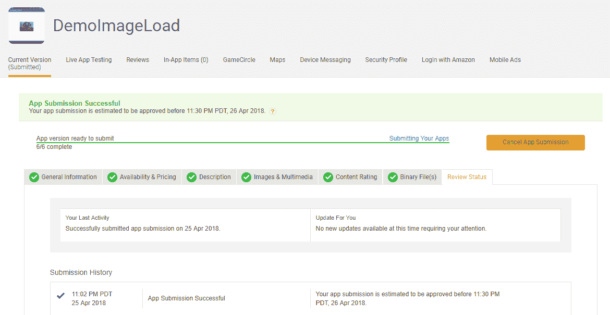

# 摘要

商店列表、关键词、描述等在识别应用以及最终走向应用和开发人员的成功方面发挥着巨大的作用。

在本章中，我们讨论了使用AndroidStudio生成密钥库文件、自动签署 APKs、从命令行生成密钥库文件以及通过谷歌 Play 商店和亚马逊应用商店发布应用所涉及的各个步骤。

在下一章中，我们将了解如何使用我们可用的最有趣和最重要的应用编程接口之一——谷歌人脸应用编程接口。谷歌人脸应用编程接口使开发人员能够提供很酷的功能，如面部检测、识别照片中的人等等。**