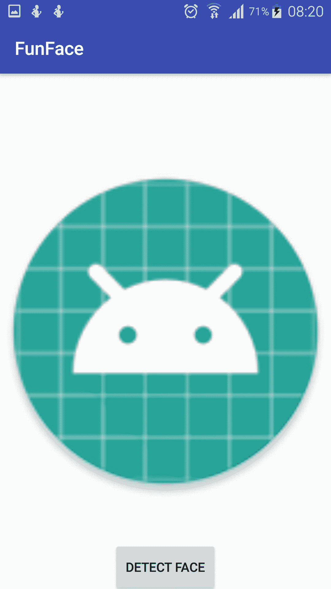
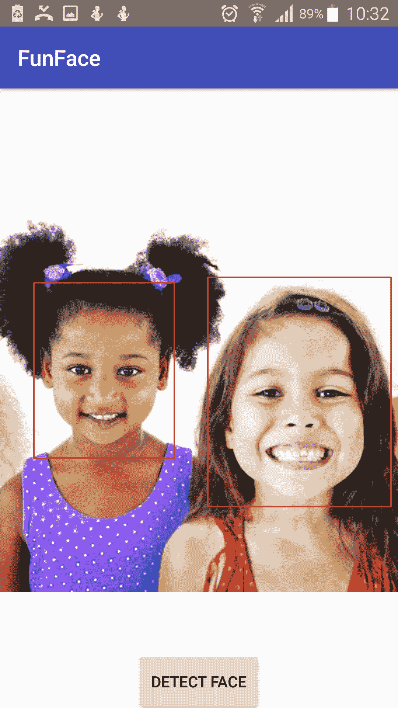
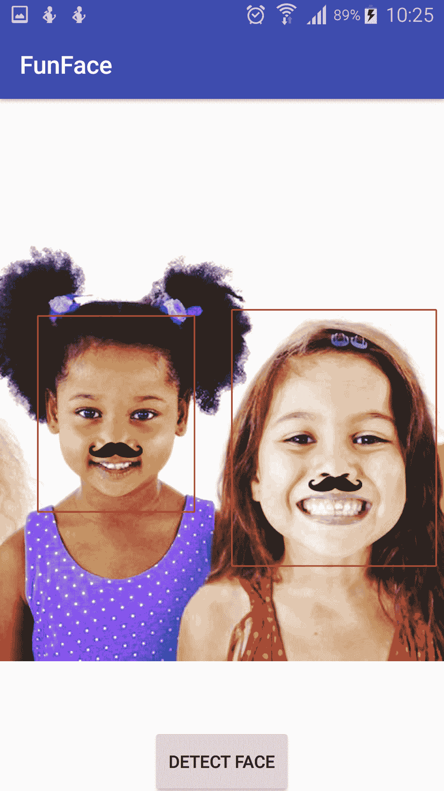

# 使用谷歌人脸应用编程接口构建应用

对于软件和所需的体系结构来说，计算机执行任务(如识别对象)的能力一直是一项艰巨的任务。现在已经不是这样了，因为像谷歌、亚马逊和其他一些公司已经做了所有艰苦的工作，提供了基础设施，并使其作为云服务可用。需要注意的是，它们和进行 REST API 调用一样容易访问。

在本章中，您将学习如何使用谷歌移动视觉应用编程接口中的人脸检测应用编程接口来检测人脸，并添加有趣的功能，例如在用户的图片中添加兔耳。

本章将涵盖以下主题:

*   识别图像中的人脸
*   通过摄像头追踪人脸
*   识别面部的特定部位(例如，眼睛、耳朵、鼻子和嘴巴)
*   在图像中检测到的面部的特定部分上绘制图形(例如，用户耳朵上的兔耳)

# 移动视觉导论

移动视觉应用编程接口提供了一个在照片和视频中查找对象的框架。该框架可以在**图像**或**视频帧**中定位和描述视觉对象，并且它有一个事件驱动的 API 来跟踪这些对象的位置。

目前，移动视觉应用编程接口包括**人脸**、**条码**和**文字**探测器。

# 面向应用编程接口概念

在深入研究特征编码之前，有必要了解人脸检测应用编程接口的人脸检测功能的基本概念。

根据官方文件:

<q>人脸检测是在视觉媒体(数字图像或视频)中自动定位人脸的过程。检测到的面部被报告在具有相关尺寸和方向的位置。一旦检测到一张脸，就可以搜索地标，如眼睛和鼻子。</q>

需要注意的一个关键点是，只有在检测到人脸后，才会搜索眼睛和鼻子等地标。作为 API 的一部分，您可以选择不检测这些地标。

Note the difference between face detection and face recognition. While the former is able to recognize a face from an image or video, the latter does the same and is also able to tell that a face has been seen before. The former has no memory of a face it has detected before.

在本节中，我们将使用几个术语，所以在我们继续之前，让我给大家概述一下每个术语:

**人脸跟踪**将人脸检测扩展到视频序列。当一张脸在视频中出现任意长的时间时，它可以被识别为同一个人，并且可以被跟踪。

需要注意的是，您正在跟踪的人脸必须出现在同一视频中。还有，这不是人脸识别的一种形式；这种机制只是基于视频序列中面部的位置和运动进行推断。

地标**是面部内的感兴趣点。左眼、右眼和鼻底都是地标的例子。人脸应用编程接口提供了在检测到的人脸上查找地标的能力。**

**分类**是确定某个面部特征是否存在。例如，一张脸可以根据它的眼睛是睁着还是闭着，或者是笑还是不笑来分类。

# 入门–检测人脸

您将首先学习如何检测照片中的人脸及其相关地标。

我们将需要一些要求来追求这一点。

至少有了谷歌游戏服务 7.8，你可以使用移动视觉应用接口，它提供了人脸检测应用接口。确保您从软件开发工具包管理器更新您的谷歌游戏服务，以便您满足这一要求。

获取运行安卓 4.2.2 或更高版本的安卓设备或已配置的安卓仿真器。最新版本的安卓软件开发工具包包括软件开发工具包工具组件。

# 创建 funnyface 项目

创建一个名为 FunyFace 的新项目。打开应用模块的`build.gradle`文件，并更新依赖项，以包括移动视觉应用接口:

```kt
dependencies {
    implementation fileTree(dir: 'libs', include: ['*.jar'])
    implementation"org.jetbrains.kotlin:kotlin-stdlib-jre7:$kotlin_version"
    implementation 'com.google.android.gms:play-services-vision:11.0.4'
    ...
}
```

现在，更新您的`AndroidManifest.xml`以包括面部应用编程接口的元数据:

```kt
<meta-data
 android:name="com.google.android.gms.vision.DEPENDENCIES"
 android:value="face" />
```

现在，您的应用可以使用人脸检测 API 了。

为了简单起见，在本实验中，您只需处理应用中已经存在的图像。将以下图片添加到您的`res/drawable`文件夹中:


现在，这就是如何进行人脸检测。

您将首先将图像加载到内存中，获得一个`Paint`实例，并基于原始图像创建一个临时位图，从中创建一个画布。使用位图创建一个框架，然后调用`FaceDetector`上的检测方法，使用这个框架来获取面部对象的`SparseArray`。

好了，让我们言归正传——这就是你将看到所有这些事情如何发展的地方。

首先，打开你的`activity_main.xml`文件，更新布局，让它有一个图像视图和一个按钮。请参见以下代码:

```kt
<?xml version="1.0" encoding="utf-8"?>
<FrameLayout
    xmlns:android="http://schemas.android.com/apk/res/android"
    xmlns:tools="http://schemas.android.com/tools"
    android:layout_width="match_parent"
    android:layout_height="match_parent"
    xmlns:app="http://schemas.android.com/apk/res-auto"
    tools:context="com.packtpub.eunice.funyface.MainActivity">

  <ImageView
      android:id="@+id/imageView"
      android:layout_width="match_parent"
      android:layout_height="match_parent"
      android:src="@mipmap/ic_launcher_round"
      app:layout_constraintBottom_toTopOf="parent"
      android:scaleType="fitCenter"/>

  <Button
      android:id="@+id/button"
      android:layout_width="wrap_content"
      android:layout_height="wrap_content"
      android:layout_gravity="bottom|center"
      android:text="Detect Face"/>

</FrameLayout>

```

这就是你在这里需要做的一切，这样你就有了`ImageView`的`FrameLayout`和一个按钮。现在，打开`MainActivity.kt`并添加以下导入语句。这只是为了确保您在前进时从正确的包导入。在您的`onCreate()`方法中，将点击监听器附加到您的`MainActivity`布局文件中的按钮:

```kt
package com.packtpub.eunice.funface

import android.graphics.*
import android.graphics.drawable.BitmapDrawable
import android.os.Bundle
import android.support.v7.app.AlertDialog
import android.support.v7.app.AppCompatActivity
import com.google.android.gms.vision.Frame
import com.google.android.gms.vision.face.FaceDetector
import kotlinx.android.synthetic.main.activity_main.*

class MainActivity : AppCompatActivity() {

    override fun onCreate(savedInstanceState: Bundle?) {
        super.onCreate(savedInstanceState)
        setContentView(R.layout.activity_main)

        button.setOnClickListener {
            detectFace()
        }
    }
}
```

# 加载图像

在你的`detectFace()`方法中，你将首先把你的图像从可绘制的文件夹加载到内存中，并从中创建一个位图图像。因为当检测到人脸时，您将更新这个位图来覆盖它，所以您需要使它可变。这就是位图可变的原因:

```kt
options.inMutable=true
```

请参见以下实现:

```kt
private fun detectFace() {
    // Load the image
    val bitmapOptions = BitmapFactory.Options()
    bitmapOptions.inMutable = true
    val myBitmap = BitmapFactory.decodeResource(
            applicationContext.resources,
            R.drawable.children_group_picture,
            bitmapOptions)
}
```

# 创建绘制实例

使用`Paint`应用编程接口获取`Paint`类的实例。你只会画脸的周围，不会画整个脸。为此，设置一个细笔画，给它一个颜色，在我们的例子中是红色，并使用`Paint.Style.STROKE`将绘画风格设置为`STROKE`:

```kt
// Get a Paint instance
val myRectPaint = Paint()
myRectPaint.strokeWidth = 5F
myRectPaint.color = Color.RED
myRectPaint.style = Paint.Style.STROKE 

```

The `Paint` class holds the information related to the *style* and *color* related to the text, bitmap, and various shapes.

# 创建画布

要获得画布，首先使用之前创建的位图中的尺寸创建一个位图。使用此画布，您将在位图上进行绘制，以在检测到人脸后绘制其轮廓:

```kt
// Create a canvas using the dimensions from the image's bitmap
val tempBitmap = Bitmap.createBitmap(myBitmap.width, myBitmap.height, Bitmap.Config.RGB_565)
val tempCanvas = Canvas(tempBitmap)
tempCanvas.drawBitmap(myBitmap, 0F, 0F, null)
```

The `Canvas` class is used to hold the call made to draw. A canvas is a drawing surface and it provides various methods for drawing onto a bitmap.

# 创建面部检测器

到目前为止，你所做的基本上都是家务。现在，您将访问人脸检测器应用编程接口，通过该接口，您将检测图像中的人脸。您现在将禁用跟踪，因为您只希望在此阶段检测人脸。

请注意，在首次运行时，播放服务软件开发工具包将需要一些时间来初始化面孔应用编程接口。在您打算使用它时，它可能已经完成也可能没有完成此过程。因此，作为安全检查，您需要在使用前确保其可用性。在这种情况下，如果在应用运行时`FaceDetector`没有准备好，您将向用户显示一个简单的对话框。

另请注意，在 SDK 初始化时，您可能需要互联网连接。您还需要确保有足够的空间，因为初始化可能会将一些本机库下载到设备上:

```kt
// Create a FaceDetector
val faceDetector = FaceDetector.Builder(applicationContext).setTrackingEnabled(false)
        .build()
if (!faceDetector.isOperational) {
    AlertDialog.Builder(this)
            .setMessage("Could not set up the face detector!")
            .show()
    return
}
```

# 检测人脸

现在，您将使用`faceDetector`实例中的`detect()`方法来获取人脸及其元数据。结果将是`Face`对象的`SparseArray`:

```kt
// Detect the faces
val frame = Frame.Builder().setBitmap(myBitmap).build()
val faces = faceDetector.detect(frame)
```

# 在面上画矩形

现在您已经有了面，您将迭代这个数组来获得面的边框的坐标。矩形需要左上角和右下角的`x`、`y`，但是可用的信息只给出了左上角和右上角的位置，所以你必须使用右上角的`left`、`width`和`height`来计算右下角。然后，需要释放`faceDetector`释放资源。下面是代码:

```kt
// Mark out the identified face
for (i in 0 until faces.size()) {
    val thisFace = faces.valueAt(i)
    val left = thisFace.position.x
    val top = thisFace.position.y
    val right = left + thisFace.width
    val bottom = top + thisFace.height
    tempCanvas.drawRoundRect(RectF(left, top, right, bottom), 2F, 2F, myRectPaint)
}

imageView.setImageDrawable(BitmapDrawable(resources, tempBitmap))

// Release the FaceDetector
faceDetector.release()
```

# 结果

一切就绪。运行应用，按下“检测面部”按钮，然后等待一会儿...：



该应用应该能够检测到人脸，并且人脸周围应该会出现一个方框，瞧！



好吧，让我们继续前进，给他们的脸增添一些乐趣。为此，您需要确定您想要的特定地标的位置，然后在上面绘制。

为了找出地标的表现形式，这次给它们贴上标签，然后将滤镜画到所需的位置。

要进行标注，请更新在面周围绘制矩形的 for 循环:

```kt
// Mark out the identified face
for (i in 0 until faces.size()) {
    ...

    for (landmark in thisFace.landmarks) {
        val x = landmark.position.x
        val y = landmark.position.y

        when (landmark.type) {
            NOSE_BASE -> {
                val scaledWidth = 
                       eyePatchBitmap.getScaledWidth(tempCanvas)
                val scaledHeight = 
                       eyePatchBitmap.getScaledHeight(tempCanvas)
                tempCanvas.drawBitmap(eyePatchBitmap,
                        x - scaledWidth / 2,
                        y - scaledHeight / 2,
                        null)
            }
        }
    }
}
```

运行应用，记下各种地标的标签:



给你。很有趣，对吧？

# 摘要

在本章中，您学习了如何使用移动视觉应用接口，在本例中是面部应用接口。这里有几点需要注意。这个程序不是为生产而优化的。你可以自己做的一些事情是加载图像并在后台线程中进行处理。您还可以提供一种功能，允许用户从所使用的静态来源以外的不同来源挑选图像。你可以更有创意地使用过滤器以及它们的应用方式。此外，您可以在 FaceDetector 实例上启用跟踪功能，并输入视频来尝试人脸跟踪。