# 一、虚幻 4 入门

问候！如果你读过这本书，很可能你对使用 UE4 在安卓设备上开发游戏感兴趣。这本书解释了你需要知道的一切，以便开始使用 UE4。从最基本的，如下载和安装软件，到更高级的，如打包你的成品游戏并将其移植到你的安卓设备，一切都将涵盖在本指南中。你可以在 UE4 上为各种平台开发游戏，但我们将关注的是安卓。

在这一介绍性章节中，我们将涵盖以下主题:

*   UE4 及其提供的功能
*   下载并安装 UE4
*   引擎启动器及其用户界面
*   对指南有什么期望

# 期待什么

学习如何使用游戏引擎可能是一项艰巨的任务；你只是不知道从哪里开始，UE4 也不例外。然而，一旦你掌握了它，你会很快发现它是多么的强大和直观。还有什么比在游戏引擎中制作游戏更好的方法来教你如何使用游戏引擎呢？这本书将教会你所有你需要知道的东西，让你能够使用 UE4 在安卓平台上开发游戏，并在这个过程中制作一个实际的功能游戏。这背后的原因很简单；在学习如何开发游戏时，仅仅谈论 UE4 提供的功能并一次演示一个功能并不十分有效。然而，如果一个人通过在游戏中实现这些特性来解释它们，那将会更有效，因为你会更好地理解每个特性如何影响游戏和彼此。

我们在本指南中要制作的游戏叫做 **Bloques** ，这是一款第一人称益智游戏，其中玩家的主要目标是为了进步而解开一系列的谜题。随着玩家的进步，谜题变得越来越复杂，越来越难解决。至于游戏的范围，它将包含四个房间，每个房间都有一个谜题，玩家必须解开才能进入下一个房间。

选择益智游戏的基本原理是，在脚本和关卡设计方面，益智游戏有更复杂的系统。把它放在指南的上下文中，像用蓝图和关卡设计编写脚本这样的事情将通过益智游戏得到更好的展示。虽然游戏将在后面的章节中详细解释，但是游戏的高级功能如下:

*   一个完全渲染的可玩三维环境，有四个房间。
*   交互式环境元素。
*   玩家必须在每个房间里解开一系列的谜题，才能进入下一个房间。随着玩家的进步，谜题变得越来越复杂，越来越难解决。
*   游戏将被优化并移植到安卓系统。

本指南旨在为 UE4 奠定基础，在此基础上，您可以进一步积累知识，并能够实际开发您一直想要制作的游戏！

最后一句忠告是练习！教程和指南只能做这么多。剩下的就看你了。真正掌握 UE4 或其他相关知识的唯一方法是练习。继续尝试，继续制作小原型，让自己了解最新的发展和新闻，并继续与社区互动。

# 系统要求

在你跳进去下载 UE4 之前，首先需要保证你有一个能够运行它的系统！UE4 在 Windows 和 Mac OS X 上都可以工作。以下是每个系统的要求:

*   Windows 7/8、64 位(或 Mac OS X 10.9.2 或更高版本)
*   。NET 4.0
*   DirectX 10 (Mac: OpenGl 3.3)
*   8 GB 内存
*   四核英特尔或 AMD 处理器，2.5 千兆赫或更快
*   英伟达 GeForce 470 GTX 或 AMD 镭龙 6870 高清系列或更高版本
*   至少 9 GB 硬盘空间(8 GB 用于 Mac OS X)

# 下载并安装 UE4

下载安装 UE4 的过程相当简单；只是按照以下步骤操作:

1.  Go to Unreal's official website ([https://www.unrealengine.com/](https://www.unrealengine.com/)). The home page looks like the following screenshot:

    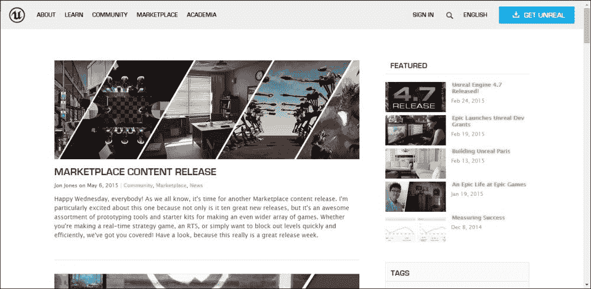

    关于 UE4 你需要知道的一切，你都可以在这里找到——包括最新消息、最新版本的引擎、博客更新、最新的市场条目等等。截至 2015 年，该引擎已免费下载。

    除了 UE4 主页，建议您访问[https://docs.unrealengine.com/latest/INT/](https://docs.unrealengine.com/latest/INT/)。它充满了关于如何使用 UE4 的文档和视频教程。Epic 拥有一个庞大、活跃和友好的社区，总是愿意通过论坛帮助任何面临问题的人。

    ### 注

    您可以通过将鼠标悬停在主页上的**社区**选项卡上直到菜单下降，然后单击**论坛**来访问论坛，或者您可以简单访问[https://forums.unrealengine.com/](https://forums.unrealengine.com/)。或者，您也可以通过访问[https://answers.unrealengine.com/](https://answers.unrealengine.com/)通过 T8】AnswerHub 寻求帮助。

2.  From the home page, click on the **GET UNREAL** button on the right of the screen. Clicking on it will bring you to the subscription page, shown here:

    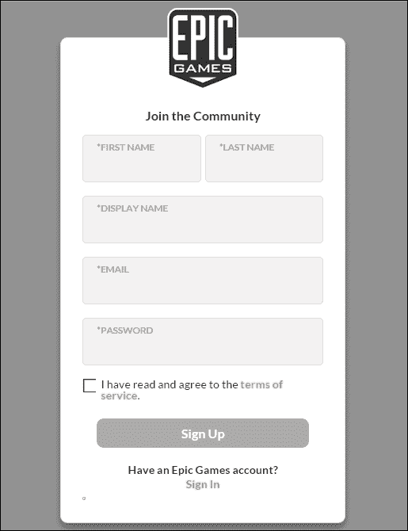

3.  为了下载和安装 UE4，您必须创建一个帐户。要使用 Epic Games 创建帐户，只需填写所需信息，并按照说明进行操作。
4.  To download the Engine Launcher, simply sign in. On your account page, you can access your profile, billing history, previous transactions, and so on.

    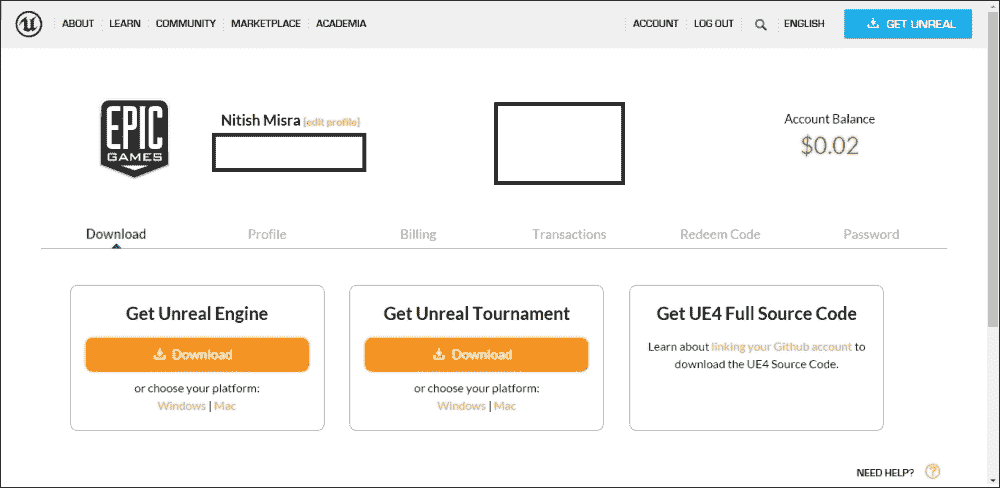

5.  现在已经设置好账号，可以下载 UE4 了。根据您的设置，您可以下载视窗版本或 T2 苹果版本。要下载，在**最新下载**下，点击**下载**按钮，您将下载引擎启动器。
6.  要运行安装程序，只需双击**取消引擎安装程序-*版本号*。msi** 如果您使用的是 Windows 或**unreallengeinstaller-*版本号*。dmg** 如果你用的是 Mac。按照步骤安装发动机启动器。
7.  After the installation is complete, run the Launcher. You should encounter the following screen.

    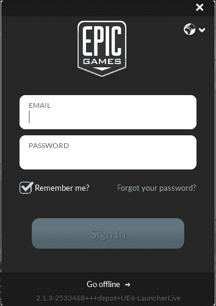

    这是登录屏幕。只需输入您用于订阅的电子邮件地址和密码，然后点击**密码**旁边的箭头按钮或点击*输入*键，即可登录。

8.  登录将打开引擎启动器。稍后我们将详细讨论它及其功能，但目前您只需点击**库**并点击**引擎**旁边的**添加版本**按钮。这样做会创建一个插槽。您可以在添加的版本槽中使用版本下拉列表选择一个版本号，然后点击**安装**按钮，您选择的 UE4 版本将开始下载。

就是这样！您现在已经在电脑(或苹果电脑)上下载并安装了 UE4。要启动引擎，只需点击账号名称下方启动器左上角的**启动**按钮，就可以开始了。如果需要，您也可以启动该引擎的早期版本。点击**启动**按钮旁边的向下箭头，将打开一个菜单，列出发动机的所有版本，要启动它们，只需点击您希望运行的版本。

或者，你也可以点击**库**按钮，选择从那里运行哪个引擎。系统上安装的所有版本都会列出，您只需点击**启动**按钮，即可从列表中启动任何版本。

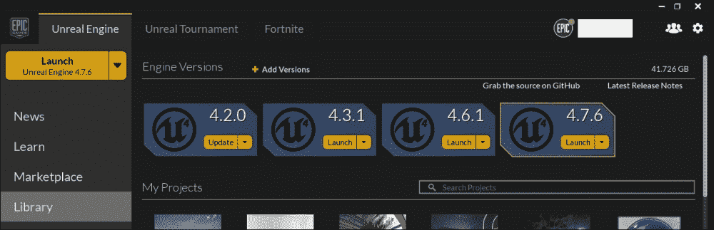

但是坚持住！在准备开始使用 UE4 之前，我们还有一些事情要讨论。让我们快速看一下目录结构。

## Windows 目录结构

UE4 的默认安装位置是`C:\Program Files\Unreal Engine\`。如果您愿意，可以在安装过程中更改此设置。打开目录后，您会发现每个版本的引擎都有自己独立的文件夹。比方说，您的系统上安装了 UE4 的 4.1、4.2 和 4.3 版本。三个版本都有三个独立的文件夹，分别是`4.1`、`4.2`和`4.3`。下面的截图会给你一个更好的想法:

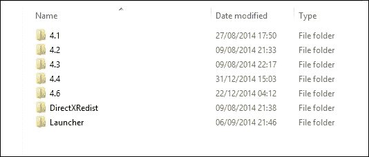

引擎的每个版本都有自己的文件夹。除此之外，还有另外两个文件夹，即`DirecXRedist`和`Launcher`。

### windows directxrdist

`DirectXRedist`是文件所在的。该文件夹还包含安装文件，您可以从中安装`DirectX`。

### 发射器

`Launcher`文件夹包含引擎启动器的所有文件。`Launcher`文件夹包含以下子文件夹:

*   `Backup` : UE4 有一个优秀的功能，可以让你创建你的作品的备份。如果开发人员犯了不可修复或难以修复的错误，或者如果引擎在开发过程中崩溃，而不是让他/她重新做所有的工作，他们工作的备份将存储在`Backup`文件夹中，这样他们就可以从他们停止的地方继续。
*   `Engine`:这个文件夹包含组成引擎的所有代码、库和内容。
*   `PatchStaging`:每隔一段时间，Epic 都会发布新版本的 UE4。截至 2015 年，最新版本为 4.7.6。(4.8 的预览版在撰写本文时可用)。当你在下载过程中，当前正在下载的 UE4 版本的所有数据都存储在`PatchStaging`文件夹中。
*   `VaultCache`:正如本章稍后将解释的那样，你现在需要知道的是，你在市场上购买的所有东西都包含在**保险库**中。`VaultCache`包含所有购买物品的缓存文件。

### 4。十个文件夹

在我们谈论和`4.X`文件夹之前，您应该知道 UE4 的所有版本(4.1、4.2、4.3 等)都是相互独立的。这意味着您不需要以前的版本来运行更高的版本。例如，如果您希望运行版本 4.4，那么您不需要下载版本 4.0、4.1、4.2 和 4.3 来运行它。你可以简单地下载 4.4 版本，使用它没有任何问题。这就是为什么虚幻 4 的每个版本都有一个单独的文件夹，每个版本都被视为一个独立的实体。

所有的`4.X`文件夹，虽然是分开的，但是包含相同的一组子文件夹，因此它们被组合在一起。以下是子文件夹:

*   `Engine`:类似于启动器的`Engine`文件夹，这里包含了构成引擎的所有源代码、库、资源、地图文件等等。
*   `Samples` : UE4 有两个样图，最小默认和起始图。该文件夹包含所有内容，包括素材、蓝图等。
*   `Templates` : UE4 为各种类型的游戏提供模板，例如第一人称、第三人称、2D 侧滚屏、自上而下等等。这里包含了所有这些流派的内容和源代码。

# 发动机发射器

引擎启动器是一个在你运行引擎后打开的窗口。它充满了对你非常有用的特性和资源。首先，我们将看看引擎启动器的用户界面，它的分解，所有东西的位置，它的功能，等等。

打开引擎启动器后，您将看到以下窗口:

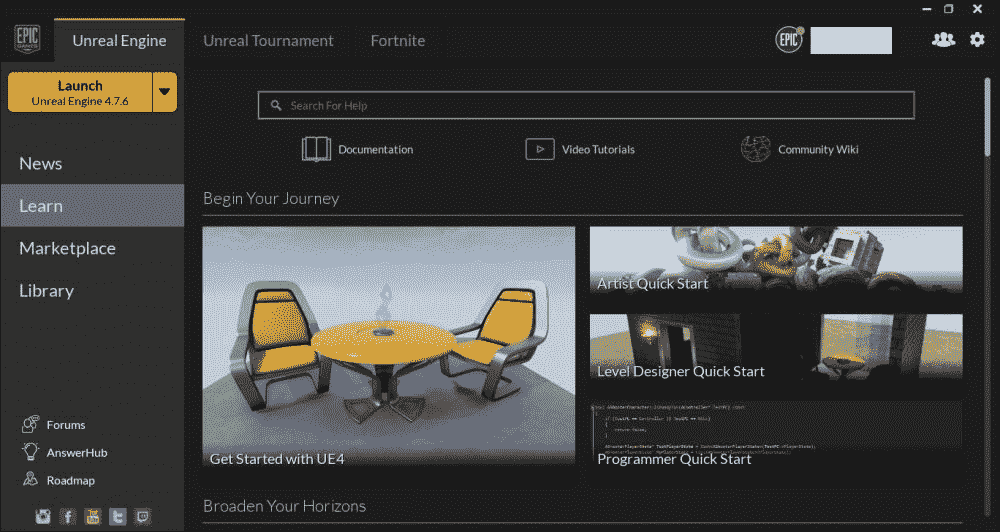

左上角有三个标签，**虚幻引擎**、**虚幻赛事**、**堡垒之夜**。默认情况下，“虚幻引擎”选项卡是打开的，包含您在前面的截图中看到的内容。

**虚幻锦标赛**选项卡是您查找关于最新虚幻锦标赛游戏的信息和链接的地方。

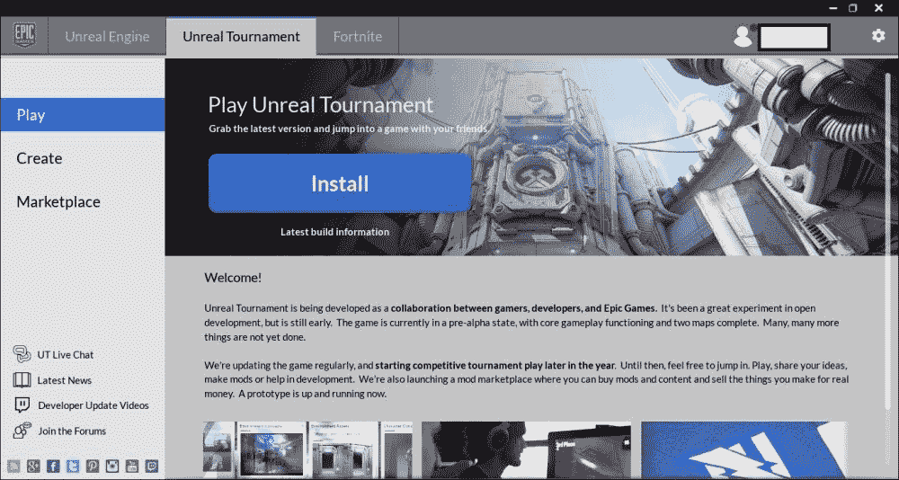

如前所述 Epic 最新项目《虚幻锦标赛》是 Epic 接受并鼓励来自社区的内容，如武器皮肤、玩家皮肤、关卡等的项目。从这里，您可以下载最新的虚幻锦标赛，购买其他社区成员创建的内容，还可以获得关于虚幻锦标赛的所有最新消息和更新。

最后一个标签是**堡垒之夜**标签。Epic 目前正在进行另一个项目，即堡垒之夜。

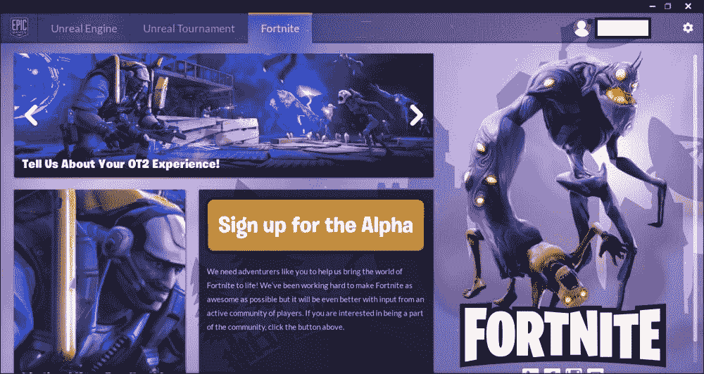

在撰写本文时，Alpha 版本已经推出。您可以注册它，给开发者反馈，并从该选项卡访问官方脸书页面、推特页面、Instagram 帐户和 Twitch 流。

右上角带标签的面板上有两个按钮，**好友列表**按钮，**设置**按钮。当您点击**好友列表**按钮时，会打开一个窗口，您可以在其中管理您的好友列表，如添加和删除好友、查看谁在线等。您也可以将您的状态设置为在线**或离开**。****

 ****下一个按钮是**设置**按钮，您可以在其中找到关于引擎启动器的某些选项，例如访问支持页面、查看启动器日志、退出启动器等。

左上角是**启动**按钮，如前所述，启动发动机。下面是几个面板；每个都包含不同的东西。让我们分别看看这些面板。

## 新闻

**新闻**面板包含所有关于 UE4 和 Epic 的最新消息和更新。从这里，您可以访问关于 UE4 当前/最新版本的最新文章、市场上发布的最新内容、关于特定主题的最新教程系列、Twitch 概述等等。这是一个了解 Epic 和 UE4 的最新动态的地方。

### 注

新闻区是定期更新的，所以每隔一段时间检查一次新闻区是非常明智的。

## 学习

顾名思义，这里是你可以找到所有关于 UE4 的教程和文档。**学习**部分提供了视频教程，比如如何使用蓝图，书面教程，里面有如何使用 UE4 的逐步说明，最后还有游戏内容示例，它们是项目文件，已经设置好了一切，比如级别、灯光、素材，以及蓝图脚本，这样你就可以亲自看到什么做什么，可以实验什么。

在**学习**部分的顶部有三个按钮，分别是**文档**、**视频教程**、**社区维基**。点击**文档**会将你发送到 Epic 官方的虚幻引擎 4 文档页面，内容涵盖如何使用编辑器、蓝图、日场等各种主题。

**视频教程**按钮将带你进入 Epic 的视频教程页面，在这里一切都被整齐地分类。每个类别都有一定数量的系列。一个系列包含一组涵盖特定主题的视频教程。例如，蓝图类别目前有六个系列，包括介绍、如何创建库存、第三方游戏创建等。

最后，社区维基是一个活生生的维基页面，人们可以在这里发布教程、代码、项目、插件等等。这是获取用户内容和查找其他开发人员创建的教程的好方法。这里还值得一提的是，Epic 目前正在开发他们的最新项目，虚幻锦标赛。这个标题很棒的一点是，他们也接受并实现了社区创建的内容。这包括开发游戏的核心功能、关卡、人物、枪械、HUD 图形等等。

### 注

如果你有兴趣为这个项目做贡献，或者对整件事感兴趣，就去维基的虚幻锦标赛部分，它会给你所有你需要知道的关于这个项目的信息。下面是根据类型分类的各种教程，您可以查看/下载这些教程并了解更多关于 UE4 及其功能的信息。

## 市场

市场是开发者可以购买素材的地方。缺乏创造素材的人力或资源的开发者可以在他们的游戏中购买和使用素材。这些包括网格、材质、动画集、操纵的角色、音频文件、音效、项目和教程等。市场上的某些商品，如史诗本身的商品是免费的。它们大多是教程项目文件，已经设置了一个示例级别来展示 UE4 提供的各种功能。这些项目文件还设置并实现了所有的级别蓝图，这样用户就可以看到它们，并对它们进行实验，直到掌握其中的窍门。市场上由用户创建的其他项目需要花钱。为了您的方便，您可以购买的素材根据内容类型进行了整齐的分类。

除了购买素材，你还可以在市场上提交自己的内容，并从中赚取一些钱。点击市场屏幕右上角的**提交您的内容**超链接，将打开 Epic 的请求提交页面。“请求提交”页面包含有关提交内容的所有信息。

它还有市场商业条款，里面有所有关于销售收入如何分配、你将如何获得报酬、何时获得报酬等信息。它还有市场提交指南，解释了提交过程，你需要提交什么，截图的解决方案，等等。您还可以通过在论坛上发帖来获得更多关于提交过程的信息以及对您的内容的反馈。

## 图书馆

库是列出 UE4 所有版本、所有项目以及从市场购买的所有物品的地方。让我们更仔细地看看它。

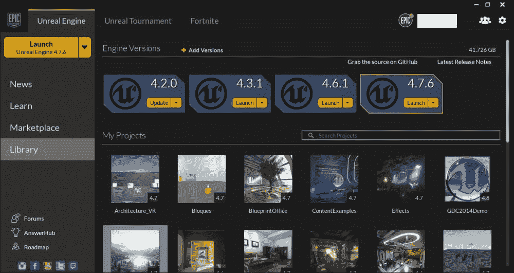

库有 3 个部分，**引擎版本**、**我的项目**和**金库**。 **引擎版本**部分显示当前安装在您系统上的 UE4 的所有版本。您可以从这里启动任何版本的引擎。此外，您还可以下载最新版本或以前的版本。为此，只需点击面板顶部的**添加版本**，就在**引擎版本**旁边。单击它将为您希望下载的版本创建一个插槽。

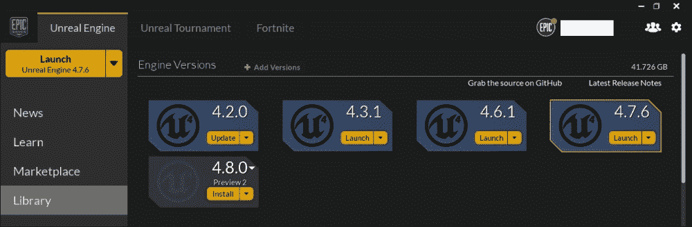

从上一张截图中可以看到，点击**添加版本**按钮，为虚幻 4 的最新版本创建了一个槽，在本例中是 4.8.0(虽然只是预览版)。要下载，只需点击**下载**按钮，它将开始下载。

此外，您可以删除不需要的 UE4 版本。例如，如果您有最新版本，如果您希望删除以前或旧版本的引擎以腾出硬盘空间，这是可以理解的。为此，只需将光标悬停在版本槽的左上角，直到看到一个 **x** 。一旦你看到 **x** ，只需点击它，相应版本的 UE4 将被卸载。另一种卸载方式是点击**启动**旁边的向下箭头按钮，打开下拉菜单；从这里，选择**移除**，引擎启动器将卸载该版本。

库的第二部分是**我的项目**部分。在此部分，显示您创建的所有项目。

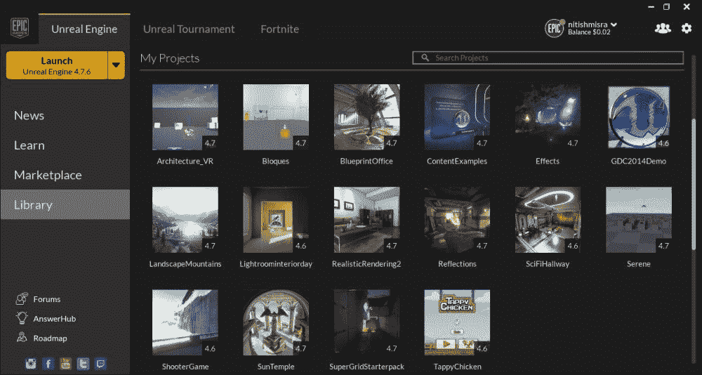

这些项目是按字母顺序分类的。右上角是搜索栏。在前面的截图中，项目文件相对较少；因此，很容易找到具体的项目。然而，如果你有很多项目，可能更难找到你要找的项目。在这种情况下，您可以在**搜索项目**选项卡中键入您需要的项目名称，它将为您找到它。

在项目缩略图的右下角，您可以看到项目是在哪个版本的引擎中创建的。例如，在之前的截图中，项目**效果**是用 UE4 的 4.0 版本创建的。如果您打开该项目文件，启动器将启动 UE4 的 4.0 版本。但是，如果您没有相应的版本，那么在启动项目时，您将被要求选择希望在哪个已安装的版本中启动项目文件。做出选择后，它会将项目转换为与您选择的版本兼容，并启动它。但是，在转换项目时一定要小心，因为可能会出现一些意外问题。建议在转换项目之前创建项目的备份副本。

要启动项目，双击缩略图。除了打开项目，您还可以对项目执行其他操作。右键单击缩略图会打开一个菜单。点击**删除**将删除相应的项目。点击**克隆**将创建项目文件的副本，点击**显示在文件夹中**将打开您系统中存储所有项目文件的文件夹。

最后是**金库**。您在市场上购买的所有物品都包含在**保险库**中。

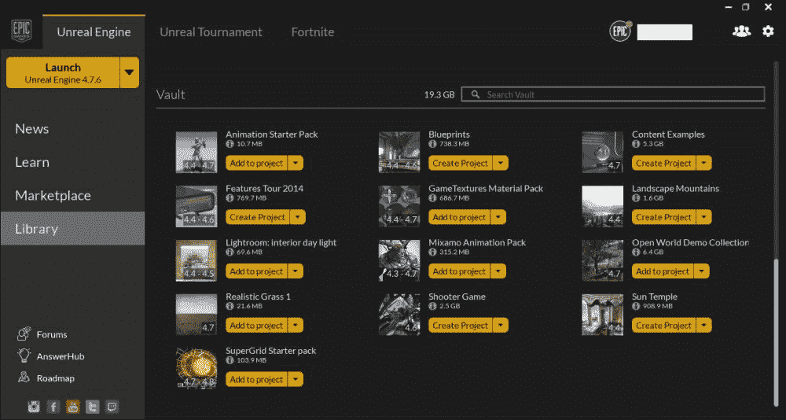

前面的截图展示了**金库**的样子以及物品的排列方式。左边是项目的缩略图，后面是所述项目的名称。名称下方是该项目占用的空间量。名称下方的蓝色 **i** 图标是关于兼容性的信息。将光标悬停在**上，我**将向您显示该项目与 UE4 的哪些版本兼容。

兼容性也显示在缩略图的右下角，类似于**我的项目**。让我们以 Vault 中的第一个项目为例，即动画初学者工具包。缩略图上写着 **4.4-4.6** 。这意味着动画初学者工具包与 4.4、4.5 和 4.6 版本兼容。

您可能已经注意到某些项目有**添加到项目**选项，而其他项目有**创建项目**选项。动画包、资源、素材和音频文件等项目可以添加到您已经创建的任何项目中，并且您可以在自己的级别中使用它们。项目和展示有**创建项目**选项。点击后会创建一个项目，显示在**我的项目**中，可以打开。此外，您可以通过单击向下箭头并单击下拉菜单中的相应选项来验证或删除任何项目。

## UE4 链接

启动器用户界面中的最后一个元素是位于左下角的 UE4 链接。不出所料，UE4 链接包含指向不同网页的超链接。

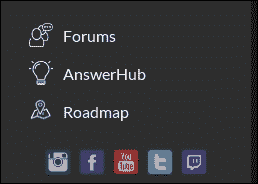

让我们仔细看看它们:

*   **Forums**: UE4 has a large and active community. The forum is a great place to meet other developers, share your ideas, show your work in progress and get feedback, team up with other members and develop a project, and so on.

    论坛的讨论板根据你想讨论的话题进行了整齐的分类。有开发讨论部分，在这里你可以谈论蓝图、动画、渲染、C++游戏编程等等。然后是社区部分，你可以展示你正在进行的工作并获得反馈，还可以看到其他人的工作并给他们反馈。接下来是 UE4 for Schools 部分，专门让学生和老师讨论 UE4 和教育计划。最后，还有国际部分，你可以在那里与你的开发人员互动。因为几乎所有的成员都来自同一个区域，所以为一个项目招募和与人合作变得更加容易和方便。

*   **AnswerHub**: Sometimes, you may face a problem or issue, or have a very specific question that needs to be answered, which you would not find in any documentation or tutorial. In such a scenario, the best course of action is to seek help from others and/or the Epic staff themselves. AnswerHub is a great forum wherein you can resolve any issues, technical or otherwise, with the help of the UE4 community or from the Epic staff. To do so, simply login, post your question, and wait for someone to reply.

    或者，如果你感到慷慨，你可以通过帮助他人解决他们可能面临的任何问题来回报社区，并在这个过程中建立强大的声誉。

*   **路线图**:社区是 UE4 的重要组成部分。Epic 的开发人员希望尽可能地包括社区，并对他们的开发过程保持透明。这一点在路线图中表现得最为明显。路线图列出了开发过程中的特性，并给出了这些特性何时部署的估计。

Epic 的社交图标在最底层。从左到右，它们如下:

*   **Instagram** :你可以关注 Epic 的 Instagram 个人资料，他们在那里发布关于 UE4 的照片和视频，比如环境、事件、素材等等。他们的 Instagram 链接是[https://instagram.com/UnrealEngine/](https://instagram.com/UnrealEngine/)。
*   **脸书**:点击这里的将带你进入虚幻引擎的官方脸书页面，和 Instagram 一样，所有关于 UE4 和 Epic 的更新都发布在这里。他们脸书页面的链接是[https://www.facebook.com/UnrealEngine](https://www.facebook.com/UnrealEngine)。
*   **YouTube** :这个会带你进入官方的虚幻引擎 YouTube 页面，在这里你可以访问所有之前的 Twitch 流、教程等等。他们 YouTube 页面的链接是[https://www.youtube.com/user/UnrealDevelopmentKit/](https://www.youtube.com/user/UnrealDevelopmentKit/)。
*   **推特**:如果你想在推特上关注他们，这将把你带到的官方推特页面。官方虚幻引擎推特手柄是`@UnrealEngine`
*   **Twitch Stream** :美国东部时间每周四下午 2 点(撰写本文时)虚幻团队有一个 Twitch Stream，他们在这里讨论最新消息，谈论 UE4 的最新版本，增加了或修改了哪些功能，并回答观看该流的观众提出的任何问题。

# 总结

你现在已经朝着成为 UE4 安卓开发者迈出了第一步。这一章只是冰山一角；仍然有很多事情要做。

在这一介绍性章节中，我们介绍了什么是 UE4 以及 UE4 提供的功能。您还学习了如何下载和安装 UE4。现在，您已经非常熟悉引擎启动器、它的用户界面和功能

所有这些主题为我们的下一章提供了一个很好的开端，我们将在这一章中介绍编辑器。在我们开始使用它之前，重要的是您知道并理解它是什么，如何浏览它，以及它的用户界面和功能。下一章专门讨论这个问题。所以，不用多说，让我们继续下一章。****