# 第四章。使用参与者、类和卷

我们已经建立了我们的环境，放置了所有重要的角色和物品。如果不是更多，也有其他同样重要的对象(或演员)类型，没有它们，游戏就不会完整。这些是 Visual 和 Basic 类和 Volumes，它们是具有特殊属性的参与者。有些对游戏至关重要，而有些则增加了特殊功能。在这一章中，我们将会看到其中的一些卷和类，以及它们如何影响游戏。我们将涵盖以下主题:

*   基础课
*   视觉效果
*   卷
*   所有类别

# 基础班

我们将首先介绍基础课。这些可以在**基本**部分下的**模式**面板中访问。

这包含了几乎所有游戏都必不可少的最基本的类，无论它们的类型或流派如何。让我们复习一下:

*   **空演员**:一个演员是放置在游戏世界的任何物体。所有的物体、灯光、相机、体积等等都是演员。一个空的参与者是一个空的实体，你可以把它放在你的等级中。它没有任何固有的属性。
*   **空角色**:一个 **空角色**没有网格或者任何动画——只是一个碰撞胶囊。
*   **空卒**:一个**卒**就是一个可以被玩家或者 AI 附体(换句话说就是控制)的演员。游戏的角色，游戏中所有的敌人，盟友，NPC 都是棋子。
*   **玩家开局**:顾名思义，**玩家开局**是玩家在玩游戏时产卵的地方。如果关卡中没有 Player Start 演员，则该玩家将在世界原点(`0`、`0`、`0`)产卵。
*   **点光源**:如前一章所述，**点光源**是最基础、使用最广泛的光源。您也可以从这里添加点光源演员。
*   **立方体**:这个给游戏增加了一个立方体图元(静态网格)。
*   **球体**:这在游戏中增加了一个球体图元。
*   **圆柱体**:这给游戏增加了一个圆柱体图元。
*   **圆锥**:这个给游戏增加了一个圆锥图元。
*   **方块触发/球体触发**:下一个两个演员因为服务于同一个目的而被棍棒打在一起；唯一不同的是它们的形状。简单来说，触发器增加了游戏的互动性。您可以为触发器添加一个事件(例如，如果玩家触摸它，点击一个特定的键，等等)，当完成时，它会执行开发人员设置的特定动作。例如，你可以有一个触发器，当玩家触摸时，它会打开灯，等等。UE4 提供了两种默认形状:长方体和球体。您也可以创建自定义形状触发器，但稍后会有更多内容。

## 为游戏添加基础类演员

既然你已经熟悉了基础课，让我们继续并增加一些到我们的水平。

### 放置玩家开始演员

我们要去的第一个地方是玩家启动演员。它的位置至关重要，应该事先决定。在我们的游戏中，我们希望我们的玩家从第一个房间开始。记住这一点，拖动“玩家开始”演员并将其放在第一个房间，远离门。

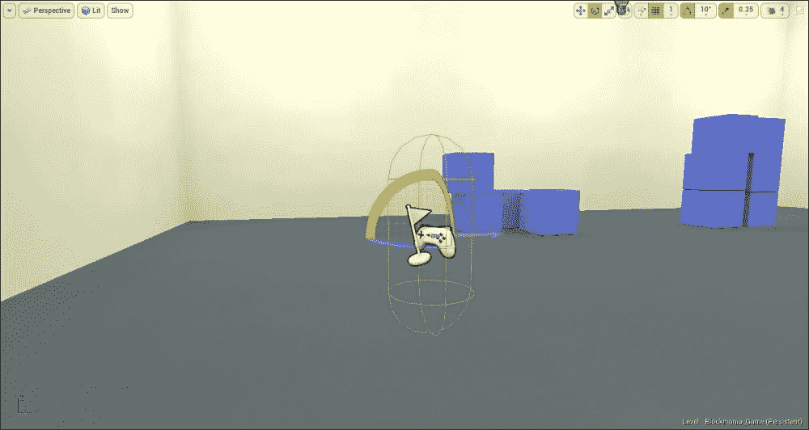

演员由旁边有旗帜的游戏手柄代表。如你所见，它周围有一个胶囊状的体积。这个胶囊是为了让你了解角色的大小以及游戏开始时的位置。因此，确保胶囊不与任何其他演员或表面重叠，因为这样做将把图标变成一个标志，上面写着**坏尺寸**。您可以使用**缩放**工具调整此胶囊的大小，使其符合角色。

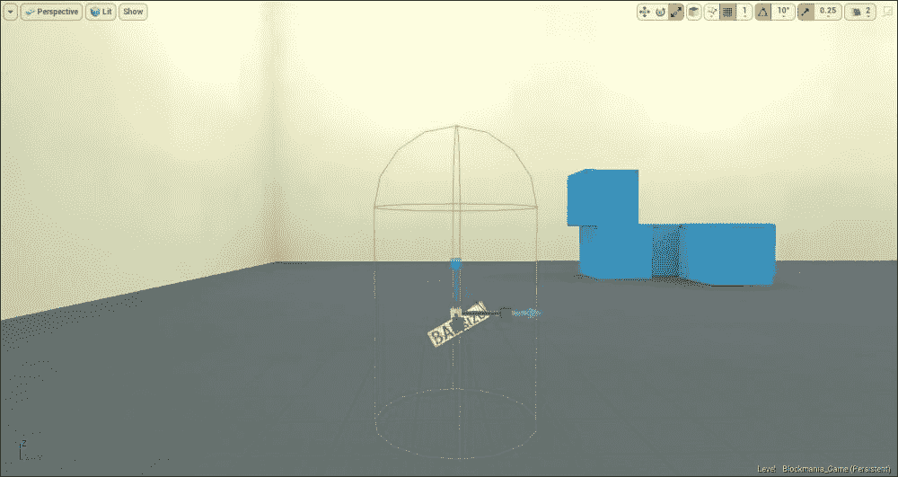

您可能还注意到图标旁边有一个蓝色箭头。箭头指向的方向是游戏开始时角色将要面对的方向(记住， *W* 代表平移工具， *E* 代表旋转工具， *R* 代表缩放工具)。您可以在旋转动作的帮助下改变这个方向。如果你点击**播放**按钮，角色会朝着箭头的方向在演员所在的位置出现。

### 添加触发器

接下来，我们将添加触发器。我们将通过只使用 Box 触发器来简化事情。要放置一个盒子触发器，只需从**模式**面板中拖动它，并将其放置在水平位置。我们将在下一章讨论触发器。现在，您可以简单地将触发器放置在下面几节中提到的位置。

永远要说出你的演员，不管是触发器、灯光、角色等等。它不仅被认为是好的实践，而且它将使你的项目更容易阅读，并将保持一切井然有序，更容易跟踪。

#### 1 号房间

在第一个房间，将第一个触发器放在钥匙立方体附近。此触发器将用于与密钥多维数据集交互。这个触发器(或者任何相关的触发器)的位置和尺寸很重要，因为它们决定了玩家可以与关键立方体交互的程度。比如扳机太大，玩家就能从远处捡起钥匙立方体，这不是我们想要的。我们希望玩家在拿起钥匙立方体之前，相对靠近或邻近它。

牢记这一点，放置触发器并设置尺寸，使其封装整个关键立方体(以便玩家可以从任何方向捡起它)，并使其更高(以便玩家不必直接看着关键立方体来捡起它；否则，它会变得令人讨厌)。最后，使触发器大于键立方体。一旦设置，它应该看起来像下面的截图:

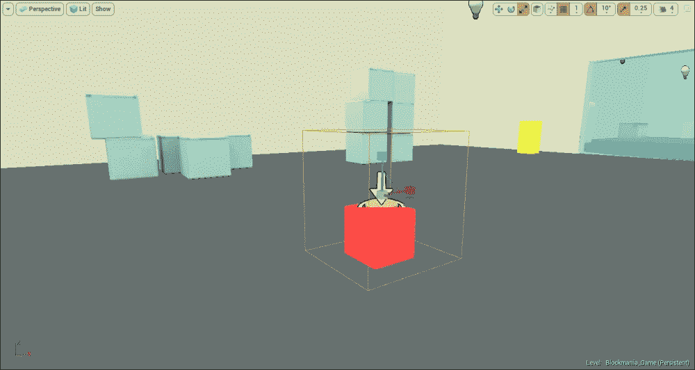

在这个房间的基座上添加下一个触发器。这是玩家必须放置钥匙立方体才能开门的地方。

再一次，拖放一个盒子触发器，并把它放在底座的顶部。同样，就像我们对关键立方体的触发器所做的那样，设置这个触发器的尺寸，这样玩家就可以从任何方向与它交互，而不必站在它旁边与之交互。

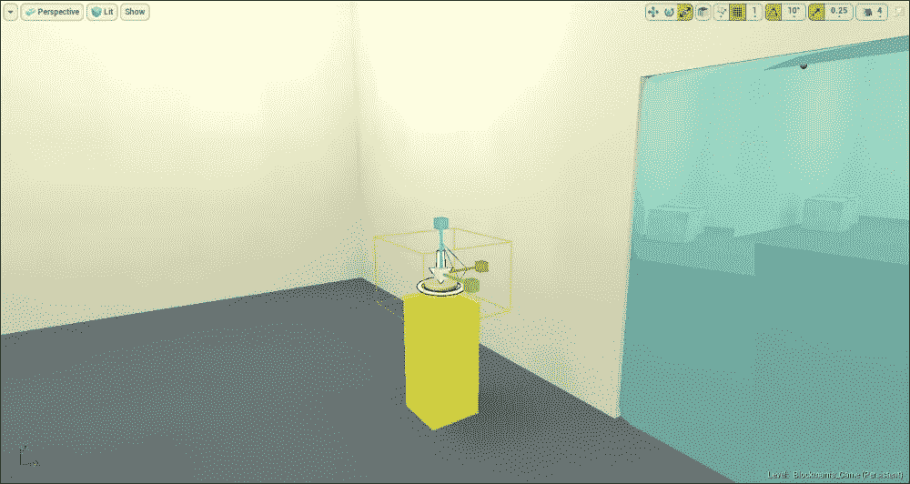

要检查触发器的位置以及其位置和尺寸是否设置正确，您可以首先通过取消选中隐藏在游戏中的**演员**选项来取消隐藏触发器演员，该选项位于触发器的**细节**面板中，然后播放关卡。目前，就触发器放置而言，这是可行的。我们现在去第二个房间。

#### 2 号房间

在第二个房间，将第一个扳机放在房间中间的大门附近。现在，我们希望玩家能够从任何地方开门。记住这一点，放置扳机，使其覆盖整个门的长度和宽度。再次，调整宽度，记住你希望玩家离门有多近，以便与门互动。

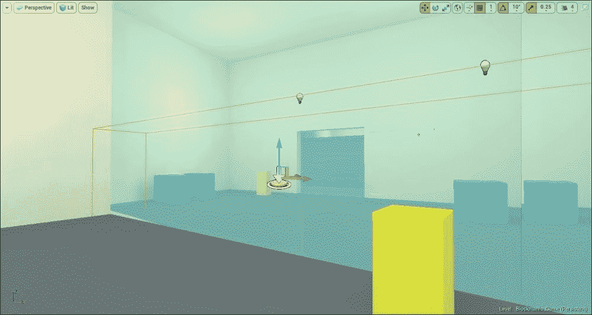

接下来，将下一个两个触发器放在基座上，类似于其他房间中的触发器。由于底座的尺寸相似，您可以通过将它们复制到上一个房间来放置触发器。

我们不会像上一个房间那样在钥匙立方体上放置任何触发器。这背后的原因将在下一章解释。

#### 3 号房间

在第三个房间，我们有几个基座，上面有按钮。因此，我们需要触发器来进行交互。同样，不要在键多维数据集上放置触发器。

#### 4 号房间

最后，在第四个房间，和前面的房间一样，在所有的基座和门上放置触发器。

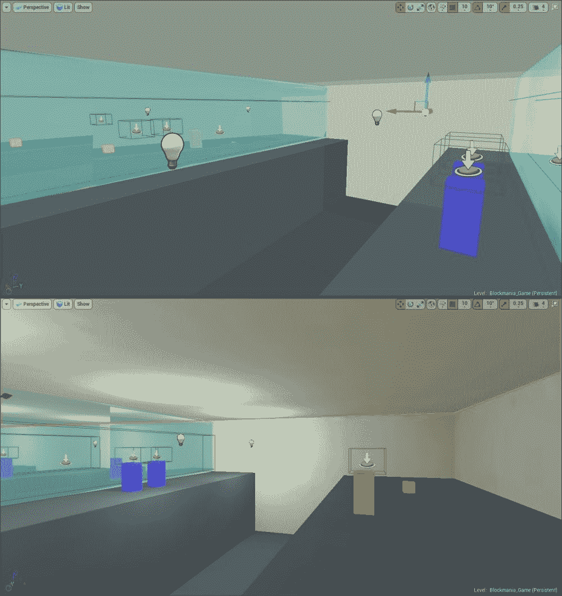

我们现在已经放置了游戏所需的大部分触发器。我们稍后会添加更多。这样，我们就完成了将基础类放入我们的级别。现在让我们进入视觉效果类，看看它如何影响我们的游戏。

# 视觉效果

由于我们已经在上一章中介绍了光类，我们将跳过它，直接进入视觉效果类。视觉效果类包含影响游戏视觉效果的演员。虽然不是游戏的必要组成部分，但它们有助于提高游戏的整体质量。

此外，它们不需要大量的内存。

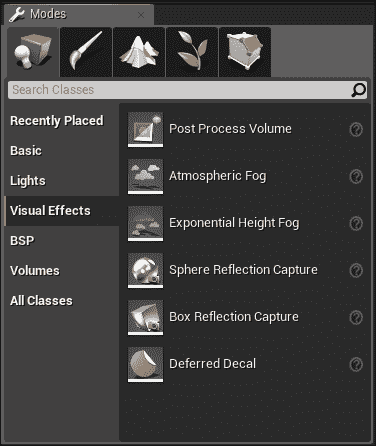

视觉效果类有各种各样的演员:

*   **后期处理卷**:这是一个可以用来操控游戏观感的演员。这些效果将在玩家处于音量状态时产生。有许多可用的效果。一些例子包括**反走样**(去除演员的硬边缘，使他们有更平滑的效果)**绽放**(在现实生活中，在较暗的背景下看一个明亮的物体时可以看到)**景深**(根据物体与焦点的距离模糊物体)等等。使用**后处理卷**可以给游戏增加几个效果；所以用这个体积做实验，看看你能用它做什么。
*   **大气雾**:在一个的室外层面，仅仅有一个天窗是不足以提供一个逼真的室外场景的。实际上，来自太阳的光由于地球的大气层而散射和扩散。为了在游戏中有这种效果，你需要在关卡中加入**大气雾**演员。可以设置**太阳倍增器**(点亮雾和天空)**默认亮度**(设置**雾的亮度**)**默认光色**(设置大气的颜色)等属性。
*   **指数高度雾**:你可以用这个演员给你的关卡增加雾和薄雾。这也多用于户外场景。您可以设置属性，例如**雾**密度、**雾**的颜色、**雾高度衰减**(当我们上升时雾的密度如何降低)等等。
*   **球体反射捕捉**:这个是另一个有用的工具。**球体反射捕捉**演员获取照明信息，并提供逼真的反射效果，使材质具有光泽。金属材质和类似材质依靠这个演员来提供逼真的效果。在演员的设定面板中，你会看到一个叫做**影响半径**的东西，就是演员有影响力的音量。您可以增加或减少它。下面是**亮度**设置，你可以用它来设置你想要的反射亮度。请记住，如果您在关卡中更改灯光(通过移动灯光、更改亮度、更改颜色等)或移动演员，则**球体反射捕捉**演员不会更新。您必须手动更新，这可以通过位于**影响半径**选项上方的**更新捕捉**按钮来完成。
*   **盒子反射捕捉**:这是类似**球体反射捕捉**。唯一的区别是虽然**球面反射捕捉**演员有一个球面影响区域，但是 Box 反射捕捉演员有一个立方体影响区域，这使得它相对来说不如**球面反射捕捉**演员有效。这个演员最好用在走廊或小房间里。它的设置与**球体反射捕捉**演员相同，只是它没有影响半径，而是有一个**盒子过渡距离**，可以用来增加或减少它的影响区域。同样，与**球体反射捕捉**演员一样，如果您更改游戏中的灯光或对象，您将必须单击**更新捕捉**按钮来更新反射。
*   **延迟贴花**:**延迟贴花**演员提供了一种简单且廉价的方式将贴花添加到对象上。这是一个很好的方式来增加效果，如血液飞溅。您可以选择贴花所需的材质，并将其放置在标高上。

## 为游戏添加视觉效果演员–后期处理量

我们要添加到该级别的第一件事是后处理卷。当玩家拿起一个关键立方体时，我们想给他们一个视觉指示器，表明他们已经拿起了它。在这种情况下，视觉指示器是屏幕上的闪光灯。要添加演员，只需将它从面板中拖放到关键立方体上的级别上。后处理体积由浅粉色立方体表示。

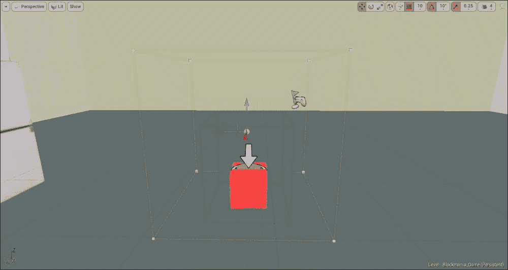

放置完工艺卷后，让我们在**详细信息**面板中设置的一些属性。在这个面板中，你会看到很多选项。所有这些都是根据它们产生的效果类型进行分类的。需要注意的一点是，有些效果在手机上是不可用的。

我们将调整**全局照明**设置。在**详细信息**面板中，转到**全局照明**部分，您将看到两个设置:**间接照明颜色**和**间接照明强度**。

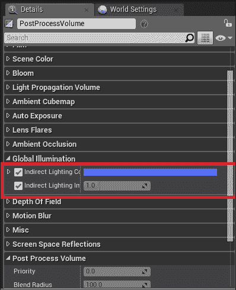

首先，通过选择来启用两种效果。然后，在 **间接照明颜色**选项中，将颜色设置为您喜欢的任何颜色。在我们的例子中，我们将把颜色设置为蓝色。您也可以将“间接照明强度”选项设置为您想要的任何值，但我们将把它留在 **1** 处。

一旦设置好，如果你在音量内移动，你会发现一切都变成蓝色。这将是我们拿起立方体时的效果:

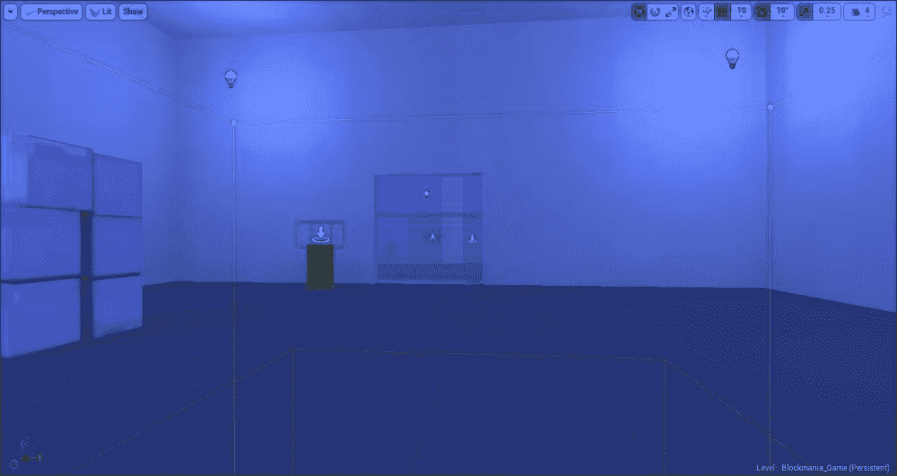

现在，如果你要测试游戏并进入立方体，除非你走出体积，否则一切都会变成蓝色并保持蓝色。我们不想那样。我们只希望屏幕短暂变蓝——当玩家拿起关键立方体时——然后逐渐消失。我们需要换个环境。我们希望音量在游戏开始时被禁用，并且仅在玩家拿起关键立方体时被触发。我们将在下一章介绍如何启用此设置。现在，转到**详细信息**面板，在**后处理卷**部分，您会发现**启用**选项已选中。只需取消选中它；这将禁用**后处理卷**。如果你现在检查它，你会看到屏幕不再变成蓝色。最后，将**后处理卷**复制并放置在级别中的所有关键立方体上。

# 卷

卷是有特殊属性的演员。它们可以被看作是看不见的触发器，当玩家输入它们时，每个触发器都会做一些不同的事情(取决于音量的类型)。有各种类型的**卷**演员可用；每一个都有不同的属性。体积仅在**编辑器**模式中可见，而在实际游戏本身中不可见。因此，他们通常由另一个演员陪同。例如，一个名为**痛苦造成卷**的卷，顾名思义，在进入时会导致玩家受到伤害。显而易见，当玩家走过一些危险的东西时，比如火、电等等，开发者会使用这个音量。因此，体积将被放置在其周围。火将作为视觉提示，指示该区域不安全，并且**疼痛引起音量**将处理其余部分(对玩家造成伤害)。

用户可以使用不同类型的卷。让我们看看他们。

*   **音量**:音量允许你通过调整设置来控制游戏内的音频。
*   **阻挡卷**:**阻挡卷**就像一堵无形的墙，阻止了某些类型的演员穿过。可以在**详情**面板设置哪些类型的演员可以通过，哪些不能通过。
*   **镜头遮挡体积**:这个防止镜头演员通过。
*   **剔除距离体积**:这个是一个优化工具，它不会根据对象与相机的距离来渲染小于或等于设定值(由开发人员设定)的对象。这是一个重要的工具，尤其是如果你有一个广阔的室外场景，因为它不会渲染很远的物体，因此节省了内存。
*   **击杀 ZVolume** :这个会消灭任何进入其中的演员，包括玩家。这可以用在玩家从悬崖边掉下来，掉进坑里，等等的情况下。
*   **关卡流音量**:这是另一个优化工具，可以用来设置玩家想要看到的关卡部分。当你有巨大的水平时，这真的很有用。您可以使用此音量隐藏玩家从当前位置看不到的关卡部分或远离玩家的部分。
*   **光量角色间接细节体积**:这个获取光照信息，并在体积内生成间接光照贴图。
*   **光质量重要性体积**:还有另一个优化工具，光质量重要性体积用于在其中生成照明信息(间接照明、阴影等)。建议在你的游戏关卡周围放置一个光量重要性体积，以获得更快的光构建。
*   **Nav Mesh Bounds Volume and Nav Modifier Volume**: The Nav Mesh Bounds Volume is used for the AI to move around in the level. When placed, the AI character will move anywhere within the volume (provided the area is accessible in the first place).

    一个**导航修改器体积**用于修改**导航网格边界体积**。您可以设置它，以便在**导航网格体积**内的某个区域可以被封锁，人工智能角色将无法通过它

*   **痛苦造成卷**:这将对任何进入其中的玩家造成伤害。
*   **物理卷**:在中，物理物体的某些物理性质可以被改变。例如，您可以启用/禁用名为**水量**的设置:启用时，该设置模拟角色在水域中移动，如沼泽。
*   **后期处理卷**:这个和 **视效**部分找到的卷是一样的。
*   **预计算能见度覆盖卷**:使用这个卷，可以手动覆盖游戏中演员的能见度。
*   **预计算可见性体积**:这个体积和**预计算可见性覆盖体积**功能类似，唯一不同的是这个体积会自动存储游戏中演员的可见性。
*   **触发卷**:这是和前面讨论的触发演员一样。其中一个不同之处是，当触发器演员以预定义的形状出现时，您可以使用**编辑几何图形**模式更改触发器体积的形状。

关于体积，您还应该知道的一件事是，就像使用 BSP 画笔一样，您可以编辑它们的形状来创建自己的自定义形状的体积。编辑方式与 BSP 笔刷相同。在**模式**面板中，点击**编辑几何**模式将切换到编辑模式。完成后，您可以单击任何想要的卷来更改并进行所需的更改。

## 为游戏增加音量

现在我们知道了什么是卷以及可用卷的类型，让我们继续，并在我们的级别上添加一些卷。

### 光质重要性体积

建议使用光照质量重要性体积，因为它减少了渲染时间(光照构建时间)。我们将设置它的尺寸，以便它封装游戏中的所有四个房间。只需从**模式**面板中拖动演员并将其放到屏幕上。

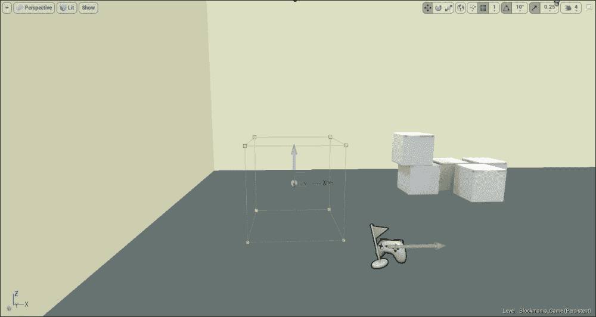

光质量重要性体积由黄色立方体表示。设置其尺寸，使其封装游戏中的所有四个房间。

如果你现在去搭建灯光，你会注意到搭建过程花费的时间相对较少，房间外的区域现在已经完全黑暗。该引擎现在主要关注体积内部的东西，以产生高质量的照明，而体积之外的任何东西在照明方面的质量都较低。

### 导航网格边界体积

接下来，添加**导航网格边界体积**。如果你希望你的游戏中有一个人工智能角色，一个**导航网格边界体积**是一个重要的组成部分。如前所述，这个体积基本上是人工智能角色在其中移动并与世界交互的体积。在设计你的游戏时，你应该知道所有人工智能控制的角色在游戏中会在哪里移动，他们可以与什么对象交互，然后相应地放置你的音量。

抓住**导航网格边界体积**并将其拖动到屏幕中。我们需要 3 号和 4 号房间的音量。体积由灰色立方体表示。

#### 3 号房间

将**导航网格边界** **体积**放置在坑上和坑附近，与带有开关的基座相对。

放置该音量时，建议打开**显示**菜单中的**导航**。在**视口工具栏**中，点击**显示**并勾选**导航选项**使其出现在视口中。一旦切换，您将看到体积内的任何表面、演员或任何其他物理对象(或它们的一部分)将具有亮绿色。这是人工智能将在哪里活跃的视觉指示器。它会忽略自身以外的任何东西:

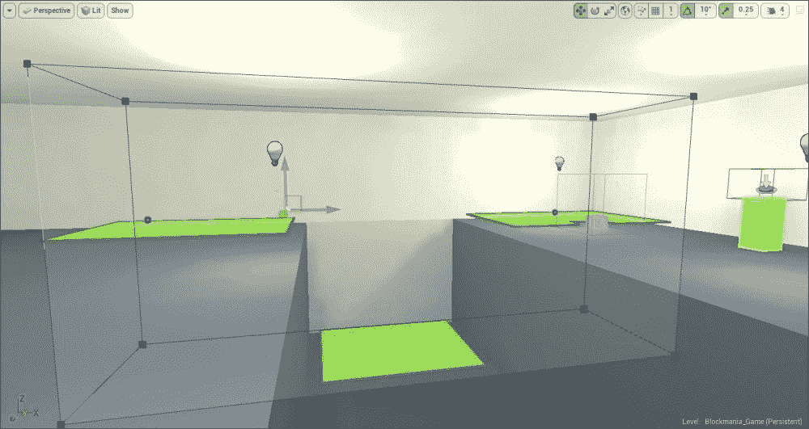

如前所述，与体积重叠的曲面或对象的任何部分都是绿色的。让我们继续到 4 号房间。

#### 4 号房间

在 4 号房间，我们需要一个大的导航网格边界体积，一个几乎覆盖整个房间的体积。使用几何编辑模式放置体积并移动其边。设置好尺寸后，应该看起来像下面的截图:

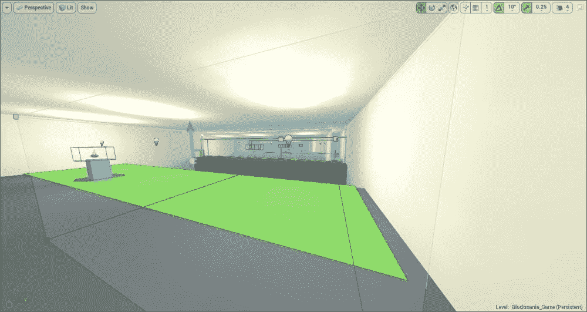

我们的人工智能角色现在将知道在关卡中的什么地方移动(绿色突出显示的区域)。

# 所有班级

最后，我们有 **所有类**部分，其中列出了我们到目前为止讨论的所有类和卷。此外，前面三个部分中没有显示某些演员，只能通过**所有课程**部分访问。

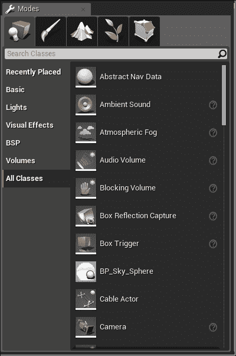

这样的行为者有很多，其中一些超出了本指南的范围。我们只谈一部分**全班**的演员:

*   **环境音演员**:这是一个可以在游戏中用来播放音频或者音效的演员。它也模拟真实世界的声音，因为你离声源越近，声音就越大，反之，你离声源越远，声音就越弱。
*   **摄像机**:一个**摄像机**演员就是一个你通过它看到虚拟世界的人。默认情况下，你的角色类已经有了一个摄像头，但是如果你想导入自己的角色，一个**摄像头**演员是必不可少的组件。它也用于过场动画等等。
*   **默认棋子** : A **默认棋子**演员是一个简单的球形演员，内置了飞行力学、静态网格、球形碰撞等等，可以用于简单的 AI。
*   **风景**:这里可以找到切换到风景模式的不同方式。如果您从这里拖动风景演员并将其放到屏幕上，模式将变为风景模式，您可以在其中放置您的地形。
*   **关卡边界**:一个 **关卡边界**的演员，当放置在关卡中时，会自动更新和调整大小来封装整个世界。它可以用来计算水平和世界的大小。请记住，如果你的水平仪有一个天穹或天穹，音量会调整大小，并包括这一点。
*   **日场演员**:日场是一个强大的工具，用来创作电影、布景等。增加日场演员有两种方式。第一种方法是通过视口工具栏。只需点击**日场**，菜单打开后选择**添加日场**。另一种方法是用这个选项。您可以从**模式**面板中拖动演员并将其放到关卡上。
*   **导航链接代理**:**导航链接代理**演员用于人工智能角色必须执行的动作，例如从壁架上掉下或跳下，在缝隙间跳跃等等。它允许人工智能角色暂时离开导航网格。(我们将在下一章讨论人工智能时回到这一点。)
*   **目标点** : **目标点** 演员用来获取关卡中特定点的坐标。它们也可以用于人工智能角色。如果你想让你的人工智能角色跟随一条特定的路径，或者让它在某个区域巡逻，你应该使用目标点。此外，请记住，目标点应该放在导航网格边界体积内，否则人工智能演员将忽略它们，即使你有脚本向所述目标点移动。如果你想让你的角色传送到一个特定的目的地，也可以使用目标点。
*   **文本渲染**:顾名思义， **文本渲染**演员用于渲染游戏中的文本。如果你想让你的游戏有弹出文本(教程或类似的东西)，这是你应该使用的。您可以导入自己的字体并创建自己的文本渲染。
*   **类蓝图**:虽然不是一个特定的演员，但是你在项目中创建的所有类蓝图都显示在这里。什么是班级蓝图将在下一章讨论。目前，您唯一需要知道和记住的是，您创建的所有类也可以从这里访问。

## 添加所有职业的演员

现在我们已经讨论了在All class 中找到的一些演员，让我们继续，并在我们的游戏中添加一些演员。

### 摄像头

我们要添加的第一个是摄像机演员。作为 **教程**的一部分，我们将有一个小场景，在这个场景中，当玩家将钥匙立方体放在基座上时，我们将显示门的打开情况(这样玩家就能理解钥匙立方体是干什么的)。

因此，从“所有类别”面板中拖动**摄像机**，并将其放置在水平线上。完成后，将其设置为面向门。以下截图是您可以放置相机的示例:

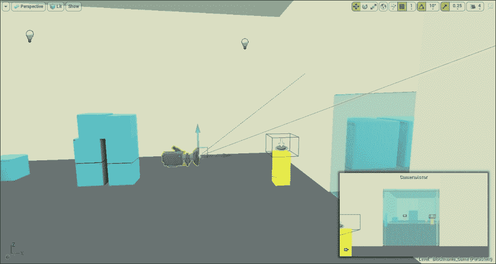

屏幕右下角的小窗口显示了第二个摄像头的视图，您可以使用它来适当调整其位置，直到您可以清楚地看到门。任何时候选择任何**摄像机**，窗口就会打开，向您显示所选**摄像机**的视图。当我们在后面的章节中创建场景时，我们将需要这个。

### 日场演员

我们还打算安排几个日场演员。我们将在日场的帮助下实现上述功能，而不是通过脚本(或者在本例中是蓝图)为人工智能角色移动我们的门和平台。我们将在**虚幻日场**中制作开门和绘制动画的动画，并在玩家与适当的触发器交互时调用它。

要添加日场演员，请将其从**模式** 面板中拖出来，并放在门附近。

### 注

虽然您将日场演员放在哪里并不重要，但为了防止混淆和方便起见，您应该将其放在您想要使用日场进行移动或编辑的演员附近。

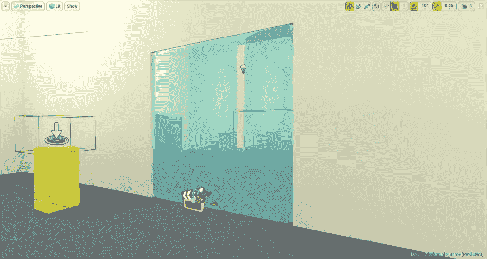

把日场演员这样放在所有的门上就行了。我们还需要安排更多的日场演员，但我们会在晚些时候这样做。

### 目标点

接下来，我们将放置几个目标点演员。如前所述，目标点对于移动人工智能角色非常有用。我们将有一个相当简单的人工智能，它在一个指定的路径上移动，当它碰到一个开关时停止，如果它掉进坑里，它会重新发出声音。

#### 3 号房间

在房间 3，放置两个目标点:一个是人工智能角色最初的位置，另一个是开关的位置。当人工智能角色掉进坑里，它会在第一个目标点重生。当玩家激活它时，人工智能角色将前往第二个目标点。

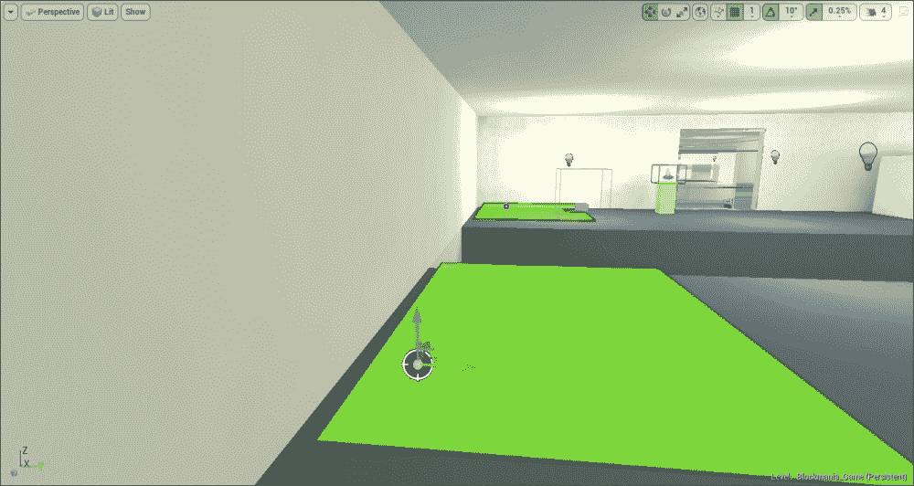

演员由一个小目标图标描绘。现在让我们把它们放在 4 号房间。

#### 4 号房间

在房间 4 中，我们将放置几个目标点演员，因为人工智能角色将采取更非线性的路线。

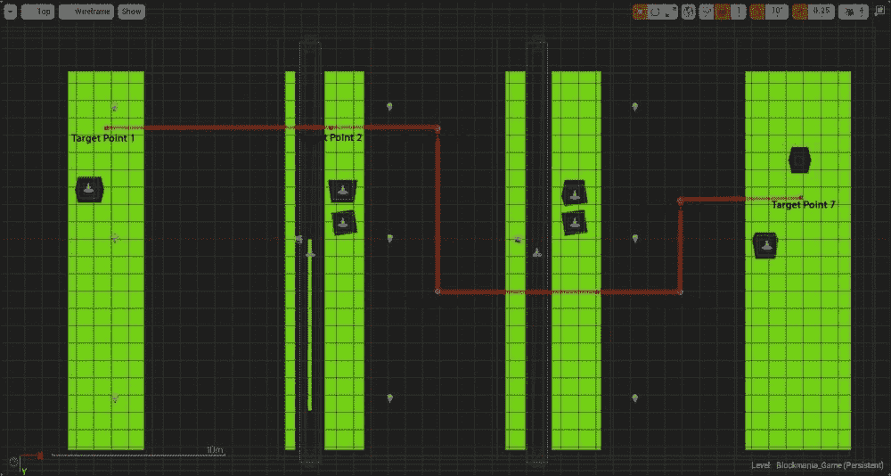

前面的截图是 4 号房间的俯视图。玩家将从左手边开始，必须将人工智能角色导向右边。此外，如您所见，我们已经放置了七个目标点演员。人工智能角色将采用的路径由红线显示。完成这项工作后，我们已经充分安排了我们的目标点行动者。这样，我们就把所有的类、卷和其他参与者都放到了我们的级别。

# 总结

在这一章中，我们看了模式面板中对游戏功能至关重要的一些角色，以及一些增强整体体验的角色。

除了谈论它们，我们还把其中一些放在我们的水平。我们现在接近成功了。在下一章中，我们将讨论蓝图——这可能是我们将在指南中涉及的最重要的主题。没有他们，游戏就没有互动性。所以，让我们在下一章开始编写脚本。