# 第五章。使用蓝图编写脚本

我们现在来看这个游戏最重要的一个方面:交互性。没有它，我们的游戏将只是一个玩家可以移动的环境。那些以前使用过 UDK 的人可能已经熟悉了可视化脚本的概念。UDK 有一个叫做的 Kismet，一个强大的可视化脚本工具。这个工具真正吸引人的一个特点是，任何人都可以在没有任何编程知识的情况下使用它。你只需要知道你想要实现的事件背后的逻辑。你甚至不用写一行代码就可以创建一个完整的游戏。

在虚幻 4 中，我们有蓝图，这是对 Kismet 的一种升级。基本设置是一样的:你有各种各样的节点和表达式，你可以用它们来编写游戏中的事件、动作等等。该界面简单易懂，易于使用，但功能极其强大。一旦掌握了窍门，就可以创建复杂的序列和事件。

然而，尽管蓝图是一个易于学习的伟大工具，但它在它能做什么方面仍然是有限的。在这方面，C++比蓝图更加通用和灵活。C++非常适合实现复杂的交互和机制，蓝图可能会也可能不会提供。bluetooth 和 C++的另一个区别是，bluetooth 的执行速度比 C++代码慢得多，但这只有在你的游戏中有很多 bluetooth 脚本的情况下才明显。蓝图和 C++还有其他几个区别；但这一切都归结于个人对游戏中你想要的特性、机制和功能的偏好。您可以选择使用其中一个或两个。

在本章中，我们将涵盖以下主题:

*   蓝图是什么，它们是如何工作的
*   什么是级别蓝图，以及如何使用级别蓝图编写脚本
*   级别蓝图用户界面
*   蓝图类是什么以及如何在游戏中使用它
*   如何编写基本人工智能脚本

# 蓝图如何运作

蓝图中的脚本类似于创建流程图。由您支配的是各种节点，您可以连接这些节点来创建一个动作序列。为了在蓝图中正确编写脚本，您应该首先了解所需序列背后的逻辑。例如，假设您想实现一个灯，当您靠近它时打开，当您离开它时关闭。在这种情况下，您应该首先在灯周围放置一个触发器。那么，这背后的逻辑是:

1.  如果玩家重叠扳机，灯就会打开。
2.  如果玩家没有扣动扳机，灯就会熄灭。

既然我们已经知道如何执行这个动作，我们就可以开始设置我们的节点了。假设您的设置如下所示:

当角色走进触发框时，天花板灯(聚光灯)打开。打开/关闭灯光的蓝图如下所示:

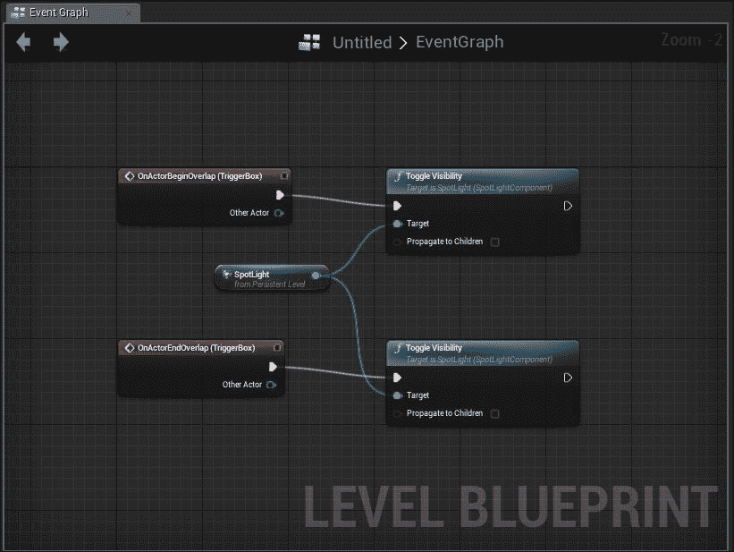

有各种类型的节点你应该知道:

*   **Event Nodes**: The nodes with the red bar are event notes. These are activated when the corresponding event takes place. They usually have a rightward facing arrow at the top left corner.

    您还有输入事件节点，当玩家给出相应的输入时，它会触发(例如，当玩家按下鼠标左键时发射武器)。

*   **Function Nodes**: The nodes with the blue top are function nodes. They usually have a function symbol **f** at the top left corner, as you can see in the preceding screenshot. These nodes perform a specific action on an actor or player.

    有两种类型的函数节点:作用于参与者的节点和返回特定值的节点。这些类型的节点有绿色的顶部(截图中未显示)。这包括返回演员在世界上的位置，返回演员的速度等等。

*   **引用或可变节点**:截图中间的节点是一个变量节点(或引用)。当你想要一个功能节点作用于场景中的一个特定的演员，或者如果你想要“得到”它的一些属性，你需要在关卡蓝图中创建它的引用。可变节点也是如此。毫不奇怪，变量在编写脚本或编码时扮演着非常重要的角色。因此，当您使用蓝图时，自然需要创建变量。

使用蓝图编写脚本时，请记住节点越少，性能越好。它也让你的工作空间更有条理，更容易阅读。

当一个特定的事件发生时，相应的事件节点向它所连接的节点发射一个脉冲。在我们的情况下，当玩家重叠触发时，它将激活聚光灯的**切换可见性**功能(由于灯光默认关闭，它将将其切换打开)。当玩家停止叠扣扳机(走出扳机)时，将再次触发**切换可见性**功能(灯将关闭)。

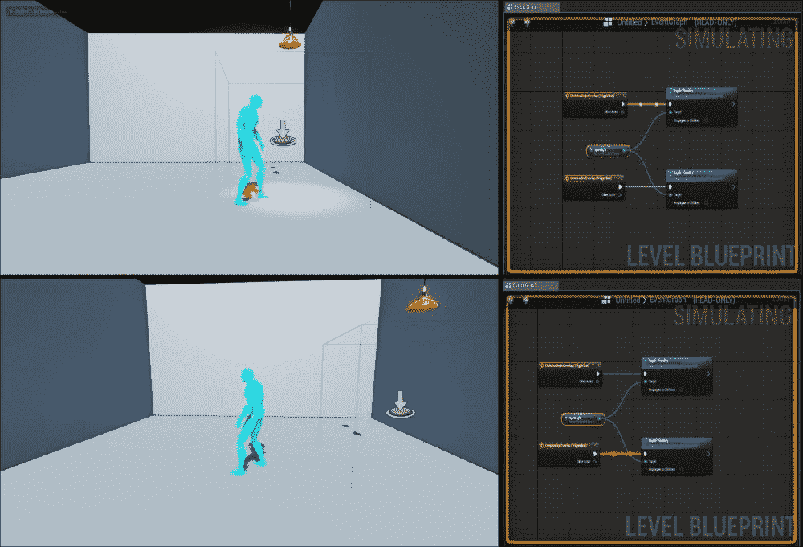

前面的截图展示了当事件发生时蓝图是如何工作的。当玩家重叠触发(左上角)时，相应的事件向**切换可见性**功能发射一个脉冲，打开灯。当玩家移出触发器或停止重叠时，相应的事件再次向**切换可见性**功能节点发出脉冲，该功能节点将灯打开。

实际上，只要激活一个节点，就可以看到脉冲被触发。这使得调试变得非常容易，因为您可以看到是哪个节点导致了问题，并相应地进行修复。

除了知道逻辑，还应该知道哪些节点可用，可以用来做什么。这需要时间和练习。

虚幻 4 中有两种蓝图:等级蓝图和蓝图类。

等级蓝图对于 UE4 就像 Kismet 对于 UE3 一样。您在项目文件中创建的每个级别或地图都有自己独特的级别蓝图。您可以使用关卡蓝图控制与关卡相关的一切，例如播放过场动画、编辑关卡中演员的属性(可见性、位置等)等等。

另一方面，蓝图类是包含各种组件和脚本的特殊参与者。这些组件包括静态或骨架网格、相机、碰撞组件、触发器和音频组件。通过使用脚本，您可以设置它们的属性，并确定它们如何与世界交互。蓝图类不是特定级别独有的；因此，您可以在项目中制作的任何地图或关卡中使用它们。您也可以将它们导出到其他项目。

让我们继续到水平蓝图的用户界面。

# 水平蓝图用户界面

以下截图展示了级蓝图的用户界面。继续我们的风格，将用户界面分成不同的部分，界面被分成几个部分，我们将分别进行。

## 选项卡和菜单栏

标签栏与所有其他窗口中看到的相同。就像在网络浏览器的情况下，你可以看到哪些窗口是打开的，在它们之间交换，并从那里关闭任何你想要的窗口。

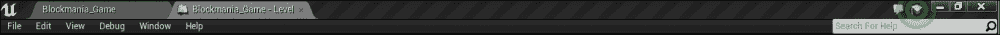

菜单栏是您可以访问所需的所有常规命令和操作的地方。

*   **文件**:在这个菜单中，你可以保存你的级别，在你的内容浏览器中打开任何资产，编译你的蓝图，启用源代码控制等等。
*   **编辑**:从这个菜单，可以执行撤销上一个动作、重做、搜索特定节点或表达式等动作。
*   **查看**:在这里可以隐藏/取消隐藏未使用的管脚和未连接的管脚(通过它们连接节点)，放大和缩小事件图。
*   **调试**:如果在你的蓝图序列中有一个问题你不能弄清楚，你可以使用调试菜单中的可用选项来找到并解决它们。这些包括添加断点、在特定点观察特定变量的值等等。
*   **窗口**:这里你可以设置哪些窗口你想看得见，哪些窗口你不想看得见。您可以自定义布局并从“窗口”菜单中保存它。
*   **帮助**:从这里，你可以访问史诗关于蓝图的官方文档。您也可以从这里进入维基页面、论坛和答案中心。

## 工具栏

**工具栏** 有最常用的动作:

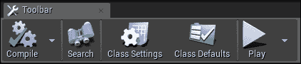

最常用的操作解释如下:

*   **编译**:每当在事件图中添加、移除或编辑任何节点时，一定要点击**编译** 按钮。它编译所有节点和序列，如果有任何错误或警告，它会在**编译器结果**面板中通知您，然后您可以修复。同样，如果你有一个变量节点，为了设置它的默认值，你首先需要编译。
*   **搜索**:当你有几个相连节点的大而复杂的序列时，试图找到一个特定的节点或变量可能是一项繁琐而耗时的任务。为了避免这种情况，您可以点击**搜索**按钮，输入您想要查找的任何名称。默认情况下，结果将显示在屏幕底部，**编译器结果**面板在那里(它将打开一个名为**查找结果**的新选项卡)。
*   **类设置**:点击此处的会打开**详细面板**中的蓝图设置，可以设置添加描述、类别等选项。
*   **类默认值**:这里可以设置蓝图类的默认值或初始值。
*   **播放**:类似于**视口**工具栏中的**播放**按钮的，这将打开一个新窗口，您可以在其中测试您的游戏。游戏运行时，点击 *Esc* 按钮将关闭游戏并返回编辑器。你可能会注意到按钮旁边有一个向下的小箭头。这将打开一个菜单，您可以在其中设置选项，例如您希望如何预览您的游戏，玩家应该从哪里开始等等。

## 详细信息面板

在**详细信息** 面板中，可以设置各种节点和变量的属性。它提供了诸如所需变量类型(布尔、浮点、整数等)、变量名称等设置。

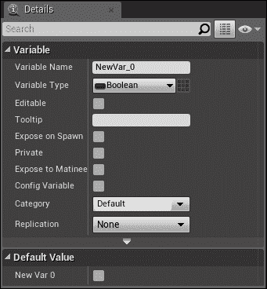

## 编译器结果面板

任何有编程知识的人都会知道什么是编译。当您编写的代码从您编写代码的语言转换为计算机能够理解的机器语言时，就会发生这种情况，以便能够执行。这通常由编译器处理。(如果没有看到**编译器结果**面板，在级别蓝图中，转到窗口，点击**编译器结果**。)

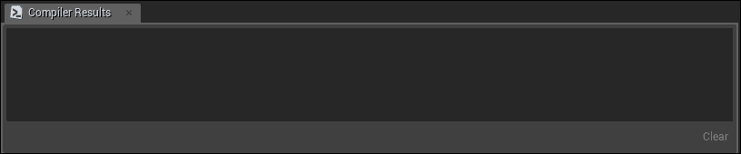

在**编译器结果**面板，可以看到编译器的输出日志。编译花了多长时间，编译过程中发现的任何错误，任何警告等等，都显示在这里。

## 我的蓝图面板

在该面板中，您可以查看您创建的所有事件、变量和事件调度器的列表。每当你创建一个事件节点，它就显示在这里，在**事件图**下。除此之外，您还可以创建各种函数、宏、变量等等。为此，您可以点击**添加新项**按钮并选择您想要创建的内容，或者点击名称前面的 **+** 按钮。

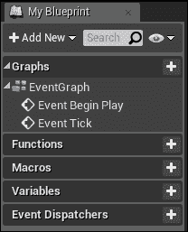

## 事件图

位于屏幕中央的**事件图**(也称为**图形编辑器**)是您设置节点和序列的地方。默认情况下，已经设置了两个事件节点，即游戏开始时激活的**事件开始播放**，以及每帧激活的**事件勾选**。这两个事件不需要激活任何触发器。

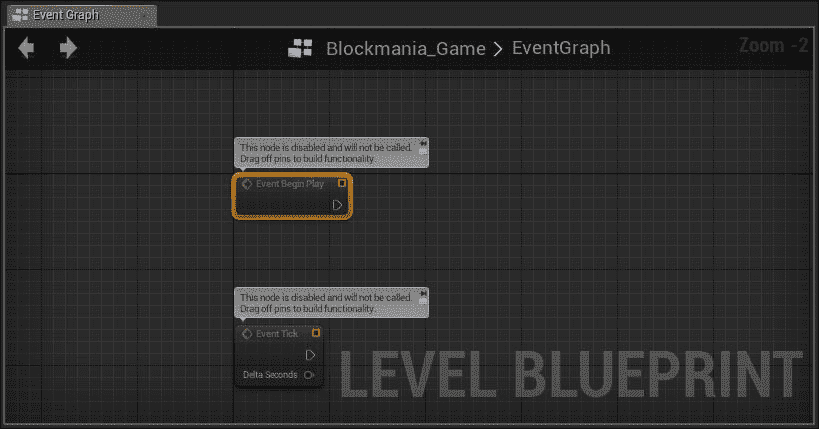

在顶部，你可以看到标签。标签下方的左上角有两个箭头。您可以使用它们在图形之间切换。在中心，您可以看到层次结构和蓝图结构。在最右边，你可以看到缩放比例——换句话说，你放大了多少我们缩小了。

下表列出了**事件图**中你应该知道和记忆的控件:

<colgroup><col> <col></colgroup> 
| 

控制

 | 

行动

 |
| --- | --- |
| 鼠标左键点击 | 选择节点 |
| 左键单击+拖动 | 创建选择框 |
| 右键单击 | 打开操作菜单 |
| 右键单击+拖动 | 平移图形编辑器 |
| 向上滚动滚轮 | 放大 |
| 向下滚动滚轮 | 缩小 |
| C | 在选定节点周围创建注释框 |

### 注

即使它是可视化脚本，当你使用蓝图编写脚本时，它仍然会变得非常混乱。因此，为了避免混乱并保持一切井然有序，建议在节点周围创建注释框。

# 在游戏中使用关卡蓝图

把所有的基础知识都抛开之后，我们就可以开始编写游戏脚本了。你应该知道的一件事是，我们可能会添加更多的触发器和演员。

## 关键立方体的拾取和放置

我们要脚本的第一件事是玩家拿起钥匙立方体。现在，当玩家离关键立方体足够近，并在屏幕上点击它时，他们将能够拿起立方体。在我们的例子中，为了给人一种玩家已经拿起了钥匙的错觉，我们打算在玩家在屏幕上轻敲的时候毁掉这个演员。此外，我们将在一开始就在基座上放置一个钥匙立方体的副本，并在游戏开始时将其隐藏起来。当玩家拿起立方体并离基座足够近时，轻敲屏幕会从游戏中取消隐藏立方体，给人一种角色已经把钥匙放在基座上的印象。那么，让我们开始吧。首先，选择关键立方体，按住 *Alt* 按钮，在变换工具的帮助下，拖出一个副本。把这个复制品放在底座上。

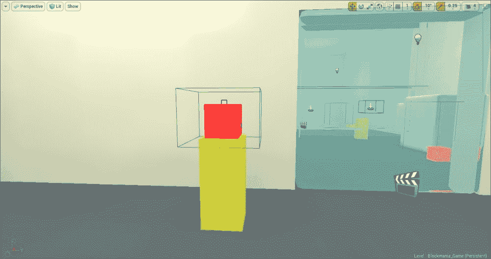

在其**细节** 面板中的**渲染** 部分下，勾选**隐藏在游戏中的演员**选项。这样做将在运行时隐藏游戏。

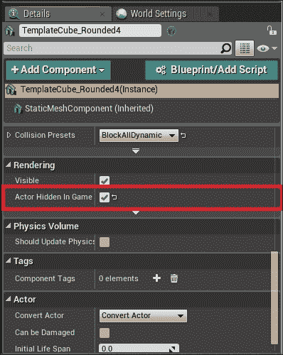

现在，让我们打开水平蓝图。为此，点击**视口**工具栏中的**蓝图**，选择**打开关卡蓝图**。

现在，事件在这种情况下将是玩家轻敲屏幕，或者用专业术语来说，提供触摸输入。所以在**事件图**窗口中，右键点击打开**动作**菜单，输入`Touch`。这应该会找到并显示**触摸**事件节点。点击将其添加到**事件图**中。你可能会发现各种类型的**触摸**节点——你需要的是简单说**触摸**的节点。

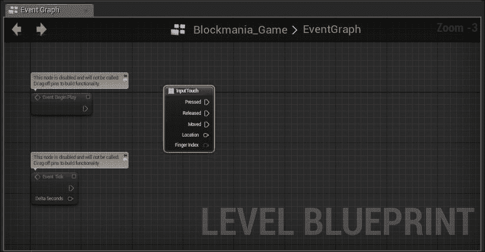

**输入触摸**事件节点，我们只关心**按下的**输出引脚。当玩家按下屏幕上的任意位置时，按下的**按钮将被激活。**

要从场景中移除盒子，我们将使用**摧毁演员**功能节点。因此，在**图形编辑器**中的任意位置单击鼠标右键，键入`Destroy Actor`，然后单击结果(您也可以在**实用程序**部分手动查找)。在两个节点都存在的情况下，将**按下的**输出引脚连接到**破坏执行器**输入引脚。现在，函数本身不知道它必须破坏哪个参与者。我们必须向它说明我们想除掉哪个演员。用蓝图术语来说，我们必须创建一个引用，引用我们希望将函数应用于其中的参与者。因此，在**视口**中，选择关键立方体。然后，在**图形编辑器**中，右键单击并选择**创建对模板立方体 _ 圆角**的引用。

如果你的对象有不同的名字，而不是 **TemplateCube_Rounded** ，你会看到演员的名字。

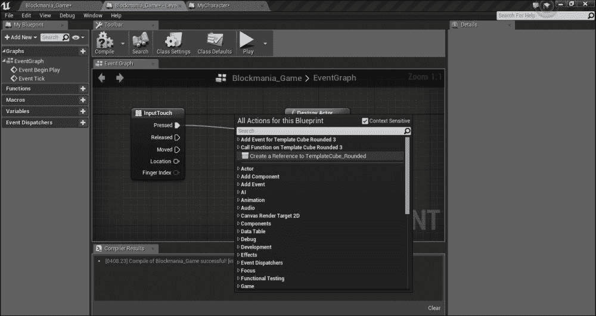

这样做将创建一个引用节点，上面写着这个演员的名字。将此连接到**摧毁行动者**目标引脚。

另一种方法是拖动参考节点的输出引脚，并将其释放到**事件图**中的任何位置。这样做将打开一个菜单，您可以在其中选择**摧毁演员**节点。一旦创建，引用节点将自动连接到它。目前的设置应该如下所示:

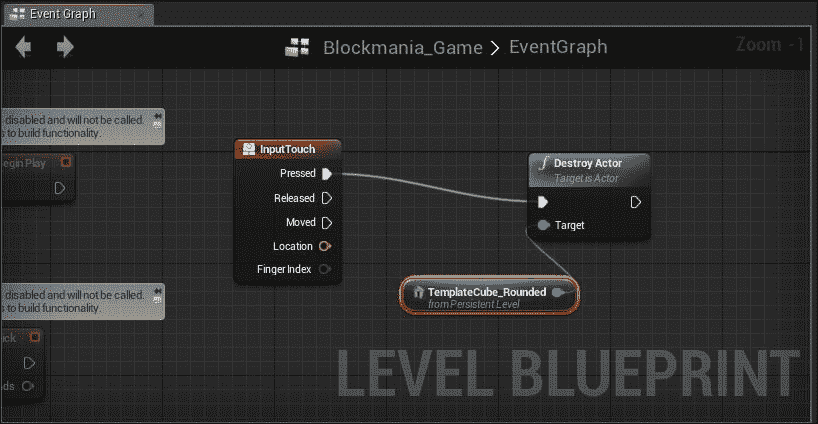

然而，这里有一个问题。如果你要测试你的游戏，你会注意到无论你在哪里，当你点击屏幕时，立方体都会被破坏。我们只希望当玩家离立方体足够近时，立方体被摧毁。

为了解决这个问题，我们要做的第一件事是在游戏开始时禁用输入。大家可能还记得，游戏开始时激活的事件节点**事件开始播放**已经出现在**图形编辑器**中。对此，我们将附加一个**禁用输入**节点。右键找到节点，连接到**事件开始播放**。

### 注

虽然现在不需要，但如果你的游戏有几个玩家或控制器，你必须指定你想禁用哪个玩家的控制器。这可以通过首先创建一个**获取玩家控制器**节点并将其附加到**禁用输入**节点中的**玩家控制器**来完成。默认情况下，你扮演的角色的**玩家指数**为 0。

如果你现在测试你的游戏，当你轻点屏幕时，键立方体不会被破坏(虽然角色会再次开始射弹)。现在，回到我们的序列，因为我们希望玩家只能在他们处于某个距离时拿起立方体，所以我们将在他们与我们在关键立方体周围放置的触发器重叠时启用他们的输入。

选择触发器后，创建一个 **EventBeginOverlap** 节点。创建后，创建一个**使能输入**节点，并将其连接到**事件开始重叠**节点的输出引脚。

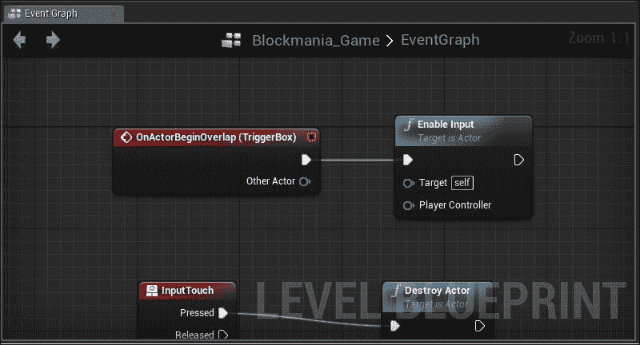

我们现在几乎完成了我们的设置。如果你现在去测试它，你会发现它的功能和我们预期的一样。然而，这仍未完成。首先，如果你的房间里有不止一个钥匙立方体，当你点击其中一个时，它们都会消失。我们不希望这样；我们只希望玩家拿起的钥匙方块消失。为此，我们将使用一个**门**节点。一个**门**节点用于根据您可以设置的特定条件控制通过该节点的脉冲。例如，当某个事件发生时，您可以将其设置为**打开**等等。例如，当玩家与触发器重叠时，它会打开门，让脉冲通过。

右键单击**事件图**中的任意位置，然后键入`Gate`。然后，点击它来放置它。您也可以在**实用程序** | **流量控制** | **门**下找到它。

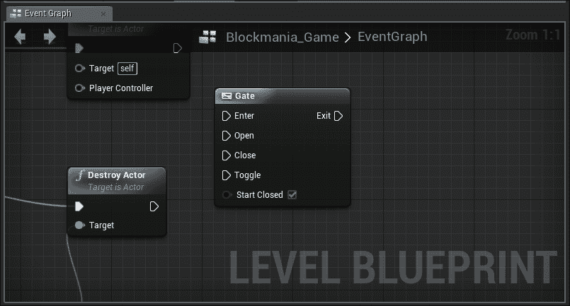

您希望控制的事件连接到 **门**节点的**输入**输入。其余的事件用于控制流程。当事件发生时，将**关闭**输入连接到事件将阻止任何东西通过**门**。同样，将**打开**输入连接到事件或功能将允许脉冲通过该节点。**切换**节点将打开**门**节点，如果它最初是关闭的，反之亦然。最后，您有一个**启动关闭**引脚，用于设置**门**节点的初始状态。如果选中，它将最初关闭，如果未选中，它将最初打开。

首先，从**输入触点**节点断开**按压的**引脚，并将其连接到门节点的**输入**引脚。然后，将**退出**引脚连接到**破坏行为体**功能的输入引脚。一旦完成，我们需要一个事件来打开门节点。这个事件将是当玩家与触发器重叠时。因此，取**使能输入**节点的输出引脚，并将其连接到门节点的**打开**输入引脚(确保勾选了**启动关闭**)。您的设置应该如下所示:

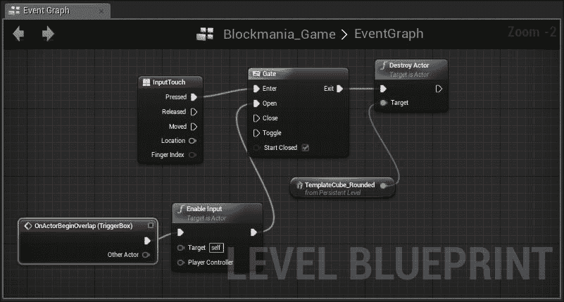

现在玩家步出触发器，也就是停止与触发器重叠的，我们又要禁用输入。因此，选择触发框，创建一个**节点。您可以在搜索栏中键入或在**添加事件**下找到演员名称<|**碰撞** | **添加演员结束重叠**。另外，创建一个**禁用输入**节点。同样，您可以在**输入** | **禁用输入**下输入或查找。一切就绪后，我们应该结束了:**

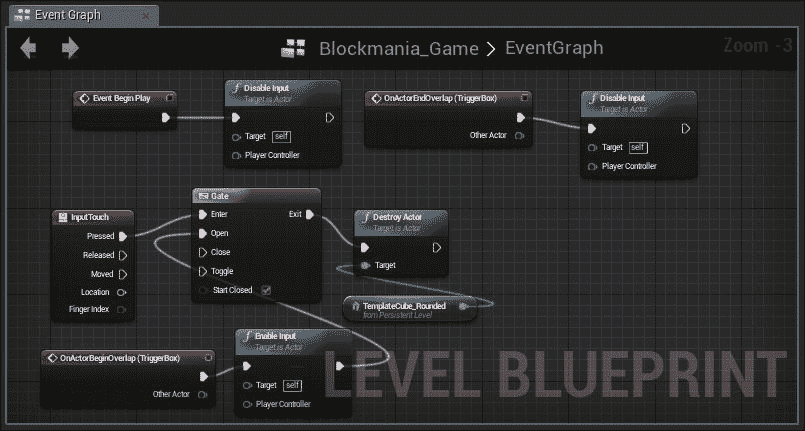

我们现在有一个简单的拾取动作。但是在我们完成之前，我们还有更多事情要做。我们只是编写了拾取立方体的脚本。我们仍然需要为玩家放置关键立方体的时间编写脚本。这很简单。

我们需要做的第一件事是添加一个重叠事件，使玩家能够输入。用你上一次触发的方法把它们连接起来。接下来，我们将添加另一个 Touch 事件节点。为此，我们将连接一个**设置演员隐藏在游戏**节点中。首先，选择另一个关键立方体(隐藏在游戏中的立方体)，然后在**图形编辑器**中的任何地方右键单击，并在搜索栏中键入其名称来找到它。也可以在<上的**调用函数**中找到所选演员的名字> | **渲染** | **设定隐藏在游戏中的演员**。你会注意到，当你创建这个节点时，会自动用它创建一个关键立方体的引用节点，并连接到**目标**输入端。接下来，将**按下的**输出引脚连接到**设置演员隐藏在游戏**节点的输入引脚。完成后，添加一个**门**节点，其**切换**输入连接到**使能输出**节点的输出。

最后，创建一个**on torendoverlap**节点，并连接一个 **Disable Input** 节点，就像前面的触发器一样。

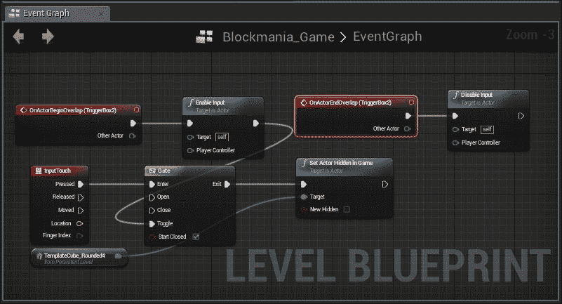

如果你要测试它，你会发现它运行得非常好。然而，这里有一个问题:我们没有设置玩家何时可以在基座上放置或取消隐藏关键立方体的条件。换句话说，如果玩家只是走到基座上，而没有拿起第一个关键立方体，他们仍然能够取消隐藏另一个关键立方体，因为这将意味着玩家可以在房间中前进而不拿起关键立方体。

为了解决这个问题，我们首先要改变基座上触发器的一些属性。我们需要先关闭扳机的碰撞。我们必须对其进行设置，以便最初基座上的触发器忽略所有类型的重叠事件，换句话说，将其关闭。为此，选择基座上的触发器，并在“详细信息”面板中，转到**碰撞**部分。在该部分下，您将看到一个名为**碰撞预设**的选项。默认设置为**触发**。单击栏打开预设菜单。从这里选择**自定义**。

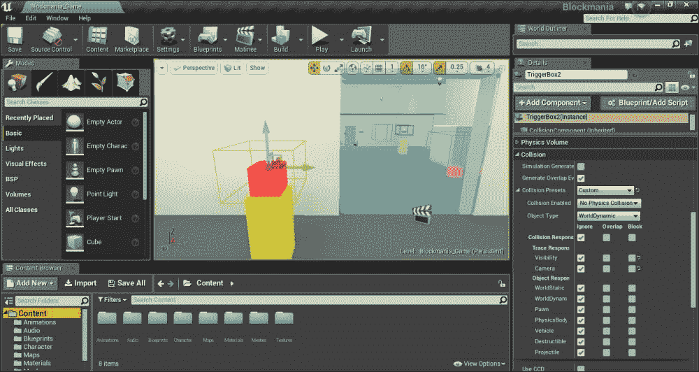

接下来，点击**碰撞预设**旁边的小三角形，以打开触发器对不同类型演员的碰撞响应列表。一般有三种反应:

*   **忽略**:触发器不会记录对碰撞的任何响应。触发器设置为忽略的参与者既不会被阻止，也不会被注册。
*   **重叠**:触发被设置为重叠的行动者不会被其阻挡，但碰撞会被其登记。这种碰撞注册是我们能够编写脚本的方式，例如当玩家与触发器重叠时打开灯。
*   **阻挡**:触发被设置为阻挡的行动者将无法通过。它会像一堵墙。

您可以单独设置每个演员的回应，也可以选择所有演员的一般回应。我们稍后再做。在最上面，有一个名为**碰撞响应**的选项。在此之前，您有三个框，每种类型的响应对应一个框。只需勾选**忽略**框，其下方的所有内容都将被设置为忽略。这就是我们想要的。我们希望触发器最初忽略所有参与者的冲突。当玩家拿起钥匙方块后，我们会改变它的碰撞反应。

回到我们所做的拾取设置，我们将需要向其中添加一些节点。右键单击**事件图**中的任意位置，在**流量控制**部分，您会发现一个名为**序列**的东西。选择并创建它。一个**序列**节点取一个输入，有多个输出。如果你想要一个特定的节点激活或启动各种不同的事件或功能，你应该使用**序列**节点。

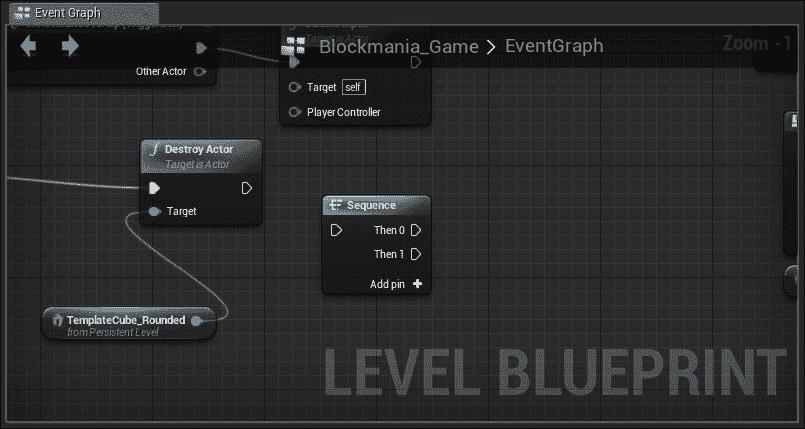

默认情况下，一个 **序列**节点有一个输入引脚和两个输出引脚。首先激发第一个节点，然后激发下一个节点，依此类推。如果您想要更多的输出引脚，只需点击**添加引脚**，它将创建另一个输出引脚。现在，将**门**节点的输出引脚连接到**序列**节点的输入引脚。然后，将**然后 0** 连接到**销毁执行元**节点。

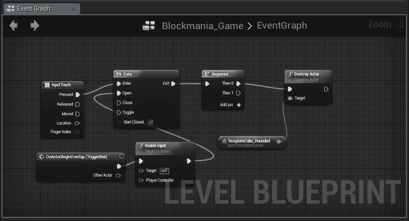

当玩家拿起魔方时，我们现在将触发器的碰撞响应更改为**重叠**。选择触发器后，右键单击它，首先取消选中位于菜单右上角的**上下文相关**框。当您在**视口**中选择了一个演员，并且在**图形编辑器**中右键单击时，您可以看到的事件节点和功能节点通常与所选演员相关联。它们只显示可以直接应用于参与者的函数和表达式。否则，蓝图提供了相当多的节点，但是其中一些节点不能直接使用，或者根本不能在选定的参与者上使用。

这里我们需要的节点可以应用于触发器，但不能直接应用。我们需要的是一个**设置所有通道的冲突响应**节点。此节点可用于在运行时更改参与者的冲突响应。右键单击**事件图**，输入节点名称并创建它。

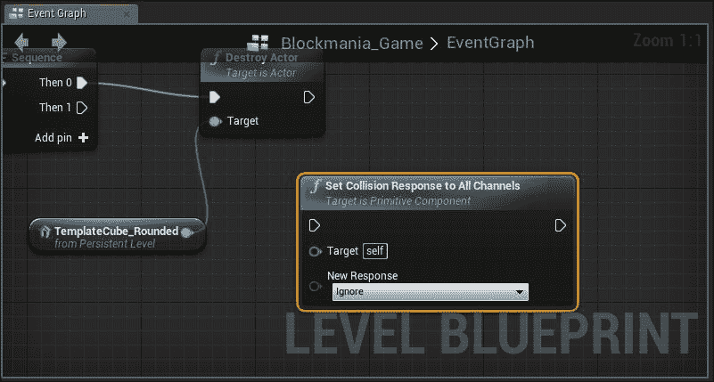

在这里，你可以设置一个你想要改变其**碰撞响应**T3 的目标演员。点击下拉菜单，会看到三个设置:**忽略**、**重叠**、**阻止**。如果你还记得，这是触发器的**碰撞**部分的三种反应。我们已经将其设置为**忽略**，但是我们想在玩家拿起关键立方体后将其更改为**重叠**。因此，在下拉菜单中选择**重叠**。接下来，将**the1**引脚连接到该节点的输入端。最后，在**视口**中选择触发器，在**图形编辑器**中右键单击，勾选**上下文相关**框，选择**创建引用**为<演员名称>。将其连接到**的**目标**输入将碰撞响应设置到所有通道**节点。当你这样做的时候，你会发现它并没有直接连接到**目标**输入。相反，会创建一个新节点，该节点将触发器的引用作为其输入，并将**碰撞组件**作为其输出。这是拿着触发盒，把它转换成一个叫做**原始组件引用**的东西。这是将它连接到此节点的唯一方法。

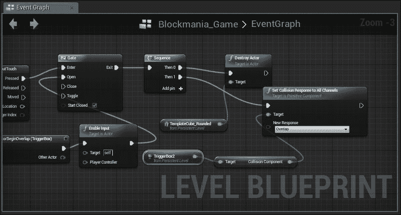

如果我们现在测试游戏，我们会发现按照我们想要的方式工作。如果不先捡起来，我们就无法放置钥匙立方体。

我们这里的设置差不多完成了。还记得我们在钥匙立方体周围放置了一个**后处理体积**吗，它将作为玩家已经拿起钥匙立方体的视觉指示器？我们也需要把它写进剧本。我们最初将它设置为禁用。我们将通过**蓝图**启用它，然后在非常短暂的时刻后将其销毁。首先，给**序列**节点添加一个新的管脚。接下来，选择**后处理体积**，在**图形编辑器**中右键单击并为其创建一个参照。然后，单击它的输出引脚，将其拖出，并释放鼠标左键以打开菜单。在这里，您可以输入**设置启用**，这将创建一个**布尔**节点(布尔节点为红色)。一旦创建，您将看到一个勾号框，显示**已启用**。勾选该框，连接到**序列**节点的**然后 2** 输出引脚。

接下来，我们需要在短暂的片刻之后摧毁演员。为此，我们需要创建一个**延迟**节点。一个**延迟**节点接收一个输入，并在一定时间后(可以设置)触发一个脉冲。在**图形编辑器**中右键点击，输入**延迟**并创建。也可以在**实用程序** | **流量控制** | **延时**下找到。您可以在节点中看到一个名为**持续时间**的选项。在这里，你可以设置你需要多长时间触发脉冲。现在保持默认值(即`0.2`秒)，连接到**设置启用**节点。最后，创建一个**销毁 Actor** 节点，将其连接到**延迟**节点，并将**后处理卷**设置为其目标。您只需点击 *Ctrl* + *C* 选择您为 **Set Enabled** 节点创建的后处理引用，然后 *Ctrl* + *V* 创建一个副本，并将该副本连接到**销毁执行元**节点的**目标**输入。

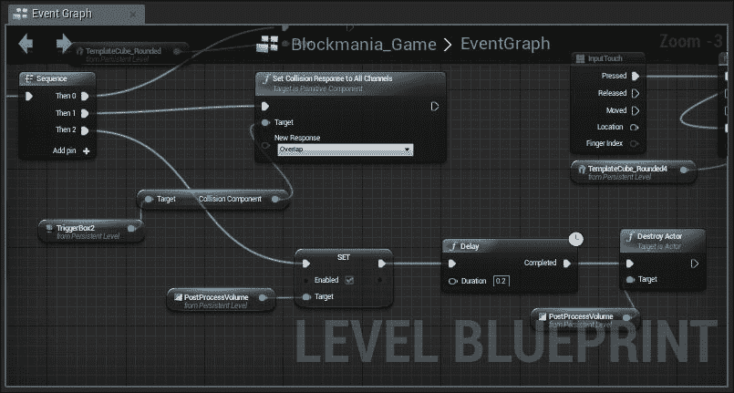

这就是了！我们的钥匙立方体有一个拾取和放置系统。我们还有一个视觉指示器，表明我们已经拿起了立方体(我们将在下一章介绍如何编写门的打开和关闭脚本)。现在，虽然这是一个相当简单和小的设置，对每个关键立方体都这样做将是一个乏味的工作。想象一下，如果你的游戏有 10…20…50…100 个房间！你将不得不为游戏中的每个关键立方体编写脚本，浪费大量时间。值得庆幸的是，UE4 提供了一些东西来绕开这样的场景:一个**蓝图**类。

# 蓝图类

如前所述，为每个关键多维数据集编写脚本将是一项乏味且耗时的任务。有了蓝图类，你只需要做一次所有的脚本和其他事情。蓝图类是一个包含参与者(静态网格、体积、摄像机类、触发盒等)和脚本功能的实体。再看一次我们的灯打开/关闭的例子，假设你想放置 10 个这样的灯。对于蓝图类，您只需要创建和编写一次脚本，保存它，然后复制它。这确实是 UE4 提供的一个惊人的功能。

## 创建蓝图类

要创建蓝图类，单击**视口**工具栏中的**蓝图**按钮，并在下拉菜单中选择**新建空蓝图类。**然后会打开一个窗口，要求你选择你的父类，指示你想要创建的蓝图类的种类。

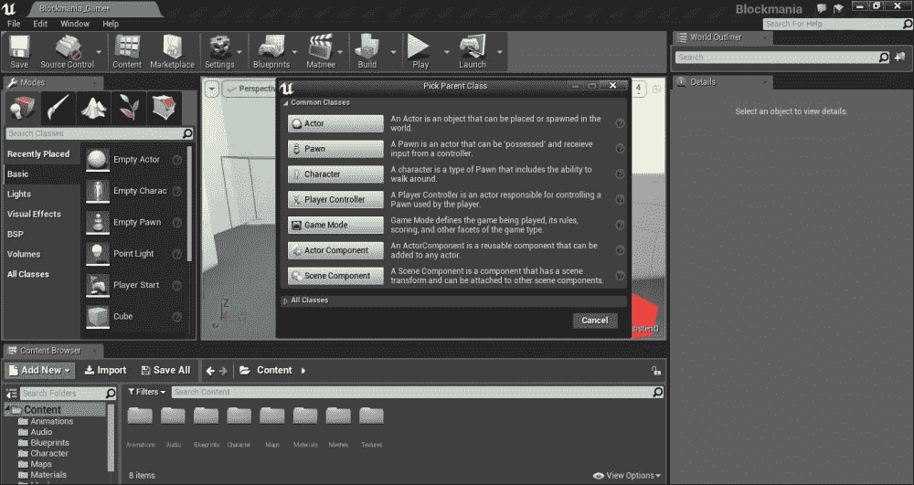

在顶部，您将看到最常见的类。这些措施如下:

*   **演员**:一个**演员**，如前所述，是一个可以放置在世界上的物体(静态网格、触发器、相机、体积等等，都算演员)
*   **棋子** : A **棋子**是一个可以被玩家或者电脑控制的演员
*   **人物**:这个类似于一个**棋子**，但是有走动的能力
*   **玩家控制器**:负责给游戏中的**棋子**或者**角色**输入，或者控制
*   **游戏模式**:这个负责游戏的所有规则
*   **演员组件**:你可以用这个创建一个组件，并添加到任何演员
*   **场景组件**:可以创建可以附着到其他场景组件的组件

除了这些，还有其他的类可以选择。要查看它们，请点击**所有类**，这将打开一个菜单，列出您可以创建蓝图的所有类。对于我们的关键立方体，我们需要创建一个**演员蓝图类**。选择 **Actor** ，之后会打开另一个窗口，询问你希望保存在哪里，名字是什么。命名为 **Key_Cube** ，保存在`Blueprint`文件夹中。满意后，点击**确定**，将打开**演员蓝图类**窗口。

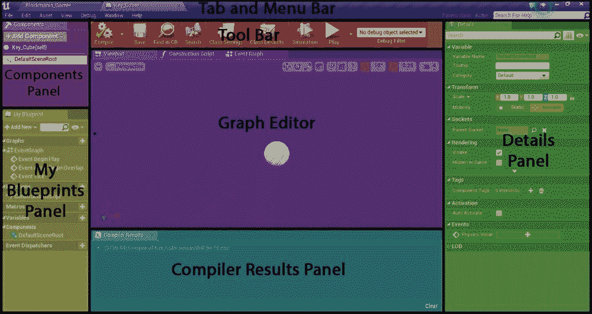

蓝图类用户界面与 Level 蓝图相似，但有一些不同。它有一些额外的窗口和面板，描述如下:

*   **组件面板**:**组件面板**是可以查看的地方，可以给蓝图类添加组件。空蓝图类中的默认组件是**默认场景**。它不能被重命名、复制或删除。但是，只要添加一个组件，它就会替换它。同样，如果您删除所有组件，它将会回来。要添加组件，点击**添加组件**按钮，将打开一个菜单，从中可以选择要添加的组件。或者，您可以将资源从内容浏览器中拖放到**图形编辑器**或**组件面板**中，它将作为组件添加到蓝图类中。组件包括演员，如静态或骨骼网格，光演员，相机，音频演员，触发盒，体积，粒子系统，等等。当您放置一个组件时，可以在**图形编辑器**中看到它，您可以在**细节**面板中设置它的属性，如大小、位置、移动性、材质(如果是静态网格或骨骼网格)等。
*   **图形编辑器**:**图形编辑器**也与 Level 蓝图略有不同，在一个蓝图类中有额外的窗口和编辑器。第一个窗口是**视口**，与编辑器中的相同。主要用于放置演员，设置演员的位置、属性等。你会在主**视口**(编辑器的**视口**工具栏)中找到的大多数工具也在这里。
*   **事件图**:下一个窗口是**事件图**窗口，和关卡蓝图窗口一样。在这里，您可以编写您在**视口**中添加的组件及其功能的脚本(例如，编写当玩家靠近和离开时灯打开/关闭的脚本)。请记住，您可以编写只存在于蓝图类中的组件功能的脚本。您不能直接使用它来编写不是类组件的任何参与者的功能脚本。
*   **施工脚本**:最后还有 **施工脚本**窗口。这也类似于**事件图**，因为在中可以设置和连接节点，就像在**事件图**中一样。不同之处在于，这些节点是在您构建蓝图类时激活的。它们在运行时不工作，因为那是**事件图**脚本工作的时候。您可以使用**构建脚本**来设置属性，创建并添加您自己的属性，您希望在构建过程中更改的任何组件，等等。

让我们开始为我们的关键立方体创建蓝图类。

### 视口

我们首先需要的是组件。我们需要三个组件:一个立方体、一个触发盒和一个**后处理体积**。在**视口**中，点击**添加组件**按钮，在**渲染**下，选择**静态网格**。它将向类中添加一个**静态网格**组件。现在需要指定要添加到类中的**静态网格**。在**组件面板**中选择**静态网格**演员后，在演员的**详细信息**面板中的**静态网格**部分下，点击**无**按钮并选择**模板立方体 _ 圆角**。一旦设置了网格，它就会出现在**视口**中。选中立方体后，沿所有三个轴将其比例(位于**细节**面板中)从`1`减小到`0.2`。

接下来我们需要的是一个触发盒。点击**添加组件**按钮，在**碰撞**部分选择**箱体碰撞**。添加完成后，沿所有三个轴将其比例从`1`增加到`9`，并以其底部与立方体底部对齐的方式放置。

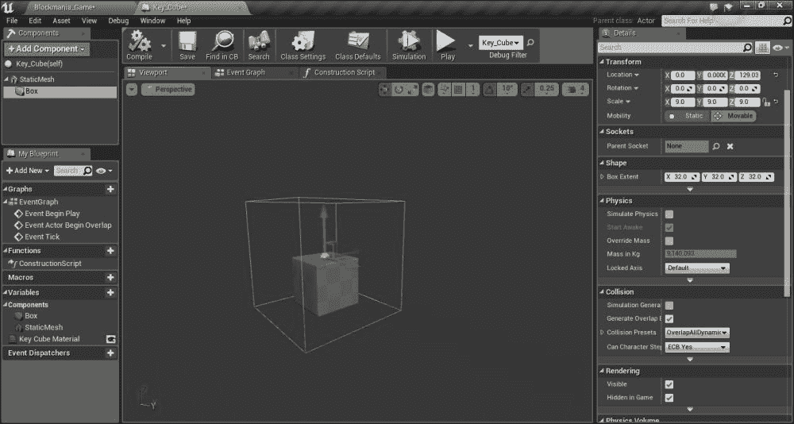

### 建筑脚本

您可以通过点击**渲染**部分的**覆盖材质**按钮，并选择关键立方体材质，在**细节**面板中设置其材质。但是，我们将使用**构造脚本**来分配其材质。切换到**构建脚本**选项卡。您将看到一个名为**构造脚本**的节点，默认情况下是存在的。您不能删除此节点；这是脚本开始的地方。但是，在编写脚本之前，我们需要创建一个类型为`Material`的变量。在**我的蓝图**部分，点击**新增**，在下拉菜单中选择**变量**。命名该变量`Key Cube Material`，并在**详细信息**面板中将其类型从**布尔**(默认变量类型)更改为**材料**。另外，一定要选中**可编辑**框，这样我们就可以在蓝图类之外编辑它了。

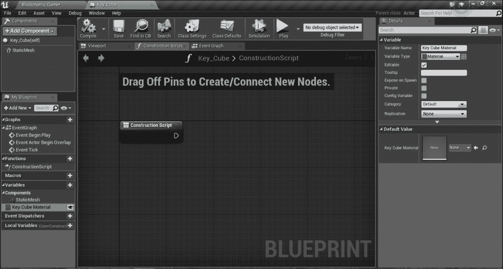

接下来，从**我的蓝图**面板中拖动**键** **立方体材质**变量，放到**图形编辑器**中，窗口打开后选择**设置**。将其连接到**构造脚本**节点的输出引脚。重复这个过程，只是这一次，选择**获取**并将其连接到**键立方材料**的输入引脚。

在**图形编辑器**窗口中单击鼠标右键，在搜索栏中输入**设置材质**。你应该看到**设置材质(静态网格)**。点击它并将其添加到场景中。这个节点已经有了静态网格参与者的引用( **TemplateCube_Rounded** )，所以我们不需要创建引用节点。将其连接到**设置**节点。最后，从**我的蓝图**中拖动**键立方体材质**，将其放入**图形编辑器**中，选择**获取**，并将其连接到**材质**输入引脚。完成后，点击**编译**。我们现在可以在蓝图类之外设置立方体的材质。

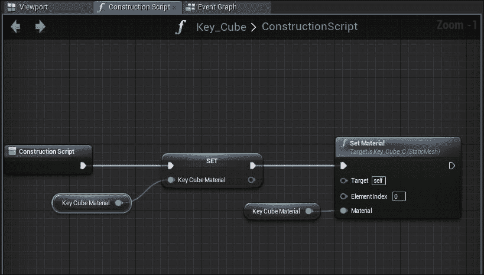

我们来测试一下。将蓝图类添加到关卡中。你会看到一个**模板立方体 _ 圆角**演员添加到场景中。在其**详细信息**面板中，您将在**默认**部分下看到一个**关键立方体材质**选项。这是我们在**构建脚本**中创建的变量。我们在这里添加的任何材料都会被添加到立方体中。因此，点击**无**并选择**键轴 _ 材质**。一旦你选择它，你会看到立方体上的材料。这是使用**构建脚本**可以做的很多事情之一。目前，只有这个可以。

### 事件图

我们现在需要编写关键立方体的功能。这或多或少与我们在第一个关键多维数据集的级别蓝图中所做的相同，只是有一些小的不同。在**事件图**面板中，我们要脚本化的第一件事是当玩家分别重叠和停止重叠触发框时启用和禁用输入。在**组件**部分，右键单击**框**。这将打开一个菜单。鼠标悬停在**添加事件**上，选择**添加组件开始重叠**。这将为**图形编辑器**添加一个**开始重叠**节点。接下来，我们需要一个 **Cast** 节点。一个 **Cast** 节点用来指定你要使用哪个演员。在**图形编辑器**中右键单击，并在节点中添加一个**造型。将其连接到组件上的**节点，并将另一个角色引脚连接到**转换为角色**节点的**对象**引脚。最后，添加一个**启用输入**节点和一个**获取玩家控制器**节点，并像我们在关卡蓝图中所做的那样连接它们。****

接下来，我们将添加一个事件，当玩家停止重叠方块时。再次，右键单击**框**，并在组件对话框上添加一个**节点。执行与在组件开始重叠**节点上的**完全相同的操作；仅在此，不增加**使能输入**节点，增加**禁用输入**节点。设置应该如下所示:**

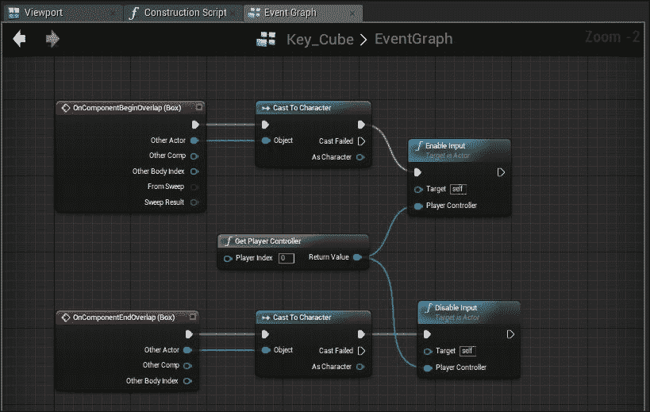

您可以将我们之前放置的键立方体移动到基座的顶部，将其设置为隐藏，并将键立方体蓝图类放置在其位置。此外，确保您将触发参与者的碰撞响应设置为**忽略**。

下一步是在玩家触摸屏幕时编写破坏关键立方体的脚本。这也类似于我们在水平蓝图中所做的，只是有一些不同。首先，添加一个**触摸**节点和一个**序列**节点，并相互连接。接下来我们需要一个**销毁组件**节点，可以在**组件** | **销毁组件**(静态网格)下找到。此节点内部已经有了对关键多维数据集(静态网格)的引用，因此您不必创建外部引用并将其连接到节点。将其连接到**然后 0** 节点。

我们还需要在玩家拿起钥匙立方体后激活触发器。现在，由于我们不能直接在蓝图类之外的参与者上调用函数(就像我们在 Level bluetooth 中可以做的那样)，我们需要创建一个变量。该变量将属于触发框类型。其工作方式是，当您创建了一个**触发器框**变量时，您可以将其分配给级别中的任何触发器，并且它会将该函数调用到该特定触发器。考虑到这一点，在**我的蓝图**面板中，点击**添加新的**并创建一个变量。将此变量**命名为激活触发盒**，并将其类型设置为**触发盒**。最后，确保在**可编辑**框中打勾；否则，您将无法为其分配任何触发器。完成后，创建一个**将冲突响应设置为所有通道**节点(取消选中上下文相关框)，并将**新响应**选项设置为**重叠**。对于目标，拖动**激活触发框**变量，将其放入**图形编辑器**，选择**获取**，并将其连接到**目标**输入。

最后，对于后处理体积，我们需要创建另一个类型为**后处理体积**的变量。您可以再次命名该变量**视觉指示器**，同时确保勾选了**可编辑**框。将该变量添加到**图形编辑器**中。接下来，点击它的大头针，把它拖出来，释放它，这将打开动作菜单。这里输入**启用**，选择**设置启用**，勾选**启用**。最后，添加一个**延迟**节点和一个**破坏行为体**节点，并将它们依次连接到**设置启用**节点。您的设置应该如下所示:

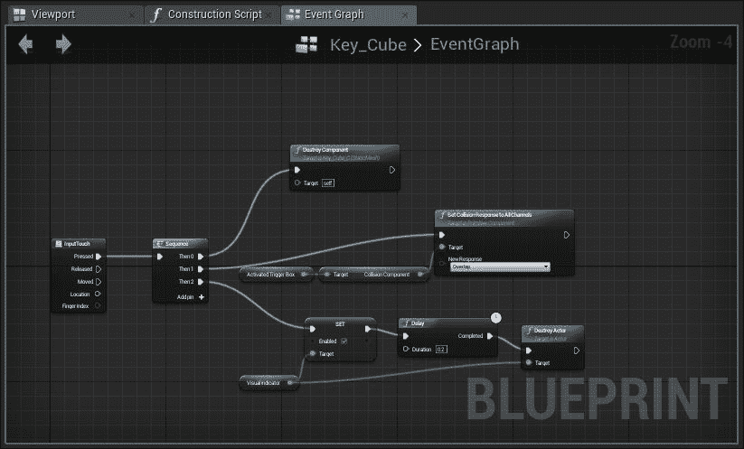

回到**视口**，你会发现在蓝图类演员的**默认**部分下，又出现了两个选项:**激活触发框**和**视觉指示器**(我们已经创建的变量)。使用它，您可以指定要更改哪个特定触发盒的碰撞响应，以及要激活和销毁哪个确切的后处理卷。在这两个变量的前面，你会看到一个滴管形状的小图标。您可以使用它来选择要分配给相应变量的外部参与者。使用这些变量编写的任何脚本都会对场景中指定的演员生效。这是蓝图类提供的众多惊人功能之一。对于剩余的关键多维数据集，我们现在需要做的就是:

*   将它们放在水平位置
*   使用位于变量名称旁边的滴管图标，选择玩家拿起关键立方体后要激活的触发器，以及要激活和销毁的后期处理卷。

在第二个房间，我们有两个钥匙立方体:一个激活大门，另一个激活通向第三个房间的门。第一个钥匙立方体将被放置在大门附近的基座上。因此，在选择第一个关键立方体的情况下，使用滴管，为**激活的触发盒**变量选择靠近大门的基座上的触发盒。然后，为**视觉指示器**变量选择放置关键立方体的后处理体积。

接下来我们需要做的就是打开**关卡蓝图**并脚本化玩家将钥匙立方体放在大门附近的基座上时会发生什么。像上一个房间一样，我们设置节点，将隐藏的钥匙立方体取消隐藏在底座上，并将大门口周围触发盒的碰撞响应更改为**重叠**，确保最初设置为**忽略**。

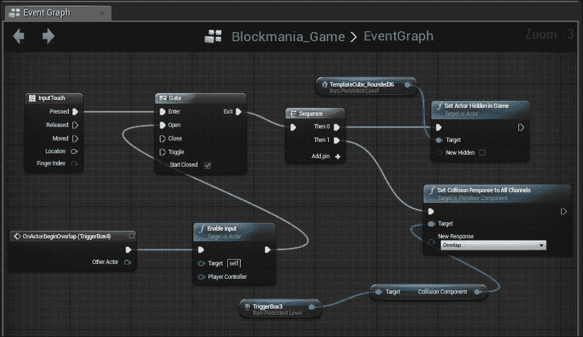

测试一下！你会发现一切都在按预期进行。现在，对剩余的关键立方体进行同样的操作。触摸屏幕时，选择要激活的触发框和后处理音量。然后，在 Level bluetooth 中，编写要取消隐藏哪个键立方体的脚本，以此类推(将我们之前放置的键立方体放置在基座上，并将其设置为**隐藏**，然后将 bluetooth 类键立方体放置在其位置上。

这是您可以使用蓝图类的许多方法之一。你可以看到这需要大量的工作和麻烦。现在让我们继续讨论人工智能。

# 编写基本 AI 脚本

回到第三个房间，我们现在要在我们的游戏中实现 AI。我们在第三个房间有一个人工智能角色，当它被激活时，会移动。主要目的是在开关的帮助下为它开辟一条道路，防止它坠落。当人工智能角色到达目的地时，它会解锁钥匙立方体，然后玩家可以拿起并放在基座上。我们首先需要创建另一个类型为**角色**的蓝图类，并将其命名为`AI_Character`。创建后，双击它将其打开。您将看到一些组件已经在**视口**中设置好了。分别是**封装组件**(主要用于碰撞)**箭头组件**(指定哪一面是角色正面，哪一面是背面)**网格**(用于角色动画)**角色移动**。默认情况下，这四个都在那里，不能删除。这里我们唯一需要做的就是为我们的角色添加一个**静态网格**，它将是 **TemplateCube_Rounded** 。

点击**添加组件**，添加一个**静态网格**，并为其分配**模板立方体 _ 圆角**(在其**细节**面板中)。接下来，沿着所有三个轴将这个立方体缩放到`0.2`，并将其向**封装组件**的底部移动，这样它就不会漂浮在半空中。

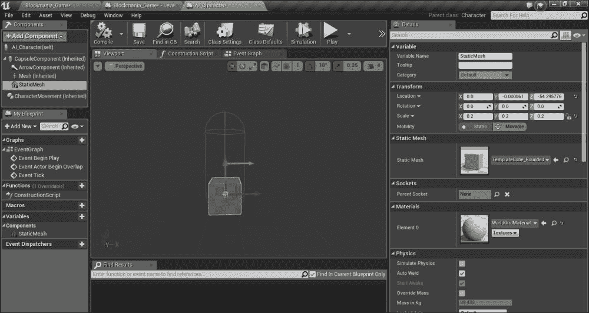

这是我们对人工智能角色的全部要求。剩下的我们将在关卡蓝图中处理。接下来，将 **AI_Character** 放置到坑的玩家一侧的场景中，所有的开关。将它直接放在目标点演员的上方。

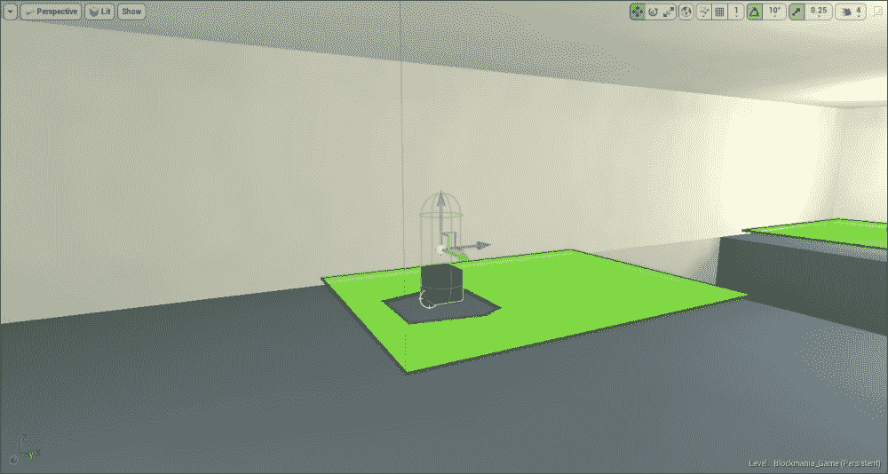

接下来，打开级蓝图，让我们开始编写脚本。最左边的开关将用于激活人工智能角色，其余三个开关将用于绘制它将在其上行走以到达另一侧的路径部分。

要移动人工智能角色，我们需要一个**人工智能移动到**节点。我们首先需要的是触发器在第一个开关上的重叠事件，这将启用输入，否则每当玩家触摸屏幕时，AI 角色就会开始移动，这是我们不希望的。设置**重叠**事件、**使能输入**节点和**门**事件。将**重叠**事件连接到**使能输入**事件，然后连接到**门**节点的**打开**输入。

接下来就是创建**触摸**节点。对此，我们将附加一个**人工智能移动到**节点。你可以输入或者在人工智能部分找到它。创建后，将其连接到**门**节点的**出口**引脚。

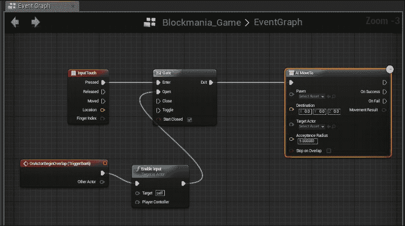

我们现在需要指定我们想要移动到哪个角色的节点，以及它应该移动到哪里。要指定我们要移动哪个角色，请在**视口**中选择人工智能角色，并在关卡蓝图的**图形编辑器**中右键单击并为其创建一个引用。将其连接到**典当**输入引脚。接下来，对于位置，我们希望 AI 角色移向第二个**目标点**演员，位于坑的另一侧。但首先，我们需要知道它在世界上的位置。选中后，在**图形编辑器**中右击，输入`Get Actor Location`。该节点返回一个参与者在世界上的位置(坐标)(连接到它的那个)。这将创建一个**获取参与者位置**，其中**目标点**参与者连接到其输入引脚。

最后，将其**返回值**连接到 **AI 移动到**节点的**目的地**输入。

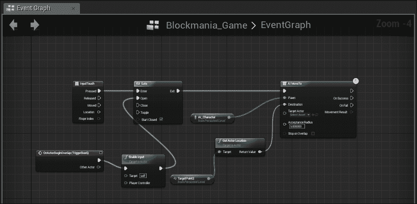

如果你要测试一下的话，你会发现它工作得很好，除了一点:AI 角色在到达坑边时会停止。如果没有路，我们希望它从坑里掉下来。为此，我们需要一个**导航代理链接**演员。如前一章所述，当人工智能角色必须暂时离开导航网格时(例如，在壁架之间跳跃)，会使用**导航代理链接**演员。如果我们想让我们的人工智能角色从壁架上掉下来，我们就需要这个。您可以在**模式**面板的**所有类别**部分找到它。把它放在水平位置。

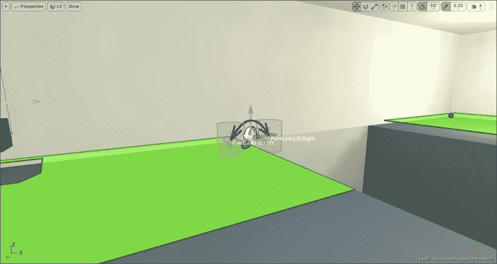

演员被描绘成两个圆柱体，中间有一个弯曲的箭头。我们希望第一个圆柱体在坑的一侧，另一个圆柱体在另一侧。使用**缩放**工具，增加**导航代理链接**演员的大小。

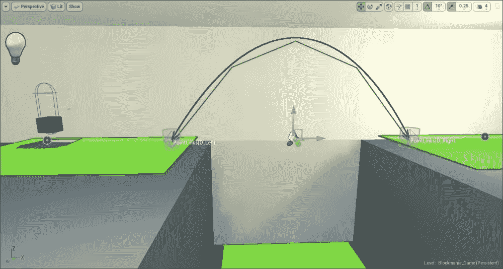

当放置 **导航代理链接**演员时，记住两件事:

*   确保两个圆柱体在绿色区域相交；否则，演员将无法工作
*   确保两个气缸都符合 AI 字符；否则，它不会直线移动，而是移动到圆柱体所在的位置

一旦放置，你会看到 AI 角色在到达坑边时会脱落。我们还没有完成。我们需要把 AI 角色带回它的起始位置，这样玩家才能重新开始(否则玩家将无法进步)。为此，我们需要首先在坑的底部放置一个触发器，确保如果人工智能角色确实落入其中，它会与触发器重叠。这个触发器会执行两个动作:第一，将 AI 角色瞬移到初始位置(借助第一个目标点)；第二，它会停止 **AI 移动到**节点，或者它会继续移动，即使它已经被传送了。

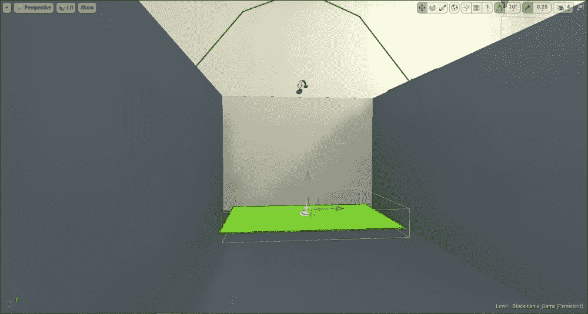

放置触发器后，打开级别蓝图，为触发器框创建一个重叠事件。对此，我们将添加一个**序列**节点，因为当玩家与触发器重叠时，我们将调用两个独立的函数。我们要创建的第一个节点是**传送**节点。在这里，我们可以指定传送哪个演员，以及传送到哪里。我们要传送的演员是 AI 角色，所以为其创建一个引用，并将其连接到 **Target** 输入引脚。对于目的地，首先使用**获取演员位置**功能获取第一个目标点演员的位置(AI 角色最初放置在其上)，并将其连接到**目标位置**输入。

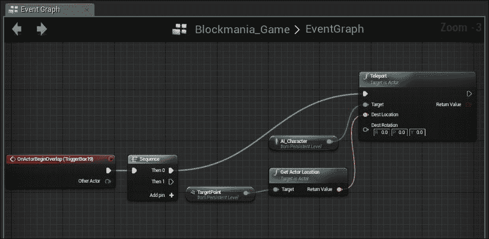

要停止人工智能角色的移动，右键单击**图形编辑器**中的任意位置，并首先取消选中**上下文敏感**框，因为我们不能在人工智能角色上直接使用该功能。我们需要的是一个**停止主动运动**节点。在搜索栏中键入并创建它。将其连接到**然后 1** 输出节点，并在其上附加一个人工智能字符的引用。它会自动从**字符参照**转换为**字符移动**组件参照。

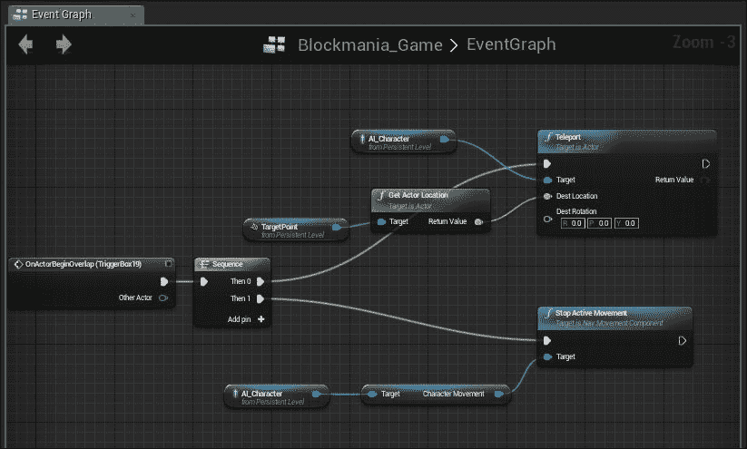

这就是我们在第三个房间为人工智能编写脚本所需的全部内容。还有一件事:如何解锁钥匙立方体。但是我们将在下一章讨论这个问题，因为它涉及日场。

在第四个房间，我们将使用相同的原理。在这里，我们将制作一个**人工智能移动到**节点的链，每个节点连接到前一个节点的**成功**输出引脚。这意味着当人工智能角色成功到达目的地(目标点演员)时，它应该移动到下一个，以此类推。利用这一点，以及我们刚才讨论的人工智能，编写人工智能将遵循的路径(回想上一章，我们在第四个房间中排列了人工智能角色将遵循的路径)。

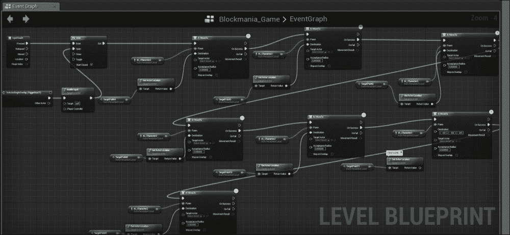

# 总结

在本章中，我们介绍了蓝图，并讨论了它们的工作原理。我们还讨论了等级蓝图和蓝图类，并介绍了如何编写人工智能脚本。我们还有一些东西要写，但首先我们必须涵盖虚幻日场的主题。在下一章中，我们将这样做。