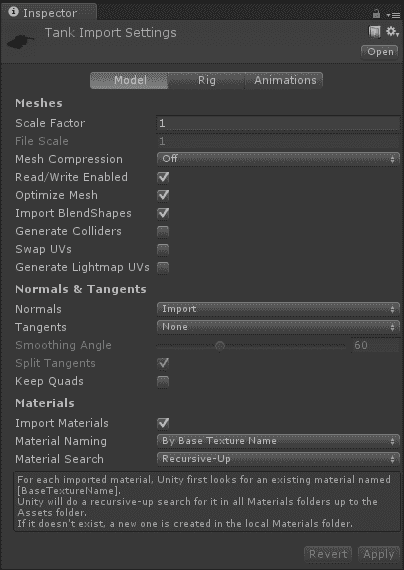
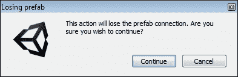
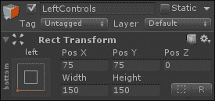
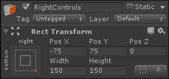
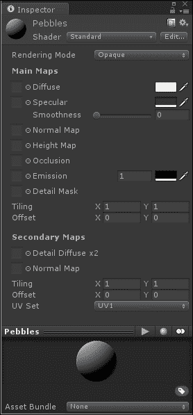
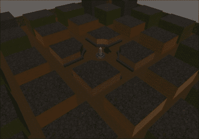
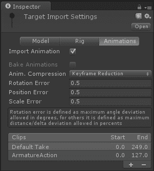
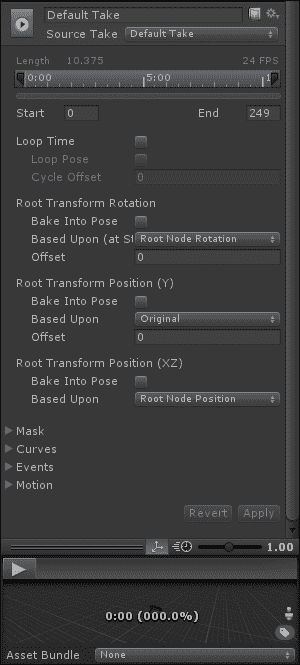
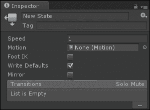

# 三、任何游戏的支柱——网格、材质和动画

在前一章中，我们了解了图形用户界面。我们从创建一个简单的井字游戏开始，了解游戏的基本部分。随后，我们改变了游戏的外观，并使棋盘处理多个屏幕方向。我们以一些菜单结束。

这一章是关于任何游戏的核心:网格，材质和动画。没有这些区块，一般没有什么东西可以给玩家看。当然，您可以在图形用户界面中使用平面图像。但是，这有什么乐趣呢？如果你打算选择一款 3D 游戏引擎，不妨充分利用它的功能。

为了理解网格，材质和动画，我们将创建一个坦克战游戏。这个项目将在其他几章中使用。到本书结束时，这将是我们已经创建的两个健壮的游戏之一。对于这一章，玩家将驾驶坦克绕过一个小城市，他们将能够向动画目标射击，我们还将添加一个计数器来跟踪分数。

本章涵盖以下主题:

*   导入网格
*   创造材质
*   动画片
*   创建预设
*   光线追踪

在本章中，我们将开始一个新项目，所以请按照第一部分开始。

# 设置

虽然这个项目最终会变得比以前的项目大得多，但实际的设置与以前的项目相似，并不过度复杂。这个项目需要大量的启动素材；它们将在设置过程中进行描述。由于这些素材的复杂性和特殊性，建议现在使用本书代码包中提供的素材。

正如我们在前面两章中所做的，我们将需要创建一个新的项目，这样我们就可以创建我们的下一个游戏。显然，首先要做的是启动一个新的 Unity 项目。出于组织目的，将其命名为`Ch3_TankBattle`。以下几点是项目启动所需的先决条件:

1.  这个项目也会变得比我们以前的项目大得多，所以我们应该创建一些文件夹来保持东西的有序。首先，创建六个文件夹。顶层文件夹将是`Models`、`Scripts`和`Prefabs`文件夹。在`Models`中，创建`Environment`、`Tanks`和`Targets`。有了这些文件夹，项目就更容易管理了。任何完整的模型都可以由一个网格文件、一个或多个纹理、每个纹理的材质以及可能的几十个动画文件组成。
2.  在我们继续之前，如果你还没有这样做，最好把你的目标平台换成安卓。每次目标平台改变时，项目中的所有素材都需要重新导入。这是由 Unity 执行的一个自动步骤，但是随着我们项目的增长，它将花费越来越多的时间。通过在项目中有任何东西之前设置我们的目标平台，我们节省了大量的时间。
3.  我们还将利用 Unity 的一个非常强大的部分:预置。这些都是特殊的对象，使得创建游戏的过程变得非常容易。这个名字的意思是预制的——预先创建并复制。这对我们来说意味着我们可以完全为我们的坦克设定一个射击目标，并把它变成一个预制的。然后，我们可以在整个游戏世界中放置预置的实例。如果我们需要改变目标，我们需要做的就是修改原来的预设。对一个预制构件所做的任何改变也在该预制构件的任何实例上进行。不用担心；使用时更有意义。
4.  我们需要为这个项目创建一些网格和纹理。首先，我们需要一辆坦克(在没有任何坦克的情况下进行坦克之战有点困难)。装有这种代码包的坦克有一个炮塔和一门大炮，它们是独立的部件。我们还将使用一个技巧来使坦克的履带看起来像是在移动，所以它们中的每一个都是独立的零件，并使用独立的纹理。
5.  最后，我们需要一个动画目标。这本书的代码包中提供的代码包就像一只手长着靶心的人类手臂。它有四个动画。第一个从卷曲位置开始，到伸展位置。第二个与第一个相反，从伸展位置到卷曲位置。第三个从伸展位置开始，向后甩，就像前面被击中一样，然后回到卷曲位置。最后一个就跟第三个一样，但是往前走好像是从后面撞的。这些是相当简单的动画，但它们将很好地帮助我们了解 Unity 的动画系统。

这里发生的很少；我们只是创建了这个项目，并添加了一些文件夹。还有一些关于我们将用于本章项目的素材的讨论。

# 导入网格

将素材导入 Unity 有几种方式。我们将通过最简单(当然也是最好)的方式来导入素材组。让我们开始吧:

1.  在统一编辑器中，首先右键单击您的`Tanks`文件夹，并从菜单中选择**在浏览器中显示**。
2.  This opens the folder that contains the asset that was selected. In this case, the `Models` folder opens in the Windows' folder browser. We just need to put our tank and its textures into the `Tanks` folder.

    ### 注

    本章提供的文件有`Tank.blend`、`Tanks_Type01.png`、`TankTread.png`。此外，在 Unity 中使用`.blend`文件需要在您的系统中安装 Blender。Blender 是一个免费的建模程序，可在[http://www.blender.org](http://www.blender.org)获得。Unity 利用它将前面提到的文件转换成它可以充分利用的文件。

3.  当我们返回 Unity 时，我们添加文件的事实将被检测到，并且它们将被自动导入。这是 Unity 最棒的地方之一。没有必要明确告诉 Unity 导入。如果项目素材中有变化，它只是自动更新素材。
4.  您可能还会注意到，当 Unity 导入我们的坦克时，创建了一个额外的文件夹和一些文件。每当导入新网格时，默认情况下，Unity 会尝试将其与材质配对。在下一节中，我们将更详细地讨论 Unity 中的材质。目前，它是一个跟踪如何在网格上显示纹理的对象。基于网格中的信息，Unity 在项目中查找具有正确名称的材质。如果找不到，将在网格旁边创建一个`Materials`文件夹，并在其中创建缺失的材质。创建这些材质时，Unity 还会搜索来寻找合适的纹理。这就是为什么在添加网格的同时向文件夹中添加纹理很重要，这样它们就可以一起导入了。如果您没有在坦克的同时添加纹理，那么关于创建材质的部分将描述如何向材质添加纹理。

我们已经把我们的坦克引进了 Unity。真的很简单。对项目的任何素材或文件夹所做的更改都会被 Unity 自动检测到，所需的任何内容都会相应地导入。

# 油箱导入设置

将任何素材导入统一是通过使用一组默认设置来完成的。这些设置中的任何一个都可以从**检查器**窗口进行更改。选择新坦克后，我们将在此查看模型的导入设置:



我们可以在前面的截图中看到**检查器**窗口的顶部有三个选项卡:**模型**、**装备**和**动画**。**模型**页面处理网格本身，而**装备**和**动画**用于导入动画。目前我们只关心的**型号**页面，如果还没有选择就选择它。**型号**页面的每个部分都在这里分解。

## 网格

上一张截图的**网格**部分有以下选项:

*   **导入设置**窗口的**网格**部分以**比例因子**属性开始。这个值告诉 Unity 默认情况下网格有多大。建模程序中的一个通用单位或一米在 Unity 中转换为一个单位。这种坦克是以通用单位制造的，所以坦克的比例因子是 1。如果你在制作坦克的时候用厘米来计算，比例因子将是 0.01，因为一厘米是一米的百分之一。
*   **文件比例**选项是最初创建模型时在建模程序中使用的比例。它主要是信息性的。如果需要调整导入模型的尺寸，请调整**比例因子**。
*   下一个选项**网格压缩**，将在最后一章当我们复习优化我们的游戏时变得重要。压缩设置得越高，游戏中文件的大小就越小。然而，这将开始在你的网格中引入奇怪的东西，因为 Unity 会使它变小。目前，将其设为**关闭**。
*   如果您想在游戏进行过程中更改网格，则**读/写启用**选项非常有用。这允许你做一些非常酷的事情，比如可破坏的环境，在那里你的脚本根据网格被拍摄的位置将网格分割成小块。然而，这也意味着 Unity 必须在内存中保留一份网格的副本，如果系统很复杂，这可能真的会开始滞后。这超出了本书的范围，因此取消选中此选项是个好主意。
*   **优化网格**选项是一个很好的选择，除非你正在对网格做一些特定和花哨的事情。开启此功能后，Unity 会执行一些特殊的“幕后”魔法。在计算机图形学中，尤其是 Unity，每个网格最终都是一系列画在屏幕上的三角形。此选项允许 Unity 对文件中的三角形重新排序，以便更快、更容易地绘制整个网格。
*   **导入混合形状**选项允许统一理解可能是模型一部分的任何混合形状。这些是模型顶点的动画位置。通常，它们用于面部动画。下一个选项是**生成对撞机**，如果你在用物理做复杂的事情，这个选项很有用。Unity 有一组简单的碰撞器形状，应该尽可能使用，因为它们更容易处理。然而，在有些情况下，他们不会完全完成工作；例如，碎石或半管，其中碰撞形状太复杂，无法用一系列简单的形状制成。这就是为什么 Unity 有一个**网格碰撞器**组件。选中此选项后，模型中的每个网格都将添加一个**网格碰撞器**组件。在本章中，我们将坚持使用简单的碰撞器，因此关闭**生成碰撞器**选项。
*   **交换紫外线**和**生成光照贴图紫外线**选项主要用于处理照明，尤其是光照贴图。Unity 可以处理模型上的两组紫外线坐标。通常，第一个用于纹理，第二个用于光照贴图或阴影纹理。如果顺序不对，**交换 UVs** 会改变顺序，让第二套先来。如果你需要一个光照贴图的解包但没有创建，那么**生成光照贴图紫外线**将为你创建一个。在这个项目中，我们不使用光照贴图，所以这两者都可以保持关闭。

## 法线&切线

早期截图的**法线&切线**部分有以下选项:

*   下一部分选项**法线&切线**，从**法线**选项开始。这定义了 Unity 如何保持网格的法线。默认情况下，它们是从文件导入的；但是，也可以选择让 Unity 根据网格的定义方式来计算它们。否则，如果我们将此选项设置为**无**，Unity 将不会导入法线。如果我们希望我们的网格受到实时光照的影响，或者使用法线贴图，那么法线是必需的。我们将在本项目中使用实时照明，因此将其设置为**导入**。
*   如果网格具有法线贴图，则使用**切线**、**平滑角度**和**分割切线**选项。需要切线来确定灯光如何与法线贴图曲面交互。默认情况下，Unity 会为您计算这些。只能从少数文件类型导入切线。基于两个面之间的角度的平滑角度决定了边缘上的阴影是平滑还是锐利。**分割切线**选项用于处理一些特定的照明问题。如果照明被接缝破坏，启用此选项将修复它。普通地图非常适合让低分辨率游戏看起来像高分辨率游戏。然而，由于使用它们所需的所有额外文件和信息，它们对于移动游戏来说并不理想。因此，我们不会在本书中使用它们，因此可以关闭所有这些选项来节省内存。
*   **保留四边形**选项将允许您的模型利用 DirectX 11 的新镶嵌技术，从低细节模型和特殊的位移图创建高细节模型。不幸的是，移动设备还需要一段时间才能支持这样的细节，甚至更长时间才能变得普遍。

## 材质

上一张截图的**素材**部分有以下选项:

*   最后一节**材质**定义了 Unity 应该如何寻找材质。第一个选项**进口材质**，允许您决定是否进口材质。如果关闭，将应用默认的白色材质。此材质不会出现在您项目的任何地方；这是一个隐藏的默认值。对于没有任何纹理的模型，例如碰撞网格，可以将其关闭。对于我们的坦克和几乎每一个其他情况，这应该留在。
*   最后两个选项**材质命名**和**材质搜索**共同命名和查找网格的材质。在它们的正下方，有一个文本框，描述了 Unity 将如何搜索材质。
    *   正在搜索的材质的名称可以是建模程序中使用的纹理的名称、在建模程序中创建的材质的名称，或者是模型和材质的名称。如果找不到纹理名称，将使用材质名称。
    *   默认情况下，Unity 执行递归向上搜索。这意味着我们从`Materials`文件夹开始搜索，然后搜索同一文件夹中的任何材质。然后，我们检查父文件夹中是否有匹配的材质，接下来是上面的文件夹。这种情况一直持续到我们找到具有正确名称的材质或者我们到达根素材文件夹。
    *   或者，我们可以选择检查整个项目或者只查看模型旁边的`Materials`文件夹。这些选项的默认值都很好。一般来说，它们不需要改变。它们很容易处理，尤其是对于大型项目，使用 Unity Editor 脚本，这在本书中不会涉及。

## 恢复和应用按钮

接下来，截图中有 **【复原】**和**应用**按钮，在此说明:

*   Whenever changes are made to the import settings, one of the two buttons, **Revert** or **Apply**, must be chosen. The **Revert** button cancels the changes and switches the import settings back to what they were before changes were made. The **Apply** button confirms the changes and reimports the model with the new settings if these buttons are not selected; Unity will complain with a pop up and force you to make a choice before letting you mess with anything else.

    

*   最后，我们有两种类型的预览，正如我们在前面的截图中看到的。如果我们将对象添加到**场景**视图并选择它，则**导入对象**部分是对象在**检查器**窗口中的预览。**预览**窗口，我们可以看到坦克模型的部分，是模型在**场景**视图中的样子。您可以在此窗口中单击并拖动对象来旋转它，并从不同的角度查看它。此外，这个窗口中还有一个蓝色的小按钮。单击此按钮，您将能够向对象添加标签。然后，这些标签也将在**项目**窗口中进行搜索。

## 设置油箱

现在我们已经导入了坦克，我们需要设置它。我们将调整坦克的布局，并创建一些脚本。

### 坦克

在这一点上，我们坦克的创建将主要包括坦克部件的创建和布置。使用以下步骤，我们可以设置我们的坦克:

1.  Start by dragging the tank from the **Project** window to the **Hierarchy** window. You will notice that the name of the tank appears in blue color in the **Hierarchy** window. This is because it is a prefab instance. Any model in your project largely acts like a prefab. However, we want our tank to do more than just sit there; so, being a prefab of a static mesh is not helpful. Therefore, select your tank in the **Hierarchy** window and we will start to make it useful be removing the **Animator** component. To do this, select the gear to the right of the Animator component in the **Inspector** window. From the new drop-down list, select **Remove Component**, as seen in the following screenshot, and it will be removed:

    

2.  If you are using the tank that is provided by default, selecting the different parts of it will reveal that all the pivot points are at the base. This will not be useful for making our turret and cannon pivot properly. The easiest way to solve this is by adding new empty **GameObjects** to act as pivot points.

    ### 注

    场景中的任何物体都是`GameObject`。任何空的`GameObject`都只有一个**变换**组件。

3.  在统一编辑器的顶部，**创建空的**是**游戏对象**按钮下的第一个选项。它创造了我们需要的物品。创建两个空的游戏对象，一个放在炮塔的底部，另一个放在加农炮的底部。另外，分别将其重命名为`TurretPivot`和`CannonPivot`。如果选择了对象，这可以通过位于**检查器**窗口顶部的文本框来完成。
4.  In the **Hierarchy** window, drag `TurretPivot` onto `Tank`. This changes the parent of `TurretPivot` to `Tank`. Then, drag the object, that is, the turret mesh, onto `TurretPivot`. In the code, we will be rotating the pivot point and not the mesh directly. When a parent object moves or rotates, all of the children objects move with it. When you make this change, Unity will complain about the change to the original hierarchy of the object; it does this just to make sure that it is a change that you want to make and not an accident:

    

5.  由于失去与预设的连接可能会破坏游戏，统一只是想确保我们真的希望它发生。所以，点击**继续**，我们就可以完成坦克的工作，而无需 Unity 的其他抱怨。我们也需要让`CannonPivot`成为`TurretPivot`的孩子，让大炮成为`CannonPivot`的孩子。
6.  为了完成我们的层次变化，我们需要放置摄像机。因为我们希望玩家看起来好像他们真的在坦克里，所以相机应该放在坦克的后面和上面，稍微向下倾斜，聚焦在前方几个坦克长度的地方。一旦定位好，也让它成为`TurretPivot`的孩子。

我们已经建立了坦克将要使用的基本结构。通过以这种方式利用多个物体，我们可以彼此独立地控制它们的运动和动作。在这一点上，我们可以独立地倾斜、旋转和瞄准每一块，而不是拥有一个只指向前方的刚性坦克。

### 类型

此外，坦克应该在你想要整个东西旋转的点的上方居中。如果你的不是，你可以在**层次**窗口中选择基本坦克对象下的所有东西，并移动它。

### 记分

一个记录玩家分数的短脚本和一个文本元素的添加将构成这一小段的重点。以下是创建我们的脚本的步骤:

1.  让我们的坦克工作所需的第一个脚本相当简单。创建一个新的脚本并命名为`ScoreCounter`。顾名思义，它将跟踪分数。在`Scripts`文件夹中创建它，并清除默认功能，就像我们到目前为止制作的所有其他脚本一样。
2.  就像我们在上一章中所做的那样，因为任何需要访问我们的任何图形用户界面元素的脚本都需要在脚本的最顶部多加一行，所以在显示`using UnityEngine;`的那一行之后添加下面一行代码。这允许我们使用和更改显示分数所需的文本元素:

    ```java
    using UnityEngine.UI;
    ```

3.  从上一章开始，下面一行代码应该看起来很熟悉。首先，我们定义一个整数计数器。由于它是静态的，其他脚本(例如我们将为目标创建的脚本)将能够修改这个数字并给我们评分:

    ```java
    public static int score = 0;
    ```

4.  然后，我们将添加一个变量来存储界面的文本元素。它将像上一章的转弯指示器一样工作，给我们一个位置来更新和显示玩家的分数:

    ```java
    public Text display;
    ```

5.  这个脚本的最后一段代码是一个`Update`函数。Unity 会为每一帧自动调用该函数。对于我们来说，这是一个完美的地方，可以在没有玩家直接输入的情况下，放置任何需要定期更改的代码和逻辑。出于我们的目的，我们将更新文本元素，并确保它始终显示最新的分数。通过将分数加到双引号中，我们将数字变成一个单词，以便文本元素可以正确使用它:

    ```java
    public void Update() {
      display.text = "" + score;
    }
    ```

这个很简单的剧本就到这里。它会全程跟踪我们的得分。此外，其他脚本将更新计数器来给玩家打分，而不是自己进行任何分数增量。

### 重复按钮

到目前为止，我们使用的按钮只有在被按下和释放时才会执行一个动作。我们的玩家需要按住按钮来控制他们的坦克。所以，我们需要创建一个重复按钮；一个按钮，只要按住它就执行一个动作。按照以下步骤创建重复按钮:

1.  创建一个应该命名为`RepeatButton`的新脚本。
2.  为了让这个脚本能够访问 Unity 中它需要工作的部分，就像前面的脚本一样，我们需要在上面写着`using UnityEngine;`的那一行后面添加下面两行。第一个将使我们能够访问`Selectable`类:所有交互界面元素都是从这个类中派生出来的。第二个将让我们处理当我们的玩家与我们的新按钮交互时发生的事件:

    ```java
    using UnityEngine.UI;
    using UnityEngine.EventSystems;
    ```

3.  接下来，我们需要更新代码的`public class`行。任何能够为我们游戏中的对象提供功能的普通脚本都会扩展到`MonoBehaviour`类。我们需要将该行更改为以下内容，这样我们的脚本就可以存在于并扩展界面的功能:

    ```java
    public class RepeatButton : Selectable {
    ```

4.  我们的脚本总共有四个变量。第一个允许它跟踪它是否被按下:

    ```java
    private bool isPressed = false;
    ```

5.  接下来的三个变量将提供与上一章中的按钮相同的功能。对于按钮，我们必须选择一个对象，然后从特定的脚本中选择一个函数，最后发送一些值。在这里，我们要做同样的事情。这里的第一个变量跟踪场景中我们将要与之交互的对象。第二个将是一个函数的名称，该函数位于附加到对象的一些脚本上。最后一个将是为该功能发送的数字，它将提供更具体的输入:

    ```java
    public GameObject target;
    public string function = "";
    public float value = 0f;
    ```

6.  该脚本的第一个函数将覆盖`Selectable`类提供的函数。它被称为玩家点击按钮的时刻。它被赋予了一些关于它是如何以及在哪里被点击的信息，这些信息被存储在`eventData`中。第二行只是调用父类上同名的函数。这个函数做的最后一件事是设置我们的布尔标志来标记这个按钮当前正被玩家按下:

    ```java
    public override void OnPointerDown(PointerEventData eventData) {
      base.OnPointerDown(eventData);
      isPressed = true;
    }
    ```

7.  下一个函数与前一个函数做完全相同的事情。主要区别在于，当玩家的鼠标或触摸不再在界面的按钮上时，就会调用它。第二个区别是，它将布尔设置为`false`，因为当我们的玩家将手指从按钮上拖下时，他们不再按下按钮，在这种情况下，我们希望停止执行我们的动作:

    ```java
    public override void OnPointerExit(PointerEventData eventData) {
      base.OnPointerExit(eventData);
      isPressed = false;
    }
    ```

8.  下面的函数与前两个类似。但是释放按钮时调用:

    ```java
    public override void OnPointerUp(PointerEventData eventData) {
      base.OnPointerUp(eventData);
      isPressed = false;
    }
    ```

9.  这个脚本的最终功能还是我们的`Update`功能。它首先检查玩家当前是否按下了这个按钮。然后它在我们的目标对象上调用`SendMessage`函数，告诉它执行什么函数和使用什么数字。`SendMessage`功能仅适用于**游戏对象**和**单体行为**组件。它采用一个函数的名称，并试图在消息发送到的游戏对象上找到它:

    ```java
    public void Update() {
      if(isPressed) {
        target.SendMessage(function, value);
      }
    }
    ```

又一个剧本完成了！这个允许我们按住按钮，而不是被迫重复按下按钮来浏览我们的游戏。

### 控制底盘

一个普通的坦克原地旋转，可以轻松的前后移动。我们将通过创建一个单独的脚本来让我们的坦克做到这一点。执行以下步骤为坦克创建第二个脚本:

1.  第二个剧本叫做`ChassisControls`。它会让我们的坦克移动。我们也将在`Scripts`文件夹中创建它。
2.  脚本的前三行定义了坦克需要移动的变量。我们还可以在**检查员**窗口中更改它们，以防我们的坦克太快或太慢。第一行定义了一个变量，该变量保存与`CharacterController`组件的连接。这个组件不仅可以轻松地移动坦克，还可以让它停在墙壁和其他碰撞器旁边。接下来的两行代码定义了我们移动和旋转的速度:

    ```java
    public CharacterController characterControl;
    public float moveSpeed = 10f;
    public float rotateSpeed = 45f;
    ```

3.  我们通过定义我们的`MoveTank`函数开始下面一行代码；它需要被传递一个`speed`值，以指示坦克应该前进多远以及向哪个方向前进。正值会使坦克前进，负值会使坦克后退:

    ```java
    public void MoveTank(float speed) {
    ```

4.  为了在三维空间中移动，我们需要一个向量——一个既有方向又有大小的值。因此，我们定义了一个运动矢量，并将其设置为坦克的前进方向，乘以坦克的速度，再乘以自上一帧以来经过的时间。
    *   如果你记得从几何类，三维空间有三个轴:x，y 和 z。在 Unity 中，以下惯例适用:x 在右边，y 向上，z 向前。变换组件保存对象位置、旋转和缩放的这些值。我们可以通过调用 Unity 提供的`transform`变量来访问 Unity 中任何对象的转换组件。`transform`组件还提供了一个`forward`变量，该变量将为我们提供一个指向对象所面对方向的矢量。
    *   此外，我们想要以规则的速度移动，例如，每秒一定的米数；因此，我们利用`Time.deltaTime`。这是由 Unity 提供的一个值，它保存自游戏的最后一帧在屏幕上绘制以来的秒数。把它想象成一本翻翻书。为了让它看起来像一个人在页面上行走，他需要在每一页上稍微移动。在游戏中，页面不会定期翻转。因此，我们必须通过翻转到新页面所需的时间来修改我们的运动。这有助于我们保持平稳的步伐
5.  接下来，我们要留在地面上。一般来说，你想在游戏中控制的任何角色都不会像巨石那样自动获得所有的物理效果，比如重力。例如，在跳跃时，您可以暂时移除重力，以便角色可以上升。这就是为什么下一行代码通过减去重力的正常速度，然后使其与我们的帧速率保持同步来实现重力的简单实现:

    ```java
    move.y -= 9.8f * Time.deltaTime;
    ```

6.  最后，对于`MoveTank`功能，我们实际上进行移动。`CharacterController`组件有一个特殊的`Move`功能，可以移动角色，但会通过碰撞来约束角色。我们只需要通过将`move`向量传递给它，告诉它我们要将该帧移动多远以及向哪个方向移动。当然，最后一个大括号关闭了这个函数:

    ```java
    characterControl.Move(move);
    }
    ```

7.  `RotateTank`功能还需要一个速度值来指示旋转的速度和方向。我们从定义另一个向量开始；然而，不是定义向哪个方向移动，而是指定向哪个方向旋转。在这种情况下，我们将围绕向上的方向旋转。然后，我们将把它乘以我们的`speed`和`Time.deltaTime`参数，以便移动得足够快并跟上我们的帧速率。

    ```java
    public void RotateTank(float speed) {
      Vector3 rotate = Vector3.up * speed * Time.deltaTime;
    ```

8.  函数的最后一位实际上是旋转的。**变换**组件提供`Rotate`功能。旋转，尤其是在 3D 空间中，会很快变得怪异和困难。`Rotate`功能为我们处理所有这些；我们只需要向它提供应用循环的值。另外，别忘了花括号关闭功能:

    ```java
    characterControl.transform.Rotate(rotate);
    }
    ```

我们创建了一个脚本来控制我们坦克的运动。它将使用来自`CharacterController`组件的特殊`Move`功能，以便我们的坦克可以前后移动。我们还使用了由**变换**组件提供的特殊`Rotate`功能来旋转我们的坦克。

### 控制炮塔

这个下一个脚本将允许玩家旋转他们的炮塔并瞄准大炮:

1.  我们需要为坦克创建的最后一个脚本是`TurretControls`。这个脚本将允许玩家左右旋转炮塔，上下倾斜大炮。和所有其他的一样，在`Scripts`文件夹中创建它。
2.  我们定义的前两个变量将包含指向炮塔和大炮枢轴的指针——我们为坦克创建的空`GameObjects`。第二组是我们的炮塔和大炮旋转的速度。最后，我们有一些极限值。如果我们不限制加农炮的旋转速度，它只会不停地旋转，穿过我们的坦克。对于坦克来说，这不是最现实的行为，所以我们必须对它进行一些限制。极限在 300 度范围内，因为正前方是零度，下方是 90 度。我们希望它在向上的角度，所以它在 300°的范围内。我们也可以使用 359.9，因为 Unity 会将 360 更改为零，这样它就可以继续旋转:

    ```java
    public Transform turretPivot;
    public Transform cannonPivot;

    public float turretSpeed = 45f;
    public float cannonSpeed = 20f;

    public float lowCannonLimit = 315f;
    public float highCannonLimit = 359.9f;
    ```

3.  接下来是`RotateTurret`功能。它的工作方式与`RotateTank`功能完全相同。然而，我们并没有查看`CharacterController`组件的`transform`变量，而是对`turretPivot`变量进行操作:

    ```java
    public void RotateTurret(float speed) {
      Vector3 rotate = Vector3.up * speed * Time.deltaTime;
      turretPivot.Rotate(rotate);
    }
    ```

4.  第二个也是最后一个函数`RotateCannon`，随着旋转变得更加肮脏。错误完全在于需要限制大炮的旋转。打开功能后，第一步是计算出我们要旋转这个框架的程度。我们使用浮点值而不是向量，因为我们必须自己设置旋转:

    ```java
    public void RotateCannon(float speed) {
      float rotate = speed * Time.deltaTime;
    ```

5.  Next, we define a variable that holds our current rotation. We do this because Unity will not let us act on the rotation directly. Unity actually keeps track of rotation as a quaternion. This is a complex method of defining rotations that is beyond the scope of this book. Luckily, Unity gives us access to an x, y, and z method of defining rotations called `EulerAngles`. It is a rotation around each of the three axes in 3D space. The `localEulerAngles` value of a **Transform** component is the rotation relative to the parent **GameObject**.

    ```java
    Vector3 euler = cannonPivot.localEulerAngles;
    ```

    ### 注

    它之所以被称为`EulerAngles`是因为瑞士数学家莱昂哈德·欧拉提出了定义旋转的这个方法。

6.  接下来，我们通过使用`Mathf.Clamp`功能来调整旋转并一次应用极限。`Mathf`是一组有用的数学函数。`clamp`函数取一个值，使其不低于也不高于传递给该函数的其他两个值。所以，我们先把我们的 *x* 轴旋转发给它，这是`euler`当前 x 旋转减去旋转的结果。由于正旋转是围绕一个轴的顺时针旋转，我们必须用正值减去旋转以向上而不是向下。接下来，我们将下限传递给`Clamp`函数，然后是上限:这些是我们在脚本顶部定义的`lowCannonLimit`和`highCannonLimit`变量:

    ```java
    euler.x = Mathf.Clamp(euler.x – rotate, lowCannonLimit, highCannonLimit);
    ```

7.  最后，我们必须将新的旋转应用到大炮的枢轴点上。这包括简单地将**变换**组件的`localEulerAngles`值设置为新值。同样，请务必使用大括号关闭功能:

    ```java
    cannonPivot.localEulerAngles = euler;
    }
    ```

我们现在已经创建了一个控制坦克炮塔的脚本。玩家将能够控制大炮的倾斜和炮塔的旋转。这个脚本的功能与我们之前创建的`ChassisControls`脚本非常相似——不同之处在于限制了大炮的倾斜量。

### 将碎片放在一起

这是目前的最后一个剧本。我们有我们的坦克和脚本；下一步是将它们放在一起:

1.  Now, we need to add the scripts to our tank. Remember how we added our `Tic-tac-toe` script to the camera in the last chapter? Start by selecting your tank in the **Hierarchy** window. Before these scripts work, we will first need to add the `CharacterController` component to our tank. So, go to the top of the Unity Editor and select **Component**, then select **Physics**, and finally click on the **Character Controller** option.

    添加新组件后，您会注意到在**场景**视图中，油箱上出现一个绿色胶囊。这个太空舱代表将与其他对撞机碰撞和相互作用的空间。**角色控制器**组件上的值让我们可以控制它如何与其他碰撞器交互。对于大多数情况，前四个参数的默认值都很好。

    

    **字符控制器**中的参数如下:

    *   **坡度限制**:该属性向我们展示了控制器可以向上移动的坡度有多陡。
    *   **步长偏移**:这个属性告诉我们一个步长在开始阻挡移动之前可以有多高。
    *   **蒙皮宽度**:这个定义了另一个对撞机在完全停止之前，可以穿透这个控制器的对撞机多远。这主要用于物体之间的挤压。
    *   **最小移动距离**:该属性用于限制抖动。这是在框架实际移动之前必须应用的最小移动量。
    *   **中心** / **半径** / **高度**:这些属性定义了您在**场景**视图中看到的胶囊的大小。它们用于碰撞。
2.  最后三个价值观是当下最重要的。我们需要尽可能地调整这些值，以匹配我们坦克的尺寸。诚然，太空舱是圆形的，我们的坦克是方形的，但是`CharacterController`组件是最容易通过碰撞移动角色的方式，也是最常用的方式。将`2.3`的值用于**半径**属性和**中心**属性的 **Y** 部分；其他一切都可以保留为默认值。
3.  现在是时候给我们的坦克添加脚本了。通过在**层次结构**窗口中选择坦克，并将`ChassisControls`、`TurretControls`和`ScoreCounter`脚本拖到**检查器**窗口上来完成此操作。这和我们在前面几章中所做的一样。
4.  接下来，我们需要完成创建我们在脚本中开始的连接。首先点击`CharacterController`组件的名称，并将其拖动到我们新的`ChassisControls`脚本组件上的**角色控制**槽中。Unity 允许我们在 Unity 编辑器中连接对象变量，这样它们就不必被硬编码。
5.  我们还需要连接我们的炮塔和大炮枢轴点。因此，单击并将点从**层次结构**窗口拖动到`TurretControls`脚本组件上的相应变量。
6.  在我们可以测试我们的游戏之前，我们需要创建一堆图形用户界面按钮来实际控制我们的坦克。首先创建一个画布，就像我们在上一章中做的那样，和一个空的游戏对象。
7.  空的游戏对象需要一个**矩形变换**组件，它需要成为`Canvas`的子对象。
8.  Rename it to `LeftControls` and set its anchor to **bottom left**. In addition, set **Pos X** to `75`, **Pos Y** to `75`, **Pos Z** to `0`, **Width** to `150`, and **Height** to `150` as shown in the following screenshot:

    

9.  接下来，我们需要四个按钮成为`LeftControls`的孩子。和上一章一样，它们可以通过导航到**游戏对象** | **用户界面** | **按钮**在编辑器顶部找到。
10.  将四个按钮重命名为`Forward`、`Back`、`Left`和`Right`。当你在做的时候，你也可以改变他们的文字子代来拥有相关的文字，比如`F`、`B`、`L`、`R`。
11.  只有当玩家点击并释放按钮时，按钮才会激活。反复点击只是为了让坦克移动不会很好地工作。因此，点击每个**按钮**组件右侧的齿轮，选择**移除组件**。
12.  现在，给每个添加我们的`RepeatButton`脚本。当我们扩展`Selectable`类时，您可以看到我们对按钮的控制和对其他按钮的控制是一样的。
13.  Set the values of **Width** and **Height** of all the four buttons to `50`. Their positions become as follows:

    <colgroup><col style="text-align: left"> <col style="text-align: left"> <col style="text-align: left"></colgroup> 
    | 

    纽扣

     | 

    可移植性操作系统接口

     | 

    位置 Y

     |
    | --- | --- | --- |
    | 向前 | Zero | Fifty |
    | 左边的 | -50 | Zero |
    | 背部 | Zero | -50 |
    | 对吧 | Fifty | Zero |

    

14.  现在我们有了四个运动按钮，我们需要将它们连接到我们的坦克上。对于每个按钮，从**层级**面板中拖动`Tank`，并将其放入**检查器**面板中的**目标**槽中。
15.  当我们接下来设置**功能**和**值**槽时，拼写非常重要。如果有一点点掉了，你的功能就找不到了，就会出现很多错误，坦克就不行了。对于`Forward`按钮，将**功能**槽设置为`MoveTank`，将**值**槽设置为`1`。`Back`按钮也需要**功能**槽中的`MoveTank`值，但需要**值**槽中的`-1`值。`Left`按钮需要**功能**槽中的`RotateTank`值和**值**槽中的`-1`值。`Right`按钮需要**功能**槽中的`RotateTank`值和**值**槽中的`1`值。
16.  接下来，我们需要设置我们的炮塔控制。右键单击**层级**窗口中的`LeftControls`，从新菜单中选择**复制**。将新副本重命名为`RightControls`。
17.  This new control set needs an anchor set of **bottom right**, a **Pos X** of `-75`, and **Pos Y** of `75` (as shown in the following screenshot):

    

18.  该设置下的按钮需要重命名为`Up`、`Down`、`Left`和`Right`。它们的文本可以分别更改为`U`、`D`、`L`和`R`。
19.  `Up`按钮的**功能**槽应设置为`RotateCannon`，其中**值**槽的值为`1`。`Down`按钮有`RotateCannon`的**功能**槽值和`-1`的**值**槽值。`Left`按钮需要`RotateTurret`作为**功能**槽的值，而**值**槽的值为`-1`。最后`Right`按钮需要`RotateTurret`的**功能**槽值和`1`的**值**槽值。
20.  最后要做的是创建一个新的文本元素，可以通过导航到**游戏对象** | **用户界面** | **文本**找到它，并将其重命名为`Score`。
21.  最后，选择您的`Tank`并将`Score`从**层级**窗口拖动到**分数计数器(脚本)**组件的**显示**槽。
22.  将场景保存为`TankBattle`并试用。

我们刚刚组装好坦克。除非在使用移动控件的同时查看**场景**视图，否则很难判断坦克在移动。炮塔控制可以在**游戏**视图中看到。除了没有一个参考点来判断我们的坦克是否在移动之外，它运行得相当好。下一步和下一部分将为我们添加我们的城市提供参考点。

当你第一次尝试倾斜大炮时，你可能会注意到一个快速的跳跃。这样的行为很烦人，让游戏看起来很破。试着调整大炮来修理它。如果你有问题，看看大炮开始旋转。这与每次我们试图移动它时旋转被夹紧的方式有关。

# 创造材质

在 Unity 中，材质是如何在屏幕上绘制模型的决定性因素。它们可以简单到把它涂成蓝色，也可以复杂到用波浪反射水。在本节中，我们将介绍材质控制的细节。我们还将创建我们的城市和一些简单的材质来纹理化它。

## 城市

创造一个城市给了我们的坦克和玩家一个很好的游戏场所。按照以下步骤创建我们的城市:

1.  For the purpose of this section, no part of the city provided with the code bundle of this book was given a specific texture. It was just unwrapped and some tile-able textures were created. So, we need to start by importing the city and the textures to the `Environment` folder. Do this in the same the way in which we imported the tank.

    ### 注

    文件有`TankBattleCity.blend`、`brick_001.png`、`brick_002.png`、`brick_003.png`、`dirt_001.png`、`dirt_003.png`、`pebbles_001.png`、`rocks_001.png`、`rubble_001.png`、`water_002.png`。

2.  随着城市的展开，Unity 仍将为其创建单一材质。然而，纹理从未在任何建模程序中应用。所以，材质是纯白色的。我们有几个额外的纹理，所以我们需要的不仅仅是整个城市的一种材质。创造新材质很简单；就像创建新脚本一样。右键点击`Environment`文件夹内的`Materials`文件夹，选择**创建**，然后点击**材质**，大概在菜单的中间位置。
3.  这将在文件夹中创建一个新的材质，并立即允许我们命名它。将材质命名为`Pebbles`。
4.  With your new material selected, take a look at the **Inspector** window. When we have selected a material, we get the options that are needed to change its look:

    

5.  从前面的截图中，您可以看到以下内容:
    *   在**检查器**窗口的最顶部，我们有一个跟随有**着色器**下拉列表的材质名称。着色器本质上是一个简短的脚本，它告诉显卡如何在屏幕上绘制一些东西。您将最常使用**标准**着色器；它本质上是一个包罗万象的着色器，因此默认情况下总是被选中。这是您可以选择任何特殊效果或自定义着色器的地方。
    *   **渲染模式**下拉菜单允许您选择该材质是否使用任何透明度。**不透明**表示它将是固体。**剪切**选项将根据 **Alpha 剪切**的值，在纹理的透明区域周围渲染出一条锐边。**透明**选项将根据纹理的 alpha 通道为您提供平滑的边缘。

### 主地图

**主地图**部分有以下选项:

*   **主贴图**部分从**漫反射**开始，在这里你可以放置你的主色纹理。它可以用插槽右侧的颜色选择器着色。
*   **镜面**选项定义了材质的光泽；把它想象成你设备屏幕上的强光。您可以使用图像来控制它，也可以使用拾色器来确定反射的颜色和平滑度，以控制眩光的锐度。
*   **法线贴图**选项允许您添加一个纹理来控制材质表面的着色。这些纹理需要特别导入。如果您选择的纹理设置不正确，将出现一个警告框，您可以选择**立即修复**进行更改。也会出现一个滑块，让你控制纹理的效果。
*   **高度图**选项的工作方式类似于**正常图**。它会调整素材的凹凸感，并给出一个滑块来调整它。
*   **遮挡**选项允许您向材质添加环境遮挡纹理，根据模型中对象彼此的接近程度控制材质的暗度或明度。
*   **发射**选项让您可以控制材质发出的投射光和颜色。这只会影响光照贴图和该材质的外观。要真正动态发光，必须通过添加实时光来伪造。
*   **细节蒙版**选项允许您控制**次级贴图**中的纹理出现在材质上的位置。
*   **平铺**和**偏移**的值控制纹理的大小和位置。**平铺**的值决定了纹理在 x 和 y 方向的归一化紫外空间中重复的次数。**偏移**参数是纹理在归一化紫外空间中从零开始的距离。您可以选择数字字段和输入值来修改它们。这样做，注意底部的**预览**窗口，你会看到它们是如何改变纹理的。平铺纹理最常用于表面纹理相似且特定纹理重复的大表面。

### 次级地图

**次级地图**部分有以下选项:

1.  **次级贴图**以**细节漫反射 x2** 开始，这是一个额外的漫反射纹理，将在您的主漫反射纹理之上混合。它可以用来增加巨石表面的凹凸变化。
2.  **法线贴图**的工作方式类似于主**法线贴图**槽，控制细节纹理的明暗。
3.  第二组**平铺**和**偏移**值的工作方式与第一组相同，只是控制细节纹理。通常这些设置高于第一个，以增加材质表面的额外兴趣。
4.  **紫外线设置**只允许您选择模型展开设置，细节纹理将在应用材质的模型上使用。
5.  通过从**项目**窗口拖动`pebbles_001`纹理并将其放到**扩散**槽右侧的方块上，将`pebbles_001`纹理添加到该材质中。
6.  为了使纹理的颜色更好，使用**漫射**槽右侧的颜色选择器，选择一种浅棕色。
7.  主**平铺**的 **X** 和 **Y** 值的`30`值将使**平铺**应用于我们的城市街道时更容易看到。
8.  要查看我们的新素材，首先将您的城市拖到**层级**窗口，以便将其添加到**场景**视图。右键拖动可以在**场景**视图中四处查看，使用 *W* 、 *A* 、 *S* 、 *D* 可以四处移动。看看城市的街道。
9.  现在，将您的新素材从**项目**窗口拖到您的**场景**视图中。拖动材质时，您应该会看到网格发生变化，看起来就像在使用材质一样。一旦你过了马路，放开你的鼠标左键。材质现在被应用于网格。
10.  但是，我们目前有整整四分之一的城市要纹理。所以，创造更多的材质，并在城市的其他地方使用剩余的纹理。为每个额外的纹理创建一个新的材质，以及`brick_002`的四个额外的纹理，这样我们就可以为每个建筑的高度创建不同的颜色。
11.  Apply your new materials to the city, either by looking at the following screenshot or through your own artistic sensibility:

    

    ### 类型

    当你试图到达中央喷泉时，如果你的坦克挡道，在**层级**窗口中选择你的坦克，并使用**场景**视图中的**小控件**将其拖到一边。

    如果你现在试着玩这个游戏，你可能会注意到我们有几个问题。首先，我们只有四分之一的城市；如果你建立了自己的城市，也许你会拥有更多。此外，城市上仍然没有碰撞，所以我们移动时会直接穿过它。

12.  改变我们坦克的尺寸很简单。在**层级**窗口中选择它，并在我们的**变换**组件中查找**比例**标签。在**刻度**下改变 **X** 、 **Y** 、 **Z** 的数值会改变我们坦克的尺寸。一定要均匀地改变它们，否则当我们开始旋转水箱时会出现一些奇怪的情况。`0.5`的值使坦克足够小，可以穿过小街道。
13.  Next up is collision for the city. For the most part, we will be able to get away with simple collision shapes that are faster to process. However, the circular center of the city will require something special. Start by double-clicking on the walls of one of the square buildings in the **Scene** view.

    ### 类型

    当处理预设时，城市仍然是，点击组成预设的任何对象将选择根预设对象。一旦一个预制体被选中，点击它的任何一部分都会选择那个单独的部分。因为这种行为不同于非预制对象；在**场景**视图中选择对象时，需要注意这一点。

14.  选中一组墙，到 Unity 编辑器顶部选择**组件**，然后选择**物理**，最后选择**箱式对撞机**。
15.  当我们将碰撞器添加到特定的网格中时，Unity 会尽最大努力自动将碰撞器适配到形状中。对我们来说，这意味着新的`BoxCollider`组件的尺寸已经适合建筑。继续在其余的方形建筑和外墙上添加`BoxCollider`组件。我们的街道本质上只是一架飞机，所以一个`BoxCollider`组件对他们来说也同样适用。虽然它指向顶部，但喷泉中心的方尖碑本质上只是一个盒子；所以另一个`BoxCollider`会很适合它。
16.  我们还有最后一栋建筑和喷泉环要处理。这些不是盒子、球体或胶囊。所以，我们简单的对撞机不会工作。选择最后一栋建筑的墙壁，靠近中央喷泉的那栋。从您选择**箱式对撞机**的地方往下几个选项，有一个**网格对撞机**选项。这将为我们的对象添加一个`MeshCollider`组件。这个组件顾名思义；它需要一个网格，并把它变成一个对撞机。通过将其添加到特定网格中，`MeshCollider`组件自动选择该网格为“可碰撞的”。您还应该在中心建筑周围的短壁架和喷泉周围的环形墙上添加`MeshCollider`组件。
17.  最后要解决的问题是我们城市小区的重复建设。首先在**层级**窗口中选择根城市对象，选择`TankBattleCity`，并从中移除`Animator`组件。这个城市不会有生气，所以它不需要这个组件。
18.  现在，在**层级**窗口中右键点击城市，点击**复制**。这将创建所选对象的副本。
19.  将城市区再复制两次，我们将拥有城市的四个部分。唯一的问题是，它们都将处于完全相同的位置。
20.  我们需要旋转其中的三块来制作一个完整的城市。选择一个，将**变换**组件中 **Y 旋转**的值设置为`90`。这将绕垂直轴旋转 90 度，给我们半个城市。
21.  我们将剩下的一个设置为`180`，另一个设置为`270`，完成城市。
22.  That leaves one last thing to do. We have four center fountains. In three of the four city pieces, select the three meshes that make up the center fountain (the `Obelisk`, `Wall`, and `Water`) and hit the *Delete* key on your keyboard. Confirm that you want to break the prefab connection each time, and our city will be complete, as shown in the following figure:

    

现在试试这个游戏。我们可以驾驶坦克绕着城市旋转它的炮塔。这太有趣了。我们创造了材质和纹理的城市，并在使玩家有可能与建筑物和道路碰撞后，我们复制了部分，这样我们就可以有一个完整的城市。

现在你已经具备了导入网格和创建材质所需的所有技能，挑战在于装饰城市。创建一些碎石和坦克陷阱，并练习将它们导入到 Unity，并在场景中设置它们。如果你真的想超越自我，那就去尝试创造你自己的城市；从世界上选择一些东西，或者用你的想象力做一些事情。一旦它被创造出来，我们就可以释放里面的坦克。

## 移动踏板

只剩下一件事要做了，然后我们就用材质搞定了，可以继续让游戏更好玩了。还记得材质的**偏移**值吗？事实证明，我们可以用一个脚本来控制它。执行以下步骤，使履带随着我们的坦克移动:

1.  首先打开`ChassisControls`脚本。
2.  首先，我们需要在脚本的开头添加一些变量。前两个将保存对我们的坦克踏板渲染器的引用，该渲染器是网格对象的一部分，用于跟踪应用于网格并实际绘制的材质。这类似于`characterControl`变量如何引用我们的`CharacterController`组件:

    ```java
    public Renderer rightTread;
    public Renderer leftTread;
    ```

3.  接下来的两个变量将跟踪应用于每个胎面的偏移量。我们将它存储在这里，因为这是一个比尝试从每个帧的胎面材质中查找它更快的参考。

    ```java
    private float rightOffset = 0;
    private float leftOffset = 0;
    ```

4.  要使用新值，需要在`MoveTank`函数的末尾添加以下几行代码。这里的第一行根据我们的速度调整右踏板的偏移，并与我们的帧速率保持同步。第二行利用`Renderer`组件的材质值来查找我们坦克的胎面材质。材质的`mainTextureOffset`值是材质中主要纹理的偏移量。对于我们的漫射材质，这是唯一的纹理。然后，我们必须将偏移设置为新的`Vector2`值，该值将包含我们的新偏移值。`Vector2`就像`Vector3`一样，我们用它来移动，但是它在 2D 空间而不是 3D 空间工作。纹理是平的；因此，它是一个 2D 空间。代码的最后两行和另外两行做了同样的事情，但是换成了坦克的左踏板:

    ```java
    rightOffset += speed * Time.deltaTime;
    rightTread.material.mainTextureOffset = new Vector2(rightOffset, 0);
    leftOffset += speed * Time.deltaTime;
    leftTread.material.mainTextureOffset = new Vector2(leftOffset, 0);
    ```

5.  要连接到踏板的`Renderer`组件，请执行与枢轴点相同的操作:将踏板网格从**层次结构**窗口拖动到**检查器**窗口中的相应值。完成后，请务必保存并试用。

我们更新了我们的`ChassisControls`脚本，使坦克的履带移动。当坦克行驶时，纹理会向适当的方向平移。这是用于在水中制造波浪和其他移动纹理的相同类型的功能。

材质的运动与坦克的速度不太匹配。弄清楚如何为坦克履带增加额外的速度值。此外，如果他们在坦克旋转时向相反的方向移动，那会很酷。真正的坦克转弯是让一只脚向前，另一只脚向后。

# 统一中的动画

我们接下来要讲的话题是动画。当我们在 Unity 中探索动画时，我们将为我们的坦克创建一些射击目标。Unity 的动画系统 **Mecanim** 的大部分力量在于与人形角色合作。但是，设置和动画人形角色本身就可以填满整本书，所以这里不做介绍。然而，我们仍然可以用 Mecanim 学习和做很多事情。

以下要点将解释可用于导入动画的所有设置:

*   Before we continue with the explanation of the animation import settings, we need an animated model to work with. We have one last set of assets to import to our project. Import the `Target.blend` and `Target.png` files into the `Targets` folder of our project. Once they are imported, adjust the **Import Settings** window on the **Model** page for the target, just as we did for the tank. Now, switch to the **Rig** tab (as shown in the following screenshot):

    

*   **动画类型**属性告诉 Unity 当动画将要完成时，当前模型将使用什么类型的骨架。不同类型的模型无法共享动画。**动画类型**下的不同选项如下:
    *   **人形**选项在页面上添加了更多的按钮和开关，用于处理人形字符。但同样，这太复杂了，无法在此赘述。
    *   一个**通用**装备仍然使用 Mecanim 和它的许多特性。实际上，这只是任何在结构上不像人的动画骨架。
    *   第三个选项 **Legacy** ，利用 Unity 的旧动画系统。然而，这个系统将在接下来的几个统一版本中逐步淘汰，所以这里也不涉及这个。
    *   最后一个选项**无**，表示对象不会动画化。您可以为坦克和城市选择这个选项，因为它还可以防止 Unity 添加 Animator 组件，并节省最终项目大小的空间。
*   **根节点**值是模型文件中每个对象的列表。其目的是选择动画装备的基础对象。对于该目标，选择位于第二个**甲胄**选项下方的**骨骼 _ 手臂 _ 上肢**。
*   The **Optimize Game Object** option will hide the whole skeleton of your model when it is checked. Hitting the plus sign on the new box that appears will allow you to select specific bones, which you still want access to when you view the model in the **Hierarchy** window. This is an especially useful option when dealing with any complex rig that has a great many bones.

    

*   导入设置的最后一个标签**动画**，包含了我们从文件中获取动画到统一所需的一切。在**目标导入设置**窗口的顶部，我们有**导入动画**复选框。如果一个对象没有进入动画，关闭这个选项是个好主意。这样做还可以节省项目空间。
*   下面的选项**烘焙动画**仅在动画包含运动学并且来自 3ds Max 或 Maya 时使用。这个目标来自 Blender，所以这个选项是灰色的。
*   接下来的四个选项， **Anim。压缩**、**旋转误差**、**位置误差**和**比例误差**主要用于平滑抖动动画。几乎所有时候，默认值都可以使用。
*   The **Clips** section is what we are really concerned about here. This will be a list of every animation clip that is currently being imported from the model. On the left-hand side of the list, we have the name of the clip. On the right-hand side, we can see the start and end frames of the clip. The various parameters under the **Clips** section are as follows:
    *   Unity 将为每个新模型添加默认动画。这是保存文件时从建模程序的默认预览范围生成的剪辑。就我们的目标而言，这是**默认取**。
    *   在 Blender 中，还可以为每个装备创建一系列动作。默认情况下，它们由 Unity 作为动画剪辑导入。在这种情况下，创建 **ArmatureAction** 剪辑。
    *   在夹子的右侧下方，有一个带有 **+** 和**–**按钮的小标签。这两个按钮分别在末尾添加一个剪辑和删除选定的剪辑。

    

*   选择一个片段后，将出现下一个部分。它以用于更改剪辑名称的文本字段开始。
*   在文本字段下方，当使用 Blender 时，有一个**源获取**下拉列表。该列表与默认动画相同。很多时候，你只会用**默认取**；但是，如果您的动画永远出现错误或丢失，请尝试首先更改**来源获取**下拉列表。
*   然后，我们有一个小时间线，后面是动画剪辑的**开始**和**结束**帧的输入栏。单击两个蓝色标志并在时间线中拖动它们将改变输入栏中的数字。
*   接下来，我们有**循环时间**、**循环姿势**和**循环偏移**。如果我们想要我们的动画重复，勾选**循环时间**旁边的框。**循环姿势**将使动画第一帧和最后一帧中骨骼的位置匹配。当动画循环时，**循环偏移**将变为可用。该值允许我们调整循环动画开始的帧。
*   接下来的三个小部分，**根变换旋转**、**根变换位置(Y)** 和**根变换位置(XZ)** ，允许我们通过动画控制角色的移动。这些部分下的控制如下:
    *   这三个部分都有一个**烘焙成姿势**选项。如果不选中这些选项，动画中根节点的移动(我们在**装备**页面下选择了它)会转化为整个对象的移动。这样想:假设你要在动画程序中动画一个向右跑的角色，你实际上会移动他们，而不是像平常一样在原地动画。
    *   在 Unity 的旧动画系统中，角色的物理部分要移动碰撞器，游戏对象必须和代码一起移动。所以，如果你使用动画，角色会看起来像移动了一样，但不会有碰撞。有了这个新系统，整个角色在播放动画时都会移动。然而，这需要一个不同的和更复杂的设置才能完全工作。所以，我们没有在坦克上使用这个，尽管我们可以使用它。
    *   三个部分中的每一个都有一个基于的下拉选项。该选项的选择决定了每个部分的对象中心。如果你和人形角色一起工作，有更多的选择，但目前我们只有两个。选择**根节点**意味着根节点对象的枢轴点是中心。选择 **Original** 意味着动画程序定义的原点是对象的中心。
    *   前两个部分还有一个**偏移**选项，用于纠正运动中的错误。为角色设置行走循环动画时，如果角色稍微向一侧拉，调整**根变换旋转**下的**偏移**选项将会对其进行校正。
*   我们动画剪辑的下一个选项是**遮罩**。通过单击左侧的箭头，可以展开模型中所有对象的列表。每个对象旁边都有一个复选框。播放此剪辑时，未选中的对象将不会被动画化。这在挥手动画的情况下很有用。这样的动画只需要移动手臂和手，所以我们会取消所有可能构成角色身体的对象。然后，我们可以对动画进行分层，使我们的角色能够在站立、行走或跑步时挥手，而不需要创建三个额外的动画。
*   **曲线**选项将为您提供向动画添加浮点值的能力，该值将在动画过程中改变。动画播放时，您的代码可以检查该值。这可以用来调整他们跳跃时影响你角色的重力，改变他们蹲成一个球时碰撞器的大小，或者做很多其他的事情。
*   事件的工作方式类似于我们在`RepeatButton`脚本中使用`SendMessage`函数的方式。在动画的特定点，可以调用一个函数来执行一些动作。
*   **运动**选项允许您定义动画中哪个骨骼控制模型运动。这可以覆盖在**装备**标签上选择的选项。我们的目标不会移动，所以它与我们的情况没有特别的关系。
*   最后，我们有**恢复**按钮、**应用**按钮和底部的**预览**窗口。就像所有其他导入设置一样，我们必须在进行更改时点击其中一个按钮。这个**预览**窗口通过右上角的速度滑块和左上角的大播放按钮变得特别。通过点击这个按钮，我们可以预览选定的动画。这让我们可以检测到我们之前讨论过的运动中的错误，并且通常可以确保动画是我们想要的样子。

当我们在 Unity 中处理动画时，有很多设置可供我们使用。他们让我们控制我们想要导入的原始动画程序中的帧。此外，它们还可以用来控制动画与脚本的交互方式。不管你选择什么设置，最重要的是动画剪辑的名字。如果没有设置这个，使用几个同名的动画可能会非常困难。

## 目标的动画

所以，现在描述已经完全不存在了，让我们用它来做点什么。我们将从为目标设置动画开始。利用我们刚刚获得的知识，我们现在可以如下设置我们目标的动画:

1.  首先，如果您错过或跳过了它，请确保将`Target.blend`和`Target.png`文件导入到`Targets`文件夹中。另外，在导入设置的 **Rig** 页面，确保**动画类型**属性设置为**通用**，**根节点**属性设置为 **Bone_Arm_Upper** 。
2.  我们总共需要六个动画。通过点击**剪辑**部分的 **+** 按钮，您可以再添加四个动画。如果添加过多，点击 **-** 按钮移除多余的剪辑。
3.  所有这些剪辑都应该有一个**默认拍摄**的**源拍摄**下拉列表，并且所有的**烘焙成姿势**选项都应该被选中，因为目标不会从它的开始位置移动。
4.  首先，让我们创建我们的闲置动画。选择第一个剪辑并将其重命名为`Idle_Retract`。由于这是一个机械物体，我们可以用一个非常短的动画来逃避；它太短了，我们将使用第一帧。将起始帧设置为`0.9`，将结束帧设置为`1`。
5.  我们还需要打开**循环姿势**，因为空闲动画当然是循环的。
6.  扩展空闲动画的创建方式几乎完全相同。选择第二个剪辑并将其重命名为`Idle_Extend`。这里的开始帧是`14`，结束帧是`14.1`。另外，这个动画需要循环。
7.  我们接下来的两个动画是针对目标伸展和收缩的情况。它们将被称为`Extend`和`Retract`，因此重命名接下来的两个剪辑。`Extend`动画将从第`1`帧开始，到第`13`帧结束。`Retract`动画将从第`28`帧开始，到第`40`帧结束。这两者都不会循环。
8.  最后两个动画也不会循环。它们是用来射击目标的。一个是前面中弹，一个是后面中弹。`Hit_Front`动画将从`57`帧到`87`帧。`Hit_Back`动画将从`98`帧到`128`帧。
9.  完成所有更改后，请务必点击**应用**，否则它们将不会被保存。

我们现在已经设置了将被我们的目标使用的动画。总共有六个。它们现在看起来不多，但是如果没有它们，下一部分就不可能了。

## 在 Unity 中控制动画的状态机

为了让我们在 Unity 中控制这些新的动画，我们需要设置一个状态机。一个状态机只是一个花里胡哨的对象，记录一个对象能做什么，以及如何在事物之间转换。你可以把它想象成一个实时策略游戏的构建者。构建器具有行走状态，在移动到下一个施工现场时使用。当构建器到达那里时，它切换到构建状态。如果敌人出现，建造者将进入逃跑状态，直到敌人消失。最后，当构建器什么都不做时，就会出现空闲状态。在 Unity 中，当你使用动画和 Mecanim 时，它们被称为动画控制器。

### 目标状态机

状态机的使用使我们能够更多地关注目标正在做什么，同时让 Unity 处理*它将如何做*部分。执行以下步骤创建状态机和控制目标:

1.  创建一个**动画师**控制器很简单，就像我们为脚本和素材所做的那样。该选项大约位于**创建**菜单的中间。在`Targets`文件夹中创建一个动画控制器并命名为`TargetController`。
2.  Double-click on `TargetController` to open a new window (as shown in the following screenshot):

    

    **动画师**窗口是我们编辑状态机的地方。**动画师**窗口的各个部分如下:

    *   在左上角是一个**图层**按钮。点击它将显示组成动画系统的所有可混合层的列表。每个状态机至少都有**基础层**。添加更多的层将允许我们混合状态机。假设我们有一个角色，当他完全健康的时候，他会正常地四处走动。当他的健康下降到一半以下时，他开始跛行。如果这个角色只剩下百分之十的健康，他就会开始爬行。这将通过使用层来避免为每种类型的运动创建额外的动画来实现。
    *   右边是**参数**按钮，显示参数列表。点击 **+** 按钮将向列表中添加一个新参数。这些参数可以是**浮动**、 **Int** 、 **Bool** 、**触发**。状态之间的转换最常由这些参数的变化触发。任何使用状态机的脚本都可以修改这些值。
    *   接下来是面包屑痕迹，就像你可能在网站上找到的一样。它让我们一目了然地看到我们在状态机中的位置。
    *   右上角的**自动直播链接**按钮控制着我们在游戏内实时查看状态机更新的能力。这对于调试角色的过渡和控制非常有用。
    *   在**动画师**窗口的中央，有三个框:**任意状态**、**进入**、**退出**。(如果你看不到它们，点击鼠标中键并拖动网格来平移视图。)这些框是你的动画状态机的基础控件。**任何状态**框将允许您的对象过渡到特定的动画，无论它们在状态机中的什么位置，例如移动到死亡动画，而不管玩家正在执行什么动作。第一次启动状态机时使用**条目**框。分析所有的过渡，第一个合适的和随后的动画成为开始位置。**退出**框主要用于子状态机器，允许您在没有大量额外复杂连接的情况下退出组。
3.  要创建一个新的状态，右键单击我们的**动画师**窗口内的网格。将鼠标悬停在**创建状态**上，选择**清空**。这为我们的状态机创建了一个新的空状态。通常，新状态是灰色的，但由于这是我们机器中的第一个状态，所以它是橙色的，这是默认状态的颜色。
4.  Every state machine will start in its default state. Click on the state to select it, and we can take a look at it in the **Inspector** window (as shown in the following screenshot).

    

    您可以在前面的截图中看到以下字段:

    *   顶部有一个用于更改州名的文本字段。
    *   在下方，您可以添加一个**标签**用于组织目的。
    *   接下来是**速度**字段。此字段控制动画的回放速度。
    *   **运动**字段是我们将向之前创建的动画剪辑添加连接的地方。
    *   **Foot IK** 选项让我们决定是否要让动画的一部分用 **【逆运动学】** ( **IK** )来计算，这是根据末端目标骨骼的位置来计算骨骼链将如何布局的过程。我们没有为这些动画设置任何 IK，所以我们不需要担心这个选项。
    *   使用**写入默认值**选项，我们可以控制动画结束后动画属性是否保持不变。
    *   最后一个选项**镜像**，用于翻转动画的左右轴(或 *x* 轴)。如果你创建了一个右手挥舞的动画，这个选项会让你把它变成左手挥舞的动画。
    *   在下方，有从当前状态到另一个状态的转换列表。这些是脱离状态而不是进入状态的转变。您很快就会看到，该列表中的一个转换显示为当前状态的名称，右边有一个箭头，后面是它所连接的状态的名称。
    *   复选框也会出现在右侧的**独奏**和**静音**标签下。这些用于调试状态之间的转换。一次可以静音任意数量的过渡，但一次只能独奏一个。当转换被静音时，这意味着状态机在决定进行哪个转换时将忽略它。选中**独奏**框与静音除一个转场以外的所有转场相同；这只是使其成为唯一活动过渡的快速方法。
5.  我们需要为每个目标的动画设置一个状态。因此，再创建五个状态，并重命名所有六个状态，以匹配我们之前创建的动画剪辑的名称。默认状态，您创建的第一个将在屏幕上显示为橙色的状态，应该命名为`Idle_Retract`。
6.  In the **Project** window, click on the little triangle on the right side of the **Target** model (as highlighted in the following screenshot):

    

    这扩展了模型，以便我们可以在 Unity 中看到组成该模型的所有对象。第一组由构成模型的实际对象组成。接下来是模型中使用的原始网格。接下来是动画剪辑(它们将在您的屏幕上显示为一个蓝色框，中间有一个大的播放按钮)；这些是我们现在感兴趣的。最后是一个头像对象；这是跟踪**装备**设置的东西。

7.  在**动画师**窗口中选择每个状态，通过从**项目**窗口中拖动一个动画剪辑，并将其放到**检查器**窗口中的**运动**字段中，将其与正确的剪辑配对。
8.  在创建过渡之前，我们需要一些参数。点击左上角的**参数**按钮，打开参数列表。然后，点击 **+** 按钮，从出现的菜单中选择**浮动**。列表中现在应该会出现一个新参数。
9.  左侧的新字段是参数的名称；双击它可以随时重命名。把这个改名为`time`。右边的字段是该参数的当前值。当调试我们的状态机时，我们可以在这里修改这些值来触发状态机的改变。游戏运行时脚本所做的任何更改也会出现在这里。
10.  我们还需要两个参数。创建两个**布尔**参数，并将其重命名为`wasHit`和`inTheFront`。这些将触发机器变为命中状态，而时间参数将触发机器使用`extend`和`retract`状态。
11.  要创建新的过渡，右键单击一个状态，并从弹出的菜单中选择**进行过渡**。现在，一条过渡线从该状态连接到您的鼠标。要完成转换创建，请单击您希望连接到的状态。线上会有一个箭头，指示过渡的方向。我们需要以下过渡:
    *   我们需要从`Idle_Retract`过渡到`Extend`。
    *   我们也需要从`Extend`过渡到`Idle_Extend`。
    *   `Idle_Extend`需要三个过渡，一个去`Retract`，一个去`Hit_Front`，最后一个去`Hit_Back`。
    *   The `Retract`, `Hit_Front`, and `Hit_Back` animations need a transition that goes to `Idle_Retract`.

        ### 类型

        使用下面的截图作为参考。如果您创建了不想要的过渡或状态，请选择它，然后按键盘上的*删除*键将其删除。

        

12.  If you click on one of the transition lines, then we can take a look at its settings (as shown in the following screenshot):

    

    在截图中可以看到以下内容:

    *   在**检查器**窗口的顶部，我们有相同的指示器，指示我们在状态中的哪些状态之间转换——转换开始的状态的名称，后跟一个箭头，最后是转换结束的状态的名称。
    *   在熟悉的**转场**列表下方，有一个文本字段，我们可以在其中给我们的转场命名。如果我们在相同的两个状态之间有几种不同类型的转换，这是很有用的。
    *   **有退出时间**复选框指示过渡是否会等到动画接近其结束时再切换到下一个动画。这有利于行走和空闲动画之间的平滑过渡。
    *   **设置**下**退出时间**中的第一个值设置过渡开始的时间。这仅在选中上面的复选框时才相关。它的值应该从零开始动画，到一结束动画。
    *   **过渡持续时间**设置定义了过渡需要多长时间。它再次取一个介于 0 和 1 之间的值。
    *   **过渡偏移**设置定义了过渡在目标动画中的开始位置。
    *   **中断源**和**有序中断**选项决定了在进行此转换的过程中是否会发生另一次转换。它们还设置哪组转换将具有优先级，以及它们将被处理的顺序。
    *   Next is a timeline block that lets us preview the transition between animations. By dragging the little flag left and right, we can watch the transition in the **Preview** window. The top half of this block holds waveforms that indicate the movement contained in an animation. The bottom half shows the states as boxes that overlap where the transition actually occurs. Either one of these boxes can be dragged to change the length of the transition.

        ### 类型

        由于我们的两个闲置动画的长度可以忽略不计，这通常不容易在我们的设置中看到。如果在`extend`和`retract`状态之间创建一个临时过渡，它将是可见的。

    *   最后，我们有一个**条件**列表。使用我们设置的参数，我们可以在这里创建任何数量的条件，这些条件必须在过渡发生之前得到满足。

    ### 注

    在**检测器**面板的底部还有另一个**预览**窗口。它的功能就像**动画导入设置**页面的功能一样，但是这一个在两个相关动画之间播放过渡。

13.  选择`Idle_Retract`状态和`Extend`状态之间的转换。我们希望目标随机出现。这将由更改时间参数的脚本控制。
14.  点击**条件**列表下的 **+** 添加新条件。然后，点击条件中间的箭头，从参数列表中选择**时间**。
15.  为了将一个 **Float** 值转化为条件语句，我们需要将其与另一个值进行比较。这就是为什么当我们选择参数时，我们得到了一个带有比较选项的新下拉按钮。一个**浮动**值将大于或小于右边的值。我们的时间会倒计时，所以从列表中选择**减**，数值为零。
16.  添加一个条件，使`Idle_Extend`和`Retract`状态之间的转换相同。
17.  对于`Idle_Extend`状态和`Hit_Front`状态之间的转换，我们将使用创建的**布尔**参数。选择过渡，点击**条件**下的 **+** 按钮，直到有两个条件。
18.  对于第一种情况，选择**清洗**，对于第二种情况，选择前面中的**。A **Bool** 参数为`true`或`false`。在转换的情况下，它需要知道它正在等待哪些值。对于此过渡，两者都应保留为**真**。**
19.  接下来，为`Idle_Extend`和`Hit_Back`之间的转换设置条件，就像之前的转换一样。唯一的区别是`false`需要从条件前面**旁边的下拉列表中选择。**

在这里，我们创建了一个将被我们的目标使用的状态机。通过将每个状态链接到一个动画，并将所有状态与过渡连接起来，目标将能够在动画之间切换。这种转换通过添加条件和参数来控制。

### 为目标编写脚本

我们只需要多一个片段就可以完成目标的组装——一个脚本:

1.  在我们的`Scripts`文件夹中创建一个新的脚本并命名为`Target`。
2.  首先，为了与我们的状态机交互，我们需要对`Animator`组件的引用。它是你从坦克和城市中移除的组件。`Animator`组件将动画的所有片段联系在一起:

    ```java
    public Animator animator;
    ```

3.  接下来是两个浮点值，指示时间范围，以秒为单位，在此期间，我们的目标将处于空闲状态:

    ```java
    public float maxIdleTime = 10f;
    public float minIdleTime = 3f;
    ```

4.  接下来，我们有三个值将保存我们需要更改的参数的标识号。技术上可以只使用参数的名称进行设置，但是使用 ID 号要快得多:

    ```java
    private int timeId = -1;
    private int wasHitId = -1;
    private int inTheFrontId = -1;
    ```

5.  最后两个变量将保存两个空闲状态的标识号。我们需要这些来检查我们在哪个州。所有标识最初都设置为`-1`作为伪值；我们用下一步中的函数将它们设置为实际值:

    ```java
    private int idleRetractId = -1;
    private int idleExtendId = -1;
    ```

6.  `Awake`功能是 Unity 中的一个特殊功能，在游戏开始时会在每个脚本上调用。它的目的是在游戏开始之前进行初始化，它非常适合最初设置我们的 ID 值。

    ```java
    public void Awake() {
    ```

7.  对于每个 ID，我们调用`Animator.StringToHash`函数。这个函数计算我们给它命名的参数或状态的标识号。州名也需要加前缀`Base Layer`。这是因为 Unity 希望我们在可能有几个不同的层具有相同名称的状态时要具体。同样非常重要的是，这里的名称与**动画制作人**窗口中的名称完全匹配。如果不匹配，标识将不匹配，将出现错误，脚本将无法正常运行。

    ```java
      timeId = Animator.StringToHash("time");
      wasHitId = Animator.StringToHash("wasHit");
      inTheFrontId = Animator.StringToHash("inTheFront");
      idleRetractId = Animator.StringToHash("Base Layer.Idle_Retract");
      idleExtendId = Animator.StringToHash("Base Layer.Idle_Extend");
    }
    ```

8.  为了让使用所有这些身份证，我们求助于我们的好朋友——功能`Update`。在函数的开始，我们使用`GetCurrentAnimatorStateInfo`函数来计算哪个状态是当前状态。我们向这个函数发送一个零，因为它想知道我们正在查询的层的索引，而我们只有一个。该函数返回一个包含当前状态信息的对象，我们立即获取该状态的`nameHash`值(也称为 ID 值)，并将我们的变量设置为该值。

    ```java
    public void Update() {
      int currentStateId = animator.GetCurrentAnimatorStateInfo(0).nameHash;
    ```

9.  下一行代码是与我们的空闲状态标识进行比较，以确定我们是否处于这些状态之一。如果是的话，我们调用`SubtractTime`函数(稍后我们会写)来减少时间参数。

    ```java
    if(currentStateId == idleRetractId || currentStateId == idleExtendId) {
      SubtractTime();
    }
    ```

10.  如果目标当前不在其空闲状态之一，我们从检查我们是否被击中开始。如果是，使用`ClearHit`功能清除命中，并使用`ResetTime`功能重置时间参数。我们一会儿会写这两个函数。最后，我们检查一下计时器是否降到了零以下。如果有，我们再次重置计时器。

    ```java
    else {
      if(animator.GetBool(wasHitId)) {
        ClearHit();
        ResetTime();
      }

      if(animator.GetFloat(timeId) < 0) {
        ResetTime();
      }
    }
    }
    ```

11.  在`SubtractTime`函数中，我们使用`Animator`组件的`GetFloat`函数来检索浮点参数的值。通过向它发送我们的`timeId`变量，我们可以接收时间参数的当前值。就像我们对坦克所做的那样，然后我们使用`Time.deltaTime`来跟上我们的帧速率，并从计时器中减去时间。一旦这样做了，我们需要给状态机新的值，这是用`SetFloat`函数完成的。我们通过给它一个 ID 值来告诉它要改变哪个参数，通过给它一个新的时间值来告诉它要改变什么。

    ```java
    public void SubtractTime() {
      float curTime = animator.GetFloat(timeId);
      curTime -= Time.deltaTime;
      animator.SetFloat(timeId, curTime);
    }
    ```

12.  下一个要创建的函数是`ClearHit`。该功能使用`Animator`组件中的`SetBool`来设置布尔参数。它的功能和`SetFloat`功能一样。我们只是给它一个 ID 和一个值。在这种情况下，我们将两个布尔参数都设置为`false`，这样状态机就不再认为自己被击中了。

    ```java
    public void ClearHit() {
      animator.SetBool(wasHitId, false);
      animator.SetBool(inTheFrontId, false);
    }
    ```

13.  脚本的最后一个功能是`ResetTime`。这是另一个快速功能。首先，我们使用`Random.Range`函数获得一个随机值。通过传递一个最小值和最大值，我们的新随机数将介于两者之间。最后，我们使用`SetFloat`函数给状态机赋予新的值。

    ```java
    public void ResetTime() {
      float newTime = Random.Range(minIdleTime, maxIdleTime);
      animator.SetFloat(timeId, newTime);
    }
    ```

我们已经创建了一个脚本来控制目标的状态机。为了比较状态和设置参数，我们收集并使用了标识。目前，不要担心命中状态何时被激活。当我们最终进行坦克射击时，这将在下一节中阐明。

## 创建预设

现在我们已经有了模型、动画、状态机和脚本，是时候创建目标并将它变成一个预置了。我们有所有的片段，所以让我们把它们放在一起:

1.  首先将**目标**模型从**项目**窗口拖动到**层级**窗口。这将创建目标对象的新实例。
2.  通过选择新的目标对象，我们可以看到它已经有一个 **Animator** 组件附着在上面；我们只需要添加对我们创建的`AnimatorController`的引用。通过从**项目**窗口拖动`TargetController`并将其放到动画制作组件的**控制器**字段来完成，就像我们到目前为止设置的所有其他对象引用一样。
3.  此外，我们需要将`Target`脚本添加到对象中，并在其相关字段中连接对**动画制作人**组件的引用。
4.  对目标物体做的最后一件事是添加一个碰撞器来实际接收我们的大炮射击。不幸的是，由于`Target`对象使用骨骼和装备来制作动画，它不像直接向我们将要拍摄的网格添加碰撞器那么简单。相反，我们需要创建一个新的空`GameObject`。
5.  将其重命名为`TargetCollider`，并使其成为目标的`Bone_Target`骨骼的子对象。
6.  向新游戏对象添加一个`MeshCollider`组件。
7.  现在，我们需要为这个组件提供一些网格数据。在**项目**窗口的**目标**模型下找到**目标**网格数据。将其拖动到`MeshCollider`组件的**网格**值。这会导致绿色圆柱体出现在**场景**视图中。这是我们的碰撞，但还没有对准目标。
8.  使用**变换**组件将**游戏对象**位置设置为 **X** 值的`4`，以及 **Y** 和 **Z** 的`0`。旋转需要改为`0`为 **X** ，`-90`为 **Y** ，`90`为 **Z** 。
9.  当我们进行更改时，您可能注意到所有新的或更改的字体都变成了粗体。这是为了表明这个预制实例与原始实例相比有所不同。记住，模型本质上是预制的；它们的问题是我们不能直接进行更改，比如添加脚本。要使这个目标成为一个新的预设，只需将其从**层次结构**窗口中拖动，并将其放到**项目**窗口中的`Prefabs`文件夹中。
10.  在这个漂亮的新预制建筑建成后，用它来填充城市。
11.  当您放置所有这些目标时，您可能会注意到它们有点大。我们不需要单独编辑每个目标，甚至不需要将所有目标作为一个组来编辑，我们只需要对最初的预设进行更改。在**项目**窗口中选择`Target`预设。**检查器**窗口显示根预制对象的信息与场景中任何其他对象的信息相同。选择我们的预设后，一半的比例和场景中的所有实例将自动更新以匹配。我们还可以更改最小和最大空闲时间，使其影响整个场景。

我们刚刚为我们的坦克创建了目标。通过使用 Unity 的预设系统，我们还可以在整个游戏中复制目标，并轻松做出影响所有目标的更改。

如果你想让一个目标比所有其他目标都大，你可以在场景中改变它。对预置实例所做的任何更改都会被保存，并且它们优先于对根预置对象所做的更改。此外，当您在**检查器**窗口中查看一个实例时，窗口顶部会有三个新按钮。**选择**按钮在**项目**窗口中选择根预制对象。**恢复**按钮将删除对此实例所做的任何唯一更改，而**应用**按钮将使用此实例中所做的所有更改更新根对象。

利用你所学到的关于动画和状态机的知识，你的挑战是创建第二种类型的目标。玩不同的动作和行为。你也许可以创造一个从挥手到静止的过渡。

# 光线追踪到拍摄

现在玩游戏；很酷。我们有可以驾驶的坦克和有质感的城市。我们甚至有奇特的动画目标。我们只是错过了一件事:我们如何拍摄？我们需要再做一个剧本，我们可以尽情地拍摄目标。按照以下步骤创建并设置脚本:

1.  首先，我们需要给我们的坦克增加一个空`GameObject`。将其重命名为`MuzzlePoint`，并使其成为大炮轴心点对象的子对象。一旦这样做了，把它放在大炮的末端，这样蓝色箭头就指向远离坦克的方向，与大炮的方向相同。这将是我们子弹的来源。
2.  我们还需要一些东西来指示我们在哪里拍摄。爆炸将在以后的章节中介绍，所以从**游戏对象**下方的 **3D 对象**菜单中选择**球体**，并将其重命名为`TargetPoint`。
3.  为每个轴设置球体的比例为`0.2`，并给它一个红色的材质。这样，它可以更容易被看到，而不会完全突出。它在我们的场景中从哪里开始并不重要，我们的下一个脚本将在我们拍摄时移动它。
4.  从`TargetPoint`上拆下`SphereCollider`组件。`SphereCollider`必须移除，因为我们不想拍摄自己的目标指示器。
5.  现在，创建一个新的脚本，并将其称为`FireControls`。
6.  你应该开始熟悉这个了。我们从变量开始，保存对我们的枪口和我们刚刚创建的目标对象的引用。

    ```java
    public Transform muzzlePoint;
    public Transform targetPoint;
    ```

7.  `Fire`函数首先定义一个变量，该变量将保存拍摄内容的详细信息:

    ```java
    public void Fire() {
      RaycastHit hit;
    ```

8.  随后是检查`Physics.Raycast`功能的`if`语句。`Raycast`功能就像开枪一样有效。我们从一个位置(枪口点的位置)开始，指向一个特定的方向(沿着蓝色轴相对于枪口点向前)，并找出被击中的地方。如果我们撞上了什么东西，`if`语句评估为`true`；否则，就是`false`了，我们会跳过。

    ```java
    if(Physics.Raycast(muzzlePoint.position, muzzlePoint.forward, out hit)) {
    ```

9.  当我们击中某物时，我们首先将目标点移动到被击中的点。然后，我们使用`SendMessage`函数来告诉我们命中了什么，它已经被命中了，就像我们之前在`RepeatButton`脚本中使用它一样。我们使用`hit.transform.root.gameObject`来获取被击中的游戏对象。我们还为它提供了一个值`hit.point`，来告诉对象它被击中的位置。该行的`SendMessageOptions.DontRequireReceiver`部分防止函数在找不到所需函数时抛出错误。我们的目标有功能，但城墙没有，他们会抛出一个错误。

    ```java
    targetPoint.position = hit.point;
    hit.transform.root.gameObject.SendMessage("Hit", hit.point, SendMessageOptions.DontRequireReceiver);
    }
    ```

10.  如果我们没有击中任何东西，我们的`Fire`功能的最后一部分就会发生。我们将我们的目标点发送回世界原点，这样玩家就知道他们错过了一切:

    ```java
      else {
        targetPoint.position = Vector3.zero;
      }
    }
    ```

11.  最后要添加的是我们的`Target`脚本末尾的`Hit`函数。我们通过获取当前状态 ID 来启动函数，就像我们在脚本中前面所做的那样。然而，这次我们只检查我们的扩展空闲标识。如果不匹配，我们使用`return`提前退出功能。我们这样做是因为我们不想让玩家射击任何下降或过渡中期的目标。如果我们的状态是正确的，我们继续告诉动画我们被`SetBool`功能击中:

    ```java
    public void Hit(Vector3 point) {
      int currentStateId = animator.GetCurrentAnimatorStateInfo(0).nameHash;
      if(currentStateId != idleExtendId) return;
      animator.SetBool(wasHitId, true);
    ```

12.  `Hit`功能的其余部分计算出目标被击中的方向。要做到这一点，我们首先必须将我们从世界空间获得的点转换成局部空间。我们的**转换**组件的`InverseTransformPoint`功能很好地完成了这一点。然后我们检查一下子弹是从哪里来的。由于目标的构造方式，如果射击在 *x* 轴上是正的，那么它来自后面。否则，它来自前方。无论哪种方式，我们都将状态机的`inTheFront`参数设置为适当的值。然后，我们通过增加我们在`ScoreCounter`脚本中创建的静态变量来给玩家一些分数，回到章节的开头:

    ```java
    Vector3 localPoint = transform.InverseTransformPoint(point);
    if(localPoint.x > 0) {
      animator.SetBool(inTheFrontId, false);
      ScoreCounter.score += 5;
    }
    else {
      animator.SetBool(inTheFrontId, true);
      ScoreCounter.score += 10;
    }
    }
    ```

13.  接下来，我们需要给坦克添加新的`FireControls`脚本。您还需要将引用连接到`MuzzlePoint`和`TargetPoint`对象。
14.  最后，我们需要创建一个新按钮来控制和触发这个脚本。因此，导航到**游戏对象** | **用户界面** | **按钮**，并将按钮重命名为`Fire`。
15.  接下来，我们需要点击按钮的**检查器**窗口右下方的小加号，并为**对象**插槽选择`Tank`，就像我们在井字游戏中所做的那样。然后，从功能下拉菜单中导航至**消防控制** | **消防()**。

我们已经创建了一个允许我们发射坦克大炮的脚本。使用光线追踪的方法是最简单和最广泛使用的。一般来说，子弹飞得太快，我们看不见。光线追踪是这样的，即它是瞬时的。然而，这种方法没有考虑重力，或者其他任何可能改变子弹方向的因素。

现在所有的按钮和组件都就位了，让它们看起来更好。使用您从上一章中获得的技能来设计图形用户界面，并使其看起来很棒。也许你甚至可以为这个动作设计一个方向垫。

# 总结

就这样！这一章很长，我们学到了很多。我们导入了网格并建立了一个坦克。我们创造了一些材质，以便为城市增添色彩。我们还制作了一些目标的动画，并学习了如何击落它们。太多了，是时候休息了。玩游戏，射击一些目标，收集那些点。项目已经全部完成，可以在您选择的设备中构建。构建过程与前面两个项目相同，所以玩得开心！

下一章是关于特殊的相机效果和灯光。我们将学习灯光及其类型。我们的坦克战游戏将通过增加一个天箱和几个灯来扩展。我们还会看一下距离雾。随着阴影和光照地图的加入，我们战斗的城市开始变得有趣和动态。