# 构建和运行

至此，您已经成功创建了一个包含一个屏幕的安卓项目。在前一章中，您还学习了如何设置工作环境。我们向您展示了使用安卓工具有多简单。您还定义了一些风格和构建类型。让我们控制它！是时候进行第一次构建并在设备或模拟器上运行它了。你可以尝试所有的建筑类型和风格组合。

本章将涵盖以下几点:

*   在模拟器和/或真实硬件设备上运行应用程序
*   Logcat 简介
*   Gradle 工具

# 运行您的第一个安卓应用程序

我们制作了第一个屏幕，并为应用程序本身定义了一些细节。为了确保我们到目前为止所做的是正确的，我们构建并运行我们的应用程序。我们将运行完整的调试构建变体。如果你忘记了如何切换到这个版本，我们会提醒你。打开AndroidStudio和`Journaler`项目。单击AndroidStudio窗口左侧的构建变体窗格，或者选择查看|工具窗口|构建变体，打开构建变体窗格。将出现“构建变体”窗格。从下拉列表中选择“完成调试”，如屏幕截图所示:

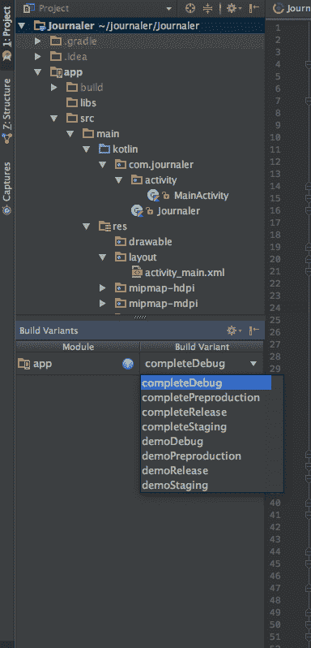

我们将使用这个构建变体作为我们的主要构建变体进行试运行，对于生产构建，我们将使用 completeDebug 构建变体。在我们从下拉列表中选择构建变体后，Gradle 需要一些时间来构建所选的变体。

我们现在将运行应用程序。我们将首先在模拟器上进行，然后在真实的设备上进行。通过打开 AVD 管理器启动模拟器实例。我们将通过点击 AVD 管理器图标来打开它。这是打开它最快的方法。双击 AVD 实例。模拟器准备就绪需要一些时间。模拟器执行安卓系统引导，然后它加载一个默认的应用程序启动器。

您的模拟器已经启动，可以运行应用程序了。要运行应用程序，请单击“运行”图标或导航至“运行”|“运行”应用程序。

There is a keyboard shortcut for this; on macOS, it is *Ctrl* + *R*.

当应用程序运行时，将出现“选择部署目标”对话框。如果您有多个可以运行应用程序的实例，您可以选择其中一个，如下图所示:

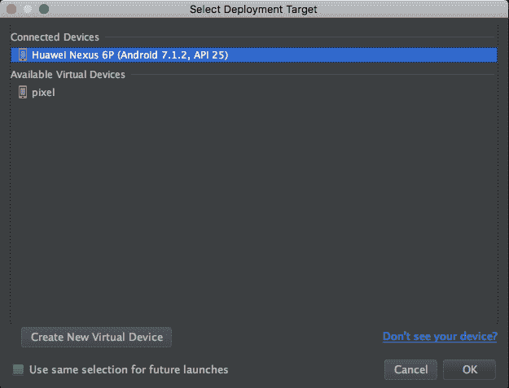

选择您的部署目标，然后单击确定。如果您想记住您的选择，请选中“将来启动时使用相同的选择”选项。应用程序运行需要一些时间，但几秒钟后，您的应用程序就会出现！

# 见见日志猫

Logcat 是日常开发的重要组成部分。其目的是显示来自您设备的所有日志。它显示来自模拟器或连接的实时设备的日志。安卓有几个级别的日志消息:

*   维护
*   冗长的
*   调试
*   信息
*   警告
*   错误

您可以通过这些日志级别(例如，当您只需要查看错误-应用程序崩溃 stacktrace)或日志标记(我们将在后面解释)来过滤日志消息；或者通过关键字、正则表达式或应用程序包。在我们应用任何过滤器之前，我们将配置AndroidStudio，以便日志消息有不同的颜色。

选择AndroidStudio|首选项。在搜索栏中，输入`Logcat`。出现 Logcat 着色首选项，如下图所示:

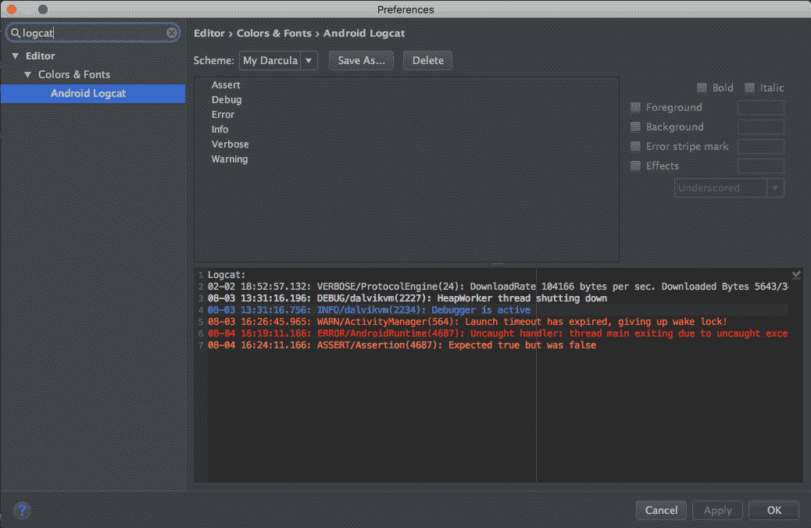

要编辑颜色，您必须保存当前颜色主题的副本。从下拉列表中选择您的主题，然后选择另存为。选择合适的名字并确认:

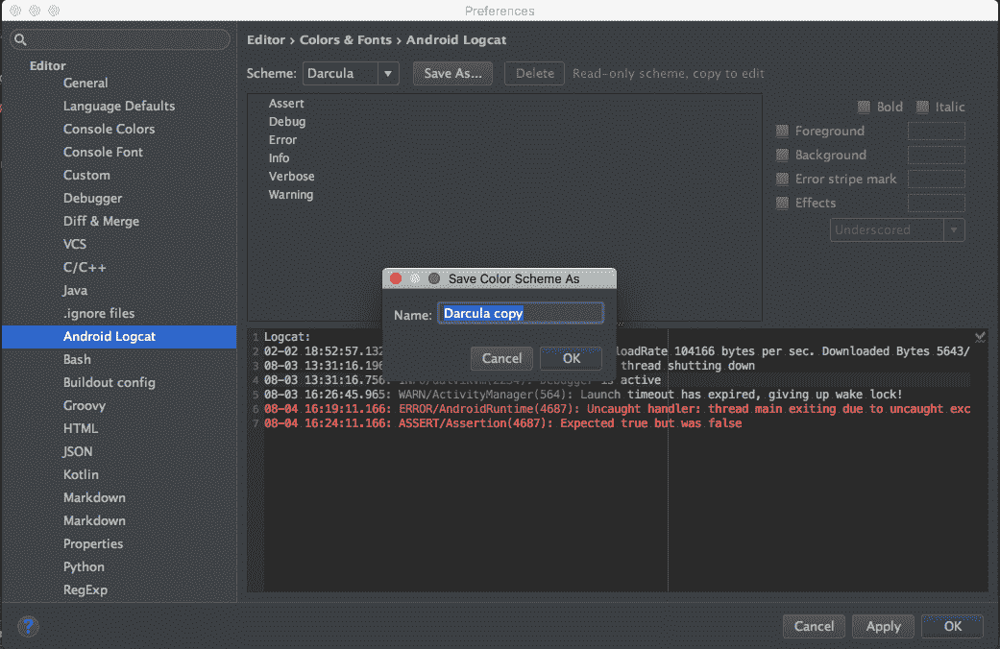

从列表中选择“断言”，并取消选中“使用继承的属性来覆盖颜色”。确保选中前景选项，并单击复选框右侧的颜色，为日志文本选择新颜色。我们将选择一些粉色调，如下图所示:

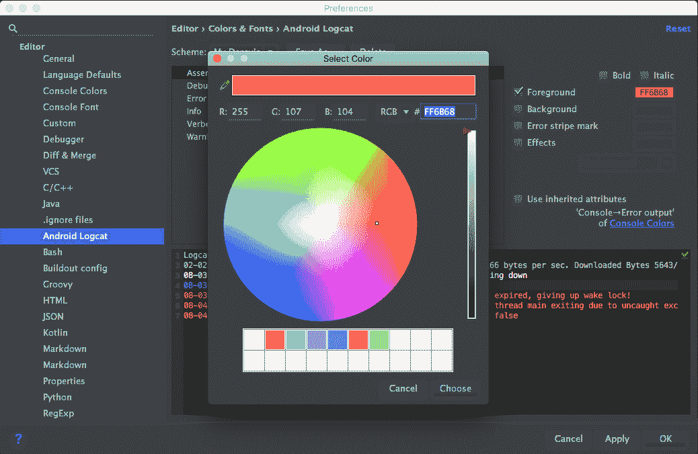

对于断言级别，您可以手动输入十六进制代码:`FF6B68`。为了获得最大的可读性，我们推荐以下颜色:

*   断言:`#FF6B68`
*   详细:`#BBBBBB`
*   调试:`#F4F4F4`
*   信息:`#6D82E3`
*   警告:`#E57E15`
*   错误:`#FF1A11`

要应用更改，请单击应用，然后单击确定。

打开安卓监视器(视图|工具窗口|安卓监视器)，看看日志面板中打印的消息。对于每个日志级别，它们都有不同的颜色，如下所示:

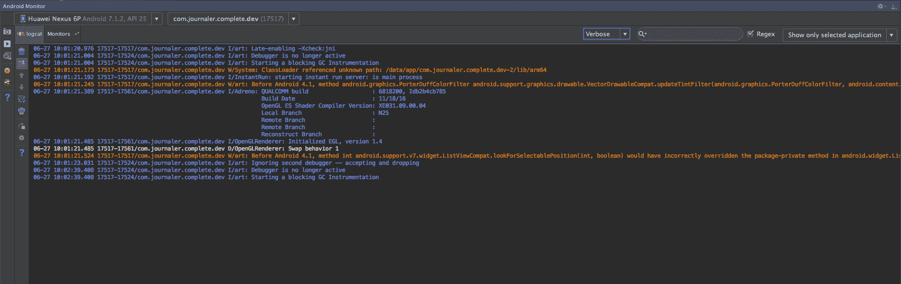

现在我们将定义自己的日志消息，这也是一个使用安卓生命周期的好机会。我们将为`Application`类和我们创建的屏幕(活动)的每个生命周期事件放置适当的日志消息。

打开你的主`Application`类，`Journaler.kt`。如下扩展代码:

```kt
    class Journaler : Application() { 

      companion object { 
        val tag = "Journaler" 
        var ctx: Context? = null 
      } 

      override fun onCreate() { 
        super.onCreate() 
        ctx = applicationContext 
        Log.v(tag, "[ ON CREATE ]") 
      } 

      override fun onLowMemory() { 
        super.onLowMemory() 
        Log.w(tag, "[ ON LOW MEMORY ]") 
      } 

      override fun onTrimMemory(level: Int) { 
        super.onTrimMemory(level) 
        Log.d(tag, "[ ON TRIM MEMORY ]: $level") 
     } 
    } 
```

在这里，我们介绍了一些重要的变化。我们覆盖了`onCreate()`应用程序的主生命周期事件。我们还覆盖了另外两个方法:`onLowMemory()`，在关键内存情况下触发(正在运行的进程应该调整它们的内存使用量)，以及`onTrimMemory()`，当内存被调整时。

为了在我们的应用程序中记录事件，我们使用带有静态方法的`Log`类，每个方法都暴露了适当的日志级别。基于此，我们公开了以下方法:

*   对于详细级别:

```kt
        v(String tag, String msg) 
        v(String tag, String msg, Throwable tr) 
```

*   对于调试级别:

```kt
        d(String tag, String msg) 
        d(String tag, String msg, Throwable tr) 
```

*   对于信息级别:

```kt
        i(String tag, String msg) 
        i(String tag, String msg, Throwable tr) 
```

*   对于警告级别:

```kt
        w(String tag, String msg) 
        w(String tag, String msg, Throwable tr) 
```

*   对于错误级别:

```kt
        e(String tag, String msg) 
        e(String tag, String msg, Throwable tr) 
```

方法接受以下参数:

*   `Tag`:用于标识日志消息的来源
*   `message`:这是我们要记录的消息
*   `throwable`:这表示日志异常

除了这些日志方法，您还可以使用其他一些方法:

*   `wtf(String tag, String msg)`
*   `wtf(String tag, Throwable tr)`
*   `wtf(String tag, String msg, Throwable tr)`

**Wtf** 代表**多么可怕的失败**！`Wtf`用来报告一个不该发生的异常！

我们将在`Log`班多玩一些。打开您迄今为止创建的唯一屏幕，并使用以下更改更新`MainActivity`类:

```kt
    class MainActivity : AppCompatActivity() { 
      private val tag = Journaler.tag 

      override fun onCreate( 
        savedInstanceState: Bundle?,  
        persistentState: PersistableBundle? 
       ) { 
          super.onCreate(savedInstanceState, persistentState) 
          setContentView(R.layout.activity_main) 
          Log.v(tag, "[ ON CREATE ]") 
         } 

       override fun onPostCreate(savedInstanceState: Bundle?) { 
         super.onPostCreate(savedInstanceState) 
         Log.v(tag, "[ ON POST CREATE ]") 
       } 

       override fun onRestart() { 
         super.onRestart() 
         Log.v(tag, "[ ON RESTART ]") 
       } 

       override fun onStart() { 
         super.onStart() 
         Log.v(tag, "[ ON START ]") 
       } 

       override fun onResume() { 
         super.onResume() 
         Log.v(tag, "[ ON RESUME ]") 
       } 

       override fun onPostResume() { 
         super.onPostResume() 
         Log.v(tag, "[ ON POST RESUME ]") 
       } 

       override fun onPause() { 
        super.onPause() 
        Log.v(tag, "[ ON PAUSE ]") 
      } 

      override fun onStop() { 
        super.onStop() 
        Log.v(tag, "[ ON STOP ]") 
      } 

      override fun onDestroy() { 
        super.onDestroy() 
        Log.v(tag, "[ ON DESTROY ]") 
      } 
    } 
```

我们按照活动生命周期中的执行顺序来覆盖所有重要的生命周期方法。对于每个事件，我们都会打印适当的日志消息。让我们解释生命周期的目的和每个重要事件。

在这里，你可以从安卓开发者网站上看到官方图表，解释活动生命周期:

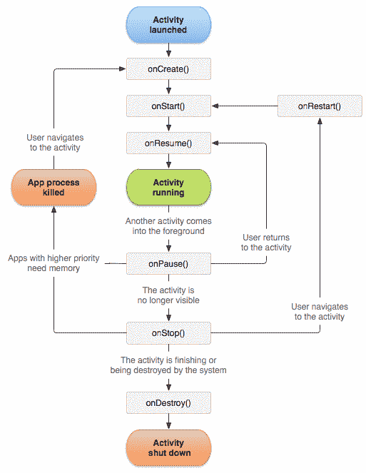

你可以在[https://developer.android.cimg/activity_lifecycle.png](https://developer.android.cimg/activity_lifecycle.png)找到图片:

*   `onCreate()`:这是在第一次创建活动时执行的。这是我们通常做主 UI 元素初始化的地方。
*   `onRestart()`:如果您的活动在某个时刻停止，然后重新开始，则会执行此操作。例如，您关闭手机屏幕(锁定)，然后再次解锁。
*   `onStart()`:当屏幕对应用用户可见时执行。
*   `onResume()`:当用户开始与活动交互时执行。
*   `onPause()`:在我们恢复之前的活动之前，这个方法在当前的活动上执行。这是一个很好的地方来保存你再次恢复时需要的所有信息。如果有任何未保存的更改，您应该在此保存。
*   `onStop()`:当一个活动对应用程序用户不再可见时执行。
*   `onDestroy()`:这是在一个活动被安卓破坏之前执行的。例如，如果有人执行了`Activity`类的`finish()`方法，就会发生这种情况。为了知道活动是否在特定时刻结束，安卓提供了一种检查方法:`isFinishing()`。如果一个活动正在结束，该方法将返回布尔`true`。

现在，当我们使用 Android 生命周期编写一些代码并放入适当的日志消息时，我们将执行两个用例，并查看 Logcat 打印出来的日志。

# 第一种情况

运行您的应用程序。那就回去吧。关闭应用程序。打开安卓监视器，从设备下拉列表中选择您的设备实例(模拟器或真实设备)。从下一个下拉列表中，选择日记本应用程序包。请注意以下 Logcat 输出:

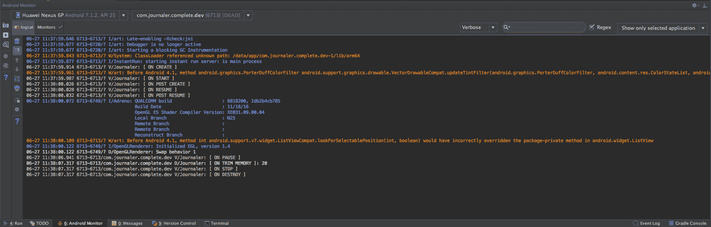

您会注意到我们在源代码中输入的日志消息。

让我们检查一下在与应用程序的交互过程中，我们输入了多少次`onCreate()`和`onDestroy()`方法。将光标放在搜索栏上，输入`on create`。观察内容的变化——当我们期望两个条目时，只有一个条目:一个用于主`Application`类，一个用于主活动。为什么会这样？我们稍后会发现:

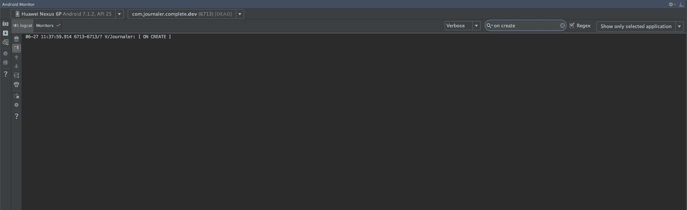

我们的输出包含什么？它包含以下内容:

`06-27`:这是事件发生的日期。

`11:37:59.914`:这是事件发生的时间。

`6713-6713/?`:这是包的进程和线程标识。如果应用程序只有一个线程，进程和线程标识符是相同的。

`V/Journaler`:这是日志级别和标签。

`[ ON CREATE ]`:这是日志消息。

将过滤器改为`on destroy`。内容更改如下:

`**06-27 11:38:07.317 6713-6713/com.journaler.complete.dev V/Journaler: [ ON DESTROY ]**`

在您的情况下，您将有不同的日期、时间和 pid/tid 值。

从下拉列表中，将过滤从详细更改为警告。保留过滤器的值！你会注意到你的日志现在是空的。它是空的，因为没有包含`on destroy`的消息文本的警告消息。删除过滤器文本并返回详细级别。

运行您的应用程序。锁定屏幕并连续解锁几次。然后，关闭并终止日记本应用程序。请注意以下 Logcat 输出:

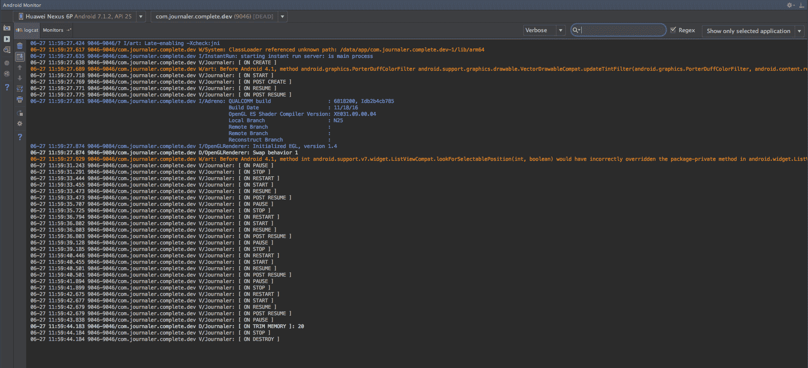

如您所见，它明显进入了暂停和恢复的生命周期状态。最后，我们杀死我们的应用程序，一个`onDestroy()`事件被触发。可以在 Logcat 中看到。

如果对你来说更容易，你可以从终端使用 Logcat。打开终端并执行以下命令行:

```kt
adb logcat
```

# 使用渐变构建工具

在我们的开发过程中，我们将需要构建不同的构建变体或运行测试。如果需要，这些测试可以只对某些构建变体执行，或者对所有构建变体执行。

在下面的示例中，我们将介绍一些最常见的 Gradle 用例。我们将从清洁和建筑开始。

正如您所记得的，日志应用程序定义了以下构建类型:

*   调试
*   释放；排放；发布
*   脚手架
*   试制

在 Journaler 应用程序中还定义了以下构建风格:

*   演示
*   完成
*   特别的

开放式终端。要删除我们到目前为止构建的所有内容以及所有临时构建的派生内容，请执行以下命令行:

```kt
./gradlew clean
```

打扫卫生需要一些时间。然后执行以下命令行:

```kt
./gradlew assemble.
```

这集合了一切——我们在应用程序中拥有的所有构建变体。想象一下，如果我们正在处理一个非常大的项目，它可能会产生的时间影响。因此，我们将`isolate`构建命令。要仅生成调试生成类型，请执行以下命令行:

```kt
./gradlew assembleDebug 
```

它将比前面的例子执行得快得多！这将构建调试构建类型的所有风格。为了更有效，我们将告诉 Gradle，我们只对调试构建类型的完整构建风格感兴趣。执行此操作:

```kt
./gradlew assembleCompleteDebug
```

这执行得更快。在这里，我们将提到几个更重要的有用的 Gradle 命令:

要运行所有单元测试，请执行:

```kt
./gradlew test 
```

如果您想要为特定的构建变体运行单元测试，请执行以下命令:

```kt
./gradlew testCompleteDebug
```

在安卓系统中，我们可以在真实的设备实例或模拟器上运行测试。通常，这些测试可以访问安卓的一些组件。要执行这些(检测)测试，可以使用以下示例中显示的命令:

```kt
./gradlew connectedCompleteDebug
```

在这本书的最后几章，你会发现更多关于测试和测试安卓应用的内容。

# 调试应用程序

现在，我们知道如何记录重要的应用程序消息。在开发过程中，当分析应用程序行为或调查 bug 时，我们将面临仅记录消息是不够的情况。

对我们来说，能够在真实的安卓设备或模拟器上调试应用程序代码是非常重要的。所以，让我们调试一些东西！
打开主`Application`类，将断点放在我们记录`onCreate()`方法的线上，如下图所示:

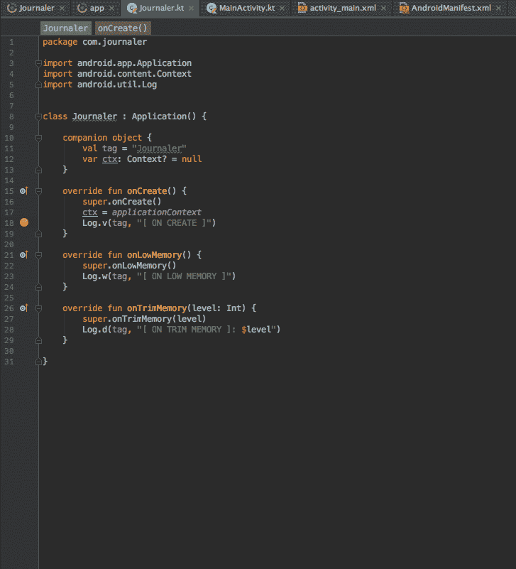

如您所见，我们将断点设置在第 **18** 行。我们将添加更多断点。让我们将其添加到我们的主要(也是唯一)活动中。将每个生命周期事件的断点放在我们执行日志记录的行上。

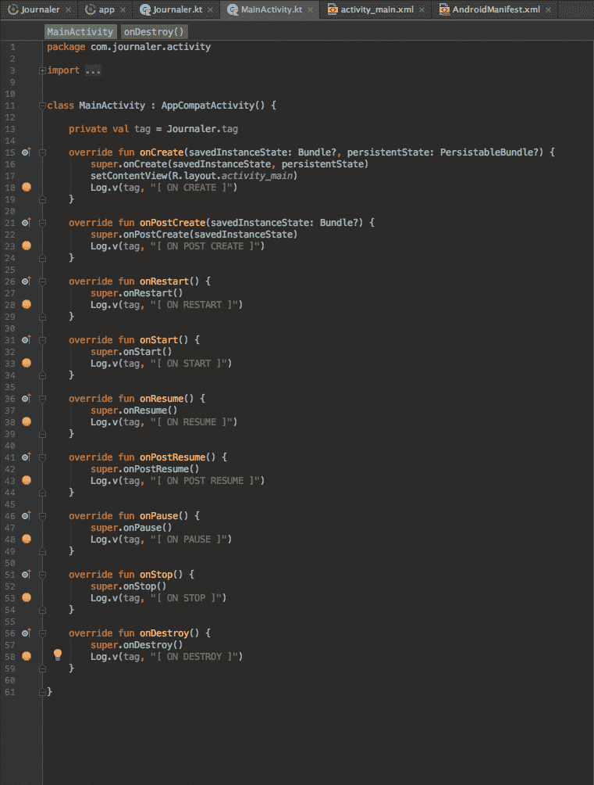

我们在第 18、23、28、33、38 行设置断点，以此类推。通过单击调试图标或选择运行|调试应用程序，在调试模式下运行应用程序。应用程序在调试模式下启动。稍微等一下，调试器很快就会进入我们设置的第一个断点。

下面的截图说明了这一点:

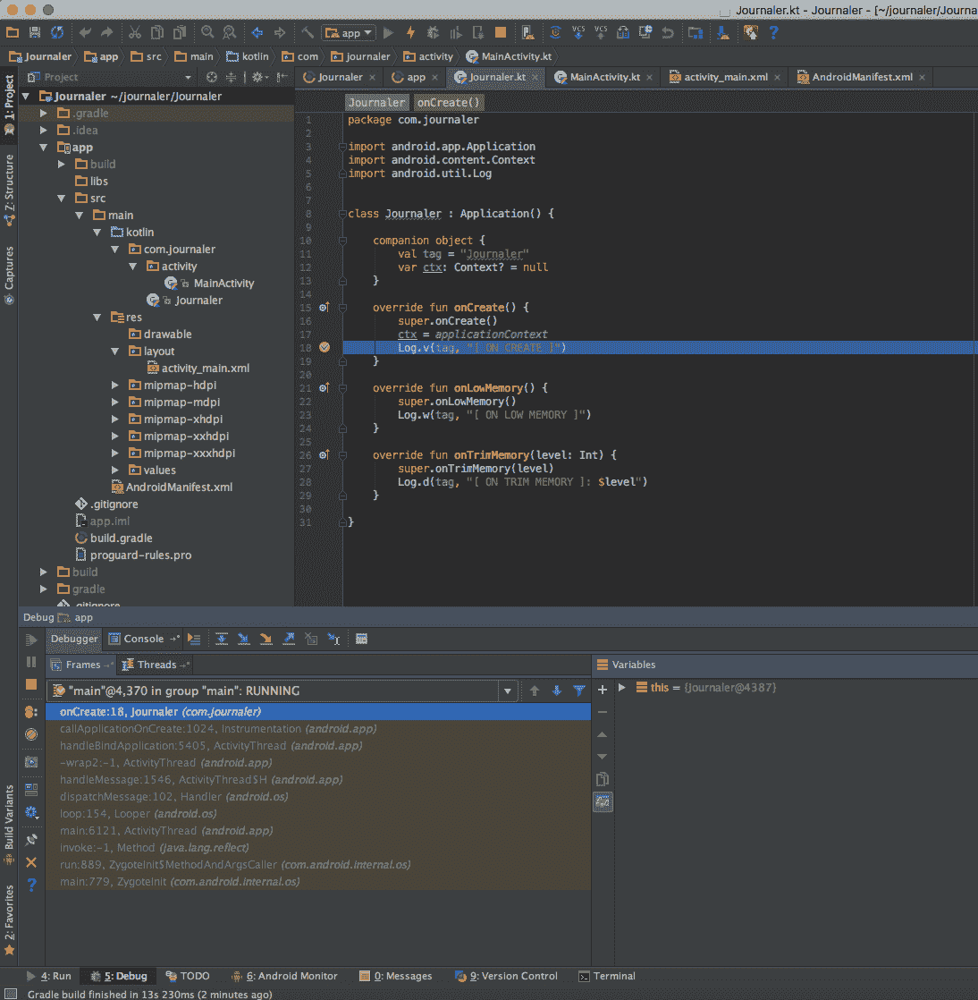

可以看到，`Application`类的`onCreate()`方法是我们进入的第一个方法。让我们检查一下我们的应用程序是否如预期的那样进入生命周期方法。单击调试器窗格中的恢复程序图标。您可能会注意到，我们的主要活动没有进入`onCreate()`方法！我们进入`onStart()`后主要`Application`类`onCreate()`法。恭喜你！你刚刚发现了你的第一个安卓 bug！为什么会这样？我们使用了错误的`onCreate()`方法版本，而不是使用下面一行代码:

```kt
    void onCreate(@Nullable Bundle savedInstanceState) 
```

我们无意中忽略了这一点:

```kt
     onCreate(Bundle savedInstanceState, PersistableBundle 
     persistentState) 
```

感谢调试，我们发现了这一点！通过单击调试器窗格中的停止图标来停止调试器，并修复代码。将代码行更改为:

```kt
    override fun onCreate(savedInstanceState: Bundle?) { 
      super.onCreate(savedInstanceState) 
      setContentView(R.layout.activity_main) 
      Log.v(tag, "[ ON CREATE 1 ]") 
    } 

    override fun onCreate(savedInstanceState: Bundle?, 
    persistentState: PersistableBundle?) { 
      super.onCreate(savedInstanceState, persistentState) 
      Log.v(tag, "[ ON CREATE 2 ]") 
    } 
```

我们更新了日志消息，这样我们就可以跟踪进入两个`onCreate()`方法版本。保存您的更改，并在调试模式下再次启动应用程序。不要忘记将断点设置为两个`onCreate()`方法覆盖！逐个通过断点。现在，我们按照预期的顺序输入了所有断点。

要查看所有断点，请单击查看断点图标。将出现“断点”窗口，如下所示:

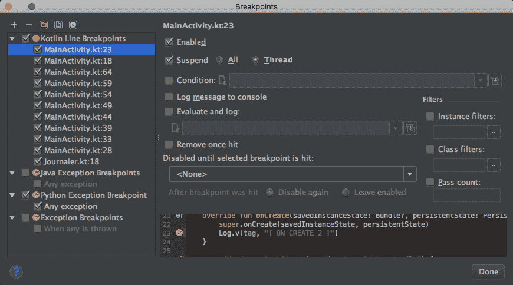

双击断点，您将被定位在设置断点的行。停止调试器。

想象一下，你可以在接下来的两年里继续开发你的应用程序。您的应用程序变得非常大，并且它还执行一些昂贵的操作。在调试模式下直接运行它可能非常困难和耗时。我们将失去大量的时间，直到它进入我们感兴趣的转折点。对此我们能做些什么？在调试模式下运行的应用程序比较慢，我们有一个又慢又大的应用程序。如何跳过失去宝贵时间的部分？我们会示范。通过单击运行图标或选择运行|运行应用程序来运行您的应用程序。应用程序在我们的部署目标(真实设备或模拟器)上执行和启动。通过单击将调试器连接到安卓进程图标或选择运行|将调试器连接到安卓，将调试器连接到您的应用程序。选择出现的“流程”窗口:

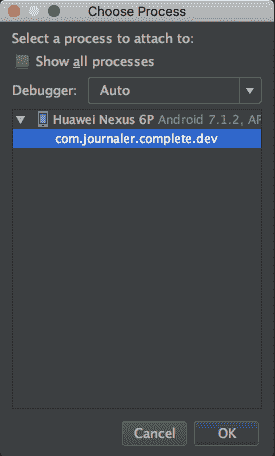

双击我们的应用程序包名称，选择我们的应用程序。将出现“调试器”窗格。从你的申请，试着回去。**调试器**进入你主要活动的`onPause()`方法。停止调试器。

# 摘要

在本章中，您学习了如何从 Android Studio IDE 或直接从终端构建和运行应用程序。我们还分析了从模拟器和真实设备获得的一些日志。最后，我们做了一些调试。

更准确地说，在下一章中，我们将熟悉用户界面屏幕的一些组件。我们将向您展示如何创建新的屏幕，以及如何为它们添加一些时尚的细节。我们还将讨论按钮和图像的复杂布局。