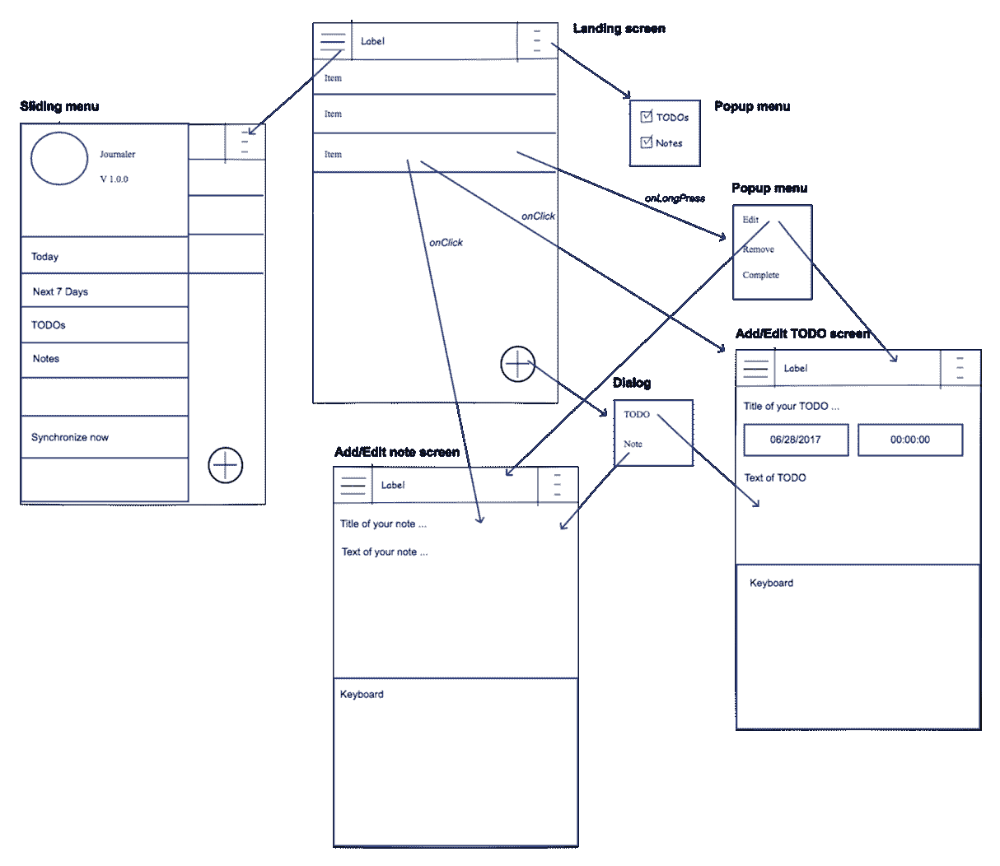
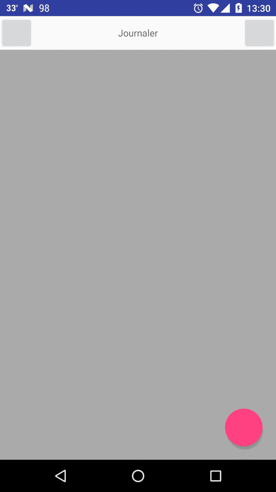
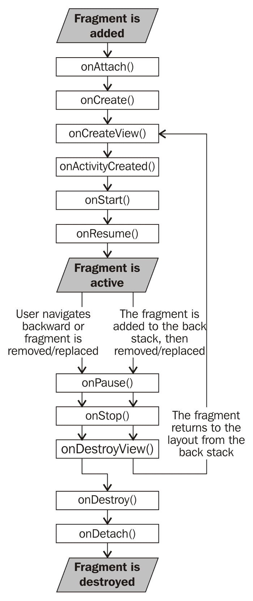

# 屏幕

一个用户界面简单的屏幕一点也不令人兴奋。然而，在你进入眼糖造型和 *wow* 效果之前，你需要创建更多包含专业开发的应用必须具备的所有元素的屏幕。你可以在日常生活中使用的现代应用中看到这一切。在前一章中，我们构建并运行了我们的项目。这项技能很重要，所以我们可以继续进步。现在，您将在应用中添加一个用户界面！

在本章中，我们将涵盖以下主题:

*   分析模型
*   定义应用活动
*   Android 布局
*   安卓上下文
*   片段、片段管理器和堆栈
*   查看寻呼机
*   事务、对话片段和通知
*   其他重要的用户界面组件

# 分析模型计划

事情越来越复杂了！我们准备开始一些严肃的发展！我们将为我们的应用创建所有屏幕。然而，在我们创建它们之前，我们将创建和分析一个模型，这样我们就知道我们将创建什么。模型将代表没有设计的基本应用线框。这将只是屏幕的布局和它们之间的关系。要创建一个好的线框模型，你需要一个工具。任何能画线的工具都可以做这项工作。为了绘制我们的模型，我们使用了**铅笔**。Pencil 是一个免费的开源应用，提供图形用户界面原型。

让我们看看我们的模型:



如您所见，模型呈现了一个相对简单的应用，只有几个屏幕。这些屏幕将包含不同的组件，我们将在每个屏幕中解释这些组件。让我们看一下模型。

第一个屏幕名为登录屏幕，将是我们的主要应用屏幕。每次我们进入应用，都会出现这个屏幕。我们已经定义了`MainActivity`类。这个活动将代表屏幕。很快，我们将扩展代码，使活动完全按照所描述的模型进行。

屏幕的中心部分将是包含我们创建的所有项目的列表。每个项目将包含基本属性，如标题或日期和时间。我们将能够按类型过滤项目。我们将只能过滤笔记或待办事项。笔记和待办事项的区别在于，待办事项将代表分配有*日期*和*时间*的任务。我们还将支持一些功能，如在线新闻事件。每个项目上的 onLongPress 事件将显示一个带有“编辑”、“删除”或“完成”选项的弹出菜单。点击编辑将打开更新屏幕。

在右下角，我们会有一个+按钮。该按钮的目的是打开选项对话框，用户可以在该对话框中选择是否要创建笔记或待办事项任务。根据选项，用户可以选择出现的屏幕之一-添加注释屏幕或添加待办事项屏幕。

着陆屏幕还包含位于左上角的滑动菜单按钮。单击该按钮将打开滑动菜单，其中包含以下项目:

*   带有应用标题和版本的应用图标
*   “今天”按钮，仅过滤为当前日期分配的待办事项
*   “未来 7 天”按钮，用于过滤在未来 7 天分配的待办事项，包括当前的待办事项
*   待办事项按钮只过滤待办事项
*   “注释”按钮将仅过滤注释项目

应用这些过滤器中的一些将影响我们通过点击登录屏幕右上角获得的弹出菜单中的复选框。此外，选中和取消选中这些将修改当前应用的过滤器。

滑动菜单中的最后一项是“立即同步”。此按钮将触发同步，并与后端同步所有未同步的项目(如果有)。

现在我们将解释两个负责创建(或编辑)Notes 和 TODOs 的屏幕:

*   添加/编辑注释屏幕:用于创建新注释或更新现有注释的内容。当编辑文本字段被聚焦时，键盘将被打开。没有保存或更新按钮，因为我们计划立即应用我们所做的所有更改。当我们在这个屏幕上时，左上角和右上角的按钮被禁用。
*   添加/编辑待办事项屏幕:用于创建新的待办事项应用或更新现有应用的内容。键盘会像前面的例子一样打开。也没有上一个例子中显示的保存或更新按钮。左上角和右上角的按钮也被禁用。下面是标题视图，我们有选择日期和时间的按钮。默认情况下，它们将被设置为当前日期和时间。打开键盘会向上按这些按钮。

我们介绍了基本的用户界面，以及通过分析这个模型我们想要实现的目标。是时候创造一些新的屏幕了。

# 定义应用活动

总而言之，我们将有三项活动:

*   着陆活动(`MainActivty.kt`)
*   添加/编辑注释屏幕
*   添加/编辑待办事项屏幕

安卓开发中的常见做法是创建一个活动，它将是所有其他活动的父类，因为像这样，我们将减少代码库，并与多个活动同时共享它。大多数情况下，安卓开发者称之为`BaseActivity`。我们将定义我们版本的`BaseActivity`。创建一个名为`BaseActivity`的新班级；创建`BaseActivity.kt`文件。确保新创建的类位于项目的`Activity`包下。

`BaseActivity`类必须扩展安卓 SDK 的`FragmentActivity`类。我们将扩展`FragmentActivity`，因为我们计划在`MainActivity`类中使用碎片。片段将与可视寻呼机一起使用，在不同的过滤器之间导航(今天、未来 7 天，等等)。我们计划当用户点击滑动菜单中的其中一个时，ViewPager 会自动切换到包含按所选标准过滤的数据的片段的位置。我们将从包装中扩展`FragmentActivity`如下- `android.support.v4.app.FragmentActivity`。

Android 提供了一种支持多个 API 版本的方式。既然我们计划这样做，我们将使用支持库中的`FragmentActivity`版本。像这样，我们最大化了我们的兼容性！要添加对安卓支持库的支持，请在`build`中包含以下指令。`gradle`配置:

```kt
    compile 'com.android.support:appcompat-v7:26+' 
```

你可能还记得，我们做到了！

让我们继续！由于我们正在为所有活动引入一个基类，我们必须对我们现在仅有的活动进行一些小的重构。我们将把`tag`场地从`MainActivity`移到`BaseActivity`。由于`BaseActivity`的孩子必须可以访问，我们将把它的可见性更新为`protected`。

我们希望每个`Activity`类都有其唯一的标签。我们将使用活动具体化来选择其标签的值。因此，`tag`字段变为`abstract`，没有指定默认值:

```kt
    protected abstract val tag : String 
```

除此之外，我们在所有活动中都有一些更常见的东西。每个活动都有一个布局。布局是安卓通过整数类型的标识来识别的。在`BaseActivity`类中，我们将创建一个`abstract`方法，如下所示:

```kt
    protected abstract fun getLayout(): Int 
```

为了优化代码，我们将`onCreate`从`MainActivity`移动到`BaseActivity`。我们将传递`getLayout()`方法的结果值，而不是直接从 Android 生成的资源传递布局的 ID。我们也将移动所有其他生命周期方法覆盖。

根据这些更改更新您的类，并按如下方式构建和运行应用:

```kt
    BasicActivity.kt:
    package com.journaler.activity 
    import android.os.Bundle 
    import android.support.v4.app.FragmentActivity 
    import android.util.Log 

    abstract class BaseActivity : FragmentActivity() { 
      protected abstract val tag : String 
      protected abstract fun getLayout(): Int 

      override fun onCreate(savedInstanceState: Bundle?) { 
        super.onCreate(savedInstanceState) 
        setContentView(getLayout()) 
        Log.v(tag, "[ ON CREATE ]") 
      } 

      override fun onPostCreate(savedInstanceState: Bundle?) { 
        super.onPostCreate(savedInstanceState) 
        Log.v(tag, "[ ON POST CREATE ]") 
      } 

      override fun onRestart() { 
        super.onRestart() 
        Log.v(tag, "[ ON RESTART ]") 
      } 

      override fun onStart() { 
        super.onStart() 
        Log.v(tag, "[ ON START ]") 
      } 

      override fun onResume() { 
        super.onResume() 
        Log.v(tag, "[ ON RESUME ]") 
      } 

      override fun onPostResume() { 
        super.onPostResume() 
        Log.v(tag, "[ ON POST RESUME ]") 
      } 

      override fun onPause() { 
        super.onPause() 
        Log.v(tag, "[ ON PAUSE ]") 
      } 

      override fun onStop() { 
        super.onStop() 
        Log.v(tag, "[ ON STOP ]") 
      } 

      override fun onDestroy() { 
        super.onDestroy() 
        Log.v(tag, "[ ON DESTROY ]") 
      } 

    } 
    MainActivity.kt:
    package com.journaler.activity 
    import com.journaler.R 

    class MainActivity : BaseActivity() { 
      override val tag = "Main activity" 
      override fun getLayout() = R.layout.activity_main 
    }
```

现在，我们准备好定义其余的屏幕。我们必须为添加和编辑笔记创建一个屏幕，并为 TODOs 创建一个同样的屏幕。这些屏幕之间有很多共同点。目前唯一的区别是 TODOs 屏幕有日期和时间按钮。我们将为这些屏幕共享的所有内容创建一个公共类。每一个具体化都会延伸它。创建一个名为`ItemActivity`的类。确保它位于`Activity`包装中。再创建两个职业- `NoteActivity`和`TodoActivity`。`ItemActivity`扩展我们的`BaseActivity`课，`NoteActivity``TodoActivity`活动课扩展`ItemActivity`课。您将被要求覆盖成员。请这样做。为我们将在日志记录中使用的标记提供一些有意义的值。要分配一个合适的布局标识，首先我们必须创建它！

找到我们为主屏幕创建的布局。现在，使用相同的原理，再创建两个布局:

*   `activity_note.xml`，如果问就让它成为`LinearLayout`类吧
*   `activity_todo.xml`，如果问就让它成为`LinearLayout`类吧

安卓中的任何布局或布局成员都会在安卓在构建期间生成的`R`类中获得一个唯一的标识作为`integer`表示。我们申请的`R`类如下:

```kt
    com.journaler.R 
```

要访问布局，请使用以下代码行:

```kt
    R.layout.layout_you_are_interested_in 
```

我们使用静态访问。因此，让我们更新我们的类具体化来访问布局标识。现在的类是这样的:

```kt
    ItemActivity.kt:
    abstract class ItemActivity : BaseActivity()
    For now, this class is short and simple.
    NoteActivity.kt:
    package com.journaler.activity
    import com.journaler.R
    class NoteActivity : ItemActivity(){
      override val tag = "Note activity"
      override fun getLayout() = R.layout.activity_note 
    }
    Pay attention on import for R class!
    TodoActivity.kt: 
    package com.journaler.activity 
    import com.journaler.Rclass TodoActivity : ItemActivity(){
      override val tag = "Todo activity" 
      override fun getLayout() = R.layout.activity_todo
    }
```

最后一步是在`view groups`注册我们的屏幕(活动)。打开`manifest`文件，添加以下内容:

```kt
    <activity 
      android:name=".activity.NoteActivity" 
      android:configChanges="orientation" 
      android:screenOrientation="portrait" /> 

      <activity 
        android:name=".activity.TodoActivity" 
        android:configChanges="orientation" 
        android:screenOrientation="portrait" /> 
```

两个活动都锁定在`portrait`方向。

我们进步了！我们定义了我们的应用屏幕。在下一节中，我们将用用户界面组件填充屏幕。

# Android 布局

我们将继续我们的工作，为每个屏幕定义布局。安卓中的布局是用 XML 定义的。我们将提到最常用的布局类型，并用常用的布局组件填充它们。

每个布局文件都有一种布局类型作为其顶级容器。布局可以包含其他带有用户界面组件的布局等等。我们可以把它筑巢。让我们来谈谈最常用的布局类型:

*   **线性布局**:这以线性顺序排列 UI 组件，垂直或水平
*   **相对布局**:这些 UI 组件相对对齐
*   **列表视图布局**:所有项目以列表的形式组织
*   **网格视图布局**:所有项目以网格的形式组织
*   **滚动视图布局**:用于当其内容高于屏幕实际高度时启用滚动

我们刚才提到的布局元素是`view groups`。每个视图组包含其他视图。`View groups`延长`ViewGroup`班。在顶端，一切都是`View`级。扩展`View`类但不扩展`ViewGroup`的类(视图)不能包含其他元素(子元素)。这样的例子有`Button`、`ImageButton`、`ImageView`以及类似的类。因此，例如，可以定义一个包含一个`LinearLayout`的`RelativeLayout`，它包含其他垂直或水平对齐的多个视图等等。

我们现在将重点介绍一些常用的视图:

*   `Button`:这是一个`Base`类，代表一个链接到我们定义的`onClick`动作的按钮
*   `ImageButton`:这是一个按钮，有一个图像作为它的视觉表示
*   `ImageView`:这是一个显示从不同来源加载的图像的视图
*   `TextView`:这是一个包含单个或多个不可编辑文本的视图
*   `EditText`:这是一个包含单个或多个可编辑文本的视图
*   `WebView`:这是一个呈现从不同来源加载的渲染 HTML 页面的视图
*   `CheckBox`:这是一个主要的双态选择视图

每个`View`和`ViewGroup`都支持杂项 XML 属性。某些属性仅特定于某些视图类型。还有一些属性对所有视图都是相同的。我们将在本章后面的屏幕示例中突出显示最常用的视图属性。

要分配一个唯一的标识符，通过它您可以通过代码或其他布局成员访问视图，您必须定义一个标识。要为视图分配一个标识，请使用如下所示的语法:

```kt
    android:id="@+id/my_button" 
```

在本例中，我们为视图分配了`my_button`标识。要从代码中访问它，我们将使用以下内容:

```kt
    R.id.my_button 
```

`R`是一个生成的类，为我们提供对资源的访问。为了创建按钮的实例，我们将使用安卓`Activity`类中定义的`findViewById()`方法:

```kt
    val x = findViewById(R.id.my_button) as Button 
```

由于我们使用了 Kotlin，我们可以直接访问它，如本例所示:

```kt
    my_button.setOnClickListener { ... } 
```

The IDE will ask you about a proper import. Keep in mind that other layout resource files can have an ID with the same name defined. In that case, it can happen that you have a wrong import! If that happens, your application will crash.

字符串开头的`@`符号表示 XML 解析器应该解析并展开 ID 字符串的其余部分，并将其标识为 ID 资源。`+`符号表示这是一个新的资源名称。引用安卓资源标识时，不需要`+`符号，如本例所示:

```kt
    <ImageView 
      android:id="@+id/flowers" 
      android:layout_width="fill_parent" 
      android:layout_height="fill_parent" 
      android:layout_above="@id/my_button" 
    /> 
```

让我们为主应用屏幕构建我们的用户界面！我们将从一些先决条件开始。在值资源目录中，创建`dimens.xml`来定义我们将使用的一些维度:

```kt
    <?xml version="1.0" encoding="utf-8"?> 
    <resources> 
      <dimen name="button_margin">20dp</dimen> 
      <dimen name="header_height">50dp</dimen> 
    </resources> 
```

安卓以下列单位定义尺寸:

*   **px(像素)**:这对应于屏幕上的实际像素
*   **in(英寸)**:这是基于屏幕的物理尺寸，即 1 英寸= 2.54 厘米
*   **毫米(毫米)**:这是基于屏幕的物理尺寸
*   **pt(点)**:这是基于屏幕物理尺寸的 1/72 英寸

对我们来说最重要的是:

*   **dp(与密度无关的像素)**:这表示基于屏幕物理密度的抽象单位。它们相对于 160 DPI 的屏幕。一个 dp 是 160 DPI 屏幕上的一个像素。dp 与像素的比率会随着屏幕密度而变化，但不一定成正比。
*   **sp(与比例无关的像素)**:这些类似于 dp 单位，一般用于字体大小。

我们必须定义一个标题布局，将包括在所有屏幕上。创建`activity_header.xml`文件，定义如下:

```kt
    <?xml version="1.0" encoding="utf-8"?> 
    <RelativeLayout   xmlns:android=
    "http://schemas.android.com/apk/res/android" 
    android:layout_width="match_parent" 
    android:layout_height="@dimen/header_height"> 
    <Button 
      android:id="@+id/sliding_menu" 
      android:layout_width="@dimen/header_height" 
      android:layout_height="match_parent" 
      android:layout_alignParentStart="true" /> 

    <TextView 
      android:layout_centerInParent="true" 
      android:id="@+id/activity_title" 
      android:layout_width="wrap_content" 
      android:layout_height="wrap_content" /> 

    <Button 
      android:id="@+id/filter_menu" 
      android:layout_width="@dimen/header_height" 
      android:layout_height="match_parent" 
      android:layout_alignParentEnd="true" /> 

    </RelativeLayout> 
```

让我们解释一下它最重要的部分。首先，我们已经将`RelativeLayout`定义为我们的主容器。由于所有元素都相对于父元素和彼此定位，我们将使用一些特殊属性来表达这些关系。

对于每个视图，我们必须有宽度和高度属性。它的值可以如下所示:

*   维度资源文件中定义的维度，例如:

```kt
        android:layout_height="@dimen/header_height" 
```

*   直接定义的尺寸值，例如:

```kt
        android:layout_height="50dp" 
```

*   匹配父代的大小(`match_parent`)
*   或者包装视图的内容(`wrap_content`)

然后，我们将使用子视图填充布局。我们有三种儿童视角。我们将定义两个按钮和一个文本视图。文本视图与布局的中心对齐。按钮与布局的边缘对齐，一个在左边，另一个在右边。为了实现文本视图的中心对齐，我们使用了`layout_centerInParent`属性。传递给它的值是布尔值 true。为了在布局的左边缘对齐按钮，我们使用了`layout_alignParentStart`属性。对于右边缘，我们使用了`layout_alignParentEnd`属性。每个孩子都被分配了一个合适的身份。我们将在`MainActivity`中包括这一点:

```kt
    <?xml version="1.0" encoding="utf-8"?> 
    <LinearLayout xmlns:android=
    "http://schemas.android.com/apk/res/android" 
    android:layout_width="match_parent" 
    android:layout_height="match_parent" 
    android:orientation="vertical"> 

    <include layout="@layout/activity_header" /> 

    <RelativeLayout 
        android:layout_width="match_parent" 
        android:layout_height="match_parent"> 
     <ListView 
        android:id="@+id/items" 
        android:layout_width="match_parent" 
        android:layout_height="match_parent" 
        android:background="@android:color/darker_gray" /> 

     <android.support.design.widget.FloatingActionButton 
        android:id="@+id/new_item" 
        android:layout_width="wrap_content" 
        android:layout_height="wrap_content" 
        android:layout_alignParentBottom="true" 
        android:layout_alignParentEnd="true" 
        android:layout_margin="@dimen/button_margin" /> 

    </RelativeLayout> 
    </LinearLayout> 
```

`Main activity`的主容器是`LinearLayout`。`LinearLayout`的方向属性是强制性的:

```kt
    android:orientation="vertical" 
```

可以分配给它的值是垂直和水平的。作为`Main activity`的第一个孩子，我们加入了`activity_header`布局。然后我们定义了`RelativeLayout`，它填充了屏幕的其余部分。

`RelativeLayout`有两个成员，`ListView`会呈现我们所有的物品。我们给它指定了一个背景。我们没有在 colors 资源文件中定义我们自己的颜色，而是在 Android 中预定义的颜色。我们这里的最后一个视图是`FloatingActionButton`，和你在 Gmail 安卓应用中看到的是同一个视图。该按钮将位于列表上方，屏幕底部的项目向右对齐。我们还设置了一个从四面包围按钮的边距。看看我们使用的属性。

在我们再次运行我们的应用之前，我们将做一些更多的更改。打开`BaseActivity`并更新其代码如下:

```kt
    ... 
    protected abstract fun getActivityTitle(): Int 

    override fun onCreate(savedInstanceState: Bundle?) { 
        super.onCreate(savedInstanceState) 
        setContentView(getLayout()) 
        activity_title.setText(getActivityTitle()) 
        Log.v(tag, "[ ON CREATE ]") 
    } 
    ... 
```

我们引入了`abstract`方法，它将为每个活动提供一个合适的标题。我们将`access`包含在我们的活动中的`activity_header.xml`中定义的`activity_title`视图，并分配我们通过执行该方法获得的值。

打开`MainActivity`并覆盖以下方法:

```kt
    override fun getActivityTitle() = R.string.app_name
```

在`ItemActivity`上加上同样的一行。最后，运行应用。您的主屏幕应该如下所示:



让我们定义其余屏幕的布局。对于注释、添加/编辑注释屏幕，我们将定义以下布局:

```kt
    <?xml version="1.0" encoding="utf-8"?> 
    <ScrollView xmlns:android=
     "http://schemas.android.com/apk/res/android" 
    android:layout_width="match_parent" 
    android:layout_height="match_parent" 
    android:fillViewport="true" > 

    <LinearLayout 
      android:layout_width="match_parent" 
      android:layout_height="wrap_content" 
      android:orientation="vertical"> 

      <include layout="@layout/activity_header" /> 

      <EditText 
        android:id="@+id/note_title" 
        android:layout_width="match_parent" 
        android:layout_height="wrap_content" 
        android:hint="@string/title" 
        android:padding="@dimen/form_padding" /> 

      <EditText 
        android:id="@+id/note_content" 
        android:layout_width="match_parent" 
        android:layout_height="match_parent" 
        android:gravity="top" 
        android:hint="@string/your_note_content_goes_here" 
        android:padding="@dimen/form_padding" /> 

    </LinearLayout> 
    </ScrollView> 
```

有几件重要的事情我们必须强调。我们将逐一解释。我们引入`ScrollView`作为布局的顶部容器。因为我们将填充多行注释，所以它的内容会低于屏幕的物理限制。如果发生这种情况，我们将能够滚动内容。我们使用了一个非常重要的属性- `fillViewport`。该属性告诉容器延伸到整个屏幕。所有的孩子都使用那个空间。

# 使用编辑文本视图

我们引入了`EditText`视图来输入可编辑的文本内容。您可以在这里看到一些新的属性:

*   **提示**:定义将呈现给用户的默认字符串值
*   **填充**:这是视图本身与其内容之间的空间
*   **重力**:这定义了内容的方向；在我们的例子中，所有的文本都将贴在父视图的顶部

Note that, for all strings and dimensions, we defined proper entries in the `strings.xml` file and the `dimens.xml` file.

字符串资源文件现在如下所示:

```kt
    <resources> 
      <string name="app_name">Journaler</string> 
      <string name="title">Title</string> 
      <string name="your_note_content_goes_here">Your note content goes 
      here.</string> 
    </resources> 
    Todos screen will be very similar to this: 
    <?xml version="1.0" encoding="utf-8"?> 
    <ScrollView xmlns:android=
    "http://schemas.android.com/apk/res/android" 
    android:layout_width="match_parent" 
    android:layout_height="match_parent" 
    android:fillViewport="true"> 

    <LinearLayout 
      android:layout_width="match_parent" 
      android:layout_height="wrap_content" 
      android:orientation="vertical"> 

    <include layout="@layout/activity_header" /> 

    <EditText 
      android:id="@+id/todo_title" 
      android:layout_width="match_parent" 
      android:layout_height="wrap_content" 
      android:hint="@string/title" 
      android:padding="@dimen/form_padding" /> 

    <LinearLayout 
      android:layout_width="match_parent" 
      android:layout_height="wrap_content" 
      android:orientation="horizontal" 
      android:weightSum="1"> 

   <Button 
      android:id="@+id/pick_date" 
      android:text="@string/pick_a_date" 
      android:layout_width="0dp" 
      android:layout_height="wrap_content" 
      android:layout_weight="0.5" /> 

   <Button 
      android:id="@+id/pick_time" 
      android:text="@string/pick_time" 
      android:layout_width="0dp" 
      android:layout_height="wrap_content" 
      android:layout_weight="0.5" /> 

   </LinearLayout> 

   <EditText 
      android:id="@+id/todo_content" 
      android:layout_width="match_parent" 
      android:layout_height="match_parent" 
      android:gravity="top" 
      android:hint="@string/your_note_content_goes_here" 
      android:padding="@dimen/form_padding" />  
   </LinearLayout> 
   </ScrollView> 
```

同样，顶部容器是`ScrollView`。与之前的屏幕相比，我们引入了一些不同之处。我们添加了容器来保存日期和时间选择的按钮。方向是水平的。我们设置父容器属性`weightSum`，定义可以被子视图划分的权重值，这样每个子视图就占据了由其自身权重定义的空间量。所以，`weightSum`是一个。第一个按钮有一个`0.5`的`layout_weight`。它将消耗 50%的水平空间。第二个按钮具有相同的值。我们把视野分成两半。找到 XML 的底部，然后单击“设计”切换到“设计”视图。您的按钮应该如下所示:


我们定义了屏幕布局。为了表达这些屏幕应该是什么样子，我们依赖于许多不同的属性。这只是我们可以使用的可用属性的一小部分。为了使这一部分完整，我们将向您展示一些您将在日常开发中使用的其他重要属性。

# 边距属性

边距接受以下支持单位之一的维度资源或直接维度值:

*   `layout_margin`
*   `layout_marginTop`
*   `layout_marginBottom`
*   `layout_marginStart`
*   `layout_marginEnd`

# 填充属性

填充接受以下支持单位之一的维度资源或直接维度值:

*   `padding`
*   `paddingTop`
*   `paddingBottom`
*   `paddingStart`
*   `paddingEnd`

# 检查重力属性

查看重力:

*   **重力(视图内部内容的方向)**:这个接受以下- `top`、`left`、`right`、`start`、`end`、`center`、`center_horizontal`、`center_vertical`等很多
*   **layout_gravity(视图父项内部内容的方向)**:这接受以下内容- `top`、`left`、`right`、`left`、`start`、`end`、`center`、`center_horizontal`、`center_vertical`以及许多其他内容

重力值可以组合如下:

```kt
    android:gravity="top|center_horizontal" 
```

# 查看其他属性

我们刚刚看到了我们将使用的最重要的属性。是时候看看你可能会觉得方便的其他属性了。其他属性如下:

*   `src`:这是要使用的资源:

```kt
        android:src="@drawable/icon" 
```

*   `background`:视图、十六进制颜色或颜色资源的背景如下:

```kt
        android:background="#ddff00" 
        android:background="@color/colorAccent" 
```

*   `onClick`:这是用户点击视图(通常是按钮)时要调用的方法
*   `visibility`:这是视图的可见性，接受以下参数——不可见(不可见，不消耗任何布局空间)、不可见(不可见，但消耗布局空间)、可见
*   `hint`:这是视图的提示文本，它接受字符串值或字符串资源
*   `text`:这是视图的文本，它接受字符串值或字符串资源
*   `textColor`:这是文本、十六进制颜色或颜色资源的颜色
*   `textSize`:这是支持的单位-直接单位值或维度资源中文本的大小
*   `textStyle`:这是定义要分配给视图的属性的样式资源，如下所示:

```kt
        style="@style/my_theme" 
        ...
```

在本节中，我们介绍了使用属性。没有它们，我们就无法开发自己的 UI。在本章的剩余部分，我们将向您介绍 Android Context。

# 了解安卓环境

我们所有的主屏幕现在都有了自己的布局。我们现在将解释安卓上下文，因为我们刚刚创建的每个屏幕代表一个`Context`实例。如果你通过类定义并遵循类扩展，你会意识到我们创建的每个活动都扩展了`Context`类。

`Context`表示应用或对象的当前状态。它用于访问应用的特定类和资源。例如，考虑下面几行代码:

```kt
    resources.getDimension(R.dimen.header_height) 
    getString(R.string.app_name) 
```

我们展示的访问是由`Context`类提供的，这表明我们的活动正在扩展。当我们必须发起另一个活动、启动服务或发送广播消息时，需要`Context`。我们将在适当的时候展示这些方法的使用。我们已经提到安卓应用的每个屏幕(`Activity`)代表一个`Context`实例。活动不是表示上下文的唯一类。除了活动，我们还有服务上下文类型。

安卓上下文有以下目的:

*   显示对话框
*   开始一项活动
*   膨胀布局
*   启动服务
*   绑定到服务
*   发送广播消息
*   注册广播消息
*   正如我们在前面的例子中已经展示的，加载资源

`Context`是 Android 的重要组成部分，也是框架中使用频率最高的类之一。在这本书的后面，你会遇到其他的`Context`课。不过，在此之前，我们将重点讨论片段及其解释。

# 理解片段

我们已经提到，我们的主屏幕的中央部分将包含一个过滤项目的列表。我们希望有几个应用了不同过滤器的页面。用户将能够向左或向右滑动以更改过滤的内容并浏览以下页面:

*   全部显示
*   今天的项目
*   未来 7 天的项目
*   仅注释
*   只有大家

为了实现这个功能，我们需要定义片段。什么是碎片，它们的目的是什么？

片段是`Activity`实例接口的一部分。您可以使用片段来创建多平面屏幕或带有视图分页的屏幕，就像我们的例子一样。

就像活动一样，片段也有自己的生命周期。片段生命周期如下图所示:



还有一些活动没有的其他方法:

*   `onAttach()`:当一个片段与一个活动相关联时执行。
*   `onCreateView()`:这将实例化并返回一个片段的视图实例。
*   `onActivityCreated()`:执行活动的`onCreate()`时执行。
*   `onDestroyView()`:视图被破坏时执行；需要清理的时候很方便。
*   `onDetach()`:当片段与活动没有关联时执行。为了演示片段的使用，我们将把`MainActivity`的中心部分放入一个单独的片段中。稍后，我们将把它移到`ViewPager`并为其添加更多页面。

创建一个名为`fragment`的新包。然后，创建一个名为`BaseFragment`的新类。根据这个例子更新你的`BaseFragment`课:

```kt
    package com.journaler.fragment 

    import android.os.Bundle 
    import android.support.v4.app.Fragment 
    import android.util.Log 
    import android.view.LayoutInflater 
    import android.view.View 
    import android.view.ViewGroup 

    abstract class BaseFragment : Fragment() { 
      protected abstract val logTag : String 
      protected abstract fun getLayout(): Int 

    override fun onCreateView( 
      inflater: LayoutInflater?, container: ViewGroup?,
      savedInstanceState: Bundle? 
      ): View? { 
        Log.d(logTag, "[ ON CREATE VIEW ]") 
        return inflater?.inflate(getLayout(), container, false) 
     } 

     override fun onPause() { 
        super.onPause() 
        Log.v(logTag, "[ ON PAUSE ]") 
     } 

     override fun onResume() { 
        super.onResume() 
        Log.v(logTag, "[ ON RESUME ]") 
     } 

     override fun onDestroy() { 
        super.onDestroy() 
        Log.d(logTag, "[ ON DESTROY ]") 
     } 

    } 
```

注意进口:

```kt
    import android.support.v4.app.Fragment 
```

我们想要最大的兼容性，所以我们从安卓支持库中导入片段。

如你所见，我们做了类似于`BaseActivity`的事情。创建一个新的片段，一个名为`ItemsFragment`的类。根据此示例更新其代码:

```kt
    package com.journaler.fragment 
    import com.journaler.R 

    class ItemsFragment : BaseFragment() { 
      override val logTag = "Items fragment" 
      override fun getLayout(): Int { 
        return R.layout.fragment_items 
      } 
    } 
```

我们引入了一个新的布局，它实际上包含了我们在`activity_main`中拥有的列表视图。创建名为`fragment_items`的新布局资源:

```kt
    <?xml version="1.0" encoding="utf-8"?> 
    <RelativeLayout xmlns:android=
     "http://schemas.android.com/apk/res/android" 
    android:layout_width="match_parent" 
    android:layout_height="match_parent"> 

    <ListView 
      android:id="@+id/items" 
      android:layout_width="match_parent" 
      android:layout_height="match_parent" 
      android:background="@android:color/darker_gray" /> 

    <android.support.design.widget.FloatingActionButton 
      android:id="@+id/new_item" 
      android:layout_width="wrap_content" 
      android:layout_height="wrap_content" 
      android:layout_alignParentBottom="true" 
      android:layout_alignParentEnd="true" 
      android:layout_margin="@dimen/button_margin" /> 

    </RelativeLayout> 
```

你已经看到了。这只是我们从`activity_main`布局中提取的一部分。取而代之的是，我们将以下内容放在`activity_main`布局中:

```kt
    <?xml version="1.0" encoding="utf-8"?> 
    <LinearLayout xmlns:android=
     "http://schemas.android.com/apk/res/android" 
     android:layout_width="match_parent" 
     android:layout_height="match_parent" 
     android:orientation="vertical"> 
    <include layout="@layout/activity_header" /> 

    <FrameLayout 
       android:id="@+id/fragment_container" 
       android:layout_width="match_parent" 
       android:layout_height="match_parent" /> 
    </LinearLayout> 
```

`FrameLayout`将是我们的`fragment`容器。要在`fragment_container` `FrameLayout`中显示新片段，更新`MainActivity`的代码如下:

```kt
    class MainActivity : BaseActivity() { 

      override val tag = "Main activity" 
      override fun getLayout() = R.layout.activity_main 
      override fun getActivityTitle() = R.string.app_name 

      override fun onCreate(savedInstanceState: Bundle?) { 
        super.onCreate(savedInstanceState) 
        val fragment = ItemsFragment() 
        supportFragmentManager 
                .beginTransaction() 
                .add(R.id.fragment_container, fragment) 
                .commit() 
     } 
    } 
```

我们访问了`supportFragmentManager`。如果我们没有选择使用安卓支持库，我们会使用`fragmentManager`。然后，我们开始片段事务，向其中添加一个新的片段实例，该实例将关联到`fragment_container` `FrameLayout`。`commit`方法执行该交易。如果我们现在运行应用，我们不会注意到任何不同，但是，如果我们查看日志，我们可能会注意到片段生命周期已经执行:

```kt
    V/Journaler: [ ON CREATE ] 
    V/Main activity: [ ON CREATE ] 
    D/Items fragment: [ ON CREATE VIEW ] 
    V/Main activity: [ ON START ] 
    V/Main activity: [ ON POST CREATE ] 
    V/Main activity: [ ON RESUME ] 
    V/Items fragment: [ ON RESUME ] 
    V/Main activity: [ ON POST RESUME ] 
```

我们在界面上添加了一个简单的片段。在下一节中，您将了解更多关于片段管理器及其用途的信息。然后，我们将做一些非常有趣的事情——我们将创建一个`ViewPager`。

# 片段管理器

负责与当前活动片段交互的组件是**片段管理器**。我们可以在两种不同的导入中使用`FragmentManager`形式:

*   `android.app.FragmentManager`
*   `android.support.v4.app.Fragment`

建议从 Android 支持库导入。

要执行一系列编辑操作，使用`beginTransaction()`方法启动片段事务。它将返回一个事务实例。要添加一个片段(通常是第一个)，使用`add`方法，就像我们的例子一样。该方法采用相同的参数，但是如果已经添加了当前片段，则替换当前片段。如果我们计划通过片段向后导航，则需要使用`addToBackStack`方法将事务添加到后栈。如果我们不想分配名称，它会接受名称参数或 null。

最后，我们通过执行`commit()`来安排事务。这不是一时的行动。它在应用的主线程上调度操作。当主线程准备好时，事务将被执行。在计划和实现您的代码时考虑一下它！

# 碎片堆

为了说明片段和后栈的例子，我们将进一步扩展我们的应用。我们将创建一个片段来显示包含文本`Lorem ipsum`的用户手册。首先我们需要创建一个新的片段。创建名为`fragment_manual`的新布局。更新布局，如本例所示:

```kt
    <?xml version="1.0" encoding="utf-8"?> 
    <LinearLayout xmlns:android=
     "http://schemas.android.com/apk/res/android" 
    android:layout_width="match_parent" 
    android:layout_height="match_parent" 
    android:orientation="vertical"> 

    <TextView 
      android:layout_width="match_parent" 
      android:layout_height="match_parent" 
      android:layout_margin="10dp" 
      android:text="@string/lorem_ipsum_sit_dolore" 
      android:textSize="14sp" /> 
    </LinearLayout> 
```

这是一个简单的布局，包含了横跨整个父视图的文本视图。将使用该布局的片段将被称为`ManualFragment`。为片段创建一个类，并确保它包含以下内容:

```kt
     package com.journaler.fragment 
     import com.journaler.R 

     class ManualFragment : BaseFragment() { 
      override val logTag = "Manual Fragment" 
      override fun getLayout() = R.layout.fragment_manual 
    } 
```

最后，让我们将其添加到片段堆栈中。更新`MainActivity`的`onCreate()`方法如下:

```kt
    override fun onCreate(savedInstanceState: Bundle?) { 
      super.onCreate(savedInstanceState) 
      val fragment = ItemsFragment() 
      supportFragmentManager 
                .beginTransaction() 
                .add(R.id.fragment_container, fragment) 
                .commit() 
      filter_menu.setText("H") 
      filter_menu.setOnClickListener { 
        val userManualFrg = ManualFragment() 
        supportFragmentManager 
                    .beginTransaction() 
                    .replace(R.id.fragment_container, userManualFrg) 
                    .addToBackStack("User manual") 
                    .commit() 
        } 
    } 
```

构建并运行应用。右上角的标题按钮会有标签`H`；点击它。包含`Lorem ipsum`文本的片段填充视图。点击后退按钮，碎片消失。这意味着您成功地添加并移除了后栈中的片段。

我们必须再尝试一件事——连续点击同一个按钮两到三次。点击后退按钮。话说回来。再一次。你将通过后栈，直到你到达第一个片段。如果你再次点击返回按钮，你将离开应用。观察你的日志。

你还记得生命周期方法的执行顺序吗？您可以认识到，每次在顶部添加新片段时，下面的片段都会暂停。当我们开始按后退按钮返回时，上面的片段暂停，下面的片段继续。从后栈移除的碎片在最后进入`onDestroy()`方法。

# 创建视图页导航

正如我们提到的，我们希望我们的项目显示在几个页面上，可以刷。为此，我们需要`ViewPager`。`ViewPager`作为片段集合的一部分，可以在不同片段之间滑动。我们将对代码进行一些更改。打开`activity_main`布局，更新如下:

```kt
    <?xml version="1.0" encoding="utf-8"?> 
    <LinearLayout xmlns:android=
     "http://schemas.android.com/apk/res/android" 
    android:layout_width="match_parent" 
    android:layout_height="match_parent" 
    android:orientation="vertical"> 
    <android.support.v4.view.ViewPager  xmlns:android=
    "http://schemas.android.com/apk/res/android" 
        android:id="@+id/pager" 
        android:layout_width="match_parent" 
        android:layout_height="match_parent" /> 

    </LinearLayout> 
```

而不是`FrameLayout`，我们放`ViewPager`视图。然后，打开`MainActivity`类，更新如下:

```kt
    class MainActivity : BaseActivity() { 
      override val tag = "Main activity" 
      override fun getLayout() = R.layout.activity_main 
      override fun getActivityTitle() = R.string.app_name 

      override fun onCreate(savedInstanceState: Bundle?) { 
        super.onCreate(savedInstanceState) 
        pager.adapter = ViewPagerAdapter(supportFragmentManager) 
    } 

    private class ViewPagerAdapter(manager: FragmentManager) :  
    FragmentStatePagerAdapter(manager) { 
      override fun getItem(position: Int): Fragment { 
        return ItemsFragment() 
      } 

      override fun getCount(): Int { 
        return 5 
      } 
     } 
    } 
```

我们工作的主要部分是为寻呼机定义`adapter`类。我们必须扩展`FragmentStatePagerAdapter`类；它的构造函数接受将处理片段事务的片段管理器。要正确完成工作，覆盖返回片段实例的`getItem()`方法和返回预期片段总数的`getCount()`方法。代码的其余部分非常清楚——我们访问寻呼机(我们分配的`ViewPager`的标识)，并为它分配一个适配器的新实例。

运行您的应用，并尝试左右滑动。当您滑动时，观察日志和生命周期日志。

# 制作带有过渡的动画

为了使片段之间的事务动画化，需要给事务实例分配一些动画资源。正如您所记得的，在我们开始片段事务之后，我们得到了一个事务实例。然后，我们可以访问该实例，并按如下方式执行该方法:

*   `setCustomAnimations (int enter, int exit, int popEnter, int popExit)`

或者，我们可以用这个方法:

*   `setCustomAnimations (int enter, int exit)`

这里，每个参数都表示在这个事务中使用的动画。我们可以定义自己的动画资源或使用预定义的资源之一:


# 对话片段

如果您需要在应用的其余用户界面上方显示您的任何片段，那么`DialogFragment`非常适合您。你所需要做的就是定义这个片段，非常类似于我们到目前为止所做的。定义正在扩展的类`DialogFragment`。覆盖`onCreateView()`方法，以便定义布局。您也可以覆盖`onCreate()`。您必须做的最后一件事是将其显示如下:

```kt
    val dialog = MyDialogFragment() 
    dialog.show(supportFragmentManager, "dialog") 
```

在这个例子中，我们将事务的实例和名称传递给片段管理器。

# 通知

如果您计划呈现给最终用户的内容很短，那么您应该尝试通知，而不是对话框。我们可以用许多不同的方式自定义通知。在这里，我们将展示一些基本的定制。创建和显示通知很容易。它需要比我们目前所学的更多的安卓知识。不用担心；我们会尽力解释的。在后面的章节中，你将会面对许多这样的课程。

我们将演示如何使用通知，如下所示:

1.  定义一个`notificationBuilder`并传递一个小图标、内容标题和内容文本，如下所示:

```kt
        val notificationBuilder = NotificationCompat.Builder(context) 
                .setSmallIcon(R.drawable.icon) 
                .setContentTitle("Hello!") 
                .setContentText("We love Android!") 
```

2.  为应用的活动定义`Intent`。(关于意图的更多信息，将在下一章中讨论):

```kt
        val result = Intent(context, MyActivity::class.java)
```

3.  现在定义堆栈生成器对象，该对象将包含活动的后堆栈，如下所示:

```kt
        val builder = TaskStackBuilder.create(context) 
```

5.  为意图添加堆栈:

```kt
        builder.addParentStack(MyActivity::class.java) 
```

6.  在堆栈顶部添加意图:

```kt
        builder.addNextIntent(result) 
        val resultPendingIntent = builder.getPendingIntent( 
          0, 
          PendingIntent.FLAG_UPDATE_CURRENT )Define ID for the   
          notification and notify:
        val id = 0 
        notificationBuilder.setContentIntent(resultPendingIntent) 
        val manager = getSystemService(NOTIFICATION_SERVICE) as
        NotificationManager 
        manager.notify(id, notificationBuilder.build()) 
```

# 其他重要的用户界面组件

安卓框架庞大而强大。到目前为止，我们已经介绍了最常用的`View`类。但是，有很多`View`课我们没有涉及。其中一些将在后面介绍，但是一些不常用的将会被提及。不管怎么说，知道这些观点的存在是很好的，也是你进一步学习的一个很好的起点。让我们举一些例子给你一个想法:

*   **约束布局**:以灵活的方式查看和定位子元素
*   **坐标布局**:这是一个非常高级的框架布局版本
*   **表面视图**:这是一个用于绘图的视图(尤其是需要高性能的时候)
*   **视频查看**:这是设置播放视频内容的

# 摘要

在本章中，您学习了如何创建分成几个部分的屏幕，现在您可以创建包含按钮和图像的基本和复杂布局。您还学习了如何创建对话框和通知。在下一章中，您将连接所有屏幕和导航操作。