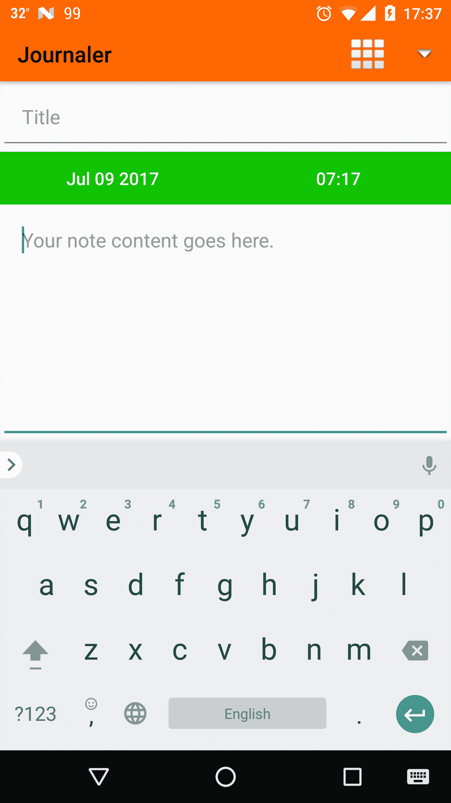
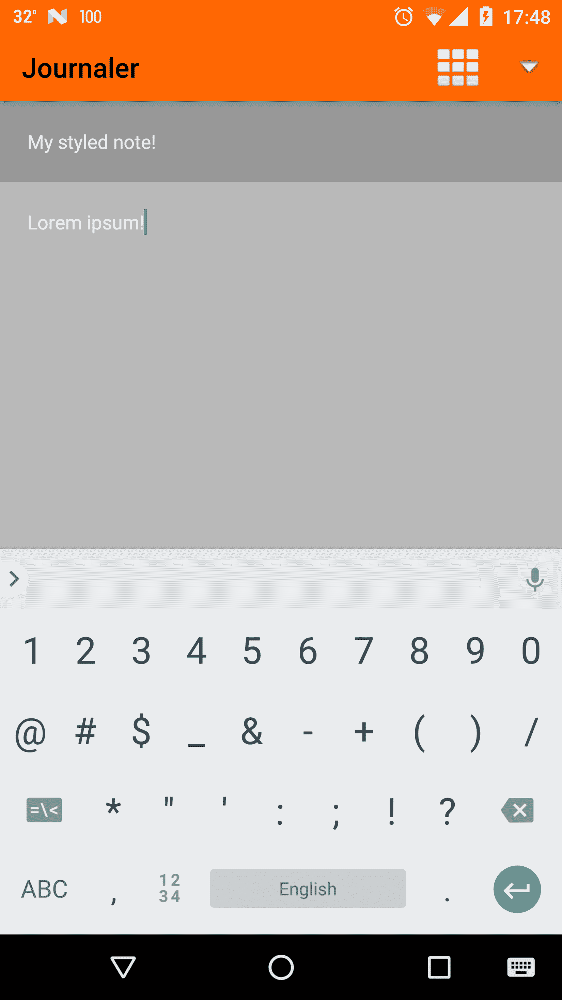
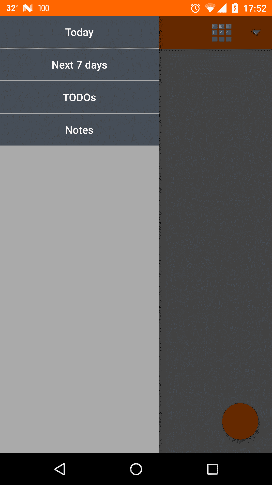
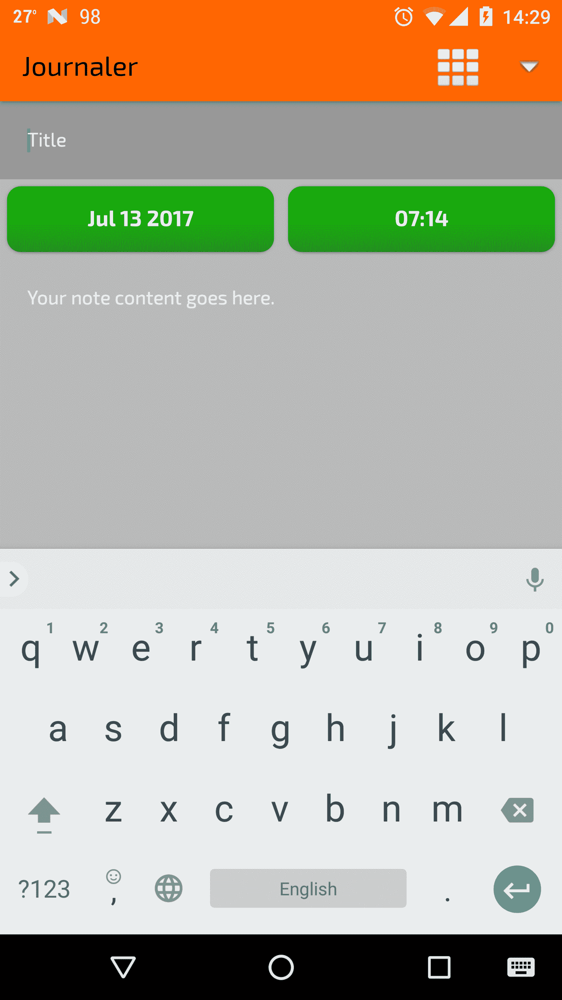

# 五、外观和体验

如今，应用具有令人惊叹的视觉外观。这是使您的应用独特和新颖的东西。赏心悦目的外观将使您的应用在类似的应用领域中脱颖而出，但它也将对您的用户产生强烈的吸引力，他们更有可能将您的应用安装并保存在他们的设备上。在本章中，我们将向您展示如何使您的应用变得美观。我们将向您介绍安卓用户界面主题化的秘密！我们将只关注安卓应用的视觉方面。

在本章中，我们将涵盖以下主题:

*   安卓系统中的主题和风格
*   使用素材
*   自定义字体和颜色
*   按钮设计
*   动画和动画集

# 安卓框架中的主题

在最后一章中，我们在主要的用户界面元素之间建立了联系。我们的应用看起来不像一个，直到它得到一些颜色。为了获得颜色，我们将从主应用主题开始。我们将扩展现有的安卓主题之一，并用我们喜欢的颜色覆盖它。

打开`styles.xml`。在这里，您将设置为我们的应用需求定义的默认主题。我们还将覆盖几种颜色。不过我们会改变`parent`主题，根据自己的意愿进行定制。我们将根据以下示例更新主题:

```kt
    <resources> 

      <style name="AppTheme" 
        parent="Theme.AppCompat.Light.NoActionBar"> 
        <item name="android:colorPrimary">@color/colorPrimary</item> 
        <item name="android:statusBarColor">@color/colorPrimary</item> 
        <item name="android:colorPrimaryDark">
         @color/colorPrimaryDark</item> 
        <item name="android:colorAccent">@color/colorAccent</item> 
        <item name="android:textColor">@android:color/black</item> 
      </style> 

    </resources> 
```

我们定义了一个继承自`AppCompat`主题的主题。原色代表应用品牌的颜色。颜色较深的变体是`colorPrimaryDark`，而用户界面控制将在`colorAccent`中着色的颜色。我们还会将主要文本颜色设置为黑色。状态栏也将使用我们的主要品牌颜色。

打开`colors.xml`文件，定义我们将用于主题的颜色，如下所示:

```kt
    <?xml version="1.0" encoding="utf-8"?> 
    <resources> 
      <color name="colorPrimary">#ff6600</color> 
      <color name="colorPrimaryDark">#197734</color> 
      <color name="colorAccent">#ffae00</color> 
    </resources> 
```

在运行应用查看主题之前，请确保主题已实际应用。用下面几行代码更新`manifest`文件:

```kt
    <application 
    android:theme="@style/AppTheme" 
```

另外，更新`fragment_items`浮动动作按钮的颜色如下:

```kt
    <android.support.design.widget.FloatingActionButton 
        android:backgroundTint="@color/colorPrimary" 
        android:id="@+id/new_item" 
        android:layout_width="wrap_content" 
        android:layout_height="wrap_content" 
        android:layout_alignParentBottom="true" 
        android:layout_alignParentEnd="true" 
        android:layout_margin="@dimen/button_margin" /> 
```

背景色调属性将确保按钮具有与状态栏相同的颜色。构建并运行应用。祝贺您，您已经成功地将您的应用标记为橙色！

# 安卓风格

我们刚刚定义的主题代表了风格。所有样式都在`styles.xml`文件中定义。我们将创建几个样式来展示您创建样式有多容易以及它们有多强大。您可以为按钮、文本或任何其他视图定义样式。你也可以继承风格。

出于样式的目的，我们将定义我们将在应用中使用的调色板。打开您的`colors.xml`文件，如下所示进行扩展:

```kt
    <color name="green">#11c403</color> 
    <color name="green_dark">#0e8c05</color> 
    <color name="white">#ffffff</color> 
    <color name="white_transparent_40">#64ffffff</color> 
    <color name="black">#000000</color> 
    <color name="black_transparent_40">#64000000</color> 
    <color name="grey_disabled">#d5d5d5</color> 
    <color name="grey_text">#444d57</color> 
    <color name="grey_text_transparent_40">#64444d57</color> 
    <color name="grey_text_middle">#6d6d6d</color> 
    <color name="grey_text_light">#b9b9b9</color> 
    <color name="grey_thin_separator">#f1f1f1</color> 
    <color name="grey_thin_separator_settings">#eeeeee</color> 
    <color name="vermilion">#f3494c</color> 
    <color name="vermilion_dark">#c64145</color> 
    <color name="vermilion_transparent_40">#64f3494c</color> 
    <color name="plum">#121e2a</color> 
```

注意透明的颜色！观察`white`颜色的情况。纯`white`色有代码`#ffffff`，而`40%`透明白色有代码`#64ffffff`。要实现透明度，可以使用以下值:

0% = #00
10% = #16
20% = #32
30% = #48
40% = #64
50% = #80
60% = #96
70% = #112
80% = #128
90% = #144

现在我们已经定义了调色板，我们将创建我们的第一个样式。打开`styles.xml`并将其展开:

```kt
     <style name="simple_button"> 
        <item name="android:textSize">16sp</item> 
        <item name="android:textAllCaps">false</item> 
        <item name="android:textColor">@color/white</item> 
     </style> 

     <style name="simple_button_green" parent="simple_button"> 
        <item name="android:background">
        @drawable/selector_button_green</item> 
    </style> 
```

我们定义了两种风格。首先定义简单按钮。它有白色文本，大小为`16sp`个字母。第二个扩展了第一个，并为背景添加了属性。我们将创建一个选择器，以便向您演示我们定义的样式。因为我们还没有这个资源，所以在`drawable resource`文件夹中创建`selector_button_green xml`:

```kt
     <?xml version="1.0" encoding="utf-8"?> 
     <selector xmlns:android=
      "http://schemas.android.com/apk/res/android"> 

      <item android:drawable="@color/grey_disabled" 
       android:state_enabled="false" /> 
      <item android:drawable="@color/green_dark"
       android:state_selected="true" /> 
      <item android:drawable="@color/green_dark"
       android:state_pressed="true" /> 
      <item android:drawable="@color/green" /> 

     </selector> 
```

我们定义了一个选择器。选择器是描述视觉行为或不同状态的 XML。我们为按钮的禁用状态添加了不同的颜色，当按钮被按下、释放或没有任何交互时为状态添加颜色。

要查看按钮的外观，请打开`activity_todo`布局，并为每个按钮设置样式:

```kt
    style="@style/simple_button_green"  
```

然后，运行应用并打开 Todo 屏幕。您的屏幕应该如下所示:



如果你按下按钮，你会注意到颜色变成了深绿色。在接下来的部分中，我们将通过添加圆角来进一步改进这些按钮，但在此之前，让我们创建一些更多的样式:

*   将输入字段和导航抽屉的样式添加到您的`styles.xml`中:

```kt
        <style name="simple_button_grey" parent="simple_button"> 
         <item name="android:background">
          @drawable/selector_button_grey</item> 
        </style> 

        <style name="edit_text_transparent"> 
          <item name="android:textSize">14sp</item> 
          <item name="android:padding">19dp</item> 
          <item name="android:textColor">@color/white</item> 
          <item name="android:textColorHint">@color/white</item> 
          <item name="android:background">
          @color/black_transparent_40</item> 
        </style> 

       <style name="edit_text_gery_text"
         parent="edit_text_transparent"> 
         <item name="android:textAlignment">textStart</item> 
         <item name="android:textColor">@color/white</item> 
         <item name="android:background">@color/grey_text_light</item> 
       </style> 
```

*   对于输入字段，我们定义了提示的颜色。我们还引入了一个可抽取的选择器`selector_button_grey`:

```kt
        <?xml version="1.0" encoding="utf-8"?> 
        <selector xmlns:android=
         "http://schemas.android.com/apk/res/android"> 

         <item android:drawable="@color/grey_disabled"  
         android:state_enabled="false" /> 
         <item android:drawable="@color/grey_text_middle"  
         android:state_selected="true" /> 
         <item android:drawable="@color/grey_text_middle"
         android:state_pressed="true" /> 
         <item android:drawable="@color/grey_text" /> 
        </selector> 
```

*   对于两个屏幕上的`note_title`(注意和待办事项)，添加样式:

```kt
        style="@style/edit_text_transparent" 
```

*   对于`note_content`添加:

```kt
        style="@style/edit_text_gery_text"  
```

*   对于`adapter_navigation_drawer`布局，将样式应用于按钮:

```kt
        style="@style/simple_button_grey" 
```

就这样！你设计了你的应用！现在运行它，查看所有屏幕和导航抽屉:



你怎么想呢?现在的 UI 好看吗？观察下一张截图:



应用现在看起来不错。可以根据自己的需要随意调整属性和颜色。我们还没有完成。我们需要一些字体来应用！在接下来的部分中，我们将讨论这个问题。

# 使用素材

您的应用需要使用原始资源的时候到了。字体就是一个很好的例子。我们使用的每个字体应用都是存储在`assets`文件夹中的一个单独的文件。`assets`文件夹是`main`目录或代表构建变体的目录的子目录。除了字体之外，在这里存储 txt 文件、mp3、waw、mid 和类似文件也很常见。您不能将这些类型的文件存储在`res`目录中。

# 使用自定义字体

字体是素材。所以为了给你的应用提供一些字体，我们需要先复制它们。有很多好的免费字体资源。比如谷歌字体。下载一些字体，复制到你的`assets`目录。如果没有`assets`目录，创建一个。我们将把我们的字体放在`img/fonts`目录中。

在我们的例子中，我们将使用`Exo`。`Exo`附带以下`font`文件:

*   `Exo2-Black.ttf`
*   `Exo2-BlackItalic.ttf`
*   `Exo2-Bold.ttf`
*   `Exo2-BoldItalic.ttf`
*   `Exo2-ExtraBold.ttf`
*   `Exo2-ExtraBoldItalic.ttf`
*   `Exo2-ExtraLight.ttf`
*   `Exo2-ExtraLightItalic.ttf`
*   `Exo2-Italic.ttf`
*   `Exo2-Light.ttf`
*   `Exo2-LightItalic.ttf`
*   `Exo2-Medium.ttf`
*   `Exo2-MediumItalic.ttf`
*   `Exo2-Regular.ttf`
*   `Exo2-SemiBold.ttf`
*   `Exo2-SemiBoldItalic.ttf`
*   `Exo2-Thin.ttf`
*   `Exo2-ThinItalic.ttf`

将`font`文件复制到`assets`目录中不会给我们开箱即用的字体支持。我们需要通过我们的代码来使用它们。我们将创建将为我们应用字体的代码。

打开`BaseActivity`并将其展开:

```kt
    abstract class BaseActivity : AppCompatActivity() { 
    companion object { 
      private var fontExoBold: Typeface? = null 
      private var fontExoRegular: Typeface? = null 

      fun applyFonts(view: View, ctx: Context) { 
        var vTag = "" 
        if (view.tag is String) { 
          vTag = view.tag as String 
        } 
        when (view) { 
          is ViewGroup -> { 
            for (x in 0..view.childCount - 1) { 
              applyFonts(view.getChildAt(x), ctx) 
            } 
          } 
          is Button -> { 
            when (vTag) { 
              ctx.getString(R.string.tag_font_bold) -> { 
                view.typeface = fontExoBold 
              } 
              else -> { 
                view.typeface = fontExoRegular 
              } 
             } 
            } 
            is TextView -> { 
              when (vTag) { 
                ctx.getString(R.string.tag_font_bold) -> { 
                view.typeface = fontExoBold 
                } 
                 else -> { 
                   view.typeface = fontExoRegular 
                 } 
                } 
              } 
              is EditText -> { 
                when (vTag) { 
                  ctx.getString(R.string.tag_font_bold) -> { 
                    view.typeface = fontExoBold 
                  } 
                 else -> { 
                   view.typeface = fontExoRegular 
                 } 
               } 
             } 
           } 
        } 
     } 
    ... 
    override fun onPostCreate(savedInstanceState: Bundle?) { 
        super.onPostCreate(savedInstanceState) 
        Log.v(tag, "[ ON POST CREATE ]") 
        applyFonts() 
    } 
    ... 
    protected fun applyFonts() { 
        initFonts() 
        Log.v(tag, "Applying fonts [ START ]") 
        val rootView = findViewById(android.R.id.content) 
        applyFonts(rootView, this) 
        Log.v(tag, "Applying fonts [ END ]") 
    } 

    private fun initFonts() { 
        if (fontExoBold == null) { 
            Log.v(tag, "Initializing font [ Exo2-Bold ]") 
            fontExoBold = Typeface.createFromAsset(assets, "fonts/Exo2-
            Bold.ttf") 
        } 
        if (fontExoRegular == null) { 
            Log.v(tag, "Initializing font [ Exo2-Regular ]") 
            fontExoRegular = Typeface.createFromAsset(assets,
            "fonts/Exo2-Regular.ttf") 
        } 
     }   
    } 
```

我们扩展了我们的基本活动来处理字体。当活动进入`onPostCreate()`时，将调用`applyFonts()`方法。`applyFonts()`然后做以下事情:

*   调用`initFonts()`方法，该方法从素材创建`TypeFace`实例。`TypeFace`用于表示字体及其视觉属性。我们为`ExoBold`和`ExoRegular`实例化了字体。
*   接下来发生的是，我们正在获取当前活动的`root`视图，并将其从伴随对象传递给`applyFonts()`方法。如果视图是一个`view group`我们迭代它的子视图，直到到达普通视图。视图有一个属性`typeface`，我们将其设置为我们的`typeface`实例。您还会注意到，我们正在从每个视图中检索名为`tag`的类属性。在安卓系统中，我们可以为我们的视图设置标签。标签可以是任何类的实例。在我们的例子中，我们通过名称`tag_font_bold`来检查标签是否是带有字符串资源值的`String`。

要设置标签，在名为**标签**的`values`目录中创建新的`xml`，并用以下内容填充:

```kt
    <?xml version="1.0" encoding="utf-8"?> 
    <resources> 
      <string name="tag_font_regular">FONT_REGULAR</string> 
      <string name="tag_font_bold">FONT_BOLD</string> 
    </resources> 
    To apply it open styles.xml and add tag to simple_button style: 
    <item name="android:tag">@string/tag_font_bold</item> 
```

现在所有应用的按钮都将应用粗体版本。现在构建您的应用并运行它。你会注意到字体变了！

# 应用着色

我们为我们的应用定义了调色板。我们通过访问资源来应用每种颜色。有时我们没有特定的颜色资源可用。可能会发生这样的情况:我们通过后端动态地获得了颜色(作为对某个 API 调用的响应)，或者由于其他一些原因，我们希望从代码中定义颜色。

当你需要处理代码中的颜色时，安卓非常强大。我们将介绍一些例子，并向您展示您可以做什么。

要从现有资源中获取颜色，您可以执行以下操作:

```kt
    val color = ContextCompat.getColor(contex, R.color.plum) 
```

在我们以前这样做之前:

```kt
     val color = resources.getColor(R.color.plum) 
```

但是从 Android 版本 6 开始就被弃用了。

获得颜色后，您可以将其应用于某些视图:

```kt
    pick_date.setTextColor(color) 
```

获取颜色的另一种方法是访问`Color`类静态方法。让我们从解析一些颜色字符串开始:

```kt
    val color = Color.parseColor("#ff0000")  
```

我们必须注意，已经有一定数量的预定义颜色可用:

```kt
     val color = Color.RED 
```

所以我们不需要解析`#ff0000`。还有其他一些颜色:

```kt
    public static final int BLACK 
    public static final int BLUE 
    public static final int CYAN 
    public static final int DKGRAY 
    public static final int GRAY 
    public static final int GREEN 
    public static final int LTGRAY 
    public static final int MAGENTA 
    public static final int RED 
    public static final int TRANSPARENT 
    public static final int WHITE 
    public static final int YELLOW
```

有时，您将只有关于红色、绿色或蓝色的参数，并基于这些参数来创建颜色:

```kt
     Color red = Color.valueOf(1.0f, 0.0f, 0.0f); 
```

我们必须注意，这个方法可以从 API 版本 26 中获得！

如果 RGB 不是您想要的颜色空间，那么您可以将其作为参数传递:

```kt
    val colorSpace = ColorSpace.get(ColorSpace.Named.NTSC_1953) 
    val color = Color.valueOf(1f, 1f, 1f, 1f, colorSpace) 
```

如你所见，当你处理颜色时，有很多可能性。如果标准颜色资源不足以让你管理你的颜色，你可以用一种高级的方式来做。我们鼓励您使用它，并尝试一些用户界面。

例如，如果您正在使用`AppCompat`库，一旦您获得了`Color`实例，您就可以像下面的例子一样使用它:

```kt
    counter.setTextColor( 
      ContextCompat.getColor(context, R.color.vermilion) 
    ) 
```

考虑以下截图:



# 让你的纽扣看起来很漂亮

我们给按钮着色，并为它们定义状态。我们给每个州涂上不同的颜色。我们有禁用状态、启用状态和按下状态的颜色。现在我们将更进一步。我们将使我们的按钮变圆，并用渐变而不是纯色给它们着色。我们将为新的按钮样式准备布局。打开`activity_todo`布局，修改按钮容器:

```kt
    <LinearLayout 
      android:background="@color/grey_text_light" 
      android:layout_width="match_parent" 
      android:layout_height="wrap_content" 
      android:orientation="horizontal" 
      android:weightSum="1"> 

      ... 

     </LinearLayout> 
```

我们将背景设置为与我们用于编辑文本字段的背景相同。按钮将是圆形的，所以我们希望它们与屏幕的其他部分在同一背景上。现在，让我们定义一些额外的尺寸和我们将使用的颜色。我们需要定义圆角按钮的半径:

```kt
     <dimen name="button_corner">10dp</dimen> 
```

因为我们计划使用渐变颜色，我们必须为渐变添加第二种颜色。将这些颜色添加到您的`colors.xml`中:

```kt
     <color name="green2">#208c18</color> 
     <color name="green_dark2">#0b5505</color>  
```

现在，当我们定义了这一点，我们将需要更新我们的绿色按钮的风格:

```kt
     <style name="simple_button_green" parent="simple_button"> 
        <item name="android:layout_margin">5dp</item> 
        <item name="android:background">
        @drawable/selector_button_green</item> 
     </style> 
```

我们添加了一个边距，这样按钮就可以彼此分开了。我们现在需要长方形的圆形抽屉。创建三个可抽取资源`rect_rounded_green`、`rect_rounded_green_dark`和`rect_rounded_grey_disabled`。确保它们是这样定义的:

*   `rect_rounded_green`:

```kt
         <shape xmlns:android=
           "http://schemas.android.com/apk/res/android"> 
            <gradient 
            android:angle="270" 
            android:endColor="@color/green2" 
            android:startColor="@color/green" /> 

           <corners android:radius="@dimen/button_corner" /> 
         </shape>  
```

*   `rect_rounded_green_dark`:

```kt
     <shape xmlns:android="http://schemas.android.com/apk/res/android"> 
       <gradient 
       android:angle="270" 
       android:endColor="@color/green_dark2" 
       android:startColor="@color/green_dark" /> 

      <corners android:radius="@dimen/button_corner" /> 
     </shape> 
```

*   `rect_rounded_grey_disabled`:

```kt
         <shape xmlns:android=
         "http://schemas.android.com/apk/res/android"> 

         <solid android:color="@color/grey_disabled" /> 
         <corners android:radius="@dimen/button_corner" /> 
         </shape> 
```

*   我们定义了包含以下属性的渐变:
    *   坡度角(270 度)
    *   开始颜色(我们使用了我们的颜色资源)
    *   结束颜色(我们也使用了我们的颜色资源)

此外，每个可绘制资源都有其角半径的值。最后一步是更新我们的选择器。打开`selector_button_green`并更新:

```kt
       <?xml version="1.0" encoding="utf-8"?> 
       <selector xmlns:android=
       "http://schemas.android.com/apk/res/android"> 

       <item  
       android:drawable="@drawable/rect_rounded_grey_disabled"  
       android:state_enabled="false" /> 

       <item  
       android:drawable="@drawable/rect_rounded_green_dark"  
       android:state_selected="true" /> 

       <item  
       android:drawable="@drawable/rect_rounded_green_dark"  
       android:state_pressed="true" /> 

       <item  
       android:drawable="@drawable/rect_rounded_green" /> 

     </selector> 
```

构建并运行您的应用。打开 Todo 屏幕，看一看。按钮现在有光滑的圆形边缘更好。按钮之间用边距隔开，如果您在按钮上按一个手指，您将看到我们定义的带有较暗绿色的次级渐变:


# 设置动画

我们认为我们的布局很好。很漂亮。但是能更有娱乐性吗？当然可以！如果我们让我们的布局更具互动性，我们将获得更好的用户体验，并吸引用户使用。我们将通过添加一些动画来实现这一点。动画可以通过代码或动画视图属性来定义。我们将通过添加简单有效的开场动画来改进每个屏幕。

定义为资源的动画位于`anim`资源目录中。我们在那里需要一些动画资源- `fade_in`、`fade_out`、`bottom_to_top`、`top_to_bottom`、`hide_to_top`、`hide_to_bottom`。根据以下示例创建并定义它们:

*   `fade_in`:

```kt
        <?xml version="1.0" encoding="utf-8"?> 
        <alpha xmlns:android=
        "http://schemas.android.com/apk/res/android" 
        android:duration="300" 
        android:fromAlpha="0.0" 
        android:interpolator="@android:anim/accelerate_interpolator" 
        android:toAlpha="1.0" /> 
```

*   `fade_out`:

```kt
         <?xml version="1.0" encoding="utf-8"?> 
         <alpha xmlns:android=
         "http://schemas.android.com/apk/res/android" 
         android:duration="300" 
         android:fillAfter="true" 
         android:fromAlpha="1.0" 
         android:interpolator="@android:anim/accelerate_interpolator" 
         android:toAlpha="0.0" /> 
         -  bottom_to_top: 
         <set xmlns:android=
          "http://schemas.android.com/apk/res/android" 
         android:fillAfter="true" 
         android:fillEnabled="true" 
         android:shareInterpolator="false"> 

         <translate 
         android:duration="900" 
         android:fromXDelta="0%" 
         android:fromYDelta="100%" 
         android:toXDelta="0%" 
         android:toYDelta="0%" /> 

         </set> 
```

*   `top_to_bottom`:

```kt
     <set xmlns:android="http://schemas.android.com/apk/res/android" 
     android:fillAfter="true" 
     android:fillEnabled="true" 
     android:shareInterpolator="false"> 
     <translate 
      android:duration="900" 
      android:fromXDelta="0%" 
      android:fromYDelta="-100%" 
      android:toXDelta="0%" 
      android:toYDelta="0%" /> 
    </set> 
```

*   `hide_to_top`:

```kt
     <set xmlns:android="http://schemas.android.com/apk/res/android" 
      android:fillAfter="true" 
      android:fillEnabled="true" 
      android:shareInterpolator="false"> 

    <translate 
      android:duration="900" 
      android:fromXDelta="0%" 
      android:fromYDelta="0%" 
      android:toXDelta="0%" 
      android:toYDelta="-100%" /> 

   </set> 
```

*   `hide_to_bottom`:

```kt
         <set xmlns:android=
          "http://schemas.android.com/apk/res/android" 
           android:fillAfter="true" 
           android:fillEnabled="true" 
           android:shareInterpolator="false"> 

        <translate 
          android:duration="900" 
          android:fromXDelta="0%" 
          android:fromYDelta="0%" 
          android:toXDelta="0%" 
          android:toYDelta="100%" /> 

       </set> 
```

看看这个例子和你可以定义的属性。在渐变动画示例中，我们为视图设置了一个`alpha`属性的动画。我们设置动画持续时间、从和到 alpha 值以及我们将用于动画的插值器。在安卓系统中，您可以为动画选择以下插值器之一:

*   `accelerate_interpolator`
*   `accelerate_decelerate_interpolator`
*   `bounce_interpolator`
*   `cycle_interpolator`
*   `anticipate_interpolator`
*   `anticipate_overshot_interpolator`
*   和许多其他的，都在- `@android:anim/...`中定义

对于其他动画，我们用`from`和`to`参数定义了平移。

在我们使用这些动画之前，我们将调整一些背景，这样在动画开始之前，我们的布局就不会有间隙。对于`activity_main`，添加工具栏父视图的背景:

```kt
     android:background="@android:color/darker_gray" 
```

对于`activity_note`和`activity_todo`来说，将工具栏嵌套在另一个父级中，以便最终颜色与工具栏下方标题字段的颜色相同:

```kt
     <LinearLayout 
        android:layout_width="match_parent" 
        android:layout_height="wrap_content" 
        android:background="@color/black_transparent_40" 
        android:orientation="vertical"> 

      <LinearLayout 
        android:layout_width="match_parent" 
        android:layout_height="wrap_content" 
        android:background="@color/black_transparent_40" 
        android:orientation="vertical"> 

      <android.support.v7.widget.Toolbar 
        android:id="@+id/toolbar" 
        android:layout_width="match_parent" 
        android:layout_height="50dp" 
        android:background="@color/colorPrimary" 
        android:elevation="4dp" /> 

```

最后，我们将应用我们的动画。我们将在屏幕上使用淡入淡出动画，打开和关闭。打开`BaseActivity`修改如下:

```kt
     override fun onCreate(savedInstanceState: Bundle?) { 
        super.onCreate(savedInstanceState) 
        overridePendingTransition(R.anim.fade_in, R.anim.fade_out) 
        setContentView(getLayout()) 
        setSupportActionBar(toolbar) 
        Log.v(tag, "[ ON CREATE ]") 

     } 
```

我们通过使用`overridePendingTransition()`方法覆盖过渡效果，该方法将进入和退出动画作为参数。

更新你的`onResume()`和`onPause()`方法:

```kt
    override fun onResume() { 
        super.onResume() 
        Log.v(tag, "[ ON RESUME ]") 
        val animation = getAnimation(R.anim.top_to_bottom) 
        findViewById(R.id.toolbar).startAnimation(animation) 
    } 

    override fun onPause() { 
        super.onPause() 
        Log.v(tag, "[ ON PAUSE ]") 
        val animation = getAnimation(R.anim.hide_to_top) 
        findViewById(R.id.toolbar).startAnimation(animation) 

    } 
```

我们创建了一个动画实例，并使用`startAnimation()`方法将其应用于视图。`getAnimation()`方法是我们的。我们定义了它。所以，给`BaseActivity`加上实现:

```kt
     protected fun getAnimation(animation: Int): Animation =
     AnimationUtils.loadAnimation(this, animation) 
```

既然我们在使用 Kotlin，为了让它对所有活动都可用，而不仅仅是那些扩展`BaseActivity`的活动，请将方法更改为这样的扩展功能:

```kt
     fun Activity.getAnimation(animation: Int): Animation =
     AnimationUtils.loadAnimation(this, animation) 
```

再次构建应用并运行它。多次打开和关闭屏幕，查看我们的动画效果如何。

# 安卓系统中的动画集

在前几节中，我们使用了来自 XML 中定义的资源的动画。在本节中，我们将使用各种视图属性和动画集。我们将用简单有效的例子来说明目的和用途。

让我们演示代码中的第一个动画。打开`ItemsFragment`。添加以下方法:

```kt
     private fun animate(btn: FloatingActionButton, expand: Boolean =
     true) { 
        btn.animate() 
                .setInterpolator(BounceInterpolator()) 
                .scaleX(if(expand){ 1.5f } else { 1.0f }) 
                .scaleY(if(expand){ 1.5f } else { 1.0f }) 
                .setDuration(2000) 
                .start() 
      } 
```

这个方法会有什么作用？此方法将使用弹跳插值动画化按钮的缩放。如果扩展参数为`true`，我们将向上扩展，否则我们将向下扩展。

应用到我们的浮动动作按钮。扩展按钮点击监听器:

```kt
    btn?.setOnClickListener { 

    animate(btn) 

    ... 

    } 
```

并在取消操作集上将主对话框设置为可取消:

```kt
    val builder = AlertDialog.Builder(this@ItemsFragment.context) 
                    .setTitle(R.string.choose_a_type) 
                    .setCancelable(true) 
                    .setOnCancelListener { 
                        animate(btn, false) 
                    } 

    .setItems( ... ) 

    ... 

    builder.show() 
```

构建并运行应用。单击“添加项目”按钮，然后在对话框外点击关闭对话框。我们有一个精彩的尺度动画！

要使浮动操作按钮完成，请为加号添加 PNG 资源并将其应用于按钮:

```kt
     <android.support.design.widget.FloatingActionButton 
     ... 
     android:src="@drawable/add" 
     android:scaleType="centerInside" 
     ... 
     /> 
```

随着图标添加到按钮，动画看起来很完美！让我们把它做得更完美！我们将创建一个包含多个动画的动画集！

```kt
     private fun animate(btn: FloatingActionButton, expand: Boolean =
     true) { 
        val animation1 = ObjectAnimator.ofFloat(btn, "scaleX",
        if(expand){ 1.5f } else { 1.0f }) 
        animation1.duration = 2000 
        animation1.interpolator = BounceInterpolator() 

        val animation2 = ObjectAnimator.ofFloat(btn, "scaleY",
        if(expand){ 1.5f } else { 1.0f }) 
        animation2.duration = 2000 
        animation2.interpolator = BounceInterpolator() 

        val animation3 = ObjectAnimator.ofFloat(btn, "alpha",
        if(expand){ 0.3f } else { 1.0f }) 
        animation3.duration = 500 
        animation3.interpolator = AccelerateInterpolator() 

        val set = AnimatorSet() 
        set.play(animation1).with(animation2).before(animation3) 
        set.start() 
      } 
```

`AnimatorSet`类赋予我们创建复杂动画的能力。在这种情况下，我们定义了沿 *x* 轴缩放和沿 *y* 轴缩放的动画。这两个动画将同时动画化，给我们两个方向缩放的效果。扩展视图后，我们将减少(或增加)视图的容量。如您所见，我们可以链接或命令动画的执行。

构建您的项目并运行。您可以看到新的动画行为。

# 摘要

这一章是相当互动的一章。首先，我们向您展示了如何在安卓中添加、定义、更改和调整主题。然后我们沉浸在安卓的风格和素材中。在本章中，我们还采用了一些自定义字体和颜色。最后，我们制作了一些非常漂亮的按钮和快速动画。在下一章中，您将开始学习安卓框架的系统部分。我们将从权限开始。