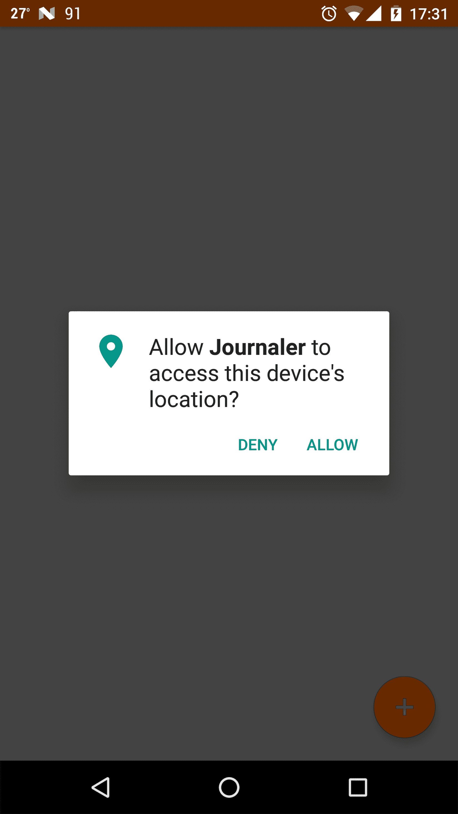

# 许可

又见面了。你能相信这本书的一个重要部分已经过去了吗？我们已经完成了用户界面，现在，我们将进入本书更复杂的部分——系统。

在这一章以及接下来的章节中，我们将深入研究安卓系统的结构。您将了解权限、数据库处理、首选项、并发性、服务、消息传递、后端、API 和高性能。

然而，你不应该让自己被愚弄；这本书及其内容没有涵盖整个框架。那是根本不可能的；安卓是一个如此庞大的框架，你可能需要几年才能完全掌握它。在这里，我们只是深入安卓和Kotlin的世界。

但是，不要气馁！在这本书里，我们会给你掌握 Kotlin 和 Android 所需的知识和技能。在这一章中，确切地说，我们将讨论 Android 中的权限。您将了解什么是权限，它们用于什么，最重要的是，我们为什么需要(特别强调需要)使用它们。

在本章中，我们将涵盖以下主题:

*   安卓清单中的权限
*   请求权限
*   Kotlin方式的权限处理

# 安卓清单中的权限

安卓应用在自己的进程中运行，并与操作系统的其他部分分离。因此，为了执行某些系统特定的操作，需要请求它们。这种许可请求的一个例子是使用蓝牙、检索当前全球定位系统位置、发送短信或从文件系统读取或写入文件系统的请求。权限授予对各种设备功能的访问权限。有几种方法可以处理权限。我们将从一个非常基础的清单开始。

首先，我们必须确定需要什么权限。在安装过程中，用户可能会因为权限太多而决定不安装应用。例如，当应用本身只是一个简单的图像库应用时，用户可以问自己为什么应用需要发送短信功能。

对于我们在本书中开发的应用 Journaler，我们需要以下权限:

*   读取全球定位系统坐标，因为我们希望我们创建的每个音符都有相关的坐标，如果我们想的话
*   我们将需要访问互联网，这样我们以后就可以执行 API 调用
*   引导完成事件，我们将需要它，以便应用服务可以在我们每次重启手机时与后端同步
*   读写外部存储器，以便我们可以读取或存储数据
*   访问网络状态，以便我们知道是否有到互联网的可用连接
*   使用振动，这样当我们从后端收到东西时，我们就可以振动

打开`AndroidManifest.xml`文件，用以下权限更新:

```kt
    <manifest xmlns:android=
     "http://schemas.android.com/apk/res/android" 
     package="com.journaler"> 

      <uses-permission android:name="android.permission.INTERNET" /> 
      <uses-permission android:name=
       "android.permission.RECEIVE_BOOT_COMPLETED" /> 
      <uses-permission android:name=
       "android.permission.READ_EXTERNAL_STORAGE" /> 
      <uses-permission android:name=
       "android.permission.WRITE_EXTERNAL_STORAGE" /> 
      <uses-permission android:name=
       "android.permission.ACCESS_NETWORK_STATE" /> 
      <uses-permission android:name=
       "android.permission.ACCESS_FINE_LOCATION" /> 
      <uses-permission android:name=
       "android.permission.ACCESS_COARSE_LOCATION" /> 
      <uses-permission android:name="android.permission.VIBRATE" /> 
       <application ... > 
         ... 
       </application 

       ... 

     </manifest>  
```

我们刚刚请求的权限名称几乎是不言自明的，它们涵盖了我们提到的所有要点。除了这些权限，您还可以请求其他一些权限。看看下面每个人的名字。你会惊讶你实际上能要求什么:

```kt
     <uses-permission android:name=
     "android.permission.ACCESS_CHECKIN_PROPERTIES" /> 
     <uses-permission  android:name=
     "android.permission.ACCESS_LOCATION_EXTRA_COMMANDS" /> 
     <uses-permission android:name=
     "android.permission.ACCESS_MOCK_LOCATION" /> 
     <uses-permission android:name=
     "android.permission.ACCESS_SURFACE_FLINGER" /> 
     <uses-permission android:name=
     "android.permission.ACCESS_WIFI_STATE" /> 
     <uses-permission android:name=
     "android.permission.ACCOUNT_MANAGER" /> 
     <uses-permission android:name=
     "android.permission.AUTHENTICATE_ACCOUNTS" /> 
     <uses-permission android:name=
     "android.permission.BATTERY_STATS" /> 
     <uses-permission android:name=
     "android.permission.BIND_APPWIDGET" /> 
     <uses-permission android:name=
     "android.permission.BIND_DEVICE_ADMIN" /> 
     <uses-permission android:name=
     "android.permission.BIND_INPUT_METHOD" /> 
     <uses-permission android:name=
     "android.permission.BIND_REMOTEVIEWS" /> 
     <uses-permission android:name=
     "android.permission.BIND_WALLPAPER" /> 
     <uses-permission android:name=
     "android.permission.BLUETOOTH" /> 
     <uses-permission android:name=
     "android.permission.BLUETOOTH_ADMIN" /> 
     <uses-permission android:name=
     "android.permission.BRICK" /> 
     <uses-permission android:name=
     "android.permission.BROADCAST_PACKAGE_REMOVED" /> 
     <uses-permission android:name=
     "android.permission.BROADCAST_SMS" /> 
     <uses-permission android:name=
     "android.permission.BROADCAST_STICKY" /> 
     <uses-permission android:name=
      "android.permission.BROADCAST_WAP_PUSH" /> 
     <uses-permission android:name=
      "android.permission.CALL_PHONE"/> 
     <uses-permission android:name=
      "android.permission.CALL_PRIVILEGED" /> 
     <uses-permission android:name=
      "android.permission.CAMERA"/> 
     <uses-permission android:name=
      "android.permission.CHANGE_COMPONENT_ENABLED_STATE" /> 
     <uses-permission android:name=
     "android.permission.CHANGE_CONFIGURATION" /> 
     <uses-permission android:name=
     "android.permission.CHANGE_NETWORK_STATE" /> 
     <uses-permission android:name=
     "android.permission.CHANGE_WIFI_MULTICAST_STATE" /> 
     <uses-permission android:name=
     "android.permission.CHANGE_WIFI_STATE" /> 
     <uses-permission android:name=
     "android.permission.CLEAR_APP_CACHE" /> 
     <uses-permission android:name=
     "android.permission.CLEAR_APP_USER_DATA" /> 
     <uses-permission android:name=
     "android.permission.CONTROL_LOCATION_UPDATES" /> 
     <uses-permission android:name=
     "android.permission.DELETE_CACHE_FILES" /> 
     <uses-permission android:name=
     "android.permission.DELETE_PACKAGES" /> 
     <uses-permission android:name=
     "android.permission.DEVICE_POWER" /> 
     <uses-permission android:name=
     "android.permission.DIAGNOSTIC" /> 
     <uses-permission android:name=
     "android.permission.DISABLE_KEYGUARD" /> 
     <uses-permission android:name=
     "android.permission.DUMP" /> 
     <uses-permission android:name=
     "android.permission.EXPAND_STATUS_BAR" /> 
     <uses-permission android:name="
     android.permission.FACTORY_TEST" /> 
     <uses-permission android:name=
     "android.permission.FLASHLIGHT" /> 
     <uses-permission android:name=
     "android.permission.FORCE_BACK" /> 
     <uses-permission android:name=
     "android.permission.GET_ACCOUNTS" /> 
     <uses-permission android:name=
     "android.permission.GET_PACKAGE_SIZE" /> 
     <uses-permission android:name=
     "android.permission.GET_TASKS" /> 
     <uses-permission android:name=
     "android.permission.GLOBAL_SEARCH" /> 
     <uses-permission android:name=
     "android.permission.HARDWARE_TEST" /> 
     <uses-permission android:name=
     "android.permission.INJECT_EVENTS" /> 
     <uses-permission android:name=
     "android.permission.INSTALL_LOCATION_PROVIDER" /> 
     <uses-permission android:name=
     "android.permission.INSTALL_PACKAGES" /> 
     <uses-permission android:name=
     "android.permission.INTERNAL_SYSTEM_WINDOW" /> 
     <uses-permission android:name=
     "android.permission.KILL_BACKGROUND_PROCESSES" /> 
     <uses-permission android:name=
     "android.permission.MANAGE_ACCOUNTS" /> 
     <uses-permission android:name=
     "android.permission.MANAGE_APP_TOKENS" /> 
     <uses-permission android:name=
     "android.permission.MASTER_CLEAR" /> 
     <uses-permission android:name=
     "android.permission.MODIFY_AUDIO_SETTINGS" /> 
     <uses-permission android:name=
     "android.permission.MODIFY_PHONE_STATE" /> 
     <uses-permission android:name=
     "android.permission.MOUNT_FORMAT_FILESYSTEMS" /> 
     <uses-permission android:name=
     "android.permission.MOUNT_UNMOUNT_FILESYSTEMS" /> 
     <uses-permission android:name=
     "android.permission.NFC" /> 
     <uses-permission android:name=
     "android.permission.PROCESS_OUTGOING_CALLS" /> 
     <uses-permission android:name=
     "android.permission.READ_CALENDAR" /> 
    <uses-permission android:name=
     "android.permission.READ_CONTACTS" /> 
    <uses-permission android:name=
    "android.permission.READ_FRAME_BUFFER" /> 
    <uses-permission android:name=
    "android.permission.READ_HISTORY_BOOKMARKS" /> 
    <uses-permission android:name=
    "android.permission.READ_INPUT_STATE" /> 
    <uses-permission android:name=
    "android.permission.READ_LOGS" /> 
    <uses-permission android:name=
    "android.permission.READ_PHONE_STATE" /> 
    <uses-permission android:name=
    "android.permission.READ_SMS" /> 
    <uses-permission android:name=
    "android.permission.READ_SYNC_SETTINGS" /> 
    <uses-permission android:name=
    "android.permission.READ_SYNC_STATS" /> 
    <uses-permission android:name=
    "android.permission.REBOOT" /> 
    <uses-permission android:name=
    "android.permission.RECEIVE_MMS" /> 
    <uses-permission android:name=
    "android.permission.RECEIVE_SMS" /> 
    <uses-permission android:name=
    "android.permission.RECEIVE_WAP_PUSH" /> 
    <uses-permission android:name=
    "android.permission.RECORD_AUDIO" /> 
    <uses-permission android:name=
    "android.permission.REORDER_TASKS" /> 
    <uses-permission android:name=
    "android.permission.RESTART_PACKAGES" /> 
    <uses-permission android:name=
    "android.permission.SEND_SMS" /> 
    <uses-permission android:name=
    "android.permission.SET_ACTIVITY_WATCHER" /> 
    <uses-permission android:name=
     "android.permission.SET_ALARM" /> 
    <uses-permission android:name=
     "android.permission.SET_ALWAYS_FINISH" /> 
    <uses-permission android:name=
     "android.permission.SET_ANIMATION_SCALE" /> 
    <uses-permission android:name=
     "android.permission.SET_DEBUG_APP" /> 
    <uses-permission android:name=
     "android.permission.SET_ORIENTATION" /> 
    <uses-permission android:name=
     "android.permission.SET_POINTER_SPEED" /> 
    <uses-permission android:name=
     "android.permission.SET_PROCESS_LIMIT" /> 
    <uses-permission android:name=
     "android.permission.SET_TIME" /> 
    <uses-permission android:name=
     "android.permission.SET_TIME_ZONE" /> 
    <uses-permission android:name=
     "android.permission.SET_WALLPAPER" /> 
    <uses-permission android:name=
     "android.permission.SET_WALLPAPER_HINTS" /> 
    <uses-permission android:name=
     "android.permission.SIGNAL_PERSISTENT_PROCESSES" /> 
    <uses-permission android:name=
     "android.permission.STATUS_BAR" /> 
    <uses-permission android:name=
     "android.permission.SUBSCRIBED_FEEDS_READ" /> 
    <uses-permission android:name=
     "android.permission.SUBSCRIBED_FEEDS_WRITE" /> 
    <uses-permission android:name=
     "android.permission.SYSTEM_ALERT_WINDOW" /> 
    <uses-permission android:name=
     "android.permission.UPDATE_DEVICE_STATS" /> 
    <uses-permission android:name=
     "android.permission.USE_CREDENTIALS" /> 
    <uses-permission android:name=
     "android.permission.USE_SIP" /> 
    <uses-permission android:name=
     "android.permission.WAKE_LOCK" /> 
    <uses-permission android:name=
     "android.permission.WRITE_APN_SETTINGS" /> 
    <uses-permission android:name=
     "android.permission.WRITE_CALENDAR" /> 
    <uses-permission android:name=
     "android.permission.WRITE_CONTACTS" /> 
    <uses-permission android:name=
     "android.permission.WRITE_GSERVICES" /> 
    <uses-permission android:name=
     "android.permission.WRITE_HISTORY_BOOKMARKS" /> 
    <uses-permission android:name=
     "android.permission.WRITE_SECURE_SETTINGS" /> 
    <uses-permission android:name=
     "android.permission.WRITE_SETTINGS" /> 
    <uses-permission android:name=
     "android.permission.WRITE_SMS" /> 
    <uses-permission android:name=
     "android.permission.WRITE_SYNC_SETTINGS" /> 
    <uses-permission android:name=
     "android.permission.BIND_ACCESSIBILITY_SERVICE"/> 
    <uses-permission android:name=
     "android.permission.BIND_TEXT_SERVICE"/> 
    <uses-permission android:name=
     "android.permission.BIND_VPN_SERVICE"/> 
    <uses-permission android:name=
     "android.permission.PERSISTENT_ACTIVITY"/> 
    <uses-permission android:name=
     "android.permission.READ_CALL_LOG"/> 
    <uses-permission android:name=
     "com.android.browser.permission.READ_HISTORY_BOOKMARKS"/> 
    <uses-permission android:name=
     "android.permission.READ_PROFILE"/> 
    <uses-permission android:name=
     "android.permission.READ_SOCIAL_STREAM"/> 
    <uses-permission android:name=
     "android.permission.READ_USER_DICTIONARY"/> 
    <uses-permission android:name=
     "com.android.alarm.permission.SET_ALARM"/> 
    <uses-permission android:name=
     "android.permission.SET_PREFERRED_APPLICATIONS"/> 
    <uses-permission android:name=
     "android.permission.WRITE_CALL_LOG"/> 
    <uses-permission android:name=
     "com.android.browser.permission.WRITE_HISTORY_BOOKMARKS"/> 
    <uses-permission android:name=
     "android.permission.WRITE_PROFILE"/> 
    <uses-permission android:name=
     "android.permission.WRITE_SOCIAL_STREAM"/> 
    <uses-permission android:name=
     "android.permission.WRITE_USER_DICTIONARY"/>  
```

# 请求权限

Android SDK 版本之后，运行时需要请求 23 个权限(不是全部)。这意味着我们也需要从代码中请求它们。我们将从我们的应用中演示如何做到这一点。当用户打开应用时，我们将请求获取全球定位系统位置所需的权限。如果没有任何已批准的权限，用户将获得一个对话框来批准权限。打开你的`BaseActivity`类，扩展如下:

```kt
    abstract class BaseActivity : AppCompatActivity() {
      companion object { 
      val REQUEST_GPS = 0 
      ... }
      ... 
      override fun onCreate(savedInstanceState: Bundle?) {   
        super.onCreate(savedInstanceState)
        ...
        requestGpsPermissions() } 
     ...
     private fun requestGpsPermissions() {   
       ActivityCompat.requestPermissions( 
         this@BaseActivity,
         arrayOf( 
           Manifest.permission.ACCESS_FINE_LOCATION,
           Manifest.permission.ACCESS_COARSE_LOCATION ),
           REQUEST_GPS ) }
            ... 
      override fun onRequestPermissionsResult(
        requestCode:
         Int, permissions: Array<String>, grantResults: IntArray ) {
           if (requestCode == REQUEST_GPS) { 
            for (grantResult in grantResults) 
            { if (grantResult == PackageManager.PERMISSION_GRANTED)
             { Log.i( tag, String.format( Locale.ENGLISH, "Permission 
              granted [ %d ]", requestCode ) ) 
             } 
             else {
               Log.e( tag, String.format( Locale.ENGLISH, "Permission
               not granted [ %d ]", requestCode ) )
             } } } } }

```

那么这段代码到底是怎么回事呢？我们将从头到尾解释所有的行。

在`companion`对象中，我们为我们的请求定义了 ID。我们将等待该 ID 的结果。在`onCreate()`方法中，我们调用了`requestGpsPermissions()`方法，该方法实际上是在我们定义的标识下发出权限请求的。许可请求的结果将在`onRequestPermissionsResult()`覆盖方法中可用。如您所见，我们正在记录许可请求结果。应用现在可以检索全球定位系统数据。

其他所有安卓权限的原理都一样。构建并运行您的应用。您将被询问权限，如下图所示:



# 用Kotlin的方式做

如果我们的应用需要大量必须通过代码处理的权限，会发生什么？碰巧我们有很多处理不同权限请求的代码。这意味着我们有很多样板代码！幸运的是，我们正在使用 Kotlin。Kotlin 将是我们让事情变得更简单的工具！

创建一个名为`permission`的新包。然后创建两个新的 Kotlin 文件，如下所示:

`PermissionCompatActivity`和`PermissionRequestCallback`。

让我们如下定义权限请求回调:

```kt
     package com.journaler.permission 

     interface PermissionRequestCallback { 
       fun onPermissionGranted(permissions: List<String>) 
       fun onPermissionDenied(permissions: List<String>) 
     } 
```

这将是解析权限时触发的`callback`。然后，定义我们的权限`compat`活动:

```kt
     package com.journaler.permission 

     import android.content.pm.PackageManager 
     import android.support.v4.app.ActivityCompat 
     import android.support.v7.app.AppCompatActivity 
     import android.util.Log 
     import java.util.concurrent.ConcurrentHashMap 
     import java.util.concurrent.atomic.AtomicInteger 

     abstract class PermissionCompatActivity : AppCompatActivity() { 

       private val tag = "Permissions extension" 
       private val latestPermissionRequest = AtomicInteger() 
       private val permissionRequests = ConcurrentHashMap<Int,
       List<String>>() 
       private val permissionCallbacks =  
        ConcurrentHashMap<List<String>, PermissionRequestCallback>() 

       private val defaultPermissionCallback = object :  
       PermissionRequestCallback { 
         override fun onPermissionGranted(permissions: List<String>) { 
            Log.i(tag, "Permission granted [ $permissions ]") 
         } 
         override fun onPermissionDenied(permissions: List<String>) { 
            Log.e(tag, "Permission denied [ $permissions ]") 
         } 
      } 

     fun requestPermissions( 
        vararg permissions: String,  
        callback: PermissionRequestCallback = defaultPermissionCallback 
     ) { 
        val id = latestPermissionRequest.incrementAndGet() 
        val items = mutableListOf<String>() 
        items.addAll(permissions) 
        permissionRequests[id] = items 
        permissionCallbacks[items] = callback 
        ActivityCompat.requestPermissions(this, permissions, id) 
     } 

     override fun onRequestPermissionsResult( 
        requestCode: Int,  
        permissions: Array<String>,  
        grantResults: IntArray 
     ) { 
        val items = permissionRequests[requestCode] 
        items?.let { 
           val callback = permissionCallbacks[items] 
           callback?.let { 
             var success = true 
              for (x in 0..grantResults.lastIndex) { 
                  val result = grantResults[x] 
                  if (result != PackageManager.PERMISSION_GRANTED) { 
                      success = false 
                      break 
                  } 
              } 
              if (success) { 
                 callback.onPermissionGranted(items) 
              } else { 
                  callback.onPermissionDenied(items) 
              } 
             } 
           } 
         } 
     }
```

这个类背后的思想如下——我们将最终用户暴露给`requestPermissions()`方法，该方法接受表示我们感兴趣的权限的可变数量的参数。我们可以通过`callback`(我们刚刚定义的界面)这个选项。如果我们不通过我们自己的`callback`，将使用默认的。权限解析后，我们触发`callback` s .我们认为权限解析成功，只有在所有权限都被授予的情况下。

让我们更新我们的`BaseActivity`类如下:

```kt
     abstract class BaseActivity : PermissionCompatActivity() { 
     ... 
     override fun onCreate(savedInstanceState: Bundle?) { 
         ... 
         requestPermissions( 
            Manifest.permission.ACCESS_FINE_LOCATION, 
            Manifest.permission.ACCESS_COARSE_LOCATION 
         ) 
     } 
     ... 
    } 
```

如您所见，我们从`BaseActivity`类中移除了所有以前与权限相关的代码，并用一个单独的`requestPermission()`调用来替换它。

# 摘要

这一章可能很短，但你学到的信息非常有价值。每个安卓应用都需要权限。他们在那里保护用户和开发者。正如您所看到的，根据您的需要，您可以使用很多不同的权限。

在下一章中，我们将继续系统部分，您将了解数据库处理。