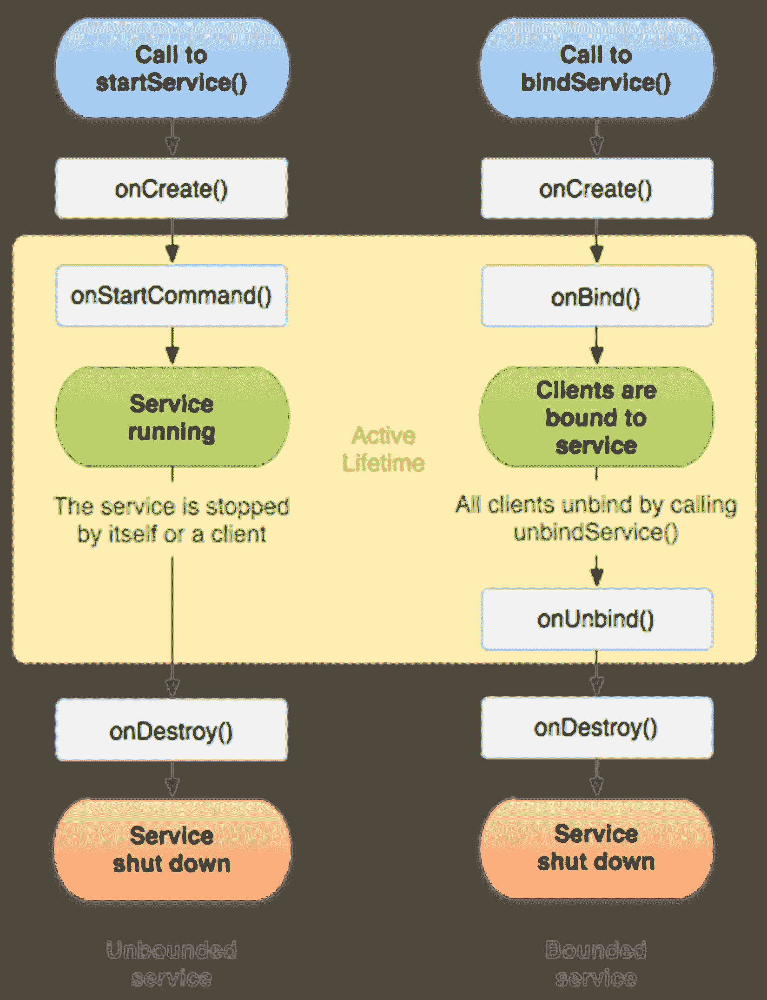

# 安卓服务

在前一章中，我们开始在 Android 中使用并发机制。我们取得了巨大的进步。然而，我们的安卓并发机制之旅还没有结束。我们必须展示安卓框架最重要的部分——安卓服务。在本章中，我们将解释什么是服务，以及何时和如何使用它们。

在本章中，我们将涵盖以下主题:

*   服务分类
*   安卓服务基础
*   定义主要应用服务
*   定义意向服务

# 服务分类

在我们定义安卓服务分类并深入研究每种类型之前，我们必须回答安卓服务到底是什么的问题。嗯，**安卓服务**是安卓框架提供的一种机制，通过它我们可以将长时间运行的任务的执行转移到后台。安卓服务提供了一些不错的附加功能，可以使开发人员的工作更加灵活和容易。为了解释它将如何使我们的开发更容易，我们将通过扩展我们的 Journaler 应用来创建一个服务。

安卓服务是一个没有任何 UI 的应用组件。它可以由任何安卓应用组件启动，并根据需要继续运行，即使我们离开我们的应用或杀死它。

安卓服务主要有三种类型:

*   前景
*   背景
*   束缚

# 前台安卓服务

前台服务执行终端用户可以注意到的任务。这些服务必须显示状态栏图标。即使没有与应用的交互，它们也会继续运行。

# 后台安卓服务

与前台服务不同，后台服务执行终端用户没有注意到的任务。例如，我们将执行与后端实例的同步。用户不需要知道我们的进度。我们决定不去打扰用户。一切都将在我们应用的后台默默进行。

# 绑定安卓服务

我们的应用组件可以绑定到一个服务，并触发不同的任务来执行。在 Android 中与服务交互非常简单。组件绑定到服务，只要至少有一个这样的组件，服务就会继续运行。当没有组件绑定到服务时，服务将被销毁。

可以创建一个后台服务，该服务在后台运行，并且能够绑定到它。

# 安卓服务基础

要定义安卓服务，必须扩展`Service`类。我们必须覆盖以下一些方法，以便服务正常运行:

*   `onStartCommand()`:该方法在`startService()`方法被某个安卓组件触发时执行。该方法执行后，安卓服务启动，可以在后台无限运行。要停止此服务，您必须执行与`startService()`方法功能相反的`stopService()`方法。
*   `onBind()`:要从另一个安卓组件绑定到服务，使用`bindService()`方法。我们绑定后，执行`onBind()`方法。在这个方法的服务实现中，您必须通过返回一个`Ibinder`类实例来提供一个客户端用来与服务通信的接口。实现这个方法不是可选的，但是如果不打算绑定到服务，就返回`null`。
*   `onCreate()`:该方法在创建服务时执行。如果服务已经在运行，则不会执行。
*   `onDestroy()`:该方法在服务被销毁时执行。覆盖此方法，并在此为您的服务执行所有清理任务。
*   `onUnbind()`:这个方法在我们从服务中解除绑定时执行。

# 宣布你的服务

要声明您的服务，您需要将其类添加到安卓清单中。下面的代码片段解释了安卓清单中的服务定义应该是什么样子:

```kt
    <manifest xmlns:android=
     "http://schemas.android.com/apk/res/android"   
      package="com.journaler"> 
      ... 
      <application ... > 
        <service 
          android:name=".service.MainService" 
          android:exported="false" /> 
          ... 

      </application> 
     </manifest>

```

如您所见，我们定义了扩展`Service`类的`MainService`类，它位于`service`包下。导出的标志设置为`false`，这意味着`service`将在与我们的应用相同的过程中运行。要在单独的过程中运行`service`，请将该标志设置为`true`。

需要注意的是`Service`类并不是唯一可以扩展的类。`IntentService`级也有。那么，当我们扩展它时，我们会得到什么呢？`IntentService`代表从`Service`类派生的类。`IntentService`使用工作线程逐个处理请求。为此，我们必须实施`onHandleIntent()`方法。这是`IntentService`级扩展时的样子:

```kt
     public class MainIntentService extends IntentService { 
       /** 
       * A constructor is mandatory! 
       */ 
       public MainIntentService() { 
         super("MainIntentService"); 
       } 

       /** 
       * All important work is performed here. 
       */ 
       @Override 
       protected void onHandleIntent(Intent intent) { 
         // Your implementation for handling received intents. 

       } 
     } 
```

让我们回到扩展`Service`类，并专注于它。我们将覆盖`onStartCommand()`方法，如下所示:

```kt
    override fun onStartCommand(intent: Intent?, flags: Int, startId:  
    Int): Int { 

      return Service.START_STICKY 
    }
```

那么`START_STICKY`返回结果是什么意思呢？如果我们的服务被系统终止，或者我们终止了服务所属的应用，它将再次启动。与之相对的是`START_NOT_STICKY`；在这种情况下，将不会重新创建和重新启动服务。

# 启动服务

要启动服务，我们需要定义代表它的意图。这是一个如何启动服务的示例:

```kt
    val startServiceIntent = Intent(ctx, MainService::class.java) 
    ctx.startService(startServiceIntent) 
```

这里，`ctx`代表安卓`Context`类的任何有效实例。

# 停止服务

要停止服务，从安卓`Context`类执行`stopService()`方法，如下所示:

```kt
     val stopServiceIntent = Intent(ctx, MainService::class.java)
     ctx.stopService(startServiceIntent) 
```

# 绑定到安卓服务

一个**绑定服务**是允许安卓组件绑定到它的服务。要执行绑定，我们必须调用`bindService()`方法。当您想要从活动或其他安卓组件与服务交互时，服务绑定是必要的。对于绑定工作，您必须实现`onBind()`方法并返回一个`IBinder`实例。如果不再有任何相关方，并且所有相关方都是未绑定的，那么安卓就会破坏服务。对于这种类型的服务，您不需要执行停止例程。

# 停止服务

我们已经提到`stopService`将停止我们的服务。无论如何，我们可以通过在我们的服务实现中调用`stopSelf()`来实现同样的目的。

# 服务生命周期

我们介绍并解释了安卓服务生命周期中执行的所有重要方法。与所有其他安卓组件一样，服务有自己的生命周期。到目前为止，我们提到的所有内容都显示在下面的截图中:



现在，由于我们对安卓服务有了基本的了解，我们将创建我们自己的服务并扩展 Journaler 应用。这个服务将在后面的章节中用更多的代码重复扩展。所以，注意每一行，因为它可能是至关重要的。

# 定义主要应用服务

正如您已经知道的，我们的应用正在处理 Notes 和 Todos。当前的应用实现将我们的数据本地存储在 SQLite 数据库中。这些数据将与某个远程服务器上运行的后端实例同步。所有与同步相关的操作都将在我们应用的后台静默执行。所有责任都将交给服务，我们现在将对其进行定义。创建一个名为`service`的新包和一个将扩展安卓`service`类的新类`MainService`。确保您的实现如下所示:

```kt
    class MainService : Service(), DataSynchronization { 

      private val tag = "Main service" 
      private var binder = getServiceBinder() 
      private var executor = TaskExecutor.getInstance(1) 

      override fun onCreate() { 
        super.onCreate() 
        Log.v(tag, "[ ON CREATE ]") 
      } 

      override fun onStartCommand(intent: Intent?, flags: Int, startId:
      Int): Int { 
        Log.v(tag, "[ ON START COMMAND ]") 
        synchronize() 
        return Service.START_STICKY 
      } 

      override fun onBind(p0: Intent?): IBinder { 
        Log.v(tag, "[ ON BIND ]") 
        return binder 
      } 

      override fun onUnbind(intent: Intent?): Boolean { 
        val result = super.onUnbind(intent) 
        Log.v(tag, "[ ON UNBIND ]") 
        return result 
      } 

      override fun onDestroy() { 
        synchronize() 
        super.onDestroy() 
        Log.v(tag, "[ ON DESTROY ]") 
      } 

      override fun onLowMemory() { 
        super.onLowMemory() 
        Log.w(tag, "[ ON LOW MEMORY ]") 
      } 

      override fun synchronize() { 
        executor.execute { 
            Log.i(tag, "Synchronizing data [ START ]") 
            // For now we will only simulate this operation! 
            Thread.sleep(3000) 
            Log.i(tag, "Synchronizing data [ END ]") 
        } 
      } 

      private fun getServiceBinder(): MainServiceBinder = 
      MainServiceBinder() 

      inner class MainServiceBinder : Binder() { 
        fun getService(): MainService = this@MainService 
      } 
    }
```

让我们解释一下我们的主要服务。如您所知，我们将扩展安卓的`Service`类，以获得所有服务功能。我们还实现了`DataSynchronization`接口，该接口将描述我们服务的主要功能，即同步。请参考以下代码:

```kt
    package com.journaler.service 
    interface DataSynchronization { 

     fun synchronize() 
    }
```

因此，我们定义了`synchronize()`方法的实现，它将实际模拟真正的同步。稍后，我们将更新这段代码来执行真正的后端通信。

所有重要的生命周期方法都被覆盖。注意`bind()`法！该方法将返回一个通过调用`getServiceBinder()`方法生成的 binder 实例。感谢`MainServiceBinder`类，我们将向最终用户公开我们的`service`实例，该实例将能够在需要时触发同步机制。

同步不仅由最终用户触发，还由服务本身自动触发。当服务启动和被破坏时，我们触发同步。

对我们来说，下一个重要的点是`MainService`的开始和停止。打开代表您的应用的`Journaler`类并应用此更新:

```kt
     class Journaler : Application() { 

       companion object { 
         val tag = "Journaler" 
         var ctx: Context? = null 
       } 

       override fun onCreate() { 
         super.onCreate() 
         ctx = applicationContext 
         Log.v(tag, "[ ON CREATE ]") 
         startService() 
       } 

       override fun onLowMemory() { 
         super.onLowMemory() 
         Log.w(tag, "[ ON LOW MEMORY ]") 
         // If we get low on memory we will stop service if running. 
         stopService() 
       } 

       override fun onTrimMemory(level: Int) { 
         super.onTrimMemory(level) 
         Log.d(tag, "[ ON TRIM MEMORY ]: $level") 
       } 

       private fun startService() { 
         val serviceIntent = Intent(this, MainService::class.java) 
         startService(serviceIntent) 
       } 

       private fun stopService() { 
        val serviceIntent = Intent(this, MainService::class.java) 
        stopService(serviceIntent) 
       } 

     } 
```

创建日记本应用时，将启动`MainService`。我们还将添加一个小优化。如果我们的应用内存不足，我们将停止我们的`MainService`类。由于服务是以粘性方式启动的，如果我们显式终止应用，服务将重新启动。

到目前为止，我们已经介绍了服务的启动和停止及其实现。您可能还记得我们的模型，在应用抽屉的底部，我们计划再放一个项目。我们计划使用同步按钮。触发此按钮将与后端同步。

我们将添加该菜单项，并将其与我们的服务联系起来。让我们先做些准备。打开`NavigationDrawerItem`类，更新如下:

```kt
    data class NavigationDrawerItem( 
      val title: String, 
      val onClick: Runnable, 
      var enabled: Boolean = true 
    ) 
```

我们引入了`enabled`参数。像这样，如果需要，我们的一些应用抽屉项目可以被禁用。默认情况下，我们的同步按钮将被禁用，当我们绑定到`main`服务时，同步按钮将被启用。这些变化肯定也会影响到`NavigationDrawerAdapter`。请参考以下代码:

```kt
    class NavigationDrawerAdapter( 
      val ctx: Context, 
      val items: List<NavigationDrawerItem> 
      ) : BaseAdapter() { 

        private val tag = "Nav. drw. adptr." 

        override fun getView(position: Int, v: View?, group: 
        ViewGroup?): View { 
          ... 
          val item = items[position] 
          val title = view.findViewById<Button>(R.id.drawer_item) 
          ... 
          title.setOnClickListener { 
            if (item.enabled) { 
                item.onClick.run() 
            } else { 
                Log.w(tag, "Item is disabled: $item") 
            } 
          } 

          return view 
       } 
        ... 
    }
```

最后，我们将如下更新我们的`MainActivity`类，这样同步按钮就可以触发同步:

```kt
    class MainActivity : BaseActivity() { 
      ... 
      private var service: MainService? = null 

      private val synchronize: NavigationDrawerItem by lazy { 
        NavigationDrawerItem( 
          getString(R.string.synchronize), 
          Runnable { service?.synchronize() }, 
          false 
        ) 
     } 

     private val serviceConnection = object : ServiceConnection { 
        override fun onServiceDisconnected(p0: ComponentName?) { 
            service = null 
            synchronize.enabled = false 
        } 

        override fun onServiceConnected(p0: ComponentName?, binder: 
        IBinder?) { 
          if (binder is MainService.MainServiceBinder) { 
            service = binder.getService() 
            service?.let { 
              synchronize.enabled = true 
            } 
           } 
        } 
     } 

      override fun onCreate(savedInstanceState: Bundle?) { 
        super.onCreate(savedInstanceState) 
        ... 
        val menuItems = mutableListOf<NavigationDrawerItem>() 
        ... 
        menuItems.add(synchronize) 
        ... 
      } 

      override fun onResume() { 
        super.onResume() 
        val intent = Intent(this, MainService::class.java) 
        bindService(intent, serviceConnection, 
        android.content.Context.BIND_AUTO_CREATE) 
     } 

     override fun onPause() { 
        super.onPause() 
        unbindService(serviceConnection) 
     } 

     ... 
    } 
```

无论我们的主要活动状态是否处于活动状态，我们都将绑定或取消绑定`main`服务。要执行绑定，我们需要`ServiceConnection`实现，因为它将根据绑定状态启用或禁用同步按钮。此外，我们将根据绑定状态维护`main`服务实例。同步按钮将访问`service`实例，并在单击时触发`synchronize()`方法。

# 定义意向服务

我们已经定义了我们的`main`服务运行和责任。我们现在将通过引入一个新的服务对我们的应用进行更多的改进。这一次，我们将定义`intent`服务。`intent`服务将接管数据库 CRUD 操作的执行。基本上，我们将定义我们的`intent`服务，并对我们已经拥有的代码进行重构。

首先，我们将在`service`包内创建一个名为`DatabaseService`的新类。在我们放置整个实现之前，我们将在安卓清单中注册它，如下所示:

```kt
    <manifest xmlns:android=
      "http://schemas.android.com/apk/res/android" 
       package="com.journaler"> 
       ... 
      <application ... > 
      <service 
        android:name=".service.MainService" 
        android:exported="false" /> 

      <service 
        android:name=".service.DatabaseService" 
        android:exported="false" /> 
        ... 
      </application> 
    </manifest> 

    Define DatabaseService like this: 
    class DatabaseService :
     IntentService("DatabaseService") { 

       companion object { 
         val EXTRA_ENTRY = "entry" 
         val EXTRA_OPERATION = "operation" 
       } 

       private val tag = "Database service" 

       override fun onCreate() { 
         super.onCreate() 
         Log.v(tag, "[ ON CREATE ]") 
       } 

       override fun onLowMemory() { 
         super.onLowMemory() 
         Log.w(tag, "[ ON LOW MEMORY ]") 
       } 

       override fun onDestroy() { 
         super.onDestroy() 
         Log.v(tag, "[ ON DESTROY ]") 
       } 

       override fun onHandleIntent(p0: Intent?) { 
         p0?.let { 
            val note = p0.getParcelableExtra<Note>(EXTRA_ENTRY) 
            note?.let { 
               val operation = p0.getIntExtra(EXTRA_OPERATION, -1) 
               when (operation) { 
                 MODE.CREATE.mode -> { 
                   val result = Db.insert(note) 
                   if (result) { 
                      Log.i(tag, "Note inserted.") 
                   } else { 
                      Log.e(tag, "Note not inserted.") 
                      } 
                   } 
                   MODE.EDIT.mode -> { 
                     val result = Db.update(note) 
                     if (result) { 
                       Log.i(tag, "Note updated.") 
                     } else { 
                       Log.e(tag, "Note not updated.") 
                      } 
                    } 
                    else -> { 
                        Log.w(tag, "Unknown mode [ $operation ]") 
                    } 

                  } 

                } 

             } 

         } 

     } 
```

该服务将接收意图，获取操作，并从中记录实例。根据操作，将触发正确的 CRUD 操作。要将一个`Note`实例传递给`Intent`，我们必须实现`Parcelable`，这样数据才能高效传递。比如相比`Serializable`，`Parcelable`就快多了。为此，代码进行了大量优化。我们将在不使用反射的情况下执行显式序列化。打开你的`Note`类，更新如下:

```kt
    package com.journaler.model 
    import android.location.Location 
    import android.os.Parcel 
    import android.os.Parcelable 

    class Note( 
      title: String, 
      message: String, 
      location: Location 
    ) : Entry( 
      title, 
      message, 
      location 
    ), Parcelable { 

      override var id = 0L 

      constructor(parcel: Parcel) : this( 
        parcel.readString(), 
        parcel.readString(), 
        parcel.readParcelable(Location::class.java.classLoader) 
      ) { 
         id = parcel.readLong() 
        } 

       override fun writeToParcel(parcel: Parcel, flags: Int) { 
         parcel.writeString(title) 
         parcel.writeString(message) 
         parcel.writeParcelable(location, 0) 
         parcel.writeLong(id) 
       } 

       override fun describeContents(): Int { 
         return 0 
       } 

       companion object CREATOR : Parcelable.Creator<Note> { 
         override fun createFromParcel(parcel: Parcel): Note { 
            return Note(parcel) 
        } 

         override fun newArray(size: Int): Array<Note?> { 
            return arrayOfNulls(size) 
        } 
      } 

    } 
```

当通过`intent`传递到`DatabaseService`时，`Note`类将被有效地序列化和反序列化。

最后一块拼图是更改代码，它目前执行 CRUD 操作。我们将创建`intent`并启动它，以便我们的服务为我们处理剩下的工作，而不是直接从我们的`NoteActivity`类访问`Db`类。打开`NoteActivity`类，更新代码如下:

```kt
    class NoteActivity : ItemActivity() { 
      ... 
      private val locationListener = object : LocationListener { 
        override fun onLocationChanged(p0: Location?) { 
          p0?.let { 
            LocationProvider.unsubscribe(this) 
            location = p0 
            val title = getNoteTitle() 
            val content = getNoteContent() 
            note = Note(title, content, p0) 

            // Switching to intent service. 
            val dbIntent = Intent(this@NoteActivity, 
            DatabaseService::class.java) 
            dbIntent.putExtra(DatabaseService.EXTRA_ENTRY, note) 
            dbIntent.putExtra(DatabaseService.EXTRA_OPERATION, 
            MODE.CREATE.mode) 
            startService(dbIntent) 
            sendMessage(true) 
          } 
      } 

     override fun onStatusChanged(p0: String?, p1: Int, p2: Bundle?) {} 
     override fun onProviderEnabled(p0: String?) {} 
     override fun onProviderDisabled(p0: String?) {} 
   } 
    ... 
    private fun updateNote() { 
      if (note == null) { 
        if (!TextUtils.isEmpty(getNoteTitle()) && 
        !TextUtils.isEmpty(getNoteContent())) { 
           LocationProvider.subscribe(locationListener) 
        } 
        } else { 
            note?.title = getNoteTitle() 
            note?.message = getNoteContent() 

            // Switching to intent service. 
            val dbIntent = Intent(this@NoteActivity, 
            DatabaseService::class.java) 
            dbIntent.putExtra(DatabaseService.EXTRA_ENTRY, note) 
            dbIntent.putExtra(DatabaseService.EXTRA_OPERATION,
            MODE.EDIT.mode) 
            startService(dbIntent) 
            sendMessage(true) 
        } 
      } 
      ... 
    } 
```

正如你所看到的，变化真的很简单。构建并运行您的应用。当您创建或更新您的`Note`类时，您会注意到关于我们执行的数据库操作的日志。此外，您会注意到`DatabaseService`生命周期方法被记录。

# 摘要

恭喜你！你掌握了安卓服务，显著提升了应用！在这一章中，我们解释了什么是安卓服务。我们还解释了每种类型的安卓服务，并给出了使用示例。现在，当您完成这些实现时，我们鼓励您至少再考虑一个服务，它可以接管应用的一些现有部分，或者引入一些全新的东西。玩服务，试着想想他们能给你带来什么好处。