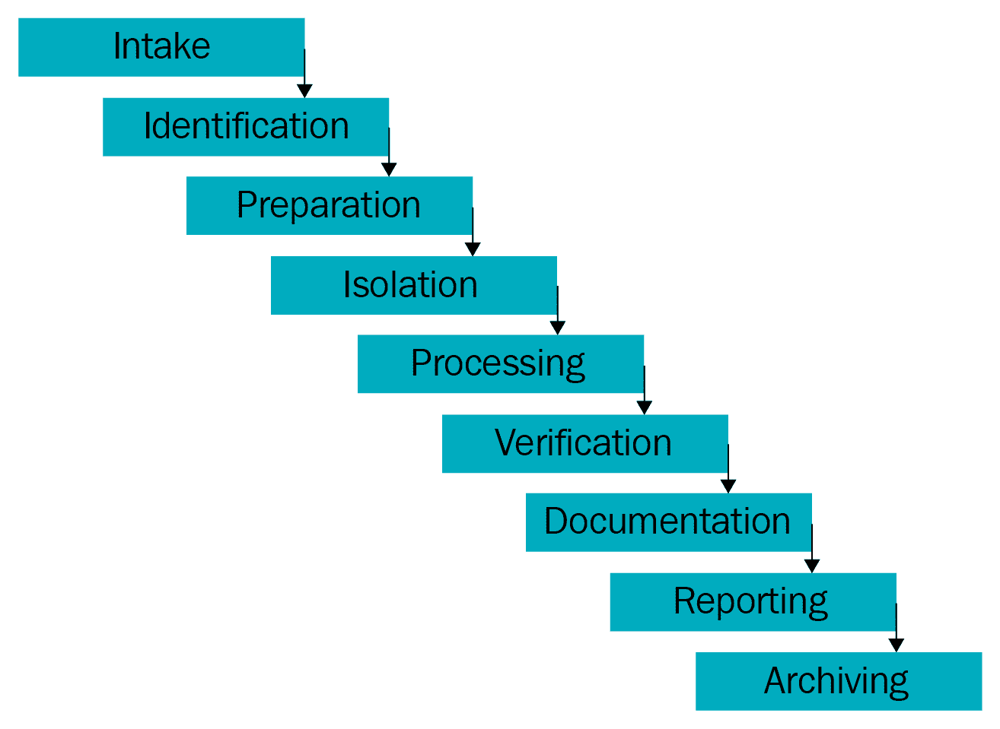
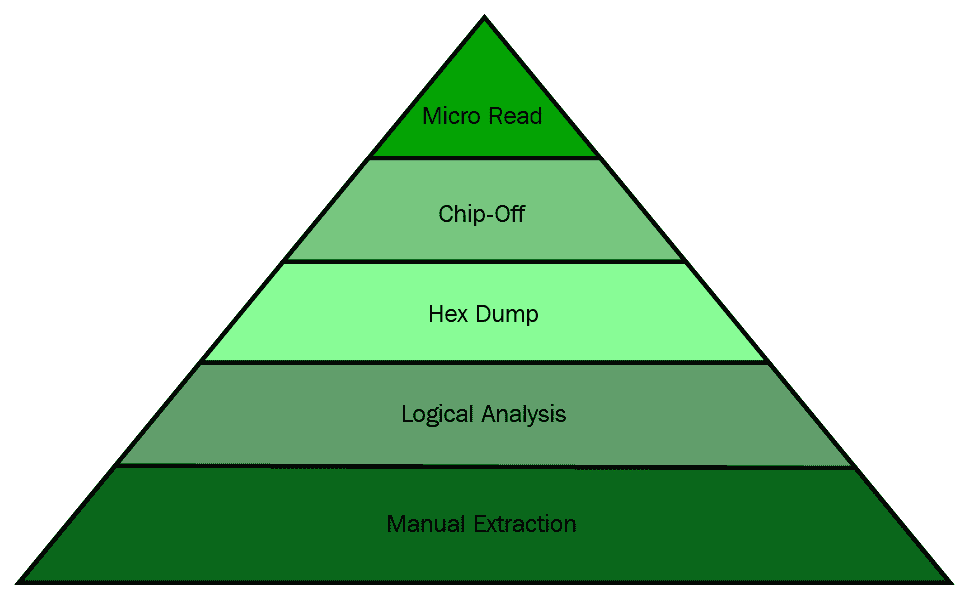

# 移动取证简介

毫无疑问，移动设备已经成为我们生活的一部分，并彻底改变了我们开展大部分活动的方式。因此，移动设备现在是一个巨大的存储库，保存着关于其所有者的敏感和个人信息。这反过来导致了移动设备取证的兴起，移动设备取证是数字取证的一个分支，处理从移动设备检索数据。这本书将帮助你理解三个主要平台上的取证技术——安卓、iOS 和 Windows。我们将通过各种方法从不同的移动设备收集证据。

在本章中，我们将涵盖以下主题:

*   移动取证的需求
*   了解移动取证
*   移动取证面临的挑战
*   手机证据提取流程
*   实用的移动取证方法
*   储存在手机上的潜在证据
*   检查和分析
*   举证规则
*   良好的法医实践

# 移动取证的需求

据 Statista 报道([statista.com](http://www.statista.com))预计到 2020 年全球手机用户数量将突破 50 亿。世界正在见证技术和用户从台式机向手机的迁移。移动市场的大部分增长可以归因于对智能手机的持续需求。

根据爱立信的一份报告，到 2022 年，全球移动数据流量将从 2017 年的 8.8 艾字节达到每月 71 艾字节，复合年增长率为 42%。如今的智能手机，如苹果的 iPhone 和三星的 Galaxy 系列，都是紧凑型电脑，具有高性能、巨大的存储空间和增强的功能。移动电话是用户访问的最个人化的电子设备。它们用于执行简单的通信任务，如打电话和发短信，同时仍然支持互联网浏览、发送电子邮件、拍摄照片和视频、创建和存储文档、使用全球定位系统服务识别位置以及管理业务任务。

随着新的功能和应用被整合到移动电话中，存储在设备上的信息量不断增长。

手机已经成为便携式数据载体，记录你的所有行动。随着移动电话在人们日常生活和犯罪中的日益普及，从电话中获取的数据已成为刑事、民事甚至高知名度案件调查的宝贵证据来源。很少进行不包括电话的数字取证调查。移动设备通话记录和全球定位系统数据被用来帮助解决 2010 年纽约时代广场的爆炸未遂事件。

The details of the case can be found at [https://www.forensicon.com/forensics-blotter/cell-phone-email-forensics-investigation-cracks-nyc-times-square-car-bombing-case/](https://www.forensicon.com/forensics-blotter/cell-phone-email-forensics-investigation-cracks-nyc-times-square-car-bombing-case/).

从手机中恢复数字证据背后的科学被称为移动取证，我们将在下一节对此进行研究。数字证据是指存储在用于调查的电子设备上、由其接收或传输的信息和数据。数字证据包括任何和所有可以在案件中用作证据的数字数据。

# 了解移动取证

数字取证是法医学的一个分支，侧重于恢复和调查电子或数字设备中的原始数据。该过程的目标是从数字设备中提取和恢复任何信息，而不改变设备上存在的数据。多年来，数字取证随着计算机和各种其他数字设备的快速增长而发展。根据涉及的数字设备类型，数字取证有各种分支，例如计算机取证、网络取证和移动取证。

移动取证是数字取证的一个分支，处理从移动设备获取和恢复证据。法医健全是数字取证社区中广泛使用的一个术语，用于鉴定和证明特定取证技术或方法的使用。推动健全的法医检验的核心原则之一是原始证据不得以任何形式被篡改。这对于移动设备来说非常困难。一些取证工具需要移动设备的通信向量，因此标准写保护在取证过程中不起作用。

其他取证方法可能涉及在提取数据进行取证检查之前，在移动设备上分离芯片或安装定制引导加载程序。如果在不改变设备配置的情况下无法进行检查或数据采集，则必须仔细测试程序和变化，并记录在案以备日后参考。在检查移动设备时，遵循适当的方法和指南至关重要，因为这样做可以产生最有价值的数据。与任何证据收集一样，在审查过程中不遵循适当的程序可能会导致证据的丢失或损坏，或者使证据在法庭上不可接受。

移动取证流程分为三个主要类别— *扣押*、*收购*和*检查/分析*。法医在将移动设备作为证据来源时面临一些挑战。在犯罪现场，如果发现移动设备关闭，作为检查人员的您应该将设备放在法拉第袋中，以防设备自动通电时发生变化。法拉第袋是专门为将手机与网络隔离而设计的。

如果发现手机开机，关机会带来很多问题。如果手机被个人识别码或密码锁定或加密，您将需要绕过锁定或确定个人识别码来访问设备。移动电话是联网设备，可以通过不同的来源发送和接收数据，例如电信系统、无线接入点和蓝牙。因此，如果手机处于运行状态，罪犯可以通过执行远程擦除命令来安全地擦除手机上存储的数据。手机开机时，应该放在法拉第袋里。如果可能，在将移动设备放入法拉第袋之前，您应该将其与网络断开，以通过启用飞行模式和禁用所有网络连接(无线网络、全球定位系统、热点等)来保护证据。这也将保护电池，电池在法拉第袋中时会耗尽，并防止法拉第袋中的泄漏。一旦移动设备被正确扣押，审查员可能需要几个取证工具来获取和分析存储在手机上的数据。

可以使用多种方法执行移动设备取证采集，这将在后面定义。这些方法中的每一种都会影响所需的分析量，这将在后面的章节中详细讨论。如果一种方法失败了，就必须尝试另一种方法。为了从移动设备获取最大量的数据，可能需要多次尝试和使用多种工具。

手机是一个动态系统，在提取和分析数字证据方面给我们带来了很多挑战。来自不同制造商的不同种类的移动电话数量的快速增加使得难以开发单一的过程或工具来检查所有类型的设备。随着现有技术的进步和新技术的引入，手机也在不断发展。此外，每个手机都设计有各种嵌入式操作系统。因此，需要法医专家的特殊知识和技能来获取和分析这些设备。

# 移动取证面临的挑战

说到移动平台，最大的取证挑战之一是数据可以跨多个设备访问、存储和同步。由于数据是不稳定的，并且可以远程快速转换或删除，因此需要付出更多的努力来保存这些数据。移动取证不同于计算机取证，对法医检验人员提出了独特的挑战。

执法人员和法医通常很难从移动设备上获取数字证据。以下是一些原因:

*   **硬件差异**:市场上充斥着不同厂商不同型号的手机。法医可能会遇到不同类型的移动模型，它们在大小、硬件、功能和操作系统上有所不同。此外，由于产品开发周期短，新模式出现得非常频繁。随着移动环境的日新月异，您必须适应所有挑战，并在各种设备上保持移动设备取证技术的更新。
*   **移动操作系统**:与个人电脑不同的是，在个人电脑领域，Windows 多年来一直占据市场主导地位，移动设备广泛使用更多的操作系统，包括苹果的 iOS、谷歌的 Android、RIM 的黑莓 OS、微软的 Windows Phone OS、惠普的 webOS 等众多操作系统。即使在这些操作系统中，也有几个版本，这使得您的任务更加困难。
*   **移动平台安全功能**:现代移动平台内置安全功能，保护用户数据和隐私。这些特征在法医采集和检查过程中是一个障碍。例如，现代移动设备从硬件层到软件层都有默认加密机制。您可能需要突破这些加密机制来从设备中提取数据。美国联邦调查局(FBI)与苹果公司(Apple)的加密纠纷是这方面的一个分水岭时刻，苹果公司的安全实施阻止了 FBI 闯入在圣贝纳迪诺(San Bernardino)案中从攻击者手中缴获的一部 iPhone。
*   **防止数据修改**:取证的一个基本规则就是确保设备上的数据不被修改。换句话说，从设备中提取数据的任何尝试都不应改变该设备上存在的数据。但是这在手机上实际上是不可能的，因为仅仅打开一个设备就可以改变该设备上的数据。即使设备看起来处于关闭状态，后台进程仍可能运行。例如，在大多数手机中，即使手机关机，闹钟仍然可以工作。从一种状态到另一种状态的突然转换可能会导致数据丢失或修改。
*   **反取证技术**:数据隐藏、数据混淆、数据伪造、安全擦除等反取证技术，使得对数字媒体的调查更加困难。
*   **密码恢复**:如果设备有密码保护，法医需要在不损坏设备上数据的情况下获取设备的访问权限。虽然有一些绕过屏幕锁定的技术，但它们可能并不总是适用于所有版本的操作系统。
*   **资源匮乏**:如前所述，随着手机数量的不断增加，一个法医所需的工具数量也随之增加。为了获取这些设备，必须维护取证附件，例如不同手机的 USB 电缆、电池和充电器。
*   **证据的动态性**:数字证据很容易被有意无意地篡改。例如，浏览手机上的应用程序可能会改变该应用程序存储在设备上的数据。
*   **意外重置**:手机提供了重置一切的功能。检查设备时意外重置设备可能会导致数据丢失。
*   **设备更改**:更改设备的可能方式包括从移动应用程序数据或重命名文件到修改制造商的操作系统。在这种情况下，应该考虑嫌疑人的专业知识。
*   **通信屏蔽**:移动设备通过蜂窝网络、Wi-Fi 网络、蓝牙和红外线进行通信。由于设备通信可能会改变设备数据，因此在没收设备后，应消除进一步通信的可能性。
*   **工具缺乏可用性**:移动设备种类繁多。需要使用工具的组合，因为单个工具可能不支持所有设备或执行所有必要的功能。因此，为特定的手机选择合适的工具可能很困难。
*   **恶意程序**:设备可能包含恶意软件或恶意软件，如病毒或木马。这些程序可能试图通过有线接口或无线接口在其他设备上传播。
*   **法律问题**:移动设备可能涉及跨越地理边界的犯罪。为了解决这些多辖区问题，法医应该熟悉犯罪的性质和地区法律。

下一节我们来看看证据提取的过程。

# 手机证据提取流程

不同移动设备的证据提取和取证检查可能会因各种因素而有所不同。然而，遵循一致的检查流程将有助于法医检验人员确保从每个电话收集的证据都有很好的记录，并且结果是可靠的。移动取证没有完善的标准流程。

但是，下图概述了从移动设备中提取证据的过程注意事项。从移动设备中提取数据时使用的所有方法都应经过测试、验证和良好记录:

Mobile phone evidence extraction process A great resource for handling and processing mobile devices can be found at [http://digital-forensics.sans.org/media/mobile-device-fo](http://digital-forensics.sans.org/media/mobile-device-forensic-process-v3.pdf)[rensic-process-v3.pdf](http://digital-forensics.sans.org/media/mobile-device-forensic-process-v3.pdf).

如上图所示，移动设备上的取证包括几个阶段，从证据获取阶段到归档阶段。以下各节概述了所有阶段的各种注意事项。

# 证据收集阶段

证据收集阶段是开始阶段，包括获取所有权信息和移动设备涉及的事故类型的文书工作，并概述请求者正在寻找的数据类型。为每个考试制定具体的目标是这个阶段的关键部分。这有助于明确你的目标。在身体扣押程序开始之前，你应该熟悉联邦、州和地方有关个人权利的法律。如果没有遵循正确的程序，调查可能在法庭上被视为非法。程序和合法性可能因您是政府代理人还是私人当事人而异。例如，在美国，**第四修正案**的权利防止政府代理人在没有适当搜查令的情况下进行任何搜查或扣押。搜查令应明确授权扣押移动设备以及需要收集的数据类型。成功扣押后，应注意确保不仅为设备而且为收集的数据建立监管链。

According to NIST ([https://csrc.nist.gov/](https://csrc.nist.gov/)), chain of custody refers to a process that tracks the movement of evidence through its collection, safeguarding, and analysis life cycle by documenting each person who handled the evidence, the date/time it was collected or transferred, and the purpose of the transfer.

此外，在抓住设备时，应注意不要修改设备上的任何数据。同时，任何有助于调查的机会都不应错过。例如，在没收设备时，如果设备未锁定，则尝试禁用密码。

# 识别阶段

法医应在每次检查移动设备时确定以下细节:

*   法律权威
*   需要提取的数据
*   设备的品牌、型号和识别信息
*   数据存储媒体
*   潜在证据的其他来源

我们将在下面的章节中讨论其中的每一个。

# 法律权威

对于法医来说，重要的是确定和记录设备的获取和检查的法律授权，以及在检查设备之前对介质的任何限制。例如，如果对设备的调查是基于授权令进行的，则搜索应仅限于授权令中定义的区域。简而言之，在设备扣押之前，您需要回答以下问题:

*   如果不存在搜查令，设备所有者是否同意搜查？
*   如果存在搜查令，该设备是否包含在原始搜查令中？
*   如果设备包含在许可证中，它是否也定义了可以收集哪些数据？
*   如果是公司调查，设备是个人所有还是他或她的雇主所有？
*   公司政策允许收集和后续分析吗？

# 需要提取的数据

您将根据请求的数据确定检查需要有多深入。考试的目标在选择检查手机的工具和技术方面有很大的不同，并提高了考试过程的效率。

# 设备的品牌、型号和识别信息

作为检查的一部分，识别手机的品牌和型号有助于确定哪些工具可以与手机配合使用。如果可用，建议捕获被扣押设备的以下详细信息:

*   设备制造商
*   设备型号
*   移动设备序列号
*   设备的颜色
*   设备屏幕上可见的壁纸或锁屏壁纸
*   任何硬件组件(如前置摄像头、耳机插孔等)的存在
*   设备特有的任何特定细节的描述(划痕、碎屏等)

接下来，让我们看看数据存储介质。

# 数据存储媒体

许多移动电话提供了使用可移动存储设备扩展内存的选项。如果在提交检查的移动电话中发现此类可移动介质，应移除存储卡，并使用传统的数字取证技术进行处理。明智的做法是在移动设备中获取卡，以确保手机内存和卡上存储的数据链接在一起，以便于分析。这将在接下来的章节中详细讨论。

# 潜在证据的其他来源

手机是指纹和其他生物证据的良好来源。此类证据应在检查手机之前收集，以避免污染问题，除非收集方法会损坏设备。审查人员在处理证据时应该戴手套。

# 准备阶段

一旦确定了移动电话型号，准备阶段就包括研究要检查的特定移动电话以及用于获取和检查的适当方法和工具。这通常是基于设备型号、底层操作系统及其版本等来完成的。此外，检查过程中需要使用的工具必须根据所讨论的设备以及检查的范围和目标来确定。

# 隔离阶段

根据设计，移动电话旨在通过蜂窝电话网络、蓝牙、红外和无线网络功能进行通信。当电话连接到网络时，新数据会通过来电、消息和应用程序数据添加到电话中，从而修改电话上的证据。

通过远程访问或远程擦除命令也可以完全销毁数据。因此，在采集和检查设备之前，将设备与通信源隔离非常重要。网络隔离可以通过将手机放在射频屏蔽布中，然后将手机置于飞机或飞行模式来实现。飞机模式禁用设备的通信信道，如蜂窝无线电、无线网络和蓝牙。但是，如果设备被屏幕锁定，则这是不可能的。此外，由于无线网络现在在飞机上可用，一些设备现在在飞机模式下启用了无线网络接入。

另一种解决方案是通过使用法拉第袋来隔离手机，法拉第袋可以阻挡进出手机的无线电信号。法拉第袋包含阻挡外部静电场(包括无线电波)的材料。因此，法拉第袋保护被扣押的移动设备免受外部干扰，以防止擦拭和跟踪。为了更方便地使用缴获的设备，法拉第帐篷和房间也存在。

# 加工阶段

一旦手机与通信网络隔离，手机的实际处理就开始了。在这个阶段，您将面临的挑战之一是确定使用哪些工具，因为这受到价格、易用性、适用性等各种因素的影响。移动取证软件非常昂贵，与计算机取证不同，您有时可能不得不使用多种工具来访问数据。选择工具时，请确保工具具有内置功能，以保持取证的完整性。维护取证完整性需要一个工具，该工具以一种可能不容易修改或更改的格式打包收集的数据。

应该使用经过测试的方法来获取手机，该方法是可重复的，并且是尽可能可靠的。物理采集是首选方法，因为它提取原始内存数据，并且设备通常在采集过程中关闭。在大多数设备上，设备在物理采集过程中发生的变化最少。如果物理获取不可能或失败，则应尝试获取移动设备的文件系统。应该始终执行逻辑采集，因为它可能只包含解析的数据，并提供指针来检查原始内存映像。这些获取方法将在后面的章节中详细讨论。

# 验证阶段

处理完电话后，您需要验证从电话中提取的数据的准确性，以确保数据没有被修改。提取数据的验证可以通过几种方式完成:

*   **将提取的数据与手机数据**进行比较:如果适用，检查从设备提取的数据是否与设备显示的数据匹配。提取的数据可以与设备本身或逻辑报告上的数据进行比较，以较佳者为准。请记住，处理原始设备可能会改变唯一的证据——设备本身。
*   **使用多种工具对比结果**:为了保证准确性，使用多种工具提取数据，对比结果。

*   **使用哈希值:**采集后应对所有图像文件进行哈希处理，确保数据保持不变。如果支持文件系统提取，您可以提取文件系统，然后为提取的文件计算哈希。稍后，将计算任何单独提取的文件哈希，并与原始值进行核对，以验证其完整性。哈希值中的任何差异都必须是可解释的(例如，设备通电，然后再次获取，因此哈希值不同)。

# 记录和报告阶段

要求法医在整个检查过程中记录与采集和检查期间所做工作相关的一切。一旦完成调查，结果必须经过某种形式的同行评审，以确保数据得到检查，调查完成。您的笔记和文档可能包含以下信息:

*   考试开始日期和时间
*   手机的物理状况
*   手机和单个组件的照片
*   收到电话时的状态—打开或关闭
*   手机品牌和型号
*   用于收购的工具
*   用于检查的工具
*   检查中发现的数据
*   同行评议笔记

在整个调查过程中，确保从移动设备中提取和记录的信息能够清晰地呈现给任何其他审查员或法院是非常重要的。文档是你最重要的技能之一。为采集和分析期间从移动设备提取的数据创建取证报告非常重要。这可能包括纸质和电子格式的数据。

你的发现必须被记录下来，并以一种意味着证据在法庭上不言自明的方式呈现出来。调查结果应该清晰、简洁、可重复。时间轴和链接分析是许多商业移动取证工具提供的功能，将有助于跨多个移动设备报告和解释调查结果。这些工具允许您将多种设备通信背后的方法联系在一起。

# 存档阶段

保存从手机中提取的数据是整个过程的重要组成部分。同样重要的是，数据必须以可用的格式保留，以供正在进行的法庭程序使用，以便将来在当前证据文件损坏时参考，并满足保存记录的要求。法院案件可能会持续很多年才能做出最终判决，大多数司法管辖区都要求为上诉目的长时间保留数据。随着领域和方法的发展，从原始物理图像中提取数据的新方法可能会出现，然后您可以通过从档案中提取副本来重新访问数据。

现在我们已经了解了证据提取过程是如何工作的，我们将研究实际移动取证中的不同方法。

# 实用的移动取证方法

与任何法医调查类似，有几种方法可用于从移动电话获取和检查/分析数据。移动设备的类型、操作系统和安全设置通常决定取证过程中要遵循的程序。每一项调查都有其独特的情况，因此不可能为所有案件设计一个单一的明确的程序方法。以下详细介绍了从移动设备中提取数据的一般方法。

# 了解移动操作系统

移动电话的数据采集和检查/分析的主要因素之一是操作系统。从低端手机到智能手机，移动操作系统已经走了很长一段路，有很多功能。移动操作系统直接影响您访问移动设备的方式。例如，安卓系统提供终端级访问，而 iOS 系统不提供这种选项。

对移动平台的全面了解有助于法医做出合理的法医决定，并进行结论性调查。虽然智能移动设备种类繁多，但随着黑莓的消亡，目前有两种主要的操作系统主导着市场，即谷歌安卓和苹果 iOS(紧随其后的是 Windows Phone，位居第三)。更多信息可以在[https://www.idc.com/promo/smartphone-market-share/os](https://www.idc.com/promo/smartphone-market-share/os)找到。这本书涵盖了这三个移动平台的取证分析。我们将简要概述领先的移动操作系统。

# 机器人

安卓是一个基于 Linux 的操作系统，是一个谷歌的手机开源平台。安卓是世界上使用最广泛的智能手机操作系统。有消息显示，苹果 iOS 排名第二([https://www.idc.com/promo/smartphone-market-share/os](https://www.idc.com/promo/smartphone-market-share/os))。安卓是由谷歌开发的，作为硬件制造商和电话运营商的一个开放和免费的选择。这使得安卓成为那些需要为智能设备提供低成本、可定制、轻量级操作系统而无需从头开发新操作系统的公司的首选软件。

安卓的开放性进一步鼓励了开发者构建大量的应用程序，并上传到谷歌 Play 上。后来，终端用户可以从安卓市场下载应用程序，这使得安卓成为一个强大的操作系统。据估计，在撰写本书时，谷歌 Play 商店有 330 万个应用程序。关于安卓的更多细节将在[第 7 章](07.html)、*了解安卓*中介绍。

# ios

iOS，原名 iPhone 操作系统，是苹果公司独家开发和发行的移动操作系统，iOS 正在演变为适用于 iPad、iPod Touch 和 iPhone 等所有苹果移动设备的通用操作系统。iOS 源自 macOS，因此基于类似 Unix 的操作系统。iOS 管理设备硬件。iOS 还提供了实现本机应用程序所需的技术。它还附带了各种系统应用程序，如 Mail 和 Safari，为用户提供标准的系统服务。iOS 原生应用程序通过 App Store 分发，该应用程序由苹果密切监控。关于 iOS 的更多细节将在[第 2 章](02.html)、*了解 iOS 设备的内部结构*中介绍。

# windows 手机

Windows Phone 是微软为智能手机和掌上电脑开发的专有移动操作系统。它是 Windows Mobile 的继承者，主要面向消费市场，而不是企业市场。Windows Phone 操作系统类似于 Windows 桌面操作系统，但它是针对存储容量较小的设备进行优化的。Windows Phone 基础知识和取证技术在[第 12 章](12.html)、 *Windows Phone 取证*中讨论。

# 移动取证工具调平系统

移动电话取证和分析涉及手动工作和自动化工具的使用。有多种工具可用于执行移动取证。所有的工具都有它们的优点和缺点，最基本的是你要明白没有一个工具足以满足所有的目的。因此，了解各种类型的移动取证工具对于法医鉴定人员来说非常重要。

在为手机取证和分析确定合适的工具时，Sam Brothers 开发的移动设备取证工具分类系统(如下图所示)对审查员来说非常方便:

Cellular phone tool leveling pyramid (Sam Brothers, 2009)

移动设备取证工具分类系统的目的是使检查者能够基于工具的检查方法对取证工具进行分类。随着您从金字塔的底部移动到顶部，用于分析的方法和工具通常会变得更加技术化和复杂，并且需要更长的分析时间。每一层使用的技术各有优缺点。法医在应用特定技术之前应该意识到这些问题。如果给定的方法或工具使用不当，证据可能会被完全销毁。当你在金字塔中向上移动时，这种风险会增加。因此，需要适当的训练来获得从移动设备提取数据的最高成功率。

每个现有的移动取证工具都可以分为五个级别中的一个或多个级别。以下各节包含对每个级别的详细描述。

# 用手取胎术

手动提取方法包括简单地滚动设备上的数据，并通过使用设备的键盘或触摸屏直接在手机上查看数据。发现的信息随后被拍照记录下来。提取过程快速易用，几乎可以在每部手机上使用。这种方法容易出现人为错误，例如由于不熟悉界面而丢失某些数据。在这个级别上，不可能恢复已删除的信息并获取所有数据。

有一些工具，如项目电话，已经被开发来帮助审查员容易地记录手动提取。然而，这也可能导致数据的修改。例如，查看未读短信会将其标记为已读。

# 逻辑分析

逻辑分析包括通过 USB 电缆、RJ-45 电缆、红外线或蓝牙将移动设备连接到取证硬件或取证工作站。一旦连接，计算机启动一个命令并将其发送到设备，然后由设备的处理器进行解释。接下来，从设备的存储器接收所请求的数据，并将其发送回取证工作站。稍后，您可以查看数据。

目前可用的大多数取证工具都在分类系统的这个级别上工作。提取过程快速且易于使用，对您几乎不需要培训。另一方面，该过程可能会将数据写入手机，并可能会改变证据的完整性。此外，删除的数据通常无法通过此过程访问。

# 十六进制转储

十六进制转储，也称为物理提取，是通过将设备连接到取证工作站，并将未签名的代码或引导加载程序推入电话，并指示电话将内存从电话转储到计算机来实现的。由于生成的原始图像是二进制格式，因此需要技术专业知识来分析它。该过程成本低廉，为检查人员提供了更多数据，并允许从设备中恢复已删除的文件-大多数设备上的未分配空间。

# 削去

片外是指直接从器件内存芯片获取数据。在这一级，芯片被物理地从设备中移除，并且芯片读取器或第二部电话被用来提取存储在其上的数据。这种方法在技术上更具挑战性，因为手机中使用了多种芯片类型。这个过程是昂贵的，需要硬件水平的知识，因为它涉及到记忆芯片的脱焊和加热。需要训练来成功地进行切屑提取。不正确的程序可能会损坏内存芯片，并使所有数据无法保存。如果可能，建议在切屑之前尝试其他级别的提取，因为这种方法本质上是破坏性的。此外，从内存中出来的信息是原始格式的，必须进行解析、解码和解释。在重要的情况下，最好使用片外方法来保持器件上的存储器状态。当设备损坏但存储芯片完好无损时，这也是唯一的选择。

设备上的芯片经常使用**联合测试行动组** ( **JTAG** )方法读取。JTAG 方法包括连接到设备上的**测试访问端口** ( **TAPs** )并强制处理器传输存储在存储芯片上的原始数据。JTAG 方法通常用于使用标准工具操作但无法访问的设备。这两种技术即使在设备被屏幕锁定时也能工作。

# 微读

微读取过程包括手动查看和解释存储芯片上的数据。检查人员使用电子显微镜，分析芯片上的物理门，然后将门状态转换为 0 和 1，以确定最终的 ASCII 字符。整个过程既费时又费钱，而且需要大量的内存和文件系统方面的知识和培训。由于微读取涉及极端的技术细节，只有在所有其他级别的提取技术都用尽后，才尝试对相当于国家安全危机的高知名度案例进行微读取。这个过程很少执行，目前也没有很好的记录。此外，目前没有可用于执行微读取的商业工具。

# 数据采集方法

数据采集是从数字设备和其他附加介质中成像或提取信息的过程。从手机获取数据并不像标准的硬盘取证那么简单。以下几点将手机取证方法分为三种:物理取证、逻辑取证和手动取证。这些方法可能与移动取证工具平衡系统中讨论的几个级别有一些重叠。可以收集的数据的数量和类型将根据所使用的采集方法的类型而有所不同。虽然我们在接下来的章节中详细介绍了这些方法，但以下是对它们的简要描述。

# 物理采集

移动设备的物理获取只不过是物理存储的逐位拷贝。通过直接访问闪存，可以通过物理提取从设备获取信息。闪存是非易失性存储器，主要用于存储卡和 u 盘作为固态存储。这个过程创建了整个文件系统的逐位拷贝，类似于计算机取证调查中采用的方法。物理采集能够采集设备上存在的所有数据，包括已删除的数据，以及对大多数设备上未分配空间的访问。

# 逻辑获取

逻辑获取是关于提取驻留在文件系统上的逻辑存储对象，如文件和目录。移动电话的逻辑获取是使用设备制造商的应用程序编程接口来执行的，以便将电话的内容与计算机同步。许多取证工具可以执行逻辑采集。对于取证工具来说，组织和呈现通过逻辑采集提取的数据要容易得多。但是，法医分析师必须了解收购是如何发生的，以及在此过程中手机是否有任何修改。根据使用的电话和取证工具，可以获取全部或部分数据。逻辑获取易于执行，仅恢复手机上的文件，不恢复未分配空间中包含的数据。

# 人工采集

对于手机来说，物理采集通常是最好的选择，逻辑采集是第二好的选择。手动提取应该是执行手机取证时的最后选择。逻辑和手动采集都可以用来验证物理数据中的发现。在手动采集过程中，检查人员利用用户界面调查手机内存的内容。该设备通常通过键盘或触摸屏和菜单导航来使用，检查人员会对每个屏幕的内容进行拍照。手动提取以人为错误的形式引入了更大程度的风险，并且有机会删除证据。手动采集操作简单，只采集手机上出现的数据。

接下来，我们来看看可以从手机中提取的信息量。

# 储存在手机上的潜在证据

本节详细介绍了可以从移动电话获得的信息范围。手机上的数据可以在许多地方找到，例如 SIM 卡、外部存储卡和手机内存。此外，服务提供商还存储通信相关信息。这本书主要关注从手机内存中获取的数据。移动设备数据提取工具从手机内存中恢复数据。尽管取证过程中恢复的数据取决于移动模型，但一般来说，以下数据在所有模型中都很常见，可用作证据。请注意，以下大多数工件都包含时间戳:

*   **通讯录**:里面有联系人姓名、电话号码、邮箱地址等等。
*   **通话记录**:包含已拨、已接和未接电话以及通话时长。
*   **短信**:包含发送和接收的短信。
*   **彩信**:包含收发照片、视频等媒体文件。
*   **电子邮件**:包含发送、起草和接收的电子邮件。
*   **网页浏览器历史记录**:这里包含了已经访问过的网站的历史记录。
*   **照片**:包含使用手机摄像头拍摄的图片、从互联网下载的图片以及从其他设备传输的图片。
*   **视频**:包含使用手机摄像头拍摄的视频、从互联网下载的视频以及从其他设备传输的视频。
*   **音乐**:包含从互联网下载的音乐文件和从其他设备传输的音乐文件。
*   **文档**:包含使用设备应用程序创建的文档、从互联网下载的文档和从其他设备传输的文档。
*   **日历**:包含日历条目和约会。
*   **网络通讯**:这里包含 GPS 位置。
*   **地图**:包含用户访问过的地方，查询过的方向，搜索下载过的地图。
*   **社交网络数据**:这包含了脸书、推特、领英、谷歌+、WhatsApp 等应用存储的数据。
*   **删除的数据**:包含从手机中删除的信息。

接下来，我们将快速了解调查的最后一步:检查和分析。

# 检查和分析

这是调查的最后一步，目的是发现设备上存在的数据。检查是通过应用久经考验的科学方法来最终确定结果。分析阶段的重点是将相关数据与其他数据分开，并探索对基础案例有价值的数据。检查过程从使用前面描述的一些技术获得的证据的副本开始，这将在后面的章节中详细介绍。使用第三方工具的检查和分析通常通过将设备的内存转储导入移动取证工具来执行，该工具将自动检索结果。理解案例对于有针对性地分析数据也至关重要。例如，一个关于儿童色情的案例可能需要关注设备上的所有图像，而不是看其他的人工制品。

重要的是，你要对用于检查的法医工具的工作原理有一个公平的了解。熟练使用工具中可用的功能和选项将大大加快考试过程。有时，由于软件中的编程缺陷，工具可能无法识别位或将位转换为您可以理解的格式。因此，至关重要的是你要有必要的技能来识别这种情况，并使用替代工具或软件来构建结果。在某些情况下，个人可能会故意篡改设备信息或删除/隐藏一些关键数据。法医分析师应该了解他们工具的局限性，有时会对它们进行补偿，以获得尽可能好的结果。

# 举证规则

法庭越来越依赖手机里的信息作为重要证据。法庭上的主要证据需要对证据规则有很好的理解。移动取证是一门相对较新的学科，规定证据有效性的法律并不广为人知，而且它们也因国家而异。但是，有五个适用于数字取证的一般证据规则，需要遵循这些规则才能使证据有用。无视这些规则会使证据不可接受，你的案子可能会被驳回。这五条规则分别是**允许**、**真实**、**完整**、**可靠**、**可信**:

*   **可采**:这是最基本的规则，也是衡量证据有效性和重要性的标准。证据必须以能够在法庭或其他地方使用的方式保存和收集。可能会出现许多错误，导致法官裁定一项证据不可采信。例如，使用非法方法收集的证据通常被裁定为不可接受。
*   **真实**:证据必须以相关的方式与事件联系起来，才能证明什么。法医必须对证据的来源负责。
*   **完整**:出示证据时，一定要清晰完整，要反映事情的全貌。仅仅从一个角度收集事件的证据是不够的。出示不完整的证据比根本不提供任何证据更危险，因为这可能导致不同的判断。
*   **可靠**:从装置上采集的证据必须可靠。这取决于使用的工具和方法。使用的技术和收集的证据不得对证据的真实性产生怀疑。如果你使用了一些无法复制的技术，除非考虑证据的人，如法官和陪审团，被指示这样做，否则证据不会被考虑。这将包括可能的破坏性方法，如芯片脱落提取。
*   **可信**:法医必须能够清晰简洁地解释他们使用了哪些流程，以及如何保持证据的完整性。你提供的证据必须清晰，易于理解，并且陪审团相信。

现在让我们看看最佳实践。

# 良好的法医实践

良好的法医实践适用于证据的收集和保存。缺乏健全的法医实践甚至可能使收集的证据在法庭上毫无用处。证据的修改，无论是故意的还是偶然的，都会影响案件。因此，了解最佳实践对于法医鉴定人员至关重要。

# 保护证据

借助*查找我的 iPhone* 和远程擦拭等先进的智能手机功能，以无法远程擦拭的方式保护手机非常重要。此外，当手机开机并提供服务时，它会不断接收新数据。为了保护证据，使用正确的设备和技术将手机与所有网络隔离。通过隔离，手机将无法接收任何会导致活动数据被删除的新数据。根据具体情况，可能需要采用指纹匹配等其他取证技术来建立设备与其所有者之间的联系。如果没有以安全的方式处理设备，物理证据可能会被无意篡改，并可能变得无用。

收集现场存在的任何外围设备、相关介质、电缆、电源适配器和其他附件也很重要。在调查现场，如果发现该设备连接到个人电脑，直接拉动它将停止数据传输。相反，建议在拉动设备之前捕获个人计算机的内存，因为这在许多情况下包含重要的细节。

# 保存证据

在收集证据时，必须在法庭上可以接受的状态下保存。直接处理证据的原件可能会改变它。因此，一旦恢复了原始磁盘映像或文件，就创建一个只读主拷贝并复制它。为了使证据被接受，必须有一种科学方法来验证提交的证据与收集的原始证据完全相同。这可以通过创建图像的取证哈希值来实现。

A forensic hash is used to ensure the integrity of an acquisition by calculating a cryptographically strong and non-reversible value of the img/data.

复制原始磁盘映像或文件后，计算并验证原件和副本的哈希值，以确保证据的完整性得到维护。哈希值中的任何变化都应记录在案并可解释。所有进一步的处理或检查都应在证据副本上进行。使用该设备可能会改变手机上存储的信息。所以，只执行绝对必要的任务。

# 记录证据和变化

只要有可能，就应该创建所有可见数据的记录。建议将移动设备与找到的任何其他介质(如电缆、外围设备等)一起拍摄。如果以后出现关于环境的问题，这将很有帮助。拍摄移动设备时，请勿触摸或触摸它。确保您记录了用于收集和提取证据的所有方法和工具。详细记录你的笔记，这样另一个考官就可以复制它们。你的作品必须是可复制的；如果不是，法官可以裁定不予受理。记录整个恢复过程非常重要，包括采集和检查过程中所做的所有更改。例如，如果用于数据提取的取证工具对磁盘映像进行了切片以存储它，则必须对此进行记录。对移动设备的所有更改，包括电源重启和同步，都应记录在案例说明中。

# 报告

报告是作为检查的一部分，准备所采取的所有步骤和得出的结论的详细摘要的过程。报告应包括你所执行的所有重要行动的细节、收购的结果以及从结果中得出的任何推论。大多数取证工具都带有内置的报告功能，可以自动生成报告，同时提供自定义范围。通常，报告可能包含以下详细信息:

*   报告机构的详细信息
*   案例标识符
*   法医调查员
*   提交者的身份
*   证据接收日期
*   为检查而扣押的设备的详细信息，包括序列号、品牌和型号
*   考试中使用的设备和工具的详细信息
*   检查期间所采取步骤的描述
*   监管链文件
*   发现或发现的问题的详细信息
*   在检查期间恢复的证据，从聊天消息、浏览器历史记录、通话记录到删除的消息，等等
*   检查期间拍摄的任何图像
*   检查和分析信息
*   报告结论

# 摘要

现代移动设备存储了广泛的信息，如短信、通话记录、浏览器历史记录、聊天消息、位置详细信息等。因此，它们往往是几起刑事案件、事件重建、公司和法律案件等的关键因素。移动设备取证也有其自身的挑战和概念，超出了传统数字取证的范围。从证据获取阶段到存档阶段，在处理设备时应格外小心。负责移动设备的检查员必须了解不同的采集方法以及在分析过程中处理数据的复杂性。从移动设备中提取数据是成功的一半。操作系统、安全功能和智能手机类型将决定您对数据的访问权限。遵循合理的法医实践并确保证据在调查过程中保持不变非常重要。

下一章将提供对 iOS 取证的深入了解。您将了解文件系统布局、安全功能以及文件在 iOS 设备上的存储方式。