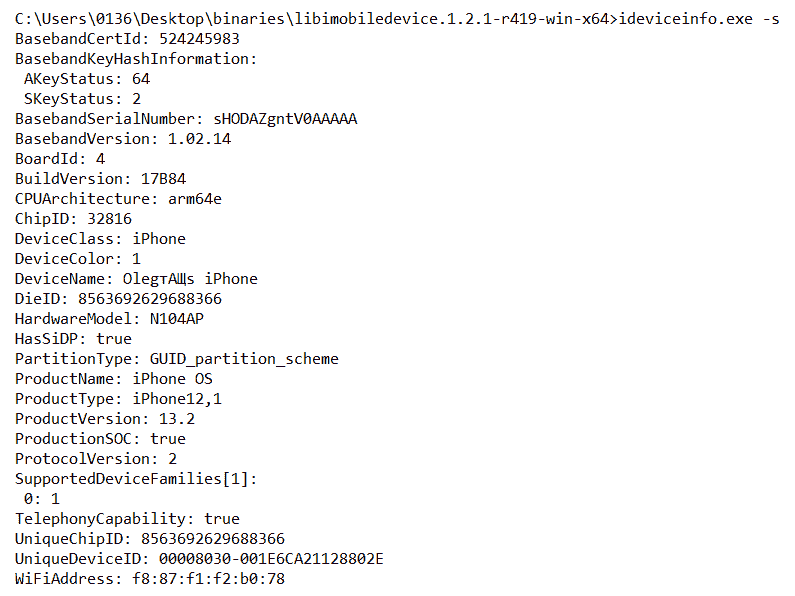
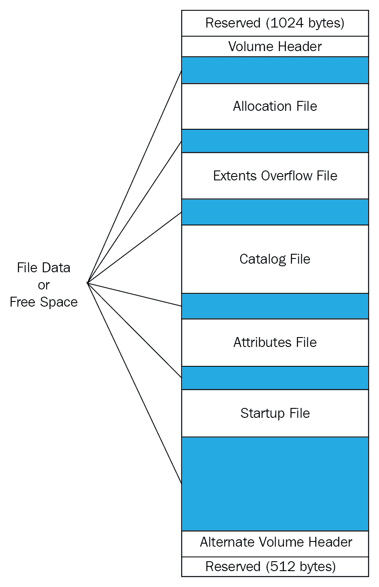
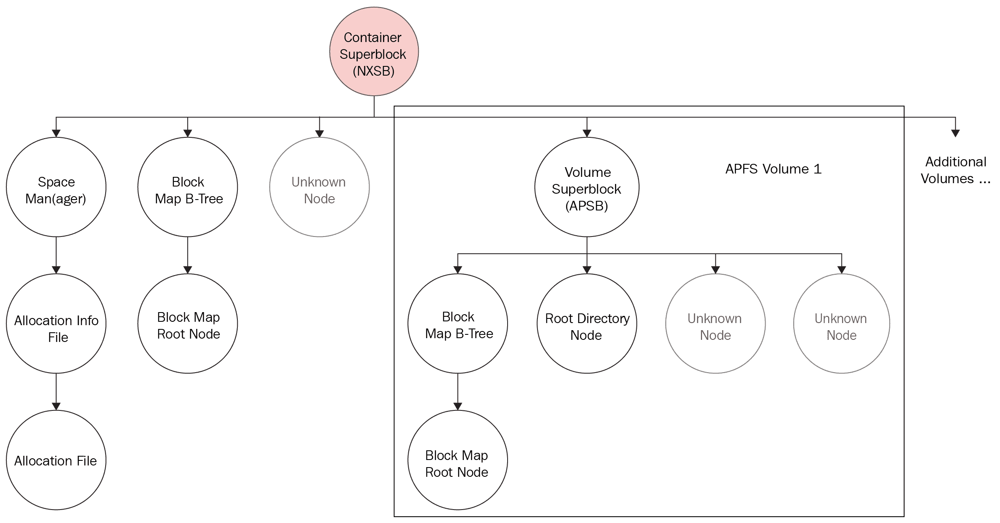
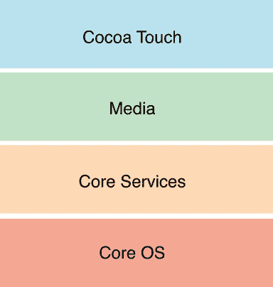
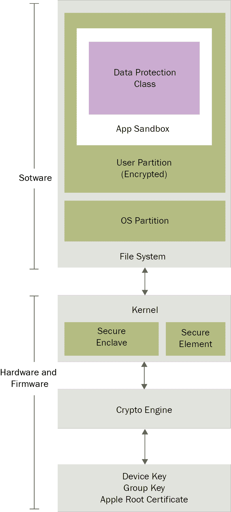

# 了解 iOS 设备的内部

根据苹果的数据，2019 年有 14 亿台活跃的苹果设备，其中 9 亿台运行在 iOS 上。虽然 iOS 是全球领先的平板电脑操作系统 ( **操作系统**)，但安卓仍然是领先的智能手机操作系统。不管统计数据如何，如果你是法医，你很可能需要对 iOS 设备进行检查。

为了对 iOS 设备进行法医检查，作为检查者，您必须了解该设备的内部组件和内部工作方式。了解移动设备的底层组件将有助于您理解取证过程中涉及的关键因素，包括可以获取哪些数据、数据存储在哪里以及可以使用什么方法从该设备访问数据。因此，在我们深入研究 iOS 设备之前，有必要了解现有的不同型号及其内部组件。在本书中，我们将对 iOS 设备进行取证和分析，包括 iPhone、iPad 和 Apple Watch。

本章的目标是向您介绍 iOS 设备技术。我们将涵盖可能经常被忽视的细节，但将在您的法医调查期间帮助您。在成功提取数据之前，您必须了解不同的 iOS 设备以及数据是如何存储在这些设备上的。

在本章中，我们将详细介绍以下主题:

*   iPhone 型号和硬件
*   iPad 型号和硬件
*   **分级文件系统**(**【HFS】**)Plus 和**苹果文件系统** ( **APFS** )文件系统
*   iPhone 操作系统

# iPhone 型号和硬件

iPhone 是市场上最受欢迎的智能手机之一。苹果在 2007 年 6 月发布了第一代 iPhone。自第一次发布以来，由于其许多开创性的功能和可用性，iPhone 变得非常受欢迎。iPhone 的推出从此重新定义了整个移动计算世界。消费者已经开始寻找更快、更高效的手机。现在有各种各样的 iPhone 型号，有不同的功能和存储能力来满足消费者的需求。

从第三版*实用移动取证发布的 iPhone——iPhone XR、XS、XS Max、11 和 11 Pro——在处理文件系统取证获取方法时可能具有挑战性。就像 iPhone 5 之后发布的设备一样，没有任何方法或工具可以从这些设备中物理恢复数据，除非它们被越狱。但是，如果 iPhone 解锁，可以获得逻辑获取。数据提取的采集方法可用，将在[第 3 章](03.html)、*从 iOS Devi* *ces* 采集数据，以及[第 4 章](04.html)、*从 iOS 备份*采集数据中讨论。现在，让我们学习如何识别正确的硬件型号。*

# 确定正确的硬件型号

在检查 iPhone 之前，有必要确定设备上安装的正确硬件型号和固件版本。了解 iPhone 的细节有助于你理解从 iPhone 获取证据的重要性和可能性。例如，在许多情况下，需要设备密码才能获得逻辑映像。根据 iOS 版本、设备型号和密码复杂性，使用暴力攻击获取设备密码是可能的。

有多种方法可以识别设备的硬件。识别某些设备硬件的最简单方法是观察设备背面显示的型号。为了使这项任务更加简单，您可以使用苹果的知识库文章。更多关于 iPhone 机型的信息可以在[https://support.apple.com/en-in/HT201296](https://support.apple.com/en-in/HT201296)找到。

通过访问设置选项，然后导航到常规|关于|软件版本，可以找到 iPhone 的固件版本，如下图所示。固件的目的是启用某些功能并协助设备的一般功能:


The iPhone About screen, displaying the software version 13.2

或者，可以使用`libimobiledevice`软件库中的`ideviceinfo`命令行工具([http://www.libimobiledevice.org/](http://www.libimobiledevice.org/))来识别 iPhone 型号及其 iOS 版本。

要在 Windows 10 工作站上获取 iPhone 型号及其 iOS 版本信息，请执行以下步骤:

1.  从以下链接下载最新的二进制文件:[https://dev . azure . com/libimobiledevice-win32/imobiledevice-net/_ build/results？buildId=419](https://dev.azure.com/libimobiledevice-win32/imobiledevice-net/_build/results?buildId=419) (点击工件|二进制文件开始下载)。
2.  根据您的工作站版本，使用 x86 或 x64 二进制文件解压缩归档文件。
3.  打开命令提示符，将目录更改为包含二进制文件的目录(使用`cd`命令)。
4.  使用**通用串行总线** ( **通用串行总线**)电缆将 iPhone 连接到您的工作站(对于最新的 iOS 版本，还需要密码)，并使用`-s`选项运行`ideviceinfo`命令，如下代码所示:

```
$ ideviceinfo -s
```

`ideviceinfo`命令的输出显示 iPhone 标识符、其内部名称和 iOS 版本，如下图截图所示:



The output from ideviceinfo displaying firmware version 13.2

其他一些工具，如 iExplorer，将提供对类似 iOS 设备信息的访问，如下图所示。恢复 iPhone 设备信息的方法也适用于 iPad 设备。这里，iExplorer 被用来从 iPhone 获取设备信息:


iExplorer displaying device info

iPhone 的每一个版本都有改进或新增加的功能。正如本章前面所述，了解 iPhone 的细节有助于你理解从它那里获取证据的重要性和可能性。您必须知道设备的型号，以确保正在部署的工具和方法支持特定的 iPhone。此外，必须确定 iPhone 的内部存储大小，以确保证据容器对于整个取证图像足够大。如果证据驱动器上没有足够的磁盘空间，大多数工具不会提醒您，直到空间用完。这将浪费时间，并迫使您再次获取该设备。最后，还必须注意设备的网络功能，以便您可以正确隔离设备，防止在检查期间远程访问或擦除。这将在[第 3 章](03.html)、*从 iOS 设备*获取数据中进一步讨论。

同样，对 iPhone 设备硬件的熟悉程度将有助于您在法庭调查期间确定如何处理该设备。某些型号强制实施全磁盘加密，而旧型号则没有。加密设备在获取过程中需要额外的步骤——如果访问是可能的话。在调查的获取和分析阶段，您必须准备好可能需要清除的所有障碍。除此之外，了解 iPhone 拥有的功能——以及初始和当前的 iOS 版本——会对您能够从设备中恢复的数据产生影响。苹果在 iOS 版本之间的数据存储位置并不一致。因此，您必须知道手机首次使用时安装的原始版本，以确保取证工具不会忽略可能有助于调查的数据。

更多关于识别 iPhone 机型的信息可以在[https://support.apple.com/en-us/HT201296](https://support.apple.com/en-us/HT201296)找到。

# 了解 iPhone 硬件

iPhone 是来自不同制造商的模块、芯片和电子元件的集合。由于 iPhone 的复杂性，硬件组件的列表非常广泛，应该对每台设备的内部组件进行研究。

比如 iPhone 11 有 A13 仿生处理器；64 GB、128 GB 或 256 GB 存储；4 GB 内存；6.1 英寸液晶视网膜**液晶显示屏** ( **液晶**)；和双镜头 12 MP 后置摄像头阵列。

所有 iPhones 的内部图片可以在[https://www.ifixit.com/Device/iPhone](https://www.ifixit.com/Device/iPhone)的拆解区找到。

# iPad 型号和硬件

苹果 iPhone 改变了手机的生产和使用方式。同样，2010 年 1 月推出的平板电脑的一个版本 iPad 也抑制了笔记本电脑的销售。有了 iPad，个人可以拍摄视频、拍照、播放音乐、阅读书籍、浏览互联网以及做更多事情。现在有各种各样的 iPad 型号——例如，iPad Air 3 和 iPad Pro——具有不同的功能和存储能力。更多关于识别 iPad 型号的信息可以在[https://support.apple.com/en-in/HT201471](https://support.apple.com/en-in/HT201471)找到。

与 iPhone 一样，并非所有版本的 iPad 都支持文件系统获取。此外，苹果改变了 iOS 版本中的数据存储位置，这也影响了 iPad 设备。您必须了解不同的型号、已发布和当前安装的 iOS 版本、存储能力、网络访问媒介等等。

# 了解 iPad 硬件

苹果 iOS 设备成功的关键因素之一是正确选择其硬件组件。和 iPhone 一样，iPad 也是不同厂商的模块、芯片、电子元器件的集合。所有 iPads 的内部图片可以在[https://www.ifixit.com/Device/iPad](https://www.ifixit.com/Device/iPad)的拆解区找到。

# HFS Plus 和 APFS 文件系统

为了更好地理解 iOS 设备的取证过程，了解所使用的文件系统是非常有用的。最初，iPhone 和其他苹果 iOS 设备中使用的文件系统是 HFSX。这是 HFS Plus 的变体，有一个主要区别。HFSX 区分大小写，而 HFS Plus 不区分大小写。本章稍后将讨论其他差异。APFS 于 2016 年 6 月推出，取代了 HFS Plus，并随着 iOS 10.3 的发布成为 iOS 设备的默认文件系统，随着 macOS 10.13 的发布成为 macOS 设备的默认文件系统。

# HFS Plus 文件系统

1996 年，苹果开发了一个新的文件系统——HFS，以适应大数据集的存储。在 HFS 文件系统中，存储介质表示为卷。HFS 卷分为 512 字节的逻辑块。逻辑块在给定的卷上从第一个到最后一个进行编号，并将保持静态，大小与物理块相同，即 512 字节。这些逻辑块被组合成分配块，HFS 文件系统使用这些分配块以更有效的方式跟踪数据。HFS 使用 16 位值来寻址分配块，这将分配块的数量限制为 65，535 个。为了克服磁盘空间的低效分配和 HFS 的一些限制，苹果推出了 HFS Plus 文件系统。

HFS Plus 文件系统旨在支持更大的文件大小。HFS 卷上的扇区大小通常为 512 字节。这些扇区形成分配块。这种块的数量取决于卷的大小。HFS Plus 使用 32 位的块地址来寻址分配块。默认情况下，HFS Plus 使用*日志功能*。日志记录是将每个事务记录到磁盘的过程，这有助于防止文件系统损坏。HFS Plus 文件系统的主要特征包括:高效利用磁盘空间、支持文件名的 Unicode、支持名称分叉、文件压缩、日志记录、动态调整大小、动态碎片整理，以及能够在 macOS 以外的操作系统上启动。

# HFS 加卷

HFS Plus 卷包含许多管理数据组织的内部结构。这些结构包括一个头、一个备用头和五个特殊文件:分配文件、扩展区溢出文件、目录文件、属性文件和启动文件。在这五个文件中，有三个文件(扩展区溢出文件、目录文件和属性文件)使用 B 树结构。这是一种允许有效搜索、查看、修改或删除数据的数据结构。下图显示了 HFS Plus 的卷结构:



The HFS Plus volume structure

卷结构描述如下:

*   保留(1024 字节):这是为引导加载程序信息保留的。
*   **卷头**:存储卷信息，比如分配块的大小，卷创建时间的时间戳，五个特殊文件的元数据。
*   **分配文件**:该文件用于跟踪系统正在使用哪些分配块。文件格式由每个分配块的 1 位组成。如果该位被置位，则该块正在使用。如果未设置，则该块是自由的。
*   **扩展区溢出文件**:该文件记录文件大小超过八个块时分配的分配块，有助于引用时定位实际数据。坏块也记录在文件中。
*   **目录文件**:该文件包含文件和文件夹的层次信息，用于定位卷内的任何文件和文件夹。
*   **属性文件**:该文件包含内联数据属性记录、分叉数据属性记录、扩展属性记录。
*   **启动文件**:该文件包含协助引导不支持 HFS Plus 的系统所需的信息。
*   备用卷头:这是卷头的备份，主要用于磁盘修复。
*   保留(512 字节):这是保留给苹果使用的，在制造过程中使用。

接下来，让我们看看 APFS 文件系统。

# APFS 文件系统

APFS 是 iOS、macOS、tvOS 和 watchOS 的新文件系统。它是一个 64 位文件系统，单个卷上支持超过 9500 万个文件。以下是其主要功能列表:

*   **克隆**:这些是文件或目录的即时副本。修改被写入其他地方，并继续共享未修改的块；更改将保存为克隆文件的增量。
*   **快照** : **时间点** ( **PIT** )文件系统的只读实例。
*   **空间共享**:这允许多个文件系统在一个物理卷上共享相同的底层可用空间。
*   **加密**:有三种模式，如下:
    *   没有加密
    *   单密钥加密
    *   多密钥加密，每个文件的密钥用于文件数据，单独的密钥用于敏感元数据

根据硬件的不同，使用基于**高级加密标准-XEX 的带密文窃取的调整码本模式** ( **AES-XTS** )或**高级加密标准****-密码阻断链** ( **AES-CBC** )加密模式。

*   **崩溃保护**:这是一个新颖的写时复制元数据方案；它用于确保文件系统更新受到崩溃保护。
*   **稀疏文件**:这些允许文件的逻辑大小大于它们在磁盘上占据的物理空间。
*   **快速目录大小调整**:这可以快速计算目录层次结构使用的总空间，允许它随着层次结构的发展而更新。

# APFS 结构

因此，APFS 被构建在一个可能包含一个或多个卷的容器中。APFS 结构如下图所示:



Overview of the APFS structure

APFS 的每个文件系统结构都以一个块头开始。块头以整个块的校验和(使用弗莱彻校验和算法)开始，还包含块的写入时复制版本、块标识和块类型。

APFS 结构可以解释如下:

*   容器超级块包含有关块大小、块数量和指向此任务的空间管理器的指针、所有卷的块标识以及指向块映射 B 树(包含每个卷的条目及其标识和偏移量)的指针的信息。
*   **节点**用于存储不同种类的条目。它们可以是 B 树的一部分，也可以独立存在，并且可以包含灵活或固定大小的条目。
*   空间管理员(ager)管理 APFS 容器中已分配的块，并存储空闲块的数量和指向分配信息文件的指针。
*   **A** **分配信息文件**存储分配文件的长度、版本和偏移量。
*   **B-Trees** 管理多个节点，包含根节点的偏移量。
*   一个**卷超级块**包含卷的名称、它的标识和时间戳。

至于分配文件，它们是简单的位图，没有块头和类型标识。

# 磁盘布局

默认情况下，文件系统配置为两个逻辑磁盘分区:系统(根或固件)分区和用户数据分区。

系统分区包含操作系统和 iPhone 使用的所有预装应用程序。除非正在进行操作系统升级或设备被越狱，否则系统分区将以只读方式装载。只有在设备上执行固件升级时，才会更新分区。在此过程中，iTunes 会格式化整个分区，而不会影响任何用户数据。系统分区只占用一小部分存储空间，通常在 0.8 GB 到 4 GB 之间，具体取决于 NAND 驱动器的大小。由于系统分区被设计为在 iPhone 的整个生命周期内保持出厂状态，因此通常很少有有用的证据信息可以从中获得。如果 iOS 设备被越狱，包含越狱信息和用户数据的文件可能会驻留在系统分区上。越狱 iOS 设备允许用户以 root 用户身份访问该设备，但会使制造商保修失效。越狱将在本章后面讨论。

用户数据分区包含所有用户创建的数据，从音乐和联系人到第三方应用程序数据。用户数据分区占据了 NAND 内存的大部分，并被装载到设备上的`/private/var`目录。大部分证据信息都可以在这个分区中找到。在文件系统获取过程中，用户数据分区内容应被捕获并保存为`.tar`文件。大多数商业移动取证工具可以轻松提取和解析采集的数据。

# iPhone 操作系统

iOS 是苹果最先进、功能最丰富的专有移动 OS。它是和第一代 iPhone 一起发布的。推出时，它被命名为 iPhone OS，后来它被改名为 iOS，以反映为所有苹果 iOS 设备供电的操作系统的统一性质，如 iPhone、iPod touch、iPad 和苹果电视。iOS 源自 OS X 核心技术，经过精简，紧凑高效地适用于移动设备。

它利用多点触控界面，使用简单的手势来操作和控制设备，例如在屏幕上滑动手指以移动到后续页面，或者捏手指以缩放。简单来说，iOS 有助于设备的一般功能。

# iOS 架构

iOS 是设备硬件组件和屏幕上的应用程序之间的中介。应用程序不直接与底层硬件交互。相反，他们通过一个定义良好的系统接口来实现这一点，以保护他们免受硬件变化的影响。这种抽象使得构建在具有不同硬件能力的设备上工作的应用程序变得容易。

iOS 架构由四层组成:可可触摸层、媒体层、核心服务层和核心操作系统层。每一层都由几个有助于构建应用程序的框架组成，如下图所示:



The iOS layers

这些层可以描述如下:

*   **可可触摸**:这一层包含了开发 iOS 应用可视化界面所需的关键框架。这一层的框架提供了基本的应用基础设施，并支持关键技术，如基于触摸的输入、多任务处理和许多高级系统服务。

*   **媒体**:该层提供图形、音频和视频框架，以创建移动设备上可用的最佳多媒体体验。这一层的技术帮助开发人员构建看起来和听起来都很棒的应用程序。

*   **核心服务**:该层提供应用所需的基础系统服务。并非所有这些服务都被开发人员使用，尽管系统的许多部分都建立在它们之上。这一层包含支持位置服务、iCloud 和社交媒体的技术。

*   **Core OS** :这一层是基础层，直接位于设备硬件之上。该层处理低级功能，并提供诸如网络(**柏克莱软件分发** ( **BSD** )插座)、内存管理、线程(**便携式操作系统接口** ( **POSIX** )线程)、文件系统处理、外部附件访问和**进程间通信** ( **IPC** )等服务。

现在我们已经了解了 iOS 架构，让我们来看看 iOS 安全性。

# iOS 安全

iOS 的新版本是以安全性为核心设计的。在最高级别，iOS 安全架构如下:



The iOS security architecture

苹果 iOS 设备，如 iPhone、iPad 和 iPod Touch，都设计有安全层。低级硬件功能可抵御恶意软件攻击，高级操作系统功能可防止未经授权的使用。以下各节简要概述了 iOS 安全功能。

# 触控 ID 和 Face ID 的密码

密码限制对设备的未授权访问。设置密码后，每次您打开或唤醒设备时，它都会要求输入密码才能访问设备。iOS 设备支持简单和复杂的密码。iOS 9 发布了使用六位数简单密码的选项，而不是传统的四位数选项。iPhone 5S 及更高版本还支持触控 ID 指纹作为密码，可以用简单或复杂的密码进行备份。iPhone X 和更高版本支持一种新的锁定设备的生物识别方式——Face ID，这样用户就可以用他们的脸作为密码。而且更安全，因为陌生人用触控 ID 解锁你的 iPhone 的几率是五万分之一，而用 Face ID 解锁的几率是百万分之一。

# 代码签名

代码签名可防止用户在设备上下载和安装未经授权的应用程序。苹果对此有如下表述:

*"Code Signing is the process by which your compiled iOS application is sealed and identified as yours. Also, iOS devices won't run an application or load a library unless it is signed by a trusted party. To ensure that all apps come from a known and approved source and have not been tampered with, iOS requires that all executable code be signed using an Apple-issued certificate."*

# 沙盒

沙箱通过将应用程序放入严格限制的区域来减少代码执行后的利用。iOS 设备上安装的应用程序是沙箱化的，一个应用程序无法访问另一个应用程序存储的数据。本质上，沙箱是一种机制，它强制实施细粒度控制，限制应用程序对文件、网络资源、硬件等的访问。

# 加密

在 iOS 设备上(从 iPhone 4 开始)，整个文件系统用文件系统密钥加密，该密钥是根据设备的唯一硬件密钥计算的。该密钥存储在设备的操作系统和硬件级别之间的可擦除存储器中。这是因为**联合测试行动组** ( **JTAG** )和切屑法都不是有用的采集方法，因为整个数据转储都会加密。

# 数据保护

数据保护旨在保护静态数据，并使离线攻击变得困难。它允许应用程序利用用户的设备密码，配合设备硬件加密，生成强加密密钥。之后，强加密密钥用于加密存储在磁盘上的数据。当设备被锁定时，此密钥可保护数据免受未经授权的访问，因此即使设备遭到破坏，关键信息也会受到保护。

# 地址空间布局随机化(ASLR)

ASLR 是 iOS 4.3 引入的漏洞缓解技术。ASLR 将应用程序对象在内存中的位置随机化，使得很难利用内存损坏漏洞。

# 特权分离

iOS 的运行遵循最小特权原则(T2)。它包含两个用户角色: *root* 和 *mobile* 。系统中最重要的进程以根用户权限运行。用户可以直接访问的所有其他应用程序(如浏览器和第三方应用程序)都以移动用户权限运行。

# 砸垛保护

堆栈粉碎保护是一种漏洞利用缓解机制。它通过在缓冲区和堆栈上的控制数据之间放置一个随机的已知值(称为堆栈加那利)，保护设备免受缓冲区溢出攻击。

# 数据执行预防(DEP)

DEP 是一种漏洞利用缓解技术机制，通过该机制，处理器可以将可执行代码的内存部分与数据区分开。例如，在代码注入攻击中，攻击者试图注入一个向量并执行它。但是 DEP 阻止了这一点，因为它将注入的部分识别为数据，而不是代码。

# 数据擦除

iOS 提供了“擦除所有内容和设置”选项来擦除 iPhone 上的数据。这种类型的数据擦除通过删除保护数据的加密密钥来擦除用户设置和信息。由于加密密钥已从设备中删除，因此无法恢复删除的数据，即使在法医调查期间也是如此。有其他擦除方法可以覆盖设备内存中的数据。更多关于擦拭的信息可以在[https://support.apple.com/en-in/HT201274](https://support.apple.com/en-in/HT201274)找到。

# 激活锁

iOS 7 推出的激活锁是一种防盗装置，通过利用“查找我的 iPhone”来发挥作用。启用“查找我的 iPhone”时，它会启用激活锁，并且需要用户的苹果 ID 和密码才能关闭“查找我的 iPhone”，擦除设备并重新激活设备。

# 应用商店

App Store 是 iOS 的一个应用分发平台，由苹果开发和维护。这是一个集中的在线商店，用户可以浏览和下载免费和付费应用。这些应用程序扩展了移动设备的功能。截至 2019 年第一季度，App Store 中有 220 万个应用程序。

App Store 中可用的应用程序通常由第三方开发者编写。开发人员使用 Xcode 和 iOS **软件开发工具包** ( **SDK** )来开发应用程序。后来，他们将该应用提交给苹果公司批准。苹果遵循广泛的审查程序，根据公司的指导方针检查应用程序。如果苹果批准了该应用，它就会发布到应用商店，用户可以在那里下载或购买。严格的审查过程使应用商店不太容易受到恶意软件的攻击，但不是 100%安全。

XcodeGhost 是苹果恶意软件，在苹果应用商店内感染了 50 个应用程序，于 2015 年 9 月被检测到。这种恶意软件内置于 Xcode 中，使其更难检测，据报道，它影响了全球 5 亿多用户。一旦检测到，苹果立即删除了受感染的应用程序。

# 越狱

越狱是通过利用软件和硬件来消除苹果手机操作系统带来的限制的过程。越狱允许未签名的代码在操作系统上运行并获得根访问权限。越狱最常见的原因是扩大苹果应用商店强加的有限功能集，并安装未经批准的应用。越狱可以帮助取证，但会使用户的保修失效，可能会损坏设备，并且可能不支持恢复到出厂设置。

If you jailbreak a device, it's best to assume that it will forever be jailbroken and the warranty is no longer valid.

许多公开可用的越狱工具在设备上添加了一个非官方的应用程序安装程序，例如 Cydia，它允许用户从在线文件库中安装许多第三方应用程序、工具、调整和应用程序。从 Cydia 下载的软件在一个设备上打开了无限的可能性，这是一个没有越狱的设备永远做不到的。最受欢迎的越狱工具是盘古、泰格、伊莱克特和 Unc0ver。并非所有的 iOS 版本都是可越狱的。下表将帮助您根据您拥有的设备及其 iOS 版本选择合适的越狱工具:

| **版本** | **发布日期** | **工具** |
| iPhone OS 1.0 | 2007 年 6 月 29 日 | (没有名字) |
| iphone 2.0 | 2008 年 7 月 11 日 | pwmanagetool |
| iphone 3.0 | 2009 年 6 月 17 日 | pwmanagetool |
| iOS 4.0 | 2010 年 6 月 21 日 | pwmanagetool |
| iOS 5.0 | 2011 年 10 月 12 日 | 红袜队 |
| iOS 6.0 | 2012 年 9 月 19 日 | 红袜队 |
| iOS 7.0 - 7.0.6 | 2013 年 9 月 18 日 | 逃脱 0n7 |
| iOS 7.1 - 7.1.2 | 2014 年 5 月 29 日 | 盘古 |
| iOS 8.0 - 8.1 | 2014 年 9 月 17 日 | Pangu8 |
| iOS 8.1.1 - 8.4 | 2014 年 11 月 17 日 | 越狱 |
| iOS 8.4.1 | 2015 年 8 月 13 日 | 
乙□乙□乙□乙□乙□乙□乙□乙□乙□乙□乙□乙 |
| iOS 9.0 | 2015 年 9 月 16 日 | Pangu9 |
| iOS 9.1 | 2015 年 10 月 21 日 | Pangu9 |
| iOS 9.3.5 | 2016 年 8 月 25 日 | 凤凰 |
| iOS 10.0 - 10.1.1 | 2016 年 9 月 13 日 | 鸭绿江 |
| iOS 11.0 - 11.1.2 | 2017 年 9 月 19 日 | LiberiOS |
| iOS 11.0 - 11.1.2 | 2017 年 9 月 19 日 | elextra1112 |
| iOS 11.0 - 11.4.1 | 2018 年 7 月 7 日 | Electra1131 |
| iOS 11.0 - 11.4.1 | 2018 年 10 月 14 日 | unc 0 查看 |
| iOS 12.0 - 12.2、12.4 - 12.4.2 | 2019 年 9 月 17 日 | Chimera，unc 0 查看 |
| iOS 12.3 - 13.2.3 | 2019 年 11 月 10 日 | 检查 ra1n |

我们现在已经了解了越狱过程，并且已经了解了目前可用的不同越狱工具。

# 摘要

iOS 设备取证检查的第一步应该是确定设备型号。iOS 设备的模型可以帮助您作为检查者了解设备的底层组件和功能，这可以用来推动获取和检查的方法。传统的 iOS 设备不应被忽视，因为它们可能会作为调查的一部分浮出水面。您必须了解所有的 iOS 设备，因为旧设备有时仍在使用，可能与刑事调查有关。

下一章将提供有助于从 iOS 设备获取数据的工具，以便以后进行法医检验。不是所有的工具都是生来平等的，所以知道最好的工具来正确完成工作是很重要的。