# 三、从 iOS 设备获取数据

从犯罪现场找回的 iOS 设备可能是丰富的证据来源。想想智能手机对用户来说有多个人化；没有什么比数字化更好的了。如果智能手机不在触手可及的范围内，我们很少离开家，甚至在外面走动。这实际上是对人类最私人方面的一瞥，几乎就像我们日常活动的日记。根据几则新闻报道，奥斯卡·皮斯托瑞斯的 iPads 被一名移动专家检查过，并在庭审中展示了他在女友去世前几个小时的网络活动。当一个 iOS 设备可以提供对所谓的*烟枪*的访问时，你作为审查员，必须确保你知道如何正确处理、获取和分析该设备。

从 iOS 设备获取取证数据有不同的方法。尽管每种方法都有其优缺点，但任何采集方法的基本原则都是获取尽可能多的数据。

在本章中，我们将涵盖以下主题:

*   iOS 设备操作模式
*   密码保护和潜在旁路
*   逻辑获取
*   文件系统获取

# iOS 设备的操作模式

在我们深入研究取证技术和采集方法之前，了解 iOS 设备的不同操作模式非常重要。许多取证工具和方法要求您将设备置于一种操作模式。要在设备上执行特定操作，需要了解 iOS 设备的操作模式。

虽然大多数商业工具会演示让设备处于特定模式的正确步骤，但您必须了解该模式代表什么。iOS 设备能够运行在不同的操作模式下:正常模式、恢复模式、**设备固件更新** ( **DFU** )模式。一些取证工具要求您知道设备当前使用的模式。我们将在本节中定义每种模式。

Note that when the term *iPhone* is mentioned, it should be understood that the statement remains true for all iOS devices.

# 自然振荡

iPhone 开机时，其操作系统启动；这种模式被称为正常模式。在 iPhone 上执行的大多数常规活动(打电话、发短信等)将以正常模式运行。

当一部 iPhone 开机时，在内部会经过一个*安全开机链*，如下图所示。对于越狱设备，这种情况不会发生。启动过程中的每一步都包含由苹果加密签名的软件组件，以确保完整性:

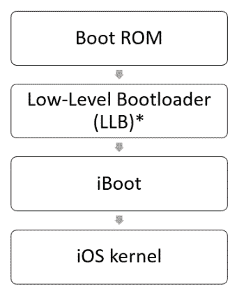

A secure boot chain of an iPhone in normal mode

*引导 ROM 反过来验证低级引导加载程序(LLB)是否由苹果签署并加载。LLB 由引导 ROM 加载和验证，但这仅发生在配备 A9 或更早的 A 系列处理器的设备上

*引导 ROM**被称为*安全 ROM* ，是**只读存储器** ( **ROM** )并且是在 iPhone([https://www.apple.com/business/docs/iOS_Security_Guide.pdf](https://www.apple.com/business/docs/iOS_Security_Guide.pdf))上运行的第一段重要代码。iOS 设备引导过程的说明在以下步骤中定义:*

 *1.  引导 ROM 代码包含 Apple root **证书颁发机构** ( **CA** )公钥，用于在允许加载前验证下一阶段的签名。
2.  当 iPhone 启动时，应用处理器从引导 rom 执行代码。
3.  引导 ROM 反过来验证**低级引导加载程序** ( **LLB** )是否由苹果签署并加载。LLB 由引导只读存储器加载和验证，但这仅发生在带有 A9 或更早的 A 系列处理器的设备上。
4.  当 LLB 完成其任务时，它验证并加载第二阶段引导加载程序(iBoot)。iBoot 验证并加载 iOS 内核。
5.  iOS 内核反过来验证并运行所有用户应用。

当 iOS 设备处于这种状态时，有可能通过取证获取用户可访问的部分。大多数情况下，这包括逻辑获取，这将在本章后面讨论。

# 恢复模式

在开机过程中，如果一个步骤无法加载或验证下一个步骤，则开机会停止，iPhone 会显示如下截图所示的屏幕:


iOS device recovery mode

这种模式被称为恢复模式，是执行升级或恢复 iPhone 所必需的。要进入恢复模式，请执行以下步骤:

1.  关闭设备。
2.  按住 iPhone 主页按钮，通过 USB 电缆将设备连接到电脑。设备应该会打开。
3.  继续按住“主页”按钮，直到出现“连接到 iTunes”屏幕。然后，您可以释放主页按钮(在越狱的 iOS 设备上，此屏幕可能会出现不同的图标)。大多数取证工具和提取方法都会提醒您 iOS 设备的当前状态。
4.  要退出恢复模式，请重新启动 iPhone。在 iPhone 6s 和更早的版本中，这可以通过按住“主页”和“睡眠/电源”按钮直到出现苹果徽标来完成。在 iPhone 7 和 iPhone 7 Plus 上，这可以通过同时按住侧边按钮和音量降低按钮来实现。在 iPhone 8 及更高版本上，您可以通过单击“音量增大”按钮，然后单击“音量减小”按钮，然后按住“侧面”按钮来完成此操作。

You can read more about recovery mode on iOS devices at [https://support.apple.com/en-in/HT201263](https://support.apple.com/en-in/HT201263).

正常情况下，重启过程会将 iPhone 从恢复模式返回到正常模式。同样的方法也适用于苹果手表。您可能会遇到 iPhone 不断重启进入恢复模式的情况。这就是所谓的恢复循环。当用户或检查人员试图越狱 iOS 设备并出现错误时，可能会出现恢复循环。要使设备脱离恢复循环，设备必须连接到 iTunes，以便备份可以恢复到设备。

This makes changes to the evidence, so ensure that you have validated your acquisition methods on a test device prior to attempting to use your methods on real evidence.

# DFU 模式

开机过程中，如果开机 ROM 无法加载或验证 LLB 或 iBoot(在较新的设备上)，iPhone 进入**设备固件升级** ( **DFU** )模式。DFU 模式是一种低级诊断模式，旨在为 iPhones 执行固件升级。

要进入 DFU 模式，请对 iPhone 8 及更高版本执行以下步骤:

1.  通过 USB 电缆将设备连接到工作站。
2.  按下音量增大按钮并快速释放。
3.  按下音量降低按钮并快速释放。
4.  按住侧边按钮，然后再次按下音量降低按钮。
5.  5 秒钟后，松开侧边按钮，但继续按住音量降低按钮，直到看到恢复屏幕。

对 iPhone 7 执行以下步骤:

1.  通过 USB 电缆将设备连接到工作站。
2.  同时，按住侧边和音量降低按钮。
3.  松开侧边按钮，但继续按住音量降低按钮，直到看到恢复屏幕。

对于 iPhone 6s 和更早版本，请遵循以下步骤:

1.  通过 USB 电缆将设备连接到工作站。
2.  同时，按住主页和顶部(或侧面)按钮。
3.  松开顶部(或侧面)按钮，并继续按住主页按钮。

On iPhone 6s and earlier, nothing will be displayed on the screen when the device is in DFU mode.

要在 macOS 上验证 iPhone 是否处于 DFU 模式，请启动系统报告并转到 USB 选项。您应该会看到类似以下截图的内容:

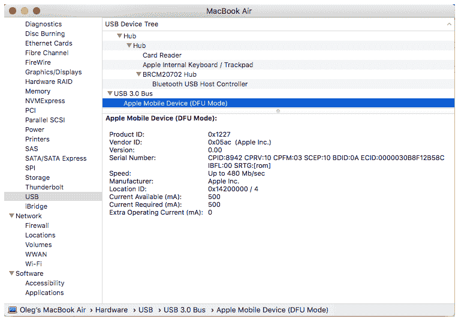

The MacBook system information displaying a device in DFU mode

接下来，我们将快速了解设置取证环境所需的工具。

# 建立法医环境

现在，我们有几个工具可以供移动法医检查员使用，以 macOS 和 Windows 系统作为主机来获取和分析 iOS 设备。比如 *Elcomsoft iOS 取证工具包*有 macOS 和 Windows 两个版本；至于免费的开源工具，`libimobiledevice`库可以使用——不仅可以在 macOS 和 Windows 取证工作站上使用，甚至可以在 Linux 上使用！

当然，我们将在本章后面通过实践练习向您介绍这些工具，包括实际的逻辑和文件系统获取，甚至越狱。但是让我们从密码保护和潜在的旁路开始，因为没有密码，我们不能从现代 iOS 设备中提取任何东西。

# 密码保护和潜在旁路

我们想从坏消息开始:如果你正在检查运行 iOS 8 或更新版本的 iPhone，尤其是如果它是一个更新的设备，例如 iPhone 6s，你解锁它的机会一点也不好。

当然，也有一些基于硬件的解决方案，比如 IP-BOX 3，但它们都只是偶尔工作，使用其中一个甚至会导致设备被砌砖。使用 iOS 11，这个问题变得更加严重——即使被检查的设备没有密码保护，您仍然需要密码，因为必须输入密码才能确认设备和工作站之间的信任。

那么，移动法医应该怎么做呢？使用锁定文件！锁定文件作为`plist`文件存储在*可信计算机*上，允许您欺骗设备，使其相信它在法医工作站上是未锁定的或*可信的*。

锁定文件位于以下位置:

*   `/var/db/lockdown`在 macOS 上
*   `C:\ProgramData\Apple\Lockdown`在 Windows 7 和更高版本上

您必须注意，使用锁定文件解锁仅在设备在上次重新启动后使用密码解锁至少一次时有效。

还有一些先进的技术存在。其中包括欺骗触控 ID 的指纹模型、欺骗 Face ID 的面具以及绕过密码输入限制的“与非”镜像。

第一种技术首先由杰森·柴金演示。他演示了如何绕过触控 ID，用普通的模塑材质，如牙模和 Play-Doh，来提升另一个人的指纹。

越南网络安全公司 Bkav 展示了第二种技术作为概念证明。他们创造了一个面具，可以利用三维打印、化妆和二维图像的组合来欺骗 Face ID 特征。

最后一项技术由剑桥计算机实验室安全小组的高级研究助理谢尔盖·斯科罗沃加托夫演示。这项技术允许你通过焊接 iPhone 的闪存芯片并克隆它来绕过密码输入限制。这项技术应该适用于任何 iOS 设备，直到 iPhone 6s Plus。

# 逻辑获取

逻辑获取捕获用户可访问的部分内容；换句话说，iTunes 备份中包含了什么。这意味着我们不会得到任何删除的文件，但是，由于 SQLite 数据库的空闲列表和未分配的空间，我们可以恢复删除的记录，包括短信和其他聊天记录、浏览历史记录等。我们将在[第 5 章](05.html)、 *iOS 数据分析和恢复中讨论恢复 SQLite 数据和删除的工件。*

逻辑获取是确定设备是否解锁的最简单方法，因为它只使用内置的备份机制。如果设备被锁定，大多数支持逻辑获取 iOS 设备的工具和方法都会失败。有些人认为，如果捕捉到物理图像，就几乎不需要逻辑采集。然而，并不是所有的数据都在物理图像中解析，这就是为什么访问逻辑图像会产生可读的数据，这将有助于您深入挖掘物理图像中的伪影，以支持您的法医调查。

逻辑获取是访问存储在 iOS 设备上的数据的最快、最简单和最便宜的方式。有各种各样的工具，从商业的到免费的，能够捕捉逻辑图像。这些工具大多要求设备解锁，或者从主机访问`plist`文件。

# 用力比多设备进行实际的逻辑获取

把理论放在你的腰带下是好的，但把它付诸实践要好得多。让我们创建一个运行带有`libimobiledevice`的 iOS 13.2 的 iPhone 的逻辑映像，它应该已经安装在您的工作站上，就像我们在上一章中用于设备信息收集一样。

好，我们开始吧:

1.  首先，让我们对备份进行加密。将 iOS 设备连接到工作站，并启动命令提示符。将目录更改为包含`libimobiledevice`的目录，并键入以下命令:

```
idevicebackup2.exe backup encryption on <your_password>
```

2.  如果您看到备份加密已成功启用，那么您已经做了所有正确的事情，备份将被加密。这将帮助你，取证审查员，获得更多关于用户密码、Safari 浏览历史等信息。

3.  是时候创建备份了—我们的 iOS 设备逻辑映像。为此，请键入以下命令:

```
idevicebackup2 backup --full <the_folder_you_want_the_image_to_be_saved>
```

就这样。您可以在下面的截图中看到逻辑成像过程:

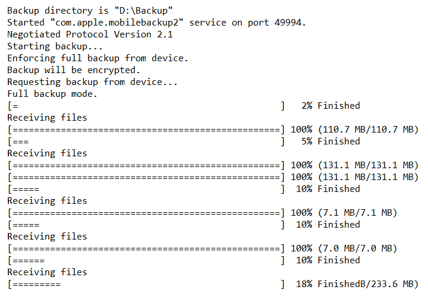

iPhone logical imaging with libimobiledevice

接下来，让我们看看贝尔卡索夫收购工具的逻辑收购。

# 贝尔卡索夫采集工具的实用逻辑采集

由于逻辑获取是现代 iOS 设备最常见的选择，我们将演示如何使用一些更免费的工具。第一个是贝尔卡索夫收购工具。这个工具不仅可以用于 iOS 设备采集，还可以用于硬盘，甚至云数据。

让我们使用贝尔卡索收购工具收购一部运行 iOS 13.2.3 的 iPhone:

1.  启动贝尔卡索夫采集工具，并选择移动设备选项:

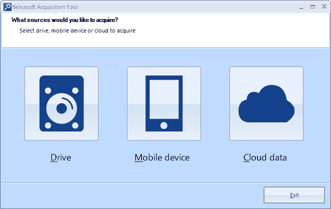

Choosing the source

2.  在下一个窗口中，选择苹果选项:

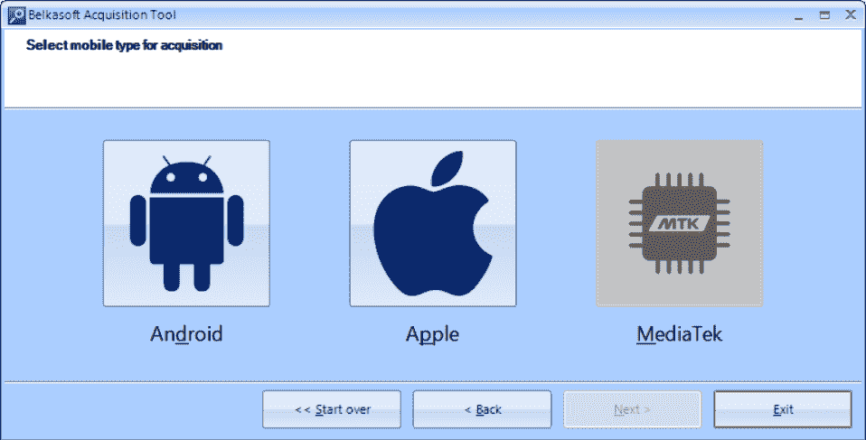

Choosing the mobile type

3.  现在，选择采集方法和图像路径:

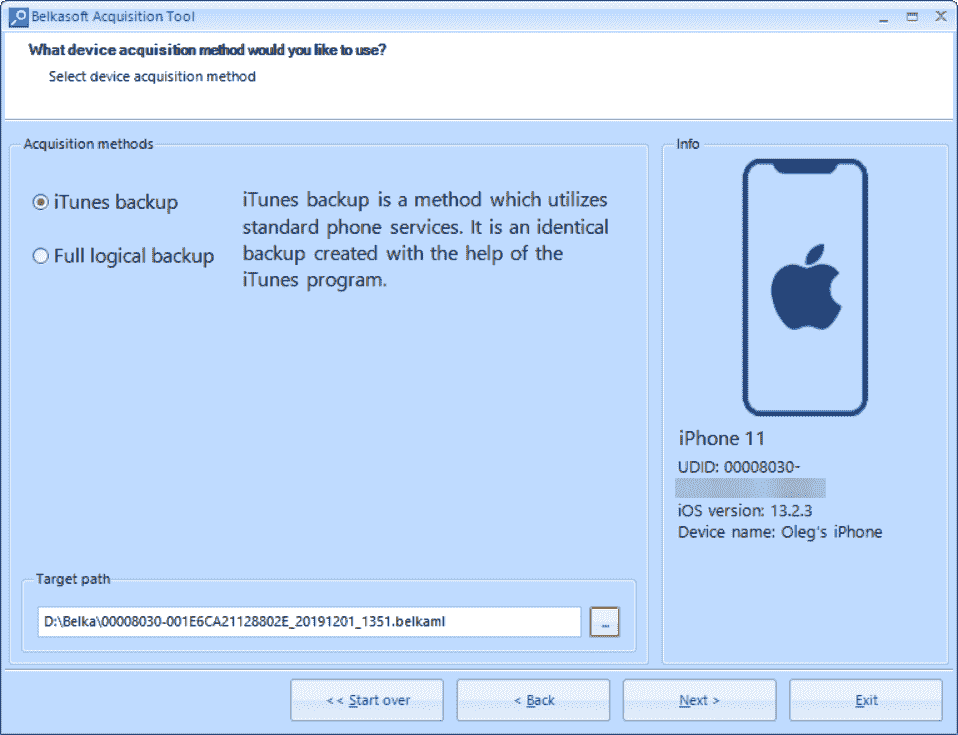

Choosing the acquisition method

如果设备没有越狱，该工具可以创建 iTunes 备份，如果越狱，可以执行文件系统提取。

4.  等待任务成功完成。您将在上一步中选择的文件夹中找到设备的逻辑映像:

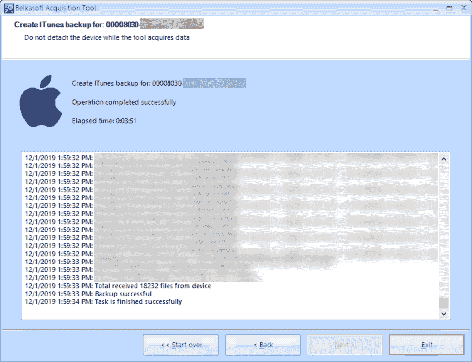

Creating the backup

贝尔卡索夫证据中心和许多其他移动取证工具都可以对备份进行分析。

# 使用磁铁采集实用逻辑采集

另一个能够逻辑采集的免费工具是磁铁取证的 **ACQUIRE** 。让我们再次执行逻辑采集，这次使用运行 iOS 12.2 的设备:

1.  启动 Magnet ACQUIRE 并从列表中选择您想要成像的设备:

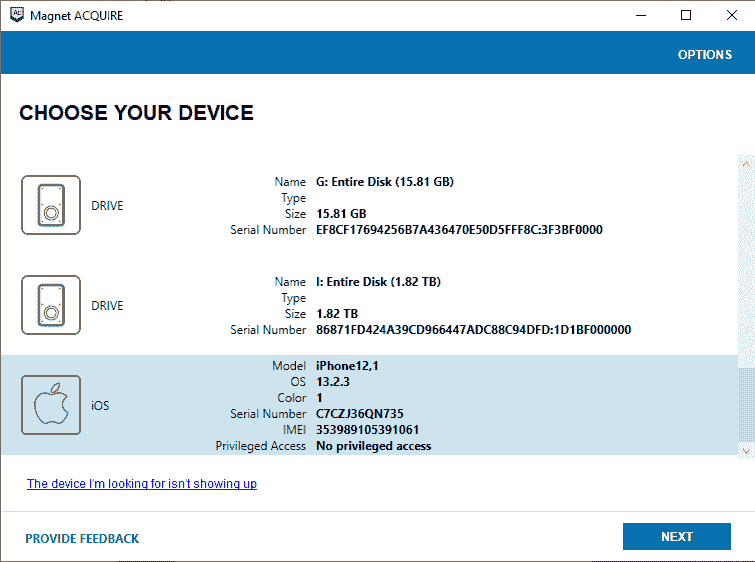

Choosing the device

2.  选择您想要获取的图像类型。我们希望获得一个逻辑映像，并且我们的设备没有被越狱，因此我们将选择快速选项:

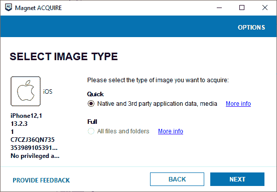

Choosing the image type

3.  如果需要，您可以添加证据源的描述，并选择要保存图像的文件夹:

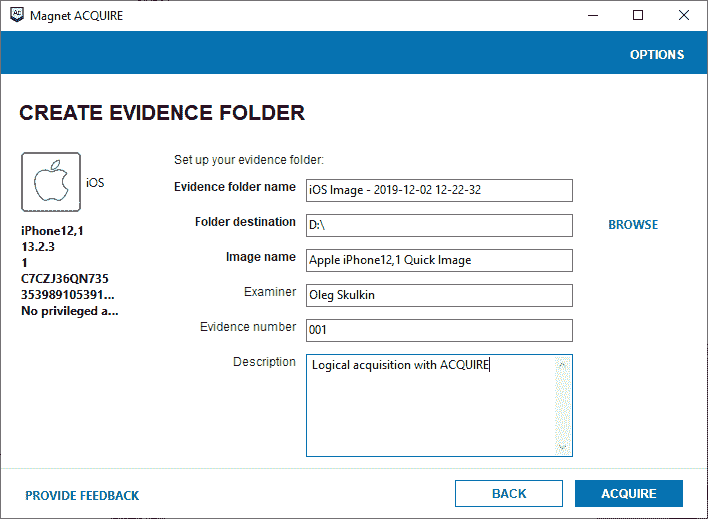

Choosing the destination folder, image name, and image information

4.  等待任务成功完成；您将看到收购过程的总结:

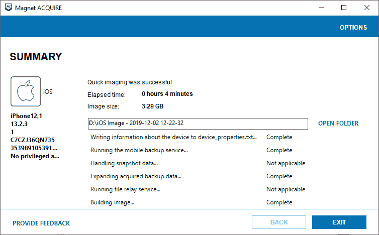

Creating the image

所有提取的数据都将保存到 ZIP 存档中的目标文件夹。此外，目标文件夹将包含一个带有采集过程日志和图像信息的 TXT 文件。

下一节将向您介绍越狱和文件系统获取。

# 文件系统获取

Secure Enclave 给 iOS 取证审查员带来了新的挑战。我们无法提取解密设备映像所需的加密密钥，因此执行物理采集是没有用的。但是有文件系统获取。不幸的是，在大多数情况下，它要求 iOS 设备被越狱。下一节将向您展示如何越狱运行带有伊莱克特的 iOS 11.4.1 的 iPhone 和运行带有 Checkra1n 的 iOS 13.2 的 iPhone。

# 实用越狱

为了执行文件系统获取，我们需要我们的 iOS 设备被越狱。越狱运行 11.4.1 的 iOS 设备的步骤如下:

1.  从以下网址下载`Electra`:https://github . com/coolstar/electra-IPAS/raw/master/electra 1141-1 . 3 . 2 . IPA。

2.  下载`Cydia Impactor`([http://www.cydiaimpactor.com/](http://www.cydiaimpactor.com/)，运行，将设备连接到工作站:

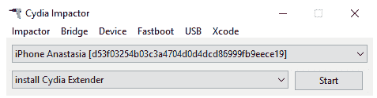

Running Cydia Impactor

3.  将`Electra IPA`文件拖放到`Cydia Impactor`窗口。

4.  在新窗口中键入任何苹果标识(您可以为您检查的每台设备注册一个新标识)。

5.  使用此苹果标识登录[https://appleid.apple.com/](https://appleid.apple.com/)，并在安全部分生成特定于应用的密码。将此密码粘贴到下一个窗口。等待过程完成。

6.  在电话上，转到设置|常规|设备管理|苹果标识并点击信任:

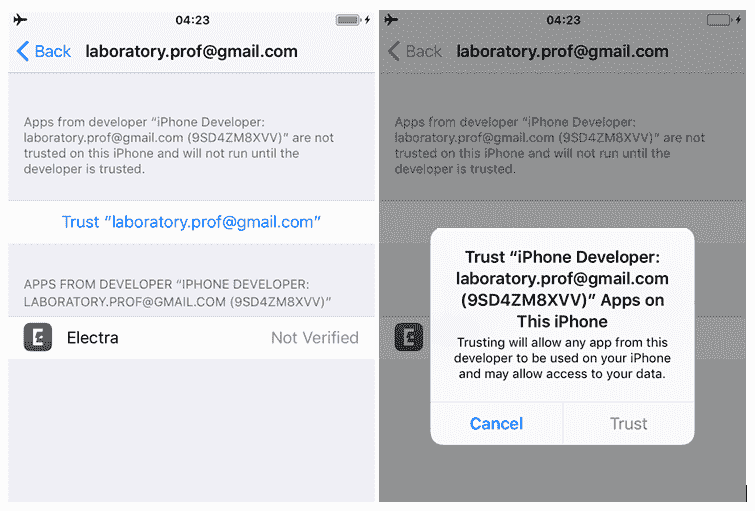

Verifying the developer

7.  将手机置于飞机模式，关闭 Siri，并重新启动设备。

8.  点击跳板上的伊莱克特图标，然后选择越狱。如果该过程成功完成，您将在跳板上找到 Cydia 图标:

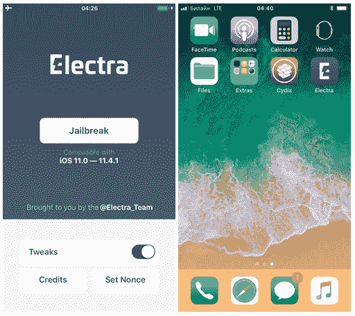

Jailbreaking the device

现在，手机被越狱了，可以获取文件系统了。

`Checkra1n`基于 bootrom 漏洞和漏洞利用，支持多种 iOS 设备，甚至是运行最新(撰写本文时)iOS 13.2 的设备。以下是越狱运行 13.2 的 iOS 设备的步骤:

1.  从:[https://checkra.in/](https://checkra.in/)下载`Checkra1n`。
2.  运行应用。在撰写本文时，`Checkra1n`仅适用于 macOS。
3.  连接设备并将其置于 DFU 模式:

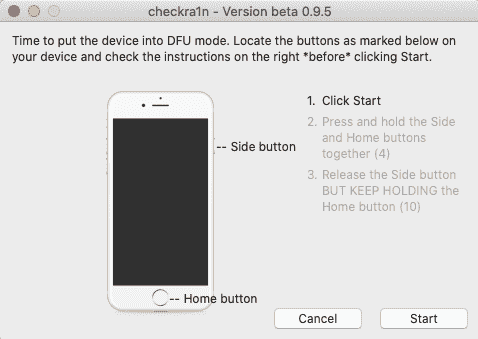

Putting the device into DFU mode

4.  等待利用过程完成:


Exploitation process

设备重新启动后，您会在跳板上看到 checkra1n 图标—设备现已越狱，可以获取文件系统。

For more jailbreaking techniques, please refer to the *Jailbreaking* section of [Chapter 2](02.html), *Understanding the Internals of iOS Devices*.

# 使用免费工具获取实用的文件系统

是时候执行文件系统获取了。我们只需要从`libimobiledevice`开始`iproxy`:

1.  打开命令提示符窗口，使用以下参数运行`iproxy`:

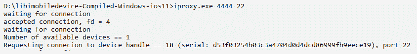

2.  打开另一个命令提示符窗口，将目录更改为要存储图像的目录，然后运行以下命令:

```
ssh root@127.0.0.1 -p 4444 "tar -cf - /private/var/" > userdata.tar
```

To connect via SSH, you will be prompted for the necessary password. The default password for SSH is *alpine*.

一旦该过程完成，您将在运行前面的命令之前更改到的目录中找到创建的文件系统映像。这是一个 TAR 归档文件，可以用许多归档文件打开，例如 7-Zip:

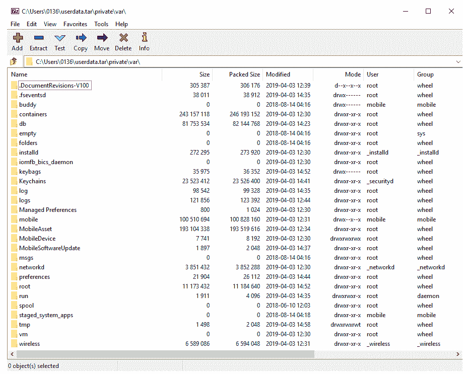

Filesystem image contents

接下来我们来看看 *Elcomsoft iOS 取证工具包*。

# 使用 Elcomsoft iOS 取证工具包获取实用的文件系统

当然，商业工具更稳定可靠。能够获取文件系统的工具之一是 Elcomsoft iOS 取证工具包。在这里，我们将获得一个运行 iOS 12.4.3 的越狱 iOS 设备。

执行此操作的步骤如下:

1.  将设备连接到您的工作站并启动`Toolkit.cmd`。
2.  选择用于 SSH 连接的端口(默认为`22`，但由于我们使用 checkra1n 进行越狱，因此端口改为`44`)并输入密码(默认为`alpine`):

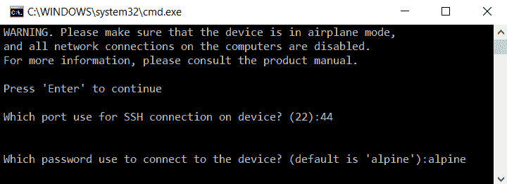

3.  要获取设备文件系统，请键入 *F* :

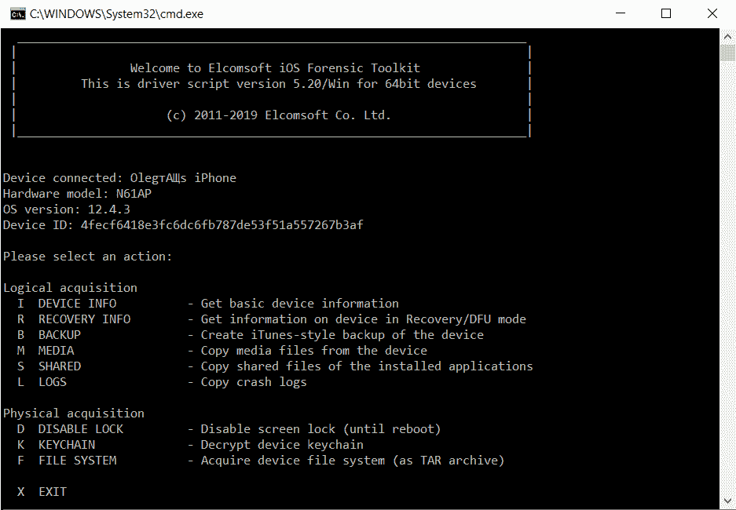

4.  选择图像名称并开始该过程。

一旦这个过程完成，我们将有一个文件系统映像，可以用我们选择的移动取证工具进行分析。

# 摘要

iOS 设备取证检查的第一步是从设备获取数据。从 iOS 设备获取数据有几种不同的方法。本章讲述了逻辑和文件系统获取技术，以及越狱和绕过密码的方法。

虽然文件系统获取是从 iOS 设备合法获取大部分数据的最佳方法，但备份文件可能存在，或者是从设备中提取数据的唯一方法。

下一章将详细讨论 iOS 设备备份文件，包括用户、取证、加密和 iCloud 备份文件，以及您可以执行的取证检查方法。*