# 四、从 iOS 备份中获取数据

在前一章中，我们介绍了从 iOS 设备获取数据的技术，包括逻辑和文件系统获取。本章介绍了使用苹果的同步协议，从设备获取文件备份到计算机或 iCloud 的技术。

对 iOS 设备的物理获取提供了调查中最多的数据，但您也可以在 iOS 备份中找到丰富的信息。iOS 设备用户有几个选项来备份设备上的数据。用户可以选择使用苹果 iTunes 软件将数据备份到他们的电脑，或者备份到名为 iCloud 的苹果云存储服务。每次 iPhone 与电脑或 iCloud 同步时，它都会通过从设备中复制选定的文件来创建备份。用户可以确定备份中包含的内容，因此某些备份可能比其他备份更具包容性。此外，用户可以备份到计算机和 iCloud，从每个位置获得的数据可能会有所不同。这种情况经常发生，因为 iCloud 的免费存储空间有限。用户可以简单地将照片和联系人备份到 iCloud，但是可以对他们计算机上的所有数据进行完整备份。如前所述，物理采集提供了对 iOS 设备上所有数据的最佳访问；但是，备份可能是唯一可用的数字证据来源，尤其是在我们处理最新的 iOS 设备时。

在本章中，我们将涵盖以下主题:

*   使用 iTunes 备份
*   使用 iTunes 创建和分析备份
*   提取未加密的备份
*   处理加密的备份文件
*   使用 iCloud 备份

# 使用 iTunes 备份

大量信息存储在以前与 iOS 设备同步的任何计算机上。这些计算机通常称为主机，可以拥有历史数据和密码绕过证书。在刑事调查中，可以获得搜查令来扣押属于嫌疑人的计算机，以便访问备份和锁定证书。对于所有其他情况，需要征得同意或允许进入。iOS 备份文件取证主要涉及分析 iPhone 或 iPad 产生的离线备份。Apple Watch 数据将包含在同步到的 iPhone 备份中。

iTunes 备份方法在其他采集类型不可行的情况下也很有用。在这种情况下，您基本上创建了设备的 iTunes 备份，并使用取证软件对其进行分析。因此，对您来说，完全了解备份过程和所涉及的工具非常重要，以确保工具能够创建取证备份，而不会用 iTunes 中的其他现有数据污染设备。

iPhone 备份文件可以使用 iTunes 软件创建，该软件适用于 macOS 和 Windows 平台。iTunes 是苹果提供的免费实用程序，用于 iOS 设备和电脑之间的数据同步和管理。iTunes 使用苹果专有的同步协议将数据从 iOS 设备复制到电脑上。例如，iPhone 可以使用电缆或无线网络与电脑同步。iTunes 为加密备份提供了一个选项，但是默认情况下，每当 iPhone 同步时，它都会创建一个未加密的备份。加密备份被破解后，可以提供对存储在 iOS 设备上的数据的额外访问。这将在本章后面讨论。

用户经常创建备份文件，以便在设备损坏或丢失时保护他们的数据。要么创建取证备份作为最佳证据，要么简单地从现有的 iOS 备份文件中提取数据来搜索遗留信息。例如，如果您正在接受调查，并且您删除了文件或擦除了您的 iPhone，则您的 iCloud 和 Mac 上的备份文件仍然存在。根据使用的是 iTunes 还是 iCloud，同一设备可能存在多个备份。您必须从法律角度分析每个备份，以发现与调查相关的工件。

iTunes 被配置为一旦 iOS 设备连接到电脑，就会自动启动同步过程。为了避免 iOS 设备和计算机之间意外的数据交换，请在将证据连接到取证工作站之前禁用自动同步过程。以下过程的*步骤 2* 中的截图说明了在 iTunes 版本 12.9.4.102 中禁用自动同步的选项。

要在 iTunes 中禁用自动同步，请执行以下步骤:

1.  导航至编辑|首选项|设备。
2.  选中阻止 iPods、iPhones 和 iPads 自动同步，然后单击确定按钮，如下图所示:

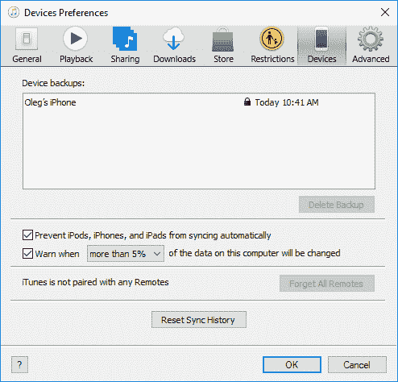

Disabling automatic syncing in iTunes

3.  如前一张截图所示，系统中存在 iOS 备份文件。如果这是一个法医工作站，这些备份文件将不会存在，或者将被永久删除，以防止交叉污染。

4.  验证同步设置后，使用**通用串行总线** ( **通用串行总线**)电缆将 iOS 设备连接到计算机。如果连接的设备没有密码保护，或者最近已经连接到电脑，iTunes 会立即识别该设备；否则，您必须输入密码。这可以通过 iTunes 界面左侧显示的 iPhone 图标来验证，如下图所示:

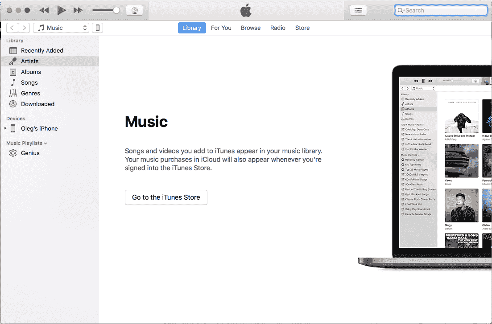

An iPhone recognized by iTunes

5.  在 iTunes 可以访问 iPhone 之前，您必须启用电脑和手机之间的信任。系统会提示您在电脑上按“继续”(如下图突出显示)，并在 iPhone 上选择“信任”。使用 iOS 11，您还必须输入设备的密码:

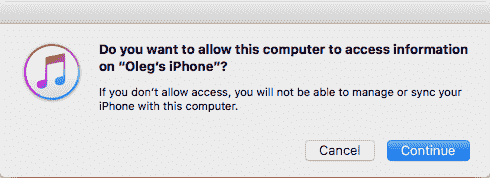

iTunes prompts for access permissions

6.  一旦 iTunes 识别出该设备，只需单击 iPhone 图标，就会显示 iPhone 摘要，包括 iPhone 的名称、容量、固件版本、序列号、可用空间和电话号码。“iPhone 摘要”页面还显示了创建备份的选项。创建备份的过程将在下一节中讨论。

现在，我们准备开始备份设备。下一部分将引导您完成这一过程。

# 使用 iTunes 创建和分析备份

在本节中，我们将带您了解如何使用苹果 iTunes 备份 iOS 设备。我们使用的是 iTunes 版本的 12.10.2.3 和运行 13.2 版本的 iPhone。请执行以下步骤:

1.  连接设备，点击 iTunes 界面左侧显示的 iPhone 图标。

2.  转到备份部分，您可以在其中选择备份目标(本地计算机或 iCloud)，以及它是否加密，如下图所示:

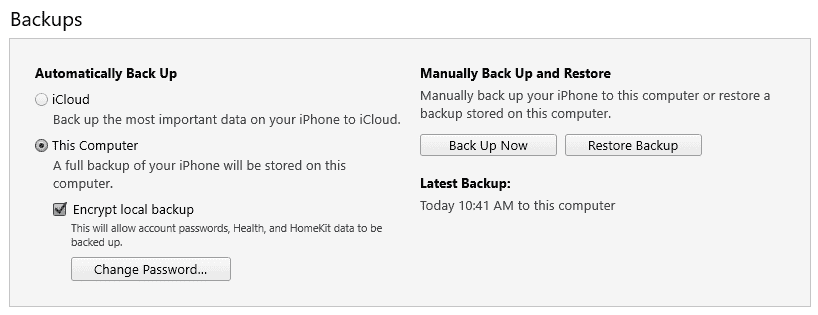

iTunes Backups section Encrypted iTunes backups contain data that unencrypted ones don't, including passwords, Wi-Fi settings, and web browsing history, so make sure you are creating encrypted backups for forensic purposes.

3.  单击立即备份按钮，等待过程完成。一旦完成，最新的备份日期和时间将被更改。

如果您想使用 iTunes 并将备份保存到外部驱动器，请遵循以下说明(我们使用的是 iTunes 12.10.2.3 版和 Windows 10):

1.  重命名原始备份文件夹。
2.  连接外部驱动器并在其上创建备份文件夹。
3.  打开命令提示符并键入以下命令:

```
mklink /J "C:\Users\<username>\AppData\Roaming\Apple Computer\MobileSync\Backup" "f:\Backup"
```

4.  现在，您可以创建一个常规的本地备份，它将保存到您的外部驱动器。

现在，我们已经准备好了进一步分析的备份。让我们看看里面，以便理解它的结构。

# 了解备份结构

iPhone 备份到电脑时，备份文件存储在备份目录中，备份目录以 40 个字符的十六进制字符串存在，对应设备的**唯一设备标识符** ( **UDID** )。最新的设备已经改变了 UDID 格式——现在它是一个 24 个字符的字符串，所以它们的备份被相应地命名。备份过程可能需要相当长的时间，这取决于首次备份期间存储在 iPhone 上的数据大小。存储备份数据的备份目录的位置取决于计算机的操作系统。下表显示了常见操作系统的列表以及 iTunes 备份目录的默认位置:

| **操作系统** | **备份目录位置** |
| Windows XP | `C:\Documents and Settings\<username>\Application Data\Apple Computer\MobileSync\Backup\` |
| windows vista 7/8/10 版 | `C:\Users\<username>\AppData\Roaming\Apple Computer\MobileSync\Backup\` |
| 苹果电脑 | `~/Library/Application Support/MobileSync/Backup/`(`~`代表主文件夹) |

在第一次同步过程中，iTunes 会创建一个备份目录，并对设备进行完整备份。目前，在后续的同步中，iTunes 只备份设备上修改过的文件，并更新现有的备份目录。这并不总是正确的，因为在过去，每次备份 iOS 设备时都会创建一个新的备份。此外，当设备更新或恢复时，iTunes 会自动启动备份，并进行*差异备份*。差异备份与备份目录同名，但附加了破折号(`-`)、**国际标准化组织** ( **ISO** )备份日期、破折号(`-`)和 24 小时格式的时间(带秒(`[UDID]+ '-' + [Date]+'-'+[Time stamp]`)。

iTunes 备份可能会复制设备上的所有内容，包括联系人、**短消息服务** ( **短信**)消息、照片、日历、音乐、通话记录、配置文件、文档、钥匙串、网络设置、离线 web 应用缓存、书签、cookies、应用数据(如果选择)等等。例如，如果备份未加密，将不会提取电子邮件和密码。备份还包含设备详细信息，如序列号、UDID、**用户识别模块** ( **SIM** )详细信息和电话号码。该信息也可以用于证明备份和移动设备之间的关系。

备份目录包含四个标准文件，以及单个文件(最多 iOS 9)或文件夹(iOS 10 及更高版本)。直到 iOS 9，这四个文件分别是`info.plist`、`manifest.plist`、`status.plist`和`manifest.mbdb`，但从 iOS 10 开始，我们有以下标准文件:

*   `info.plist`
*   `manifest.plist`
*   `status.plist`
*   `manifest.db`

这些文件存储有关备份及其派生设备的详细信息。

# 关于 plist

`info.plist`文件存储备份设备的详细信息，通常包含以下信息:

*   `Applications`:这是设备上安装的应用列表。
*   `Build version`:这是 iOS 的构建版本号。
*   `Device name and display name`:这是设备的名称，通常包括所有者的姓名。
*   `GUID`:这是设备的**全球唯一标识** ( **GUID** )。
*   `ICCID`:这是**集成电路卡标识** ( **ICCID** ，是 SIM 卡的序列号。
*   `IMEI`:这是**国际移动设备标识** ( **IMEI** ，用来唯一标识手机。
*   `Installed Applications`:这是安装的应用列表。
*   `Last backup date`:这是上次成功备份的时间戳。
*   `MEID`:这是设备的**M**T3【车载设备标识】T4(**MEID**)。
*   `Phone Number`:这是备份时设备的电话号码。
*   `Product Name`:这是设备的名称(例如 iPhone X)。
*   `Product type and product version`:这是设备的型号和固件版本。
*   `Serial Number`:这是设备的序列号。
*   `Target Identifier and Unique Identifier`:这是装置的 UDID。
*   `iTunes Files`:这包含关于照片、文件夹、语音备忘录和 iTunes 偏好设置的信息。
*   `iTunes Settings`:包含已删除应用和应用库的信息。
*   `iTunes version`:这是用来创建备份的 iTunes 版本。

现在我们来看看`manifest.plist`文件。

# manifest.plist

`manifest.plist`文件描述了备份的内容，通常包含以下信息:

*   `Backup keybag` : `Backup keybag`包含一组与`System keybag`中的密钥不同的数据保护类密钥，备份的数据用新的类密钥重新加密。`Backup keybag`中的密钥便于以安全的方式存储备份。
*   `Version`:这是备份版本。
*   `Date`:这是备份创建或上次更新的时间戳。
*   `ManifestKey`:这是用来加密`manifest.db`的密钥(用保护等级 4 包裹)。
*   `WasPasscodeSet`:这表示设备上次同步时是否设置了密码。
*   `Lockdown`:包含设备详细信息、上次备份电脑的名称和其他远程同步配置文件。
*   `Applications`:这是备份设备上安装的第三方应用的列表，以及它们的版本号和捆绑包标识符。
*   `IsEncrypted`:标识备份是否加密。对于加密备份，值为`True`；否则，就是`False`。

接下来，我们来看看`status.plist`文件。

# status.plist

`status.plist`文件存储备份状态的详细信息，通常包含以下信息:

*   `IsFullBackup`:标识备份是否是设备的完全备份。
*   `UUID`:这是装置的 UUID。
*   `Date`:这是上次修改备份的时间戳。
*   `BackupState`:标识备份是新备份还是已经更新的备份。
*   `SnapshotState`:表示备份过程是否成功完成。

现在，我们来看看`manifest.db`文件。

# manifest.db

`manifest.db`是一个 SQLite 数据库，包含通过备份机制从 iPhone 中提取的所有文件和文件夹的列表。数据库的`Files`表包括以下几列:

*   `fileID`:这是域的**安全哈希算法 1** ( **SHA1** )哈希，加上`-`符号和文件或文件夹相对路径。例如，`ae94e0607ca39a88c18aca095cb5b4f8471291a0`是`CameraRollDomain-Media/PhotoData/Thumbnails/V2/DCIM/102APPLE`的 SHA1 哈希。
*   `domain`:这是文件或文件夹所属的域(iOS 中的所有文件都分为多个域——例如`CameraRollDomain`和`HomeDomain`)。
*   `relativePath`:这是文件(包括文件名)或文件夹的相对路径。
*   `flags`:这些是文件标志。
*   `file`:这是一个内嵌的`.plist`文件。这些`.plist`文件包括以下重要信息:
    *   `LastModified`:这是文件在 Unix 格式下的最后修改时间戳。
    *   `Birth`:这是 Unix 格式的文件创建时间戳。这些字段显示在下面的屏幕截图中:

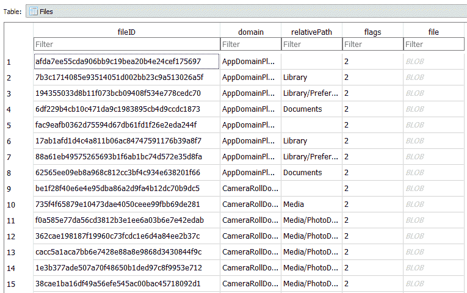

The manifest.db contents

您可以使用例如 SQLite ( **DB4S** )的**数据库浏览器轻松导出该`.plist`嵌入式二进制文件。为此，请遵循以下步骤:**

1.  使用打开数据库按钮打开`manifest.db`。
2.  转到浏览数据选项卡。
3.  单击文件列中的单元格。
4.  在“编辑数据库单元格”窗格中，使用“导出”按钮将数据保存为`.plist`文件，如下图所示:

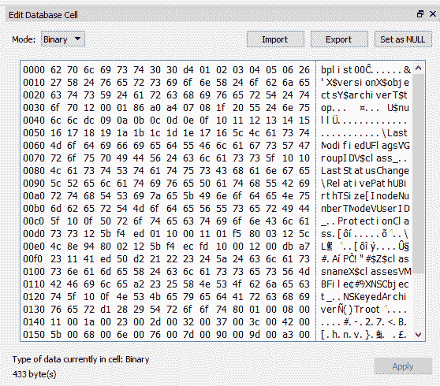

Exporting an embedded .plist file with DB4S

从 iOS 10 开始，文件不再以 40 个字符的十六进制字符串命名。相反，您将看到一个以 2 个字符的十六进制字符串命名的文件夹列表，其中包含您在以前版本中看到的文件，如下图所示:

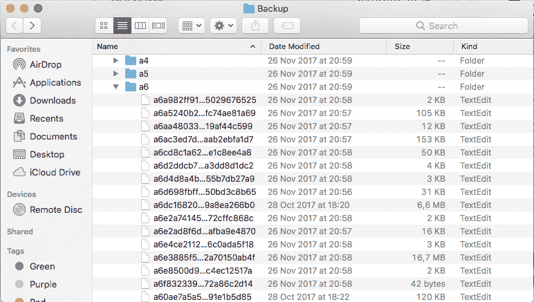

iPhone backup files

现在您已经了解了备份结构，让我们学习如何从中提取有价值的数据。

# 提取未加密的备份

有许多免费的商业工具可用于分析来自未加密备份的数据。这些工具分析`manifest.db`数据库，恢复文件名，并创建用户在 iOS 设备上看到的文件结构。一些流行的工具包括 iBackup Viewer、iExplorer 和商业取证工具，如 Belkasoft 证据中心、Magnet AXIOM 和 UFED 物理分析仪。

# 备份查看器

iBackup Viewer 是一个适用于 Windows 和 macOS 的免费工具，可以从[http://www.imactools.com/iphonebackupviewer/](http://www.imactools.com/iphonebackupviewer/)下载。

该工具希望备份位于默认位置，但您可以将其更改为您选择的位置，例如外部驱动器。

要提取备份，请遵循以下步骤:

1.  如果要分析的备份没有保存在默认位置，请单击主屏幕上的首选项超链接，并选择正确的位置，如下图所示:

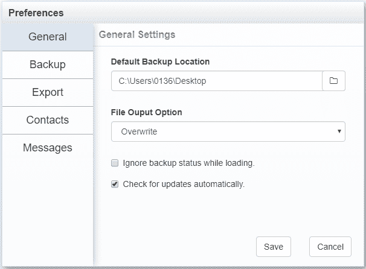

Choosing the backup location

2.  您将在选择的位置看到可用的备份。单击要检查的那个。

您将看到可用的潜在证据来源，包括联系人、通话记录、消息、日历、笔记、语音邮件和浏览记录，如下图所示:


Potential evidence sources

3.  需要注意的是，您可以使用原始数据模式(上一张截图中的最后一个图标)将备份作为文件系统进行浏览，如下图所示:

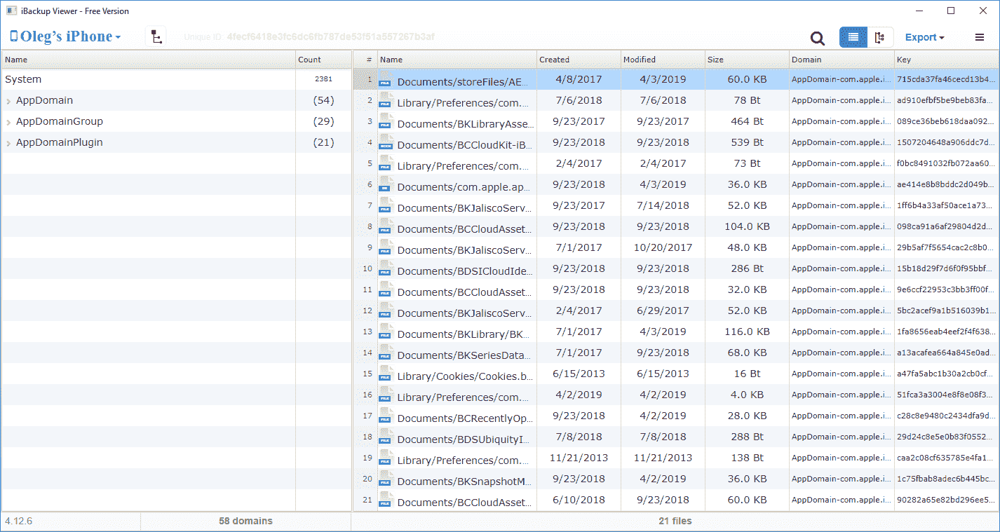

The Raw Data mode

借助该工具，您可以轻松查看和导出感兴趣的文件。当然，它不是唯一能够解决这类任务的工具。让我们看看另一个——iExplorer。

# iExplorer

iExplorer 的免费版本可在[https://macroplant.com/iexplorer](https://macroplant.com/iexplorer)获得。该工具支持 Windows 和 macOS，也能够浏览 iTunes 备份。下面是如何使用它:

1.  启动 iExplorer，点击浏览 iTunes 备份。
2.  要从自定义位置添加备份，请单击添加/修改备份位置。
3.  现在，单击添加备份位置按钮并选择路径，如下图所示:

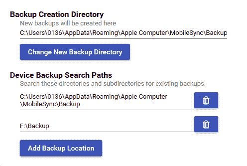

Adding a custom path

4.  您自定义位置的备份现在应该可用。

此外，还有一个有趣的选择——iExplorer 可以为您收集 SQLite 数据库。为此，请单击原始数据库按钮，进入以下屏幕(您将在下一章中了解有关 SQLite 取证的更多信息):

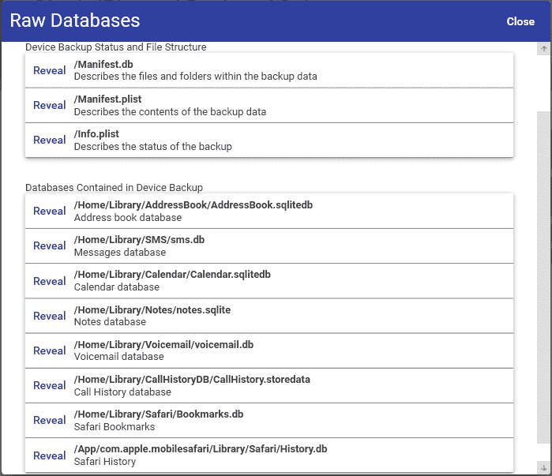

iExplorer Raw Databases option

您也可以在 iExplorer 的帮助下以文件和文件夹列表的形式浏览备份；使用左侧窗格。此外，您可以使用“备份资源管理器”按钮，然后使用主窗格来浏览备份。

如您所见，有足够的工具能够从 iTunes 备份中提取有价值的数据，即使这些数据是加密的。当然，如果你知道密码，通常是有可能的。但是如果你没有呢？在下一节中，您将学习如何绕过它。

# 处理加密的备份文件

对于加密备份，备份文件在**密码块链接** ( **CBC** )模式下使用**高级加密标准-256** ( **AES-256** )算法加密，具有唯一密钥和空的**初始化向量** ( **IV** )。唯一的文件密钥由一组来自`Backup keybag`的类密钥保护。通过**基于密码的密钥导出功能 2** ( **PBKDF2** )的 10000 次迭代，`Backup keybag`中的类密钥受到从 iTunes 中设置的密码中导出的密钥的保护。在 iOS 10.2 中，这个机制被升级了，所以现在，有 1000 万次迭代。

如果密码已知，许多免费的商业工具都支持加密备份文件解析。不幸的是，这并不总是真的，所以有时法医不得不破解这样的密码。下一节将带您通过 Elcomsoft 电话断路器了解这个过程。

# 埃尔康软件电话断路器

**Elcomsoft Phone Breaker** 是一款来自 Elcomsoft 的**图形处理单元**(**GPU**)-加速商用工具，为 Windows 平台开发。当备份密码不可用时，该工具可以解密加密的备份文件。如果备份密码不可用，该工具提供了对加密备份发起密码暴力攻击的选项。Elcomsoft Phone Breaker 试图使用字典和暴力攻击来恢复保护加密备份的纯文本密码。相对简短的密码可以在合理的时间内恢复。但是，如果备份受到强而复杂的密码保护，则破解可能需要很长时间。

该工具在此提供(包括免费试用版):[https://www.elcomsoft.com/eppb.html](https://www.elcomsoft.com/eppb.html)。

要强制使用备份密码，请执行以下步骤:

1.  启动 Elcomsoft 电话断路器工具，将出现该工具的主屏幕，如下图所示:

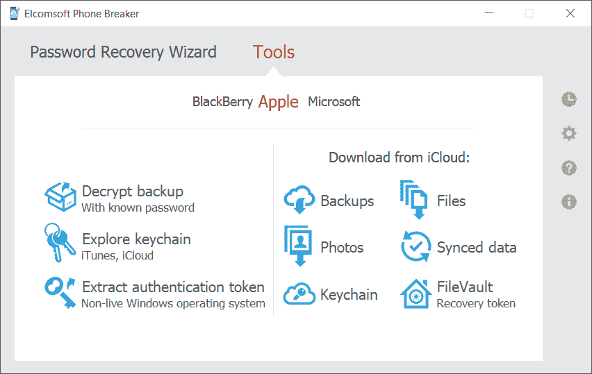

Elcomsoft Phone Breaker's main screen

2.  导航到密码恢复向导|选择源| iOS 设备备份。导航到要破解的备份文件，选择`Manifest.plist`文件。
3.  在“攻击”部分配置暴力攻击模式，然后单击“开始”按钮开始暴力攻击，如下图所示:

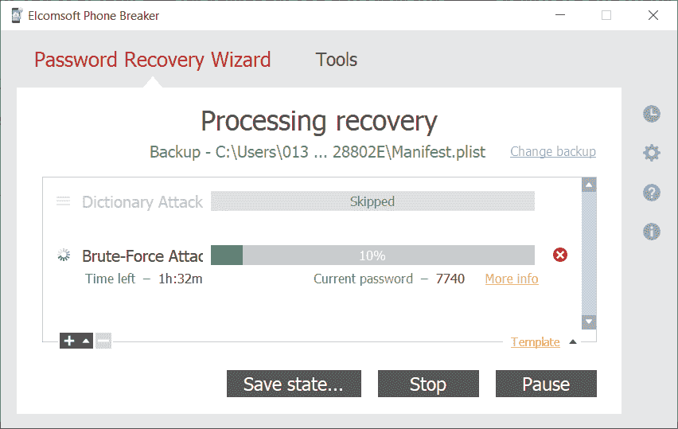

Password recovery process

如果暴力攻击成功，该工具会在主屏幕上显示密码。

如果您有一部运行 iOS 11 或更高版本的 iPhone 及其密码，您可以重置实际密码，并使用新的已知密码进行备份。下面是如何做到的:

1.  在 iPhone 上，转到设置|常规|重置。
2.  选取“重置所有设置”并输入设备密码。需要注意的是，不会删除任何数据。
3.  设置重置后，您可以使用自己选择的密码创建新的备份。

If the Screen Time password is set, you will need it as well to reset the backup password.

# 使用 iCloud 备份

iCloud 是苹果推出的云存储和云计算服务，于 2011 年 10 月推出。该服务允许用户在多个兼容设备(运行 iOS 5 或更高版本的 iOS 设备；搭载 macOS X 10.7.2 或更高版本的计算机；和微软视窗)，使用一个集中的 iCloud 帐户。该服务还允许用户以无线方式自动将其 iOS 设备备份到 iCloud。iCloud 还提供其他服务，如*查找我的 iPhone* (跟踪丢失的手机并远程擦拭)和*查找我的朋友* (与朋友共享位置，并在设备到达某个位置时通知用户)。

用 iCloud 注册是免费的，用苹果 ID 执行也很简单。当您注册 iCloud 时，苹果会授予您 5 GB 的免费远程存储访问权限。如果您需要更多存储，可以购买升级计划。为了保护您的数据安全，苹果强制用户在创建苹果 ID 时选择一个强密码，以便与 iCloud 一起使用。密码必须至少包含八个字符，包括一个数字、一个大写字母和一个小写字母。

运行在 iOS 5 及更高版本上的 iOS 设备允许用户将设备设置和数据备份到 iCloud。备份的数据包括照片、视频、文档、应用数据、设备设置、消息、联系人、日历、电子邮件和钥匙串，如下图所示。您可以通过导航到“设置|密码和帐户| iCloud | iCloud:

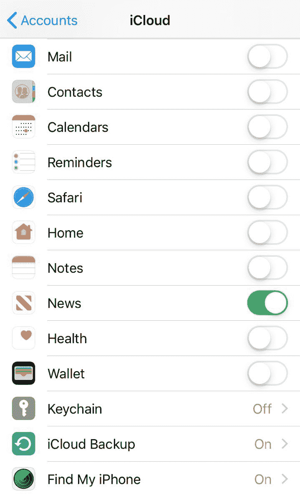

iCloud backup options on the iPhone

当您的手机接通电源、锁定并连接到 Wi-Fi 时，iCloud 可以自动备份您的数据。也就是说，只要有空间创建当前备份，iCloud 备份就代表存储在设备上的信息的一个新的接近实时的副本。

您也可以通过将设备连接到 iTunes 并选择“iCloud”选项，从电脑启动 iCloud 备份。iCloud 备份是增量备份；也就是说，一旦初始 iCloud 备份完成，所有后续备份只复制设备上更改的文件。iCloud 通过在互联网上传输数据时对其进行加密，以加密格式存储在服务器上，并使用安全令牌进行身份验证，从而保护您的数据。

苹果的内置应用(例如，邮件和联系人)使用安全令牌来访问 iCloud 服务。使用安全令牌进行身份验证消除了在设备和计算机上存储 iCloud 密码的需要。

# 正在提取 iCloud 备份

当原始 iOS 设备损坏、升级或丢失时，通常会检索存储在 iCloud 上的在线备份。要从 iCloud 提取备份，您必须知道用户的苹果 ID 和密码。使用已知的 Apple ID 和密码，您可以登录[https://www.icloud.com/](https://www.icloud.com/)并访问联系人、笔记、电子邮件、日历、照片、提醒等。您还可以使用取证工具从 iCloud 中提取数据。比如可以使用**贝尔卡索收购工具**，这是贝尔卡索的免费工具，可以从:[https://贝尔卡索](https://belkasoft.com/get)[t.com/get](https://belkasoft.com/get)下载。

要提取 iCloud 数据，请执行以下步骤:

1.  启动贝尔卡索夫收购工具。
2.  选择云选项。
3.  选择 iCloud。
4.  键入苹果标识登录和密码，然后单击下一步。
5.  选择要下载的工件和要放置它们的目标文件夹，如下图所示:

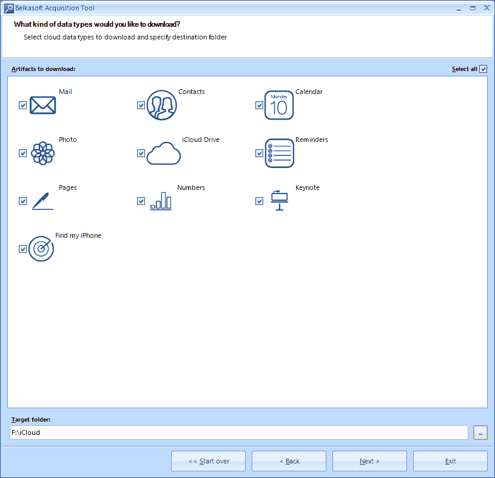

Data types available for downloading

6.  输入验证码。
7.  等待过程完成。你会在你选择的文件夹中找到这些文件。

如果您更喜欢完整备份，最好的选择是 Elcomsoft 电话断路器。

要下载 iCloud 备份，请执行以下步骤:

1.  启动 Elcomsoft 电话断路器。
2.  选择备份选项。
3.  输入苹果标识和密码，或者使用以前提取的令牌。
4.  如果苹果 ID 受**双因素认证** ( **2FA** 保护，在相应字段输入代码。
5.  选择要下载的备份，如下图所示:

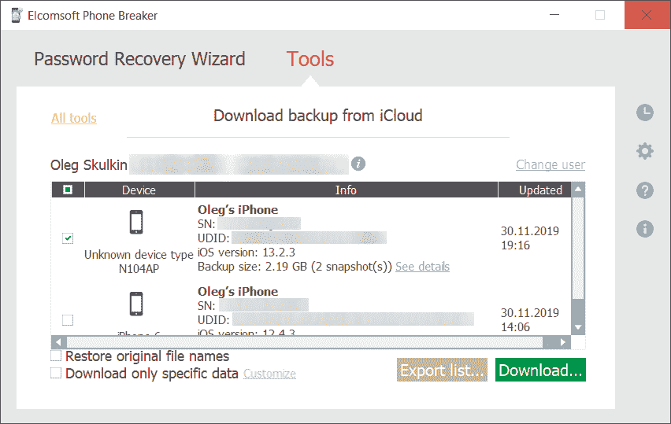

Choosing the backup for downloading

下载完成后，您可以使用自己选择的工具来分析备份，例如本章中讨论的工具之一。

# 摘要

iOS 设备备份包含重要信息，可能是您唯一的证据来源。iOS 备份中存储的信息包括照片、视频、联系人、电子邮件、通话记录、用户帐户和密码、应用和设备设置。本章介绍了如何创建备份文件以及如何从 iTunes 和 iCloud 备份中检索数据，包括加密的备份文件。

下一章[第 5 章](05.html)*iOS 数据分析和恢复*通过向您展示如何分析从备份文件中恢复的数据，进一步深入到取证调查中。