# 六、iOS 取证工具

像你这样的审查员不仅必须知道如何使用法医工具，还必须了解你在调查中使用的工具所采用的方法和采集技术。除了节省时间之外，取证工具还使取证分析过程变得更加容易。然而，每种工具都有其缺陷。您必须抓住任何错误，并知道如何通过利用另一种工具或技术来纠正它们。一个工具不可能支持所有设备。你有责任学习和使用最好的工具来完成这项工作。正如我们在前面几章中所讨论的，您必须了解数据是如何存储在 iOS 设备上的，以确保该工具能够捕获所有可访问的数据。

目前，有许多商业工具，如 Cellebrite UFED 物理分析仪、BlackBag BlackLight、氧气法医侦探、Belkasoft 证据中心、MSAB XRY、Magnet AXIOM 等，可用于 iOS 设备的法医采集和分析。出于熟悉的目的，本章将向您介绍其中一些设备的用法，并提供执行收购和 iOS 设备分析所需步骤的详细信息。

在本章中，我们将涵盖以下主题:

*   使用 Cellebrite UFED 物理分析仪
*   使用 Magnet AXIOM
*   与贝尔卡索夫证据中心合作
*   使用爱康软件电话查看器

# 使用 Cellebrite UFED 物理分析仪

根据供应商的说法，Cellebrite **通用法医提取设备** ( **UFED** )授权执法、反恐和安全组织从手机、智能手机、掌上电脑和便携式手机品种中获取关键法医证据，包括新发布型号的更新。该工具支持取证声音数据提取、解码和分析技术，以从不同的移动设备获取现有的和删除的数据。截至 2019 年 2 月，UFED 支持从近 28，000 台移动设备中提取数据。

# Cellebrite UFED 物理分析仪的特点

以下是 Cellebrite UFED 物理分析仪的特点:

*   支持不同类型的采集
*   提取解密物理图像以及钥匙串项目所需的设备密钥
*   解密物理图像和钥匙串项目
*   显示设备密码(不适用于所有锁定的设备)
*   允许您使用已知密码打开加密的原始磁盘映像文件
*   支持密码恢复攻击
*   支持提取的应用数据的高级分析和解码
*   提供对在同一用户界面中提取的物理和逻辑数据的访问，使分析更加容易
*   生成几种流行格式的报告，包括微软 Excel、PDF 和 HTML
*   转储原始文件系统分区，以便可以在另一个取证工具中导入和检查它
*   除了 UFED 快捷方式文件之外，还创建一个二进制图像文件，以便导入其他取证工具进行验证

现在让我们看看高级逻辑获取和分析。

# 用 Cellebrite UFED 物理分析仪进行高级逻辑采集和分析

正如我们之前提到的，物理分析器不仅可以用于从采集的图像中解析不同类型的取证工件，还可以用于从 iOS 设备中执行逻辑和文件系统(甚至是物理的，对于旧设备)类型的提取。由于物理采集实际上仅适用于较旧的设备，因此最佳选择是高级逻辑采集。

我们将从运行 iOS 13.2.3 的 iPhone 上获取和分析数据。让我们开始吧:

1.  通过适当的电缆将设备连接到您的工作站。确保它是可信的，并启动物理分析器。

2.  转到提取| iOS 设备提取。将弹出 iOS 设备数据提取向导窗口:

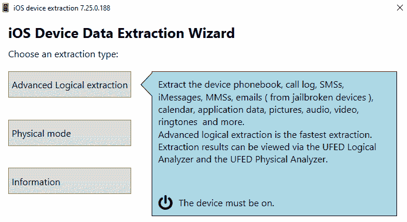

Choosing an extraction type

3.  既然我们正在处理一个现代的 iOS 设备，让我们选择高级逻辑提取。如果设备被识别，您将看到设备的名称、UDID 以及 iOS 版本:

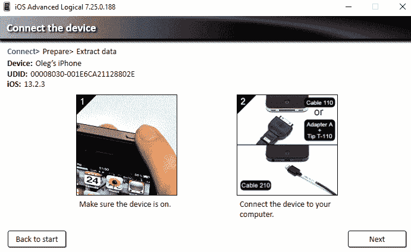

Connecting the device

在我们的例子中，iPhone 的 iTunes 备份受到已知密码的保护，所以最好的方法是方法 1:

Choosing an extraction method

4.  如果您想要加密备份(推荐)，您可以在下一页选择此选项:

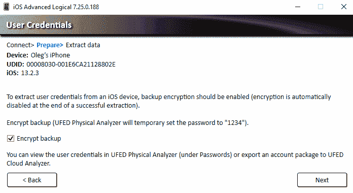

Choosing whether the backup should be encrypted or not

5.  是时候选择将数据保存在哪里了；在我们的例子中，这是`D:\`驱动的根源:

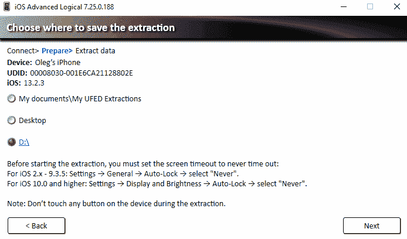

Choosing where to save the extraction

5.  现在，收购程序将开始。确保设备已连接，直到过程结束:

Extracting the data

一旦提取过程完成，提取的数据将被强大的物理分析器插件解析。因此，您将获得一组分为多个类别的工件:

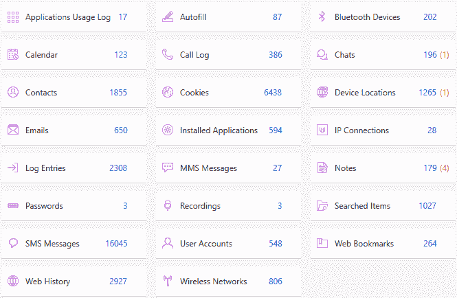

Phone data extracted and parsed by Physical Analyzer

数据文件也是如此:

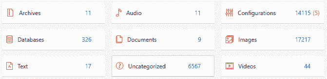

Data files extracted by Physical Analyzer

您可能已经注意到，括号中有红色的数字——这些是物理分析器插件恢复的已删除记录。正如你已经知道的，删除的数据可以从 iOS 中广泛使用的 SQLite 数据库中恢复并不是奇迹。

说到 SQLite 数据库，Physical Analyzer 还有另一个惊人的特性，它可能有助于将自定义工件添加到您的移动取证报告中，并解析未知的应用数据——SQLite 向导。您可以在工具| SQLite 向导下找到它:

1.  让我们从选择数据库开始。当然，选择一个没有被 Physical Analyzer 自动解析的应用是很好的。在我们的示例中，这是一个名为“扫描:

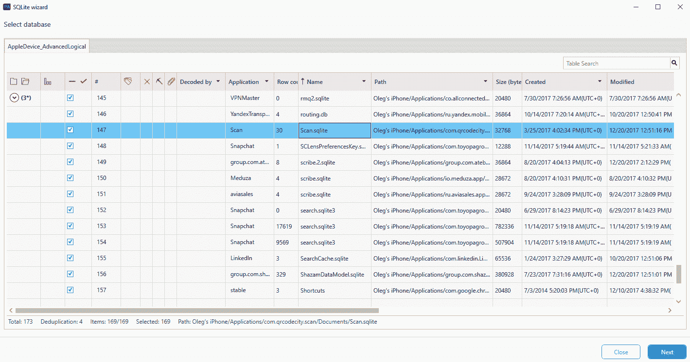

Selecting a database

2.  确保您选择了“包括已删除的行”选项；这将帮助您自动恢复数据，但当然，这将增加假阳性记录的数量:

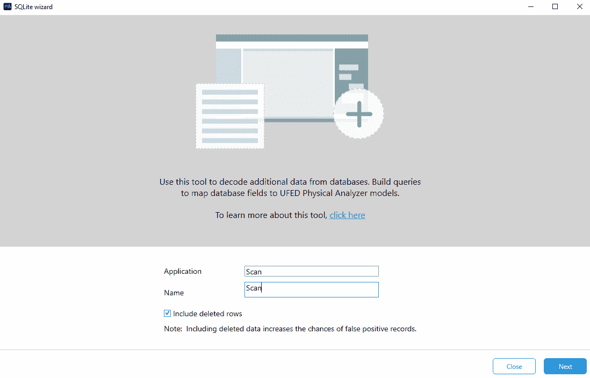

Starting the SQLite wizard

因此，我们的应用用于扫描二维码，并包含四列感兴趣的内容——扫描日期和时间、纬度、经度和扫描结果。所有的行都是`ZSCSCANEVENT`的一部分:

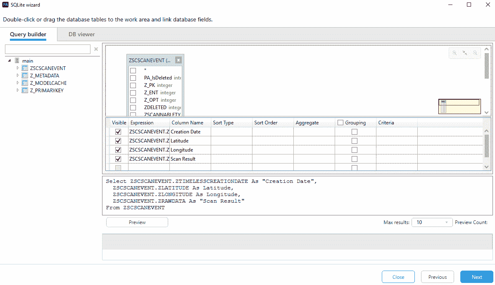

Choosing database tables and columns

3.  下一步是选择时间戳。您已经了解了很多关于 iOS 时间戳的知识，并且应该能够识别`ZTIMELESSCREATIONDATE`中的格式，但是即使您不知道，SQLite 向导也会为您做到这一点:

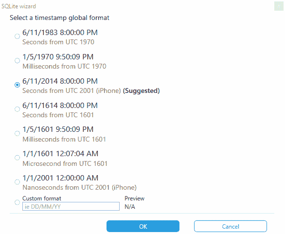

Selecting the timestamp format

4.  通用模型适用于任何数据库，但现有一些物理分析器模型可用于典型内容，如*聊天*或*联系人*。在我们的例子中，我们使用通用模型:

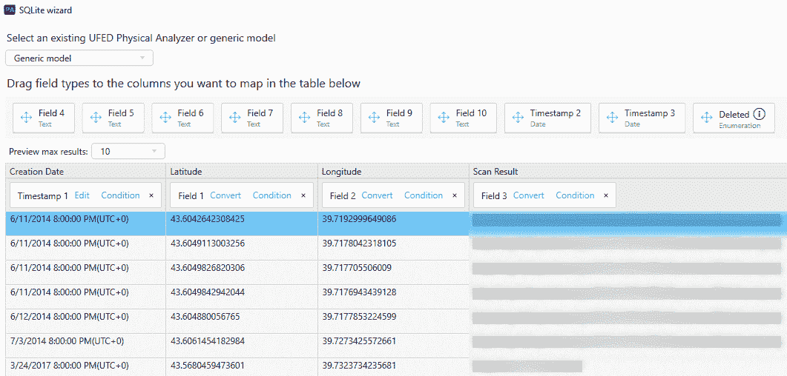

Choosing the model

一旦为列选择了模型和字段类型，就可以运行查询，将新的解析工件添加到提取中，然后添加到报告中。

# 使用 Magnet AXIOM

Magnet AXIOM 是市场上最有用的数字取证工具之一。它可以用于计算机和移动取证；该套件的最新版本引入了最新功能—云取证。至于 iOS 取证，它可以用于逻辑和文件系统获取，并支持所有 iOS 版本-从最早的到最新的。当然，它也可以用于解析 iTunes 备份和第三方工具(如 Elcomsoft iOS 取证工具包)创建的物理映像。

Magnet AXIOM 的最佳特性之一是它能够动态地开始处理提取数据，因此您不必等待采集过程完成就可以开始取证分析。

# Magnet AXIOM 的特点

以下是 Magnet AXIOM 的特性:

*   支持逻辑和文件系统(针对越狱设备)获取
*   支持加密和未加密的 iTunes 备份
*   恢复 500 多种工件类型
*   与其他流行的移动取证工具合作，如 Cellebrite UFED 和 XRY
*   包括内置的 SQLite 和 plist 查看器
*   创建所谓的**便携箱**，以便您可以与队友和第三方共享整套数据
*   可以生成几种流行格式的报告，如微软 Excel、PDF 和 HTML

# 利用 Magnet AXIOM 进行逻辑获取和分析

大家可能还记得，现代 iOS 设备最常见的收购是逻辑类型。以下是您如何使用 Magnet AXIOM 获得 iOS 设备的方法:

1.  从创建新案例开始:

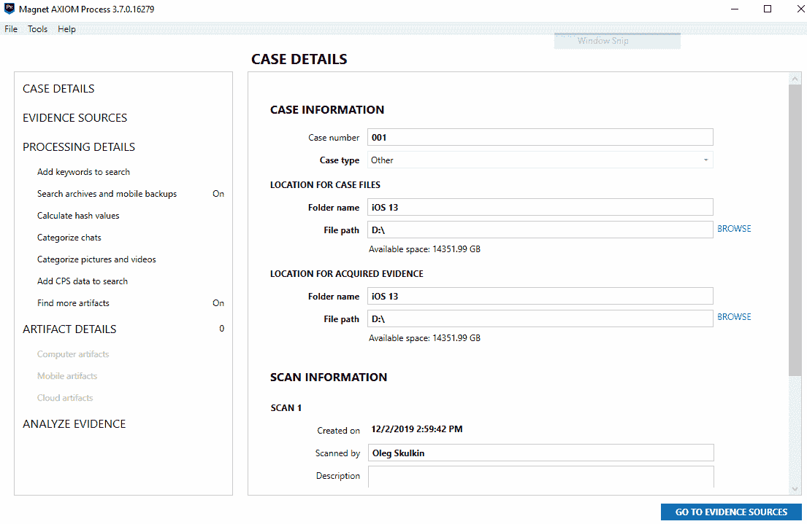

Creating a new case

2.  由于我们处理的是 iOS 设备，我们将选择移动选项:

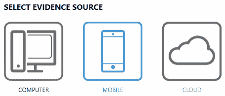

Selecting the evidence source

3.  有许多选项可供选择，但在我们的案例中，iOS 选项是正确的:

Selecting the evidence source

4.  获取证据有三种选择–我们可以选择已经获取的图像(例如，iTunes 备份或由第三方工具获取的文件系统图像)，从设备中提取数据，或者使用 GrayKey 进行获取。让我们选择第二个选项:

Choosing to acquire evidence

5.  我们的设备已被识别并准备好成像。如果看不到您的设备，请使用“未知”选项:

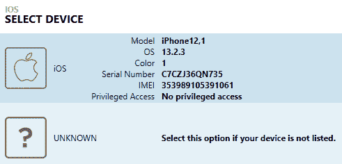

Selecting the device

6.  提取有两种类型-快速和完全。只有当您想要获取的设备被越狱时，“完整”选项才可用。在我们的例子中，它不是:

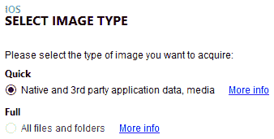

Choosing the image type

7.  系统将提示您输入备份密码。您可能还记得，通过这种方式，您可以获得更多数据，因此强烈建议:

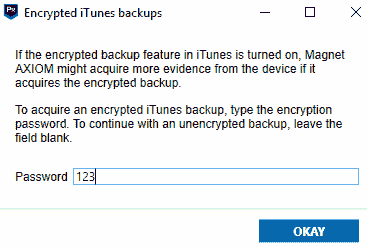

Encrypting the backup

8.  在开始采集和处理之前，例如，您可以选择感兴趣的关键词，使用磁铁。人工智能分类聊天，或配置动态应用查找器:

Processing details Dynamic App Finder is a Magnet IEF and AXIOM feature that's capable of finding potential mobile chat app databases located in images. You can read more about this feature at: [https://www.magnetforensics.com/mobile-forensics/using-dynamic-app-finder-to-recover-more-mobile-artifacts/](https://www.magnetforensics.com/mobile-forensics/using-dynamic-app-finder-to-recover-more-mobile-artifacts/).

9.  您可以从这里定制移动工件。例如，如果您只对聊天工件感兴趣，最好只选择这些类型的工件，因为它们会缩短处理时间:

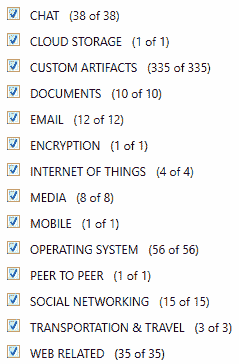

Selecting mobile artifacts

10.  “分析证据”按钮将开始采集和分析过程:

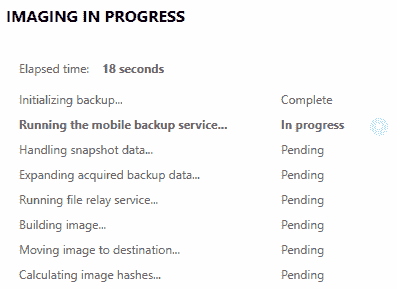

Imaging the evidence source

11.  Magnet AXIOM 有两个窗口:处理和检查。第一个可用于监控获取和处理证据源的过程，而第二个可用于分析提取和解析的数据。正如我们之前提到的，您可以在处理阶段结束之前开始分析。您所需要做的就是点击加载磁体检查的新结果:

Loading new results

12.  处理阶段结束后，您可以在“磁体检查”的“移动”部分找到解析的数据:

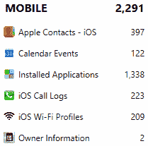

The MOBILE section

但是，当然，它不会包括一切；还有其他有价值的部分，您可以找到从 iOS 设备中提取的证据，如 CHAT、MEDIA 和 DOCUMENTS。

# 与贝尔卡索夫证据中心合作

贝尔卡索夫证据中心是另一个流行的数字取证工具，能够对 iOS 设备进行采集和分析。像 AXIOM 一样，它可以用于计算机、移动和云取证。

Belkasoft 证据中心的最佳功能之一是它能够处理损坏的 iTunes 备份。所以，如果你有一个备份，你的工具都无法处理，试试贝尔卡索证据中心；根据我们的经验，它将成功处理它。

# 贝尔卡索夫证据中心的特点

以下是贝尔卡索夫证据中心的特点:

*   支持逻辑和文件系统(针对越狱设备)获取
*   支持加密和未加密的 iTunes 备份
*   支持损坏的 iTunes 备份
*   恢复 700 多种工件类型
*   与其他流行的移动取证工具配合使用，如 Cellebrite UFED 和 XRY
*   包括内置的 SQLite 和 plist 查看器
*   包括一个免费的脚本模块 BelkaScript，它允许考官编写自己的脚本来自动完成一些常见的任务
*   可以生成几种流行格式的报告，如微软 Excel、PDF 和 HTML

# 贝尔卡索夫证据中心的逻辑采集和分析

由于备份处理和分析是 Belkasoft 证据中心的最佳功能之一，我们将在此向您介绍这一过程:

1.  让我们从创建一个新案例开始:

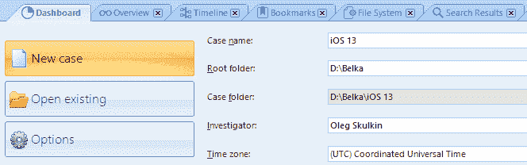

Creating a new case

2.  这里有多个选项–您可以处理以前获取的图像，如 iTunes 备份，或者选择首先从设备中提取数据。让我们从逻辑获取开始。选择移动选项:

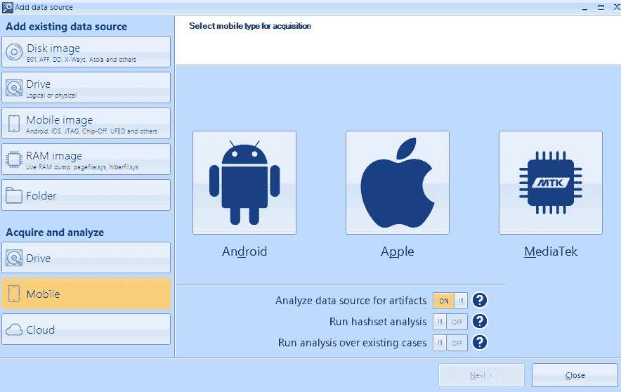

Choosing the data source

3.  既然我们面对的是 iOS 设备，那就选择苹果。您将看到可用设备的列表:

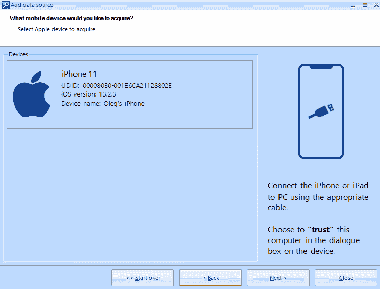

Devices available for acquisition

4.  我们的设备没有越狱，所以我们的选择要么是逻辑收购，要么是 iTunes 备份:

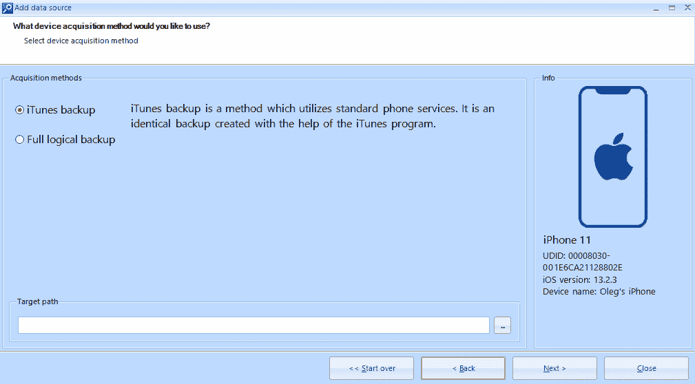

Choosing the acquisition method

5.  一旦采集完成，您可以选择感兴趣的工件。确保只选择与 iOS 相关的工件；这将减少处理时间:

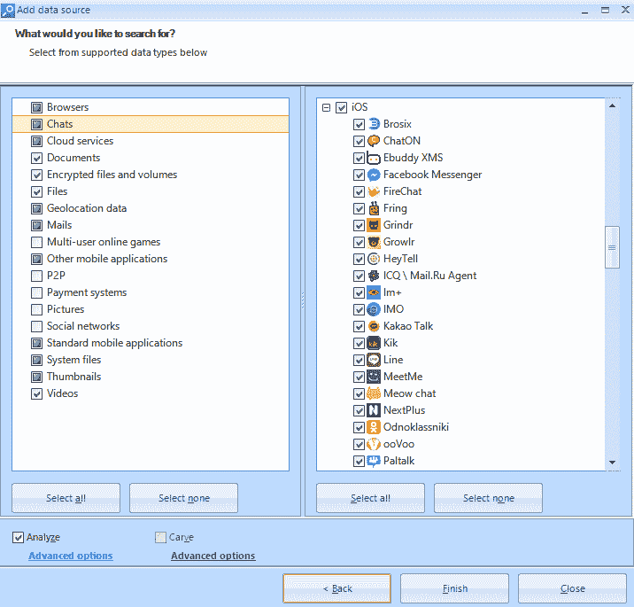

Choosing data types

6.  加工完成后，提取的工件将显示在概览选项卡中:

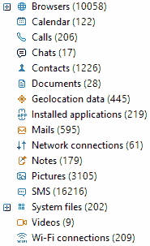

Overview tab

7.  最后，如果您想浏览取证图像的文件系统，请使用文件系统选项卡:

The File System tab

其他可用选项卡可能也很有用–仪表板选项卡向您显示当前正在处理的案例的所有可用信息，任务管理器选项卡允许您监控处理进度，搜索结果选项卡向您显示关键字搜索结果。

# 使用爱康软件电话查看器

Elcomsoft Phone Viewer 是一个工具，不仅能够解析和查看从 iOS 设备提取的数据，还能解析和查看从黑莓 10 和 Windows Phone 设备提取的数据。它提供了对逻辑和文件系统映像以及从云中提取的数据的只读、合法的访问。

# 爱康软件手机浏览器的特点

以下是爱康软件电话查看器的功能:

*   分析在线活动，包括网页浏览历史、书签和打开的标签。
*   提供对同步数据、密码和用户数据的访问，包括消息、呼叫日志和联系人。
*   它对多媒体文件进行分类，以便您更容易理解照片是在邮件中收到的还是用手机摄像头拍摄的。
*   聚合来自不同来源的位置数据。
*   支持逻辑映像、文件系统映像以及 iTunes 和 iCloud 备份。

# 使用 Elcomsoft 电话查看器进行文件系统分析

Elcomsoft Phone Viewer 不支持设备采集，但可以解析并帮助您查看已经使用 Elcomsoft iOS 取证工具包、Elcomsoft Cloud eXtractor 或几乎任何其他能够采集 iOS 设备的工具提取的数据。

要浏览以前使用 Elcomsoft iOS 取证工具包创建的文件系统映像，请执行以下步骤:

1.  启动 Elcomsoft 电话查看器并选择合适的数据源。在我们的案例中，这是 iOS 设备映像:

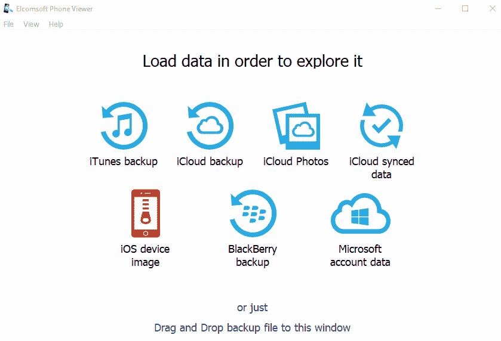

Choosing data source

2.  选择要导入的文件和要解析的工件:

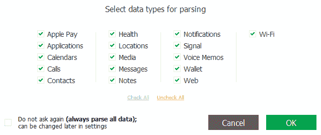

Choosing data types

3.  等待提取过程完成:

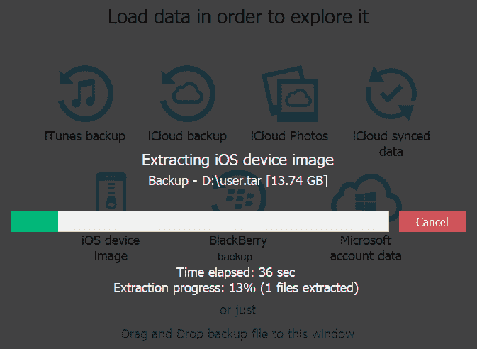

Extraction process

结果，您将获得设备的信息，以及分解成多个类别的工件:

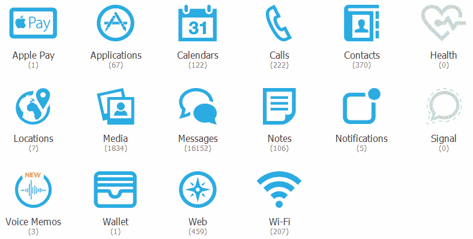

Parsed artifacts

现在，您可以轻松查看、过滤和导出您可能感兴趣的任何数据，只需点击相应的图标。

# 摘要

法医工具对检验人员很有帮助，因为它们不仅节省时间，而且使检验过程变得更加容易。然而，并不是每个人都有足够大的预算来购买商业工具来获得 iOS 收购。虽然存在免费的采集工具，但支持可能有限，可能需要多次提取才能获得与商业工具相同的数据量。

对于越狱设备，iOS 设备可以通过 SSH 连接到法医工作站进行实时检查，这是一些工具获取必要数据的方式。然而，这并不是建议那些刚接触移动取证的人使用的方法。为此，本章向您介绍了几种可用的 iOS 取证工具，并包括了执行采集和分析所需遵循的步骤。

您应该采取进一步的步骤来验证和理解每个可能在调查中使用的工具。我们建议您获取具有已知数据的测试设备，以确保没有遗漏任何东西，证据没有被更改，并且这些方法在可能的情况下为您提供对感兴趣数据的访问。

下一章将介绍安卓取证，并涵盖安卓平台的基本概念。