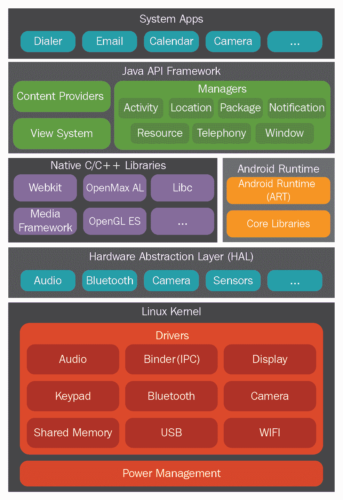
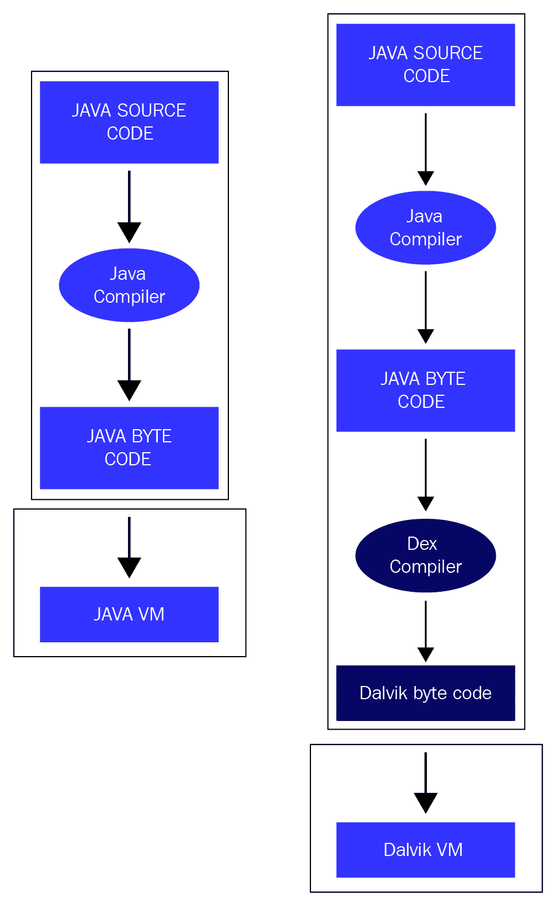
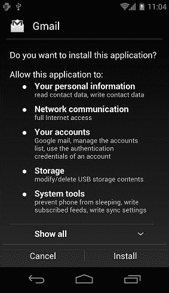
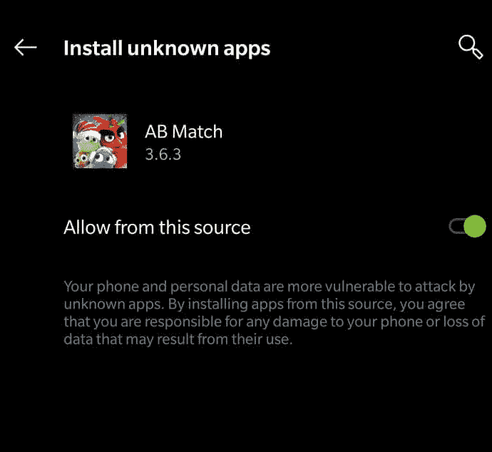
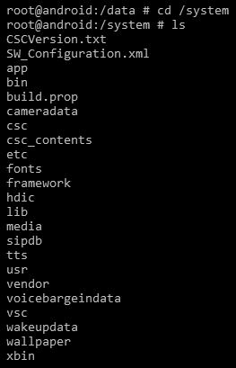
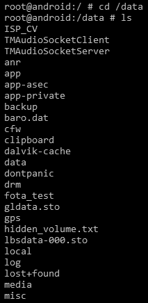
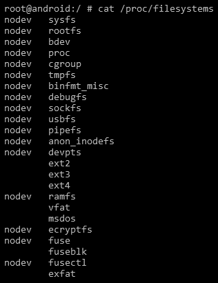
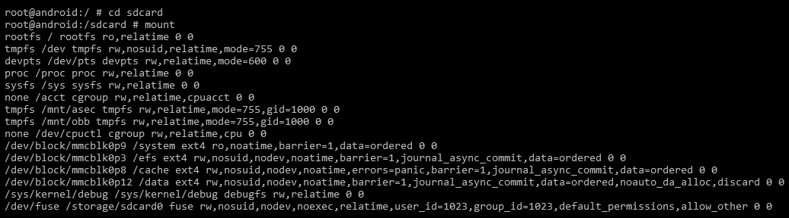
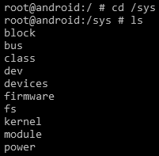
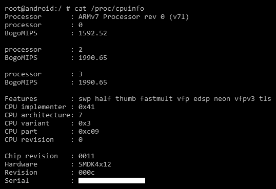

# 七、了解安卓

在前几章中，我们介绍了有关 iOS 设备的详细信息，包括文件系统结构、关键工件、备份文件以及获取和分析方法。从这一章开始，我们将重点介绍安卓平台以及如何在安卓设备上执行取证。对安卓生态系统、安全约束、文件系统和其他特性有很好的理解将在取证调查中证明是有用的。掌握这些基本知识将有助于法医专家在进行调查时做出明智的决定。

我们将在本章中讨论以下主题:

*   安卓的进化
*   安卓架构
*   安卓安全
*   安卓文件层次结构
*   安卓文件系统

# 安卓的进化

安卓是一个基于 Linux 的移动操作系统，为触摸屏移动设备开发。它由一个名为**开放手机联盟** ( **OHA** )的公司联盟开发，主要贡献者和商业营销者是谷歌。自发布之日起，安卓操作系统发生了巨大的变化。安卓于 2008 年正式向公众推出，搭载安卓 1.0 版本。随着 2009 年安卓 1.5 纸杯蛋糕的发布，以糖果命名安卓版本的传统诞生了。在接下来的 10 年里，版本名称也按字母顺序发布。然而，在 2019 年，谷歌宣布他们将结束基于糖果的命名，并在未来的版本中使用数字排序。最初几年，安卓版本每年更新两次以上，但最近几年，版本更新每年进行一次。最新的安卓重大更新是安卓 11，这是谷歌在 2020 年 2 月 19 日宣布的安卓操作系统的第 11 个主要版本。

以下是撰写本文时安卓版本历史的概述:

| **版本** | **版本名** | **发布年份** |
| 安卓 1.0 | 苹果派 | Two thousand and eight |
| 安卓 1.1 | 香蕉面包 | Two thousand and nine |
| 安卓 1.5 | 纸杯蛋糕 | Two thousand and nine |
| 安卓 1.6 | 甜甜圈 | Two thousand and nine |
| 安卓 2.0 | 艾克蕾尔 | Two thousand and nine |
| 安卓 2.2 | 弗罗约 | Two thousand and ten |
| 安卓 2.3 | 姜饼 | Two thousand and ten |
| 安卓 3.0 | 蜂窝 | Two thousand and eleven |
| 安卓 4.0 | 冰淇淋三明治 | Two thousand and eleven |
| 安卓 4.1 | 果冻豆 | Two thousand and twelve |
| 安卓 4.4 | KitKat | Two thousand and thirteen |
| 安卓 5.0 | 棒棒糖 | Two thousand and fourteen |
| 安卓 6.0 | 棉花糖 | Two thousand and fifteen |
| 安卓 7.0 | 牛轧糖 | Two thousand and sixteen |
| 安卓 8.0 | 奥利欧 | Two thousand and seventeen |
| 安卓 9.0 | 馅饼 | Two thousand and eighteen |
| 安卓 10.0 | Q | Two thousand and nineteen |
| 安卓 11 | 稀有 | Two thousand and twenty |

这种演变也极大地影响了安卓的安全考虑以及取证技术的应用。例如，安卓的初始版本没有**全磁盘加密** ( **FDE** )机制来在设备内以加密格式存储数据。因此，对于法医调查员来说，从设备中提取数据比现在容易得多。随着安卓版本的每一次更新，增加了越来越多的安全功能，如 app 权限、**可信执行环境** ( **TEE** )和安全内核，整体上提升了平台的安全性，但同时也使数据提取过程复杂化。我们将在本章的其他部分详细介绍这些安全特性。

现在我们已经了解了安卓的历史和版本，我们将在下一节中了解安卓架构。

# 安卓架构

为了在处理 Android 时有效地理解取证概念，您应该对 Android 架构有一个基本的了解。就像计算机一样，任何与用户交互并执行复杂任务的计算系统都需要操作系统来有效地处理任务。这个操作系统(无论是桌面操作系统还是手机操作系统)负责管理系统的资源，为应用提供一种与硬件或物理组件对话的方式来完成某些任务。安卓是目前最受欢迎的移动操作系统，旨在为移动设备提供动力。你可以在[https://developer.android.com/about/android.html](https://developer.android.com/about/android.html)了解更多。

安卓作为一个开源操作系统，在 Apache License 下发布代码，Apache License 是众多开源许可证之一。实际上，这意味着任何人(尤其是设备制造商)都可以访问它，自由修改它，并根据任何设备的要求使用软件。这是它被广泛接受的主要原因之一。使用安卓系统的著名玩家包括三星、宏达电、索尼和 LG。

与任何其他平台一样，安卓系统由一层层运行的堆栈组成。要了解安卓生态系统，必须对这些层是什么以及它们做什么有一个基本的了解。

下图总结了安卓软件堆栈中涉及的各个层:



Android architecture 
This image is modified based on work created and shared by the Android Open Source Project: https://developer.android.com/guide/platform
License: https://creativecommons.org/licenses/by/4.0/

这些层中的每一层都执行支持特定操作系统功能的若干操作。每一层都向位于其上的层提供服务。让我们更详细地看看它们。

# Linux 内核层

安卓操作系统建立在 Linux 内核之上，谷歌做了一些架构上的改变。选择 Linux 内核有几个原因。最重要的是，Linux 是一个可移植的平台，可以在不同的硬件上轻松编译。内核充当设备上软件和硬件之间的抽象层。以照相机为例。当您使用设备上的相机按钮拍照时会发生什么？在某些时候，硬件指令(按下按钮)必须转换为软件指令(拍摄照片并将其存储在图库中)。内核包含驱动程序来促进这个过程。当用户按下按钮时，指令会转到内核中相应的相机驱动程序，该驱动程序会向相机硬件发送必要的命令，类似于在键盘上按键时发生的情况。简而言之，内核命令中的驱动程序控制底层硬件。安卓架构模型中显示，内核包含 Wi-Fi、蓝牙、**通用服务总线** ( **USB** )、音频、显示等相关驱动。

Linux 内核负责管理 Android 的核心功能，如进程管理、内存管理、安全和联网。在安全性和流程管理方面，Linux 是一个成熟的平台。安卓利用现有的 Linux 开源操作系统为其生态系统奠定了坚实的基础。安卓的每个版本都有不同版本的底层 Linux 内核。众所周知，奥利奥安卓版本使用 Linux 内核 3.18 或 4.9，而 Pie 版本使用 Linux 内核 4.4、4.9 或 4.14。安卓 Q，目标是 Linux 内核 4.9、4.14 或 4.19。实际内核取决于单个设备。

# 硬件抽象层

设备硬件能力通过**硬件抽象层** ( **HAL** )暴露给高级 Java 框架。HAL 由几个库模块组成，这些模块为特定类型的硬件组件实现接口。这允许硬件供应商在不改变更高级系统的情况下实现功能。

# 图书馆

安卓架构的下一层由安卓的原生库组成。这些库是用 C 或 C++编写的，帮助设备处理不同种类的数据。例如，SQLite 库对于存储和检索数据库中的数据非常有用。其他库包括媒体框架、网络工具包、表面管理器和**安全套接字库** ( **SSL** )。

媒体框架库充当向其他底层库提供服务的主要接口。WebKit 库在网络浏览器中提供网页，Surface Manager 库维护图形。在同一层，我们有**安卓运行时** ( **ART** )和核心库。ART 负责在安卓设备上运行应用。术语*运行时间*是指从应用启动到关闭的时间。

# 达尔维克虚拟机

你在安卓设备上安装的所有应用都是用 Java 编程语言编写的。当一个 Java 程序被编译时，我们得到字节码。一个**虚拟机** ( **虚拟机**)是一个作为操作系统的应用——也就是说，可以使用虚拟机在苹果电脑上运行视窗操作系统的一个实例，反之亦然。 **Java 虚拟机** ( **JVM** )就是这样一个可以执行前面提到的字节码的 VM。但是安卓 5.0 之前的安卓版本使用一种叫做 DVM 的东西来运行他们的应用。

DVM 运行 Dalvik 字节码，这是由**Dalvik executive**(**DEX**)编译器转换的 Java 字节码。因此，使用`dx`工具将`.class`文件转换为`dex`文件。与 Java 字节码相比，Dalvik 字节码更适合低内存和低处理环境。此外，请注意，JVM 的字节码由一个或多个`.class`文件组成，这取决于应用中存在的 Java 文件的数量，但是达尔维克字节码仅由一个`dex`文件组成。每个安卓应用都运行自己的 DVM 实例。这是安卓安全的一个重要方面，将在[第 8 章](08.html)、*安卓取证设置和预数据提取技术*中详细阐述。

下图提供了 Android 的 DVM 与 Java 的 JVM 有何不同的见解:



JVM versus DVM

现在我们已经理解了 JVM 和 DVM 的基本区别，让我们快速看一下 ART。

# 艺术

从 Android 5.0 棒棒糖版本开始，Dalvik 被 ART 取代，早期版本的 Android 使用了 Dalvik 的**即时** ( **JIT** )编译(频繁执行的操作被识别并动态编译为本机机器码)。这些经常使用的字节码的本机执行称为跟踪，提供了显著的性能改进。

与达尔维克不同，ART 使用的是提前**(**【AOT】**)编译，即在安装时将整个应用编译成本机代码。这自动增加了应用的安装时间，但一个主要优点是，这消除了达尔维克的解释和基于跟踪的 JIT 编译，从而提高了效率并降低了功耗。ART 使用一个名为`dex2oat`的实用程序，它接受`DEX`文件作为输入，并为目标设备生成一个可执行的编译应用。有了 ART，**优化了 DEX** ( **)。odex** )文件已替换为**可执行和可链接格式** ( **ELF** )可执行文件。**

 **# Java 应用编程接口框架层

应用框架是负责处理电话基本功能的层，如资源管理、处理呼叫等。这是安装在设备上的应用直接与之对话的一个模块。以下是应用框架层中的一些重要模块:

*   **电话管理器**:这个模块管理所有的语音通话。
*   **内容提供者**:该模块管理不同应用之间的数据共享。
*   **资源管理器**:该模块管理应用中使用的各种资源。

最后一层是系统应用层，这将在下面讨论。

# 系统应用层

这是用户可以直接与设备交互的最顶层。有两种应用—预安装的应用和用户安装的应用。设备附带了预安装的应用，如拨号器、网络浏览器和通讯录。用户安装的应用可以从不同的地方下载，如谷歌 Play 商店、亚马逊市场等。您在手机上看到的一切(联系人、邮件、相机等)都是应用。

到目前为止，我们已经了解了安卓架构和重要的构建模块。我们现在将深入研究安卓操作系统的一些固有安全特性。

# 安卓安全

安卓的设计特别注重安全性。安卓作为一个平台，提供并实施某些功能，通过多层安全保护手机上的用户数据。有一些安全的默认值可以保护用户，也有一些产品可以被开发社区用来构建安全的应用。作为一名法医调查员，了解安卓安全的内部是至关重要的，因为它有助于确定在给定情况下应用的最佳技术、某些技术的技术限制等。

接下来的几节将帮助我们更多地了解安卓的安全特性和产品。

A detailed explanation on Android security can be found at [https://source.android.com/security/](https://source.android.com/security/).

# 安全内核

内核是任何操作系统安全的核心。通过选择多年来发展成为可信平台的 Linux，安卓建立了非常坚实的安全基础。大多数 Linux 内核固有的安全特性都被安卓自动采用。例如，Linux 的基于用户的权限模型实际上在安卓系统上运行良好。如前所述，Linux 内核内置了许多特定的代码。随着每个安卓版本的发布，内核版本也发生了变化。下表显示了安卓版本及其对应的内核版本:

| **Android 版本** | **Linux 内核版本** |
| one | 2.6.25 |
| One point five | 2.6.27 |
| one point six | 2.6.29 |
| Two point two | 2.6.32 |
| Two point three | 2.6.35 |
| Three | 2.6.36 |
| Four | 3.0.1 |
| Four point one | 3.0.31 |
| Four point two | 3.4.0 |
| Four point two | 3.4.39 |
| Four point four | Three point eight |
| Five | 3.16.1 |
| Six | 3.18.1 |
| Seven | 4.4.1 |
| Eight | Four point one |
| Nine | 4.4、4.9 和 4.14 |
| Ten | 4.9、4.14 和 4.19 |

Linux 内核会自动为安卓平台带来一些固有的安全特性，例如:

*   基于用户的权限模型
*   正在运行的进程的隔离(应用沙箱)
*   安全**进程间通信** ( **IPC** )

我们现在将了解这些特性中的每一个。

# 权限模型

如下图所示，任何安卓应用都必须被用户授予访问敏感功能(如互联网、拨号器等)的权限。这为用户提供了提前知道应用正在访问设备上的哪些功能的机会。简而言之，它需要用户的许可来执行任何类型的恶意活动(窃取数据、损害系统等)。

这种模式有助于用户防止攻击，但如果用户没有意识到并放弃了很多权限，就会给他们带来麻烦(请记住——在任何设备上安装恶意软件时，最薄弱的环节总是用户)。



The permission model in Android

在安卓 6.0 之前，用户需要在安装期间授予权限。用户要么接受所有权限，要么不安装应用。但是，从安卓 6.0 开始，用户在应用运行时授予应用权限。这个新的权限系统还通过允许用户授予选择性权限，让用户对应用的功能有更多的控制。例如，用户可以拒绝特定应用访问他们的位置，但提供对互联网的访问。用户可以通过进入应用的设置屏幕随时撤销权限。从取证的角度来看，这意味着可以从设备中提取的信息类型不仅取决于设备和安装的应用，还取决于用户配置的权限。

# 应用沙箱

在 Linux 系统中，每个用户被分配一个唯一的**用户标识符** ( **UID** )，并且用户被隔离，这样一个用户就不能访问另一个用户的数据。但是，特定用户下的所有应用都以相同的权限运行。同样，在安卓系统中，每个应用都作为一个唯一的用户运行。换句话说，UID 被分配给每个应用，并作为单独的进程运行。这个概念确保了内核级别的应用沙箱。内核通过利用现有的 Linux 概念来管理应用之间的安全限制，例如 UID 和**组标识符** ( **GID** )。如果一个应用试图做一些恶意的事情，比如读取另一个应用的数据，这是不允许的，因为该应用没有用户权限。因此，操作系统保护一个应用不访问另一个应用的数据。

# 安全仪表板组合仪表

安卓提供了安全的 IPC，通过它，应用中的一个活动可以向相同或不同应用中的另一个活动发送消息。为了实现这一点，安卓提供了 IPC 机制:意图、服务、内容提供商等等。这与为安卓平台编写第三方应用的开发人员更相关。在幕后，取证工具利用其中一些概念来获取设备信息。

# 应用签名

所有安装的应用都必须经过数字签名。开发人员只有在签署应用后，才能将其应用放入谷歌的 Play Store。应用签名所用的私钥由开发人员持有。使用同一个密钥，开发人员可以向他们的应用提供更新，在应用之间共享数据，等等。未签名的应用，如果试图安装，将被谷歌播放或安卓设备上的软件包安装程序拒绝。在 Android 8.0 及更高版本中，用户必须导航到“安装未知应用”设置才能运行未签名的应用，如下图所示:



Install unknown apps screen in Android

现在我们已经掌握了一些关于数字签名应用的基本知识，让我们来看看 Android 中的一个安全特性。

# 安全性增强的 Linux (SELinux)

SELinux 是 Android 4.3 中引入的一项安全功能，在 Android 5.0 中得到全面实施。在此之前，安卓安全基于**自主访问控制** ( **DAC** )，这意味着应用可以请求权限，用户可以授予或拒绝这些权限。因此，恶意软件可以通过获得这些权限对手机造成严重破坏。但是 SE 安卓使用**强制访问控制** ( **MAC** )，这确保了应用在隔离的环境中工作。因此，即使用户安装了恶意软件应用，恶意软件也无法访问操作系统并损坏设备。SELinux 用于在所有进程上实施 MAC，包括以 root 权限运行的进程。在 SELinux 中，默认情况下，任何不被明确允许的东西都会被拒绝。SELinux 可以在两种全局模式中的一种模式下运行: **Permissive** 模式，记录权限拒绝，但不强制执行；以及**强制**模式，该模式记录并强制执行权限拒绝。更多关于 SELinux 的细节可以在[https://source.android.com/security/selinux/concepts](https://source.android.com/security/selinux/concepts)找到。

# 场减速器(Field Decelerator)

凭借安卓 6.0 棉花糖，谷歌已经授权 FDE 为大多数设备提供服务，前提是硬件符合某些最低标准。加密是使用密钥将数据转换成密文的过程。在安卓设备上，FDE 指的是使用密钥加密所有用户数据的过程。该密钥依次由用户设置的设备的**个人识别号** ( **个人识别码**)/模式/密码加密。一旦设备被加密，所有用户创建的数据都会在写入磁盘之前自动加密，所有读取操作都会在将数据返回到调用进程之前自动解密。安卓系统中的 FDE 只能使用**嵌入式多媒体卡** ( **eMMC** )和类似的闪存设备，这些设备作为块设备呈现给内核。

从安卓 7.x 开始，谷歌决定将加密功能从 FDE 转移到**基于文件的加密** ( **FBE** )。在 FBE，不同的文件用不同的密钥加密。通过这样做，可以独立访问这些文件，而不需要解密整个分区。因此，系统现在可以显示打开的通知或访问与引导相关的文件，而不必等到用户解锁手机。

# 安卓密钥库

安卓密钥库用于保护敏感的密钥免受未经授权的访问。存储在密钥库中的密钥可用于执行加密操作，但绝不能从密钥库外部提取。硬件支持的密钥库提供硬件级别的安全性，也就是说，即使操作系统受到损害，硬件模块中的密钥仍然是安全的。

# TEE

TEE 是一个隔离的区域(通常是一个单独的微处理器)，旨在保证存储在其中的数据的安全性，并完整地执行代码。移动设备上的主处理器被认为是不可信的，不能用于存储机密数据(如密钥)。因此，TEE 被专门用于执行这样的操作，并且在主处理器上运行的软件将需要使用秘密数据的任何操作委托给 TEE 处理器。

# 已验证启动

验证引导试图确保在安卓设备上执行的所有代码都来自合法来源，而不是攻击者或骗子。它建立了完整的信任链，并防止任何其他操作系统的侧面加载。在设备启动期间，在移交执行之前，每个阶段都会验证下一阶段的完整性和真实性。

我们现在将研究安卓设备上可用的各种分区和文件系统。

# 安卓文件层次结构

为了在任何系统(桌面或移动)上执行取证分析，了解底层文件层次结构非常重要。对安卓如何在文件和文件夹中组织数据的基本理解有助于法医分析师将研究范围缩小到特定问题。就像任何其他操作系统一样，安卓使用几个分区。本章深入介绍了一些最重要的分区以及存储在其中的内容。

再次值得一提的是，Android 使用的是 Linux 内核。因此，如果你熟悉类似 Unix 的系统，你会很好地理解安卓系统中的文件层次结构。对于不太熟悉 Linux 模型的人来说，这里有一些基本信息:在 Linux 中，文件层次结构是一个单一的树，树的顶部表示为`/`(称为*根*)。这不同于在驱动器中组织文件的概念(如 Windows)。无论文件系统是本地的还是远程的，它都将出现在根目录下。

安卓文件层次结构是现有 Linux 层次结构的定制版本。根据设备制造商和底层的 Linux 版本，这个层次结构可能会有一些微不足道的变化。以下是大多数安卓设备通用的重要文件夹列表。列出的一些文件夹只能通过根访问看到。扎根是在安卓设备上获得特权访问的过程。关于扎根和执行`adb`命令的更多细节(如下表所示)将在[第 8 章](08.html)、*安卓取证设置和预数据提取技术*中详细介绍:

*   `/boot`:顾名思义，这个分区有手机开机所需的信息和文件。它包含内核和**随机存储器** ( **内存**)磁盘，所以没有这个分区，手机无法启动进程。驻留在内存中的数据具有丰富的价值，应该在取证过程中捕获。
*   `/system`:这个分区包含内核和 RAM 磁盘以外的系统相关文件。此文件夹不应被删除，因为这将使设备无法启动。可以使用以下命令查看该分区的内容:



/system partition

*   * `/recovery`:这是为备份目的而设计的，允许设备启动进入恢复模式。在恢复模式下，您可以找到修复手机安装的工具。
*   `/data`:这是包含每个应用数据的分区。属于用户的大部分数据(如联系人、短信和拨号号码)都存储在此文件夹中。从取证的角度来看，该文件夹非常重要，因为它保存了有价值的数据。可以使用以下命令查看数据文件夹的内容:



/data partition

*   * `/cache`:这是用来存储经常访问的数据和一些日志的文件夹，以便更快地检索。`/cache`分区对于法医调查也很重要，因为此处的数据可能不再存在于`/data`分区中。
*   * `/misc`:顾名思义，这个文件夹包含杂项设置的信息。这些设置主要定义设备的状态，即开/关。关于硬件设置、USB 设置等信息可以从这个文件夹访问。
*   `/sdcard`:这是保存**安全数字** ( **SD** )卡上所有信息的分区。它很有价值，因为它可以包含图片、视频、文件、文档等信息。

现在我们已经理解了 Android 文件层次结构，并查看了其中的重要文件夹，让我们在下一节中看看文件系统。

# 安卓文件系统

理解文件系统是取证方法的一个重要部分。关于文件系统的属性和结构的知识在取证分析中被证明是有用的。文件系统指的是从卷中存储、组织和检索数据的方式。基本安装可能基于一个分割成几个分区的卷；这里，每个分区可以由不同的文件系统管理。就像在 Linux 中一样，安卓使用挂载点，而不是驱动器(即`C:`或`E:`)。

In Linux, mounting is an act of attaching an additional filesystem to the currently accessible filesystem of a computer. The filesystems in Linux are not accessed by drive names but instead are organized into a multi-level hierarchy with a directory called `root` at the top. Each new filesystem is added into this single filesystem tree when it is mounted.

无论文件系统存在于本地设备还是远程设备上，都没有任何区别。一切都在以`root`开始的单一层级中。每个文件系统都定义了自己的规则来管理卷中的文件。根据这些规则，每个文件系统提供不同的文件检索速度、安全性、大小等。Linux 使用几个文件系统，安卓也是如此。从取证的角度来看，了解安卓系统使用哪些文件系统以及识别对调查有意义的文件系统非常重要。例如，存储用户数据的文件系统是我们最关心的，而不是用来引导设备的文件系统。

# 在安卓设备上查看文件系统

安卓内核支持的文件系统可以通过检查`proc`文件夹中`filesystems`文件的内容来确定。可以使用`# cat /proc/filesystems`命令查看该文件的内容:



Filesystems on an Android device

在前面的输出中，第一列告诉我们文件系统是否安装在设备上。具有`nodev`属性的未安装在设备上。

第二列列出了设备上存在的所有文件系统。一个简单的`mount`命令显示设备上可用的不同分区，如下所示:


Partitions on the Android device

接下来，让我们看看安卓系统上常见的文件系统。

# 安卓上常见的文件系统

安卓系统中的文件系统主要分为三大类，如下所示:

*   闪存文件系统
*   基于媒体的文件系统
*   伪文件系统

让我们详细看看每一个。

# 闪存文件系统

闪存是一种持续供电的**非易失性存储器** ( **NVM** )，在没有电源的情况下保存数据。闪存可以被擦除，并以块为单位重新编程。虽然支持的文件系统因设备和底层 Linux 内核而异，但常见的闪存文件系统如下:

*   **扩展文件分配表** ( **exFAT** )是一个微软专有的文件系统，被创建用于 u 盘，如 u 盘和 SD 卡。由于许可证要求，它不是标准 Linux 内核的一部分。但是，仍然有一些制造商为这个文件系统提供支持。
*   **Flash 友好文件系统** ( **F2FS** )于 2013 年 2 月发布，支持运行 Linux 3.8 内核的三星设备。F2FS 依赖于优化 NAND 闪存的日志结构方法。离线支持特性是这个文件系统的一个亮点，尽管它仍然是暂时的，正在被更新。
*   **又一个闪存文件系统 2** ( **YAFFS2** )是 2002 年发布的开源单线程文件系统。它主要是为了在处理 NAND 闪存时速度更快而设计的。YAFFS2 利用 - **波段** ( **OOB** )的 **Out** - **，这在取证过程中往往没有被正确捕捉或解码，给分析带来困难。我们将在[第 9 章](https://cdp.packtpub.com/practical_mobile_forensics__fourth_edition/wp-admin/post.php?post=60&action=edit#post_470)、*安卓数据提取技术*中进一步讨论。YAFFS2 一度是最受欢迎的版本，现在仍广泛用于安卓设备。YAFFS2 是一个日志结构文件系统。即使在突然断电的情况下，数据完整性也得到保证。2010 年，有一则公告称，在姜饼之后的版本中，设备将从 YAFFS2 移动到**第四扩展文件系统** ( **EXT4** )。目前，较新的内核版本不支持 YAFFS2，但某些移动制造商可能仍会继续支持它。**
*   **强大的文件系统** ( **RFS** )支持三星设备上的 NAND 闪存。RFS 可以总结为一个**文件分配表 16** ( **FAT16** )或 FAT32 文件系统，借此通过事务日志启用日志记录。很多用户抱怨三星应该坚持 EXT4。众所周知，RFS 的延迟时间会降低安卓的功能。

接下来是基于媒体的文件系统。

# 基于媒体的文件系统

以下是安卓设备支持的一些基于媒体的文件系统。

**扩展文件系统** ( **EXT** )是 1992 年专门为 Linux 内核推出的，是最早的文件系统之一，它使用虚拟文件系统。EXT2、EXT3 和 EXT4 是后续版本。日志是 EXT3 相对于 EXT2 的主要优势。对于 EXT3，如果出现意外关闭，则不需要验证文件系统。随着移动设备实现双核处理器，EXT4 文件系统变得越来越重要。众所周知，YAFFS2 文件系统在双核系统上存在瓶颈。在姜饼版安卓系统中，YAFFS 文件系统被替换为 EXT4。

以下是三星 Galaxy 手机上使用 EXT4 的挂载点:

```
/dev/block/mmcblk0p9 /system ext4 ro,noatime,barrier=1,data=ordered 0    0
/dev/block/mmcblk0p3 /efs ext4 rw,nosuid,nodev,noatime,barrier=1,journal_async_commit,data=ordered 0 0
/dev/block/mmcblk0p8 /cache ext4 rw,nosuid,nodev,noatime,barrier=1,journal_async_commit,data=ordered 0 0
/dev/block/mmcblk0p12 /data ext4 rw,nosuid,nodev,noatime,barrier=1,journal_async_commit,data=ordered,n oauto_da_alloc,discard 0 0  
```

**虚拟文件分配表** ( **VFAT** )是 FAT16 和 FAT32 文件系统的扩展。大多数安卓设备都支持微软的 FAT32 文件系统。几乎所有主要操作系统都支持它，包括 Windows、Linux 和 macOS。这使得这些系统能够轻松读取、修改和删除安卓设备 FAT32 部分的文件。大多数外部 SD 卡都是使用 FAT32 文件系统格式化的。

观察以下输出，它显示了`/sdcard`和`/secure/asec`挂载点使用 VFAT 文件系统:



mount command output in Android 

最后一类是伪文件系统。

# 伪文件系统

伪文件系统，顾名思义，不是实际的文件，而是文件的逻辑分组。以下是安卓系统中一些重要的伪文件系统:

*   根文件系统(`rootfs`)是安卓的主要组件之一，包含启动设备所需的所有信息。当设备启动引导过程时，它需要访问许多核心文件，因此，它安装了根文件系统。如前面的`mount`命令行输出所示，该文件系统安装在`/` ( `root`文件夹)上。因此，这是所有其他文件系统缓慢装载的文件系统。如果该文件系统损坏，设备将无法启动。
*   `sysfs`文件系统安装了`/sys`文件夹，其中包含关于设备配置的信息。以下输出显示了安卓设备中`sys`目录下的各种文件夹:



Folders under /sys directory in Android

由于这些文件夹中的数据大多与配置有关，因此这对法医调查人员来说通常没有太大意义。但是，在某些情况下，我们可能需要检查电话上是否启用了特定设置，在这种情况下，分析该文件夹可能会很有用。

Note that each folder consists of a large number of files. Capturing this data through forensic acquisition is the best method to ensure that this data is not changed during an examination.

*   `devpts`文件系统为安卓设备上的终端会话提供了一个接口。安装在`/dev/pts`处。每当终端连接建立时，例如当`adb`外壳连接到安卓设备时，就会在`/dev/pts`下创建一个新节点。以下是当`adb`外壳连接到设备时显示的输出:

```
shell@Android:/ $ ls -l /dev/pts ls -l /dev/pts
crw------- shell shell 136, 0 2013-10-26 16:56 0
```

*   `cgroup`文件系统代表**控制组**。安卓设备使用这个文件系统来跟踪他们的工作。他们负责汇总任务并跟踪它们。在法医分析期间，这些数据通常不是很有用。
*   `proc`文件系统包含`/proc`目录中内核数据结构、进程和其他系统相关信息的信息。例如，`/sys`目录包含与内核参数相关的文件。类似地，`/proc/filesystems`显示设备上可用文件系统的列表。以下命令显示设备的**中央处理器** ( **中央处理器**)的所有信息:



Output of the cpuinfo command on an Android device 

同样，当您遍历这些文件时，还有许多其他有用的文件可以提供有价值的信息。

*   `tmpfs`文件系统是设备上的临时存储设施，用于将文件存储在随机存取存储器(易失性存储器)中。使用内存的主要优势是更快的访问和检索。但是一旦设备重新启动或关闭，这些数据将不再可访问。因此，对于法医调查员来说，在设备重启之前检查内存中的数据，或者通过内存获取方法提取数据是非常重要的。

如今的取证工具可以轻松安装这些文件系统，并在**图形用户界面** ( **图形用户界面**)屏幕上显示内容，从而使取证调查人员能够轻松导航和解析文件。在安卓取证的最初几天，调查人员通常必须运行一组 Linux 或 Windows 命令来格式化和查看这些文件系统。

# 摘要

在这一章中，我们介绍了安卓操作系统的底层特性、文件系统以及在取证调查中有用的其他细节。我们了解到安卓系统内置的有趣的安全功能。与 iOS 不同，安卓有几种变体，因为许多设备运行安卓操作系统，而且每种都可能有不同的文件系统和独特的功能。安卓的开放性和可定制性也改变了数字取证的竞争环境。这些知识将有助于理解法医采集技术。

在下一章中，我们将讨论如何在执行分析之前设置取证工作站。**