# 安卓数据提取技术

使用任何在[第 8 章](08.html)*安卓取证设置和预数据提取技术*中解释的屏幕锁定旁路技术，检查者可以尝试访问锁定的设备。一旦设备可以访问，下一个任务就是提取设备上存在的信息。这可以通过将各种数据提取技术应用于安卓设备来实现。

本章将帮助您识别安卓设备上的敏感位置，并解释可应用于设备的各种逻辑和物理技术，以提取必要的信息。

在本章中，我们将涵盖以下主题:

*   了解数据提取技术
*   手动数据提取
*   逻辑数据提取
*   物理数据提取，包括安卓设备和 SD 卡成像、JTAG 和芯片外技术

# 了解数据提取技术

驻留在安卓设备上的数据可能是民事、刑事或内部调查的组成部分，这些调查是公司内部调查的一部分。在处理涉及安卓设备的调查时，你作为法医，需要注意法医过程中需要注意的问题；这包括确定是否允许 root 访问(通过同意或法律授权)以及在调查期间可以提取和分析哪些数据。例如，在涉及跟踪的刑事案件中，法院可能只允许在属于嫌疑人的安卓设备上提取和分析短信、通话记录和照片。在这种情况下，逻辑上只捕获那些特定的项目可能是最有意义的。但是，最好从设备中获取完整的物理数据提取，并且只检查法院允许的区域。您永远不知道您的调查可能会导向何处，最好立即从设备中获取尽可能多的数据，而不是希望在同意范围发生变化时获得完整的图像。安卓设备上的数据提取技术可以分为三种类型:

*   手动数据提取
*   逻辑数据提取
*   物理数据提取

如[第 1 章](#)、*移动取证简介*所述，手动提取涉及正常浏览设备并捕获任何有价值的信息，而逻辑提取涉及访问文件系统，物理提取涉及提取设备的逐位图像。这些类型中每一种的提取方法将在下面的章节中详细描述。

Some methods may require the device to be rooted to fully access the data. Each method has different implications and their success rates will depend on the tool and method used as well as the device's make and model.

# 手动数据提取

这种提取方法需要您利用移动设备的正常用户界面来访问内存中的内容。您通常会通过访问不同的菜单来浏览设备，以查看呼叫日志、短信和即时消息聊天等详细信息。每个屏幕的内容都是通过拍照捕捉的，可以作为证据呈现出来。

这种检查的主要缺点是，只能调查通过操作系统(在用户界面模式下)可访问的文件。手动检查设备时必须小心，因为很容易按错按钮并擦除或添加数据。手动提取应作为验证使用其他方法提取的发现的最后手段。某些情况可能会要求您首先进行手动检查。这可能包括生命或死亡情况或失踪人员的情况，在这些情况下，对设备的快速扫描可能会将警方引向个人。

# 逻辑数据提取

逻辑数据提取技术通过与操作系统交互和访问文件系统来提取设备上存在的数据。这些技术非常重要，因为它们提供了有价值的数据，适用于大多数设备，并且易于使用。再一次，在提取数据时，扎根的概念进入了画面。逻辑技术实际上并不需要根访问来提取数据。但是，在设备上拥有根访问权限允许您访问设备上的所有文件。这意味着一些数据可以在非根设备上提取，而根访问将打开设备并提供对设备上所有文件的访问。因此，拥有对设备的根访问权将极大地影响可以通过逻辑技术提取的数据的数量和种类。以下部分解释了可用于从安卓设备中逻辑提取数据的各种技术。

# 亚行拉动数据提取

如前所述，`adb`是一个命令行工具，帮助您与设备通信以检索信息。使用`adb`，您可以从设备上的所有文件或您感兴趣的相关文件中提取数据。作为逻辑提取的一部分，这是最广泛使用的技术。

要通过`adb`访问安卓设备，必须启用 USB 调试选项。从 Android 4.2.2 开始，由于安全的 USB 调试，连接设备的主机也要经过授权。如果设备被锁定且未启用 USB 调试，请尝试使用[第 8 章](08.html)、*安卓取证设置和预数据提取技术*中解释的技术绕过屏幕锁定。

作为一名法医，了解数据在安卓设备上是如何存储的，以及了解重要和敏感信息存储在哪里，以便能够相应地提取数据，这对您来说非常重要。应用程序数据通常包含大量可能与调查相关的用户数据。如第 10 章、*安卓数据分析和恢复*所述，所有与感兴趣的应用程序相关的文件都应进行相关性检查。应用程序数据可以存储在以下位置之一:

*   **共享首选项**:这以轻量级的 XML 格式存储键值对中的数据。共享首选项文件存储在应用程序`/data`目录的`shared_pref`文件夹中。
*   **内部存储**:存储设备内部内存中的私有数据。保存到内部存储的文件是私有的，不能被其他应用程序访问。
*   **外部存储**:这将公共数据存储在设备的外部存储器中，通常不会强制实施安全机制。该数据可在`/sdcard`目录中获得。
*   **SQLite 数据库**:该数据在`/data/data/PackageName/`数据库中。通常以`.db`文件扩展名存储。可以使用 SQLite 浏览器([https://sourceforge.net/projects/sqlitebrowser/](https://sourceforge.net/projects/sqlitebrowser/))或在相应文件上执行必要的 SQLite 命令来查看 SQLite 文件中的数据。

每个安卓应用程序都使用一个或多个前述数据存储选项在设备上存储数据。因此，联系人应用程序会将所有关于联系人详细信息的信息存储在其包名称下的`/data/data`文件夹中。请注意`/data/data`是设备内部存储的一部分，正常情况下所有的应用程序都安装在这里。一些应用程序数据将驻留在 SD 卡和`/data/data`分区中。使用`adb`，我们可以使用`adb pull`命令提取该分区中的数据进行进一步分析。同样，需要注意的是，这个目录只能在根手机上访问。

In Android 7.0 (Nougat), a new storage type called device encrypted storage has been introduced to allow apps to store certain kinds of data in this storage. As a result of this, you will notice new file paths such as `misc_de`, `misc_ce`, `system_de`, and `system_ce` under the `/data` folder. From a forensic perspective, this is a very important change because what this also means is that, on devices running Android Nougat, `/data/data` is *not* the only location where artifacts are stored, for example,
SMS data location on old devices: `/data/com.android.providers.telephony/databases/smsmms.db` and SMS data location on Nougat devices: `/user_de/0/com.android.providers.telephony/databases/smsmms.db`.

在根手机上，Dropbox 应用程序的`databases`文件夹上的`adb pull`命令可以如下执行:

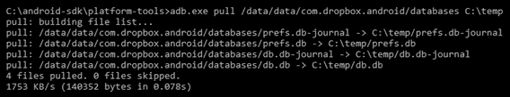

The adb pull command

同样，在根手机上，整个`/data`文件夹都可以这样拉。如下图截图所示，安卓设备上完整的`/data`目录可以复制到机器上的本地目录。整个`data`目录在 97 秒内被提取。提取时间将根据`/data`中驻留的数据量而变化:

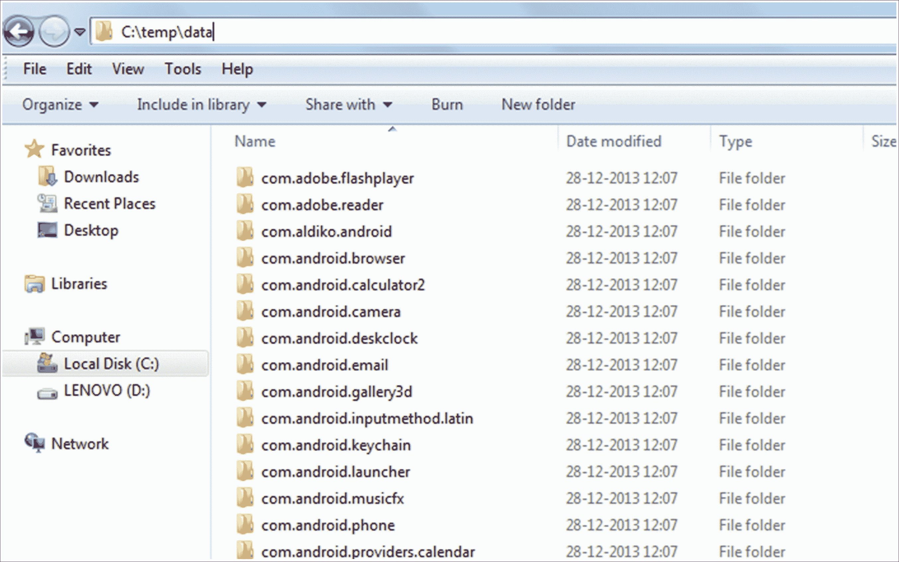

The /data directory extracted to a forensic workstation

在非根设备上，`/data`目录上的`pull`命令不会提取文件，如以下输出所示，因为 shell 用户无权访问这些文件:

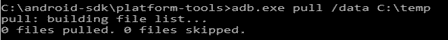

ADB pull command on non-rooted device

通过上述过程从根手机复制的数据保持其目录结构，因此允许调查人员浏览必要的文件以获取信息。通过分析各个应用程序的数据，法医专家可以收集影响调查结果的关键信息。请注意，在取证工作站上本地检查文件夹会改变内容的日期和时间。您应该复制原始输出，用于日期/时间比较。

# 使用 SQLite 浏览器查看数据

SQLite 浏览器是一个工具，可以在分析提取数据的过程中提供帮助。SQLite 浏览器允许您浏览具有以下扩展名的数据库文件:`.sqlite`、`.sqlite3`、`.sqlitedb`、`.db`和`.db3`。使用 SQLite Browser 的主要优点是它以表格形式显示数据。

导航至文件|打开数据库，使用 SQLite 浏览器打开一个`.db`文件。如下图所示，主要有三个选项卡:数据库结构、浏览数据和执行 SQL。“浏览数据”选项卡允许您查看`.db`文件中不同表格中的信息。

在分析过程中，我们将主要使用该选项卡。或者，氧气法医 SQLite 查看器等工具也可以用于相同的目的。从数据库文件中恢复删除的数据是可能的，将在[第 10 章](10.html)、*安卓数据分析*、*和恢复*中解释:

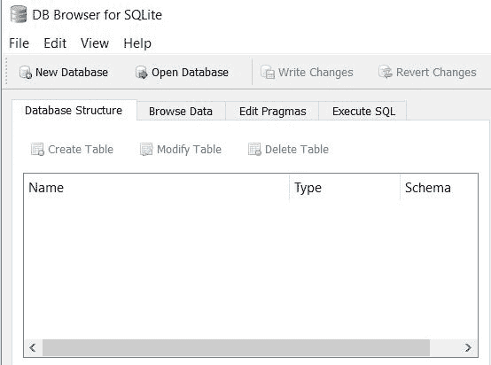

SQLite Browser

以下几节将介绍如何识别重要数据，以及如何从安卓手机中手动提取各种细节。在前面的章节中已经介绍了如何在安卓系统上访问终端。在下一节中，我们将直接跳到从那里获取设备信息。

# 提取设备信息

了解安卓设备的细节，如型号、版本等，将有助于您的调查。例如，当设备被物理损坏并且这禁止检查设备信息时，您可以通过在`/system`文件夹下执行以下命令来获取关于设备的详细信息:

```
# cat build.prop
```

这可以在下面的截图中看到:

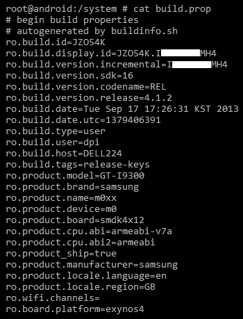

The build.prop file

提取设备信息后，我们现在将提取呼叫日志。

# 正在提取呼叫日志

在调查过程中，经常需要访问电话的通话记录来确认某些事件。关于通话记录的信息存储在位于`/data/data/com.android.providers.contacts/databases/`的`contacts2.db`文件中。如前所述，在将数据提取到取证工作站上的本地文件夹后，可以使用 SQLite Browser 查看该文件中存在的数据。让我们看看如何通过以下步骤提取呼叫日志:

1.  如下图所示，使用`adb pull`命令，可以将必要的`.db`文件提取到取证工作站上的一个文件夹中:

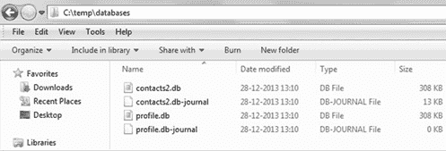

The contacts2.db file copied to a local folder

2.  请注意，用于进行呼叫的应用程序可以将呼叫日志详细信息存储在各自的应用程序文件夹中。必须检查所有通信应用程序的呼叫日志详细信息，如下所示:

```
C:\android-sdk-windows\platform-tools>adb.exe pull
/data/data/com.android.providers.contacts C:temp 
```

这将产生以下输出:

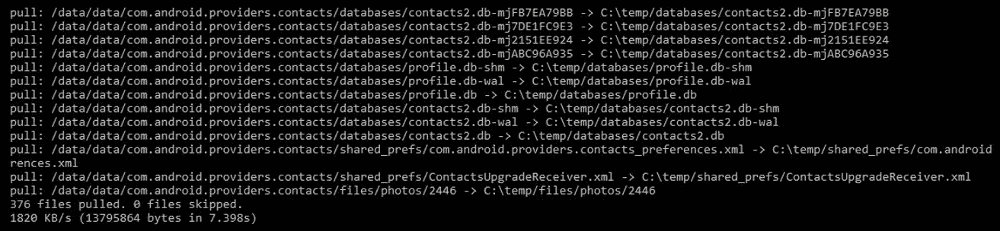

3.  现在，使用 SQLite 浏览器打开`contacts2.db`文件(通过导航到文件|打开数据库)并浏览不同表格中的数据。`contacts2.db`文件中的呼叫表提供了关于呼叫历史的信息。以下屏幕截图突出显示了通话历史记录以及姓名、号码、持续时间和日期:

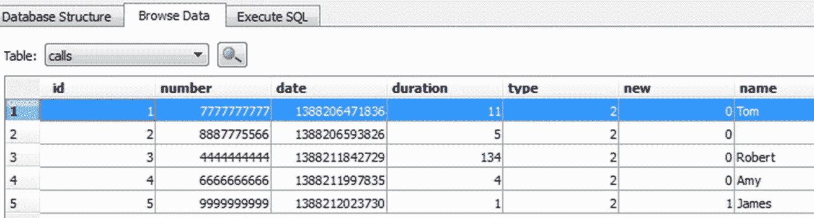

在运行安卓 7.0(牛轧糖)的设备上，通话记录数据已经移出`contacts2.db`文件。在这些设备上，可以在`/data/com.android.providers.contacts/databases/calllog.db`访问通话记录数据

# 提取短信/彩信

在调查过程中，可能会要求您检索由特定移动设备发送并传送到该设备的短信。因此，了解细节存储在哪里以及如何访问数据非常重要。位于`/data/data/com.android.providers.telephony/databases`下的`mmssms.db`文件包含必要的细节。与呼叫日志一样，您必须使用以下命令确保能够发送消息的应用程序检查相关的消息日志:

```
adb.exe pull /data/data/com.android.providers.telephony C:\temp
```

这将产生以下输出:

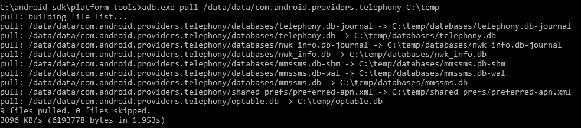

Extracting SMS data

在地址栏下可以看到电话号码，在正文栏下可以看到对应的短信，如下图截图所示:

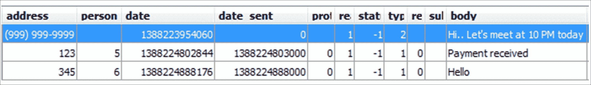

The calls table in the contacts2.db file

我们现在将提取浏览器历史信息。

# 提取浏览器历史信息

提取浏览器历史信息是法医通常需要完成的一项任务。除了默认的安卓浏览器，不同的浏览器应用可以在安卓手机上使用，比如火狐手机和谷歌浏览器。所有这些浏览器都以 SQLite `.db`格式存储其浏览器历史。例如，我们正在从默认的安卓浏览器提取数据到我们的取证工作站。该数据位于`/data/data/com.android.browser`。名为`browser2.db`的文件包含浏览器历史详细信息。下面的截图显示了浏览器数据，由 Oxygen forcer SQLite Viewer 表示。请注意，试用版将隐藏某些信息:

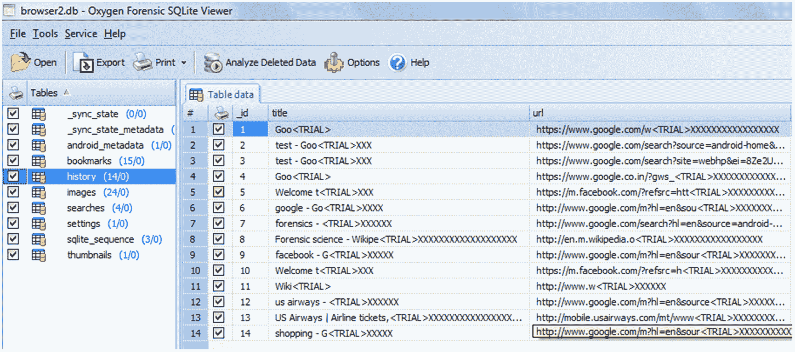

The browser2.db file in Oxygen Forensic SQLite Viewer Please note that the aforementioned behavior might change if the browser's incognito mode is used.

如果使用浏览器的隐姓埋名模式，上一节中介绍的几个细节不会存储在设备上。接下来，我们将分析社交网络和即时消息聊天。

# 社交网络/即时消息聊天分析

社交网络和即时聊天应用程序，如脸书、推特和 WhatsApp，会泄露敏感数据，这些数据在调查任何案件时都可能有所帮助。该分析与任何其他安卓应用程序基本相同。将数据下载到取证工作站，分析`.db`文件，看能否挖掘出任何敏感信息。例如，让我们看一下脸书应用程序，看看可以提取哪些数据。

首先，我们提取`/data/data/com.facebook.katana`文件夹并导航到`databases`文件夹。该文件夹下的`fb.db`文件包含与用户帐户相关的信息。`friends_data`表包含用户朋友的姓名信息，以及他们的电话号码、电子邮件 id 和出生日期，如下图所示。同样，可以分析其他文件，找出是否可以收集任何敏感信息:

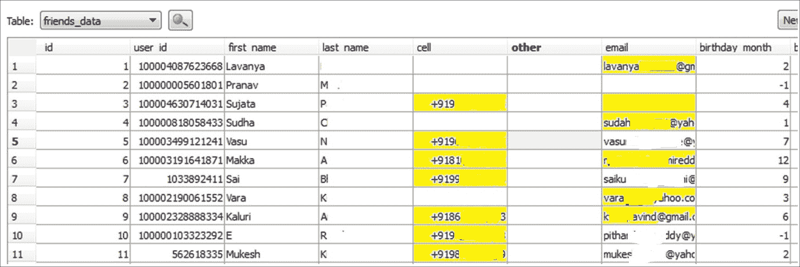

The fb.db file in SQLite Browser

类似地，通过分析`/data/data`文件夹中的数据，可以获取地理位置、日历事件、用户注释等信息。

# 亚行备用提取

从安卓 4.0 开始，谷歌实现了`adb backup`功能，用户可以使用`adb`工具将应用数据备份到电脑上。该过程不需要根访问，因此在法医检查期间非常有用。主要缺点是它不能备份设备上安装的每个应用程序。备份功能依赖于应用程序，因为应用程序的所有者可以选择允许备份。默认情况下允许备份，但是开发人员可以根据需要禁用备份。因此，大多数第三方应用程序都启用了这个功能，并且`adb backup`命令将对它们起作用。以下是`adb backup`命令的语法:

```
adb backup [-f <file>] [-apk|-noapk] [-shared|-noshared] [-all] [-system|nosystem] [<packages...>]
```

让我们详细讨论一下:

*   `-f`:用于选择备份文件的存储位置。如果未指定，则默认为当前工作目录中的`backup.ab`。
*   `[-apk|noapk]`:用于选择是否备份`.apk`文件。默认为`-noapk`。
*   `[-obb|-noobb]`:用于选择是否备份`.obb` (APK 扩展)文件。默认为`-noobb`。
*   `[-shared|-noshared]`:用于选择是否备份共享存储和 SD 卡的数据。默认为`-noshared`。
*   `[-all]`:包括所有启用备份的应用程序。
*   `[-system|-nosystem]`:用于选择是否包含系统应用。默认为`-system`。
*   `[<packages>]`:用于列出需要备份的具体包名。

一旦设备连接到工作站，`adb`可以访问，运行`adb backup -shared -all`命令，如下图截图所示:

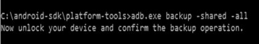

The adb backup command

命令运行后，用户需要批准设备上的权限，如下图所示。因此，如果设备被屏幕锁定，则无法进行备份:

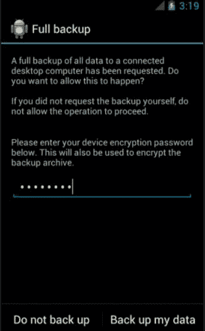

Backup permission on the device

安卓备份文件存储为`.ab`文件，默认情况下，它存储在安卓软件开发工具包的`platform- tools`文件夹中。有免费的工具，比如安卓备份提取器，可以将`.ab`文件转换成`.tar`文件，然后可以查看。安卓备份提取器可以从[https://sourceforge.net/projects/adbextractor/](https://sourceforge.net/projects/adbextractor/)下载。该工具是基于 Java 的应用程序，因此在使用该工具之前，请确保工作站上安装了 Java。要将备份文件转换为`.tar`格式，请发出以下命令:

```
java -jar abe.jar unpack backup.ab backup.tar
```

这将自动创建一个扩展名为`.tar`的文件，然后可以使用归档工具(如 WinRAR 或 7Zip)轻松查看该文件。但是，请注意，如果在创建备份时在设备上输入了密码，文件将被加密，因此，您需要在前面的命令中提供密码作为参数。备份文件包含两个主文件夹— `apps`和`shared`。`apps`文件夹包含备份中包含的应用程序在`/data/data`下的所有信息。`shared`文件夹包含 SD 卡上的所有数据。

# 亚行 dumpsys 提取

`adb dumpsys`命令允许您收集系统上运行的服务和应用程序的信息。`adb shell dumpsys`命令给出所有系统服务的诊断输出。`dumpsys`命令不需要超级用户权限就可以执行，只需要像其他任何`adb`命令一样启用 USB 调试。如下图所示，要查看您可以使用`dumpsys`的所有服务列表，请运行`adb.exe shell service list`命令:

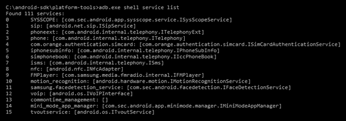

The dumpsys service list command

分析某些`dumpsys`服务，如 Wi-Fi、用户和通知，在某些场景下可能会有所帮助。以下是一些有趣的案例，在法医分析过程中运行`dumpsys`命令可能会有所帮助:

`dumpsys iphonesubinfo`服务可用于获取设备 ID 或 IMEI 号的信息，如下图所示:

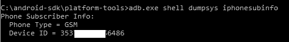

The dumpsys command showing the IMEI number

`dumpsys wifi`服务提供用户访问的无线接入点的信息。它显示已保存的连接的 SSIDs。该信息可用于将用户锁定在特定位置。下面是`adb dumpsys`命令，给出了这个信息:

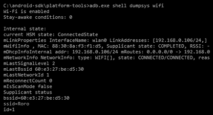

The dumpsys command showing the last connected Wi-Fi details

`dumpsys usagestats`服务提供关于最近使用的应用程序的信息，以及它们的使用日期。例如，以下截图显示，2016 年 2 月 1 日没有使用任何应用程序，但在 2016 年 1 月 31 日，使用了谷歌 Chrome 浏览器，并试图备份手机数据:

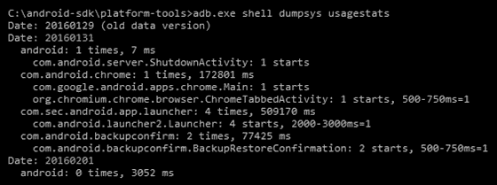

The dumpsys command showing recently used apps

注意，与`Date 20160201, android: 0`相反的次数表示没有使用任何应用程序。但是对于`Date: 20160131, android: 1 times`来说，确认使用了一个应用，后面的部分提供了更多关于使用了什么应用的细节等等。根据正在调查的案件，法医分析师需要弄清楚`dumpsys`命令是否有用。在设备发生故障后立即运行`dumpsys`命令会对以后非常有帮助。通过运行`adb shell dumpsys`命令，您可以记录所有`dumpsys`服务信息。

# 使用内容提供商

在安卓系统中，一个应用的数据在正常情况下无法被另一个应用访问。然而，安卓提供了一种机制，通过这种机制，数据可以与其他应用程序共享。这正是通过使用内容提供商实现的。内容提供者以一个或多个表的形式向外部应用程序呈现数据。这些表与关系数据库中的表没有什么不同。应用程序可以使用它们来共享数据，通常是通过 URI 寻址方案。它们由使用提供者-客户端对象访问提供者的其他应用程序使用。在安装应用程序的过程中，用户确定应用程序是否可以访问请求的数据(内容提供商)。例如，联系人、短信/彩信和日历都是内容提供商的例子。

因此，通过利用这一点，我们可以创建一个应用程序，从所有可用的内容提供商那里获取所有信息。这正是大多数商业取证工具的工作方式。这种方法的优点是它可以在根设备和非根设备上使用。对于我们的例子，我们使用了一个逻辑，它利用了内容提供者机制来获取信息。该工具提取数据，并以 CSV 格式保存到 SD 卡中。以下步骤使用逻辑开源版 1.5.2 从安卓设备中提取信息:

1.  从[https://github.com/nowsecure/android-forensics/downloads](https://github.com/nowsecure/android-forensics/downloads)下载生态 OSE 1.5.2。

The AFLogical LE edition is capable of extracting a large amount of information and requires registration via forensics using an active law enforcement or government agency email address. AFLogical OSE can pull all available MMSes, SMSes, contacts, and call logs.

2.  确保启用了 USB 调试模式，并将设备连接到工作站。

3.  通过发出`adb.exe devices`命令验证设备是否被识别:

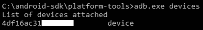

Identify connected device

4.  将逻辑 OSE 应用程序保存在主目录中，并发出`adb.exe install AFLogical-OSE_1.5.2.apk`命令将其安装在设备上:

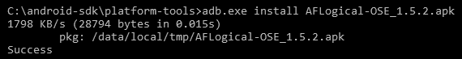

Installing AFLogical app

5.  安装应用程序后，您可以直接从设备运行它，并单击应用程序底部的捕获按钮，如下图所示:

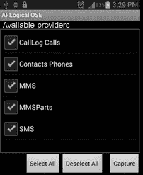

The AFLogical OSE app

6.  该应用程序开始从相应的内容提供商提取数据，一旦该过程完成，将显示一条消息，如下图所示:


Message displayed after the extraction is complete

7.  提取的数据保存到设备的 SD 卡中名为`forensics`的目录中。提取的信息存储在 CSV 文件中，如下图所示。可以使用任何编辑器查看 CSV 文件:

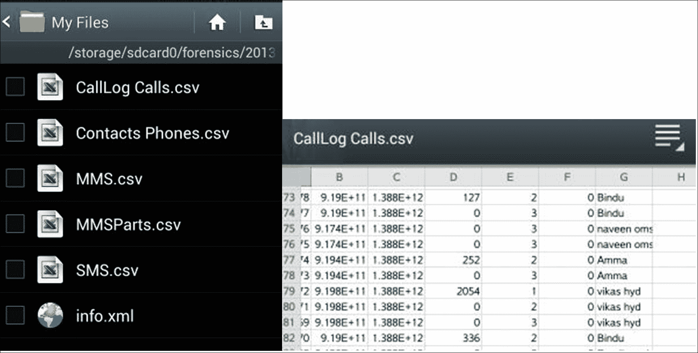

Files extracted using AFLogical OSE

8.  同一个目录中的`info.xml`文件提供了关于设备的信息，包括 IMEI 号、IMSI 号、安卓版本、已安装应用的信息等等。

However, note that third-party app installation should be allowed (by selecting the Unknown Sources option) on the device for this to work. Other tools that can help during an investigation to logically extract data will be covered in [Chapter 11](11.html), *Android App Analysis, Malware, a**nd Reverse Engineering*.

本节讲述了各种逻辑采集技术。我们现在将研究物理数据提取技术。

# 物理数据提取

物理提取指的是获得设备的精确的逐位图像的过程。重要的是要理解逐位图像不同于复制和粘贴设备的内容。如果我们复制并粘贴设备的内容，它将只复制可用的文件，如可见文件、隐藏文件和系统相关文件。这种方法被认为是一种逻辑图像。使用这种方法，删除的文件和不可访问的文件不会被`copy`命令复制。删除的文件可以使用某些技术(根据情况)恢复，我们将在后面的章节中看到。与逻辑提取不同，物理提取是设备内存的精确拷贝，包括更多信息，如空闲空间和未分配空间。

通过物理技术提取安卓数据通常使用`dd`命令，而其他高级技术，如 JTAG 和芯片关闭也是可用的，但通常很难实现，并且在调查过程中需要很高的精度和经验才能在真实设备上尝试。与任何其他技术一样，如果个人不正确地执行这些程序，设备上的数据可能会损坏或变得不可恢复，从而使其在法庭上不可接受。JTAG 和芯片关闭技术将在以下章节中详细介绍。但是，通过`dd`命令提取数据需要 root 访问权限。以下各节概述了可用于执行物理提取的各种技术。

# 想象一部安卓手机

设备成像是移动设备取证中最重要的步骤之一。在可能的情况下，在执行任何直接从设备中提取数据的技术之前，必须获得安卓设备的物理图像。在法医学中，获得物理采集的过程通常被称为*对设备进行成像*。术语“物理图像”、“取证图像”和“原始图像”通常用于指通过此过程捕获的图像。让我们首先重温成像是如何在台式计算机上完成的，因为它有助于我们关联和认识到与成像安卓设备相关的问题。让我们假设一台没有开机的台式电脑，从一名嫌疑人手中被扣押并送去接受法医检查。在这种情况下，典型的取证人员会取出硬盘，将其连接到写阻止程序，并使用任何可用的工具获得一个一个的取证图像。然后，原始硬盘在数据取证成像期间得到安全保护。

有了安卓设备，所有包含数据的区域都不容易被移除。此外，如果设备在接受检查时处于活动状态，则不可能在不对其进行任何更改的情况下分析设备，因为任何交互都会改变设备的状态。

安卓设备可能有两个文件存储区域:内部存储和外部存储。内部存储器是指内置的非易失性存储器。外部存储是指可移动存储介质，如微型 SD 卡。但是，需要注意的是，有些设备没有 SD 卡等可移动存储介质，但它们将可用的永久存储空间分为内部存储和外部存储。因此，外部存储并非总是可移动的。当存在可移动 SD 卡时，必须获得存储卡的取证图像。正如[第 7 章](07.html)、*了解安卓*中所讨论的，这些可移动卡通常使用 FAT32 文件系统格式化。有些移动设备采集方式会通过安卓设备采集 SD 卡。这个过程虽然有用，但由于 USB 电话线的速度限制，速度会很慢。

默认情况下，安卓不提供对内部目录和系统相关文件的访问。这种受限访问是为了确保设备的安全性。例如，`/data/data`文件夹在非根设备上不可访问。我们对这个文件夹特别感兴趣，因为它存储了大多数用户创建的数据，许多应用程序将有价值的数据写入这个文件夹。因此，要获得设备的图像，我们需要根安卓设备。扎根一个设备给了我们超级用户的特权和对所有数据的访问。重要的是要认识到，这本书一直在强调，所有采取的步骤都应该是合理的，不应该在任何可能的情况下对设备进行更改。在安卓设备上生根会对其进行更改，并且应该在您之前没有调查过的任何设备上进行测试。生根对安卓设备来说很常见，但获得根访问权可能会改变设备，导致数据发生变化，或者更糟糕的是，数据被擦除。一些安卓设备，如 Nexus 4 和 5，可能会在允许根访问之前强制清除数据分区。这就不需要根设备来获得访问权限，因为在此过程中所有的用户数据都会丢失。请记住，虽然生根成功后可以提供更多的数据访问，但它也可以擦除数据或破坏手机。因此，在进行根操作之前，您必须确保您拥有操作安卓设备的许可或合法权利。由于生根技术已在[第 8 章](08.html)、*安卓取证设置和预数据提取技术*中进行了讨论，我们将继续示例，假设设备已生根。

以下是获取根安卓设备取证图像的分步过程:

1.  将安卓设备连接到工作站，通过发出`adb devices`命令验证设备是否被识别，如下图所示:

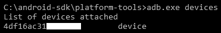

Identify connected devices

2.  一旦`adb`访问准备就绪，可以使用以下步骤从安卓设备获取分区:
    *   **使用** `dd` **命令**:可以使用`dd`命令创建设备的原始图像。这个命令帮助我们通过复制低级数据来创建安卓设备的一个一个的图像。
    *   **插入新的 SD 卡**:在设备中插入新的 SD 卡，将镜像文件复制到这张卡上。确保此 SD 卡已擦除，并且不包含任何其他数据。您可能还需要证明驱动器上没有其他数据。
    *   **执行命令**:安卓设备的文件系统存储在`/dev`分区的不同位置。三星 Galaxy S3 手机上的一个简单的`mount`命令返回以下输出:

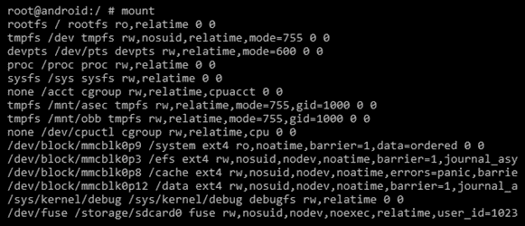

mount command output on an Android device

3.  从前面的输出中，我们可以识别出安装了`/system`、`/data`和`/cache`分区的块。尽管对所有文件进行映像很重要，但大部分数据都存在于`/data`和`/system`分区中。如果时间允许，应该获取所有分区的完整性。完成后，执行以下命令对设备进行成像:

```
dd if=/dev/block/mmcblk0p12 of=/sdcard/tmp.image
```

在前面的例子中，使用了三星 Galaxy S3 的数据分区(其中`if`是输入文件，`of`是输出文件)。

前面的命令将对`mmcblk0p12`文件(数据分区)进行逐位镜像，并将镜像文件复制到 SD 卡上。完成后，可以使用可用的取证软件分析`dd`图像文件。

You must ensure that the SD card has enough storage space to contain the data partition image. Other methods are available to acquire data from rooted devices.

如果图像不能直接写入 SD 卡，可以使用`netcat`命令将输出直接写入机器。`netcat`工具是一个基于 Linux 的工具，用于通过网络连接传输数据。安卓设备通常不会安装`netcat`。让我们看看如何在以下步骤中使用该命令:

1.  要检查是否安装了`netcat`，只需打开 ADB 外壳，键入`nc`。如果返回说找不到 nc，`netcat`将不得不手动安装在设备上。您可以在[https://SourceForge . net/project/androidforceramics-netcat/files/](https://sourceforge.net/projects/androidforensics-netcat/files/)下载为安卓编译的`netcat`。
2.  使用电脑上的以下命令将`netcat`按到设备上:

```
adb push nc /dev/Case_Folder/nc
```

该命令应该在`/dev`中创建`Case_Folder`，并且`nc`应该在其中。

3.  现在，我们需要给予它从 ADB shell 执行的权限。这可以通过以下方式实现:

```
chomd +x /dev/Case_Folder/nc
```

4.  打开两个终端窗口，其中一个打开 ADB 外壳。另一个将用于监听从设备发送的数据。现在，我们需要从您的计算机通过 ADB 启用端口转发:

```
adb forward tcp:9999 tcp:9999
```

`9999`是我们选择用于`netcat`的端口；它可以是 Linux 或 Mac 系统上`1023`和`65535`之间的任意端口号(`1023`及以下为系统进程保留，需要 root 权限才能使用)。在另一个终端窗口中，运行以下命令:

```
nc 127.0.0.1 9999 > data_partition.img
```

`data_partition.img`文件现在应该创建在您计算机的当前目录中。当数据传输完成后，`netcat`将在两个终端终止并返回命令提示符。根据图像的大小，该过程可能需要很长时间。

# 对存储卡成像

有许多工具可以对存储卡进行成像。以下示例使用`WinHex`创建 SD 卡的原始磁盘映像。以下是使用 WinHex 对存储卡进行映像的分步过程:

1.  **连接存储卡**:将 SD 卡从内存插槽中取出，用读卡器将存储卡连接到刑侦工作站。
2.  **写保护卡**:使用 WinHex 打开磁盘。导航到选项|编辑模式，选择只读模式(=写保护模式)，如下图所示。这是为了确保设备写保护，并且没有数据可以写入设备:

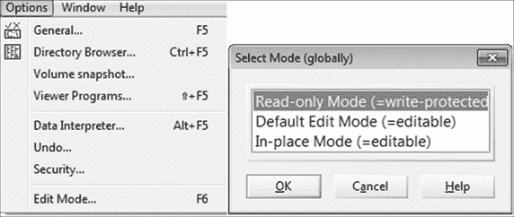

WinHex view of Edit Mode (left) and WinHex Read-only Mode enabled (right)

3.  **计算哈希值**:计算内存卡的哈希值，确保调查过程中任何一点都没有变化。导航到工具|计算哈希并选择任意哈希算法。

4.  **创建磁盘映像**:导航到文件|创建磁盘映像，如下图截图所示。选择原始图像选项(`.dd`)来创建图像。这就完成了存储卡的成像:

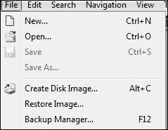

The WinHex disk image option

一旦使用前面描述的任何方法获得了法医图像，就需要对其进行分析以提取相关信息。有几个商业工具，如 Cellebrite 和 XRY，可以分析图像文件。[第 10 章](#)、*安卓数据分析与恢复*详细介绍了分析安卓图像。

# 联合测试行动小组

**联合测试行动小组** ( **JTAG** )涉及使用先进的数据采集方法，包括连接到设备上的特定端口，并指示处理器传输存储在设备上的数据。使用这种方法，可以获得设备的完整物理图像。总是建议首先尝试前面提到的其他技术，因为它们易于实现并且需要较少的努力。在尝试 JTAG 之前，分析员必须经验丰富并经过适当培训，因为如果操作不当，设备可能会损坏。

JTAG 程序通常包括以下取证步骤:

1.  在 JTAG，设备**测试访问端口** ( **TAPs** )用于访问设备的中央处理器。识别 TAPs 是首要和最重要的步骤。TAPs 被识别，连接被追踪到 CPU，以找出哪个 pad 负责每个功能。尽管设备制造商记录了关于特定设备的 JTAG 原理图的资源，但这些资源并未发布以供一般查看。安卓设备上 JTAG 的一个好网站是[https://forensicswiki.xyz/wiki/index.php?标题= JTAG _ 取证](https://forensicswiki.xyz/wiki/index.php?title=JTAG_Forensics)。
2.  然后将导线焊接到适当的连接器引脚上，另一端连接到可以控制 CPU 的设备上，如下图所示(由 Jim Swauger 发布于[http://www . binary entel . com/services/JTAG-chip-off-forensics/JTAG-forensics/](http://www.binaryintel.com/services/jtag-chip-off-forensics/jtag-forensics/))。JTAG 夹具可以用来放弃某些设备的焊接。夹具或 JTAG 适配器的使用消除了焊接的需要，因为它将抽头连接到中央处理器:

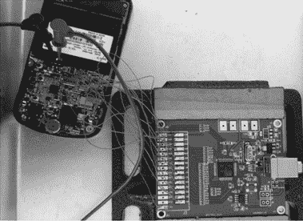

The JTAG setup

*   完成上述步骤后，必须通电才能启动中央处理器。必须施加的电压取决于硬件制造商发布的规格。不要施加超过规范中给定数值的电压。

*   通电后，可以提取 NAND 闪存的完整二进制内存转储。
*   使用本书中学习的取证技术和工具分析提取的数据。采集过程中将获得一个原始`.bin`文件；大多数取证工具都支持摄取和分析这种图像格式。

JTAG 听起来可能很复杂(也许的确如此)，但它有许多有用的用途，这里列出了三个优点:

*   这种技术的主要优点是，即使设备没有通电，它也能工作。
*   它不需要 root、ADB 或 USB 调试。
*   它可以用来恢复设备 PINs 密码，因此可以对整个闪存进行镜像，并恢复/破解密码文件。

理解 JTAG 技术不应导致设备功能的丧失也很重要。如果重新组装得当，该设备应该可以正常运行，没有任何问题。虽然 JTAG 技术在提取数据方面是有效的，但只有有经验的合格人员才能尝试。焊接 JTAG 焊盘或施加错误电压时的任何错误都可能严重损坏器件。

# 芯片脱落技术

芯片关闭，顾名思义，是一种将 NAND 闪存芯片从设备中移除并检查以提取信息的技术。因此，即使设备受密码保护且未启用 USB 调试，这种技术也能工作。与检查后器件正常工作的 JTAG 技术不同，芯片脱落技术通常会导致器件损坏，也就是说，在检查后将 NAND 闪存重新连接到器件上更加困难。将 NAND 闪存重新连接到设备的过程称为重新封装，需要培训和实践。

芯片剥离技术通常包括以下取证步骤:

1.  必须研究设备上的所有芯片，以确定哪个芯片包含用户数据。
2.  一旦确定，NAND 闪存将从设备中物理移除。这可以通过加热去焊芯片来实现:

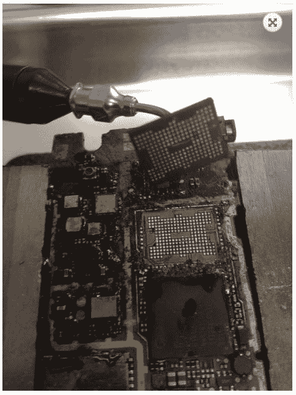

Chip-off technique
Source: http://www.binaryintel.com/services/jtag-chip-off-forensics/chip-off_forensics/

3.  这是一个非常微妙的过程，必须非常小心，因为它可能会损坏 NAND 闪存。
4.  然后对芯片进行清洁和维修，以确保连接器存在并正常工作。

5.  使用专门的硬件设备适配器，现在可以读取芯片。这是通过将芯片插入支持特定 NAND 闪存芯片的硬件设备来实现的。在这个过程中，从芯片获取原始数据，产生一个`.bin`文件。
6.  现在可以使用取证技术和前面描述的工具来分析获得的数据。

当设备严重损坏、锁定或无法访问时，芯片脱落技术最有帮助。然而，这项技术的应用不仅需要专业知识，还需要昂贵的设备和工具。在移除 NAND 闪存时，总是存在损坏 NAND 闪存的风险，因此，建议首先尝试逻辑技术来提取任何数据。

虽然根访问是执行前面讨论的任何技术的必要条件，但这里必须注意的是，在撰写本书时，这些技术在启用了**全磁盘加密**(**【FDE】**)的设备上都不起作用。正如[第 7 章](07.html)、*理解安卓*中所讨论的，谷歌已经授权从安卓 6.0 开始的大多数设备使用 FDE。虽然已经演示并发布了一些用于解密完整磁盘加密的技术，但是它们是特定于设备的，并不广泛适用。

# 摘要

本章涵盖了各种手动、逻辑和物理数据提取技术。在调查过程中，我们学习了何时以及如何应用这些技术。逻辑技术通过使用 ADB 等工具与设备交互来提取数据。另一方面，物理技术访问更大的数据集；它们很复杂，需要大量的专业知识来执行。对设备成像会生成设备的逐位图像，随后会使用工具对其进行分析。对设备成像是确保设备上的数据不被修改的主要步骤之一。Android 7.0 及以上版本引入了新的安全功能和文件路径，可能会限制获取，从而给刑侦人员带来了新的挑战。有了这些知识，你就可以进行设备采集，从安卓设备中提取相关数据。

在下一章中，我们将看到如何从图像文件中提取相关数据，如通话记录、文本消息和浏览历史。我们还将介绍数据恢复技术，使用这些技术我们可以恢复从设备中删除的数据。