# Windows 电话取证

尽管现在 Windows Phones 的应用并不广泛，但在法庭调查过程中仍可能会遇到。这些设备是市场上最实惠的，因此了解如何从 Windows Phones 获取、分析和解码数据非常重要。定位和解释这些设备上存在的数字证据需要对 Windows Phone 操作系统有专门的了解，而且可能并不总是可行的。商业取证和开源工具对从 Windows 设备获取用户数据的支持有限。由于 Windows Phones 并未占据移动市场的大部分空间，大多数法医从业者对所使用的数据格式、嵌入式数据库以及设备上存在的其他工件并不熟悉。本章概述了 Windows Phone 取证，描述了在 Windows 移动设备上获取和检查数据的各种方法。

在本章中，我们将涵盖以下主题:

*   视窗手机操作系统
*   Windows 10 移动安全模式
*   Windows Phone 文件系统
*   数据采集
*   商业取证工具获取方法
*   不使用商业工具提取数据
*   用于检查的关键工件

# 视窗手机操作系统

Windows Phone 是微软开发的专有移动操作系统。它是作为 Windows Mobile 的继承者推出的，但它没有提供与以前平台的向后兼容性。Windows Phone 于 2010 年 10 月与 Windows Phone 7 一起推出。随后，随着 Windows Phone 7.5、Windows Phone 7.8、Windows Phone 8.1 和 Windows Phone 10 的发布，Windows Phone 操作系统的版本历史得以延续。

尽管微软声称他们已经停止开发这款移动操作系统，不包括安全补丁，但作为一名移动法医，你很可能会面临这个问题。

以下各节将提供有关 Windows Phone、其功能及其底层安全模型的更多详细信息。

与安卓和 iOS 设备不同的是，Windows Phone 自带了一个新的界面，使用所谓的*平铺*进行应用，而不是图标，如下图所示。用户可以设计和更新这些图块:

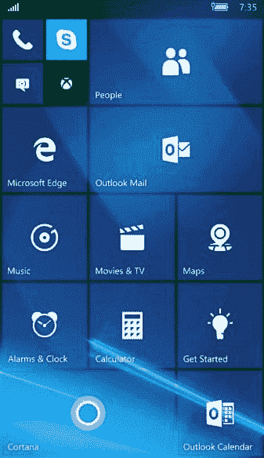

The Windows Phone home screen

与其他移动平台类似，Windows Phone 允许安装第三方应用。这些应用可以从微软管理的视窗手机市场下载。当比较 iOS 和安卓设备可用的应用数量时，Windows Phone 相形见绌。但是，应用是可用的，您应该期望在 Windows Phone 设备上看到它们。

Windows Phone 引入了新功能，与 Windows Mobile 相比，它更类似于其他智能手机:

*   **Cortana** :这是设备的个人助理。它是在 Windows 8.1 中引入的，现在仍然存在于 Windows 10 设备上。Cortana 通过使用 Bing 回答问题、设置提醒、发送文本以及基本上使用所有功能为用户提供更好、更简单的体验来帮助用户。Cortana 所做的一切都会在设备上留下痕迹。
*   **钱包**:这里存放信用卡账户、登机牌、机票、优惠券等。
*   **地理围栏和高级位置设置**:这些为用户提供了额外的保护，因为手机可以检测到自己何时脱离可信区域，并可能锁定自己。
*   **附加功能**:这些都是活瓦、增强色、静音小时等功能。

与 Windows Phone 相关的其他常见应用包括 OneDrive(以前的 SkyDrive)、OneNote 和 Office 365 同步。OneDrive 为用户提供了从任何设备访问其所有文档和文件的权限。OneNote 本质上是相同的，但它充当笔记本或日记。Office 365 为用户提供了跨多个设备对其电子邮件、日历、联系人等的持续访问。

跨多个设备的数据同步的引入使得我们作为法医检验师的工作变得困难。我们的工作是确定证据是如何放置在设备上的。有没有可能明确说明一个工件是如何被放置在一个设备上的？说实话，这要看情况。没有人想听到这样的回应，但必须考虑很多因素。什么是 app？设备上运行的是什么操作系统？神器是什么？例如，让我们考虑 OneDrive。如果设备包含来自 OneDrive 的文档，则元数据中应该包含原始作者。这一点，再加上检查内容是否与设备共享，可以提供一个工件是如何创建的一瞥。但是，当 Office 365 就位时检查日历条目时，可能无法说明用户是在手机、电脑还是笔记本电脑上创建条目的。同步是即时的，说明工件创建位置的状态标志并不总是存在的。如果这个神器确实是调查的*冒烟的枪*，你需要运用你的技能去揭开其他支持你发现的神器。需要深入挖掘数据。现在我们已经了解了 Windows Phone 及其功能的细节，让我们来看看它的安全模型，看看它是如何保持数据安全的。

# Windows 10 移动安全模式

Windows Phone 的安全模型旨在确保设备上存在的用户数据安全可靠。以下各节简要解释了 Windows Phone 安全所基于的概念。

# 钱伯斯

Windows Phone 在很大程度上建立在最小特权和隔离的原则上。自 Windows Phone 7 问世以来，这一点一直保持不变。为此，Windows Phone 引入了 **chambers** 的概念。每个室都有一个隔离边界，流程可以在此运行。根据特定会议厅的安全政策，在该会议厅运行的进程有权访问操作系统的资源和功能(https://www . msec . be/mobcom/ws2013/presentations/David _ hernie . pdf)。有四种类型的安全室。以下是它们的简要描述:

*   **可信计算基础** ( **TCB** ):这里的进程可以无限制的访问大多数 Windows Phone 资源。这个会议厅拥有修改政策和实施安全模式的特权。内核在这个房间里运行。
*   **高架权利室** ( **ERC** ):该室的特权低于 TCB 室。它拥有访问除安全策略之外的所有资源的权限。该室主要用于服务和用户模式驱动程序，提供旨在供电话上其他应用使用的功能。
*   **标准权限室** ( **SRC** ):这是预装应用的默认室，比如微软 Outlook Mobile 2010。
*   **最低特权室** ( **LPC** ):这是通过市场中心(也称为 Windows Phone Marketplace)下载和安装的所有应用的默认室。

接下来，我们将研究加密。

# 加密

Windows Phone 8 引入了 BitLocker 技术，通过 AES 128 位加密对存储在设备上的所有用户数据进行加密。用户只需翻转开关即可启用该功能，设备内部存储的所有数据都将被加密。此外，用户可以加密他们的 SD 卡——假设设备有一个——并在他们的设备上设置密码或个人识别码。如果启用所有这些锁和加密，除非恢复密码，否则可能无法访问此设备上的数据。

# 基于能力的模型

功能被定义为手机上与安全、隐私和成本相关的资源(摄像头、位置信息、麦克风等)。默认情况下，LPC 具有一组最少的访问权限。但是，这可以通过在安装过程中请求更多功能来扩展。功能是在应用安装期间授予的，不能在运行时修改或提升。因此，很难将应用加载到设备上，也很难强制将自定义引导代码加载到设备上以获得取证访问权限，因为它通常会在启动前被拒绝。

要在 Windows Phone 上安装应用，您需要使用 Windows Live ID 登录市场。在安装过程中，应用在使用某些功能之前需要征求用户的许可，下面的屏幕截图显示了一个例子:

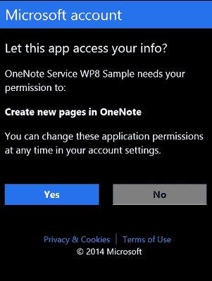

Windows app requesting user permissions (https://i-msdn.sec.s-msft.com/dynimg/IC752370.png)

这类似于 Android 中的权限模型。这使用户可以在安装应用之前自由地了解应用的所有功能。所有功能的列表包含在`WMAppManifest.xml`应用清单文件中，可以通过 Visual Studio 或在[https://docs . Microsoft . com/en-us/previous-versions/windows/apps/ff 769509(v = vs . 105)](https://docs.microsoft.com/en-us/previous-versions/windows/apps/ff769509(v=vs.105))定义的其他方法访问该文件。

# 沙尘应用

Windows Phone 中的应用运行在沙盒环境中。这意味着 Windows Phone 上的每个应用都运行在自己的房间里。应用相互隔离，无法访问其他应用的数据。如果任何应用需要将信息保存到设备中，它可以使用隔离存储来实现，而其他应用无法访问隔离存储。另外，安装在 Windows Phone 上的第三方应用无法在后台运行；也就是说，当用户切换到不同的应用时，先前使用的应用被关闭(尽管应用状态被保留)。这确保了当用户不使用应用时，应用不能执行诸如通过互联网通信之类的活动。这些限制也使 Windows Phone 不易受到恶意软件的影响，但您永远不要认为任何设备都是安全的。恶意软件在这些设备上运行更具挑战性。

到目前为止，我们已经看了四种类型的安全室，现在我们知道 Windows Phone 8 使用 BitLocker 技术进行加密。我们已经了解了在应用安装期间授予的不同功能，并看到了每个应用是如何相互隔离的。接下来，我们将看看 Windows Phones 的一个重要方面，那就是它的文件系统。

# Windows Phone 文件系统

Windows Phone 文件系统或多或少类似于 Windows 7、Windows 8 和 Windows 10 中使用的文件系统。从根目录，您可以访问此设备上可用的不同文件和文件夹。从取证的角度来看，以下是一些可以产生有价值数据的文件夹。所有列出的目录都位于根目录中:

*   **应用数据**:本目录包含手机上应用的数据，如 Outlook、地图、Internet Explorer 等。
*   **应用**:该目录包含用户安装的应用。每个应用分配或使用的独立存储也位于此文件夹中。
*   **我的文档**:该目录保存不同的 Office 文档，如 Word、Excel 或 PowerPoint 文件。该目录还包括配置文件和多媒体文件，如音乐或视频。
*   **Windows** :该目录包含与 Windows Phone 操作系统相关的文件。

这里使用的获取方法将决定您对设备的文件系统访问量。例如，物理映像可以提供对几个分区的访问，这些分区可以从数据转储中恢复。包含 27 个分区的 Windows Phone 10 设备可以在下面的截图中看到。分区 26(主操作系统)和 27(数据)包含相关数据:

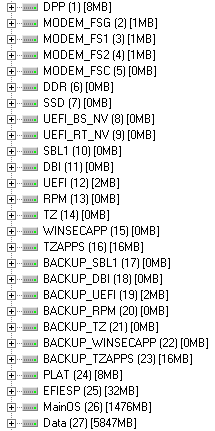

Windows Phone 10 partitions While most artifacts will exist in the Data partition, it is always best practice to capture and analyze both when possible.

前面截图中的 MainOS 分区，分区 26，包含来自 Windows Phone 的系统数据。与所有 Windows 调查一样，系统数据包含与调查相关的工件。

在这个例子中，分区 27 包含用户或数据分区。根据设备的不同，分区号可能会有所不同。在我们的示例中，数据分区在下面的屏幕截图中显示为分区 27。在这里，短信、电子邮件、应用数据、联系人、通话记录和互联网历史记录都是使用移动取证工具恢复的。这些方法将在本章后面讨论:

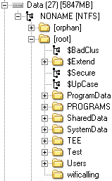

Windows Phone 10 Data partition

Windows Phone 还维护着 **Windows 注册表**，这是一个在操作系统上存储环境变量的数据库。Windows 注册表基本上是一个存储微软操作系统设置和选项的目录。Windows Phone 也不例外。检查 Windows Phone 时，您会看到`NTUSER.dat`、`SAM`、`SYSTEM`、`SOFTWARE`、`SECURITY`和`DEFAULT`蜂巢。虽然这些配置单元可能是手机独有的，但它们可以像传统的 Windows 注册表配置单元一样进行检查。

辛西娅·墨菲的一篇论文中包含了详细的案件调查。这涉及一起入室盗窃和性侵犯的刑事案件，并详细介绍了法医界的伟人为发现有助于结束调查的文物所做的努力。有时，移动设备是与案例相关的最重要的工件。更多信息请参考[https://www . sans . org/阅览室/白皮书/取证/windows-phone-8-取证-器物-35787](https://www.sans.org/reading-room/whitepapers/forensics/windows-phone-8-forensic-artifacts-35787) 。现在我们已经了解了文件和文件夹的结构，让我们学习如何使用这些知识获取数据。

# 数据采集

从 Windows Phone 获取数据对法医鉴定人员来说是一项挑战，因为前面几章中定义的物理方法、文件系统方法和逻辑方法都不太受支持。除此之外，手机可能需要处于特定的电池充电状态(%)，以便商用工具识别和获取设备。这通常是获取 Windows Phones 最困难的步骤之一。

尝试数据采集的商业工具实现的最常见技术之一是在设备上安装应用或代理，这使得命令能够双向通信发送到设备以提取数据。这可能会导致设备发生某些变化；尽管如此，如果审查员遵循标准协议并测试了所用工具的有效性，这在法律上仍然是合理的。这些协议包括适当的测试，以确保用户数据没有变化(如果有变化，记录发生的情况)，在测试设备上验证方法，并记录采集过程中采取的所有步骤。要使这种获取方法发挥作用，应用需要以 SRC 的权限安装。这可能需要您将制造商的 dll 复制到用户应用中，这些 dll 具有更高的权限。这允许应用访问通常仅限于本地应用的方法和资源。除此之外，设备必须解锁，否则这些方法可能不起作用。

大多数审查员依靠取证工具和方法来获取移动设备。同样，Windows Phones 不支持这些做法。请记住，要在 Windows Phone 上部署和运行应用，设备和开发人员都必须由微软注册和解锁。通过对 Windows Phone 8 至 10 设备使用公共越狱解锁设备，可以绕过这一限制。

在相当长的一段时间里，JTAG 和芯片收购是收购大多数视窗手机的唯一选择。一切都在 2015 年 1 月发生了变化:Cellebrite 实现了一个采集模块，允许移动法医检查员从大多数 Lumia 设备中提取物理层面的数据。

后来，视窗手机内部项目提出了一种解锁一些 Lumia 设备引导加载程序的方法，包括 520、521、525、620、625、720、820、920、925、928、1020 和 1320。这使得物理获取这些设备成为可能。你可以在[https://www.wpinternals.net/](https://www.wpinternals.net/)了解这个项目的更多信息。现在，我们将看看用于获取方法的一些商业工具。

# 商业取证工具获取方法

有一些商业工具可以为购买 Windows Phone 设备提供支持。Cellebrite UFED 公司提供使用物理、文件系统和逻辑方法获取 Windows Phone 设备的支持。要确定您正在检查的设备是否受该工具支持，您可以下载并使用 UFED 手机侦探手机应用，该应用在应用商店和谷歌游戏中都可以免费获得:

Searching for supported Lumia devices

这些获取方法中的一些更健壮，获得数据的完全物理转储，并且可以绕过特定设备上的一些锁定代码。然而，一些设备支持包括简单地从设备中提取联系人和图片。对于考官来说，重要的是要意识到必须按照工具的指示采取具体的步骤。获取这些设备并不容易，通常，你会发现工具不会成功。

当该工具似乎出现故障时，尝试使用 UFED 提供的智能手机/PDA 选项获取该设备。为此，请遵循以下步骤:

1.  启动 UFED4PC 并选择移动设备。
2.  选择手动浏览。

3.  选择智能手机
4.  选择您试图获取的 Windows 设备。
5.  尝试提供的所有方法，从物理、文件系统和逻辑(如果可能，按顺序)开始:

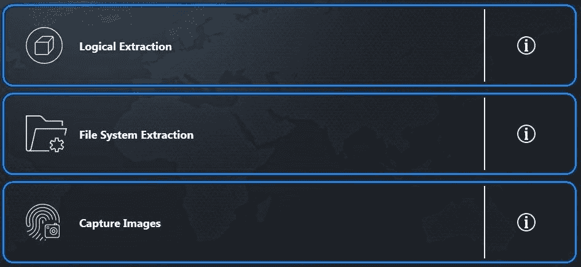

Extraction methods

6.  遵循所有剩余的步骤，尝试所有提供的获取方法，直到成功。

Cellebrite 可能会提醒您，收购不成功有几个原因。出现这种情况时，请尝试各种选择，以确保您已经用尽了可用的商业选择。UFED4PC 中的收购尝试示例如下:

1.  启动 UFED4PC。
2.  选择设备的品牌和型号。
3.  选择物理、文件系统或逻辑获取方法(产品会有所不同，具体取决于设备型号)。

在本例中，仅支持逻辑采集。有两种方法。第一个选项使用电缆，而第二个选项使用蓝牙。在本例中，需要特殊的 UFED 电缆。我首先选择了 UFED 电缆，因为蓝牙要求在配对过程中对手机进行额外的更改:

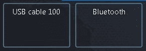

UFED4PC Logical extraction options

当试图用 USB 电缆 100 获取设备时，只能访问多媒体文件。

然后，尝试相同的采集，但选择蓝牙。按照给出的说明将设备与取证工作站配对:

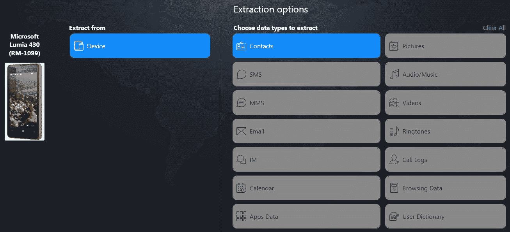

UFED4PC extraction options (Bluetooth)

通过这种获取方法，我们能够获得联系人。请注意，没有提供获取短信、彩信、电子邮件、即时消息、日历、通话记录、应用数据和其他信息的方法。建议您使用 UFED4PC 中的智能手机选项重复上一张截图中列出的通用方法。到目前为止，我们已经研究了一些使用商业工具的收购方法。现在，让我们学习如何在没有这些工具的情况下提取数据。

# 不使用商业工具提取数据

在某些情况下，只有通过先进的方法，如 JTAG 和芯片外，才有可能实际获得 Windows Phone 设备。但多亏了安全研究员希刺克厉夫，用他的名为**wpinteriors**([https://www.wpinternals.net](https://www.wpinternals.net))的工具对有限的手机型号和操作系统版本进行物理采集成为可能。

该工具支持以下型号的 Lumia 手机:520、521、525、620、625、720、820、920、925、928、1020 和 1320。

对于操作系统版本，支持以下内容:

*   8.10.12393.890
*   8.10.12397.895
*   8.10.14219.341
*   8.10.14226.359
*   8.10.14234.375
*   8.10.15116.125
*   8.10.15148.160
*   10.0.10512.1000
*   10.0.10536.1004
*   10.0.10549.4
*   10.0.10581.0
*   10.0.10586.11
*   10.0.10586.36

This method is experimental and can result in bricking the device! Despite the fact that the percentage of bricked devices is relatively low, we recommend that you use it as the last option.

获取过程的第一步是下载 Windows **全闪存更新** ( **FFU** )文件和您正在使用的手机型号的紧急文件:

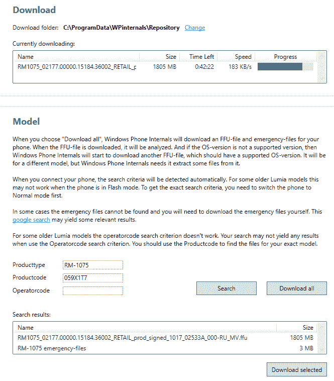

Downloading FFU files

如果下载的 FFU 包含不支持的操作系统版本，那么 WPinternals 将下载另一个 FFU 以获取其他文件:

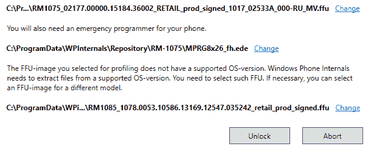

Getting additional files

在解锁过程中，手机可能会重启几次，但这是正常的行为:

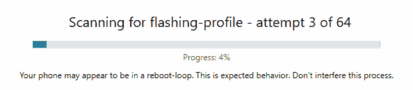

Scanning for flashing profile

找到配置文件后，该工具会闪烁解锁的引导加载程序:

Flashing unlocked bootloader

如果设备已成功闪存，它将进入大容量存储模式:

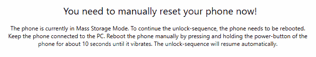

Mass Storage Mode

现在，该设备可以轻松成像，例如，使用 FTK 成像仪:

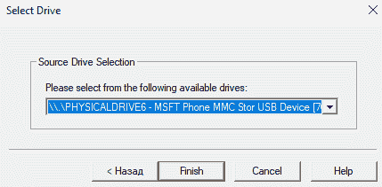

Windows Phone in FTK Imager

现在，我们将学习如何从 SD 卡中提取数据。

# SD 卡数据提取方法

Windows Phones 可能包含可移动 SD 卡。这些卡可以用钥匙保护，防止 SD 卡被移除和使用，或者通过其他设备(电话、相机、计算机等)访问。这与用户加密 SD 卡时创建的密钥不同。暴力和字典攻击可以在用户加密的 SD 卡上运行，试图访问数据。检查 Windows Phone 时，最好研究一下设备，看看从设备获取数据时 SD 卡的安全性是否会成为一个因素。如果是，只需按照前面的步骤，在取证提取过程中通过手机获取 SD 卡数据。请参考下图。

对于可以卸下 SD 卡的设备，有两种情况需要考虑。如果设备已打开，您是否应该按原样获取手机和 SD 卡？如果设备关闭，您是否应该卸下 SD 卡并使用 FTK 成像仪获取设备？答案是，看情况。在法医学中，我们经常使用这种说法，但它仍然是正确的。如果让设备保持开启状态，必须将其与网络隔离，以确保不会被远程访问和立即获取，否则电池会耗尽，最终设备可能会断电。如果设备关闭，并且您移除了 SD 卡，您必须确保该卡与设备本身保持绑定，并且从外部和内部获取，以确保捕获所有数据。在正常情况下，下表建议了处理 Windows Phones 中的 SD 卡的建议步骤:

大多数商业取证工具将提供从 SD 卡提取数据。通常，电话提取过程将只提取驻留在 SD 卡上的数据。当不支持特定的 Windows Phone 时，通常会出现这种情况。如果 SD 卡没有被工具识别，数据没有被提取，很可能是 SD 卡已经被用户加密了，设备的密码和 SD 卡的密码不一样。出现这种情况时，请尝试破解密码并重新获取设备。请注意，破解 SD 卡上的密码可能并不总是可能的，但像在标准硬盘或外部设备上一样，尝试暴力和字典攻击是值得的。

当获取已从 Windows Phone 中移除的 SD 时，FTK 成像仪是一个免费且可靠的选项，可以创建可在各种工具中检查的合法声音图像。要创建 SD 卡映像，请执行以下步骤:

1.  从设备中取出 SD 卡，并确保记录卡和电话上的所有标识符，以确保它们不会永久分离。
2.  将 SD 卡插入*写阻止器*并将其插入您的取证工作站。
3.  发射 FTK 成像仪。
4.  选择文件，然后选择创建磁盘映像。

5.  选择物理驱动器:

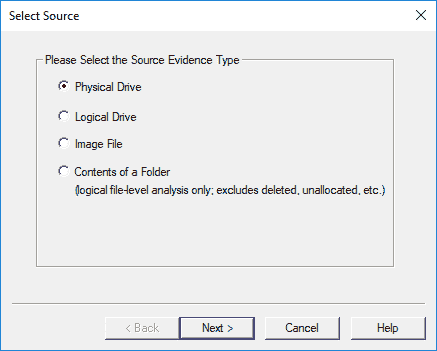

FTK Imager – creating a disk image

6.  使用下拉列表选择正确的设备。

Look at the make and size to ensure that you are acquiring the correct device.

7.  选择完成。

8.  单击添加并选择图像类型。对于本例，将使用 Raw (dd)，因为大多数商业和开源分析方法都支持它:

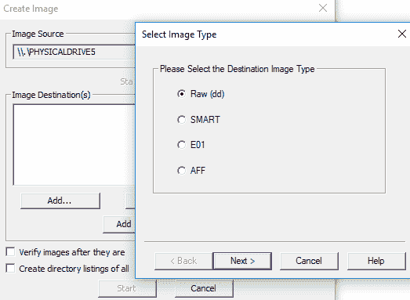

FTK Imager – selecting the image type

9.  输入相关案例信息，然后选择下一步。这个可以跳过。
10.  选择图像目标:

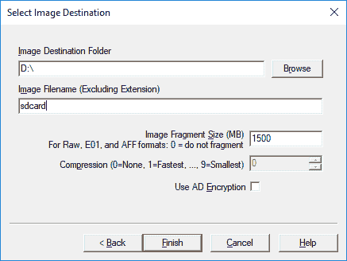

FTK Imager – saving your image file

11.  选择完成，然后选择开始。建议您在创建图像后对其进行验证。

完成后，将显示您的结果。我们将在以下几节中分析 SD 卡数据。

# 用于检查的关键工件

在本节中，我们将向您介绍一些最常见的 Windows Phone 取证构件的位置，包括联系人、短信以及通话和互联网历史记录。

# 提取联系人和短信

Windows Phone 7–10 中的所有联系人和收发短信都存储在名为`store.vol`的文件中，该文件位于`\Application Data\Microsoft\Outlook\Stores\DeviceStore` (Windows 7)和`Users\WPCOMMSERVICES\APPDATA\Local\Unistore` (Windows 8-10)目录下。在下面的截图中可以看到一个 Windows 10 `store.vol`文件的例子:

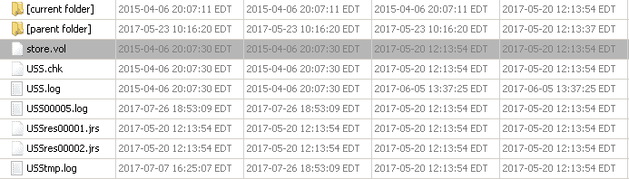

The store.vol file in a Windows Phone

现在，让我们学习如何提取通话记录。

# 正在提取通话记录

通话历史数据目前可以从`Phone`文件中提取。需要注意的是，文件没有扩展名，位于`\Users\WPCOMMSERVICES\APPDATA\ Local\UserData\`。下面是一个 Windows 10 `Phone`文件的例子:

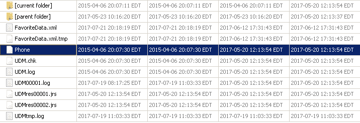

The Phone file in a Windows Phone

以类似的方式，我们将在下面的部分提取互联网历史。

# 提取互联网历史记录

互联网历史可以从位于`\Users\DefApps\APPDATA\Local\Microsoft\Windows\WebCache\`的`WebCacheV01.dat`文件中提取。下面是一个 Windows 10 `WebCacheV01.dat`文件的例子:

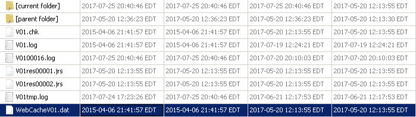

The WebCacheV01.dat file in a Windows Phone

这些文件可以手动检查，例如，使用十六进制查看器，或者可以使用移动取证工具自动解析。下面是用 Magnet AXIOM 解析的`WebCacheV01.dat`文件:

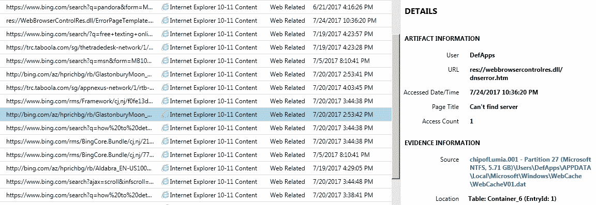

WebCacheV01.dat file parsed with Magnet AXIOM

至此，我们已经介绍了如何从 Windows Phone 中提取短信、联系人、呼叫和互联网历史记录。

# 摘要

从 Windows Phone 设备获取数据具有挑战性，因为它们是安全的，而商业取证工具和开源方法并不能为像您这样的法医检查人员提供简单的解决方案。多种工具、芯片外、JTAG 和我们在本书中定义的方法是在 Windows Phone 设备上提供用户数据访问的一些方法。通常，您会发现 Windows Phone 设备需要多种提取方法来获取可访问的数据。最大的挑战是进入设备获取数据。一旦数据可用，您就可以分析所有提取的信息。

在本章中，我们介绍了 Windows Phone 设备的界面、重要功能和安全模型。然后，我们查看了 Windows 文件系统中不同的分区和文件夹结构。Windows Phone 注册表类似于微软操作系统中的注册表。我们看到了如何使用和不使用商业工具提取数据，并查看了一些常见的 Windows Phone 取证工件。有了这些知识，您现在可以使用多种提取方法从 Windows Phone 中提取用户数据。

下一章将指导您解析第三方应用文件。