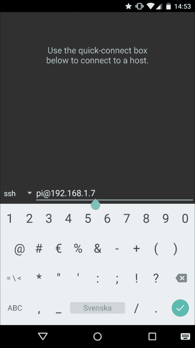
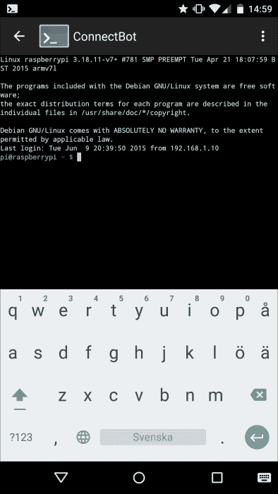
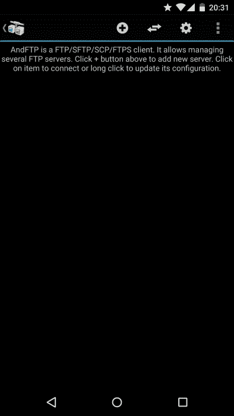
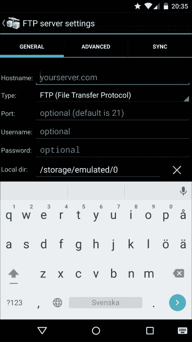
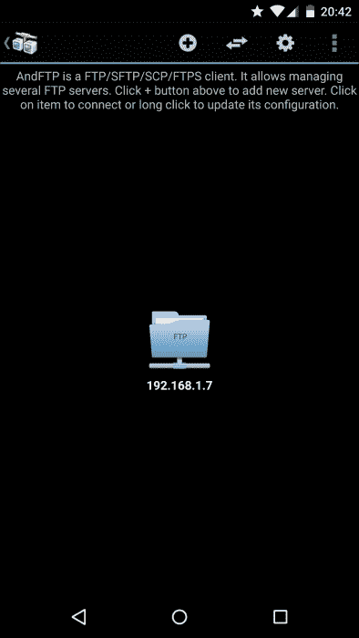
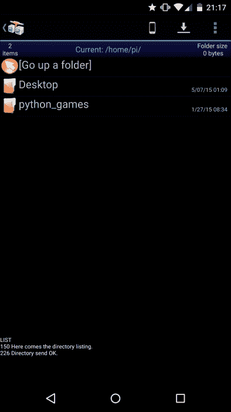
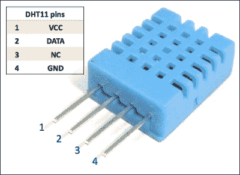
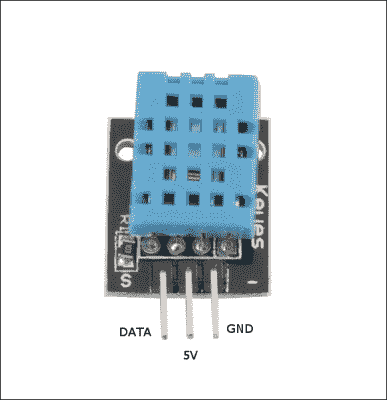
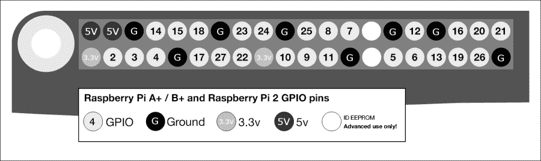
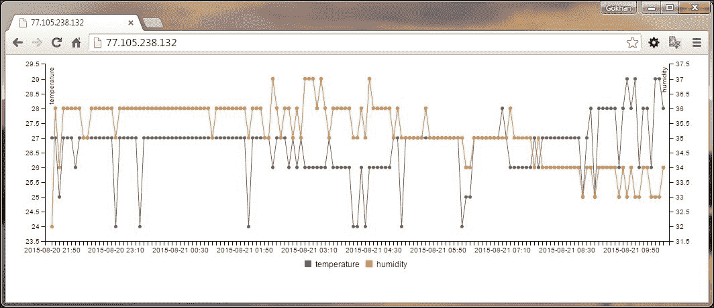

# 第二章。用 Pi 管理服务器

在本项目的前半部分，我们将从基于桌面的控制台转移到基于文本的控制台，该控制台为用户提供了更多的功能，并允许您执行比桌面更高级的任务。我们将从安卓设备访问 Pi 的 Linux 控制台，并远程控制它。下半年，我们将通过 FTP 在 Pi 和安卓之间收发文件。我们甚至将通过使用基于文本的控制台远程管理我们新安装的 FTP 服务器来结合这两个部分。在本章中，我们甚至会将数据库和网络服务器安装到 Pi 上，以展示以后如何管理它们。为了使它更有趣，我们将实现一个简单但有用的迷你项目，它同时利用了 web 和数据库服务器。将涵盖以下主题:

*   从安卓系统到 Pi 的远程控制台
*   在圆周率和安卓系统之间交换文件
*   一个简单的数据库和 web 服务器实现
*   服务器的简单管理

# 从安卓远程控制台到 Pi

Linux 和 Unix 计算机的管理员多年来一直使用名为 **shell** 的基于文本的命令行界面来管理他们的服务器。由于 Pi 的操作系统 Raspbian 是一个 Linux 变体，访问和发出命令或检查 Pi 上运行的程序、服务和不同服务器的状态的最自然的方式还是通过在这个基于文本的外壳上发出命令。有不同的外壳实现，但是默认情况下在 Raspbian 上使用的是 **bash** 。在 Linux 服务器上远程访问 shell 的最著名的方式是通过**安全 Shell** 协议，通常称为 **SSH** 。

### 注

**安全 Shell** ( **SSH** )是一种加密的网络协议，用于以安全的方式向远程机器发送 Shell 命令。SSH 为你做了两件事。它通过不同的工具，例如我们稍后将向您展示的工具，使您能够向远程机器发送命令，并且它使用在不安全网络上建立的安全通道来执行此操作。

为了让 SSH 工作，应该有一个已经运行的 SSH 服务器，它可以接受和响应 SSH 客户端请求。在树莓 Pi 上，默认情况下启用此功能。无论如何，如果它被禁用，您可以通过发出以下命令，使用 Pi 配置程序启用它:

```py
sudo raspi-config

```

然后，导航到 **ssh** 点击*进入*，然后选择**启用或禁用 ssh 服务器**。

在客户端，由于我们在本书中使用安卓作为我们的客户端，我们将下载一个名为 ConnectBot 的应用程序。它是安卓上最受欢迎的 SSH 客户端之一，截至今天的最新版本是 1.8.4。将其下载到您的设备并打开。

您需要提供我们在上一章中找到的用户名和 IP 地址。我们不需要提供端口，因为在这种情况下，连接机器人将使用 SSH 的默认端口。点击**是**如果因为主机真实性问题而要求您继续连接。之所以问你这个问题，是因为你第一次通过远程 SSH 连接到 Pi。

请注意，在下面的截图中，我已经提供了我的家庭网络的内部 IP 地址。您可能希望使用外部 IP 地址，并从家庭网络外部连接到 Pi。为此，您还需要将标准 FTP 端口`21`和`20`添加到您的端口转发设置中。这同样适用于 SSH 协议，其默认端口号为`22`。

### 注

正如我们之前所讨论的，以这种方式打开端口并在 Pi 上保留用户的默认密码`pi`存在安全风险。

下面的截图说明了 ConnectBot 上的连接细节:



ConnectBot 上的连接详细信息

现在，提供`pi`账户的默认密码，也就是`raspberry`，或者是你让改成的那个。完成这一步后，您将使用 SSH 远程连接到 Pi，如下图所示:



ConnectBot 提供的提示

现在，您可以在您的 Pi 上发出命令，并检查不同服务的状态。该连接将与其所有属性一起保存。下一次您想要登录时，您不需要提供地址、用户名和密码信息。

### 注

在 Mac 或 Linux 上，您可以使用默认情况下安装在系统上的`ssh`命令。在窗口上，你可以下载 PuTTY 来发布与连接机器人相同的命令。

# 在 Pi 和安卓之间交换文件

在本章的第二部分中，我们将使用 Pi 作为文件传输协议服务器，在我们的安卓设备之间共享文件，或者将文件发送到 Pi，以便在连接到 Pi HDMI 端口的更大屏幕上查看它们。我们要用的 FTP 服务器是`vsftpd`。它是一个轻量级的 FTP 服务器，用于许多小项目。要将其安装在我们的 Pi 上，我们使用以下命令:

```py
sudo apt-get install vsftpd

```

前面的命令甚至会启动 FTP 服务。

但是，我们应该对 FTP 服务器的配置进行一些更改，以有效地使用它。为此，我们需要使用以下命令编辑 FTP 服务器配置文件:

```py
sudo nano /etc/vsftpd.conf

```

找到包含# `local_enable=YES`和`#write_enable=YES`的两行，在保存并退出之前，删除这些行开头的`#`注释符号。这些更改将使用户`pi`能够登录，并能够向 Pi 发送文件。要重新启动 FTP 服务器，请发出以下命令:

```py
sudo service vsftpd restart

```

现在，我们需要在安卓上安装一个 FTP 客户端。为此，我们将使用**和**。在我们的项目中使用免费版本就足够了。打开安卓设备后，我们会看到以下初始视图:



AndFTP 客户端的初始视图

按加号按钮将带您进入以下视图，在此您将被询问连接属性:



AndFTP 上的连接属性

提供您在第一章中找到的 Pi 的 IP 地址，`pi`作为用户名，`raspberry`作为密码或您已更改的密码。然后，向下滚动到视图的末尾，按下**保存**按钮。这将保存连接属性，并将您送回主视图:



AndFTP 中的连接列表

点击新创建的连接，显示为蓝色文件夹，将启动到 Pi 的 FTP 连接，并让用户`pi` 登录。这将进入`pi`用户的`home`目录，如下图所示:



用户 pi 的主目录

现在，您可以通过按下 AndFTP 中类似手机的图标，然后选择一个文件进行上传，将文件从您的安卓设备上传到 Pi。你可以使用内置的 FTP 客户端从同一网络上的另一个安卓设备甚至另一台电脑设置 AndFTP，下载新上传的文件查看；通过这种方式，您已经使用树莓 Pi 作为 FTP 服务器，在不同的 Android 客户端之间共享了您的第一个文件。

# 简单的数据库和 web 服务器实现

接下来，我们将把我们的项目向前推进一步，安装一个数据库和网络服务器，稍后我们可以使用连接机器人来管理它。我们甚至会通过实现一个利用这些服务器的真实项目来使它变得更有趣。这方面的最佳选择是传感器测量场景。我们将把一个温度/湿度传感器连接到我们的 Pi 上，并把测量结果保存到一个数据库中，我们将把这个数据库安装在 Pi 上，网络服务器将把这个数据库提供给客户端。我们稍后可以远程管理这些服务器，这是本章的主要目标。

## 连接传感器

为了这个项目的目的，我们将使用一个传感器， **DHT11** ，它测量温度和湿度，但是为了更容易连接，我们将使用一个名为 **Keyes DHT11** 或简称 DHT11 的现成模块，它包含这些传感器。

### 类型

甚至还有 DHT11 的改进版，就是 DHT22。它的成本稍微高一点，但上面有更精确的传感器。

使用这个传感器模块而不是传感器本身将使我们能够仅使用三根跳线将传感器连接到 Pi，而不需要试验板或电阻器。使用该模块代替传感器还有另一个优点:传感器提供 Pi 无法处理的模拟数据。Pi 能够在其 GPIO 端口上处理数字信息。DHT11 模块为我们做转换。下图显示了 DHT11 传感器模块及其相关引脚的描述:



DHT11 传感器模块

下图显示了 Keyes DHT11 传感器模块:



Keyes DHT11 传感器模块

现在，将传感器模块的 **GND** 输出连接到 Pi 的 GPIO 地， **5V** 输出连接到 Pi 的 5V 引脚， **DATA** 连接到 Pi 的 **GPIO-4** 引脚。下图显示了 Pi 的 GPIO 引脚的布局及其名称:



树莓 Pi GPIO 引脚布局

下一步是读取这些传感器提供的值。为此，我们将使用一个广泛使用的库，该库来自**ada 水果**，是专门为这类用 Python 编程语言开发的传感器而设计的。在我们使用它之前，我们需要在我们的树莓皮上安装一些软件组件。

首先，我们需要使用以下命令更新我们的 Pi 并安装一些依赖项:

```py
sudo apt-get update
sudo apt-get install build-essential python-dev

```

传感器库本身在 GitHub 上，我们将使用以下命令从那里将其下载到我们的 Pi 上:

```py
git clone https://github.com/adafruit/Adafruit_Python_DHT.git

```

该命令下载库并将其保存在子目录中。现在，使用以下命令进入这个子目录:

```py
cd Adafruit_Python_DHT

```

接下来，您需要使用以下命令实际安装传感器库:

```py
sudo python setup.py install

```

这里，我们使用标准的 Python 第三方模块安装功能，该功能在标准 Python 库安装位置`/usr/local/lib/python2.7/dist-packages/`将 ada 水果库全局安装到您的系统上。这就是为什么我们需要超级用户权限，我们可以使用`sudo`命令获得。

现在我们已经准备好开始使用我们与库一起下载的示例代码从传感器读取测量值。假设您仍然在`Adafruit_Python_DHT`目录中，下面的命令可以完成任务:

```py
sudo ./examples/AdafruitDHT.py 11 4

```

在该命令中，`11`是用于识别 DHT11 传感器的描述符，`4`表示 GPIO 引脚 4。现在，您应该得到如下输出:

```py
Temp=25.0*C  Humidity=36.0%

```

## 安装数据库

在验证传感器和与 Pi 的连接工作后，我们将测量结果保存在数据库中。我们将使用的数据库是 MySQL。使用以下命令将 MySQL 安装到 Pi:

```py
sudo apt-get install mysql-server python-mysqldb

```

在安装过程中，将要求您为管理员帐户根设置密码。我将设置 admin 作为密码，并在接下来的代码中引用它。以下命令将您带入 MySQL shell，您可以在其中发出 SQL 命令，例如将数据插入数据库或查询数据库中已有的数据。当要求您提供密码时，您应该提供您设置的密码:

```py
mysql -u root -p

```

您可以随时使用`exit`命令退出 MySQL shell。

MySQL shell 中的下一步是创建一个数据库，并将其用于任何后续的 SQL 语句:

```py
mysql> CREATE DATABASE measurements;
mysql> USE measurements;

```

以下 SQL 语句将在这个新创建的数据库中创建一个表，我们将使用它来保存传感器测量值:

```py
mysql> CREATE TABLE measurements (ttime DATETIME, temperature NUMERIC(4,1), humidity NUMERIC(4,1));

```

下一步是实现一个 Python 脚本，该脚本从我们的传感器读取数据并将其保存到数据库中。使用前面讨论的`nano`命令，将下面的代码放在`home`目录下名为`sense.py`的文件中。您可以使用不带参数的`cd`命令从`pi`目录结构中的任何位置返回到`home`目录。请注意一个重要的事实，文件不应该包含任何空的前几行，这意味着引用 Python 命令的行应该是文件中的第一行。以下代码构成了我们的`sense.py`文件的内容:

```py
#!/usr/bin/python

import sys
import Adafruit_DHT
import MySQLdb

humidity, temperature = Adafruit_DHT.read_retry(Adafruit_DHT.DHT11, 4)
#temperature = temperature * 1.8 + 32 # fahrenheit
print str(temperature) + " " + str(humidity)
if humidity is not None and temperature is not None:
    db = MySQLdb.connect("localhost", "root", "admin", "measurements")
    curs = db.cursor()
    try:
        sqlline = "insert into measurements values(NOW(), {0:0.1f}, {1:0.1f});".format(temperature, humidity)
        curs.execute(sqlline)
        curs.execute ("DELETE FROM measurements WHERE ttime < NOW() - INTERVAL 180 DAY;")
        db.commit()
        print "Data committed"
    except MySQLdb.Error as e:
        print "Error: the database is being rolled back" + str(e)
        db.rollback()
else:
    print "Failed to get reading. Try again!"
```

### 注

您应该将`MySQLdb.connect`方法调用中的密码参数更改为您在 MySQL 服务器上分配给根用户的密码参数。出于安全原因，您甚至应该考虑创建一个可以访问`measurements`表的新用户，因为根用户可以完全访问数据库。为此，请参考 MySQL 文档。

下一步是用以下命令更改文件属性，使其成为可执行文件:

```py
chmod +x sense.py

```

请注意，该脚本仅保存一个测量值。我们需要安排这个脚本的运行。为此目的，我们将使用一个名为 **cron** 的内置 Linux 实用程序，它允许 cron 守护程序定期在后台自动运行任务。 **crontab，**也称为CRON TABle，是一个包含指定时间运行的 CRON 条目计划的文件。通过运行以下命令，我们可以编辑该表:

```py
crontab –e

```

将以下行添加到该文件并保存。这将使 cron deamon 每五分钟运行一次我们的脚本:

```py
*/5 * * * * sudo /home/pi/sense.py
```

## 安装网络服务器

现在，我们将将我们的测量值保存到数据库中。下一步是使用网络服务器在网络浏览器中查看它们。为此，我们将使用 **Apache** 作为网络服务器，使用 **PHP** 作为编程语言。要安装 Apache 和我们需要的软件包，请运行以下命令:

```py
sudo apt-get install apache2
sudo apt-get install php5 libapache2-mod-php5
sudo apt-get install libapache2-mod-auth-mysql php5-mysql

```

然后，将您的目录更改为 web 服务器的默认目录:

```py
cd /var/www

```

在这里，我们将创建一个文件，用户可以通过我们安装的 web 服务器访问该文件。该文件由 web 服务器执行，执行结果被发送到连接的客户端。我们将其命名为`index.php`:

```py
sudo nano index.php

```

内容应该如下代码所示。在这里，您应该再次将 MySQL 用户根的密码更改为您在调用`new mysqli`构造函数方法时选择的密码:

```py
<?php

// Create connection
$conn = new mysqli("localhost", "root", "admin", "measurements");
// Check connection
if ($conn->connect_error) {
    die("Connection failed: " . $conn->connect_error);
}

$sql = "SELECT ttime, temperature, humidity FROM measurements WHERE ttime > NOW() - INTERVAL 3 DAY;";
$result = $conn->query($sql);
?>
<html>
<head>
<!-- Load c3.css -->
<link href="https://rawgit.com/masayuki0812/c3/master/c3.min.css" rel="stylesheet" type="text/css">

<!-- Load d3.js and c3.js -->
<script src="https://rawgit.com/mbostock/d3/master/d3.min.js" charset="utf-8"></script>
<script src="https://rawgit.com/masayuki0812/c3/master/c3.min.js"></scrip>
</head>
<body>
<div id="chart"></div>

<script>

<?php

if($result->num_rows > 0) {
?>
var json = [
<?php
  while($row = $result->fetch_assoc()) {
    ?>{ttime:'<?=$row["ttime"]?>',temperature:<?=$row["temperature"]?> ,humidity:<?=$row["humidity"]?>},<?
  }
}
?>
];
<?php
$conn->close();
?>
var chart = c3.generate({
    bindto: '#chart',
    data: {
      x: 'ttime',
      xFormat: '%Y-%m-%d %H:%M:%S', 
      keys: {
        x:'ttime',
        value: ['temperature', 'humidity']
      },
      json: json,
      axes: {
        temperature: 'y',
        humidity: 'y2'
      }
    },
    axis: {
        x: {
            type: 'timeseries',
            tick: {
                format: '%Y-%m-%d %H:%M'
            }
        },
        y: {
            label: 'temperature'
        },
        y2: {
            show: true,
            label: 'humidity'
        }
    }
});
</script>
</body>
</html>
```

我们希望这个页面是默认的起始页，只要网页浏览器直接用一个 IP 地址访问服务器，就会得到这个页面。您可以按如下方式备份 Apache 的旧默认起始页:

```py
sudo mv index.html oldindex.html

```

经过几个小时的传感器测量后，从浏览器导航到 Pi 的 IP 地址将产生类似于下面截图的视图。在这里，我可以使用家庭网络之外的外部 IP 地址访问 Pi，因为我已经将`80`的 HTTP 端口添加到了我的家庭路由器的端口转发设置中。



现在，我们有一个运行 FTP、数据库和网络服务器的。让我们使用连接机器人来管理这些。

# 服务器的简单管理

以下命令只是检查 FTP 服务器的状态:

```py
service vsftpd status

```

如果 FTP 服务器有任何问题，此命令会重新启动该服务器:

```py
sudo service vstfpd restart

```

我们使用的`service`实用程序允许您使用以下两个命令重新启动数据库和网络服务器:

```py
sudo service mysql restart
sudo service apache2 restart

```

使用以下命令检查 MySQL 服务器的状态:

```py
mysqladmin -u root -p status

```

如果您认为数据库变得太大，可以启动 MySQL 控制台并运行一个 SQL 查询来查看数据库大小:

```py
mysql –u root –p
mysql> SELECT table_schema "DB", Round(Sum(data_length + index_length) / 1024 / 1024, 1) "Size in MB" 
FROM   information_schema.tables 
GROUP  BY table_schema;

```

您甚至可以使用以下查询删除超过三天的记录:

```py
select measurements;
delete from measurements where ttime < NOW() - INTERVAL 3 DAY;

```

或者，您可以使用 shell 命令检查文件系统的大小:

```py
df -h

```

# 总结

本章向您介绍了树莓 Pi 作为服务器的管理，以及如何从安卓向其发出命令。我们在 Pi 上安装了一个 FTP 服务器，在安卓客户端之间共享文件。为了展示数据库和 web 服务器的示例，我们实现了一个有用的项目，并学习了如何远程管理这些服务器。

下一章将向您介绍 Pi 摄像头，并帮助您实施监控解决方案。