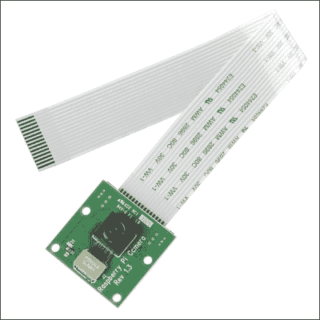
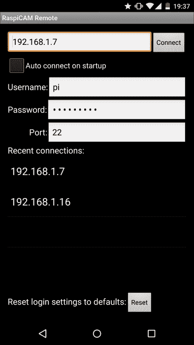
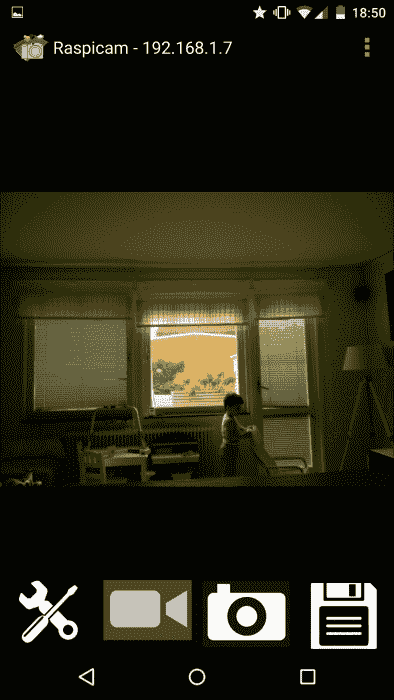
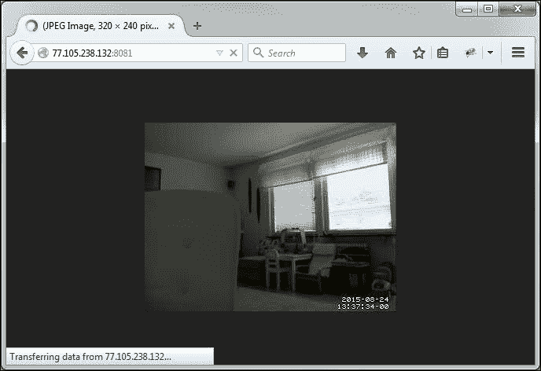
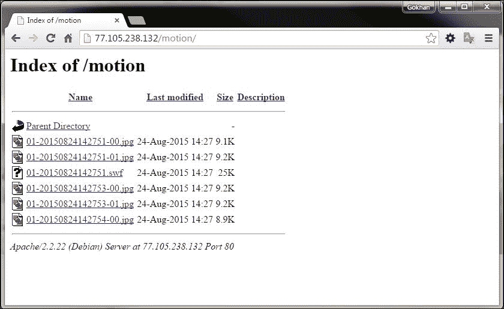

# 第三章。圆周率监控摄像头的直播

在这一章中，我们将连接一个摄像头到树莓 Pi，并从其中流式传输一个实时视频。然后，我们将能够从我们的安卓设备上观看这些内容的流式传输。这一章将使我们更接近使用和远离树莓皮的管理。

在本章中，我们将涵盖以下主题:

*   硬件和软件配置
*   将视频流式传输到安卓设备
*   监控模式

# 硬件和软件配置

我们将使用为圆周率开发的标准相机，在许多主要的电子商店售价约为 30 美元。



圆周率相机

Pi 有一个摄像头端口，可以插入摄像头电缆。通过向上拉可以打开圆周率上的插头。如果你有问题连接摄像头到 Pi，你可以在网上找到很多视频展示如何做。您可以在[https://www.raspberrypi.org/help/camera-module-setup/](https://www.raspberrypi.org/help/camera-module-setup/)树莓皮基金会观看。

下一步是配置 Pi 并启用摄像头硬件。这是使用 Pi 配置程序完成的，通过发出以下命令进行访问:

```py
sudo raspi-config

```

在提供的菜单中，选择**启用摄像头**并点击*进入*。然后点击**完成**，系统将提示您重新启动。

# 将视频流式传输到安卓设备

从圆周率到安卓的最简单的方式是使用登录圆周率并执行必要命令的 **拉斯皮卡姆远程**应用。然后，它会自动从 Pi 中获取流。下载并打开该应用，您将获得一个提供登录详细信息的初始视图，例如 IP 地址、用户名和密码。请注意，默认情况下，它使用默认的登录帐户详细信息和 SSH 端口。只有在默认安装到位的情况下，您才需要该 IP 地址。如果您为端口`22`启用端口转发，您甚至可以从互联网访问您的相机，如[第 1 章](1.html#aid-DB7S1 "Chapter 1. Make a Remote Desktop Connection to Your Pi from Anywhere")、*所述，从任意位置与您的 Pi 进行远程桌面连接*。以下屏幕截图显示了 RaspiCam 远程应用的登录设置:



拉斯皮卡姆远程应用的初始视图

等待几秒钟后，你应该会在你的安卓设备上看到树莓 Pi 相机拍摄的第一张照片。按下摄像头图标后，摄像头将开始流式传输，如下图所示:



从皮流出

下一步是使用 **H.264** 设置获得更好的流媒体质量。连接到 RaspiCam 远程应用后，您应该打开设置并勾选 **H.264** 复选框。但是，在再次通过应用连接之前，我们需要使用以下命令在 Pi 上安装一个 VLC 服务器。您可能会不时遇到`install`命令的问题，但再次运行它几乎总能解决问题:

```py
sudo apt-get install vlc

```

下一步是在安卓系统上安装更好的 VLC 客户端。我们将使用 **VLC 进行安卓测试版**应用。安装后，再次打开 RaspiCam Remote 应用，然后点击摄像头图标开始流媒体。此时，安卓会要求你为安卓测试版选择标准视频播放器或新安装的 VLC。选择后者，你会体验到更好的流媒体质量。不要忘记将端口`8080`添加到路由器的端口转发设置中，以便通过互联网访问流式视频。

## 手动 VLC 配置

RaspiCam 远程应用在传输视频内容之前，会自动在 Pi 上配置 VLC 。你们中的一些人可能想直接从 VLC 应用连接到视频流，而跳过安卓系统上的 RaspiCam。以下命令与在安卓设备上开始使用 RaspiCam 流之前，RaspiCam 从您提供的帐户发出的命令相同:

```py
/opt/vc/bin/raspivid -o - -n -t 0 -fps 25 -rot 0 -w 640 -h 480 | /usr/bin/vlc -I dummy stream:///dev/stdin --sout '#standard{access=http,mux=ts,dst=:8080}' :demux=h264 &

```

如果您发出前面的命令，您将能够从 VLC 应用查看流式内容。您可以通过点击 VLC 应用操作栏上类似天线的图标来启动连接。它将提示输入流地址，即`http://PI_IP_ADDRESS:8080`。

# 监控模式

看到从你的相机流出的视频很酷，但是能够在监控模式下运行它要有用得多。我们希望相机对运动做出反应，并在检测到运动时保存图像或视频，以便我们以后可以检查它们，而不是盯着视频。为此，我们将开始在我们的 Pi 上安装一个运动识别软件，出于明显的原因，该软件被称为`motion`:

```py
sudo apt-get install motion

```

这将安装`motion`软件，以下命令将向内核添加必要的包:

```py
sudo modprobe bcm2835-v4l2

```

把这个放在`/etc/rc.local`文件里是个好主意，这样启动的时候就可以运行了。不过，你应该把它放在`exit 0`线之前。

我们甚至会进行一些配置更改，以便能够访问`motion`提供的流和控制功能。使用以下命令编辑运动配置文件:

```py
sudo nano /etc/motion/motion.conf

```

默认情况下，对 motion 的 web 访问仅限于本地主机，这意味着除了 Pi 本身，您不能从其他计算机访问它。我们将通过在`motion.conf`文件中找到以下几行来改变这种行为:

```py
webcam_localhost on
control_localhost on
```

请注意，这些不是文件中的后续行。另外，如果使用 **nano** 作为编辑器，可以按 *Ctrl* + *W* 进入搜索模式。

我们将通过分别用以下代码行替换前面的代码行来关闭仅 localhost 访问行为:

```py
webcam_localhost off
control_localhost off
```

此外，我们希望`motion`服务在后台模式下执行，并像`daemon`一样运行。为此，我们应该在同一个文件中找到下面一行代码:

```py
daemon on
```

我们应该用这句话来代替它:

```py
daemon off
```

如果现在启动`motion`，会出现如下错误:

```py
Exit motion, cannot create process id file (pid file) /var/run/motion/motion.pid: No such file or directory

```

为了消除这个错误，我们可以创建这个`motion`正在抱怨的文件夹:

```py
sudo mkdir /var/run/motion

```

请注意，该目录可能会在启动时被删除，因此最好将该命令也添加到`/etc/rc.local`文件中。

现在，您终于可以在监视模式下启动和停止您的 Pi 摄像机，发出以下命令，最好使用 **ConnectBot** 应用或我们在上一章中讨论的任何其他 SSH 客户端。以下命令将启动`motion`:

```py
sudo motion

```

要停止运动，请发出以下命令:

```py
sudo pkill -f motion

```

如果您总是想在启动时运行它，我不建议这样做，因为您的 Pi 上的存储空间可能会用完，您应该使用以下命令编辑`/etc/default/motion`文件:

```py
sudo nano /etc/default/motion

```

在这个文件中，您会发现下面一行:

```py
start_motion_daemon=no
```

你应该换成这个:

```py
start_motion_daemon=yes
```

您可以使用以下命令启动服务，或者重新启动您的 Pi，这将自动启动服务:

```py
sudo service motion start

```

要检查所有服务以及 motion 服务的状态，可以使用以下命令:

```py
sudo service --status-all

```

Motion 软件分为两部分。第一部分是可以观看流媒体视频的地方，第二部分是检测到运动时可以看到图像/视频文件的地方。打开`http://IP_ADRESS_OF_THE_PI:8081`网页，可以看到运动软件的流。出于某种原因，运动软件的这一部分只在 Firefox 中工作，但下一节讨论的监控部分将在其他浏览器中工作。请注意，您不能同时通过 RaspiCam 应用启动运动服务器和 VLC，因为它们使用相同的端口。下面的截图显示了运动视频的流:



端口 8081 上的运动流视频

如前一章所述，您可以使用**和**登录到 Pi，并导航到`/tmp/motion`文件夹，查看检测到运动时保存的图像。重新启动运动服务将清空文件夹的内容。

### 类型

将端口`8080`、`8081`和`21`添加到路由器内部的端口转发设置中，以便从网络外部访问这些服务。

## 访问网络上的监控图像

在几乎所有涉及监控的场景中，我们都希望访问通过互联网检测到运动时保存的图像。为此，我们将把`motion`保存图像的目录连接到我们在上一章已经安装的 Apache 服务器。运行以下命令可以达到这个目的:

```py
sudo ln -s /tmp/motion /var/www/motion

```

您还应该使用文件中的以下行将`motion`保存图像和视频的目录添加到`motion.conf`文件中:

```py
target_dir /tmp/motion

```

现在，在浏览器中打开`http://IP_ADRESS_OF_THE_PI/motion`链接，您将看到每当在摄像机前检测到运动时`motion`保存的图像列表。

请注意，如果`motion`尚未检测到任何运动并创建了`/tmp/motion/`目录，您可能会从网络浏览器中获得禁止访问故障。下面的截图显示了 motion 保存的图像列表:



通过网络访问检测到运动时的图像和视频文件

# 总结

我们已经从 Pi 的管理转移到更多的现实项目中，并在 Pi 上安装了一个摄像头；因此，可以在安卓设备和网络上观看 Pi 流。我们甚至学会了如何使用圆周率作为监控摄像头，并看到它检测到的运动。

在下一章中，我们将在一个更有趣的场景中继续使用圆周率，并将它变成一个媒体中心。