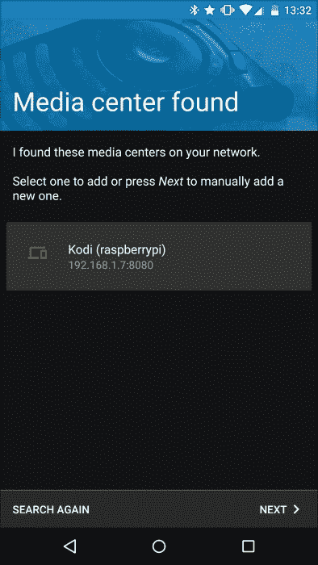
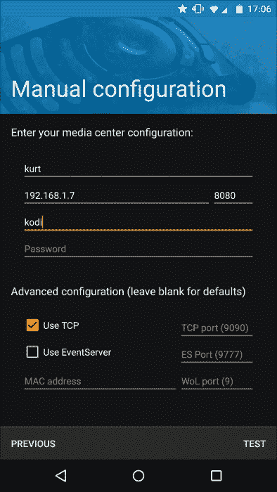
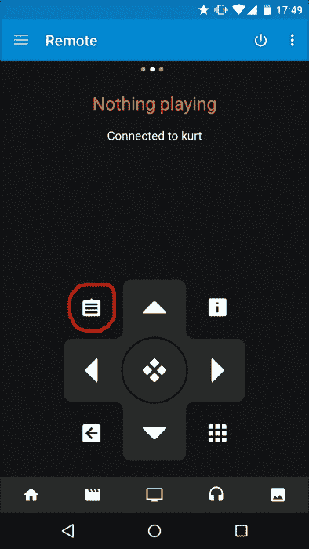
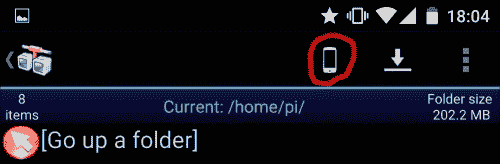
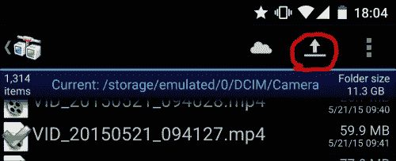
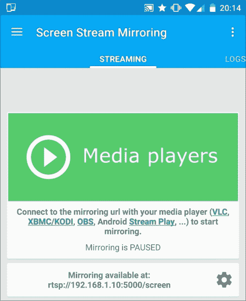
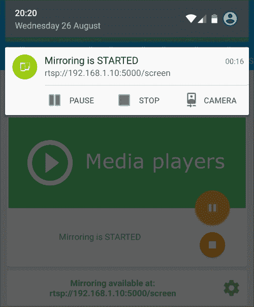

# 第四章。把你的圆周率变成媒体中心

在前几章中，我们一直在管理我们的 Pi 并实施有用的项目。在本章中，我们将更多地使用我们的 Pi 作为娱乐来源，并将其转变为媒体中心。涵盖的主题如下:

*   在 Pi 上安装和设置媒体中心
*   通过安卓远程控制连接到媒体中心
*   从您的媒体中心获取更多信息
*   使用 NOOBS 安装媒体中心

# 在 Pi 上安装和设置媒体中心

我们为这个项目选择的媒体中心软件是**科迪**，原名 XBMC。它是开源的，并广泛使用了许多附加组件。

像往常一样，我们将使用`apt-get`命令在 Pi 上安装必要的软件:

```py
sudo apt-get install kodi

```

然后，我们将运行`kodi-standalone`可执行文件，它将启动 Kodi，并在 Pi 的 HDMI 端口上显示其用户界面。因此，使用 HDMI 端口而不是远程桌面将 Pi 连接到屏幕以查看 Kodi 的用户界面非常重要。现在，你可以连接一个 USB 键盘或鼠标在 Kodi 内部导航。

## 开机启动 Kodi

我们肯定不希望运行命令来启动媒体中心，不管从安卓运行命令有多容易，正如前面章节所讨论的。为此，我们需要在启动时使用`crontab -e`命令启动命令。在文件末尾添加以下一行`crontab`命令命令打开:

```py
@reboot /usr/bin/kodi-standalone &
```

现在，每当你重启 Pi，Kodi 都会自动重启。请注意，在这里，您可以通过 Pi 的 HDMI 端口访问媒体中心，但是您也可以使用[第 1 章](1.html#aid-DB7S1 "Chapter 1. Make a Remote Desktop Connection to Your Pi from Anywhere")、*中讨论的工具通过远程桌面从任何地方连接到您的 PI*进行访问。

# 通过安卓远程控制连接媒体中心

当前设置的主要问题是，您只能使用连接的键盘或鼠标控制媒体中心，使其使用起来不如媒体中心应有的舒适。然而，安卓系统上有一个 Kodi 的遥控器，叫做 **Kore** ，这使得远程控制媒体中心变得非常容易。可以从谷歌 Play 下载。它的官方名称是 **Kore，Kodi** 的官方遥控器，由 **XBMC 基金会**出版，这是一个运营 Kodi 媒体中心项目的非营利组织。

在您可以将安卓上的远程控制应用程序连接到 Pi 上的 Kodi 安装之前，您需要在 Kodi 上进行一些设置更改。进入科迪的**系统**菜单，然后**设置**、**服务**、**网络服务器**。在这里，您应该选择**允许通过 HTTP** 控制 Kodi。然后转到同一菜单中的**远程控制**设置，启用**允许本系统程序控制 XBMC** 、**允许其他系统程序控制 XBMC** 设置。现在在安卓上打开 Kore，让它搜索媒体中心。如果电话和媒体中心在同一个网络上，科勒应该能找到它。搜索成功后，您将看到类似于以下屏幕截图的视图:

### 类型

请注意，Kodi 的默认 HTTP 端口与我们在上一章中看到的运动服务器的默认 HTTP 端口冲突。在 Kodi 的设置中进行这些更改之前，您应该更改 Kodi 中的端口设置或停止 motion 服务器。



科勒找到了媒体中心

现在，点击新发现的媒体中心进行连接并开始远程控制。如果没有自动识别媒体中心，可以按**下一步**按钮，手动输入参数。端口`8080`是默认端口，`kodi`是默认用户名，如果您没有在 Kodi 中更改这些参数，您应该使用该用户名。



韩国的手动设置

# 从您的媒体中心获取更多信息

媒体中心可以用来做很多事情。例如，你可以下载插件，让你访问许多在线内容，如 YouTube、汗学院和 TED 演讲。

## 在安卓设备上使用 Kodi 观看视频

你可以做的另一件有趣的事情是使用之前讨论过的[第 2 章](2.html#aid-K0RQ1 "Chapter 2. Server Management with Pi")、*带 Pi 的服务器管理*中的 AndFTP 应用将视频从手机上传到 Pi，然后使用媒体中心观看电影。您需要在 Pi 上添加一个目录，在那里您将上传这些文件作为 Kodi 中的媒体位置。转到**视频** | **文件** | **文件**，然后导航至**添加视频...**。这里首先选择**浏览**，然后选择**根文件系统**。请注意，我们在[第 2 章](2.html#aid-K0RQ1 "Chapter 2. Server Management with Pi")、*服务器管理中使用`/home/pi`作为上传目标。即使在这种情况下也应该有效。向下浏览到该位置，并在所有三个弹出窗口中单击**确定**。你现在应该可以在 Kodi 上的**视频**列表中看到圆周率了。您甚至可以将此文件夹添加到收藏夹以便于访问。打开科瑞遥控 app，再次浏览至**视频**下的`pi`文件夹。当`pi`文件夹在 Kodi 中高亮显示时，按下 Kore 遥控器应用程序中的属性按钮。然后使用 Kore 上的箭头向下滚动选择**添加到收藏夹**。*



列出 Kore 中选项的按钮，即属性按钮

接下来打开[第 2 章](2.html#aid-K0RQ1 "Chapter 2. Server Management with Pi")、*带 Pi 的服务器管理*中的和 TP，连接到 Pi 或选择之前会话中已经保存的连接。您现在应该看到`/home/pi`目录的内容，这是我们使用的用户`pi`的默认位置。这是的目标位置。然后，在 AndFTP 中的动作栏上选择手机图像，以选择位于您手机上的视频并将其上传到 Kodi。



从手机到 Pi 选择上传位置的 AndFTP 接口

录制的视频一般位于`DCIM/Camera`下方。选择您想要上传的视频。然后，单击操作栏中的上传图标:



开始从手机上传到 Pi 的 AndFTP 接口

接下来，您可以浏览到我们添加到**视频**部分的 Kodi 中的`pi`目录，并查看您刚刚在媒体中心上传的视频。

## 将安卓显示屏流式传输到 Kodi

你可以做的另一件非常有趣的事情是流式传输你的安卓屏幕，让 Kodi 显示这个流。为此，我们将首先从谷歌 Play 下载一个应用程序，该应用程序将流式传输安卓显示器，并使用您内部网络上的网址发布它。我们将用于此目的的应用程序被称为**屏幕流****镜像，有免费和付费两种版本。为了这个项目，下载免费版就够了。启动应用后，您需要关闭几个广告，然后按下弹出窗口上的**立即启动**按钮。**

 **

屏幕流镜像

在这里，您将看到流发布到的地址。我们现在将这个`rtsp://YOUR_ANDROID_IP_ADRESS:5000/screen`链接保存在一个我们称之为`stream.strm`的文件中，该文件位于用户`pi`的`home`目录下，也就是`/home/pi`。然后，浏览到 Kodi 中的`pi`目录，找到这个文件，打开。请记住，我们已经将此目录保存在 Kodi 的**视频**部分，并将其作为收藏夹。现在，你应该可以在连接到 Kodi 使用的 Pi HDMI 端口的安卓设备屏幕上看到你所做的任何事情。这里的另一个选项是通过这个频道展示安卓相机的抓拍。我们使用的屏幕流镜像应用程序在安卓通知区域有一个通知。如果你展开它，你会看到一个名为 **CAMERA** 的选项。按下此按钮，您将能够启动相机并看到相机拍摄。



带有摄像头选项的屏幕流镜像通知

# 使用 NOOBS 安装媒体中心

将媒体中心安装到 Pi 上的另一个选项是使用 NOOBS。通过这种方式，用户可以非常轻松地安装媒体中心，而无需担心与 Raspbian OS 相关的细节，就像我们在本章中所做的那样。我们已经在[第 1 章](1.html#aid-DB7S1 "Chapter 1. Make a Remote Desktop Connection to Your Pi from Anywhere")、*中介绍了 NOOBS 安装，从任何地方*远程桌面连接到您的 Pi。但是，在[第 1 章](1.html#aid-DB7S1 "Chapter 1. Make a Remote Desktop Connection to Your Pi from Anywhere")、*从任意位置远程桌面连接到您的 Pi*中，我们使用了离线安装选项。我们可以使用在线安装选项。你应该从[http://downloads.raspberrypi.org/NOOBS_lite_latest](http://downloads.raspberrypi.org/NOOBS_lite_latest)下载在线 NOOBS 安装程序。这个 ZIP 文件要小得多，但是您需要在开始安装之前将 Pi 连接到以太网。将文件的内容提取到 SD 卡，然后插入这张 SD 卡重新启动您的 Pi。现在，您将看到要安装的操作系统列表。该列表还包含两个媒体中心。这些是 **OpenELEC** 和 **OSMC** 。两者都是基于 Kodi 的，我们已经在本章中介绍过了。

# 总结

这一章很短，但很有趣。我们已经学会在我们的 Pi 上安装，并建立了一个最广泛使用的媒体中心，并从我们的安卓设备远程控制它。

在下一章中，我们将开始一些 Python 和安卓编程，并利用 Pi 和安卓之间更多的连接可能性。**