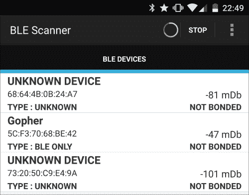
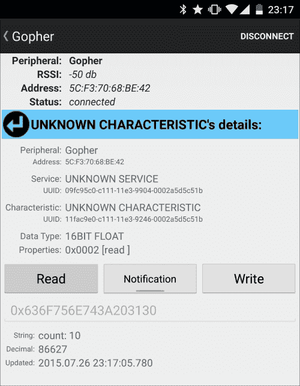
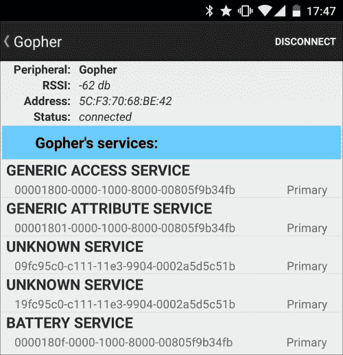
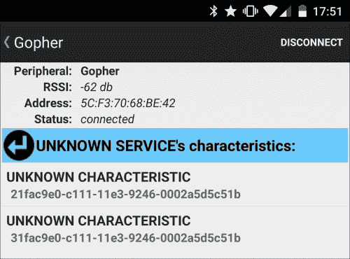
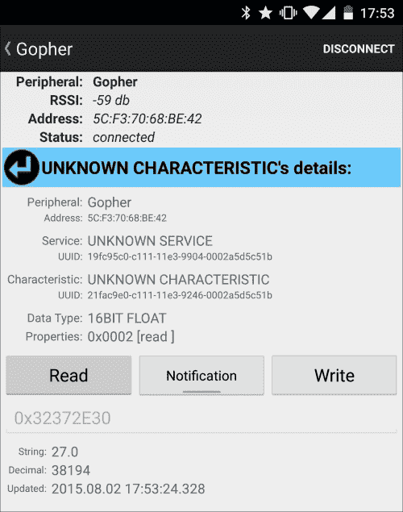
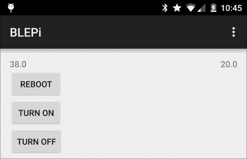

# 第五章。与 Pi 的未接来电

在本章中，我们将实现一个更加面向编程的项目，并深入到蓝牙智能或 **【蓝牙低能量】** ( **BLE** )编程中。我们会让 Pi 和安卓手机通过蓝牙进行通信，利用这个通道控制 Pi。我们将在本章中讨论以下主题:

*   安装必要的组件
*   向蓝牙低能耗添加传感器服务
*   从安卓应用程序连接
*   从你的安卓手机向 Pi 发送重启命令
*   从你的安卓手机向 Pi 发送更多命令

# 安装必要的部件

本项目所需的硬件组件是一个支持 BLE 的蓝牙 USB 加密狗。重要的是，该硬件支持 BLE，因为我们将特别利用这部分的蓝牙堆栈。我们将使用亚马逊上的**可插拔**手机。


可插拔蓝牙加密狗

我们下载的 Raspbian 发行版已经包含了对蓝牙的支持，但是我们需要更新蓝牙包以获得更好的 LE 支持。您可以使用以下命令构建和安装更现代的蓝牙软件包版本:

```py
sudo apt-get install libdbus-1-dev libdbus-glib-1-dev libglib2.0-dev libical-dev libreadline-dev libudev-dev libusb-dev make
mkdir -p work/bluepy
cd work/bluepy
wget https://www.kernel.org/pub/linux/bluetooth/bluez-5.33.tar.xz
tar xvf bluez-5.33.tar.xz
cd bluez-5.33
./configure --disable-systemd
make
sudo make install

```

`make`步骤将编译 Pi 所需的必要包，大约需要 15 分钟才能完成。然而，你需要有耐心，因为它最终会带来一些很酷很有用的东西。请注意，在撰写本书时，BlueZ 的最新版本是 5.33，您可以通过查看[https://www.kernel.org/pub/linux/bluetooth/](https://www.kernel.org/pub/linux/bluetooth/)的所有可用版本列表，将其替换为最新版本。请注意，我们已经使用`--disable-systemd`选项禁用了`systemd`支持，否则会导致构建错误。

前面的命令还安装了一些命令行工具，让我们配置和扫描蓝牙设备。以下命令列出了 Pi 的 USB 端口上的所有连接组件:

```py
lsusb

```

前面命令的输出如下:

```py
Bus 001 Device 002: ID 0424:9514 Standard Microsystems Corp.
Bus 001 Device 001: ID 1d6b:0002 Linux Foundation 2.0 root hub
Bus 001 Device 003: ID 0424:ec00 Standard Microsystems Corp.
Bus 001 Device 004: ID 0a5c:21e8 Broadcom Corp.
Bus 001 Device 005: ID 148f:5370 Ralink Technology, Corp. RT5370 Wireless Adapter

```

蓝牙适配器在我的例子中被命名为`Broadcom`。要获取特定设备的更多详细信息，请使用以下命令:

```py
sudo lsusb -v -d 0a5c:

```

这里需要注意的是`0a5c`是我正在重新使用的蓝牙加密狗地址的第一部分，只为了获取这个设备的更多信息。

`hciconfig`工具会显示哪些设备支持蓝牙。此命令在我的系统上输出以下信息:

```py
hci0:   Type: BR/EDR  Bus: USB
 BD Address: 5C:F3:70:68:BE:42  ACL MTU: 1021:8  SCO MTU: 64:1
 DOWN
 RX bytes:564 acl:0 sco:0 events:29 errors:0
 TX bytes:358 acl:0 sco:0 commands:29 errors:0

```

如图所示，该设备标记为`DOWN`。我们将保持这种方式，因为我们安装的下一个工具要求它最初关闭。

### 注

有一些有用的蓝牙 LE 命令，你可以用来检查其他 BLE 设备。我们还不会使用这些命令，但是使用它们来检查您的 BLE 设备是否工作或可访问是一个很好的做法。

我们之前使用的同样的`hciconfig`工具帮助我们启动蓝牙设备。但是，如果您想继续本章的其余部分，请不要这样做，因为下一个工具需要关闭:

```py
sudo hciconfig hci0 up

```

这是一个很好的想法，把这个命令放在 crontab 中，如前所述，使用 crontab 和`–e`选项，以便让你使用 nano 作为编辑器，并自动安装新的 crontab。最后在文件内部添加`@reboot sudo hciconfig hci0 up`，保存退出。

我们还可以使用另外两个命令:

```py
sudo hcitool lescan

```

该命令列出了 BLE 设备。现在让我们看看下面的命令:

```py
sudo hcitool lecc 68:64:4B:0B:24:A7

```

这个命令测试蓝牙与设备的连接。请注意，提供给后一个命令的地址是由前一个命令返回的。

我们甚至需要蓝牙的编程支持。我们将使用 **Go** 作为语言，使用**Gatt**Go 包来支持 Go 语言中的蓝牙 LE。**通用属性** **配置文件** ( **Gatt** )是通过 BLE 链路发送和接收少量数据的通用规范，称为属性。让我们运行以下命令来安装`go`语言:

```py
cd
git clone https://go.googlesource.com/go
cd go
git checkout go1.4.1
cd src
./all.bash

```

您可能想去这里喝杯咖啡，因为最后一个命令需要大约 40 分钟才能完成。在输出的最后，您将看到`go`安装程序要求您在路径中添加一个二进制目录，以便于访问。以下命令可以实现这一点:

```py
PATH=$PATH:/home/pi/go/bin
export PATH
export GOROOT=/home/pi/go
export GOPATH=/home/pi/gopath

```

### 类型

最好将这些命令放在`/etc/profile`文件中，以便在以后启动的每个会话中执行它们。不过，一定要在文件的末尾添加它们。此外，如果您想在不重新启动的情况下继续，即使您已经将它们放入`profile`文件中，也不要忘记实际执行它们。

然后，使用以下命令下载 Gatt 包源文件:

```py
go get github.com/paypal/gatt

```

现在，我们将使用以下命令启动一个简单的 BLE 服务器:

```py
cd /home/pi/gopath/src/github.com/paypal/gatt
go build examples/server.go
sudo ./server

```

### 类型

完成本章后，您可能希望使用以下命令将服务器启动命令放入`crontab`中:

```py
crontab -e

```

这样，每次重新启动 Pi 时，BLE 服务器都会启动。在结尾处添加以下一行:

```py
@reboot sudo /home/pi/gopath/src/github.com/paypal/gatt/server

```

现在是时候找到我们的树莓皮了，它的行为就像安卓的 BLE 设备。我们将使用由**蓝像素科技公司**开发的 **BLE 扫描仪**应用程序，并在游戏商店提供。当您启动它时，您将看到您周围可用的 BLE 设备列表以及它们的地址。使用`hciconfig`命令可以看到 Pi 上蓝牙适配器的地址。Gatt 服务器的默认实现将该设备命名为 **Gopher** 。下面的截图展示了 BLE 扫描仪应用程序，将圆周率显示为 BLE 设备:



BLE 扫描仪应用程序显示圆周率为 BLE 设备

BLE 堆栈的设计方式是，设备支持一些用户可以连接的服务，每个服务都可以提供读/写或通知特性，这些特性主要是您可以写入、读取或从中获取通知的数据。点击应用程序中的设备，您将连接到 Pi 新启动的 BLE 服务器。您将获得四项服务。我们感兴趣的一个叫做 **UNKNOWN SERVICE** ，之所以没有命名，是因为它不是一个标准服务，它的实现只是为了演示 Gatt 示例服务器。点击本服务，您将看到本服务提供的三个特性: **READ** 、**write**E、 **Notification** 。您可以通过查看 BLE 扫描仪应用程序上的三个按钮中的哪一个被启用来识别特征类型。下面的截图说明了 READ 特性:



READ 特性

# 为蓝牙低能耗添加传感器服务

我们将在 Gatt 已经存在的基础上增加一项新服务。这项新服务将首先发布两个新特性:一个用于湿度测量，另一个用于温度测量。我们将使用我们在[第 2 章](2.html#aid-K0RQ1 "Chapter 2. Server Management with Pi")、*使用 Pi 进行服务器管理*中讨论的技术，以相同的方式阅读测量结果。为了阅读这些测量，我们将创建两个新文件，其内容类似于我们在[第 2 章](2.html#aid-K0RQ1 "Chapter 2. Server Management with Pi")、*用 Pi 进行服务器管理*中讨论的`sense.py`文件。让我们在`home`目录下创建两个文件，并将它们命名为`humidity.py`和`temperature.py`。`temperature.py`文件有以下内容:

```py
#!/usr/bin/python

import sys
import Adafruit_DHT

humidity, temperature = Adafruit_DHT.read_retry(Adafruit_DHT.DHT11, 4)
print str(temperature)
```

`humidity.py`文件也有类似的内容。唯一的区别是它打印出了测量的湿度部分，而不是温度:

```py
#!/usr/bin/python

import sys
import Adafruit_DHT

humidity, temperature = Adafruit_DHT.read_retry(Adafruit_DHT.DHT11, 4)
print str(humidity)
```

我们还需要使用以下命令将文件访问模式更改为可执行:

```py
chmod +x temperature.py humidity.py

```

现在，您可以使用以下命令测试传感器测量值:

```py
sudo ./temperature.py
sudo ./humidity.py

```

下一步是通过蓝牙通道公布这些读数。我们将在现有 Gatt 服务器示例中创建一个新服务。为此，您可以在`/home/pi/gopath/src/github.com/paypal/gatt/examples`路径中开始编辑服务器示例。您只需要在其他服务定义之间的`onStateChanged`函数定义中添加三行代码。在以下内容中，请注意计数服务和电池服务已经存在。我们只需要添加传感器服务:

```py
// A simple count service for demo.
s1 := service.NewCountService()
d.AddService(s1)

// A sensor service for demo.
sSensor := service.NewSensorService()
d.AddService(sSensor)

// A fake battery service for demo.
s2 := service.NewBatteryService()
d.AddService(s2)
```

此外，在同一个文件中，将新服务通告的行更改为以下代码，以便也通告新服务:

```py
// Advertise device name and service's UUIDs.
d.AdvertiseNameAndServices("Gopher", []gatt.UUID{s1.UUID(), sSensor.UUID(), s2.UUID()})
```

我们还需要为新服务添加定义。以下代码应放在一个名为`sensor.go`的文件中，该文件位于与其他服务定义文件相同级别的 Gatt 示例的`service`目录下，如`count.go`和`battery.go`:

```py
package service

import (
 "fmt"
 "log"
 "os/exec"
 "strings"

 "github.com/paypal/gatt"
)

func NewSensorService() *gatt.Service {
 s := gatt.NewService(gatt.MustParseUUID("19fc95c0-c111-11e3-9904- 0002a5d5c51b"))
 s.AddCharacteristic(gatt.MustParseUUID("21fac9e0-c111-11e3-9246- 0002a5d5c51b")).HandleReadFunc(
  func(rsp gatt.ResponseWriter, req *gatt.ReadRequest) {
   out, err := exec.Command("sh", "-c", "sudo /home/pi/temperature.py").Output()
    if err != nil {
     fmt.Fprintf(rsp, "error occured %s", err)
     log.Println("Wrote: error %s", err)
    } else {
     stringout := string(out)
     stringout = strings.TrimSpace(stringout)
     fmt.Fprintf(rsp, stringout)
     log.Println("Wrote:", stringout)
    }
 })

 s.AddCharacteristic(gatt.MustParseUUID("31fac9e0-c111-11e3-9246- 0002a5d5c51b")).HandleReadFunc(
  func(rsp gatt.ResponseWriter, req *gatt.ReadRequest) {
   out, err := exec.Command("sh", "-c", "sudo /home/pi/humidity.py").Output()
    if err != nil {
     fmt.Fprintf(rsp, "error occured %s", err)
     log.Println("Wrote: error %s", err)
    } else {
     stringout := string(out)
     stringout = strings.TrimSpace(stringout)
     fmt.Fprintf(rsp, stringout)
     log.Println("Wrote:", stringout)
   }
 })

 return s
}
```

我们需要使用`go`构建并重新运行我们的服务器代码。我们之前使用的以下命令将帮助我们做到这一点。请注意，您应该在/ `home/pi/gopath/src/github.com/paypal/gatt`目录中:

```py
go build examples/server.go
sudo ./server

```

我们可以再次使用安卓系统上的 BLE 扫描仪应用程序连接到这项新服务，读取温度和湿度传感器值。下面的截图说明了 Gopher 服务:



连接到地鼠设备后，您应该会看到新添加的带有`19fc95c0-c111-11e3-9904-0002a5d5c51b`标识的服务，以及该服务的新特性，如下图所示:



新增特性:一个用于温度测量，另一个用于湿度测量

以下截图显示了按下**读取**按钮后的温度测量特征细节:



显示 27 度电流值的温度测量特性

# 从安卓应用连接

我们已经使用一个现有的应用程序连接到我们在树莓皮上实现的 BLE 服务。这款名为 BLE 扫描仪的应用程序非常通用，适用于任何类型的 BLE 设备。然而，我们需要一个更专业的应用程序，它只读取测量值并提取 BLE 协议的细节，如设备扫描、服务和服务特征。在这一部分，我们将实现一个安卓应用程序来连接树莓皮 BLE。为此，我们需要安装安卓工作室。安卓工作室是谷歌专门为安卓应用开发而设计的。您可以通过访问[http://developer.android.com/tools/studio/](http://developer.android.com/tools/studio/)了解更多信息。您可以在[http://developer.android.com/sdk/](http://developer.android.com/sdk/)找到安装说明。我们将使用真实的设备来测试我们的应用程序，而不是内置的仿真器。为此，您可能需要安装特定于您的安卓手机的设备驱动程序，并对安卓工作室安装进行配置更改。[http://developer.android.com/tools/device.html](http://developer.android.com/tools/device.html)链接将帮助您执行这些操作。

现在，启动安卓工作室，选择一个新项目进行创建。我将命名应用程序`BLEPi`和域`example.com`。你应该选择**手机和平板**作为外形，至少**安卓 5.0** 作为最小的 SDK，因为这个 SDK 为安卓系统引入了更好的 BLE 支持。BLE 的核心支持实际上是添加到安卓 4.3 中的，在书的网站和书的 GitHub 存储库中分发的代码文件将适用于安卓 4.3 和安卓 5.0。然而，为了简单和方便起见，即将到来的代码仅用于 Android 5.0。请注意，您应该在 Android Studio 安装期间下载了 Android 5.0 SDK，以便能够在创建项目向导中选择它。查看我们在本节中刚刚提到的链接，了解更多详细信息。然后，选择在 app 中添加空白活动，下一步不要更改活动名称；我们将保持它作为`MainActivity`。

我们将通过向`manifest`内的`AndroidManifest.xml`文件和`application`标签前添加蓝牙权限来开始我们的实现:

```py
<uses-permission 
android:name="android.permission.BLUETOOTH"/>
<uses-permission 
android:name="android.permission.BLUETOOTH_ADMIN"/>
```

然后，我们将开始对`MainActivity.java`文件进行更改。首先创建以下类变量定义:

```py
private BluetoothAdapter bluetoothAdapter;
private BluetoothLeScanner bleScanner;
private BluetoothGatt bleGatt;
private static final int REQUEST_ENABLE_BT = 1;
private static final UUID UUID_Service = 
UUID.fromString("19fc95c0-c111-11e3-9904-0002a5d5c51b");
private static final UUID UUID_TEMPERATURE = 
UUID.fromString("21fac9e0-c111-11e3-9246-0002a5d5c51b");
private static final UUID UUID_HUMIDITY = 
UUID.fromString("31fac9e0-c111-11e3-9246-0002a5d5c51b");
```

`bluetoothAdapter`定义表示本地设备的蓝牙适配器，允许您执行基本的蓝牙任务，例如发现其他设备并获取发现的设备的属性。`bleScanner`提供了执行特定于蓝牙 LE 设备的扫描相关操作的方法，`bleGatt`提供了蓝牙 GATT 功能，以支持与蓝牙智能设备的通信。我们在这里定义的 UUIDs 与我们之前保存在 Pi 上的`sensor.go`文件中用于识别新服务及其两个新特征的 UUIDs 相同。

### 类型

在安卓工作室，可以使用 *Alt* + *回车*快捷键自动导入丢失的包。光标应该位于 java 文件中缺少导入的类上。或者，将光标放在类上，将鼠标指针放在上面，您会看到一个灯泡菜单。在此菜单中，您可以选择导入类选项。

在第一次启动应用时安卓系统调用的 `onCreate`方法里面，我们可以初始化`bluetoothAdapter`:

```py
BluetoothManager bluetoothManager = 
(BluetoothManager) getSystemService(Context.BLUETOOTH_SERVICE);
bluetoothAdapter = bluetoothManager.getAdapter();
```

我们需要定义`startScan`方法，每当我们想要启动对 BLE 设备的扫描时都会调用该方法。

```py
private void startScan() {
   if (bluetoothAdapter == null || !bluetoothAdapter.isEnabled())
   {
   Intent enableBtIntent = 
      new Intent(BluetoothAdapter.ACTION_REQUEST_ENABLE);
   startActivityForResult(enableBtIntent, REQUEST_ENABLE_BT);
   }  else {
   bleScanner = bluetoothAdapter.getBluetoothLeScanner();
      if (bleScanner != null) {
          final ScanFilter scanFilter = 
             new ScanFilter.Builder().build();
         ScanSettings settings = 
             new ScanSettings.Builder()
                .setScanMode(ScanSettings.SCAN_MODE_LOW_LATENCY)
                .build();
         bleScanner.startScan(
             Arrays.asList(scanFilter), settings, scanCallback);
      }
   }
}
```

这里，我们首先检查设备上是否启用了蓝牙。如果没有，我们将显示一个消息框，让用户启用蓝牙。如果启用，我们将获得一个`bleScanner`实例，用于使用`startScan`方法开始扫描。我们可以给出一个回调实现的名字，比如`scanCallback`，每当扫描返回一些结果时就会调用这个名字。现在，我们需要定义这个回调变量，如下面的代码所示:

```py
private ScanCallback scanCallback = new ScanCallback() {
   @Override
   public void onScanResult(int callbackType, ScanResult result) {
      if("Gopher".equals(result.getDevice().getName())) {
          Toast.makeText(MainActivity.this, "Gopher found", 
             Toast.LENGTH_SHORT).show();
          if(bleScanner != null) {
             bleScanner.stopScan(scanCallback);
          }
         bleGatt = 
            result.getDevice().connectGatt(
                getApplicationContext(), false, bleGattCallback);
       }
       super.onScanResult(callbackType, result);
    }
};
```

`ScanCallback`实现覆盖了一个重要的方法`onScanResult`，每当有新设备要报告时都会调用这个方法。然后，我们检查设备名称是否与圆周率上的文件中定义的名称相同。如果是，我们可以将设备属性和连接信息保存到`bleGatt`变量中。我们甚至可以使用`connectGatt`方法连接到设备，并提供另一个回调实现`bleGattCallback`，每当安卓系统与设备建立连接时都会调用该回调实现。如果找到了我们要找的设备，我们会停止扫描。以下是此回调的定义:

```py
private BluetoothGattCallback bleGattCallback = new BluetoothGattCallback() {
   @Override
   public void onConnectionStateChange(BluetoothGatt gatt, int status, int newState) {
      gatt.discoverServices();
      super.onConnectionStateChange(gatt, status, newState);
   }

   @Override
   public void onServicesDiscovered(BluetoothGatt gatt, int status) {
      BluetoothGattService service = 
         gatt.getService(UUID_Service);
      BluetoothGattCharacteristic temperatureCharacteristic = 
         service.getCharacteristic(UUID_TEMPERATURE);
      gatt.readCharacteristic(temperatureCharacteristic);
      super.onServicesDiscovered(gatt, status);
   }

   @Override
   public void onCharacteristicRead(BluetoothGatt gatt, final BluetoothGattCharacteristic characteristic, int status) {
      final String value = characteristic.getStringValue(0);
      runOnUiThread(new Runnable() {
         @Override
         public void run() {
            TextView tv;
            if(UUID_HUMIDITY.equals(characteristic.getUuid())) {
                tv = (TextView) MainActivity.this.findViewById(
                   R.id.humidity_textview);
            } else {
                tv = (TextView) MainActivity.this.findViewById(
                   R.id.temperature_textview);
              }
             tv.setText(value);
        }
      });

      BluetoothGattService service = 
         gatt.getService(UUID_Service);
      readNextCharacteristic(gatt, characteristic);
      super.onCharacteristicRead(gatt, characteristic, status);
   }
};
```

在这个回调实现中，我们覆盖了在不同时间从安卓系统调用的三个重要方法。每当通过蓝牙与远程设备建立连接时，都会调用`onConnectionStateChange`方法。在这种情况下，我们可以使用`discoverServices`方法启动设备的服务发现。当在设备上发现服务时，调用`onServicesDiscovered`方法。在这种情况下，我们将首先读取我们使用`readCharacteristic`方法在 Pi 上定义的传感器服务的温度特性。每当特性读取操作的值已经成功第三个被覆盖的方法时，调用`onCharacteristicRead`，在那里我们读取下一个特性，即湿度，然后等待这个操作在相同的方法中成功。然后，我们轮流使用`readNextCharacteristic`方法读取湿度和温度值，我们将在同一个回调实现中定义该方法。这是因为《BLE 议定书》不允许我们同时解读这两个特征。让我们看看下面的代码:

```py
private void readNextCharacteristic(BluetoothGatt gatt,BluetoothGattCharacteristic characteristic) {
   BluetoothGattService service = gatt.getService(UUID_Service);
   if (UUID_HUMIDITY.equals(characteristic.getUuid())) {
       BluetoothGattCharacteristic temperatureCharacteristic = 
          service.getCharacteristic(UUID_TEMPERATURE);
       gatt.readCharacteristic(temperatureCharacteristic);
   } else {
      BluetoothGattCharacteristic humidityCharacteristic = 
         service.getCharacteristic(UUID_HUMIDITY);
      gatt.readCharacteristic(humidityCharacteristic);
     }
}
```

每当各自的读取操作成功时，我们使用返回的`characteristic`对象的`getStringValue`方法获得测量值，然后在我们将在`activity_main.xml`文件中定义的用户界面元素中显示它，如下所示:

```py
<TextView
        android:id="@+id/temperature_textview"
        android:layout_width="wrap_content"
        android:layout_height="wrap_content"
        android:layout_alignParentEnd="true" />

    <TextView
        android:id="@+id/humidity_textview"
        android:layout_width="wrap_content"
        android:layout_height="wrap_content" />
```

为了代码完整，我们还需要在`MainActivity.java`文件中定义以下方法:

```py
@Override
protected void onActivityResult(int requestCode, int resultCode, Intent data) {
   if(requestCode == REQUEST_ENABLE_BT) {
      startScan();
   }
   super.onActivityResult(requestCode, resultCode, data);
}

@Override
protected void onResume() {
   startScan();
   super.onResume();
}

@Override
protected void onPause() {
   if(bleScanner != null) {
      bleScanner.stopScan(scanCallback);
      }

   if (bleGatt != null) {
       bleGatt.close();
       bleGatt.disconnect();
       bleGatt = null;
   }
   super.onPause();
}
```

每当用户启用蓝牙时都会调用 `onActivityResult`方法，在这种情况下，以及每次用户启动调用`onResume`的应用程序时，我们都需要开始扫描。如果用户关闭应用，可以通过`onPause`方法停止蓝牙连接。

这是一个很好的机会来测试我们的应用程序的第一个版本，我们已经实现了，并验证它的工作。在安卓工作室的**运行**菜单中选择**运行应用**，系统会给你一个选择安装应用位置的选项。然后，您将在列表中看到连接到计算机的安卓设备。

# 从你的安卓手机向 Pi 发送重启命令

直到现在，我们一直通过 BLE 接收来自圆周率的数据。现在，我们将使用同一通道向它发送命令。我们将在与温度和湿度读取特性相同的服务中实现新的写入特性，这些特性在 Pi 中定义。使用这些新特性，我们将向 Pi 发送重启命令。让我们从再次编辑**传感器开始，转到**文件，并在文件末尾添加以下代码:

```py
s.AddCharacteristic(gatt.MustParseUUID("41fac9e0-c111-11e3-9246- 0002a5d5c51b")).HandleWriteFunc(
  func(r gatt.Request, data []byte) (status byte) {
   log.Println("Command received")
   exec.Command("sh", "-c", "sudo reboot").Output()
   return gatt.StatusSuccess
 })
```

使用以下命令构建并重新启动 BLE 服务器:

```py
cd /home/pi/gopath/src/github.com/paypal/gatt
go build examples/server.go
sudo ./server

```

现在，使用 BLE 扫描仪应用程序测试前面提到的特征。每当你写一些关于这些特征的东西时，圆周率就会重新启动。

下一步是在我们一直在构建的安卓应用中实现这个新的重启功能。

首先，添加我们刚刚定义的这个新的写特性的 UUID 和一个变量来控制操作序列，如下面的代码所示:

```py
private static final UUID UUID_REBOOT = 
   UUID.fromString("41fac9e0-c111-11e3-9246-0002a5d5c51b");
private volatile boolean isSendReboot = false;
```

布尔变量`isSendReboot`将用于启动写特性操作，并将其与先前定义的读操作配合在一起。BLE 堆栈无法处理彼此过于接近的读/写操作，我们希望避免在前一个操作完成之前执行一个操作。然后，在`bleGattCallback`的`onCharacteristicRead`功能中，用以下代码更改我们调用`readNextCharacteristic`的线路:

```py
if(isSendReboot) {
   BluetoothGattCharacteristic rebootCharacteristic = 
      service.getCharacteristic(UUID_REBOOT);
   rebootCharacteristic.setValue("reboot");
   gatt.writeCharacteristic(rebootCharacteristic);
} else {
   readNextCharacteristic(gatt, characteristic);
}
```

在这里，如果控制变量被设置，我们将通过点击我们将很快实现的按钮向重启特性写入一个值`reboot`。我们可以在`bleGattCallback`中覆盖另一种方法:

```py
@Override
public void onCharacteristicWrite(BluetoothGatt gatt, BluetoothGattCharacteristic characteristic, int status) {
   isSendReboot = false;
   readNextCharacteristic(gatt, characteristic);
   super.onCharacteristicWrite(gatt, characteristic, status);
}
```

当我们重置控制变量并继续读取操作时，只要写入特性操作成功，就会调用此方法。那些善于观察的人可能会看到这段代码的一个小问题，即我们正在向 Pi 发送重新启动命令，但同时，我们也在尝试从位于我们尝试重新启动的同一设备上的蓝牙设备读取特征。当 Pi 重新启动时，这些读数将不起作用，如果我们在重新启动成功完成后不关闭并重新打开它，我们的应用程序将无法重新连接。这个问题的解决方案将留给你来练习。

实现的最后一个部分是给我们的用户界面添加一个命令按钮，并将这个按钮连接到`MainAcitivity.java`文件中的一个方法，只要按下这个按钮就会执行这个方法。在`RelativeLayout`标签内的`activity_main.xml`文件中添加以下行作为开始:

```py
<Button
        android:id="@+id/reboot_button"
        android:layout_width="wrap_content"
        android:layout_height="wrap_content"
        android:layout_below="@id/humidity_textview"
        android:text="Reboot"
        android:onClick="sendRebootCommand"
        android:enabled="false"/>
```

在`MainActivity.java`文件中定义`sendRebootCommand`方法:

```py
public void sendRebootCommand(View v) throws InterruptedException
{
isSendReboot = true;
}
```

当点击**重启**按钮时，该功能唯一能做的就是设置我们之前定义的控制变量。

您也可以在调用`device.connectGatt`方法后，在`ScanCallback`类实例的`onScanResult`方法中添加以下代码，以便在我们通过蓝牙连接到树莓 Pi 时启用该按钮:

```py
if(bleGatt != null) {
   MainActivity.this.findViewById(R.id.reboot_button).setEnabled(true);
}
```

这是一个再次测试应用的好地方，看看你能否通过安卓设备成功重启 Pi。

# 从你的安卓手机向 Pi 发送更多命令

在上一节中，我们已经将重启命令从安卓发送到了 Pi。在本节中，我们将发送两个新命令。一个用来点亮我们将连接到圆周率的发光二极管，另一个用来在圆周率上播放声音。这些命令将在后面的章节中重复使用。

## 点亮发光二极管

我们将从连接一个发光二极管灯到 Pi 的 GPIO 端口开始。发光二极管通常有长短腿。在 LED 的短脚处连接一个电阻，在电阻的另一侧连接一个母/母跳线。然后，该跳线应连接到 Pi 的一个接地引脚。看看[第二章](2.html#aid-K0RQ1 "Chapter 2. Server Management with Pi")、*服务器管理中带 Pi* 的模式，识别引脚。请注意，当我们将温湿度传感器连接到 Pi 时，已经使用了一个接地引脚。然而，有很多接地引脚可用。发光二极管的长腿应连接到其中一个 GPIO 引脚。我们将选择数字`17`。你可以看看[第二章](2.html#aid-K0RQ1 "Chapter 2. Server Management with Pi")、*服务器管理带 Pi* 的 GPIO 端口映射图，识别端口`17`。

### 类型

最好选择跨度为 270ω至 470ω的电阻。该电阻器保护发光二极管灯免受意外电压变化的影响。如果选择欧姆值较低的电阻，那么 LED 会更亮。

我们将使用名为 **wiringPi** 的软件工具访问 GPIO 和 LED 灯。我们可以使用以下命令下载并安装它:

```py
cd
git clone git://git.drogon.net/wiringPi
cd wiringPi
./build

```

这些命令帮助我们安装了一个名为`gpio`的命令行工具，您现在可以使用它来点亮 led 灯:

```py
gpio -g mode 17 out
gpio -g write 17 1

```

您可以使用以下命令将其关闭:

```py
gpio -g write 17 0

```

我们需要为我们的 BLE 服务器实现添加两个新特性:第一个是打开灯，第二个是关闭灯。在`sensor.go`文件的末尾添加以下几行，注意我们为创建的每个新特性都有新的 UUIDs:

```py
s.AddCharacteristic(gatt.MustParseUUID("51fac9e0-c111-11e3-9246-0002a5d5c51b")).HandleWriteFunc(
  func(r gatt.Request, data []byte) (status byte) {
   log.Println("Command received to turn on")
   exec.Command("sh", "-c", "gpio -g mode 17 out").Output()
   exec.Command("sh", "-c", "gpio -g write 17 1").Output()
   return gatt.StatusSuccess
 })

 s.AddCharacteristic(gatt.MustParseUUID("61fac9e0-c111-11e3-9246-0002a5d5c51b")).HandleWriteFunc(
  func(r gatt.Request, data []byte) (status byte) {
   log.Println("Command received to turn off")
   exec.Command("sh", "-c", "gpio -g mode 17 out").Output()
   exec.Command("sh", "-c", "gpio -g write 17 0").Output()
   return gatt.StatusSuccess
 })
```

现在，再次构建并重新启动 BLE 服务器。如果您已经在 crontab 中添加了 BLE 服务器命令，您可能需要重新启动 Pi。接下来，再次使用 BLE 扫描仪应用程序连接到圆周率，并使用应用程序中特性部分的**写入**按钮将值写入这些特性。您将需要提供一些文本来写入，否则，BLE 扫描仪应用程序将不会发送命令。一旦你这样做了，你将能够打开和关闭发光二极管。

### 类型

在您尝试使用我们正在构建的应用程序访问 BLE 扫描仪应用程序之前，检查您在该应用程序中添加的新特性总是一个好主意。这样，我们可以确定我们在圆周率方面正确地添加了特征。

下一步是在我们的应用程序中实现这个新功能。我们可以从`activity_main.xml`文件中引入两个新按钮开始:

```py
<Button
        android:id="@+id/turnon_button"
        android:layout_width="wrap_content"
        android:layout_height="wrap_content"
        android:layout_below="@id/reboot_button"
        android:text="Turn on"
        android:onClick="sendTurnOnCommand"
        android:enabled="false"/>

    <Button
        android:id="@+id/turnoff_button"
        android:layout_width="wrap_content"
        android:layout_height="wrap_content"
        android:layout_below="@id/turnon_button"
        android:text="Turn off"
        android:onClick="sendTurnOffCommand"
        android:enabled="false"/>
```

在 `MainActivity.java`中，为新特性定义新的 UUID 和控制变量:

```py
private static final UUID UUID_TURNON = 
   UUID.fromString("51fac9e0-c111-11e3-9246-0002a5d5c51b");
private static final UUID UUID_TURNOFF = 
   UUID.fromString("61fac9e0-c111-11e3-9246-0002a5d5c51b");
private volatile boolean isSendTurnOn = false;
private volatile boolean isSendTurnOff = false;
```

在`scanCallback`的`onScanResult`方法中，在 if 语句中添加以下代码，在启用重启按钮后立即启用这两个按钮:

```py
MainActivity.this.findViewById(R.id.turnon_button).setEnabled(true);

MainActivity.this.findViewById(R.id.turnoff_button).setEnabled(true);
```

在`bleGattCallback`的 `onCharacteristicRead`方法中，为`isSendReboot`的控制变量的现有检查添加新的 else-if 语句。新代码看起来类似于以下内容:

```py
if(isSendReboot) {
   BluetoothGattCharacteristic rebootCharacteristic = 
      service.getCharacteristic(UUID_REBOOT);
   rebootCharacteristic.setValue("reboot");
   gatt.writeCharacteristic(rebootCharacteristic);
} else if(isSendTurnOn) {
   BluetoothGattCharacteristic turnOnCharacteristic = 
      service.getCharacteristic(UUID_TURNON);
   turnOnCharacteristic.setValue("turnon");
   gatt.writeCharacteristic(turnOnCharacteristic);
} else if(isSendTurnOff) {
   BluetoothGattCharacteristic turnOffCharacteristic = 
      service.getCharacteristic(UUID_TURNOFF);
   turnOffCharacteristic.setValue("turnoff");
   gatt.writeCharacteristic(turnOffCharacteristic);
} else {
   readNextCharacteristic(gatt, characteristic);
}
```

在 `onCharacteristicWrite`方法中，添加以下代码片段来重置控制变量:

```py
isSendTurnOn = false;
isSendTurnOff = false;
```

最后，为新按钮添加可在点击事件中调用的新功能:

```py
public void sendTurnOnCommand(View v) throws InterruptedException
{
   isSendTurnOn = true;
}

public void sendTurnOffCommand(View v) throws InterruptedException
{
   isSendTurnOff = true;
}
```

你的应用将看起来类似于下面的截图:



该应用的最终版本

点击新按钮后，请耐心查看它们的效果，因为消息到达 Pi 需要几秒钟的时间，LED 灯也需要打开。

## 在你的圆周率上播放声音

为了使能够在圆周率上播放声音，声音模块应该在重启时加载。为此，我们需要将声音模块规格添加到`/etc/modules`文件中。如果该文件中不存在`snd-bcm2835`，则在该文件中添加`snd-bcm2835`。

### 类型

您可以使用`lsmod`命令行工具查看当前加载了哪些模块:

```py
sudo modprobe snd_bcm2835

```

该命令加载声音模块而不重启`/etc/modules`文件的内容生效。

我们甚至需要找到一个音频文件来播放，我们可以使用以下命令下载:

```py
cd
wget http://www.freespecialeffects.co.uk/soundfx/sirens/whistle_blow_01.wav

```

您现在可以使用以下命令播放此声音:

```py
aplay whistle_blow_01.wav

```

### 类型

请注意，由于 HDMI 输出，音频通道可能会默认，您可能在 3.5 毫米插孔上听不到任何声音。在这种情况下，您可以运行以下命令将默认音频播放器设置为 3.5 毫米插孔:

```py
amixer cset numid=3 1

```

下一步是将新的写特性添加到`sensor.go`文件中，如下代码所示:

```py
s.AddCharacteristic(gatt.MustParseUUID("71fac9e0-c111-11e3-9246-0002a5d5c51b")).HandleWriteFunc(
  func(r gatt.Request, data []byte) (status byte) {
   log.Println("Command received to whistle ")
   exec.Command("sh", "-c", "aplay /home/pi/whistle_blow_01.wav").Output()
   return gatt.StatusSuccess
 })
```

不要忘记使用`go` `build` `examples/server.go`命令构建并重启圆周率。接下来，在`activity_main.xml`文件中定义一个新按钮:

```py
<Button
        android:id="@+id/whistle_button"
        android:layout_width="wrap_content"
        android:layout_height="wrap_content"
        android:layout_below="@id/turnoff_button"
        android:text="Whistle"
        android:onClick="sendWhistleCommand"
        android:enabled="false"/>
```

为`MainActivity.java`文件中的`onClick`事件定义一个新事件处理程序:

```py
public void sendWhistleCommand(View v) throws InterruptedException
{
    isSendWhistle = true;
}
```

接下来，将新的 UUID 变量和控制变量添加到同一个文件中:

```py
private static final UUID UUID_WHISTLE = 
   UUID.fromString("71fac9e0-c111-11e3-9246-0002a5d5c51b");
private volatile boolean isWhistle = false;
```

启用`bleGatt`空检查的 if 语句中`scanCallback`实例变量的`onScanResult`方法中的新按钮:

```py
MainActivity.this.findViewById(R.id.whistle_button).setEnabled(true);
```

在`bleGattCallback`变量的`onCharacteristicRead`处理程序中的新 else-if 语句中添加以下代码:

```py
else if(isSendWhistle) {
   BluetoothGattCharacteristic whistleCharacteristic = 
      service.getCharacteristic(UUID_WHISTLE);
   whistleCharacteristic.setValue("whistle");
   gatt.writeCharacteristic(whistleCharacteristic);
}
```

在`onCharacteristicWrite`方法中添加一条新的语句来重置控制变量:

```py
isSendWhistle = false;
```

现在哨子命令已经可以在我们的应用程序中测试了。

## 组合命令并被告知来电

在这个的最后一部分，我们将结合汽笛和 LED 点亮命令，并在我们的手机响起时启动这个新命令。到现在，我们已经习惯了创造新的特征。这里有一个新的添加到`sensor.go`文件:

```py
s.AddCharacteristic(gatt.MustParseUUID("81fac9e0-c111-11e3-9246-0002a5d5c51b")).HandleWriteFunc(
  func(r gatt.Request, data []byte) (status byte) {
   log.Println("Command received to turn on and whistle")
   exec.Command("sh", "-c", "aplay /home/pi/whistle_blow_01.wav").Output()
   exec.Command("sh", "-c", "gpio -g mode 17 out").Output()
   exec.Command("sh", "-c", "gpio -g write 17 1").Output()
   return gatt.StatusSuccess
 })
```

我们可以将这两个命令结合起来，将自己从作为单个事务发送两个单独命令的开发细节中解救出来。我们需要在`AndroidManifest.xml`文件中有一个新的权限来获取来自安卓系统的来电状态:

```py
<uses-permission android:name="android.permission.READ_PHONE_STATE" />
```

我们还需要`MainActivity.java`中的新实例变量:

```py
private static final UUID UUID_WHISTLE_AND_TURNON = 
   UUID.fromString("81fac9e0-c111-11e3-9246-0002a5d5c51b");
private volatile boolean isSendWhistleAndTurnOn = false;
```

然后，我们需要获得一个系统电话服务的实例，并将我们自己的监听器附加到它上面。在`onCreate`方法中添加这两行代码:

```py
TelephonyManager TelephonyMgr = (TelephonyManager) 
   getSystemService(Context.TELEPHONY_SERVICE);
TelephonyMgr.listen(new PhoneListener(), 
PhoneStateListener.LISTEN_CALL_STATE);
```

接下来，定义一个本地`PhoneListener`类:

```py
class PhoneListener extends PhoneStateListener {
   public void onCallStateChanged(int state, String incomingNumber) {
      super.onCallStateChanged(state, incomingNumber);
      switch (state) {
         case TelephonyManager.CALL_STATE_RINGING:
         Toast.makeText(getApplicationContext(), incomingNumber, Toast.LENGTH_LONG).show();
         Toast.makeText(getApplicationContext(), "CALL_STATE_RINGING", Toast.LENGTH_LONG).show();
         isSendWhistleAndTurnOn = true;
         break;
      default:
         break;
      }
   }
}
```

在这里，每当我们在手机上看到状态变化时，我们都会检查这是否是`CALL_STATE_RINGING`状态。如果是，我们可以为新创建的命令设置控制变量，就像按钮点击事件处理程序为先前定义的命令所做的那样。然后，我们还可以在`onCharacteristic` read 方法中添加这个额外的 else-if 语句:

```py
else if(isSendWhistleAndTurnOn) {
   BluetoothGattCharacteristic whistleAndTurnOnCharacteristic = 
      service.getCharacteristic(UUID_WHISTLE_AND_TURNON);
   whistleAndTurnOnCharacteristic.setValue("whistleturnon");
   gatt.writeCharacteristic(whistleAndTurnOnCharacteristic);
}
```

接下来，我们将在`onCharacteristicWrite`方法中重置控制变量，如下所示:

```py
isSendWhistleAndTurnOn = false;
```

现在，只要你的电话一响，你就能看到发光二极管灯打开，听到圆周率上的汽笛声。请注意，我们的应用程序需要启动并可见，这样才能工作。这是由我们代码的两个主要问题之一引起的。通过 BLE 与圆周率的所有通信实际上应该在安卓服务中完成，电话事件需要在`BroadcastReceiver`内部处理，而不是在**活动**中处理。这两个实现，也就是 Pi 通信和电话状态拦截，实际上都应该脱离**活动**。一个活动实际上应该是一个用户界面组件，仅此而已。然而，我们在这里的意图是只给你看有趣的部分，要快速和肮脏。安卓代码上的这些进一步改进将留给你作为练习。

# 总结

在这一章中，我们介绍了很多内容，从 Pi 上的 BLE 实现到 Android BLE 代码的细节。我们对圆周率很感兴趣，并提出了一个有用的项目，可以进一步开发。

在下一章中，我们将学习更多在圆周率上使用 BLE 设备的方法，并将我们的手机不仅用作安卓设备，还用作圆周率的接入点。