# 三、安卓软件开发工具包和安卓调试桥

### 本章中的信息

[安卓平台](#S0015)

[软件开发工具包(SDK)](#S0055)

[安卓安全模式](#S0105)

[取证和软件开发工具包](#S0110)

## 介绍

安卓软件开发工具包(SDK)不仅提供了创建在安卓平台上运行的应用程序的工具，还提供了文档和实用程序，可以极大地帮助设备的取证或安全分析。虽然[第 2 章](2.html)中介绍的安卓硬件在设备的功能中扮演着重要角色，但软件利用这些功能最终创造消费者寻求的体验和功能。对安卓软件开发工具包的全面了解将提供对数据和设备的许多见解，以及我们将在调查中利用的重要实用程序。

## 安卓平台

安卓于 2007 年 11 月正式宣布，但自 2005 年以来一直在进行重大开发。这一点，再加上利用安卓的庞大而多样的硬件，创造了一个多样化的生态系统，为法医分析师或安全工程师增加了显著的复杂性。

安卓的一个信息特性是安卓平台本身的版本。平台是决定设备能够支持的功能的一个重要因素。官方安卓平台都被分配了一个应用编程接口级别，所有新版本都有一个代码名。截至 2011 年 1 月的当前版本是安卓 2.3，代号为姜饼。下一个主要版本的代号为蜂巢，目标似乎是平板设备的预期增长。[表 3.1](#T0010) 给出了安卓平台的完整列表，包括 API 级别、代码名称和发布日期([安卓时间线，T4 特区)。](#BIB1)

表 3.1 安卓平台

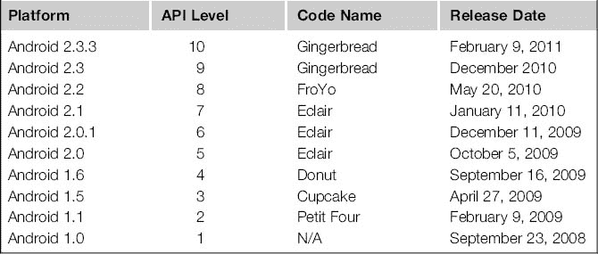

虽然存在许多安卓版本，但每个版本在当前设备中的分布会对法医分析师和安全工程师产生很大影响。[图 3.1](#F0010) 显示了谷歌基于对访问安卓市场的设备进行为期两周的调查而发布的安卓版本报告([平台版本号](#BIB2))。

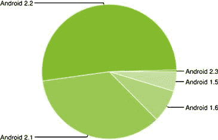

图 3.1 2011 年 1 月安卓设备平台分布情况。

客观地说，[表 3.2](#T0015) 按安卓版本显示了美国流通的设备总数。这些数据是基于截至 2011 年 11 月美国安卓设备数量约为 1599 万的 T2 数据。

表 3.2 美国按平台分列的安卓设备大致数量

| 安卓版本 | 设备总数 |
| --- | --- |
| 安卓 2.3 | Sixty-three thousand nine hundred and sixty |
| 安卓 2.2 | Eight million two hundred and eighty-two thousand eight hundred and twenty |
| 安卓 2.1 | Five million six hundred and twenty-eight thousand four hundred and eighty |
| 安卓 1.6 | One million two hundred and sixty-three thousand two hundred and ten |
| 安卓 1.5 | Seven hundred and fifty-one thousand five hundred and thirty |

谷歌还发布了一张图表，显示了 2010 年 8 月至 2011 年 2 月 2 日七个月期间安卓版本的历史分布。数据同样基于访问安卓市场的设备，但很好地显示了安卓更新的进度，如图 3.2 ( [平台版本号](#BIB2))所示。

图 3.2 2001 年 8 月至 2011 年 2 月 2 日安卓版本的历史分布。

虽然有些设备永远不会支持最新版本的安卓，但许多设备最终都会收到更新。未来的设备可能能够快速支持并升级到最新版本。然而，从取证和安全的角度来看，不能忽视较老的异常值。

### 安卓平台亮点通过 2.3.3(姜饼)

安卓是一个复杂的、高度开发的平台，任何全面记录所有功能的尝试都将包含本书的很大一部分。然而，对每个主要版本的简要概述可能会有所帮助，以便法医分析师了解设备可能支持的功能。一般来说，这些特性是相互建立的，所以安卓 1.5 中可用的功能很可能在安卓 2.3.3 中可用并得到改进。

#### 安卓 1.5

2009 年 4 月发布的 Android 1.5 突出显示了[表 3.3](#T0020) ( [Android 1.5，n.d.](#BIB4) )中列出的功能和更新。

表 3.3 安卓 1.5 特性和亮点

#### 安卓 1.6

2009 年 9 月发布的 Android 1.6 突出显示了[表 3.4](#T0025) ( [Android 1.6，n.d.](#BIB5) )中列出的功能和更新。

表 3.4 安卓 1.6 特性和亮点

#### 安卓 2.0 和 2.1

分别于 2009 年 10 月和 2010 年 1 月发布的 Android 2.0 和 2.1，重点介绍了[表 3.5](#T0030) ( [Android 2.1，n.d.](#BIB6) )中列出的功能和更新。

表 3.5 安卓 2.0/2.1 特性和亮点

#### 安卓 2.2

2010 年 5 月发布的安卓 2.2，重点介绍了[表 3.6](#T0035) 中的功能和更新。

表 3.6 安卓 2.2 特性和亮点

#### 安卓 2.3

2010 年 12 月发布的 Android 2.3，突出了[表 3.7](#T0040) 中列出的功能和更新。

表 3.7 安卓 2.3 特性和亮点

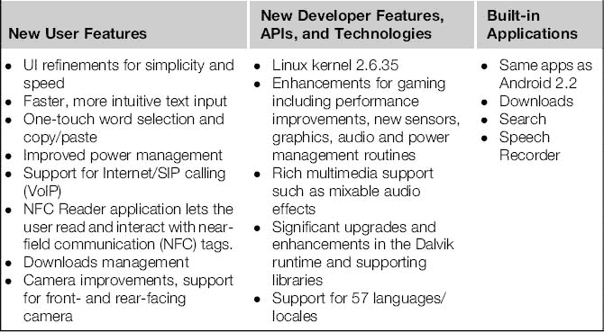

#### 安卓 2.3.3

2011 年 2 月发布的安卓 2.3.3 突出了[表 3.8](#T0045) 中的功能和更新。

表 3.8 安卓 2.3.3 特性和亮点

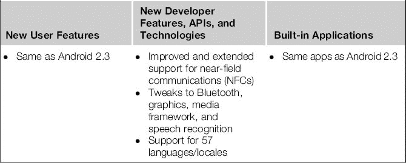

## 软件开发工具包

安卓软件开发工具包(SDK)是开发安卓应用程序所需的开发资源。它包括软件库和 API、参考资料、模拟器和其他工具。该软件开发工具包在包括 Linux、Windows 和 OS X 在内的许多环境中得到支持，并且可以从[http://developer.android.com](http://developer.android.com)免费下载。

软件开发工具包也是一个强大的取证工具，分析师在许多情况下使用它来帮助调查安卓设备。

### 软件开发工具包发布历史

虽然安卓平台标志着官方支持的安卓版本，但软件开发工具包更新更频繁。[表 3.9](#T0050) 提供了完整的软件开发工具包发布历史，可以在这些情况下提供帮助([软件开发工具包档案，北卡罗莱纳州](#BIB10))。

表 3.9 存档的安卓平台版本

| 平台 | 空气污染指数 | 出厂日期 |
| --- | --- | --- |
| Android 1.6 r1 | four | 2009 年 9 月 |
| Android 1.5 r3 | three | 2009 年 7 月 |
| Android 1.1 r1 | Two | 2009 年 2 月 |
| Android 1.0 r2 | one | 2008 年 11 月 |

### 安装软件开发工具包

由于软件开发工具包在安卓设备的调查中至关重要，审查人员应该有一个有效的安装。以下各节提供了在支持的平台上安装 SDK 的分步指导。

#### Linux 软件开发工具包安装

这些步骤基于从[第 1 章](1.html)下载和编译安卓开源项目(AOSP)所使用的 Ubuntu VM，该版本已经包含了包括 Java 开发工具包在内的大部分先决条件。在终端窗口中，安装所需的 32 位库:

注意

### 32 位库

由于[第 1 章](1.html)内置的 Ubuntu VM 使用了 64 位版本的 Ubuntu，所以我们必须安装 32 位库才能安装 SDK。但是，如果您使用的是 32 位 Linux 工作站，则无需完成此步骤。虽然 32 位工作站可以运行软件开发工具包，但它无法在 2.2 版之后构建 AOSP。

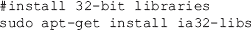

接下来，启动火狐，导航到[http://developer.android.com/sdk](http://developer.android.com/sdk)，下载 Linux i386 平台(android-sdk_r08-linux_86.tgz，截止 2011 年 1 月)。默认操作将在档案管理器中打开档案，如图 3.3所示。

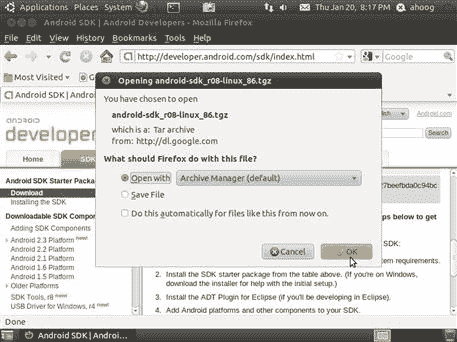

图 3.3 下载适用于 Linux 的安卓 SDK。

然后点击右键，将档案解压到你的主目录中，如图[图 3.4](#F0025) 。

图 3.4 为 Linux 提取安卓软件开发工具包。

接下来，从终端窗口:

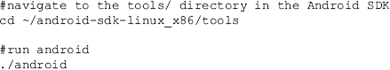

这将运行安卓软件开发工具包和安卓虚拟设备管理器，允许您下载和管理额外的必要组件，如图 3.5 所示。

图 3.5 Linux 中的 Android SDK 和 AVD 管理器。

为了充分利用安卓软件开发工具包，需要额外的组件。最低限度，我们希望安装平台特定的 SDK 工具和至少一个 SDK 平台(本例中是 Android 2.3)，这样我们就可以运行模拟器。要完成安装，从左侧导航窗格中选择可用软件包，然后选择两个附加软件包，如图 3.6 中的[所示。](#F0035)

图 3.6 选择其他安卓软件开发工具包包。

然后选择“安装选定的”。将提示您批准所有软件包的许可证，如图 3.7[所示。](#F0040)

图 3.7 接受并安装安卓软件开发工具包包。

选择全部接受(前提是您同意)，然后安装。Android SDK 和 AVD 管理器随后将下载并安装组件。

或者，您可能希望将二进制目录添加到您的操作系统(OS)执行路径中，这样您就不必每次都指定程序的完整路径。在 Linux 中，请执行以下操作:

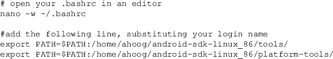

保存，退出，然后重新打开(Ctrl-O)一个新的外壳。

在 Ubuntu 中，您必须采取的最后一步是为系统配置中的每个 Android 设备制造商创建 USB 配置文件，特别是 udev 规则。从终端会话作为根，编辑/创建 udev 规则:

复制以下内容(供应商标识在[http://developer . Android . com/guide/developing/device . html # VendorIds](http://developer.android.com/guide/developing/device.html%23VendorIds)上提供):

然后保存文件。最后，使文件对所有用户都可读:

您可以重新启动 udev 守护程序，也可以简单地重新启动。

#### Windows SDK 安装

最新版本的 Windows Android SDK，如图[图 3.8](#F0045) 所示，现在被打包成一个可执行的安装程序，它将确定您是否正确安装了必要的 Java 依赖项，如果没有，将为您下载并安装它们。但是，安装程序只会检测 JDK 的 32 位安装，不会在 Windows 7 64 位安装上自动安装 JDK。如果你运行的是 32 位版本的 Windows(比如 Windows XP)，那么安装程序可能是一个不错的选择，你可以简单地从[http://developer.android.com/sdk/index.html](http://developer.android.com/sdk/index.html)下载软件包并运行安装程序。

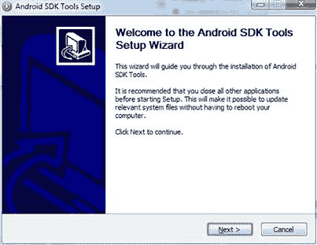

图 3.8 适用于 Windows 的安卓 SDK 安装程序。

然而，许多分析师和工程师已经转向 64 位操作系统。要在 Windows 上安装 Android SDK，首先在[http://java.sun.com/javase/downloads/](http://java.sun.com/javase/downloads/)下载安装 Java SE SDK。确保您安装了完整的软件开发工具包。

安装软件开发工具包后，在[http://developer.android.com/sdk/index.html](http://developer.android.com/sdk/index.html)下载视窗安卓软件开发工具包的压缩版本，并将其解压到您的硬盘上。对于我们的例子，我们将直接提取到 C:\中，然后创建文件夹 C:\android-sdk-windows。

打开目录，双击 Manager.exe 软件开发工具包开始更新过程。请确保您至少选择了安卓软件开发工具包平台工具，如图 3.9 中的[和一个发布平台(本例中为 2.3)。](#F0050)

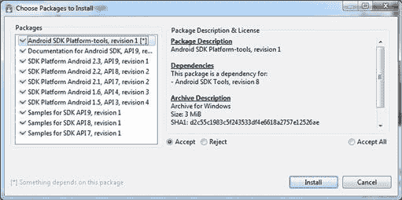

图 3.9 适用于 Windows 的安卓 SDK 管理器。

在 Windows 下使用安卓设备时，需要指定 USB 驱动。安卓软件开发工具包最近更新了通用串行总线驱动程序的安装方式。首先，确保您正在运行软件开发工具包管理器，并选择可用包。展开第三方插件→ Google Inc .插件，最后选择 Google Usb Driver 包，如图[图 3.10](#F0055) 。

图 3.10 适用于 Windows 的谷歌 USB 驱动包。

然后，接受许可并安装，如图[图 3.11](#F0060) 。

图 3.11 接受并安装许可证。

安装 USB 驱动程序后，您应该拥有所有必要的组件。然而，为了简化安卓软件开发工具包的运行工具，您应该更新您工作站的环境变量，特别是可执行文件的路径。为此，请转到控制面板并打开系统应用程序。然后，您应该选择可以更新环境变量的选项卡，其位置将根据您的确切 Windows 版本而变化，如图 3.12 所示。最后，找到 Path 系统变量，选择 Edit，并将完整路径附加到您的 Android SDK 平台工具目录中，在我们的示例中是；c:\ Android-SDK-windows \ platform-工具。

图 3.12 更新路径环境变量(Windows 7 64 位)。

“；”因为它是路径位置之间的分隔符。完成此更新后，请确保退出并等待指示新设置已生效的命令提示。

#### x SDK(x SDK)

要在 OS X 安装安卓软件开发工具包，首先从[http://developer.android.com/sdk/index.html](http://developer.android.com/sdk/index.html)下载档案，然后 OS X 会自动从中提取。

导航到[图 3.13](#F0070) 所示的工具子目录，然后双击安卓运行[图 3.14](#F0075) 所示的安卓 SDK 和 AVD 管理器。

图 3.13 为操作系统 x 提取的安卓软件开发工具包

图 3.14 在 OS X 上打开安卓系统

管理器运行时，选择可用包，展开安卓资源库，然后选择安卓 SDK 平台-工具和至少一个安卓平台，如图[图 3.15](#F0080) 。

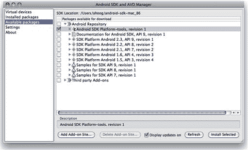

图 3.15 在 OS X 上安装安卓 SDK 组件

然后接受许可证并完成安装。最后，为了简化安卓软件开发工具包的运行工具，您应该更新您的可执行路径。在 OS X 10.6 上，运行终端(应用程序→实用程序)并执行以下操作:

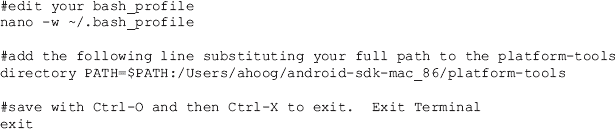

确保您完全退出终端应用程序，然后重新启动。在终端中，键入:

这将返回附加了平台工具的可执行路径。

### 安卓虚拟设备(模拟器)

一旦您的工作站上安装了安卓软件开发工具包，并且至少下载了一个发布平台，您就可以创建一个在您的计算机上运行的 AVD、虚拟移动设备或仿真器了。模拟器对于开发人员创建自定义应用程序特别有帮助。但是，对于法医分析师和安全工程师来说有很大的价值，因为您可以分析应用程序如何在设备上执行。这对于在调查中验证您的发现，或者测试取证工具如何影响安卓设备可能很重要。

模拟器需要相当多的资源，所以理想的工作站应该有更新的足够的中央处理器和内存。考官可能还需要一点耐心。要创建一个 AVD，首先运行 Android SDK 和 AVD 管理器应用程序，如[图 3.16](#F0085) 所示。如果您更新了操作系统的路径，将工具目录包含在软件开发工具包中，您应该能够从外壳、终端或命令提示符运行安卓。

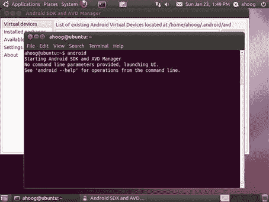

图 3.16 启动安卓 SDK 和 AVD 管理器。

在左窗格中，选择虚拟设备，然后选择新建，如图 3.17。

### 请确保填写以下字段

名称:提供虚拟设备的名称，例如 af23(安卓取证 2.3)。

目标:选择目标平台，本例中是安卓 2.3——API 等级 9。

【可选】SD 卡:可选为虚拟设备创建 SD 卡。

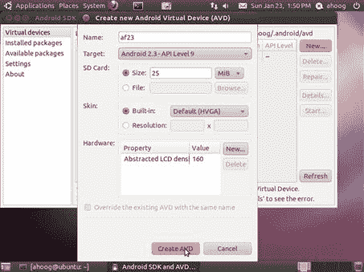

图 3.17 创建一个新的自动增值设备。

您可以设置其他属性。然而，现在我们将创建最基本的 AVD。此外，如果您遇到运行在旧平台上的安卓设备，您可以通过使用安卓软件开发工具包和 AVD 管理器下载安卓平台来创建运行旧版本的虚拟设备。当您点击创建 AVD 时，设备将被创建，您将收到类似于[图 3.18](#F0095) 所示的确认屏幕。

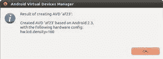

图 3.18 AVD 创建的确认。

确保新的 AVD 高亮显示，然后点击开始，此时会提示你启动选项，如图[图 3.19](#F0100) 。

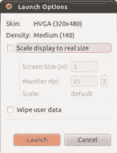

图 3.19 AVD 发射选项。

选择您想要的任何选项，然后单击启动。此时，AVD 将开始启动过程，这可能需要几分钟或更长时间。在那段时间里，你会看到安卓启动。这在[图 3.20](#F0105) 中有说明。

图 3.20 反车辆地雷发射。

最后，您将看到如图 3.21 所示的全功能自动电压调节器。

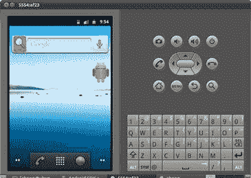

图 3.21 运行自动电压调节器。

AVD 非常强大，功能齐全。比如你可以轻松在线跳转，如图[图 3.22](#F0115) 所示，浏览网站。您可以配置电子邮件帐户，向其他 AVD 发送测试短信，当然，如果您是开发人员，还可以部署和测试您的应用程序。

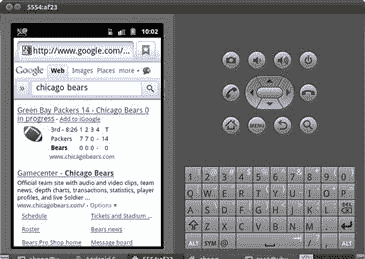

图 3.22 运行浏览器的 AVD。

当一个反车辆地雷被创建然后发射时，创建的数据对法医和安全研究是有价值的。这些文件是在你的主目录中创建的，该目录因平台而异，位于一个名为的文件夹中。安卓(注意文件名中的点前缀)。[表 3.10](#T0055) 提供了具体的操作系统路径。

表 3.10 AVD 存储目录

| 工作站操作系统 | 存储目录 | 例子 |
| --- | --- | --- |
| Ubuntu Linux | /home/ <username>/。机器人</username> | /home/ahog/. Android 作业系统 |
| Mac OS X | /Users/ <username>/。机器人</username> | /Users/ahoog/。机器人 |
| Windows 7 | C:\Users\ <username>\。机器人</username> | c:\ Users \ a hog \。机器人 |

在动静脉畸形里面。安卓目录你会发现运行 AVD 所需的配置和数据文件。

### 具有特殊取证和安全利益的文件包括以下内容

cache.img:缓存分区的磁盘映像

sd 卡. img:sd 卡的磁盘映像(如果在 AVD 设置期间创建)

userdata-qemu.img:数据分区的磁盘映像

cache.img 和 userdata-qemu.img 是当前取证软件不支持的 YAFFS2 文件系统，将在[第 4 章](4.html)中介绍。然而，标准的取证工具在 sdcard.img 上可以很好地工作，sdcard . img 是一个 FAT32 文件系统。

通过利用模拟器并检查网络、文件系统和数据工件，法医分析师和安全工程师可以了解大量关于安卓及其运行方式的信息。

### 安卓操作系统架构

了解 Android 的高级架构很重要，尤其是对于安全程序和超越逻辑取证分析。

安卓基于 Linux 2.6 内核，提供引导和管理硬件和安卓应用程序所需的基础软件。虽然内核提供的功能相当广泛，但我们将重点关注[图 3.23](#F0120) 中突出显示的核心区域。

图 3.23 安卓架构。

如图[图 3.23](#F0120) 所示，低级功能包括电源管理、[Wi-Fi.com](http://Wi-Fi.com)、显示、音频驱动等。从取证的角度来看，可能最重要的是闪存驱动程序，这将在[第 4 章](4.html)中详细探讨。

在内核之后，有一组库可用，它们提供开发者和设备所有者都需要的核心功能。其中包括用于在捆绑的浏览器和第三方应用程序中呈现 HTML 的 WebKit 库。其他库使用安全套接字层处理字体、显示、各种媒体和安全通信。最后，SQLite 库提供了一种在 Android 上存储结构化数据的方法，这也是法医分析师和安全工程师将关注的领域。

核心库然后与定制的 Java 虚拟机捆绑在一起，以提供安卓运行时环境，这是应用程序运行的地方。

最后，软件开发工具包通过应用程序接口和应用程序框架提供对这些资源的访问。框架是第三方开发人员交互的主要层，它为他们提供对应用程序所需的关键资源的抽象访问。随着我们探索逻辑取证技术，应用程序框架的一个重要方面——内容提供商——将得到更详细的解释，因为它们提供了我们从安卓设备中提取数据的主要机制。

### 达尔维克世界锦标赛

达尔维克虚拟机(Dalvik VM)由谷歌开发，旨在创建一个高效、安全的移动应用环境。

为了实现所需的安全性，每个应用程序都在自己的 Dalvik 虚拟机上运行。因此，达尔维克虚拟机的编写使得许多虚拟机可以同时在安卓设备上运行。达尔维克虚拟机严重依赖 Linux 操作系统来提供低级功能，如访问核心库和硬件、威胁和安全管理、内存管理等。

为了提高效率，在达尔维克虚拟机中运行的应用程序有一种特殊的格式，称为达尔维克可执行文件(。dex)文件。开发人员使用 Sun 的 Java 开发工具包编写和编译他们的程序，然后将生成的字节代码转换为. dex 文件，该文件提供了高效的存储，并针对在 Dalvik 虚拟机中的执行进行了优化。一个有趣的项目由一个有成就的知名安卓黑客 JesusFreke 开发，叫做 smali/baksmali。这个项目允许用户反编译一个. dex 文件来确定一个应用程序做什么。

Dalvik 是安卓的一个独特方面，也是设备取证和安全分析的一个关键组件。

### 本机代码开发

虽然大多数安卓应用程序都是使用软件开发工具包用 Java 编写的，但谷歌提供了一个更低层次的开发平台及其本地开发工具包(NDK)。《NDK》于 2009 年 6 月首次发行，历经五次修订，最新一次于 2010 年 11 月发行。

NDK 允许开发人员用 C/C++ 编写代码，并直接为中央处理器编译。虽然这增加了开发过程的复杂性，但一些开发人员可以通过在 C/C++ 中重用现有的代码库或实现某些可以在 Dalvik VM 之外优化的功能来受益于这种方法。NDK 不允许开发人员创建在达尔维克虚拟机之外运行的完整应用程序；相反，C/C++ 组件封装在应用程序的内部。apk 文件，并由虚拟机中的应用程序调用。

此时，NDK 支持 ARMv5TE 和 arm V7-A CPU，未来还将支持英特尔的 x86 CPU 架构。当开发人员在一个平台(例如，苹果 OS X)上编写代码，但在另一个中央处理器上编译时，这种技术被称为交叉编译应用程序。NDK 大大简化了这个过程，并提供了一套开发人员可以使用的库。

从取证和安全的角度来看，交叉编译是研究和开发新技术和漏洞的重要组成部分。虽然大多数法医分析师和安全工程师不需要编译代码，但是理解流程是如何工作的，以及它在流程中扮演什么角色是很重要的。例如，最初的安卓 1.5 根漏洞利用针对一个 Linux 内核错误(CVE-2009-2692)来获得特权。初始代码作为源代码分发，需要交叉编译。这种方法的一个显著优点是，检查人员可以准确详细地描述设备是如何被利用的，如果有必要，还可以提供源代码。

随着安卓系统的成熟，期待在 NDK 看到更多的开发和本地编译的代码。

## 安卓安全模型

安卓平台通过一些旨在保护用户的控件来实现安全性。

首次安装应用程序时，Android 会检查。apk 文件，以确保它具有有效的数字签名来识别开发人员。与 SSL 不同，数字证书不需要由证书颁发机构签名。但是，开发者必须保证密钥的安全；否则，有人可能会签署恶意应用程序，并将其作为开发人员分发。例如，如果金融机构的数字签名遭到破坏，恶意开发人员可能会向银行应用程序发布更新，从而窃取关键数据。

之后。apk 文件被验证后，Android 会检查开发人员创建的特殊文件，该文件除了其他项目外，还指定了应用程序需要对系统进行哪些访问。例如，应用程序可以请求访问用户的联系人、短信和网络/互联网。如果这个应用程序给短信系统增加了功能，这些权限似乎是合理的。但是，如果应用程序只是更改了您的背景图像，那么用户应该质疑该权限，并可以选择不安装该应用程序。实际上，用户可以快速允许所有权限和应用程序请求，因此可能会允许恶意应用程序安装。

验证应用程序并授予用户请求的权限后，应用程序现在可以安装在系统上。安卓安全模型的一个关键部分是，每个应用程序都被分配了一个唯一的 Linux 用户和组标识，并在自己的进程和达尔维克虚拟机中运行。在安装过程中，系统会在设备上创建一个特定的目录来存储应用程序的数据，并且只允许该应用程序使用 Linux 用户标识和组标识权限来访问数据。此外，应用程序的 Dalvik VM 作为特定的用户 ID 在其自己的进程中运行。由于应用程序不共享内存、权限或磁盘存储，这些关键机制在操作系统级别强制实施数据安全性。应用程序只能访问其达尔维克虚拟机中的内存和数据。

当然，这个过程也有一些例外。首先，开发人员可以签署多个具有相同数字认证的应用程序，并指定其可以与其他应用程序共享相同的用户标识、进程、内存和数据存储。这种情况是例外的，最常用于开发者既有免费版本又有付费版本的情况。如果用户升级到付费版本，他们可以利用使用免费版本时积累的数据，因此不会丢失任何数据。

此外，大多数安卓用户可以选择允许从非市场位置安装应用程序，并跳过数字签名检查。该选项可以从设备设置中的应用程序菜单中访问，当选择时，会向用户显示警告，如图 3.24 中的[所示。](#F0125)

图 3.24 安卓设置允许未知来源的应用安装。

最常见的情况是，用户现在可以通过直接下载一个。apk 文件。安装过程还会跳过数字签名检查。最近的一款美国电话电报公司手机(摩托罗拉后空翻)将这一选项从安卓系统中移除，令许多用户感到不安。然而，使用安卓软件开发工具包的解决方案确实存在，并将在[第 6 章](6.html)中讨论。

由于安卓内置的安全架构，法医鉴定人员没有简单的方法从设备中提取核心用户数据。除非利用漏洞，否则安全架构在应用程序之间隔离和保护数据方面是有效的。

## 法医和软件开发工具包

那么 SDK 在取证中有多重要呢？软件开发工具包不仅提供了一套工具和驱动程序来分析安卓设备，而且对应用程序分析和其他取证研究也很有用。

### 将安卓设备连接到工作站

重要的是要注意安卓设备实际上是如何连接到虚拟机的。迄今为止，安卓设备都有一个物理通用串行总线接口，允许它们连接、共享数据和资源，通常还可以从计算机或工作站充电。如果您只运行单个操作系统，应该可以检测到并访问 USB 设备。但是，可能需要额外的配置或驱动程序。如果您正在运行虚拟机，您只需要主机操作系统将连接传递给虚拟机。例如，如果您的主机操作系统是 OS X，并且您正在运行 VMWare fusion，您可以选择菜单虚拟机→ USB，然后连接设备(在这种情况下是高安卓手机)，如图 3.25 所示。

图 3.25 在 VMWare Fusion 中将 USB 设备连接到 Ubuntu 虚拟机。

同样，当您的主机操作系统是 Linux，并且您正在使用 Oracle 的 VirtualBox 运行虚拟机时，您必须首先确保您是 usbusers 组的成员。因此，在终端会话中，执行以下操作:

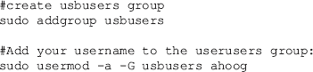

接下来，进入虚拟机的设置，为设备添加一个 USB 过滤器，如图[图 3.26](#F0135) 。

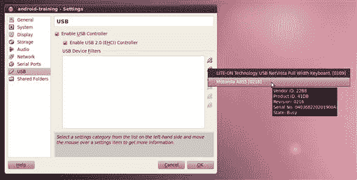

图 3.26 在运行甲骨文 VirtualBox 的 Linux 主机上添加 USB 过滤器。

最后可以连接 USB 设备，如图[图 3.27](#F0140) 。

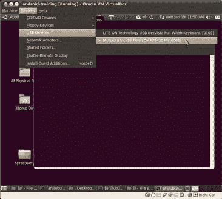

图 3.27 在运行甲骨文 VirtualBox 的 Linux 主机上连接 USB 设备。

最后，如果您运行的是无头虚拟机(如[第 1 章](1.html)所述的 VirtualBox 3.2.10)，以下是步骤。首先，你需要安装 VBox Additions，它将启用共享文件夹、更好的视频、USB 支持(如果你下载/购买了 PUEL 版)和其他功能。从主机工作站:

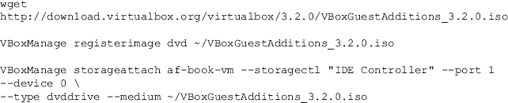

该 DVD 现在应该可以在 Ubuntu 虚拟机上使用。远程桌面再次进入虚拟机(必要步骤参见[第 1 章](1.html))双击桌面上的 VBOXADDITIONS_3.2.0_61806 DVD 打开 DVD。然后双击自动运行，并选择运行选项。系统将提示您输入密码，然后安装将继续进行。[图 3.28](#F0145) 说明了这一步。

图 3.28 在 Ubuntu 虚拟机远程桌面协议上安装 VBox 附件。

现在您已经安装了 VBox Additions，您可以将 USB 设备连接到您的来宾操作系统。但是首先，您必须关闭虚拟机。然后，按照以下步骤操作:

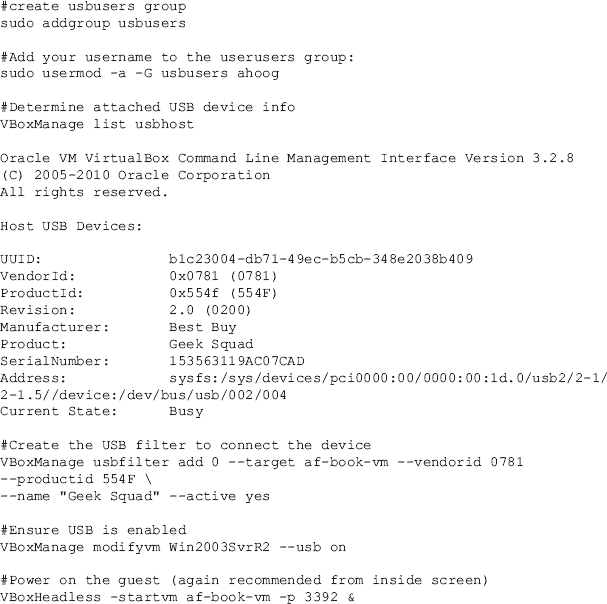

使用此示例，现在应该将 USB 设备传递给虚拟机。

### USB 接口

当您通过单个 USB 端口将安卓设备连接到工作站或虚拟机时，硬件和安卓本身通常会暴露多个虚拟 USB 接口。例如，当您通过 USB 连接宏达不可思议时，您会看到一个包含四个选项的菜单:

1.仅充电—通过 USB 为手机充电

2\. HTC 同步—同步联系人和日历

3.磁盘驱动器—作为磁盘驱动器安装

4.移动宽带连接——智能手机与 PC 的移动网络

默认选择，如图 3.29[所示，是只收费选项。HTC 同步和移动宽带连接选项都是 HTC 的自定义选项和程序，有时还包括设备的无线运营商支持。](#F0150)

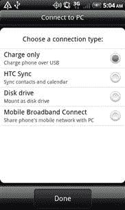

图 3.29 宏达不可思议的连接电脑选项。

#### 光盘接口

磁盘驱动器选项更普遍使用。该选项将安卓设备作为磁盘驱动器连接到工作站。这是设备向工作站展示多个 USB 设备的一个关键领域。当你第一次把 HTC 不可思议插入电脑时，它实际上注册了三种不同类型的驱动器:一个光盘和两个通用串行总线大容量存储设备。下面的清单来自 Linux 工作站的内核消息和 dmesg 命令:

如您所见，在 4:0:0:0 和 4:0:0:1 找到了两个直接访问驱动器，在 4:0:0:2 找到了一个光盘。光盘包含自定义程序和驱动程序，宏达电将其与设备捆绑在一起，以启用同步和宽带连接功能。显然，没有物理光盘。但是，该设备的一部分存储专用于光盘，并被格式化为 ISO9660。然后，主机操作系统可以将驱动器安装为光盘，在 Windows 中，甚至可能支持自动运行功能。利用 TSK 的 fsstat 程序，我们可以看到关于分区的更多细节:

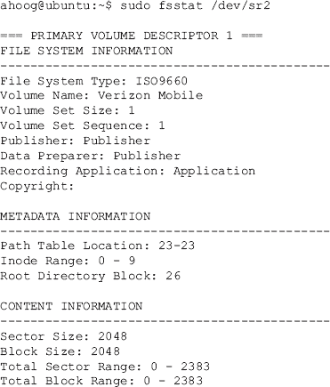

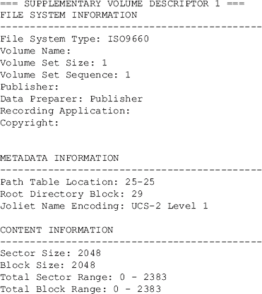

从卷名可以看出，光盘包含威瑞森提供的软件，可以使用设备的附加功能。

#### SD 卡(可移动和虚拟)

从取证的角度来看，更重要的是可通过设备获得的 SD 卡。放置用户的文件，尤其是多媒体等较大的文件，是安卓系统中的一个关键策略。大多数安卓设备都有一个可移动媒体插槽，可以接受微型 SD 卡。核心应用程序数据保留在设备上(under /data/data)，但在调查中可能很重要的文件也可能存在于 SD 卡上。

在上一节中，当安卓设备通过 USB 连接时，Linux 工作站的内核消息会显示各种可用的 USB 设备。列出的两个 SCSI 可移动磁盘，SDb 和 sdc，代表 HTC 不可思议上的 sd 卡。如果选择“连接到电脑”下的“作为磁盘驱动器安装”选项，内核消息上会显示以下附加消息:

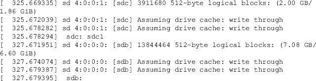

现在，您将看到关于 SD 卡的更多信息。驱动器 sdc 有一个分区 sdc1。而且它的大小是 2 GB。通过运行 TSK 的 mmls，我们可以看到额外的分区信息:

正如您将看到的，SD 卡是用 FAT16 文件系统格式化的，但是通常您会发现 FAT32，或者您可能会遇到多个文件系统，如 FAT32 和本机 Linux 文件系统 ext3 和 ext4。

最近，设备还具有模拟或虚拟 SD 卡功能，该功能使用设备的 NAND 闪存来创建不可移动的 SD 卡。这更接近 iPhone 的模型，其中用户数据分区直接位于 NAND 闪存上，无法移除。在前面的示例中，SDb 设备提供对仿真 sd 卡的访问。与物理 SD 卡不同，sdc 没有分区表，文件系统只是立即启动。要查看重要信息，请运行 TSK 的 fsstat:

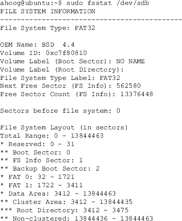

在这种特殊情况下，文件系统实际上是 FAT32，您会注意到，虽然该卷没有标签，但原始设备制造商名称设置为 BSD 4.4。

警告

### 自动安装 USB 设备

在[第 1 章](1.html)的 Ubuntu VM 配置部分，自动挂载功能被禁用，以防止操作系统自动检测和挂载 USB 大容量存储设备。法医分析师应该采取极端的预防措施，以防止这种情况发生在正在调查的设备上。除了禁用自动装载，设备通常应该通过 USB 写阻止程序连接。

在 Ubuntu 中，如果您没有禁用自动安装 USB 设备(几乎在所有情况下都应该禁用)，SD 卡会自动为您安装。如果设备连接到硬件写阻止程序，以只读方式装载，或者在不需要写阻止的情况下(例如，研究和开发)，您可以在 Linux 中运行 df 命令来查看它们的装载位置:

物理 SD 卡安装在/media/E0FD-1813 上，模拟 SD 卡安装在/media/C7F8-0810 上。

在安卓设备上，两个 SD 卡的安装方式如下:

#### 通用串行总线调试

最后，也是非常重要的一点，通用串行总线接口暴露了安卓调试桥(ADB)，允许开发人员、法医分析师或安全工程师通过通用串行总线通信和控制安卓设备。默认情况下，AVD(在模拟器中运行)将启用 USB 调试。但是，非仿真器设备必须显式启用 USB 调试。要启用，从设备设置中选择应用→开发，如图 3.30[所示。最后，检查 USB 调试。](#F0155)

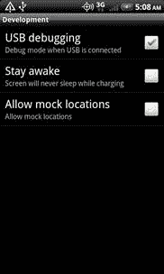

图 3.30 启用 USB 调试。

设置完成后，设备将在后台运行 adb 守护程序(adbd)，并等待 USB 连接。守护程序将在非特权 shell 用户帐户下运行，以限制其对数据的访问。启用根访问的 avd 和物理设备将以根用户身份运行 adbd，提供对系统的完全访问。关于这个主题的更多细节将在[第 6 章](6.html)中讨论。

在较新版本的安卓系统中，只要启用了 USB 调试的设备通过 USB 连接，就会显示安全警告，如图[图 3.31](#F0160) 所示。

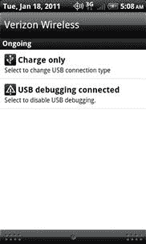

图 3.31 USB 调试警告。

对于当前的每一个逻辑安卓取证工具，都必须启用 USB 调试。如果设备未锁定，这一点很难实现，但如果设备有密码，这一点就更难了。有一些技术可以绕过密码，在[第 6 章](6.html)中讨论。然而，它们并不是在每个平台上都有效。

### 安卓调试桥介绍

在本书的其余部分，我们将广泛利用亚行，因此现在涵盖基础知识非常重要。使用 adb 时涉及三个主要组成部分:

1.安卓设备上运行的 adbd

2.在您的工作站上运行的 adbd

3.在您的工作站上运行的 adb 客户端程序

如前所述，当您在安卓设备上启用 USB 调试时，守护程序将运行并监听连接。设备的 adbd 和工作站的 adbd 之间的通信通过运行在 USB 连接之上的虚拟网络进行。守护程序通过端口 5555 到 5585 在本地主机上通信。当工作站的 adbd 检测到新的仿真器或设备时，它会创建两个顺序端口连接。偶数端口与设备的控制台通信，而奇数端口用于 adb 连接。本地 adb 客户端程序使用端口 5037 与本地 adbd 通信。

您可以发出的最基本的 adb 命令是 adb devices 命令，它提供了已连接设备的列表。

另一个重要的命令提供了杀死你的本地 adb 服务的能力。为此，请键入以下内容:

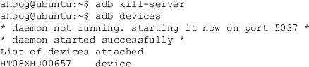

如您所见，如果工作站上的 adbd 没有运行，它将自动启动。在 Ubuntu 上，如果您收到以下响应:

很可能连接的 Android 设备有一个新的供应商 id，必须对其进行标识(sudo lsusb -v)，并将其添加到 udev 规则中，如“SDK 安装”部分所述。在微软视窗系统中，如果安卓设备不被识别，你会收到警告，你必须从谷歌或制造商那里安装合适的通用串行总线驱动程序。

所有分析师和工程师都应该知道的一个强大的 adb 命令是“adb shell”，它允许您在 Android 设备上打开一个 shell 并与系统交互。对于任何探索安卓的人来说，这都是一个重要的特性。例如，启动 AVD 并按照以下步骤查看设备上的应用程序数据目录:

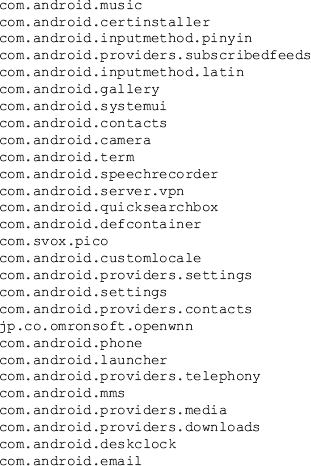

adb 的功能随着每一个新的 SDK 而增加，是一个非常强大的工具。一些特性将在[第 6 章](6.html)中详细探讨，包括:

1.在设备上运行外壳命令

2.使用命令行安装应用程序

3.工作站和设备之间的转发端口

4.在设备之间递归复制文件和文件夹

5.查看设备日志文件

adb 命令的完整文档可以在安卓开发者网站[上找到。](http://developer.android.com/guide/developing/tools/adb.html%23commandsummary)

使用安卓模拟器测试各种命令是在调查中利用该工具之前了解它的一个极好的方法。

## 摘要

安卓软件开发工具包不仅提供了对安卓平台的深入了解，还提供了从取证和安全角度调查设备的强大工具。一旦软件开发工具包安装在法医工作站上，只要启用了通用串行总线调试功能，审查员就能够与通过通用串行总线连接的安卓设备进行交互。不仅可以从设备中查询信息，还可以安装、运行应用程序，并最终从设备中提取数据。安卓软件开发工具包是用于取证和安全分析的重要工具。

## 参考

1.*安卓时间线*。(未注明日期)。安卓教程，新闻，观点和论坛，安卓学院。检索时间 2011 年 3 月 12 日，[http://www.androidacademy.com/1-android-timeline](http://www.androidacademy.com/1-android-timeline)。

2.*平台版本*，(未注明)。安卓开发者。2011 年 3 月 12 日检索自[http://developer . Android . com/resources/dashboard/platform-versions . html](http://developer.android.com/resources/dashboard/platform-versions.html)。

3. *comScore 报告 2010 年 11 月美国移动用户市场份额—comScore，Inc .*。(未注明日期)。comScore，Inc .—测量数字世界。2011 年 3 月 12 日检索自[http://www . comScore . com/Press _ Events/Press _ Releases/2011/1/comScore _ Reports _ 2010 _ 11 _ T3】。](http://www.comscore.com/Press_Events/Press_Releases/2011/1/comScore_Reports_November_2010_)

4.*安卓 1.5 平台*。(未注明日期)。安卓开发者。检索时间 2011 年 3 月 12 日，[http://developer.android.com/sdk/android-1.5.html](http://developer.android.com/sdk/android-1.5.html)。

5.*安卓 1.6 平台*。(未注明日期)。安卓开发者。检索时间 2011 年 3 月 12 日，[http://developer.android.com/sdk/android-1.6.html](http://developer.android.com/sdk/android-1.6.html)。

6.*安卓 2.1 平台*。(未注明日期)。安卓开发者。检索时间 2011 年 3 月 12 日，[http://developer.android.com/sdk/android-2.1.html](http://developer.android.com/sdk/android-2.1.html)。

7. *SDK 档案*。(未注明日期)。安卓开发者。检索时间 2011 年 3 月 13 日，[http://developer.android.com/sdk/older_releases.html](http://developer.android.com/sdk/older_releases.html)。

8.*smali-谷歌代码上的项目托管*。(未注明日期)。谷歌代码。检索时间 2011 年 3 月 13 日，[http://code.google.com/p/smali/](http://code.google.com/p/smali/)。

9.*安卓锁定:AT & T 从后空翻*中移除安卓的最佳部分(未注明)。男人帮。安卓新闻和观点的可信来源，Est。2007.检索于 2011 年 3 月 13 日，[http://www . androidgoes . com/2010/03/08/安卓-锁定-att-移除-零件-安卓-后空翻/](http://www.androidguys.com/2010/03/08/android-lockdown-att-removes-parts-android-backflip/) 。