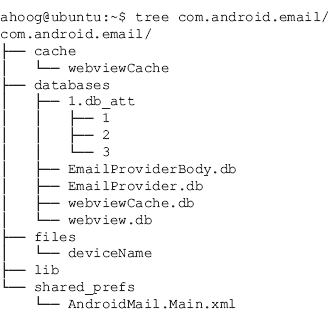
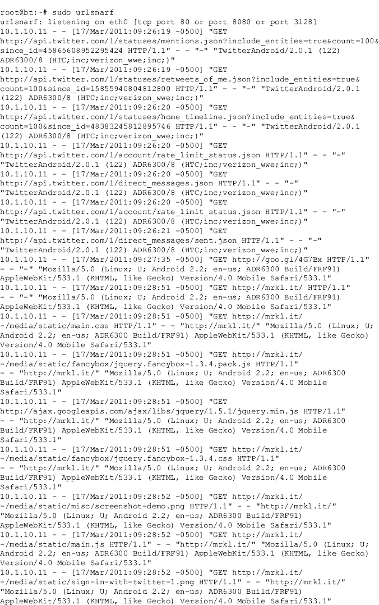
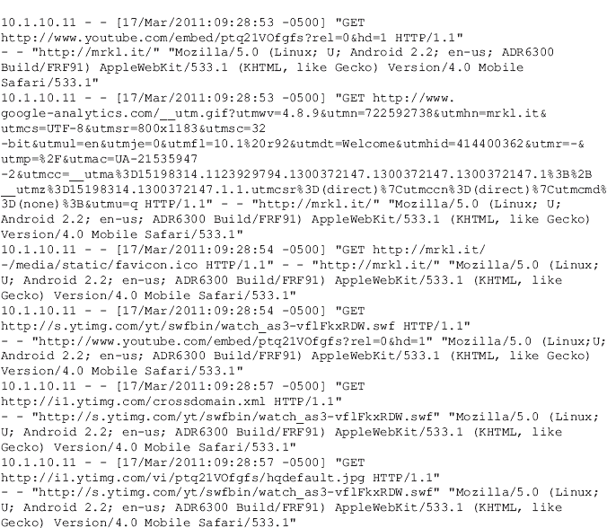
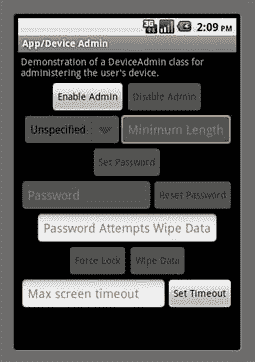
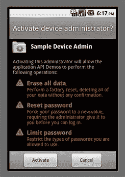
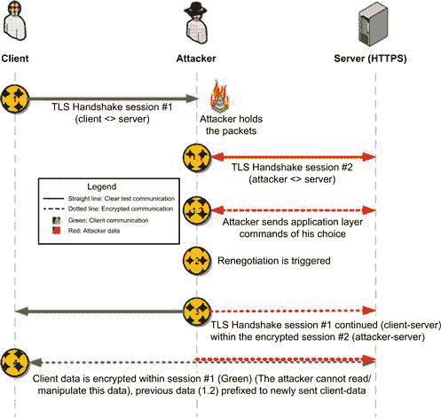

# 五、安卓设备、数据和应用安全

### 本章中的信息

[数据窃取目标和攻击媒介](#S0015)

[安全考虑](#S0055)

[个人安全战略](#S0080)

[企业安全战略](#S0085)

[应用开发安全策略](#S0120)

## 介绍

既是法医分析师又是隐私倡导者，这是一个微妙的平衡。如果设备是 100%安全的，那么对该设备的取证调查将无法返回任何信息。另一方面，如果一个设备的安全措施完全不存在，法医专家几乎没有必要从设备中提取有意义的数据。

移动取证的主要消费者是执法部门和政府机构。他们在移动设备上使用和保护多种类型的敏感数据，他们有权调查犯罪。他们不仅依赖数字取证分析，还可以通过搜查令和传票行使权力，迫使大多数组织提供所需信息，如财务记录、电子邮件、互联网服务提供商日志等。

同样，公司需要保护他们的敏感数据，并不时启动内部调查以确保安全。虽然他们的权力并没有超出他们公司的范围，但在美国，公司可以在他们拥有的设备上行使广泛的搜索权限。

最后，个人有权访问自己的数据。无论他们是在民事诉讼中还是在其他事情上行使这一权利，他们都有权在自己拥有的设备上这样做。

就个人和公司而言，各方通常不需要在他们有权调查的设备上恢复敏感信息，如信用卡、银行信息或密码。公司不会在内部调查中寻找个人的信用卡数据，他们有办法访问公司的电子邮件系统并更改密码。就个人而言，他们已经可以访问自己的财务记录、电子邮件和其他此类敏感数据。在执法和政府机构的情况下，他们可以使用他们的传票和搜查令权力来获取他们寻求的数据。

因此，最终，唯一可能从高度敏感的数据被不安全地存储在移动设备上中获益的人是网络罪犯。在许多针对移动设备的个人、公司和刑事调查过程中，我们遇到了与案件无关的高度敏感的个人信息。然而，如果网络犯罪分子能够访问该设备——无论是在他们实际拥有的情况下还是通过远程利用——他们可以收集的数据将对消费者构成重大风险。

同样，企业也是商业间谍、金融盗窃、知识产权盗窃和各种其他攻击的目标。随着许多公司转向员工拥有的设备，对该设备的更多控制和监督将会丢失，从而使公司数据面临巨大风险。

最后，执法和政府机构受到移动安全问题的负面影响。这些机构由与消费者面临相同数据泄露风险的个人组成。与企业一样，这些机构本身也可能成为攻击的目标，这些攻击不仅寻求可能危及调查或令机构尴尬的敏感数据，还寻求动机与国际间谍活动一样严重的攻击。执法和政府机构面临的一个独特挑战是，必须调查许多涉及移动设备的犯罪，这给已经超负荷的刑事调查部门和数字法医实验室带来了压力。

由于这些原因，移动设备的安全性越来越受到个人、公司、执法部门和政府机构的关注。

## 数据窃取目标和攻击媒介

在这一点上，任何还在阅读的人都很清楚，智能手机，尤其是安卓设备，包含了大量的信息，通常混合了个人和公司的数据。安卓设备可能成为数据盗窃的目标，也可能成为盗窃的手段(攻击媒介)。了解各种威胁和场景将使安全工程师和开发人员能够设计适当的控制措施来降低风险。虽然本章不可能对如此广泛的主题提供详尽的介绍，但是将会介绍具体的威胁和缓解策略，并且应该作为安全专业人员的一个强有力的起点。

### 作为目标的安卓设备

移动安全研究、利用和文章的主要焦点一直是智能手机，因为它是数据盗窃的目标，这是理所当然的。消费者、企业和机构面临的风险是非常真实的，大多数安全专家都认为针对移动设备的恶意软件正在增加，并将继续成为网络犯罪的焦点。

移动设备以高度集中和便携的形式包含大量个人和公司数据。罪犯一般都比较务实，网络罪犯也不例外。如果他们能够利用一个不仅包含用户名、密码和个人敏感数据，还包含雇主相同类型信息的设备，他们显然会瞄准这个机会。此外，虽然来自一个移动应用程序的数据可能无法为罪犯提供足够的信息来实现他们的目标，但结合从众多已安装的应用程序中找到的信息通常会产生令人震惊的完整所有者档案。

移动设备不仅容易丢失，相对容易被盗，而且在消费者想要最新型号之前，它们的使用场景也相当短。这两种情况都导致大量智能手机可以通过易贝和 Craigslist 等渠道购买，而且许多设备没有正确擦除，个人数据完好无损。此外，恶意代码、恶意软件和远程攻击越来越多地以移动设备为目标，历史表明它们将导致大量数据被盗。它们的有效程度只能随着时间的推移而确定；但是考虑到操作系统(在这种情况下是安卓系统)发展的紧迫步伐，以及移动应用程序的快速扩散，我们当然有理由预计这些攻击中的许多会成功。

#### 静态数据

静态数据是一个术语，用于描述存储在非易失性存储器中的数据，因此既不位于随机存取存储器中，也不通过网络(蜂窝、数据或其他网络)传输。法律法规中经常使用静态数据这一术语，它定义了一个必须保护数据的关键状态。

在本书中，我们重点介绍了安卓设备包含的不同数据示例。在这里，让我们考虑两个虚构的场景:一个侧重于公司客户，一个侧重于个人。

对于个人来说，安卓设备用于个人通信、个人金融、娱乐和一般信息冲浪。检查手机可能会恢复以下内容:

短信/彩信:所有已分配的(未删除的)短信和彩信以及大部分未分配的(已删除但仍在 NAND 闪存上)短信和彩信都可以恢复。恢复的信息将不仅包括消息本身，还包括任何附件，包括图片、视频、音频文件、电话联系人(。vcf 文件)、日历项目等。还有许多第三方短信/彩信应用程序可能包含附加功能。

通话记录:虽然无线运营商也提供通话记录，但完整的通话记录是可恢复的。这些可能包括未能到达运营商的呼叫尝试，以及我们可以关联的其他元数据，例如位置(这也可以是通常基于蜂窝塔估计的)和在发出呼叫之前设备上发生的其他活动。

语音邮件:对于已安装的语音邮件应用程序，如威瑞森的可视语音邮件，分配的语音邮件通常可作为音频文件恢复。OGG)。一些未分配的语音邮件也可以恢复。

金融应用:虽然差异很大，但大多数已安装的金融应用都在本地存储一些数据或缓存网页。在某些情况下，可恢复的信息可以包括用户登录、密码、账号和交易详细信息。例如，在我们的测试中，[Mint.com](http://Mint.com)应用程序存储了用户名、访问本地应用程序的个人识别码以及一些银行账户交易信息。

个人电子邮件:大多数已安装的电子邮件应用程序以纯文本形式存储电子邮件的内容，包括电子邮件标题(收件人/发件人电子邮件地址)。在某些情况下，包括用户登录和密码在内的用户凭据也是可恢复的。例如，标准的安卓邮件应用程序在通过 POP3 连接到 Hotmail 时，被发现以纯文本形式存储密码。

网页历史记录:已分配的网页历史记录，包括访问过的网址、cookies 和缓存页面，都是可恢复的。未分配的空间可以包括附加的网络历史信息。

谷歌搜索历史:来自谷歌的网址，包括搜索词。

YouTube:观看视频的网址。

图片和视频:用户拍摄的照片和视频，存储在设备上，与应用程序和其他相关。

地理位置:图片中的全球定位系统坐标，其他人工产物。

游戏历史和互动。

在这种虚构的情况下，一个熟练的法医可以恢复一个人的大量信息。

在我们的公司示例中，它只是建立在个人的基础上，因为大多数设备将个人信息与其公司信息混合在一起。以下是一些通常可从公司设备恢复的附加项目:

公司电子邮件和附件

通过电子邮件发送的语音邮件和传真

用户名、密码和域信息

无线接入点、信息和密码

日历项目

即时通讯或与员工的其他交流

为方便起见，将公司文件存储在设备上

如您所见，如果攻击者正在寻找一种有效的方式渗透到公司中，员工的设备(或者更好的是，几个员工的设备)可以为攻击提供许多见解和途径，更不用说直接从设备中恢复敏感的公司信息了。

一个可能会引起公司安全经理严重警觉的具体例子是，安卓内置的电子邮件应用程序如何存储使用微软交换动态同步(EAS)协议的电子邮件帐户的凭据。用于向 EAS 认证的凭证是用户的活动目录域用户名和密码。许多公司将其身份验证、授权和记帐(AAA)服务集中到一个活动目录中，该目录支持单点登录和简化管理。总的来说，简化带来了更有效的安全性。在安卓邮件应用程序(com.android.mail)中，用户的 EAS 以明文形式存储在定义明确的位置。数据库存储在/data/data/com.android.email 中，下面是文件夹和文件的概述:

密码位于 EmailProvider.db 中一个名为 HostAuth 的表中，该表位于一个名为 password 的列中:

除了帐户的用户名、密码和域之外，电子邮件的完整主题和正文以及附件、首选项和其他信息都存储在数据目录中。所有内容都以纯文本形式存储(我想到了术语“银盘”)。

攻击者使用两种主要技术来访问静态数据。第一种方法需要对设备进行物理访问，并将使用多种技术，这些技术与法医检验人员使用的技术基本相同，将在第 6 章中进行探讨。虽然对设备的物理访问不一定容易实现，但我们在上面提到了看似合理的场景，包括丢失或被盗的手机，以及被新型号替换但未安全擦除的手机。此外，在国际上旅行的人，尤其是公司的高管，可能会发现他们的手机在入境时被海关官员暂时没收和检查。在这种情况下，官员可以不受限制地实际接触设备。

攻击者用来访问静态数据的其他主要技术是远程利用和恶意软件。在这些场景中，攻击者能够通过使用编程和社会工程技术获得额外的权限。这些技术可能包括利用 Linux 内核和核心安卓库中发现的漏洞、网络钓鱼攻击或利用应用程序中的漏洞。此外，用户可能会无意中安装应用程序并授予超出所需访问权限的权限，从而允许恶意软件访问静态数据。最后，社交工程仍然是危害系统的一种非常有效的方式，移动设备也不能幸免于此。用户习惯于安装各种各样的应用程序，通常对应用程序提供商知之甚少，并且经常信任和自由关注电子邮件和短信中呈现给他们的链接，这为基于社会工程的攻击开辟了道路。

#### 传输中的数据

传输中的数据(有时称为运动中的数据)是一个术语，用于描述通过网络(蜂窝、无线或其他网络)传输或位于内存中的数据。法律法规中经常使用“传输中的数据”这一术语，它定义了必须保护数据的另一个关键状态。

一般来说，存储在设备上的大部分信息(如上所述)将在某个时刻通过网络传播。除了数据本身之外，还有相当一部分从未保存在设备上的信息被传输，必须加以保护。一些例子包括:

密码:许多应用程序不在设备上存储密码，每次打开应用程序都需要用户进行身份验证。因此，密码只传输，不存储。

双因素认证

密码重置安全响应

显示在应用程序中但未保存或缓存到非易失性存储器中的数据(如账号和余额)

演示数据在网络中传播的一个好方法是举一个例子。在这种情况下，一台运行回溯 4(一个基于 Linux 的渗透测试套件)的计算机连接到一个网络集线器，该集线器还连接了一个无线接入点。计算机上的网络接口被设置为混杂模式，这允许设备看到网络集线器上的所有流量，即使流量不是去往该接口。运行 urlsnarf 程序，该程序拦截网络接口(eth0)上的流量，并检查其 URL。如果找到一个网址，它将被打印到屏幕上。请记住，所有网络流量都会被拦截，因此任何未加密的数据(如用户名或密码)都可以被类似地捕获和查看。

攻击者使用几种众所周知的技术来破坏传输中的数据，还有安全研究人员自己或从业者“在野外”发现的新技术一些众所周知的技术包括:

中间人(MITM)攻击

MITM 安全套接字层(SSL)攻击

域名系统欺骗攻击(包括/etc/主机)

TMSI 溢出基带攻击

基带攻击是一种非常新的技术，主要针对蜂窝调制解调器(基带)固件。根据在 DeepSec 2010 会议上展示其漏洞的 Ralf-Philipp Weinmann 的说法，基带固件是上世纪 90 年代编写的代码。直到最近，人们对 GSM 网络背后的技术还知之甚少。然而，随着时间的推移，研究人员已经解开了协议和硬件，今天有可能创建一个流氓全球移动通信站，其硬件由开源软件提供。通过对 GSM 网络的控制，攻击者可以执行 TMSI 溢出攻击，导致 4.2 之前的苹果 iOS 设备的 GSM 基带堆栈出现堆溢出。这种攻击可能导致基带处理器上的远程代码执行( [Ralf-Philipp Weinmann，n.d.](#BIB13) )。

虽然基带攻击是最前沿的安全工作，但 MITM 攻击已经存在了很长时间，并且很容易理解和执行。通常，这些技术要求攻击者完全控制位于移动设备和设备试图与之通信的最终目的地之间的计算机。此外，攻击者可能控制网络交换机、无线接入点或域名系统服务器等关键网络服务或设备，从而为攻击提供便利。

一旦攻击者能够将他们的计算机定位在安卓设备和最终目的地之间，他们就可以发起攻击。对于这种情况，让我们假设一个安卓设备连接到一个无线网络，而不知道一个恶意攻击者控制了网络。用户开始上网，并最终决定检查他们的推特账户。为了简单起见，让我们假设他们使用的推特应用程序没有实现 SSL——大多数没有，尽管最近官方应用程序开始朝着这个方向发展。

当他们启动应用程序时，它将连接到推特的网站，进行身份验证，并将用户带到他们的账户。当然，在此期间，攻击者捕获了网络流量，现在拥有了推特用户名和密码。如果应用程序确实使用了 SSL，但没有正确验证 SSL 证书，它们将容易受到 MITM SSL 攻击，如图 5.1 所示。

图 5.1 中间人 SSL。

虽然这种攻击可能只捕获一个密码，但大多数用户会在许多不同的站点重复使用用户名和密码。一旦攻击者拥有一个用户名和密码，他们就可以开始更多地研究消费者，并且通常能够找到他们可以访问的其他系统。

另一个众所周知的攻击利用拦截 HTTP 会话 cookies 来劫持网站上另一个用户的已验证会话，并开始充当该用户。埃里克·巴特勒的火狐浏览器的 Firesheep 扩展([http://codebutler.com/firesheep](http://codebutler.com/firesheep))展示了这种类型的攻击是多么容易。虽然在 Wi-Fi 上使用 WPA 等强加密和其他本地措施会让事情变得更加困难，但只要网站不要求 HTTPS 端到端，这种类型的攻击仍然是可能的。

### 作为攻击媒介的安卓设备

尽管媒体和许多安全研究人员主要关注针对移动设备的攻击，但人们越来越担心安卓设备被用作攻击载体，尤其是在存储敏感数据的环境中。最常见的情况是公司拥有商业秘密、知识产权或其他需要保护的数据。公司通常实施复杂的系统来防止或至少检测数据被盗。这些系统不仅购买成本高，而且通常需要熟练的员工来维护、监控，然后根据他们提供的信息采取行动。

直到最近，大多数数据保护系统都侧重于保护企业的外围，以将攻击者挡在保护区之外。随着时间的推移，旨在防范内部威胁的系统也得到了发展。最新的系统更深入地研究网络和基础设施，试图挫败攻击。这些系统侧重于数据丢失预防(DLP)、网络访问控制(NAC)和网络取证等领域。然而，目前可用的解决方案尚未完全解决移动设备带来的威胁。

智能手机显然很受欢迎，大多数人都是按预期使用的。通常，他们是个人拥有和大量使用的设备，所以要求某人没收他们的设备是一个侵入性的请求。由于这些原因，安卓设备和其他智能手机最终出现在存放敏感信息的地方，但没有人对此表示担忧。如果有人带了数码相机、语音记录设备、摄像机、外置硬盘或自己的网络设备，这可能会引起一些质疑。当然，安卓设备本质上包含了所有这些功能，并且在一个紧凑而无辜的设备中包含了更多功能。

### 数据存储

安卓设备如何被用来窃取信息的最简单的例子可能是将其用作通用串行总线大容量存储设备。直到最近，智能手机几乎没有数据存储。然而，随着 NAND 闪存的成熟，制造商意识到他们可以经济高效地创建存储数千兆字节数据的设备。如今的安卓设备可以轻松地在 NAND 闪存上存储 8 到 16 GB 的数据，许多设备还包括一个外部 SD 卡，可以额外存储 16 GB 或更多的数据。

### 记录设备

安卓设备也能很好地记录周围的任何东西。他们可以轻松地拍摄敏感设备或文件的照片。他们还可以录制视频，捕捉穿过建筑物的路径，包括声音、安全站、窗户、楼梯井和沿途其他感兴趣的物品。最后，安卓设备也可以被动录制音频。所有这些都可以在不引起任何注意的情况下完成。

#### 规避网络控制

也许一个更危险的特性是安卓设备能够为一台计算机或具有无线功能的设备提供单独的网络连接。有几种方法可以实现这一点。在一个场景中，攻击者(可能是不满的员工)可以将他们的安卓设备连接到他们的工作站。不经意的观察可能不会引起任何警报，因为许多人这样做是为了在工作时给手机充电。然而，通过在安卓设备和计算机上安装一个小程序，可以为计算机提供一个新的网络连接。在这种情况下，从计算机路由到安卓设备的流量完全不受环境控制。这种连接完全绕过了公司的防火墙、网络访问控制、数据丢失预防和其他安全控制。

最新的安卓设备取消了上述场景中所需的 USB 电缆和软件包。相反，安卓设备变成了一个功能齐全的无线接入点，计算机可以通过它进行连接。这种情况同样有效地规避了现有的网络安全控制，并且可以通过公文包或口袋中的设备来执行。

非常狡猾的技术

如果有人认为网络罪犯或其他攻击者不聪明，没有创造力，他们就表现出严重的判断失误。因此，让我们使用上面描述的一些技术跳出框框来思考。

在这种情况下，攻击者是在一家公司工作的员工，该公司拥有重要的商业秘密和知识产权。(攻击者不一定需要在那里工作；但是，它使示例保持简单。)许多能够获得这些信息的高管也拥有笔记本电脑和智能手机。这些高管中的许多人在一家受欢迎的咖啡馆喝咖啡，那里提供免费无线网络。咖啡店的无线接入点被称为“indigo”，由于他们不需要密码，所以接入点是开放的且未加密。当高管们在咖啡馆喝酒、吃饭或开会时，他们会将智能手机和笔记本电脑连接到无线网络。

当他们回到办公室时，他们会让智能手机和笔记本电脑上的无线功能保持活跃。当然，不满的员工知道咖啡馆的无线接入点，并决定在他的安卓设备上启用接入点功能。自然，他在他的设备上有根访问权限，所以他也安装并运行软件，允许他捕获网络流量。当其中一名高管靠近他的安卓设备时，智能手机或笔记本电脑就会与他的接入点联系起来。然后，他能够拦截流量，或者捕获敏感文件和通信，或者捕获凭证，然后他可以使用这些凭证来访问关键的网络资源。

虽然攻击者必须克服一些障碍才能实现这种场景，但它非常合理，说明了安卓设备作为攻击媒介时存在的独特风险。

## 安全考虑

安全就像发展一样，是一门艺术。可能有些人不同意这种说法，但这些人中很少有人会去读一本法医学和安全方面的书。安全是一种艺术过程，从这个意义上说，艺术是“人类创造力的产物”，是“一种你可以通过学习、实践和观察来学习的高级技能”( [WordNet Search，n.d.](#BIB19) )。那么为什么所有这些都是相关的呢？成功的安全策略需要正确的经验、判断、风险评估、创造力、观察力、技能，甚至一点点运气的组合和平衡。本节旨在涵盖一些与安卓和安全相关的广泛概念。

### 安全哲学

安全几乎总是一种妥协，权衡攻击的风险和降低风险的成本(财务或其他成本)。虽然理论上完全安全的系统是可能的，但实际上几乎不可能实现，尤其是当社会工程攻击可用时。即使安全专家控制对设备的访问，包括物理和远程访问，保护系统的任务也非常困难。

移动设备比传统系统更难保护。企业安全工程师对计算机系统的大部分控制在安卓设备上是不可能的。首先，该设备由大量复杂多样的参与者组装和维护的硬件和软件组成，包括核心安卓团队、制造商的软件和硬件以及无线运营商的软件和硬件。此外，如果设备所有者拥有足够的权限，他们可以安装自定义应用程序，甚至对设备进行重大修改。最后，设备通过许多网络传输，没有一个是完全可信的。是的，保护移动设备是一项重大挑战。

尽管有这些挑战，某些安全控制可以被设计到设备中。总结整体战略和理念，以下迷因是有用的:

*如果你守住了，他们就不会来了。*

这个概念——改编自环球影城 1989 年的电影《梦想的田野》，在电影中听到一个声音鼓励主角在他的爱荷华州农场建一个棒球场——很简单。电影中，那个声音反复说，“如果你建造它，他会来”([n . d .](#BIB16)10)。最终，主角确实建立了这个领域，事实上，神秘的客人确实出现了。但是你必须看完整个故事的电影。

那么，这如何适用于移动安全？理想的加密安全系统和按照前面的 com.android.email 示例中描述的组织良好的已知结构以纯文本形式存储所有信息的系统之间有很大的差距。由于移动设备存在来自多种不同载体的风险，因此即使是加密数据也可能被泄露。然而，提供某种程度的混淆或加密会使攻击者破坏数据所需的过程变得复杂。虽然这种方法不是 100%安全的，但攻击者是务实的，倾向于攻击容易访问的数据。

反对这种方法的一个论点是，可能被破坏的混淆或加密提供了一种虚假的安全感，导致用户更加不小心地使用设备，认为他们的数据的安全性是不可渗透的。然而，如果数据是以纯文本的形式存储的，并且用户意识到了风险，那么他们将对设备非常谨慎。

最终，移动设备的个人和企业消费者将通过他们的购买决策将移动安全生态系统引向他们重视的方向。这必然取决于教育。消费者必须充分意识到数据安全风险和可能的解决方案。

有许多潜在的解决方案，虽然没有提供密码安全系统，但确实通过增加成功攻击的复杂性来提高数据的安全性。下表说明了几个概念:

1.要求用户在重启后第一次运行应用时输入密码，并且只将密码存储在内存中。在这种情况下，密码不会以纯文本形式存储在设备上。但是，它在内存中，对设备拥有足够权限的攻击者可以恢复密码。

2.此外，通过使用基于时间、伪随机数据等的密钥加密存储在存储器中的密码来保护上述概念。以这种方式，攻击者现在必须在设备上有根，而不仅仅是转储进程的内存，他们必须找到加密密钥、加密密码和用于组成密码的算法。

3.进一步构建，内存密码可能会及时过期，或者内存中使用的加密密钥可能会被更改。

4.如果密码存储在 NAND 闪存上，请使用密码进行加密，密码在设备重新启动后输入。

尽管这些想法都不能提供一个完全安全的系统，但危害数据所需的努力和特权水平要比危害以纯文本形式存储的敏感数据高几个数量级，因此会阻止大多数攻击者。

### 美国联邦计算机犯罪法律法规

美国有许多与静态和传输中的数据安全相关的联邦法律。本节的目标是简单列举几个更相关的法律，并提供它们的简要背景。总共有 40 多个联邦法规可用于起诉与计算机相关的犯罪( [Country，n.d.](#BIB2) )。此外，每个国家通常都有处理计算机犯罪的法律和法规。

在联邦层面，美国司法部(DoJ)将计算机犯罪分为三个不同的领域，其中两个领域广泛适用于危害移动设备的犯罪类型。这两个区域是([国家，北纬](#BIB2)):

1.直接针对计算机网络或设备的犯罪，包括黑客、病毒、蠕虫、恶意软件、嗅探器等。

2.利用计算机网络或设备实施的犯罪，如诈骗、身份盗窃、企业间谍等。

《计算机欺诈和滥用法案》(CFAA)侧重于针对政府和金融机构计算机或涉及州际或外国商业的计算机的攻击。该法涵盖了一些狭窄的领域，如未经适当授权访问计算机以获取与国家安全问题有关的数据，以及更广泛的部分，如未经适当授权访问计算机以实施欺诈或获取有价值的东西。《国家信息基础设施保护法》对 CFAA 进行了修订，以涵盖新的侵权行为，并包括那些打算犯罪的人。

《电子通信隐私法》(ECPA)是另一部涵盖计算机犯罪的法律，它规定未经授权拦截存储或传输的电子通信是非法的。ECPA 包含几个关键领域:

传输中的通信，包括口头、有线或电子通信(窃听)。

静态数据(存储通信法案)，保护存储在非易失性存储器上的数据。

收集通信元数据，如电话号码、IP 地址和用于路由通信的其他数据(但不包括消息本身)。这被称为“笔寄存器以及陷阱和跟踪设备”，指的是用于捕获信息的实际设备和技术。

值得指出的最后一项法律是 1996 年通过的《经济间谍法》，该法主要针对商业秘密的窃取。在该法颁布之前，很难起诉经济或企业间谍活动。然而，通过界定商业秘密并要求信息所有人采取合理措施保护秘密，现在有可能将盗窃知识产权定为刑事犯罪。

这一部分几乎没有涉及可用于起诉计算机犯罪的大量法律工作。然而，应该清楚的是，有法律旨在保护传输中和静止的数据。

除了将计算机犯罪定为刑事犯罪的联邦和州法律之外，许多监管机构还管理在涉及敏感数据的行业中运营的公司。许多法规不仅规定了公司必须遵守的具体准则和要求，还规定了民事和刑事法律，包括经济处罚，在最严重的情况下，甚至可能涉及监禁。更广为人知的法规包括以下内容:

支付卡行业数据安全标准(PCI)

健康保险便携性和责任法案(HIPAA)

HITECH 法案执行临时最终规则(对 HIPAA 的补充)

联邦信息安全管理法

1974 年《家庭教育权利和隐私法》(FERPA)

1999 年《格拉姆-利奇-布利利金融服务现代化法案》(GLBA)

萨班斯-奥克斯利法案

显然，美国国会认识到数据和计算机安全的重要性，并提供了一系列广泛的法律、法规和其他资源，以强制实施成功运行对商业至关重要的系统所需的安全措施。

### 开源还是闭源

关于开源软件是否比闭源软件更安全，互联网上经常有激烈的争论。如同许多长期的辩论一样，每一方的主要支持者都致力于他们的结论，辩论仍在继续。

相信开源软件更安全背后的基本原因是可以检查代码的缺陷并快速修复。这种信念隐含着两个假设:

1.开发人员将对开源项目进行安全代码审查。

2.软件的维护人员会快速修补安全漏洞。

当然，如果不采取这两个步骤，那么很明显，开源软件将包含安全缺陷，如果没有补丁，攻击者将准确地拥有利用该漏洞所需的信息。然而，如果采取了这两个步骤，那么代码的安全性将随着许多人检查代码和由此产生的补丁的好处而发展。

相比之下，封闭源代码模式依赖于一家开发安全代码的公司，该公司搜索他们的代码中的安全缺陷，修补缺陷，然后及时将更新分发给订阅者。对于任何负责保护运行微软视窗平台的桌面的人来说，他们都非常清楚每月第二个星期二发布的补丁流，这个星期二被称为“补丁星期二”微软还会在每周二的补丁发布时间之外发布针对严重漏洞的补丁。

在一个相当引人注目的发现中，微软承认( [Microsoft Security Advisory，n.d.](#BIB12) )安全研究员塔维斯·奥曼迪发现自 1993 年以来(Windows NT 到 Windows 7)每一个 32 位版本的微软 Windows 中都有一个存在了 17 年的安全漏洞([约翰斯顿，n.d.](#BIB11) )。奥曼迪在 2009 年 6 月 12 日通知微软该漏洞近 7 个月后，将该漏洞的全部详细信息发布到了完全披露邮件列表中([【完全披露】微软，n.d.](#BIB9) )。值得注意的是，给微软客户的官方建议是在奥曼迪发布披露后才发生的，在那之后，微软在一天内承认了安全漏洞。

在最近的另一个例子中，安全公司 Matta Consulting 在思科系统的统一视频会议平台中发现了许多关键的安全缺陷。这些缺陷使恶意第三方能够完全控制该设备，获取用户密码，并可能对目标基础架构的其他部分发起攻击([思科统一视频，n.d.](#BIB3) )。思科承认他们的建议存在缺陷，硬编码密码代表了最令人担忧的缺陷:

Linux 影子密码文件包含三个硬编码的用户名和密码。不能更改密码，也不能删除帐户。攻击者可以利用这些帐户，通过使用允许的远程访问协议来获得对设备的远程访问。

([思科安全顾问有限公司](#BIB4))

最后，软件开发是一种创造性的努力，尽管尽了最大努力和努力，但它很可能包含缺陷。软件或系统的整体安全性直接关系到缺陷被发现和解决的速度。尽管已经超过八年了(从安全的角度来看是永恒的)，大卫·a·惠勒的《Linux 和 Unix 的安全编程:HOWTO》对这场争论进行了精彩的概述，代表了双方的观点。他引用 Elias Levy(又名 Aleph One 和 Bugtraq 完整披露名单的主持人，此外还有 CTO 和 SecurityFocus 的联合创始人)的话说:

那么，所有这些是否意味着在安全漏洞方面，开源软件并不比闭源软件好？不。开源软件确实有潜力比它的闭源版本更安全。但是不要搞错，仅仅是开源并不能保证安全。

([安全编程，未注明](#BIB15))

在 HOWTO 的最后，Wheeler 得出结论，如果发生以下情况，开源软件可以更加安全:

如果代码先关闭源代码，然后再打开，它开始时的安全性会降低，但随着时间的推移，安全性会提高。

人们必须检查代码。

评审者和开发人员必须知道如何编写安全代码。

一旦发现缺陷，必须迅速修复并分发。

最终，每个人都必须决定他们认为开源软件还是闭源软件更安全。由于安卓系统的很大一部分确实是开源的，很可能该软件最初会发现一些缺陷，但随着时间的推移，这些缺陷会得到解决，从而产生一个更安全的系统。

### 加密 NAND 闪存

一般来说，安全传输数据的技术和策略比安全存储静态数据的技术更成熟、更可靠、更安全。传输中的数据更容易保护的原因是信息必须被保护的持续时间短且定义明确。传输中的数据传输完成后，可以丢弃保护数据的密钥。相比之下，静态数据是非易失性的，必须随时可供用户访问。这意味着解密密钥必须在设备上可用(或者用户必须每次都键入它们，这是不切实际的)，因此攻击者可以访问它们。

Bruce Schneier 是一位受人尊敬的安全技术专家、密码学家和作者，他总结了使用加密保护静态数据的困难:

发明密码学是为了保护通信:运动中的数据。这就是密码学在历史上大部分时间的使用方式，也是世界军队发展科学的方式。爱丽丝是发送者，鲍勃是接收者，夏娃是偷听者。即使当密码学被用来保护存储的数据——静态数据——它也被视为一种通信形式。在《应用密码学》中，我这样描述加密存储的数据:“存储的消息是某人通过时间与自己交流的一种方式。”数据存储只是数据通信的一个子集。

在现代网络中，差异要深远得多。通信是即时的。加密密钥可能是短暂的，像 STU-III 电话这样的系统可以被设计成在呼叫开始时创建加密密钥，并在呼叫完成后立即销毁。另一方面，数据存储是随着时间的推移而发生的。只要加密数据存在，任何加密密钥都必须存在。存储这些密钥变得和存储未加密的数据一样重要。在某种程度上，加密并没有减少必须安全存储的秘密数量；只会让它们变得更小。

从历史上看，密钥管理适用于存储数据的原因是密钥可以存储在一个安全的位置:人脑。人们会记住钥匙，除非对人本身进行身体和情感上的攻击，否则不会泄露钥匙。从某种意义上来说，这些密钥存储在一台不连接任何网络的“计算机”中。他们在那里很安全。

整个模式在互联网上分崩离析。存储在互联网上的许多数据只是供人们使用；它主要是为了供其他计算机使用。这就是问题所在。钥匙不能再储存在人们的大脑里了。它们需要存储在数据所在的同一台计算机上，或者至少存储在网络上。这是非常危险的。

([施奈尔 on，n.d.](#BIB14) )

其他几个平台，尤其是后来的苹果 iPhones，对 NAND 闪存的用户部分实施加密。然而，在苹果 iOS 的 3.x 版本中，由于前面强调的原因，加密很快就被击败了。截至 2011 年 3 月，iOS 4.x 的加密尚未被破解。然而，随着时间的推移，这很可能会发生。

处理加密 NAND 闪存的取证策略不同于未加密的策略。如果 NAND 闪存没有加密，则可以通过片外或 JTAG 过程物理读取存储器，然后解码。然而，有了加密的 NAND 闪存，这种技术将不再有效。相反，为了提取未加密的数据，该过程在设备运行时在设备上执行。在取证中，这被称为实时采集，并用于其他场景，例如加密硬盘或其他存储设备内容的工作站或服务器。

加密将在保护传输中的数据和静态数据方面发挥越来越大的作用。然而，静态数据几乎总是容易受到攻击。在这种情况下，安全设计者必须在密码安全系统和几乎不提供保护的系统之间找到平衡。这种折衷将导致一种系统，该系统为静态和传输中的数据提供合理的保护，而不会妨碍用户达到设备不再有用的程度。

## 个人安全策略

虽然本章的大部分内容都集中在移动设备和数据安全问题上，但也有一些用户实践可以将风险降至最低。和以前一样，这份清单并不全面。相反，它为保护设备提供了坚实的基础。

1.始终使用您信任的数据网络。对于移动设备，这可能包括您的无线运营商的数据网络或工作、家庭或其他受信任位置的无线接入点。这可以确保用于传输敏感数据的网络不是恶意的，也不会被攻击者用来危害您的敏感数据。尽管运营商的网络可能会受到损害，但大公司的安全性远高于小型数据网络。此外，虽然获取、设置和管理恶意无线接入点很容易，但实现恶意蜂窝数据连接要困难得多。因此，总的来说，无线运营商提供的蜂窝数据连接降低了攻击风险。

2.始终在安卓设备上放置密码，以阻止偶然的攻击者获取您的敏感数据。理想情况下，如果密码输入错误超过设定的次尝试次数，安卓设备应该对用户数据进行完全擦除。这样，攻击者就不能通过暴力破解您的密码。此外，如果可能，使用字母数字密码选项，而不是四位数字个人识别码或模式锁。字母数字代码通过允许更复杂的通行码来提供更高的安全性。把你设备上的密码想象成你电脑上的密码。很难想象(也许只是对于安全研究人员来说)任何人会有一台没有密码的电脑。

3.在[http://viaforensics.com/appwatchdog/](http://viaforensics.com/appwatchdog/)查看免费的 appWatchdog 服务，以确定您使用的应用程序是否通过了基本的安全测试。appWatchdog 审核移动应用程序，以确定它们是否安全地存储了您的用户名、密码和敏感的应用程序数据。该网站提供了每个测试区域的通过、警告或失败的结果，以及恢复了哪些信息的详细信息。目前，appWatchdog 的移动应用版本正在开发中，它将允许用户直接安装在安卓(或 iPhone)设备上，并确定已安装应用的审核状态。它还允许用户直接联系应用程序开发人员，请求解决审计问题以及其他通知选项。

4.永远不要点击短信中的链接，最好避开电子邮件中的链接，尤其是像 bit.ly 或 goo.gl 这样的短链接。根据安全公司 Trusteer 的研究，智能手机和电脑平板电脑用户比传统的 PC 和笔记本电脑用户更容易受到电子邮件钓鱼诈骗的影响。该研究确定，由于屏幕尺寸缩小，并且缺乏保护用户免受网络钓鱼诈骗的软件，从智能手机中识别欺诈网站变得更加困难。确保您访问有效网站的最佳方法是手动键入，或者(也许是更好的方法)允许可信的搜索引擎代表您定位网站。这允许用户键入(或错误键入)公司的名称，并允许搜索引擎找到合适的网站。一些搜索引擎，如谷歌，现在正试图阻止恶意或受损的网站，这为智能手机用户提供了额外的一层保护。

5.考虑在你的安卓设备上使用备用的网络浏览器。如前所述，网络罪犯是务实的，这就是为什么他们多年来专注于攻击微软视窗系统，而在很大程度上忽视了 Linux 和 Mac 等操作系统。在移动环境中，许多捆绑的浏览器都基于开源的 WebKit 项目。因此，针对安卓和其他智能手机设备的最初网络攻击可能会集中在使用 WebKit 的浏览器上。通过使用替代浏览器，您可能会发现针对您的平台的攻击要少得多。然而，这可能只是名义上暂时增加了安全性。

6.从安卓市场安装应用时，确保该应用仅被授予操作所需的权限。如果您正在安装增强的闹钟应用程序，并且它请求访问您的短信和网络历史数据，您不应该授予它权限。虽然这不会保护你免受所有恶意应用的攻击，但这是安卓安全的重要一层，也是用户必须负责的一层。

随着时间的推移，不仅这个列表会增长和发展，而且有望引入新的安全控制，这将有助于保护移动设备和敏感数据的安全。

## 企业安全战略

公司通常比个人有更复杂的安全需求，因为他们负责保护整个公司免受内部和外部攻击。此外，它们可能属于受监管的行业，需要根据本章前面列出的一些指南进行操作。由于这些原因，需要对资产(包括移动设备)进行更精细的控制。

### 政策

企业移动设备管理的一个重要方面是仔细评估当前的策略，确保针对移动设备带来的新情况对其进行更新。大多数政策都没有考虑智能手机和平板设备以及使用它们可能出现的情况。尽管有必要对公司政策进行全面审查，但至少有几项政策肯定需要关注。它们包括以下内容:

可接受的用途(用于公司资源，现在包括移动设备)

数据安全(显然希望围绕移动设备制定政策)

备份和数据保留(可能会受到影响，尤其是从电子发现的角度来看)

虽然更新策略不会通过信息技术直接提高安全性，但它不仅为员工提供了重要指导，也为安全架构师以及参与内部调查和纪律的人员提供了重要指导。如果你有一个过时的政策，它可以用来对付你。例如，如果您的“可接受使用”策略只是将移动设备添加到涵盖资源的描述中，那么所有允许公司调查其拥有的设备的现有策略现在都已明确定义。否则，在一场有争议的法律诉讼中，对方律师很可能会认为移动设备不在政策范围内，因此设备上发现的证据(如公司机密文件)不可接受。虽然您的法律团队可能会反驳这一论点，但简单地更新政策以包括移动设备要便宜得多，也更有效。

### 密码/模式/个人识别码锁定

在安卓设备上，密码、模式和个人识别码锁既没有得到一致的实施，也没有得到有效的实施。然而，它们确实提供了一些保护。这些功能自首次出现以来已经有所改进，并且可能会随着时间的推移继续改进。随着处理能力的指数级增长和成本的同步下降，使用蛮力技术破解保护机制变得越来越经济实惠，并且每年都在变得越来越普遍。但是，如果设备丢失或被盗，它将提供基本级别的保护，有效抵御非技术罪犯。

并非所有的通行码都是平等的。最有效的通行码是允许或要求字母数字密码的通行码。虽然输入这些代码对用户来说要麻烦得多，但它大大增加了破解密码所需的工作量。下一个最有效的通行码是在第一个安卓设备和此后的许多设备中发现的模式锁。模式技术引入了一种锁定设备的新方法，因此需要用户学习新技术，从而产生更有效的锁定。用户不得不提出新的模式，而不是重用旧的方法(例如个人识别码)，因此攻击者很难使用关于此人的信息来猜测模式锁。也许是为了熟悉，古老的个人识别码也被包括在许多安卓设备中。虽然使用个人识别码比保持手机解锁更好，但个人识别码可能是最容易破解的锁。它们通常具有有限的位数(四是常见的数字)，这危险地限制了整体组合的数量。此外，个人识别码还被用来保护许多其他系统，最著名的是自动柜员机卡。人们倾向于重复使用 PIn，并基于容易发现的事实。

正如上一节中的个别策略所建议的，密码锁应该具有允许的最大尝试次数，之后设备应该执行工厂重置和用户数据分区的完全擦除。这将防止对更容易被击败的通行码(即四位数个人识别码)的暴力攻击，并提供额外的安全层。

### 设备的远程擦除

企业安全经理最受欢迎的智能手机安全功能之一是远程擦除设备的能力。毫无疑问，这个特性极其重要和强大。然而，这是一个非常脆弱的特性，它给安全经理带来的信心可能太高了。

远程擦除背后的基本前提是，公司可以向设备发出命令，使其擦除所有数据并执行工厂重置。许多智能手机平台都在自己的系统中安装挂钩，以实现这种控制。然而，这些功能并不是从一开始就设计好的，也没有提供足够的可靠性来确保高安全性。

即使远程擦除挂钩存在并有效工作，通过简单地不使用飞机模式将设备放在网络上、移除 SIM 卡或其他这样的技术来防止远程擦除命令也是非常容易的。事实上，一些公司可能首先禁用被解雇员工的手机帐户，然后发送远程擦除命令。在大多数情况下，他们会无意中删除远程擦除设备的功能。当设备不再连接到网络时，它仍然可以完全访问数据。精明的在他们的设备上拥有根访问权限的设备所有者也可以考虑过滤这样的请求，以简单地忽略它们。然而，最大的问题只是远程擦除功能不够成熟。

在摩托罗拉 droid 上的 Android 2.1 中，使用微软的 Exchange ActiveSync 触发的远程擦除功能不会导致设备擦除数据。然而，当同样的功能在摩托罗拉 droid 上的 Android 2.2 上测试时，远程擦除确实发生了。如果您依赖远程擦除功能来确保数据安全，您需要确保远程擦除功能在安装的每个安卓版本的每个安卓硬件平台上都能工作。不幸的是，对于大多数信息技术部门来说，这是一项艰巨的任务，因为这些设备分布广泛，并且没有一个好的中央管理工具(稍后将详细介绍)。

克服远程擦除限制的一个相当简单的技术是在设备上安装一个应用程序，如果设备在特定时间后无法登录企业系统，该应用程序将自动擦除设备。使用这种技术(通常称为看门狗或倒计时应用程序)可以显著提高数据安全性，因为如果在尝试一定次数后无法连接到公司系统，设备将自动擦除。因此，即使设备离线，安全经理也可以确保在特定的时间范围内清除所有公司数据。当然，如果用户因为合法原因长时间断开手机与网络的连接，会导致手机被抹掉，所以对用户进行这项功能的教育很重要。目前，支持此功能的应用程序非常少(如果有的话)。

还有另一种技术可以处理驻留在 NAND 闪存上的数据。有可能开发一个应用程序(确实存在一些)，定期擦除设备用户数据存储分区上未使用(未分配)的空间。这样做的好处是，(大多数)删除的数据将不再可恢复，即使有物理映像也是如此。这种擦除可以通过让应用简单地用 0xFF 写一个文件直到分区填满来完成。此时，文件被删除，因此分配的空间被覆盖。当然，这样的程序可能会有许多影响，包括缩短 NAND 闪存的寿命，导致设备在写入文件时变得无响应，耗尽电池，或者导致其他应用程序在分区完全充满时试图访问该分区时崩溃或丢失数据。

### 升级到最新软件

尽管智能手机市场正在快速创新，但企业升级其微软交换环境等核心基础设施的难度要大得多。然而，微软交换的最后两个版本提供了增强的移动管理和安全机制。当 Exchange 升级到最新版本(当前为 Exchange 2010)时，可以使用其他选项来安全地管理您的设备。确保公司基础架构是最新的，不仅可以提高可管理性，还可以提高连接的移动设备的整体安全性。

同样，移动设备本身应该在更新可用时应用更新。虽然在某些情况下可能会引入新的错误或安全缺陷，但一般来说，更新后的软件不仅会修补以前发现的缺陷，还会增加额外的管理和安全功能。上面远程擦除部分的例子很好地说明了这一点，因为摩托罗拉 droid 上的 Android 2.1 没有正确执行远程擦除命令，而 Android 2.2 执行了。

### 远程设备管理功能

企业客户越来越需要管理连接到其基础架构的移动设备。尽管不同公司的功能列表会有所不同，但一般的需求列表可能包括以下内容:

远程供应设备

远程擦拭设备

强制执行信息技术策略，如密码、加密、最低操作系统版本、升级策略、允许/拒绝的应用程序等

远程安装/升级应用

从安卓 2.2 开始，引入了新的设备管理应用程序编程接口。它们包括应用程序整合前面列出的策略管理类型的能力。具体来说，他们支持([设备管理，n.d.](#BIB6) )以下能力。

启用密码:要求设备询问个人识别码或密码。

最小密码长度:设置密码所需的字符数。例如，您可以要求个人识别码或密码至少有六个字符。

需要字母数字密码:要求密码由字母和数字组合而成。它们可能包括符号字符。

最大失败密码尝试次数:指定在设备清除数据之前，用户可以输入错误密码的次数。设备管理应用编程接口还允许管理员远程将设备重置为出厂默认值。这样可以保护数据，以防设备丢失或被盗。

最大非活动时间锁定:设置设备锁定屏幕前，用户最后一次触摸屏幕或按下按钮的时间长度。当这种情况发生时，用户需要再次输入他们的个人识别码或密码，然后才能使用他们的设备和访问数据。该值可以在 1 到 60 分钟之间。

提示用户设置新密码。

立即锁定设备。

擦除设备数据(即，将设备恢复到出厂默认值)。

在[developer.android.com](http://developer.android.com)([设备管理，n.d.](#BIB6) )的设备管理页面上，展示了该 API 的几个示例，如[图 5.2](#F0015) 所示。

图 5.2 设备管理应用编程接口示例。

当用户安装使用新管理应用程序接口的应用程序时，会出现启用设备管理屏幕，如图 5.3所示。

图 5.3 启用设备管理。

尽管这是对无设备管理的改进，但远远不能满足企业客户的需求。此外，尽管存在 API，但开发人员必须将它们整合到他们的应用程序中。

几家公司正试图填补全功能设备管理的空白。然而，智能手机的解决方案还相当不成熟。投资第三方解决方案可能会解决短期需求。然而，随着时间的推移，安卓、制造商和设备开发人员将开发更复杂的管理功能和工具。同样，许多公司设备使用微软的交换动态同步(EAS)协议与电子邮件系统同步，管理功能在该平台上不断成熟。因此，如果眼前的安全问题需要对设备进行更好的远程管理，公司可能会考虑实施第三方工具来逐步提高安全性。但是，这些工具有可能无法满足或超过制造商的工具，因此技术和人员投资将证明是不值得的。

由于在移动设备上发现的许多公司数据都以电子邮件为中心，因此将安全工作集中在这一领域可以产生良好的效果。几家公司已经认识到这一需求，并开发了自己的电子邮件客户端，这些客户端实现了各种附加的安全机制，包括双因素身份验证、加密数据存储和附加的管理界面。然而，有安全意识的实体应该审核软件，以确保它们实际上交付了它们声称要实现的功能。

显然，远程设备管理对企业客户端很重要，虽然对这些功能的支持还不成熟，但预计在未来几个安卓版本中会有重大改进。

### 应用和设备审计

如果您不完全了解哪些信息面临风险，就很难保护移动设备及其数据的安全。公司可以启动移动安全和风险缓解审核，以评估移动设备上暴露的数据。通过分析他们公司使用的实际设备和操作系统，可以确定存储了哪些数据，这些数据可能存在哪些风险(在设备上、传输中、备份中等)。)，并创建特定的策略、程序，甚至软件实现来最小化风险。

典型的审计可以包括对许多标准的评估，包括

什么类型的公司数据可能存储在设备上

数据存储位置

还可以安装哪些应用程序，以及访问公司数据

远程擦拭和设备管理的有效性/能力

实施公司安全政策的能力

密码、认证信息和其他敏感数据的安全存储和传输

加密的有效性

一旦很好地理解了受支持的设备，保护静态和传输中的数据的任务就不那么繁重了，并且可以开发特定的策略来最小化不可接受的风险。

与信息安全的其他领域一样，保持适当的安全措施和评估风险需要一个战略和持续的过程。

## 应用开发安全策略

对移动安全极其重要的最后一个领域是开发和安装的应用程序。这不仅包括第三方应用程序，还包括由操作系统开发者(在本例中为安卓)、设备制造商和无线运营商分发的应用程序。应用程序是用户与移动设备交互以获取他们感兴趣的信息的主要机制。这些信息通常是敏感的，并且提供了关于用户的私人细节。

### 移动应用安全测试

在执行取证工作的过程中发现了大量移动应用程序安全漏洞后，本文作者和 ViaFaceBook 的同事开始审核流行应用程序中的数据安全性，并在我们的网站上公开了他们的发现。这项名为 appWatchdog 的免费公共服务的目标是提高移动应用的数据安全性，保护消费者。随着消费者对数据安全风险意识的提高，将鼓励开发人员在发布前彻底审查他们的应用程序，并实现更高水平的安全性。调查结果可在[http://viaforensics.com/appwatchdog/](http://viaforensics.com/appwatchdog/)查看。viaForensics 计划发布一款移动应用，该应用将检查安卓设备上安装的应用，并为那些已经过审计的应用提供 appWatchdog 结果。它还将允许消费者建议应用程序进行审查，以及联系应用程序开发人员，如果他们有任何问题。

appWatchdog 服务使用取证和安全评估技术来确定用户名、密码、信用卡号或其他应用程序数据是否被不安全地存储。这个过程包括安装应用程序，并以消费者使用应用程序的方式运行它。然后对该设备进行法医成像，并分析其个人信息和应用数据。调查结果首先会传达给应用开发商，然后公开披露，以便直接向消费者提供这些信息。然后，用户可以就他们是否希望继续使用该应用程序做出明智的决定，或者等待开发者发布更安全的版本。

每个应用程序都根据特定的标准进行审查，这些标准取决于应用程序的具体用途。例如，使用移动支付应用程序，将分析该应用程序的用户名、密码、应用程序数据和信用卡号。但是，对于其他应用程序，信用卡号可能不相关。对以下标准进行了更详细的解释，其中前三项最适用于大多数应用:

*安全存储密码？*如果任何类型的密码未加密存储在设备上，应用程序将获得“失败”

*安全存储用户名？*检查应用程序数据，以确定用户名是否未加密存储在设备上。

*安全存储应用数据？*分析每个应用程序的应用程序相关数据。例如，金融应用程序会搜索账号、余额和转账信息。其他应用程序可能会存储额外的个人用户数据，如电子邮件地址、电话号码或地址。

*安全存储信用卡信息？*对于处理信用卡信息的应用程序，会检查数据，以确定完整的信用卡号是否未加密地存储在设备上，以及与之相关的任何支持数据，如过期日期或卡背面的安全号码。

*附加安全测试:*这些测试可以包括捕获从移动设备发送的无线数据，并检查该流量中的用户名、密码、pin 和任何其他相关应用程序数据。额外的安全测试通常更耗时，因此仅针对深入的应用程序安全审查执行。

appWatchdog 服务仅提供移动应用是否实现安全性的基本指示。通过结合先进的移动取证和安全技术，对移动应用程序进行更深入的分析是可能的。下面列出的项目是为了确定移动应用程序是否安全而应该评估的一些标准。

应用程序如何处理网页历史和缓存？

应用程序是否安全地传输登录数据？

应用程序是否避免了 MITM 攻击？

应用程序是否安全地传输敏感数据？

应用程序是否受到会话劫持保护？

应用程序是否能够永久删除数据并阻止存储在设备上？

应用程序是否安全地处理中断？

应用程序是否正确保护备份中的数据？

彻底的应用程序安全审计利用高级取证和安全测试来发现安全缺陷，保护开发人员和用户。viaForensics 提供这些测试服务和一个名为 appSecure 的认证。如果内部法医和安全团队拥有执行测试的工具和专业知识以及预算和时间，他们可以有效地应用类似的测试方法。

### 应用安全策略

appWatchdog 和 appSecure 的结果导致了一些通用的指导方针，移动应用程序开发人员在设计、开发和测试他们的应用程序时应该考虑这些指导方针。这份清单和其他清单一样，不一定详尽无遗，但提供了一些值得考虑的概念。

#### 用户名

避免在设备上以纯文本形式存储用户名。对于明显的可用性问题，您可以决定将用户名缓存在设备上，这样消费者就不必每次都键入用户名。但是，考虑屏蔽用户名的一部分，这将为消费者提供足够的信息来识别他们的用户名，但不足以让攻击者拥有整个用户名。用户名是登录帐户所需的一个组件，攻击者知道的越少，他们的效率就越低。

例如，让我们假设访问敏感健康信息的应用程序需要用户名。消费者创造了一种叫做“安德沃”的东西。但是，在首次登录后，如果应用程序只存储“andr∫∫∫∫∫”，然后将它显示给用户，那么很明显他们登录的是正确的帐户。然而，攻击者可能只获得前四个字符。此外，如果掩码(在这种情况下使用“∔但是可以以其他方式呈现)没有给出用户名的总长度，这使得攻击者更难猜测。

最后，越来越多的在线服务需要更复杂的用户名，这些用户名必须具有一定的长度并且是字母数字。因此，虽然用户名“andrewhoog”可能相当容易猜测，但 AndrewHoog6712 要困难得多。有些网站甚至可能对用户名设置进一步的限制，其中不能包含您的基本个人资料信息的任何部分，如您的姓名。

#### 密码

或许更值得关注的是以纯文本形式存储密码的应用程序。有几种策略可以避免这个严重的问题。首先，正如“安全理念”一节中所讨论的，您可以简单地强制用户在每次运行应用程序时键入密码。如果你想从家里的电脑登录银行网站，你必须每次都登录。当您在当前会话中保持登录状态时，一旦过了一段不活动的时间(或者您注销了)，如果不重新输入您的用户名和密码，您将无法再访问受保护的网站。

另一个要考虑的方法是使用安全令牌来避免在移动设备上存储真实密码。如果用户对互联网上的受保护资源进行安全认证，则可以生成安全令牌，该令牌不仅在一定时间后过期，而且对于该设备也是唯一的。虽然对电话有物理访问权的人可以访问受保护的资源，但这只会持续到令牌过期，此时他们将再次需要用户名和密码。此外，如果安全令牌是特定于设备的，并且是远程泄露的，则该令牌将不提供对受限资源的访问。使用安全令牌方法的方法也不会将互联网上的任何其他受保护资源置于风险之中，即使帐户持有人使用相同的用户名和密码(这很常见)。

实现基于令牌的身份验证方案比简单的用户名和密码更复杂，并且是一种没有被开发人员广泛使用或理解的方法。然而，许多提供这种功能的 API 是可用的，并且正在成熟。有一个框架叫做 OAuth，它得到了谷歌许多服务的支持。还有其他 API，但是它们倾向于专注于特定的服务。有一些相似之处，OAuth 网站以这种方式描述了与其他服务的连接:

OAuth 是许多成熟的行业协议的标准化和综合智慧。它类似于目前使用的其他协议(Google AuthSub、AOL OpenAuth、Yahoo BBAuth、即将推出的 API、Flickr API、Amazon Web Services API 等)。每种协议都提供了一种专有方法来交换访问令牌或跑马灯的用户凭据。OAuth 是通过仔细研究这些协议并提取最佳实践和共性来创建的，这些实践和共性将允许新的实现以及现有服务的平稳过渡来支持 OAuth。

OAuth 比其他一些协议和服务更进化的一个领域是它对非网站服务的直接处理。OAuth 内置了对桌面应用程序、移动设备、机顶盒，当然还有网站的支持。如今，许多协议使用硬编码到您的软件中的共享秘密来进行通信，当试图访问您的私有数据的服务是开源的时，这就带来了一个问题。

([简介—奥乌滕，未注明日期](#BIB10))

由于谷歌正在向 OAuth 发展，他们提供了关于 API 以及如何使用它们的详细信息。在谷歌代码网站上，他们提供了以下 OAuth 流程的基本概述( [Default，n.d.](#BIB5) ):

1.您的应用程序请求访问，并从谷歌授权服务器获得未经授权的请求令牌。

2.谷歌要求用户授予你访问所需数据的权限。

3.您的应用程序从授权服务器获得授权请求令牌。

4.您将授权请求令牌交换为访问令牌。

5.你使用访问令牌向谷歌的服务访问服务器请求数据。

从步骤中可以看出，实际的用户名和密码只发送到授权服务(在这种情况下是谷歌)，不会存储，也不会与请求应用共享。向请求应用程序提供了在协商过程中使用的各种令牌，它们需要存储最终的访问令牌，但是时间和范围都是有限的。

虽然 OAuth 的典型场景允许第三方服务(即社交媒体)对受保护的信息(即您的 Gmail 联系人列表)进行时间和范围有限的基于令牌的身份验证，但有趣的是，应用程序开发人员可以使用 OAuth 服务对自己进行身份验证。使用这种方法，应用程序开发人员不仅以标准化的方式提供了对其服务的安全、基于令牌的访问，而且他们现在已经有了允许经批准的第三方应用程序访问数据的基础架构，前提是帐户所有者授权访问。

有许多不同的方案和技术可用于安全地认证不需要移动应用程序在移动设备上以纯文本形式存储用户名和密码的用户。应用程序开发人员必须转向这些更安全的方法，以更好地保护他们的客户。

#### 信用卡数据

大多数安全行业的人都熟悉支付卡行业(PCI)数据安全标准(DSS)，该标准为保护信用卡数据提供了标准。在 PCI 安全标准委员会(SSC)成立之前，各大信用卡厂商都有自己的保护信用卡数据的标准。2006 年，PCI SSC 由以下支付品牌推出:

美国运通

发现金融服务

JCB 国际

万事达全球卡

维萨公司

这些品牌对减少支付卡行业的欺诈行为有既得利益。在 2010 年 10 月发布的 2.0 版本文档“需求和安全评估程序”中，列出了 PCI DSS 的具体需求。以下是需求的一个小示例，涵盖了在移动应用程序中使用信用卡数据的情况([文档库，未注明](#BIB8))。

3.2 授权后不要存储敏感认证数据(即使加密)。敏感身份验证数据包括要求 3.2.1 至 3.2.3 中引用的数据

3.2.1 不要存储任何磁道的全部内容(从位于卡背面的磁条、芯片上包含的等效数据或其他地方)。这些数据也称为完整磁道、磁道、磁道 1、磁道 2 和磁条数据。

3.2.2 不要存储用于验证无卡交易的卡验证码或值(打印在支付卡正面或背面的三位数或四位数)。

3.2.3 不要存储个人身份号码或加密的个人身份号码块。

3.3 显示时屏蔽 PAN(前六位和后四位是要显示的最大位数)。

3.4.1 如果使用磁盘加密(而不是文件级或列级数据库加密)，逻辑访问必须独立于本机操作系统访问控制机制进行管理(例如，不使用本地用户帐户数据库)。解密密钥不得绑定到用户帐户。

PCI DSS 虽然不无批评，但它是一个相当成熟的标准，目标是保护数量惊人的金融交易。比较 PCI DSS 随时间发展的一些标准很有意思，例如要求加密、限制敏感信息的存储以及在屏幕上显示敏感信息时屏蔽敏感信息。

不言而喻，将信用卡以纯文本形式存储在移动设备上不仅违反了 PCI DSS 标准，而且如果设备受损，还会使卡所有者面临巨大风险。也许不足为奇的是，上面描述的 appWatchdog 服务会检查以纯文本形式存储的信用卡数据，不幸的是，在某些应用程序中会发现这些信息。

如果应用程序需要支付处理，最好与成熟的在线服务(如贝宝和谷歌结账)集成，或者与支付提供商合作实施安全的支付应用程序。请注意，这是一项重要的工作，不仅从开发和测试的角度来看，而且需要持续的安全审核过程。

#### 敏感应用数据

许多移动应用程序包含敏感数据，消费者不希望这些数据脱离他们的控制。数据有不同的层次。下面是一个简单的列表，旨在说明这些级别:

1.没有敏感的用户数据——例如，计算器应用程序不会包含任何敏感的用户数据。

2.没有敏感的用户数据，但有一些潜在的元数据——例如，天气应用程序不会包含任何敏感的用户数据；但是，它可能包含运行时的 GPS 坐标和日期/时间戳。

3.包含用户数据但不敏感——有些应用程序是面向公众消费的，比如人们在推特上分享的消息。如果一个用户被告知他或她的所有推特信息都是世界可读的，大多数人(除了那些保护他们信息的人)都不会关心。

4.包含敏感用户数据—许多应用程序都属于这一类别，包含敏感用户数据，如您的完整电子邮件、短信和彩信、语音邮件、通话记录等。

5.高度敏感的用户数据——这是一个特殊的级别，涵盖了包含金融信息、医疗保健信息、密码库和其他应用程序的应用程序，如果消费者的安全受到威胁，这些应用程序会将他们置于极大的风险之中。

区分应用程序包含的数据的敏感性有助于提供适当的安全级别。如果一个计算器应用程序需要双因素身份验证和 AES-256 加密，用户显然会很恼火，可能会尝试在纸上计算 15%的提示(一旦记下，将使其面临许多物理和社会工程攻击的风险，但我们跑题了)。

但是，appWatchdog 服务会定期发现包含 4 级和 5 级敏感数据的应用程序，这些数据以纯文本形式存储在 NAND 闪存上。如果您开发的应用程序包含这种级别的敏感数据，您应该使用某种安全级别来保护数据。有许多选项，包括

1.不要存储数据—这是最简单的方法，可以减轻任何允许访问 NAND 闪存的攻击。如前所述，用于保护传输中数据的加密算法远比任何保护静态数据(至少在移动设备上)的方法更有效。大多数移动设备都与互联网高度连接，因此不需要缓存数据。当然，缓存数据也有好处，包括即使设备离线也能提供访问，以及提高应用程序的响应能力。

2.加密数据—如前所述，加密移动设备上的静态数据要求密钥也存储在设备上，因此它不能提供完美的安全性。但是，如果密钥很难找到，它提供的保护级别会比纯文本高得多。此外，随着针对移动设备的远程攻击的增加，他们可能获得对 NAND 闪存的访问权限，但无法访问存储加密密钥的其他区域，如内存。如果数据是纯文本，他们将面临风险；而如果数据被加密，在这种情况下消费者将受到保护。

保护敏感数据对于保护消费者至关重要，行业必须成熟起来，并将其视为应用程序的一项要求。

#### SSL/TLS

最后要讨论的一个领域是保护传输中的数据的安全套接字层(SSL)和传输层安全性(TLS)的实现。应用程序开发人员正确实施 SSL/TLS 至关重要，包括全面验证数字证书以防止 MITM 攻击。尽管 SSL/TLS 在保护传输中的数据方面很有效，但如果没有适当的实施，它会使用户极易受到攻击。在为 appWatchdog 服务测试应用程序时，测试攻击机器会定期显示不在范围内的应用程序的用户名和密码，因为它会自动执行(即，一些应用程序按计划登录以检查新消息)，并成为妥协的受害者。

除了确保在移动应用中正确实施和验证 SSL/TLS，还必须在服务器上安全配置 SSL/TLS。自 20 世纪 90 年代以来，SSL 一直用于保护不可信网络上的数据传输。SSL 的早期实现包含安全缺陷，必须加以解决以确保安全传输。随着时间的推移，算法得到了改进，以降低暴力攻击的风险。该技术的最新版本被称为 TLS，通常以与 SSL 相同的方式工作，以至于许多人仍然简单地将 SSL 一词用于两者。

一个常见的问题是，负责在服务器上实现 SSL/TLS 的人员不一定是安全工程师，因此倾向于关注服务器基础架构。他们可能会实施和测试 SSL/TLS，它看起来是安全的；但是，可能存在漏洞。例如，MD5 是一种常见的加密算法，已经广泛使用了 10 多年。尽管仍被认为对文件完整性检查等应用有用，但当局已将其指定为不再用于保护通信。美国国土安全部 CERT 小组在漏洞说明#836068 中指出“软件开发人员、认证机构、网站所有者和用户应避免以任何身份使用MD5 算法。正如先前的研究所表明的那样，它应该被认为是密码破解的，并且不适合进一步使用”([美国计算机证书漏洞注释 VU#836068，T2 特区】)。这种加密的实时破解仍然不切实际，但是所有主要的网络浏览器和移动设备都支持更强的加密。](#BIB17)

更大的问题是在服务器 SSL/TLS 设置中接受空密码(无加密)或较弱的导出级加密。多年来，美国限制了具有密码技术的设备和软件的出口，因此在出口的软件中使用了较弱的加密算法。导出密码使用的密钥长度很短，只有 40 位，与密钥长度较长(128 位或 256 位)的现代密码相比，更容易受到攻击。

SSL/TLS 使用中的另一个问题是实现的版本。TLSv1 已有 10 多年的历史，2009 年被发现容易受到“重新谈判攻击”。在此攻击中，服务器将客户端的初始 TLS 握手视为重新协商，因此认为攻击者传输的初始数据与后续客户端数据来自同一实体( [US-CERT 漏洞注释 VU#120541，n.d.](#BIB18) )。[安全顾问蒂埃里·佐勒(2009 年 11 月)](#BIB20)提供了一份写得很好的摘要，直观地描述了所涉及的步骤。虽然解释了许多不同的攻击，但是[图 5.4](#F0025) 是本摘要中提供的第一个有助于说明攻击的示例。

图 5.4 通用顶级域名系统重新协商前缀注入漏洞。

大多数使用 TLSv1 的服务器都已打补丁来消除此漏洞。然而，TLSv1 协议已经更新，更新的 TLSv1.2 提供了最新的技术和最强的加密密码。包括 SSLv2 和 SSLv3 在内的旧规范仍在广泛使用，并且可以通过足够的密码和密钥长度来实现合理的安全性，但它们不如 TLS 安全。

保护从移动设备传输敏感数据需要协调、勤奋，并且不仅需要应用程序开发人员，还需要维护参与安全通信的服务器的团队对 SSL/TLS 有透彻的了解。尽管 SSL/TLS 已经存在了一段时间，并且可能被认为是理所当然的，但是对系统进行正确的实施和彻底的安全测试是非常重要的。

## 摘要

安卓设备既可能成为恶意攻击的目标，也可能成为实施此类攻击的工具。个人用户和公司必须意识到风险，并应采取某些措施防止恶意滥用。应用程序开发人员还必须更加关注安全问题，并承担起保护用户数据的责任。实施本章中讨论的基本安全措施，虽然不能提供全面的保护，但至少可以对大多数攻击起到威慑作用。

## 参考

1.*国家。*(未注明日期)。计算机犯罪法-计算机犯罪法指南。检索时间 2011 年 2 月 10 日，[http://www.hg.org/computer-crime.html](http://www.hg.org/computer-crime.html)。

2.*思科统一视频会议多个漏洞。*(未注明日期)。马特咨询公司。检索时间 2011 年 2 月 11 日，[www.trustmatta.com/advisories/MATTA-2010-001.txt](http://www.trustmatta.com/advisories/MATTA-2010-001.txt)。

3.*思科安全咨询:思科统一视频会议产品中的多个漏洞——思科系统。*(未注明日期)。检索时间:2011-02-10，摘自[http://www . Cisco . com/en/US/products/products _ security _ advisory 09186 a 0080](http://www.cisco.com/en/US/products/products_security_advisory09186a0080)。

4.*默认。*(未注明日期)。已安装应用程序的 OAuth 谷歌应用程序接口的身份验证和授权—谷歌代码。检索于 2011 年 2 月 12 日，来自[。](http://code.google.com/apis/accounts/docs/OAuthForInstalledApps.htm)

5.*器械管理。*(未注明日期)。安卓开发者。检索时间:2011 年 2 月 11 日，来自[http://developer . Android . com/guide/topics/admin/device-admin . html](http://developer.android.com/guide/topics/admin/device-admin.html)。

6.多诺霍，英国(医学博士)。移动设备用户更容易遭受网络钓鱼诈骗。检索时间:2011 年 2 月 10 日，来自[http://threatpost . com/en _ us/blogs/mobile-device-user-更易受网络钓鱼-诈骗-010511](http://threatpost.com/en_us/blogs/mobile-device-users-more-susceptible-phishing-scams-010511) 。

7.*文档库。*(未注明日期)。PCI 安全标准文档:PCI DSS、PA-DSS、PED 标准、合规指南等。检索时间:2011-02-12，摘自[https://www . pcisculturards . org/security _ standards/documents . PHP？协议=pcidss &关联=PCI%20DSS](https://www.pcisecuritystandards.org/security_standards/documents.php?agreements=pcidss&assocation=PCI%20DSS) 。

8.*【全披露】微软 Windows NT #GP 陷阱处理程序允许用户切换内核栈。*(未注明日期)。检索于 2011 年 2 月 10 日，来自[。](http://lists.grok.org.uk/pipermail/full-disclosure/2010-January/072549.html)

9.*简介——OAuthn。*(未注明日期)。OAuth 社区网站。检索时间 2011 年 2 月 12 日，[http://oauth.net/about/](http://oauth.net/about/)。

10.新泽西州约翰斯顿。微软警告 17 年的 windows bug。检索于 2011 年 2 月 10 日[http://www . esecurityplanet . com/features/article . PHP/3860131/article . htm](http://www.esecurityplanet.com/features/article.php/3860131/article.htm)。

11.*Windows 内核中的微软安全顾问(979682)漏洞可能允许特权提升。*(未注明日期)。检索于 2011 年 2 月 10 日，[http://www . Microsoft . com/TechNet/security/advisory/979682 . mspx](http://www.microsoft.com/technet/security/advisory/979682.mspx)。

12.拉尔夫-菲利普·温曼。(未注明日期)。CryptoLUX。检索时间:2011 年 2 月 10 日，来自[https://cryptolux.org/Ralf-Philipp_Weinmann](https://cryptolux.org/Ralf-Philipp_Weinmann)。

13. *Schneier 论安全:静态数据与动态数据。*(未注明日期)。检索时间:2011 年 2 月 9 日，摘自[http://www . schneier . com/blog/archives/2010/06/data _ at _ rest _ vs . html](http://www.schneier.com/blog/archives/2010/06/data_at_rest_vs.html)。

14.*面向 Linux 和 Unix 的安全编程 HOWTO。*(未注明日期)。大卫·惠勒的个人主页。检索于 2011 年 2 月 10 日，[http://www . dwheeler . com/Secure-Programs/Secure-Programs-HOWTO/开源-security.html](http://www.dwheeler.com/secure-programs/Secure-Programs-HOWTO/open-source-security.html) 。

15.十，T. T. (n.d .)。梦想的领域(1989)——难忘的名言。互联网电影数据库(IMDb)。检索时间:2011 年 2 月 10 日，来自[http://www.imdb.com/title/tt0097351/quotes?qt0314964](http://www.imdb.com/title/tt0097351/quotes?qt0314964)。

16.*美国证书漏洞注释 VU#836068。*(未注明日期)。证书知识库。检索时间 2011 年 2 月 13 日，[http://www.kb.cert.org/vuls/id/836068](http://www.kb.cert.org/vuls/id/836068)。

17.*美国证书漏洞注释 VU#120541。*(未注明日期)。证书知识库。检索时间 2011 年 2 月 13 日，[http://www.kb.cert.org/vuls/id/120541](http://www.kb.cert.org/vuls/id/120541)。

18. *WordNet 搜索* —3.0。(未注明日期)。检索时间 2011 年 2 月 10 日，[wordnetweb.princeton.edu/perl/webwn?s=art](http://wordnetweb.princeton.edu/perl/webwn?s=art)。

19.佐勒 T. *TLS & SSLv3 重新协商漏洞解释了 SANS 互联网风暴中心；合作网络安全社区——互联网安全*。2009;2011 年 2 月 13 日检索自；2009.