# 六、安卓取证技术

### 本章中的信息

[操作安卓设备的程序](#S0030)

[成像安卓 USB 大容量存储设备](#S0105)

[逻辑技巧](#S0120)

[物理技术](#S0265)

## 介绍

在我们深入研究实际的安卓取证技术之前，有许多因素会影响取证分析师应该使用哪种技术。在本节中，我们将讨论不同类型的调查、逻辑和物理技术之间的差异，以及如何限制或避免对设备的修改。

### 调查类型

安卓取证调查的结果可能会对多种情况有所帮助。虽然取证的应用在所有情况下都是通用的，但是每种情况都可能需要不同的过程、文档和总体关注点。

人们通常想到的第一种情况是可能在刑事或民事法庭进行的调查。在这些情况下，有许多重要的考虑因素:

监管链

详细的同期记录和最终报告

使用不同工具或调查人员对结果进行可能的验证

基于事实或观点的证词

另一个常见的情况是公司内部调查。这些调查最终可能会在法庭上提起诉讼，但通常用于确定问题的根本原因(无论是系统、外部攻击还是内部员工)，并可能导致对员工的纪律处分。公司内部调查可以涵盖许多领域，但最常见的包括:

知识产权或数据盗窃

不当使用公司资源

企图或成功攻击计算机系统

与就业相关的调查，包括歧视、性骚扰等。

安全审计(随机或有针对性)

在涉及家庭事务的案件中也需要法医鉴定。最常见的情况包括:

离婚

儿童监护权

遗产纠纷

法医调查能够产生重大价值的最后一个领域是政府的安全和运作。政府通常是一个国家最大的雇主，美国就是一个很好的例子。根据美国人口普查局，2009 年公共就业和工资年度调查的数据显示，联邦政府所有职能部门的雇员超过 300 万，而州和地方政府有 1660 万相当于全职的雇员([政府就业&工资，北卡罗来纳州](#BIB7))。

除了与就业相关的问题，各国也是攻击和外国政府情报收集的潜在目标。在挫败针对一个国家的攻击、调查成功的攻击、应对情报场景以及提供治理该国所需的宝贵情报方面，取证可以发挥关键作用。

### 逻辑和物理技术的区别

安卓取证技术本质上要么是逻辑的，要么是物理的。逻辑技术提取分配的数据，通常通过访问文件系统来实现。分配的数据只是意味着数据不会被删除，并且可以在文件系统上访问。该定义的一个例外是，某些文件(如 SQLite 数据库)可以被分配，并且仍然包含数据库中已删除的记录。虽然恢复删除的数据需要特殊的工具和技术，但是从逻辑采集中恢复删除的数据是可能的。

另一方面，物理技术直接针对物理存储介质，不依赖文件系统本身来访问数据。这种方法有优点；最重要的是，物理技术可能提供对大量已删除数据的访问。如[第 4 章](4.html)所述，文件系统通常只将数据标记为已删除或过时，除非需要，否则不会实际擦除存储介质。由于物理取证技术提供了对存储介质的直接访问，因此可以恢复已分配和未分配(已删除或过时)的数据。

当然，分析一个安卓物理采集通常要困难和耗时得多。此外，物理技术更难执行，失误可能导致设备无法访问。

在安卓取证中，最常见的逻辑技术不提供对文件系统的直接访问，并且在比传统逻辑技术更抽象、效率更低的级别运行，传统逻辑技术可以直接从文件系统获取所有未删除的数据。这种技术依赖于安卓平台和软件开发工具包(SDK)中内置的内容提供商，可以有效地生成一些重要的取证数据，但只是系统中可用数据的一小部分。

### 目标设备的修改

任何法医调查的指导原则之一是避免以任何方式修改目标设备。在许多情况下，这是可以实现的。例如，让我们假设你拿到了一台没有开机的台式电脑。你被告知它是从一名嫌疑人那里缴获的，你需要启动一项法医调查。该设备相当容易调查，在你接管后数据没有实质性变化。典型的调查将完全记录计算机，移除硬盘驱动器，并将其连接到物理写阻止程序，然后获取硬盘驱动器的一点一点的声音图像。调查将在法医图像的副本上进行，原始设备将保持不变。

随着计算机的能力和功能的增加，这种理想的情况变得越来越难以实现。首先，让我们假设你被叫到调查现场，那里有一台台式电脑，但这次电脑正在运行。与计算机的任何交互，无论您只是简单地移动它，还是甚至物理拔下设备，都会以某种方式修改设备。虽然许多考官提倡简单地拔掉电脑插头，但拔掉电脑插头仍然会改变电脑，因为内存、开放网络连接等内容(所有这些在调查中可能都很有价值)会永久丢失。

如果您决定在设备运行时对其进行检查，所有交互都会改变设备。使调查更加复杂的是，计算机可能正在利用加密，并且在设备运行时，数据可能是可访问的。但是，如果设备已关闭，并且您没有加密密钥，则您可能会永久失去恢复该数据的能力。

另一个复杂的因素可能是存在具有特殊硬件、复杂设置的服务器，或者在不对其他系统或人员造成重大影响的情况下无法关闭的服务器。复杂服务设置的一些示例包括复杂的 RAID 设置、依赖于基于网络的存储区域网络的设置以及不受支持的硬件。在这种情况下，即使这些动作改变了设备，检查者也必须在设备运行时直接与设备交互。

当然，移动设备，尤其是安卓设备，几乎不可能在不对设备造成任何影响的情况下进行法医分析。与台式机、笔记本电脑和服务器不同，安卓设备上有部分存储无法轻松移除。如果设备通电，关闭设备或再次拉动电池会改变设备。

当手机第一次出现在调查中时，手机中存储的可以从设备中提取的数据非常少。许多调查使用传统方法，例如对无线运营商的搜查令，以获取通话详细记录。还可以在全球移动通信系统设备上移除用户识别模块卡，并提取一些数据。随着手机开始存储更多的数据，提倡旧方法(对设备影响不大，随后只能检索名义数据)的考官和提倡更充分利用设备的考官之间产生了深刻的分歧。利用这些设备的技术确实改变了设备，导致了随后的争论。

截至 2011 年，大部分争论已经平息，因为移动设备现在拥有的数据量需要更具侵入性的技术。联合王国首席警官协会制定了明确解决这一问题的准则。该指南《基于计算机的电子证据良好做法指南》([《ACPO 良好做法指南》](#BIB1))确立了基于计算机的电子证据的四项原则:

1.执法机构或其代理人采取的任何行动都不应改变保存在计算机或存储介质上的数据，这些数据随后可能会在法庭上被依赖。

2.在某人发现有必要访问保存在计算机或存储介质上的原始数据的情况下，该人必须有能力这样做，并能够提供证据解释其行为的相关性和影响。

3.应创建并保存适用于基于计算机的电子证据的所有流程的审计跟踪或其他记录。一个独立的第三方应该能够检查这些过程并获得相同的结果。

4.调查负责人(办案人员)全面负责确保法律和这些原则得到遵守。

由于移动设备清楚地呈现出有必要直接访问原始设备的情况，因此允许检查人员接受足够的培训，为他们的方法提供合理的理由，并保持清晰的审计跟踪，以便第三方可以重复他们的操作。这当然是很好的建议，有助于为移动设备的取证调查提供坚实的框架。

## 操作安卓设备的步骤

法医分析师面临的一个主要挑战是，在分析师直接接管设备之前，设计一个处理设备的方案。对于分析师来说，这当然不是一个新问题，因为参与调查的其他人也可能处理其他数字设备，如计算机或笔记本电脑。然而，移动设备仍然相对较新，并且通常不被第一响应者正确处理。倾向于立即检查设备，这几乎不可避免地导致数据修改和对设备的潜在访问丢失。

### 固定设备

许多机构和第一反应者已经建立了一个保护证据的协议。以下各节旨在补充现有程序，而不是取代现有程序。当然，这些代表着特殊的程序，教育负有许多其他责任的第一反应者可能相当具有挑战性。

#### 通行代码程序

由于消费者和企业提高了安全意识，密码锁定设备变得越来越普遍。在下一节中，我们将介绍一些规避密码的特定技术。然而，这并不总是可能的。从设备获取信息时，首先要考虑的是是否有机会立即禁用或绕过密码。

如果您遇到安卓设备，并且屏幕处于活动状态，则应强烈考虑检查并可能更改其设置。对于具有通行码的设备，在短时间内(从不到一分钟到大约 15 分钟)，无需重新输入通行码就可以完全访问设备。如果设备处于这种状态，需要考虑几个步骤:

1.增加屏幕超时，防止或推迟锁屏。此设置的位置在安卓版本和设备之间不一致。例如，在运行安卓 1.5 的 G1 上，可以通过按菜单(从主屏幕)，然后按设置，声音&显示，屏幕超时，然后选择“永不超时”来设置超时在运行安卓 2.2 的宏达不可思议上，按菜单(从主屏幕)，然后按设置，安全，锁定手机，然后最后按“15 分钟”只要设备在分配的超时设置中有一些名义活动，它将保持可访问状态。

2.启用 USB 调试和“保持清醒”设置。此设置的位置在设备中保持一致，可以通过按菜单(从主屏幕)，然后按设置，应用程序和开发来访问。从那里，你可以检查 USB 调试和保持清醒。如果您选择“保持清醒”设置，然后将其连接到充电器，设备将永远不会进入睡眠状态，这在防止屏幕锁定方面是有效的。通过启用 USB 调试，可以通过 USB 访问设备，从而实现数据提取。

当然，这些步骤是对设备进行更改，并且应该完整地记录在描述设备状态、尝试更改的理由以及每次更改的结果的案例注释中。这不仅有助于未来的报告撰写，而且如果您更换设备的决定在法庭上受到质疑，这可能会成为一个重要因素。

让事情变得更困难的是，在屏幕锁定激活的情况下，尽量减少触摸屏幕也很重要。正如我们将很快讨论的，有时可以通过增强设备屏幕的照片来确定设备的模式锁定。第一反应者与屏幕的互动越少，这项技术的成功率就越高。

### 网络隔离

许多考官可能都知道，尽快将设备与网络隔离是非常重要的。在最坏的情况下，可以在设备上启动远程擦除，如果成功，将阻止任何数据的恢复。虽然大多数远程擦拭是通过数据网络完成的，但有些可以通过短信触发，因此确保设备完全隔离以防止远程擦拭。在其他情况下，设备上的其他消息可能会被您无法控制的触发器接收甚至删除。由于取证图像的目标是保存设备的状态以供附加分析，因此应避免任何更改。

将设备与网络隔离的方法有很多，每种方法都有优点和缺点。[表 6.1](#T0010) 总结了每种技术的优缺点。

表 6.1 器件隔离技术

| 技术 | 优势 | 不足之处 |
| --- | --- | --- |
| 将设备置于飞机模式。这要求您拥有对“设置”菜单的完全访问权限。 | 设备继续运行，临时数据保持不变。禁用蜂窝数据网络以及[Wi-Fi.com](http://Wi-Fi.com)。 | 您正在进一步修改设备设置。仅当您拥有设备的完全访问权限时才有效。 |
| 如果手机是 GSM 手机，请取出 SIM 卡。 | 易于移除，有效禁用所有手机语音、短信和数据传输。 | 不禁用[Wi-Fi.com](http://Wi-Fi.com)或其他网络。不适用于非 GSM 手机，包括 CDMA 和 iDEN 手机。 |
| 暂停与无线运营商的账户。 | 有效禁用任何电话的所有手机语音、短信和数据传输。 | 程序可能需要一些时间，并需要法院命令。不禁用[Wi-Fi.com](http://Wi-Fi.com)或其他网络。 |
| 将设备放在屏蔽袋、盒子、帐篷或房间中。 | 法拉第屏蔽可以防止各种类型的网络传输，如果您不能利用前面的任何选项，它可能是一种有效的方法。 | 关于便携式法拉第屏蔽的有效性有一些争论，特别是法拉第袋。此外，当传输被阻断时，设备试图反复联系蜂窝网络，从而快速耗尽电池。电线不能插入外壳，因为它们会传输信号。专用于移动检查的屏蔽室是理想的选择。然而，它们的建造和维护成本相当高。 |
| 关闭设备。 | 完全有效地阻止所有网络传输。 | 设备状态被修改，时间数据丢失。可以启用重启时传递代码，从而限制对设备的访问。 |

正如你所知，将安卓设备与网络隔离并不是一件容易的事情，每个选项都有优缺点。虽然每个检查者或他们的组织应该决定采取适当的步骤，但最好的选择可能是将设备置于飞机模式。这在安卓设备和版本之间略有不同，但一般方法是相同的:

1.按住电源关闭按钮，选择飞机模式。

2.按菜单(在主屏幕上)，然后按设置，然后按通常靠近顶部的无线选项。一些例子是“无线控制”或“无线和网络”下一个菜单应该显示飞机模式选项。

[图 6.1](#F0010) 是断电按钮方式的截图。[图 6.2](#F0015) 显示了通过无线设置的选项。

图 6.1 通过电源关闭按钮的飞机模式。

图 6.2 通过无线和网络设置的飞机模式。

无论您最终选择哪种技术，主要目标都应该是尽快将设备与网络隔离。

#### 电源和数据电缆

虽然大多数法医实验室将拥有充电和连接设备所需的电缆，但从现场直接抓住电缆始终是谨慎的。有可能是一个更新的设备正在使用，而取证工具包还没有合适的电缆。例如，开发了一种连接媒体设备的新规范，称为便携式数字媒体接口(PDMI)，并集成到两个安卓平板设备中，即戴尔 Streak 和三星 Galaxy Tab。PDMI 接口不仅提供电源和高分辨率视频输出，还提供 USB 3.0 支持。尽管在获取适当的电缆时可能会延迟对其中一个设备的实际检查，但如果它需要充电并且您没有适当的电缆，则断电将导致临时数据丢失。

#### 断电设备

如果遇到某个设备时该设备已经关机，最好的方法是将其引导至恢复模式，以测试连接性和根访问。所有者可能已经启用了 USB 调试或使设备扎根，因此您可以在不启动到正常操作模式的情况下访问数据。

这种方法类似于在标准计算机硬盘上执行取证。任何训练有素的法医分析师最不愿意做的事情就是启动计算机来确定安装了什么操作系统。取而代之的是，硬盘被移除并连接到用于成像的写阻止器，以防止对证据的任何改变。类似地，如果移动设备不必引导到正常模式，则没有必要这样做，因为这可能会改变设备。本章稍后将讨论如何在恢复模式下测试设备以获得足够权限的具体信息。

### 如何规避通行码

在安卓设备上绕过密码的能力变得越来越重要，因为它们被频繁使用，并且在大多数情况下，不允许数据提取。虽然没有保证的方法，但有一些技术在某些情况下是有效的。

如前所述，安卓设备目前支持三种密码。第一个是模式锁。这是最初的安卓设备的默认设置。为了访问该设备，用户在锁定的手机上绘制一个图案，如果绘制正确，设备将被解锁。在[图 6.3](#F0020) 中显示了一个 HTC 不可思议上的模式锁的例子。

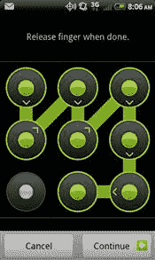

图 6.3 安卓模式锁。

第二种类型的通行码是简单的个人识别号(PIN)，它通常在其他移动设备上找到。[图 6.4](#F0025) 是 PIN 使能 HTC 不可思议的一个例子。

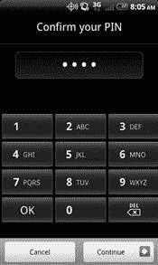

图 6.4 安卓个人识别码锁。

目前在安卓设备上找到的最后一种通行码是完整的字母数字码，如图[图 6.5](#F0030) 所示。

图 6.5 安卓字母数字锁。

正如[第 4 章](4.html)中所讨论的，并非所有的通行码都是相同的。最有效的通行码是允许或要求字母数字密码的通行码，因为这些密码更难绕过。

#### 如果启用了 USB 调试，请使用 ADB

假设手机已开机，你应该尝试的第一种技术是通过 USB 与安卓调试桥(ADB)连接，这在[第 3 章](3.html)中有详细介绍。尽管只有一小部分安卓设备允许通过 USB 调试设置进行 ADB 连接，但它确实值得尝试，因为它可以轻松地为数据提取提供足够的访问权限。用户启用 USB 调试的最常见原因包括:

应用开发和测试

某些应用程序需要此设置，例如 PDAnet，它允许设备通过 USB 向系留设备提供互联网访问

定制光盘

开发者手机，如谷歌安卓开发者手机(ADP1)

设备黑客攻击

如果您使用的是 Ubuntu 虚拟机(VM)，或者您有一个装有正确安装和配置的软件开发工具包的取证工作站，那么确定是否启用了 USB 调试是非常简单的。手机在正常模式下运行时，将其插入 Ubuntu 虚拟机。在命令提示符下键入“adb 设备”。如果启用了 USB 调试，ADB 守护程序将返回设备序列号以及手机当前所处的模式。

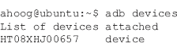

如果禁用，当输入“adb devices”命令时，它不会返回任何内容。

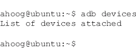

如果在虚拟工作站中运行命令，请记住将设备传递给虚拟机。如果虚拟机看不到设备，您将获得与未启用 USB 调试相同的结果。一旦您验证了 USB 连接被传递到 Ubuntu 虚拟机，您就可以执行 lsusb 命令来验证操作系统是否知道该连接:

在这个例子中，重点放在几个区域，清楚地显示安卓设备是连接的，在这种情况下，我们可以看到一个亚行接口暴露出来。如果设备已连接，但您无法通过 ADB 连接，您还应该终止本地 ADB 守护程序，然后重新启动它。这很容易实现，如下所示:

如果启用了 USB 调试，法医分析师可以使用该接口来访问并执行设备的逻辑恢复，这将在本章后面详细介绍。

#### 涂抹攻击

最初，安卓设备使用模式锁来保护密码，而不是数字或字母数字代码。宾夕法尼亚大学计算机和信息科学系最近发表的一篇题为“智能手机触摸屏上的涂抹攻击”的论文展示了一种通过增强屏幕照片来访问模式锁定安卓设备的技术。).该文件的摘要指出:

我们的摄影实验表明，干净的触摸屏表面主要但不完全是反射性的，而污迹主要但不完全是漫射性的。我们发现，实际上任何方向的光源，如果不与相机成一个互补的角度，都将呈现出污迹的可恢复图像。查看图案只需要很少的照片调整，但是当照片拍摄过度曝光两到三次 f-stop(4 到 8 次“正确”曝光)时，图像通常呈现最佳。

如果急救人员小心谨慎，尽量减少与设备屏幕的接触，这种恢复技术可能是可行的。作为一个可能的例子，[图 6.6](#F0035) 显示了并排显示的同一个安卓设备的照片。两张图片使用了相同的原始照片，但是右边的图片作为涂抹攻击过程的一部分进行了增强，以突出接触点。

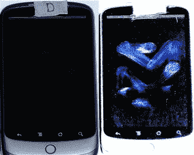

图 6.6 显示污迹攻击的增强照片。

#### 恢复模式

一些用户安装了一个定制的只读存储器，通常通过修改后的恢复模式实现对设备的根访问。大多数定制只读存储器安装一个修改的恢复分区，这简化了安装定制只读存储器的过程。有几个流行的恢复分区主要用于定制的只读存储器，它们都提供了从恢复控制台内部以根权限进行的外壳访问。由于手机没有引导到正常模式，密码被绕过，用户数据分区可以以只读方式安装，从而防止对该区域的更改。

当法医分析人员接管设备时，如果设备断电，他们应该尝试引导进入恢复模式。相反，如果设备正在运行并且存在密码，您应该首先尝试通过 ADB 连接，并考虑 pass 攻击。如果这两种方法都不成功，您应该尝试重新启动进入恢复模式。像许多其他技术一样，根据设备制造商和型号，恢复模式以不同的方式访问。[表 6.2](#T0015) 涵盖了本书通篇引用的手机上进入恢复模式的组合键。每个都假设设备已经关闭。

表 6.2 引导至恢复模式的组合键

| 设备 | 组合键 |
| --- | --- |
| G1 宏达电 | 按住主页按钮并按下电源按钮。使用调低音量选择 RECOVERY，然后按电源键。 |
| Nexus One | 按住音量并按下电源按钮。 |
| 摩托罗拉 Droid | 按住 X 键并按下电源按钮。 |
| 难以置信 | 按住音量并按下电源按钮。使用调低音量选择 RECOVERY，然后按电源键。 |

进入恢复模式后，您可以将设备连接到您的 Ubuntu 工作站，并尝试使用 ADB 进行连接。如果设备正在运行未修改的恢复模式，连接将会失败。屏幕通常显示一个三角形，里面有一个感叹号，旁边通常有一个小的安卓设备。在其他设备上，你会看到滑板上有点著名的三个机器人。最后，其他恢复模块清楚地表明它们处于修改后的恢复代码中，并提供了广泛的设备选项。

#### 闪存一个新的恢复分区

有许多协议、实用程序和设备允许熟练的检查人员用修改后的映像刷新设备的恢复分区。

支持这种方法的第一个可用协议是 fastboot。快速引导是一种在引导加载程序模式下通过 USB 执行的 NAND 闪存更新协议。大多数设备出厂时都启用了引导加载程序保护，这禁止使用此协议。但是，保护可能已被禁用。要确定是否启用了引导加载程序保护，您必须访问引导加载程序并查看签名信息，签名信息将指示“开”或“关”。S 代表安全性，因此默认生产版本 S-ON 启用了安全性；S-OFF 表示未启用安全性。有些设备附带 S-OFF，例如谷歌 Nexus One，因为它预装了谷歌的工程 SPL/引导加载程序。其他生根技术也禁用这种保护，因此在密码保护设备上检查这一点可能会产生结果。您可以使用上一节[表 6.2](#T0015) 中组合键的第一部分来访问主引导程序。

快速启动不需要 USB 调试即可访问设备。因此，与恢复模式一样，它可以用来访问设备的数据。一旦新的恢复分区可用，就应该将设备重新引导至恢复模式，并且可以进行取证成像。

存在允许恢复分区用新的映像来刷新的其他技术。一些例子包括:

摩托罗拉的相对标准偏差 Lite

sbf_flash

三星奥丁多装载机

虽然这些实用程序和协议最终可能会提供法医分析师所需的特权，但需要付出相当大的努力，不仅要定位和测试这些技术，还要充分了解它们，以便在法医调查中使用它们。

#### 屏幕锁定旁路应用

安全研究员托马斯·坎农(Thomas Cannon)最近开发了一种技术，通过新的基于网络的安卓市场安装应用程序，可以绕过屏幕锁定。坎农的技术利用了基于网络的安卓市场的一项新功能，该功能允许应用程序直接从网站安装。因此，您必须使用设备的主要 Gmail 用户名和密码才能访问安卓市场，这可以从用户的主要计算机上访问。或者，如果你知道用户名和密码，并且有足够的权限，你可以访问安卓市场。在这种情况下，更改用户的 Gmail 密码将不起作用。

Cannon 在本网站上的技术解释如下部分( [Cannon，t，n.d.](#BIB5) )。

#### 它是如何工作的

程序真的很简单。安卓会发出一些应用程序可以接收到的广播消息，比如收到的短信或[Wi-Fi.com](http://Wi-Fi.com)断开。应用程序必须注册其接收器来接收广播消息，这可以在运行时完成，或者对于某些消息，可以在安装时完成。当相关消息进来时，它被发送到应用程序，如果应用程序没有运行，它将自动启动。

在测试了各种广播消息后，我发现最适合这个实用程序的是 Android . intent . action . PACkage _ ADD。作为版本 1，这存在于所有 API 中，并且在安装应用程序时触发。因此，为了让应用程序远程执行，我们首先从安卓市场部署它，然后部署任何其他会导致第一个启动的应用程序。

一旦启动，只需在 KeyguardManager 中调用 disableKeyguard()方法即可。这是一个合法的应用编程接口，允许应用程序在检测到来电时禁用屏幕锁定。通话结束后，应用程序应该再次启用屏幕锁定，但我们只是将其禁用。

如果你有适当的途径进入安卓市场，这项技术当然值得考虑。

#### 使用 Gmail 用户/通行证

在大多数安卓手机上，如果你知道设备注册的主要 Gmail 用户名和密码，你就可以绕过密码。在多次尝试失败后(在 G1 上尝试了 10 次)，您将看到一个屏幕，询问您是否忘记了密码。在那里，您可以输入 Gmail 用户名和密码，然后系统会提示您重置密码。这种技术不要求手机在线，因为它使用缓存在手机上的凭据信息。

如果您没有当前的 Gmail 用户名和密码，但有足够的权限(即法院命令)重置密码，您可以尝试强制谷歌重置帐户密码。然后，您必须将安卓设备连接到网络并获得访问权限。此问题带来了许多挑战，包括需要将设备置于在线状态，除了对设备进行更改之外，还会使其面临远程擦除的风险。各种执法邮件列表上的报告表明，这种技术并不总是有效。

如果尝试这种方法，需要进行额外的研究。特别是，谨慎的做法是控制设备使用的互联网连接，很可能是[Wi-Fi.com](http://Wi-Fi.com)接入点。然后，您可以将网络访问限制在谷歌服务器需要进行身份验证的范围内。此外，应分析测试设备的详细网络捕获以及对设备所做的实际更改。

#### JTAG 和芯片关闭

此时，大多数安卓设备不会加密 NAND 闪存的内容，这使得如果启用了密码，直接访问和解码内存芯片成为一种潜在的解决方法。有两种主要技术可以直接访问芯片。两者在技术上都具有挑战性。这两种技术是:

联合试验行动小组(JTAG)

物理提取(芯片关闭)

这两种技术不仅在技术上具有挑战性，并且需要对设备进行部分或全部拆卸，而且需要大量的提取后分析来重新组装文件系统。由于这些原因，JTAG 和芯片关闭可能是规避锁定设备的最后选择。

使用 JTAG，通过将导线焊接到印刷电路板上的某些 JTAG 焊盘，可以直接连接到设备的中央处理器。然后可以使用 JTAG 软件对 NAND 闪存执行完整的二进制内存转储，修改某些分区以允许根访问，或者完全消除密码。

在芯片分离过程中，利用热和空气将 NAND 闪存芯片从印刷电路板上物理取出。芯片通常是一个小球栅阵列(BGA)封装，然后需要重新生成 BGA 连接，并插入到连接到芯片并读取与非门闪存的特殊硬件中。

这些技术的优势在于，它们可以在 NAND 闪存未加密的任何情况下工作。然而，执行这些技术需要广泛的研究、开发、测试和实践。

## 成像安卓 USB 大容量存储设备

迄今为止，每个安卓设备都有一个外部安全数字卡或嵌入式多媒体卡(eMMC)，可以提供许多用户所需的大存储空间。这些存储设备之所以存在，是因为用户的应用程序数据(通常存储在/data/data 中)出于安全和隐私原因而被隔离。然而，用户希望在他们的安卓设备和计算机之间复制歌曲、图片、视频或其他文件，这些大容量的 FAT 文件系统分区解决了这个问题。敏感的用户数据仍然受到保护，但用户可以访问更大、更便携的文件。

最初，对外部存储进行成像的方法是简单地将其从安卓设备上移除，并使用通用串行总线写阻止程序对其进行成像。然而，随着时间的推移，出现了一些挑战，包括:

转移到 eMMC 存储意味着大容量存储不再可移动。

应用程序现在可以从 SD 卡运行，在这种情况下。apk 文件是加密的。如果捕获应用程序的未加密副本对调查至关重要(例如，涉及恶意软件分析或特洛伊木马防御的案例)，SD 卡必须保留在安卓设备中。

更新的设备更频繁地使用内存磁盘(tmpfs)来存储可能有助于调查的用户数据。通常，移除 SD 卡需要关闭设备并移除电池，从而失去恢复临时数据的能力。

出于这些原因，建议在安卓系统上对通用串行总线大容量存储(UMS)设备进行成像的方法不再涉及移除 SD 卡，而是通过 UMS 接口对其进行成像。

### SD 卡对战 eMMC

SD 卡和 eMMC 没什么不同。当然，主要的区别是 SD 卡是便携式的，很容易从一个设备移动到下一个设备。它们使用与非门闪存，基于多媒体卡(MMC)规范，并具有嵌入式存储控制器，因此客户操作系统不需要系统 MTD 来读取它们。

迄今为止，安卓设备接受的 microSD 卡通常从 2 GB 到 16 GB 不等。然而，更大的牌是可能的。根据安卓设备的不同，SD 卡可能很容易从正在运行的设备上访问和移除。然而，许多人要求关闭设备，以便取出电池。

对于嵌入在设备上的存储，几家制造商已经开始使用 eMMC，它由嵌入式存储组成，具有直接集成到设备印刷电路板上的 MMC 接口。该标准通过标准化的 eMMC 协议简化了对 NAND 闪存的访问，并且能够支持不支持 NAND 闪存的文件系统。这不一定意味着文件系统将 NAND 闪存的寿命保持在与 YAFFS2 等 NAND 闪存感知文件系统相同的水平和复杂程度。然而，安卓设备的一般寿命肯定在缩短，对大多数用户来说可能不是问题。

### 如何对 SD 卡/eMMC 进行取证成像

有两种主要方法可以合法获取 SD 卡和 eMMC，而无需将其从设备中移除。这里介绍的第一种方法是将 UMS 设备接口暴露给取证工作站，并允许您使用自己选择的取证工具获取图像。第二种方法不会将 UMS 暴露给你的取证工作站，而是在安卓设备上使用 dd。这需要 adb 端口转发，这将在本章后面的物理技术一节中介绍。

即使我们的 Ubuntu 虚拟机内置了 dd，我们也将下载、编译和安装由国防部网络犯罪中心维护的 dd 的更新版本。该程序 dc3dd 是 GNU dd 的补丁版本，包括许多对计算机取证有用的功能( [dc3dd，n.d.](#BIB6) )，例如:

采用多种算法的分段和整体哈希—支持 MD5、SHA-1、SHA-256 和 SHA-512。

带有自动输入/输出文件大小探测的进度指示器。

哈希和错误的组合日志。

错误分组—针对相同的顺序错误生成一条错误消息。

验证模式—能够对输出文件进行哈希处理，并将哈希与采集哈希进行比较。

能够将输出分成带有数字或字母扩展的块。

能够同时写入多个输出文件。

该程序是根据 GNU 公共许可证第 3 版(GPLv3)许可的开源软件，通过 SourceForge 在线分发，并于 2010 年 8 月更新为 7.0 版( [dc3dd，n.d.](#BIB6) )。在这本书的这一点上，你应该对编译程序相当满意，并且拥有所有需要的工具，所以这里有一些简短的步骤。

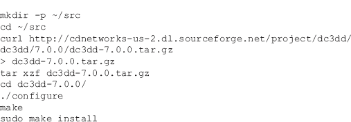

此时，您可以继续成像。然而，每次键入整个 dc3dd 命令不仅繁琐，而且可能导致打字错误，从而造成不可挽回的损失。因此，创建一个 shell 脚本，它不仅获取设备，还记录各种系统特征、日期/时间戳，并创建日志文件，这在您以后编写报告时会很有帮助。

我们会将 acquire 脚本放在/usr/local/bin 中，这样您就可以轻松地从任何目录运行脚本，因为默认情况下/usr/local/bin 位于您的执行路径中:

接下来，将以下内容复制到脚本中，按 Ctrl-O 保存，然后按 Ctrl-X 退出:

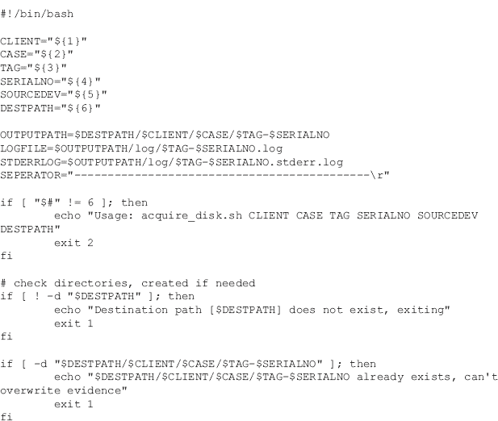

接下来，您必须更改权限，以便可以运行脚本，然后在没有参数的情况下运行它，从而查看用法帮助:

这个脚本和开源的最大好处是，你可以根据自己的意愿简单地修改它。如果您不想跟踪客户端名称，只需将其从脚本中删除即可。

接下来，我们必须在你的 Ubuntu 工作站上安装 UMS 设备。如 Ubuntu 虚拟机设置的第 1 章所述，禁用工作站上的自动挂载非常重要。如果您没有这样做，请在将 UMS 设备呈现给虚拟机之前查看必要的步骤并完成。

此外，理想的情况是首先将安卓设备连接到基于硬件的 USB 写阻止程序。但是，当连接的设备暴露多个设备标识时，一些写阻止程序似乎有问题。你应该试验一下你的 u 盘写拦截器，理想情况下，首先让它工作。

注意

### USB 超块表

运行 2009 年 8 月 9 日最新固件的 Tableau UltraBlock USB 型号 T8，只能通过在参考 HTC excelsive 上找到的第一个 USB 设备，因此我们在分析设备时无法使用。Tableau 有一个新的 UltraBlock USB 设备，可能会工作；然而，我们还没有证实这一点。检查人员应该测试他们拥有的各种 USB 写阻止程序的兼容性。

接下来，我们需要确定 UMS 映射到哪些设备。该信息显示在内核日志中，可以使用“dmesg”命令轻松访问:

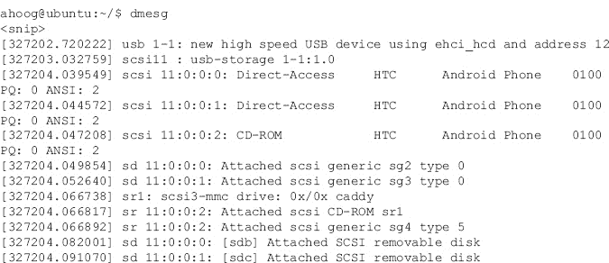

如前所述，除了 ADB 之外，HTC 不可思议还公开了三个 USB 接口:

设备驱动程序安装光盘(sr1)

eMMC UMS 装置(sdb)

SD 卡 UMS 设备

但是，/dev/sdb 和/dev/sdc 之间的区别在 Android 设备上启用 UMS 或磁盘驱动器功能之前是不容易辨别的。启用后，您应该再次检查 dmesg 的输出。

警告

### 使用硬件写阻止程序

虽然 Ubuntu 工作站上的自动挂载功能已被禁用，但法医分析师必须通过硬件写阻止程序仅将 Android 设备连接到工作站，以确保不对设备进行任何更改。在案例中积极使用之前，应彻底测试所有硬件。

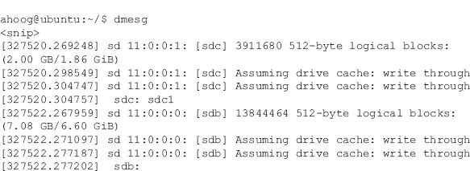

现在更清楚的是/dev/sdb 是 7 GB 存储设备(即 eMMC)，而 2 GB SD 卡映射到/dev/sdc。我们现在可以使用我们的采集脚本或取证工作站上提供的任何取证成像工具来采集设备。该脚本采用以下六个参数:

1.客户端—此参数创建文件夹结构，例如“警长办公室”或客户端名称，如“viaforensics”

2.案例—该参数提供案例名称，如 af-book。

3.标签-该参数是您正在进行法医成像的证据的标签号，在我们的示例中为项目 001。

4.序列号—这是设备、磁盘、SD 卡等的序列号。如果您没有访问序列号的权限，您可以键入您选择的任何文本，例如 unknown-serialno。

5.source dev—这是您想要获取的设备，如/dev/sdb、/dev/sdc 等。您可以使用下面解释的 dmesg 来确定这一点。

6.Destpath—应该在其中创建文件夹的顶级目录。它可能是您的主目录(~)或者一个名为 clients (~/clients)的文件夹。

对于本例，在主目录中创建一个名为 sd-emmc 的文件夹，然后使用 sudo 权限运行 acquire 脚本。

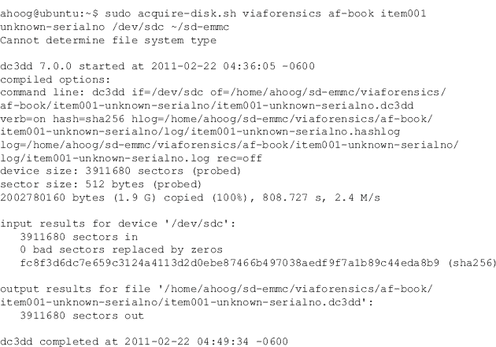

然后，您可以使用相同的常规命令，但更改参数以对 eMMC 进行成像，对于该设备，该设备位于/dev/sdb。这些命令完成后，取证图像和日志文件位于~/sd-emmc 中，其结构如下:

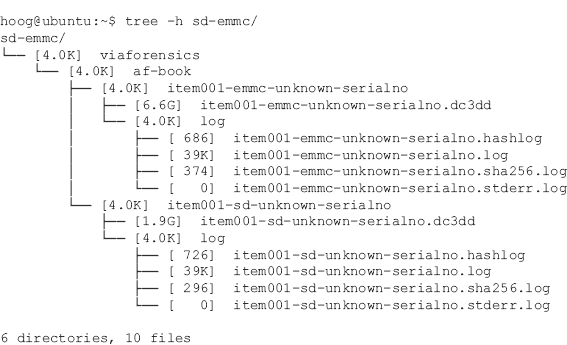

对于每个 UMS 设备的合法映像，我们不仅有经过验证的映像，还有 dd 映像的 hashlog、包含日期、时间、系统信息和命令运行的日志文件、错误日志，以及每个日志文件及其 sha256 哈希的列表。这确保了解成像过程的足够细节。

小费

### SD 卡上的加密应用

如果应用程序安装在 SD 卡上，它们将被加密，因此，如果从 SD 卡映像检查文件，它们将无法读取。但是，当 SD 卡没有安装在您的取证工作站上时，未加密的。apk 文件安装在/mnt/asec 中。如果调查依赖于。apk 应用程序分析，确保您也获得了未加密文件的副本。

## 逻辑技术

正如本章开头所讨论的，逻辑取证技术提取分配的数据。这通常通过访问文件系统来实现。逻辑技术通常是法医分析师进行的第一类检查，因为它们不仅更容易执行，而且经常为案件提供足够的数据。安卓取证物理技术可以提供更多的数据。然而，它们更难成功执行，并且需要花费相当多的精力来分析。

逻辑技术还具有在更多场景下工作的优势，因为唯一的要求是启用 USB 调试。换句话说，Android 取证逻辑技术不需要根访问。

在本节中，我们首先介绍免费提供的技术(尽管 AFLogical 只对活跃的执法和政府机构免费)，然后回顾可用的商业软件。

### 亚行拉动

在[第 4 章](4.html)中，当文件系统的各个部分被复制到 Ubuntu 工作站进行进一步分析时，递归 adb pull 命令被演示了几次。除非安卓设备具有根访问权限或运行自定义只读存储器，否则代理递归副本的设备上运行的 adb 守护程序只能以外壳权限运行。因此，一些更具法律相关性的文件是不可访问的。但是，仍然有文件可以访问。

如果您试图访问 shell 用户无权访问的文件，它不会复制这些文件:

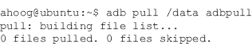

但是，如果你有足够的特权(下一个例子中的 root)，那么这个方法非常简单有效:

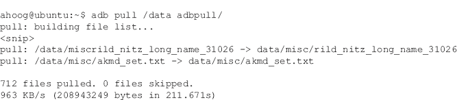

从上面的输出可以看出，整个“/data”分区仅用了三分半多钟就被复制到了本地目录。目录结构在复制过程中保持不变，因此您可以从工作站简单地浏览或分析感兴趣的文件。

由于大多数手机没有 root 访问权限(至少默认情况下是这样)，这种技术似乎没有什么价值。然而，它是一个很好理解的实用工具，有几种情况非常适合这种方法。这些场景包括:

在非根设备上，adb pull 仍然可以访问有用的文件，如未加密的应用程序、大多数 tmpfs 文件系统，这些文件系统可以包含用户数据，如浏览器历史记录，以及在“/proc”、“/sys”和其他可读目录中找到的系统信息。

在根设备上，从“/data”中提取几乎所有目录非常简单，某些文件和目录可能会引起兴趣。

使用物理技术时，并不总是能够装载一些已获取的文件系统，如 YAFFS2。如果 adbd 以 root 权限运行，您可以使用 adb pull 快速提取文件系统的逻辑副本。

由于 adb 不仅是 Android SDK 中的一个免费实用程序，而且非常通用，因此它应该是设备上使用的主要逻辑工具之一。

警告

### 亚行拉动发行

由于权限或其他问题，使用 adb 的一些递归调用可能会在数据传输过程中失败。您应该密切监视命令的结果，以确定是否遇到任何问题。将大型目录的递归拉取分解为较小的数据拉取可能会产生更好的结果。

### 备份分析

安卓刚发布时，并没有为用户提供备份个人数据的机制。因此，在安卓市场上开发和分发了许多备份应用程序。对于运行定制 rom 的用户来说，有一个更强大的备份工具，叫做 nandroid。

许多备份实用程序都有一个“保存到 SD 卡”选项(用户觉得非常方便)，以及几个保存到“云”的选项无论哪种方式，用户都可以备份他们的设备，如果需要，他们可以恢复所需的数据。这不仅是用户保护自己免受数据丢失的好方法，也是法医分析师的一个很好的信息来源。

其中一个比较受欢迎的备份应用是 RerWare 的 My Backup Pro，它可以使用 Content Provider 对设备数据进行备份，如果设备具有 root 访问权限，甚至可以备份整个“/data/data”文件。用户可以在保存到 SD 卡和保存到软件服务器之间进行选择。该应用程序支持以下内容:

应用程序安装文件(如果电话有根访问权限，这包括 APK +数据和市场链接)

联系人

通话记录

浏览器书签

短信(短信)

彩信(信息中的附件)

系统设置

主屏幕(包括宏达传感用户界面)

警报

字典

日历

音乐播放列表

集成的第三方应用程序

最后一个项目“集成的第三方应用程序”指的是为数据备份提供 RerWare 挂钩的公司。至少最初，RerWare 会付钱给开发者，让他们在应用程序中加入 RerWare 备份支持。

有趣的是，该应用不仅在安卓上运行，还在 Windows Mobile、黑莓上运行，很快就在 Symbian OS 上运行。用户可以在一个平台上进行备份，并在完全不同的受支持操作系统上进行恢复。当设备备份存储在本地时，RerWare 会将单个 SQLite 文件保存到 SD 卡。

在安卓的最新版本中，现在有了一个新的备份应用编程接口。开发人员可以简单地将这些应用编程接口集成到他们的应用程序中，其余的备份由安卓和谷歌处理。这为用户提供了安全的、基于云的、跨应用程序一致性的备份，并可能成为事实上的标准。不幸的是，目前的研究还没有从安卓设备上留下的新备份应用编程接口中发现有用的工件。

无论备份应用程序是什么，法医分析师都应该确定是否安装了备份应用程序，如果安装了，备份数据存储在哪里。应该检查 SD 卡以及其他设备，如计算机或笔记本电脑。保存在备份中的数据在检查中显然具有重要价值。

### 生态

AFLogical 是一种安卓取证逻辑技术，免费分发给执法部门和政府机构。该应用程序由 ViaFaceBook 开发，使用内容提供商提取数据，这是安卓平台的一个关键功能。这与商业取证工具用于逻辑取证的技术相同。

回想一下，除了在少数情况下，安卓的安全模式在限制访问应用数据方面是有效的。下面简单回顾一下安卓安全模型的关键组件:

每个应用程序都被分配了一个唯一的 Linux 用户和组 id。

应用程序在专用流程和达尔维克虚拟机中使用其特定用户标识执行。

每个应用程序都有专用存储，通常位于“/data/data”中，只有应用程序可以访问。

然而，安卓框架确实提供了一种应用程序共享数据的机制。应用程序开发人员可以在其应用程序中包含对内容提供商的支持，这允许他们与其他应用程序共享数据。开发人员控制向其他应用程序公开哪些数据。在应用程序的安装过程中，用户控制应用程序是否应该访问请求的内容提供商。

内容提供商的一些例子有:

短信/MMS

联系人

日历

脸书

Gmail

还有很多。

生态应用程序利用内容提供商架构来访问存储在设备上的数据。与商用安卓逻辑工具类似，设备上必须启用 USB 调试，才能让 AFLogical 提取数据。当前版本 1.5.1 从 41 个内容提供商提取数据，并将输出信息以 CSV 格式和 info.xml 文件的形式提供给 SD 卡，info . XML 文件提供了有关设备和已安装应用程序的详细信息。AFLogical 支持运行 Android 1.5 及更高版本的设备，并已专门进行了更新，以支持提取大型数据集，例如包含超过 35，000 条消息的短信数据库。当前支持的内容提供商有:

1.浏览器书签

2.浏览器搜索

3.日历

4.日历与会者

5.日历事件

6.日历扩展属性

7.日历提醒

8.通话记录通话

9.联系人联系方式

10.联系人分机

11.联系人组

12.联系人组织

13.联系人电话

14.联系人设置

15.外部媒体

16.外部图像媒体

17.外部图像拇指媒体

18.外部视频

19\. 入账

20.即时消息账户

21.在猫中

22.即时消息联系人提供商(即时消息联系人)

23.即时消息邀请

24.在留言中

25.即时消息提供商

26.即时消息提供商设置

27.内部图像媒体

28.内部图像拇指媒体

29.内部视频

30.地图-朋友

31.地图-好友额外

32.地图-好友联系人

33.彩信

34.彩信部件提供商(彩信)

35.注意事项

36.人

37.人已删除

38.手机存储(HTC 难以置信)

39.搜索历史

40.短信

41.社会契约活动

让我们来看看在设备上运行逻辑的步骤。首先，确保您已经下载了一个逻辑，这需要通过 ViaFaceBook 进行注册和批准。(你可以在[http://viaforensics.com/products/tools/aflogical/](http://viaforensics.com/products/tools/aflogical/)进入生态页面。)接下来，您需要用您控制的 SD 卡替换用户的 SD 卡，并确保设备上启用了 USB 调试。然后将安卓设备连接到你的 Ubuntu 工作站，并确保你通过 USB 连接到虚拟机。

警告

### 更换用户的 SD 卡

此版本的 AFLogical 将内容直接写入 SD 卡，重要的是，用户的 SD 卡将被移除并替换为审查员的 SD 卡。如果不这样做，要么将数据写入用户的 SD 卡，要么逻辑将失败，因为它无法写入 SD 卡。这个应用的商业版本将最终取代 SD 卡的写入，支持端口转发而不是 adb。

从终端会话中，验证您可以看到设备:

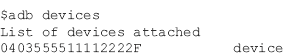

假设您在主目录中保存了一个逻辑应用程序，您可以使用以下命令安装它:

注意:如果设备上已经安装了逻辑，将显示一个错误，您必须卸载现有的应用程序，然后才能安装新版本。要卸载，请运行以下命令:

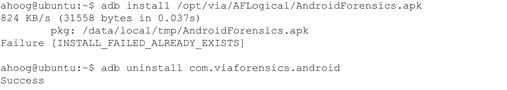

应用程序成功安装后，您可以直接从安卓设备或通过命令行运行程序。如果您从命令行运行该应用程序，您可以简单地启动该应用程序，然后使用该设备完成，或者让它自动运行。要自动运行应用程序和提取，请执行以下操作:

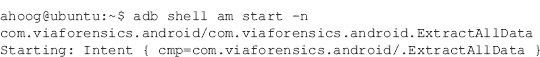

该程序立即启动，并开始从所有支持的内容提供商提取数据。如果你正在查看屏幕，你会看到一个类似于[图 6.7](#F0040) 的图像。

图 6.7 逻辑，从命令行提取全部。

或者，您可以简单地用以下命令启动应用程序:

然后使用设备上显示的屏幕完成采集，如图[图 6.8](#F0045) 。

图 6.8 逻辑，从命令行运行。

否则，您可以直接从设备上的“所有应用”屏幕运行该应用，如图[图 6.9](#F0050) 。首先，进入安卓应用菜单，寻找一个名为 viaForensics 的程序，点击图标启动该应用。

图 6.9 所有应用列表中的逻辑。

然后，您将看到一个逻辑数据提取屏幕。您可以选择或取消选择单个内容提供商，也可以选择所有内容提供商。接下来，点击捕获，将开始数据收集过程，如图 6.10所示。

图 6.10 逻辑捕获数据。

一旦数据采集完成，您将收到相应的消息，如图[图 6.11](#F0060) 。

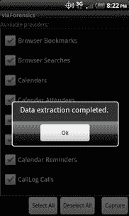

图 6.11 逻辑，数据提取完成。

提取的数据保存到设备的 SD 卡中一个名为 forensics 的目录和一个以 YYYMMDD 中的日期命名的子目录中。HHMM 格式。对于这个例子，我们使用 adb pull 将文件从 SD 卡移动到本地文件系统上的一个逻辑目录中。如果检查该文件夹，您会看到:

这包含提取的数据:

可以使用任何编辑器或电子表格查看 CSV 文件。目录中还有一个名为 info.xml 的文件，其中包含了该设备的信息，包括 IMSI、IMEI、Android 版本、网络提供商等，以及所有已安装应用的列表。

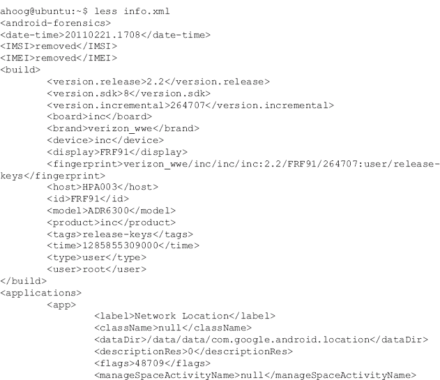

法医现在可以分析这些数据，并很容易与他人分享。

警告

### 卸载逻辑

不要忘记卸载一个逻辑。未能卸载该应用程序将意味着安卓设备可能会被归还给所有者，法医代理仍然可以访问。要卸载逻辑，请键入以下命令:

adb 卸载 com.viaforensics.android

这应该会返回成功。或者，您可以转到主屏幕，按菜单，选择应用程序，管理应用程序，通过取证，最后卸载。

### 商业提供商

许多商业移动取证软件供应商现在都支持安卓。到目前为止，取证软件只支持对安卓设备进行逻辑检查，使用的内容提供商技术与安卓相同。对于法医来说，了解每个法医软件供应商如何实现安卓支持可能会有所帮助。

每个软件公司都提供了其软件的评估副本以及平台概述，这些内容包含在每个部分的开头。考试使用了一个运行安卓 2.2 的摩托罗拉 Droid。本节不打算评估每个平台，而是提供一个有用的概述。提供了以下取证软件包(按字母顺序审查):

纤维素酶

康培森移动编辑！

包住中微子

微系统学 XRY

对羟基苯甲酸酯装置卡住

viaforensics ' viaextract

另外测试了两个取证软件包。然而，遇到了一些问题，使得目前无法将其纳入。这些供应商确实为安卓提供了取证解决方案，如果感兴趣，您应该独立审查他们的产品。省略的软件包是氧气法医套件 2010 和罗技立方的 CellDEK。

任何此类概述的挑战是取证软件更新足够频繁，以至于较新的版本可能已经存在。对特定软件包感兴趣的法医鉴定师和安全工程师应该查看供应商的网站或直接联系他们。

#### 鳞状细胞

供应商提供了以下 Cellebrite 概述:

Cellebrite UFED 取证系统是一个独立的设备，能够从大约 1600 个移动设备获取数据，并将信息存储在 u 盘、SD 卡或电脑上。UFED 还有一个内置的 SIM 卡读卡器和克隆器。克隆 SIM 卡的能力是一个强大的功能，因为您可以创建和插入原始 SIM 卡的克隆，手机将正常工作。然而，它不会在移动运营商的网络上注册，消除了对法拉第袋的需求，也消除了手机上的数据被更新(或擦除)的可能性。UFED 包附带了大约 70 根电缆，用于连接当今大多数可用的移动设备。支持的连接协议包括串行、通用串行总线、红外和蓝牙。

Cellebrite 还分发了 UFED 报告管理器，它提供了一个直观的报告界面，允许用户将数据/报告导出到 Excel、MS Outlook、Outlook Express 和 CSV 中，或者简单地打印报告。

UFED 设备完全支持 Unicode，因此可以处理支持任何语言的手机。此外，还提取了以下数据类型:

电话簿

短信

通话记录(已接、已拨、未接)

SIM 卡识别码克隆

从 SIM 卡/USIM 删除短信

录音

视频

图片

电话详情(IMEI/ESN 电话号码)

##### 装置

UFED 系统是一个独立的单元，封装在一个软外壳中，包含 UFED 设备、用户手册、软件光盘、通用串行总线蓝牙无线电(剑桥硅无线电有限公司)、250 兆字节的通用串行总线驱动器和大约 72 根用于连接受支持设备的电缆。

UFED 系统提供了几种更新固件和软件的机制。设置日期和时间后，检查人员只需通过以太网电缆将 UFED 系统连接到网络，前提是 DHCP 和互联网接入可用。接下来，选择服务、升级、立即升级应用程序，并选择 HTTP 服务器作为源。在这次测试中，找到并安装了最新的应用软件 1.1.0.5 版。由于 UFED 系统是独立的解决方案，因此不需要额外安装。

##### 获得物ˌ获得

在 UFED 系统中，摩托罗拉机器人的收购相当快速和简单。打开设备电源后，选择提取电话数据，摩托罗拉码分多址，摩托。A855 Droid(安卓)、u 盘驱动器(目的地)和所需的内容类型。随后，UFED 系统显示以下指令(见[图 6.12](#F0065) ):

图 6.12 安卓设备的 UFED 说明。

需要注意的是，如果按照建议的步骤操作，联系人列表会保存到 SD 卡中。执行这些步骤后，点击继续，获取继续。UFED 系统接下来提示:

这一步完成后，收购继续进行。在采集完成之前，可能会提示您再次设置 UMS。获取过程只花了三分多钟，并提供了以下提示:

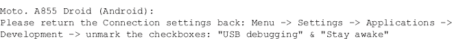

收购的结果存储在插入 UFED 的闪存驱动器中。在此驱动器上创建了一个 25 MB 的文件夹，其中包含视频、音频和图像文件夹。还创建了三个感兴趣的文件:[电话簿 2010_11_23 (001)。htm](http://PhoneBook2010_11_23(001).htm) ，[smsmsmessages 2010 _ 11 _ 23(001)。htm](http://SMSMessages2010_11_23(001).htm) 和[Report.htm](http://Report.htm)。所有这些都可以在网络浏览器中查看。文件 Report.htm 包含整个提取报告。这包含电话检查报告属性、电话检查报告索引、电话联系人、电话短信(文本消息、电话来话列表、电话去话列表、电话未接呼叫列表、图像、铃声、音频和视频)部分。

整个收购过程耗时约十分钟。收购完成后，对 SD 卡的快速检查发现了一个名为 00001.vcf 的文件，其中包含了出口过程中的联系信息。

电话信息布局合理，相当准确。

##### 数据呈现和分析

采集数据存储在连接到 UFED 系统的闪存驱动器上，其中包含一个存储视频、音频文件和图像的文件夹，以及三个包含报告数据的 HTML 文件:

1.电话簿 2010_11_23 (001)。html 文件的后缀

2.短信 2010_11_23 (001)。htm 格式

3.Report.htm

这些文件可以在网络浏览器中查看，报告中的样本显示在[图 6.13](#F0070) 中，其中捕获了完整的电话信息。

图 6.13 UFED 电话信息报告。

[图 6.14](#F0075) 显示了电话联系人的布局。

图 6.14 UFED 电话联系人报告。

[图 6.15](#F0080) 显示了按时间顺序显示的文本消息，以及消息是发送还是接收的详细信息。

图 6.15 UFED 短信举报。

但是，删除的短信不会显示，彩信也不会显示。

通话记录按时间顺序显示，如图[图 6.16](#F0085) 所示，包括通话时长。它们分为“传入”、“传出”和“错过”部分。

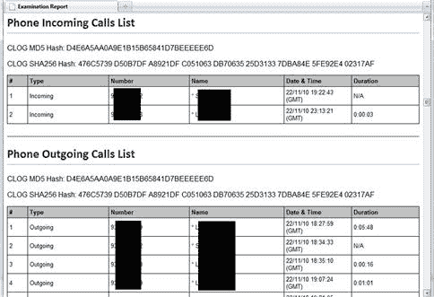

图 6.16 UFED 电话报告。

几个呼叫已从呼叫日志中删除；然而，UFED 能够提取和显示细节。

所有在手机上找到的图片都会被报告，同时还有图片的缩略图和详细信息，包括文件名、大小、创建日期和时间以及分辨率，如图[图 6.17](#F0090) 。

图 6.17 UFED 图像报告。

删除的图像没有出现，似乎每个图像都创建了一个副本。报告音频和视频文件。报告包括文件名、文件大小、创建日期和时间，以及查看或收听媒体的链接，如图[图 6.18](#F0095) 。

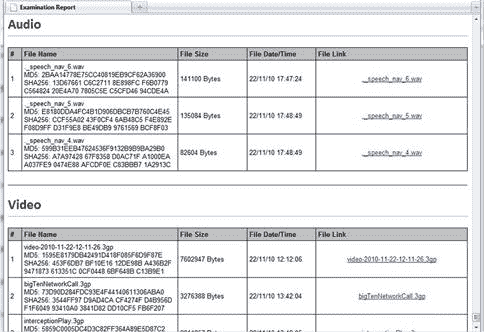

图 6.18 UFED 音频和视频报告。

未返回任何已删除的视频，上传到设备的歌曲也未出现在报告中。报告的音频文件是从谷歌地图导航返回的。

#### Compelson MOBILedit！

以下是 MOBILedit 的概述！由供应商提供:

只需一次点击，移动编辑！法医从手机上收集所有可能的数据，并在电脑上生成大量报告，这些报告可以存储或打印。它是最通用的手机解决方案，软件支持大多数 GSM 手机，开放架构允许支持任何手机。该系统允许您定制输出，使其完全适应您的司法系统的需求。

MOBILedit！法医对手机进行全面分析，包括其电话簿、上次拨打的号码、未接电话、已接电话、彩信、短信、照片、视频、文件、电话详情、日历、笔记、任务等。

MOBILedit！法医以可以用任何语言生成的报告迎合了整个世界。您可以根据自己的特定需求准备创意模板。您构建了您希望在每个最终报告中出现的所有文本。它还允许 XML 导出，这样您就可以将应用程序与其他系统连接起来。XSL 模块将包中的所有数据导出并很好地格式化到互联网浏览器中。您可以根据需要刻录、发送和共享报告。

MOBILedit！法医报告不需要人手就能完成。虽然不需要从 SIMs 或手机导入或导出数据存根，但在 MOBILedit 中的手动调查模式下是可能的！法医。它是只读的，因此，它可以防止设备的变化，这可能意味着证据的消失。所有项目也受到数字签名中使用的 MD5 哈希码的保护，以防以后修改。它帮助您快速定位可能的修改位置。

MOBILedit！法医也有频繁的更新和升级，这样你就可以确定你使用的是绝对最新的技术。它的详细报告和用户友好的设计使它成为一个愉快的工作。

##### 装置

MOBILedit！4 取证应用从[www.mobiledit.com](http://www.mobiledit.com)下载，安装只花了几分钟。安装完成且应用程序首次运行后，系统会提示您检查更新。

为了激活软件，康培尔森发送了一封带有“激活卡”附件的电子邮件。该 PDF 文件包括安装说明和激活密钥，没有任何问题。

##### 获得物ˌ获得

要开始采集，检查人员必须首先使用 USB 将 Android 设备连接到取证工作站，并确保启用 USB 调试。MOBILedit！尝试检测设备，如图[图 6.19](#F0100) 。

图 6.19 检测安卓设备。

点击“完成”后，出现提示在设备上安装“连接器”app 的通知，如图[图 6.20](#F0105) 。

图 6.20 安装连接器。

快速安装后，您可以为调查创建一个名称，并选择要提取的数据类型。在[图 6.21](#F0110) 所示的示例中，选择了选项来备份“整个文件系统”，该选项随后被无错误地执行，并呈现成功状态，如图[图 6.22](#F0115) 所示。

图 6.21 备份整个文件系统。

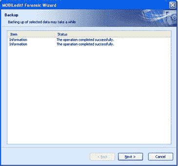

图 6.22 操作成功完成。

然后，您可以决定是将它添加到现有案例中，还是创建一个新案例。对于本例，如图 6.23 中的[所示，创建了一个新的案例，并选择了 XLS 的数据导出格式选项。](#F0120)

图 6.23 数据导出格式。

##### 数据呈现和分析

获取设备后，MOBILedit 会立即显示已获取设备的统计信息，以及可供分析的应用程序数据视图。[图 6.24](#F0125) 显示了主屏幕，在主屏幕上，检查人员可以看到特定的设备信息，包括 IMEI 号、序列号，以及设备上可用的 Phone 内存量、Battery 信号、Network 信号和存储卡空间的详细信息。

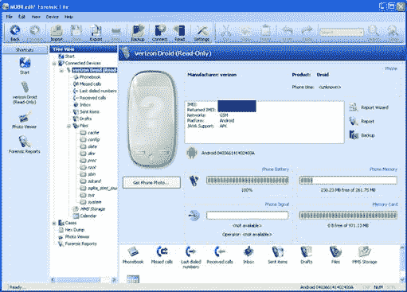

图 6.24 主屏幕。

树形视图中的下一个选项是电话簿，检查者可以在其中查看存储在电话簿中的所有联系人，包括电子邮件地址、电话号码、昵称以及输入的关于联系人的任何注释，如图 6.25所示。

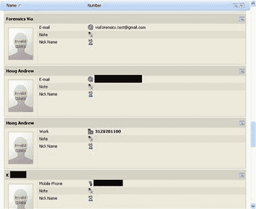

图 6.25 电话簿。

接下来是通话记录，分为未接来电、最后拨打的号码和已接来电，如图[图 6.26](#F0135) 所示。

图 6.26 通话记录—未接电话。

类似地，短信也分为不同的类别，包括收件箱、已发送邮件和草稿。每个部分包含接收(或发送)消息的日期和时间、消息内容以及消息来自谁。联系人姓名链接到电话簿，因此姓名和电话号码都会显示出来。[图 6.27](#F0140) 显示短信收件箱。

图 6.27 短信—收件箱。

任何彩信都显示在“彩信存储”文件夹中，如图 6.28[所示。在左侧，显示了关于该消息的信息，](#F0145)包括主题、发件人号码、收件人号码以及日期和时间。右侧是实际图像的预览。

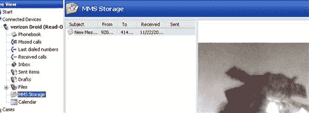

图 6.28 彩信存储。

选择日历选项会在报表工具中调出一个日历，如图[图 6.29](#F0150) 。

图 6.29 日历。

从设备或 SD 卡提取的附加数据显示在“文件”目录中。该目录包含设备上文件系统的列表。虽然其中一些文件夹是空的(如缓存、配置和数据)，但也有一些文件夹包含从设备获取的原始文件。例如在 SD 卡文件夹内，子文件夹“secret stuff”包含两个文件，如图[图 6.30](#F0155) 所示。

图 6.30 SD 卡文件。

最后，该工具还为指定文件提供了十六进制转储功能。选择“十六进制转储”，然后选择一个文件(在本例中，选择了一个. jpg 文件)后，使用十六进制编辑器在右侧查看十六进制转储，如图[图 6.31](#F0160) 所示。

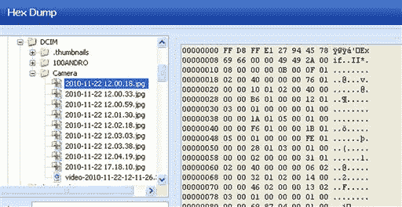

图 6.31 六角卸载。

安卓上的大多数原始用户数据文件都可以在“数据”文件夹中找到，当 MOBILedit 在树形视图中为该文件夹(在“文件”目录下)创建条目时，它不包含任何文件。

需要注意的一点是，当采集和分析完成时，“MOBILedit！连接器”应用程序仍安装在设备上。检查人员应强烈考虑在调查完成后从设备手动卸载软件。

#### 包住中微子

供应商提供了中微子的以下概述:

包住中微子是为执法人员、安全分析师和电子发现专家设计的，他们需要从移动设备上合法地收集和审查数据。调查人员可以处理和分析移动设备数据以及任何 Case 产品中的其他类型的数字证据。

该解决方案为最常见的移动设备和智能手机操作系统提供硬件支持和解析功能，包括 iPhone、Palm、黑莓、安卓、Windows Mobile、摩托罗拉、诺基亚、三星等。调查人员可以收集、分析和保存所有潜在的相关数据，包括:

设备设置

联系人

通话记录

电子邮件

图像

短信/MMS

日历

设备上存储的其他文件

使用包住中微子，调查人员可以:

遵循易于使用的向导，从各种设备收集数据

关联来自多个设备和计算机介质的数据

将收集的数据无缝集成到包住法医或包住企业进行分析

快速解析数据，提高调查过程的速度

与同类产品相比，获取更多选定设备的数据

##### 装置

安装包住中微子首先需要安装包住，然后是中微子。按照屏幕上的说明，软件安装顺利进行。要使用软件，您必须有一个由 Case 提供的硬件 USB 加密狗。

##### 获得物ˌ获得

中微子收购安卓设备是在一个屏幕上完成的。首先，选择设备、制造商和型号。接下来，输入箱子和设备的基本信息。最后，将设备连接到取证工作站，然后单击“获取当前项目”[图 6.32](#F0165) 显示采集画面。

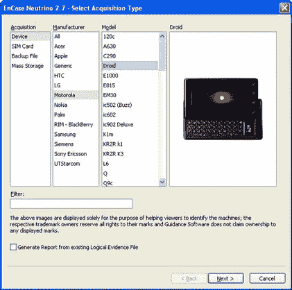

图 6.32 中微子采集屏幕。

收购不到一分钟。完成后，单击生成报告查看采集结果。

##### 数据呈现和分析

中微子报告有简短和详细的报告。[图 6.33](#F0170) 所示的短报告显示了详细报告的所有条目，但细节较少。

图 6.33 中微子接触的简短报告。

详细视图提供了更多关于触点的细节，如图 6.34[所示。](#F0175)

图 6.34 详细报告中的中微子接触。

短信部分也有一个简短详细的视图。短视图仅显示对话中的其他电话号码、消息的日期和时间、消息方向(发送或接收)以及消息内容。详细视图显示在[图 6.35](#F0180) 中，包括与消息所涉及的电话号码相关联的姓名和消息的状态等信息。

图 6.35 详细报告中的中微子短信。

彩信只出现在详细视图中，如图[图 6.36](#F0185) 。

图 6.36 详细报告中的中微子彩信。

未恢复任何已删除的短信。[图 6.37](#F0190) 所示的用户网页历史详细视图提供了相当多的细节。

图 6.37 详细报告中的中微子网络历史。

从设备恢复的唯一照片是以彩信形式发送的图像，而不是保存在设备 SD 卡上的照片或视频。

报表可以导出为其他格式，比如导出为 HTML，这样就可以在一个页面中查看整个报表，如图[图 6.38](#F0195)

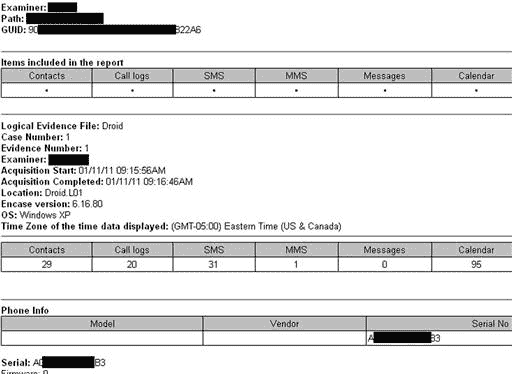

图 6.38 中微子报告导出为 HTML。

#### 微观系统学

供应商提供了 XRY 的以下概述:

XRY 是位于斯德哥尔摩的 Micro systemion(MSAB)开发的专用移动设备取证工具。

XRY 自 2002 年以来一直可用，“XRY Complete”是一个包含软件和硬件的包，允许对移动设备进行逻辑和物理分析。该产品装在一个方便的便携箱中，带有定制的内饰和所有必要的硬件，如下所示:

XRY 取证包软件许可密钥

用于 USB、蓝牙和红外连接的通信集线器

模拟识别克隆装置

一包 SIM 卡克隆卡

写保护通用存储卡读卡器

用于逻辑和物理采集的全套电缆

XACT 十六进制查看器软件应用

向第三方分发的 XRY 阅读器工具

XRY 是在法医调查人员的参与下设计和改进的，一个向导会指导您完成整个过程以协助检查。新的统一逻辑/物理提取向导和生成的报告有助于以整洁、干净和专业的方式向检查人员展示设备的全部内容。

XRY 的独特功能之一是《设备手册》，其中包含每种设备可用支持的完整详细列表；确定哪些数据可以检索，哪些不能检索，这有时与调查人员同样相关。

所有提取，无论是逻辑的还是物理的，都保存在一个 XRY 文件中，该文件仍然保留着，用于取证安全目的。从 XRY 文件中，您可以根据需要在 Word、Excel、Open Office 或 PDF 中创建报告。您可以包含案例数据和参考资料，选择报告中包含或不包含哪些数据，然后将其分发给参与调查的其他方；律师、检察官或其他调查人员。MSAB 提供了一个免费的 XRY 阅读器，您可以将它提供给第三方，让他们在报告上做笔记，同时仍然保持数据的原始取证完整性。

包中有 XACT 十六进制查看器应用程序，用于对恢复的原始数据进行更详细的检查，并协助搜索和手动解码，以补充 XRY Physical 中可用的自动解码。

XRY 法医包的 5.1 版本于 2010 年 6 月 28 日发布，对苹果 iPad 提供了额外的支持。

##### 装置

XRY 是一个 Windows 应用程序，您可以从供应商提供的单一安装程序安装。安装包括安装向导，在线检查软件更新，大约需要 15 分钟。软件需要使用硬件加密狗才能运行。

##### 获得物ˌ获得

安装完成后，运行软件，选择提取数据，然后选择从电话中提取数据。之后，您必须识别设备类型，这可以通过几种方式来完成。在本例中，通过选择名称搜索，搜索 Droid，选择摩托罗拉 Droid A855，然后选择下一步来执行搜索。这在[图 6.39](#F0200) 中有说明。

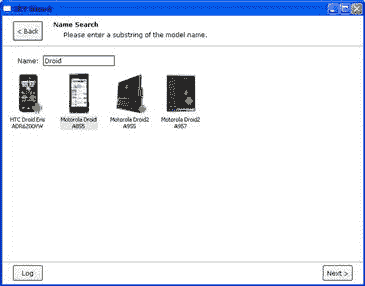

图 6.39 XRY—搜索设备类型。

虽然 MSAB 取证套件支持一些设备的物理提取，但只有逻辑提取可用于安卓。选择逻辑采集后，软件显示可供提取的数据，如图[图 6.40](#F0205) 。

图 6.40 可用于 Droid 提取的 XRY 数据类型。

选择下一步，然后选择通过电缆和完整读取提取数据的选项，最后单击下一步开始数据提取。提取完成后，你会看到[图 6.41](#F0210) 所示的提取完成画面。

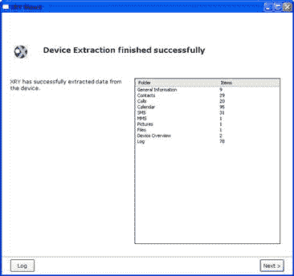

图 6.41 XRY 提取完成。

##### 数据呈现和分析

提取后，应用程序在应用程序中显示数据，并且易于导航。联系人列表不仅包括联系人的详细信息，还包括联系人的存储位置，如图 6.42所示。

图 6.42 XRY 联系人列表。

通话记录提供了通话类型(已拨或已接)、姓名、号码、时间、时长和存储位置，如图[图 6.43](#F0220) 。

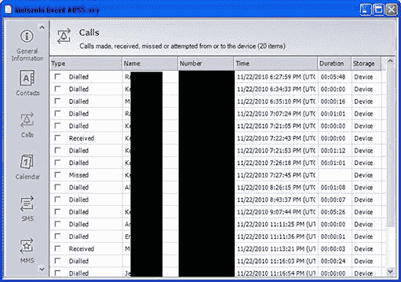

图 6.43 XRY 呼叫日志。

[图 6.44](#F0225) 显示短信包括号码、姓名、消息、时间、状态、存储、索引以及所在的文件夹。

图 6.44 XRY 短信。

[图 6.45](#F0230) 显示，从设备中提取的唯一图像来自彩信。

图 6.45 XRY 图像。

提取了其他数据。但是，它不会显示在专用的报告部分。例如，您可以在报告的日志部分查看网络浏览器历史记录、网站书签和谷歌搜索历史记录。

MSAB 还有一个名为 XACT 的工具，它提供了特定条目的十六进制视图。例如[图 6.46](#F0235) 显示了一条短信的内容。

图 6.46 XACT—短信。

#### 对羟基苯甲酸酯装置癫痫发作

供应商提供了以下设备扣押概述:

Paraben 的设备扣押(DS)是一种手持取证工具，使调查人员能够在大约 2400 种型号的手机、掌上电脑/智能手机和便携式全球定位系统设备上执行逻辑和物理数据采集、删除数据恢复和完整数据转储。从大约三分之二的受支持模型中获取物理数据是可能的，通常是在发现删除数据的地方。此外，DS 已被记录并验证为 100%合法声音，这意味着数字证据从未以任何方式被更改。这些功能都可以通过与任何电脑的标准 USB 数据线连接来实现。

过去两年，谷歌用于移动设备的安卓操作系统对行业产生了重大影响。Paraben 专注于与最新创新保持同步，并为 DS 增加了对安卓操作系统的支持。随着 4.0 版本的发布，调查人员能够获取最受欢迎的数据，如通话记录、地址簿和短信。除了这些数据类型，DS 还将获取多媒体文件——彩信、图像、视频和音频文件。可以从安卓机型获取的数据类型完整列表如下:

通讯录，包括联系人组、组织和通讯录设置，以及标准姓名、电话号码和地址

短信

彩信

通话历史

联系方式

浏览器历史

外部图像媒体(元数据)

外部图像缩略图媒体(元数据)

外部媒体、音频和其他数据(元数据)

外部视频(元数据)

已安装的所有应用程序及其版本列表

##### 装置

在 Windows 取证工作站上安装了 paraben DS 4 . 1 . 3971 . 37683 版本。安装过程需要安装许多必需的驱动程序，这需要相当长的时间。软件必须在使用前注册，这可以通过硬件加密狗或 Paraben 提供的注册密钥文件来实现。要安装注册密钥文件，您只需将该文件复制到 DS 安装目录中，该目录可能是 C:\ Program Files \ Paraben Corporation \ Device capture。

##### 获得物ˌ获得

要开始购买新的安卓设备，您首先要打开一个新的案例，并完成所需的案例信息部分。然后选择“数据采集”并选择安卓，此时将提供以下方向:

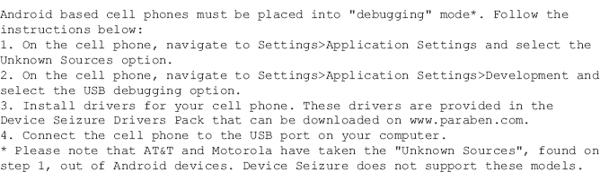

根据这些说明，不支持摩托罗拉手机。然而，收购摩托罗拉 Droid 是成功的。

按照说明操作，然后单击“下一步”，此时 DS 会尝试识别电话。确保识别的设备信息准确无误，点击【下一步】如图[图 6.47](#F0240) 。

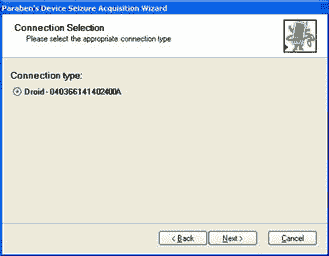

图 6.47 设备扣押设备识别。

下一个屏幕提供了 DS 可以从设备中提取的受支持数据类型的列表。全部被选中，这包括获取它可以读取的文件系统部分和 SD 卡，因此获取过程很慢。[图 6.48](#F0245) 为 DS 采集时序。

图 6.48 设备捕获采集时间。

大约两个小时后，收购完成，分拣文件的提示被接受。整理文件的过程花费了相当多的时间，但是不到两个小时。此时，收购过程已经完成。[图 6.49](#F0250) 显示 DS 采集完成输出。

图 6.49 设备捕获采集完成。

##### 数据呈现和分析

设备捕获以易于浏览和导航的结构显示应用程序获取的数据。获取的目录结构见[图 6.50](#F0255) 。

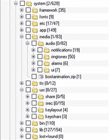

图 6.50 设备捕获机器人目录结构。

联系人不仅提供姓名、备注、电话号码和电子邮件，还提供有用的字段，如联系次数、上次联系时间和照片(如果有)，如图[图 6.51](#F0260) 。

图 6.51 设备卡滞触点。

短信报告提供了预期字段，但删除的消息不包括在内。报告没有将联系数据与电话号码进行对照，所以考官要么知道电话号码，要么自己处理对照。[图 6.52](#F0265) 显示 DS 短信。

图 6.52 设备扣押短信。

但是，呼叫日志确实会执行交叉引用，并显示日期、消息类型、持续时间、号码、号码类型、名称，或者呼叫是否是新呼叫(可能是该号码第一次出现在呼叫日志中)。[图 6.53](#F0270) 显示通话记录。

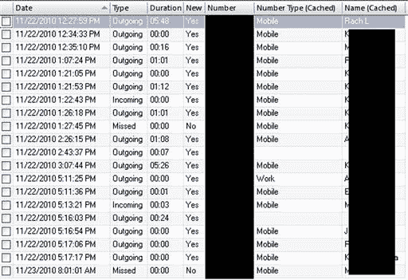

图 6.53 设备扣押呼叫日志。

一个完整的网络历史是可用的和分析的，包括访问计数和书签。但是数据视图比较长，在[图 6.54](#F0275) 中只显示了开始信息。

图 6.54 设备扣押网络历史记录。

设备扣押允许检查人员选择任何文件，并将其提取到法医工作站进行额外分析。这有助于查看或分析 DS 环境中不支持的文件类型。由于文件排序选项是在采集阶段选择的，因此每个提取的文件都被识别并按类型分组，以便快速访问感兴趣的文件。这在[图 6.55](#F0280) 中显示。

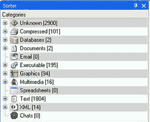

图 6.55 设备扣押的文件分类器。

#### via 取证' ViaExtract

供应商提供了以下 viaExtract 概述:

viaExtract 是该领域的领导者和创新者 viaForensics 提供的最新安卓取证解决方案。除了他们的移动取证白皮书和书籍之外，ViaFaceBook 还为执法和政府机构提供了一个免费的安卓取证解决方案，名为 AFLogical。

在这一经验的基础上，viaForensics 开发了 viaExtract，它可以提取、分析和报告安卓设备中的数据。viaExtract 是一个模块化的解决方案，接下来将提供一种基于 viaForensics 研发的 Android 取证物理技术。viaExtract 的最新信息可在[http://viaforensics.com/products/viaextract/](http://viaforensics.com/products/viaextract/)在线获得，包括对安卓取证物理技术的支持、额外支持的移动平台和高级取证恢复技术。

viaForensics 是一家取证和安全公司，积极调查移动设备和传统计算机。他们作为审查员的直接经验导致了专门为法医审查员定制的工具的开发。该工具旨在随着移动取证学科的快速变化而频繁更新。集成到 viaExtract 中的独特调试和报告系统简化了向 via 取证发送调试和清理数据的过程，以帮助设计和改进在多样化安卓生态系统上运行的 viaExtract。

##### 装置

viaExtract 软件作为虚拟机分发，因此它运行在微软视窗、苹果 OS X、Linux 或其他运行支持的虚拟化软件的操作系统上。软件已完全配置，必要的驱动程序和支持库也已配置，这大大简化了安装。支持的虚拟化包有几个，都是免费的，包括:

Oracle virtual box

VMWare 播放器

也有许多商业套餐可供选择。虚拟机从 ViaFaceBook 的网站下载，然后导入到支持的软件中。审查员可以使用虚拟化软件内置的功能，例如在每次案例后拍摄快照以将软件恢复到原始状态，或者通过共享数据存储和其他有价值的功能将其直接集成到主机操作系统中。

##### 获得物ˌ获得

viaExtract 导入主机系统的虚拟化软件并运行后，法医登录 Ubuntu 虚拟机，运行 viaExtract，如图[图 6.56](#F0285) 。

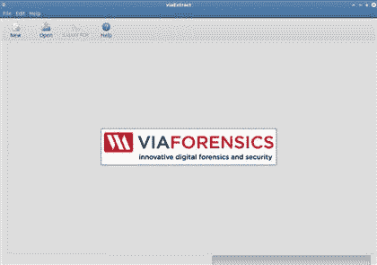

图 6.56 通过提取软件。

然后审查员可以开始一个新的案例或打开一个先前的案例，如图 6.57[所示。](#F0290)

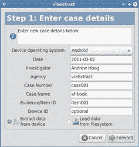

图 6.57 通过摘录—新案例。

输入案例详细信息后，审查员可以选择直接从安卓设备中提取数据，或者从文件系统中先前的数据提取中加载数据。后一项功能对于考官使用 viaForensics 的免费生态软件从安卓设备中提取数据的情况非常有用。它还允许检查人员根据以前设备提取的数据生成新的取证报告，这在添加新的报告功能时非常有用。

在这个例子中，我们将通过点击前进从安卓设备中提取数据。然后我们会看到加载数据屏幕，该屏幕提供了启用 USB 调试的说明。点击确定后，数据提取开始，如图[图 6.58](#F0295) 。

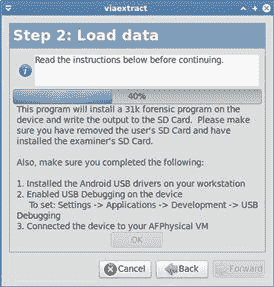

图 6.58 通过提取-数据提取。

数据提取完成后，向审查员呈现一个数据提取列表，并有能力选择他们想要包含在法医分析和报告中的内容，如图[图 6.59](#F0300) 。

图 6.59 视频摘要-法医分析和报告。

选择完成后，检查人员单击应用，执行报告逻辑并完成数据提取。

##### 数据呈现和分析

数据提取完成后，viaExtract 会将分析后的数据呈现给用户。通过导航应用程序左侧的选项，审查员可以查看报告的不同部分。例如，呈现的第一个部分是设备信息部分，如图[图 6.60](#F0305) 所示。

图 6.60 通过提取-设备信息。

接下来，[图 6.61](#F0310) 显示了报告中可用的浏览器历史和书签。

图 6.61 viaExtract—浏览器历史记录和书签。

在此示例中，您可以看到报告视图的几个功能，包括:

能够即时过滤报告的任何部分

能够对任何列进行升序或降序排序

在下一个示例中，对 29 条人员记录应用了[viaforensics.com](http://viaforensics.com)过滤器，剩余 2 条。然而，许多字段显示在截图的右侧，如图[图 6.62](#F0315) 所示。

图 6.62 通过提取-过滤的人员记录。

总的来说，viaExtract 目前仅支持 41 家内容提供商。然而，在下一个版本中，大约有 100 个内容提供商将被主动查询。如果设备响应内容提供商，提取和后续报告将会成功。[图 6.63](#F0320) 是通话记录的一个例子。

图 6.63 通过提取-呼叫日志。

[图 6.64](#F0325) 展示视频媒体元数据。

图 6.64 视频提取—视频媒体元数据。

报表也可以导出为 PDF 格式，如图[图 6.65](#F0330) 。

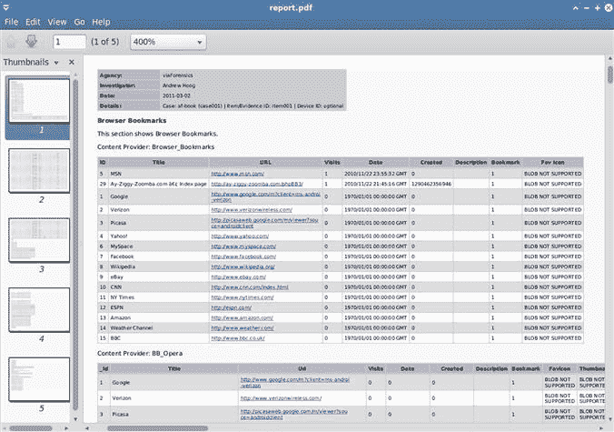

图 6.65 通过摘录-导出为 PDF。

## 物理技术

获取目标数据存储的物理图像的取证技术通常会导致恢复成指数级增长的数据，并且通常会绕过密码保护。这些技术不仅提供对已删除数据的访问，还提供对由于系统不再需要而被简单丢弃的数据的访问。例如，一些系统跟踪网站上次被访问的时间，并且每次再次访问该网站时日期字段都被更新。以前的日期和时间数据没有被明确删除，但系统没有跟踪。在使用 YAFFS2 的安卓设备上，如果没有发生垃圾收集，以前的值是可恢复的。因此，物理技术不仅提供对已删除数据的访问，还提供对系统上过时数据的访问。

安卓取证物理技术分为两大类:

硬件:将硬件连接到设备或物理提取设备组件的方法

软件:作为软件在具有根访问权限的设备上运行并提供数据分区的完整物理映像的技术

基于硬件的方法需要专门且通常昂贵的设备和培训，但在无法实现根访问的设备上可能非常有效。基于软件的物理技术是更直接的获取途径，通常是最佳的起点。当然，在基于软件的技术成为可能之前，您必须在设备上拥有根访问权限。

### 基于硬件的物理技术

两种基于硬件的物理技术是 JTAG 技术和片外技术，本节提供了简要概述。

### JTAG

JTAG 公司创建于 20 世纪 80 年代，旨在开发一种测试印刷电路板布线和互连的标准。到 1990 年，该标准完成并成为电气和电子工程师协会的标准，具体来说是 IEEE 1149.1-1990 ( [IEEE SA，n.d.](#BIB10) )，随后在 2001 年进行了更新，命名为 IEEE 1149.1-2001。该标准被广泛接受，如今大多数印刷电路板都有 JTAG 测试接入端口，便于访问中央处理器。

JTAG TAP 会暴露各种信号，大多数移动设备包括:

1.TDI—测试数据输入

2.TDO—测试数据输出

3.TCK—测试时钟

4.测试模式选择

5.

6.实时时钟—返回测试时钟

JTAG 的一个主要障碍是定位印刷电路板上的抽头，并跟踪它们到中央处理器，以确定哪个焊盘负责每个测试功能。即使芯片制造商已经发布了 CPU 图，这也很难实现。此外，从芯片上追踪 JTAG 函数可能非常困难，可能需要首先从印刷电路板上移除中央处理器。设备制造商有 JTAG 原理图，但它们通常被认为是公司机密，只发布给授权的服务中心。另一种方法是通过读取每个焊盘的电压并基于参考电压识别功能来确定每个焊盘的功能。在某些情况下，JTAG 引脚是由闪光盒制造商或各种在线团体发布的。[图 6.66](#F0335) 是 T-Mobile HTC G1 的 JTAG 引脚排列示例。六个引脚由白色小圆圈表示，右侧的图例提供了详细信息。

图 6.66T-移动 HTC G-1 印刷电路板。

在大多数情况下，你的焊接线通向印刷电路板上的焊盘，另一侧连接到一个特殊的设备(闪光器盒)，该设备将通过软件管理中央处理器。一些公司生产支持特定器件的定制连接器，并通过将印刷电路板放置在两个带有弹簧针的夹具板之间来简化与焊盘的连接。弹簧针与印刷电路板上的 JTAG 焊盘接触，然后可以轻松连接到闪光器盒。然而，有经验的工程师可能会发现，将引线直接焊接到印刷电路板上可以提供更稳定的连接。

一旦引线连接到适当的焊盘，就必须向电路板供电才能启动中央处理器。每个中央处理器制造商公布其硬件的参考电压，不得超过该电压。一些闪光器盒提供了管理电压的选项，但通常应通过内置数字电压表的外部电源来管理电源，以确保准确性。一旦电路板通电，闪光器盒软件就能够对 NAND 闪存执行完整的二进制内存转储。但是，连接是串行的，需要相当长的时间。尽管如此复杂，如果 JTAG 技术执行得当，手机可以重新组装，并正常运行，没有数据丢失。

尽管 JTAG 是从安卓设备的“与非”闪存中提取数据的一种选择，但这非常困难，只能由受过充分培训并在焊接小型印刷电路板连接方面有特定经验的合格人员尝试。焊接到 JTAG 焊盘或在电路板上施加错误电压的错误不仅会禁用 JTAG，还会严重损坏器件。出于这些原因，JTAG 通常不是安卓设备物理取证图像的首选。

### 削去

芯片脱离是一种将 NAND 闪存芯片从器件上物理移除并进行外部检查的技术。片外技术允许恢复损坏的设备，也绕过了密码保护的设备。这种移除过程通常是破坏性的——很难将 NAND 闪存重新连接到 PCB 并使设备运行。

芯片脱离技术有三个主要步骤:

1.NAND 闪存芯片通过去焊接或使用特殊设备从设备中物理移除，该设备使用热风和真空来移除芯片。还有将芯片加热到特定温度的技术。在这个过程中很容易损坏 NAND 闪存，并且存在专门的硬件，甚至控制软件来进行提取。

2.拆卸过程中经常会损坏芯片底部的连接器，所以必须先清洗再维修。修复芯片底部的导电球的过程被称为重新抛光。

3.然后将芯片插入专门的硬件设备，以便读取。这些设备通常必须针对特定的 NAND 闪存芯片进行编程，并且已经支持许多更受欢迎的芯片。

此时，您现在有了存储在 NAND 闪存芯片上的数据的物理映像。

虽然芯片脱落过程相当有效，但它也有很大的进入壁垒。设备和工具的成本高得令人望而却步，考官必须再次拥有非常专业的培训和技能。“与非”闪存芯片总是存在因芯片脱落而损坏的风险，通常是在将其从印刷电路板上移除时。最后，有静电防护的洁净室也是理想的。虽然当地甚至州执法机构和法医公司可能会发现芯片剥离的成本太高，但这肯定是一种有效的技术，大型机构会发现在他们的法医技术套件中很有用。

### 基于软件的物理技术和特权

与基于硬件的技术相比，基于软件的物理技术具有许多优势。基于软件的技术:

更容易执行；

经常提供对文件系统的直接访问，以允许所有逻辑文件的完整拷贝(简化了一些分析)；

几乎没有损坏设备或数据丢失的风险。

要执行基于软件的物理技术，您必须首先获得 root 权限，然后运行采集程序。

不幸的是，默认情况下，安卓设备上的根权限没有启用。然而，在某些场景中获得根权限是可能的，接下来我们将介绍其中的几个场景。但是，要记住获得根权限有一些主要挑战:

1.获得 root 权限会在很多情况下改变设备。

2.根权限的技术不仅对每个制造商和设备不同，对每个版本的安卓系统，甚至对正在使用的 Linux 内核也不同。仅仅基于迄今为止开发的安卓设备和版本，就有成千上万种可能的排列。

3.许多用于获得 root 权限的漏洞利用都是在线讨论的，并且往往包含不准确的信息。

考虑到这一点，获得根权限可能相当困难，并且总是非常令人沮丧。

根权限有三种主要类型:

1.根攻击获得的临时根权限，无法在重启后存活。在此实例中，adb 守护程序通常不作为根运行。

2.通过自定义只读存储器或持久根利用获得完全根访问。自定义 ROMs 通常以 root 用户身份运行 adb 守护程序，而大多数持久的 root 用户身份不会运行。

3.通过刷新自定义恢复分区或自定义只读存储器的一部分获得恢复模式根。自定义 ROMs 通常以 root 身份运行 adb 守护程序，大多数修改后的恢复分区也是如此。

想要根访问的安卓爱好者通常只对完整的、持续的根权限感兴趣。但是，从取证的角度来看，临时根权限或通过自定义恢复模式的根访问是首选。

如果您需要在新设备或安卓版本上获得访问权限，您必须有一个单独的设备用于测试，以确保该过程正常工作，并且没有数据丢失。测试虽然耗时，但在这种情况下是重要的一步。

以下部分详细介绍了每个步骤。

#### 快点，快点

法医应该检查的第一件事是设备是否已经拥有 root 权限。这是所讨论的任何技术中最简单的一种，当然值得花很短的时间进行测试。设备必须启用 USB 调试，但即使设备被锁定，您仍应检查。如果设备未通过代码锁定，请确保 USB 调试已启用，这在[第 3 章](3.html)中有介绍。

接下来，将设备连接到您的工作站，并尝试通过使用“su”命令请求超级用户访问来获得 root 权限，如下所示:

在这种情况下，没有授予根权限。这是命令的典型结果。但是，以下内容位于具有根访问权限的设备上:

没有收到权限被拒绝的错误，而是授予了 root 权限。这由新的#提示符指示。有时设备会允许根用户访问，但需要用户通过在设备上显示的提示中单击“确定”来授予权限。如果设备没有密码保护，您应该检查是否显示提示。

#### 研究根特权利用

如果设备还没有根权限，您可以在线研究可能的技术。这个过程可能非常令人沮丧，因为有许多没有经验的人在各种讨论板上请求帮助。然而，尽管有大量不准确的信息，但也有非常有知识的资源和技术是有效的。

虽然有很多网站讨论安卓根漏洞，但有一个网站确实高于所有其他网站。xda-developers 网站是一个非常受欢迎和活跃的网站，自称是“安卓和视窗移动平台最大的智能手机爱好者和开发者互联网社区”([安卓&视窗手机，纽约市](#BIB2))。许多其他网站发布了各种各样的根漏洞利用，但通常链接回 xda 开发人员的讨论线程。

通常，研究根漏洞的最佳方法是简单地使用您喜欢的搜索引擎搜索互联网，拥有测试设备和大量耐心。

#### 恢复模式

恢复模式是安卓的一种操作模式，旨在应用更新、格式化设备以及对设备执行其他维护。大多数设备上的股票恢复模式非常基本，只提供了一些有限的功能，当然也不提供 shell 中的 root 权限。

另一方面，自定义恢复分区几乎总是允许通过 shell 获得 root 权限。这些新的恢复分区通常由用户在设备扎根时安装，并提供各种功能来简化定制 ROMS 所需的备份和更新过程。

与研究根漏洞一样，检查人员在安装自定义恢复分区时应格外小心，因为该过程通常包含内核和无线电更新，如果设备、内核和无线电固件之间不兼容，这些更新可能会导致设备不可用(通常称为“被阻塞”)。必须首先在实验室设备上进行大量测试，以确保不会出现问题。法医检查人员应该了解在安装自定义恢复固件的过程中，设备上正在修改什么。

启动恢复模式的软件存储在专用分区上，并且非常小。在许多设备上，您可以通过检查/proc/mtd 来查看恢复分区的详细信息:

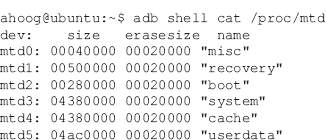

该列表来自 T-Mobile HTC G1，您可以看到恢复分区的大小为 0x500000 字节，即 5 MB (0x500000 = 5，242，880，然后除以 1024 两次，转换为 KB，最后转换为 MB)。以下是本书中使用的其他手机的尺寸:

T-Mobile HTC G1: 5 MB

宏达不可思议:4 MB

摩托罗拉 Droid: 4 MB

谷歌 Nexus One: 4 MB

这有助于理解，因为我们将在下一节探索替换小但重要的恢复分区的技术。

在前面介绍绕过密码保护设备的技术的部分，访问恢复模式是一种可能的解决方案。同样，建议检查恢复分区的根权限，因为这将启用基于软件的物理技术。首先，如[表 6.2](#T0015) 所述，将设备引导至恢复模式，或者简单地在互联网上搜索您设备的特定组合键。一旦设备处于恢复模式，将其连接到您的 Ubuntu 虚拟机，并按如下方式运行 adb:

在这种情况下，adb 发现了一个处于恢复模式的设备。然而，许多设备在恢复模式下根本不会启用 adb 访问，尤其是在库存设备上。在这种情况下，您可以如下确定 shell 是否具有 root 权限:

正如我们之前所讨论的，如果您看到一个#提示符，这表示有 root 权限。相反，如果您有$提示符，则您没有 root 权限。但是，您至少应该尝试通过运行 su 命令来获取它们。

#### 引导加载程序

如[第 2 章](2.html)所述，引导加载程序是一个在安卓引导过程早期执行的小程序，除了其他细节之外，它还负责选择和加载主内核。在某些设备上，存在特殊的软件，通常由制造商开发，可以与引导加载程序交互。该软件能够将新图像写入设备的 NAND 闪存。制造商使用该软件来修复无法正常工作的设备，也可能用于其他情况，如开发和测试。法医检查人员也可以使用该软件来刷新实用程序或利用设备的 NAND 闪存，这将提供根权限。但是，大多数设备的引导加载程序在出厂时处于锁定状态，这阻止了此类更新。

与摩托罗拉安卓设备交互的软件的一个例子是由摩托罗拉开发的一个名为 RSD Lite 的程序。RSD Lite 是专有软件，似乎只分发给摩托罗拉服务中心进行设备维修。假设任何使用该软件的人都有这样做的完全授权，此概述仅作为一些安卓设备如何闪烁的示例提供。

有许多网站讨论 RSD Lite 并提供使用该软件的指南。其中一个这样的网站，modmymobile.com，提供了一篇题为“[指南]用 RSD Lite 版本更新摩托罗拉的 Linux”的文章，其中提供了该软件的逐步说明([【指南】更新 Linux，北卡罗来纳州](#BIB8))。

如果设备受支持并且引导加载程序未锁定，您可以将设备连接到工作站，然后运行软件来检测手机。然后，您必须提供适当的。sbf 文件，然后点击【开始】对设备进行闪烁，如图[图 6.67](#F0340) 。

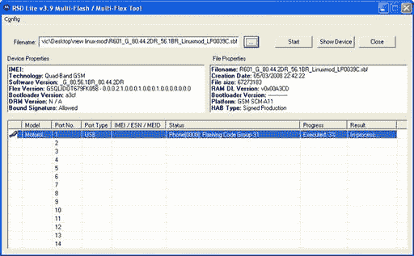

图 6.67 相对标准偏差精简版。

完成该过程并重新启动设备后，新的恢复分区(以及由。使用的 sbf 文件)已准备好。RSD Lite 可能为获得适当授权使用 RSD Lite 的法医分析师提供了一个很好的选择。

#### sbf _ 快闪记忆体

与摩托罗拉的 RSD Lite 类似的是一个名为 sbf_flash 的实用程序，它没有 RSD Lite 的许可证和使用限制。这个应用程序是由一个安卓发烧友开发并发布在网上的，虽然在网上很多地方都有发布，但最好从作者的博客 optical 妄想中检索，该博客会在有新版本时更新。该实用程序是在 Linux 上开发的，现在也在 OS X 上运行，因此，通过解锁的引导加载程序，大大简化了向 NAND 闪存的数据刷新。sbf_flash 的最新版本是 1.15，它支持以下功能:

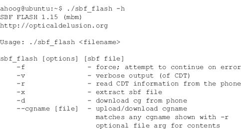

要使用 sbf_flash，您必须首先验证设备是否受支持。对于这个例子，我们将介绍摩托罗拉 Droid 但是，支持其他设备。设备必须处于引导加载程序模式，这是通过按住 D 板上的向上方向，同时按下电源按钮来实现的。在摩托罗拉 Droid 上，可以通过纯黑屏幕轻松识别引导加载程序，内核版本、USB 状态和电池状态以白色文本显示。在尝试此过程之前，请确保电池已充满电，因为如果闪烁过程因电源故障而中断，您很容易损坏设备。此外，您必须将 SBF 文件保存到您的取证工作站，以便将其闪存到设备中。这是在操作目标设备之前必须进行大量测试的地方，以确保兼容性和对过程的详细了解。

在 Droid 处于引导加载程序模式时，我们可以用 sbf_flash 查询设备，如下所示:

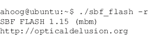

sbf_flash 实用程序在引导加载程序模式下查找设备，并立即将图像文件刷新到 NAND 闪存。更新过程的状态显示在屏幕上，然后机器人重新启动。

您应该准备好立即将设备引导到恢复模式，因为摩托罗拉 Droid 固件的较新版本实现了一个例程，该例程根据该 Android 版本的股票恢复分区检查现有恢复分区的哈希签名。如果存在差异，系统将在引导过程中重建库存恢复分区，从而覆盖修改后的恢复映像。

一旦新的 SBF 文件被刷新，并且设备在修改后的恢复模式下运行，您将拥有根访问权限，并且可以继续使用基于软件的物理技术。

#### 快速启动

快速启动是另一个通过通用串行总线将图像闪存到 NAND 闪存的实用程序。fastboot 的源代码包含在 AOSP 中，因此，当您编译 AOSP 代码时，该实用程序就会构建出来。与 sbf_flash 一样，引导加载程序必须支持 fastboot，这不仅需要兼容的引导加载程序，还需要安全关闭(S-OFF)的引导加载程序。

Fastboot 最早用于由 HTC 制造的谷歌安卓开发者手机(ADP)。因此，快速启动的许多文档和参考资料都引用了 ADP，HTC 有一个实用程序的有用参考页面([HTC-开发者中心，北卡罗来纳州](#BIB9))。此页面不仅包含 ADP 设备的各种库存 NAND 闪存映像文件，还包含在设备上使用快速启动和访问适当模式的说明([HTC-开发者中心，北卡罗来纳州](#BIB9)):

要进入快速启动模式，请在按住 BACK 键的同时打开设备电源(或重新启动设备)。按住 BACK 键，直到引导加载程序屏幕可见并显示“FASTBOOT”设备现在处于快速启动模式，准备接收快速启动命令。如果此时想退出快速启动模式，可以按住 MENU+SEND+END 键(在 ADP 上，SEND 是“Call”键，END 是“End call”键)。

请注意，引导加载程序屏幕可能因设备而异。对于 ADP 设备，引导加载器屏幕显示滑板机器人的图像。其他设备可能会显示不同的图像或颜色模式。在所有情况下，当处于快速启动模式时，启动加载程序屏幕显示文本“FASTBOOT”。引导加载程序还显示收音机版本。

进入快速启动模式后，使用以下命令验证快速启动是否检测到设备:

Fastboot 提供了许多选项，当您使用帮助参数执行 fastboot 时，这些选项会详细说明如下:

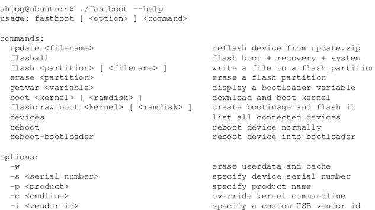

如您所见，一旦进入快速启动模式，刷新修改后的恢复分区就非常简单:

此过程完成后，您可以重新启动手机进入恢复模式，并继续使用基于软件的物理成像技术。

### 物理技术

AFPhysical 技术是由 viaForensics 开发的，用于提供 Android NAND 闪存分区的物理磁盘映像。这项技术需要设备的根权限，并且应该支持任何安卓设备。然而，这项技术并不是一个简单的过程，法医分析人员必须将这项技术应用于所研究的特定设备。这是安卓设备差异很大的直接结果，不仅是制造商之间的差异，也是运行不同版本安卓的设备之间的差异。

AFPhysical 的整个过程非常简单:

1.获取目标安卓设备上的 root 权限。

2.识别需要映像的 NAND 闪存分区。

3.将取证二进制文件上传到目标安卓设备。

4.获取 NAND 闪存分区的物理映像。

5.删除非易失性存储器中存储的取证二进制文件(如果有)。

无论使用何种技术，都假设您在设备上拥有 root 权限。在这个例子中，我们将使用摩托罗拉 Droid。由于我们能够将修改后的恢复分区闪存到摩托罗拉 Droid 中，即使设备被密码锁定，这项技术也能在设备上工作。

在我们刷新了修改后的恢复分区并重新启动到恢复模式后，将设备连接到我们的 Ubuntu 虚拟机，并通过运行 adb 设备来验证 adb 可以找到该设备。

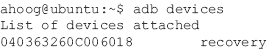

从那里，访问 shell 以确保您拥有 root 权限:

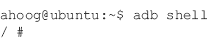

在这一点上，我们需要更多地了解手机，这样我们就可以决定需要对什么进行物理成像。首先要检查装载的文件系统(如果有):

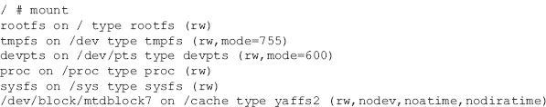

现在，我们知道该设备使用 MTD 和 YAFFS2 进行与非门闪存访问。为了确定 MTD 公开的分区，我们执行以下操作:

审查员应该选择对所有的 MTD 分区进行成像。然而，对于这个例子，我们将关注 mtd8，用户数据分区。

当我们现在准备获取设备时，如果一些术语或数据结构令人困惑，参考[第 4 章](4.html)中的 NAND 闪存和文件系统主题可能会有所帮助。一旦您有了具有根访问权限的设备，您可以使用四种安卓物理获取策略:

1.所有分区的完整非转储，包括数据和 OOB(首选)

2.分区的 dd 映像，只获取数据，不获取 OOB

3.使用 tar 逻辑获取文件

4.使用 adb 逻辑获取文件

此外，有两种主要方法可以保存从设备获取的数据:

1.使用 adb 端口转发，通过 USB 在 Ubuntu 工作站和安卓设备之间创建网络

2.将 SD 卡放入设备，安装，并保存在本地

这两种方法都有优点。使用 adb 端口转发，您不需要插入自己的设备，并且可以立即在工作站上创建文件。当你保存到 SD 卡时，获取速度会快得多。这两种方法都是有效的，将在这里进行演示。

我们将从用户数据分区的完整 nanddump 开始，因为这提供了最完整的数据取证副本。要实现 nanddump，必须有一个为 ARM 平台编译的 nanddump 版本。交叉编译 nanddump 超出了本书的范围。但是，您可以在互联网上搜索该程序，也可以按照在线发布的说明进行操作。

小费

### ARM 的交叉编译

交叉编译源代码以在 ARM 平台上运行可能相当困难，并且在线支持很少。一个可能的解决方案是使用安卓的本地开发工具包(NDK)来构建兼容的二进制文件。另一种选择是使用 Linux，从[http://www . Code Sourcery . com/sgpp/Lite/ARM/portal/release 1039](http://www.codesourcery.com/sgpp/lite/arm/portal/release1039)为 ARM GNU/Linux 安装一个如 codesourcery 的 G++ Lite 2009q3-67 这样的交叉编译器。一旦安装了交叉编译器，就必须修改源代码的 Makefile 来指示交叉编译选项。也可以在[的网站上查看这本书，获取未来的更新。](http://viaforensics.com/education/android-forensics-mobile-security-book/)

为了避免将任何数据写入 NAND 闪存，我们可以再次检查 mount 命令的输出，并注意“/dev”目录是 tmpfs，因此存储在 RAM 中。因此，我们可以将取证实用程序推送到“/dev”:

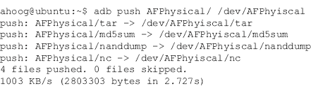

接下来，我们需要使程序在设备上可执行。为了实现这一点，我们使用 chmod 命令，该命令更改文件的权限，包括执行标志。我们将设置所有文件以允许任何用户读取或执行程序:

如您所知，在我们对程序执行“chmod 755”命令后，它们都设置了 execute 位，该位由文件权限中的“x”表示。

如果您决定将非转储文件保存到 SD 卡，请确保您将格式正确的 SD 卡放在设备中，并且将其安装在系统上。然后我们可以如下执行 NAND dump:

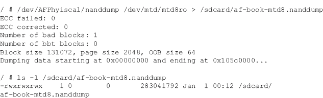

最终要么使用 adb pull 传输到您的 Ubuntu 虚拟机，要么通过直接的 USB 连接移除 SD 卡并复制，这要快得多。

注意

### MD5 哈希值

尽管在获取期间用户数据分区没有安装在设备上，但即使没有任何写入操作，/dev/mtd/mtd8ro”的 md5sum 哈希签名也会发生变化。这是由于 NAND 闪存的性质，其中操作系统和存储器处于磨损均衡、坏块管理和其他机制的几乎恒定的变化状态，尽管用户数据没有变化，这些变化还是发生了。最好的方法是对生成的 NAND 闪存文件执行 MD5 求和，以确保从那时起的完整性。

保存 NAND 闪存文件或任何其他映像数据的第二种方法是使用 netcat，这是一个允许您将命令输出重定向到网络的实用程序。对于这种方法，您将需要两个活动的终端或 ssh 会话。我们将它们称为会话 0 和会话 1。所有 Session0 命令都将在 Ubuntu 虚拟机上运行，因此我们不会从 Session0 进入安卓设备外壳。需要在安卓设备外壳内执行的命令都将在会话 1 中执行。

首先，我们首先使用 adb 端口转发功能启用两个端点之间的网络连接:

这个命令本质上是连接安卓设备上的端口 31337 和 Ubuntu 虚拟机。接下来，我们在安卓设备上执行 nanddump，并将输出传输到 netcat:

现在安卓设备正在通过 netcat 发送 nanddump 数据，我们需要在 Ubuntu 虚拟机端接收它:

当 nanddump 完成时，它只是退出，没有任何额外的输出，就像 Ubuntu 虚拟机上的 netcat 一样。我们可以验证工作站上收到的 nanddump 具有 ls:

此时，您可以继续对调查所需的 MTD 分区进行物理映像，其中至少应包括用户数据和缓存分区。

在[第 7 章](7.html)中，我们提供了一个程序，该程序允许您从一个 nanddump 中提取 OOB 数据，以帮助取证处理，如文件雕刻。由于您可以通过这种方式生成 dd 图像，因此无需使用安卓设备获取 dd 图像。但是，dd 内置于 Android 中，因此我们提供的这个示例类似于 nanddump 示例的使用，只是它使用了 dd 实用程序，因此不捕获 OOB 数据。这个例子使用了参考 HTC 不可思议。

由于安卓设备、MTD、YAFFS2 和其他有害因素的变化，并不总是能够装载获取的 nanddump 映像并提取逻辑文件。由于您已经拥有足够的权限，因此最好提取所需的逻辑数据。这可以使用递归 adb pull 来完成，因为运行在设备上的 adb 守护程序具有 root 权限。您还可以使用 tar 之类的实用程序将数据复制到一个归档文件中。在任一情况下，您都必须确保装载了所需的文件系统。一些修改后的恢复分区为装载文件系统提供了用户界面。但是，您也可以在命令行上这样做，并将文件系统装载为只读。在上面提到的摩托罗拉 Droid 上，执行以下操作:

第一个命令将“/data”分区装载为只读。第二个命令获取已经装载的“/cache”目录，并以只读方式重新装载。您现在可以执行 adb 拉动:

最后一种选择是使用 tar 实用程序，将文件和目录放在一个通常称为 tarball 的归档文件中。

在这个例子中，我们向 tar 传递了两个我们想要存档的目录:包含“/data/data”中的 SMS/MMS 消息的目录和“/cache”目录。我们通过网络发送档案，并在 Ubuntu 虚拟机上接收。但是，您也可以简单地将档案保存到 SD 卡中。

一旦你在安卓设备上有了 root 权限，并且对设备的架构有了足够的了解，你就可以使用 nanddump、dd、tar、netcat 和 adb 来创建取证图像或者简单地复制数据进行分析。

## 摘要

有几种技术可以用来对安卓设备进行取证。如果设备受密码保护，您必须绕过或绕过保护才能提取数据。虽然存在许多绕过密码的技术，但不可能在所有情况下都实现这一点。一旦设备可访问，法医分析师可以选择逻辑采集，主要集中在通过内容提供商可访问的未删除数据，或者更彻底但技术上具有挑战性的物理采集。虽然物理采集会产生更多数据，但通常需要更复杂的分析技术，这将在[第 7 章](7.html)中介绍。

## 参考

1. *ACPO 基于计算机的电子证据良好实践指南*—*7 安全信息安全。*(未注明)。检索时间 2011 年 2 月 19 日，[http://7safe.com/electronic_evidence/index.html#](http://7safe.com/electronic_evidence/index.html%23)。

2.*安卓& Windows Phone:平板、应用、&rom @ xda-开发者。*(未注明日期)。检索时间 2011 年 2 月 23 日，[http://www.xda-developers.com/](http://www.xda-developers.com/)。

3.特拉维夫、吉布森、莫索普、布雷泽和史密斯。(未注明日期)。智能手机触摸屏上的污点攻击。检索时间:2011 年 2 月 21 日，来自[http://www . usenix . org/events/woot 10/tech/full _ papers/Aviv . pdf](http://www.usenix.org/events/woot10/tech/full_papers/Aviv.pdf)。

4.Cannon(未注明日期)。安卓锁屏旁路。检索时间:2011 年 2 月 21 日，来自[http://thomascannon . net/blog/2011/02/Android-lock-screen-bypass/](http://thomascannon.net/blog/2011/02/android-lock-screen-bypass/)。

5.dc3dd。(未注明日期)。检索时间 2011 年 2 月 22 日，[http://dc3dd.sourceforge.net/](http://dc3dd.sourceforge.net/)。

6.*政府就业&工资单。*(未注明日期)。检索时间 2011 年 2 月 19 日，[http://www.census.gov/govs/apes/](http://www.census.gov/govs/apes/)。

7.[指南]用 RSD Lite 版本闪烁 Linux 摩托罗拉。(未注明日期)。检索时间 2011 年 2 月 24 日，来自[modmymobile . com/forwards/8-指南-下载-论坛-建议/218651-指南-闪烁-Linux-motorolas-RSD-lite-versions . html](http://modmymobile.com/forums/8-guides-downloads-forum-suggestions/218651-guide-flashing-linux-motorolas-rsd-lite-versions.html)。

8.*HTC——开发者中心。*(未注明日期)。检索时间 2011 年 2 月 28 日，[http://developer.htc.com/adp.html](http://developer.htc.com/adp.html)。

9.*IEEE SA—1149.1–1990—IEEE 标准测试访问端口和边界扫描架构。*(未注明日期)。检索于 2011 年 2 月 23 日，[http://standards . IEEE . org/find STDs/standard/1149.1-1990 . html](http://standards.ieee.org/findstds/standard/1149.1-1990.html)。

10. *RerWare，LLC:安卓备份和黑莓备份——my Backup Pro*。(未注明日期)。检索时间 2011 年 2 月 22 日，[http://www.rerware.com/](http://www.rerware.com/)。