# 七、安卓应用与取证分析

### 本章中的信息

[分析技术](#S0015)

[FAT 法医分析](#S0050)

[雅夫斯 2 法医分析](#S0080)

[安卓应用分析及参考](#S0110)

## 介绍

到目前为止，这本书已经讨论了很多材质，不仅涵盖了安卓设备的历史和架构，还包括文件系统、保护设备安全的方法以及从设备获取数据的方法的完整细节。但是没有上下文和分析的数据只是噪音。传统取证调查中使用的许多技术适用于安卓取证分析。

## 分析技术

本节将概述分析技术，随后各节将演示特定文件系统的过程。

### 时间线分析

时间线分析应该是任何调查的关键组成部分，因为事件的时间安排几乎总是相关的。有很多方法可以建立法医时间表。然而，除非用专门的软件创建，否则这个过程可能相当繁琐。本章后面将详细介绍几种软件技术，包括来自侦探工具包和 log2timline 的免费开源取证实用程序。其他取证工具也可以创建时间表。

对于受支持的文件系统(例如，SD 卡和嵌入式多媒体卡[eMMC]上的 FAT16/FAT32 文件系统)，有许多工具可以创建时间线。但是，目前任何分析工具都不支持 YAFFS2，因此创建时间线需要大量的手动分析。

时间线信息的主要来源是文件系统元数据，包括修改的(文件元数据)、访问的、更改的(文件内容)和创建的。这种元数据通常被称为 MAC 时间或者有时被称为 MACB，其中“B”代表文件创建(诞生)的时间。文件系统跟踪不同的时间戳，并且具有在执行取证分析时必须考虑的细微差别。

例如，微软的 FAT 文件系统已经成为许多法庭调查和分析的主题。微软开发者网络(MSDN)提供了 FAT 和 NTFS 文件系统中文件时间的详细信息，指出:

并非所有文件系统都可以记录创建时间和上次访问时间，也并非所有文件系统都以相同的方式记录它们。例如，FAT 上创建时间的分辨率为 10 ms，而写入时间的分辨率为 2 s，访问时间的分辨率为 1 天，因此，它实际上是访问日期。NTFS 文件系统会在文件上次访问后将文件上次访问时间的更新延迟 1 小时。

([文件时间，未注明](#BIB1))

安德烈·罗斯在他的 dig for(DigitAl FaceBook)博客([http://digfor.blogspot.com/2008/10/time-and-timestamps.html](http://digfor.blogspot.com/2008/10/time-and-timestamps.html))上对此创建了一个有用的图形表示，如[图 7.1](#F0010) ( [新泽西州罗斯](#BIB10))所示。

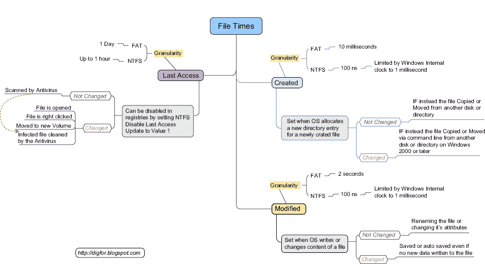

图 7.1 FAT 和 NTFS 时间和时间戳。

为了进一步说明 FAT 时间戳的工作原理，数字取证和事件响应公司 cmdLab 发布了一篇名为“文件系统时间戳的错误解释”( [Casey，e，n.d.](#BIB3) )的博客，其中提供了 FAT 时间戳的全部详细信息。

造成这种混乱的原因是，FAT 文件系统表示创建和最后写入时间戳的方式略有不同。最后写入时间戳是 32 位小端值，解释如下:

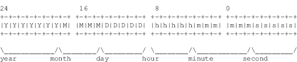

以最后写入日期用粗体突出显示的以下 FAT 文件夹条目为例:

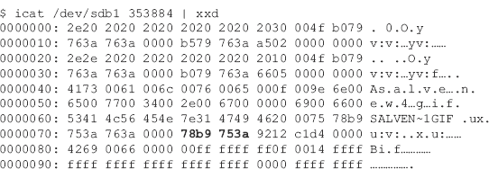

转换到大端给出 3a 75 b9 78，它有以下二进制表示:

00111010 01110101 10111001 01111000

这相当于时间戳 2009.03.21 23:11:48，如下所示:

自 1980 年以来，7 位= 0011101 = 29 年

4 位= 0011 = 3 个月

5 位= 10101 = 21 天

5 位= 10111 = 23 小时

6 位= 001011 = 11 分钟

5 位= 11000 = 24 = 48 秒

请注意，5 位不能存储所有 60 秒，因此最后写入时间戳必须以 2 秒为间隔递增，并且总是偶数秒。

虽然创建时间遵循类似的一般计算，但它使用额外的 8 位来表示百分之一秒。在上面列出的同一目录中，除了一个附加字节(75 78 b9 75 3a)之外，创建时间戳与上次修改的时间戳相同。额外的字节相当于百分之 117 秒，因此创建时间为 2009.03.21 23:11:49.17。因此，创建时间可以是奇数秒，分辨率为 10 ms。

本书中用于时间线分析的一个工具是侦探工具包(TSK)，它支持几个文件系统。TSK wiki 提供了在[表 7.1](#T0010) 中呈现的信息，以定义受支持文件系统的 MACB 时间戳的含义([开利，b，n.d.](#BIB2) )。

表 7.1 按文件系统划分的媒体访问控制含义

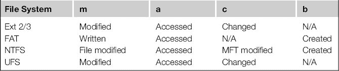

遗憾的是，从 3.2.1 版本开始，TSK 并不完全支持 YAFFS2。然而，有一些努力提供这一信息。对于安卓系统来说，TSK 在分析 FAT 文件系统以及一些设备上的 EXT3 方面是有效的。TSK 目前还不完全支持 EXT4，但软件更新频繁，考官应该查看网站[http://www.sleuthkit.org/](http://www.sleuthkit.org/)了解最新变化。

### 文件系统分析

正如本书所讨论的，安卓文件系统中的目录和文件显然是法医调查的主要焦点。本章和本书的最后一节“安卓应用分析和参考”将提供对安卓应用的详细分析。将这些信息与第 4 章中展示的技术相结合，将为调查提供最重要的结果。

有许多目录需要检查以进行调查。随着时间的推移，随着安卓设备的快速变化，审查员需要扩大名单，以包括新的目录和文件。解决此问题的最佳方法是首先运行以下命令来确定系统上装载了哪些文件系统，它们装载在什么位置，以及它们是什么类型。为了演示，让我们来看看四款不同的安卓手机，包括 T-Mobile/HTC G1、谷歌 Nexus One、摩托罗拉 droid 和 HTC Encry。

首先，让我们检查一下运行 Android 1.5 的 G1 上 mount 命令的输出:

这个特殊的 G1 运行的是普通固件，没有插入 SD 卡，所以我们剩下四个文件系统要检查，重点突出。

同样，我们检查了运行安卓 2.1-update1 的 Nexus One 上的挂载输出:

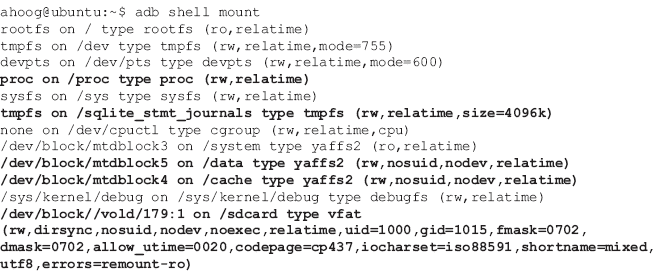

在这种情况下，Nexus One 上有五个文件系统，重点突出，这应该是检查的最初重点。附加文件系统是安装的 SD 卡。

接下来，我们来看看摩托罗拉 Droid 在运行 Android 2.2.1 时挂载的文件系统:

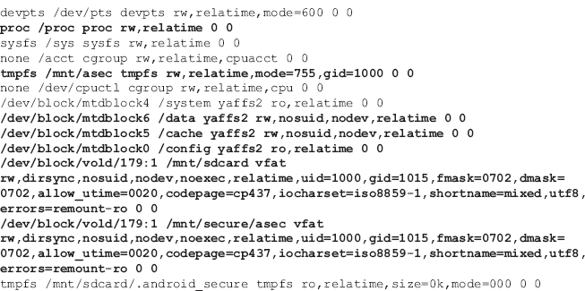

摩托罗拉机器人也有七个感兴趣的文件系统。然而，它们与 Nexus One 略有不同。

最后，让我们来看看之前讨论的运行 Android 2.2 的 HTC 不可思议的输出:

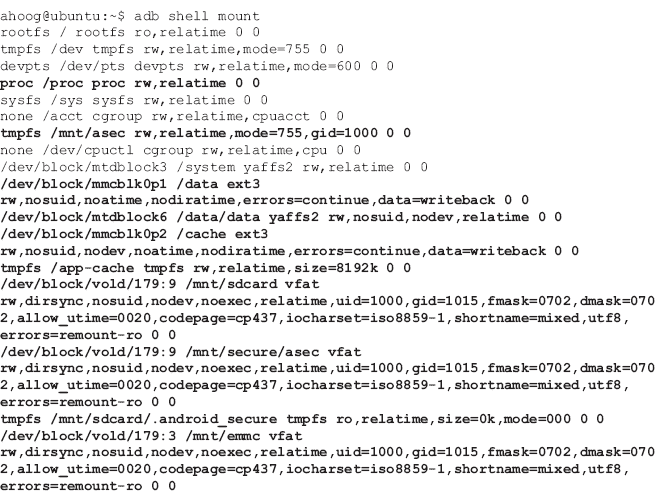

HTC 不可思议在感兴趣的九个文件系统中名列榜首。可以看出，随着安卓设备的不同，安卓版本的不同，感兴趣的文件系统也会发生变化。但是从上面的考试中，我们创建了[表 7.2](#T0015) ，为文件系统考试提供了一个很强的起点。

表 7.2 调查中包括的文件系统

| 挂载点 | 文件系统类型 | 关联 |
| --- | --- | --- |
| /proc | 过程 | 在电话里用“猫”命令进行检查。查找有关系统的相关元数据，如文件系统统计信息 |
| /data/data(在旧系统上，整个/data 是 1 个分区/文件系统) | YAFFS2 | 几乎所有应用数据 |
| /数据(在较新的手机上/数据可以进一步细分) | EXT3/EXT4/YAFFS2 | 应用程序和系统数据，不包括/data/data 中的应用程序数据存储 |
| /cache | 雅夫斯 2/EXT3 | 缓存某些应用程序和系统使用的文件系统 |
| /mnt/asec | tmpfs | 未加密的应用。apk 文件，加密存储在 SD 卡上，但在这里解密，以便运行系统访问和利用 |
| /app-cache | tmpfs | 临时文件系统，其中 com.android.browser(在 HTC 上)存储缓存。随着时间的推移，其他应用程序也可能会使用该目录 |
| /mnt/SD 卡 | 脱脂 | 可移动 SD 卡上的 FAT32 文件系统 |
| /mnt/emmc | 脱脂 | 嵌入式多媒体卡上的 FAT32 文件系统(eMMC) |

从积极的方面来说，当这些文件被分配时，即使对于不支持的文件系统，例如 YAFFS2，这些文件也可以被复制到另一个介质上，并使用审查员拥有并了解的现有取证工具和技术进行检查。例如，可以将“/data/data”的内容从安卓设备复制到您的取证工作站上，然后直接检查内容。

### 文件雕刻

文件雕刻是一个跨二进制数据搜索和提取指定文件类型的过程，通常会生成整个磁盘或分区的取证图像。文件雕刻的工作原理是检查二进制数据，并根据已知的文件头识别文件。如果文件格式有一个已知的页脚，它将从页眉开始扫描，直到找到页脚(或达到配置文件设置的最大文件长度)，然后将雕刻的文件保存到磁盘以供进一步检查。

传统的文件雕刻技术要求图像中的数据是连续的，如果是碎片化的，就不能产生完整的文件。由于将文件保存到非易失性存储的过程因文件系统类型而异，并且受到 NAND 闪存等内存类型的严重影响，因此文件碎片化的原因有很多。这也意味着非常大的文件(如视频)将更难恢复。

正在研究和开发更新的文件雕刻技术，以解决文件碎片带来的限制。其中一项技术由总部位于纽约的数字取证解决方案公司 Digital Assembly 开发。他们的技术被称为智能雕刻，描述了几种流行文件系统(不幸的是，除了 YAFFS2)的碎片特征，并使用这些信息雕刻甚至碎片化的照片。他们的产品“机敏照片取证”也可以从未知文件系统([数字装配，n.d.](#BIB5) )中雕刻图像。

用于雕刻数据文件的一个流行工具是手术刀，这是一个开源的、高性能的文件雕刻器，由 Golden G. Richard III ( [手术刀，n.d.](#BIB12) )编写。解剖刀读取所需文件页眉和页脚定义的配置文件，以便从原始图像中提取文件。它独立于文件系统，将在 FATx、NTFS、EXT2/3、HFS 或原始分区上工作。手术刀是用 C 语言编写的，运行在 Linux、Windows、OS X 等可以编译 C 代码的操作系统上([手术刀，n.d.](#BIB12) )。

获取手术刀有两种方法。首先，在取证工作站上，您可以通过 apt-get 安装:

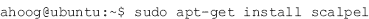

这将安装最新版本。或者，您可以从源代码编译，这将允许您在 Linux 或其他平台上安装最新版本，而无需等待特定平台维护者更新预打包版本。

手术刀可执行文件现在在“~/手术刀-1.60”中，简称手术刀。此外，在该目录中还有一个示例解剖刀. conf，解剖刀需要它来运行和扩展支持的文件定义。这是安卓设备的入门手术刀。

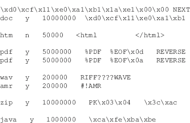

可以看出，这个配置文件的头定义了扩展名或文件类型(如果区分大小写)、要雕刻的最大大小、头定义(ASCII、十六进制和其他支持的符号)和页脚(如果存在)。雕刻的目标文件类型不需要定义每个设置。有关其他信息，请参见下载的源文件中的示例配置文件，因为有许多非常强大的附加选项。您的 Ubuntu 工作站现在有了文件雕刻所需的软件，这将在 FAT32 和 YAFFS2 部分介绍。

值得指出的是，已经组装了大量的文件签名。数字取证的独立顾问和实践者加里·凯斯勒(Gary Kessler)在其网站上积极维护一个文件签名表( [Kessler，g .，n.d.](#BIB9) )。他引用了 Ubuntu 工作站上位于“/usr/share/file/magic”的大多数 Unix 系统上的“magic file”。在工作站上，您可以运行“file”命令，该命令将一个文件作为参数，并尝试根据魔法文件中的签名来确定文件类型。

一个简单的例子是在“/mnt/emmc/”中查看一个未知文件。垃圾，叫做。_501”，这不能通过文件名轻易识别(当然，有些人可能会试图通过更改扩展名来隐藏文件类型；但是，通过检查文件签名，很容易发现这一点):

因此，eMMC 在垃圾桶里有一个 OS X 文件，这可能表明有人将安卓设备连接到了苹果电脑上。

### 用线串

默认情况下，Ubuntu 工作站上的 strings 命令将从任何文件、文本或二进制文件中提取 ASCII 可打印字符串(至少四个字符长)。虽然这种技术并不十分优雅或复杂，但它在快速检查二进制数据以确定文件中是否包含感兴趣的信息方面非常有效。

有几个选项对输出什么字符串有很大影响。首先，让我们看一下命令手册页(手册)的概要部分:

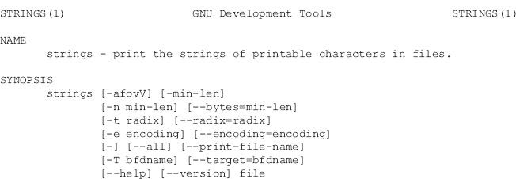

在执行字符串时，您应该始终考虑使用几个选项。首先，“—all”选项告诉字符串检查整个文件(在某些文件上，它只检查文件的某些部分)。其次，- radix= "选项指示字符串在找到字符串的文件中打印偏移量。当您组合字符串和十六进制编辑器来检查文件中可能存在的证据时，这非常有用。基数选项可以以八进制(-基数=o)、十六进制(-基数=x)或十进制(-基数=d)打印偏移量。对于大多数十六进制编辑器，您应该考虑十六进制或者十进制偏移量。

另一个极其重要的选项控制字符串的字符编码，它支持大端和小端格式的 Unicode 字符:

这很重要，因为安卓不仅本身支持 Unicode，而且还允许调查默认语言需要 Unicode 的手机。以下是前一个 dd 图像中的几个示例:

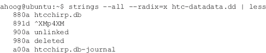

在这个例子中，第一行结果被省略了。但是，您可以看到 dd 映像在偏移量 0x880A 处引用 htcchirp.db，此后不久，我们看到未链接(0x900A)、已删除(0x980A)，最后是 htcchirp.db-journal (0xA00A)。那么这一切意味着什么呢？htcchirp.db 数据库似乎已被修改。在此期间，它创建了一个特殊文件(htcchirp.db-journal，一个日志文件)来管理更新，并允许在更新不成功时回滚更改。日志文件不再需要后，它被删除。这是了解发生了什么以及删除的数据可能存在于何处的重要信息(日志文件为正在更新的 SQLite 页面拍摄了完整的快照，因此以前的值存储在 NAND 闪存上)。

现在，让我们更改编码参数并查看以下内容:

在这个例子中，我们正在寻找 16 位大端字符。在这种情况下，从结果中提取了两个示例。在偏移量 0xC42404 处的一个示例中，很明显发生了某种与芝加哥相关的活动。审查员可以简单地打开一个十六进制编辑，跳转到偏移量 0xC42404，并查看这个条目周围的数据，试图理解活动。

同样有趣的是偏移量 0x1943020 处的下一个条目，该条目引用了[bearshare.com](http://bearshare.com)网站，并且具有似乎是时间戳的内容。如果我们将数字 1295219345 转换为基于 Unix Epoch 的日期/时间，我们将获得 2011 年 1 月 16 日星期日格林尼治时间 23:09:05。同样，审查员需要更仔细地检查数据，以验证任何发现，但一个很好的假设是，当时在安卓设备上发生了一些基于网络的活动。

最后一个例子(其他编码可以留给读者练习)揭示了以下内容:

这是一个很好的例子，因为它不仅包括一个(有效的)经度和纬度，还包括一个时间戳(以毫秒为单位，而不是秒为单位，自 1970 年以来)，转换为格林尼治标准时间:2010 年 10 月 30 日 20:20:18 格林尼治标准时间。

字符串是一个非常强大的命令，当它与搜索和过滤器结合使用时，可以快速确定电话号码、姓名、位置、全球定位系统坐标、日期和许多其他信息是否可以在数据文件中轻松提取。

### 妖术:法医分析师的好朋友

在许多法医调查中，逻辑采集或物理采集的逻辑文件系统分析将为案件提供足够的数据。但是，某些情况需要更深入的分析来查找已删除的数据或未知的文件结构。当文件系统在标准取证工具(如 YAFFS2)中很少或没有支持时，这也是必要的。

可以理解的是，许多法医分析师宁愿不进行更深入的分析，因为这需要大量的时间，极其繁琐，并且需要对数据结构有相当深刻的理解和好奇心。然而，这类分析的结果往往相当惊人。学习关于那个个案的重要信息，这些知识一般适用于未来的许多案例。

由于这些原因，如果需要的话，每一个法医分析师都应该使用十六进制编辑器。这使得分析人员能够准确地看到正在存储的数据，寻找模式，并可能识别已删除或以前理解的数据结构。

当然，让我们用一个例子来更好地解释这一点。首先，确保您在 Ubuntu 工作站上安装了以下软件包:

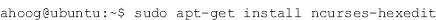

这是一个非常快的基于 curses(终端)的十六进制编辑器。当然，您可以使用任何合适的十六进制编辑器。接下来，让我们使用 strings 命令查看位于/data/data/com . Android . providers . telephone/databases 目录中的 mmssms.db 文件，看看是否能找到一些已删除的文本消息。在此示例中，已知发送至 3128781100 的短信已从设备中删除。首先，让我们使用字符串来查看我们是否在 SQLite 文件中找到了该电话号码:

在这个命令中，我们使用管道(“|”)操作符，它从一个命令中获取输出，并将其发送到下一个命令。通过这种方式，我们可以将许多命令链接在一起，并在运行中获得非常强大的分析技术。因此，上面的命令执行以下操作:

1.在 SQLite 数据库上运行 strings 命令。

2.获取 strings 命令的输出，并通过 grep 程序运行它，该程序过滤所提供的基于输出的模式。在这种情况下，我们提供有问题的电话号码。但是，您可以为 grep 创建非常强大的搜索字符串，包括正则表达式。

3.从 grep 命令中获取输出，通过将输出管道传输到字数统计程序(“wc”)并指示其按行而不是按字进行统计，查看返回了多少行。

结果是找到了该电话号码的 417 个条目；显然表明确实与该设备上的电话号码进行了通信。接下来，我们想仔细查看这些消息，因此，我们不要将输出管道传输到 wc 程序，而是直接查看结果，并通过向 grep 添加选项“-A 1”在电话号码后包含一行文本(此外，我们还将输出管道传输到“less”命令，以便一次显示一页):

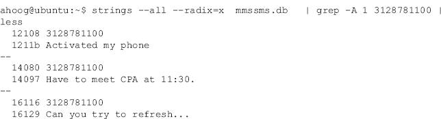

因此，我们知道我们有一个带有目标数量和消息的 SQLite 数据库。让我们使用 SQLite3 来更好地理解数据库。这里我们将使用命令行(在[第 4 章](4.html)中介绍)，但是如果您愿意，您可以使用带有图形前端的 SQLite 查看器。

小费

### SQLite 语言参考

虽然我们在本书中提到了几个 SQLite 工具，但是您可能会发现位于[http://www.sqlite.org/lang.html](http://www.sqlite.org/lang.html)的 SQLite 语言参考是一个很好的资源。对于不熟悉 SQL 的人来说，它提供了一个全面的概述。如果您已经对 SQL 有所了解，这份语言参考资料将有助于解释，正如页面标题所写的，“SQLite 所理解的 SQL。”

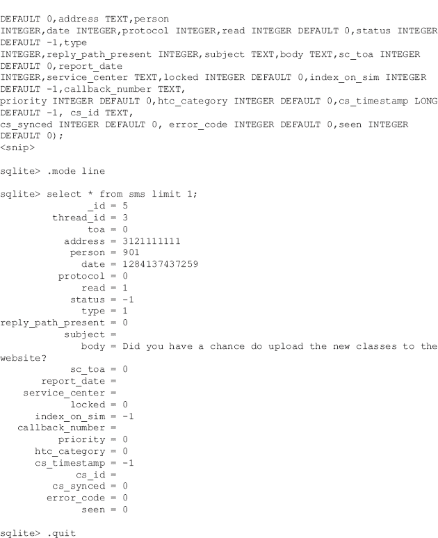

在上面的 SQLite3 会话中，运行了以下命令来更好地理解数据:

1\. SQLite3 mmssms.db:打开数据库进行查询。

2.。表:列出数据库中的表。

3.。模式短信:关注短信表，向数据库询问表的结构(模式)。该模式很长，已被截断。

4.。模式线:将显示模式设置为线，以便于查看。

5.“从短信限制 1 中选择*:指示 SQLite3 从显示所有列的 sms 表中向屏幕显示一条记录(限制为一条)。

6.。退出:退出程序

因此，我们现在可以看到 sms 表中有许多字段，但是在电话号码之后，有一个个人 ID 后跟时间戳。使用一个十六进制编辑器，让我们看看我们是否可以从关于手机被激活的消息中确定日期/时间戳。首先，让我们在刚刚安装的十六进制编辑器中打开 mmssms.db:

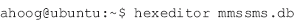

这将在右栏中显示十六进制文件的开头和可打印的 ASCII 字符串:

我们可以按 Control-T (^T)跳转到文件中的一个偏移量。在这种情况下，前面的 strings 命令包含“- radix=x”，所以我们有十六进制(0x12108)的偏移量，所以搜索时间:

十六进制编辑器非常灵敏，可以跳转到偏移:

看上面的十六进制数据，我们可以看到电话号码，它以 0x12111 结束。之后，我们应该看到一个 person 字段，因为它是表设计(也称为表模式)中指定的下一列。如果设置了人员字段，它将链接到联系人表，以提供有关相关人员的详细信息。在这种情况下，没有设置人，因此 SQLite 不记录任何内容。最后，我们看下六个字节，得到 0x012AFC97C52C。当翻译成十进制时，得到的数字是 1284138059052。最后，我们可以使用多种技术将这个时间(以毫秒为单位的 Unix Epoch)转换为更容易读取的日期/时间。一个快速的方法是使用内置的日期命令。但是，它只以秒为单位处理 Unix Epoch，而不是以毫秒为单位，所以您可以简单地除以 1000(即省略最后三位数字):

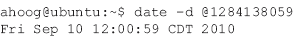

date 命令自动显示当前系统时区的日期。另一种快速转换时间的方法是使用网站来转换 http://www.epochconverter.com/的 Unix 纪元时间，该网站以秒和毫秒为单位处理 Unix 纪元([纪元转换器，纽约市](#BIB7))。若要转换，请将整个时间戳(不需要除以 1000)复制到网站文本框中，然后单击[图 7.2](#F0015) 中的“时间戳到人类日期”。

图 7.2[http://www.epochconverter.com/](http://www.epochconverter.com/)上的时间转换。

最后要提到的时间戳转换技术是由总部位于英国的数字取证软件公司 Digital Detective 提供的免费实用程序 DCode。DCode 支持多种格式([Digital detection，n.d.](#BIB6) )，可以从毫秒级转换，如图[图 7.3](#F0020) 。

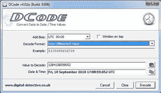

图 7.3 数字侦探的数据编码时间转换实用程序。

这个例子只是为了说明数据的重要性，只有当法医分析师超越他们使用的法医软件并直接检查数据时，数据才可能被访问。对于众所周知的文件系统和可能的“标准”情况，这通常是不必要的。然而，移动取证，尤其是安卓取证，是一个具有挑战性的领域，因为许多文件格式、文件系统、硬件和软件不仅非常新(并且没有得到很好的支持)，而且变化速度惊人。深入研究 hex 的法医分析师会发现，他们发现的数据远比单纯依靠现有的法医软件要多得多。

### 安卓目录结构

对安卓目录结构的广泛理解对设备的取证分析非常有帮助。为了执行这一分析，从 HTC Encry 中复制了五个重要的根目录，然后在本地工作站上用树命令显示。按照分层布局，提供了许多目录的解释。

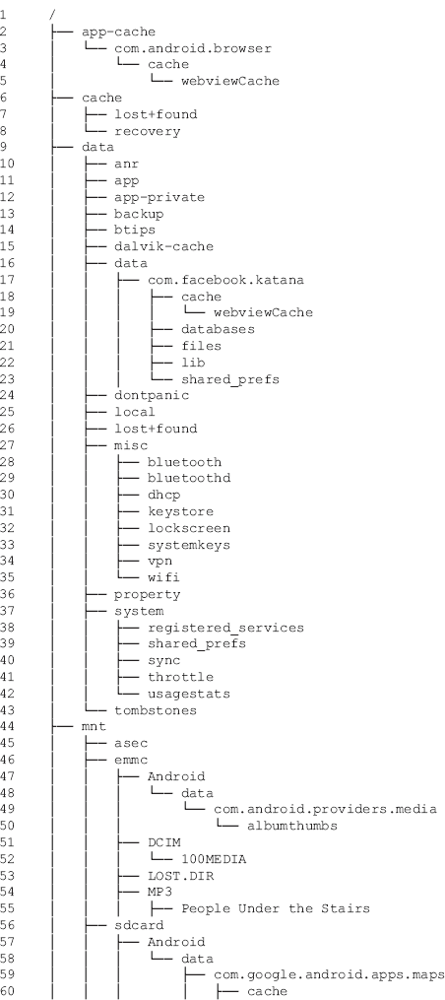

第 1 行:顶部是根目录，它为之前探索的其他文件系统创建了结构和挂载点。

第 2 行:如前所述，HTC 不可思议创建了一个 tmpfs 类型的“/app-cache”目录。您可以看到浏览器缓存结构。据推测，随着时间的推移，其他应用程序可能会利用这个目录。

第 6–8 行:安卓设备从一开始就有一个专用的“/cache”目录，最初看起来是没有使用的。但是，情况肯定不是这样，应该对“/cache”分区进行映像以进行全面分析。文件包括 Gmail 附件预览，浏览器数字版权管理，一些下载(市场和其他)，以及无线运营商的空中(OTA)更新可以在这里找到。

第 9 行:根级“/data”目录下覆盖了多个重要子目录。请注意，一些手机(如 HTC)有一个专用分区用于“/data/data”子目录。

第 10 行:/data/anr”目录包含来自系统的堆栈跟踪(调试)，通常外壳用户无法访问。然而，一些 adb 调试命令似乎读取了这些数据。

第 11 行:“/data/app”目录包含。来自安卓市场的 apk 文件。

第 12 行:“/data/app-private”目录存储来自安卓市场的受保护应用。

第 13 行:较新版本的 Android 有一个安全的云备份 API，开发者可以将其集成到自己的应用程序中。“/data/backup”目录用于对这些备份进行排队和管理。然而，到目前为止，还没有从目录中恢复出有意义的数据。

第 14 行:/data/btips(德州仪器的蓝牙协议栈)目录存储相关应用(com.ti.btips)崩溃时的日志文件。

第 15 行:「/data/davlik-cache」目录包含用于运行应用程序的 Davlik VM 的缓存 dex 文件。

第 16 行:“数据/数据目录”包含应用程序特定的数据，很容易成为调查中最重要的关注领域。

第 17–23 行:出于演示目的，目录层次结构中保留了一个应用程序。目录是根据包名命名的，并且经常清楚地标识开发者(在这个例子中是脸书)。

第 24 行:对于 HHGTTG 粉丝来说(经典小说*《银河系漫游指南:*不要惊慌》中给星际旅行者的著名建议)，有一个名为“/data/dontpanic”的很棒的目录，它只是一个存储系统中一些错误日志文件的地方。同样，开放系统的一大好处是能够检查代码。除此之外，我们只能猜测目的或进行重要的测试。来自 AOSP:

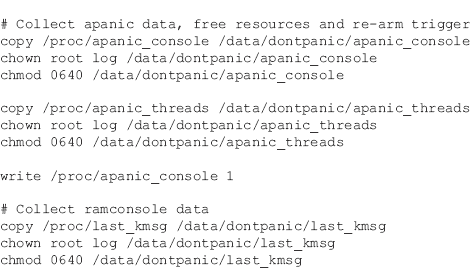

第 25 行:「/data/local」目录很重要，因为它允许 shell(用户帐户非根手机以 adbd 身份运行)读/写访问。安装应用程序时，首先将其复制到“/data/local”。此外，一些取证技术依赖这个目录来上传重要文件，通常是二进制文件。

第 26 行:在 YAFFS2 文件系统的几个地方出现了“/data/lost+found”目录。再次，快速搜索(试试“grep-R lost+find∫。c "从我们下载的 YAFFS2 源目录)将解释，任何找到的没有根目录路径的文件或目录都将放在这个文件夹中。

第 27–35 行:「/data/misc」目录包含与蓝牙、dhcp、vpn、Wi-Fi 等相关的文件。需要指出的一个重要文件是“/data/misc/wifi/wpa _ 恳求者. conf”，其中包含该设备连接的 Wi-Fi.com 网络列表。如果无线接入点需要密码，它会以纯文本形式存储在文件中(有好玩的笔测试器)。以下是部分列表:

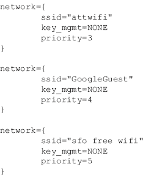

第 36 行:“/data/property”目录包含各种系统属性，如时区、国家和语言。

第 37 行:在子目录之外可以看到/data/system 包含几个关键文件。首先，accounts.db 包含需要身份验证的帐户列表，并提供名称、类型、密码(已加密)和身份验证令牌(以及其他数据)。还有两个非常重要的文件与设备的密码或个人识别码相关。这些文件是 position . key 和 password.key，包含密码的编码/加密十六进制值。

第 43 行:当进程崩溃时，可以创建一个特殊的墓碑文件。该文件是 ASCII，因此可读。更多信息可以在网上找到，比如[Crazydaks.com](http://Crazydaks.com)([安卓调试，美国北卡罗来纳州](#BIB4))上的一篇信息性帖子。

第 44 行:「/mnt」目录是系统挂载各种文件系统的地方，包括 SD 卡、eMMC 等。

第 45 行:“/mnt/asec”目录包含 SD 卡上存储的未加密应用程序。当安卓推出在 SD 卡上存储应用程序的功能时，出于安全原因，他们对内容进行了加密。但是，当系统启动并运行，并且需要对文件进行未加密访问时，这些文件将被解密并安装在“/mnt/asec”中。

第 46 行:“/mnt/emmc”包含 FAT32 文件系统，该文件系统驻留在某些设备的 NAND 闪存上。第 47 行到第 55 行是 eMMC 子目录的几个示例。

第 51 行:/mnt/emmc/DCIM 目录，“相册缩略图存储在这里。

第 52 行:「/mnt/emmc/DCIM/100MEDIA」目录包含 HTC 不可思议拍摄的任何图片或视频。

53 号线:The/mnt/emmc/los。“DIR”目录位于 FAT32 分区上，可能包含文件系统丢失的文件或片段(类似于 YAFFS2 丢失+找到的目录)。应该检查这个目录。

第 56 行:如果存在物理 SD 卡，则将其安装在“/mnt/sd 卡”处

第 66 行:和 eMMC 一样，“/mnt/sdcard/dcim”目录将存储来自设备的图片和视频。在 HTC Entry 上，它们存储在“/mnt/emmc/DCIM”中，因此它们不会出现在物理 SD 卡上。

第 67–68 行:「/ mnt/sd 卡/下载」和「/mnt/sd 卡/下载」目录包含浏览器、电子邮件客户端和其他下载的文件。

第 72 行:如前所述，“/mnt/SD 卡/secure/asec”目录是加密的，是驻留在 sd 卡(而不是 NAND 闪存)上的应用程序存储数据的地方。

第 75 行:“/系统/app”目录包含。系统提供的应用的 apk 应用文件。这包括由谷歌/安卓、制造商(这里是宏达电)和无线运营商(这里是威瑞森)捆绑的应用。在宏达不可思议的情况下，目录包含一个重要的 152。apk 文件。重要的是要知道这个位置，以防案例需要应用程序分析(这意味着您需要访问 apk 文件)。那个。参考 HTC 不可思议上出现的 apk 文件有:

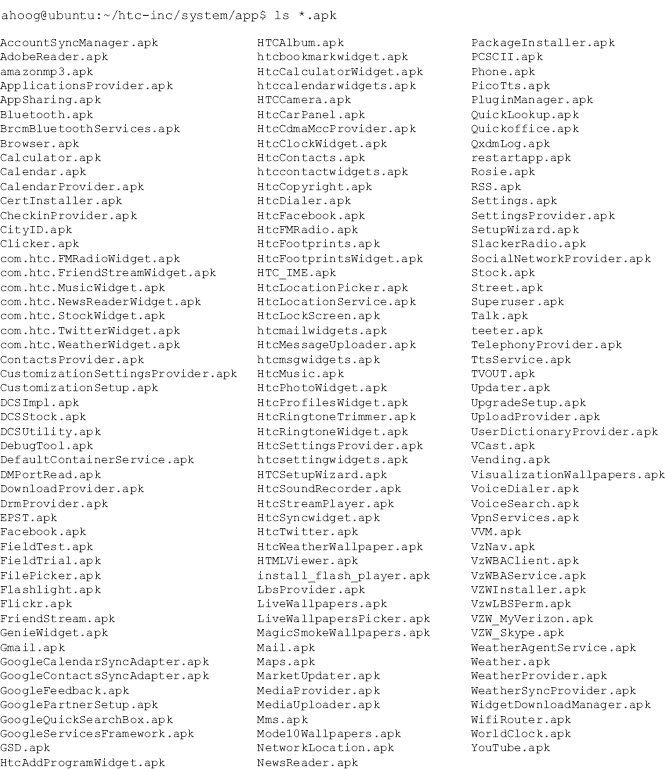

第 76 行和第 117 行:「/system/bin」和「/system/xbin」目录包含系统上使用的 Android 二进制文件。法医分析师和安全工程师(最肯定的是安卓研究人员)可以通过实验这些目录中的文件来找到许多有用且未记录的命令。

第 77–80 行:「/system/customize」目录包含针对手机的运营商特定定制，尤其是 UI。

第 81 行:“/system/etc”目录是安卓存储典型 Linux/Unix 配置(/etc)目录的地方。它包含大量值得检查的配置文件——本书中讨论的太多了——但设备之间可能会有所不同。

有更多的目录和文件需要探索，但是上面的概述提供了一个很好的起点。

## FAT 法医分析

SD 卡可以成为刑侦人员的金矿。所有与手机同步或用手机摄像头拍摄的多媒体都存储在这里。图片、视频、语音记录、应用程序数据、音乐、谷歌地图数据以及来自使用 SD 卡存储的备份应用程序的潜在完整备份文件等项目都是可恢复的。此外，调查人员还可以找到缓存的彩信图像缩略图、与已删除对象相关的垃圾信息以及下载的应用 APk。

例如，一个典型的用户可能会使用谷歌地图来获取当地购物中心的驾驶路线。通过对 SD 卡上“com . Google . Android . apps . maps/cache”目录的取证检查，我们能够恢复地图图像切片和导航语音提示。这些语音提示还印有日期和时间，因此法医调查员可以在给定的时间和日期内追溯该设备的位置。

以下是在芝加哥郊区短途旅行后的样子:

同样重要的是要记住，SD 卡可以通过安卓作为外部大容量存储设备安装。这允许用户在 SD 卡和他或她的个人计算机之间传输任何文件。

在[第 6 章](6.html)中，我们演示了如何在安卓设备上获取当前两个包含数据的 FAT32 分区。有很多书和文章都涉及了对 FAT32 文件系统的分析，本节将不再详细介绍这些内容。但是，本节将演示一些使用 Ubuntu 工作站检查安卓设备上的 FAT32 分区的技术。

### FAT 时间线分析

为了构建 FAT32 映像的文件系统时间线，我们利用了侦探工具包(TSK)和另一个伟大的开源取证工具 log2timeline。由克里斯汀·格维兹永松编写的 log2timeline 实用程序是一个用于自动创建时间线的框架，该时间线包含系统中的各种日志文件和工件。log2timeline 可以在许多系统上使用，并且在提取许多文件格式的时间戳信息以进行分析方面做得很好。

由于我们已经有了 TSK 设置，我们需要采取一些步骤来安装 log2timeline。首先，自从您第一次构建 Ubuntu 工作站以来，可能已经有一段时间了，所以更新任何具有较新版本并且通常包含安全补丁或错误修复的包是一个好主意。

第一步更新您的软件列表，第二步将实际执行升级。接下来，我们将安装 log2timeline，Kristinn 为他的软件创建了一个 Ubuntu 包，从而大大简化了 log2 timeline。

这四个命令执行以下操作:

1.将 log2timeline 定制软件仓库添加到 Ubuntu 工作站整体列表中。

2.下载用于验证软件的公钥，并添加到接受的密钥列表中。

3.更新软件包列表。

4.安装 log2timeline。

对于这个分析，我们将使用我们在[第 6 章](6.html)中成像的 2 GB SD 卡的取证图像。首先，检查人员应始终确保图像的哈希签名与取证成像期间获取的哈希相匹配，以确保图像有效。

如果您还记得，输入设备的哈希(在本例中为/dev/sdc)是 E5 DCC 0 af 1 D8 a 09 c 9 af 4 D2 db 98 f 5 f 684d 20 a 561666 b 9 ff 8 df 7 c8 b 90 a 0 b 9d 78770。法医图像现已通过验证。接下来，让我们先用 file 命令快速查看一下文件:

事实上，我们正在处理一个具有有效分区的磁盘映像。接下来，我们可以使用 TSK 的 mmls 进一步检查磁盘映像:

最后是 TSK 的 fsstat，但请注意，当 FAT 分区从这里开始时，您必须提供 129 的扇区偏移量:

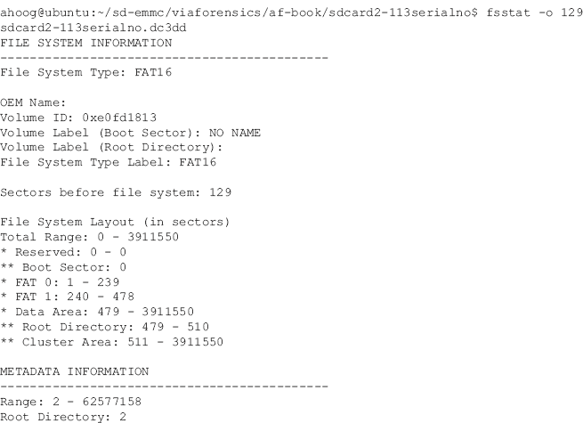

在这种情况下，该分区是一个 FAT16 分区，上面有数据。因此，我们将首先使用 TSK 的 fls 命令构建时间线:

选项集具有以下含义:

-z CST6CDT—将美国中部时间的时区设置为 CST6CDT

-s 0—设置已知的时间偏差

-m/mnt/sd 卡-在写出主体文件时，用该值预设路径

-f fat16-将文件系统设置为 FAT16

-r—递归遍历所有目录以构建时间线

-o 129-将偏移量设置为 129(假设扇区大小为 512 字节，但可以使用-b 选项进行更改)

-I raw-设置图像类型，在本例中为原始图像，而不是其他取证图像格式

□t0 ~/SD-EMM/viaforensics/af-book/sdcard 2-113 串行/sdcard 2-113 串行. dc3dd-映像文件

>~/sdcard . body—将命令输出重定向到文件，而不是显示在屏幕上

知道一个命令需要多长时间通常是有帮助的(如果没有别的，随着时间的推移，你会知道什么时候最好去拿那个咖啡取暖器)。因此，我们在 fls 前面加上 time 命令，它将告诉我们程序运行(真实)需要多长时间，以及它所花费的各种系统时间(user，sys)。您可以查看主体文件的内容，但是在后面的步骤中，我们将把它转换成更易读的格式。如果您想要验证 fls 返回的结果，您总是可以确定文件中的总行数:

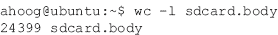

所以，我们有超过 24，000 个条目。接下来，我们需要以只读方式装载文件系统，然后我们可以对其运行 log2timeline。要使用 dd 映像装载文件系统，可以使用 mount 命令和一个称为环回设备的特殊设备。完整的命令如下:

同样，让我们看看每个选项集。首先，这个命令需要管理员权限，所以我们用 sudo 运行。选项如下:

• -t 脱脂

-o loop，ro，offset = 66068 这告诉 mount 使用环回设备，因为我们使用的是物理文件而不是实际设备。ro 将电子邮件装载为只读。最后，我们必须告诉 mount 在哪里可以找到分区。从 mmls 命令中，您可以回忆起偏移量是 129 扇区。Mount 不知道扇区大小，所以我们计算 129 × 512，等于 66，048

□t0 ~/SD-EMM/viaforensics/af-book/sdcard 2-113 serial/sdcard 2-113 serial . dc3dd—DD 映像

~/mnt/sd 卡—安装映像的位置

我们可以通过执行不带选项的 mount 命令来验证文件系统是否已装载，该命令会返回所有已装载文件系统的列表。我们通过 grep 来隔离我们正在寻找的文件系统:

因此，我们可以看到 vfat 文件系统是使用环回设备/dev/loop0 以只读方式装载的，并且位于/home/ahoog/mnt/sd 卡上。您可以使用 df 命令查看总大小:

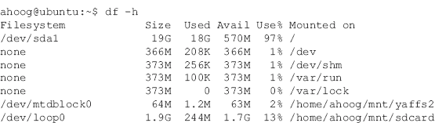

所以，1.7 G 中只有 244 M 可用。现在我们准备使用 log2timeline 附带的 timescanner 程序从文件中提取额外的时间线信息。我们将命令输出附加到与 fls 相同的主体文件中:

timescanner 的选项如下:

-d/home/ahoog/mnt/sdcard-指定要扫描时间戳工件的目录

-z CST6CDT—再次将时区设置为美国中部时间

>>sdcard.body—将输出追加到现有 sdcard . body。请注意双大于号(“> >”)，它指示 shell 追加到文件中(如果文件不存在，则创建它)。如果您忘记并使用单个“>”，那么您将覆盖 fls 输出。

Timescanner 只提取了 410 个伪像，这远远少于扫描整个硬盘时提取的数量。然而，410 件文物肯定会有助于建立设备的整体时间表。

最后，我们可以使用 TSK 的 mactime 命令创建一个易于阅读(且易于共享)的时间线逗号分隔值(csv)文件:

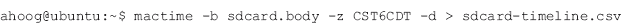

以下选项被传递给了 mactime:

-b sdcard . body—指定要转换的正文文件

-z CST 6 CDT-时间区

-d—CSV 格式的文件输出

对于不到 25，000 个条目，这仅需要几秒钟，但在 csv 文件中会产生 73，000 多行。

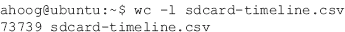

现在，您可以在电子表格程序中轻松浏览时间线，甚至可以将其导入数据库进行额外分析。有几个有趣的项目需要指出。

首先，你可能会在 1970 年 1 月 1 日附近看到许多日期。这是由设置为 0 或根本未设置的时间戳引起的。由于 Unix Epoch 是基于自世界协调时 01/01/1970 00:00:00 以来的秒数，因此偏移量就是确切的时间。在上面的示例中，我们将时区设置为 CST6CDT，在一月份，该时区为格林尼治时间 6 小时。所以，有很多时间标记为“1969 年 12 月 31 日星期三 18:00:00”的文物虽然我们无法收集这些工件的具体时间线数据，但它们可能包含重要信息。

如果从你的 Ubuntu 工作站双击 sdcard-timeline.csv 文件，Open Office 的 Calc 程序会出现一个文本导入画面，如图[图 7.4](#F0025) 。确保“以逗号分隔”设置为逗号，然后按“确定”。

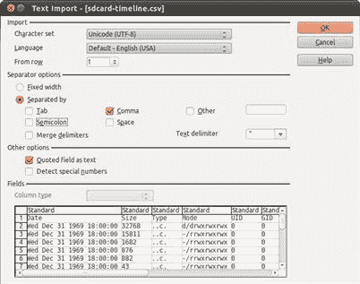

图 7.4 sdcard-timeline . CSV 到 OO Calc 的文本导入。

然后 Calc 程序会打开，你可以浏览时间线，如图[图 7.5](#F0030) 所示。

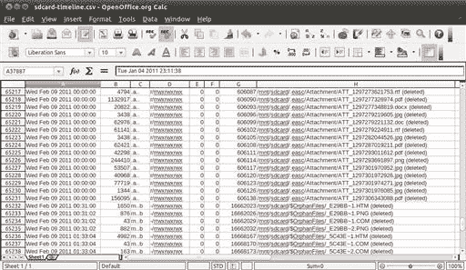

图 7.5 在面向对象计算中查看时间线。

如您所见，大多数文件都被删除了。不过 TSK 等程序还是可以恢复的。一个有趣的事件是当一个应用程序被移动到 SD 卡上进行测试时。愤怒的小鸟这款应用支持从 SD 卡上运行，2011 年 02 月 15 日 06:17:28 测试，如图[图 7.6](#F0035) 所示。

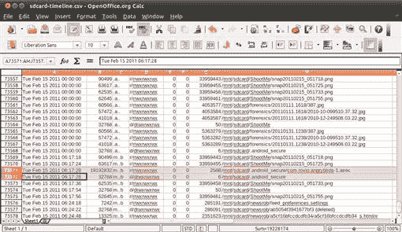

图 7.6 应用移动到 SD 卡时的时间线。

时间线清楚地显示，在 06:17:28 创建并修改了一个新文件。android_secure。”

需要指出的最后一个条目来自 log2timeline。当它遇到一个 PDF 时，元数据被提取出来。我们可以看到以下内容:

我 2010 年 11 月 29 日 04:44:47

23，159 字节

文件已修改

标题:(扫描文件)

作者:[米歇尔]

创作者:[硬拷贝]

由【雷克萨斯 X543】生产

档案:/mnt/sdcard/。EAC/attachment/att _ 1291219677612 . pdf 文件

时间线分析非常强大，尤其是如果法医分析师结合了克里斯汀·格维兹永松的 log2timeline 中的传统文件系统时间戳工件。

### FAT 附加分析

有许多不同的方法来进一步分析 FAT 分区。首先，市场上绝大多数的取证软件都支持 FAT 文件系统，很多考官都会有自己觉得舒服的工具集。除了取证软件，我们在第一部分还介绍了其他一些技术，包括:

文件系统分析

锉刀雕刻

琴弦

十六进制分析

即使文件系统类型不同，这些技术也是相似的，因此我们将在下一节中详细介绍它们。然而，一些简单的概念在下面被强调。

首先，SD 卡显然有大量被删除的文件。建议使用取证工具来恢复数据。TSK 可以恢复数据以及许多其他取证软件包。此外，应该使用文件雕刻技术来恢复分区的文件分配表中没有引用的文件。字符串和十六进制分析也是快速定位感兴趣数据的好方法。

如果 Ubuntu 工作站用于文件系统分析，还有一个快速的技巧需要提及。使用查找和文件命令，您可以按名称、路径和文件类型列出所有分配的文件。您可以轻松地对它们进行动态排序，或将它们导入电子表格或数据库进行额外分析。该技术仅列出已分配(未删除)的文件，但非常有效。

命令如下:

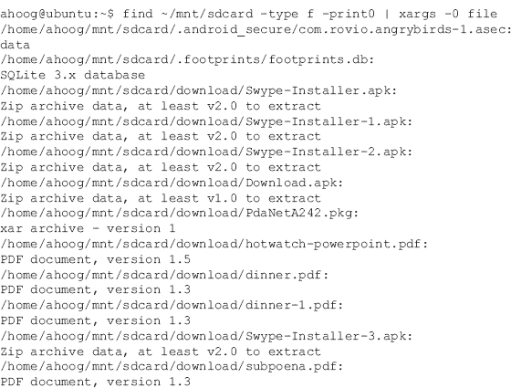

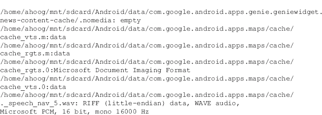

该命令总共在 SD 卡上找到并分类了 4352 个分配的文件。以下是命令的每个部分完成的内容:

查找~/mnt/SD 卡—在我们安装 sd 卡映像的目录中查找文件~/mnt/sd 卡

-类型 f-仅检查常规文件(即，不列出目录)

-print 0-用空字符而不是默认的新行终止每个文件名，这会在文件名有空格时导致问题

“|”—将查找的输出传送到下一个程序

xargs—该程序使用来自标准输入(即其他程序的输出)的数据构建和执行命令行

-0—告诉 xargs 正在传输的数据以空字符结束(与查找中的-print0 匹配)

文件—这是 xargs 针对 find 命令返回的每一行运行的命令

find 和 xargs 命令是检查、交互或操作大量文件的非常强大的方法。通过将时间线和文件系统分析、文件雕刻、字符串和十六进制分析相结合，调查人员可以使用强大的工具来发现对案件至关重要的信息。

### 脂肪分析师笔记

安卓系统上的 FAT 文件系统还有一些注意事项。

#### SD 卡上的应用程序

首先，如[第 6 章](6.html)所述，从安卓 2.2 开始，用户可以将支持的应用移动到 SD 卡中，以节省存储用户数据的“/data/data”目录中的空间。应用程序必须明确支持这一功能，典型的候选功能是使用大量存储的应用程序，如游戏。为了测试这个功能，Rovio Mobile 的热门愤怒的小鸟游戏( [Rovio -愤怒的小鸟，北卡罗来纳州](#BIB11))被安装在参考 HTC 不可思议上。该应用程序短暂运行，然后关闭。要将应用程序移动到 SD 卡，您可以从主屏幕中选择设置，然后选择应用程序，最后选择管理应用程序，如[图 7.7](#F0040) 所示。

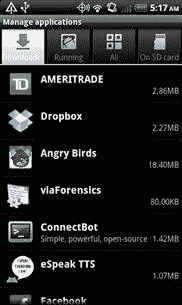

图 7.7 管理应用程序屏幕。

可以看出，《愤怒的小鸟》在“/data/data”上使用了 18.40 MB 的空间，这是非常宝贵的空间。因此，应用程序开发人员提供了必要的支持来移动。向 SD 卡发送 apk。然后，用户可以选择应用程序(在这种情况下是愤怒的小鸟)，然后出现一个屏幕，其中有关于该应用程序的信息和选项，包括“移动到 SD 卡”，如图[图 7.8](#F0045) 。

图 7.8 移至 SD 卡。

从这个屏幕上，您可以看到应用程序本身使用 18.39 兆字节，而用户数据只有 12.00 千字节，这显然是移动的候选。向 SD 卡发送 apk。并且，如图[图 7.9](#F0050) 所示，只需点击“移至 SD 卡”按钮，等待任务完成即可。

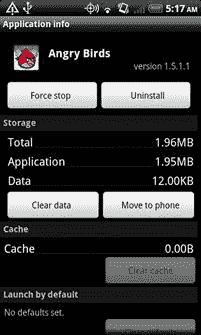

图 7.9 应用程序移动到 SD 卡完成。

从用户的角度来看，这很棒。但这对法医或安全分析师意味着什么？接下来将描述一些步骤，并在代码列表中突出显示。

1\. The。apk 文件从“/data/app”(或“/data/app-private”)移动到位于/mnt/secure/asec 的加密分区中的 SD 卡(参见下一个列表中突出显示的部分)，该分区只能通过根目录访问。

2.一个新的设备映射器文件系统以只读方式装载，并且来自“/mnt/secure/asec”的应用程序被解密，并可通过“/mnt/asec/com . rovio . angrybirds-1”访问该系统。系统必须能够访问未加密的。运行应用程序的 apk 文件。

3.用户数据保留在“/data/data”(本例中为“/data/data/com . rovio . angrybirds”)。

4.如果 SD 卡变得不可访问(无论是被移除、损坏还是简单地安装在主机上用于文件共享)，未加密的卷将被卸载，并且系统不再可访问。这就是核心应用目前无法从 SD 卡运行的原因。

The。apk 文件在 SD 卡上加密，以确保其他应用程序(或进程)不会损坏或恶意修改应用程序。然而，应用程序开发人员不应依赖加密来阻止人们访问。apk 文件，因为这只是从未加密的“/mnt/asec/ <应用程序名称>复制它的问题。”下面代码中的 mount 和 ls 命令说明了这种结构。

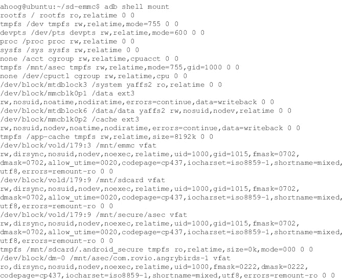

如果你需要。apk 用于分析(例如，调查恶意软件)，那么在 SD 卡插入并在 Android 设备上处于活动状态(即，没有安装在取证工作站上进行物理采集)的同时，在采集过程中复制“/mnt/asec”子目录至关重要。

#### 名字吗

SD 卡和 eMMC 分区上的另一个常见项目是一个名为的空文件。nomedia 将指示安卓的媒体扫描仪跳过该目录，这样它就不会包括图库或音乐等应用程序中的任何媒体文件。如果目录中不包含此文件，则很有可能以前删除的图像可能有缩略图，可以在媒体扫描仪的目录中找到。这将在安卓应用程序分析和参考部分进一步讨论。

## YAFFS2 法医分析

如[第 4 章](4.html)所述，YAFFS2 是一个开源的日志结构文件系统，专门为 NAND 闪存开发，包括对损耗均衡和纠错码算法的支持。这不仅对手机用户来说是个好消息，因为 YAFFS2 在安卓上运行得非常好，而且对法医分析师来说也是个好消息，因为大量旧的(删除或更新的)数据是可以恢复的。但是好消息到此为止。由于 YAFFS2 是一个相对较新的文件系统，目前没有商业取证软件解决方案支持它。

然而，一切都没有失去。利用 Linux 的强大功能、YAFFS2 的开放性(一种有效的获取策略)以及已经讨论过的技术(包括文件系统分析、文件雕刻、字符串和十六进制分析)，法医可以从文件系统中提取大量相关数据。

当我们深入分析 YAFFS2 时，记住它的结构是非常有帮助的。需要回忆的一个重要概念是数据是如何通过 MTD 在 NAND 闪存上物理结构化的。一般来说，YAFFS2 和 MTD 将 NAND 闪存组织成 128 KB 的块，由 2048 KB 的数据块和 64 字节的带外(OOB)数据(使 NAND 闪存上的总大小为 132 KB)组成，用于存储磁盘和一些文件系统元数据，如图[图 7.10](#F0055) 所示。

图 7.10 区块(128 千字节= 64 × 2k 区块+ OOB)。

当然，并不要求安卓设备以这种方式构造 NAND 闪存和 MTD，最好的验证方式是检查包含配置信息的“/proc/mtd”文件的内容。这是参考 HTC 不可思议的文件。

如果我们想在 Ubuntu 工作站上安装 YAFFS2 nanddump，我们需要 OOB 数据，但 64 字节的 OOB 数据肯定会给大多数取证技术带来问题，尤其是文件雕刻。为了缓解这个问题，你可以简单地用一个简单的程序删除 OOB。该程序是用 Python 编写的，可以很容易地适应不同的块和 OOB 配置。

首先，我们用 sudo 权限打开一个新的文件进行编辑，这样我们就可以将程序放入“/usr/local/bin”中，这是保存自定义脚本和程序的最佳位置。

接下来，将以下内容复制到编辑器中:

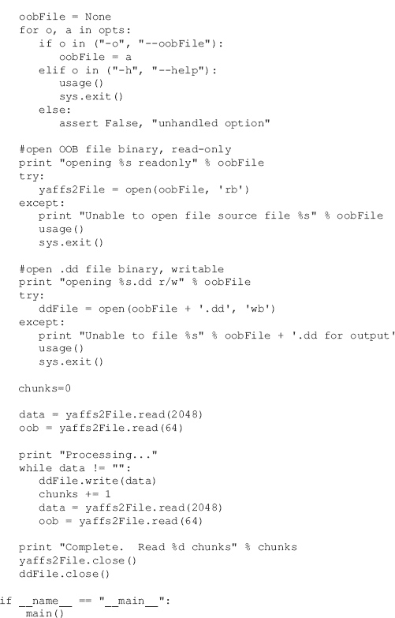

然后用 Ctrl-O 保存并用 Ctrl-X 退出。接下来，您必须使 Python 文件可执行，因此键入以下内容:

最后，我们可以针对一个 nanddump 文件运行该程序:

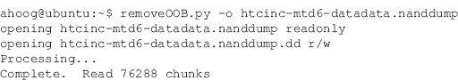

让我们确保 removeOOB.py 结果是我们所期望的。根据“/proc/mtd”，/dev/mtd/mtd6”分区的大小为 0x9500000 字节，擦除大小(块大小)为 0x20000。以字节为单位的总大小为 156，237，824(简单地将大小从十六进制转换为十进制)或大约 154 MB。同样，擦除大小是 2048 字节，所以如果我们用 156，237，824 除以 2048，我们会得到 76，288 个数据块。这与 removeOOB.py 的结果相对应。但还有一件事我们可以检查。正如我们所知，在每个 2k 数据块之后，nandump 有 64 字节的 OOB 数据，磁盘上的 nandump 总大小应该是(76，288 × 64) + 156，237，824。总数应该是 161，120，256，这将代表数据块及其对应的 OOB。我们可以用一个简单的“ls–l”看到磁盘上的大小:

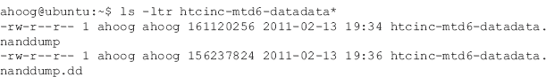

如你所见，整个南都和。dd 图像(OOB 被移除的南垃圾场)对应于预期大小。

由于我们现在有了 YAFFS2 nanddump 文件、dd image 和逻辑文件(或者来自 tar、adb pull，或者通过挂载 YAFFS2 分区)，我们已经准备好对数据执行各种技术。

### 雅夫斯 2 时间线分析

理想情况下，本节将详细介绍已经构建的取证软件的使用，该软件将构建 YAFFS2 时间表。不幸的是，YAFFS2 还没有得到任何法医时间轴工具的支持，因此需要这些信息的审查员必须走一条更困难的道路。

在接下来的几年里，取证行业需要对 YAFFS2 进行更多的研究。然而，随着安卓向 EXT4 迈进，大部分的 YAFFS2 研究有可能不会发生。希望情况不会如此。

在这里，我们将介绍一些研究，旨在提供一个基础框架，开始雅夫斯 2 的研究。这项研究是在[第 4 章](4.html)中最初介绍的模拟 NAND 闪存上进行的。虽然这种方法为研究者提供了有效研究所需的控制和特权，但它不一定模拟生产环境。

如[第 4 章](4.html)所述，YAFFS2 和 MTD 都参与向 NAND 闪存写入数据。YAFFS2 模块负责文件系统的所有方面。然而，将数据写入 NAND 闪存是由 MTD 管理的。不幸的是，这给分析增加了相当大的复杂性，因为 MTD 可以接受来自 YAFFS2 的数据，该数据需要写入 NAND 闪存，然后可以自主地以其认为合适的方式不仅写入 YAFFS2 数据，还可以写入额外的 MTD 数据。对数据的持续研究不仅要考虑到 YAFFS2 代码，还要考虑到 MTD 代码。此外，在不同的安卓设备上使用的 YAFFS2 和 MTD 模块可能会有细微的差异，这又增加了一层复杂性。

这并不意味着理解在南垃圾场发现的 YAFFS2 数据是不可能的。首先，我们将在 Ubuntu 工作站上设置一个 64 MB 的模拟 NAND 闪存设备。

您可以验证 nandsim 设置是否正确:

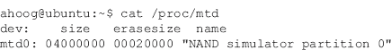

在挂载 YAFFS2 文件系统之前，我们将启用 YAFFS2 内置的各种调试功能。YAFFS2 支持的调试选项有很多( [YAFFS 调试，n.d.](#BIB14) )，但我们只打算启用其中的三个。为此，我们首先需要拥有完全的根权限，然后将调试标志回显到“/proc/yaffs”中:

echo 命令后的值首先删除所有退出的调试(无)，然后启用 os、write 和 mtd 调试选项。您可以在位于“/var/log/syslog”的系统日志中查看调试结果。理想情况下，打开第二个终端窗口或 ssh 会话，并使用 tail 命令连续输出 syslog 的尾端:

接下来，我们创建装载点并装载一个 YAFFS2 文件系统:

此时，审查员应该创建一系列测试用例，以便可以在模拟的 NAND 闪存上检查预期的受控数据，从而最终确定结构。对于该测试，采取了以下步骤:

1.在“~/mnt/yaffs 2”(mkdir ~/mnt/yaffs 2/test)中创建一个名为 test 的目录

2.创建“~/mnt/yaffs2/test/file1.txt”，内容为“via 取证”(nano-w ~/mnt/yaffs 2/test/file 1 . txt)

3.更新“~/mnt/yaffs2/test”并将“已更新”追加到文件中(回显“已更新”>>~/mnt/yaffs 2/test/file 1 . txt)

4.读作“~/mnt/yaffs 2/test/file 1 . txt”(cat ~/mnt/yaffs 2/test/file 1 . txt)

5.更改目录和文件的用户和组所有者(chown-R pulse . rtkit ~/mnt/yaffs 2/test)

6.更改目录和文件的权限(chmod -R 777 ~/mnt/yaffs2/test)

在执行这些测试时，不仅文件系统被更新，调试信息也被写入系统日志。调试非常冗长(我们只启用了三个调试选项)，因此这里只提供了两个示例，它们对应于以下内容:

1.创建“~/mnt/yafs2/test”目录

2.更改 file 1 . txt(chmod-R 777 ~/mnt/yaffs 2/test)的权限

调试提供了有价值的信息，包括对象 id、序列号、块 id 以及 YAFFS2 创建文件的详细过程。如果启用额外的调试，您将有更多的数据可以关联，并在理解 YAFFS2 时使用。

在我们检查实际的 nanddump 之前，还有一个有用的命令值得指出。stat 命令将提供关于文件、目录或其他文件系统对象的详细信息。例如，我们可以针对“~/mnt/yaffs2/test”和“~/mnt/yaffs2/test/file1.txt”运行 stat，并在我们的研究中使用这些信息:

我们现在有了文件和目录的“修改”、“访问”和“更改”属性，结合我们创建数据时采取的操作，我们有了足够的信息来开始我们的研究。

是时候看看 NAND 闪存了，它需要根访问。以下命令将跳过 NAND 闪存的行，这些行都是 0xFF 和 0x00，这样更容易看到趋势。此外，出于空间原因，这里只以十六进制显示了 NAND 闪存的一小部分:

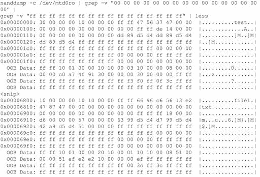

包括的 NAND 闪存部分涵盖以下内容:

1.创建“~/mnt/yaffs2/test”目录

2.文件 1 . txt(chmod-R 777 ~/mnt/yaffs 2/test)上的权限变更

显示的数据是 YAFFS2 对象头的一部分，包含文件系统的元数据。文件的名称清晰可见，64 字节的 OOB 区域也清晰可见。这个数据的一个关键特征是代表 Unix Epoch 时间戳的整数是小端顺序的，这意味着您必须从右向左读取数据。

写入与非门闪存的数字:63 99 d5 d4 (0x6399d5d4)

从小端转换到大端:4d 5d 99 36 (0x4d5d9936，从右向左的十六进制读取)

将 0x4d5d9936(十六进制)转换为十进制是 1297979702

人类日期/时间格式的 Unix 时间戳 1297979702 是美国中部时间 2011 年 2 月 17 日星期四 15:55:02(date-d @ 1297979702)

利用这些信息，我们可以分离出南丹堆中的一些重要工件，如[表 7.3](#T0020) 所示。

表 7.3 来自 YAFFS2 南大堆的工件

非常令人满意的是，来自模拟 NAND 闪存设备的调试日志、stat 命令和 nanddump 的数据都是一致的。通过额外的分析，很有可能为 NAND 闪存上的每个文件和目录创建 MAC 时间，这将为审查员提供明显的好处。还可以从 NAND 闪存上仍然存在的 ObjectHeaders 中收集完整的元数据信息，并在块上没有发生垃圾收集的情况下收集每个时间点的完整内容。

值得指出的是，在这里演示的非常有限的测试和分析中，文件的 *atime* (访问时间)似乎不是每次访问文件都更新。这并不奇怪，因为这意味着每当程序访问文件时，都必须将新的对象头写入 NAND 闪存。这将导致对 NAND 闪存的写入次数大大增加，不仅会消耗宝贵的电池电量，还会因大多数用户并不真正关心的元数据更新而磨损 NAND 闪存。这种做法也并不罕见，因为微软默认禁用了微软视窗操作系统和视窗 7 中的 *atime* 更新。

可以肯定的是，这个分析并不琐碎。它可以提供有价值的信息，是对 YAFFS2 文件系统进行取证研究的基础。

### 文件系统分析

YAFFS2 文件系统的十六进制分析非常耗时，所以让我们继续讨论分析分配文件的技术。不幸的是，这又是一个挑战，因为从安卓设备中提取 YAFFS2 nanddump 后，很难挂载它。

因此，正如[第 6 章](6.html)中所强调的，如果你在安卓设备上拥有根访问权限，那么最好不仅要获取合适的 YAFFS2 nanddump 文件，还要使用 adb pull、tar 或其他方法从系统中逻辑复制重要目录。这样，如果您无法装载 YAFFS2 nanddump，您仍然有文件的逻辑副本。然后，nanddump 可以用于时间线创建、其他十六进制分析和文件雕刻。

然而，在 Linux 中装载一些 YAFFS2 nanddumps 是可能的，并且随着时间的推移，期望成功装载更多的 nanddump 文件。在这一节中，我们将重点介绍摩托罗拉 Droid 的 nanddump，因为它们可以通过 nandsim 和 YAFFS2 内核模块在 Linux 中成功安装。

首先，我们需要加载适当的内核模块，并创建一个 1 GB 的 nandsim 设备。

我们现在有一个 1 GB 的 nandsim 设备，能够容纳 Droid 的“/数据”分区。下一步是使用 nandwrite 将数据和 OOB 拷贝到模拟的 NAND 闪存中。

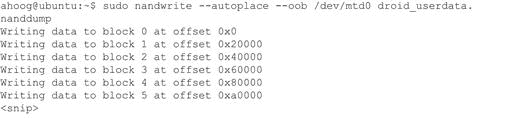

这些参数指示 nandwrite 执行以下操作:

sudo nandwrite—Nandwrite 需要 root 权限

-自动定位-使用自动 oob 布局

-oob—图像包含 OOB 数据

/dev/mtd 0—要向其写入非转储的 MTD 设备

droid _ user data . NAND dump—NAND dump 文件的名称

如果一切按预期进行，我们现在应该能够使用以下命令装载文件系统:

在此过程中，您可能会遇到两个主要问题。首先，YAFFS2 和 MTD 可能无法成功装载文件系统，并将显示以下消息:

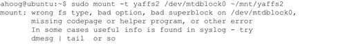

这可能有许多原因，例如:

设备的 YAFFS2 和 MTD 实施与您的工作站之间的差异

损坏或无效的数据转储

文件系统问题

第二个最常见的问题是文件系统已装载，但没有文件:

这很可能是由于设备的 YAFFS2 和 MTD 实现与您的工作站之间的差异，同样也很难调试。有几件事你可以试着解决这些问题。首先，如果您的 mtu-utils 版本大于 20090606-1，请尝试安装旧版本。以下是如何检查您的当前版本并可选地安装:

现在我们降级了 MTD 的版本，您可以再次尝试安装 YAFFS2 nanddump 的步骤。

另一个潜在的选择是，你的 YAFFS2 版本与安卓设备上使用的版本不够一致。为了获得不同版本的 YAFFS2，您需要使用 YAFFS2 或安卓开源项目的源代码控制系统。然后编译源代码，删除现有的 YAFFS2 内核模块，插入新的模块，然后重试。

如果这些步骤有效，您将会看到:

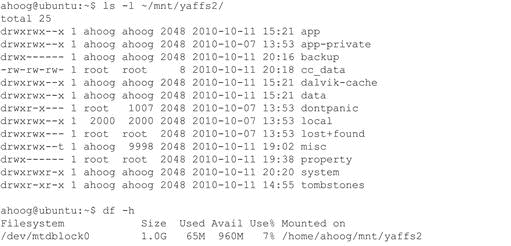

因此，我们现在从摩托罗拉 Droid 获得了完整的/数据文件系统，可以在我们的 Ubuntu 工作站上访问，然后您可以使用自己选择的取证工具对其进行探索和分析。最终，如果您无法在 Ubuntu 工作站上装载 nanddump，您应该仍然拥有采集过程中的全套逻辑文件，因此它不应该抑制对设备的分析。

### YAFFS2 文件雕刻

下一个对分析 YAFFS2 文件系统有用的技术是文件雕刻。在本章前面，我们在 Ubuntu 工作站上安装并配置了手术刀。对于这个例子，我们假设在 Ubuntu 虚拟机上登录用户的主目录中有一个名为 htc-datadata.dd 的文件。在同一个目录中(您可以在命令中用~来引用)，有一个手术刀配置，其中包含 1.3 节中名为手术刀-android.conf 的条目。

请注意，我们使用的是 **dd 图像**进行文件雕刻，而不是 nanddump。这是必要的，因为在每 2k 块 YAFFS2 数据之后发现的 OOB 数据将显著影响手术刀切割有效文件的能力。以下命令将对 dd 映像运行解剖刀，并将文件输出到主目录中名为 HTC-解剖刀-test 的文件夹中:

在这种情况下，解剖刀能够恢复 11，370 个文件，输出提供了已恢复文件类型和数量的详细信息。[图 7.11](#F0060) 是从 Ubuntu 工作站观看 JPG 目录之一的屏幕截图。

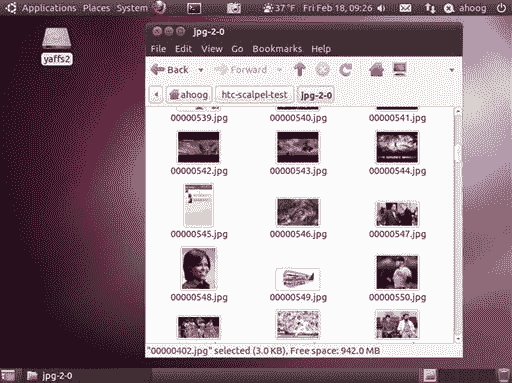

图 7.11 查看使用手术刀恢复的图像。

这些图像的分辨率不高，但是，尤其是直接在工作站上观看时，您可以辨别内容。这一小部分图片展示了一些事情:

前三张图片是 YouTube 电影的开场画面，这里是龙的漫画。

下一张图片是脸书询问午餐和推荐寿司的信息片段。

其余图片似乎来自各种新闻文章。

正如这一点所展示的，文件雕刻可以从 YAFFS2 中恢复重要的工件，并且是取证分析的一个有价值的工具。

### 二进制字符串分析

我们已经演示了一个使用字符串在安卓设备上查找数据的例子。然而，让我们通过另一个练习来展示这种分析的技巧和力量。

对于这个例子，考官需要在安卓设备上找到位置信息。搜索一个术语，尤其是在安卓设备上，就是[maps.google.com](http://maps.google.com)，因为谷歌地图服务已经紧密集成到操作系统中。一个极其强大的搜索工具叫做 grep，它被广泛使用，现在已经成为技术术语中的一个动词(“你用 grep 这个设备来做地图参考了吗？”).它不仅内置于 Ubuntu 虚拟机中，还支持非常强大的正则表达式(通常简称为 regex 或 regexp)，允许复杂的模式匹配。有许多介绍 grep 和 regex 的在线资源都有很好的例子。

对于我们的例子，我们将使用 grep 的最基本功能，我们只需搜索一个字符串:

查询返回了 775 个示例，出于简洁和隐私的原因，这里只显示了几个。然而，很容易确定设备上发生的一些活动。具体来说:

对内珀维尔预防犯罪中心进行了搜索(网址中的 q=代表查询)，网址有效，包括地址、电话号码、图片、方向等。

还对肯尼迪航天中心游客中心进行了搜索。

肯尼迪航天中心的查询随后被移动地图应用程序查看，我们甚至可以看到 IP 地址。

如果我们看一下 IP 地址，它是最后一个查询(174.253.2.53)的一部分，我们可以使用命令行工具或在线 IP 查找服务([我的 IP 地址是什么，n.d.](#BIB13) )来查找其他信息。结果见[图 7.12](#F0065) 。

图 7.12 地址查找的结果。

来自 IP 查找服务的信息揭示了几条重要信息:

1.设备正在使用威瑞森无线网络。

2.该设备位于伊利诺伊州芝加哥地区(有可能欺骗和伪造 IP 地址，但这并不重要，在大多数情况下也不太可能)。

由于我们已经恢复了字符串的十六进制偏移量，因此我们可以查看搜索周围的数据，以确定搜索发生的大致时间范围。

### 雅夫斯 2 分析师笔记

大部分 YAFFS2 取证所需的手动分析当然很耗时，而且有点令人生畏，这使得进入的障碍远高于对充分理解和支持的文件系统的分析。然而，有许多资源可以很容易地帮助对这种方法不熟悉的分析师。

首先，希望这本书提供了一个很好的使用 Linux 进行取证分析的介绍(请推荐您所有的朋友和同事都应该有一个副本放在他们的书架上)。

也许更有帮助的是，简单的谷歌搜索通常会在博客、讨论板、邮件列表和其他类似的资源上产生许多有用的帖子。虽然互联网上肯定有不准确的信息，但在这些领域工作的许多技术人员发布了相当准确的信息。此外，作为奖励，许多作者对询问和澄清反应非常积极。

接下来，为执法和法医分析师提供了一个关于 Linux 的出色介绍，它可以在线免费获得。网站“Linux LEO:执法和法医检验人员对 Linux 的介绍”提供了 PDF 格式的指南，并向读者介绍了将操作系统用作法医工具所需的 Linux 概念( [Grundy，b，n.d.](#BIB8) )。

随着您进一步使用 Linux，您会发现自动化许多手动任务是非常容易的。这不仅能让你很好地控制系统的工作方式，而且自动化还能节省大量的时间。这是一个很好的组合，因为忙碌的考官可以用最先进的工具处理更多的取证数据，同时准确地解释系统做了什么，而不仅仅是说点击了一个按钮，就产生了一份报告。

开始自动化常见 Linux 任务的最简单方法是简单地编写一个 shell 脚本，它非常容易编写，并且基本上模仿了您在终端会话中键入的命令。

比如说你有一系列。csv 文件，其中包含在安卓设备上运行逻辑取证技术的结果。您需要将每个文件的最上面一行发送给某人，但是它不应该包含来自设备的任何数据。您可以手动打开每个文件，删除数据行，将更新后的文件保存到新目录，最后发送信息。然而，这可能需要相当长的时间。相反，您可以编写一个简单的 shell 脚本。

首先，让我们打开一个新文件进行编辑:

然后将以下内容放入文件:

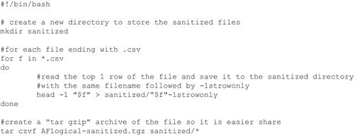

然后通过按 Ctrl-O 保存文件，并用 Ctrl-X 退出。接下来，我们必须使脚本可执行:

我们要清理的文件位于用户主目录中一个名为 AFLogical 的目录中，正如您所知，手工处理这些文件会非常耗时:

我们现在可以简单地处理这些文件:

现在，逻辑目录不仅有一个名为的新子目录，其中包含每个更新的文件，而且还有一个包含数据的文件:

这些数据可以很容易地通过电子邮件发送或复制到另一个驱动器。

这里有一个更复杂的例子，它将创建一个 nandsim 设备，挂载一个空白的 YAFFS2 文件系统，生成几个文件，然后允许用户卸载文件系统。这是自动化测试 YAFFS2 所涉及的步骤的快速方法。

希望审查员不会将缺乏支持 YAFFS2 文件系统的商业工具视为无法恢复额外数据的情况。使用 Ubuntu 工作站上可用的免费开源工具显然为进一步调查提供了一种强大的手段。当将这些技术与本章中概述的 hex 分析相结合时，审查员应该会发现他们已经做好了从安卓设备上的 YAFFS2 分区中提取证据的充分准备。当一个涉及运行带有 YAFFS2 文件系统的嵌入式 Linux 的医疗设备的案例被放在你的桌子上时，你可以自信地一头扎进去，弄清楚它。

## 安卓应用分析与参考

虽然本章描述了许多对安卓设备的取证和安全调查有用的技术，但参考关键应用程序的数据存储位置还是有帮助的。当然，维护一个完整的参考几乎是不可能的，不仅因为应用程序的数量，还因为特定设备和安卓版本之间的差异。

在以下几节中，我们分析了本书中使用的参考手机的 10 个重要应用，并提供了以下数据:

1\. App 信息

2.文件和目录(包括/数据/数据、SD 卡和 eMMC)

3.重要数据库表

4.分析师笔记

通过应用程序分析，所有时间戳都以 Unix Epoch 毫秒为单位，即自 1970 年 1 月 1 日以来的毫秒数，除非另有说明。

测试的应用程序被安装并在设备上使用，然后用定制的 Python 程序进行分析，以自动执行本章前面描述的一些技术。虽然提供了重要信息，但请注意这只是参考，可能不完整。分析师应使用取证和安全工具以及上述技术对他们正在检查的设备进行全面分析。

### 信息(短信和彩信)

#### 应用信息

这是安卓系统附带的处理短信和彩信的默认应用程序。

应用名称:消息

套餐名称:com . Android . providers . telephone

版本:2.2

设备:HTC 难以置信

应用开发者:安卓

#### 目录、文件和文件类型

in/data/data/com . Android . providers . telephone:

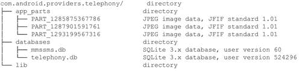

#### 重要的数据库表和文件

彩信和短信的重要数据库表和文件见[表 7.4](#T0025) 。

表 7.4 重要数据库表和文件来自/data/data/com . Android . providers .电话/数据库/mmssms.db

| 数据库表/文件 | 描述 |
| --- | --- |
| 单词 _ 内容 | 消息内容 |
| 部分 | 彩信附件的详细信息，包括类型、名称、文件系统上的位置(如果是二进制文件，即图像)，以及附件的内容(如果是纯文本文件) |
| 存储管理服务 | 完整的短信，包括发件人、收件人、时间戳、阅读状态、发送/接收状态和消息内容 |

##### 分析师笔记

/data/data/com . Android . providers . telephone 的分析师笔记:

app _ parts 文件夹将包含彩信附件，可以包含图像、视频或任何其他支持的数据。不维护文件类型，因此使用 File 命令或其他文件签名分析工具进行识别。

电话数据库通常不太受关注，因为它只包含无线运营商的服务信息。

短信表包含所有信息，应该是主要关注点。

其他几个表似乎复制了短信表的部分内容，因此请查看 words_content 和其他表来帮助您进行分析。

另见:com.android.mms。

### 彩信助手应用

#### 应用信息

该应用程序存储一些彩信数据，似乎是主消息应用程序的助手应用程序。

App Name: com.android.mm

套餐名称:com.android.mms

版本:2.2

设备:HTC 难以置信

应用开发者:安卓

#### 目录、文件和文件类型

In /data/data/com.android.mms:

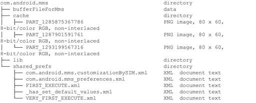

#### 重要的数据库表和文件

/data/data/com . Android . MMS/cache 中的零件文件

#### 分析师笔记

/data/data/com.android.mms 的分析师笔记:

文件“bufferFileForMms”在发送时可能包含缓冲区数据。但是，它通常只包含 0x00。

缓存中的零件文件是在/data/data/com . Android . providers . telephone/app _ parts 上的消息应用程序中找到的图像的小 PNG 版本。

### 浏览器

#### 应用信息

这是安卓内置的网络浏览器，基于开源的 WebKit 项目。

应用名称:互联网

包名:com.android.browser

版本:2.2

设备:HTC 难以置信

应用开发者:安卓

#### 目录、文件和文件类型

in/data/data/com . Android . browser:

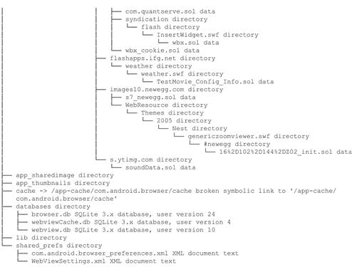

in/app-cache/com . Android . browser/cache:

#### 重要的数据库表和文件

支持的网络应用的本地存储如[表 7.5](#T0030) 所示。

表 7.5 重要数据库表和文件来自/data/data/com . Android . browser/app _ databases/http _ www . Google . com _ 0 . local storage

| 数据库表/文件 | 描述 |
| --- | --- |
| 项目表 | 该表是键/值对的简单列表；但是，可能包含所访问站点的有用信息，并利用了 localstorage 功能。 |

缓存的地理位置数据见[表 7.6](#T0035) 。

表 7.6 重要数据库表和文件来自/data/data/com . Android . browser/app _ geolocation/cachedgeoposition . db

地理位置权限数据库如[表 7.7](#T0040) 所示。

表 7.7 重要数据库表和文件来自/data/data/com . Android . browser/app _ geolocation/geolocationpermissions . db

| 数据库表/文件 | 描述 |
| --- | --- |
| 许可 | 此表列出了来源(网站)和每个来源的权限(允许)。例如，[http://www.google.com](http://www.google.com)值为 1 表示谷歌网站有权访问地理位置 |

[表 7.8](#T0045) 为浏览器数据库。

表 7.8 重要数据库表和文件来自/data/data/com . Android . browser/databases/browser . db

[表 7.9](#T0050) 显示了网页视图数据库。

表 7.9 重要数据库表和文件来自/data/data/com . Android . browser/databases/webview . db

网页视图缓存数据库见[表 7.10](#T0055) 。

表 7.10 重要数据库表和文件来自/data/data/com . Android . browser/databases/webviewcache . db

#### 分析师笔记

/data/data/com.android.browser 的分析师笔记:

如果要寻找某个特定的网站，并且该网站有一个收藏夹图标，请查看 app_icons 中的网页图标. db。

特定的应用数据库可以包含非常有用的信息。例如，谷歌应用数据库有以前的搜索词，许多缓存的带有时间戳的“lon/lat/acc”版本等等。

com . adobe . flashplayer 目录不仅包含“Flash cookies”，它以。sol 扩展并可以被 log2timeline 解析，还有些 Flash。swf 文件。

浏览器数据库(databases/browser.db)包含一个名为“书签”的表，该表通常预先填充了来自无线运营商的书签。该表还包含 web 浏览器历史记录。还有一个名为“搜索”的表格，其中包含了从浏览器中进行的谷歌搜索。

网络视图数据库(databases/webview.db)包含大量信息，不仅对法医检验人员有用，对安全工程师也有用。cookie 是可见的，大多数都不安全，这意味着它们可能容易受到使用 Firesheep 等工具的 cookie 劫持攻击。表单网址和数据通常包含敏感信息，如 httpauth 和密码。

网络视图缓存数据库(databases/webviewCache.db)提供缓存目录中存储的缓存文件的元数据。

大多数设备将网页视图缓存数据保存为/data/data/com.android.browser 中的子目录。然而，HTC Encry 将该目录移动到了 tmpfs (RAM 磁盘)目录。

### 联系人

#### 应用信息

这个应用是安卓提供的主要联系人应用。虽然还有许多其他应用程序可用，但该应用程序提供了核心联系功能。

应用名称:联系人

套餐名称:com.android.providers.contacts

版本:2.2

设备:HTC 难以置信

应用开发者:安卓

#### 目录、文件和文件类型

in/data/data/com . Android . providers . contacts:

#### 重要的数据库表和文件

只有一个数据库 contacts2.db，它有 30 多个表。在[表 7.11](#T0060) 中列出了几个关键表。

表 7.11 重要数据库表和文件来自/data/data/com . Android . providers . contacts/databases/contacts 2 . db

#### 分析师笔记

/data/data/com . Android . providers . contacts 的分析师注释:

该应用程序将设备的呼叫日志存储在呼叫表中。

contact 2 . db 中有 30 多个表，可能需要进一步检查。数据表包含有关联系人的附加值，raw_contacts 包含有关某些联系人的附加数据。

该应用程序能够存储许多不同账户的联系信息，包括 Gmail、交易所、脸书、推特等。存储的一些数据包括来自这些其他应用程序的信息，如脸书状态消息。

如果联系人的照片可用，它们将存储在文件目录中，并命名为 thumbnail _ photo _[NNNN]. jpg。在参考 HTC Encry 中，有 200 多张图像，但发现了重复的图像。

### 媒体扫描仪

#### 应用信息

此应用程序扫描并存储内部和外部存储中可用的媒体文件的元数据。

应用名称:媒体商店

套餐名称:com.android.providers.media

版本:2.2

设备:HTC 难以置信

应用开发者:安卓

#### 目录、文件和文件类型

in/data/data/com . Android . providers . media:

#### 重要的数据库表和文件

各数据库结构相似，如[表 7.12](#T0065) 所示。

表 7.12 重要数据库表和文件来自/data/data/com . Android . providers . media/databases/

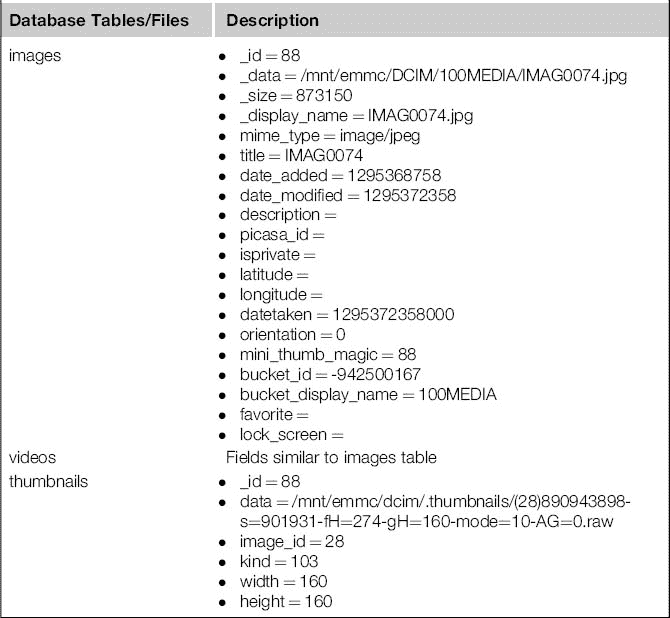

#### 分析师笔记

/data/data/com . Android . providers . media 的分析师笔记:

数据库名称包含卷标识(如果有)。例如，在参考 HTC excelsive 设备上，eMMC FAT32 文件系统的卷 ID 为 0xc7f80810。

如果目录有一个名为的文件。nomedia，则媒体存储将不会扫描和记录该目录中文件的元数据。

如果图像被删除，缩略图可能仍然存在。此外，即使元数据记录被删除，由于 YAFFS2 文件系统，它也可能是可恢复的。

还会扫描音频文件、相册等。

存在其他媒体扫描仪和应用程序，请检查这些。一种是在 SD 卡上存储缩略图，这样可以洞察删除的图片和视频。

### 油管（国外视频网站）

#### 应用信息

YouTube 是一个视频观看网站，现在归谷歌所有，为此他们为安卓开发了一个本地应用程序。

应用名称:YouTube

套餐名称:com.google.android.youtube

版本:1.6.21

设备:HTC 难以置信

应用开发者:谷歌

#### 目录、文件和文件类型

in/data/data/com . Google . Android . YouTube:

#### 重要的数据库表和文件

YouTube 偏好设置，包括设备密钥和观看的视频，位于/data/data/com . Google . Android . YouTube/shared _ prefs/YouTube . XML:

有关观看的特定电影的信息保存在/data/data/com . Google . Android . YouTube/cache 中的 XML 文件中:

#### 分析师笔记

/data/data/com . Google . Android . YouTube 的分析师笔记:

检查缓存目录和 shared_prefs 目录中的 XML 文件，了解观看视频的信息。

视频开头图像的快照通常可以通过文件雕刻或其他技术在设备上找到。

### 柯立斯媒体画廊

#### 应用信息

这款应用是为谷歌 Nexus One 开发的，提供了一个媒体画廊和扫描仪。

应用名称:柯立斯媒体画廊

套餐名称:com . coolis . media

版本:1.1.30682

设备:谷歌 Nexus One

应用开发者:柯立斯

#### 目录、文件和文件类型

in/data/data/com . cooli ris . media:

更重要的是，缩略图存储在 SD 卡上:

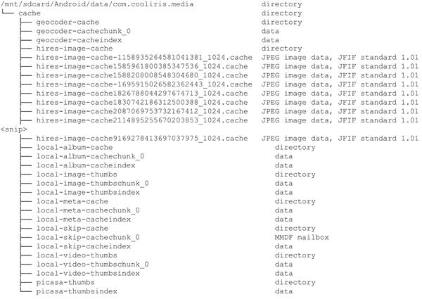

#### 重要的数据库表和文件

对于这个设备，picasa.db 是空的，但是数据库可能包含有用的信息。

#### 分析师笔记

/data/data/com.cooliris.media 的分析师笔记:

这款应用的真正价值在于，在设备上发现的媒体缓存在 SD 卡中的“/mnt/sd 卡/Android/data/com . cool iris . media/cache”，应该仔细检查。

### 谷歌地图

#### 应用信息

这是内置的谷歌地图应用程序，用于查看地图，搜索端点，甚至提供方向。

应用名称:谷歌地图

套餐名称:com.google.android.apps.maps

版本:4.4.0

设备:HTC 难以置信

应用开发者:谷歌

#### 目录、文件和文件类型

in/data/data/com . Google . Android . apps . maps:

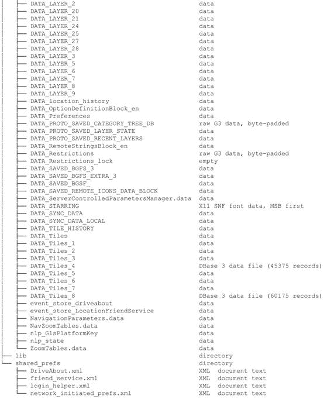

该应用程序还将数据存储在 SD 卡上:

#### 重要的数据库表和文件

虽然每个数据库都应该被检查，但在 HTC 不可思议网站上，有两个数据库包含了非常有用的信息。首先是[表 7.13](#T0070) 所示的 da_destination_history 数据库和[表 7.14](#T0075) 所示的 search_history 数据库。

表 7.13 重要数据库表和文件来自/data/data/com . Google . Android . apps . maps/databases/da _ destination _ history

表 7.14 重要数据库表和文件来自/data/data/com . Google . Android . apps . maps/databases/search _ history . db

文件目录也包含大量信息。例如，DATA_LAYER_24 文件的第一部分包含以下字符串:

存储在 SD 卡上的数据用于谷歌地图导航的转弯方向，转弯方向带有时间戳:

#### 分析师笔记

/data/data/com . Google . Android . apps . maps 的分析师笔记:

该应用程序在文件目录中存储了大量关于地图、切片、搜索等信息，应该仔细检查。

虽然每个数据库可能都不包含信息，但应该仔细检查 search_history.db 和 da_destination_history。

虽然 shared_prefs 方向包含一些信息，但大多数对法医检查没有用处。但是，身份验证令牌可以恢复，这在安全审查中可能很有意义。

导航功能还将地图数据缓存在 SD 卡上。实际方向的 wav 文件。如果你看一下文件上的时间标记，它们的开头是一个”。_speech_nav，“您可以确定方向是何时提供的，也可以听到实际说出的方向。

### 谷歌邮箱

#### 应用信息

谷歌为他们的 Gmail 服务提供了一个本地客户端:

应用名称:Gmail(谷歌邮件)

套餐名称:com.google.android.gm

版本:2.2

设备:HTC 难以置信

应用开发者:谷歌

#### 目录、文件和文件类型

in/mnt/sdcard/Android/data/com . Google . Android . apps . maps/:

#### 重要的数据库表和文件

Gmail 应用程序在 SQLite 数据库中存储了大量信息，关键表的示例如[表 7.15](#T0080) 所示。

表 7.15 重要数据库表和文件来自/data/data/com . Google . Android . GM/databases/mail store . book @ via forensics . com . db

#### 分析师笔记

/data/data/com . Google . Android . GM 分析师笔记:

每个已配置的 Gmail 帐户都有自己的 SQLite 数据库，其中包含全部电子邮件内容。

下载. db、建议. db 和 gmail.db 等其他数据库包含附加信息。

一些 SQLite 日志文件可能是可恢复的。

缓存/下载目录存储下载。

同步的 Gmail 帐户也在 shared_prefs 中的 Gmail.xml 中引用。

### 脸谱网

#### 应用信息

这是 office 脸书应用程序。

应用名称:脸书

套餐名称:com.facebook.katana

版本:1.2

设备:HTC 难以置信

应用开发者:脸书

#### 目录、文件和文件类型

in/data/data/com . Facebook . katana:

#### 重要的数据库表和文件

有一个主数据库，如[表 7.16](#T0085) 所示。

表 7.16 来自/data/data/com . Facebook . katana/databases/FB . db 的重要数据库表和文件

#### 分析师笔记

/data/data/com.facebook.katana 的分析师笔记:

FB . db 包含几乎所有的信息，上面只描述了三个表。完整的表格列表包括以下内容:

专辑

信息 _ 联系人

通知

安卓 _ 元数据

键值

perf_sessions

聊天

邮箱信息

照片

聊天信息

邮箱 _ 消息 _ 显示

搜索结果

默认用户图像

邮箱 _ 档案

流 _ 照片

事件

邮箱 _ 线程

• user_statuses

朋友

邮箱 _ 用户

用户值

文件目录包含大量来自脸书应用程序的图像。

### Adobe Reader

#### 应用信息

这是 pdf 文件的官方 adobe 阅读器

应用名称:Adobe Reader

包装名称:com.adobe.reader

版本:9.0.1

设备:HTC 难以置信

应用开发者:Adobe

#### 目录、文件和文件类型

In /data/data/com.adobe.reader:

#### 重要的数据库表和文件

com . adobe . reader . preferences . XML 首选项文件:

#### 分析师笔记

/data/data/com.adobe.reader 的分析师笔记:

缓存的 PDF 文件存储在缓存目录中。

缓存/com . adobe . reader . preferences . XML 中存储了最近文件的列表。

## 摘要

虽然安卓设备的收购是许多研究、开发和讨论的焦点，但这实际上只是安卓取证挑战的一半。逻辑和物理技术都需要分析。然而，物理采集后需要的分析量要大得多。本章的目标是提供一些技术，即使文件系统不受取证实用程序的支持，取证分析师或安全工程师也可以检查和提取采集的数据。通过利用现有的取证工具、Linux 命令，有时还有十六进制分析，调查所需的大部分数据都是可用的。

## 参考

1.*文件时间(窗口)*。(未注明日期)。检索于 2011 年 2 月 13 日，来自[http://msdn . Microsoft . com/en-us/library/ms 724290% 28vs . 85% 29 . aspx](http://msdn.microsoft.com/en-us/library/ms724290%28VS.85%29.aspx)。

2.承运人，英国。Mactime 输出—SleuthKitWiki。检索时间 2011 年 2 月 13 日，[http://wiki.sleuthkit.org/index.php?title=Mactime_output](http://wiki.sleuthkit.org/index.php%3Ftitle%3DMactime_output)。

3.凯西，e(n . d .)。文件系统时间戳的错误解释。检索时间:2011 年 2 月 13 日，来自[http://blog . cmdlabs . com/2009/05/08/文件系统时间戳的错误解释/](http://blog.cmdlabs.com/2009/05/08/misinterpretation-of-file-system-timestamps/) 。

4.*带墓碑的安卓调试*。(未注明日期)。2011 年 3 月 14 日检索自[。](http://crazydaks.com/debugging-in-android-with-tombstones.html)

5.*数字装配:熟练的照片取证——智能雕刻*。(未注明日期)。检索于 2011 年 2 月 13 日，[http://digital-assembly . com/products/adroit-photo-forensics/features/smart carting . html](http://digital-assembly.com/products/adroit-photo-forensics/features/smartcarving.html)。

6.*数字侦探—DCode* 。(未注明日期)。检索时间 2011 年 2 月 14 日，[http://www.digital-detective.co.uk/freetools/decode.asp](http://www.digital-detective.co.uk/freetools/decode.asp)。

7.*纪元转换器—纪元& unix 时间戳转换工具*。(未注明日期)。检索时间 2011 年 2 月 14 日，[http://www.epochconverter.com/](http://www.epochconverter.com/)。

8.Grundy。Linux LEO。检索时间:2011 年 2 月 19 日，来自[http://www.linuxleo.com](http://www.linuxleo.com)。

9.凯斯勒，G. (n.d .)。文件签名表。检索时间 2011 年 2 月 13 日，[http://www.garykessler.net/library/file_sigs.html](http://www.garykessler.net/library/file_sigs.html)。

10.洛杉矶罗斯。时间和时间戳。检索时间 2011 年 2 月 13 日，[http://digfor.blogspot.com/2008/10/time-and-timestamps.html](http://digfor.blogspot.com/2008/10/time-and-timestamps.html)。

11.*Rovio——愤怒的小鸟*。(未注明日期)。检索时间 2011 年 2 月 15 日，[http://www.rovio.com/index.php?page=angry-birds](http://www.rovio.com/index.php%3Fpage%3Dangry-birds)。

12.*手术刀:一款节俭、高性能的锉刀雕刻机*。(未注明日期)。检索时间 2011 年 2 月 13 日，[www.digitalforensicssolutions.com/Scalpel/](http://www.digitalforensicssolutions.com/Scalpel/)。

13.*我的 IP 地址是什么*。(未注明日期)。检索时间 2011 年 2 月 19 日，[http://www.whatismyip.com/](http://www.whatismyip.com/)。

14. *YAFFS 调试*。(未注明日期)。检索时间 2011 年 2 月 17 日，[http://www.yaffs.net/yaffs-debugging](http://www.yaffs.net/yaffs-debugging)。