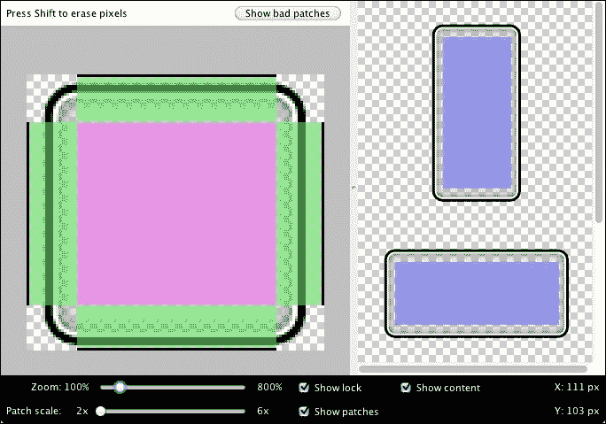

# 三、不同的安卓开发工具

我们已经讨论了游戏开发的不同安卓目标设备。在这一章中，我们将看看为安卓开发游戏的不同方式和工具。除了开发技能和知识之外，了解有助于使开发过程更加容易和有效的软件也是非常重要的。

安卓游戏开发得到了许多强大工具和库的支持或支持。让我们看一下开发过程的必备工具列表:

*   安卓 SDK
*   安卓开发工具
*   安卓虚拟设备
*   安卓调试桥
*   达尔维克调试监控服务器

这些是应该安装在安卓游戏开发者系统中的必备工具。没有这些，就不可能为安卓平台开发任何东西。尽管 ADB 和 AVD 对于开发来说并不是强制性的，但它们需要在物理和虚拟设备上测试和部署游戏，以便调试游戏。

# Android SDK

Android SDK 是为 Android 构建任何应用所需的主要开发工具包。不赘述，可以说 SDK 是任何安卓开发的骨架。这个 SDK 本身附带了几十个支持工具。它包含平台细节、API 和库以及 ADT 和 AVD。因此，在系统中集成安卓软件开发工具包为开发人员提供了所有必要的工具。始终使用最新的平台和其他工具更新 SDK 是一个非常好的做法。

升级可以通过 Android SDK 管理器完成。但是平台选择是手动的，建议根据需求只选择必要的平台。另一个最佳实践是拥有最新发布的平台以及最低目标版本的 Android(图片来源:[http://photos 4 . meetupstatic . com/photos/event/1/1/0/f/highles _ 441724367 . JPEG](http://photos4.meetupstatic.com/photos/event/1/1/0/f/highres_441724367.jpeg)):


# 安卓开发工具

**安卓开发工具** ( **ADT** ) 是 Eclipse IDE 的一个插件，旨在提供一个强大的集成环境来构建安卓应用。

ADT 扩展了 Eclipse 的功能，让开发人员快速设置新的 Android 项目，创建应用 UI，基于 Android 框架 API 添加包，使用 Android SDK 工具调试应用，甚至导出已签名(或未签名)`.apk`文件，以便分发应用。

强烈建议使用 ADT 在 Eclipse 中开发，这是最快的入门方式。借助它提供的引导式项目设置，以及工具集成、定制的 XML 编辑器和调试输出窗格，ADT 为开发安卓应用提供了令人难以置信的推动。

不过，对 Eclipse 的 ADT 支持正在被谷歌拉过来，所以建议开发者改用安卓 Studio。

# 安卓虚拟设备

一个**安卓虚拟设备** ( **AVD** ) 是一个真实设备的软件生产模型，可以配置定制的硬件规格。它也可以是真实设备的虚拟副本。这是任何安卓开发者最重要的工具之一。这使得开发人员可以在典型的安卓环境中测试应用，而无需使用实际的硬件设备，从而缩短开发时间(图片来源:[http://www . geek naut . cimg/2014/08/top-Android-仿真器-for-window 3 . png](http://www.geeknaut.cimg/2014/08/top-android-emulators-for-windows3.png)):


## 配置自动电压调节器

自动电压调节器由以下部件组成:

*   **硬件配置文件**:这个配置文件描述了虚拟设备的硬件特性。这可以配置硬件选项，如 QWERTY 键盘、摄像头、集成内存等。
*   **系统镜像映射**:运行安卓平台版本的可以根据安装的安卓平台集合进行配置。安卓平台可以通过安卓 SDK 管理器安装。
*   **专用磁盘空间**:你的开发机上的专用存储区域可以设置这个功能，保存模拟器的用户数据和虚拟 SD 卡。
*   **其他功能**:开发者甚至可以指定设备皮肤、屏幕尺寸、外观等虚拟设备的观感。

以下是通过 AVD 管理器创建 AVD 的简要步骤，位于`<SDK Path>/tools`目录下:

1.  在主屏幕上，点击**创建虚拟设备**。
2.  在**选择硬件**窗口，选择一个设备配置，如 **Nexus 5** ，然后点击**下一步**，然后点击**完成**。
3.  要使用现有设备配置文件作为模板开始定制设备，请选择一个设备配置文件，然后单击**克隆设备**。或者，要创建一个完整的定制仿真器，点击**新硬件配置文件**。
4.  设置以下内容以创建新的自定义模拟器:
    *   设备名称
    *   屏幕大小
    *   屏幕分辨率
    *   随机存取存储
    *   输入选项
    *   受支持的国家
    *   相机选项
    *   传感器选项
5.  设置好各项属性后，点击**完成**。

开发人员还可以使用命令行创建新的自定义仿真器，如下所示:

```java
android create avd -n <name> -t <targetID> [-<option> <value>] ...

```

在这里，可以设置以下选项:

*   `name`:这将是自定义 AVD 名称
*   `targetID`:这将是自定义 ID
*   `option`:可以包括设备屏幕密度、分辨率、摄像头等选项。

开发人员可以执行此命令来使用先前定义的 AVD:

```java
android list targets

```

然后，开发者可以运行以下命令:

```java
emulator –avd <avd_name> [options]

```

# 安卓调试桥

**Android Debug Bridge**(**ADB**)是用于在开发环境和虚拟设备或连接的 Android 设备之间建立通信的工具。它是一个客户端-服务器命令行程序，在三个元素上工作:

*   **开发机上的客户端**:作为客户端工作，可以通过 adb 命令调用。ADT 插件和 DDMS 等其他安卓工具也创建了 adb 客户端。
*   **守护进程**:在每个仿真器或设备实例上后台运行的后台进程。
*   **开发机上的服务器**:这是一个后台进程，运行在开发机上，管理客户端和服务器之间的通信。

启动 adb 时，客户端首先检查是否有一个 adb 服务器进程已经在运行。如果没有，它将启动服务器进程。当服务器启动时，它绑定到本地 TCP 端口`5037`，并监听来自 adb 客户端的命令——所有 adb 客户端都使用端口`5037`与 adb 服务器通信。

然后，服务器建立与所有正在运行的仿真器/设备实例的连接。它通过扫描仿真器/设备使用的范围`5555`到`5585`中的奇数端口来定位仿真器/设备实例。当服务器找到一个 adb 守护程序时，它会建立到该端口的连接。请注意，每个仿真器/设备实例都获得一对顺序端口，一个偶数端口用于控制台连接，一个奇数端口用于 adb 连接。

一旦服务器建立了与所有仿真器实例的连接，开发人员就可以使用 adb 命令来访问这些实例。因为服务器管理到仿真器/设备实例的连接，并处理来自多个 adb 客户端的命令，所以开发人员可以从任何客户端(或从脚本)控制任何仿真器/设备实例。

## 在安卓设备上使用 adb

首先要记住的一件事就是将开发设备置于 USB 调试模式。这可以通过导航到设置，点击**开发者选项**，勾选安卓 5.0 及以上版本的 **USB 调试**复选框来完成(其他安卓版本请参考[https://www . recovery-Android . com/enable-USB-调试-on-android.html](https://www.recovery-android.com/enable-usb-debugging-on-android.html) )。如果不这样做，开发电脑将无法识别该设备。

要知道的最重要的事情就是如何通过命令行访问 adb 文件夹。这是通过`cd`(更改目录)命令完成的。因此，如果(在 Windows 上)SDK 文件夹名为`android-SDK`，并且位于根目录(`c:`)下，您可以输入以下命令:

```java
cd c:/android-SDK

```

然后，要进入 adb 文件夹，请使用以下命令:

```java
cd platform-tools

```

此时，提示会这样说:

```java
C:\android-SDK\platform-tools>

```

现在，开发人员可以在找到并安装特定设备的驱动程序后，连接设备并测试 adb 连接:

```java
adb devices

```

如果一切设置正确，应该会附上设备列表。手机或平板电脑会有一个分配给它的号码，所以如果它没有说“Droid Razr”或“Galaxy Nexus”，不要感到惊讶。

对于普通用户来说，adb 与其说是一项任务，不如说是一项基本黑客任务的工具。除非开发人员知道他们在做什么，否则他们可能不应该在没有明确指示的情况下四处闲逛。当扎根设备时，了解这些基础知识可以帮助节省一些时间，并让开发人员提前做好准备。

除了根特定设备的具体说明之外，开发人员接下来需要的是手机或平板电脑的驱动程序。

最简单的方法通常是在谷歌上搜索*特定设备和驱动程序*。所以如果开发者有一个 Droid Razr，他/她应该搜索`Droid Razr Windows Drivers`。这几乎总是会将开发人员引向最佳链接。

另一种选择是从软件开发工具包下载通用串行总线驱动程序，这种选择只适用于库存安卓设备。为此，请再次启动 SDK 管理器。转到左侧的**可用包**选项卡，展开**第三方插件**条目，然后展开**谷歌公司插件**条目。最后，检查**谷歌 USB 驱动程序**包的条目。

请注意，USB 驱动程序包与 OS X 不兼容。

# 达尔维克调试监控服务器

无论是通过独立应用还是同名的 Eclipse 透视图访问， **达尔维克调试监控服务器** ( **DDMS** )都为检查、调试以及与仿真器和设备实例交互提供了便利的功能。您可以使用 DDMS 检查正在运行的进程和线程，浏览文件系统，收集堆和其他内存信息，附加调试器，甚至截图。对于模拟器，您还可以模拟模拟位置数据、发送短信和发起来电:


如上图所示，DDMS 主要可以跟踪、更新和显示以下信息:

*   所有正在运行的进程
*   每个进程的所有运行线程
*   每个进程消耗的堆
*   所有日志消息

在安卓系统上，每个应用都运行在自己的进程中，每个进程都运行在自己的虚拟机中。调试器可以附加到虚拟机的公开端口。DDMS 从一开始就连接到亚行。成功连接后，将在 adb 和 DDMS 之间创建虚拟机监控服务，该服务会在设备上启动和结束虚拟机时通知 DDMS。DDMS 通过 adb 检索虚拟机的进程标识，并在设备上有一个通过 adb 守护程序运行的活动虚拟机时，打开到虚拟机调试器的连接。DDMS 现在可以使用定制的有线协议与虚拟机通信。

DDMS 还监听默认调试端口，称为 **基端口**。基本端口是一个端口转发器，它可以接受来自任何调试端口的虚拟机流量，并将其转发给调试器。转发的流量由 DDMS **设备**视图中当前选择的进程决定。

# 其他工具

前面几节提到的元素是安卓开发的最低要求，通过这些元素可以创建一个完整的应用。然而，在一些其他工具的支持下，开发过程会变得容易得多。让我们来看几个这样的工具。这些工具对于安卓开发来说并不是强制性的，但是建议用于更好的开发过程。

## 日食

虽然 Eclipse 不是唯一可以用来开发安卓应用的 Java 开发环境，但它是目前最受欢迎的。这部分是由于它的成本(免费！)，但主要是由于安卓工具与 Eclipse 的强大集成。这种集成是通过 Eclipse 的 ADT 插件实现的，可以从安卓网站下载。

对于许多开发人员来说，将 Eclipse 用于安卓开发是一种众所周知的做法。这其中的一些原因如下:

*   免费 Eclipse 集成开发环境
*   直接安卓插件支持
*   DDMS 的直接支持
*   简单界面
*   安卓 NDK 支持

Android Studio的推出降低了 Eclipse 在安卓开发者中的受欢迎程度，因为Android Studio内置了支持任何安卓开发的一切。此外，在设计视图中使用它是一个非常简单的工具。谷歌本身正在大规模推广这一新工具。

Eclipse 安卓开发有几个缺点，因为它使用安卓 SDK 作为第三方工具。显著的缺点如下:

*   通过 Eclipse 进行调试有时很困难
*   亚行的配置很棘手
*   安卓清单必须手动管理
*   通过 Eclipse IDE设计视图非常复杂

Eclipse 是一个优秀的独立 IDE，但是在安卓开发方面，Android Studio赢得了比赛。

## 层级查看器

层次查看器，无论是通过独立应用还是相对较新的 Eclipse 透视图访问，都用于查看您的布局和屏幕在运行时是如何解析的。

它提供了应用布局和视图层次的图形表示，可用于诊断布局问题(图片来源:[https://media-mediatemple . netdna-SSL . com/WP-content/uploads/2012/03/da _ hierarchy _ viewer . png](https://media-mediatemple.netdna-ssl.com/wp-content/uploads/2012/03/da_hierarchy_viewer.png)):


## 绘制 9-Patch

说到图形设计，绘制 9 补丁工具就派上用场了。该工具允许您将传统的 PNG 图形文件转换为可拉伸的图形，这对于移动开发使用来说更加灵活和高效。该工具简化了在即时显示结果的环境中创建九补丁文件的过程:



## 亲

ProGuard 与安卓开发没有直接关联，但有助于保护开发者的知识产权。安卓游戏开发者使用 ProGuard 是非常常见的做法。

ProGuard 基本上将成员和方法包装成不可读的代码结构。该工具可以被配置为混淆结果二进制文件。ProGuard 还有助于优化二进制文件，从而减小整体封装尺寸。

当开发人员试图将预编译的 JARs 集成到 Android 项目中时，ProGuard 可能很难使用。如果已经通过 ProGuard 优化了 JAR，有时会在类结构中产生冲突。在这种情况下，必须将 ProGuard 配置为排除预编译的 JARs，以实现成功的构建。

总是建议使用 ProGuard 保护游戏类不被逆向工程或反编译。

## 素材优化工具

我们都知道安卓硬件配置的广阔范围。优化素材以减少运行时内存使用和不必要的数据处理总是必要的。在游戏中，图形素材占据了大部分存储和内存。

### 全素材优化

未优化的素材可能包含一些不必要的数据，如不透明素材中的透明度信息、EXIF 数据、未使用的颜色信息、额外的位深度等。

素材优化工具有助于摆脱这一负担。然而，使用这类工具很棘手，因为素材质量可能会下降。开发人员在使用这些工具时应该非常谨慎。

例如，如果一个素材应该是 24 位的，但是用 8 位优化器工具进行了优化，那么它肯定会失去它的视觉质量。所以，任何游戏都不建议过度优化，开发人员有责任使用适当的优化技术来保持游戏质量。

以下是一些这样的素材优化工具:

*   巴努特
*   迷奸药
*   暴乱
*   jpegmini
*   PNGGauntlet

在这些工具的帮助下，艺术素材可以优化到其大小的 80-90%。但是许多开发人员不喜欢定期使用它们，原因如下:

*   开发人员不会单独优化每项素材，这将导致少数素材的质量损失。
*   选择合适的工具进行优化真的很难。有时候同一个作业需要多个工具，拖慢了整体开发进程。

### 创建精灵

在许多情况下，人们注意到大量的小型艺术素材正在游戏中被单独使用。这可能会导致游戏的关键性能滞后。建议使用精灵构建工具将这些素材合并为一个，以节省空间和时间。SpriteBuilder 和 TexturePacker 就是这类工具的两个很好的例子。

# 测试工具

对于任何开发过程，测试都是非常重要的。对于安卓游戏开发来说，也有一些工具和流程可以让测试变得更容易。

## 创建测试用例

活动测试是以结构化的方式编写的。确保将您的测试放在一个独立的包中，不同于测试中的代码。按照惯例，您的测试包名称应该与应用包同名，并以`.tests`为后缀。在您创建的测试包中，为您的测试用例添加 Java 类。按照惯例，您的测试用例名称也应该与您想要测试的 Java 或 Android 类同名，但以`Test`为后缀。

要在 Eclipse 中创建新的测试用例，请执行以下步骤:

1.  在包浏览器中，右击测试项目的`/src`目录，选择**新建** | **包**。
2.  将**名称**字段设置为`<package_name>.tests`(例如`com.example.android.testingfun.tests`，点击**完成**。
3.  右键点击你创建的测试包，选择**新建** | **类**。
4.  将**名称**字段设置为`<activity_name>Test`(例如`MyFirstTestActivityTest`，点击**完成**。

## 设置测试夹具

测试夹具由对象组成，这些对象必须初始化才能运行一个或多个测试。要设置测试夹具，您可以在测试中覆盖`setUp()`和`tearDown()`方法。测试运行人员在运行任何其他测试方法之前自动运行`setUp()`，在每个测试方法执行结束时自动运行`tearDown()`。您可以使用这些方法来保存测试初始化的代码，并将其从测试方法中分离出来。

要在 Eclipse 中设置测试夹具，请按照下面列出的步骤操作:

1.  在包资源管理器中，双击您之前创建的测试用例，调出 Eclipse Java 编辑器，然后修改您的测试用例类，扩展`ActivityTestCase`的一个子类。例如:

    ```java
    public class MyFirstTestActivityTest extends ActivityInstrumentationTestCase2<MyFirstTestActivity> {
    ```

2.  接下来，将构造函数和`setUp()`方法添加到您的测试用例中，并为您想要测试的活动添加变量声明。例如:

    ```java
    public class MyFirstTestActivityTest
            extends ActivityInstrumentationTestCase2<MyFirstTestActivity> {

        private MyFirstTestActivity mFirstTestActivity;
        private TextView mFirstTestText;

        public MyFirstTestActivityTest() {
            super(MyFirstTestActivity.class);
        }

        @Override
        protected void setUp() throws Exception {
            super.setUp();
            mFirstTestActivity = getActivity();
            mFirstTestText =
                    (TextView) mFirstTestActivity
                    .findViewById(R.id.my_first_test_text_view);
        }
    }
    ```

测试运行程序调用构造函数来实例化测试类，而测试运行程序在运行测试类中的任何测试之前调用`setUp()`方法。

通常，在`setUp()`方法中，应该调用`setUp()`的超类构造函数，这是 JUnit 所需要的

您可以通过以下方式初始化测试夹具状态:

1.  定义存储设备状态的实例变量。
2.  创建并存储对被测活动实例的引用。
3.  获取对要测试的活动中任何用户界面组件的引用。

开发人员可以使用`getActivity()`方法获取对被测活动的引用。

## 添加测试前提条件

作为健全性检查，验证测试夹具已经被正确设置，并且您想要测试的对象已经被正确实例化或初始化是很好的实践。这样，您就不必看到测试失败，因为您的测试设备的设置出了问题。按照惯例，检验测试夹具的方法叫做`testPreconditions()`。

例如，您可能想要向您的测试用例中添加一个像这样的`testPreconditions()`方法:

```java
public void testPreconditions() {
    assertNotNull("mFirstTestActivity is null", mFirstTestActivity);
    assertNotNull("mFirstTestText is null", mFirstTestText);
}
```

断言方法来自 Junit `Assert`类。通常，您可以使用断言来验证您想要测试的特定条件是否为真。

如果条件为假，断言方法抛出`AssertionFailedError`异常，然后通常由测试运行人员报告。您可以在断言方法的第一个参数中提供一个字符串，以便在断言失败时给出一些上下文细节。

如果条件为真，测试通过。在这两种情况下，测试运行人员继续运行测试用例中的其他测试方法。

## 添加测试方法以验证活动

接下来，添加一个或多个测试方法来验证您的活动的布局和功能行为。

例如，如果您的活动包括一个文本视图，您可以像这样添加一个测试方法来检查它是否有正确的标签文本:

```java
public void testMyFirstTestTextView_labelText() {
    final String expected =
            mFirstTestActivity.getString(R.string.my_first_test);
    final String actual = mFirstTestText.getText().toString();
    assertEquals(expected, actual);
}
```

`testMyFirstTestTextView_labelText()`方法只是检查由布局设置的文本视图的默认文本是否与`strings.xml`资源中定义的预期文本相同。

### 注

在命名测试方法时，您可以使用下划线将正在测试的内容与正在测试的特定案例分开。这种风格使得更容易准确地看到正在测试的案例。

当进行这种类型的字符串值比较时，最好从您的资源中读取期望的字符串，而不是在比较代码中硬编码该字符串。这可以防止您的测试在资源文件中修改字符串定义时很容易被破坏。

要执行比较，请将预期字符串和实际字符串作为参数传递给`assertEquals()`方法。如果值不相同，断言将抛出`AssertionFailedError`异常。

如果你添加了一个`testPreconditions()`方法，把你的测试方法放在你的 Java 类的`testPreconditions()`定义之后。

您可以从 Eclipse 中的包资源管理器轻松地构建和运行您的测试。要构建和运行测试，请执行以下步骤:

1.  将安卓设备连接到您的机器。在设备或仿真器上，打开**设置**菜单，选择**开发者选项**，确保 **USB 调试**已启用。
2.  在项目浏览器中，右击您之前创建的测试类，选择**运行方式** | **安卓 JUnit 测试**。
3.  在**安卓设备选择器**对话框中，选择刚刚连接的设备，然后点击**确定**。
4.  在 JUnit 视图中，验证测试通过，没有错误或失败。

# 性能分析工具

在屏幕上放置像素包括四个主要的硬件:中央处理器计算显示列表，图形处理器向显示器呈现图像，存储器存储图像和数据，电池提供电力。这些硬件中的每一个都有限制；推动或超过这些限制会导致您的应用变慢，降低显示性能，或者耗尽电池。

要发现导致您的特定性能问题的原因，您需要深入了解，使用工具收集有关应用执行行为的数据，将这些数据以列表和图形的形式呈现出来，理解和分析您看到的内容，并改进您的代码。

Android Studio和你的设备提供了分析工具来记录和可视化你的应用的渲染、计算、内存和电池性能。

# Android 工作室

Android Studio是安卓应用开发的官方 IDE，基于 IntelliJ IDEA。除了您对 IntelliJ 的期望之外，Android Studio还提供了以下功能:

*   基于梯度的柔性建筑系统
*   构建变体和多个`.apk`文件生成
*   帮助您构建通用应用功能的代码模板
*   丰富的布局编辑器，支持拖放主题编辑
*   lint 工具来捕捉性能、可用性、版本兼容性和其他问题
*   ProGuard 和应用签名功能
*   内置对谷歌云平台的支持，使集成谷歌云消息和应用引擎变得容易

如果您是Android Studio或 IntelliJ IDEA 界面的新手，本节将介绍Android Studio的一些关键功能。

## 安卓项目视图

默认情况下，Android Studio在安卓项目视图中显示您的项目文件。此视图显示了项目结构的扁平版本，它提供了对安卓项目关键源文件的快速访问，并帮助您使用基于 Gradle 的构建系统。安卓项目视图:

*   在模块层次结构的顶层显示最重要的源目录
*   将所有模块的构建文件分组到一个公共文件夹中
*   将每个模块的所有清单文件分组到一个公共文件夹中
*   显示所有渐变源集中的资源文件
*   将不同地区、方向和屏幕类型的资源文件按资源类型分组到一个组中

安卓项目视图在`Gradle Scripts`下显示项目层次结构顶层的所有构建文件。每个项目模块在项目层次结构的顶层显示为一个文件夹，在顶层包含以下四个元素:

*   `java/`:模块的源文件
*   `manifests/`:模块的清单文件
*   `res/`:模块的资源文件
*   `Gradle Scripts/`:渐变构建和属性文件

### 注

例如，安卓项目视图将同一元素下不同屏幕密度的`ic_launcher.png`资源的所有实例分组。

磁盘上的项目结构不同于此展平表示。要切换回隔离项目视图，请从**项目**下拉菜单中选择您的项目。

## 内存和中央处理器监视器

Android Studio 提供了内存和 CPU 监控视图，这样您就可以轻松监控应用的性能和内存使用情况，以跟踪 CPU 使用情况，查找解除分配的对象，定位内存泄漏，并跟踪连接的设备正在使用的内存量。当你的应用在设备或模拟器上运行时，点击运行时窗口左下角的**安卓**标签，启动**安卓运行时**窗口。点击**内存|中央处理器**标签。

当您在 Android Studio 中监控内存使用情况时，您可以启动垃圾收集，并同时将 Java 堆转储到特定于 Android 的 HPROF 二进制格式文件中的堆快照。HPROF 查看器显示类、每个类的实例和一个引用树，以帮助您跟踪内存使用情况并发现内存泄漏。

Android Studio允许你跟踪内存分配，因为它监控内存使用。跟踪内存分配允许您在执行某些操作时监视对象的分配位置。了解这些分配使您能够调整与这些操作相关的方法调用，以优化应用的性能和内存使用。


# 跨平台工具

虽然我们只说安卓游戏开发，但是没有跨平台的支持，游戏开发不可能高效。我们已经讨论了游戏设计的灵活性。从典型的技术角度来看，应该可以为 iOS、Windows、控制台等各种平台部署游戏。

请始终记住，跨平台移动开发并不像编写一次代码、通过翻译工具以及将 iOS 和安卓应用发布到各自的应用商店那样简单。

使用跨平台移动开发工具可以减少在两个平台上开发应用的时间和成本，但是用户界面需要更新以匹配每个系统。例如，需要在两者之间进行调整，以使菜单和控制命令与安卓设备和 iOS 设备固有的不同操作方式的 UX 相匹配。

有很多工具支持跨平台开发。让我们来看看其中的几个:

## Cocos2d-x

Cocos2d 主要用于二维游戏开发。它为开发人员提供了五种不同的分叉或平台可供选择，基于他们喜欢的编程语言，如 C++、JavaScript、Objective C、Python 和 C#(图片来源:[http://www . cocos2d-x . org/attachments/802/cocos2d x _ landscape . png](http://www.cocos2d-x.org/attachments/802/cocos2dx_landscape.png)):


首先，这个工具对于安卓、iOS 和 Windows Phone 都是高效的。开发平台主要是 2D；然而，从 Cocos2d-x 3.x 也可以开发 3D 游戏。

Cocos2d-x 与原生安卓协同工作，可以分别支持不同的处理器架构。该工具在基于 Unix 的环境中工作。

有一个庞大的开发者社区在 Cocos2d-x 上开发游戏，下面从安卓游戏开发的角度来看这个跨平台开发引擎的优缺点:

优点如下:

*   支持最常见的编程语言，如 C++
*   在本地环境中工作
*   轻量级优化库
*   通用 OpenGL 渲染系统
*   2D 开发支持的所有智能手机功能
*   完全免费的开源引擎

缺点如下:

*   主要支持 2D 发展
*   跨平台部署既棘手又复杂
*   性能和内存优化很弱
*   没有可视化编程支持
*   引擎中不提供调试工具
*   大多在手机平台上工作

## 三维统一

Unity3D 是安卓和 iOS 游戏开发者中最受欢迎的跨平台引擎。虽然它主要针对移动平台进行了优化，但它足够强大，可以为其他主要游戏平台部署游戏，例如 PC、Mac、控制台、web、Linux、Xbox、PlayStation 等。目前支持 17 种不同的游戏开发平台(图片来源:[http://img . danawa . cimg/desc files/3/545/2544550 _ 1 _ 1390443907 . png](http://img.danawa.cimg/descFiles/3/545/2544550_1_1390443907.png)):


一旦你的游戏在你选择的所有平台上发布，Unity3D 甚至会帮助你将它分发到合适的商店，获得社交份额，并跟踪用户分析。

Unity3D 拥有最大的游戏开发者社区，几乎在游戏开发的每个方面都有巨大的支持。它有单独的商店，你可以在那里找到有效的预建定制库、预建插件等等，这有助于开发人员大大减少开发时间。以下是 Unity3D 的主要优缺点。

优点如下:

*   支持 17 种不同的游戏平台
*   非常简单的部署程序
*   支持可视化编程的可视化编辑器
*   内置强大的调试工具
*   庞大的图书馆支持
*   无障碍开发
*   内置强大的内存和性能优化器

缺点如下:

*   相比之下更大的图书馆规模
*   性能稍重(但是，它在一天天提高)
*   仅支持脚本语言(C#、JavaScript 和 Boo)
*   不完全免费用于商业目的
*   主要适用于 3D

## 虚幻引擎

最近发布的虚幻引擎 4 是一款非常强大的跨平台游戏引擎。此前，该引擎仅专注于控制台和 PC 平台，但已将其支持范围扩展至 Android 和 iOS 等移动游戏平台(图片来源:[http://up . 11t . IR/view/691714/1425334231-unreal-engine-logo . png](http://up.11t.ir/view/691714/1425334231-unreal-engine-logo.png)):


关于虚幻引擎 4 是否比 Unity3D 更好，一直有很多争论。两者各有利弊。让我们来看看虚幻引擎 4 的优缺点:

优点如下:

*   蓝图功能允许灵活的可视化编程
*   通用 C++ 语言对开发人员更友好
*   图形处理非常出色
*   内置动态阴影系统
*   简单易懂，开始制作游戏
*   设备可扩展性方面的广泛支持
*   编辑内材质设计

缺点如下:

*   移动优化仍未达标
*   缺乏 2D 开发工具
*   缺乏第三方插件
*   与精灵一起工作对于移动开发来说是一件痛苦的事情
*   仍然专注于高配置硬件平台

## 语音间隙

PhoneGap 归 Adobe 所有，是一个免费资源，初次使用的应用开发者可以用它来翻译 HTML5、CSS 和 JavaScript 的代码。

他们在你可以开发应用的每个平台的末端维护 SDK，所以你少了一件要担心的事情。一旦你的应用完成，你可以与你的团队成员分享它，以供审查，看看你是否需要做出任何改进。

除了 iOS 和安卓，PhoneGap 还为黑莓和 Windows 开发应用。所以是真正的跨平台移动开发工具(图片来源:[http://blogs . perceptionsystem . com/WP-content/uploads/2016/03/phone gap . png](http://blogs.perceptionsystem.com/wp-content/uploads/2016/03/phonegap.png)):


PhoneGap 具有以下优点:

*   支持几乎所有移动平台
*   轻量级应用构建
*   支持 HTML、CSS 和 JavaScript
*   科尔多瓦应用的安装就像一个本地应用
*   PhoneGap 是开源免费的

它有以下缺点:

*   缺乏平台支持
*   缺少第三方插件
*   原生用户界面仍然难以使用

## 皇冠

Corona 的 SDK 附带承诺，你可以在下载后五分钟内开始编写你的新应用。这是另一款针对 2D 游戏显卡进行了优化的跨平台移动开发工具，可以帮助您以比从头开始编写所有代码快 10 倍的速度制作游戏(图片来源:[https://qph . EC . quoracdn . net/main-qimg-fad 64 a 16 e 531773325448 E6 ca 699d 117](https://qph.ec.quoracdn.net/main-qimg-fad64a16e531773325448e6ca699d117)):


Corona 的编程语言是 Lua，用 C 语言编写，使其成为跨平台语言。科罗纳选择 Lua 是因为他们发现它非常健壮，移动应用占用空间小。

科罗娜有以下优点:

*   在 FPS 方面具有良好的应用性能
*   良好的内置仿真器
*   轻型应用构建

它有以下缺点:

*   使用不太流行的脚本语言 Lua
*   不免费
*   更少的插件支持
*   无设备上调试支持

## 钛

使用 JavaScript，Titanium 的 SDK 创建原生 iOS 和 Android 应用，同时为您制作的所有应用重用 60%到 90%的相同代码，从而为您节省大量时间(图片来源:[http://mobile . e20lab . info/WP-content/uploads/sites/2/2014/04/Titanium . png](http://mobile.e20lab.info/wp-content/uploads/sites/2/2014/04/titanium.png)):


因为钛是一个开源工具，成千上万的开发人员不断为它做贡献，让它变得更好，并赋予它更多的功能。如果你碰巧在它的系统中发现了一个 bug，你也可以这么做。

优点如下:

*   初始阶段的快速启动灵活性
*   轻量级应用构建
*   通用 JavaScript 语言
*   安卓和 iOS 上的网络和移动支持
*   开放源码

缺点如下:

*   缺少插件支持
*   缺少平台支持范围
*   基于脚本的开发增加了复杂性和工作量
*   性能因不同平台而异
*   与其他工具相比，优化较差

# 总结

开发工具对于任何游戏开发都是必不可少的；然而，它们在游戏设计和开发前分析阶段的优先级一直很低。当需要这些工具时，就意识到它们的必要性。

我们只讨论了安卓开发的所有必备工具。但是现代游戏开发需要跨硬件平台和操作系统的灵活性。这就是跨平台开发引擎出现的地方。这些工具帮助开发过程变得更快、更高效；然而，这是以性能稍微下降和更大的构建大小为代价的。在大多数情况下，开发人员对跨平台引擎的控制有限，但是如果游戏是在本机 SDK 上开发的，则可以获得完全的控制。

开发工具不仅对开发和调试有用——它们在优化游戏和数据保护方面非常有效，这可能不会对游戏产生直接影响。一个好的开发人员必须使用优化工具来交付一个性能更好的游戏。