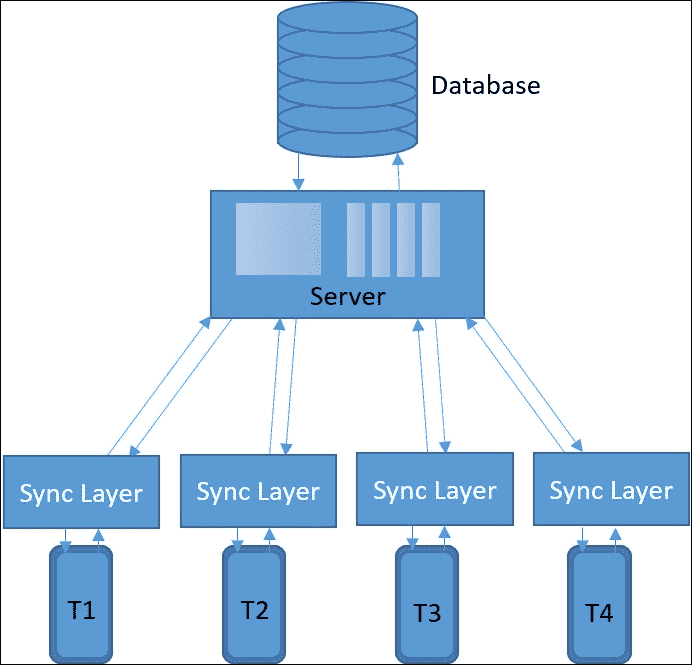
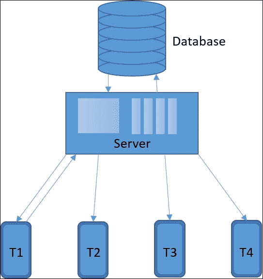

# 十三、第三方集成、货币化和服务

安卓游戏开发或任何其他智能手机游戏开发不实现后台服务都是不完整的。后台服务帮助游戏传播和执行达到下一个水平。

游戏开发的风格随着时间发生了很大的变化。引入了新的风格和货币化技术。新的游戏服务已经被创建来支持这些技术。许多科技公司开始自己的服务来创造一个新的行业。我们专业做的任何工作，主要都是为了谋生，游戏行业也不例外。然而，这个行业的目标是娱乐、乐趣和设备与用户之间的互动。开发者基于此赚钱。所有的第三方集成和服务都有助于开发者将游戏货币化，这直接或间接有助于增加收入。

服务可以是任何非游戏专用的后台支持，可以改善游戏体验。大多数情况下，服务使用互联网和设备硬件和软件程序。通常，基于服务器的服务与应用一起提供服务。

我们将在本章中通过以下主题详细了解这些方面:

*   谷歌游戏服务
*   多人实现
*   分析工具
*   安卓应用内购买集成
*   安卓游戏内广告
*   货币化技术
*   规划游戏收入
*   用户获取技术
*   特色安卓游戏
*   发布安卓游戏

# 谷歌游戏服务

谷歌是目前最大的安卓应用平台。此外，谷歌是安卓操作系统的所有者。所以，没有人比谷歌更适合做安卓平台的服务提供商了。

谷歌游戏服务是所有安卓设备访问所有谷歌服务产品应用接口的后台服务。它于 2012 年推出，旨在支持安卓开发并使其更上一层楼。

谷歌游戏服务包中最常用的服务有:

*   谷歌分析
*   谷歌 IAB
*   谷歌排行榜
*   推送通知

## 谷歌分析

谷歌分析是一项追踪游戏中每一个事件的服务。这可以揭示用户行为、用户动作、每天播放的用户数量、每个用户的播放时间等等。因此，任何数据都不会被开发人员忽视。这些分析数据帮助开发者识别游戏中的关键部分。有了这个帮助，开发者可以改进游戏，获得更好的体验。

### 意义

在测试或游戏测试阶段，追踪游戏中的每一个问题并不总是可能的。当游戏变大，拥有庞大的用户群，那么未知的问题就更有可能暴露出来。谷歌分析在这些领域有所帮助，不仅是用户的当前行为，还有游戏性能。

### 整合提示

谷歌分析主要用于跟踪游戏事件。所以，追踪事件必须非常谨慎地决定。触发点也必须以战略性的方式放置。开发人员可能不需要所有的事件和行为数据。更多的跟踪甚至可能对应用有害，因为游戏中会有更多的数据使用和更多的处理。

开发人员应该始终优先考虑事件。事件应该根据游戏流程设计进行跟踪。然后应该通过用户操作来验证它们。

从的货币化角度来看，跟踪用户何时触及付费墙或者哪个版块被访问的次数更多应该始终是一个优先事项。在访问量最大的部分做一个简单的广告可能会增加应用的收入。

### 最佳利用率

谷歌分析工具的最佳利用率与任何其他安卓应用分析工具没有什么不同。这个工具是跟踪用户移动的最好方法，通过数据开发者可以很容易地预测用户对游戏的动机或意图。

## 谷歌 IAB

在现代游戏世界中，有多种方法将应用货币化。应用内计费是最流行的方法之一。谷歌游戏服务附带谷歌应用内计费工具。这个工具与谷歌 Play 商店直接相关。

通过这个工具，开发者可以在游戏内部设计一些可购买的内容。对于用户来说，从安卓应用的内置商店购买非常容易。

### 谷歌 IAB 模型

让我们快速浏览一下谷歌 IAB 中的三个可购买选项。我们将在本章后面详细介绍它们:

*   消耗品
*   非消耗品
*   捐款

#### 消耗品

用户可以在商店多次购买这个物品。谷歌不跟踪这类项目。这类物品最常见的例子是游戏中的虚拟货币。很多游戏都是围绕虚拟货币设计的，很多时候，这个因素是游戏货币化的中坚力量。

#### 非消耗性物品

对用户来说基本都是一次性购买。谷歌总是跟踪用户通过谷歌实验室为任何应用进行的这些购买。即使当用户卸载并重新安装应用时，也可以将非消耗品购买恢复到用户的帐户。

这个类别下最常见的项目就是游戏模式。在很多游戏中，有一些开放模式，也有一些可以购买。这个系统也适用于尝试购买货币化方面。

#### 订阅

订阅基本上是一种基于时间的货币化模式。这主要用于典型的基于服务的应用，如音乐频道、电视频道、图书馆频道等。然而，很少有游戏使用订阅来赚钱。

### 整合谷歌 IAB

谷歌游戏服务自带 IAB APIs。开发人员需要在谷歌 Play 商店注册应用以获得实时访问。这个系统使用的是物品编号，也就是 SKU。每个 SKU 代表游戏商店中的一个项目。开发者可能不会将谷歌游戏帐户中创建的所有 SKU 用于特定游戏。

### 谷歌 IAB 的优缺点

我们已经注意到，谷歌 IAB 提供了一个在应用中实现直接数字购买系统的平台。这为开发人员和消费者节省了大量的精力和时间。让我们快速了解一下谷歌 IAB 的优势:

*   Google IAB 提供了一个直接的平台来购买应用中的应用组件或服务
*   谷歌实验室简化了应用的货币化方面
*   谷歌 IAB 为消费者提供了多种支付选择
*   谷歌实验室存储和管理非消耗性物品的采购
*   谷歌 IAB 有简单的实现和出色的客户支持
*   轻松退款流程完全由谷歌 IAB 管理

到目前为止，谷歌 IAB 已经被证明是一个对开发者和消费者或用户都很好的系统。然而，有几个领域谷歌 IAB 仍然落后。现在，让我们看看谷歌实验室需要改进的领域:

*   谷歌 IAB 仅通过谷歌游戏服务提供计费服务
*   谷歌 IAB 仍然不支持运营商计费
*   并非每个用户都愿意向谷歌提供信用卡信息

尽管存在这些问题，谷歌 IAB 仍然是安卓开发者最受欢迎的计费平台。谷歌已经开始将运营商计费服务纳入谷歌 IAB，这可能被证明是最重要的功能。

## 谷歌排行榜

排行榜是游戏和类似竞技应用的平台，每个用户都可以在其中跟踪自己在其他用户中的进度。排行榜已经被证明是许多游戏的驱动力。谷歌游戏服务附带了一个内置的安卓应用排行榜系统。

### 意义

在游戏中集成排行榜总是一个优势，因为它可以帮助用户相互竞争，即使游戏不是多人游戏。试图变得比别人优越是人类的心理。使用此功能，用户参与度会比平时更高。然而，排行榜上的竞争标准必须仔细选择。

排行榜驱动游戏的一个很好的例子是 Candy Crush。用户非常活跃，玩这个简单的游戏是为了在排行榜上领先于他们的朋友。

### 整合谷歌排行榜

没有单独的谷歌排行榜包。这可以通过集成谷歌游戏服务本身来实现。然而，排行榜必须在谷歌游戏账户中设置才能使用。

开发人员可以选择任何参数或计算来存储排行榜数据。谷歌排行榜支持来自单个游戏的多个排行榜的数据。大多数开发人员有效地使用这个特性来显示不同的领导列表，这取决于时间段、地区或一些其他定制的参数。

### 各种排行榜

谷歌排行榜的主要变化有两种类型:

*   社交排行榜
*   公共排行榜

#### 社交排行榜

社交排行榜仅列出与玩家的圈子有联系的玩家。对于这个功能，玩家必须登录他们各自的谷歌账户。这对于已经玩过并选择在同一个应用中分享他们的活动的玩家来说是有限制的。

#### 公众排行榜

公共排行榜存储选择公开张贴分数的玩家的数据。否则这个数据不会被谷歌排行榜显示出来，即使他们的分数比公众排行榜上现有的玩家更好。

### 存储和显示排行榜的选项

排行榜存储可按升序和降序分为两种类型。就谷歌排行榜而言，它们被称为:

*   越大越好
*   越小越好

分数始终是一个数值，它又分为三种格式:

*   数值格式
*   时间格式
*   货币格式

在数值的情况下，开发人员可以指定小数位置。在时间格式的情况下，开发人员需要以毫秒为单位传递分数，它将自动解释为 *hh:mm:ss* 格式。在货币格式的情况下，开发人员需要预先指定货币及其单位值。排行榜将只接受单位中的值，并将其转换为指定的单位格式。

排行榜可以有独特的图标来显示或指示独特的排行榜。

## 推送通知

推送通知服务可以通过**谷歌云消息** ( **GCM** ) 服务实现。让我们快速了解一下云消息体系结构。

主要有四个组件用于使用 GCM 为 Android 实现推送通知:

*   数据库ˌ资料库
*   计算机网络服务器
*   目标设备
*   GCM 服务

### 数据库

数据库存储客户端或目标设备向 GCM 服务注册的详细信息。因此，每个设备只需要注册一次。相同的细节用于向注册的目标设备发送推送通知。

### 服务器

开发者需要搭建一个服务器来实现和控制推送通知。

### 目标设备

目标或客户端设备是从 GCM 推送消息的平台。每个目标设备都有一个唯一的注册标识。没有注册，目标设备无法接收任何通知。

### GCM 服务

GCM 服务负责注册设备并向其推送消息。服务器向 GCM 服务请求注册标识列表和定制消息。GCM 仅负责将给定内容推送到指定设备:


#### 使用 GCM 的推送通知系统的工作流程

现在，让我们讨论推送通知工作流。在上图中，推送通知系统根据指示的指标工作(例如， **a** 、 **b** 、 **c** 等):

1.  **a** :客户端或目标设备请求 GCM 注册应用 ID 和发送方 ID。
2.  **b** :注册成功后，GCM 将注册 ID 发送回发送方。
3.  **c** :设备将注册 ID 发送到开发者的服务器。
4.  **d** :服务器将注册 ID 存储到数据库中。
5.  **e** :开发人员对定制内容的推送通知发起流程。
6.  **f** :服务器从数据库中获取注册标识列表。
7.  **g** :数据库提供所有的注册 id。
8.  **h** :服务器用开发者指定的内容和注册 id 请求 GCM。
9.  **i** : GCM 根据各自的注册标识将相同的内容推送到各自的目标设备。

### 整合推送通知

整合推送通知分三步完成:

1.  应用集成
2.  GCM 设置
3.  服务器设置

#### 应用集成

开发者需要为应用设置一个 GCM 客户端，这是 GCM 通信的媒介。以下是关于 GCM 通信服务客户端开发的简介。

它需要一组清单权限:

```java
<uses-permission android:name="android.permission.INTERNET" />
<uses-permission android:name="android.permission.GET_ACCOUNTS" />
<uses-permission android:name="android.permission.WAKE_LOCK" />
<uses-permission android:name="com.google.android.c2dm.permission.RECEIVE" />
<permission android:name="com.example.gcm.permission.C2D_MESSAGE"
        android:protectionLevel="signature" />
<uses-permission android:name="com.example.gcm.permission.C2D_MESSAGE" />
```

该清单还要求声明全球通信模块接收器和全球通信模块服务:

```java
<receiver android:name="com.google.android.gms.gcm.GcmReceiver"
            android:exported="true" android:permission="com.google.android.c2dm.permission.SEND" >
<intent-filter>
<action android:name="com.google.android.c2dm.intent.REGISTRAION" />
<action android:name="com.google.android.c2dm.intent.RECEIVE" />
<category android:name="com.example.gcm" />
      </intent-filter>
</receiver>
<service android:name=".GcmService" android:exported="false">
      <intent-filter>
<action android:name="com.google.android.c2dm.intent.RECEIVE" />
      </intent-filter>
</service>
```

让我们来看看用 GCM 注册应用的过程。注册可以通过多种方式完成，具体取决于开发风格。我们将遵循主安卓活动中最简单的流程，并存储注册标识，用于应用的一次性注册。

以下是必需的声明:

```java
private final Context testContext = this;
private final String SENDER_ID = "<Application ID from Google developer console>";
private final String SHARED_PREF = "com.test.gcmclient_preferences";
private final String GCM_TOKEN = "testgcmtoken";
```

登记码应放在`onCreate()`内:

```java
SharedPreferences appPrefs = testContext.getSharedPreferences(SHARED_PREF, Context.MODE_PRIVATE);
String token = appPrefs.getString(GCM_TOKEN, "");
if (token.isEmpty()) 
{
  try 
  {
    InstanceID instanceID =  InstanceID.getInstance(testContext);
    token = instanceID.getToken(SENDER_ID,  GoogleCloudMessaging.INSTANCE_ID_SCOPE, null);
    if (token != null && !token.isEmpty()) 
    {
      SharedPreferences.Editor prefsEditor = appPrefs.edit();
      prefsEditor.putString(GCM_TOKEN, token);
      prefsEditor.apply();
    }
  }
  catch (Exception e) 
  {
    e.printStackTrace();
  }
}
```

现在，让我们定义`GCMService.java`来处理 GCM 消息:

```java
public class GcmService extends GcmListenerService 
{
  @Override
  public void onMessageReceived(String from, Bundle data) 
  {
    JSONObject jsonObject = new JSONObject();
    Set<String> keys = data.keySet();
    for (String key : keys) 
    {
      try 
      {
        jsonObject.put(key, data.get(key));
      } 
      catch (JSONException e) 
      {
        e.printStackTrace();
      }
    }
    try 
    {
      sendNotification("Received: " + jsonObject.toString(5));
    } 
    catch (JSONException e) 
    {
      e.printStackTrace();
    }
  }

  @Override
  public void onDeletedMessages() 
  {
    Log.d("Message is deleted …");
  }

  @Override
  public void onMessageSent(String msgId) 
  {
    Log.d("Message is sent …" + msgId);
  }

  @Override
  public void onSendError(String msgId, String error) 
  {
    Log.d("Sending Error … Msg" + msgId);
    Log.d("Error …" + error);
  }
  private void sendNotification(final String msg) 
  {
    Log.d("Sending Msg …" + msg);
  }
}
```

#### GCM 设置

谷歌游戏服务附带了一个 GCM 系统。GCM 必须从谷歌应用编程接口控制台启用。每个注册的应用都有自己唯一的应用标识，这是配置推送通知系统所必需的。

以下是为安卓项目启用 GCM 的步骤:

1.  在谷歌云平台上创建一个项目。
2.  使用谷歌应用编程接口生成一个应用编程接口密钥。
3.  为 Android 创建一个服务器密钥。
4.  为应用启用 GCM。

#### 服务器设置

通知服务器开发可以通过任何云连接服务器技术实现。开发人员需要通过满足以下标准来设置应用服务器:

*   应用服务器应该能够与应用通信
*   应用服务器应该能够向 GCM 连接服务器发送格式正确的请求
*   应用服务器应该能够处理应用请求，并使用指数回退重新发送它们
*   应用服务器应该能够将 API 密钥和客户端注册令牌存储在安全的数据库中

### 推送通知的意义

推送通知是现代游戏发展不可避免的一部分。使用推送通知的原因如下:

*   用户保留
*   用户控制
*   了解用户行为
*   替代通信渠道

#### 用户保留

推送通知为用户提供游戏的最新更新和信息。很多情况下，用户下载了一个游戏，然后就忘记了。有时，用户会在两者之间留下游戏。推送通知帮助这些用户重新获得对游戏的兴趣。此过程提高了用户保留率。

#### 用户控制

通过设备设置和通知中心，开发者可以控制用户将看到的内容，用户也可以据此进行导航。

#### 了解用户行为

使用用户控件，开发人员可以根据通知跟踪用户行为。根据用户的行为，开发人员知道用户喜欢什么和不喜欢什么。

#### 替代通信通道

与终端用户沟通有几种方式。大多数情况下，用户不经常与开发人员交流。因此，单向沟通渠道证明是富有成效的。推送通知系统非常适合这个角色。它是传递最新消息、游戏更新、优惠和功能的最佳媒介。在一些设计模型中，它可以用来向用户传递游戏状态信息。

# 多人实现

曾经有一段时间多人游戏仅限于传统的个人电脑和控制台游戏。现代游戏产业包括社交网络的广泛使用。这自动打开了多人游戏的机会。

改进的硬件系统和持续的网络支持与现代连接增强了多人游戏的世界。多人游戏可以主要分为两类:

*   实时多人游戏
*   回合制多人游戏

## 实时多人游戏

实时多人游戏就像一起玩运动一样，每个玩家同时对游戏或其他玩家的任何动作做出反应。例如，一场足球比赛由 22 名球员进行，每个球员同时根据情况采取行动。如果我们从数字游戏的角度来想象同样的场景，它将被称为实时多人游戏。

在多人游戏的一般结构中，应该有一个服务器，在那里游戏运行所有的逻辑和计算。服务器在需要时与数据库交互，用户没有任何控制权。

客户端或终端设备是与用户交互的唯一媒介。然而，在许多情况下，客户端会使用一些额外的层来执行一些操作，而无需服务器验证，以保持实时多人游戏的自发性。

我们来看看实时多人系统的通用架构:



实现实时多人游戏的最佳实践是在每个终端应用层引入同步层。这一层充当终端设备应用和服务器之间的媒介。

## 回合制多人游戏

回合制多人游戏是一个系统，一次只有一个玩家有机会玩。例如，在国际象棋游戏中，当一个玩家轮到他们时，另一个玩家保持空闲。

通常，基于回合的多人游戏系统也由服务器控制。服务器本身可以是客户端之一。但是，执行层的工作方式如下图所示。很多时候，数据库也是架构的可选部分。服务器负责激活特定终端设备上的用户界面控件，并且应该只监听该设备。让我们看看架构图:



安卓游戏中可能会有更多类型的多人模式。到目前为止，我们只讨论了通过互联网实现的模型。安卓系统也可以玩本地多人游戏。我们可以将这些游戏分为以下几类:

*   单屏幕实时多人游戏
*   通过并玩多人游戏
*   本地网络多人

## 单屏实时多人

这种多人游戏依赖于的硬件特性、其他配置以及可行性。该设备必须支持单个时间点的多个输入，以支持实时多人游戏。对于安卓触控设备，建议开发者瞄准大屏幕设备，一次为多个玩家提供更多的控制空间。

## 通过并玩回合制多人游戏

这是一种单屏回合制多人模式。在这个模型中，所有参与者应该在他们之间手动管理游戏顺序，以与游戏回合同步。

在这里，一个玩家在玩完他们的回合后把同样的设备传给下一个玩家。然后，下一个玩家对游戏的当前状态做出反应。在这个模型中，游戏状态直到每回合完成才改变。

在这两种单屏幕多人模式中，不需要网络连接，数据库是一个可选组件，可以存储在设备内存中。

## 本地网络多人

实时和基于回合的多人模式都可以使用本地网络连接来实现。在这种情况下，其中一个参与设备必须充当服务器，并通过使用蓝牙、无线网络或红外连接的本地网络连接来控制游戏。

# 分析工具

我们已经讨论了谷歌分析。除了谷歌，还有其他几个分析服务。我们将从一般的角度讨论分析。

分析工具对游戏来说是不可避免的。它们帮助开发者更好地理解用户，这对游戏质量、用户留存和货币化有直接影响。

## 分析工具的要求

多年来，开发人员一直在以多种形式收集和分析来自用户的数据。我们经常会遇到许多产品的表格和分析查询。这些数据有助于开发人员或制造商修改或改进产品。

让我们通过以下几点来了解分析数据的多样性及其重要性:

*   用户行为
*   游戏崩溃报告
*   游戏事件触发器
*   游戏会话计时
*   游戏频率
*   游戏平衡
*   用户保留
*   海盗预防

### 用户行为

分析工具可以跟踪每个用户的每个动作。这些数据可以进一步分析，可以猜测游戏内部的用户行为。此行为验证了应用或游戏的**元**设计。

### 游戏崩溃报告

几乎所有的分析工具都可以报告每一个碰撞事件，包括碰撞原因和位置。然而，一个编码的游戏代码包不能完全揭示这个位置，这个类和它的成员是用无意义的符号编码的。

这有助于开发人员识别播放设备和崩溃的确切问题。

### 游戏事件触发

开发人员可以从游戏本身设置触发器来跟踪游戏的任何或每个方面。这些可以是游戏中的任何事件。对于游戏开发者来说，将这个触发系统用于游戏开始、游戏结束，以及 IAP、广告展示、模式选择(如果有的话)等少数战略事件，是一种常见的做法。

### 游戏会话计时

分析工具通过触发应用进入前台或应用启动与应用进入后台或应用退出之间的两个事件来跟踪游戏时间。通过计算两者之间的时间间隔，分析工具会通知开发人员用户在单个会话中处于应用内部的总时间。

### 游戏频率

这基本上是每个用户启动游戏的平均次数。因此，开发人员可以增加数据或改进会话。开发人员可以对给定时间的频率进行分类，如日频率、周频率或月频率。

### 游戏平衡

开发者可以收集关于用户分数和游戏时间的数据来检测每个玩家的难度。然后，开发者可以相应地平衡游戏。然而，每个玩家都有不同的能力和技巧。因此，开发人员必须设定一些标准来在全球范围内适当地平衡游戏。

### 用户保留

用户留存是开发者从游戏中获得收益的最重要方面之一。这意味着重复玩游戏的用户数量。用户保留也可以是基于时间的，例如每天、每周和每月。

### 防盗版

就安卓游戏而言，可能会有一种高级或免费的游戏模式。在这个模型中，用户用真实货币购买游戏或游戏内部的一些组件。盗版是许多黑客或追踪者的老习惯。他们可以侵入支付系统或解码安全层，免费提供付费游戏或付费组件。就创收而言，盗版是开发商面临的一个主要问题。

分析工具可以检查游戏并提供用户详细信息来验证购买，这增加了额外的安全层来防止游戏盗版。

## 分析工具的货币化方面

分析工具在前面提到的所有方面都很有用。所有的功能都直接或间接与游戏收益挂钩。有些功能可以帮助开发者提高游戏质量，剩下的功能可以直接增加游戏收益，或者可以借助分析数据帮助开发者规划更多收益。

根据分析数据，开发人员可以执行以下操作:

*   确定游戏的热门区域
*   识别用户的好恶
*   验证和改进元游戏
*   跟踪付费用户
*   跟踪和计数广告显示

### 确定游戏的热门区域

确定游戏中最受欢迎的区域有助于开发者通过广告或一些付费内容在一个区域规划更多的收入。尤其是对于免费或者免费的 mium 游戏，找到用户经常访问的游戏部分是极其必要的。

### 识别用户的好恶

一个游戏可能有几个部分。用户可能喜欢其中一些，不喜欢其他的。除非开发人员发布游戏或对相当多的用户进行游戏测试，否则很难预测用户的好恶。

通过分析数据，开发人员可以轻松指出用户喜欢或不喜欢的细分市场。开发人员可以改变策略或计划，为游戏进行更好的更新。

### 验证和改进元游戏

一款游戏一般有和两个开发环节:游戏性和元游戏。元游戏设计是通过预测用户对模型的接受程度来完成的。只有分析工具可以在游戏启动后验证这一预测。

### 跟踪付费用户

开发者可以通过分析工具追踪哪个用户在碰壁，谁在为游戏买单。这些数据对游戏收入有直接影响。

### 跟踪和统计广告显示

开发者实际上可以跟踪广告调用和广告显示的计数。因此，预测广告收入变得更加容易，开发者甚至可以计划更好地填充广告。

## 一些有用的分析工具

我们已经讨论了谷歌游戏服务下的谷歌分析工具。市场上有许多分析工具和谷歌分析一样好，可以作为很好的替代选择。开发人员在使用分析工具方面没有限制。大多数工具都是免费且易于使用的，开发人员甚至可以为不同的目的集成多个工具。

让我们快速了解一下这样的工具:

*   **疾风**T2([https://dev.flurry.com](https://dev.flurry.com)
*   **游戏分析**([http://www . gameanalytics . com/](http://www.gameanalytics.com/)
*   **防撞者**([https://fabric.io/kits/android/crashlytics](https://fabric.io/kits/android/crashlytics))
*   **apps flyer**T2([https://www.appsflyer.com/](https://www.appsflyer.com/)
*   **apsalar**([http://support . apsalar . com/](http://support.apsalar.com/)
*   **混合面板**([https://mixpanel.com/android-analytics/](https://mixpanel.com/android-analytics/))
*   **本地时间**T2([https://docs.localytics.com/index.html](https://docs.localytics.com/index.html)
*   **Appcelerator**([http://www . Appcelerator . com/mobile-app-development-products/](http://www.appcelerator.com/mobile-app-development-products/))

### 疾风

其中最受欢迎的游戏分析工具是 Flurry。Flurry 几乎有每一个用于分析目的的特性。这个轻量级的 SDK 很容易安装，开发人员可以马上开始获取数据。

### 游戏分析

GameAnalytics 是游戏开发者的免费且强大的分析工具。它通过动态仪表板上的分析数据帮助您了解玩家行为并构建更好的游戏，该仪表板通常是为游戏设计的。

### 碰撞物

Crashlytics 是最强大、最高效的 bug 报告工具。它能以最大可能的细节拦截任何错误和异常。Crashlytics 重量轻，易于开发人员使用。

### AppsFlyer

AppsFlyer 是一个单一的实时仪表盘，用于具有分析功能的一体化营销工具。它基本上使用 AppsFlyer 的 **NativeTrackTM** 为游戏提供分析支持。

### 调准

APS salar多用于广告归属。它很好地展示了游戏的营销投资回报率。这也有助于发现哪些营销活动在起作用，哪些需要避免。他们还提供了很棒的营销工具，如 **【智能标签】**，这为开发者提供了更详细的营销努力分析。

### 混合面板

Mixpanel 的好处主要针对非技术人员，他们可以轻松创建自定义查询，而不需要了解 SQL。强大的界面允许开发人员对用户进行细分，并查看哪些细分最适合游戏。

### 本地时间

Localytics 提供数据分析的大部分功能。平台提供实时分析、再销售数据、归属等。Localytics 的消息传递功能不同于其他通用分析工具。

### Appcelerator

Appcelerator 是一个用于移动应用测试、部署和分析的企业套件。该工具的基本功能是一个基于平板电脑的交互式移动应用，可以在多个平台上使用，并提供对五个关键移动指标的即时洞察:保留率、参与度、采用率、质量和转化率。

# 安卓应用内购买集成

应用内购买是一项功能，通过该功能，可以在几个支付网关的帮助下从应用内部购买应用的组件。这是安卓游戏货币化的一个主要方面。

## 什么是应用内购买？

在现代游戏行业，免费 mium 游戏正在蓬勃发展。这意味着用户可以免费玩游戏，但他们必须为某些组件或游戏进度优势付费。这种模式已经被证明是成功的，因为它支持数字游戏方面的免费和高级概念。

应用内购买完美地满足了这一目的。我们已经讨论了谷歌应用内计费服务，这只是通过谷歌进行应用内购买的一种方式。但是也有其他服务支持同样的事情。

一般来说，游戏应该提供应用内购买项目，让用户选择购买以下类型的内容:

*   解锁游戏中的某些功能
*   购买某些物品以获得相对于其他玩家的优势
*   解锁游戏内的一些模式
*   增加游戏的便利性
*   移除讨厌的广告

有很多类型的用户对同一款游戏有不同的要求，技能也不同。应用内购买为他们所有人提供了根据自己的便利玩游戏的机会，同时，开发者也赚了一些钱。

## 应用内购买选项

你了解到谷歌 IAB 并不是安卓应用内购买的唯一选择。还有一些几乎具有相同特征。根据支付方式，有不同的服务类型。用户可能不会选择一个选项来支付，但是如果给出几个选项，那么肯定会增加购买的机会。

向用户提供最大可能的支付选项始终是一种良好的做法。出于以下原因，需要几种购买选项:

*   并非所有用户都有信用卡
*   并非所有用户都有借记卡
*   所有用户可能都没有激活网上银行
*   所有用户可能没有足够的通话时间平衡
*   所有用户可能都不喜欢直接使用真实货币

开发人员应该提供最大可能的选项来克服这些问题，并让用户使用真正的现金进行游戏。目前，可用的计费服务支持多种支付方式，但我们可以将这些服务分为两大类:

*   商店计费服务
*   职业计费服务

### 店铺计费服务

商店计费服务基于用户下载游戏的商店。游戏应该连接到带有提供的 API 的商店，以便访问该功能。我们已经讨论过谷歌 IAB 是一种商店计费服务，包括几种支付方式，包括信用卡、借记卡、选择性职业计费等。

然而，谷歌 IAB 并不是唯一可用的商店计费服务。除了谷歌，最值得一提的商店计费是亚马逊计费服务，它提供了与谷歌几乎相同的功能。

#### 亚马逊计费服务

亚马逊计费服务的工作方式与谷歌 IAB 完全一样。但是，API 和集成与谷歌 IAB 略有不同。

开发者需要包含`com.amazon.device.iap`包来集成亚马逊 IAP。这个过程主要有三个组成部分:

*   `ResponseReceiver`
*   `PurchasingService`
*   `PurchasingListener`

##### 回答

亚马逊 IAP 是异步流程。它作为后台服务工作，需要实现一个响应接收器。开发人员需要在清单文件中声明接收者。

##### 购买服务

`PurchasingService`类用于检索关于用户的各种类型的信息，执行购买，并通知亚马逊购买服务关于购买的完成。

##### 采购英语考官

`PurchasingListener`接口是用来处理来自亚马逊服务器的异步回调。应用用户界面线程处理所有回调，这就是为什么开发人员应该检查用户界面线程上正在运行的进程。

从功能和集成的角度来看，亚马逊 IAP 与谷歌类似。还有其他商店可能支持自己的计费服务。还有另一种实现开发者自己的支付门户的选择。然而，大多数安卓游戏的开发者更喜欢坚持主流的计费服务。

### 职业计费服务

一些游戏开发者使用职业计费服务进行货币化。职业账单意味着用户从手机余额中为应用内产品向开发者支付费用，该余额由连接提供商管理。

目前，谷歌 IAB 已经开始在商店计费中支持职业计费。

## 应用内购买的类型

开发者可以主要设计三种类型的 IAP 产品。这些类型的产品取决于游戏设计和游戏类型。类型有:

*   消耗品
*   非消耗品
*   签署

### 消耗品

这些项目旨在应用中消费。以谷歌 IAB 为例，这些产品被称为非管理产品。

计费服务提供商不跟踪用户的这种消费。大多数情况下，游戏内货币、电源、额外寿命等是这类产品的主要流派。用户可以多次购买同一物品。

消耗品必须在计费服务器上定义，以便计费服务可以理解。

### 非消耗性物品

非消耗性物品为未使用期满的物品。计费服务器跟踪这些购买。

当用户购买这种类型的项目并卸载应用时，在重新安装时，可以检索这些购买的项目。这意味着在应用的整个生命周期中，用户只需购买一次该产品。

### 订阅

这是购买时间或应用内部某些功能的可用性。游戏中订阅的用途非常有限。然而，这是一个很好的选择，为有限的时间或有限的使用提供一些功能或服务。

在持续时间内，用户可能不会购买相同的商品，但是有一个可更新的功能，允许用户在服务期到期后再次订购相同的商品。

# 安卓游戏内广告

游戏内广告是免费和免费游戏货币化的最重要因素。开发者利用他们的游戏平台展示广告，以获得收入。

以下是它的工作原理:

1.  广告商将广告提交给各种广告代理。
2.  每个广告都有一定的价值和持续时间限制，分别称为活动成本和活动时间。
3.  开发人员向这些机构订购。
4.  开发者整合代理广告平台，收录并展示广告。
5.  开发人员为广告类型、类型和级别设置参数。
6.  当应用触发对代理服务器的广告调用时，它会查找与开发人员预定义的标准相匹配的可用或正在运行的广告活动。
7.  一旦匹配成功，服务器就将广告元素发送给客户端设备应用。
8.  应用加载广告。
9.  该应用根据请求显示广告。
10.  服务器记录广告成功显示的次数，并根据活动成本计算收入。
11.  开发商在满足机构的特定标准后获得收入。

## 对广告的要求

完全免费游戏除了广告或赞助没有其他收入来源。我们这里只看广告。让我们了解一下游戏内部对广告的要求。

我们都工作来谋生。安卓是开源平台，大部分用户群由免费用户组成。这意味着开发者只有一个选择。与其他货币化方面相比，广告是一个很好的依赖平台。

广告作为一个行业由来已久，已经在市场上证明了它的可持续性。游戏内推广只是展示广告的另一种方式。这样，对开发商和广告商来说，总是一个双赢的局面。

## 广告货币化中的术语

现在，我们将讨论典型的游戏广告平台。开发者需要熟悉几个术语来习惯游戏内广告:

*   eCPM(美国通讯公司)
*   产品总分类/注册会计师
*   消费品价格指数
*   每分钟转数
*   填充率

### eCPM

**eCPM** 代表**每英里有效成本**，这是横幅或活动产生的广告收入的计算结果，除以以 1，000 为单位表示的该横幅或活动的广告投放数量，以末尾的字母 *M* 表示。

### 产品总分类/注册会计师

**CPC** 代表**每次点击**的成本，也就是说如果用户点击展示的广告，开发者会赚取一定的金额。 **CPA** 代表**每动作成本**，与 CPC 类似。

### CPI

**CPI** 代表**每印象成本**，这意味着开发者如果在应用内成功展示任何广告，将获得一定的收益。一般来说，这些收入低于产品总分类。

### RPM

**RPM** 代表**每英里收入**。它表示从一千个间隙广告中产生的总收入。RPM 包括所有类型的收入模式。转速通过以下公式计算:

*RPM =(总收入)/(投放的广告/ 1000)*

### 充盈率

**填充率** 是服务器成功提供广告的百分比。我们已经知道应用向广告服务器请求广告。这被称为“请求”如果服务器根据请求成功地提供了广告，则该广告被称为“印象”。我们有我们的填充率，如下所示:

*填充率=(印象/请求)*100%*

## 广告类型

有几种类型的广告风格可以用于安卓游戏:

*   横幅广告
*   间隙广告
*   视频广告
*   游戏内动态广告

### 横幅广告

横幅广告一般是具有持续显示功能的广告，用户无法关闭或隐藏。然而，消费物价指数的竞选价值很低，但消费物价指数是可以接受的。如今，许多开发者避免使用横幅广告，因为它占据了游戏屏幕的很大一部分空间。横幅广告在可视显示的边缘以给定的矩形显示。

可能的横幅显示位置如下:

*   左上角
*   上死点
*   右上角
*   左下角
*   下死点
*   右下方

下表显示了当前情况下的大小变化:

<colgroup><col style="text-align: left"> <col style="text-align: left"> <col style="text-align: left"></colgroup> 
| 

横幅类型

 | 

目标

 | 

像素大小

 |
| --- | --- | --- |
| 标准横幅 | 手机和平板电脑 | 320 x 50 |
| 大横幅 | 手机和平板电脑 | 320 x 100 |
| IAB 全尺寸横幅 | 药片 | 468 x 60 |
| IAB 排行榜 | 药片 | 728 x 90 |
| 智能横幅 | 手机和平板电脑 | 屏幕宽度 x 32屏幕宽度 x 50屏幕宽度 x 90 |

### 间隙广告

间隙广告是基于各种活动的全屏可点击图像广告。通常，间隙有一个定义的关闭按钮，供用户关闭广告并返回游戏。

当间隙广告显示时，广告视图出现在前台，将主游戏视图推到后台。所以，每次游戏线程触发游戏线程的中断。

由于收入可观，这种类型的广告正在游戏中广泛使用。游戏货币化设计在间隙广告中具有重要作用。每个广告投放都必须基于分析数据。

#### 集成最佳实践

整合间隙广告应遵循几个逻辑广告显示周期:


跟着周期走总是一个好的做法。广告应该在显示前加载并处于就绪状态。关闭广告后，应立即加载下一个广告，以避免加载延迟。

### 视频广告

视频广告是最新的创收程序之一。这类广告费率最高。然而，视频广告的可用性相对来说不如图像间隙广告。广告有两种类型:

*   全长广告
*   短广告

#### 全长广告

全长广告一般较长。这些类型的广告通常是可跳过的，这提供了在一定时间后跳过的选项。

#### 短长度广告

短长度广告相对较小，没有选项可以跳过。

### 游戏内动态广告

这个概念提供了一个选项在预定义的位置和大小内显示任何可用的广告横幅。不管实际的广告大小是多少，这种机制都会在应用中根据给定的大小调整广告的大小。

# 货币化技术

货币化基本上是一种从任何应用中产生收入的系统或策略。开发者需要根据游戏需求来决定他们的游戏货币化模式。我们可以将这些模型分为四类:

*   高级模型
*   自由模式
*   免费模式
*   先试后买模式

## 高级模式

这是典型的先付费后玩模式。用户需要在下载游戏之前支付游戏费用。通常，这些游戏没有应用内购买或游戏内广告。这只是用户对游戏的一次性购买，通常所有用户都有相同的游戏升级机会。

## 自由模式

这种模式免费提供游戏，但可能包括游戏内广告以产生收入。用户可以免费玩完整的游戏，但没有任何额外的权限进行任何操作。

## Freemium 模式

这款机型免费提供游戏，游戏完全可以玩，不用花任何真币在上面。然而，这种模式提供应用内购买，为游戏进程提供额外的内容或便利。

## 试买模式

这款车型已经有多年的历史了。然而，很少有开发人员喜欢使用这种模型。开发人员用不同的特性创建同一个游戏的独立版本。

免费版本通常内容有限或用途有限。此版本可能包含广告，也可能不包含广告。游戏的完整版本通常遵循典型的高级游戏模型。有时，开发人员会在游戏的免费版本中使用应用内购买来解锁完整版本，这是一种聪明的方法，因为它消除了创建和管理两个不同应用的麻烦。

# 规划游戏收益

就我们所讨论的，我们对游戏收入的产生有一个公平的想法。一个游戏开发者如果没有收入或者强大的资金支持，就无法继续开发游戏。让我们现在讨论游戏规划，让一个开发者继续开发游戏。

## 收入与利润

大多数新游戏开发者并不知道收入和利润是两回事。

收入是游戏直接从用户那里产生的总收入。制作一款游戏可能会让开发者付出代价，每个第三方媒体可能会收取一定比例的收入或一定金额的服务费。在所有要求的付款和削减之后，剩余的金额称为利润。所以，高收入并不意味着高利润。

然而，如果不产生收入，就不可能有任何利润。因此，开发商必须规划收入以产生利润。

## 收入来源

现在，我们知道产生收入是必要的。为了创造收入，开发者必须知道可能的收入来源。我们将在此讨论的主要来源:

*   广告收入
*   应用内购买收入
*   其他来源

### 广告收入

尤其是对于免费和 freemium 游戏，广告是主要的收入来源之一。有很多广告公司通过广告服务器提供广告。不同的广告活动可能有不同的值。

还有一个平台叫广告中介。这个平台提供不同机构的广告。有时，这个平台有助于在可用的广告中找到最高的比率。这种特殊功能称为实时竞价。

### 应用内购买收入

这是一种主要为免费增值游戏模式创造收入的方式。开发者免费提供游戏，但某些内容和功能被锁定在游戏中。一旦用户习惯了游戏，并且想要花费额外的钱来获得游戏的控制权，他们就会使用应用内购买。

通过应用内购买计划收入完全取决于游戏设计和市场行为。有些游戏模型需要内容，有些需要功能，少数两者都需要。

应用内购买可以通过我们已经讨论过的几种计费和购买服务来实现。然而，选择一项特定的服务可能会对收入产生影响。因此，在与计费服务提供商结婚之前，开发人员应该始终研究市场趋势。

### 其他收入来源

除了广告和应用内购买，还有其他收入来源。Offerwall 和优惠券系统是另外两种选择。开发者可能会选择游戏的品牌和赞助。这肯定有助于赚更多的钱。然而，从一般观点来看，这些并不完全是收入来源的手段。

随着游戏行业的现代化，新的收入来源可能会出现，以帮助开发者发展和制作更好的游戏。

## 收入计划的区域差异

用户有几种类型。大多数情况下，游戏行业市场因地区、年龄组和性别而异。如果开发商计划增加收入，那么他们必须在收入计划中考虑这些因素。

然而，不可能一次或在一个计划中使用所有这些因素。大多数情况下，当前行业的开发商会根据地区不同而改变收入计划。市场已经确定，用户行为因地区而异。

例如，亚洲用户的行动和行为可能与非洲或美国用户不同，消费能力也不同。所以，开发者应该根据用户的消费能力和消费行为来规划游戏收入。在某些地区，用户不支付真实现金。在这些情况下，开发人员必须有不同的方法来产生收入。

### 用户基数变化

正如我们已经说过的，用户基数因地区而异。例如，赛车是全世界平均玩得最多的类型之一。然而，创收是不一样的。在许多地区，人们更看重时间，而在其他地区，情况可能恰恰相反。因此，如果赛车游戏中的购买元素有助于用户为游戏进程节省一些时间，它可能不会在所有地区都有效。有些人喜欢花更多的时间来实现这一进步，而不是付钱。开发人员必须有一个计划，通过某种方式将播放时间转化为收入。

### 用户行为变化

世界各地的典型用户行为数据表明有很多变化。其中一个主要的变化是游戏类型。例如，板球在一些国家或地区是一个非常著名和热门的流派，这些国家或地区习惯于这项运动，并在专业上、精神上或情感上与这项运动联系在一起。在美国地区，这款游戏不太受欢迎。同样的行为，棒球在亚洲人中并不那么受欢迎。开发人员应该始终分析最大可能用户的用户行为数据，以规划游戏产生的最大收入。

# 用户获取技术

如果一款游戏没有用户，那就跟一样好报废。这并不意味着游戏质量或设计不好。在安卓游戏市场，发布的游戏超过 500 万款。每天都有数百款游戏发布，这增加了竞争。

在这个庞大的人群中，一款游戏可能会消失，不管它的质量如何，但这是因为它的营销策略很差或没有营销策略。一款游戏只有拥有大量的用户和良好的保持力才能成功。

让我们通过以下主题来了解一些用户获取技术:

*   游戏推广渠道
*   游戏博客和论坛讨论
*   付费用户获取
*   其他技术

## 游戏推广渠道

在市场上推广游戏有几种方式。有一些游戏推广渠道在各种媒体上做广告。一个特定游戏流派频道推广同类游戏。让我们看看其中的一些媒介:

*   YouTube 频道
*   安卓论坛
*   体育论坛
*   脸书促销
*   推特和其他社交平台

### YouTube 频道

有几个 YouTube 频道评论和推广安卓游戏。许多用户为了更好的游戏而关注某些渠道。开发者可以通过这些渠道来回顾和推广他们的游戏，让用户了解游戏。

来自这些渠道的良好游戏评论可以为开发者带来大量用户。然而，这类渠道可能会向开发者收取游戏审查费。从这些渠道可以找到成千上万的用户。

### 安卓论坛

现有数百个安卓论坛，可以找到数千个活跃的参与者在讨论游戏、应用、开发风格和标准等等。这样的论坛也是推广安卓游戏的好平台。但是，开发者应该针对特定的话题，游戏应该有被谈论的潜力。几百个用户可以通过这样的渠道实现。

如果一个开发者使用了任何安卓特有的特殊功能，并通过技术实现了一些新的东西，这样的论坛是接触那些技术爱好者和渴望新实现的用户的绝佳媒介。

### 体育论坛

特定运动的论坛很多。这种方法主要适用于体育类游戏。开发者应该和论坛的其他成员讨论相同运动的游戏。例如，如果一个开发者制作了一个板球游戏，那么这个游戏应该通过板球论坛发布和推广。

这种方法还有一个额外的优点。由于论坛是针对同一项运动的，那么开发者可能会找到几个运动方面的专家，可以分享他们对这项运动的宝贵意见，这可能会让游戏变得更好。

### 脸书晋级

脸书是目前最大的社交平台，拥有数十亿用户。开发者利用这个平台推广游戏是一种常见的做法。社交网络可以为一个游戏找到大量用户。

每个游戏都应该有一个由开发者维护的页面。这个页面是用户和开发者之间的交流媒介之一。这样的页面可以用来谈论游戏的功能和元素，这样新用户甚至在开始玩游戏之前就对游戏有了一个好的想法。

### 推特等社交平台

Twitter 和等社交平台对于游戏推广和增加用户群也很有用。及时发布关于游戏更新和功能的推文有助于增加用户数量。

社交平台不一定是数字或网络平台。它可以是任何东西，就像现实生活中的社会事件。许多开发人员组织活动来展示他们的游戏，或者参加各种活动和比赛来获得认可。对一款好游戏的良好认可可以帮助获得更多的用户。

## 游戏博客和论坛讨论

游戏博客和为开发的游戏创建论坛可以帮助用户获取。然而，这种技术在游戏发展出一个像样的用户群之后才起作用，这样就可以有相当多的人参与讨论。

开发人员可以为游戏创建一个游戏博客，用户可以在这里分享他们对游戏的意见、批评或建议。这可以让一个游戏出名，这总是有助于获得用户。

## 付费用户获取

有很多营销机构为游戏寻找用户。通常，这类机构向开发者收取用户获取费用。如果开发者有实力花真金白银来获得用户，那么这可能是最好的解决方案。

用户获取费用可能因地区而异。开发者需要对此进行更多的研究，这取决于游戏类型和类型；获得的用户可以用更多的收入回报开发者。有时候，错误的推广选择和错误获取的用户群可能会导致游戏走向灾难。

## 其他技术

除了前面的技术之外，还有几种获得用户的方法。开发者可能会想出自己的推广游戏的想法。其中一些如下:

*   很多时候，开发者会单独接触用户来推广游戏
*   很多时候，游戏是通过朋友和家人口头推广的
*   很多时候，开发者会为游戏进行宣传
*   开发者可能会接触一个好的发行商来获得帮助以获得更多的用户
*   有时候，名人被用来推广游戏

推广游戏和获取用户没有固定的路径。保持所有的选择都是一个好习惯，并以最大可能的结果为目标。

# 用户保留技术

创造良好的用户基础可能不足以产生可观的收入来从游戏中获利。因此出现了术语“T1”用户保留“T2”。这意味着重复玩游戏的用户数量。

用户可能会下载一个游戏，几个游戏环节后，可能就再也回不来了。在另一种情况下，用户可能会一次又一次地回到游戏中。用户保留时间是根据时间参数计算的，如每周或每月使用时间。这意味着在给定的时间内有多少用户会回到游戏中。

免费和 freemium 游戏收入主要取决于用户留存，因为开发者通过几个收入世代计划将游戏内花费的时间转化为收入。这就是为什么用户保留对于游戏业务变得很重要。

除了核心元游戏之外，还有许多技术可以提高用户保留率。让我们通过以下几点来讨论主要技术:

*   每日奖金
*   排行榜和成就
*   Offerwall 集成
*   推送通知
*   频繁更新

## 每日奖金

每日奖励是游戏开发者中最流行的留住用户的技术。在这个系统中，用户每天回到游戏中会获得额外的东西。连续几天的游戏奖励用户更多的项目和元素。

这个系统激励用户不断回到游戏中来。因此，开发者获得了更多的游戏会话时间来将其转化为收入。

## 排行榜和成绩

排行榜和成绩被广泛用于留住用户。两者都给了用户在游戏中进步的竞争和动力。为了在游戏中取得进步，用户必须回到游戏中，并在游戏中度过时间。

## 提供墙集成

开发者使用一些真实世界的优惠让用户留在游戏中。优惠券和折扣等真正的优惠总是让用户感兴趣。这促使他们频繁地来到 offerwall。Offerwalls 不仅有助于留住用户，还有助于从各种优惠活动中获得更多收入。

## 推送通知

推送通知可以通知用户关于游戏的最新信息和更新。即使用户没有在玩游戏，推送通知也有助于他们获得对游戏的兴趣，这可能会使用户重新开始玩游戏。

有时候，用户下载了一个游戏，然后就忘记了。在这种情况下，推送通知提醒用户玩游戏。它还通知他们在游戏中的进度。

## 频繁更新

开发人员应该不断更新游戏，以跟上图表并在用户的视线内。这间接吸引了更多的用户，有助于留住现有用户。

每个游戏商店都会通知现有用户游戏或应用的最新更新信息，以便用户可以更新他们的游戏并继续玩下去。

# 以安卓游戏为特色

一场成功的游戏意味着利润和名声。一款游戏可以通过良好的货币化设计和营销盈利。然而，成名并没有那么容易。如果一个游戏在不同的地方出现，它就会出名。

一款游戏可以借助以下品质和标准:

*   创造力和独特性
*   用户评论和评级
*   下载计数
*   收入金额

## 创造性和独特性

游戏行业有很多游戏评论家和评论家。有许多文章、博客、杂志和网站关注、评论和谈论游戏。游戏创意和独特性是这类媒介的最大因素。游戏的质量取决于游戏艺术、游戏设计和可玩性。一个好的艺术风格、好的设计和可玩性可以让游戏被游戏商店、杂志或博客所关注。通过这样的方式，开发者可以让一款游戏出名，这可能会带来更多的用户和收入。

## 用户评论和评分

发布游戏后，游戏的命运就看用户了。如果游戏获得差评和差评，就无法吸引新用户。因此，游戏将不会被突出和获得动力。开发人员应该始终关注游戏评级和用户评论。开发者应该积极回应用户的问题，并感谢好的评价和评论。经常有人注意到游戏在发布的早期阶段做得并不好。然而，以积极的态度对待用户评论，他们在后期表现良好。

## 下载次数

下载次数是另一款以标准为特色的游戏。下载量一增加，游戏就更有可能被商店自己特色化。然而，评级也是这种特色的一个因素。开发人员应该集中精力尽快增加下载数量，以获得特色或名列前茅。

## 收入金额

一款安卓游戏可以成为收入最高的游戏。进入票房排行榜意味着用户为游戏付费，或者游戏产生了可观的收入。进入票房排行榜总是会增加游戏的知名度，从而间接产生更多的下载量和收入。然而，为了保持在榜首，开发者应该总是按照用户的要求更新游戏，并且非常注重用户的保留。

# 发布安卓游戏

到目前为止，你已经学会了如何接触用户，以及如何从游戏中获得收入。然而，这些都是游戏上市后的步骤。开发者可以通过两种方式发布游戏:

*   自我出版
*   通过出版商出版

让我们快速了解一下游戏开发的这一部分。

## 自发布

当用户在自己的横幅和名称下发布时，称为自发布。在这种情况下，开发者保留游戏 100%的股权，自己拥有游戏 IPs。自发布游戏完全由开发者控制。开发者对游戏、游戏评分和评论、游戏收入和用户满意度负全部责任。

## 通过出版商出版

通常，开发者在发布后没有带宽来承担全部游戏责任。在这种情况下，开发者可以联系已建立的发行商来发布游戏。有几次，出版商为了出版游戏，有自己的条款和条件，以及对游戏的要求。开发商需要跟上条件，享受更少的责任和更好的营销。

# 总结

你在这一章了解了整个游戏开发周期。开发者应该能够做出正确的决定，让游戏尝到成功的滋味。众所周知，成功来之不易。这一章展示了一个游戏要想成功需要注意的所有因素。

制作一个好的游戏是不够的；制作一个独特的游戏是不够的；制作好的图形是不够的；拥有一个好的设计是不够的。如果一款游戏的开发者不能独立完成，他们必须从其他第三方服务获得帮助。使用社交平台也是必须的。

最后，为游戏选择合适的发布地点和针对正确的受众可以带来成功。就安卓专用游戏而言，已经有成熟的出版社、商店和其他第三方服务提供商。游戏制作完成后，开发人员需要仔细组装它们。否则，一款好游戏极有可能在数百万安卓游戏的人群中迷失。