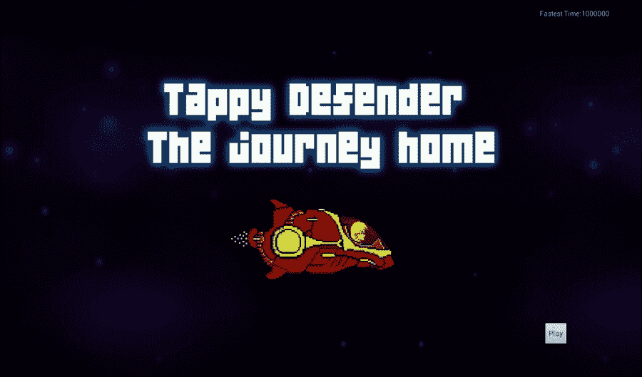
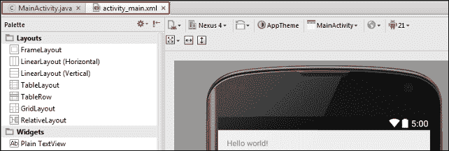
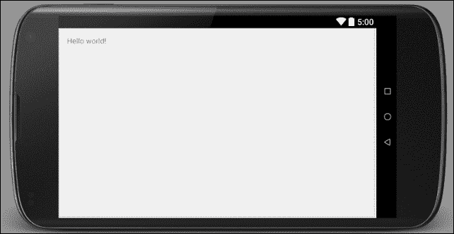
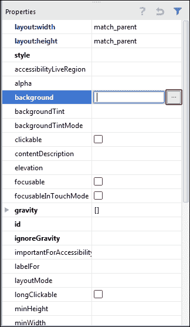
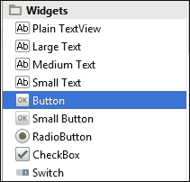
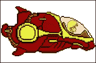
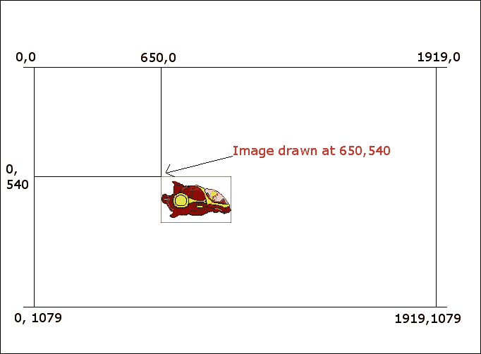
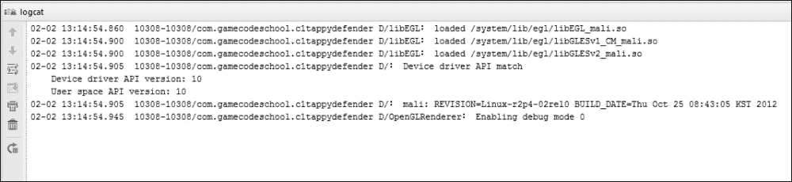

# 二、TappyDefender——第一步

欢迎来到第一个游戏，我们将在三章中了解它。在本章中，我们将仔细检查成品的目标。如果我们确切地知道我们试图实现什么，那么在构建一个游戏时，它会有很大的帮助。

然后，我们可以查看代码的结构，包括我们将遵循的近似设计模式。然后，我们将把我们的第一个游戏引擎的代码骨架放在一起。最后，为了完成这一章，我们将从游戏中画出我们的第一个真实对象，并在屏幕上制作动画。

然后，我们将为第 3 章、*TappyDefender-乘坐航班*做好准备，在完成第 4 章、*TappyDefender-回家*的第一场比赛之前，我们可以取得非常快的进步。

# 策划第一场比赛

在这一节中，我们将详细描述我们的游戏。背景故事；谁是我们的英雄，他们想要实现什么？游戏机制；玩家实际上会怎么做？他会按下什么按钮，这是一个挑战还是一件有趣的事情？然后，我们来看看规则。什么构成了胜利、死亡和进步？最后，我们将获得技术，并开始检查我们将如何实际构建游戏。

## 背景故事

自 80 年代初以来，瓦莱丽一直在捍卫人类遥远的前哨基地。她的英勇事迹最初在 1981 年的街机经典《保卫者》中永垂不朽。然而，在前线工作了 30 多年后，她即将退休，是时候开始回家的旅程了。不幸的是，在最近的一次小冲突中，她的船的引擎和导航系统严重受损。因此，现在她必须只用她的助推推进器一路飞回家。

这意味着她必须通过同时向上和向前推进来驾驶她的飞船，有点像真正的弹跳，同时避开试图撞上她的敌人。在最近与地球的交流中，瓦莱丽被听到声称这是“就像试图飞一只瘸腿的鸟。”这是瓦莱丽在她受损的船上的一些概念艺术，因为它有助于尽早可视化我们的游戏。


现在我们已经了解了一点关于我们的英雄和她的困境，我们来仔细看看游戏的机制。

## 游戏机制

力学是玩家必须做出并变得擅长的关键动作，才能击败游戏。在设计游戏时，你可以依靠久经考验的力学思想，也可以自己发明。在 Tappy Defender 中，我们将使用一个机械师，玩家轻敲并握住屏幕来推进飞船。

这种助推将使飞船上升到屏幕上方，但也会使飞船加速，因此更容易受到攻击。当玩家移开手指时，助推引擎会切断，飞船会向下坠落并减速，从而使飞船稍微不那么脆弱。因此，生存需要一个非常精细和熟练的助推和不助推的平衡。

当然，Tappy Defender 很大程度上是受 Flappy Bird 和它成功后的许多类似游戏的启发。

TappyDefender将有一个到达“家”的目标，而不是像弗莱皮·伯德那样的“我能走多远”的得分系统。然后，玩家可以多次重播游戏，以便尝试并击败他们最快的时间。当然，为了跑得更快，玩家必须更频繁地提升，让瓦莱丽处于更大的危险中。

### 注

如果你从来没有玩过或看过 Flappy Bird，现在花 5 分钟玩这种游戏是非常值得的。您可以从谷歌游戏商店下载许多受 Flappy Bird 启发的应用程序之一:

[https://play.google.com/store/search?q=flappy%20bird&c =应用程序](https://play.google.com/store/search?q=flappy%20bird&c=apps)

## 游戏规则

在这里，我们将定义平衡游戏并使其对玩家公平一致的事物:

*   玩家的船比敌人的船坚固得多。这是因为玩家的船有护盾。玩家每次与敌人碰撞，敌人瞬间被消灭，但玩家失去一个护盾。玩家有三个护盾。
*   玩家需要飞行设定的公里数才能到家。
*   每当球员回到家，他们就赢得比赛。如果他们的时间是最快的，他们也会得到一个新的最快时间，就像一个高分。
*   敌人会在屏幕最右边的任意高度产卵，并以任意速度飞向玩家。

玩家总是被放在屏幕的最左边，但是提升意味着敌人会更快地靠近。

## 设计

我们将使用松散的设计模式，其中我们将基于控制部分、模型部分和视图来分离我们的代码。这就是我们将代码分成三个区域的方式。

### 控制

这是我们代码中控制所有其他部分的部分。它将决定何时显示视图，它将从模型中初始化我们所有的游戏对象，并且它将根据模型中发生的数据状态来提示决策。

### 模型

模型是我们的游戏数据和逻辑。这些船长什么样？屏幕上我们的船在哪里？他们跑得有多快，等等。此外，我们代码的模型部分是我们每个游戏对象的智能系统。虽然我们在这个游戏中的敌人没有复杂的人工智能，但他们会知道并自己决定他们走得有多快，何时重生等等。

### 视图

视图正是它听起来的样子。这是我们代码的一部分，它将根据模型的状态进行实际的绘制。当我们代码的控制部分告诉它时，它就会绘制。对游戏对象不会有任何影响。例如，视图不会决定对象在哪里，甚至看起来像什么。它只是绘制，然后将控制权交还给控制代码。

### 设计模式真实性检查

事实上，这种分离并不像讨论所说的那样清晰。事实上，用于绘制和控制的代码在同一个类中。但是，您将会看到，在该类中，绘制和控制的逻辑是分开的。

通过将我们的游戏分成这三个部分，我们将看到我们如何简化开发，并避免被杂乱的代码束缚，这些代码随着我们向游戏中添加新功能而不断扩展。

让我们更仔细地看看这个模式与我们的代码的契合之处。

## 游戏代码结构

首先，我们必须考虑到我们工作的系统。这种情况下就是安卓系统。如果你制作安卓应用已经有一段时间了，你可能会想知道这种模式在安卓活动生命周期中的位置。如果你是安卓新手，你可能会问活动生命周期是什么。

### 安卓活动生命周期

安卓活动生命周期是我们必须在其中工作的框架，以制作任何类型的安卓应用。有一个名为`Activity`的类，我们必须从中派生出来，它是我们应用程序的入口点。此外，我们需要知道，这个类，也就是我们游戏的一个对象，也有一些我们可以覆盖的方法。这些方法控制着我们应用的生命周期。

当用户启动一个应用程序时，我们的`Activity`对象被创建，我们可以覆盖的许多方法被依次调用。事情就是这样。

创建`Activity`对象时，依次调用三种方法；`onCreate()`、`onStart()`和`onResume()`。此时，应用程序正在运行。此外，当用户退出应用程序或应用程序被中断时，可能是通过电话，调用`onPause`方法。用户可能在完成电话后决定返回应用程序。如果出现这种情况，将调用`onResume`方法，随后应用程序将再次运行。

如果用户不返回应用程序，或者安卓系统决定它想要系统资源做其他事情，那么调用另外两种方法来清理。先`onStop()`，再`onDestroy()`。该应用程序现已被销毁，任何再次返回游戏的尝试都将导致活动生命周期从头开始。

作为游戏程序员，我们所要做的就是意识到这个生命周期，并遵守一些好的内务管理规则。我们将实施并解释良好内务管理的规则。

### 注

安卓活动生命周期比我刚才解释的要复杂得多，也要微妙得多。然而，我们知道编程我们的第一个游戏所需的一切。如果您想了解更多信息，请查看安卓开发者网站上的这篇文章:

[http://developer . Android . com/reference/Android/app/activity . html](http://developer.android.com/reference/android/app/Activity.html)

一旦我们满足了安卓活动生命周期，我们类中代表模式控制部分的核心方法就像这样简单:

1.  更新我们游戏对象的状态。
2.  根据游戏对象的状态绘制游戏对象。
3.  暂停以锁定帧速率。
4.  获取玩家输入。实际上，因为第 1、2 和 3 部分发生在一个线程中，所以这部分可以随时发生。
5.  重复一遍。

在我们真正开始构建我们的游戏之前，还有最后一点准备。

## Android Studio的文件结构

安卓系统非常注重我们将类文件放在哪里，包括`Activity`以及我们将声音文件和图形等资产放在文件层次结构中的什么位置。

这是我们将把所有东西放在哪里的快速概览。您不需要记住这一点，因为我们会在添加资产时提醒自己正确的文件夹。我们将在需要的时候逐步完成活动/班级创建过程。

作为一个提示，这里是一个注释图，显示了在 Tappy Defender 项目结束时，您的 Android Studio 项目浏览器的样子:


现在，我们实际上可以开始建造Tappy卫士了。

# 构建主屏幕

既然已经完成了所有的规划和准备，我们就可以开始代码了。

### 注

**下载示例代码**

您可以从您在[http://www.packtpub.com](http://www.packtpub.com)的账户下载您购买的所有 Packt Publishing 书籍的示例代码文件。如果您在其他地方购买了这本书，您可以访问[http://www.packtpub.com/support](http://www.packtpub.com/support)并注册，以便将文件直接通过电子邮件发送给您。

要使用代码文件，您仍然需要创建一个Android Studio项目。此外，您需要在每个 JAVA 文件的第一行代码中更改包名。更改包名以匹配您创建的项目的包名。最后，您需要确保将任何资产(如图像或声音文件)放入项目的适当文件夹中。每个项目所需的所有资产都在下载包中提供。

## 创建项目

按照以下步骤启动Android Studio并创建一个新项目。到本章结束时，将项目带到我们要去的地方的所有文件都在`Chapter2`文件夹的下载包中。

1.  在**欢迎来到Android Studio**对话框，点击**开始一个新的Android Studio项目**。
2.  In the **Create New Project** window shown next, we need to enter some basic information about our app. These bits of information will be used by Android Studio to determine the package name.

    ### 注

    在下图中，您可以看到**编辑**链接，如果需要，您可以自定义包名。

3.  If you will be copy/pasting the supplied code into your project, then use `C1 Tappy Defender` for the **Application name** field and `gamecodeschool.com` in the **Company Domain** field as shown in the following screenshot:

    

4.  准备好之后，点击 **【下一步】**按钮。当被要求选择外形时，你的应用将继续运行，我们可以接受默认设置(**手机和平板电脑**)。所以再次点击**下一步**。
5.  在**移动**对话框中，点击**空白活动**，然后点击**下一步**按钮。
6.  在**自定义活动**对话框中，我们可以再次接受默认设置，因为`MainActivity`似乎是我们主活动的一个好名字。所以点击**完成**按钮。

### 我们做了什么

Android Studio已经构建了这个项目，并创建了许多文件，其中大部分我们将在构建这个游戏的过程中看到和编辑。如前所述，即使你只是复制粘贴代码，也需要经过这一步，因为 Android Studio 正在幕后做事情，以使我们的项目工作。

## 构建主屏幕界面

我们的 Tappy Defender 游戏的第一个也是最简单的部分是主屏幕。我们只需要一张整洁的图片，上面有关于游戏的场景、高分和开始游戏的按钮。完成后的主屏幕看起来有点像这样:



当我们构建项目时，Android Studio会打开两个文件供我们编辑。您可以在下面的Android Studio用户界面设计器中看到它们作为选项卡。文件(和标签)为`MainActivity.java`和`activity_main.xml`:



`MainActivity.java`文件是我们游戏的入口点，我们很快会看到更详细的内容。`activity_main.xml`文件是我们主屏幕将使用的 UI 布局。现在，我们可以继续编辑`activity_main.xml`文件，所以它实际上看起来像我们的主屏幕应该。

1.  First of all, your game will be played with the Android device in landscape mode. If we change our UI preview window to landscape, we will see your progress more accurately. Look for the button shown in the next image. It is just preceding the UI preview:

    

2.  Click on the button shown in the preceding screenshot, and your UI preview will switch to landscape like this:

    

3.  通过点击标签确保`activity_main.xml`是打开的。
4.  现在，我们将设置一个背景图像。你可以从下载包中的`Chapter2/drawable/background.jpg`使用你自己的或者我的。将您选择的图像添加到Android Studio项目的`drawable`文件夹中。
5.  In the **Properties** window of the UI designer, find and click on the **background** property as shown in the next image:

    

6.  同样，在前面的图像中，按钮标记为**...**概述如下。它就在**后台**物业的右边。点击**...**按钮，浏览并选择您将使用的背景图像文件。
7.  接下来，我们需要一个**文本视图**小部件，我们将使用它来显示高分。请注意，布局中已经有一个**文本视图**小部件。上面写着**你好世界**。您将修改这个，并将其用于我们的高分。左键点击并拖动**文本视图**到你想要的位置。你可以复制我，如果你打算使用提供的背景或把它放在最适合你的背景。
8.  接下来，在**属性**窗口中，找到并点击 **id** 属性。进入`textHighScore`。如图所示准确地键入它，因为当我们在后面的教程中编写一些 Java 代码时，我们将引用这个 ID 来操作它，以显示玩家最快的时间。
9.  您也可以编辑**文本**属性来表示`High Score: 99999`或类似的内容，以便**文本视图**看起来像零件。但是，这不是必需的，因为您的 Java 代码稍后会处理这个问题。
10.  Now, we will drag a button from the widget palette as shown in the following screenshot:

    

11.  把它拖到你的背景上看起来不错的地方。你可以复制我，如果使用提供的背景或把它放在最适合你的背景。

### 我们做了什么

我们现在有了一个很酷的背景，在你的主屏幕上有排列整齐的小部件(一个**文本视图**和一个**按钮**)。接下来，我们可以通过 Java 代码向**按钮**小部件添加功能。玩家在[第四章](04.html "Chapter 4. Tappy Defender – Going Home")、*TappyDefender-回家*中的高分请重访**文本视图**。重要的一点是，这两个小部件都被分配了一个唯一的标识，我们可以用它来引用和操作您的 Java 代码。

## 对功能进行编码

现在，我们的游戏主屏幕有了一个简单的布局。现在，我们需要添加允许玩家点击**播放**按钮开始游戏的功能。

点击`MainActivity.java`文件的标签。为我们自动生成的代码并不是我们所需要的。因此，我们将重新开始，因为这比修补已经存在的东西更简单、更快捷。

删除`MainActivity.java`文件中除包名以外的全部内容，并在其中输入以下代码。当然，您的套餐名称可能会有所不同。

```java
package com.gamecodeschool.c1tappydefender;

import android.app.Activity;
import android.os.Bundle;

public class MainActivity extends Activity{

    // This is the entry point to our game
    @Override
    protected void onCreate(Bundle savedInstanceState) {
        super.onCreate(savedInstanceState);

        //Here we set our UI layout as the view
        setContentView(R.layout.activity_main);

    }
}
```

上面提到的代码是我们主`MainActivity`类的当前内容和我们游戏的入口点`onCreate`方法。以`setContentView...`开头的代码行是将我们的用户界面布局从`activity_main.xml`加载到玩家屏幕的行。我们现在可以运行游戏，并看到我们的主屏幕，但让我们取得一些更大的进展，接下来我们将在本章末尾了解如何在真实设备上运行游戏。

现在，让我们操作主屏幕上的**播放**按钮。在调用`setContentView()`之后，将下面代码的两个高亮行添加到`onCreate`方法中。第一个新行创建了一个新的`Button`对象，并在我们的用户界面布局中引用了`Button`。第二行是监听按钮点击的代码。

```java
//Here we set our UI layout as the view
setContentView(R.layout.activity_main);

// Get a reference to the button in our layout
final Button buttonPlay =
 (Button)findViewById(R.id.buttonPlay);
// Listen for clicks
buttonPlay.setOnClickListener(this);

```

请注意，我们的代码中有一些错误。我们可以通过按住 *Alt* 键盘键，然后按*回车*来解决这些错误。这将为`Button`类添加一个导入指令。

我们还有一个错误。我们需要实现一个接口，这样我们的代码就可以监听按钮的点击。将`MainActivity`类声明修改为高亮显示:

```java
public class MainActivity extends Activity 
 implements View.OnClickListener{

```

当我们实现`onClickListener`接口时，我们也必须实现`onClick`方法。这是我们将处理当按钮被点击时会发生什么的地方。我们可以通过在`onCreate`方法之后的某个地方单击鼠标右键自动生成`onClick`方法，但是在`MainActivity`类中，导航到**生成** | **实现方法** | **onClick(v:View):void。或者添加给定的代码。**

我们还需要让Android Studio为`Android.view.View`添加另一个导入指令。再次使用 *Alt* | *进入*键盘组合。

我们现在可以滚动到`MainActivity`类的底部附近，看到 Android Studio 已经为我们实现了一个空的`onClick`方法。此时，您的代码中应该没有错误。以下是`onClick`的方法:

```java
@Override
public void onClick(View v) {
  //Our code goes here
}
```

由于我们只有一个`Button`对象和一个监听器，我们可以放心地假设主屏幕上的任何点击都是玩家按下我们的**播放**按钮。

安卓使用`Intent`类在活动之间切换。当点击**播放**按钮时，我们需要进入一个新的活动，我们将创建一个新的`Intent`对象，并将我们未来的`Activity`类的名称`GameActivity`传递给它的构造函数。然后我们可以使用`Intent`对象来切换活动。将以下代码添加到`onClick`方法的主体中:

```java
// must be the Play button.
// Create a new Intent object
Intent i = new Intent(this, GameActivity.class);
// Start our GameActivity class via the Intent
startActivity(i);
// Now shut this activity down
finish();    
```

我们的代码中再次出现错误，因为我们需要生成一个新的导入指令，这次是针对`Intent`类，所以再次使用 *Alt* | *Enter* 键盘组合。我们的代码中还有一个错误。这是因为我们的`GameActivity`类还不存在。我们现在将解决这个问题。

## 创建游戏活动

我们看到当玩家点击**播放**按钮时，主活动将关闭，游戏活动开始。因此，我们需要创建一个名为`GameActivity`的新活动，如果你的游戏实际执行的话。

1.  从主菜单中，导航至**文件** | **新** | **活动** | **空白活动**。
2.  在**自定义活动**对话框中，将**活动名称**字段更改为`GameActivity`。
3.  我们可以接受该对话框中的所有其他默认设置，因此点击**完成**。
4.  正如我们对您的`MainActivity`类所做的那样，我们将从头开始编写这个类的代码。因此，从`GameActivity.java`中删除整个代码内容。

### 我们做了什么

Android Studio已经为我们生成了另外两个文件，并在幕后做了一些工作，我们将很快进行调查。新文件为`GameActivity.java`和`activity_game.xml`。它们都在两个新的选项卡中自动为我们打开，与用户界面设计器上方的其他选项卡位于同一位置。

我们将永远不需要`activity_game.xml`，因为我们将构建一个动态生成的游戏视图，而不是静态 UI。现在请随意关闭它或忽略它。我们将回到`GameActivity.java`文件，当我们开始真正编码我们的游戏时，在后面的章节中*编码游戏循环*部分。

## 配置 AndroidManifest.xml 文件

我们简单提到当我们创建一个新的项目或者新的活动时，Android Studio 所做的不仅仅是为我们创建两个文件。这就是为什么我们用我们的方式创建新的项目/活动。

幕后发生的事情之一是创建和修改`manifests`目录中的`AndroidManifest.xml`文件。

这个文件是我们的应用程序工作所必需的。此外，它需要被编辑，以使我们的应用程序按照我们想要的方式工作。Android Studio已经自动为我们配置了基础，但是我们现在将对这个文件再做两件事。

通过编辑`AndroidManifest.xml`文件，我们将强制我们的两个活动全屏运行，并且我们还将它们锁定为横向布局。让我们在这里进行这些更改:

1.  现在打开`manifests`文件夹，双击`AndroidManifest.xml`文件在代码编辑器中打开。
2.  在`AndroidManifest.xml`文件中，找到下面一行代码:

    ```java
    android:name=".MainActivity"
    ```

3.  紧接着，键入或复制粘贴这两行使`MainActivity`全屏运行并锁定在横向:

    ```java
    android:theme="@android:style/Theme.NoTitleBar.Fullscreen"
    android:screenOrientation="landscape"
    ```

4.  在`AndroidManifest.xml`文件中，找到下面一行代码:

    ```java
    android:name=".GameActivity"
    ```

5.  紧接着，键入或复制粘贴这两行使`GameActivity`全屏运行并锁定在横向:

    ```java
    android:theme="@android:style/Theme.NoTitleBar.Fullscreen"
    android:screenOrientation="landscape"
    ```

### 我们做了什么

我们现在已经将游戏中的两个活动都配置为全屏。这给我们的玩家呈现了一个更加令人愉悦的外观。此外，我们已经禁用了玩家通过旋转他们的安卓设备来影响我们游戏的能力。

# 编码游戏循环

我们说过，我们不会在游戏屏幕上使用用户界面布局，而是使用动态绘制视图。这就是我们对模式的看法。让我们创建一个新的类来表示我们的观点，然后我们将放入我们的 Tappy Defender 游戏的基本构件。

## 构建视图

我们将让我们的两个活动类单独呆一会儿，这样我们就可以看一看我们的类，它将代表我们游戏的观点。正如我们在本章开头所讨论的，视图和控制器方面将是同一个类的一部分。

安卓应用编程接口为我们的需求提供了一个理想的类。`android.view.SurfaceView`类不仅为我们提供了一个用于绘制像素、文本、线条和精灵的视图，还使我们能够快速处理玩家输入。

好像这还不够有用一样，我们也可以通过实现可运行的接口来产生一个线程，允许我们的主游戏循环同时获得玩家输入和其他系统要素。我们现在将处理您的新`SurfaceView`实施的总体结构，因此我们可以随着项目的进展填写细节。

### 为视图创建新类

没有进一步的延迟，我们可以创建一个扩展`SurfaceView`的新类。

1.  右键单击包含我们的`.java`文件的文件夹，选择**新建** | **Java 类**，然后单击**确定**。
2.  在**创建新类**对话框中，命名新类`TDView,`(Tappy卫士视图)。现在，点击**确定**让Android Studio自动生成课程。
3.  新类将在代码编辑器中打开。修改代码，使其扩展`SurfaceView`并实现`Runnable`，如前一节所述。编辑代码中突出显示的部分，如下所示:

    ```java
    package com.gamecodeschool.c1tappydefender;

    import android.view.SurfaceView;

    public class TDView extends SurfaceView implements Runnable{

    }
    ```

4.  使用 *Alt* | *输入*组合导入缺失的类。
5.  请注意，我们的代码中仍然有一个错误。这是因为我们必须为我们的`SurfaceView`实现提供一个构造函数。右键单击`TDView`类声明的正下方，导航至**生成** | **构造函数** | **表面视图(上下文:context)** 。或者您可以像下一个代码块所示的那样输入这个。现在点击**确定**。

### 我们做了什么

我们现在有了一个名为`TDView`的新类，它为我们的绘图需求扩展了`SurfaceView`，为我们的穿线需求实现了`Runnable`。我们还生成了一个构造函数，我们将很快使用它来初始化我们的新类。

传递到我们的构造函数中的`Context`参数是对我们的应用程序在安卓系统中的当前状态的引用，该应用程序由我们的`GameActivity`类持有。这个`Context`参数对于我们将在整个项目中实施的许多事情都是有用的/必不可少的。

到目前为止，我们的`TDView`课将是这样的:

```java
package com.gamecodeschool.c1tappydefender;

import android.content.Context;
import android.view.SurfaceView;

public class TDView extends SurfaceView implements Runnable{

    public TDView(Context context) {
        super(context);
    }
}
```

### 构造类代码

既然我们的`TDView`类是从`SurfaceView`类扩展而来的，我们就可以开始编码了。为了控制游戏，我们需要能够更新所有的游戏数据/对象。这意味着一种`update`方法。此外，我们显然会希望在所有游戏数据更新后，每帧绘制一次。让我们用一种叫做`draw`的方法将所有的绘图代码保存在一起。此外，我们需要控制这种情况发生的频率。因此，一种`control`方法似乎也应该成为课程的一部分。

我们也知道，一切都需要发生在你的线程中；所以要实现这一点，我们应该用`run`方法包装代码。最后，我们需要一种方法来控制线程什么时候应该做什么，什么时候不应该做什么，所以我们需要一个由布尔控制的无限循环，也许是`playing`。

将以下代码复制到我们的`TDView`类的主体中，以实现我们刚刚讨论的内容:

```java
@Override
    public void run() {
        while (playing) {
            update();
            draw();
            control();
        }
    }
```

这是我们游戏的梗概。`run`方法将在一个线程中执行，但它将只在布尔`playing`实例为真时执行游戏循环。然后，它将更新所有的游戏数据，根据该游戏数据绘制屏幕，并控制多久直到再次调用`run`方法。

现在，我们可以在这段代码的基础上快速构建。首先，我们可以实现我们从`run`方法调用的三个方法。在我们的`run`方法的右大括号前的`TDView`类的主体中键入以下代码:

```java
private void update(){

}

private void draw(){

}

private void control(){

}
```

我们现在需要声明我们的游戏成员变量。我们可以使用`volatile`关键字来做到这一点，因为它将从线程外部和内部访问。在`TDView`类声明后键入该代码:

```java
volatile boolean playing;
```

现在，我们知道我们可以用无限循环和`playing`变量控制运行方法内代码的执行。我们还需要启动和停止实际线程本身。不仅仅是我们决定的时候，而是玩家意外退出游戏的时候。如果他接到一个电话，或者只是按下他设备上的主页按钮。

为了处理这些事件，我们需要`TDView`类和`GameActivity`一起工作。现在，在`TDView`类中，我们可以实现一个`pause`方法和一个`resume`方法。在它们里面，我们放入代码来停止和启动我们的线程。在`TDView`类的主体中实现这两种方法:

```java
// Clean up our thread if the game is interrupted or the player quits
public void pause() {
        playing = false;
        try {
            gameThread.join();
        } catch (InterruptedException e) {

        }
    }

    // Make a new thread and start it
    // Execution moves to our R
    public void resume() {
           playing = true;
           gameThread = new Thread(this);
           gameThread.start();
    }
```

现在，我们需要一个名为`gameThread`的`Thread`类的实例。我们可以在类声明之后将其声明为`TDView`的成员变量，就在我们的布尔`playing`参数之后。像这样:

```java
volatile boolean playing;
Thread gameThread = null;

```

注意`onPause``onResume`方法是公开的。我们现在可以向我们的`GameActivity`类添加代码，以便在适当的时候调用这些方法。记住`GameActivity`延伸`Activity`。因此，使用被覆盖的`Activity`生命周期方法。

通过覆盖`onPause`方法，每当活动暂停时，我们可以关闭线程。这避免了潜在的让玩家尴尬，以及不得不向他的呼叫者解释为什么他们可以在背景中听到声音 FX。

通过覆盖`onResume()`，我们可以在应用程序实际运行之前的安卓生命周期的最后阶段启动线程。

### 注

注意`TDView`类的`pause`和`resume`方法与`GameActivity`类的被覆盖的`onPause`和`onResume`方法之间的区别。

## 游戏活动

在您实现/覆盖这个方法之前，请注意，它们所做的只是调用它们各自方法的父版本，然后调用它们对应的`TDView`类中的公共方法。

你可能还记得，当我们创建新的`GameActivity`类时，我们删除了整个代码内容？考虑到这一点，这里是我们在`GameActivity.java`中需要的代码大纲，包括我们在上一节中讨论的`GameActivity`类主体中被覆盖的方法的实现。在`GameActivity.java`中输入该代码:

```java
package com.gamecodeschool.c1tappydefender;

import android.app.Activity;
import android.os.Bundle;

public class GameActivity extends Activity {

    // This is where the "Play" button from HomeActivity sends us
    @Override
    protected void onCreate(Bundle savedInstanceState) {
        super.onCreate(savedInstanceState);

    }

    // If the Activity is paused make sure to pause our thread
    @Override
    protected void onPause() {
        super.onPause();
        gameView.pause();
    }

    // If the Activity is resumed make sure to resume our thread
    @Override
    protected void onResume() {
        super.onResume();
        gameView.resume();
    }

}
```

最后，让我们继续并声明一个`TDView`类的对象。在`GameActivity`类声明后执行此操作:

```java
// Our object to handle the View
private TDView gameView;
```

现在，在`onCreate`方法中，我们需要实例化您的对象，记住您在`TDView.java`中的构造函数以一个`Context`对象作为参数。然后，我们使用新实例化的对象调用`setContentView()`。还记得我们构建主屏幕时，我们调用了`setContentView()`并传入了我们的 UI 设计。这一次，我们将玩家的视角设置为我们`TDView`类的对象。将以下代码复制到`GameActivity`类的`onCreate`方法中:

```java
// Create an instance of our Tappy Defender View (TDView)
// Also passing in "this" which is the Context of our app
gameView = new TDView(this);

// Make our gameView the view for the Activity
setContentView(gameView);
```

此时，我们实际上可以运行我们的游戏，并点击**播放**按钮进入`GameView`活动，该活动将使用`TDView`作为其视图并开始我们的线程。显然，现在还没有什么可看的，所以让我们来研究我们设计模式的模型，并构建我们第一个游戏对象的基本轮廓。在这一章的最后，我们将看到如何在安卓设备上运行游戏。

# 游戏人对象

我们需要将代码的模型部分尽可能与其他部分分开。我们可以通过为我们玩家的飞船创建一个类来做到这一点。让我们称我们的新班级为`PlayerShip`。

继续，给项目添加一个新的类，称之为`PlayerShip`。这里有几个快速实现的步骤。现在，右键单击包含我们的`.java`文件的文件夹，导航到**新建** | **Java 类**，然后输入`PlayerShip`作为名称，并单击**确定**。

我们需要我们的`PlayerShip`类了解什么？作为最低要求，它需要:

*   知道它在屏幕上的什么位置吗
*   它看起来像什么
*   它飞得多快

这些要求提出了一些我们可以声明的成员变量。在我们生成的类声明后面输入代码:

```java
private Bitmap bitmap;
private int x, y;
private int speed = 0;
```

像往常一样，使用 *Alt* | *输入*键盘组合来导入任何缺失的课程。在前面的代码块中，我们看到我们已经声明了一个类型为`Bitmap`的对象，我们将使用它来保存代表我们的船的图形。

我们还声明了三个`int`类型变量；`x`和`y`用来保存飞船的屏幕坐标，另一个`int`类型的变量`speed`用来保存我们飞船的速度值。

现在，让我们考虑一下我们的`PlayerShip`类需要做什么。同样，作为最低要求，它需要:

*   做好准备
*   更新自身
*   分享我们的观点

建造者似乎是自我准备的理想场所。我们可以初始化它的`x`和`y`坐标变量，并用`speed`变量设置一个起始速度。

构造函数需要做的另一件事是加载代表其外观的位图图形。为了加载位图，我们需要一个安卓`Context`对象。这意味着我们编写的构造函数需要从我们的视图中接收一个`Context`对象。

考虑到所有这些，这里是我们的`PlayerShip`构造器来实现我们的待办事项列表中的一个点:

```java
// Constructor
public PlayerShip(Context context) {
        x = 50;
        y = 50;
        speed = 1;
        bitmap = BitmapFactory.decodeResource 
        (context.getResources(), R.drawable.ship);

    }
```

像往常一样，我们需要使用 *Alt* | *进入*组合来导入一些新的类。在导入初始化我们的位图对象的行所需的所有新类后，我们可以看到我们仍然有一个错误；`Cannot resolve symbol ship`。

让我们仔细分析一下装载飞船位图的那条线，因为在整本书中我们会看到很多。

`BitmapFactory`类正在使用它的静态方法`decodeResource()`试图加载我们的玩家船图形。它需要两个参数。首先是从视图中传递的`Context`对象提供的`getResources`方法。

第二个参数`R.drawable.ship`正在从名为`drawable`的资源文件夹中请求一个名为`ship`的图形。要解决这个错误，我们只需将名为`ship.png`的图形复制到我们项目的`drawable`文件夹中。

只需将包含在`Chapter2/drawable`文件夹中的`ship.png`图形从下载包拖放/复制并粘贴到Android Studio项目浏览器窗口的`res/drawable`文件夹中。以下是一张`ship.png`图片:



`PlayerShip`需要做的第二件事是自我更新。让我们实现一个可以从我们的`TDView`类中调用的公共`update`方法。该方法只需在每次调用时将船的 *x* 值增加 1。显然，我们需要比这更先进的。现在在`PlayerShip`类中实现如下方法:

```java
public void update() {
  x++;
}
```

待办事项列表中的第三项是与视图共享其状态。我们可以通过提供一系列类似这样的 getter 方法来做到这一点:

```java
//Getters
public Bitmap getBitmap() {
  return bitmap;
}

public int getSpeed() {
  return speed;
}

public int getX() {
  return x;
}

public int getY() {
  return y;
}
```

现在你的`TDView`类可以实例化了，找出它喜欢任何`PlayerShip`对象的什么。然而，只有`PlayerShip`类本身可以决定它应该是什么样子，它有什么属性，以及它如何表现。

我们可以看到我们将如何将我们玩家的船画到屏幕上，并且也将它动画化。

# 绘制场景

正如我们将看到的，绘制位图实在是微不足道。但是我们用来绘制图形的坐标系需要简单解释一下。

## 绘图和绘图

当我们在屏幕上画一个`Bitmap`物体时，我们输入我们想要画物体的坐标。给定安卓设备的可用坐标取决于其屏幕的分辨率。

例如，三星 Galaxy S4 手机在横向视图中的屏幕分辨率为 1920 像素(横向)乘以 1080 像素(向下)。

这些坐标的编号系统从左上角的 0，0 开始，向下向右，直到右下角是像素 1919，1079。1920/ 1919 和 1080/ 1079 之间明显的 1 像素差异是因为编号从 0 开始。

因此，当我们在屏幕上绘制位图或任何其他可绘制的图形时，我们必须指定 *x* 、 *y* 坐标。

此外，位图当然由许多像素组成。那么在我们将要指定的 *x* 、 *y* 屏幕坐标上绘制给定位图的哪个像素呢？

答案是`Bitmap`物体的左上角像素。再看下一张图片，以三星 Galaxy S4 为例，应该可以明确屏幕坐标。



目前，当在任意位置绘制仅仅是一艘船时，这些信息没有什么影响。这将在下一章变得更加重要，当我们开始将我们的图形限制在可见的屏幕上，并在它们消失时重新覆盖它们。

所以让我们记住这一点，继续把我们的船画到屏幕上。

## 绘画游戏

现在我们知道了这一切，我们可以给我们的`TDView`类添加一些代码，这样就可以看到我们的`PlayerShip`类在运行。首先，我们需要一个新的具有类范围的`PlayerShip`对象。以下代码是`TDView`类声明:

```java
//Game objects
private PlayerShip player;
```

我们还需要一堆我们还没见过的东西来帮助我们真正地画画。我们需要一块画布和一些颜料。

### 画布和绘画对象

这个名副其实的`Canvas`类提供了你所期望的东西——一个虚拟画布来绘制我们的图形。

我们可以使用`Canvas`类制作一个虚拟画布，并将其投影到我们的`SurfaceView`对象上，该对象是您的`GameActivity`类的视图。我们实际上可以添加`Bitmap`对象，甚至可以使用来自`Paint`对象的方法来操纵我们的`Canvas`对象上的单个像素。另外，我们还需要一个`SurfaceHolder`类的对象。这允许我们在操纵你的`Canvas`对象时锁定它，并在准备画框时解锁它。

我们将更详细地了解这些类是如何工作的。在我们键入的前一行代码之后立即键入此代码:

```java
// For drawing
private Paint paint;
private Canvas canvas;
private SurfaceHolder ourHolder;
```

像往常一样，我们需要使用 *Alt | Enter* 键盘组合为后面的两行代码导入一些新的类。从这一点开始，我们将保存数字链接，并假设您知道每次添加新类时都要这样做。

接下来，我们需要准备画图。最好的地方是在 `TDView()`，构造器。键入以下代码准备我们的`Paint`和`SurfaceHolder`对象进行操作:

```java
// Initialize our drawing objects
ourHolder = getHolder();
paint = new Paint();
```

紧接在前一行代码之后，我们终于可以调用`new()`来初始化我们的`PlayerShip`对象:

```java
// Initialize our player ship
player = new PlayerShip(context);
```

现在，我们可以跳到我们的`TDView`类的`update`方法，并执行以下操作:

```java
// Update the player
player.update();
```

就这样。`PlayerShip`类(模型的一部分)知道该怎么做，我们可以在我们的`PlayerShip`类中加入各种人工智能。`TDView`类(控制器)只是说什么时候更新。你可以很容易地想象，我们所需要做的就是创建大量不同属性和行为的不同游戏对象，并且每帧调用它们的`update`方法一次。

现在，跳到`TDView` 类的`draw`法。让我们通过执行以下操作来绘制我们的`player`对象:

1.  检查我们的`SurfaceHolder`课是否有效。
2.  锁定`Canvas`对象。
3.  通过调用`drawColor()`清除屏幕。
4.  通过调用`drawBitmap()`并传入`PlayerShip`位图和一个 *x* 、 *y* 坐标，在上面泼一些虚漆。
5.  最后解锁`Canvas`对象，绘制场景。

要实现这些功能，请在`draw`方法中键入以下代码:

```java
if (ourHolder.getSurface().isValid()) {

  //First we lock the area of memory we will be drawing to
  canvas = ourHolder.lockCanvas();

  // Rub out the last frame
  canvas.drawColor(Color.argb(255, 0, 0, 0));

  // Draw the player
  canvas.drawBitmap(
    player.getBitmap(), 
    player.getX(), 
    player.getY(), 
    paint);

  // Unlock and draw the scene
  ourHolder.unlockCanvasAndPost(canvas);
}
```

在这一点上，我们实际上可以运行游戏。如果我们的视力足够快，或者我们的安卓设备足够慢，我们将会看到我们的玩家飞船以极快的速度飞过屏幕。

在我们部署游戏之前，还有一件事要做。

## 控制帧率

我们几乎看不到任何东西的原因是，即使我们只沿着 *x* 轴以每帧一个像素的速度移动我们的船(在`PlayerShip`类的`update`方法中)，我们的线程也在以不受限制的方式调用`run`方法。这可能每秒发生数百次。我们需要做的是控制这个速度。

每秒 60 帧是一个合理的目标。这个目标意味着需要时间。安卓系统以毫秒(千分之一秒)为单位测量时间。因此，我们可以在`control`方法中添加以下代码:

```java
try {
    gameThread.sleep(17);
    } catch (InterruptedException e) {

    }
```

在前面的代码中，我们通过调用以`17`为参数的`gameThread.sleep`来暂停线程 17 毫秒( *1000(毫秒)/60(FPS)* )。我们将代码包装在`try` / `catch`区块内。

# 部署游戏

现在，我们可以运行我们的游戏来观看我们的宇宙飞船漂浮在太空中(从 *x* 轴上的 50 像素和 *y* 轴上的 50 像素开始)。

Android Studio使我们能够相当快速地创建模拟器，我们可以在开发电脑上测试我们的游戏。然而，即使是最简单的游戏在模拟器上也不能很好地运行。当我们开始测试像玩家输入这样的东西时，体验是如此糟糕，以至于最好完全避免使用模拟器。

解决方案是在真实的安卓设备上进行调试。为此做准备非常容易。

## 在安卓设备上调试

首先要做的是访问您的设备制造商的网站，获取并安装您的设备和操作系统所需的任何驱动程序。

接下来的几个步骤将设置安卓设备进行调试。请注意，不同的制造商对菜单选项的结构略有不同。以下顺序可能非常接近，如果不是在大多数设备上启用调试的确切顺序的话。

1.  点击**设置**菜单选项或**设置**应用程序。
2.  点击**开发者**选项。
3.  点击 **USB 调试**的复选框。
4.  Connect your Android device to the USB port of your development system. The next image shows on the Android tab. At the bottom of the Android Studio UI, you can see that **Samsung GT-I9100 Android 4.1.2 (API 16)** has been detected:

    

5.  Click on the **Play** icon from the Android Studio toolbar:

    

6.  出现提示时，点击**确定**在您选择的设备上运行游戏。

游戏现在将在设备上运行。任何输出或错误都可以在**日志**窗口中看到，也可以在**安卓**选项卡上看到:



敬畏地看着我们玩家的飞船从左向右缓慢移动。

# 总结

在这一章中，我们花了很多时间来设置结构、游戏循环和线程。我们还花时间处理安卓活动生命周期。

现在，我们已经准备好了所有这些，我们可以轻松地开始添加更多的游戏对象，以使 Tappy Defender 在下一章中快速感觉更像一个真实的游戏。