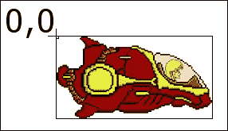
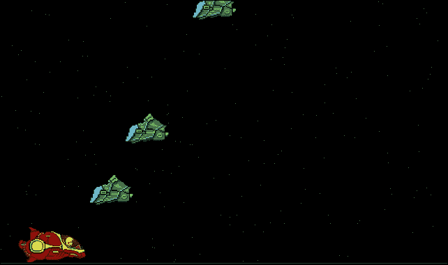
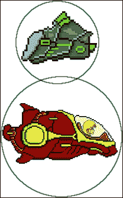
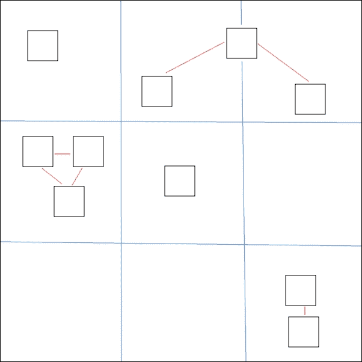
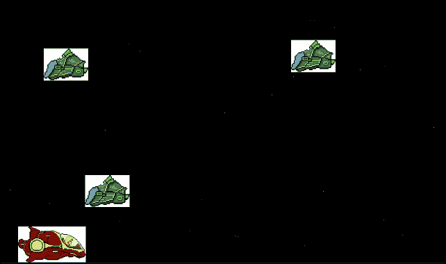

# 三、TappyDefender——起飞

我们现在准备快速添加许多新对象和一些特性。到本章结束时，我们将真正接近一个可玩的游戏。我们将检测到玩家触摸屏幕，这样他就可以控制飞船。我们会在`SpaceShip`级增加虚拟助推器，让飞船上下移动，增加速度。

然后，我们将检测安卓设备的分辨率，并使用它来防止玩家离开屏幕，并检测我们的敌人何时需要重生。

我们将创建一个新的`EnemyShip`类，它将代表自杀的敌人。我们还将看到如何在不改变代码控制部分的任何逻辑的情况下，轻松地生成并控制它们。

我们将通过添加一个`SpaceDust`类并生成几十个类来添加滚动效果，使其看起来像玩家在太空中飞驰。

最后，我们将学习并实现碰撞检测，这样我们就可以知道我们的玩家何时被敌人击中，并查看一个图形技巧来帮助我们调试碰撞检测代码。

# 控制宇宙飞船

我们让玩家的飞船漫无目的地漂浮在屏幕上，从左边开始 50 像素，从顶部开始 50 像素，慢慢向右漂移。现在，我们可以给玩家控制飞船的权力。

请记住，控制装置的设计是一个手指轻敲并按住以加速，释放以停止加速和减速。

## 检测触摸

我们为视图扩展的`SurfaceView`类非常适合处理屏幕触摸。

我们所需要做的就是在我们的`TDView`类中覆盖`onTouchEvent`方法。让我们看看完整的代码，然后我们可以更仔细地检查它，以确保我们了解正在发生什么。在`TDView`类中输入此方法，并以常规方式导入必要的类。我强调了我们稍后将定制的代码部分:

```java
// SurfaceView allows us to handle the onTouchEvent
@Override
public boolean onTouchEvent(MotionEvent motionEvent) {

    // There are many different events in MotionEvent
    // We care about just 2 - for now.
    switch (motionEvent.getAction() & MotionEvent.ACTION_MASK) {

        // Has the player lifted their finger up?
        case MotionEvent.ACTION_UP:
 // Do something here
            break;

        // Has the player touched the screen?
        case MotionEvent.ACTION_DOWN:
 // Do something here
           break;
    }
   return true;
}
```

这就是`onTouchEvent`方法到目前为止的工作方式。玩家触摸屏幕；这可以是任何形式的接触。可能是刷卡、捏、多指等等。向`onTouchEvent`方法发送详细消息。

事件的细节是包含在`MotionEvent`类参数中的，正如我们在代码中看到的。`MotionEvent`类保存了大量数据。它知道屏幕上有多少个手指，每个手指的坐标，以及是否做了任何手势。

由于我们正在实施一个简单的点击并保持升压，释放停止升压控制方案；我们可以简单地使用`motionEvent.getAction() & MotionEvent.ACTION_MASK`条件进行切换，并只满足许多可能的不同情况中的两种。

案例`MotionEvent.ACTION_UP:`顾名思义，将告诉我们玩家何时从屏幕上移除手指。然后，也许不出所料，案例`MotionEvent.ACTION_DOWN:`告诉我们玩家是否将手指放在屏幕上。

### 注

我们可以通过`MotionEvent`类找到的东西是相当庞大的。何不在这里看看它的全部潜力:[http://developer . Android . com/reference/Android/view/motion event . html](http://developer.android.com/reference/android/view/MotionEvent.html)。我们还将在[第 5 章](05.html "Chapter 5. Platformer – Upgrading the Game Engine")、*平台-升级游戏引擎*中开始构建的下一个项目中进一步探讨这一课程。

## 给飞船增加助推器

现在，我们需要做的就是思考我们将如何利用这些事件来控制飞船。首先，飞船需要知道它是否在助推。这暗示了一个布尔成员变量。在`PlayerShip`类中的类声明后添加该代码:

```java
private boolean boosting;
```

然后我们需要在创建`PlayerShip`对象时初始化它。因此将此添加到`PlayerShip`构造函数中:

```java
boosting = false;
```

现在，我们需要让`onTouchEvent`方法在真与假、升压与不升压之间切换`boosting`。将这些方法添加到`PlayerShip`类中:

```java
public void setBoosting() {
  boosting = true;
}

public void stopBoosting() {
  boosting = false;
}
```

现在，我们可以从我们的`onTouchEvent`方法调用这些公共方法来控制飞船是否正在助推的状态。在`onTouchEvent`方法中添加这个新代码:

```java
// Has the player lifted there finger up?
case MotionEvent.ACTION_UP:
 player.stopBoosting();
  break;

// Has the player touched the screen?
case MotionEvent.ACTION_DOWN:
 player.setBoosting();
  break;
```

现在，我们的观点是和我们的模型对话；我们需要做的就是让 boosting 变量根据它所处的状态做一些事情。这个代码的逻辑位置是`PlayerShip`类的`update`方法。

我们会根据飞船当前是否助推来改变我们飞船的`speed`变量。起初，这似乎很简单，但根据船只是否加速来提高速度会有一些小问题:

*   一个问题是`update`方法每秒调用 60 次。所以，让飞船以荒谬的速度飞行不需要太多的助推力。我们需要限制船的速度。
*   另一个问题是，我们的飞船在助推时会从屏幕上升起，没有什么能阻止它从屏幕顶部呼啸而过，再也看不见了。我们需要在屏幕内约束船只的 *x* 和 *y* 坐标。
*   当船不助推，速度稳定回零时，是什么让船再次下降？我们需要一个简单的重力物理模拟。

为了解决这三个问题，我们可以给我们的`PlayerShip`类添加代码。然而，在此之前，先简单说一下游戏平衡。我们将很快看到的代码使用不同的整数值，例如，我们将`GRAVITY`初始化为`-12`，将`MAX_SPEED`初始化为`20`。这些数字与现实毫无关系！

它们只是让游戏平衡的任意数字。随意玩这些任意的数字，让游戏变得更难，更容易，甚至不可能。在[第 4 章](04.html "Chapter 4. Tappy Defender – Going Home")*TappyDefender–回家*的结尾，我们将更仔细地看游戏迭代，再次看难度和平衡。

考虑到我们前面提到的三个问题，在`PlayerShip`类中的类声明之后添加以下成员变量:

```java
private final int GRAVITY = -12;

// Stop ship leaving the screen
private int maxY;
private int minY;

//Limit the bounds of the ship's speed
private final int MIN_SPEED = 1;
private final int MAX_SPEED = 20;
```

现在，我们开始解决我们的三个问题，我们可以向我们的`PlayerShip`类的`update`方法添加代码。我们将删除前一章中的一行代码。那只是为了快速看看我们的船在行动。输入我们`PlayerShip`类`update`方法的新代码。之后，我们将进一步了解:

```java
public void update() {

  // Are we boosting?
  if (boosting) {
    // Speed up
    speed += 2;
  } else {
    // Slow down
    speed -= 5;
  }

  // Constrain top speed
  if (speed > MAX_SPEED) {
    speed = MAX_SPEED;
}

  // Never stop completely
  if (speed < MIN_SPEED) {
    speed = MIN_SPEED;
}

  // move the ship up or down
  y -= speed + GRAVITY;

  // But don't let ship stray off screen
  if (y < minY) {
    y = minY;
  }

  if (y > maxY) {
    y = maxY;
  }

}
```

从前一段代码的顶部开始，我们根据飞船是否加速，在游戏的每一帧中，以明显任意的数量增加和减少速度变量。

然后，我们将船速限制在最大 20，最小 1，正如我们之前添加的变量所指定的那样。借助线条`y -= speed + GRAVITY`，我们根据速度和重力向上或向下移动屏幕上的图形。`GRAVITY`和`MAX_SPEED`的明显任意值很好地允许玩家笨拙且不稳定地在空间中弹跳。

最后，我们通过确保船的图形永远不会超出`maxY`和`minY`来阻止船从屏幕上消失。您可能已经注意到，到目前为止，我们还没有初始化`maxY`和`minY`。此外，由于许多安卓设备的屏幕分辨率差异很大，我们将如何初始化它们？

我们需要做的是在运行时发现安卓设备的分辨率，并使用该信息初始化`MaxY`和`minY`。

## 检测屏幕分辨率

我们知道我们需要玩家屏幕的最大 *y* 坐标。在项目后期，当我们开始添加背景和敌舰时，我们会意识到我们也需要最大 *x* 坐标。考虑到这一点，让我们看看如何获得这些信息，并将其提供给`PlayerShip`类。

检测屏幕分辨率的最佳时机是在应用程序启动时，在我们的视图和模型被实例化之前。这意味着我们的`GameActivity`班是一个做这件事的好地方。我们现在将向`GameActivity`类的`onCreate`方法添加代码。在调用创建我们的`TDView`对象的`new...`之前，将新代码添加到`onCreate`类中:

```java
// Get a Display object to access screen details
Display display = getWindowManager().getDefaultDisplay();
// Load the resolution into a Point object
Point size = new Point();
display.getSize(size);
```

前面的代码使用`getWindowManager().getDefaultDisplay();`声明并初始化了一个`Display`类型的对象。然后我们创建一个新的对象类型`Point`。`Point`对象可以容纳两个坐标，然后我们将其作为参数传递到新的`Display`对象的`getSize`方法中。

我们现在有了运行游戏的安卓设备的分辨率，整齐地存储在`size`中。现在把这个传递给我们代码中需要它的部分。首先，我们将更改调用`new`时传递的参数，这将初始化我们的`TDView`对象。更改对`new`的调用，如下图所示，将屏幕分辨率传递给`TDView`构造函数:

```java
// Create an instance of our Tappy Defender View
// Also passing in this.
// Also passing in the screen resolution to the constructor
gameView = new TDView(this, size.x, size.y);

```

然后当然需要更新`TDView`构造函数本身。在`TDView.java`文件中，修改`TDView`构造函数的签名，使声明看起来像这样:

```java
TDView(Context context, int x, int y) {
```

现在，仍然在构造函数中，改变我们初始化我们的`PlayerShip`对象的播放器的方式:

```java
player = new PlayerShip(context, x, y);
```

当然，我们现在必须修改`PlayerShip`类本身中的构造函数声明，如下所示:

```java
public PlayerShip(Context context, int screenX, int screenY) {
```

此外，我们现在可以在`PlayerShip`构造函数中初始化我们的`maxY`和`minY`变量。在我们看到代码之前，我们需要考虑这将如何工作。

保存我们飞船图形的位图的坐标是用左上角的 *x = 0* 和 *y = 0* 坐标在`TDView`类的`draw`方法中传递给`drawBitmap()`的。这意味着在我们开始画船的坐标的右边和后面有像素。看看下面这张图片，想象一下:



因此，我们必须牢记这一点来设定我们的`minY`和`maxY`值。如图所示，位图的顶部像素确实是在船只 *y* 上绘制的。然后我们可以确信`minY`应该为零。

然而，船底绘制在 *y +位图*的高度。

我们现在可以向构造函数添加两行代码来初始化这些变量:

```java
maxY = screenY - bitmap.getHeight();
minY = 0;
```

你现在可以运行游戏，测试你的助推器了！

# 建造敌人

现在我们已经实现了的轻击控制，是时候增加一些玩家可以提升躲避的敌人了。

这将比我们添加玩家飞船时容易得多，因为我们需要的大部分东西已经到位了。我们所要做的就是编写一个类来表示我们的敌人，实例化我们需要的敌人对象，调用它们的`update`方法，然后绘制它们。

正如我们将看到的，我们敌人的`update`方法将与`PlayerShip`的方法大不相同。它将需要处理像简单的人工智能这样的事情来飞向玩家。当它离开屏幕时，还需要处理重新喷涂。

## 设计敌人

首先，创建一个新的 Java 类，并将其称为`EnemyShip`。将这些成员变量添加到类中，这样您的新类将如下所示:

```java
public class EnemyShip{
    private Bitmap bitmap;
    private int x, y;
    private int speed = 1;

    // Detect enemies leaving the screen
    private int maxX;
    private int minX;

    // Spawn enemies within screen bounds
    private int maxY;
    private int minY;
}
```

现在，添加一些 getter 和 setter 方法，以便`draw`方法可以访问它需要绘制什么，以及它需要在哪里绘制。这里没有什么新的或不寻常的:

```java
//Getters and Setters
public Bitmap getBitmap(){
  return bitmap;
}

public int getX() {
  return x;
}

public int getY() {
  return y;
}
```

## 催生敌人

让我们完全实现`EnemyShip`构造函数。现在输入代码，然后我们将仔细查看:

```java
// Constructor
public EnemyShip(Context context, int screenX, int screenY){
    bitmap = BitmapFactory.decodeResource 
    (context.getResources(), R.drawable.enemy);

  maxX = screenX;
  maxY = screenY;
  minX = 0;
  minY = 0;

  Random generator = new Random();
  speed = generator.nextInt(6)+10;

  x = screenX;
  y = generator.nextInt(maxY) - bitmap.getHeight();
}
```

构造函数的签名正是`PlayerShip`类的签名。一个`Context` 类，用于操纵您的`Bitmap`对象和`screenX`和`screenY`，它们控制屏幕的分辨率。

就像我们对`PlayerShip`类所做的那样，我们将一个图像加载到`Bitmap`中。当然，我们再次需要将名为`enemy.png`的图像文件添加到我们项目的`drawable`文件夹中。下载包的`Chapter3/drawable`文件夹中有一个整洁的敌人图形，或者你可以自己设计。大约 32 x 32 到 256 x 256 之间的任何尺寸都可以满足这个游戏的目的。此外，像那些提供的，你的图形不需要是方形的。我们将看到，当谈到它在不同屏幕尺寸上的外观时，我们的游戏引擎是不完美的，我们将在下一个项目中解决这个问题:


接下来，我们初始化`maxX`、`maxY`、`minX`和`minY`。虽然敌人只能水平移动，但我们需要`maxY`和`minY`坐标来确保我们在合理的高度产卵。`maxX`坐标将使我们能够在屏幕外水平生成它们。

我们创建一个类型为`Random`的新对象，并在值 10 和 15 之间生成一个随机数。这些是我们的敌人可以行进的最大和最小速度。这些值是相当随意的，当我们在[第 4 章](04.html "Chapter 4. Tappy Defender – Going Home")、*TappyDefender-回家*中做一些游戏测试时，我们可能会调整它们。

### 注

如果你想知道`generator.nextInt(6)+10;`如何得出一个介于 10 和 15 之间的数字，那是因为`6`参数导致`nextInt()`返回一个介于 0 和 5 之间的数字。

然后我们将敌舰的 *x* 坐标设置为屏幕，这将在屏幕的最左侧生成它。实际上，这是在屏幕下产生的。然而，这很好，因为它会出现在玩家的视野中，而不仅仅是一次出现。

我们现在基于`maxY`——敌舰位图`(bitmap.getHeight())`的高度——生成另一个随机数，为我们的敌舰创建一个随机但合理的 *y* 坐标。

我们现在需要做的是通过编写敌人的更新方法来赋予他们生命。

## 让敌人思考

现在，我们可以处理`EnemyShip`类的`update`方法。目前，我们只需要处理两件事。首先，让敌人飞向玩家的屏幕末端。我们需要考虑敌人的速度和玩家的速度来准确模拟这一点。我们之所以需要这样做，是因为当玩家助推时，他期望自己的速度增加，物体会更快地冲向他。然而，宇宙飞船的图形是水平静止的。

我们可以在玩家动态设定速度的同时，根据敌人的静态和随机产生的速度成比例增加敌人的移动速度(通过提升)。这将给玩家一种加速的感觉，即使飞船图形从未向前移动。

另一个问题是敌舰最终会飞离屏幕，在左手边。我们需要检测这种情况何时发生，并用新的随机 *y* 坐标和新的随机速度在右侧重生。这就像我们在构造函数中做的一样。

最后，在我们进入实际代码之前，让我们考虑一些事情。如果敌人打算注意并使用玩家的速度，它将需要能够得到它。请注意，在下一段代码中，`EnemyShip`类的`update`方法声明有一个接收玩家速度的参数。

当我们很快向`TDView`类的`update`方法添加代码时，我们将看到这是如何传递的。为`EnemyShip`类的`update`方法输入以下代码，以实现我们刚刚讨论的内容:

```java
public void update(int playerSpeed){

  // Move to the left
  x -= playerSpeed;
  x -= speed;

  //respawn when off screen
  if(x < minX-bitmap.getWidth()){
    Random generator = new Random();
    speed = generator.nextInt(10)+10;
    x = maxX;
    y = generator.nextInt(maxY) - bitmap.getHeight();
  }
}
```

如你所见，我们先将敌人的 *x* 坐标降低玩家的速度，然后再降低敌人的速度。随着玩家的推进，敌人会更快地向玩家飞去。然而，如果玩家没有加速，那么敌人将以先前随机产生的速度攻击。

```java
// Move to the left
x -= playerSpeed;
x -= speed;
```

在这之后，我们简单地检测了敌人位图的右边是否已经从屏幕的左边消失了。这是通过检测`EnemyShip`类的 *x* 坐标是否是屏幕外位图的宽度来完成的。

```java
if(x < minX-bitmap.getWidth()){
```

然后我们再次召唤同样的物体来攻击玩家。这在玩家看来就像是一个全新的敌人。

我们必须做的最后三件事是通过声明然后初始化一个对象从`EnemyShip`创建一个新对象。实际上，让我们做三个。

在这里，我们在我们的`TDView.java`文件中声明了我们玩家的船，这样声明了三艘敌舰:

```java
// Game objects
private PlayerShip player;
public EnemyShip enemy1;

```

```java
public EnemyShip enemy2;
public EnemyShip enemy3;

```

现在，在我们`TDView`类的构造函数中，初始化我们的三个新敌人:

```java
// Initialize our player ship
player = new PlayerShip(context, x, y);
enemy1 = new EnemyShip(context, x, y);
enemy2 = new EnemyShip(context, x, y);
enemy3 = new EnemyShip(context, x, y);

```

在我们的`TDView`类的`update`方法中，我们依次调用每个新对象的`update`方法。在这里，我们也看到我们如何将玩家的速度传递给我们的每个敌人，这样他们就可以在他们的`update`方法中使用它来相应地调整速度。

```java
// Update the player
player.update();
// Update the enemies
enemy1.update(player.getSpeed());
enemy2.update(player.getSpeed());
enemy3.update(player.getSpeed());
```

最后，在`TDView`类的`draw`方法中，我们将新的敌人吸引到屏幕上。

```java
// Draw the player
canvas.drawBitmap
    (player.getBitmap(), player.getX(), player.getY(), paint);

canvas.drawBitmap
 (enemy1.getBitmap(), 
 enemy1.getX(), 
 enemy1.getY(), paint);

canvas.drawBitmap
 (enemy2.getBitmap(), 
 enemy2.getX(), 
 enemy2.getY(), paint);

canvas.drawBitmap
 (enemy3.getBitmap(), 
 enemy3.getX(), 
 enemy3.getY(), paint);

```

你可以运行这个游戏，现在试一试。

第一个也是最明显的问题是玩家和敌人直接穿过对方。我们将在本章后面的*碰撞检测*部分解决这个问题。但是现在，我们可以通过绘制一个恒星/空间尘埃场作为背景，让玩家的沉浸感更好。

# 飞行的快感——滚动背景

实现我们的太空尘埃将非常快速和容易。我们要做的就是创建一个`SpaceDust`类，它的属性与我们的其他游戏对象非常相似。在一个随机的位置将它们繁殖到游戏中，以随机的速度将它们移向玩家，并在屏幕的最右边重生，同样是以随机的速度和 *y* 坐标。

然后在我们的`TDView`类中，我们可以声明这些对象的整个数组，更新，并在每一帧中绘制它们。

创建一个新类，并将其称为`SpaceDust`。现在输入这个代码:

```java
public class SpaceDust {

    private int x, y;
    private int speed;

    // Detect dust leaving the screen
    private int maxX;
    private int maxY;
    private int minX;
    private int minY;

    // Constructor
    public SpaceDust(int screenX, int screenY){

        maxX = screenX;
        maxY = screenY;
        minX = 0;
        minY = 0;

        // Set a speed between  0 and 9
        Random generator = new Random();
        speed = generator.nextInt(10);

        //  Set the starting coordinates
        x = generator.nextInt(maxX);
        y = generator.nextInt(maxY);
    }

    public void update(int playerSpeed){
        // Speed up when the player does
        x -= playerSpeed;
        x -= speed;

        //respawn space dust
        if(x < 0){
            x = maxX;
            Random generator = new Random();
            y = generator.nextInt(maxY);
            speed = generator.nextInt(15);
        }
    }

    // Getters and Setters
    public int getX() {

        return x;
    }

    public int getY() {

        return y;
    }
}
```

以下是在`SpaceDust`班发生的事情。在前面代码块的顶部，我们声明了我们通常的速度以及最大和最小变量。它们将允许我们检测`SpaceDust`对象何时离开屏幕左侧并需要在右侧重生，并为我们重生对象的高度提供合理的界限。

然后在`SpaceDust`构造函数内部，我们用随机值初始化`speed`、`x`和`y`变量，但是在我们刚刚初始化的最大和最小变量设置的界限内。

然后我们实现`SpaceDust`类的`update`方法，该方法根据对象和玩家的速度将对象向左移动，然后检查对象是否已经飞出屏幕的左手边，如果已经飞出，则使用随机但适当的值对其重新着色。

在底部，我们提供了两种吸气剂方法，这样我们的`draw`方法就知道在哪里吸取每一点灰尘。

现在，我们可以创建一个`ArrayList`对象来保存我们所有的`SpaceDust`对象。在靠近`TDView`类顶部的其他游戏对象的声明下声明它:

```java
// Make some random space dust
public ArrayList<SpaceDust> dustList = new
  ArrayList<SpaceDust>();
```

在`TDView`构造函数中，我们可以使用`for`循环初始化一大堆`SpaceDust`对象，然后将它们存放到`ArrayList`对象中:

```java
int numSpecs = 40;

for (int i = 0; i < numSpecs; i++) {
  // Where will the dust spawn?
  SpaceDust spec = new SpaceDust(x, y);
  dustList.add(spec);
}
```

我们总共创造了四十个尘埃点。每次通过这个循环，我们都会创建一个新的微尘点，并且`SpaceDust`构造器会给它分配一个随机的位置和一个随机的速度。然后，我们将`SpaceDust`对象放入带有`dustList.add(spec);`的`ArrayList`对象中

接下来，我们跳到我们的`TDView`类的`update`方法，并使用增强的`for`循环在我们的每个`SpaceDust`对象上调用`update()`:

```java
for (SpaceDust sd : dustList) {
  sd.update(player.getSpeed());
}
```

请记住，我们传入了玩家速度，因此灰尘的速度相对于玩家的速度增加和减少。

现在画出我们所有的空间尘埃，我们循环通过我们的`ArrayList`物体，一次画一个斑点。当然，我们将代码添加到我们的`TDView`类的`draw`方法中，但是我们必须确保首先绘制空间尘埃，以便它出现在其他游戏对象的后面。此外，在使用我们的`Canvas`对象的`drawPoint`方法为每个`SpaceDust`对象绘制单个像素之前，我们有一条额外的线来将像素颜色切换为白色。

在`TDView`类的`draw`方法中，添加以下代码来绘制我们的灰尘:

```java
// White specs of dust
paint.setColor(Color.argb(255, 255, 255, 255));

//Draw the dust from our arrayList
for (SpaceDust sd : dustList) {
      canvas.drawPoint(sd.getX(), sd.getY(), paint);

    // Draw the player
    // ...
}
```

这里唯一的新东西是`canvas.drawpoint...`行代码。除了在屏幕上绘制位图之外，`Canvas`类还允许我们绘制图元，比如点和线，以及文本和形状。我们将在[第四章](04.html "Chapter 4. Tappy Defender – Going Home")、*Tappy卫士-回家*中为我们的游戏绘制平视显示器时使用这些功能。

为什么不运行这个应用程序，看看我们实现了多少整洁的东西？在这个截图中，我暂时将`SpaceDust`对象的数量增加到了`200`，只是为了好玩。你也可以看到我们有敌人被吸引，以随机速度随机攻击 *y* 坐标:



# 发生碰撞的东西——碰撞检测

碰撞检测是一门相当宽泛的学科。在本书的三个项目中，我们将使用一系列不同的方法来检测事物何时发生碰撞。

因此，这里快速查看一下我们的碰撞检测选项，以及在哪些情况下不同的方法可能是合适的。

本质上，我们只需要知道我们游戏中的某些对象何时接触其他对象。然后，我们可以通过爆炸、减少护盾、播放声音或任何合适的方式来应对这一事件。我们需要对我们的不同选择有一个广泛的理解，这样我们才能在任何特定的游戏中做出正确的决定。

## 碰撞检测选项

首先，这里有一些我们可以利用的不同的数学计算，以及它们什么时候有用。

### 矩形交点

这种类型的碰撞检测真的是直截了当。我们画一个假想的矩形；我们可以称它为 hitbox 或边界矩形，围绕我们想要测试碰撞的对象。然后，测试它们是否相交。如果他们这样做了，我们就会发生碰撞:


在撞击箱相交的地方，我们发生了碰撞。从上图我们可以看出，这远非完美。然而，在某些情况下，这就足够了。为了实现这个方法，我们所需要做的就是使用两个对象的 *x* 和 *y* 坐标来测试交点。

不要使用以下代码。它仅用于演示目的。

```java
if(ship.getHitbox().right > enemy.getHitbox().left  
    && ship.getHitbox().left < enemy.getHitbox().right ){
    // Ship is intersecting enemy on x axis
    //But they could be at different heights

    if(ship.getHitbox().top < enemy.getHitbox().bottom  
        && ship.getHitbox().bottom > enemy.getHitbox().top ){
        // Ship is intersecting enemy on y axis as well
        // Crash
    }
}
```

前面的代码假设我们有一个`getHitbox`方法，返回给定对象的左右 *x* 坐标以及上下 *y* 坐标。在前述代码中，我们首先检查 *x* 轴是否重叠。如果他们不这样做，那就没有任何意义了。如果有，则检查 *y* 轴。如果他们没有，可能是敌人从上面或下面呼啸而过。如果它们也重叠在 *y* 轴上，那么我们就会发生碰撞。

请注意，我们可以按任意顺序检查 *x* 和 *y* 轴，只要我们同时检查它们。

### 半径重叠

这个方法也是检查看两个命中框是否相互交叉，但是正如标题所示，它是用圆圈代替的。有明显的优点和缺点。主要是这种方法对圆形效果更好，而对细长形效果不太好。



从前面的图像中，很容易看出半径重叠方法对于这些特定的物体是多么的不准确，也不难想象对于像球这样的圆形物体来说它是多么的完美。

下面是我们如何实现这个方法。

### 注

以下代码仅用于演示目的。

```java
// Get the distance of the two objects from 
// the edges of the circles on the x axis
distanceX = (ship.getHitBox.centerX + ship.getHitBox.radius) - 
  (enemy.getHitBox.centerX + enemy.getHitBox.radius;

// Get the distance of the two objects from 
// the edges of the circles on the y axis
distanceY = (ship.getHitBox.centerY + ship.getHitBox.radius) -  
  (enemy.getHitBox.centerY + enemy.getHitBox.radius;

// Calculate the distance between the center of each circle
double distance = Math.sqrt
    (distanceX * distanceX + distanceY * distanceY);

// Finally see if the two circles overlap
if (distance < ship.getHitBox.radius + enemy.getHitBox.radius) {
    // bump
}
```

代码再次做出一些假设。像我们有一个`getHitBox`方法，可以返回半径以及中心 *x* 和 *y* 坐标。此外，因为静态`Math.sqrt`方法接受并返回一个类型为`double`的变量，所以我们需要开始在我们的`SpaceShip`和`EnemyShip`类中使用不同的类型。

### 注

如果我们初始化距离的方式:`Math.sqrt(distanceX * distanceX + distanceY * distanceY);`看起来有点混乱，那就是简单地用毕达哥拉斯定理得到一个三角形斜边的长度，这个三角形的长度等于两个圆的中心之间画的一条直线。在我们解决方案的最后一行，我们测试`distance < ship.getHitBox.radius + enemy.getHitBox.radius`是否，然后我们可以确定我们一定有碰撞。这是因为，如果两个圆的中心点比它们半径的总和更近，那么它们一定是重叠的。

### 交叉数算法

这个方法在数学上更复杂。然而，正如我们将在第三个也是最后一个项目中看到的，它非常适合检测点何时与凸多边形相交:


这是一个完美的小行星克隆，我们将探索这种方法，并在我们的最终项目中看到它的行动。

## 优化

正如我们所看到的，不同的碰撞检测方法至少会有两个问题，这取决于您在哪种情况下使用哪种方法。问题是缺乏准确性和消耗 CPU 周期。

### 多个命中框

第一个问题，缺乏准确性，可以通过每个对象有多个命中框来解决。

我们只需将所需数量的命中框添加到我们的游戏对象中，以最有效地*包裹*，然后依次对每个命中框执行相同的矩形相交代码。

### 邻居检查

这种方法允许我们只检查彼此处于大致相同区域的物体。这可以通过检查给定的两个对象在我们游戏的哪个邻域中来实现，然后只有在有可能发生碰撞的现实可能性时，才执行更密集的 CPU 碰撞检测。

假设我们有 10 个对象，每个对象都需要相互检查，那么我们需要执行 10 个平方(100)的碰撞检查。如果我们先做邻居检查，我们可以大大减少这个数字。在图中非常假设的情况下，如果我们首先检查对象是否共享同一个扇区，我们只需要对 10 个对象进行 11 次绝对最大碰撞检查，而不是 100 次。



在代码中实现这一点可以简单到为每个游戏对象拥有一个扇区成员变量，然后遍历对象列表并检查它们是否在同一个扇区。

### 注

我们将在三个游戏项目中使用所有这些选项和优化。

## TappyDefender的最佳选择

现在我们已经知道了我们的碰撞探测选项，我们可以决定当前游戏中的最佳行动方案。我们所有的船都是近似矩形(或正方形)，它们中的任何一条都很少或没有末端，我们只有一个物体，如果我们真的关心碰撞(与所有其他物体)。

这倾向于建议我们可以为玩家和敌人使用一个矩形的命中框，并执行纯角对齐的全局碰撞检测。如果你对我们选择简单的方法感到失望，那么你会很高兴听到我们将在接下来的两个项目中学习所有更高级的技术。

为了让生活变得更容易，安卓应用编程接口有一个方便的`Rect`类，它不仅可以代表我们的 hitboxes，而且还有一个整洁的`intersects`方法，基本上可以做与矩形相交碰撞检测相同的事情。让我们考虑一下如何在我们的游戏中添加碰撞检测。

首先，我们所有的敌人和玩家船都需要一个生命箱。添加此代码以声明名为`hitbox`的新`Rect`成员。在`PlayerShip`和`EnemyShip`班都要这样做:

```java
// A hit box for collision detection
private Rect hitBox;
```

### 类型

**重要！**

请务必为`EnemyShip`类和`PlayerShip`类执行上一步和接下来的三个代码块。我会每次都提醒你，但只是觉得它也值得事先提及。

现在，我们需要给`PlayerShip`类和`EnemyShip`类添加一个 getter 方法。将此代码添加到两个类中:

```java
public Rect getHitbox(){
  return hitBox;
}
```

接下来，我们需要确保我们在两个构造函数中初始化我们的 hitboxes。确保在构造函数的末尾输入代码:

```java
// Initialize the hit box
hitBox = new Rect(x, y, bitmap.getWidth(), bitmap.getHeight());
```

现在我们需要确保命中框与我们的敌人和玩家的坐标保持同步。最好的地方就是敌方/玩家船只的`update`法。下一个代码块将用飞船的当前坐标更新命中框。请务必在`update`()方法的末尾添加这段代码，以便在`update`方法完成调整后，用坐标更新命中框。再次，将其添加到`PlayerShip`和`EnemyShip`中:

```java
// Refresh hit box location
hitBox.left = x;
hitBox.top = y;
hitBox.right = x + bitmap.getWidth();
hitBox.bottom = y + bitmap.getHeight();
```

我们的点击框有代表位图轮廓的坐标。除了边缘的透明部分，这种情况几乎是完美的。

现在，我们可以使用`TDView`类的`update`方法来检测碰撞。但是首先，我们需要决定当碰撞发生时我们要做什么。

我们需要参考我们的游戏规则。我们在[第二章](02.html "Chapter 2. Tappy Defender – First Step")*TappyDefender-第一步*的开头讨论过。我们知道玩家有三个护盾，但是一个敌人被击中就会爆炸。把盾牌之类的东西留在本章的后面部分是有意义的，但是我们需要一些方法来看到我们的碰撞检测在运行，并确保它在工作。

大概，在这个阶段承认碰撞最简单的方法，就是让敌船像正常一样消失和重生，就好像它是一个全新的敌人。我们已经为此建立了一个机制。我们知道，当一个敌人离开屏幕左侧时，它会像右侧的新敌人一样重新站立。我们所需要做的就是立即将敌人转移到屏幕左侧的一个位置，`EnemyShip`类将完成剩下的工作。

我们需要能够改变`EnemyShip`物体的 *x* 坐标。让我们给`EnemyShip`类添加一个 setter 方法，这样我们就可以操纵所有敌方飞船的 *x* 坐标。像这样:

```java
// This is used by the TDView update() method to
// Make an enemy out of bounds and force a re-spawn
public void setX(int x) {
  this.x = x;
}
```

现在，我们可以进行碰撞检测，并在被击中时做出反应。下一段代码使用静态方法`Rect.intersects()`通过依次比较玩家船的命中框和每个敌人的命中框来检测命中。如果检测到命中，相应的敌人将被移出屏幕，准备在下一帧中被自己的`update`方法重新命中。在`TDView`类的`update`方法的最顶端输入该代码:

```java
// Collision detection on new positions
// Before move because we are testing last frames
// position which has just been drawn

// If you are using images in excess of 100 pixels
// wide then increase the -100 value accordingly
if(Rect.intersects
  (player.getHitbox(), enemy1.getHitbox())){
    enemy1.setX(-100);
}

if(Rect.intersects
  (player.getHitbox(), enemy2.getHitbox())){
    enemy2.setX(-100);
}

if(Rect.intersects
  (player.getHitbox(), enemy3.getHitbox())){
    enemy3.setX(-100);
}
```

就这样，我们的碰撞现在会起作用。能够真正看到正在发生的事情可能会很好。为了调试的目的，让我们在我们所有的宇宙飞船周围画一个矩形，这样我们就可以看到 hitboxes。我们将使用`Paint`类的`drawRect`方法，并将 hitboxes 的属性作为参数传入，以定义要绘制的区域。如您所料，该代码采用了`draw`方法。请注意，它应该在绘制我们船只的代码之前，以便在它们后面绘制矩形，但是在我们清除屏幕之后，如突出显示的代码所示:

```java
// Rub out the last frame
canvas.drawColor(Color.argb(255, 0, 0, 0));

// For debugging
// Switch to white pixels
paint.setColor(Color.argb(255, 255, 255, 255));

// Draw Hit boxes
canvas.drawRect(player.getHitbox().left, 
 player.getHitbox().top, 
 player.getHitbox().right, 
 player.getHitbox().bottom, 
 paint);

canvas.drawRect(enemy1.getHitbox().left, 
 enemy1.getHitbox().top, 
 enemy1.getHitbox().right, 
 enemy1.getHitbox().bottom, 
 paint);

canvas.drawRect(enemy2.getHitbox().left, 
 enemy2.getHitbox().top, 
 enemy2.getHitbox().right, 
 enemy2.getHitbox().bottom, 
 paint);

canvas.drawRect(enemy3.getHitbox().left, 
 enemy3.getHitbox().top, 
 enemy3.getHitbox().right, 
 enemy3.getHitbox().bottom, 
 paint);

```

我们现在可以运行 Tappy Defender 并在调试模式命中框启用的情况下看到游戏正在运行:



当我们完成这个调试代码时，我们可以注释掉它，如果我们以后还需要它，我们可以取消注释。

# 总结

我们现在有了完整游戏所需的所有游戏对象。他们都在我们设计模式的模型部分内部思考和表现自己。此外，我们的玩家终于可以控制他的飞船，我们可以检测到他什么时候坠毁。

在下一章中，我们将对我们的游戏进行最后的润色，包括添加平视显示器(HUD)，实现游戏规则，添加一些额外的功能，以及对我们的游戏进行游戏测试，以使一切保持平衡。